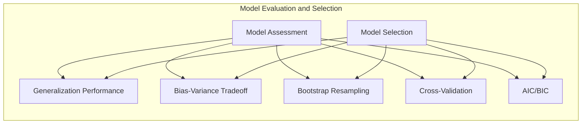
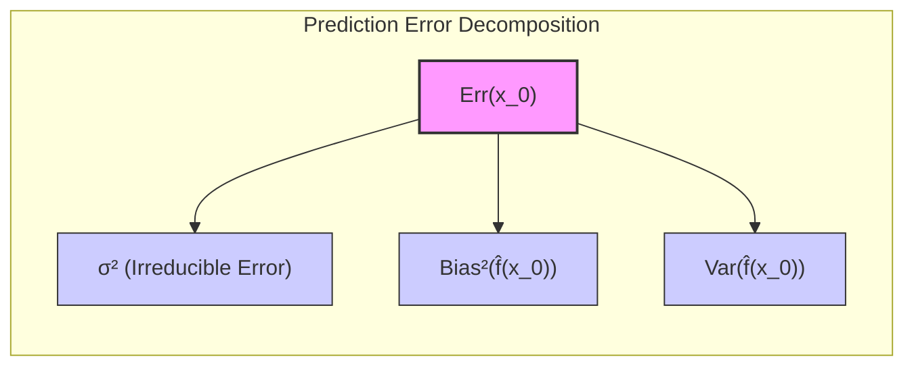
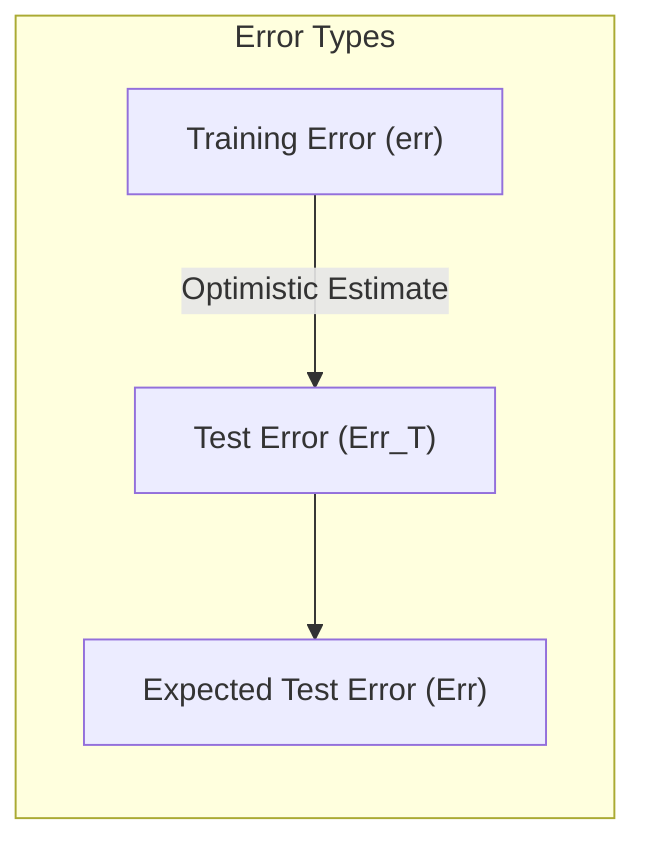
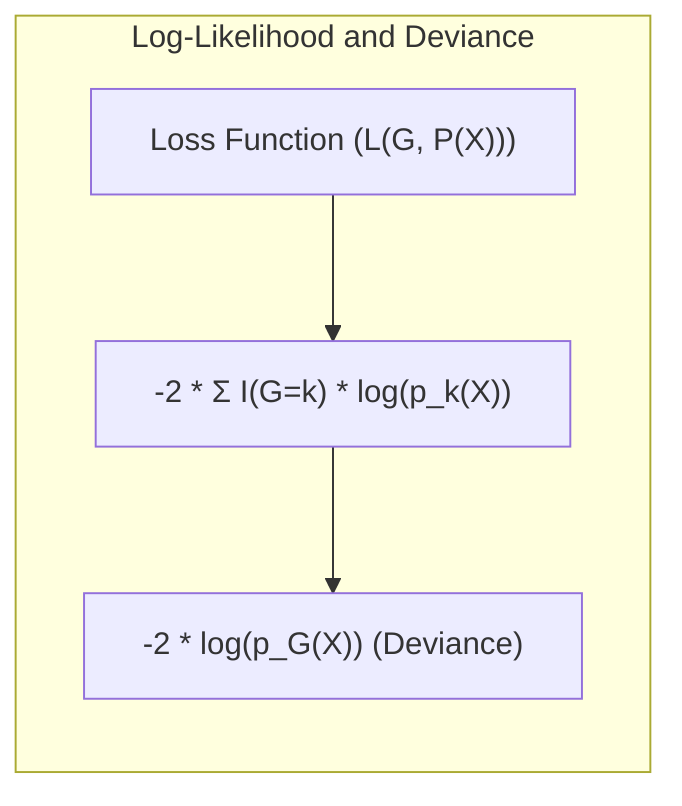
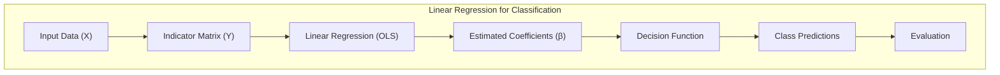
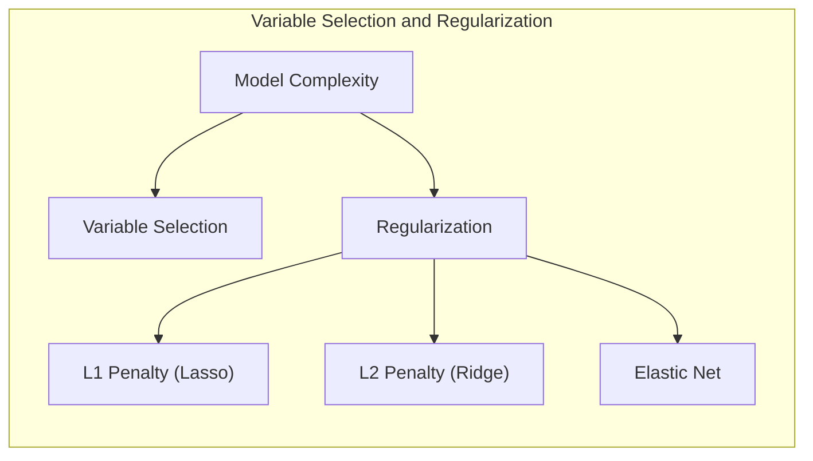
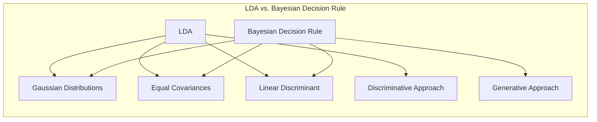
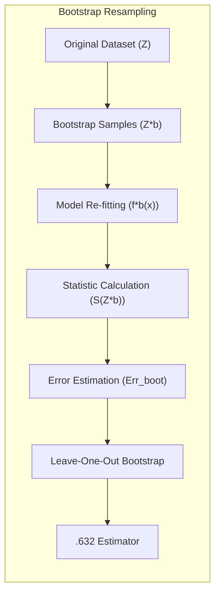

## Avaliação e Seleção de Modelos com Bootstrap Resampling



### Introdução
A capacidade de um método de aprendizado de generalizar, ou seja, prever resultados em dados de teste independentes, é crucial na prática [^7.1]. A avaliação dessa capacidade orienta a escolha de modelos e nos fornece uma medida da qualidade do modelo selecionado. Este capítulo aborda os principais métodos de avaliação de desempenho e como eles são utilizados na seleção de modelos, iniciando com a discussão do tradeoff entre **bias, variance e complexidade do modelo** [^7.1].

### Conceitos Fundamentais
**Conceito 1: Generalização e Erro de Predição**
A **generalização** de um modelo refere-se à sua capacidade de realizar previsões precisas em dados não vistos [^7.1]. O **erro de predição** é a métrica usada para quantificar o quão bem um modelo se ajusta aos dados de teste, medindo a discrepância entre as previsões e os valores reais. A complexidade do modelo afeta esse erro, com modelos simples tendendo a ter um alto *bias* e baixa *variance*, enquanto modelos complexos tendendo a ter baixo *bias* e alta *variance* [^7.2]. O objetivo é encontrar um equilíbrio entre os dois para minimizar o erro total. Um erro de previsão muito baixo nos dados de treinamento (um modelo "overfit") geralmente implica numa má generalização.

**Lemma 1:** A decomposição do erro de predição em *bias* e *variance*.
Dado um modelo $\hat{f}(X)$ estimado a partir de um conjunto de treinamento $T$ e um valor alvo $Y$, o erro de predição em um ponto $x_0$ pode ser decomposto em:
$$ Err(x_0) = E[(Y - \hat{f}(x_0))^2 | X = x_0] = \sigma^2 + Bias^2(\hat{f}(x_0)) + Var(\hat{f}(x_0)) $$
Onde $\sigma^2$ é a *variance* do erro irredutível, $Bias^2$ é o quadrado do *bias* (a diferença entre o valor esperado da estimativa e o valor verdadeiro) e $Var$ é a *variance* da estimativa [^7.3]. Este lemma fundamenta a compreensão de que modelos complexos podem reduzir o *bias*, mas aumentar a *variance*, e vice-versa. A prova formal detalhada está disponível na seção 7.3 do texto [^7.3]. $\blacksquare$



> 💡 **Exemplo Numérico:** Considere um cenário onde queremos prever a altura de uma pessoa (Y) com base no seu peso (X).
>
> 1. **Modelo Simples (Alto Bias, Baixa Variance):** Um modelo linear simples, $\hat{f}(X) = 1.0 + 0.1X$, pode não capturar bem a relação real, especialmente em pesos extremos. Suponha que a altura real para um peso de 80 kg seja 1.80m. O modelo pode prever, em média, 1.0 + 0.1 * 80 = 1.80m. Porém, devido a sua simplicidade, o modelo terá alta tendência (alto bias), e pouca variabilidade de estimativa em diferentes datasets (baixa variance).
>
> 2. **Modelo Complexo (Baixo Bias, Alta Variance):** Um modelo polinomial de alta ordem, $\hat{f}(X) = 0.5 + 0.2X - 0.001X^2$, pode se ajustar muito bem aos dados de treinamento, incluindo ruído, mas pode ter grande variação em diferentes amostras. Em uma amostra, pode prever 1.75m para 80kg e em outra amostra, 1.85m. O modelo, agora, terá baixa tendência (baixo bias), e alta variabilidade de estimativa (alta variance).
>
>  Vamos considerar que o valor real da altura para um peso de 80kg seja 1.80m, com um erro irredutível ($\sigma^2$) de 0.01.
>
>   - Para o **modelo simples**: $Bias^2$ pode ser (1.82-1.80)^2 = 0.0004 e a $Var$ ser 0.0001.
>    - Para o **modelo complexo**: $Bias^2$ pode ser (1.805-1.80)^2 = 0.000025 e a $Var$ ser 0.01.
>
>  Podemos calcular o erro em $x_0 = 80$ para ambos os modelos:
>
>  - $Err_{simples}(80) = 0.01 + 0.0004 + 0.0001 = 0.0105$
>   - $Err_{complexo}(80) = 0.01 + 0.000025 + 0.01 = 0.020025$
>
> Este exemplo ilustra que, embora o modelo complexo tenha um *bias* menor, a sua *variance* maior leva a um erro total maior, destacando o tradeoff entre *bias* e *variance*. Um modelo ideal buscaria um equilíbrio que minimize a soma dos dois componentes, incluindo o erro irredutível.
>
> ```mermaid
> graph LR
> A[Modelo Simples] -->|Alto Bias, Baixa Variance| B(Erro Total: 0.0105);
> C[Modelo Complexo] -->|Baixo Bias, Alta Variance| D(Erro Total: 0.020025);
> ```

**Conceito 2: Test Error, Expected Test Error e Training Error**
O **test error** ($Err_T$) é o erro de predição em um conjunto de teste específico, medido como a média da função de perda $L$ sobre os dados de teste, dados um conjunto de treinamento fixo $T$ [^7.2]:
$$Err_T = E[L(Y, f(X)) | T]$$
O **expected test error** ($Err$) é a média do test error sobre todos os possíveis conjuntos de treinamento [^7.2]:
$$Err = E[Err_T] = E[L(Y, f(X))]$$
O **training error** (*err*) é a média da função de perda sobre o conjunto de treinamento utilizado para ajustar o modelo [^7.2]:
$$err = \frac{1}{N}\sum_{i=1}^N L(Y_i, f(x_i))$$
O *training error* geralmente é uma estimativa otimista do *test error*, pois o modelo já está ajustado aos dados de treinamento [^7.2].



> 💡 **Exemplo Numérico:** Considere um modelo de regressão linear tentando prever o preço de uma casa com base no seu tamanho em metros quadrados.
>
> 1.  **Training Error:** Ajustamos o modelo linear em um conjunto de 100 casas e obtemos um erro quadrático médio de treinamento de *err* = 5000. Este erro é calculado usando os mesmos dados que foram usados para construir o modelo.
>
> 2.  **Test Error:** Avaliamos o mesmo modelo usando um conjunto de teste separado de 50 casas e obtemos um erro quadrático médio de *Err_T* = 7000. Este valor é maior do que o erro de treinamento, refletindo o fato de que o modelo não se ajustou tão bem em novos dados.
>
> 3.  **Expected Test Error:** Se repetirmos o processo várias vezes, selecionando diferentes conjuntos de treinamento e teste, e calculamos a média dos *test errors* obtidos, chegamos ao *expected test error*. Assumindo que isso foi feito 10 vezes, com *test errors* variando entre 6500 e 8000, podemos obter um *Err*  = 7200.
>
>  Este exemplo ilustra como o *training error* pode ser uma estimativa otimista do desempenho do modelo, e como o *test error* em um conjunto de teste específico pode diferir do erro médio esperado.

**Corolário 1:** A diferença entre *training error* e *test error*.
Devido ao sobreajuste (*overfitting*), o *training error* tende a ser menor que o *test error*, especialmente em modelos complexos. A diferença entre os dois erros é chamada de **otimismo**, que pode ser estimada para ajustar o *training error* e torná-lo um preditor mais acurado do erro de generalização [^7.4].

**Conceito 3: Log-Likelihood e Deviance**
Para respostas qualitativas ou categóricas, as **probabilidades** $p_k(X) = Pr(G = k | X)$ são modeladas para cada classe $k$. A **função de perda** ( *loss function* ) pode ser o *0-1 loss* ou o **log-likelihood** [^7.2]:
$$L(G, P(X)) = -2\sum_{k=1}^K I(G=k)\log(p_k(X)) = -2\log(p_G(X))$$
Onde o termo $-2 \times log-likelihood$ é frequentemente referido como **deviance**. O *training error* é a versão análoga da amostragem da log-likelihood [^7.2].



> 💡 **Exemplo Numérico:** Imagine que estamos classificando e-mails em duas categorias: "spam" e "não spam" (K=2).
>
> 1. **Modelo 1 (Pior):** Após treinar um modelo, para um e-mail que é realmente "spam" (G=1), o modelo prevê com probabilidade $p_1(X) = 0.1$ (spam) e $p_2(X) = 0.9$ (não spam).
>
> 2. **Modelo 2 (Melhor):** Para o mesmo e-mail "spam", um modelo melhor prevê com probabilidade $p_1(X) = 0.8$ (spam) e $p_2(X) = 0.2$ (não spam).
>
> A função de perda log-likelihood para o modelo 1 (pior) é:
>
> $L_1(G, P(X)) = -2 \log(0.1) \approx 4.60$
>
> A função de perda log-likelihood para o modelo 2 (melhor) é:
>
> $L_2(G, P(X)) = -2 \log(0.8) \approx 0.44$
>
> Como podemos ver, o modelo melhor (modelo 2), tem um menor valor para a função de perda log-likelihood, o que indica um melhor ajuste aos dados. Em uma amostra de 100 e-mails, a média do log-likelihood, ou deviance, seria usada para avaliar o desempenho geral do classificador.

> ⚠️ **Nota Importante**: A escolha da função de perda ( *loss function* ) influencia o comportamento do modelo e a interpretação dos erros.

> ❗ **Ponto de Atenção**: O *training error* tende a ser otimista, sendo necessário métodos para estimar corretamente o erro de generalização.

> ✔️ **Destaque**: As definições de *bias* e *variance* são adaptadas para regressão e classificação, mantendo a mesma lógica fundamental de tradeoff.

### Regressão Linear e Mínimos Quadrados para Classificação


A **regressão linear** aplicada a uma matriz de indicadores de classes é uma técnica que busca ajustar um modelo linear para cada classe, onde as variáveis dependentes representam a pertinência de uma observação a cada classe [^7.2]. Cada classe é codificada como um vetor de indicadores (1 para a classe correspondente, 0 para as demais), e a regressão é aplicada separadamente a cada vetor. Os **coeficientes** estimados por mínimos quadrados (OLS - *Ordinary Least Squares*) são usados para construir uma função discriminante linear que define as regiões de decisão.
Apesar de simples, essa abordagem pode sofrer algumas limitações:
1. **Extrapolação:** As previsões podem cair fora do intervalo [0,1], especialmente quando aplicado a dados fora do conjunto de treinamento.
2. **"Masking problem"**: Para mais de duas classes, o fato da função de regressão poder não representar o limiar para cada classe corretamente.
3. **Suposição de igual *variance* para todas as classes**: a qual pode não corresponder ao caso real, levando a uma modelagem inadequada da fronteira de decisão. [^7.3]

> 💡 **Exemplo Numérico:** Considere um problema de classificação com três classes (A, B, e C) usando duas variáveis preditoras (X1 e X2). Para utilizar regressão linear, primeiro transformamos a variável categórica de saída (Y) em três variáveis indicadoras: $Y_A$, $Y_B$, e $Y_C$.
>
>  | Observação | X1    | X2   | Classe (Y) | $Y_A$ | $Y_B$ | $Y_C$ |
>  | ---------- | ----- | ---- | ---------- | ----- | ----- | ----- |
>  | 1          | 2     | 3    | A          | 1     | 0     | 0     |
>  | 2          | 4     | 5    | B          | 0     | 1     | 0     |
>  | 3          | 6     | 7    | C          | 0     | 0     | 1     |
>  | 4          | 1     | 2    | A          | 1     | 0     | 0     |
>  | 5          | 3     | 4    | B          | 0     | 1     | 0     |
>
>  Aplicamos a regressão linear para cada classe, ou seja, três regressões independentes com as mesmas variáveis preditoras (X1 e X2), e as variáveis dependentes sendo $Y_A$, $Y_B$ e $Y_C$. Os resultados podem ser:
>
> $\hat{Y_A} =  0.8 - 0.1X_1 + 0.05X_2$
> $\hat{Y_B} =  0.1 + 0.2X_1 - 0.1X_2$
> $\hat{Y_C} =  0.2 - 0.1X_1 + 0.05X_2$
>
> Para classificar um novo ponto, por exemplo, (X1 = 5, X2 = 6), calcularíamos:
>
> $\hat{Y_A} = 0.8 - 0.1*5 + 0.05*6 = 0.8 - 0.5 + 0.3 = 0.6$
> $\hat{Y_B} = 0.1 + 0.2*5 - 0.1*6 = 0.1 + 1 - 0.6 = 0.5$
> $\hat{Y_C} = 0.2 - 0.1*5 + 0.05*6 = 0.2 - 0.5 + 0.3 = 0$
>
> A classe prevista seria A, pois tem o maior valor estimado. Este exemplo demonstra como a regressão linear pode ser usada para classificação, mas também destaca que os valores podem extrapolar os limites [0,1].

**Lemma 2:** Equivalência entre projeções de regressão linear e discriminantes lineares.
Em condições de covariâncias iguais e gaussianidade das distribuições de cada classe, o hiperplano de decisão obtido através da regressão linear da matriz de indicadores é equivalente ao obtido via Análise Discriminante Linear (LDA). Essa equivalência resulta da formulação matemática das funções discriminantes lineares em ambos os métodos e da otimização via mínimos quadrados na regressão linear. Essa equivalência serve para formalizar o uso de regressão linear para classificação com classes gaussianas [^7.3.1]. $\blacksquare$
**Corolário 2:** Simplificação da análise de modelos de classificação linear com covariâncias iguais.
Sob a condição de covariâncias iguais, a análise da função de decisão gerada pela regressão linear para classificação pode ser simplificada, pois ela se torna equivalente à projeção gerada pelo LDA. Este resultado demonstra que a escolha do método de classificação pode ser influenciada pelas premissas sobre as distribuições dos dados [^7.3.2].

“Em alguns cenários, a regressão logística pode fornecer estimativas mais estáveis de probabilidade, enquanto a regressão de indicadores pode levar a extrapolações fora de [0,1].” [^7.4]
“No entanto, há situações em que a regressão de indicadores é suficiente e até mesmo vantajosa quando o objetivo principal é a fronteira de decisão linear.” [^7.2]

### Métodos de Seleção de Variáveis e Regularização em Classificação


A **seleção de variáveis** e a **regularização** são técnicas essenciais para lidar com a complexidade dos modelos de classificação, especialmente quando se tem um grande número de preditores. A **regularização** adiciona termos de penalização à função de perda, limitando os coeficientes dos modelos para evitar o *overfitting* e promover a generalização.
A **penalização L1 (Lasso)**, por exemplo, adiciona à função de perda um termo proporcional à soma dos valores absolutos dos coeficientes, o que tende a gerar modelos com coeficientes esparsos, ou seja, com vários coeficientes iguais a zero, realizando assim uma seleção de variáveis implícita [^7.4.4].
A **penalização L2 (Ridge)** adiciona um termo proporcional à soma dos quadrados dos coeficientes, o que tende a encolher os coeficientes em direção a zero, reduzindo a *variance* e melhorando a estabilidade do modelo [^7.5].
Combinar as duas abordagens leva ao método **Elastic Net**, que herda as vantagens de ambas, a esparsidade da L1 e a estabilidade da L2 [^7.5].

> 💡 **Exemplo Numérico:** Imagine um modelo de regressão logística com muitos preditores, como o exemplo de classificação de pacientes com base em características genéticas. O objetivo é prever a probabilidade de uma pessoa desenvolver uma doença.
>
> 1. **Regressão Logística sem Regularização:**
>    $\text{Logit}(p) = \beta_0 + \beta_1 X_1 + \beta_2 X_2 + \ldots + \beta_{100} X_{100}$. O modelo sem regularização pode se ajustar muito bem ao conjunto de treinamento, mas generalizar mal.
>
> 2. **Regressão Logística com Penalização L1 (Lasso):**
>   $\text{Logit}(p) = \beta_0 + \beta_1 X_1 + \ldots + \beta_{100} X_{100} + \lambda \sum_{j=1}^{100} |\beta_j|$.
>   Se escolhermos um valor adequado de $\lambda$ (por exemplo, $\lambda = 0.1$), o Lasso pode zerar alguns coeficientes, por exemplo, $\beta_{3} = \beta_{10} = \beta_{25} = 0$. O modelo torna-se esparso, selecionando as variáveis mais relevantes:
>   $\text{Logit}(p) \approx \beta_0 + \beta_1 X_1 + \beta_2 X_2 + \beta_4 X_4 + \ldots$
>
> 3. **Regressão Logística com Penalização L2 (Ridge):**
>   $\text{Logit}(p) = \beta_0 + \beta_1 X_1 + \ldots + \beta_{100} X_{100} + \lambda \sum_{j=1}^{100} \beta_j^2$.
>   Com um valor adequado de $\lambda$ (por exemplo, $\lambda = 0.5$), o Ridge não zera os coeficientes, mas os encolhe em direção a zero, reduzindo sua influência e a variância do modelo.
>
> 4. **Elastic Net:** Uma combinação das duas penalidades, que tem as vantagens de esparsidade e estabilidade.
>
> Esta tabela compara os métodos:
>
> | Método       | Penalidade                               | Esparsidade | Estabilidade |
> |--------------|-----------------------------------------|-------------|-------------|
> | Sem Regularização | Nenhuma                                  | Não         | Baixa       |
> | Lasso        | $\lambda \sum_{j=1}^{p} |\beta_j|$         | Sim         | Média       |
> | Ridge        | $\lambda \sum_{j=1}^{p} \beta_j^2$      | Não         | Alta        |
> | Elastic Net | $\lambda_1 \sum_{j=1}^{p} |\beta_j| + \lambda_2 \sum_{j=1}^{p} \beta_j^2$ | Sim        | Alta       |

**Lemma 3:** A penalização L1 e a esparsidade.
A penalização L1 aplicada a modelos lineares, como a regressão logística, induz a esparsidade na solução, ou seja, muitos coeficientes da função discriminante tenderão a ser zero. Isso pode ser formalmente demonstrado pela análise das condições de otimalidade do problema de maximização de verossimilhança com a penalidade L1, pois a restrição da norma L1 leva a soluções com coeficientes em cantos (vertices) de um espaço de busca delimitado [^7.4.4]. $\blacksquare$
**Corolário 3:** Impacto da esparsidade na interpretabilidade.
A esparsidade induzida pela penalização L1 simplifica a análise do modelo de classificação, pois apenas um subconjunto relevante das variáveis de entrada contribui para a decisão, tornando o modelo mais interpretável e reduzindo a complexidade computacional [^7.4.5].

> ⚠️ **Ponto Crucial**: A combinação de regularizações L1 e L2, como no Elastic Net, permite ajustar tanto a esparsidade quanto a estabilidade do modelo.

### Separating Hyperplanes e Perceptrons
A ideia de **hiperplanos separadores** é fundamental em classificação linear, pois o objetivo é encontrar um hiperplano que divida o espaço de entrada em regiões correspondentes a diferentes classes. O objetivo passa a ser o de maximizar a margem de separação, que é a distância entre o hiperplano e os pontos mais próximos de cada classe (os *support vectors*). A formulação deste problema de otimização pode ser feita no espaço primal ou dual. A solução deste problema de otimização pode ser encontrada usando a técnica do **dual de Wolfe**. [^7.5.2]
O **Perceptron**, é um algoritmo para aprendizado de um classificador linear, originalmente introduzido por Rosenblatt [^7.5.1]. O algoritmo itera ajustando os pesos, e garante a convergência (sob condições de separabilidade linear) para um hiperplano que separa as classes no caso de dados linearmente separáveis [^7.5.1].

### Pergunta Teórica Avançada (Exemplo): Quais as diferenças fundamentais entre a formulação de LDA e a Regra de Decisão Bayesiana considerando distribuições Gaussianas com covariâncias iguais?
**Resposta:**
O LDA, sob suposições de gaussianidade e covariâncias iguais entre as classes, se torna equivalente à regra de decisão Bayesiana. A regra de decisão Bayesiana atribui uma observação à classe com maior probabilidade *a posteriori* dada a observação, e quando as distribuições são gaussianas, essa probabilidade pode ser expressa como uma função discriminante linear [^7.3]. O LDA estima os parâmetros desta função discriminante, e quando as covariâncias são iguais para todas as classes, a função resultante é linear. No entanto, o LDA é uma abordagem discriminativa, enquanto a regra de decisão Bayesiana é uma abordagem gerativa [^7.3.1]. As funções discriminantes lineares do LDA surgem da projeção das observações em um subespaço onde as classes são mais separáveis. No caso de covariâncias distintas entre as classes, a regra de decisão bayesiana leva a fronteiras quadráticas (QDA), e não lineares [^7.3].



**Lemma 4:** Equivalência formal entre LDA e Regra de Decisão Bayesiana com covariâncias iguais.
Sob a hipótese de distribuições gaussianas para as classes e covariâncias iguais, a função discriminante linear obtida via LDA é formalmente equivalente à função discriminante Bayesiana [^7.3], [^7.3.3]. Essa equivalência pode ser demonstrada por meio da derivação analítica de ambas as funções. $\blacksquare$

**Corolário 4:** Fronteiras quadráticas no QDA.
Ao relaxar a hipótese de covariâncias iguais entre as classes, a regra de decisão bayesiana leva a uma função discriminante quadrática, resultando em fronteiras de decisão não lineares entre as classes (QDA), e não lineares como no LDA [^7.3].

> ⚠️ **Ponto Crucial**: A diferença entre LDA e QDA reside nas suposições de covariâncias, com o LDA assumindo igualdade e gerando fronteiras lineares, enquanto o QDA relaxa essa premissa gerando fronteiras quadráticas [^7.3.1].

As perguntas devem ser altamente relevantes, podem envolver derivações matemáticas e provas, e focar em análises teóricas.

### Bootstrap Resampling

O **Bootstrap** é uma técnica de reamostragem que permite avaliar a acurácia estatística de uma estimativa, gerando múltiplas versões do conjunto de dados original através de amostragem com reposição [^7.11]. Essa técnica pode ser usada para estimar a distribuição do erro de previsão e outras estatísticas de interesse, fornecendo uma forma de avaliar a estabilidade do modelo.
O processo de bootstrap é como se segue:
1.  **Reamostragem:** A partir do conjunto de dados original $Z$, vários conjuntos de dados bootstrap $Z^{*b}$ são criados por amostragem com reposição. Cada conjunto $Z^{*b}$ tem o mesmo tamanho do conjunto original.
2.  **Reajuste do modelo:** O modelo é reajustado em cada conjunto $Z^{*b}$, produzindo um modelo $f^{*b}(x)$.
3.  **Avaliação:** A estatística de interesse $S(Z)$ é calculada em cada conjunto $Z^{*b}$, e as estatísticas $S(Z^{*b})$ são usadas para estimar a variabilidade da estimativa original $S(Z)$.
Para estimar o erro de predição, uma abordagem bootstrap é avaliar o quão bem um modelo ajustado em um conjunto de dados bootstrap $Z^{*b}$ prediz os dados do conjunto original, com $Err_{boot}$ sendo:
$$Err_{boot} = \frac{1}{BN}\sum_{b=1}^B\sum_{i=1}^N L(Y_i, f^{*b}(x_i))$$
Essa abordagem, no entanto, pode ser pessimista devido a sobreposição entre os conjuntos de dados de treinamento e teste [^7.11].

> 💡 **Exemplo Numérico:** Imagine que temos um conjunto de dados com 5 observações (N=5) representando o tempo de reação de um indivíduo a um estímulo visual (em segundos): Z = [0.5, 0.7, 0.6, 0.9, 0.8]. Nosso objetivo é estimar a média do tempo de reação e avaliar a incerteza dessa estimativa com bootstrap.
>
> 1. **Reamostragem:** Geramos 3 conjuntos de dados bootstrap (B=3) por amostragem com reposição:
>     - $Z^{*1}$ = [0.7, 0.8, 0.5, 0.8, 0.9]
>     - $Z^{*2}$ = [0.6, 0.6, 0.9, 0.7, 0.5]
>     - $Z^{*3}$ = [0.8, 0.9, 0.7, 0.8, 0.6]
>
> 2. **Reajuste do modelo:** Calculamos a média (nosso modelo simples) para cada conjunto bootstrap:
>     - $\mu^{*1} = 0.74$
>     - $\mu^{*2} = 0.66$
>     - $\mu^{*3} = 0.76$
>
> 3. **Avaliação:** A média original do conjunto de dados é $\mu = 0.7$. A distribuição das médias bootstrap ($0.74, 0.66, 0.76$) nos permite estimar a variabilidade da média original, um intervalo de confiança para a média original, ou calcular o erro padrão, etc.
>
> Para ilustrar o *Err_boot*, suponha que temos um modelo de regressão linear (muito simples para este exemplo, mas que serve para a ilustração) e a função de perda quadrática. Suponha também que as predições, nos 3 datasets bootstrap, para cada uma das 5 observações originais são dadas na seguinte tabela:
>
>  | Observação (i) | $Y_i$ | $f^{*1}(x_i)$ | $f^{*2}(x_i)$ | $f^{*3}(x_i)$ |
>  |---|---|---|---|---|
>  | 1 | 0.5 | 0.55 | 0.48 | 0.52 |
>  | 2 | 0.7 | 0.72 | 0.68 | 0.73 |
>  | 3 | 0.6 | 0.62 | 0.59 | 0.61 |
>  | 4 | 0.9 | 0.88 | 0.91 | 0.89 |
>  | 5 | 0.8 | 0.79 | 0.81 | 0.78 |
>
> Calculando o erro quadrático médio para cada observação e cada modelo, e somando-os, obtemos o erro *Err_boot* :
>
> $Err_{boot} = \frac{1}{3*5} [ (0.05^2 + 0.02^2 + 0.02^2) + (0.02^2 + 0.02^2 + 0.03^2) + (0.02^2 + 0.01^2 + 0.01^2) + (0.02^2 + 0.01^2 + 0.01^2) + (0.01^2 + 0.01^2 + 0.02^2) ] = 0.00026666...$
>
> Esse é o erro de previsão do modelo com bootstrap, e como o texto aponta, pode ser pessimista devido a sobreposição entre os conjuntos de dados de treinamento e teste.

O **leave-one-out bootstrap** (LOOB) é uma variação do bootstrap que evita essa sobreposição, avaliando a previsão de cada observação nos modelos gerados pelos conjuntos bootstrap onde essa observação não foi utilizada no treinamento:
$$Err^{(1)} = \frac{1}{N} \sum_{i=1}^N \frac{1}{|C^{-i}|} \sum_{b \in C^{-i}}L(Y_i, f^{*b}(x_i))$$
Onde $C^{-i}$ é o conjunto de *bootstrap samples* que não incluem a observação $i$.
A média de $Err^{(1)}$ tende a ser enviesada para cima