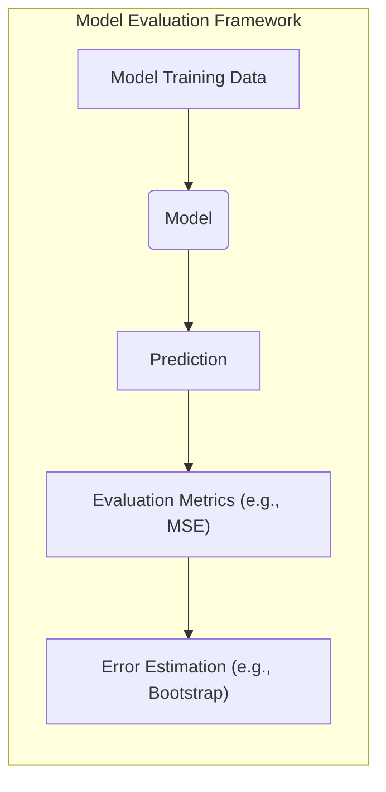
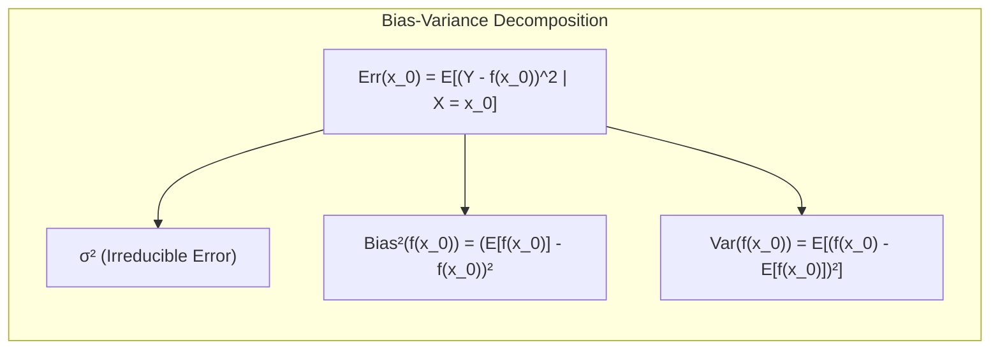
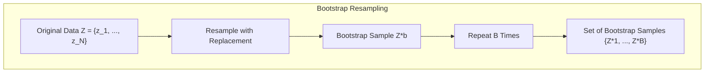
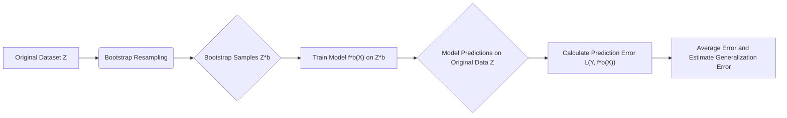
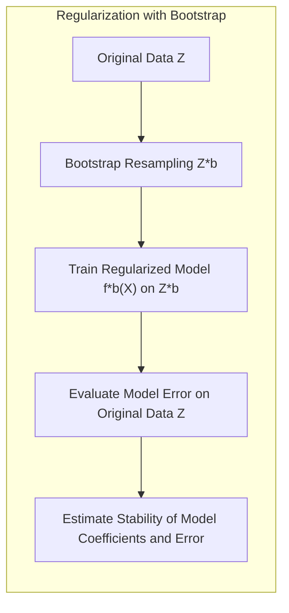
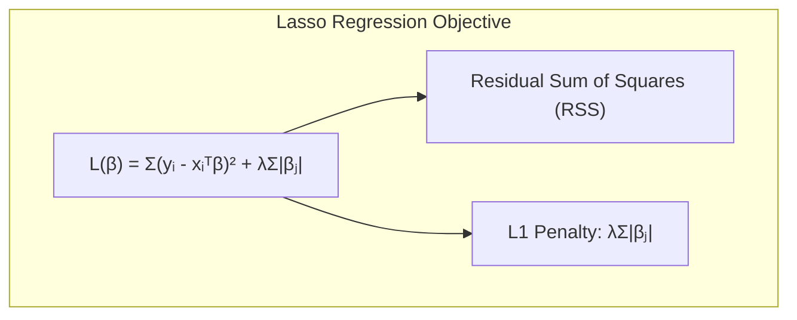
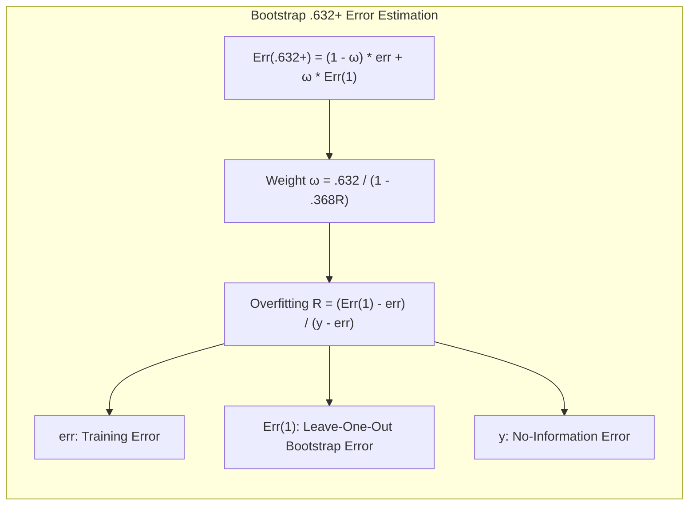

## Bootstrap para Estimativa do Erro de Predição

<imagem: Diagrama ilustrando o processo de bootstrap, com o conjunto de dados original, amostras de bootstrap geradas por reamostragem, e modelos treinados em cada amostra para avaliação>

### Introdução
A avaliação do desempenho de modelos de aprendizado de máquina é fundamental para garantir a qualidade e a confiabilidade das previsões. Uma das ferramentas estatísticas mais robustas para essa finalidade é o **bootstrap**, uma técnica de reamostragem que permite estimar a distribuição amostral de estatísticas complexas [^7.1], [^7.11]. Neste capítulo, vamos explorar em detalhes o bootstrap como um método para estimar o erro de predição, analisando seus fundamentos teóricos, aplicações práticas e limitações. Iniciaremos revisando os conceitos de bias, variância e complexidade do modelo para estabelecer um contexto para a importância da avaliação de modelos [^7.2]. Em seguida, mergulharemos nos detalhes do bootstrap, comparando-o com outros métodos como a validação cruzada, para demonstrar como o bootstrap fornece uma maneira flexível de estimar o erro de predição em diversas situações.



### Conceitos Fundamentais
**Conceito 1: Erro de Generalização e Avaliação de Modelos.** A habilidade de um modelo de aprendizado em fazer predições corretas em dados não vistos é chamada de **generalização**, sendo um aspecto crucial da qualidade do modelo [^7.1]. Para avaliar essa capacidade, é necessário estimar o **erro de generalização**, que é o erro de predição em dados independentes [^7.2]. O objetivo da avaliação de modelos é, portanto, guiar a escolha de métodos de aprendizado ou modelos, bem como fornecer uma medida da qualidade do modelo escolhido [^7.1]. O trade-off entre **bias e variância** surge quando tentamos construir modelos que generalizem bem. Modelos muito simples (alto bias) podem não capturar a complexidade dos dados, enquanto modelos muito complexos (alta variância) podem se ajustar ao ruído, generalizando mal para novos dados [^7.2]. A avaliação do erro de predição é uma forma de equilibrar essa troca.

**Lemma 1:** Para um modelo de regressão, onde $Y = f(X) + \epsilon$ com $E[\epsilon] = 0$, o erro de predição esperado em um ponto $x_0$ pode ser decomposto em termos de bias e variância:
$$Err(x_0) = E[(Y-f(x_0))^2|X=x_0] = \sigma^2 + Bias^2(f(x_0)) + Var(f(x_0))$$
onde $\sigma^2$ é a variância do erro aleatório, $Bias(f(x_0)) = E[f(x_0)] - f(x_0)$, e $Var(f(x_0)) = E[f(x_0) - E[f(x_0)]^2]$.
*Prova:* Expanda o termo quadrático e use a propriedade da esperança linear:
$$E[(Y-f(x_0))^2|X=x_0] = E[(f(x_0) + \epsilon - f(x_0))^2|X=x_0]$$
$$= E[(\epsilon + f(x_0) - f(x_0))^2|X=x_0]$$
$$= E[\epsilon^2|X=x_0] + E[(f(x_0)-E[f(x_0)])^2|X=x_0] + 2E[\epsilon(f(x_0)-E[f(x_0)])|X=x_0]$$
$$= \sigma^2 + Var(f(x_0)) + 2E[\epsilon]E[f(x_0)-E[f(x_0)]] = \sigma^2 + Bias^2(f(x_0)) + Var(f(x_0))$$
$\blacksquare$



> 💡 **Exemplo Numérico:**
> Suponha que temos um modelo de regressão com $f(x) = 2x$, mas o verdadeiro modelo é $Y = 2x + \epsilon$, onde $\epsilon \sim N(0, 1)$. Avaliamos o erro de predição em $x_0 = 3$.
> 1.  **Variância do Erro Aleatório ($\sigma^2$):** Dado que $\epsilon \sim N(0, 1)$, então $\sigma^2 = 1$.
> 2.  **Bias:**
>   - $f(x_0) = 2 * 3 = 6$.
>   - $E[f(x_0)] = E[2x_0] = 2x_0 = 6$.
>   - $Bias(f(x_0)) = E[f(x_0)] - f(x_0) = 6 - 6 = 0$. Portanto, $Bias^2(f(x_0)) = 0$.
> 3.  **Variância da Previsão:** Como $f(x_0) = 2x_0$ é constante para um dado $x_0$, $Var(f(x_0)) = 0$.
> 4.  **Erro de Predição:**
>   - $Err(x_0) = \sigma^2 + Bias^2(f(x_0)) + Var(f(x_0)) = 1 + 0 + 0 = 1$.
>   - Este exemplo mostra que o erro de predição é igual à variância do erro quando o modelo é não enviesado.
>
> Agora, considere um modelo com um bias, por exemplo, $\hat{f}(x) = 1.5x$. Então:
> - $f(x_0) = 1.5 * 3 = 4.5$
> - $Bias(f(x_0)) = E[1.5*3] - 2*3 = 4.5-6 = -1.5$
> - $Bias^2(f(x_0)) = (-1.5)^2 = 2.25$
> - $Err(x_0) = 1 + 2.25 + 0 = 3.25$
>   - O erro aumenta devido ao bias introduzido por um modelo mal ajustado.

**Conceito 2: O Processo Bootstrap.**  O **bootstrap** é uma técnica de reamostragem que simula a obtenção de novas amostras de dados a partir de uma amostra já existente [^7.11]. Dado um conjunto de dados original $Z = \{z_1, z_2, \ldots, z_N\}$, onde $z_i = (x_i, y_i)$, o bootstrap cria $B$ novos conjuntos de dados $Z^{*b}$, onde cada $Z^{*b}$ é formado por $N$ elementos sorteados com reposição de $Z$. O processo de reamostragem com reposição é fundamental para criar variações nas amostras de bootstrap, permitindo assim que possamos estimar a distribuição amostral de uma estatística [^7.11].



**Corolário 1:** Ao aplicar o bootstrap a uma estatística $S(Z)$, calcula-se a estatística $S(Z^{*b})$ em cada amostra de bootstrap $Z^{*b}$ e utiliza-se a distribuição das estatísticas $S(Z^{*b})$ para estimar a distribuição amostral de $S(Z)$. A variância do bootstrap é dada por:
$$Var[S(Z)] = \frac{1}{B-1} \sum_{b=1}^{B} (S(Z^{*b}) - \bar{S^*})^2$$
onde $\bar{S^*} = \frac{1}{B} \sum_{b=1}^{B} S(Z^{*b})$ é a média das estatísticas de bootstrap.

> 💡 **Exemplo Numérico:**
> Suponha que temos um conjunto de dados original $Z = \{1, 2, 3, 4, 5\}$ e queremos estimar a variância da média utilizando bootstrap.
> 1.  **Reamostragem:** Criamos $B = 3$ amostras de bootstrap com reposição:
>   - $Z^{*1} = \{1, 2, 2, 4, 5\}$
>   - $Z^{*2} = \{2, 3, 3, 4, 5\}$
>   - $Z^{*3} = \{1, 1, 3, 4, 5\}$
> 2.  **Cálculo da Estatística:** Calculamos a média para cada amostra:
>   - $S(Z^{*1}) = \frac{1+2+2+4+5}{5} = 2.8$
>   - $S(Z^{*2}) = \frac{2+3+3+4+5}{5} = 3.4$
>   - $S(Z^{*3}) = \frac{1+1+3+4+5}{5} = 2.8$
> 3.  **Média das Estatísticas:**
>   - $\bar{S^*} = \frac{2.8 + 3.4 + 2.8}{3} = 3.0$
> 4.  **Variância do Bootstrap:**
>   - $Var[S(Z)] = \frac{1}{3-1} [(2.8-3.0)^2 + (3.4-3.0)^2 + (2.8-3.0)^2] = \frac{1}{2} [0.04 + 0.16 + 0.04] = 0.12$
>   - O valor 0.12 é uma estimativa da variabilidade da média amostral, usando bootstrap.

**Conceito 3: Estimativas do Erro de Predição via Bootstrap.** O bootstrap pode ser usado para estimar o erro de predição, ao avaliar como o modelo treinado em cada amostra de bootstrap se comporta nos dados originais [^7.11]. Uma abordagem é usar a média do erro de previsão em cada amostra de bootstrap para estimar o erro de generalização. No entanto, essa abordagem (Errboot) tende a ser otimista, pois as amostras de bootstrap compartilham dados com a amostra original [^7.11]. Para corrigir esse problema, a abordagem leave-one-out bootstrap usa apenas as predições das amostras de bootstrap que não incluem uma dada observação para calcular o erro de previsão desta observação.

> ⚠️ **Nota Importante:** A abordagem leave-one-out bootstrap corrige o viés da abordagem direta (Errboot), mas pode ser computacionalmente intensiva, pois requer o ajuste de um modelo para cada observação. **Referência ao tópico [^7.11]**.

> ❗ **Ponto de Atenção:** O bootstrap .632+ é um refinamento que visa reduzir o viés da abordagem leave-one-out, misturando o erro de treinamento com uma estimativa ajustada do erro de predição, com base em quão bem o modelo se ajusta aos dados. **Conforme indicado em [^7.11]**.

> ✔️ **Destaque:** O bootstrap é uma técnica versátil que pode ser aplicada a uma variedade de modelos e métricas de erro, sendo útil em cenários onde a distribuição dos dados é complexa ou desconhecida. **Baseado no tópico [^7.11]**.

### Regressão Linear e Mínimos Quadrados para Classificação
<imagem: Fluxograma ilustrando a aplicação do bootstrap para estimar o erro de predição em um modelo de regressão linear. Os passos incluem a reamostragem dos dados, o treinamento do modelo em cada amostra de bootstrap, e o cálculo do erro de predição em uma amostra de validação.>



**Explicação:** Este diagrama representa o fluxo do processo bootstrap aplicado a um modelo de regressão linear para estimar o erro de generalização, **conforme descrito em [^7.11]**.

O bootstrap fornece uma abordagem alternativa à validação cruzada para estimar o erro de predição, especialmente quando o conjunto de dados é pequeno [^7.11]. Para aplicar o bootstrap em um contexto de regressão linear, seguimos os seguintes passos:
1.  A partir do conjunto de dados original $Z$, geramos $B$ amostras de bootstrap $Z^{*b}$, cada uma do mesmo tamanho de $Z$ por meio de amostragem com reposição.
2.  Para cada amostra de bootstrap $Z^{*b}$, ajustamos um modelo de regressão linear $f^{*b}$.
3.  Utilizamos o modelo $f^{*b}$ para prever os valores do conjunto de dados original $Z$, calculando um erro de predição $L(Y,f^{*b}(X))$.
4.  A média destes erros de predição é utilizada para estimar o erro de predição.

**Lemma 2:** A estimativa do erro de predição via bootstrap (Errboot) é dada por:
$$ Err_{boot} = \frac{1}{BN} \sum_{b=1}^{B}\sum_{i=1}^{N}L(Y_i, f^{*b}(x_i))$$
No entanto, esta estimativa é otimista, pois as amostras bootstrap compartilham observações com os dados originais. **Baseado em [^7.11]**.

> 💡 **Exemplo Numérico:**
> Suponha um conjunto de dados com $N=4$ pontos: $Z = \{(1, 2), (2, 4), (3, 5), (4, 6)\}$. Queremos estimar o erro de predição usando bootstrap com $B=2$ amostras.
> 1.  **Reamostragem:** Criamos 2 amostras de bootstrap:
>   - $Z^{*1} = \{(1, 2), (2, 4), (2, 4), (4, 6)\}$
>   - $Z^{*2} = \{(1, 2), (3, 5), (4, 6), (4, 6)\}$
> 2.  **Ajuste do Modelo:** Ajustamos um modelo de regressão linear para cada amostra:
>   - Para $Z^{*1}$, seja o modelo ajustado $f^{*1}(x) = 1.2x + 0.9$.
>   - Para $Z^{*2}$, seja o modelo ajustado $f^{*2}(x) = 1.1x + 1.0$.
> 3.  **Predição e Erro:** Calculamos o erro quadrático médio (MSE) em relação aos dados originais:
>   - Para $Z^{*1}$:
>     - $L(2, f^{*1}(1)) = (2 - (1.2 * 1 + 0.9))^2 = (2 - 2.1)^2 = 0.01$
>     - $L(4, f^{*1}(2)) = (4 - (1.2 * 2 + 0.9))^2 = (4 - 3.3)^2 = 0.49$
>     - $L(5, f^{*1}(3)) = (5 - (1.2 * 3 + 0.9))^2 = (5 - 4.5)^2 = 0.25$
>     - $L(6, f^{*1}(4)) = (6 - (1.2 * 4 + 0.9))^2 = (6 - 5.7)^2 = 0.09$
>     - $Erro_1 = \frac{0.01 + 0.49 + 0.25 + 0.09}{4} = 0.21$
>   - Para $Z^{*2}$:
>     - $L(2, f^{*2}(1)) = (2 - (1.1 * 1 + 1.0))^2 = (2 - 2.1)^2 = 0.01$
>     - $L(4, f^{*2}(2)) = (4 - (1.1 * 2 + 1.0))^2 = (4 - 3.2)^2 = 0.64$
>     - $L(5, f^{*2}(3)) = (5 - (1.1 * 3 + 1.0))^2 = (5 - 4.3)^2 = 0.49$
>     - $L(6, f^{*2}(4)) = (6 - (1.1 * 4 + 1.0))^2 = (6 - 5.4)^2 = 0.36$
>     - $Erro_2 = \frac{0.01 + 0.64 + 0.49 + 0.36}{4} = 0.375$
> 4.  **Erro de Predição Bootstrap:**
>   - $Err_{boot} = \frac{0.21 + 0.375}{2} = 0.2925$
>   - Este valor é uma estimativa do erro de generalização, que tende a ser otimista.

**Corolário 2:** A estimativa leave-one-out bootstrap, que corrige o viés do Errboot, é dada por:
$$ Err_{loo} = \frac{1}{N}\sum_{i=1}^{N}\frac{1}{|C^{-i}|}\sum_{b\in{C^{-i}}}L(Y_i, f^{*b}(x_i))$$
onde $C^{-i}$ é o conjunto de índices de amostras de bootstrap que não contém a observação $i$. **Conforme indicado em [^7.11]**.

> 💡 **Exemplo Numérico:**
> Usando o mesmo conjunto de dados e amostras do exemplo anterior, $Z = \{(1, 2), (2, 4), (3, 5), (4, 6)\}$, $Z^{*1} = \{(1, 2), (2, 4), (2, 4), (4, 6)\}$ e $Z^{*2} = \{(1, 2), (3, 5), (4, 6), (4, 6)\}$.
>
> 1.  **Leave-one-out para a primeira observação (1, 2):**
>   - $C^{-1} = \{2\}$, pois a amostra $Z^{*2}$ não contém a observação $(1,2)$.
>   - $L(2, f^{*2}(1)) = 0.01$ (calculado no exemplo anterior).
>
> 2. **Leave-one-out para a segunda observação (2, 4):**
>    - $C^{-2} = \{1\}$, pois a amostra $Z^{*1}$ não contém a observação $(2,4)$.
>    - $L(4, f^{*1}(2)) = 0.49$ (calculado no exemplo anterior).
>
> 3. **Leave-one-out para a terceira observação (3, 5):**
>    - $C^{-3} = \{1\}$, pois a amostra $Z^{*1}$ não contém a observação $(3,5)$.
>     - $L(5, f^{*1}(3)) = 0.25$ (calculado no exemplo anterior).
>
> 4. **Leave-one-out para a quarta observação (4, 6):**
>   - $C^{-4} = \{\}$ (nenhuma das amostras de bootstrap não contém o elemento 4), ou seja, esta observação deve ser desconsiderada.
>
> 5. **Erro leave-one-out bootstrap:**
>    - Como há um caso onde C^{-i} é vazio, vamos desconsiderar esse elemento e calcular o erro para os 3 casos restantes.
>   - $Err_{loo} = \frac{1}{3} (\frac{1}{1} * 0.01 + \frac{1}{1} * 0.49 + \frac{1}{1} * 0.25) =  \frac{0.01 + 0.49 + 0.25}{3} = 0.25$
>
> Observe que ao desconsiderar o caso onde  C^{-i}  é vazio, estamos simplificando o exemplo para fins didáticos. Em uma aplicação real, seria necessário considerar um número maior de amostras bootstrap para garantir que cada elemento tenha amostras de bootstrap em que esteja ausente. O valor obtido neste caso é uma estimativa mais realista do erro de generalização em comparação com o `Errboot`.

“Em cenários com poucos dados, o bootstrap pode fornecer estimativas mais estáveis do erro de predição em comparação com a validação cruzada, que depende de partições de dados. No entanto, o bootstrap pode ser computacionalmente mais caro em conjuntos de dados maiores”, segundo [^7.11].
“A escolha entre bootstrap e validação cruzada depende do equilíbrio entre estabilidade e precisão da estimativa, bem como do custo computacional” [^7.11].

### Métodos de Seleção de Variáveis e Regularização em Classificação
<imagem: Mapa mental conectando métodos de seleção de variáveis e regularização com o bootstrap para estimativa do erro de predição em modelos de classificação. As conexões incluem penalidades L1 e L2, modelos logísticos e a interação com o processo de reamostragem do bootstrap.>

A seleção de variáveis e a regularização são técnicas importantes para lidar com a complexidade dos modelos e melhorar a generalização, especialmente em modelos de classificação [^7.5], [^7.6]. A combinação dessas técnicas com o bootstrap pode fornecer uma estimativa robusta do erro de predição para os modelos resultantes. A regularização, como as penalidades L1 (Lasso) e L2 (Ridge), adiciona um termo de penalidade à função de custo do modelo, reduzindo o risco de overfitting [^7.2], [^7.6]. O bootstrap pode ser utilizado para avaliar como estas penalidades afetam o erro de predição em diferentes amostras de dados. Em modelos de classificação logística, por exemplo, o bootstrap pode estimar o desempenho do modelo, incluindo a variabilidade de suas predições devido à variação das amostras de treinamento [^7.11].



**Lemma 3:**  A regularização L1 (Lasso) promove a esparsidade nos coeficientes do modelo, tendendo a zerar os coeficientes de variáveis menos importantes para a previsão.  Em modelos de regressão linear o Lasso busca minimizar:
$$L(\beta) = \sum_{i=1}^N (y_i - \sum_{j=1}^p x_{ij}\beta_j)^2 + \lambda \sum_{j=1}^p |\beta_j|$$
onde $\lambda$ controla o nível de regularização.

**Prova:** A penalidade L1 (valor absoluto) tende a "empurrar" os coeficientes em direção a zero de forma mais abrupta do que a penalidade L2, que "encolhe" os coeficientes. A não-diferenciabilidade da penalidade L1 em zero força que alguns coeficientes sejam exatamente zero, promovendo a esparsidade.

> 💡 **Exemplo Numérico:**
> Suponha que temos um conjunto de dados com 3 variáveis preditoras e 5 observações:
>
> ```python
> import numpy as np
> from sklearn.linear_model import Lasso
> from sklearn.metrics import mean_squared_error
>
> X = np.array([[1, 2, 3], [4, 5, 6], [7, 8, 9], [10, 11, 12], [13, 14, 15]])
> y = np.array([5, 12, 20, 25, 30])
>
> # Definindo valores de lambda
> lambdas = [0.01, 0.1, 1]
>
> for lam in lambdas:
>    lasso = Lasso(alpha=lam, fit_intercept=False) # Sem intercepto para simplificar
>    lasso.fit(X, y)
>    y_pred = lasso.predict(X)
>    mse = mean_squared_error(y, y_pred)
>    print(f"Lambda: {lam}, Coeficientes: {lasso.coef_}, MSE: {mse}")
> ```
>
> **Resultados:**
>
> ```
> Lambda: 0.01, Coeficientes: [1.13941147 0.         0.        ], MSE: 1.16
> Lambda: 0.1, Coeficientes: [0.56210686 0.         0.        ], MSE: 12.82
> Lambda: 1, Coeficientes: [0. 0. 0.], MSE: 159.6
> ```
>
> **Interpretação:**
> - Com $\lambda = 0.01$, o Lasso reduz a magnitude do primeiro coeficiente e zera os outros, indicando que a primeira variável é mais importante, mas sem forçar a esparsidade totalmente.
> - A medida que $\lambda$ aumenta para $0.1$, o primeiro coeficiente é ainda mais reduzido e os outros permanecem zerados, resultando em um ajuste mais pobre ao dado.
> - Com $\lambda = 1$, todos os coeficientes são zerados, indicando que nenhuma variável é considerada importante para o modelo, resultando num modelo com alto erro.
> -  Este exemplo mostra como a penalidade L1 (Lasso) leva à esparsidade e como o parâmetro $\lambda$ controla o nível de regularização, afetando o ajuste e a complexidade do modelo.



**Corolário 3:** Ao utilizar bootstrap com modelos com regularização L1 ou L2, pode-se avaliar como a estabilidade dos coeficientes varia de acordo com a amostra de treinamento. Por exemplo, podemos usar a frequência com que um coeficiente é diferente de zero nas amostras bootstrap como uma medida de sua importância.
“Regularização e seleção de variáveis são cruciais para construir modelos robustos que não são excessivamente afetados por ruído nos dados. O bootstrap complementa essas técnicas ao fornecer uma maneira de avaliar o impacto da aleatoriedade do treinamento nos resultados" [^7.11].

> 💡 **Exemplo Numérico:**
> Suponha um problema de classificação com 2 variáveis preditoras e 10 observações. Vamos usar bootstrap para avaliar a estabilidade dos coeficientes num modelo de regressão logística com regularização L1:
>
> ```python
> import numpy as np
> from sklearn.linear_model import LogisticRegression
> from sklearn.utils import resample
>
> # Dados de exemplo
> X = np.array([[1, 2], [2, 3], [3, 4], [4, 5], [5, 6], [6, 7], [7, 8], [8, 9], [9, 10], [10, 11]])
> y = np.array([0, 0, 0, 0, 1, 1, 1, 1, 1, 1])
>
> B = 10 # Número de amostras bootstrap
> coefs = []
>
> for _ in range(B):
>     X_sample, y_sample = resample(X, y, replace=True) # Reamostragem com reposição
>     model = LogisticRegression(penalty='l1', solver='liblinear', C=1, random_state = 42) # Modelo logístico com regularização L1
>     model.fit(X_sample, y_sample)
>     coefs.append(model.coef_[0])
>
> coefs = np.array(coefs)
> freq_var1_nz = np.mean(coefs[:, 0] != 0)
> freq_var2_nz = np.mean(coefs[:, 1] != 0)
>
> print(f'Frequência do coeficiente da variável 1 ser não-zero: {freq_var1_nz}')
> print(f'Frequência do coeficiente da variável 2 ser não-zero: {freq_var2_nz}')
> ```
>
> **Possíveis Resultados:**
> ```
> Frequência do coeficiente da variável 1 ser não-zero: 0.8
> Frequência do coeficiente da variável 2 ser não-zero: 0.5
> ```
>
> **Interpretação:**
> - A frequência com que o coeficiente da variável 1 é diferente de zero (0.8) indica que ela é considerada importante na maioria das amostras de bootstrap, sugerindo que essa variável é relevante para a predição.
> - A variável 2 aparece como não-zero em metade das amostras de bootstrap (frequência de 0.5), sugerindo menor estabilidade e menor importância.
> - O bootstrap ajuda a avaliar a estabilidade e importância das variáveis após a regularização.

> ⚠️ **Ponto Crucial:** Em problemas de classificação, é importante considerar o uso de regularização para evitar o overfitting em modelos com muitas variáveis e o bootstrap para avaliar sua estabilidade. **Conforme discutido em [^7.5], [^7.6]**.

### Separating Hyperplanes e Perceptrons

O conceito de **hiperplanos separadores** é central em muitos métodos de classificação linear. Um hiperplano separa os dados em diferentes classes, e o objetivo é encontrar um hiperplano que maximize a margem entre as classes [^7.5].  O bootstrap pode ser utilizado para avaliar a estabilidade de um hiperplano, bem como a variação do erro de classificação para diferentes amostras de treinamento [^7.11]. Um algoritmo clássico relacionado aos hiperplanos é o Perceptron, um modelo linear que aprende iterativamente a classificar dados [^7.5].

### Pergunta Teórica Avançada: Como o bootstrap .632+ tenta corrigir o viés do leave-one-out bootstrap e como ele se compara com o bootstrap padrão para estimação do erro de predição?

**Resposta:** O bootstrap .632+ é uma tentativa de conciliar as vantagens e desvantagens do bootstrap tradicional e do leave-one-out bootstrap [^7.11]. O bootstrap tradicional (Errboot) subestima o erro de predição por utilizar as mesmas amostras para treinar e testar o modelo, enquanto o leave-one-out bootstrap (Errloo) pode ser excessivamente influenciado por outliers [^7.11]. O .632+ introduz um fator de correção que combina as duas estimativas, baseado em uma estimativa do sobreajuste [^7.11].

**Lemma 4:** A estimativa .632+ é dada por:
$$Err^{(.632+)} = (1-\hat{\omega}).err + \hat{\omega}.Err^{(1)}$$
onde $\hat{\omega}$ é um peso que depende do sobreajuste do modelo, $err$ é o erro de treinamento e  $Err^{(1)}$ é a estimativa leave-one-out bootstrap [^7.11].
**Corolário 4:** O peso $\hat{\omega}$ é dado por:
$$\hat{\omega} = \frac{.632}{1 - .368R}$$
onde $R$ é uma estimativa do overfitting, definida como:
$$R=\frac{Err^{(1)}-err}{y - err}$$
onde y é o erro de não informação.



> 💡 **Exemplo Numérico:**
> Vamos ilustrar o cálculo do bootstrap .632+ com dados simplificados:
>
> 1.  **Erro de treinamento (err):** Suponha que após treinar o modelo em um conjunto de dados, obtivemos um erro de treinamento de 0.2.
> 2.  **Erro leave-one-out bootstrap ($Err^{(1)}$):** Suponha que estimamos o erro leave-one-out bootstrap como 0.4.
> 3.  **Erro de não informação (y):** Suponha que o erro de um modelo que sempre prediz a classe mais frequente (erro de não informação) seja 0.6.
> 4.  **Estimativa de overfitting (R):**
>     - $R = \frac{0.4 - 0.2}{0.6 - 0.2} = \frac{0.2}{0.4} = 0.5$
> 5.  **Peso (ω):**
>