## Avaliação e Seleção de Modelos: Foco no Bootstrap Leave-One-Out
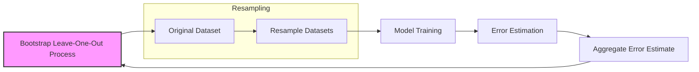

### Introdução
A avaliação do desempenho de um método de aprendizado estatístico é fundamental para garantir sua capacidade de generalização em dados não vistos. A escolha de um método ou modelo específico, bem como a medição da qualidade da solução final, são etapas cruciais no processo de modelagem [^7.1]. Este capítulo explora métodos para avaliação de desempenho e seleção de modelos, começando com uma discussão sobre a relação entre viés, variância e complexidade do modelo. 

### Conceitos Fundamentais
**Conceito 1: Desempenho de Generalização**
O desempenho de generalização de um modelo de aprendizado refere-se à sua capacidade de fazer previsões precisas em dados de teste independentes, ou seja, dados que não foram usados no treinamento. A avaliação desse desempenho é essencial na prática, pois orienta a seleção do método de aprendizado ou modelo e fornece uma medida da qualidade do modelo escolhido [^7.1]. A dificuldade reside no fato de que um modelo muito simples pode ter um alto viés, enquanto um modelo muito complexo pode ter alta variância e superajustar os dados de treinamento. A complexidade do modelo está intrinsecamente ligada ao balanço entre viés e variância [^7.2]. Um modelo mais complexo tende a se ajustar melhor aos dados de treinamento, reduzindo o viés, mas aumenta a variância. Por outro lado, um modelo mais simples pode ter um viés maior, mas menor variância. O objetivo é encontrar a complexidade do modelo que minimiza o erro de teste esperado.
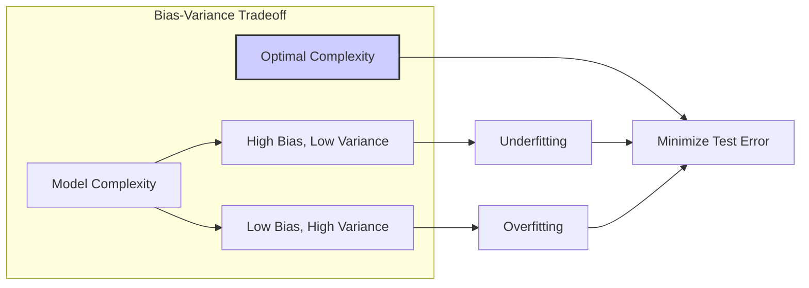
**Lemma 1:** *A complexidade do modelo afeta diretamente o trade-off entre viés e variância.*
Um modelo com alta complexidade tem alta variância e baixo viés e um modelo com baixa complexidade tem baixo viés e alta variância. A complexidade é ajustada para minimizar o erro de generalização.

**Prova do Lemma 1**: Considere a decomposição do erro de generalização como a soma do viés ao quadrado, a variância e o erro irredutível [^7.3]. $$Err(x_0) = \sigma^2 + Bias^2(f(x_0)) + Var(f(x_0))$$ O viés diminui com o aumento da complexidade do modelo, pois o modelo se torna mais capaz de se ajustar aos dados. A variância, por outro lado, aumenta com o aumento da complexidade, pois o modelo se torna mais sensível às flutuações nos dados de treinamento. A complexidade ideal é alcançada quando a soma do viés ao quadrado e da variância é minimizada [^7.3]. $\blacksquare$
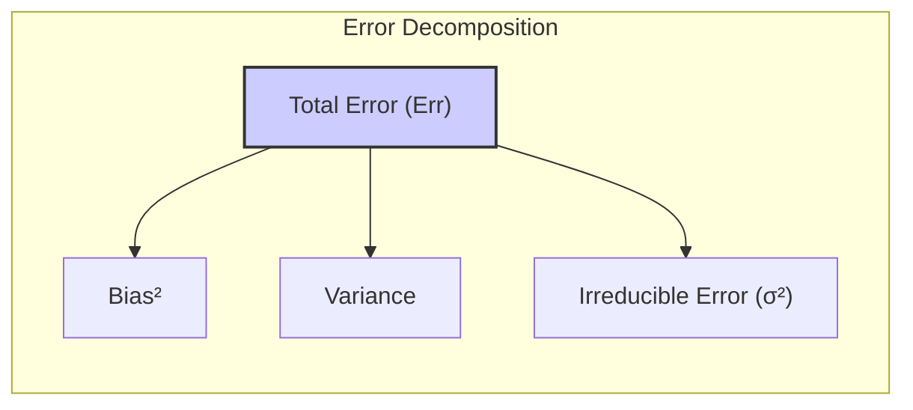

> 💡 **Exemplo Numérico:**
> Vamos considerar um cenário onde temos um conjunto de dados com 100 pontos gerados a partir de uma função quadrática com algum ruído. Ajustaremos dois modelos: um modelo linear simples e um modelo polinomial de grau 5.
>
> ```python
> import numpy as np
> import matplotlib.pyplot as plt
> from sklearn.linear_model import LinearRegression
> from sklearn.preprocessing import PolynomialFeatures
> from sklearn.metrics import mean_squared_error
>
> # Gerar dados simulados
> np.random.seed(42)
> X = np.linspace(-3, 3, 100).reshape(-1, 1)
> y = 2 * X**2 + 3 + np.random.normal(0, 5, size=(100, 1))
>
> # Modelo linear
> linear_model = LinearRegression()
> linear_model.fit(X, y)
> y_pred_linear = linear_model.predict(X)
> mse_linear = mean_squared_error(y, y_pred_linear)
>
> # Modelo polinomial de grau 5
> poly = PolynomialFeatures(degree=5)
> X_poly = poly.fit_transform(X)
> poly_model = LinearRegression()
> poly_model.fit(X_poly, y)
> y_pred_poly = poly_model.predict(X_poly)
> mse_poly = mean_squared_error(y, y_pred_poly)
>
> # Visualização
> plt.figure(figsize=(10, 6))
> plt.scatter(X, y, label='Dados Reais')
> plt.plot(X, y_pred_linear, color='red', label=f'Modelo Linear (MSE: {mse_linear:.2f})')
> plt.plot(X, y_pred_poly, color='green', label=f'Modelo Polinomial (MSE: {mse_poly:.2f})')
> plt.xlabel('X')
> plt.ylabel('y')
> plt.legend()
> plt.title('Comparação de Modelos: Viés vs Variância')
> plt.show()
>
> print(f"MSE do Modelo Linear: {mse_linear:.2f}")
> print(f"MSE do Modelo Polinomial: {mse_poly:.2f}")
> ```
>
> **Interpretação:** O modelo linear (linha vermelha) tem um alto viés, pois não consegue capturar a relação quadrática dos dados, resultando em um MSE maior. O modelo polinomial de grau 5 (linha verde), por outro lado, tem um erro de treinamento menor, mas, como é um modelo mais complexo,  poderia sofrer de alta variância em novos dados. O gráfico ilustra o trade-off entre viés e variância, mostrando que um modelo muito simples subajusta os dados, e um modelo muito complexo superajusta os dados.

**Conceito 2: Erro de Teste e Erro de Treinamento**
O erro de teste, também chamado de erro de generalização, é o erro de previsão em uma amostra de teste independente, denotado como $Err_T$ [^7.2]. Ele mede a capacidade do modelo de generalizar para dados não vistos e é definido como:
$$Err_T = E[L(Y, f(X))|T]$$
onde $T$ representa o conjunto de treinamento, e $L$ a função de perda. Em contraste, o erro de treinamento, $err$, é a perda média sobre a amostra de treinamento [^7.2]:
$$err = \frac{1}{N} \sum_{i=1}^N L(Y_i, f(x_i))$$
É importante ressaltar que o erro de treinamento geralmente não é uma boa estimativa do erro de teste. O erro de treinamento tende a diminuir com a complexidade do modelo, chegando até a zero, enquanto o erro de teste apresenta um comportamento em forma de "U", com um mínimo em algum nível de complexidade do modelo [^7.2]. Isso ocorre porque um modelo que se ajusta perfeitamente aos dados de treinamento pode não ter boa capacidade de generalização.
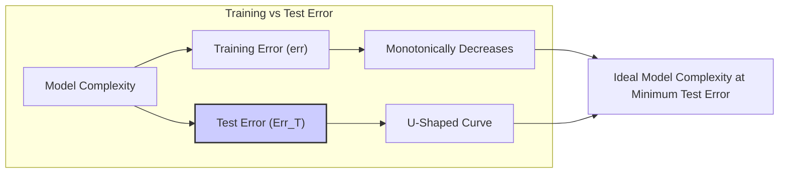
**Corolário 1:** *A minimização do erro de treinamento não garante a minimização do erro de teste.*
Um modelo que se ajusta bem aos dados de treinamento (baixo erro de treinamento) não necessariamente generaliza bem para novos dados (alto erro de teste).

> 💡 **Exemplo Numérico:**
> Para ilustrar a diferença entre erro de treinamento e erro de teste, vamos dividir os dados simulados do exemplo anterior em conjuntos de treinamento e teste, e avaliar os dois modelos nos dois conjuntos.
>
> ```python
> from sklearn.model_selection import train_test_split
>
> # Divisão dos dados
> X_train, X_test, y_train, y_test = train_test_split(X, y, test_size=0.3, random_state=42)
>
> # Modelo linear
> linear_model.fit(X_train, y_train)
> y_pred_train_linear = linear_model.predict(X_train)
> y_pred_test_linear = linear_model.predict(X_test)
> mse_train_linear = mean_squared_error(y_train, y_pred_train_linear)
> mse_test_linear = mean_squared_error(y_test, y_pred_test_linear)
>
> # Modelo polinomial
> poly_model.fit(poly.fit_transform(X_train), y_train)
> y_pred_train_poly = poly_model.predict(poly.transform(X_train))
> y_pred_test_poly = poly_model.predict(poly.transform(X_test))
> mse_train_poly = mean_squared_error(y_train, y_pred_train_poly)
> mse_test_poly = mean_squared_error(y_test, y_pred_test_poly)
>
> print(f"Modelo Linear: MSE Treino = {mse_train_linear:.2f}, MSE Teste = {mse_test_linear:.2f}")
> print(f"Modelo Polinomial: MSE Treino = {mse_train_poly:.2f}, MSE Teste = {mse_test_poly:.2f}")
>
> # Gráfico com Erro de Treino e Teste
> plt.figure(figsize=(10, 6))
> plt.plot([1, 2], [mse_train_linear, mse_train_poly], marker='o', label='Erro de Treino')
> plt.plot([1, 2], [mse_test_linear, mse_test_poly], marker='o', label='Erro de Teste')
> plt.xticks([1, 2], ['Modelo Linear', 'Modelo Polinomial'])
> plt.ylabel('MSE')
> plt.title('Comparação do Erro de Treino e Teste')
> plt.legend()
> plt.show()
> ```
>
> **Interpretação:** Observamos que o erro de treinamento para o modelo polinomial é menor do que o do modelo linear, mas o erro de teste é comparável (ou pode ser até maior). Isso ilustra que minimizar o erro de treinamento não garante a minimização do erro de teste, pois o modelo polinomial pode estar superajustando os dados de treino,  não generalizando bem para os dados de teste.

**Conceito 3: Otimismo da Taxa de Erro de Treinamento**
O erro de treinamento é uma estimativa otimista do erro de teste, pois o mesmo conjunto de dados é usado para treinar e avaliar o modelo. O otimismo da taxa de erro de treinamento, denotado por $op$, é definido como a diferença entre o erro in-sample, $Err_{in}$, e o erro de treinamento, $err$ [^7.4]:
$$op = Err_{in} - err$$
O erro in-sample, $Err_{in}$, é definido como:
$$Err_{in} = \frac{1}{N}\sum_{i=1}^N E_{Y_0}[L(Y_0, f(x_i))|T]$$
O otimismo mede o viés de estimativa do erro de treinamento como estimador do erro de teste. O otimismo médio, $w$, é o valor esperado do otimismo sobre os conjuntos de treinamento [^7.4]:
$$w = E_Y(op)$$
O otimismo aumenta conforme a complexidade do modelo aumenta e conforme o tamanho da amostra de treinamento diminui [^7.4].
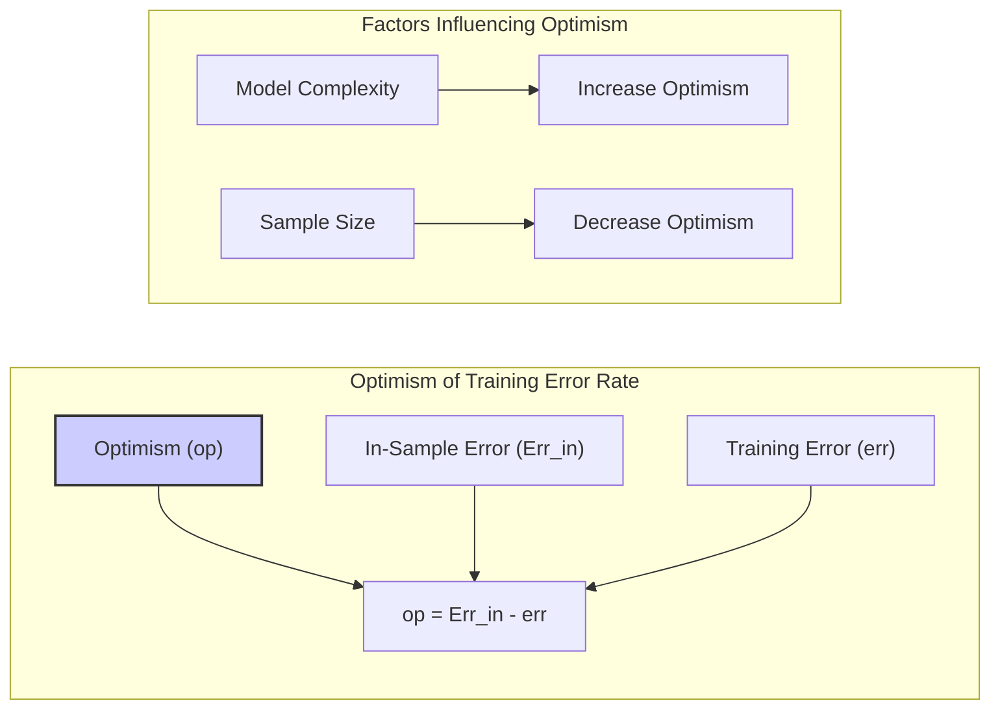

> ⚠️ **Nota Importante**: O erro de treinamento é sempre uma estimativa otimista do erro de generalização, pois o modelo é avaliado nos mesmos dados usados para o treinamento [^7.4].
> ❗ **Ponto de Atenção**: O otimismo da taxa de erro de treinamento pode ser estimado para corrigir essa superestimação do modelo [^7.4].
> ✔️ **Destaque**: O otimismo é maior para modelos mais complexos e com tamanhos de amostra menores [^7.4].

### Regressão Linear e Mínimos Quadrados para Classificação
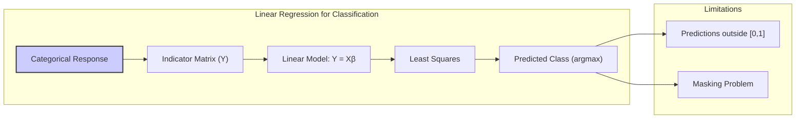
A regressão linear pode ser usada para problemas de classificação, embora não seja sua aplicação principal. Nesse contexto, uma matriz indicadora é usada para codificar a variável de resposta categórica. Por exemplo, se temos $K$ classes, podemos criar $K$ colunas na matriz indicadora, onde cada linha tem um '1' na coluna correspondente à classe a que a observação pertence, e '0' nas outras colunas [^7.2]. Um modelo linear é então ajustado por mínimos quadrados, buscando minimizar a soma dos erros ao quadrado entre as previsões e os valores reais da matriz indicadora [^7.2]. As previsões resultantes podem ser usadas para determinar a classe prevista com base na coluna com maior valor. Embora seja uma abordagem simples e eficiente para gerar fronteiras de decisão lineares, a regressão linear para classificação apresenta algumas limitações. O método pode produzir previsões fora do intervalo [0,1], o que não é desejável para probabilidades.

**Lemma 2:** *A regressão de indicadores pode ser vista como uma forma de projetar os dados em um espaço onde as classes são "mais separáveis".*
Ao aplicar regressão linear em uma matriz de indicadores, o modelo está implicitamente projetando os dados em um espaço onde as classes são melhor representadas por suas médias e onde as diferenças são mais evidentes.

**Prova do Lemma 2:** Seja $Y$ uma matriz indicadora, com linhas representando observações e colunas representando classes. A regressão linear ajusta o modelo $Y = X\beta$, onde $X$ é a matriz de preditores e $\beta$ são os coeficientes. A solução de mínimos quadrados para $\beta$ é dada por:
$$\hat{\beta} = (X^TX)^{-1}X^TY$$
As previsões $\hat{Y}$ podem ser vistas como uma projeção das observações no espaço das classes, onde as coordenadas são as médias dos preditores para cada classe. Essa projeção maximiza a variância entre as classes, tornando-as mais separáveis. $\blacksquare$
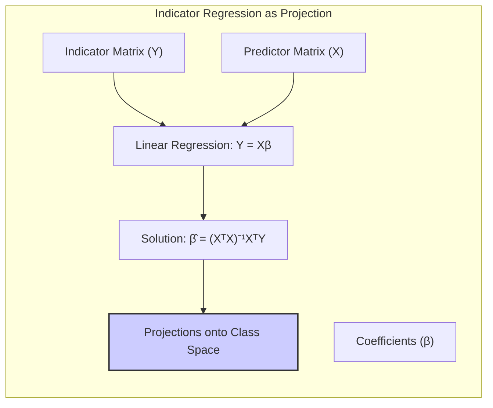

> 💡 **Exemplo Numérico:**
>
> Suponha que temos um conjunto de dados com 3 classes e 2 preditores (x1 e x2). A matriz de indicadores Y será uma matriz com 3 colunas, onde cada linha terá um '1' na coluna da sua classe e '0' nas outras.
> ```python
> import numpy as np
> import pandas as pd
> from sklearn.linear_model import LinearRegression
>
> # Dados de exemplo
> data = {'x1': [1, 2, 3, 4, 5, 6, 1.5, 2.5, 3.5],
>         'x2': [1, 2, 1, 2, 1, 2, 3, 3, 3],
>         'classe': [0, 0, 0, 1, 1, 1, 2, 2, 2]}
> df = pd.DataFrame(data)
>
> # Matriz de preditores
> X = df[['x1', 'x2']].values
>
> # Matriz de indicadores
> y = pd.get_dummies(df['classe']).values
>
> # Regressão Linear
> model = LinearRegression()
> model.fit(X, y)
>
> # Previsões
> y_pred = model.predict(X)
>
> print("Matriz de Indicadores (y):\n", y)
> print("\nPrevisões (y_pred):\n", y_pred)
>
> #Determinar a classe prevista baseado no maior valor predito
> predicted_classes = np.argmax(y_pred, axis=1)
> print("\nClasses Preditas:\n", predicted_classes)
> print("\nClasses Reais:\n", df['classe'].values)
>
> ```
> **Interpretação:** A regressão linear busca encontrar uma relação linear entre os preditores e a matriz de indicadores. As previsões geradas (y_pred) são usadas para determinar a classe prevista. Cada observação é classificada na classe correspondente à coluna com o maior valor predito. Este exemplo mostra como os dados são "projetados" no espaço das classes.
>
**Corolário 2:** *Em algumas condições, a regressão de indicadores pode gerar fronteiras de decisão semelhantes a outras técnicas de classificação linear.*
Quando as classes são bem separáveis, as projeções geradas pela regressão de indicadores podem levar a fronteiras de decisão semelhantes àquelas encontradas com métodos como LDA.
A regressão de indicadores sofre do chamado "masking problem". Esse problema ocorre quando os preditores são altamente correlacionados com classes que não são as que estamos tentando prever [^7.3]. Isso pode levar a um desempenho ruim do modelo, pois ele pode ser induzido a classificar erroneamente observações em classes correlacionadas. Além disso, a regressão de indicadores pode levar a extrapolações fora do intervalo [0,1], o que é problemático quando interpretamos os valores como probabilidades. Por essas razões, outros métodos como a regressão logística são frequentemente preferidos para classificação [^7.4].
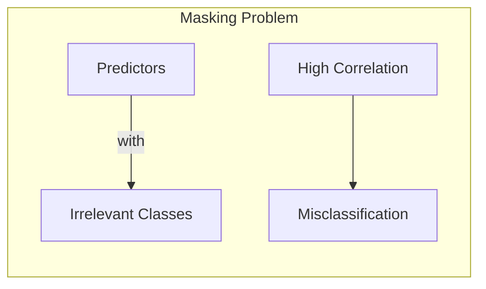

> ⚠️ **Nota Importante**: A regressão linear, embora simples, apresenta limitações como a possibilidade de extrapolação para fora do intervalo [0,1] e a sensibilidade a preditores altamente correlacionados com classes irrelevantes (masking problem) [^7.3].
> ❗ **Ponto de Atenção**: A regressão de indicadores pode gerar estimativas menos estáveis, levando a resultados menos robustos quando as classes não estão bem separadas [^7.4].
> ✔️ **Destaque**: Quando o objetivo principal é apenas a fronteira de decisão linear, a regressão de indicadores pode ser suficiente, especialmente se o número de classes não for muito grande [^7.2].

### Métodos de Seleção de Variáveis e Regularização em Classificação
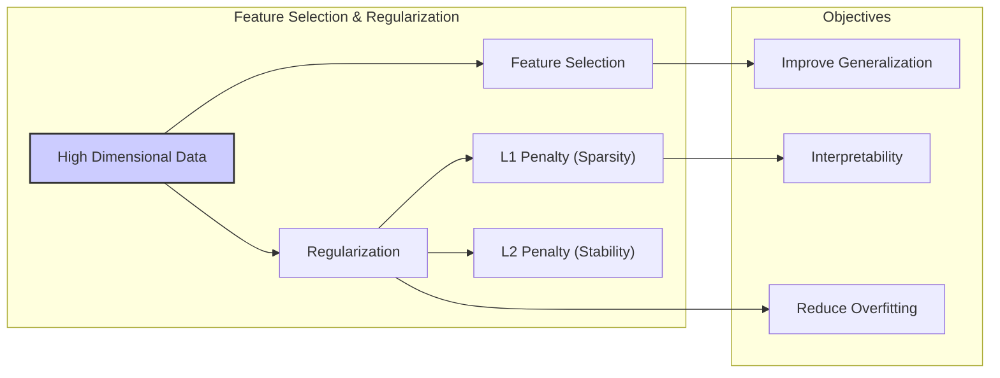
A seleção de variáveis e a regularização são técnicas cruciais em modelos de classificação para lidar com conjuntos de dados de alta dimensão e melhorar a generalização dos modelos [^7.5]. Métodos de seleção de variáveis buscam identificar os preditores mais relevantes para o modelo, descartando aqueles que são pouco informativos ou redundantes. Isso leva a modelos mais simples, mais fáceis de interpretar e com menor probabilidade de overfitting. A regularização, por outro lado, é uma técnica que adiciona um termo de penalização à função de custo do modelo, buscando restringir a magnitude dos coeficientes e, consequentemente, evitar o overfitting. Uma penalização $L1$ (norma-1) aplicada à função de custo de um modelo de classificação logística pode levar a coeficientes esparsos, ou seja, alguns coeficientes serão exatamente zero, promovendo a seleção de variáveis [^7.4.4]. Por exemplo, se a função de custo for dada por:
$$ L(\beta) = - \sum_{i=1}^{N} \left[ y_i \log(p(x_i)) + (1 - y_i) \log(1 - p(x_i)) \right] + \lambda \sum_{j=1}^{p} |\beta_j|$$
onde $\lambda$ é um parâmetro de regularização e $\beta_j$ são os coeficientes do modelo, a penalização $L1$ fará com que alguns $\beta_j$ sejam exatamente zero. Por outro lado, a penalização $L2$ (norma-2) encolhe os coeficientes em direção a zero sem necessariamente zerá-los, o que ajuda a reduzir a variância e melhorar a estabilidade do modelo.

**Lemma 3:** *A penalização L1 em classificação logística promove coeficientes esparsos, e consequentemente a seleção de variáveis.*
Em problemas de classificação, penalizações do tipo L1 atuam como mecanismos de seleção de variáveis, reduzindo a complexidade do modelo.

**Prova do Lemma 3:** Considere a função de custo da regressão logística com penalização L1:
$$ L(\beta) = -\sum_{i=1}^N [y_i \log(p(x_i)) + (1-y_i) \log(1-p(x_i))] + \lambda \sum_{j=1}^p |\beta_j|$$
onde $\lambda$ é o parâmetro de regularização. A penalização L1 adiciona um termo proporcional à soma dos valores absolutos dos coeficientes, e isso leva a uma função de custo não diferenciável em $\beta=0$. Ao otimizar essa função de custo, o algoritmo tenderá a fazer com que alguns coeficientes sejam exatamente zero, para minimizar a penalidade. Isso ocorre porque a norma L1 tem um ponto em 'esquina' no zero, e é menos provável que encontre um ponto de ótimo local em outros locais [^7.4.4]. $\blacksquare$
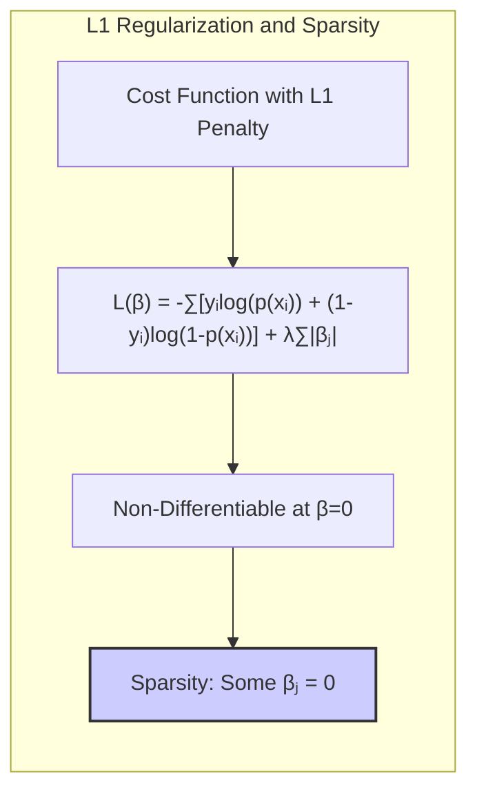

> 💡 **Exemplo Numérico:**
>
> Vamos usar um exemplo de classificação binária com dados simulados e aplicar regressão logística com penalização L1 e L2 para ilustrar como diferentes valores de λ afetam os coeficientes.
> ```python
> import numpy as np
> import pandas as pd
> from sklearn.linear_model import LogisticRegression
> from sklearn.model_selection import train_test_split
> from sklearn.preprocessing import StandardScaler
>
> # Dados de exemplo (dados simulados)
> np.random.seed(42)
> X = np.random.randn(100, 10)
> y = np.random.randint(0, 2, 100)
>
> # Normalização dos dados
> scaler = StandardScaler()
> X_scaled = scaler.fit_transform(X)
>
> # Divisão dos dados em treino e teste
> X_train, X_test, y_train, y_test = train_test_split(X_scaled, y, test_size=0.3, random_state=42)
>
> # Regressão logística com penalização L1 (Lasso)
> l1_model_lambda_01 = LogisticRegression(penalty='l1', C=1, solver='liblinear', random_state=42) # C = 1/lambda
> l1_model_lambda_1 = LogisticRegression(penalty='l1', C=0.1, solver='liblinear', random_state=42)
> l1_model_lambda_10 = LogisticRegression(penalty='l1', C=0.01, solver='liblinear', random_state=42)
>
> l1_model_lambda_01.fit(X_train, y_train)
> l1_model_lambda_1.fit(X_train, y_train)
> l1_model_lambda_10.fit(X_train, y_train)
>
> # Regressão logística com penalização L2 (Ridge)
> l2_model_lambda_01 = LogisticRegression(penalty='l2', C=1, random_state=42)
> l2_model_lambda_1 = LogisticRegression(penalty='l2', C=0.1, random_state=42)
> l2_model_lambda_10 = LogisticRegression(penalty='l2', C=0.01, random_state=42)
>
> l2_model_lambda_01.fit(X_train, y_train)
> l2_model_lambda_1.fit(X_train, y_train)
> l2_model_lambda_10.fit(X_train, y_train)
>
> # Criação de um DataFrame para comparar os coeficientes
> coefficients = pd.DataFrame({
>    'L1_lambda_01': l1_model_lambda_01.coef_[0],
>    'L1_lambda_1': l1_model_lambda_1.coef_[0],
>    'L1_lambda_10': l1_model_lambda_10.coef_[0],
>    'L2_lambda_01': l2_model_lambda_01.coef_[0],
>    'L2_lambda_1': l2_model_lambda_1.coef_[0],
>    'L2_lambda_10': l2_model_lambda_10.coef_[0]
> })
>
> print(coefficients)
> ```
> **Interpretação:** Na tabela acima, vemos como a penalização L1 com diferentes valores de `lambda` (inversamente proporcional a C) faz com que alguns coeficientes sejam exatamente zero, resultando em um modelo esparso. Já a penalização L2 reduz os coeficientes em direção a zero sem zerá-los por completo. A penalização L1 promove a seleção de variáveis, enquanto a L2 reduz a variância e melhora a estabilidade do modelo. Quanto maior o lambda (menor o C), mais forte a penalização, e menor a magnitude dos coeficientes.

**Corolário 3:** *Modelos esparsos resultantes da penalização L1 são mais interpretáveis e podem ser mais eficientes computacionalmente.*
Com menos variáveis, o modelo se torna mais fácil de analisar e entender, além de ter seu desempenho computacional aumentado.

> ⚠️ **Ponto Crucial**: As penalizações L1 e L2 podem ser combinadas em uma abordagem conhecida como Elastic Net, que aproveita as vantagens de ambas as penalizações: sparsity e estabilidade [^7.5].
> ❗ **Ponto de Atenção**: A escolha do parâmetro de regularização $\lambda$ é crucial, pois um $\lambda$ muito grande pode levar a um modelo muito simples e com alto viés, enquanto um $\lambda$ muito pequeno pode resultar em overfitting [^7.5].
> ✔️ **Destaque**: A regularização L1 promove sparsity e, consequentemente, melhora a interpretabilidade do modelo, ao passo que a regularização L2 melhora a estabilidade da solução.

### Separating Hyperplanes e Perceptrons
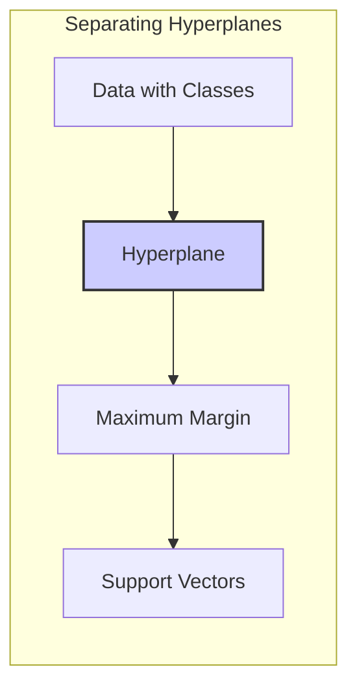
A ideia de hiperplanos separadores está no cerne de vários métodos de classificação linear. O objetivo é encontrar um hiperplano que maximize a margem de separação entre as classes, ou seja, a distância entre o hiperplano e os pontos mais próximos de cada classe. Esses pontos mais próximos são conhecidos como pontos de suporte. A formulação matemática desse problema de otimização envolve a maximização de uma função objetivo, que é a margem, sujeita a restrições que garantem a correta classificação dos pontos. O problema é resolvido utilizando o dual de Wolfe, que transforma um problema de otimização convexo em uma forma mais fácil de resolver. O Perceptron de Rosenblatt é um algoritmo clássico para encontrar um hiperplano separador. Ele ajusta os pesos do hiperplano iterativamente até encontrar uma solução que separe corretamente os dados de treinamento, desde que eles sejam linearmente separáveis [^7.5.1].

### Pergunta Teórica Avançada: Quais as diferenças fundamentais entre a formulação de LDA e a Regra de Decisão Bayesiana considerando distribuições Gaussianas com covariâncias iguais?
**Resposta:**
Sob a suposição de que as distribuições das classes são Gaussianas e têm a mesma matriz de covariância, o LDA busca encontrar uma projeção linear que maximize a separação entre as médias das classes. A regra de decisão Bayesiana sob as mesmas suposições utiliza as densidades Gaussianas para calcular as probabilidades a posteriori de cada classe, atribuindo a cada observação a classe com maior probabilidade. Sob essa restrição de covariâncias iguais, a regra Bayesiana e o LDA se tornam equivalentes, pois a fronteira de decisão resultante é uma função linear dos preditores. O LDA implicitamente calcula uma projeção e uma fronteira com base nas médias das classes e na matriz de covariância comum, enquanto a regra Bayesiana calcula diretamente as probabilidades a posteriori, mas ambas levam à mesma fronteira de decisão linear.
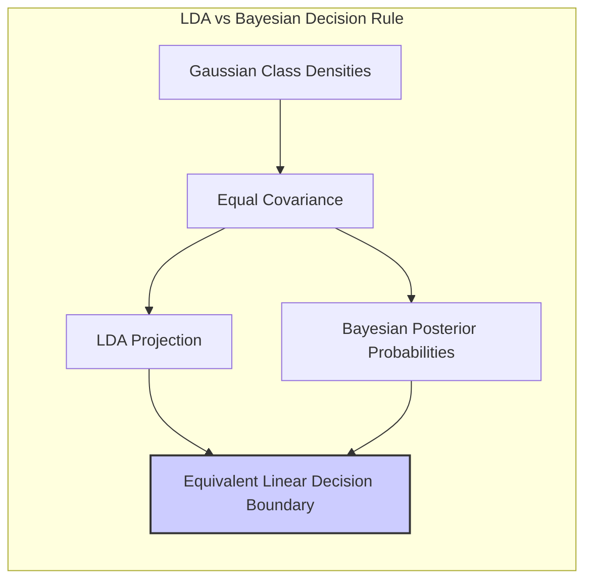
**Lemma 4:** *Sob a condição de covariâncias iguais, as fronteiras de decisão geradas pelo LDA e pela regra de decisão Bayesiana são idênticas.*
Isso significa que a função discriminante linear resultante dos dois métodos leva à mesma classificação para cada observação.

**Prova do Lemma 4:**
Considere que as densidades condicionais das classes $k$ são Gaussianas, $p(x|G=k) = \frac{1}{(2\pi)^{p/2}|\Sigma|^{1/2}} exp(-\frac{1}{2}(x-\mu_k)^T \Sigma^{-1}(x-\mu_k))$, onde $\mu_k$ é a média da classe $k$ e $\Sigma$ é a matriz de covariância comum. A regra de decisão Bayesiana atribui a uma observação a classe $k$ com maior probabilidade a posteriori, $Pr(G=k|x) = \frac{p(x|G=k) Pr(G=k)}{\sum_{l=1}^K p(x|G=l) Pr(G=l)}$. Tomando o log das probabilidades, a regra é equivalente a maximizar $\log p(x|G=k) + \log Pr(G=k)$. Substituindo a expressão para a Gaussiana, e considerando que $\Sigma$ é igual para todas as classes, temos que a regra é equivalente a maximizar $ -\frac{1}{2}(x-\mu_k)^T \Sigma^{-1}(x-\mu_k) + \log Pr(G=k)$. Expandindo e omitindo termos que são constantes com relação a $k$, vemos que a regra é equivalente a maximizar $\mu_k^T \Sigma^{-1}x -\frac{1}{2}\mu_k^T \Sigma^{-1} \mu_k + \log Pr(G=k)$. Esta é uma função linear em $x$, similar à função discriminante do LDA. Portanto, LDA e a regra de decisão Bayesiana com covariâncias iguais são equivalentes em termos das decisões