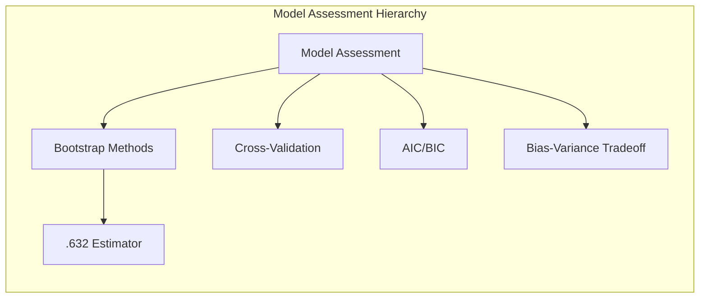
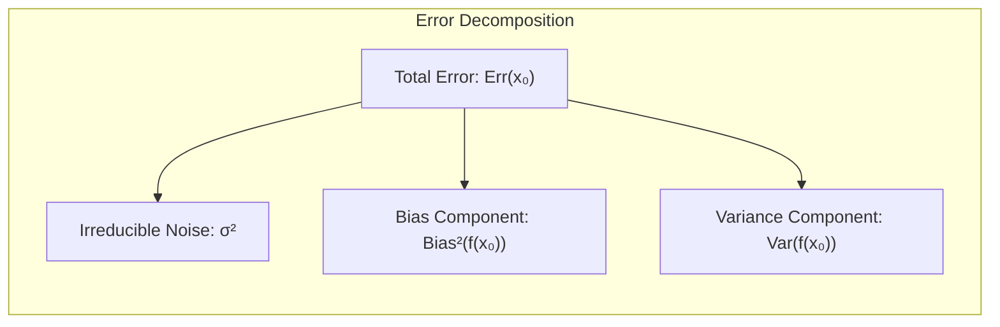
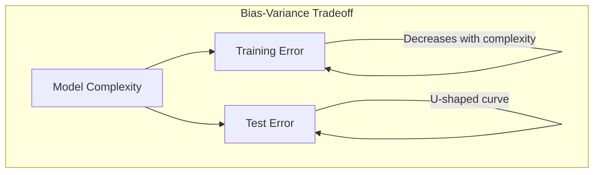
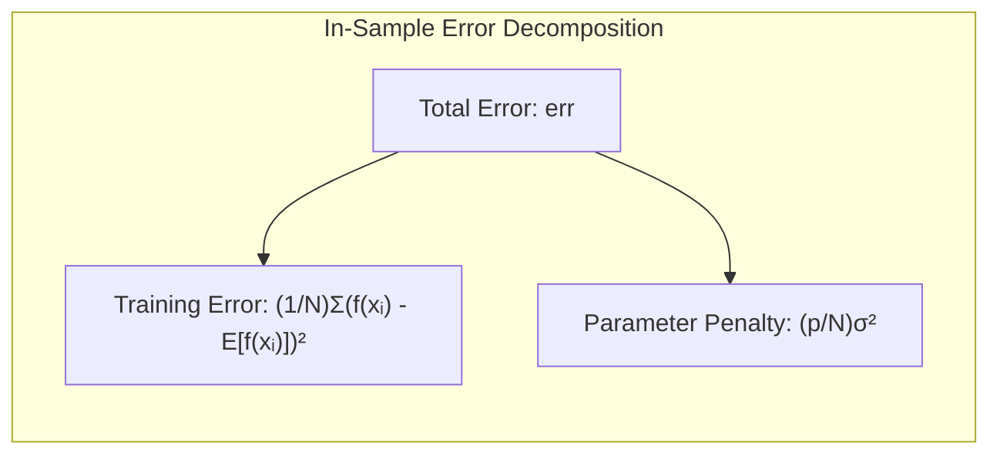
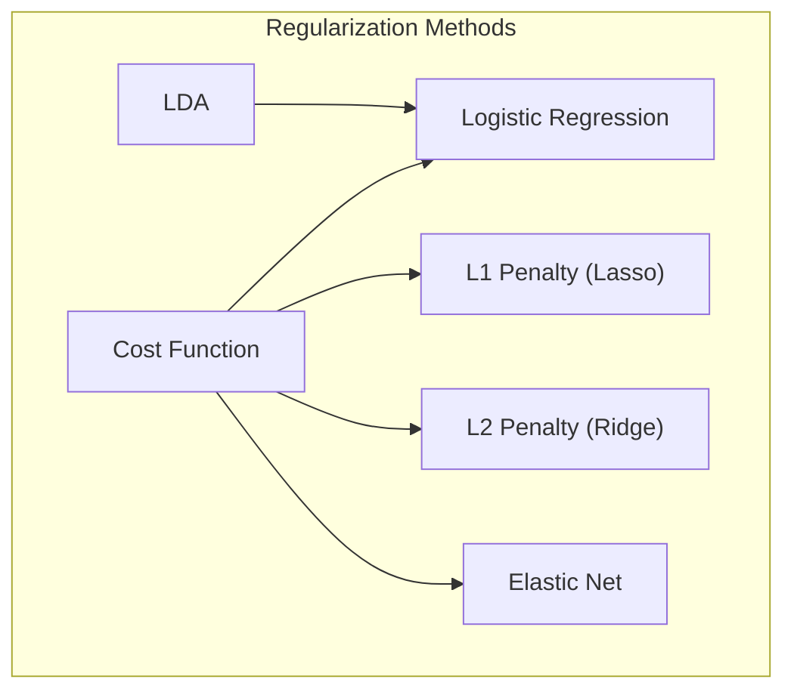
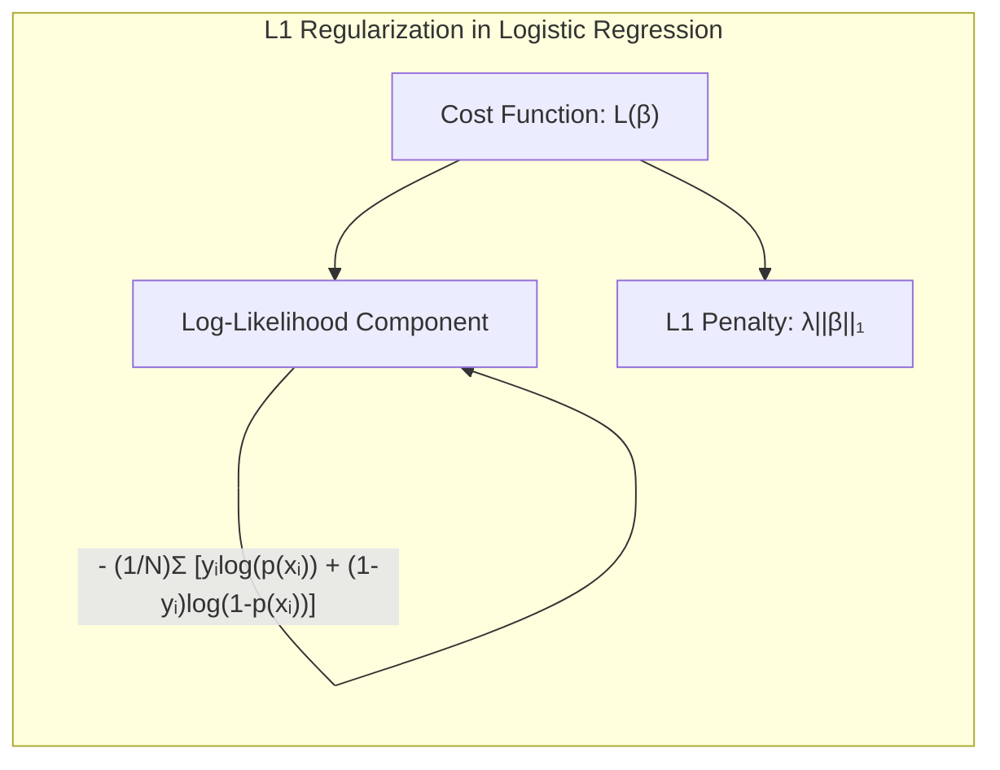
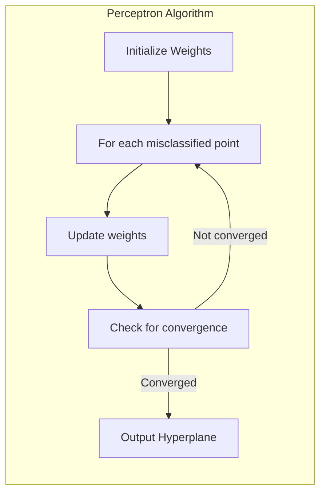
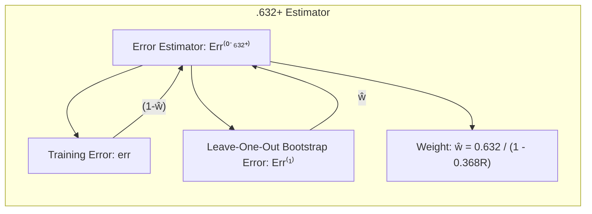

## Model Assessment and Selection: Focusing on the .632 Estimator



### Introdução
A avaliação do desempenho de um modelo de aprendizado é fundamental para garantir sua capacidade de generalização a novos dados [^7.1]. O objetivo principal é estimar quão bem um modelo preditivo se comportará em dados independentes, não utilizados durante o treinamento. Este capítulo explora métodos para esta avaliação, com ênfase especial no **.632 estimator**, discutido no contexto do *bootstrap* [^7.11], e como ele se relaciona com outros métodos de avaliação. Vamos aprofundar nossa compreensão sobre os compromissos entre viés, variância e complexidade do modelo [^7.2], examinando como diferentes técnicas lidam com esses desafios.

### Conceitos Fundamentais

**Conceito 1: Generalização e Erro de Teste**. O principal objetivo de qualquer modelo de aprendizado é sua capacidade de **generalização**, isto é, o desempenho em dados não vistos [^7.1]. Essa capacidade é medida pelo **erro de teste** ou **erro de generalização**, que representa o erro de predição em uma amostra independente da amostra de treinamento. Uma estimativa precisa do erro de generalização é crucial para escolher o melhor modelo [^7.1].

**Lemma 1:** _A média do erro de predição para um modelo ajustado em um conjunto de treinamento específico é igual à soma do ruído irredutível, o quadrado do viés e a variância_ [^7.3]. Formalmente:

$$ Err(x_0) = \sigma^2 + Bias^2(f(x_0)) + Var(f(x_0)) $$

onde $\sigma^2$ é a variância do ruído, $Bias^2(f(x_0))$ é o quadrado do viés, e $Var(f(x_0))$ é a variância do estimador.


Esta decomposição é fundamental para entender como a complexidade do modelo afeta o desempenho preditivo [^7.3]. A ideia é que um modelo mais complexo pode reduzir o viés, mas aumenta a variância, e vice-versa.

> 💡 **Exemplo Numérico:** Suponha que temos um modelo de regressão que tenta prever o preço de uma casa ($y$) com base no seu tamanho em metros quadrados ($x$). O verdadeiro modelo é $y = 2x + 5 + \epsilon$, onde $\epsilon$ é um ruído aleatório com $\sigma^2 = 1$.
>
> * **Modelo simples (alto viés):** Digamos que ajustamos um modelo linear simples:  $f_1(x) = 3$. Este modelo ignora a relação com o tamanho da casa. O viés será alto ($Bias^2(f_1(x)) = (2x+5-3)^2 = (2x+2)^2$), mas a variância será baixa (já que o modelo é constante e $Var(f_1(x))=0$).
> * **Modelo complexo (alta variância):** Digamos que ajustamos um modelo muito complexo, como um polinômio de grau 10, que se ajusta perfeitamente aos dados de treinamento (incluindo o ruído). Este modelo terá um viés baixo (se o modelo se ajusta perfeitamente,  $Bias^2(f_2(x)) \approx 0$), mas a variância será alta porque pequenas mudanças nos dados de treinamento podem levar a mudanças drásticas nas previsões ($Var(f_2(x))$ será alta).
> * **Modelo ideal (equilíbrio):** Um modelo linear como $f_3(x) = 2x + 5$ (ou algo bem próximo a ele) terá um viés baixo (próximo a 0) e também uma variância razoável, gerando um bom erro de teste.
>
> No nosso exemplo, se $x = 10$, o erro para cada modelo seria:
>
>   - $Err(f_1(10)) = 1 + (2*10+2)^2 + 0 = 1 + 484 = 485$
>   - $Err(f_2(10)) = 1 + 0 + Var(f_2(10)) $ (A variância será maior que zero, digamos 500 para este exemplo).
>   - $Err(f_3(10)) = 1 + 0 + Var(f_3(10))$ (A variância será menor, digamos 2 para este exemplo)
>
> Este exemplo ilustra que um modelo ideal equilibra viés e variância.

**Conceito 2:  Viés, Variância e Complexidade do Modelo.** A **complexidade do modelo** refere-se à capacidade do modelo de se ajustar a padrões complexos nos dados de treinamento. Modelos muito simples podem ter **alto viés**, não capturando a verdadeira relação subjacente, enquanto modelos muito complexos podem ter **alta variância**, ajustando-se demais ao ruído nos dados de treinamento [^7.2]. A figura 7.1 ilustra essa relação, onde o erro de treinamento diminui com a complexidade, mas o erro de teste tem um mínimo em um nível de complexidade intermediário [^7.2].


**Corolário 1:** *O erro de treinamento não é uma boa estimativa do erro de teste*, pois modelos com erro de treinamento zero podem se sair mal em novos dados devido ao overfitting [^7.2]. Em outras palavras, devemos buscar estimativas do erro de teste que nos digam como um modelo irá performar em dados não vistos.

**Conceito 3: Otimismo do Erro de Treinamento.**  O erro de treinamento é, por natureza, um estimador *otimista* do erro de generalização [^7.4]. Isso ocorre porque o modelo se ajusta aos dados de treinamento e, consequentemente, tende a apresentar um bom desempenho nesses mesmos dados [^7.4]. É importante corrigir esse otimismo para obter uma estimativa mais realista do desempenho do modelo.

> ⚠️ **Nota Importante**: *O otimismo do erro de treinamento aumenta com a complexidade do modelo e com a quantidade de dados.* **Referência ao tópico [^7.4]**.

> ❗ **Ponto de Atenção**: *Ajustar um modelo aos dados de treinamento e avaliar esse modelo nos mesmos dados leva a resultados enviesados.* **Conforme indicado em [^7.4]**.

> ✔️ **Destaque**: *Para avaliar corretamente o desempenho do modelo, é necessário utilizar dados de teste independentes*. **Baseado no tópico [^7.1]**.

### Regressão Linear e Mínimos Quadrados para Classificação


A **regressão linear** pode ser aplicada a problemas de classificação por meio da utilização de uma matriz de indicadores, onde cada coluna representa uma classe e as entradas dessa coluna são 1 ou 0, dependendo se o padrão pertence ou não àquela classe [^7.2]. O modelo é ajustado por mínimos quadrados (LS), minimizando a soma dos quadrados dos erros, e a classificação é feita baseada no valor previsto do modelo para cada classe.  No entanto, essa abordagem possui algumas limitações [^7.2].

**Lemma 2:** *A estimativa do erro in-sample, com a regressão de indicadores, pode ser expressa como*

$$err = \frac{1}{N}\sum_{i=1}^{N} (y_i - f(x_i))^2 = \frac{1}{N}\sum_{i=1}^{N} (f(x_i) - Ef(x_i))^2 + \frac{p}{N} \sigma^2$$

onde $p$ é o número de parâmetros, $N$ é o número de observações e $\sigma^2$ é a variância do erro. Este lemma demonstra que o erro in-sample não é um bom estimador do erro de teste, pois diminui com o aumento do número de parâmetros, enquanto o erro de teste pode começar a aumentar a partir de certo ponto devido ao overfitting [^7.2].


> 💡 **Exemplo Numérico:** Suponha que temos um problema de classificação com três classes (A, B, C) e 100 observações. Criamos uma matriz de indicadores, onde cada observação terá três colunas, cada uma representando uma classe. Usamos regressão linear para ajustar os dados.
>
> Digamos que o modelo linear ajustado é da forma $f(x) = X\beta$, onde $X$ é a matriz de indicadores, e $\beta$ são os coeficientes.
>
> Usando a fórmula do Lemma 2, digamos que temos 100 observações, 3 classes (então 3 parâmetros na regressão) e a variância do erro ($\sigma^2$) é 1.
> O erro in-sample seria:
> $$err = \frac{1}{100}\sum_{i=1}^{100} (f(x_i) - Ef(x_i))^2 + \frac{3}{100} * 1 = \frac{1}{100}\sum_{i=1}^{100} (f(x_i) - Ef(x_i))^2 + 0.03$$
>
> O termo $\frac{1}{100}\sum_{i=1}^{100} (f(x_i) - Ef(x_i))^2$  é o erro de treinamento propriamente dito (o erro com o qual o modelo foi ajustado), e o termo $0.03$ é uma penalização relacionada ao número de parâmetros e a variância do ruído. Se aumentarmos o número de classes (e, portanto, o número de parâmetros, *p*), essa penalização aumentaria, mostrando que o erro in-sample se torna menos confiável, dado que ele não reflete o erro de generalização em dados não vistos. Este exemplo demonstra o otimismo do erro de treinamento.

**Corolário 2:** *A regressão de indicadores pode levar a estimativas de probabilidade fora do intervalo [0,1]*. Além disso, quando temos classes com covariâncias diferentes, a regressão linear pode não ser a melhor escolha, pois não considera essa diferença de estrutura nas classes [^7.3]. Uma alternativa é utilizar o LDA, que incorpora as covariâncias de cada classe, mas que exige mais hipóteses sobre a distribuição dos dados [^7.3].

Uma das limitações da regressão de indicadores é que ela não leva em conta a estrutura de classes com covariâncias diferentes [^7.3]. Além disso, as estimativas de probabilidade podem sair do intervalo [0,1] [^7.4]. Modelos como LDA e regressão logística abordam essas limitações de forma mais adequada [^7.3, 7.4].

### Métodos de Seleção de Variáveis e Regularização em Classificação

Para melhorar a performance e evitar overfitting, técnicas de **regularização** são frequentemente aplicadas a modelos de classificação [^7.5]. A regularização penaliza a complexidade do modelo durante o treinamento. Existem dois tipos principais de regularização: **L1** (Lasso), que tende a gerar modelos esparsos, e **L2** (Ridge), que ajuda a estabilizar as estimativas de parâmetros [^7.4.4]. A combinação de ambas, conhecida como **Elastic Net**, visa aproveitar as vantagens de ambas as regularizações [^7.5].

**Lemma 3:** *A penalização L1 na regressão logística leva a coeficientes esparsos.* Para uma regressão logística com penalização L1, a função de custo é dada por

$$L(\beta) = - \frac{1}{N} \sum_{i=1}^N [y_i \log(p(x_i)) + (1 - y_i) \log(1 - p(x_i))] + \lambda \|\beta\|_1 $$

onde $\|\beta\|_1$ é a norma L1 dos coeficientes, e $\lambda$ é o parâmetro de regularização. A derivada da norma L1 com relação a um coeficiente $\beta_j$ é uma constante ($\pm 1$), o que leva os coeficientes a serem zerados quando $\lambda$ é suficientemente grande [^7.4.4].


**Prova do Lemma 3:**
A otimização da função de custo acima envolvendo a penalização L1 leva à esparsidade, ou seja, alguns coeficientes serão exatamente iguais a zero. Isso ocorre devido à natureza da norma L1, que, diferentemente da norma L2, não suaviza os valores próximos a zero. Ao derivarmos a função de custo com relação aos coeficientes e igualarmos a zero, vemos que a solução para a norma L1 é de natureza "hard-thresholding," fazendo com que os coeficientes sejam levados para zero, enquanto que a norma L2 tem uma solução "soft-thresholding", onde os coeficientes são reduzidos, mas não necessariamente a zero. Portanto, em problemas de classificação com muitas variáveis, a regularização L1 se torna uma ferramenta muito útil para seleção de variáveis, dado que algumas serão simplesmente eliminadas [^7.4.4]. $\blacksquare$

> 💡 **Exemplo Numérico:** Considere um problema de classificação binária com regressão logística, 100 amostras e 10 variáveis preditoras.  Ajustamos um modelo sem regularização e depois dois modelos com regularização L1 com diferentes valores de λ:  λ = 0.1 (Lasso 1) e λ = 1 (Lasso 2).

```python
import numpy as np
from sklearn.linear_model import LogisticRegression
from sklearn.preprocessing import StandardScaler
from sklearn.model_selection import train_test_split
from sklearn.metrics import accuracy_score

# Gerando dados aleatórios
np.random.seed(42)
X = np.random.rand(100, 10)
y = np.random.randint(0, 2, 100)

# Dividindo os dados em treino e teste
X_train, X_test, y_train, y_test = train_test_split(X, y, test_size=0.3, random_state=42)

# Normalizando os dados
scaler = StandardScaler()
X_train_scaled = scaler.fit_transform(X_train)
X_test_scaled = scaler.transform(X_test)

# Regressão logística sem regularização
model_no_reg = LogisticRegression(penalty=None)
model_no_reg.fit(X_train_scaled, y_train)
y_pred_no_reg = model_no_reg.predict(X_test_scaled)
acc_no_reg = accuracy_score(y_test, y_pred_no_reg)

# Regressão logística com regularização L1 (Lasso) lambda = 0.1
model_lasso_1 = LogisticRegression(penalty='l1', C=1/0.1, solver='liblinear')
model_lasso_1.fit(X_train_scaled, y_train)
y_pred_lasso_1 = model_lasso_1.predict(X_test_scaled)
acc_lasso_1 = accuracy_score(y_test, y_pred_lasso_1)


# Regressão logística com regularização L1 (Lasso) lambda = 1
model_lasso_2 = LogisticRegression(penalty='l1', C=1/1, solver='liblinear')
model_lasso_2.fit(X_train_scaled, y_train)
y_pred_lasso_2 = model_lasso_2.predict(X_test_scaled)
acc_lasso_2 = accuracy_score(y_test, y_pred_lasso_2)


# Comparando os coeficientes e a acurácia
print(f"Acurácia sem regularização: {acc_no_reg:.3f}")
print(f"Coeficientes sem regularização: {model_no_reg.coef_}")
print(f"Acurácia Lasso (λ=0.1): {acc_lasso_1:.3f}")
print(f"Coeficientes Lasso (λ=0.1): {model_lasso_1.coef_}")
print(f"Acurácia Lasso (λ=1): {acc_lasso_2:.3f}")
print(f"Coeficientes Lasso (λ=1): {model_lasso_2.coef_}")
```

> Este código gera dados aleatórios, divide em treino e teste, ajusta 3 modelos (sem regularização e com regularização L1 com dois valores de λ), e depois mostra os coeficientes e acurácia de cada modelo. Ao executar, observe como os coeficientes do modelo com λ = 1 ficam mais esparsos (mais coeficientes zerados) do que os do modelo com λ = 0.1. Essa esparsidade é uma característica da regularização L1 e ajuda a simplificar o modelo. Note também como a acurácia do modelo pode melhorar com regularização, dado que ele passa a focar em variáveis mais relevantes para o problema, em detrimento de outras que podem estar capturando apenas ruído dos dados.

**Corolário 3:** *A regularização L1 melhora a interpretabilidade do modelo*, pois remove variáveis irrelevantes, facilitando a compreensão das variáveis que realmente contribuem para a predição [^7.4.5]. A regularização L2, por outro lado, reduz a magnitude dos coeficientes, tornando o modelo mais estável e menos suscetível a variações nos dados de treinamento [^7.5].

> ⚠️ **Ponto Crucial**: *A escolha entre regularização L1, L2 ou Elastic Net depende do problema em questão e dos objetivos desejados* [^7.5]. A regularização é uma ferramenta essencial para controlar a complexidade e a estabilidade dos modelos.

### Separating Hyperplanes e Perceptrons


O conceito de **hiperplanos separadores** busca encontrar um hiperplano que melhor separe as classes no espaço de atributos [^7.5.2]. A ideia é maximizar a margem de separação entre as classes, o que leva a um modelo mais robusto. Essa margem é definida como a distância entre o hiperplano e os pontos mais próximos das classes, denominados vetores de suporte [^7.5.2].

O **Perceptron** é um algoritmo simples para aprendizado de hiperplanos separadores [^7.5.1]. O algoritmo ajusta os pesos do hiperplano iterativamente até que os dados sejam separados corretamente. O Perceptron garante convergência quando os dados são linearmente separáveis [^7.5.1].

### Pergunta Teórica Avançada (Exemplo): O que o .632+ estimator busca corrigir e quais as vantagens e desvantagens de usar esse estimador em comparação ao cross-validation?
**Resposta:** O **.632+ estimator**, derivado do método bootstrap, busca corrigir o viés para baixo do erro de predição em amostra, ao mesmo tempo em que tenta evitar o otimismo excessivo. O .632+ estimator, segundo Efron (1983), tenta levar em conta o overfitting, ajustando o estimador bootstrap para que o resultado fique entre o erro em amostra e o erro de predição em amostra [^7.11]. Ele é definido pela seguinte fórmula:

$$ Err^{(.632+)} = (1 - \hat{w}) err + \hat{w} Err^{(1)} $$

Onde $\hat{w} = \frac{0.632}{1-0.368R}$, $err$ é o erro de treinamento, $Err^{(1)}$ é o leave-one-out bootstrap error (uma espécie de cross-validation dentro do framework bootstrap), e $R$ é a taxa de overfitting. O termo $0.632$ provém da probabilidade de um item não estar contido em uma amostra bootstrap.

**Lemma 4:** _O .632+ estimator busca equilibrar o trade-off entre viés e variância_ [^7.11]. Ele reduz o viés em relação ao erro de treinamento, ao mesmo tempo que tenta evitar o otimismo excessivo associado ao erro de predição em amostra, e por isso tende a apresentar uma performance mais robusta em comparação com o bootstrap tradicional [^7.11].


> 💡 **Exemplo Numérico:** Vamos considerar um cenário onde temos 20 amostras, e estamos usando um modelo de regressão para estimar o erro. Vamos comparar o erro de treinamento, o erro de validação (leave-one-out cross-validation), o erro bootstrap, e o erro .632+.
>
> Suponha que o erro de treinamento seja 0.1, e o erro de validação seja 0.5.
>
> * **Erro de treinamento:**  $err = 0.1$. É um estimador otimista do erro de generalização.
> * **Erro de validação (leave-one-out):** $Err^{(1)} = 0.5$. É uma estimativa mais realista do erro de generalização, mas com alta variância.
>
> Se usarmos o bootstrap tradicional, o erro estimado seria o erro médio, que seria próximo a 0.5. O erro bootstrap simples normalmente é um pouco mais otimista do que o cross-validation.
>
> Para o .632+ estimator, precisamos calcular a taxa de overfitting (R). Suponha que a taxa de overfitting seja R = 0.3, então:
>
>   $\hat{w} = \frac{0.632}{1 - 0.368 * 0.3} \approx \frac{0.632}{1 - 0.1104} \approx \frac{0.632}{0.8896} \approx 0.710$
>
> E o .632+ estimator seria:
>
> $Err^{(.632+)} = (1 - 0.710) * 0.1 + 0.710 * 0.5 \approx 0.029 + 0.355 = 0.384$
>
> Podemos ver que o .632+ estimator forneceu uma estimativa de erro (0.384) que está entre o erro de treinamento (0.1) e o erro de validação (0.5). Essa estimativa é mais realista do que o erro de treinamento, mas não tão pessimista quanto o erro de validação. Se R fosse maior, $\hat{w}$ se aproximaria de 1, e o estimador .632+ daria mais peso ao erro de validação, que é uma estimativa mais precisa. Se R fosse pequeno, $\hat{w}$ se aproximaria de 0.632, e o estimador .632+ se comportaria mais como um bootstrap simples.

**Corolário 4:** _A taxa de overfitting ($R$) é crucial para o desempenho do .632+ estimator_. Se houver pouco overfitting, $\hat{w}$ será próximo a 0.632 e o estimador irá se aproximar do bootstrap, se houver muito overfitting, $\hat{w}$ irá se aproximar de 1, e o estimador será influenciado pelo erro bootstrap.

> ⚠️ **Ponto Crucial**: *O .632+ estimator é uma alternativa ao cross-validation, especialmente em situações em que o custo computacional do cross-validation é proibitivo ou que o conjunto de dados é limitado*. Ele busca equilibrar viés e variância [^7.11].

Em comparação com o cross-validation, o .632+ estimator é mais apropriado quando o custo computacional é alto ou quando o conjunto de dados é limitado, enquanto o cross-validation é mais direto em termos de interpretação. No entanto, o .632+ estimator é mais robusto em cenários onde o overfitting é um problema, pois ele tenta corrigir o viés presente em outras abordagens. O .632+ estimator tenta resolver o problema de overfitting presente no bootstrap simples, e ao mesmo tempo ele leva em consideração a taxa de overfitting dos dados para gerar um estimador mais preciso [^7.11].

### Conclusão
Este capítulo explorou diferentes abordagens para avaliar o desempenho de modelos de classificação, com foco especial no **.632 estimator**. O .632 estimator, uma versão modificada do bootstrap, visa corrigir o viés e o otimismo excessivo presentes nas estimativas de erro de modelos preditivos. Ele oferece uma alternativa interessante ao cross-validation em cenários onde o custo computacional é elevado ou o dataset é limitado, sendo mais robusto em situações de overfitting. Entretanto, o cross-validation ainda é a abordagem mais utilizada, por sua simplicidade e facilidade de interpretação.

A escolha do método de avaliação adequado depende da natureza do problema, do tamanho do dataset, da complexidade dos modelos e do custo computacional [^7.1]. Em geral, é aconselhável utilizar uma combinação de métodos e avaliar os resultados com cautela, compreendendo seus pontos fortes e suas limitações [^7.1, 7.12].

### Footnotes
[^7.1]: "The generalization performance of a learning method relates to its prediction capability on independent test data. Assessment of this performance is extremely important in practice, since it guides the choice of learning method or model, and gives us a measure of the quality of the ultimately chosen model." *(Trecho de Model Assessment and Selection)*
[^7.2]: "Figure 7.1 illustrates the important issue in assessing the ability of a learning method to generalize. Consider first the case of a quantitative or interval scale response. We have a target variable Y, a vector of inputs X, and a prediction model f(X) that has been estimated from a training set T." *(Trecho de Model Assessment and Selection)*
[^7.3]: "As in Chapter 2, if we assume that Y = f(X) + ε where E(ε) = 0 and Var(ε) = σ², we can derive an expression for the expected prediction error of a regression fit f(X) at an input point X = x0, using squared-error loss:" *(Trecho de Model Assessment and Selection)*
[^7.4]: "Training error is the average loss over the training sample. We would like to know the expected test error of our estimated model f. As the model becomes more and more complex, it uses the training data more and is able to adapt to more complicated underlying structures." *(Trecho de Model Assessment and Selection)*
[^7.4.4]: "...we need to replace d by some measure of model complexity. We discuss this in Section 7.6." *(Trecho de Model Assessment and Selection)*
[^7.4.5]:  "... the effective number of parameters has the form df(a) = Σ θm / (θm + α)." *(Trecho de Model Assessment and Selection)*
[^7.5]:  "The methods of this chapter approximate the validation step either an- alytically (AIC, BIC, MDL, SRM) or by efficient sample re-use (cross- validation and the bootstrap)." *(Trecho de Model Assessment and Selection)*
[^7.5.1]: "The bias-variance tradeoff behaves differently for 0-1 loss than it does for squared error loss. This in turn means that the best choices of tuning parameters may differ substantially in the two settings." *(Trecho de Model Assessment and Selection)*
[^7.5.2]: "Before jumping into these topics, we first explore in more detail the nature of test error and the bias-variance tradeoff." *(Trecho de Model Assessment and Selection)*
[^7.11]: "The bootstrap is a general tool for assessing statistical accuracy. First we describe the bootstrap in general, and then show how it can be used to estimate extra-sample prediction error. As with cross-validation, the boot- strap seeks to estimate the conditional error ErrT, but typically estimates well only the expected prediction error Err." *(Trecho de Model Assessment and Selection)*
[^7.12]: "Figures 7.14 and 7.15 examine the question of whether cross-validation does a good job in estimating Errt, the error conditional on a given training set T (expression (7.15) on page 228), as opposed to the expected test error." *(Trecho de Model Assessment and Selection)*
