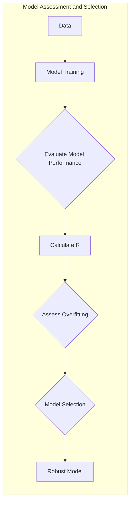
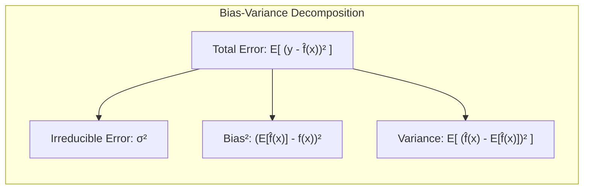
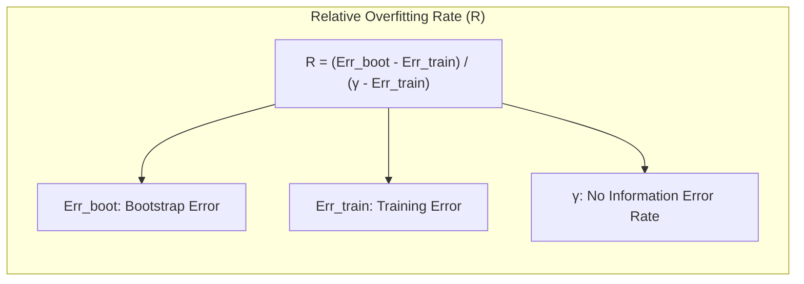
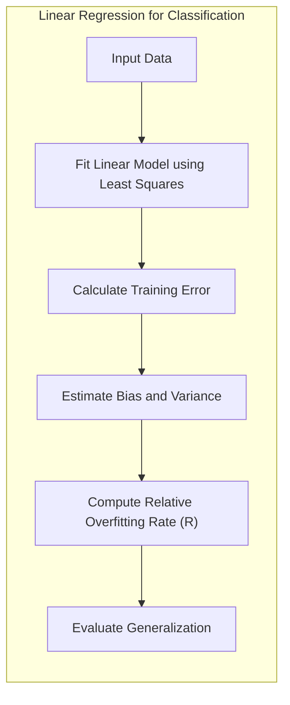
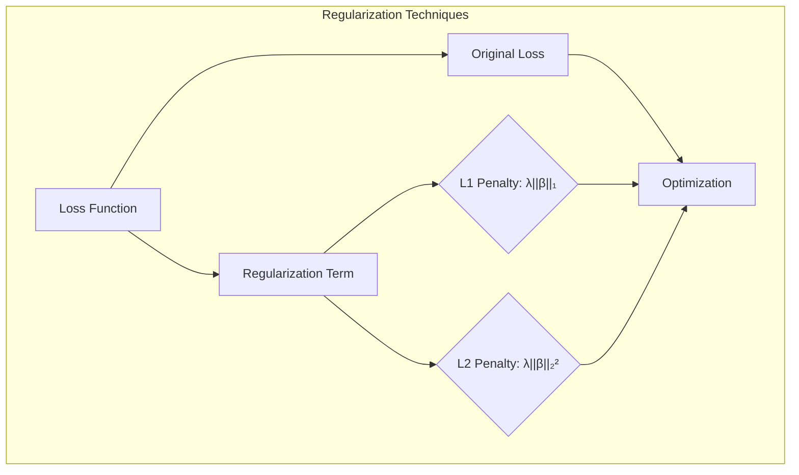
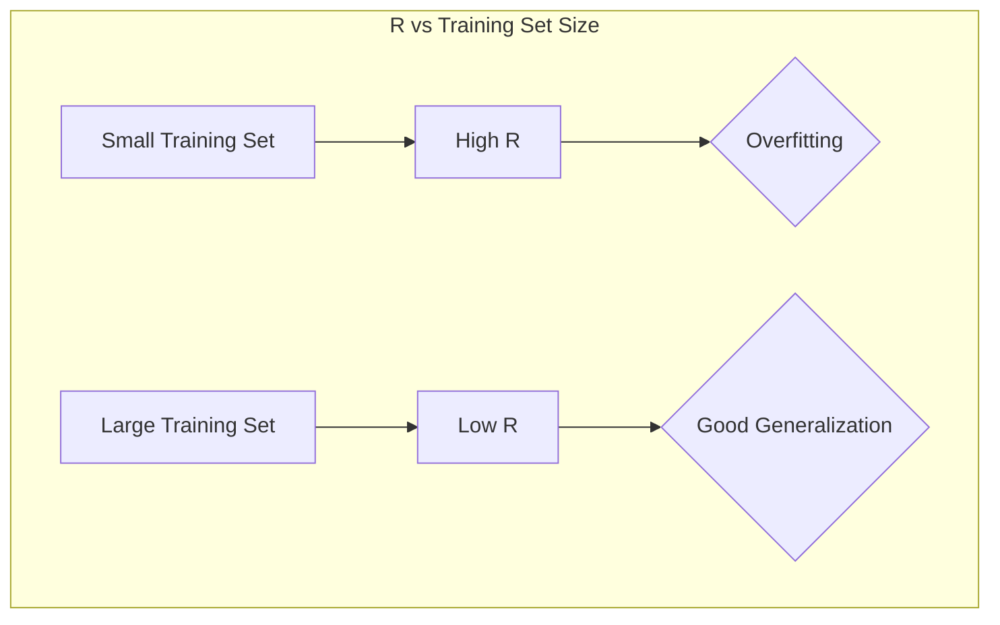

## Model Assessment and Selection: Focusing on Relative Overfitting Rate



### Introdução

A avaliação e seleção de modelos são etapas cruciais no desenvolvimento de modelos de aprendizado estatístico. A capacidade de um modelo generalizar para dados não vistos é fundamental para seu sucesso prático [^7.1]. Este capítulo explora as metodologias para avaliação de desempenho de modelos, com um foco especial na **Relative Overfitting Rate (R)** como um indicador chave na identificação de overfitting e seleção de modelos robustos. Através de um estudo aprofundado de conceitos como **Bias-Variance Decomposition**, **Cross-Validation**, **Bootstrap**, **AIC**, **BIC** e **MDL**, procuramos oferecer um guia avançado para profissionais de estatística e aprendizado de máquina. A atenção principal será na utilização de R como uma métrica para avaliar a qualidade dos modelos.

### Conceitos Fundamentais

**Conceito 1: Generalização e Overfitting**
O desempenho de generalização de um método de aprendizado refere-se à sua capacidade de prever com precisão em dados de teste independentes [^7.1]. Um modelo que performa bem nos dados de treinamento, mas mal em dados não vistos, é considerado **overfit**. A capacidade de discernir entre esses cenários é essencial para a construção de modelos robustos e eficazes [^7.2]. Modelos complexos tendem a se ajustar aos ruídos nos dados de treinamento, levando a baixa generalização e alto overfitting.

**Lemma 1:** A relação entre viés e variância está intrinsecamente ligada ao conceito de overfitting. Modelos complexos tendem a ter baixo viés (melhor ajuste aos dados de treinamento) mas alta variância (alta sensibilidade a pequenas mudanças nos dados de treinamento), o que leva ao overfitting [^7.2].

*Prova:*
$$Err(x_0) = \sigma^2 + Bias^2(f(x_0)) + Var(f(x_0))$$
Onde $Err(x_0)$ é o erro esperado de predição em um ponto $x_0$, $\sigma^2$ é a variância do ruído, $Bias^2(f(x_0))$ é o viés ao quadrado e $Var(f(x_0))$ é a variância do modelo. Modelos complexos diminuem o viés, mas aumentam a variância, levando a overfitting. $\blacksquare$
> 💡 **Exemplo Numérico:**
> Suponha que temos um dataset com 100 pontos, e queremos ajustar um modelo de regressão. Para um modelo linear simples, temos um viés maior (ele não consegue capturar a curvatura nos dados), mas a variância é baixa (pequenas mudanças nos dados não mudam muito o modelo). Para um modelo polinomial de grau 10, o viés é muito baixo (ele ajusta muito bem aos dados de treino), mas a variância é alta (pequenas mudanças nos dados alteram muito o modelo). Vamos analisar o erro em um ponto específico ($x_0$).
> - Para o modelo linear: $Bias^2(f(x_0)) = 0.5$, $Var(f(x_0)) = 0.1$, $\sigma^2 = 0.2$. Então, $Err(x_0) = 0.2 + 0.5 + 0.1 = 0.8$.
> - Para o modelo polinomial: $Bias^2(f(x_0)) = 0.05$, $Var(f(x_0)) = 0.9$, $\sigma^2 = 0.2$. Então, $Err(x_0) = 0.2 + 0.05 + 0.9 = 1.15$.
>
> Nesse caso, embora o modelo polinomial tenha um viés menor, sua alta variância resulta em um erro total maior em comparação com o modelo linear mais simples, ilustrando a necessidade de equilibrar viés e variância.

**Conceito 2: Bias-Variance Decomposition e a Complexidade do Modelo**
A **Bias-Variance Decomposition** é uma ferramenta chave para entender o comportamento do erro de predição [^7.3]. O erro total pode ser decomposto em três componentes: um erro irredutível (variância do ruído), viés ao quadrado e variância do modelo [^7.3]. À medida que a complexidade do modelo aumenta, o viés geralmente diminui, mas a variância tende a aumentar [^7.3.1]. A escolha da complexidade ideal é um compromisso entre esses dois fatores, com o objetivo de minimizar o erro total de predição.



**Corolário 1:**  Em problemas de classificação, o erro de predição não é mais uma simples soma de viés ao quadrado e variância. A interação entre viés e variância determina a taxa de erro, e a minimização do erro de predição não corresponde à minimização da soma de viés ao quadrado e variância [^7.3.1]. Em modelos de classificação, pode haver cenários onde o aumento do viés não necessariamente aumenta o erro de predição se a estimativa ainda estiver do lado correto da fronteira de decisão.
> 💡 **Exemplo Numérico:**
> Em um problema de classificação binária, vamos comparar dois modelos: um modelo linear simples e uma rede neural profunda. O modelo linear pode ter um viés maior, pois ele não consegue capturar fronteiras de decisão complexas, mas a variância é baixa, uma vez que ele é pouco sensível aos dados de treinamento. A rede neural pode se ajustar muito bem aos dados de treinamento (baixo viés), mas pequenas mudanças nos dados de treinamento podem gerar uma fronteira de decisão muito diferente (alta variância).
>
> Suponha que após o treinamento, o modelo linear cometa erros em 15% dos pontos no teste, e a rede neural em 10%. Contudo, ao realizar um bootstrap, vemos que o modelo linear apresenta uma variação de 2% nos erros e a rede neural 15%, indicando que a rede neural overfitta, mesmo apresentando um erro menor inicialmente. Nesse contexto, o modelo linear, apesar do viés maior, apresenta uma melhor capacidade de generalização. O cálculo do R pode auxiliar na identificação deste overfitting da rede neural.

**Conceito 3: Relative Overfitting Rate (R)**
A métrica **Relative Overfitting Rate (R)**, introduzida no contexto de métodos de bootstrap [^7.11], quantifica a extensão do overfitting. R compara a diferença entre a estimativa de erro no bootstrap leave-one-out e o erro de treinamento com a diferença entre a taxa de erro sem informação ( $\gamma$ ) e o erro de treinamento [^7.11]. Uma taxa de overfitting alta indica que o modelo está se ajustando em demasia aos dados de treinamento, e o modelo não generalizará bem para dados não vistos.



> ⚠️ **Nota Importante**: A métrica R é particularmente útil para avaliar a robustez de modelos em diferentes cenários, especialmente quando se utilizam métodos como o bootstrap para estimar o erro de generalização. **Referência ao tópico [^7.11]**.
> ❗ **Ponto de Atenção**: Em modelos de classificação, onde as decisões são binárias ou multiclasse, R auxilia na identificação de overfitting, avaliando o quanto o modelo se ajusta aos dados de treinamento e se a capacidade de generalização está comprometida. **Conforme indicado em [^7.11]**.
> ✔️ **Destaque**: O uso de R é mais adequado em situações onde o modelo precisa ter uma boa capacidade de generalização, sendo uma métrica fundamental para comparação de modelos em situações complexas. **Baseado nos tópicos [^7.11]**.

### Regressão Linear e Mínimos Quadrados para Classificação



**Explicação:** Este diagrama representa o fluxo de trabalho utilizando a regressão para classificação e a avaliação utilizando a métrica R.

A regressão linear pode ser aplicada a problemas de classificação através da regressão de uma **matriz de indicadores**, em que cada coluna representa uma classe. Essa abordagem, embora simples, pode sofrer de limitações significativas [^7.2]. O **erro de treinamento** diminui à medida que a complexidade do modelo aumenta, mas o modelo pode se tornar superajustado, resultando em baixa capacidade de generalização. A estimação do erro de generalização utilizando a **Relative Overfitting Rate (R)** é crucial para evitar modelos com overfitting.
A regressão linear minimiza a soma dos erros quadrados, que pode ser escrita da seguinte forma:

$$L(Y, f(X)) = \frac{1}{N} \sum_{i=1}^{N} (Y_i - f(X_i))^2$$

O viés e a variância podem ser calculados como:

$$Err(x_0) = \sigma^2 + [Ef(x_0) - f(x_0)]^2 + E[f(x_0) - Ef(x_0)]^2$$

$$Err(x_0) = \sigma^2 + Bias^2(f(x_0)) + Var(f(x_0))$$
Onde:
*   $\sigma^2$ é o erro irredutível
*   $Bias^2(f(x_0))$ é o viés ao quadrado
*   $Var(f(x_0))$ é a variância

Em situações práticas, modelos overfit apresentam alto R. O modelo pode ter um viés baixo e alta variância, levando a problemas de generalização. A utilização de regularização pode reduzir a variância e melhorar a capacidade de generalização do modelo.
> 💡 **Exemplo Numérico:**
> Vamos usar um conjunto de dados de classificação binária com 100 amostras, onde a variável alvo é representada como 0 ou 1. Ajustamos um modelo de regressão linear para prever essa variável usando 5 features. Após o treinamento, calculamos o erro quadrático médio (MSE) no conjunto de treinamento e obtemos 0.15. Para estimar o erro de generalização, usamos o bootstrap leave-one-out e obtemos um MSE de 0.30. Além disso, calculamos a taxa de erro sem informação $\gamma$ como 0.5 (a pior possível).
>
> Calculamos a Relative Overfitting Rate (R) da seguinte maneira:
> $$ R = \frac{Err_{boot} - Err_{treino}}{\gamma - Err_{treino}} = \frac{0.30 - 0.15}{0.5 - 0.15} = \frac{0.15}{0.35} \approx 0.43 $$
>
> Este valor de R=0.43 indica um overfitting significativo do modelo de regressão linear, pois o erro de generalização é substancialmente maior do que o erro de treinamento.
>
>  Agora vamos considerar um modelo de regressão linear com regularização. Após o treinamento, o erro de treinamento é de 0.20, o erro de bootstrap é de 0.25 e o erro sem informação é 0.5. Calculamos R:
> $$ R = \frac{0.25 - 0.20}{0.5 - 0.20} = \frac{0.05}{0.3} \approx 0.167 $$
> Um valor de R menor indica que o modelo regularizado é menos propenso a overfitting.

**Lemma 2:**  Sob condições de baixa complexidade do modelo e amostras bem representativas da população, a diferença entre os erros de treinamento e teste, expressos através de R, tende a ser baixa, indicando uma menor probabilidade de overfitting. Isso ocorre porque o modelo é menos suscetível a se ajustar aos ruídos nos dados de treinamento, e por consequência generalizando melhor para dados não vistos [^7.2].

*Prova:*
Em um cenário ideal, o erro de treinamento é similar ao erro de generalização.
$$Err_{treino} \approx Err_{teste}$$
Consequentemente o R é dado por:
$$ R = \frac{Err_{teste}- Err_{treino}}{no \ info \  erro - Err_{treino}} $$
Se $Err_{treino} \approx Err_{teste}$ então R tende a 0, indicando pouco ou nenhum overfitting. $\blacksquare$

**Corolário 2:** Em cenários de alta complexidade do modelo, R aumenta significativamente, indicando overfitting. Isso demonstra a necessidade de uma seleção de modelos e avaliação de desempenho bem estabelecidas utilizando a métrica R [^7.2].
> 💡 **Exemplo Numérico:**
> Vamos usar o mesmo conjunto de dados de classificação binária, porém agora vamos ajustar um modelo polinomial de grau 10.  O modelo se ajusta muito bem aos dados de treinamento, com um erro de treinamento de 0.05, mas apresenta um erro de bootstrap de 0.4. A taxa de erro sem informação é mantida em 0.5. Calculando R:
> $$ R = \frac{0.4 - 0.05}{0.5 - 0.05} = \frac{0.35}{0.45} \approx 0.78 $$
>  O alto valor de R indica que o modelo polinomial de grau 10 está sofrendo um overfitting severo. Isso demonstra a importância da métrica R na identificação de modelos complexos que não generalizam bem para dados não vistos.

### Métodos de Seleção de Variáveis e Regularização em Classificação

A seleção de variáveis e a regularização são técnicas importantes para controlar a complexidade do modelo e evitar o overfitting [^7.3]. Métodos como **penalização L1 (Lasso)** e **L2 (Ridge)** podem ser usados em modelos logísticos para controlar a esparsidade dos coeficientes e a estabilidade do modelo. A adoção de penalizações L1 e L2 em modelos logísticos introduz um termo de penalidade na função de custo, que é minimizada durante o treinamento do modelo, conforme discutido em [^7.5].



**Lemma 3:**  A penalização L1 (Lasso) leva a modelos esparsos ao forçar alguns coeficientes a serem exatamente zero, simplificando o modelo e diminuindo sua capacidade de overfitting, o que é refletido em um baixo valor de R [^7.4.4].

*Prova:*
A penalização L1 adiciona um termo proporcional ao valor absoluto dos coeficientes na função de custo:
$$L(β) = - \sum_i (y_i \log(p_i) + (1 - y_i)\log(1-p_i)) + \lambda \sum_j |\beta_j|$$
onde $\lambda$ é o parâmetro de regularização. Para valores altos de $\lambda$, muitos coeficientes $\beta$ tendem a zero, levando a um modelo esparso. A esparsidade reduz o overfitting.  $\blacksquare$
> 💡 **Exemplo Numérico:**
> Vamos usar um problema de classificação com 20 features. Primeiro, treinamos um modelo de regressão logística sem regularização, obtendo um erro de treinamento de 0.12 e um erro de bootstrap de 0.35. Calculamos R, assumindo $\gamma = 0.5$:
> $$R = \frac{0.35 - 0.12}{0.5 - 0.12} = \frac{0.23}{0.38} \approx 0.605$$
>
> Agora aplicamos a regularização L1 (Lasso). Com $\lambda$=0.1, o modelo tem um erro de treinamento de 0.15 e um erro de bootstrap de 0.20. Calculando R:
> $$R = \frac{0.20 - 0.15}{0.5 - 0.15} = \frac{0.05}{0.35} \approx 0.143$$
>
> Com um $\lambda$ maior, $\lambda$=0.5, o erro de treinamento é 0.18 e o erro de bootstrap 0.21.
> $$R = \frac{0.21 - 0.18}{0.5 - 0.18} = \frac{0.03}{0.32} \approx 0.093$$
>
> A redução de R com a regularização L1 indica que o modelo se tornou menos propenso ao overfitting. A regularização L1 auxilia na seleção de features e reduz a complexidade do modelo.

**Corolário 3:** A combinação de penalizações L1 e L2, conhecida como **Elastic Net**, pode ser vantajosa ao aproveitar a capacidade de L1 de realizar seleção de variáveis e a estabilidade de L2, oferecendo uma melhor combinação entre esparsidade e generalização. Essa abordagem também auxilia a melhorar o desempenho em relação ao R [^7.5].
> 💡 **Exemplo Numérico:**
> Vamos usar o mesmo conjunto de dados e modelo de regressão logística.  Aplicamos a regularização Elastic Net com $\lambda_1$=0.1 e $\lambda_2$=0.1. Após o treinamento, o erro de treinamento é 0.16 e o erro de bootstrap é 0.22. Calculando R:
>
>  $$R = \frac{0.22 - 0.16}{0.5 - 0.16} = \frac{0.06}{0.34} \approx 0.176$$
>  A comparação com os valores de R obtidos para o modelo sem regularização e com L1 e L2 mostra que o Elastic Net fornece uma boa combinação entre viés e variância.
> | Method | Train Error | Bootstrap Error | R |
> |--------|-------------|-----------------|----|
> | No Regularization | 0.12          | 0.35           | 0.605 |
> | Lasso (L1) λ=0.1  | 0.15          | 0.20           | 0.143 |
> | Lasso (L1) λ=0.5  | 0.18          | 0.21           | 0.093 |
> | Elastic Net       | 0.16          | 0.22           | 0.176 |

> O método Elastic Net obteve um R menor que o modelo sem regularização. É importante notar que a escolha dos parâmetros de regularização (λ1 e λ2) impacta diretamente no valor de R e na capacidade de generalização do modelo.

> ⚠️ **Ponto Crucial**: A escolha do parâmetro de regularização é fundamental. A validação cruzada pode ser utilizada para determinar o valor ótimo que minimize o erro de generalização e o R, equilibrando viés e variância [^7.5].
### Separating Hyperplanes e Perceptrons
A ideia de maximizar a margem de separação entre as classes leva ao conceito de **hiperplanos ótimos**, formulando um problema de otimização que pode ser resolvido utilizando a teoria do dual de Wolfe [^7.5.2]. As soluções emergem como combinações lineares dos pontos de suporte. O **Perceptron de Rosenblatt** é um algoritmo que busca iterativamente um hiperplano que separe as classes e, sob condições de linear separabilidade, garante a convergência [^7.5.1].

### Pergunta Teórica Avançada: Qual a relação entre Relative Overfitting Rate (R) e a escolha do melhor modelo?

**Resposta:**
R auxilia na escolha do melhor modelo ao quantificar o nível de overfitting. Modelos com alto R indicam que a capacidade de generalização foi comprometida devido ao overfitting nos dados de treinamento, assim esses modelos devem ser descartados. Um modelo com baixo R indica um equilíbrio adequado entre viés e variância, possuindo uma capacidade de generalização adequada. Modelos com valores baixos de R são preferíveis, indicando uma maior probabilidade de um modelo generalizar bem em dados não vistos.
**Lemma 4:**  A relação entre R e as curvas de aprendizado pode ser ilustrada da seguinte forma. Em amostras de treino de baixa cardinalidade, o valor de R tende a ser maior, pois o modelo se ajusta aos dados de treino, o que reduz a capacidade de generalização, já em amostras de treino de alta cardinalidade, o valor de R tende a diminuir, indicando uma redução do overfitting [^7.2].
> 💡 **Exemplo Numérico:**
> Consideremos um problema de classificação. Inicialmente, treinamos um modelo com apenas 20 amostras e obtemos um R=0.7. À medida que aumentamos o número de amostras para 100, o valor de R cai para 0.3, e ao atingir 1000 amostras, o R cai para 0.1. O decréscimo em R demonstra que a adição de mais amostras auxilia o modelo a generalizar melhor e reduz a probabilidade de overfitting.
> ```mermaid
>  graph LR
>      A["20 Samples"] -->|R=0.7| B["Trained Model"]
>      B --> |R=0.3|C["100 Samples"]
>       C --> |R=0.1|D["1000 Samples"]
>  ```

**Corolário 4:** A escolha de um modelo com menor R não necessariamente garante o modelo com melhor desempenho, o R auxilia na identificação e comparação de modelos overfit, juntamente com outros métodos como a validação cruzada [^7.10] e o bootstrap [^7.11].

> ⚠️ **Ponto Crucial**: A Relative Overfitting Rate (R) é uma ferramenta poderosa para auxiliar na identificação de modelos com overfitting, entretanto não deve ser usada como métrica única para escolha do melhor modelo [^7.12].

### Conclusão

A avaliação e seleção de modelos são partes fundamentais do processo de modelagem. A compreensão dos conceitos de viés e variância, juntamente com o uso de métodos como validação cruzada, bootstrap e métricas como R, são cruciais para a construção de modelos robustos e eficazes. A Relative Overfitting Rate (R) oferece uma métrica intuitiva para avaliar o quanto um modelo está sobreajustado aos dados de treinamento e pode ser usada em conjunto com outros critérios para selecionar modelos que melhor generalizam em dados não vistos.
<!-- END DOCUMENT -->
### Footnotes

[^7.1]: "The generalization performance of a learning method relates to its prediction capability on independent test data. Assessment of this performance is extremely important in practice, since it guides the choice of learning method or model, and gives us a measure of the quality of the ultimately chosen model." *(Trecho de "The Elements of Statistical Learning")*
[^7.2]: "Figure 7.1 illustrates the important issue in assessing the ability of a learning method to generalize." *(Trecho de "The Elements of Statistical Learning")*
[^7.3]: "As in Chapter 2, if we assume that Y = f(X) + ε where E(ε) = 0 and Var(ε) = σ², we can derive an expression for the expected prediction error of a regression fit f(X) at an input point X = x0, using squared-error loss:" *(Trecho de "The Elements of Statistical Learning")*
[^7.3.1]: "For the k-nearest-neighbor regression fit, these expressions have the simple form" *(Trecho de "The Elements of Statistical Learning")*
[^7.4.4]: "For a linear model family such as ridge regression, we can break down the bias more finely." *(Trecho de "The Elements of Statistical Learning")*
[^7.5]: "The methods of this chapter approximate the validation step either analytically (AIC, BIC, MDL, SRM) or by efficient sample re-use (cross-validation and the bootstrap)." *(Trecho de "The Elements of Statistical Learning")*
[^7.5.1]: "Before jumping into these topics, we first explore in more detail the nature of test error and the bias-variance tradeoff." *(Trecho de "The Elements of Statistical Learning")*
[^7.5.2]: "As in Chapter 2, if we assume that Y = f(X) + ε where E(ε) = 0 and Var(ε) = σ², we can derive an expression for the expected prediction error of a regression fit f(X) at an input point X = x0, using squared-error loss:" *(Trecho de "The Elements of Statistical Learning")*
[^7.10]: "Probably the simplest and most widely used method for estimating prediction error is cross-validation." *(Trecho de "The Elements of Statistical Learning")*
[^7.11]: "The bootstrap is a general tool for assessing statistical accuracy." *(Trecho de "The Elements of Statistical Learning")*
[^7.12]: "Figures 7.14 and 7.15 examine the question of whether cross-validation does a good job in estimating Errt, the error conditional on a given training set T (expression (7.15) on page 228), as opposed to the expected test error." *(Trecho de "The Elements of Statistical Learning")*
