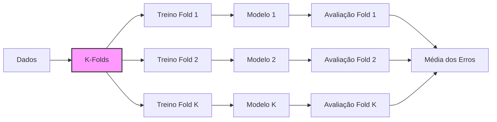
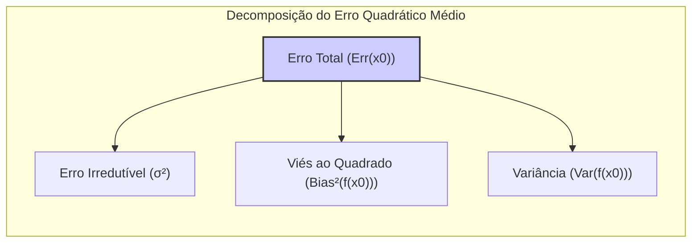
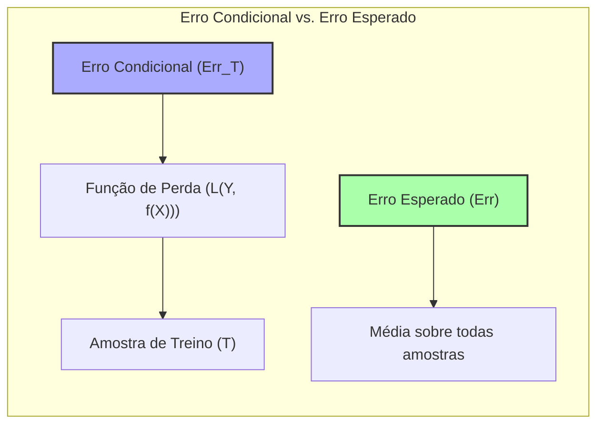
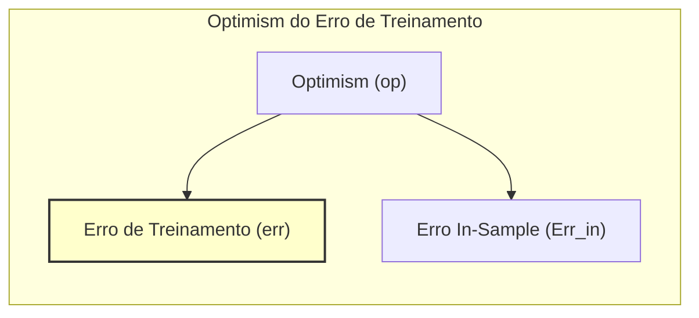
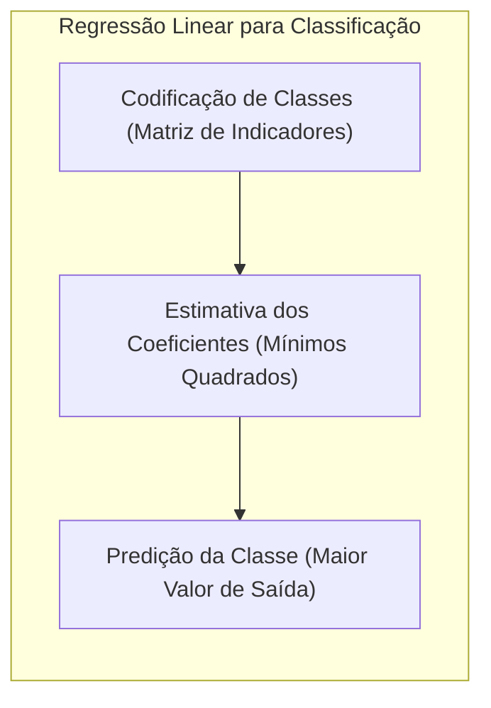
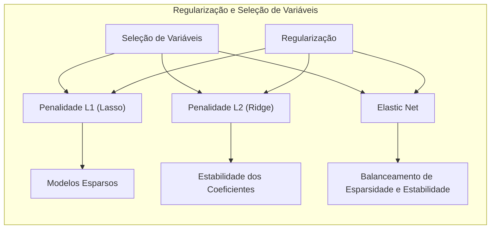
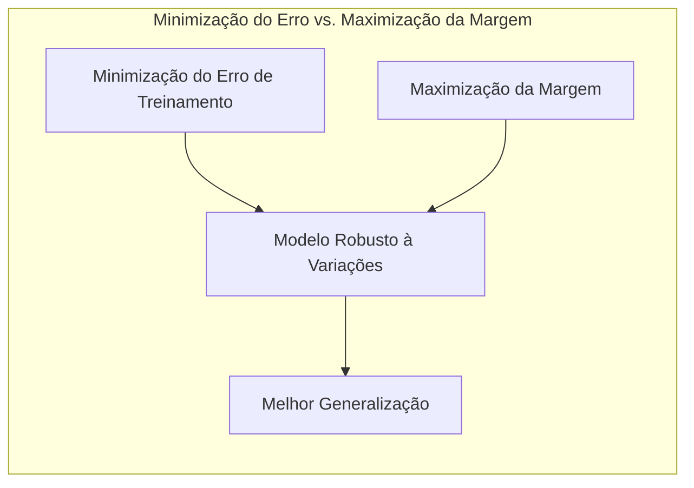

## Cross-Validation para Estimativa de Erro Condicional



### Introdução
A avaliação do desempenho de um modelo de aprendizado, especialmente sua capacidade de generalização em dados não vistos, é crucial. Métodos como o **cross-validation** (validação cruzada) são amplamente utilizados para estimar o erro de previsão, guiando a seleção do modelo mais adequado e fornecendo uma medida da qualidade do modelo escolhido [^7.1]. Este capítulo explora em profundidade o **cross-validation**, com um foco específico em como essa técnica se relaciona à estimativa do erro condicional e esperado. A complexidade dos modelos e a relação entre viés e variância também são discutidas, fornecendo uma base sólida para a compreensão dos desafios da avaliação de modelos [^7.2].

### Conceitos Fundamentais
Antes de aprofundarmos em detalhes do **cross-validation**, é essencial definir alguns conceitos fundamentais:

**Conceito 1: Erro de Generalização**
O **erro de generalização**, também conhecido como **erro de teste**, refere-se à capacidade de um modelo de prever resultados em dados independentes e não utilizados no treinamento. Este erro é crucial para avaliar a qualidade do modelo e sua aplicabilidade em novos cenários [^7.1]. O objetivo é minimizar esse erro, que é afetado pelo **trade-off entre viés e variância**. Modelos muito simples tendem a ter alto viés e baixa variância, enquanto modelos muito complexos podem ter baixo viés, mas alta variância [^7.2].

**Lemma 1:** A decomposição do erro quadrático médio para a regressão revela a importância de cada componente no erro total:
$$ Err(x_0) = \sigma^2 + Bias^2(f(x_0)) + Var(f(x_0)) $$
onde:
- $\sigma^2$ é a variância do erro irredutível.
- $Bias^2(f(x_0))$ é o viés ao quadrado, que quantifica a diferença entre a média das estimativas do modelo e o valor real.
- $Var(f(x_0))$ é a variância, que mede a variabilidade das estimativas do modelo em torno de sua média.  [Baseado em 7.3]. $\blacksquare$



> 💡 **Exemplo Numérico:** Suponha que estamos modelando a relação entre a altura de uma pessoa e seu peso. Se usarmos um modelo linear muito simples (e.g., $peso = \beta_0 + \beta_1 \times altura$), ele pode não capturar a complexidade da relação real, resultando em um alto viés. Por outro lado, se usarmos um modelo polinomial de alta ordem, ele pode se ajustar muito bem aos dados de treinamento, mas ser sensível a pequenas variações nos dados, resultando em alta variância. Imagine um cenário onde o erro irredutível $\sigma^2$ é 2, o viés ao quadrado $Bias^2(f(x_0))$ é 1, e a variância $Var(f(x_0))$ é 0.5 para um modelo linear simples. Então o erro total seria $Err(x_0) = 2 + 1 + 0.5 = 3.5$.  Se usarmos um modelo mais complexo, o viés poderia diminuir para 0.1, mas a variância aumentar para 3.5, resultando em $Err(x_0) = 2 + 0.1 + 3.5 = 5.6$. Este exemplo ilustra o trade-off entre viés e variância.

**Conceito 2: Erro Condicional vs. Erro Esperado**
O **erro condicional** ($Err_T$) mede o erro específico de um modelo em uma amostra de treino particular (*T*) [^7.2]. É definido como:
$$ Err_T = E[L(Y, f(X))|T] $$
onde *L* é a função de perda. Por outro lado, o **erro esperado** (Err) é a média do erro condicional sobre todas as possíveis amostras de treino. É expresso como:
$$ Err = E[Err_T] = E[L(Y, f(X))] $$
A distinção entre esses dois tipos de erro é essencial para entender o que o cross-validation realmente estima [^7.2]. A maioria dos métodos busca estimar o erro esperado, pois este representa uma medida mais robusta da capacidade de generalização do modelo.



> 💡 **Exemplo Numérico:** Imagine que você tem um conjunto de dados de 100 amostras. Se você treinar um modelo usando uma amostra específica de 80 amostras (conjunto *T*) e medir seu erro nessa amostra, você terá o erro condicional ($Err_T$). Se você repetir esse processo muitas vezes, cada vez com uma amostra diferente de 80 amostras, e calcular a média dos erros condicionais, você terá uma estimativa do erro esperado (Err). O cross-validation é uma forma eficiente de aproximar essa média sem ter que gerar todas as amostras possíveis.

**Corolário 1:** As abordagens de modelagem estatística geralmente estimam o **erro esperado**, dado que ele oferece uma visão mais geral sobre o desempenho do modelo, ao invés do erro condicional que é específico a um único conjunto de dados [^7.2]. Isso é particularmente relevante para comparar diferentes modelos e avaliar sua robustez.

**Conceito 3: Optimism do Erro de Treinamento**
O **erro de treinamento** (err) é o erro calculado sobre os dados utilizados para ajustar o modelo. Este erro tende a ser menor do que o erro de generalização, um fenômeno conhecido como **optimism** [^7.4]. O *optimism* surge porque o modelo se ajusta aos dados de treinamento, incluindo ruídos, o que não necessariamente o torna eficaz em dados novos [^7.4]. O *optimism* é definido como a diferença entre o erro in-sample e o erro de treinamento:
$$ op = Err_{in} - err $$
onde $Err_{in}$ é o erro amostral. O objetivo das técnicas de validação é estimar o *optimism* para corrigir o erro de treinamento e obter uma medida mais precisa do desempenho do modelo em dados não vistos [^7.4].



> 💡 **Exemplo Numérico:** Suponha que o erro de treinamento de um modelo seja 0.15 (err = 0.15) e que o erro verdadeiro sobre novos dados seja 0.25 ($Err_{in}$ = 0.25). Então o *optimism* será $op = 0.25 - 0.15 = 0.10$. Isso significa que o modelo está 0.10 "otimista" sobre seu desempenho em dados não vistos, ou seja, o erro de treinamento subestima o erro real.

> ⚠️ **Nota Importante**: O erro de treinamento sozinho não é um bom indicador do desempenho do modelo em dados não vistos.

> ❗ **Ponto de Atenção**: A complexidade do modelo afeta o equilíbrio entre viés e variância, e modelos excessivamente complexos podem apresentar overfitting, com baixo erro de treinamento, mas alto erro de generalização.

> ✔️ **Destaque**: Métodos de validação como o cross-validation visam estimar o erro esperado, que é uma medida mais confiável do desempenho de generalização.

### Regressão Linear e Mínimos Quadrados para Classificação



A regressão linear, apesar de ser um método tradicionalmente associado a problemas de regressão, pode ser adaptada para tarefas de classificação através da regressão em matrizes de indicadores [^7.2]. Ao invés de prever valores contínuos, a regressão linear pode ser usada para estimar as probabilidades de pertencimento a cada classe.
O processo inicia com a codificação das classes em uma matriz de indicadores, onde cada coluna representa uma classe e cada linha corresponde a uma observação. Em seguida, os coeficientes da regressão linear são estimados por mínimos quadrados, e a predição da classe é feita com base na coluna com o maior valor de saída.

Apesar de sua simplicidade, a regressão linear para classificação tem limitações, especialmente em cenários onde as classes não são linearmente separáveis [^7.2]. Ela não modela probabilidades de forma precisa e pode gerar previsões fora do intervalo [0, 1]. Além disso, em casos de classes não balanceadas, a regressão linear pode favorecer a classe majoritária.
No entanto, em alguns cenários onde a separação linear é uma boa aproximação, a regressão linear pode ser uma alternativa eficiente e computacionalmente barata para a classificação.

**Lemma 2:** Em cenários de separação linear, os hiperplanos de decisão obtidos pela regressão linear dos indicadores e pela Linear Discriminant Analysis (LDA) são equivalentes sob certas condições [^7.3]. Isso sugere uma conexão teórica entre regressão e classificação. $\blacksquare$
**Corolário 2:** A relação entre regressão linear e LDA permite utilizar intuições e ferramentas da regressão para problemas de classificação, o que simplifica a análise e a interpretação dos modelos. [Baseado em [^7.3]].

> 💡 **Exemplo Numérico:** Suponha que temos duas classes (0 e 1) e um único preditor *x*. Criamos uma matriz de indicadores onde a coluna 1 representa a classe 1 e a coluna 0 representa a classe 0 (se a classe não está presente, o valor é 0). Se temos a observação (x=2, classe=1), teríamos a linha [0,1], que multiplica os coeficientes de regressão (por exemplo, $\beta_0$, $\beta_1$). Após a regressão linear, a predição seria dada por:  $\hat{y} =  \beta_0 + \beta_1x$. Se $\hat{y}$ for maior que 0.5, classificamos como classe 1, caso contrário, como classe 0. Isso é uma forma simples de realizar classificação utilizando regressão linear.

**Comparação e Limitações:**

*   *Regressão Linear:* Apresenta uma implementação simples e rápida, mas com desempenho limitado em problemas com separação não linear e sensível a outliers.
*   *Regressão Logística:* Lida com problemas não lineares ao modelar probabilidades usando a função sigmoide e é mais robusta do que a regressão linear para classificação.
*   *LDA:* Encontra a melhor projeção linear dos dados minimizando a sobreposição entre as classes; eficiente para problemas linearmente separáveis.

### Métodos de Seleção de Variáveis e Regularização em Classificação



A seleção de variáveis e a regularização são técnicas cruciais para lidar com problemas de classificação com alta dimensionalidade ou risco de *overfitting* [^7.2]. Elas são empregadas para:

1.  **Selecionar Variáveis Relevantes**: Identificar as características mais importantes, reduzindo a dimensionalidade e melhorando a interpretabilidade do modelo.
2.  **Regularizar os Coeficientes**: Reduzir a complexidade do modelo, penalizando grandes valores de coeficientes, o que diminui o risco de *overfitting*.

As penalidades **L1** (Lasso) e **L2** (Ridge) são duas técnicas comuns de regularização:

*   **Penalidade L1 (Lasso)**: Adiciona a soma dos valores absolutos dos coeficientes à função de custo, induzindo esparsidade ao zerar alguns coeficientes e realizando seleção de variáveis.
*   **Penalidade L2 (Ridge)**: Adiciona a soma dos quadrados dos coeficientes à função de custo, reduzindo os valores dos coeficientes sem necessariamente zerá-los. Isso ajuda a estabilizar a estimativa e reduzir a variância.
*   **Elastic Net**: Combina as penalidades L1 e L2, aproveitando as vantagens de ambas, fornecendo modelos mais esparsos e estáveis [^7.5].

**Lemma 3:** A penalidade L1 em modelos logísticos leva a soluções com coeficientes esparsos, o que facilita a interpretação e a identificação de variáveis relevantes [^7.4.4]. Isso acontece porque a penalidade L1 tende a forçar alguns coeficientes a zero, efetivamente eliminando as variáveis associadas do modelo. $\blacksquare$
**Prova do Lemma 3:**
A penalidade L1 adiciona um termo proporcional à soma dos valores absolutos dos coeficientes à função de perda. A derivada deste termo é descontínua em zero, o que induz a que os coeficientes sejam exatamente zero no ótimo.
O processo de otimização busca minimizar a função de custo que inclui a penalidade. A forma do termo de penalização L1 faz com que alguns coeficientes se tornem exatamente zero, resultando em um modelo mais esparso e, consequentemente, mais fácil de interpretar. $\blacksquare$

> 💡 **Exemplo Numérico:** Suponha que estamos usando regressão logística para classificar clientes em "alto risco" ou "baixo risco" com base em 50 variáveis. Após aplicar a penalidade L1 (Lasso), muitos coeficientes foram definidos como zero. Isso pode significar que apenas 10 variáveis são realmente relevantes para o modelo, o que facilita a identificação de fatores determinantes. Por exemplo, após a aplicação do Lasso, o modelo resultante pode ser: $\text{log}(\frac{p}{1-p}) = 0.5x_1 + 0.2x_5 - 0.7x_{12}$, onde $x_1$, $x_5$ e $x_{12}$ são as variáveis selecionadas, e os outros coeficientes foram zerados pelo Lasso.  A penalidade L2 (Ridge), por outro lado, pode reduzir os valores dos coeficientes, mas sem necessariamente zerá-los. Por exemplo, o modelo Ridge pode ter $\text{log}(\frac{p}{1-p}) = 0.3x_1 + 0.15x_2 + 0.1x_3 + \ldots + 0.05x_{50}$, onde todos os 50 coeficientes são diferentes de zero, mas menores do que os coeficientes resultantes de um modelo sem regularização.

**Corolário 3:** A esparsidade induzida pela penalidade L1 melhora a interpretabilidade do modelo e auxilia na seleção de variáveis importantes. A combinação com a penalidade L2 no Elastic Net permite obter modelos esparsos e estáveis, equilibrando as vantagens de ambas as abordagens [^7.5].

> ⚠️ **Ponto Crucial**: A escolha entre L1, L2 ou Elastic Net depende do problema específico e dos objetivos do modelo, especialmente em relação ao trade-off entre esparsidade e estabilidade.

### Separating Hyperplanes e Perceptrons
```mermaid
stateDiagram-v2
    [*] --> Inicializacao
    Inicializacao --> Iteracao: Inicia o processo
    Iteracao --> Atualizacao: Ajusta pesos
    Atualizacao --> Verificacao: Verifica convergencia
    Verificacao --> Iteracao: Nao Convergiu
    Verificacao --> [*]: Convergiu
    state Inicializacao: "Define pesos iniciais"
    state Iteracao: "Percorre dados de treinamento"
    state Atualizacao: "Ajusta os pesos do hiperplano"
    state Verificacao: "Verifica se a classificacao esta correta"
```

O conceito de **separating hyperplanes** (hiperplanos separadores) é central para muitos métodos de classificação linear. Um hiperplano é uma superfície de dimensão *p-1* em um espaço de *p* dimensões que divide o espaço em duas regiões. Em problemas de classificação, o objetivo é encontrar um hiperplano que separe as classes da melhor forma possível [^7.5.2].
A ideia de maximizar a margem de separação entre as classes leva ao conceito de hiperplanos ótimos. Esses hiperplanos são determinados por vetores de suporte, pontos de dados que estão mais próximos ao hiperplano.
O algoritmo **Perceptron** (de Rosenblatt) é um algoritmo de aprendizado que busca iterativamente encontrar um hiperplano que separe as classes em um problema de classificação binária [^7.5.1]. O algoritmo ajusta os pesos do hiperplano com base nos erros de classificação, e, em condições específicas de separabilidade dos dados, o algoritmo converge para uma solução.
O algoritmo do Perceptron consiste em:

1.  **Inicialização**: Definir pesos iniciais para o hiperplano.
2.  **Iteração**: Percorrer os dados de treinamento, calculando a classificação de cada ponto.
3.  **Atualização**: Ajustar os pesos do hiperplano com base nos erros de classificação.
4.  **Convergência**: Repetir os passos 2 e 3 até que todos os pontos sejam classificados corretamente ou um número máximo de iterações seja atingido.

**Teorema**: Se os dados são linearmente separáveis, o algoritmo do Perceptron converge em um número finito de iterações para um hiperplano que separa corretamente as classes [^7.5.1]. $\blacksquare$

> 💡 **Exemplo Numérico:** Imagine um problema de classificação binária com duas variáveis (x1 e x2). O Perceptron busca encontrar um hiperplano que separe as duas classes. Inicialmente, os pesos do hiperplano (w1, w2, b) são definidos aleatoriamente (por exemplo, w1 = 0.2, w2 = -0.5, b = 0.1). Para cada ponto de dados (x1, x2), o Perceptron calcula uma saída: $output = w_1x_1 + w_2x_2 + b$. Se o output for maior que 0, classifica o ponto como classe 1, caso contrário, como classe 0. Se a classificação estiver errada, os pesos são atualizados. Por exemplo, se um ponto da classe 1 foi classificado como 0, os pesos são atualizados usando a regra: $w_i = w_i + \eta x_i$, onde $\eta$ é a taxa de aprendizado. O processo continua iterativamente até que todos os pontos sejam classificados corretamente ou um número máximo de iterações seja atingido.

**Discussão:**
Em situações onde os dados não são linearmente separáveis, o Perceptron pode não convergir. O método do SVM (Support Vector Machines) generaliza o conceito de hiperplanos separadores, permitindo classificar dados não linearmente separáveis através do uso de *kernels*.

### Pergunta Teórica Avançada: Qual a relação entre a minimização do erro de treinamento e a maximização da margem em problemas de classificação linear?

**Resposta:**
A minimização do erro de treinamento e a maximização da margem são dois objetivos aparentemente distintos na classificação linear, mas estão relacionados. A minimização do erro de treinamento visa ajustar um modelo que classifique corretamente os dados de treinamento. Já a maximização da margem busca encontrar um hiperplano que não apenas separe corretamente as classes, mas que também maximize a distância entre esse hiperplano e os pontos de dados mais próximos (os vetores de suporte) [^7.5.2].

Quando a margem de separação é grande, o modelo se torna mais robusto contra variações e ruídos nos dados, o que leva a um melhor desempenho na generalização. Métodos como o SVM incorporam explicitamente a maximização da margem como um critério de otimização [^7.5.2].
Uma análise mais detalhada revela que, em modelos lineares com regularização, a maximização da margem pode ser vista como uma forma de reduzir o *overfitting* e melhorar a generalização. Ao penalizar modelos com margens pequenas, a regularização direciona a otimização para modelos que são mais gerais e robustos [^7.5.2].



**Lemma 4**: A maximização da margem em SVMs pode ser vista como uma forma de regularização, pois penaliza modelos que estão muito próximos dos dados e favorece modelos mais gerais e robustos [^7.5.2]. $\blacksquare$
**Corolário 4**: O uso de *kernels* permite estender o conceito de margem para dados não linearmente separáveis, realizando uma projeção implícita dos dados em um espaço de dimensão superior onde a separação linear é possível.

> 💡 **Exemplo Numérico:** Imagine que temos duas classes de dados que podem ser separadas por vários hiperplanos. A minimização do erro de treinamento simplesmente busca um hiperplano que classifique corretamente todos os pontos. No entanto, pode haver muitos hiperplanos que satisfazem essa condição. O SVM, por outro lado, busca o hiperplano que maximiza a margem, isto é, o que possui a maior distância entre as classes. Isso torna o modelo mais robusto e com maior capacidade de generalização. Por exemplo, se o ponto de dados de uma classe estiver muito próximo do hiperplano, um pequeno ruído nesses dados pode levar a classificação errada, o que não acontece quando a margem é maximizada.

> ⚠️ **Ponto Crucial**: A maximização da margem geralmente conduz a melhores resultados de generalização comparativamente a métodos que apenas minimizam o erro de treinamento.

### Conclusão
O **cross-validation** é uma ferramenta essencial para a avaliação de modelos, e a compreensão de seu funcionamento, bem como seus pontos fortes e limitações, é crucial para o sucesso em tarefas de modelagem estatística e aprendizado de máquina. É importante reconhecer a distinção entre erro condicional e esperado, e como o **cross-validation** se esforça para estimar o último. Técnicas como a regularização e a seleção de variáveis, combinadas com um uso correto do cross-validation, são cruciais para construir modelos robustos, generalizáveis e interpretáveis.
<!-- END DOCUMENT -->
### Footnotes
[^7.1]: "The generalization performance of a learning method relates to its predic-tion capability on independent test data. Assessment of this performance is extremely important in practice, since it guides the choice of learning method or model, and gives us a measure of the quality of the ultimately chosen model." *(Trecho de Model Assessment and Selection)*
[^7.2]: "Figure 7.1 illustrates the important issue in assessing the ability of a learn-ing method to generalize. Consider first the case of a quantitative or interval scale response." *(Trecho de Model Assessment and Selection)*
[^7.3]: "For a linear model family such as ridge regression, we can break down the bias more finely." *(Trecho de Model Assessment and Selection)*
[^7.4]: "Training error is the average loss over the training sample" *(Trecho de Model Assessment and Selection)*
[^7.4.4]: "For the logistic regression model, using the binomial log-likelihood, we have" *(Trecho de Model Assessment and Selection)*
[^7.5]: "The methods in this chapter are designed for situations where there is insufficient data to split it into three parts." *(Trecho de Model Assessment and Selection)*
[^7.5.1]:  "Besides their use in model selection, we also examine to what extent each method provides a reliable estimate of test error of the final chosen model." *(Trecho de Model Assessment and Selection)*
[^7.5.2]: "Before jumping into these topics, we first explore in more detail the nature of test error and the bias-variance tradeoff." *(Trecho de Model Assessment and Selection)*
