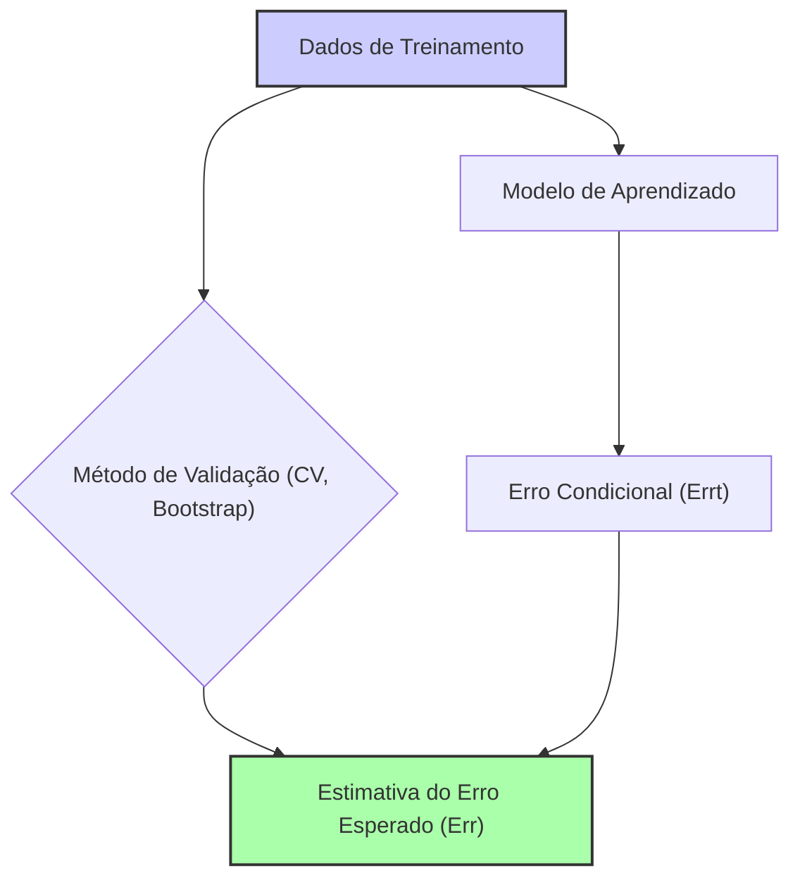
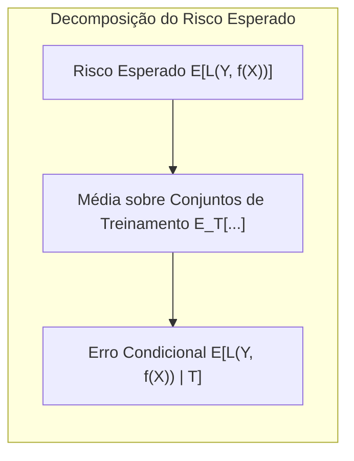
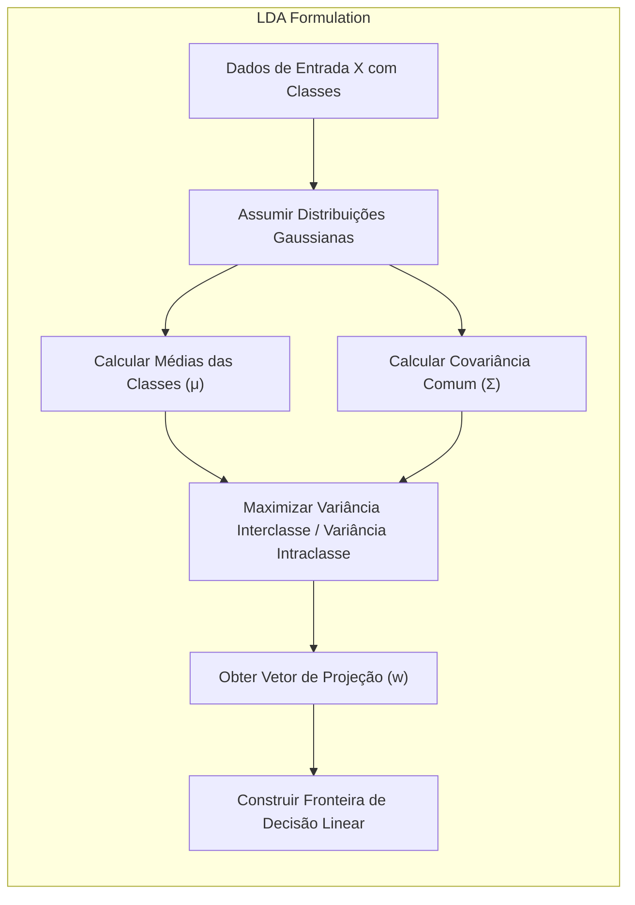
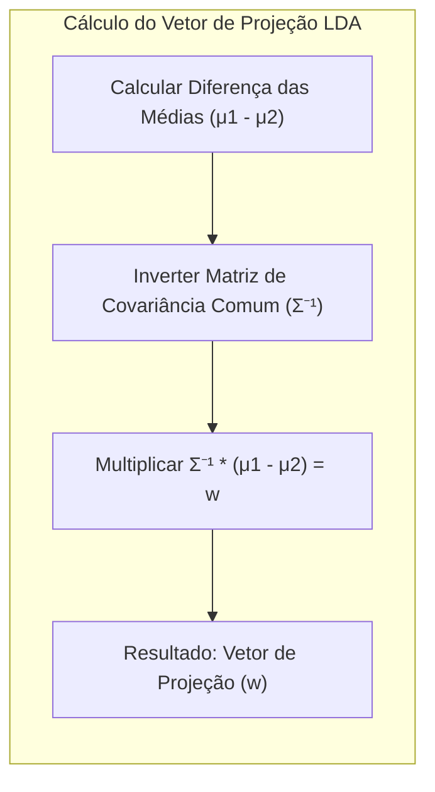
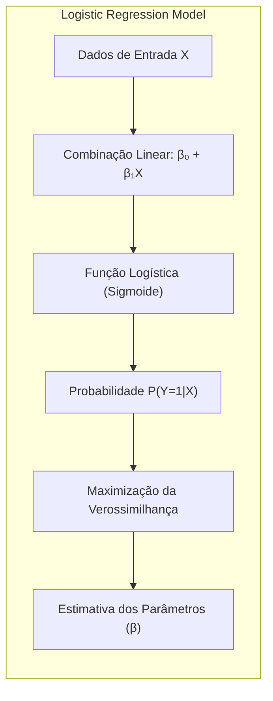
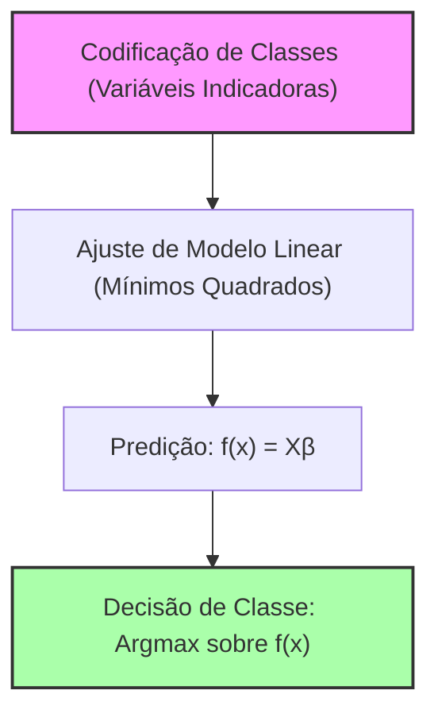
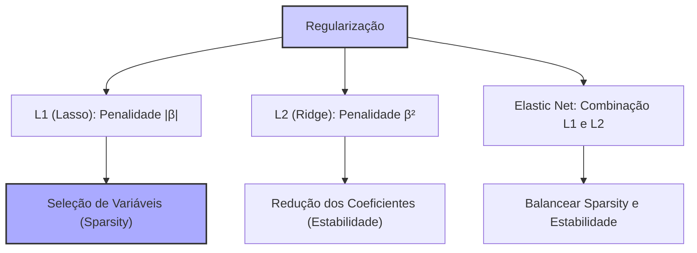
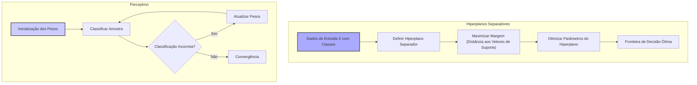
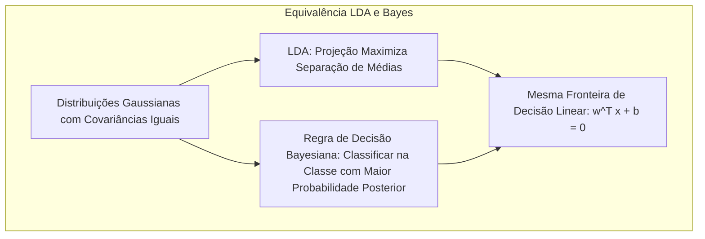
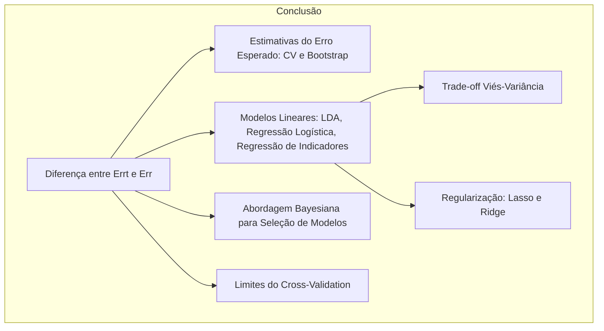

## Conditional vs. Expected Test Error: A Deep Dive into Model Evaluation

### Introdução
A avaliação do desempenho de modelos de aprendizado estatístico é crucial para garantir sua eficácia em dados não observados. A **generalização** de um modelo, ou seja, sua capacidade de prever corretamente em dados novos e independentes, é o objetivo final. Este capítulo explora os métodos para essa avaliação e como eles são usados para seleção de modelos. Inicialmente, focamos na relação entre **viés, variância e complexidade do modelo**, para então aprofundar a distinção entre **erro condicional e erro esperado** [^7.1]. Este último ponto é crucial para entender como diferentes métodos de validação operam e quais são suas limitações [^7.1].

### Conceitos Fundamentais

**Conceito 1:** O **problema de classificação** envolve atribuir uma categoria ou classe a uma entrada com base em dados de treinamento. Métodos lineares, embora simples, são um ponto de partida comum, mas podem apresentar um trade-off entre **viés** (tendência de subajuste) e **variância** (tendência de sobreajuste) [^7.2]. Métodos com alta complexidade tendem a se ajustar bem aos dados de treinamento, reduzindo o viés, mas correm o risco de sobreajustar e ter alta variância. Um modelo com complexidade intermediária é geralmente preferido, pois equilibra viés e variância, como ilustrado na Figura 7.1 [^7.2].

> 💡 **Exemplo Numérico:** Imagine que temos um conjunto de dados com pontos em duas dimensões, e queremos classificar esses pontos em duas classes (azul e vermelho). Um modelo linear simples (como uma reta) pode não conseguir separar corretamente as classes se elas estiverem dispostas de forma complexa (alta probabilidade de viés/subajuste). Por outro lado, um modelo muito complexo (como uma curva altamente sinuosa) pode se ajustar perfeitamente aos dados de treinamento, mas falhar em classificar novos pontos (alta variância/sobreajuste). Um modelo de complexidade intermediária (como uma curva suave) pode encontrar um melhor equilíbrio, com um viés e variância aceitáveis.

**Lemma 1:** Dado um modelo $f(X)$ e um conjunto de treinamento $T$, a perda esperada (ou risco) pode ser decomposta em uma parte que depende da complexidade do modelo e uma parte que depende dos dados de treinamento [^7.2, 7.3]:

$$
E[L(Y,f(X))] =  E_{T}[E[L(Y,f(X))|T]]
$$
onde $E_{T}$ indica a esperança sobre diferentes conjuntos de treinamento e $E[L(Y,f(X))|T]$ é o erro de teste condicional no conjunto $T$. Isto mostra a importância do erro esperado (integrado sobre todos os possíveis conjuntos de treino) no problema de avaliação de modelos [^7.2, 7.3].

> 💡 **Exemplo Numérico:**  Suponha que temos um modelo de regressão linear com parâmetros $\beta$.  O erro esperado $E[L(Y,f(X))]$ representa o erro médio do modelo ao longo de todos os conjuntos de treinamento possíveis. O erro condicional $E[L(Y,f(X))|T]$ é o erro específico quando o modelo foi treinado em um conjunto específico $T$.  Por exemplo, se usarmos um conjunto $T_1$ e calcularmos o erro condicional obtivemos um valor de $0.2$, e se usarmos um conjunto $T_2$ obtemos $0.3$.  O erro esperado será a média sobre todos os possíveis erros condicionais, algo como $E_{T}[E[L(Y,f(X))|T]] = 0.25$, se considerarmos que estes dois conjuntos foram os únicos a serem considerados.

**Conceito 2:** A **Linear Discriminant Analysis (LDA)** é um método de classificação que pressupõe distribuições Gaussianas para cada classe e utiliza uma função discriminante linear para separar as classes [^7.3]. A LDA assume covariâncias iguais entre as classes, e busca a projeção que melhor separa as médias das classes, enquanto minimiza a variância dentro das classes. A formulação do LDA envolve a obtenção de parâmetros que maximizam a razão entre a variância interclasses e a variância intraclasses [^7.3.1]. O método constrói uma fronteira de decisão linear baseada na análise dessas variações [^7.3.2].

> 💡 **Exemplo Numérico:**  Imagine um problema de classificação de duas classes, onde a classe 1 tem média $\mu_1 = [1, 1]$ e a classe 2 tem média $\mu_2 = [3, 3]$. Suponha que a matriz de covariância compartilhada seja $\Sigma = [[1, 0.5], [0.5, 1]]$. A LDA buscará uma direção $w$ que maximize a separação entre essas médias, levando em conta a dispersão dos dados.

**Corolário 1:** A função discriminante linear do LDA, dada por $f(x) = w^T x + b$, pode ser vista como uma projeção dos dados $x$ em uma direção $w$. A direção $w$ é determinada pela diferença entre as médias das classes e a covariância comum das classes, levando a uma decisão de classe [^7.3.1]:
$$
w = \Sigma^{-1} (\mu_1 - \mu_2)
$$
onde $\mu_1$ e $\mu_2$ são as médias das classes e $\Sigma$ é a covariância comum. Esta formulação implica que a decisão é tomada com base na distância projetada de um ponto em relação à fronteira de decisão [^7.3.3].

> 💡 **Exemplo Numérico:**  Continuando o exemplo anterior, para calcular $w$ primeiro devemos calcular $\mu_1 - \mu_2 = [-2, -2]$. Em seguida, calculamos $\Sigma^{-1} = [[1.33, -0.66], [-0.66, 1.33]]$. Logo, $w = \Sigma^{-1} (\mu_1 - \mu_2) = [[1.33, -0.66], [-0.66, 1.33]] \cdot [-2, -2] = [-1.33, -1.33]$.  O termo de bias $b$ é calculado com base na distância das médias para o hiperplano de decisão, de modo que a fronteira é centrada entre as médias.

**Conceito 3:** A **Logistic Regression** modela a probabilidade de um evento (a pertença a uma classe) utilizando uma função logística (sigmóide), a qual transforma uma combinação linear das entradas em uma probabilidade entre 0 e 1 [^7.4]. Em regressão logística, os parâmetros do modelo são estimados por meio da maximização da verossimilhança. A função de verossimilhança é definida como o produto das probabilidades de cada observação, e a otimização é realizada através de um algoritmo iterativo [^7.4.1]. A regressão logística oferece um modelo probabilístico flexível para classificação, com boa interpretabilidade, mas pode ser computacionalmente mais cara do que LDA para grandes conjuntos de dados [^7.4.2, 7.4.3, 7.4.4].

> 💡 **Exemplo Numérico:**  Suponha um problema binário com uma única característica $x$. O modelo de regressão logística é da forma $p(y=1|x) = \frac{1}{1 + e^{-(\beta_0 + \beta_1 x)}}$. Se os parâmetros estimados forem $\beta_0 = -2$ e $\beta_1 = 1$, para um $x=3$, a probabilidade estimada da classe 1 será $p(y=1|x=3) = \frac{1}{1 + e^{-(-2 + 1*3)}} =  \frac{1}{1 + e^{-1}} \approx 0.73$.

> ⚠️ **Nota Importante**: Tanto LDA quanto Logistic Regression são métodos lineares para classificação, mas diferem em suas premissas e em como modelam as probabilidades de classe [^7.3, 7.4].

> ❗ **Ponto de Atenção**: Modelos de classificação podem sofrer com desbalanceamento de classes, onde uma classe ocorre muito mais frequentemente que as outras. Isso pode levar o modelo a favorecer a classe majoritária, necessitando de técnicas de balanceamento [^7.4.2].

> ✔️ **Destaque**: Tanto LDA quanto regressão logística levam a funções discriminantes lineares, embora as estimativas dos parâmetros possam ser diferentes, refletindo abordagens probabilísticas distintas [^7.5].

### Regressão Linear e Mínimos Quadrados para Classificação

A **regressão linear** pode ser aplicada à classificação através da **regressão de indicadores**. Nesse método, as classes são codificadas usando variáveis indicadoras (dummies), onde cada variável representa uma classe específica [^7.2]. Por exemplo, em um problema de classificação binária, a variável de saída $Y$ assume valor 0 para a classe 0 e 1 para a classe 1. Em um problema de classificação com $K$ classes, criamos $K$ variáveis indicadoras, cada qual com valor 1 para uma dada classe e 0 para as demais. O objetivo é ajustar um modelo linear a estas variáveis [^7.2]. Para uma variável $Y$, o ajuste pode ser feito usando o método de **mínimos quadrados**, minimizando a soma dos erros quadráticos entre as previsões e as variáveis indicadoras [^7.2]:

$$
\min_\beta \sum_{i=1}^N (y_i - \beta^T x_i)^2
$$

Onde $y_i$ é o valor da variável indicadora para a i-ésima observação, e $x_i$ é o vetor de atributos dessa mesma observação. No entanto, a regressão de indicadores tem limitações. As previsões lineares podem, em alguns casos, resultar em valores fora do intervalo [0,1], o que dificulta a interpretação como probabilidade. Além disso, a regressão de indicadores pode ser menos eficiente em termos de viés e variância quando comparada à regressão logística em certos cenários [^7.2, 7.3].

> 💡 **Exemplo Numérico:** Considere um problema de classificação binária com um único preditor $x$. Suponha que temos 5 observações:  $x = [1, 2, 3, 4, 5]$ e  $y = [0, 0, 1, 1, 1]$. Usando regressão linear, podemos encontrar os coeficientes $\beta_0$ e $\beta_1$ que minimizam o erro quadrático entre a predição $\hat{y} = \beta_0 + \beta_1 x$ e os valores de $y$. Usando mínimos quadrados, por exemplo, podemos obter $\beta_0 \approx -0.6$ e $\beta_1 \approx 0.3$. Note que para alguns valores de x, a predição será menor que 0 ou maior que 1, o que dificulta a interpretação como probabilidade.

**Lemma 2:** Para o caso de uma classificação binária, onde as classes são codificadas como 0 e 1, a fronteira de decisão obtida via regressão linear de indicadores é equivalente ao hiperplano de decisão obtido por um discriminante linear, sob a condição que os parâmetros da regressão tenham sido estimados por mínimos quadrados. Isso acontece porque a regressão linear buscará minimizar o erro quadrático da função indicadora, resultando em uma separação linear entre as classes [^7.2].

**Corolário 2:** A equivalência do Lemma 2 implica que, em certas condições, a análise discriminante linear (LDA) e a regressão de indicadores podem levar a soluções muito semelhantes, mas os fundamentos probabilísticos são diferentes. No entanto, é importante notar que essa equivalência é válida quando a regressão linear é usada com as variáveis indicadoras e a covariância entre os grupos de classes não é muito diferente. A LDA assume uma covariância compartilhada e normalidade para cada classe, enquanto a regressão linear não impõe estas restrições, mas pode ter um comportamento menos preciso [^7.3].

“Em certos cenários, conforme apontado em [^7.4], a regressão logística pode fornecer estimativas mais estáveis de probabilidade, enquanto a regressão de indicadores pode levar a extrapolações fora de [0,1].”

“No entanto, há situações em que a regressão de indicadores, de acordo com [^7.2], é suficiente e até mesmo vantajosa quando o objetivo principal é a fronteira de decisão linear.”

### Métodos de Seleção de Variáveis e Regularização em Classificação

Em problemas de classificação com muitas variáveis, a **seleção de variáveis** e a **regularização** são cruciais para evitar overfitting e aumentar a interpretabilidade do modelo [^7.4.4]. A **regularização L1** (Lasso) adiciona uma penalidade à função de custo proporcional à soma dos valores absolutos dos parâmetros. Isso leva a soluções esparsas, em que muitos coeficientes são reduzidos a zero, efetivamente realizando a seleção de variáveis [^7.4.4]. A **regularização L2** (Ridge) adiciona uma penalidade proporcional à soma dos quadrados dos parâmetros. Isso resulta em soluções com coeficientes menores, mas geralmente diferentes de zero, aumentando a estabilidade do modelo [^7.4.4]. A **Elastic Net** combina as penalidades L1 e L2, buscando um equilíbrio entre sparsity e estabilidade [^7.5].

A regularização é incorporada na função de custo, seja da regressão logística ou de outros modelos, da seguinte maneira. Considere o caso da regressão logística, a função de custo a ser minimizada se torna:

$$
J(\beta) = - \sum_{i=1}^N [y_i \log(p(x_i)) + (1-y_i) \log(1-p(x_i))] + \lambda \sum_{j=1}^p |\beta_j|
$$
para o caso L1, e

$$
J(\beta) = - \sum_{i=1}^N [y_i \log(p(x_i)) + (1-y_i) \log(1-p(x_i))] + \lambda \sum_{j=1}^p \beta_j^2
$$
para o caso L2, onde $\lambda$ é um hiperparâmetro que controla a força da regularização, $p(x_i)$ é a probabilidade predita pela regressão logística, e $y_i$ é a classe real.

> 💡 **Exemplo Numérico:** Suponha que estamos treinando um modelo de regressão logística com 5 preditores ($x_1, x_2, x_3, x_4, x_5$) e as estimativas iniciais dos coeficientes são $\beta = [0.8, -0.5, 0.2, 1.2, -0.1]$. Se usarmos regularização L1 com $\lambda = 0.5$, a penalidade será $0.5 * (|0.8| + |-0.5| + |0.2| + |1.2| + |-0.1|) = 1.4$. A otimização do modelo com essa penalidade tenderá a reduzir alguns coeficientes a zero. Com L2, a penalidade seria $0.5 * (0.8^2 + (-0.5)^2 + 0.2^2 + 1.2^2 + (-0.1)^2) = 1.135$, que levaria a coeficientes menores mas não necessariamente zero.

**Lemma 3:** A penalização L1 em um modelo de classificação logística leva à esparsidade dos coeficientes. Isso pode ser provado mostrando que, na otimização da função de custo, a derivada da função de penalidade L1 (que é a função sinal) faz com que os coeficientes tendam a zero, se o efeito do atributo for fraco. Os coeficientes que não tiverem magnitude suficiente para compensar a penalidade, convergirão para zero, portanto, selecionando as variáveis mais importantes.

**Prova do Lemma 3:** A função de custo com L1 é não-diferenciável em $\beta=0$. No entanto, se utilizarmos o conceito de subgradiente, podemos analisar o problema. O subgradiente da parte penalizada do custo, $\lambda \sum_{j=1}^p |\beta_j|$, com respeito a $\beta_j$ é $\lambda sign(\beta_j)$, onde $sign(\beta_j) = 1$ se $\beta_j>0$, $-1$ se $\beta_j<0$ e qualquer valor em [-1,1] se $\beta_j = 0$. Para qualquer $\beta_j$ não nulo, a direção do subgradiente o empurra em direção a zero (já que a penalidade é sempre positiva). No caso de $\beta_j=0$, o subgradiente está entre $-\lambda$ e $\lambda$, e ele só não será nulo se a derivada do restante da função de custo tiver uma magnitude maior que $\lambda$, caso contrário o parâmetro permanecerá em $\beta_j=0$. $\blacksquare$

**Corolário 3:** A esparsidade induzida pela penalização L1 simplifica o modelo e melhora sua interpretabilidade, pois apenas um subconjunto de variáveis contribui significativamente para a predição. Isso facilita a identificação dos fatores mais relevantes para a classificação [^7.4.5].

> ⚠️ **Ponto Crucial**: L1 e L2 podem ser combinadas (Elastic Net) para aproveitar vantagens de ambos os tipos de regularização, conforme discutido em [^7.5].

### Separating Hyperplanes e Perceptrons

Os **hiperplanos separadores** são utilizados em classificação para dividir o espaço de características em regiões correspondentes às diferentes classes [^7.5.2]. O objetivo é encontrar um hiperplano que maximize a margem de separação entre as classes, ou seja, a distância mínima entre o hiperplano e os pontos mais próximos de cada classe, chamados de vetores de suporte. Este conceito é a base dos Support Vector Machines (SVMs). A formulação matemática desse problema de otimização é dada pela maximização da margem, que geralmente é implementada utilizando o dual de Wolfe [^7.5.2]. Essa formulação leva a soluções que são combinações lineares dos pontos de suporte.

O **Perceptron** de Rosenblatt é um algoritmo de aprendizado que busca um hiperplano separador, atualizando iterativamente seus parâmetros com base na classificação incorreta das amostras. O algoritmo garante convergência quando os dados são linearmente separáveis, e cada atualização move o hiperplano em direção a uma melhor separação. A formulação da atualização dos parâmetros envolve a adição de um múltiplo do vetor de entrada correspondente a amostras mal classificadas ao vetor de pesos, até que todos os dados sejam classificados corretamente [^7.5.1].

> 💡 **Exemplo Numérico:** Imagine que temos um perceptron com pesos iniciais $w = [0.1, -0.2]$ e bias $b=0.3$. Temos um ponto $x=[2, 1]$ que é da classe positiva (y=1), mas a predição é dada por $\hat{y} = w^T x + b = 0.1*2 + (-0.2)*1 + 0.3 = 0.3$ que é menor que 0, indicando que o ponto foi classificado incorretamente. A atualização do peso é feita somando o vetor de entrada $x$ ao vetor de peso $w$, resultando em  $w_{new} = w_{old} + \eta x$, onde $\eta$ é a taxa de aprendizado (por exemplo 0.1). $w_{new} = [0.1, -0.2] + 0.1*[2, 1] = [0.3, -0.1]$. Isso leva a uma predição mais favorável para a classificação correta.

### Pergunta Teórica Avançada: Quais as diferenças fundamentais entre a formulação de LDA e a Regra de Decisão Bayesiana considerando distribuições Gaussianas com covariâncias iguais?

**Resposta:** Sob a hipótese de distribuições Gaussianas e covariâncias iguais, a LDA se torna equivalente à regra de decisão Bayesiana, e ambas as abordagens levam à mesma fronteira de decisão linear [^7.3]. A LDA assume que as classes são Gaussianas com covariâncias iguais. A regra de decisão Bayesiana, por sua vez, busca classificar uma amostra na classe com maior probabilidade posterior [^7.3]. Em outras palavras, a regra de decisão Bayesiana, para este caso particular, se transforma na regra de decisão do LDA.

O limite de decisão entre duas classes, sob essas condições, é um hiperplano perpendicular à linha que une as médias das classes e é dado por [^7.3]:

$$
w^T x + b = 0
$$

onde $w$ é o vetor de pesos, $x$ é o vetor de características e $b$ é o termo de bias. A diferença fundamental entre as formulações é que o LDA obtém o vetor $w$ pela inversão da covariância empírica e a regra de decisão bayesiana obtém o mesmo vetor $w$ usando as probabilidades das classes. Em termos matemáticos, ambas as formas de encontrar o hiperplano são equivalentes [^7.3.3].

**Lemma 4:** Se as distribuições das classes forem Gaussianas com covariâncias iguais, a regra de decisão Bayesiana leva à mesma fronteira de decisão linear que o LDA. Formalmente, isso pode ser comprovado mostrando que o log-odds ratio das probabilidades posteriores nas duas abordagens é equivalente, resultando na mesma formulação da fronteira de decisão [^7.3, 7.3.1].

**Corolário 4:** A Relaxando a hipótese de covariâncias iguais, a regra de decisão bayesiana leva a fronteiras de decisão quadráticas, conhecido como Quadratic Discriminant Analysis (QDA), que permite diferentes formas de regiões de decisão [^7.3]. Isso mostra a flexibilidade da abordagem Bayesiana em relação ao LDA, que é mais restritivo [^7.3].

> ⚠️ **Ponto Crucial**: A adoção ou não de covariâncias iguais impacta fortemente o tipo de fronteira de decisão (linear vs. quadrática), conforme discutido em [^7.3.1].

### Conclusão

A escolha de modelos e a avaliação de seu desempenho são etapas cruciais no aprendizado estatístico. Este capítulo explorou a importância da distinção entre **erro condicional** (Errt) e **erro esperado** (Err), mostrando como métodos como cross-validation e bootstrap fornecem estimativas, majoritariamente, do erro esperado, o qual quantifica o desempenho do modelo em média sobre todos os possíveis conjuntos de treino. Modelos lineares, como LDA, regressão logística e regressão de indicadores, foram detalhados, e suas limitações foram discutidas, especialmente no contexto do trade-off entre viés e variância. Técnicas de regularização, como Lasso e Ridge, podem ser incorporadas para evitar overfitting. A abordagem bayesiana, que leva a uma formulação similar do BIC, também foi abordada para seleção de modelos. Uma discussão detalhada sobre a validade do cross-validation também foi apresentada, mostrando seus limites.

### Footnotes
[^7.1]: "The generalization performance of a learning method relates to its predic-tion capability on independent test data. Assessment of this performance is extremely important in practice, since it guides the choice of learning method or model, and gives us a measure of the quality of the ultimately chosen model." *(Trecho de <Model Assessment and Selection>)*
[^7.2]: "Figure 7.1 illustrates the important issue in assessing the ability of a learn-ing method to generalize. Consider first the case of a quantitative or interval scale response. We have a target variable Y, a vector of inputs X, and a prediction model f(X) that has been estimated from a training set T." *(Trecho de <Model Assessment and Selection>)*
[^7.3]: "The story is similar for a qualitative or categorical response G taking one of K values in a set G, labeled for convenience as 1, 2, ..., K. Typically we model the probabilities pk(X) = Pr(G = k|X) (or some monotone transformations fr(X)), and then Ĝ(X) = arg maxk Îk(X)." *(Trecho de <Model Assessment and Selection>)*
[^7.3.1]:  "Typically we model the probabilities pk(X) = Pr(G = k|X) (or some monotone transformations fr(X)), and then Ĝ(X) = arg maxk Îk(X). In some cases, such as 1-nearest neighbor classification (Chapters 2 and 13) we produce Ĝ(X) directly. Typical loss functions are" *(Trecho de <Model Assessment and Selection>)*
[^7.3.2]: "The quantity -2 × the log-likelihood is sometimes referred to as the deviance." *(Trecho de <Model Assessment and Selection>)*
[^7.3.3]: "Again, test error here is Errㅜ = E[L(G, Ĝ(X))|T], the population mis-classification error of the classifier trained on T, and Err is the expected misclassification error." *(Trecho de <Model Assessment and Selection>)*
[^7.4]:  "The log-likelihood can be used as a loss-function for general response densities, such as the Poisson, gamma, exponential, log-normal and others." *(Trecho de <Model Assessment and Selection>)*
[^7.4.1]: "If Pro(x) (Y) is the density of Y, indexed by a parameter 0(X) that depends on the predictor X, then L(Y,0(X)) = −2. log Pro(x) (Y)." *(Trecho de <Model Assessment and Selection>)*
[^7.4.2]: "The "-2" in the definition makes the log-likelihood loss for the Gaussian distribution match squared-error loss." *(Trecho de <Model Assessment and Selection>)*
[^7.4.3]: "For ease of exposition, for the remainder of this chapter we will use Y and f(X) to represent all of the above situations, since we focus mainly on the quantitative response (squared-error loss) setting." *(Trecho de <Model Assessment and Selection>)*
[^7.4.4]: "In this chapter we describe a number of methods for estimating the expected test error for a model." *(Trecho de <Model Assessment and Selection>)*
[^7.4.5]: "Typically our model will have a tuning parameter or parameters a and so we can write our predictions as fa(x). The tuning parameter varies the complexity of our model, and we wish to find the value of a that minimizes error, that is, produces the minimum of the average test error curve in Figure 7.1." *(Trecho de <Model Assessment and Selection>)*
[^7.5]: "Having said this, for brevity we will often suppress the dependence of f(x) on a." *(Trecho de <Model Assessment and Selection>)*
[^7.5.1]: "It is important to note that there are in fact two separate goals that we might have in mind: Model selection: estimating the performance of different models in order to choose the best one." *(Trecho de <Model Assessment and Selection>)*
[^7.5.2]: "Model assessment: having chosen a final model, estimating its predic-tion error (generalization error) on new data." *(Trecho de <Model Assessment and Selection>)*
