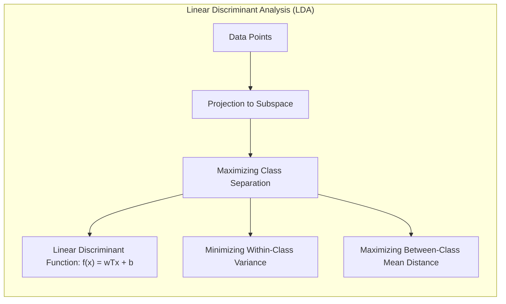
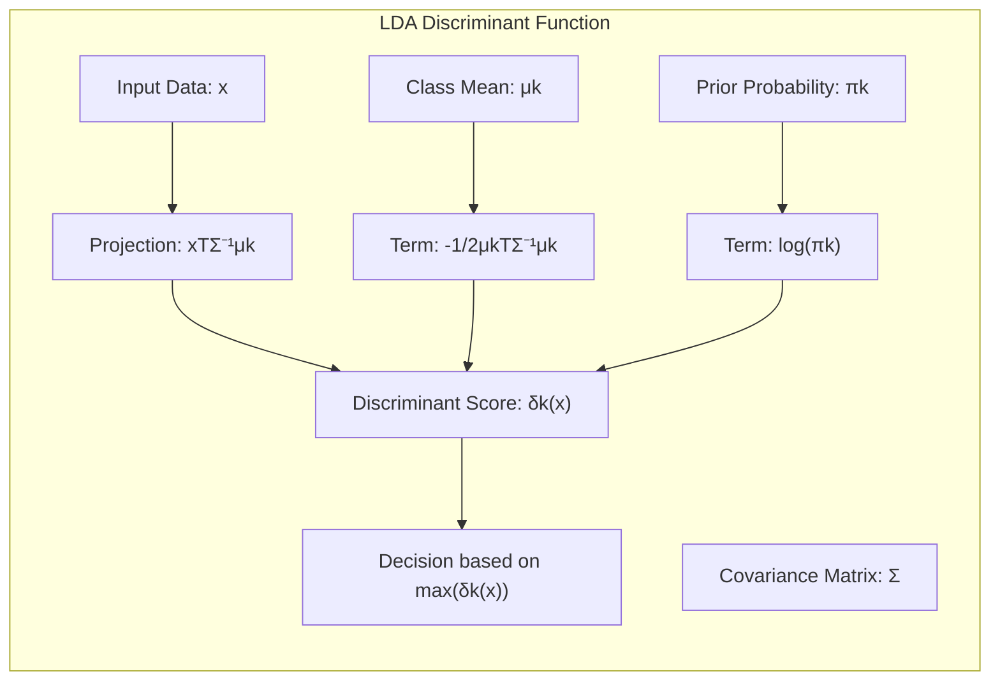
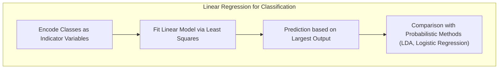
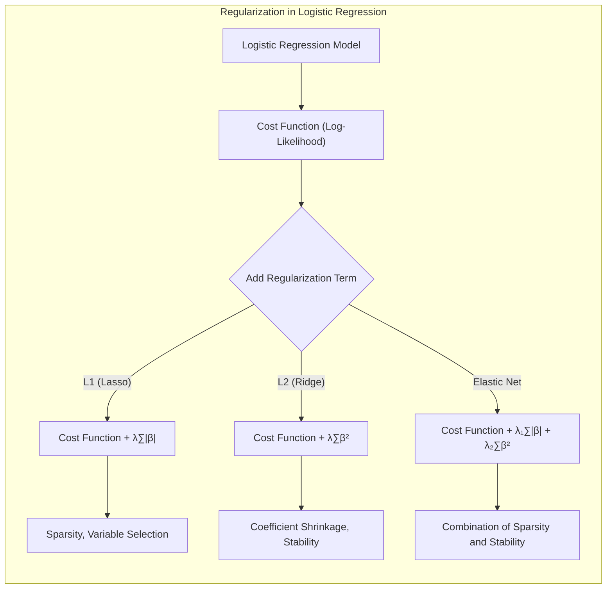
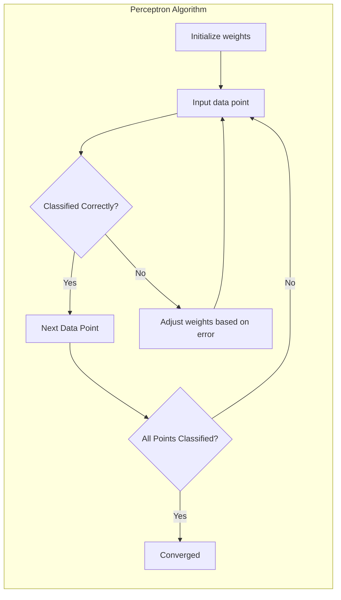
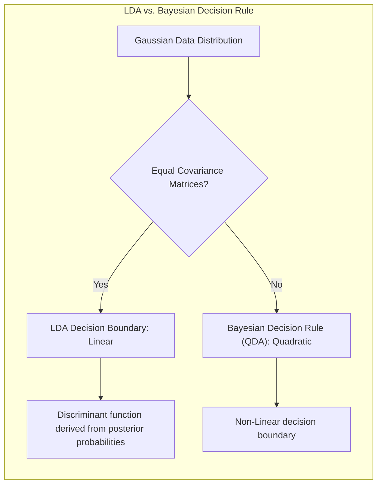

## Avaliação e Seleção de Modelos com Correlação Negativa

```mermaid
graph TD
 subgraph "Model Evaluation Process"
    A["Data"] --> B["Model Training"]
    B --> C["Model Evaluation"]
    C --> D{"Model Selection"}
    D -->| "Best Model" | E["Final Model"]
    C -->| "Performance Metrics" | F["Bias, Variance, Complexity"]
    F --> D
 end
```

### Introdução

A avaliação da performance de um método de aprendizado estatístico é crucial para determinar sua capacidade de generalização, ou seja, sua habilidade em fazer previsões precisas em dados não vistos [^7.1]. A prática de avaliar modelos é essencial, pois direciona a escolha do método de aprendizado, do modelo e nos fornece uma medida da qualidade do modelo selecionado [^7.1]. Este capítulo aborda os métodos chave para avaliar o desempenho do modelo, mostrando como são usados para selecionar modelos e discute a interação entre **bias**, **variância** e a **complexidade do modelo**.

### Conceitos Fundamentais

**Conceito 1:** O problema de classificação envolve a atribuição de um objeto a uma categoria ou classe pré-definida. Modelos lineares, como a Regressão Logística e a Análise Discriminante Linear (LDA), são usados para construir fronteiras de decisão linear que separam as classes. No entanto, existe um trade-off entre o viés (*bias*) e a variância, onde modelos simples (com maior viés) podem não capturar padrões complexos nos dados, enquanto modelos complexos (com maior variância) podem se ajustar excessivamente ao ruído, levando a uma má generalização [^7.2]. O uso de métodos lineares pode levar a um viés se a relação entre as variáveis preditoras e a resposta não for linear. A complexidade do modelo é ajustada para minimizar o erro de previsão em dados não vistos.

> 💡 **Exemplo Numérico:** Suponha que temos um conjunto de dados com uma relação não-linear entre a variável preditora (X) e a variável de resposta (Y), onde Y = X² + ε, com ε representando um ruído aleatório. Se tentarmos ajustar um modelo linear Y = β₀ + β₁X, teremos um alto viés porque o modelo linear não consegue capturar a curvatura da relação. Por outro lado, um modelo muito complexo, como um polinômio de grau 10, pode se ajustar perfeitamente aos dados de treinamento, incluindo o ruído, e ter alta variância, levando a erros grandes em dados não vistos. O ideal seria um modelo que capture a tendência principal sem ajustar demais o ruído, como um polinômio de grau 2.

**Lemma 1:** *A função discriminante linear, que determina a fronteira de decisão em LDA, pode ser expressa como uma combinação linear das características, ou seja, $f(x) = w^Tx + b$ , onde $w$ são os pesos e $b$ o termo de viés*. A demonstração deste lemma se baseia na formulação de LDA, conforme descrito em [^7.3], onde a projeção dos dados em um subespaço de menor dimensão preserva a separabilidade das classes. Isso ocorre devido a LDA otimizar a separação das médias das classes, minimizando a variância dentro de cada classe e maximizando a distância entre as médias [^7.3.1].



**Conceito 2:** A **Linear Discriminant Analysis (LDA)** é uma técnica de classificação que assume que as classes têm distribuições gaussianas com a mesma matriz de covariância [^7.3]. A LDA encontra uma combinação linear das variáveis preditoras que maximiza a separação entre as médias das classes, minimizando a variância dentro de cada classe [^7.3.2]. A fronteira de decisão linear é definida pelo ponto onde as probabilidades posteriores das classes são iguais, levando a uma classificação. No entanto, a LDA tem limitações se as suposições de normalidade ou igualdade de covariância forem violadas [^7.3.3].

> 💡 **Exemplo Numérico:** Considere um problema de classificação com duas classes, "A" e "B", e duas variáveis preditoras, x₁ e x₂. Vamos supor que, após aplicar LDA, obtivemos a função discriminante $f(x) = 0.5x_1 + 1.2x_2 - 2$. Pontos para os quais $f(x) > 0$ são classificados como classe "A", e pontos com $f(x) < 0$ são classificados como classe "B". A fronteira de decisão é dada por $0.5x_1 + 1.2x_2 - 2 = 0$. Se um novo ponto tem coordenadas (x₁, x₂) = (2, 1), então $f(2, 1) = 0.5*2 + 1.2*1 - 2 = -0.3$. Logo, este ponto seria classificado como classe "B".

**Corolário 1:** *A função discriminante linear na LDA, $\delta_k(x) = x^T\Sigma^{-1}\mu_k - \frac{1}{2}\mu_k^T\Sigma^{-1}\mu_k + log(\pi_k)$, pode ser reescrita em termos da projeção de x no subespaço definido por $\Sigma^{-1}(\mu_1 - \mu_k)$, demonstrando que a decisão de classe é feita baseada na proximidade da projeção do ponto nas projeções das médias das classes*, onde $\mu_k$ é a média da classe k, $\Sigma$ é a matriz de covariância comum e $\pi_k$ é a probabilidade a priori da classe k [^7.3.1].



**Conceito 3:** A **Regressão Logística** modela a probabilidade de um evento binário através de uma função logística (sigmoid) da combinação linear das variáveis preditoras [^7.4]. O modelo logístico transforma probabilidades usando o *logit* (log-odds), que é então modelado por uma combinação linear das variáveis preditoras [^7.4.1]. A estimativa dos parâmetros é realizada por meio da maximização da verossimilhança, ou seja, ajustando os pesos de forma que os resultados preditos pelo modelo se aproximem ao máximo dos dados observados [^7.4.2]. A regressão logística é usada quando a variável de resposta é binária ou categórica e não exige as suposições de normalidade como a LDA [^7.4.3], [^7.4.4], [^7.4.5]. A regressão logística e a LDA têm conexões, especialmente em problemas de classificação com duas classes e dados com distribuições gaussianas. Em muitos casos, a fronteira de decisão linear obtida por esses dois métodos pode ser semelhante [^7.5].

> 💡 **Exemplo Numérico:** Suponha que temos um modelo de regressão logística com uma variável preditora x e a probabilidade de sucesso (classe 1) modelada como $p(x) = \frac{1}{1 + e^{-(0.8 + 0.5x)}}$. Se $x=2$, então $p(2) = \frac{1}{1 + e^{-(0.8 + 0.5*2)}} \approx 0.769$. Isso significa que, para um valor de x igual a 2, a probabilidade estimada de o ponto pertencer à classe 1 é aproximadamente 77%. O *logit* neste caso é $0.8 + 0.5x$.

> ⚠️ **Nota Importante**: A escolha entre LDA e Regressão Logística depende das suposições sobre a distribuição dos dados e do objetivo do modelo. Enquanto LDA assume distribuições gaussianas com covariâncias iguais, a Regressão Logística é mais flexível em relação a essas suposições [^7.4.1].

> ❗ **Ponto de Atenção**: Em datasets com classes não-balanceadas, a regressão logística pode ser mais robusta do que LDA, especialmente se há preocupação com o ajuste excessivo da classe majoritária [^7.4.2].

> ✔️ **Destaque**: As estimativas dos parâmetros nos modelos de LDA e regressão logística são similares em certos cenários, especialmente quando a diferença entre as médias das classes é grande em relação à variância, o que pode levar a modelos com fronteiras de decisão semelhantes [^7.5].

### Regressão Linear e Mínimos Quadrados para Classificação



**Explicação:** Este diagrama representa o fluxo do processo de regressão de indicadores e como ele se relaciona à classificação, conforme descrito nos tópicos [^7.2].

A regressão linear aplicada a uma matriz de indicadores é uma abordagem para classificação onde as classes são codificadas como variáveis binárias (0 ou 1) e então um modelo de regressão linear é ajustado a essas variáveis de resposta [^7.2]. Embora essa abordagem seja simples, ela possui algumas limitações, como a possibilidade de extrapolações fora do intervalo de [0,1] e não modelar diretamente as probabilidades das classes [^7.1], [^7.2]. Por exemplo, em um problema com três classes, cada classe seria representada por uma coluna na matriz de indicadores. Um modelo linear é ajustado para cada coluna, e a classe predita é aquela com a maior resposta linear.

> 💡 **Exemplo Numérico:** Vamos supor que temos um problema de classificação com três classes, A, B e C, e duas variáveis preditoras x₁ e x₂. Podemos criar uma matriz de indicadores com três colunas, uma para cada classe.  A matriz de indicadores para um único ponto $(x_1, x_2)$ que pertence à classe B seria:
>
> ```
> | Classe A | Classe B | Classe C |
> |----------|----------|----------|
> |    0     |     1    |    0     |
> ```
> Após aplicar regressão linear, teremos 3 modelos:
>
> $\hat{y}_A = \beta_{0A} + \beta_{1A}x_1 + \beta_{2A}x_2$
>
> $\hat{y}_B = \beta_{0B} + \beta_{1B}x_1 + \beta_{2B}x_2$
>
> $\hat{y}_C = \beta_{0C} + \beta_{1C}x_1 + \beta_{2C}x_2$
>
>  A classe predita para um novo ponto $(x_1, x_2)$ seria aquela que resulta no maior valor entre $\hat{y}_A, \hat{y}_B$ e $\hat{y}_C$.

No entanto, o problema de "masking", onde uma classe pode ser encoberta por outra devido a um erro de modelo ou a alta colinearidade entre os preditores, é uma limitação importante da regressão de indicadores, especialmente com múltiplas classes [^7.3]. Em LDA e outros métodos, a estrutura de covariância entre as classes é levada em conta explicitamente, o que ajuda a mitigar este problema.

**Lemma 2:** *Em certas condições, especialmente em problemas com duas classes, as projeções nos hiperplanos de decisão geradas por regressão linear em uma matriz de indicadores são equivalentes à projeção gerada por um classificador discriminante linear.* A prova desse lemma envolve mostrar que a regressão linear pode ser vista como uma projeção de pontos em um espaço de alta dimensão para um hiperplano, e que, sob certas condições (como igualdade de covariância e normalidade dos dados), essa projeção é equivalente à projeção da LDA. [^7.2]

**Corolário 2:** *Se a estrutura de covariância das classes for idêntica, então a regressão linear para classificação se torna equivalente a um classificador discriminante linear, e a análise da regressão linear pode ser simplificada usando os resultados da análise discriminante* [^7.3]. Isso implica que em cenários onde a suposição de covariâncias iguais é válida, a regressão linear pode ser suficiente para definir as fronteiras de decisão linear.

Em alguns casos, como mencionado em [^7.4], a regressão logística pode fornecer estimativas mais estáveis ​​de probabilidade, enquanto a regressão de indicadores pode levar a extrapolações fora do intervalo [0,1]. No entanto, como indicado em [^7.2], a regressão de indicadores é suficiente quando o foco é na fronteira de decisão linear.

### Métodos de Seleção de Variáveis e Regularização em Classificação



A seleção de variáveis e a regularização são cruciais em problemas de classificação, principalmente quando o número de variáveis preditoras é alto, ou quando a colinearidade entre as variáveis pode levar à instabilidade das estimativas [^7.5]. Em modelos logísticos, a regularização é feita através da adição de termos de penalidade à função de verossimilhança [^7.4.4]. As penalidades L1 (Lasso) e L2 (Ridge) são as mais comuns [^7.5.1].

A penalidade L1 adiciona um termo proporcional à soma dos valores absolutos dos coeficientes, o que leva a soluções esparsas, onde muitos dos coeficientes são zerados [^7.4.4]. Isso promove a seleção de variáveis mais relevantes e simplifica o modelo [^7.5]. Por outro lado, a penalidade L2 adiciona um termo proporcional à soma dos quadrados dos coeficientes, o que leva a um encolhimento dos coeficientes, reduzindo o impacto de variáveis colineares e melhorando a estabilidade das estimativas [^7.5.2].

> 💡 **Exemplo Numérico:** Vamos considerar um modelo de regressão logística com três variáveis preditoras: $x_1$, $x_2$ e $x_3$.
>
> **Sem Regularização:** A função de custo a ser minimizada é a log-verossimilhança negativa:
>
> $$ J(\beta) = -\sum_{i=1}^n [y_i \log(p(x_i)) + (1-y_i) \log(1-p(x_i))] $$
>
> Suponha que após o ajuste, os coeficientes são $\beta = [\beta_0, \beta_1, \beta_2, \beta_3] = [0.5, 1.2, -0.8, 0.3]$.
>
> **Com Regularização L1 (Lasso):** A função de custo com regularização L1 é:
>
> $$ J(\beta)_{L1} = J(\beta) + \lambda (|\beta_1| + |\beta_2| + |\beta_3|) $$
>
> Suponha que, com $\lambda=0.5$, após ajuste, os coeficientes se tornem  $\beta_{L1} = [0.6, 0.9, 0, 0.1]$. Observe que $\beta_2$ foi zerado, indicando que a variável $x_2$ não contribui significativamente para a predição.
>
> **Com Regularização L2 (Ridge):** A função de custo com regularização L2 é:
>
> $$ J(\beta)_{L2} = J(\beta) + \lambda (\beta_1^2 + \beta_2^2 + \beta_3^2) $$
>
> Suponha que, com $\lambda=0.5$, após ajuste, os coeficientes se tornem $\beta_{L2} = [0.55, 1.0, -0.6, 0.2]$. Observe que os coeficientes são menores em magnitude em comparação com o modelo sem regularização, mas nenhum deles foi zerado.
>
> A regularização L1 promove a seleção de variáveis, enquanto a L2 encolhe os coeficientes.

**Lemma 3:** *A penalização L1 em classificação logística leva à esparsidade dos coeficientes, ou seja, muitos coeficientes são zerados, o que significa que as variáveis preditoras correspondentes não contribuem para a predição*. A prova deste lemma envolve mostrar que o problema de otimização com a penalidade L1 tende a ter soluções nos vértices do espaço de parâmetros, onde muitos coeficientes são zero [^7.4.4].

**Prova do Lemma 3:**  O problema de otimização da regressão logística com regularização L1 é dado por:
$$ \text{min}_\beta - \sum_{i=1}^n [y_i \log(p(x_i)) + (1-y_i) \log(1-p(x_i))] + \lambda \sum_{j=1}^p |\beta_j| $$
Onde $p(x_i)$ é a probabilidade de classe predita, $\beta_j$ são os coeficientes, $n$ é o número de amostras, e $p$ é o número de preditores, e $\lambda$ é o parâmetro de regularização que controla a intensidade da penalização. Quando $\lambda > 0$, o termo de regularização $|\beta_j|$ força alguns dos $\beta_j$ a serem exatamente zero. Ao derivar a função objetivo e analisar as condições de otimalidade, percebe-se que a regularização L1 leva a soluções esparsas pois, diferentemente da L2, a penalização em valor absoluto tem derivada descontínua em zero, resultando em coeficientes iguais a zero com maior probabilidade. Essa propriedade de esparsidade é essencial para a seleção de variáveis. $\blacksquare$

**Corolário 3:** *A esparsidade dos coeficientes resultante da regularização L1 em modelos de classificação logística melhora a interpretabilidade do modelo, pois apenas as variáveis preditoras mais relevantes são incluídas no modelo final* [^7.4.5]. Ao selecionar um subconjunto de variáveis, é mais fácil identificar quais preditores têm um impacto maior na classificação, o que facilita a compreensão do problema.

> ⚠️ **Ponto Crucial**: A combinação de penalidades L1 e L2 (Elastic Net) permite aproveitar as vantagens de ambos os tipos de regularização: a esparsidade da L1 e a estabilidade da L2 [^7.5].

### Separating Hyperplanes e Perceptrons



A ideia de encontrar um **hiperplano separador** que maximize a margem entre as classes leva ao conceito de hiperplanos ótimos. A margem de separação é definida como a distância mínima entre os pontos de dados e o hiperplano de decisão [^7.5.2]. O objetivo é encontrar o hiperplano que maximize essa margem, levando a modelos com melhor capacidade de generalização [^7.5.2]. Essa formulação do problema de otimização pode ser resolvida usando técnicas de programação quadrática, encontrando um dual de Wolfe [^7.5.2]. Os pontos de suporte (support vectors) são os pontos mais próximos da fronteira de decisão, e a solução ótima é expressa em função desses pontos. O perceptron, também conhecido como o algoritmo de Rosenblatt, é um algoritmo de aprendizado de máquina para classificação binária baseado em hiperplanos separadores [^7.5.1]. O algoritmo ajusta os pesos dos preditores iterativamente, convergindo para uma solução se os dados forem linearmente separáveis [^7.5.1].

> 💡 **Exemplo Numérico:** Considere duas classes linearmente separáveis em um espaço 2D, com pontos da classe 1 representados por círculos e pontos da classe 2 por cruzes. Um perceptron começa com um hiperplano (neste caso, uma linha) aleatório.  A cada iteração, o perceptron encontra um ponto classificado incorretamente e ajusta os pesos (ou seja, a inclinação e o intercepto da linha) de modo a classificar corretamente aquele ponto. Este processo se repete até que todos os pontos estejam classificados corretamente, ou seja, o algoritmo converge. Visualmente, a linha vai se movendo gradativamente até separar os círculos das cruzes.

### Pergunta Teórica Avançada: Quais as diferenças fundamentais entre a formulação de LDA e a Regra de Decisão Bayesiana considerando distribuições Gaussianas com covariâncias iguais?

**Resposta:**
A LDA, como discutido em [^7.3], assume que os dados de cada classe seguem uma distribuição gaussiana com a mesma matriz de covariância $\Sigma$. A regra de decisão Bayesiana, por outro lado, usa diretamente as probabilidades condicionais das classes, também assumindo gaussianas com matrizes de covariância idênticas. Sob essas condições, a fronteira de decisão da LDA, que se baseia em maximizar a separação das médias das classes, torna-se equivalente à regra de decisão Bayesiana, que minimiza o erro de classificação esperado [^7.3].
A diferença chave reside na maneira como os parâmetros são estimados e usados para formar a regra de classificação. Enquanto a LDA estima os parâmetros (médias e covariância) usando os dados disponíveis diretamente, a regra de decisão Bayesiana usa as densidades de probabilidade condicionais, que são expressas em termos desses parâmetros estimados. As fronteiras de decisão são derivadas da comparação das probabilidades posteriores das classes, onde essas probabilidades são calculadas usando os parâmetros estimados [^7.3], [^7.3.3], [^7.3.1]. As projeções lineares na LDA são consequência da forma gaussiana e da covariância comum, que também está presente na decisão Bayesiana. A escolha da média e da covariância influencia a forma da fronteira de decisão, mas ambos os métodos levam à mesma fronteira linear quando as suposições são satisfeitas [^7.3].

**Lemma 4:** *Sob a hipótese de distribuições gaussianas com covariância idêntica, a função discriminante linear da LDA pode ser derivada a partir da regra de decisão Bayesiana ao comparar as probabilidades posteriores logarítmicas das classes, com a diferença sendo uma constante que não altera a decisão*. A prova desse lemma demonstra que as funções discriminantes de LDA e as funções de decisão Bayesiana, quando expressas sob essas condições, diferem apenas por uma constante, o que significa que as superfícies de decisão são idênticas [^7.3], [^7.3.3], [^7.3.1].

**Corolário 4:** *Se a hipótese de covariâncias iguais for relaxada, a fronteira de decisão resultante da regra de decisão Bayesiana torna-se quadrática (QDA), em vez de linear, e não mais equivalente ao LDA.* Isso mostra que a hipótese de igualdade de covariância é fundamental para o LDA [^7.3].

> ⚠️ **Ponto Crucial:**  A escolha entre covariâncias iguais (LDA) ou diferentes (QDA) impacta diretamente a forma da fronteira de decisão, resultando em fronteiras lineares ou quadráticas, respectivamente, e isso precisa ser considerado quando se escolhe o método de classificação [^7.3.1], [^7.3].



### Conclusão

Neste capítulo, exploramos métodos para avaliar o desempenho de modelos estatísticos de classificação, discutindo em detalhes a relação entre bias, variância e complexidade do modelo, e revisamos o funcionamento dos métodos lineares como LDA e Regressão Logística, além da importância da regularização e da seleção de variáveis. Também discutimos os conceitos de hiperplanos separadores e perceptrons, que são fundamentais para a compreensão dos métodos de classificação linear. As complexidades teóricas envolvidas na escolha de modelos e na avaliação de sua performance exigem uma compreensão profunda dos conceitos abordados.

### Footnotes

[^7.1]: "The generalization performance of a learning method relates to its prediction capability on independent test data. Assessment of this performance is extremely important in practice, since it guides the choice of learning method or model, and gives us a measure of the quality of the ultimately chosen model." *(Trecho de <Model Assessment and Selection>)*
[^7.2]: "Figure 7.1 illustrates the important issue in assessing the ability of a learning method to generalize. Consider first the case of a quantitative or interval scale response. We have a target variable Y, a vector of inputs X, and a prediction model f(X) that has been estimated from a training set T." *(Trecho de <Model Assessment and Selection>)*
[^7.3]: "The story is similar for a qualitative or categorical response G taking one of K values in a set G, labeled for convenience as 1, 2, ..., K. Typically we model the probabilities pk(X) = Pr(G = k|X) (or some monotone transformations fr(X)), and then Ĝ(X) = arg maxk pk (X)." *(Trecho de <Model Assessment and Selection>)*
[^7.3.1]: "Test error, also referred to as generalization error, is the prediction error over an independent test sample ErrT = E[L(Y, f(X))|T]." *(Trecho de <Model Assessment and Selection>)*
[^7.3.2]: "where both X and Y are drawn randomly from their joint distribution (population). Here the training set T is fixed, and test error refers to the error for this specific training set. A related quantity is the expected prediction error (or expected test error) Err = E[L(Y, f(X))] = E[ErrT]." *(Trecho de <Model Assessment and Selection>)*
[^7.3.3]: "Note that this expectation averages over everything that is random, including the randomness in the training set that produced f." *(Trecho de <Model Assessment and Selection>)*
[^7.4]: "Again, test error here is ErrT = E[L(G, Ĝ(X))|T], the population misclassification error of the classifier trained on T, and Err is the expected misclassification error." *(Trecho de <Model Assessment and Selection>)*
[^7.4.1]: "Training error is the sample analogue, for example, err = (2/N) \sum \log(p_{g_i}(x_i)) the sample log-likelihood for the model." *(Trecho de <Model Assessment and Selection>)*
[^7.4.2]: "The log-likelihood can be used as a loss-function for general response densities, such as the Poisson, gamma, exponential, log-normal and others. If Pro(x) (Y) is the density of Y, indexed by a parameter θ(X) that depends on the predictor X, then L(Y,θ(X)) = −2 · log Prθ(x)(Y)." *(Trecho de <Model Assessment and Selection>)*
[^7.4.3]: "The ‘−2’ in the definition makes the log-likelihood loss for the Gaussian distribution match squared-error loss." *(Trecho de <Model Assessment and Selection>)*
[^7.4.4]: "For ease of exposition, for the remainder of this chapter we will use Y and f(X) to represent all of the above situations, since we focus mainly on the quantitative response (squared-error loss) setting." *(Trecho de <Model Assessment and Selection>)*
[^7.4.5]: "For the other situations, the appropriate translations are obvious." *(Trecho de <Model Assessment and Selection>)*
[^7.5]: "In this chapter we describe a number of methods for estimating the expected test error for a model. Typically our model will have a tuning parameter or parameters α and so we can write our predictions as fα(x). The tuning parameter varies the complexity of our model, and we wish to find the value of α that minimizes error, that is, produces the minimum of the average test error curve in Figure 7.1." *(Trecho de <Model Assessment and Selection>)*
[^7.5.1]: "Having said this, for brevity we will often suppress the dependence of f(x) on α." *(Trecho de <Model Assessment and Selection>)*
[^7.5.2]: "It is important to note that there are in fact two separate goals that we might have in mind: Model selection: estimating the performance of different models in order to choose the best one. Model assessment: having chosen a final model, estimating its prediction error (generalization error) on new data." *(Trecho de <Model Assessment and Selection>)*
