## Model Assessment and Selection in Simulation Studies

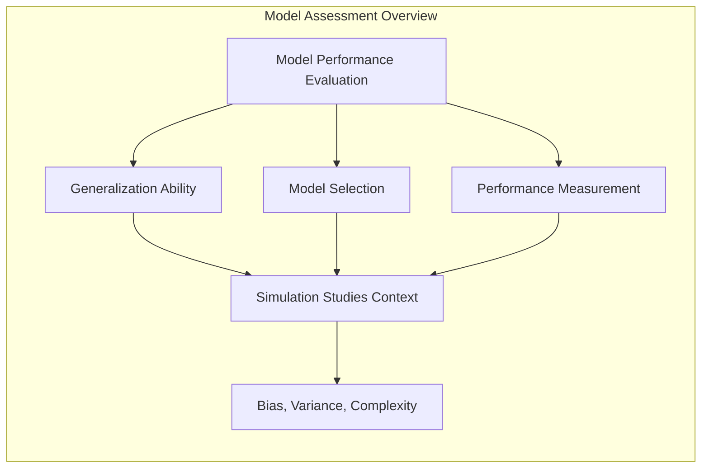

### Introdução
A avaliação do desempenho de um método de aprendizagem, ou de um modelo, reside na sua capacidade de generalização a dados de teste independentes. Essa avaliação é de extrema importância na prática, pois orienta a escolha do método de aprendizagem ou modelo, e fornece uma medida da qualidade do modelo finalmente selecionado [^7.1]. Este capítulo explora e ilustra métodos para a avaliação de performance, demonstrando como eles são usados para selecionar modelos. Começamos com uma discussão sobre a interação entre **bias**, **variância** e **complexidade do modelo**, elementos cruciais que se manifestam de maneira particular em estudos de simulação. O objetivo primário é, então, construir uma compreensão profunda dessas relações no contexto de simulações e aprender como técnicas estatísticas e de *machine learning* auxiliam na seleção do modelo mais adequado, minimizando o erro de generalização [^7.2].

### Conceitos Fundamentais

**Conceito 1: Generalização, Bias e Variância**

O conceito de **generalização** refere-se à capacidade de um modelo preditivo de realizar previsões precisas em dados que não foram utilizados no seu treinamento [^7.1]. Em um estudo de simulação, temos um modelo gerador de dados e um modelo de aprendizagem. O objetivo é que o modelo de aprendizagem consiga aproximar-se do modelo gerador de dados, sem que esta aproximação se limite aos dados de treino. A capacidade de generalizar bem depende crucialmente do equilíbrio entre **bias** (viés) e **variância**.  O **bias** representa o erro que o modelo comete por fazer suposições simplificadoras sobre a relação entre as variáveis, causando um ajuste inadequado (underfitting) dos dados de treinamento, enquanto que a **variância** reflete a sensibilidade do modelo às variações nos dados de treino. Um modelo com alta variância ajusta-se excessivamente aos ruídos nos dados de treino, levando a um bom desempenho nesse conjunto específico, mas com um desempenho ruim em novos dados (overfitting). Modelos muito simples tendem a ter alto bias e baixa variância, enquanto modelos muito complexos tendem a ter baixo bias e alta variância. O objetivo é encontrar uma complexidade de modelo que minimize o erro de generalização. [^7.2].

> 💡 **Exemplo Numérico:** Imagine que o verdadeiro modelo gerador de dados é uma função quadrática: $y = 2x^2 + \epsilon$, onde $\epsilon \sim N(0, 1)$.
> - **Modelo Simples (Alto Bias, Baixa Variância):** Um modelo linear, $\hat{y} = \beta_0 + \beta_1x$, seria incapaz de capturar a curvatura da função, resultando em um **alto bias**. No entanto, o modelo linear seria estável mesmo com variações nos dados de treinamento, tendo uma **baixa variância**.
> - **Modelo Complexo (Baixo Bias, Alta Variância):** Um modelo polinomial de grau 10, $\hat{y} = \beta_0 + \beta_1x + \beta_2x^2 + \ldots + \beta_{10}x^{10}$, poderia ajustar perfeitamente os dados de treinamento (baixo bias), mas seria muito sensível a variações nesses dados, levando a **alta variância**.
> O ideal seria usar um modelo polinomial de grau 2, que equilibra bias e variância, capturando bem a forma da função sem sobreajustar o ruído dos dados.

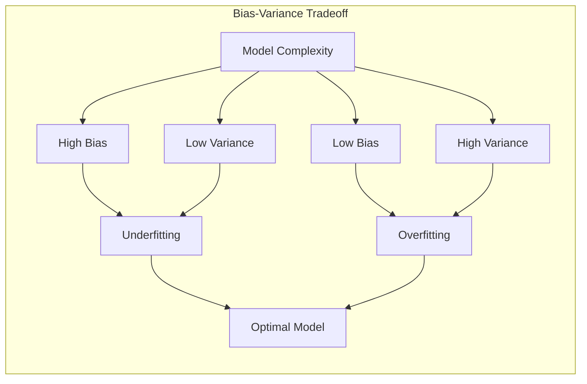

**Lemma 1:** A decomposição do erro quadrático médio em termos de bias e variância fornece uma compreensão estruturada da performance de um modelo. Considerando um cenário de regressão, onde $Y = f(X) + \epsilon$, com $E[\epsilon] = 0$ e $Var[\epsilon] = \sigma^2$, o erro de predição esperado em um ponto $x_0$ é decomposto como:

$$
Err(x_0) = E[(Y - \hat{f}(x_0))^2|X = x_0] = \sigma^2 + [E[\hat{f}(x_0)] - f(x_0)]^2 + E[\hat{f}(x_0) - E[\hat{f}(x_0)]]^2
$$

onde:

-   $\sigma^2$ é o erro irredutível, resultante da variância do ruído.
-   $[E[\hat{f}(x_0)] - f(x_0)]^2$ é o **bias** ao quadrado, que quantifica a diferença entre a média das predições do modelo e o valor real da função.
-   $E[\hat{f}(x_0) - E[\hat{f}(x_0)]]^2$ é a **variância**, que mede a variabilidade das predições do modelo em torno de sua média.

Esta decomposição é fundamental para entender o compromisso entre **bias** e **variância** [^7.3]. $\blacksquare$

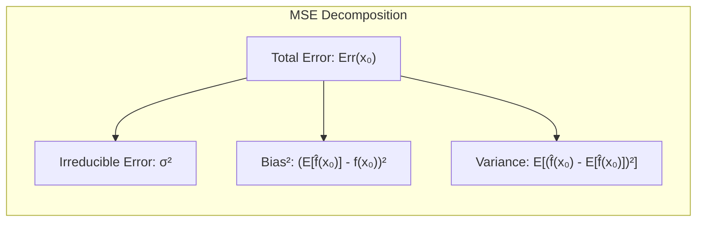

> 💡 **Exemplo Numérico:** Suponha que o modelo verdadeiro seja $f(x) = 2x$, e que temos um modelo $\hat{f}(x) = \beta x$ com $\beta$ estimado por mínimos quadrados usando um conjunto de dados simulados com ruído $\epsilon \sim N(0, 0.5)$.  Simulamos 100 conjuntos de dados e ajustamos o modelo em cada um deles, obtendo 100 valores para $\hat{\beta}$.  Se o valor verdadeiro de $\beta$ fosse 2, o valor médio de $\hat{\beta}$ foi 1.8, e a variância de $\hat{\beta}$ fosse 0.01.  Para um valor de teste $x_0=1$, temos:
> - Valor verdadeiro: $f(1) = 2$
> - Predição média: $E[\hat{f}(1)] = E[\hat{\beta}] \times 1 = 1.8$
> - Bias: $[E[\hat{f}(1)] - f(1)]^2 = (1.8 - 2)^2 = 0.04$
> - Variância: $E[\hat{f}(1) - E[\hat{f}(1)]]^2 = 1^2 \times Var[\hat{\beta}] = 0.01$
> - Erro Irredutível $\sigma^2=0.5$
> - Erro total: $Err(1) = 0.5 + 0.04 + 0.01= 0.55$.
>  Nesse caso, o bias contribui com 0.04 e a variância com 0.01 para o erro total.

**Conceito 2: Erro de Treinamento vs. Erro de Teste**

Em qualquer processo de modelagem, é vital distinguir entre o **erro de treinamento** e o **erro de teste**. O **erro de treinamento** é a medida do desempenho do modelo nos dados que foram utilizados para o seu treinamento. Em geral, esse erro diminui à medida que o modelo se torna mais complexo, uma vez que ele se adapta cada vez mais aos dados de treinamento. No entanto, um erro de treinamento muito baixo não implica necessariamente em um bom desempenho em dados não vistos. O **erro de teste**, por outro lado, é a medida do desempenho do modelo em dados não utilizados no treinamento, representando a capacidade de generalização do modelo, sendo uma métrica mais relevante para a avaliação do desempenho real [^7.2]. Modelos com alta variância tendem a ter um erro de treinamento muito baixo e um erro de teste muito alto, um fenômeno conhecido como **overfitting** [^7.3].

> 💡 **Exemplo Numérico:** Considere um cenário de regressão onde temos um conjunto de dados com 100 pontos. Ajustamos um modelo linear e um modelo polinomial de grau 10.
> - **Modelo Linear:** O erro de treinamento pode ser razoável, digamos 0.8, e o erro de teste em dados novos pode ser 1.0.
> - **Modelo Polinomial (Grau 10):** O erro de treinamento pode ser muito baixo, próximo de 0.1, porque ele se ajusta bem aos dados de treino. No entanto, o erro de teste em dados novos pode ser alto, como 2.0, indicando overfitting.
> Este exemplo demonstra como o erro de treinamento pode ser enganoso e que o erro de teste é uma medida mais confiável da performance do modelo.

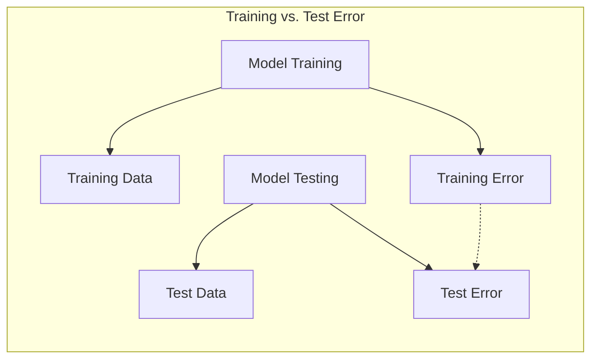

**Corolário 1:** O erro de treinamento é uma estimativa enviesada para baixo do erro de teste. Este enviesamento é devido ao fato de que o modelo ajusta-se aos dados de treinamento, de maneira que este último não é um bom representante dos dados que serão preditos futuramente [^7.4]. Formalmente, seja $err$ o erro de treinamento e $Err$ o erro de teste. Em geral, $E[err] < E[Err]$. O otimismo no erro de treinamento (a diferença entre o erro de teste esperado e o erro de treinamento esperado) depende da complexidade do modelo e do tamanho do conjunto de treinamento, aumentando com a complexidade e diminuindo com o tamanho da amostra [^7.4]. Esta desigualdade é formalizada e quantificada no conceito de otimismo, detalhado adiante.

**Conceito 3: Métricas de Avaliação: Log-Verossimilhança, Desvio e Erro Quadrático**

As métricas de avaliação são cruciais para quantificar o desempenho de um modelo. O **erro quadrático médio** (MSE), a métrica mais comum em regressão, é dado por:
$$
L(Y, f(X)) = (Y - f(X))^2
$$
Essa métrica penaliza grandes erros e é sensível a outliers. Para problemas de classificação, o **erro de classificação** (misclassification error) é uma métrica comum, quantificando a proporção de predições incorretas. Entretanto, outras métricas como a **log-verossimilhança** e o **desvio** são mais apropriadas em cenários de classificação probabilística [^7.2]. A **log-verossimilhança** é dada por:
$$
L(G, P(X)) = -2 \sum_{k=1}^K I(G=k) \log(p_k(X)) = -2 \log P(X)
$$
onde $I(G=k)$ é a função indicadora, $p_k(X)$ é a probabilidade predita da classe $k$ e $K$ é o número total de classes. O **desvio** é definido como $-2 \times log-verossimilhança$, e pode ser interpretado como uma medida de quão bem o modelo ajusta os dados.  O uso do "-2" na definição da log-verossimilhança, faz com que a log-verossimilhança para uma distribuição Gaussiana seja similar ao erro quadrático médio [^7.2]. O uso apropriado de cada uma destas métricas de avaliação depende da natureza do problema (regressão ou classificação) e da natureza do modelo (determinístico ou probabilístico).

> ⚠️ **Nota Importante**: A escolha apropriada da métrica de avaliação é crucial para avaliar corretamente o desempenho de um modelo, e a métrica deve refletir o objetivo da modelagem [^7.2].
> ❗ **Ponto de Atenção**: O uso de erro de classificação em situações com dados desbalanceados pode ser enganoso, e outras métricas como precisão, revocação e F1-score podem ser mais adequadas.
> ✔️ **Destaque**:  A log-verossimilhança e o desvio são frequentemente usadas em modelos probabilísticos, e podem ser generalizadas para outras distribuições de resposta, além da Gaussiana [^7.2].
> 💡 **Exemplo Numérico:** Em um problema de regressão com $Y = 2X + \epsilon$, onde $\epsilon \sim N(0,1)$, e temos um modelo $\hat{Y} = \hat{\beta}X$, com $\hat{\beta} = 2.1$. Para um valor de $X=1$, temos o valor real $Y=2+\epsilon$ e o valor predito $\hat{Y}=2.1$.
> -  Erro Quadrático: $(Y - \hat{Y})^2 = (2+\epsilon-2.1)^2 = (-0.1+\epsilon)^2$. O MSE é a média desse erro no conjunto de dados.
> Em um problema de classificação com duas classes e probabilidades preditas $p_1(X)=0.7$ para a classe 1 e $p_2(X)=0.3$ para a classe 2, se a verdadeira classe for a 1, temos:
> - Log-verossimilhança: $-2 \times (1 \times \log(0.7) + 0 \times \log(0.3)) = -2 \log(0.7) = 0.71$.
> - Desvio: $-2 \times \log(0.7) = 0.71$.
>Se a classe verdadeira fosse a 2:
> - Log-verossimilhança: $-2 \times (0 \times \log(0.7) + 1 \times \log(0.3)) = -2 \log(0.3) = 2.40$
> - Desvio: $-2 \times \log(0.3) = 2.40$.
> Observa-se que o desvio é maior quando a classe predita está errada.

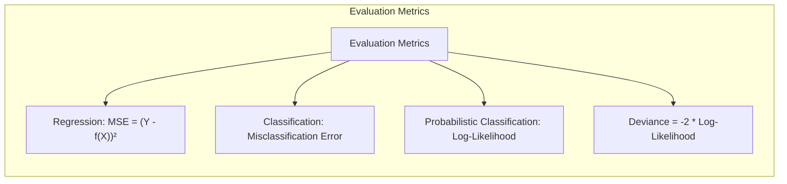

### Regressão Linear e Mínimos Quadrados para Classificação

A regressão linear pode ser utilizada para fins de classificação, através de uma codificação de matriz indicadora. Cada classe é representada por uma variável indicadora binária, que assume valor 1 para as observações pertencentes a essa classe e 0 caso contrário [^7.1]. O modelo de regressão linear é então ajustado para prever essas variáveis indicadoras. Após o ajuste, a classe predita para uma nova observação é determinada pela variável indicadora que apresenta o maior valor de predição [^7.2].

Em cenários de classificação, onde o objetivo é prever uma classe discreta, utilizar uma regressão linear diretamente sobre as classes codificadas pode levar a problemas. Por exemplo, pode produzir valores preditos fora do intervalo [0,1], o que é problemático quando se interpretam as predições como probabilidades. No entanto, a regressão de indicadores pode ser suficiente se o objetivo principal for obter uma fronteira de decisão linear [^7.2].

**Lemma 2:** Em um cenário de classificação binária, considerando duas classes codificadas como 0 e 1, e um ajuste linear usando mínimos quadrados (LS), a fronteira de decisão do modelo de regressão linear é definida por:

$$
\hat{y}(x) = x^T \hat{\beta} = 0.5
$$

onde $\hat{\beta}$ é o vetor de coeficientes estimados pelo método de mínimos quadrados, e $x$ representa as *features* de entrada.

Essa fronteira define um hiperplano que separa as duas classes no espaço de *features*. Se considerarmos o problema com uma variável resposta $Y \in \{0, 1\}$ e um vetor de covariáveis $X$, o modelo de regressão linear é dado por $E[Y|X] = X^T \beta$. A estimativa dos coeficientes $\beta$ por mínimos quadrados é dada por:
$$
\hat{\beta} = (X^T X)^{-1} X^T Y
$$
onde $X$ é a matriz das covariáveis e $Y$ é o vetor de respostas.

The decision boundary is defined by $X^T \hat{\beta} = 0.5$. In other words, indicator regression uses the decision hyperplane $X^T \hat{\beta} = 0.5$ to classify new observations. This boundary is linear and has a simple geometric interpretation.

No entanto, a regressão linear diretamente em uma variável indicadora para classificação pode apresentar certas limitações, especialmente se as classes não forem linearmente separáveis [^7.3]. O modelo de regressão linear tenta modelar a probabilidade de uma classe como uma função linear das *features*, o que pode ser inadequado se a relação verdadeira não for linear. Além disso, a regressão linear pode levar a predições que extrapolam os limites de 0 e 1.
$\blacksquare$

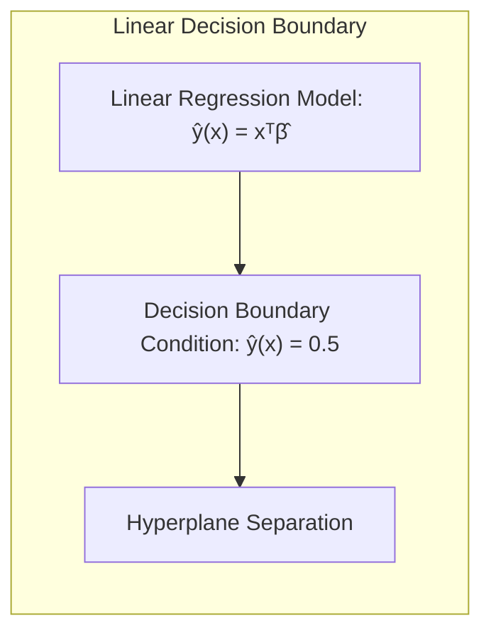

> 💡 **Exemplo Numérico:** Considere um problema de classificação com duas classes e duas *features* $X_1$ e $X_2$. As observações da classe 0 são distribuídas em torno de (1,1) e as da classe 1 em torno de (2,2). Temos um conjunto de dados $X$ de 100 observações, onde 50 tem classe 0 e 50 classe 1. Codificamos a classe 0 como 0 e a classe 1 como 1.  Ajustamos um modelo de regressão linear: $y = \beta_0 + \beta_1 x_1 + \beta_2 x_2$. Usando a fórmula de mínimos quadrados, e supondo que obtemos os coeficientes $\hat{\beta_0} = -0.2$, $\hat{\beta_1} = 0.3$ e $\hat{\beta_2} = 0.4$. A fronteira de decisão é definida por $-0.2 + 0.3x_1 + 0.4x_2 = 0.5$, que pode ser reescrita como $0.3x_1 + 0.4x_2 = 0.7$. Para classificar um novo ponto, por exemplo (1.5, 1.5), temos: $\hat{y} = -0.2 + 0.3 \times 1.5 + 0.4 \times 1.5 = 0.85$. Como esse valor é maior que 0.5, classificamos o ponto como pertencente à classe 1. Observe que a regressão pode predizer valores fora do intervalo [0,1].

**Corolário 2:** Em um problema de classificação com *k* classes, a regressão de indicadores para as $k$ classes, utilizando uma codificação *one-hot encoding*, resulta em $k$ conjuntos de coeficientes, um para cada classe. A predição da classe para uma nova observação corresponde à classe com o maior valor predito pelo modelo de regressão correspondente. No entanto, em uma situação com mais de duas classes, a relação entre o modelo de regressão linear e as fronteiras de decisão pode se tornar complexa, podendo haver sobreposição de regiões de decisão para diferentes classes. Apesar dessas limitações, a regressão de indicadores, em algumas situações, é útil como baseline ou como solução rápida para obter fronteiras de decisão lineares.

> ⚠️ **Nota Importante**: A regressão linear em matrizes indicadoras pode ser uma abordagem útil para obter uma fronteira de decisão linear em problemas de classificação, especialmente como um *benchmark* inicial.
> ❗ **Ponto de Atenção**:  No entanto, é fundamental estar ciente de suas limitações, como a possibilidade de produzir predições fora do intervalo [0,1] e a dificuldade de modelar relações não lineares entre *features* e classes [^7.2].
> 💡 **Exemplo Numérico:** Considere um problema de classificação com três classes. Usando one-hot encoding, teremos 3 variáveis indicadoras $Y_1$, $Y_2$ e $Y_3$. Ajustamos 3 modelos lineares: $\hat{y_1} = X^T\hat{\beta_1}$, $\hat{y_2} = X^T\hat{\beta_2}$ e $\hat{y_3} = X^T\hat{\beta_3}$. Para um novo ponto $x$, calculamos $\hat{y_1}(x)$, $\hat{y_2}(x)$ e $\hat{y_3}(x)$. A classe predita para o ponto $x$ é a classe $k$ tal que $\hat{y_k}(x)$ é o maior. Se, por exemplo,  $\hat{y_1}(x)=0.2$, $\hat{y_2}(x)=0.8$ e $\hat{y_3}(x)=0.1$, a classe predita é a 2.

### Métodos de Seleção de Variáveis e Regularização em Classificação
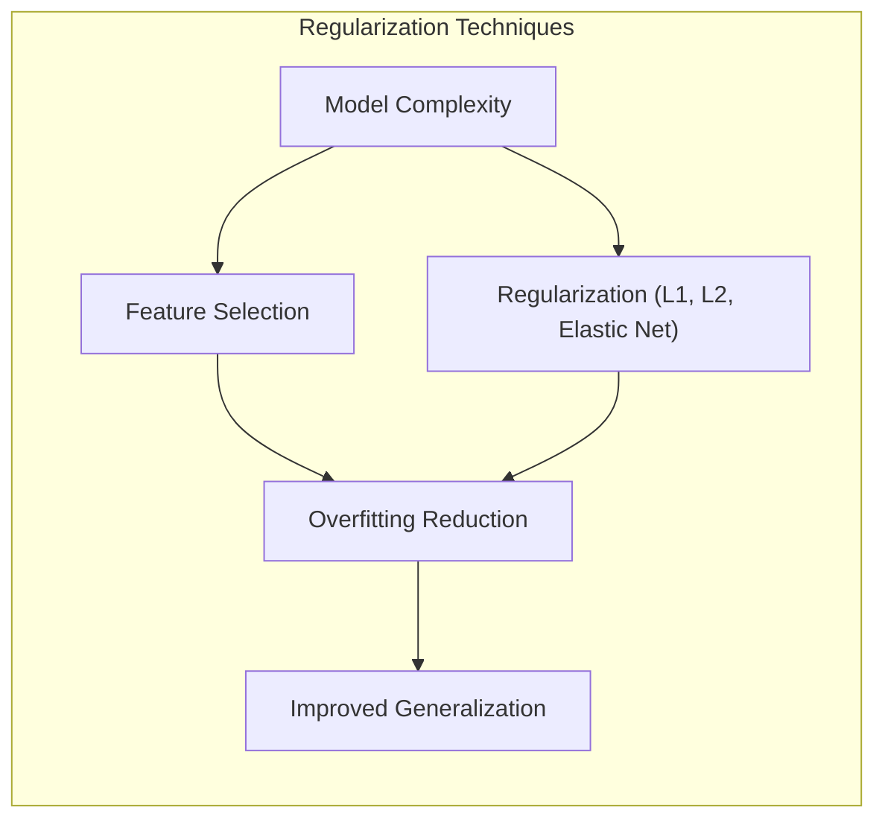

A seleção de variáveis e a regularização são técnicas fundamentais para controlar a complexidade do modelo, reduzir o **overfitting** e melhorar a sua capacidade de generalização [^7.4].  Em modelos lineares para classificação, como regressão logística, a regularização adiciona uma penalidade à função de custo, de modo a evitar que os coeficientes do modelo assumam valores muito elevados [^7.4].

**Lemma 3:** A regularização L1 (Lasso) em regressão logística leva a coeficientes esparsos, ou seja, muitos coeficientes são exatamente iguais a zero. Isso ocorre porque a penalidade L1, dada por $\lambda \sum_{j=1}^p |\beta_j|$, penaliza a magnitude dos coeficientes, tendendo a zerá-los, forçando o modelo a selecionar um subconjunto menor de variáveis relevantes [^7.4].

**Prova do Lemma 3:** Considere a função de custo da regressão logística com penalização L1:
$$
J(\beta) = - \frac{1}{N} \sum_{i=1}^N [y_i \log(\sigma(\beta^T x_i)) + (1-y_i)\log(1 - \sigma(\beta^T x_i))] + \lambda \sum_{j=1}^p |\beta_j|
$$
onde $\sigma$ é a função sigmoide, $\lambda$ é o parâmetro de regularização, $p$ é o número de *features*, e $x_i$ é o vetor de *features* da $i$-ésima observação. A penalidade L1 não é diferenciável quando $\beta_j = 0$, portanto, não podemos aplicar diretamente otimização baseada em gradiente. No entanto, para $\beta_j \neq 0$ , o gradiente da função de custo é:
$$
\frac{\partial J}{\partial \beta_j} =  \frac{1}{N} \sum_{i=1}^N (\sigma(\beta^T x_i) - y_i)x_{ij} + \lambda sign(\beta_j)
$$
onde $sign(\beta_j)$ é o sinal de $\beta_j$. Perto de zero, o gradiente da penalidade L1 é constante, resultando num "empurrão" em direção a zero, caso o gradiente da log-verossimilhança seja suficientemente pequeno. Isso resulta em muitos coeficientes sendo exatamente iguais a zero [^7.4].  $\blacksquare$

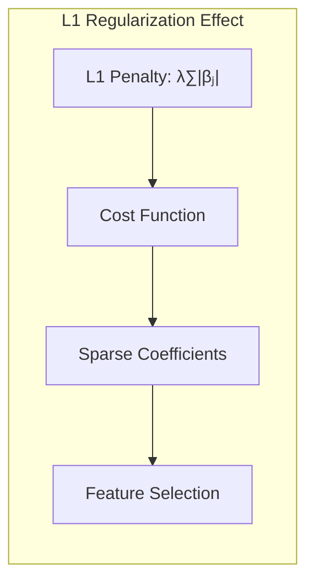

> 💡 **Exemplo Numérico:** Suponha que temos um problema de classificação com 10 *features* e ajustamos um modelo de regressão logística. Sem regularização, os coeficientes podem ter valores como $\beta = [2.1, -1.5, 0.8, 0.3, -0.9, 1.2, -0.5, 0.7, 1.1, -0.4]$. Ao aplicar a regularização L1 com $\lambda=0.5$, os coeficientes podem se tornar $\beta = [1.0, -0.5, 0.0, 0.0, -0.0, 0.2, 0.0, 0.0, 0.1, 0.0]$. Observe que muitos coeficientes foram zerados, resultando em um modelo mais esparso. Ao aumentar o valor de $\lambda$, mais coeficientes seriam zerados.

**Corolário 3:**  Modelos com muitos coeficientes iguais a zero são mais interpretáveis e menos propensos a overfitting. O uso da regularização L1 em regressão logística é uma maneira eficaz de realizar seleção de variáveis e melhorar a interpretabilidade dos modelos, identificando as *features* mais relevantes para a classificação. A regularização L2 (Ridge), por outro lado, penaliza o quadrado da magnitude dos coeficientes, o que leva a coeficientes menores, mas raramente exatamente iguais a zero.  Ela tende a distribuir o impacto dos preditores de maneira mais uniforme, mantendo a maioria deles, mas com magnitudes menores. Uma combinação da penalidade L1 e L2 (Elastic Net) pode ser utilizada para aproveitar as vantagens de ambos os tipos de regularização [^7.5].

> ⚠️ **Ponto Crucial**: A regularização L1 é eficaz para seleção de variáveis, enquanto a regularização L2 estabiliza os coeficientes. A combinação de L1 e L2 (Elastic Net) fornece um meio flexível para controlar a complexidade do modelo [^7.5].

### Separating Hyperplanes e Perceptrons
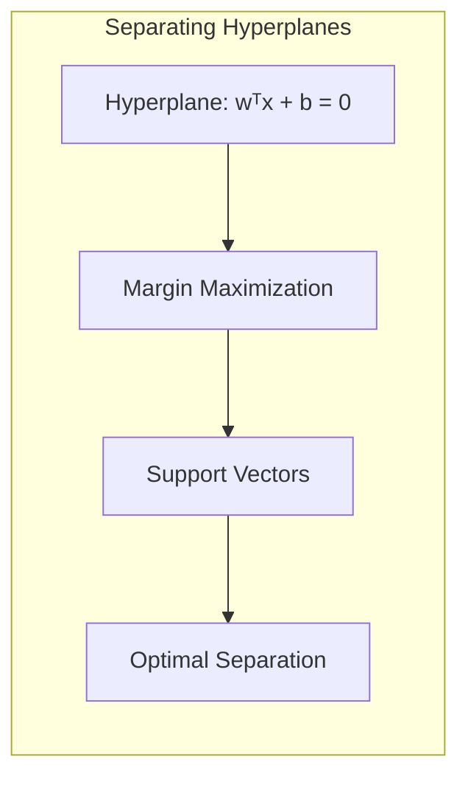
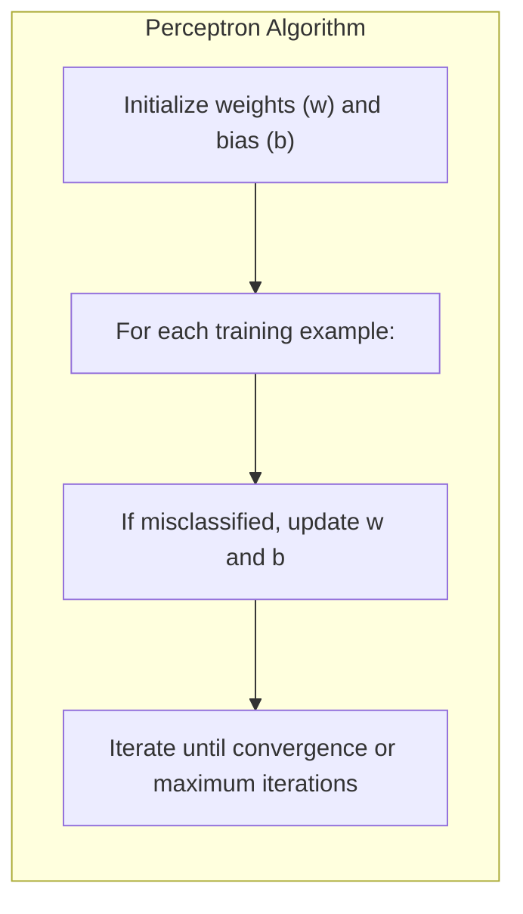
A ideia de maximizar a margem de separação entre classes leva ao conceito de hiperplanos separadores ótimos. Em um problema de classificação binária, busca-se encontrar um hiperplano que separe as duas classes com a maior margem possível [^7.5]. Um hiperplano é definido por uma equação da forma:
$$
w^T x + b = 0
$$
onde $w$ é o vetor de pesos, $x$ é o vetor de *features*, e $b$ é o *bias*. A margem de separação é a distância entre o hiperplano e os pontos mais próximos de cada classe, chamados vetores suporte. A maximização da margem de separação busca encontrar o hiperplano que seja o mais robusto possível em relação aos dados de treino, ajudando o modelo a generalizar melhor para dados não vistos.

O problema de otimização associado à maximização da margem é tipicamente resolvido através da sua formulação dual, onde a solução é encontrada através de uma combinação linear dos vetores suporte. Este procedimento também é essencial para se aplicar o conceito de *kernel trick* para encontrar fronteiras de decisão não-lineares.

O Perceptron de Rosenblatt é um algoritmo que busca encontrar um hiperplano separador, de forma iterativa [^7.5]. A atualização dos pesos no Perceptron se baseia em exemplos mal classificados, até que a separação das classes seja alcançada (quando possível). A convergência do Perceptron é garantida sob certas condições de separabilidade dos dados. Se as classes forem linearmente separáveis, o Perceptron converge para uma solução (um hiperplano que separa as duas classes). O algoritmo é relativamente simples e eficiente para dados linearmente separáveis, mas pode não convergir se as classes não forem linearmente separáveis. Além disso, o algoritmo do Perceptron pode encontrar múltiplos hiperplanos separadores, sem que haja um critério para escolher a melhor solução.

> 💡 **Exemplo Numérico:** Considere um conjunto de dados com duas classes, com duas *features*, tal que a classe 1 possui exemplos próximos a (1,1) e a classe 2 próximos a (2,2). Inicializamos os pesos do perceptron com $w = [0.1, 0.1]$ e o bias $b = 0$. Iterativamente, apresentamos os pontos ao perceptron. Se o ponto (1,1) for mal classificado, atualizamos os pesos: $w_{new} = w_{old} + \eta x$ (se a classe for 1) ou $w_{new} = w_{old} - \eta x$ (se a classe for -1), onde $\eta$ é a taxa de aprendizado. Após algumas iterações, os pesos podem convergir para algo como $w = [-1, 1]$ e $b = 0.5$, definindo o hiperplano separador $-x_1 + x_2 + 0.5 = 0$.

### Pergunta Teórica Avançada: Quais as diferenças fundamentais entre a formulação de LDA e a Regra de Decisão Bayesiana considerando distribuições Gaussianas com covariâncias iguais?

**Resposta:** A Análise Discriminante Linear (LDA) e a regra de decisão Bayesiana para distribuições gaussianas com covariâncias iguais compartilham a mesma forma funcional para a fronteira de decisão, mas são derivadas de premissas diferentes.

**LDA (Linear Discriminant Analysis)**: A LDA é um método de redução de dimensionalidade e classificação que encontra a combinação linear de *features* que melhor separam as classes [^7.3]. Ela assume que as *features* de cada classe são distribuídas de acordo com uma distribuição Gaussiana multivariada com matrizes de covariância iguais para todas as classes. O método estima as médias de cada classe e a matriz de covariância conjunta para todos os grupos. A fronteira de decisão é dada pela função discriminante linear:

$$
\delta_k(x) = x^T \Sigma^{-1} \mu_k - \frac{1}{2} \mu_k^T \Sigma^{-1} \mu_k + \log \pi_k
$$

onde $\mu_k$ é o vetor de médias da classe $k$, $\Sigma$ é a matriz de covariância comum, e $\pi_k$ é a probabilidade *a priori* da classe $k$. A LDA atribui uma observação à classe $k$ com maior valor de $\delta_k(x)$.

**Regra de Decisão Bayesiana:** A regra de decisão Bayesiana é um princípio de classificação que minimiza o erro de classificação esperado, dado que se conhece as distribuições condicionais de cada classe. No caso de distribuições Gaussianas com covariâncias iguais, a regra de decisão Bayesiana atribui uma observação à classe $k$ que maximiza a probabilidade *a posteriori*:

$$
P(G=k|X=x) = \frac{\pi_k \phi(x; \mu_k, \Sigma)}{\sum_{j=1}^K \pi_j \phi(x; \mu_j, \Sigma)}
$$

onde $\phi(x; \mu_k, \Sigma)$ é a função densidade de probabilidade da distribuição Gaussiana com média $\mu_k$ e matriz de covariância $\Sigma$.

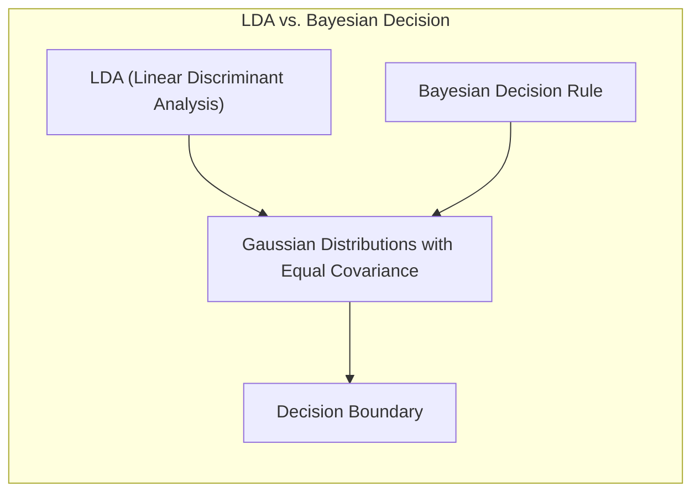

**Lemma 4:** Quando as classes são normalmente distribuídas com a mesma matriz de covariância, as decisões tomadas por LDA são equivalentes às decisões tomadas pela regra de decisão Bayesiana.

**Prova do Lemma 4:** A regra de decisão Bayesiana, com as distribuições gaussianas com a mesma matriz de covariância, pode ser escrita como:
$$
\delta_k(x) = \log P(G=k|X=x) =  \log \pi_k + \log \phi(x; \mu_k, \Sigma)
$$
A densidade gaussiana multivariada é definida como:
$$
\phi(x; \mu_k, \Sigma) = \frac{1}{(2\pi)^{p/2} |\Sigma|^{1/2}} \exp{-\frac{1}{2}(x-\mu_k)^T\Sigma^{-1}(x-\mu_k)}
$$
Substituindo a densidade gaussiana na equação de $\delta_k(x)$ e simplificando os termos comuns, temos:
$$
\delta_k(x) =  \log \pi_k  - \frac{1}{2}(x^T \Sigma^{-1} x - 2x^T \Sigma^{-1} \mu_k + \mu_k^T \Sigma^{-1} \mu_k)
$$

Removendo os termos que não dependem de k (como $-\frac{1}{2}x^T \Sigma^{-1} x$) e multiplicando por -2, obtemos a função discriminante da LDA:
$$
\delta_k(x) = x^T \