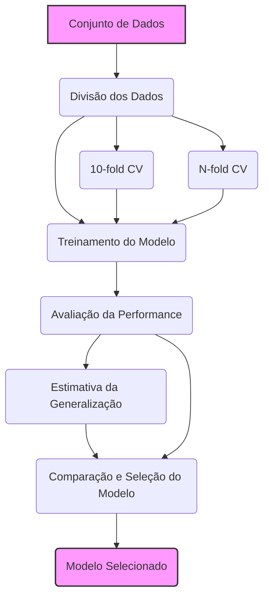
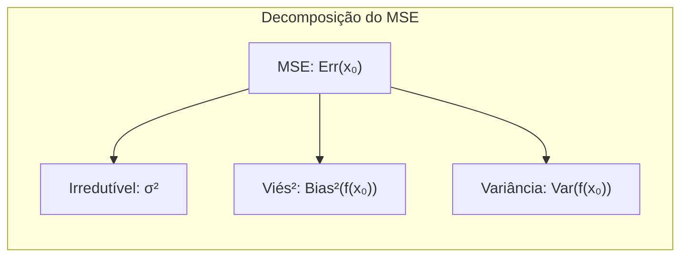
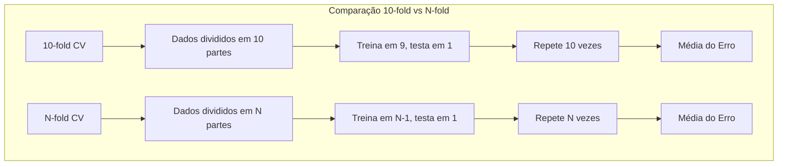
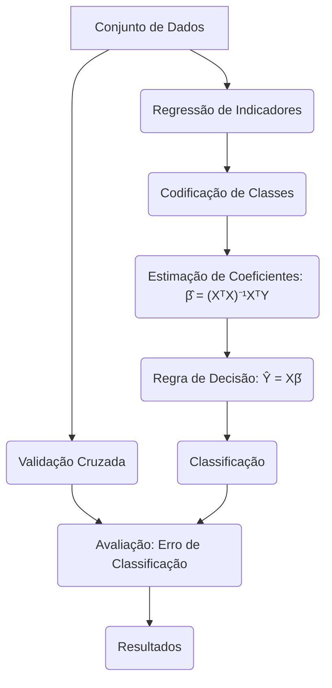
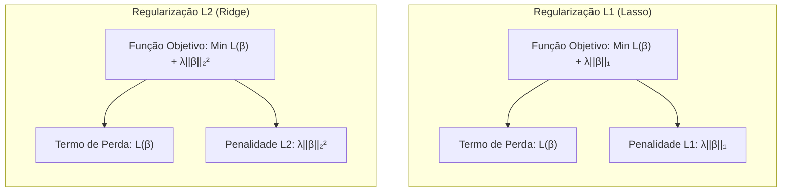
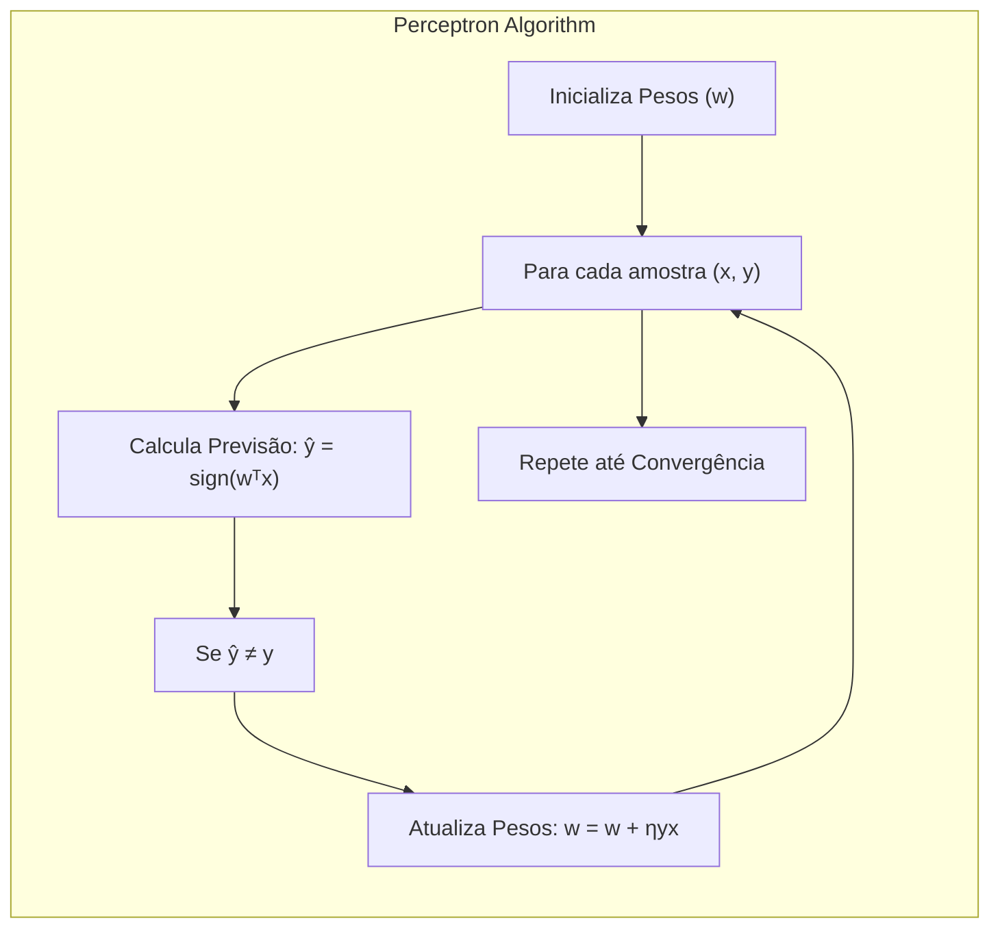
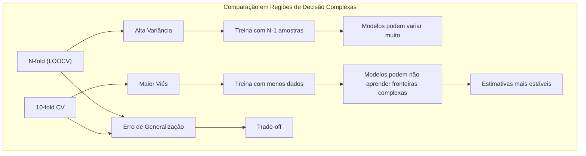

## Avaliação e Seleção de Modelos: Estimadores 10-Fold e N-Fold



### Introdução
A avaliação da performance de modelos de aprendizado de máquina é crucial para garantir a capacidade de generalização em dados não vistos [^7.1]. Um desafio central é a necessidade de estimar o desempenho do modelo de forma confiável, utilizando os dados disponíveis de forma eficiente. Este capítulo se aprofunda em métodos para avaliação e seleção de modelos, com foco na importância de entender a relação entre viés, variância e complexidade do modelo [^7.1]. Os métodos de cross-validation, particularmente o 10-fold e N-fold, emergem como técnicas poderosas para estimar a capacidade de generalização do modelo, fornecendo uma alternativa à necessidade de uma amostra de teste completamente independente [^7.10]. Este estudo se concentra em uma análise profunda das nuances desses dois estimadores, detalhando suas implementações, propriedades estatísticas, vantagens, desvantagens e implicações teóricas.

### Conceitos Fundamentais

**Conceito 1: Generalização e Erro de Teste**
O **erro de generalização** se refere à capacidade de um modelo de aprendizado de máquina de performar bem em dados não vistos [^7.1]. Este é um conceito fundamental em machine learning e está relacionado à forma como um modelo aprende e se adapta aos dados. Avaliar esta performance é essencial para escolher o método de aprendizado e o modelo mais adequado para um determinado problema [^7.1]. O **erro de teste** (test error) é uma medida desta capacidade de generalização, calculado com base em dados que o modelo não viu durante o processo de treinamento. Um modelo com bom poder de generalização terá um erro de teste baixo [^7.2]. Métodos lineares podem apresentar viés em algumas situações, limitando a capacidade de generalização, enquanto que modelos mais complexos podem apresentar alta variância devido ao ajuste excessivo aos dados de treinamento [^7.2].

**Lemma 1:** *Decomposição do Erro Quadrático Médio*
O erro quadrático médio (MSE) de uma previsão $f(x)$ pode ser decomposto em viés e variância. A decomposição do erro quadrático médio em viés e variância nos dá informações sobre a natureza do erro de previsão.
$$ Err(x_0) = E[(Y - f(x_0))^2 | X = x_0] = \sigma^2 + Bias^2(f(x_0)) + Var(f(x_0))$$
onde:
   - $\sigma^2$ representa o erro irredutível, a variância do ruído nos dados.
   - $Bias^2(f(x_0))$ representa o viés ao quadrado, que é o quanto a média das previsões difere da média real.
   - $Var(f(x_0))$ é a variância da predição, que é o quanto as previsões variam entre diferentes conjuntos de treino [^7.3].



A prova desta decomposição é direta e útil para entender a origem do erro de previsão. Essa decomposição é particularmente relevante no contexto de cross-validation, pois ela ajuda a entender o comportamento de diferentes estimadores de erro.
$\blacksquare$

> 💡 **Exemplo Numérico:**
> Suponha que temos um modelo de regressão linear tentando prever os preços de casas. Após o treinamento, avaliamos nosso modelo em um ponto de teste específico ($x_0$) e obtemos as seguintes estimativas:
>
> -  O erro irredutível ($\sigma^2$) é estimado em 5000 (devido a fatores não modelados como a preferência pessoal do comprador).
> -  O viés do modelo ($Bias(f(x_0))$) é de 1000 (o modelo tende a subestimar o preço real da casa nesse ponto).
> -  A variância do modelo ($Var(f(x_0))$) é de 2000 (a predição varia um pouco dependendo do conjunto de treinamento utilizado).
>
> Usando a decomposição do MSE, o erro total nesse ponto de teste ($x_0$) é:
>
>  $Err(x_0) = 5000 + 1000^2 + 2000 = 5000 + 1000000 + 2000 = 1007000$
>
>  Neste exemplo, podemos ver que o viés ao quadrado contribui muito mais para o erro total do que a variância. Isso sugere que um modelo mais complexo que reduza o viés pode melhorar a performance.

**Conceito 2: Cross-Validation (Validação Cruzada)**
A **validação cruzada** é uma técnica de reamostragem usada para estimar o desempenho de modelos de machine learning, especialmente quando os dados são limitados [^7.10]. Essa técnica evita o problema de overfit ao dividir os dados em conjuntos de treino e teste múltiplas vezes, permitindo avaliar como o modelo se comporta em diferentes subconjuntos dos dados. Ela fornece uma estimativa do erro de generalização, simulando como o modelo se comportaria em dados novos [^7.10]. As duas formas mais comuns são a **K-fold cross-validation**, em que os dados são divididos em K partições, e a **leave-one-out cross-validation (LOOCV)**, que é um caso particular de K-fold onde K = N (o número de amostras nos dados).

**Corolário 1:** *A Proximidade dos Estimadores CV e o Erro Esperado*
Tanto a K-fold cross-validation (com K < N) quanto a LOOCV são projetadas para estimar o erro de generalização do modelo. Sob certas condições, como a aleatoriedade na amostragem, ambos os métodos podem ser usados para estimar o valor esperado do erro de generalização, mas não o erro condicional (dado um conjunto específico de treino).
*“Cross-validation only estimates effectively the average error Err”* [^7.10].
  Isso significa que essas técnicas estimam bem o erro esperado, mas não necessariamente a performance exata do modelo com um certo conjunto de treinamento.

**Conceito 3: Estimadores 10-Fold e N-Fold**
Os **estimadores 10-fold** e **N-fold** são variações da cross-validation que se diferem na forma como os dados são divididos e o modelo é avaliado [^7.10.1]. No **10-fold CV**, os dados são divididos em 10 subconjuntos iguais. O modelo é treinado em 9 subconjuntos, e o subconjunto restante é usado para avaliação. Este processo é repetido 10 vezes, com cada subconjunto sendo utilizado uma vez para avaliação [^7.10.1]. O resultado final é a média das 10 estimativas de erro. No **N-fold CV** (LOOCV), que corresponde ao caso K = N, o modelo é treinado em N-1 amostras e avaliado em 1 amostra. Esse processo é repetido N vezes, de modo que cada amostra é usada como avaliação uma única vez. A performance é dada pela média das N estimativas de erro.
> ⚠️ **Nota Importante**: A escolha de K influencia o viés e a variância do estimador do erro de generalização. O 10-fold CV tem um viés um pouco maior, enquanto o N-fold CV apresenta uma variância maior. A decisão entre os dois é um trade-off. [^7.10.1].
> ❗ **Ponto de Atenção**: O N-fold CV é computacionalmente mais caro que o 10-fold CV, especialmente com conjuntos de dados grandes, uma vez que o modelo precisa ser re-treinado N vezes [^7.10.1].
> ✔️ **Destaque**: Ambos os estimadores são importantes para a análise de dados e fornecem estimativas robustas do desempenho do modelo quando dados suficientes são raros. A escolha entre eles depende da situação e dos recursos computacionais disponíveis.



> 💡 **Exemplo Numérico:**
> Imagine que temos um conjunto de dados com 100 amostras.
>
> **10-Fold CV:**
>
>  - Dividimos os dados em 10 grupos de 10 amostras cada.
>  - Para cada fold, treinamos o modelo em 90 amostras e avaliamos nas 10 amostras restantes.
>  - Repetimos isso 10 vezes e calculamos a média do erro (ex: MSE) nos 10 folds.
>
>  Suponha que os erros MSE em cada fold sejam: 2.1, 2.3, 1.9, 2.4, 2.0, 2.2, 2.5, 1.8, 2.1, 2.2. O erro médio de validação cruzada seria: (2.1+2.3+1.9+2.4+2.0+2.2+2.5+1.8+2.1+2.2)/10 = 2.15
>
> **N-Fold CV (LOOCV):**
>  -  Para cada amostra, treinamos o modelo em 99 amostras e avaliamos na amostra restante.
>  -  Repetimos isso 100 vezes e calculamos a média do erro (ex: MSE) nos 100 folds.
>
>  Suponha que o erro médio de validação cruzada seja 2.3. Podemos notar que devido ao maior número de folds, a variância do N-fold pode ser maior, resultando em uma estimativa um pouco diferente, mas mais precisa do erro de generalização.

### Regressão Linear e Mínimos Quadrados para Classificação


**Explicação:** Este mapa mental ilustra o processo de regressão de indicadores aplicada à classificação e como ele se relaciona com as técnicas de validação cruzada para avaliação de performance, conforme descrito nos tópicos [^7.2] e [^7.10].

A **regressão linear em uma matriz de indicadores** é uma abordagem para problemas de classificação, onde cada classe é representada por uma coluna na matriz de indicadores [^4.2]. Nesta abordagem, ao invés de usar uma variável categórica diretamente, são criadas variáveis binárias (dummy variables), com cada variável representando uma classe particular. Isso possibilita utilizar a regressão linear para resolver o problema de classificação [^4.2]. A função linear resultante é então usada para predizer a probabilidade de cada classe, e a classe com maior probabilidade é selecionada como a classe predita [^4.2]. Este método tem algumas limitações: ele pode levar a valores de probabilidade fora do intervalo [0,1] e pode não ser ideal para problemas com muitas classes [^4.2]. Uma vantagem, porém, é que ela é computacionalmente simples e fácil de entender. A regressão de indicadores está ligada a outras formas de classificação, como o LDA, e seus resultados podem dar insights sobre como a covariância entre as classes afeta a capacidade de separar os dados.
É possível demonstrar matematicamente o uso da regressão linear para problemas de classificação.

**Lemma 2:** *Projeção em Hiperplanos*
A regressão linear em uma matriz de indicadores pode ser vista como a projeção dos dados em hiperplanos de decisão que maximizam a separação entre as classes [^4.2].
$$\hat{\beta} = (X^TX)^{-1}X^TY$$
Essa fórmula calcula os coeficientes da regressão linear, e o produto $X\hat{\beta}$ produz a projeção dos dados.

**Corolário 2:** *Condições para Equivalência com Discriminantes Lineares*
Sob certas condições, as projeções obtidas pela regressão linear em uma matriz de indicadores são equivalentes às fronteiras de decisão obtidas pelos discriminantes lineares. Essas condições incluem a linearidade dos dados e a normalidade da distribuição dos dados. [^4.2]
$$ Y_{i} = \begin{cases} 1, \text{se amostra } i \text{ pertence à classe } 1\\ 0, \text{se amostra } i \text{ pertence à classe } 0 \end{cases} $$
E a predição seria dada por
$$\hat{Y_{i}} = \hat{\beta_0} + \hat{\beta_1}x_i$$
A relação entre esses métodos é importante para entender o impacto das premissas feitas sobre os dados e a escolha de um método de classificação.
A regressão de indicadores é mais adequada quando a principal preocupação é encontrar fronteiras de decisão lineares, ao invés de estimar probabilidades com alta precisão.
No entanto, a regressão logística pode fornecer estimativas de probabilidade mais estáveis [^4.4].

> 💡 **Exemplo Numérico:**
>
> Vamos supor que temos um problema de classificação binária com dados e queremos usar regressão linear com matriz de indicadores. As classes são 0 e 1. Considere os seguintes dados de treinamento:
>
>  | Amostra | X   | Classe (Y) |
>  |---------|-----|------------|
>  | 1       | 2   | 0          |
>  | 2       | 3   | 0          |
>  | 3       | 5   | 1          |
>  | 4       | 7   | 1          |
>
>  Para usar regressão linear, criamos uma matriz de design `X` com uma coluna para os valores de entrada `X` e adicionamos uma coluna de 1s para o intercepto:
>
> ```
> X = [[1, 2],
>      [1, 3],
>      [1, 5],
>      [1, 7]]
> ```
> E o vetor de respostas `Y` é:
>
> ```
> Y = [[0],
>      [0],
>      [1],
>      [1]]
> ```
> Agora podemos calcular os coeficientes usando a fórmula dos mínimos quadrados: $\hat{\beta} = (X^TX)^{-1}X^TY$
>
> ```python
> import numpy as np
> X = np.array([[1, 2], [1, 3], [1, 5], [1, 7]])
> Y = np.array([[0], [0], [1], [1]])
> Xt = X.T
> beta = np.linalg.inv(Xt @ X) @ Xt @ Y
> print(beta)
> # Output: [[-0.7  ], [ 0.25714286]]
> ```
>
>  Então, a equação do hiperplano é: $\hat{Y} = -0.7 + 0.257x$. Para classificar uma nova amostra, por exemplo, com X=4, calculamos $\hat{Y} = -0.7 + 0.257 * 4 = 0.328$. Se o valor for maior que 0.5, classificamos como classe 1, caso contrário, classe 0. Neste caso, classificariamos como classe 0.
> Essa abordagem mostra como usar regressão linear para classificação, projetando os dados em um espaço com base em indicadores das classes.

### Métodos de Seleção de Variáveis e Regularização em Classificação



A **seleção de variáveis** e **regularização** são técnicas fundamentais para lidar com o problema de modelos complexos e com alta dimensionalidade. Em problemas de classificação, essas técnicas são cruciais para melhorar a generalização do modelo [^7.3], [^4.5]. A seleção de variáveis busca identificar as variáveis mais relevantes para a tarefa de classificação, enquanto que a regularização impõe restrições aos coeficientes do modelo, evitando o overfitting e tornando o modelo mais estável [^4.5]. Essas técnicas são relevantes em situações com muitas variáveis preditoras.
As penalizações L1 e L2 são métodos de regularização comuns. A penalização L1 (Lasso) força os coeficientes a serem zero, levando a modelos esparsos. A penalização L2 (Ridge) encolhe os coeficientes em direção a zero, reduzindo a variância do modelo [^4.5]. A escolha de L1 ou L2 depende do problema, onde L1 leva a soluções esparsas e é útil para seleção de variáveis, enquanto L2 é mais usada para reduzir a variância do modelo [^4.4.4]. Em situações práticas, a regularização pode ajudar a melhorar a performance do modelo de classificação [^4.5].

**Lemma 3:** *Esparsidade e Regularização L1*
A regularização L1 em classificação logística induz coeficientes esparsos, isto é, leva a modelos com um número menor de variáveis relevantes.
$$ \min_{\beta} \sum_{i=1}^{N}  - [y_i \log(p_i) + (1 - y_i) \log(1-p_i)] + \lambda \sum_{j=1}^{p} |\beta_j| $$
A penalidade L1  $\lambda \sum_{j=1}^{p} |\beta_j|$ é proporcional à soma dos valores absolutos dos coeficientes. Essa penalização força os coeficientes a serem exatamente zero, resultando em um modelo mais simples e esparso [^4.4.4]. A magnitude de $\lambda$ controla o grau de esparsidade.

**Prova do Lemma 3:** A prova detalhada da esparsidade do Lasso envolve analisar as condições de otimalidade da função objetivo. Ao considerar a sub-diferenciabilidade da norma L1, observa-se que quando $\beta_j = 0$, a penalidade L1 introduz um "ponto angular" na função objetivo, forçando os coeficientes a zerar. O ajuste de $\lambda$ controla o grau de esparsidade da solução [^4.4.4]. $\blacksquare$

**Corolário 3:** *Interpretabilidade dos Modelos Classificatórios*
A esparsidade resultante da regularização L1 aumenta a interpretabilidade do modelo, uma vez que apenas as variáveis mais relevantes são retidas. Isto é essencial em aplicações onde entender o que leva a uma dada classificação é tão importante quanto a própria classificação [^4.4.5]. Um modelo com muitas variáveis é difícil de analisar e explicar, enquanto um modelo esparso, focado em um número pequeno de variáveis, é mais fácil de interpretar.

> ⚠️ **Ponto Crucial**: O uso combinado de regularização L1 e L2 (Elastic Net) permite obter modelos com melhor generalização, aproveitando as vantagens de ambos os métodos [^4.5]. O Elastic Net adiciona uma penalidade que é uma combinação de L1 e L2, controlando tanto a esparsidade quanto a estabilidade dos coeficientes.

> 💡 **Exemplo Numérico:**
>
>  Vamos usar um exemplo prático para ilustrar a aplicação da regularização L1 (Lasso) em um problema de classificação com regressão logística. Imagine que temos um dataset com 10 variáveis preditoras (features) e uma variável resposta binária (0 ou 1). Após ajustar um modelo de regressão logística com regularização L1, podemos observar o seguinte comportamento dos coeficientes para diferentes valores de $\lambda$:
>
> | Feature  |  $\lambda$ = 0.01 | $\lambda$ = 0.1 |  $\lambda$ = 1.0  |
> |----------|--------------------|------------------|--------------------|
> | $x_1$    |        0.8         |      0.5         |         0          |
> | $x_2$    |       -0.3         |       -0.1       |          0         |
> | $x_3$    |        1.2         |       0.9         |         0.3        |
> | $x_4$    |       -0.5         |       -0.2       |          0         |
> | $x_5$    |        0.2         |         0        |          0         |
> | $x_6$    |        0.9         |       0.6         |          0         |
> | $x_7$    |       -0.1        |          0        |          0         |
> | $x_8$    |        0.4         |        0.1         |          0         |
> | $x_9$    |       -0.7         |        -0.4        |          0         |
> | $x_{10}$ |        0.6         |       0.3         |          0         |
>
>  - **$\lambda$ = 0.01:**  Nesta situação, a penalização L1 é baixa, e quase todas as variáveis têm coeficientes não-nulos. O modelo é complexo e pode estar sofrendo de overfitting.
>  - **$\lambda$ = 0.1:**  Com um valor maior de $\lambda$, alguns coeficientes já começam a diminuir em magnitude e outros já se tornam zero ($x_5$ e $x_7$). Isso começa a simplificar o modelo.
>  - **$\lambda$ = 1.0:**  A penalização L1 é bem forte, fazendo com que muitos coeficientes sejam exatamente zero. O modelo se torna esparso, com apenas as variáveis $x_3$ como não zero. A regularização L1 realizou seleção de variáveis, mantendo apenas as mais importantes.
>
>  Este exemplo ilustra como o valor de $\lambda$ influencia a esparsidade do modelo, e como a regularização L1 pode ser usada para seleção de variáveis em modelos de classificação.

### Separating Hyperplanes e Perceptrons


A ideia de **hiperplanos separadores** é fundamental em problemas de classificação linear [^4.5.2]. Um hiperplano é uma generalização de uma linha em duas dimensões ou um plano em três dimensões para espaços de dimensão maior. Um hiperplano separador é um hiperplano que divide o espaço de entrada de tal forma que as amostras de diferentes classes ficam em lados opostos desse hiperplano [^4.5.2]. O objetivo é encontrar o hiperplano que maximiza a distância entre as classes, também conhecida como margem de separação. Os **pontos de suporte** são as amostras que estão mais próximas do hiperplano e que determinam a posição do hiperplano. Os hiperplanos de decisão podem ser otimizados usando programação linear.
O **Perceptron de Rosenblatt** é um algoritmo simples para classificar dados linearmente separáveis, em que o modelo é um hiperplano que separa as classes [^4.5.1]. Este algoritmo ajusta iterativamente os pesos do hiperplano para minimizar o número de classificações erradas. Em cada iteração o Perceptron verifica se o sinal da predição está correto para a amostra de treinamento atual, e atualiza os pesos do hiperplano caso haja um erro. Sob condições de separabilidade linear, o Perceptron converge para uma solução que separa os dados corretamente [^4.5.1]. No entanto, ele pode não convergir se os dados não forem linearmente separáveis.

> 💡 **Exemplo Numérico:**
>
> Considere um problema de classificação binária em 2D com os seguintes dados:
>
> Classe 1: (1, 1), (2, 2), (2, 0)
> Classe -1: (0, 0), (1, 0), (0, 1)
>
> Vamos usar o Perceptron para encontrar um hiperplano separador. Inicializamos os pesos com [0, 0, 0] (incluindo o bias). A taxa de aprendizagem é 0.1
>
>  - **Iteração 1:**
>   -   Amostra (1, 1):  $0*1 + 0*1 + 0 = 0$. Classifica como -1 (errado). Atualizamos os pesos: $w = [0, 0, 0] + 0.1 * 1 * [1, 1, 1] = [0.1, 0.1, 0.1]$
>  -   Amostra (2, 2): $0.1*2 + 0.1*2 + 0.1 = 0.5$. Classifica como 1 (correto).
>  -   Amostra (2, 0): $0.1*2 + 0.1*0 + 0.1 = 0.3$. Classifica como 1 (correto).
> - Amostra (0, 0): $0.1*0 + 0.1*0 + 0.1 = 0.1$. Classifica como 1 (errado). Atualizamos os pesos: $w = [0.1, 0.1, 0.1] + 0.1 * -1 * [1, 0, 1] = [0, 0.1, 0]$
> - Amostra (1, 0): $0*1 + 0.1*0 + 0 = 0$. Classifica como -1 (correto)
> - Amostra (0, 1): $0*0 + 0.1*1 + 0 = 0.1$. Classifica como 1 (errado). Atualizamos os pesos: $w = [0, 0.1, 0] + 0.1 * -1 * [1, 1, 1] = [-0.1, 0, -0.1]$
>
> - **Iteração 2 (e subsequentes):** Repetimos o processo até o Perceptron convergir (classificar todas as amostras corretamente). Eventualmente, o Perceptron pode convergir para pesos como, por exemplo, [-0.2, 0.3, -0.1], que representam o hiperplano separador: $-0.2 + 0.3x_1 -0.1x_2 = 0$ ou $0.3x_1 - 0.1x_2 = 0.2$
>
> Este exemplo ilustra como o Perceptron atualiza iterativamente os pesos do hiperplano até separar as amostras das classes, quando os dados são linearmente separáveis.

### Pergunta Teórica Avançada (Exemplo): Como os Estimadores 10-fold e N-fold Cross-Validation se Comportam em Regiões de Decisão Complexas?


**Resposta:**
Em regiões de decisão complexas, os estimadores 10-fold e N-fold cross-validation podem apresentar comportamentos distintos, dada a natureza de suas estratégias de divisão dos dados. O N-fold (LOOCV) tende a ter uma variância maior devido ao fato de que cada modelo treinado usa apenas uma amostra a menos do que o conjunto completo de dados, resultando em previsões que podem ser muito diferentes de um fold para outro [^7.12]. Em contrapartida, o 10-fold CV tende a ter um viés maior, pois cada conjunto de treinamento é consideravelmente menor que o conjunto de dados completo, levando a um modelo que pode ter uma capacidade de generalização reduzida. O N-fold CV pode ser mais preciso, e o 10-fold CV mais estável para estimar o erro de generalização, mas nenhuma das abordagens estima bem o erro condicional em uma determinada amostra [^7.12].

**Lemma 4:** *Viés e Variância em Estimadores de Cross-Validation*
A diferença entre o viés e a variância entre o N-fold e o 10-fold CV pode ser quantificada. A variância do LOOCV é aproximadamente igual a:
$$ Var(CV_{LOOCV}) \approx \frac{1}{N} \sum_{i=1}^N [Err_T(x_i) - E[Err_T(x_i)]]^2 $$
Enquanto que a variância do K-fold CV (com K < N) é menor. O viés do LOOCV é menor, mas a variância é maior, enquanto o K-fold CV tem o inverso. A escolha entre os métodos é um trade-off entre viés e variância, onde N-fold é mais preciso e K-fold é mais estável. [^7.10].

**Corolário 4:** *Impacto da Complexidade da Região de Decisão*
Em regiões de decisão complexas (não lineares), os estimadores de cross-validation podem subestimar o erro verdadeiro, especialmente o 10-fold CV, devido ao viés inerente à redução do tamanho dos conjuntos de treinamento em cada fold. Nesses casos, as estimativas podem ser menos representativas do comportamento do modelo com o dataset original completo, mas o viés não afeta o modelo escolhido caso a comparação seja feita utilizando as mesmas condições. [^7.12].

> ⚠️ **Ponto Crucial**: O comportamento dos estimadores de cross-validation em regiões de decisão complexas varia com a natureza dos dados, a complexidade do modelo e o número de folds. É essencial entender as limitações dessas técnicas para realizar uma avaliação de modelo robusta.

> 💡 **Exemplo Numérico:**
>
>  Imagine que temos um problema de classificação com dados distribuídos em torno de círculos concêntricos (uma região de decisão não linear). Avaliamos um modelo complexo (e.g., uma rede neural com muitas camadas) com 10-fold CV e N-fold CV.
>
>  - **N-fold CV (LOOCV):**  Como cada modelo é treinado em quase todo o conjunto de dados, cada modelo individual tende a se ajustar muito bem aos dados da sua amostra de treinamento. As previsões podem ter alta variação (alta variância), mas baixa viés. Se um modelo particular, por exemplo, for treinado sem os pontos da fronteira de decisão entre as classes, ele pode performar muito bem nas classes mas falhar em alguns pontos que não viu, gerando resultados instáveis e com uma variância muito alta.
>  - **10-fold CV:** Os modelos treinados em cada fold têm menos dados do que no LOOCV. O viés é maior, pois o modelo pode não conseguir aprender bem a fronteira de decisão complexa com a quantidade reduzida de dados. No entanto, as estimativas do erro são mais estáveis (menor variância), pois há menos variação nos datasets de treinamento. Por exemplo, se um fold não tiver dados suficientes para aprender a estrutura concêntrica, ele pode dar erros relativamente consistentes em certos grupos de pontos.
>
>  Em uma região de decisão complexa como essa, o N-fold CV pode ser mais preciso em estimar o erro de generalização se tivermos dados suficientes para que a variância não se torne um problema muito grande, enquanto o 10-fold CV pode ser mais estável, mas um pouco mais viesado.

### Conclusão
Este capítulo apresentou uma análise aprofundada dos métodos de avaliação de modelos, com foco nos estimadores 10-fold e N-fold cross-validation. Exploramos conceitos fundamentais como o erro de generalização, viés, variância e o trade-off entre complexidade e performance do modelo. As técnicas de regularização e seleção de variáveis são essenciais para lidar com datasets de alta dimensão, enquanto os hiperplanos separadores e o Perceptron fornecem uma base para classificação linear. As perguntas teóricas avançadas destacam as complexidades e nuances das abordagens e técnicas exploradas neste capítulo. A escolha entre 10-fold e N-fold CV depende do problema específico, do compromisso entre viés e variância e dos recursos computacionais disponíveis. <!-- END DOCUMENT -->

### Footnotes

[^7.1]: "The generalization performance of a learning method relates to its prediction capability on independent test data. Assessment of this performance is extremely