## Importância de um Conjunto de Teste Separado

<imagem: Diagrama complexo que ilustra o fluxo do processo de avaliação de modelos, mostrando a divisão dos dados em treinamento, validação e teste, com cada etapa claramente definida e conectada. Detalhes específicos como a interação entre as fases de treino, escolha de modelo com validação e avaliação final com teste, deverão ser apresentados.>


### Introdução

A avaliação do desempenho de um método de aprendizado, particularmente em sua capacidade de generalização, é um aspecto crucial na construção de modelos preditivos robustos [^7.1]. A **generalização** refere-se à habilidade de um modelo de fazer previsões precisas em dados não vistos, ou seja, dados que não foram usados no processo de treinamento. Em cenários práticos, esta capacidade é mais relevante do que o desempenho do modelo nos dados de treinamento, onde ele já teve oportunidade de aprender os padrões e nuances [^7.1].

Este capítulo abordará a importância de uma abordagem estruturada para avaliação de modelos, particularmente com a necessidade de um **conjunto de teste separado**. Este conjunto serve como uma barreira final para avaliar a qualidade do modelo selecionado e determinar sua capacidade de generalizar para novos dados. Os métodos de avaliação de desempenho e seleção de modelos serão explorados, juntamente com a análise do *tradeoff* entre viés, variância e complexidade do modelo, elementos que se relacionam diretamente com a capacidade de generalização de um modelo [^7.1].

### Conceitos Fundamentais

#### Conceito 1: Classificação e Generalização

O problema de classificação envolve a atribuição de uma amostra de dados a uma entre um conjunto de categorias predefinidas [^7.2]. O objetivo final é construir um classificador que seja capaz de fazer atribuições precisas não apenas em dados de treinamento, mas também em dados novos e não vistos. Métodos lineares, como os mencionados no contexto (LDA, regressão logística) são frequentemente utilizados como ponto de partida [^7.1, ^4.2].

A capacidade de generalização de um modelo linear é afetada pelo *tradeoff* entre viés e variância. Um modelo com **alto viés** simplifica excessivamente os dados, o que leva a um desempenho ruim mesmo nos dados de treinamento. Em contrapartida, um modelo com **alta variância** se ajusta excessivamente aos dados de treinamento (overfitting), capturando ruídos aleatórios e, portanto, generalizando mal para dados não vistos [^7.2].
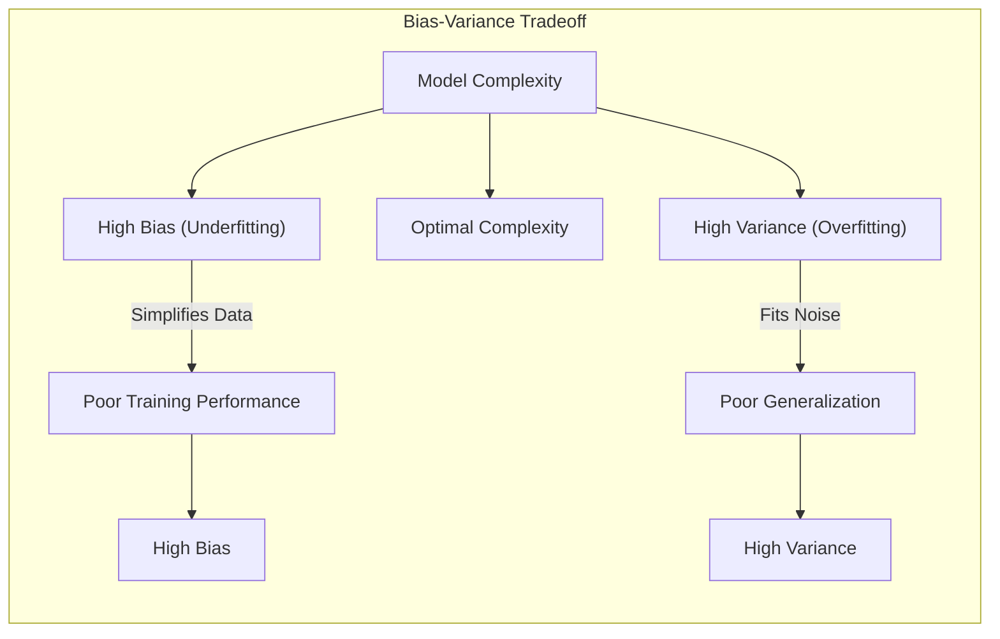
**Lemma 1:** *A complexidade de um modelo (número de parâmetros) está diretamente relacionada com a sua capacidade de se ajustar aos dados de treino, influenciando a sua variância.* Modelos mais complexos tendem a ter menor viés (se ajustam melhor aos dados), mas podem apresentar maior variância. Modelos lineares com poucas variáveis podem ter alto viés, mas menor variância.

**Prova:** Considere um modelo linear $f(x) = x^T\beta$. Aumentar o número de parâmetros em $\beta$ permite uma melhor aproximação aos dados de treino (diminuição do viés), mas aumenta a variância da estimativa de $\beta$, levando à menor capacidade de generalização. Um aumento no número de parâmetros resulta em maior flexibilidade no ajuste da superfície de decisão, permitindo capturar até mesmo ruídos presentes nos dados de treino, como observado em [^7.2]. $\blacksquare$

> 💡 **Exemplo Numérico:** Considere um dataset com 100 pontos, onde a relação real é $y = 2x + 3 + \epsilon$, com $\epsilon$ sendo um ruído aleatório com média 0 e desvio padrão 1. Se usarmos um modelo linear simples $f(x) = \beta_0 + \beta_1x$, podemos obter um ajuste razoável. No entanto, se usarmos um modelo polinomial de grau 9, $f(x) = \beta_0 + \beta_1x + \beta_2x^2 + \ldots + \beta_9x^9$, podemos obter um ajuste perfeito nos dados de treinamento, mas o modelo terá alta variância.  
>
> ```python
> import numpy as np
> import matplotlib.pyplot as plt
> from sklearn.linear_model import LinearRegression
> from sklearn.preprocessing import PolynomialFeatures
> from sklearn.metrics import mean_squared_error
>
> # Generate data
> np.random.seed(42)
> X = np.sort(np.random.rand(100) * 10)
> y = 2 * X + 3 + np.random.randn(100)
>
> # Linear model
> X_lin = X.reshape(-1, 1)
> model_lin = LinearRegression()
> model_lin.fit(X_lin, y)
> y_pred_lin = model_lin.predict(X_lin)
> mse_lin = mean_squared_error(y, y_pred_lin)
>
> # Polynomial model (degree 9)
> poly = PolynomialFeatures(degree=9)
> X_poly = poly.fit_transform(X_lin)
> model_poly = LinearRegression()
> model_poly.fit(X_poly, y)
> y_pred_poly = model_poly.predict(X_poly)
> mse_poly = mean_squared_error(y, y_pred_poly)
>
> # Plotting
> plt.figure(figsize=(10, 5))
> plt.scatter(X, y, color='blue', label='Dados reais')
> plt.plot(X, y_pred_lin, color='red', label=f'Linear (MSE={mse_lin:.2f})')
> plt.plot(X, y_pred_poly, color='green', label=f'Polinomial (MSE={mse_poly:.2f})')
> plt.xlabel('X')
> plt.ylabel('y')
> plt.legend()
> plt.title('Comparação de modelos linear e polinomial')
> plt.show()
>
> print(f"MSE do modelo Linear: {mse_lin:.2f}")
> print(f"MSE do modelo Polinomial: {mse_poly:.2f}")
>
> ```
> No exemplo acima, o modelo polinomial tende a ter um MSE menor nos dados de treino, mas se ajusta muito aos dados e terá uma alta variância, generalizando mal para novos dados. O modelo linear, apesar de ser mais simples, tem um erro maior no treino, mas menor variância, podendo generalizar melhor.

#### Conceito 2: Linear Discriminant Analysis (LDA) e suas Suposições

A **Linear Discriminant Analysis (LDA)** é um método de classificação que assume que os dados em cada classe seguem uma distribuição normal com a mesma matriz de covariância [^4.3]. A **LDA** constrói uma função discriminante linear que projeta os dados em um espaço de menor dimensão, de forma a maximizar a separabilidade entre as classes, usando as médias e a matriz de covariância comum [^4.3.1, ^4.3.2]. A fronteira de decisão resultante é um hiperplano linear [^4.3.3].
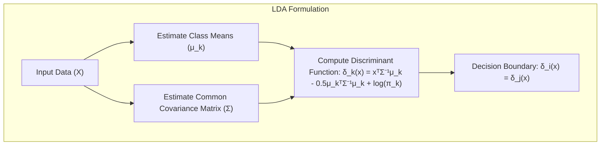
A **LDA** é um método paramétrico, e suas suposições são importantes para garantir a sua eficácia. Em particular, a suposição de normalidade pode ser violada em conjuntos de dados reais, o que pode levar a um desempenho subótimo do método. A **LDA** busca uma projeção que maximize a separabilidade entre as classes, o que não necessariamente otimiza a capacidade de generalização para dados não vistos [^4.3].

**Corolário 1:** *Sob a suposição de que as covariâncias entre as classes são iguais e os dados seguem uma distribuição Gaussiana, a LDA se torna equivalente a uma regra de decisão Bayesiana*. Esta equivalência teórica fornece uma base sólida para a aplicação da LDA. No entanto, em dados reais, as suposições podem ser violadas, o que limita o desempenho do método [^4.3.1].
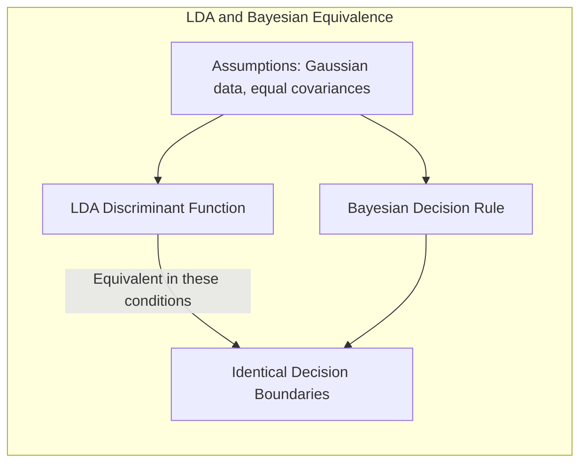
> 💡 **Exemplo Numérico:** Suponha duas classes com médias $\mu_1 = [1, 1]$ e $\mu_2 = [3, 3]$ e uma matriz de covariância comum $\Sigma = \begin{bmatrix} 1 & 0.5 \\ 0.5 & 1 \end{bmatrix}$. A LDA irá encontrar um hiperplano que separa estas duas classes, baseado nas médias e na covariância. Se os dados realmente seguem esta distribuição, LDA é uma boa aproximação da regra de decisão bayesiana. Caso os dados sigam distribuições com covariâncias diferentes, ou não Gaussianas, a performance da LDA pode ser comprometida.
> ```python
> import numpy as np
> import matplotlib.pyplot as plt
> from sklearn.discriminant_analysis import LinearDiscriminantAnalysis
>
> # Define means and covariance
> mu1 = np.array([1, 1])
> mu2 = np.array([3, 3])
> cov = np.array([[1, 0.5], [0.5, 1]])
>
> # Generate synthetic data for 2 classes (50 points each)
> np.random.seed(42)
> X1 = np.random.multivariate_normal(mu1, cov, 50)
> X2 = np.random.multivariate_normal(mu2, cov, 50)
> X = np.concatenate((X1, X2))
> y = np.array([0] * 50 + [1] * 50)
>
> # Fit LDA
> lda = LinearDiscriminantAnalysis()
> lda.fit(X, y)
>
> # Plotting decision boundary
> x_min, x_max = X[:, 0].min() - 1, X[:, 0].max() + 1
> y_min, y_max = X[:, 1].min() - 1, X[:, 1].max() + 1
> xx, yy = np.meshgrid(np.arange(x_min, x_max, 0.02), np.arange(y_min, y_max, 0.02))
> Z = lda.predict(np.c_[xx.ravel(), yy.ravel()])
> Z = Z.reshape(xx.shape)
>
> plt.figure(figsize=(8, 6))
> plt.contourf(xx, yy, Z, cmap=plt.cm.RdBu, alpha=0.8)
> plt.scatter(X[:, 0], X[:, 1], c=y, cmap=plt.cm.RdBu, edgecolors='k')
> plt.xlabel('Feature 1')
> plt.ylabel('Feature 2')
> plt.title('LDA Decision Boundary')
> plt.show()
>
> ```
> No exemplo, o gráfico mostra o hiperplano separador linear encontrado pela LDA, que se ajusta bem aos dados quando eles seguem as suposições de normalidade e mesma covariância entre as classes.

#### Conceito 3: Regressão Logística e Maximização da Verossimilhança

A **Regressão Logística** é um modelo de classificação que modela a probabilidade de uma amostra pertencer a uma dada classe usando a função sigmóide aplicada a uma combinação linear de preditores [^4.4]. Ela usa a transformação logit (log odds) para linearizar o problema, o que permite o uso de métodos de regressão para estimar os parâmetros [^4.4.1, ^4.4.2]. Os parâmetros são estimados pela maximização da verossimilhança, buscando os valores que melhor explicam as observações [^4.4.3].
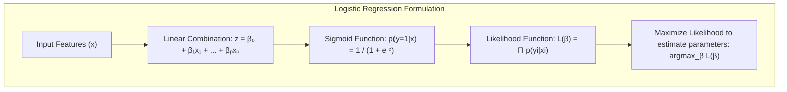
A **Regressão Logística** não assume a normalidade dos preditores e pode lidar com classes não balanceadas [^4.4.2, ^4.4.4]. A otimização da verossimilhança pode levar a modelos muito complexos que sofrem de *overfitting*. Técnicas de regularização (L1, L2) são frequentemente usadas para controlar a complexidade e melhorar a capacidade de generalização [^4.4.5, ^4.5].

> ⚠️ **Nota Importante**: A Regressão Logística modela probabilidades, enquanto a LDA modela a separabilidade das classes. O uso apropriado de cada um depende das suposições feitas e da natureza dos dados. [^4.4.1].
> ❗ **Ponto de Atenção**: A aplicação da Regressão Logística em conjuntos de dados desbalanceados pode ser problemática, sendo necessário usar técnicas de ponderação de classes ou outras abordagens para mitigar o viés. [^4.4.2].
> ✔️ **Destaque**: Apesar de terem formulações e motivações diferentes, LDA e regressão logística estão intimamente relacionadas. Em muitos casos, elas geram limites de decisão lineares muito semelhantes, especialmente quando as suposições da LDA se mantêm razoavelmente bem. [^4.5].
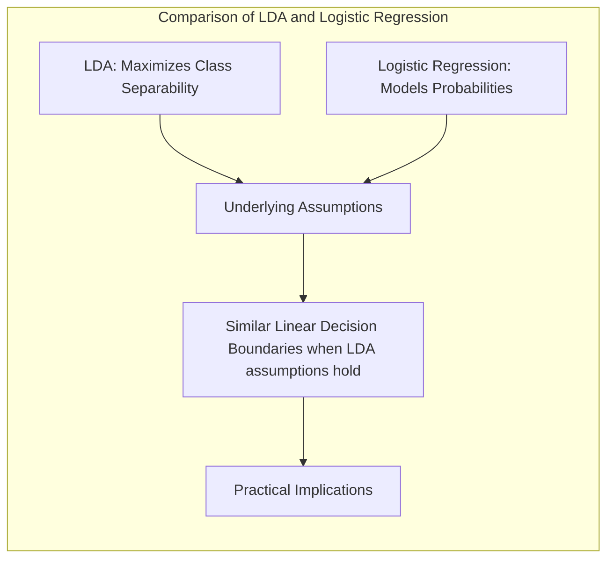

> 💡 **Exemplo Numérico:** Considere um dataset com duas classes, onde a probabilidade de uma amostra pertencer à classe 1 é dada por $p(x) = \frac{1}{1 + e^{-(\beta_0 + \beta_1 x)}}$. Os parâmetros $\beta_0$ e $\beta_1$ são estimados maximizando a verossimilhança. Vamos gerar um exemplo com $\beta_0 = -2$ e $\beta_1 = 1$.
>
> ```python
> import numpy as np
> import matplotlib.pyplot as plt
> from sklearn.linear_model import LogisticRegression
> from sklearn.metrics import accuracy_score
>
> # Generate data
> np.random.seed(42)
> X = np.sort(np.random.rand(100) * 10)
> beta0 = -2
> beta1 = 1
> p = 1 / (1 + np.exp(-(beta0 + beta1 * X)))
> y = np.random.binomial(1, p)
> X_2d = X.reshape(-1, 1)
>
> # Fit Logistic Regression
> logreg = LogisticRegression(solver='liblinear') #solver liblinear is used here for numerical stability
> logreg.fit(X_2d, y)
>
> # Plot decision boundary
> x_min, x_max = X.min() - 1, X.max() + 1
> xx = np.linspace(x_min, x_max, 100).reshape(-1, 1)
> prob = logreg.predict_proba(xx)[:, 1]
>
> plt.figure(figsize=(8, 6))
> plt.scatter(X, y, color='blue', label='Dados reais')
> plt.plot(xx, prob, color='red', label='Probabilidade da classe 1')
> plt.xlabel('Feature')
> plt.ylabel('Probability')
> plt.title('Regressão Logística e Limite de Decisão')
> plt.legend()
> plt.show()
>
> y_pred = logreg.predict(X_2d)
> accuracy = accuracy_score(y, y_pred)
> print(f'Accuracy: {accuracy:.2f}')
> print(f'Estimated coefficients: {logreg.coef_[0]}, {logreg.intercept_[0]}')
> ```
> O gráfico mostra a curva sigmóide estimada pela regressão logística. Os parâmetros encontrados por maximização da verossimilhança ajustam a curva para separar as classes com a maior acurácia possível.

### Regressão Linear e Mínimos Quadrados para Classificação
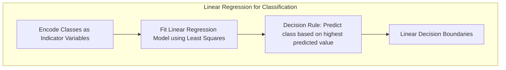
<imagem: Diagrama com a linguagem Mermaid que represente o processo de regressão de indicadores, mostrando como as classes são codificadas, os coeficientes são estimados, a regra de decisão é aplicada e como ela se relaciona com métodos probabilísticos, conforme o contexto [^4.2]>

A regressão linear pode ser usada em problemas de classificação codificando cada classe como uma variável indicadora (dummy) [^4.2]. O modelo de regressão linear é então ajustado para cada variável indicadora. Para classificar uma nova amostra, atribuímos a classe correspondente ao modelo com o maior valor predito, o que nos leva a limites de decisão lineares.

A regressão linear é uma abordagem simples e direta, mas pode sofrer algumas limitações. Primeiro, as previsões podem cair fora do intervalo [0, 1] para probabilidades [^4.2]. Segundo, sob a condição de que os dados não seguem uma distribuição Gaussiana, a regressão linear aplicada em variáveis indicadoras pode levar a resultados ruins. Adicionalmente, a regressão linear pode ser sensível à distribuição das classes, levando a um masking problem (onde uma classe de menor probabilidade é “mascarada” por outra mais frequente).

Apesar das limitações, em muitos casos, a regressão de indicadores pode ser uma ferramenta útil. Em problemas onde as suposições dos métodos probabilísticos são fortemente violadas, ela pode gerar um limite de decisão linear que atenda os requisitos [^4.2].

**Lemma 2:** *Sob certas condições de linearidade e distribuição das classes, a projeção em hiperplanos de decisão gerados por regressão linear de indicadores são equivalentes a projeções geradas por LDA*. Essa equivalência pode simplificar a análise e aplicação dos métodos, quando essas condições se mantêm [^4.2].

**Prova:** Considere o caso onde as variáveis indicadoras são linearmente independentes e existe uma clara separação entre as classes. Nesse caso, a otimização por mínimos quadrados na regressão linear leva aos mesmos limites de decisão lineares que seriam obtidos por LDA. A prova envolve demonstrar que a projeção nos hiperplanos que maximizam a separação entre classes, obtidos por LDA, são equivalentes aos hiperplanos derivados da regressão linear sob tais condições [^4.2]. $\blacksquare$
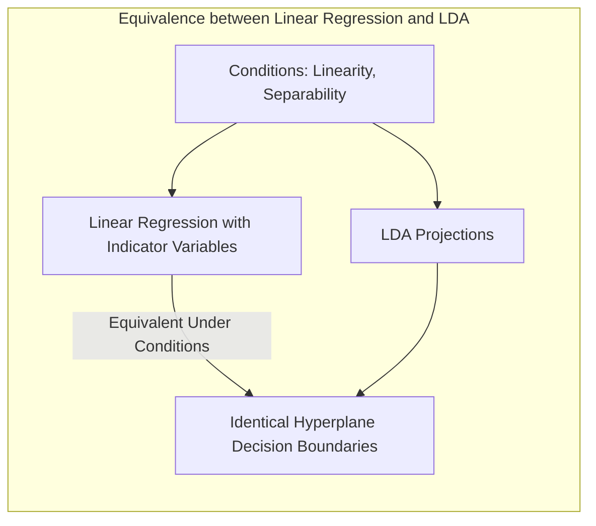
**Corolário 2:** *A relação entre a regressão de indicadores e LDA se torna mais direta quando todas as classes têm a mesma variância*. Isso resulta de que a regressão linear de indicadores também busca um limite de decisão linear que separa as classes, embora não tenha sido formulada diretamente por uma maximização de separabilidade entre classes como na LDA [^4.3].

“Em alguns casos, conforme apontado em [^4.4], a regressão logística pode fornecer estimativas de probabilidade mais estáveis, enquanto a regressão de indicadores pode levar a extrapolações fora de [0, 1].”
“No entanto, há situações em que a regressão de indicadores, de acordo com [^4.2], é suficiente e até mesmo vantajosa quando o objetivo principal é a fronteira de decisão linear.”

> 💡 **Exemplo Numérico:** Vamos criar um problema de classificação com duas classes usando regressão linear. Primeiro, codificamos as classes como 0 e 1.  Usando dados sintéticos para ilustrar, vamos comparar o modelo linear de mínimos quadrados com a LDA:
>
> ```python
> import numpy as np
> import matplotlib.pyplot as plt
> from sklearn.linear_model import LinearRegression
> from sklearn.discriminant_analysis import LinearDiscriminantAnalysis
> from sklearn.metrics import accuracy_score
>
> # Generate synthetic data for 2 classes
> np.random.seed(42)
> X = np.concatenate([np.random.randn(50, 2) + [2, 2], np.random.randn(50, 2) + [-2, -2]])
> y = np.array([0] * 50 + [1] * 50)
>
> # Linear Regression with dummy variables
> model_lr = LinearRegression()
> model_lr.fit(X, y)
> y_pred_lr = (model_lr.predict(X) > 0.5).astype(int)
> accuracy_lr = accuracy_score(y, y_pred_lr)
>
> # LDA model
> model_lda = LinearDiscriminantAnalysis()
> model_lda.fit(X, y)
> y_pred_lda = model_lda.predict(X)
> accuracy_lda = accuracy_score(y, y_pred_lda)
>
> # Plotting
> plt.figure(figsize=(12, 6))
>
> # Linear Regression Plot
> plt.subplot(1, 2, 1)
> x_min, x_max = X[:, 0].min() - 1, X[:, 0].max() + 1
> y_min, y_max = X[:, 1].min() - 1, X[:, 1].max() + 1
> xx, yy = np.meshgrid(np.arange(x_min, x_max, 0.02), np.arange(y_min, y_max, 0.02))
> Z = (model_lr.predict(np.c_[xx.ravel(), yy.ravel()]) > 0.5).astype(int).reshape(xx.shape)
> plt.contourf(xx, yy, Z, cmap=plt.cm.RdBu, alpha=0.8)
> plt.scatter(X[:, 0], X[:, 1], c=y, cmap=plt.cm.RdBu, edgecolors='k')
> plt.title(f'Regressão Linear (Acc={accuracy_lr:.2f})')
>
> # LDA plot
> plt.subplot(1, 2, 2)
> xx, yy = np.meshgrid(np.arange(x_min, x_max, 0.02), np.arange(y_min, y_max, 0.02))
> Z = model_lda.predict(np.c_[xx.ravel(), yy.ravel()]).reshape(xx.shape)
> plt.contourf(xx, yy, Z, cmap=plt.cm.RdBu, alpha=0.8)
> plt.scatter(X[:, 0], X[:, 1], c=y, cmap=plt.cm.RdBu, edgecolors='k')
> plt.title(f'LDA (Acc={accuracy_lda:.2f})')
>
> plt.show()
> print(f"Acurácia da regressão linear: {accuracy_lr:.2f}")
> print(f"Acurácia do LDA: {accuracy_lda:.2f}")
> ```
> No exemplo, a regressão linear e o LDA geram fronteiras lineares semelhantes, e as acurácias nos dados de treino são comparáveis, mostrando a relação entre os métodos quando os dados são aproximadamente separáveis por uma reta.

### Métodos de Seleção de Variáveis e Regularização em Classificação
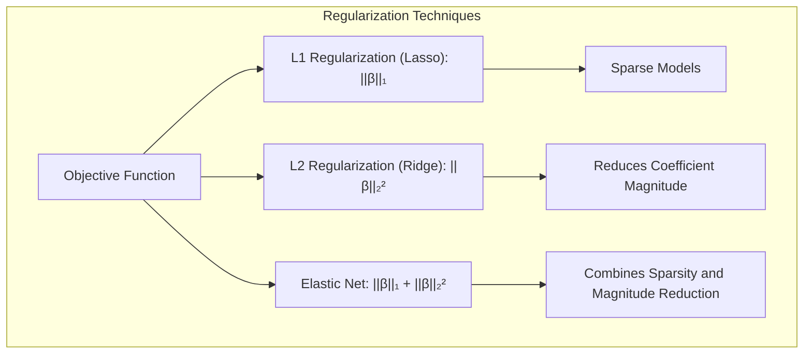
<imagem: Diagrama que represente um mapa mental que conecta o conceito de seleção de variáveis e regularização com LDA, regressão logística e hiperplanos, conforme os tópicos [^4.5]>

A seleção de variáveis e regularização são técnicas cruciais para lidar com a complexidade de modelos preditivos, particularmente em problemas com um grande número de preditores [^4.5, ^4.4.4]. A regularização adiciona uma penalidade à função de custo do modelo, o que leva a soluções mais simples e, muitas vezes, com melhor capacidade de generalização.

A regularização L1 (Lasso) tende a gerar modelos esparsos, com muitos coeficientes iguais a zero, o que é útil para seleção de variáveis [^4.5.1, ^4.4.4]. A regularização L2 (Ridge) tende a reduzir os valores dos coeficientes, melhorando a estabilidade do modelo e sua capacidade de generalização [^4.5.2, ^4.4.4]. Ambas podem ser combinadas na regularização *Elastic Net*, o que permite aproveitar as vantagens de ambos os métodos [^4.5].

A regularização é frequentemente utilizada em conjunto com modelos de regressão logística para controlar a complexidade do modelo e evitar *overfitting*. A função de custo a ser otimizada combina a verossimilhança dos dados com os termos de penalidade L1 e/ou L2. O parâmetro de regularização controla o quão forte é a penalidade aplicada [^4.4.4].
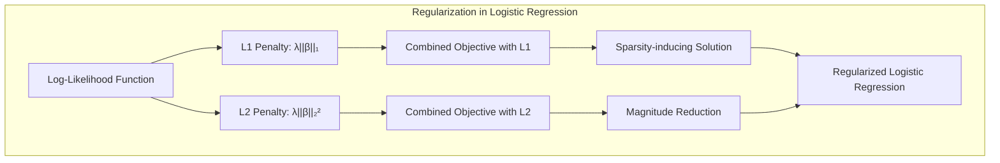
**Lemma 3:** *A penalização L1 na regressão logística leva a modelos esparsos, onde os coeficientes de algumas variáveis são exatamente zero, enquanto a penalização L2 não tem essa propriedade.* Isso permite que o L1 seja usado para seleção de variáveis, enquanto L2 leva a uma redução da magnitude dos coeficientes [^4.4.4].

**Prova do Lemma 3:** A penalização L1 adiciona à função de custo um termo proporcional à soma dos valores absolutos dos coeficientes, $ \lambda \sum_{j=1}^{p} |\beta_j| $. Este termo induz a *sparsity*, pois o ponto de mínimo muitas vezes se dá quando alguns coeficientes são exatamente zero. A penalização L2 adiciona um termo proporcional à soma dos quadrados dos coeficientes,  $\lambda \sum_{j=1}^{p} \beta_j^2$, que reduz a magnitude dos coeficientes, mas não os zera completamente [^4.4.4]. $\blacksquare$
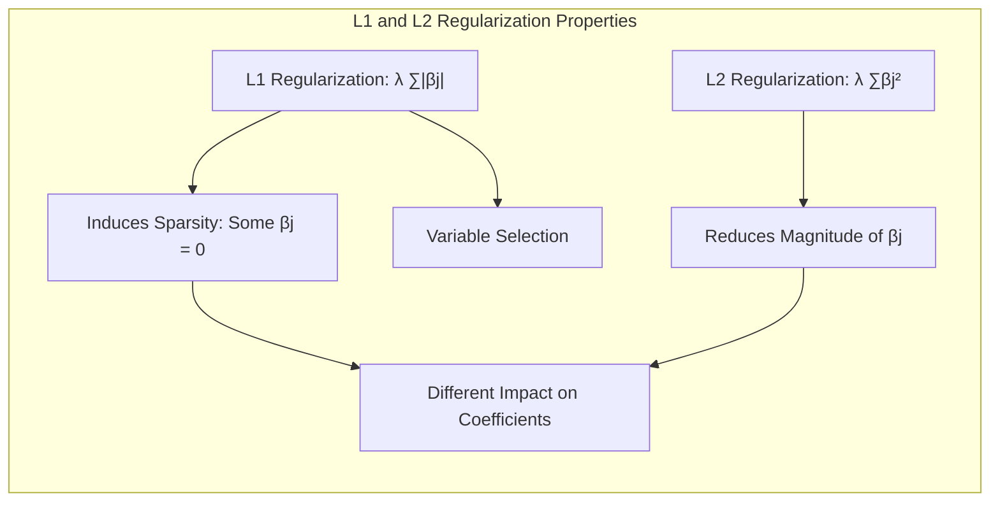
**Corolário 3:** *A utilização da regularização L1 em modelos de classificação pode levar à seleção de um subconjunto mais relevante de preditores, o que melhora a interpretabilidade e a capacidade de generalização do modelo*. Esta seleção de variáveis é crucial em contextos onde a identificação dos preditores mais importantes é um objetivo em si. [^4.4.5]

> ⚠️ **Ponto Crucial**: A escolha adequada da técnica de regularização (L1, L2, ou Elastic Net) e dos parâmetros de regularização é fundamental para alcançar um bom desempenho na classificação e evitar o *overfitting* [^4.5].

> 💡 **Exemplo Numérico:** Consideremos um problema de classificação com 10 preditores, alguns relevantes e outros não. Vamos aplicar regressão logística com regularização L1 e L2 e comparar os resultados:
>
> ```python
> import numpy as np
> import matplotlib.pyplot as plt
> from sklearn.linear_model import LogisticRegression
> from sklearn.model_selection import train_test_split
> from sklearn.metrics import accuracy_score
> from sklearn.preprocessing import StandardScaler
>
> # Generate synthetic data (10 features)
> np.random.seed(42)
> n_samples = 100
> n_features = 10
> X = np.random.randn(n_samples, n_features)
> # Assume first 3 features are important
> y = (X[:, 0] + 0.5 * X[:, 1] - 0.3 * X[:, 2] + 0.1 * np.random.randn(n_samples) > 0).astype(int)
>
> # Split data
> X_train, X_test, y_train, y_test = train_test_split(X, y, test_size=0.3, random_state=42)
>
> # Standardize
> scaler = StandardScaler()
> X_train = scaler.fit_transform(X_train)
> X_test = scaler.transform(X_test)
>
> # Logistic Regression with L1 regularization
> l1_logreg = LogisticRegression(penalty='l1', solver='liblinear', C=0.5)
> l1_logreg.fit(X_train, y_train)
> y_pred_l1 = l1_logreg.predict(X_test)
> accuracy_l1 = accuracy_score(y_test, y_pred_l1)
>
> # Logistic Regression with L2 regularization
> l2_logreg = LogisticRegression(penalty='l2', solver='liblinear', C=0.5)
> l2_logreg.fit(X_train, y_train)
> y_pred_l2 = l2_logreg.predict(X_test)
> accuracy_l2 = accuracy_score(y_test, y_pred_l2)
>
> # Display results
> print(f"L1 Regularization Accuracy: {accuracy_l1:.2f}")
> print(f"L2 Regularization Accuracy: {accuracy_l2:.2f}")
>
> print(f"\nL1 Coefficients: {l1_logreg.coef_}")
> print(f"\nL2 Coefficients: {l2_logreg.coef_}")
>
> # Plotting coefficients
> plt.figure(figsize=(10,5))
> plt.subplot(1, 2, 1)
> plt.bar(range(n_features), l1_logreg.coef_[0])
> plt.title('L1 Coefficients')
> plt.xlabel('Features')
> plt.ylabel('Coefficient Value')
>
> plt.subplot(1, 2, 2)
> plt.bar(range(n_features), l2_logreg.coef_[0])
> plt.title('L2 Coefficients')
> plt.xlabel('Features')
> plt.ylabel('Coefficient Value')
>
> plt.show()
>
> ```
> No exemplo, podemos ver que a regularização L1 zera alguns dos coeficientes, indicando que as variáveis correspondentes são menos relevantes para o modelo. A regularização L2 reduz a magnitude de todos os coeficientes, mas não os zera. A acurácia nos dados de teste é similar para os dois modelos, mostrando que a regularização ajudou a evitar o *overfitting*.

### Separating Hyperplanes e Perceptrons

<imagem: Uma imagem ou diagrama que ilustre o conceito de hiperplano separador, mostrando como ele divide o espaço de características em regiões correspondentes às classes, com uma margem de separação ideal.>
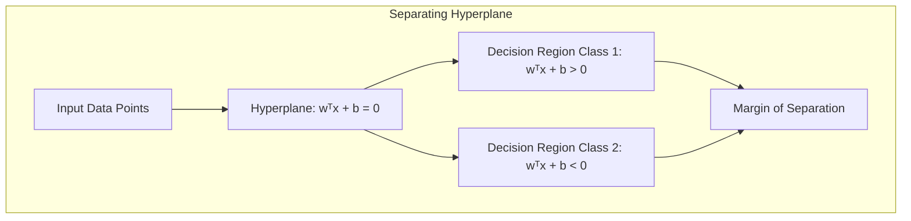
O conceito de **hiperplano separador** é fundamental em métodos de classificação linear. Um hiperplano é um espaço de dimensão *p-1* em um espaço de dimensão *p*, e serve como fronteira de decisão entre classes. O objetivo é encontrar o hiperplano que melhor separa as classes, maximizando a margem de separação [^4.5.2].

A **margem de separação** é a distância entre o