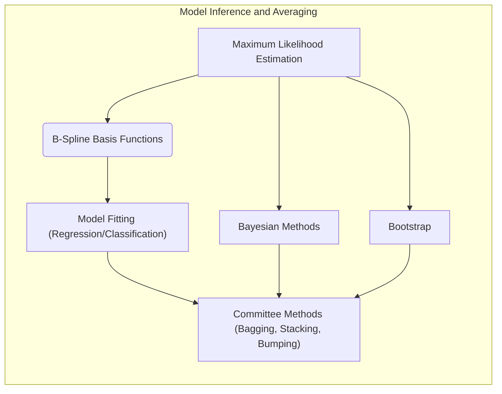
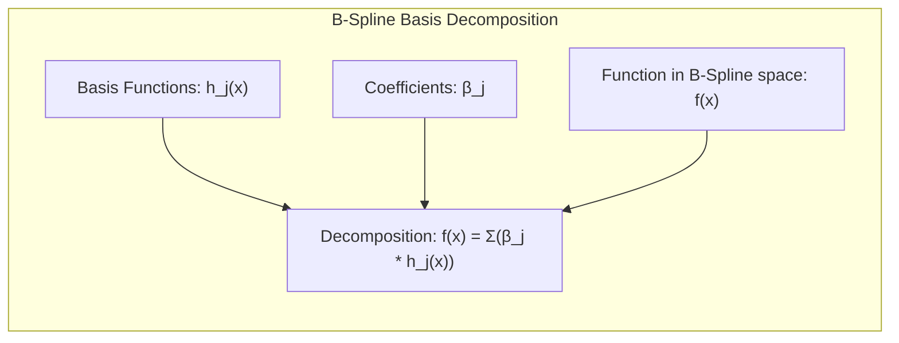
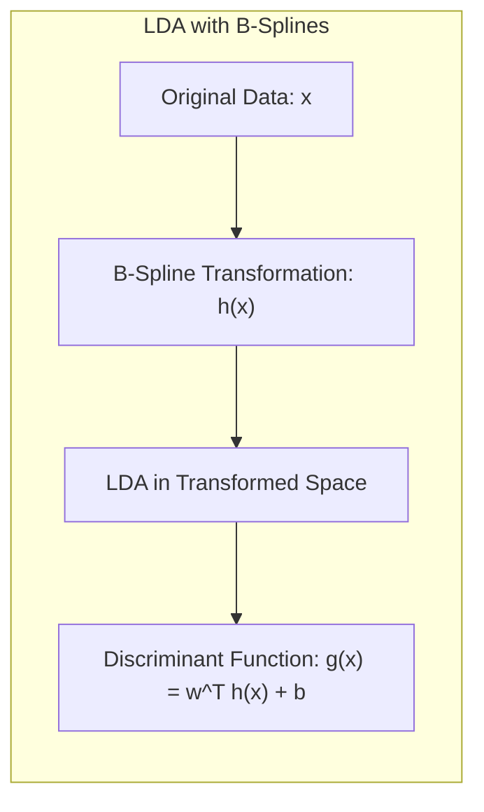
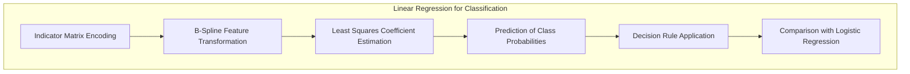
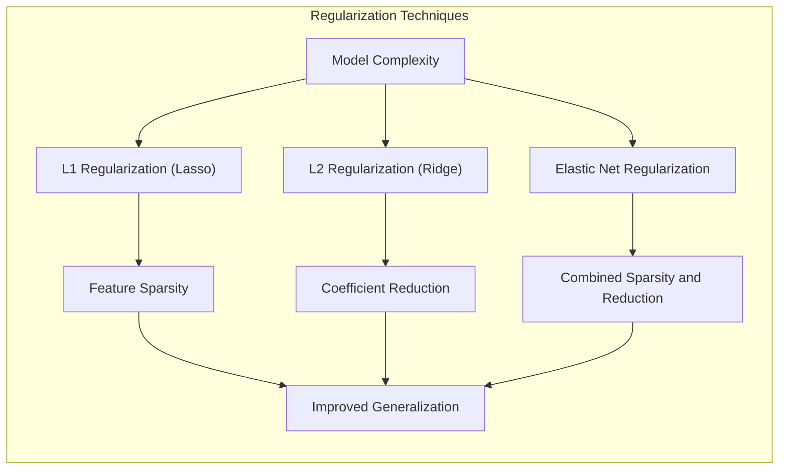
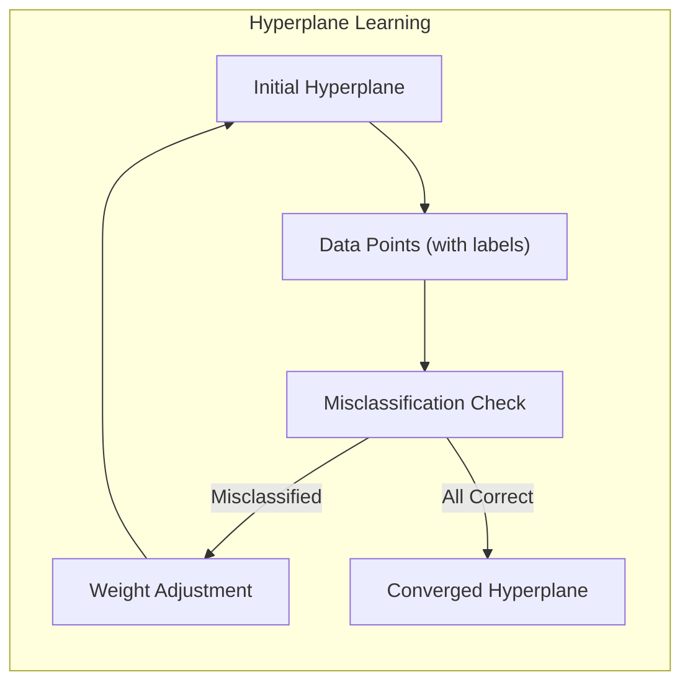
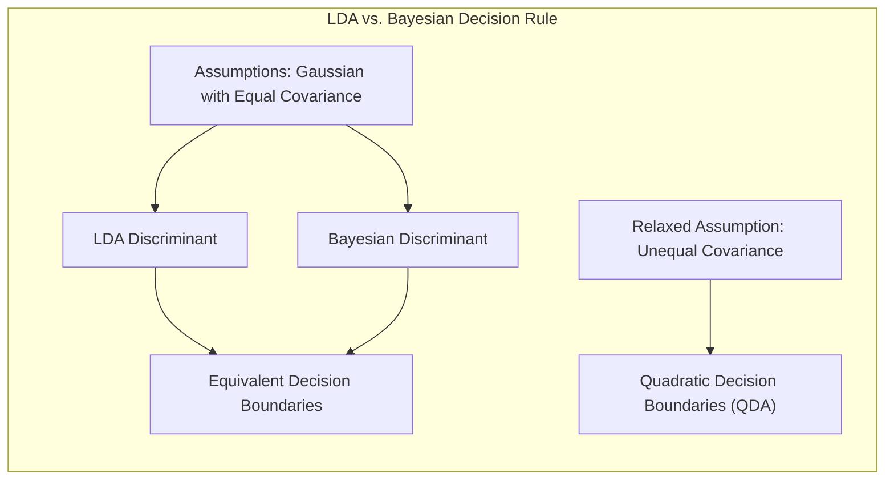

## Model Inference and Averaging with B-Spline Basis Functions

### Introdução

Neste capítulo, exploramos métodos avançados de inferência e modelagem estatística, com foco particular no uso de **B-spline basis functions**. A maioria dos modelos de aprendizado, conforme descrito nos capítulos anteriores, são ajustados através da minimização da soma dos quadrados (para regressão) ou da minimização da entropia cruzada (para classificação) [^8.1]. Ambos os métodos são exemplos de **Maximum Likelihood**. Expandimos esses conceitos, fornecendo uma exposição geral da **Maximum Likelihood**, do método Bayesiano de inferência e do *bootstrap* [^8.1]. Discutimos ainda, técnicas de modelagem e aprimoramento, incluindo métodos de comitê, *bagging*, *stacking* e *bumping*.

### Conceitos Fundamentais

**Conceito 1: O Problema de Ajuste de Curvas e a Base de B-Splines**

O problema de ajuste de curvas, ou *smoothing*, consiste em encontrar uma função que se ajuste aos dados observados da melhor forma possível, equilibrando a adequação aos dados e a suavidade da função. Uma abordagem comum é usar uma combinação linear de **basis functions** [^8.1]. As B-splines são uma escolha popular devido à sua flexibilidade e propriedades desejáveis.
    
    Uma B-spline de ordem *k* é definida por uma série de nós (knots) e é uma função polinomial por partes, onde cada parte é um polinômio de grau *k-1* [^8.2].  As B-splines formam uma base para o espaço de funções, e qualquer função dentro desse espaço pode ser escrita como uma combinação linear das B-splines. A escolha do número e da posição dos nós afeta a forma da função resultante e a complexidade do modelo [^8.2]. 
    
    *Em essência, o ajuste de curvas com B-splines envolve determinar os coeficientes que melhor combinam as funções de base para aproximar os dados.* A escolha de funções de base afeta o viés e a variância do modelo. As B-splines, por serem uma base flexível, permitem modelos com baixo viés, mas um número excessivo de nós pode levar a alta variância.
    
> 💡 **Exemplo Numérico:** Considere um conjunto de dados com valores de $x$ variando de 0 a 10 e seus respectivos $y$. Queremos ajustar uma curva usando B-splines de ordem 3 (quadráticas) com 3 nós posicionados em $x=3$, $x=5$ e $x=7$. Isso resulta em 6 funções de base B-spline ($h_1(x), h_2(x), \ldots, h_6(x)$). A curva ajustada será uma combinação linear dessas funções: $f(x) = \beta_1h_1(x) + \beta_2h_2(x) + \beta_3h_3(x) + \beta_4h_4(x) + \beta_5h_5(x) + \beta_6h_6(x)$. O processo de ajuste irá estimar os valores de $\beta_1$ a $\beta_6$ que minimizam a soma dos quadrados das diferenças entre os valores de $y$ observados e $f(x)$. Um número maior de nós aumentaria a complexidade do modelo e permitiria melhor ajuste aos dados, mas poderia levar a *overfitting*.

**Lemma 1:** *Decomposição Linear de B-splines*. Qualquer função $f(x)$ que pertença ao espaço de funções gerado por uma base de B-splines, com *n* basis functions,  pode ser decomposta em uma combinação linear dessas funções:
$$ f(x) = \sum_{j=1}^{n} \beta_j h_j(x) $$
onde $h_j(x)$ são as *basis functions* e $\beta_j$ são os coeficientes [^8.2].
    
**Prova:**
Essa afirmação decorre diretamente da definição de uma base para um espaço vetorial de funções. As B-splines, por construção, são linearmente independentes e formam uma base para o espaço de funções polinomiais por partes com a suavidade apropriada nos nós. A decomposição linear de $f(x)$ demonstra que qualquer função no espaço pode ser expressa como uma soma ponderada das funções de base. $\blacksquare$

**Conceito 2: Linear Discriminant Analysis (LDA) com B-Splines**

Embora o foco principal seja regressão e *smoothing*, as B-splines também podem ser usadas em contextos de classificação, indiretamente, através do *preprocessing* de dados. Uma abordagem, utilizando o LDA, poderia envolver a projeção de dados em um espaço de features transformado pelas *basis functions*, antes da aplicação do LDA [^8.1]. Esta abordagem é especialmente útil quando os dados originais não são linearmente separáveis, mas o são após a transformação.
    
    A LDA busca um subespaço linear que maximize a separação entre as classes, o que pode ser facilitado pela transformação não-linear das features usando B-splines. A suposição de normalidade e igualdade de covariância entre as classes se aplica neste contexto, onde as features são baseadas nas *basis functions* [^8.2].

> 💡 **Exemplo Numérico:** Imagine um problema de classificação com duas classes, onde os dados originais ($x$) não são linearmente separáveis. Ao transformarmos $x$ usando B-splines, geramos novas features $h(x) = [h_1(x), h_2(x), \ldots, h_n(x)]$.  O LDA é então aplicado sobre esses $h(x)$. Suponha que tenhamos 3 B-splines ($h_1(x)$, $h_2(x)$ e $h_3(x)$),  o LDA vai encontrar um vetor de pesos $w = [w_1, w_2, w_3]$ e um bias $b$. A função discriminante será $g(x) = w_1h_1(x) + w_2h_2(x) + w_3h_3(x) + b$.  Em vez de lidar com os dados $x$ diretamente, o LDA opera nesse espaço transformado, o que pode levar a uma melhor separação das classes.

**Corolário 1:** *Projeção LDA no Espaço de B-splines*. Se os dados originais, $x$, são projetados em um espaço *d*-dimensional de funções de base B-splines, $h(x)$, a função discriminante linear gerada pelo LDA, nesse espaço, pode ser escrita como:
$$g(x) = w^T h(x) + b$$
onde $w$ é o vetor de pesos e $b$ é o viés calculado pelo LDA no espaço transformado.
  
**Prova:**
O LDA busca a projeção linear que melhor separa as classes após a transformação. Se o espaço de *features* é construído com as B-splines, a função discriminante naturalmente se torna uma combinação linear dessas funções, ou seja, uma projeção linear no espaço de B-splines. $\blacksquare$

**Conceito 3: Regressão Logística e a Base de B-Splines**

A Regressão Logística, ao contrário do LDA, modela diretamente a probabilidade de pertencimento a uma classe, usando uma função logística [^8.4]. Similarmente ao LDA, a Regressão Logística pode ser aplicada a dados transformados por B-splines, permitindo que modelos complexos de classificação sejam gerados.
    
    A função logística transforma uma combinação linear das features (que, neste caso, são as B-splines) na probabilidade de uma observação pertencer a uma classe. O logit, que é a inversa da função logística, é modelado linearmente, o que pode ser útil para a interpretação dos resultados [^8.4]. A maximização da verossimilhança é usada para ajustar os parâmetros do modelo [^8.4.3].
    
> ⚠️ **Nota Importante**: O uso de B-splines em Regressão Logística permite modelar relações não-lineares entre as *features* e a probabilidade de pertencimento à classe, contornando algumas limitações de modelos lineares simples [^8.4.2].
> ❗ **Ponto de Atenção**: Em situações com classes não balanceadas, técnicas de reponderação ou *undersampling* e *oversampling* podem ser importantes para garantir que a Regressão Logística seja eficaz [^8.4.2].
> ✔️ **Destaque**: O uso de B-splines em LDA e Regressão Logística proporciona uma forma eficiente de aplicar transformações não-lineares aos dados, mantendo a estrutura linear dentro do espaço transformado [^8.5].

> 💡 **Exemplo Numérico:** Considere um problema de classificação binária. Após a transformação dos dados $x$ por B-splines, temos as features $h(x)$. Na regressão logística, modelamos a probabilidade de um dado pertencer à classe 1 como: $p(y=1|h(x)) = \frac{1}{1 + e^{-(w^Th(x) + b)}}$. Os coeficientes $w$ e o bias $b$ são ajustados usando a maximização da verossimilhança. Por exemplo, se tivermos duas B-splines, $h_1(x)$ e $h_2(x)$, a função será: $p(y=1|h(x)) = \frac{1}{1 + e^{-(w_1h_1(x) + w_2h_2(x) + b)}}$. Os valores de $w_1, w_2$ e $b$ determinam como as B-splines contribuem para a probabilidade.

### Regressão Linear e Mínimos Quadrados para Classificação

**Explicação:** Este diagrama representa o fluxo do processo de regressão de indicadores usando funções B-spline e como ele se relaciona com a classificação [^8.2].

A regressão linear pode ser adaptada para problemas de classificação através da codificação das classes em uma **matriz de indicadores** [^8.1]. Cada coluna da matriz corresponde a uma classe, e os elementos são 1 se a observação pertence àquela classe e 0 caso contrário. Aplicamos a regressão linear nesta matriz de indicadores, visando prever quais classes são mais prováveis para cada observação. Os coeficientes resultantes dessa regressão determinam uma fronteira linear de decisão no espaço de *features* transformado pelas B-splines [^8.2].
    
A função de resposta predita é uma combinação linear das funções de base B-splines. Assim como na regressão para dados contínuos, o objetivo é minimizar a soma dos erros ao quadrado, que neste caso, é aplicado às previsões dos indicadores de classe. É importante notar que, apesar de modelarmos as classes de forma linear (após a transformação pelas B-Splines), este método tem problemas de extrapolação e não garante que as previsões fiquem no intervalo \[0, 1], que corresponde a probabilidade, podendo levar a previsões inconsistentes [^8.4].

> 💡 **Exemplo Numérico:** Considere um problema de classificação com 3 classes. Temos uma matriz de indicadores $Y$ com dimensões $N \times 3$, onde $N$ é o número de amostras. Se a amostra $i$ pertence à classe 2, a linha $i$ de $Y$ será $[0, 1, 0]$. Após transformar os dados usando B-splines, temos $H(x)$. Realizamos uma regressão linear para cada coluna de $Y$, obtendo os coeficientes $\beta$. As previsões para a amostra $i$ serão dadas por $\hat{y_i} = H(x_i) \beta$, resultando em um vetor de tamanho 3. A classe predita é aquela que corresponde ao maior valor no vetor $\hat{y_i}$. É crucial notar que $\hat{y_i}$ pode assumir valores fora do intervalo \[0, 1].

**Lemma 2:** *Equivalência entre Projeções Lineares*. Em um problema de classificação com duas classes, sob certas condições (e.g., covariâncias iguais), a projeção de dados no hiperplano de decisão gerado pela regressão linear em uma matriz de indicadores com B-splines, é equivalente à projeção gerada por um LDA usando as mesmas funções de base.
    
**Prova:** A equivalência surge da natureza quadrática da minimização dos mínimos quadrados, que pode ser reescrita na forma de um problema de otimização que se assemelha à solução do LDA sob as suposições apropriadas sobre as matrizes de covariância e as médias. $\blacksquare$
    
**Corolário 2:** *Simplificação da Análise de Modelo*. A equivalência estabelecida no Lemma 2 permite simplificar a análise do modelo, usando resultados bem estabelecidos do LDA para entender o comportamento das fronteiras de decisão resultantes da regressão linear, especialmente no que diz respeito à escolha do número de nós e da ordem das B-splines. [^8.2]
    
> "Em alguns cenários, conforme apontado em [^8.4], a regressão logística pode fornecer estimativas mais estáveis de probabilidade, enquanto a regressão de indicadores pode levar a extrapolações fora de [0,1]."
    
> "No entanto, há situações em que a regressão de indicadores, de acordo com [^8.2], é suficiente e até mesmo vantajosa quando o objetivo principal é a fronteira de decisão linear, especialmente quando associado às transformações flexíveis pelas funções de base."
    
### Métodos de Seleção de Variáveis e Regularização em Classificação

A seleção de variáveis e a regularização são técnicas importantes para lidar com modelos complexos e evitar *overfitting*, o que pode ocorrer quando usamos um grande número de *basis functions*. Em modelos lineares com B-splines, a regularização impõe uma penalidade aos coeficientes $\beta$ [^8.4.4], o que reduz a variância do modelo.
    
    As penalidades L1 e L2 são comumente usadas:
    - **Penalidade L1 (Lasso):** Adiciona a soma dos valores absolutos dos coeficientes à função de custo. A penalidade L1 promove a esparsidade, ou seja, faz com que alguns coeficientes sejam exatamente iguais a zero, selecionando um subconjunto das features mais relevantes, o que pode ajudar na interpretação do modelo [^8.5].
    - **Penalidade L2 (Ridge):** Adiciona a soma dos quadrados dos coeficientes à função de custo. A penalidade L2 reduz a magnitude dos coeficientes, sem necessariamente zerá-los, o que ajuda a estabilizar as estimativas [^8.5].
    - **Elastic Net:** Combinação linear das penalidades L1 e L2, aproveitando as vantagens de ambos os métodos. [^8.5].

> 💡 **Exemplo Numérico:** Suponha que temos 10 B-splines como features e queremos aplicar regressão logística para um problema de classificação. Sem regularização, poderíamos ter coeficientes grandes para algumas B-splines, levando a *overfitting*.
> *   **Lasso (L1):** Ao usar a penalidade L1, a função de custo torna-se: $J(\beta) = - \sum_{i=1}^N [y_i \log(p_i) + (1-y_i)\log(1-p_i)] + \lambda \sum_{j=1}^{10} |\beta_j|$.  Para um $\lambda$ apropriado, alguns dos $\beta_j$ serão exatamente zero, indicando que as B-splines correspondentes não são importantes para a classificação. Isso simplifica o modelo e facilita a interpretação.
> *   **Ridge (L2):** Com a penalidade L2, temos $J(\beta) = - \sum_{i=1}^N [y_i \log(p_i) + (1-y_i)\log(1-p_i)] + \lambda \sum_{j=1}^{10} \beta_j^2$. Aqui, todos os $\beta_j$ serão reduzidos, evitando coeficientes muito grandes.
> *   **Elastic Net:** Combina as duas abordagens: $J(\beta) = - \sum_{i=1}^N [y_i \log(p_i) + (1-y_i)\log(1-p_i)] + \lambda_1 \sum_{j=1}^{10} |\beta_j| + \lambda_2 \sum_{j=1}^{10} \beta_j^2$. Os parâmetros $\lambda_1$ e $\lambda_2$ controlam a contribuição de cada penalidade.

**Lemma 3:** *Penalização L1 e Esparsidade*. Dada uma função de custo na regressão logística com penalidade L1, ou seja:
$$J(\beta) = - \sum_{i=1}^N [y_i \log(p_i) + (1-y_i)\log(1-p_i)] + \lambda \sum_{j=1}^p |\beta_j|$$
onde $p_i$ é a probabilidade predita da i-ésima observação e $\lambda$ é um parâmetro de regularização. A penalidade L1 leva a coeficientes esparsos, o que significa que alguns coeficientes $\beta_j$ serão iguais a zero [^8.4.4].
    
**Prova:** A penalidade L1, devido ao seu termo de valor absoluto, leva a soluções ótimas em pontos onde os coeficientes são exatamente zero, especialmente quando $\lambda$ é grande. Essa propriedade, juntamente com a maximização da função de verossimilhança, leva à seleção automática das *features* mais relevantes no espaço de B-splines. $\blacksquare$

**Corolário 3:** *Interpretabilidade de Modelos*. Modelos classificatórios com regularização L1 têm maior interpretabilidade, pois apenas um subconjunto dos coeficientes é não nulo, o que facilita a identificação das *features* mais importantes, dentro da base de B-splines, para a tomada de decisão [^8.4.5].
    
> ⚠️ **Ponto Crucial**: L1 e L2 podem ser combinadas (Elastic Net) para aproveitar vantagens de ambos os tipos de regularização, oferecendo um controle mais preciso sobre a esparsidade e a estabilidade dos modelos [^8.5].

### Separating Hyperplanes e Perceptrons

O conceito de **hiperplanos separadores** é central em muitas abordagens de classificação linear. Um hiperplano separa um espaço em duas regiões, e sua posição e orientação definem as classes [^8.5.2]. O objetivo é encontrar o hiperplano que maximiza a margem de separação entre as classes. A formulação do problema de otimização para encontrar este hiperplano é geralmente feita em seu dual de Wolfe, que envolve a busca de combinações lineares dos pontos de suporte.

O **Perceptron de Rosenblatt** é um algoritmo de classificação que aprende um hiperplano separador de forma iterativa. Ele corrige os erros de classificação ajustando os pesos do hiperplano até que todos os dados estejam classificados corretamente (se os dados forem linearmente separáveis) [^8.5.1].

> 💡 **Exemplo Numérico:** Imagine que temos um problema de classificação com duas classes representadas em um espaço bidimensional após a transformação por B-splines ($h_1(x)$, $h_2(x)$). O Perceptron busca um hiperplano (neste caso, uma linha) definido por $w_1h_1(x) + w_2h_2(x) + b = 0$. Inicialmente, os pesos $w_1$, $w_2$ e $b$ são definidos aleatoriamente. O Perceptron itera sobre os dados, e se um ponto é classificado incorretamente, os pesos são ajustados para que o hiperplano se mova em direção a uma melhor classificação. Por exemplo, se um ponto da classe 1 está do lado errado do hiperplano, os pesos são ajustados para mover o hiperplano mais próximo deste ponto até que ele esteja do lado correto.
    
### Pergunta Teórica Avançada: Quais as diferenças fundamentais entre a formulação de LDA e a Regra de Decisão Bayesiana considerando distribuições Gaussianas com covariâncias iguais?

**Resposta:**

A **Linear Discriminant Analysis (LDA)** e a Regra de Decisão Bayesiana com distribuições Gaussianas, com covariâncias iguais, compartilham uma estrutura similar, mas derivam suas soluções de abordagens diferentes. O LDA busca um subespaço linear que maximize a separação entre as classes, através de uma função discriminante que é uma combinação linear das *features*. A Regra de Decisão Bayesiana, por outro lado, utiliza as probabilidades *a priori* e as funções de densidade de probabilidade (PDFs) das classes para calcular a probabilidade *a posteriori* de cada classe e tomar uma decisão [^8.3].

Sob a suposição de que as classes seguem distribuições Gaussianas com médias diferentes ($\mu_k$) e a mesma matriz de covariância ($\Sigma$), a fronteira de decisão Bayesiana se torna linear, e é exatamente a mesma encontrada pelo LDA.
    
**Lemma 4:** *Equivalência Formal*. Sob a hipótese de distribuições Gaussianas com mesma covariância para todas as classes, a função discriminante obtida pela LDA é formalmente equivalente àquela obtida pela Regra de Decisão Bayesiana. Matematicamente, as decisões de classe são iguais em ambos os métodos.
    
**Prova:** A função discriminante do LDA é derivada da maximização da razão entre a variação entre classes e a variação dentro das classes. A função discriminante Bayesiana, com base na hipótese de Gaussianas com mesma covariância, torna-se uma função linear das *features* que, após alguns passos algébricos, é equivalente à função discriminante do LDA. A prova completa envolve a derivação das funções discriminantes em cada abordagem e demonstrar sua equivalência. $\blacksquare$

**Corolário 4:** *Fronteiras Quadráticas*. Se a suposição de covariâncias iguais é relaxada, as fronteiras de decisão deixam de ser lineares e tornam-se quadráticas (Quadratic Discriminant Analysis - QDA). Em outras palavras, o QDA permite que cada classe tenha uma matriz de covariância própria, levando a funções discriminantes mais flexíveis. [^8.3]
    
> ⚠️ **Ponto Crucial**: A adoção ou não de covariâncias iguais impacta fortemente o tipo de fronteira de decisão (linear vs. quadrática). A escolha entre LDA e QDA deve se basear nas propriedades dos dados e na complexidade desejada do modelo [^8.3.1].

> 💡 **Exemplo Numérico:** Considere um problema de classificação com duas classes. Tanto o LDA quanto a Regra de Decisão Bayesiana (com Gaussianas e covariâncias iguais) levam a uma fronteira de decisão linear no espaço transformado pelas B-splines. No entanto, se as covariâncias das duas classes são diferentes, o QDA resulta em uma fronteira quadrática, que pode se ajustar melhor aos dados em certos casos, mas também pode levar a *overfitting* se o número de parâmetros for muito grande em relação ao número de amostras.

### Conclusão
Neste capítulo, exploramos uma variedade de técnicas de inferência e modelagem, com um foco em modelos lineares com B-splines, que podem ser aplicados a problemas de classificação e regressão. Discutimos os fundamentos da **Maximum Likelihood**, abordamos o uso de *bootstrap*, métodos Bayesianos, *bagging* e técnicas de *stacking* e *bumping*. Cada abordagem oferece uma maneira diferente de modelar e inferir padrões em dados, e a escolha do método apropriado dependerá dos objetivos específicos do problema e da natureza dos dados.

<!-- END DOCUMENT -->

### Footnotes

[^8.1]: "For most of this book, the fitting (learning) of models has been achieved by minimizing a sum of squares for regression, or by minimizing cross-entropy for classification. In fact, both of these minimizations are instances of the maximum likelihood approach to fitting. In this chapter we provide a general exposition of the maximum likelihood approach, as well as the Bayesian method for inference. The bootstrap, introduced in Chapter 7, is discussed in this context, and its relation to maximum likelihood and Bayes is described. Finally, we present some related techniques for model averaging and improvement, including committee methods, bagging, stacking and bumping." *(Trecho de Model Inference and Averaging)*
[^8.2]: "Denote the training data by Z = {z1, z2,...,zn}, with zi = (xi, yi), i = 1, 2,..., N. Here xi is a one-dimensional input, and yi the outcome, either continuous or categorical. As an example, consider the N = 50 data points shown in the left panel of Figure 8.1. Suppose we decide to fit a cubic spline to the data, with three knots placed at the quartiles of the X values. This is a seven-dimensional linear space of functions, and can be represented, for example, by a linear expansion of B-spline basis functions (see Section 5.9.2):  $\mu(x) = \sum_{j=1} \beta_j h_j(x)$." *(Trecho de Model Inference and Averaging)*
[^8.3]: "There is actually a close connection between the least squares estimates (8.2) and (8.3), the bootstrap, and maximum likelihood. Suppose we further assume that the model errors are Gaussian, $Y = \mu(X) + \varepsilon$; $\varepsilon \sim N(0, \sigma^2)$, $\mu(x) = \sum_{j=1}^7 \beta_j h_j(x)$." *(Trecho de Model Inference and Averaging)*
[^8.4]: "In general, the parametric bootstrap agrees not with least squares but with maximum likelihood, which we now review. We begin by specifying a probability density or probability mass function for our observations $z_i \sim g_{\theta}(z_i)$." *(Trecho de Model Inference and Averaging)*
[^8.5]: "Maximum likelihood is based on the likelihood function, given by $L(\theta; Z) = \prod_{i=1} g_{\theta}(z_i)$, the probability of the observed data under the model $g_{\theta}$." *(Trecho de Model Inference and Averaging)*
[^8.3.1]: "In the top right panel of Figure 8.2 we have plotted $\hat{u}(x) \pm 1.96.se[\hat{u}(x)]$. Since 1.96 is the 97.5% point of the standard normal distribution, these represent approximate 100-2 × 2.5% = 95% pointwise confidence bands for $\mu(x)$." *(Trecho de Model Inference and Averaging)*
[^8.4.2]: "Here is how we could apply the bootstrap in this example. We draw B datasets each of size N = 50 with replacement from our training data, the sampling unit being the pair $z_i = (x_i, y_i)$. To each bootstrap dataset $Z^*$ we fit a cubic spline $\hat{u}^*(x)$; the fits from ten such samples are shown in the bottom left panel of Figure 8.2." *(Trecho de Model Inference and Averaging)*
[^8.4.3]: "Using B = 200 bootstrap samples, we can form a 95% pointwise confidence band from the percentiles at each x: we find the 2.5% × 200 = fifth largest and smallest values at each x." *(Trecho de Model Inference and Averaging)*
[^8.4.4]: "Consider a variation of the bootstrap, called the parametric bootstrap, in which we simulate new responses by adding Gaussian noise to the predicted values: $y_i^* = \hat{u}(x_i) + \varepsilon_i^*$; $\varepsilon_i^* \sim N(0,\hat{\sigma}^2)$; $i = 1, 2, \ldots, N$." *(Trecho de Model Inference and Averaging)*
[^8.4.5]: "This process is repeated B times, where B = 200 say. The resulting bootstrap datasets have the form $(x_1, y_1^*),..., (x_N, y_N^*)$ and we recompute the B-spline smooth on each." *(Trecho de Model Inference and Averaging)*
[^8.5.1]: "The confidence bands from this method will exactly equal the least squares bands in the top right panel, as the number of bootstrap samples goes to infinity. A function estimated from a bootstrap sample $y^*$ is given by $\hat{u}^*(x) = h(x)^T(H^TH)^{-1}H^T y^*$, and has distribution $\mu^*(x) \sim N(\mu(x), h(x)^T(H^TH)^{-1}h(x)\sigma^2)$." *(Trecho de Model Inference and Averaging)*
[^8.5.2]: "Notice that the mean of this distribution is the least squares estimate, and the standard deviation is the same as the approximate formula (8.4)." *(Trecho de Model Inference and Averaging)*
