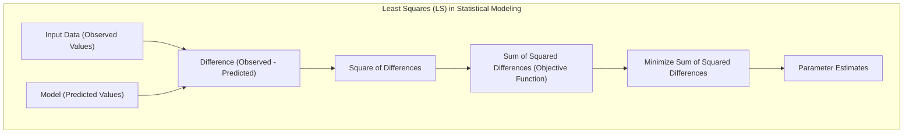
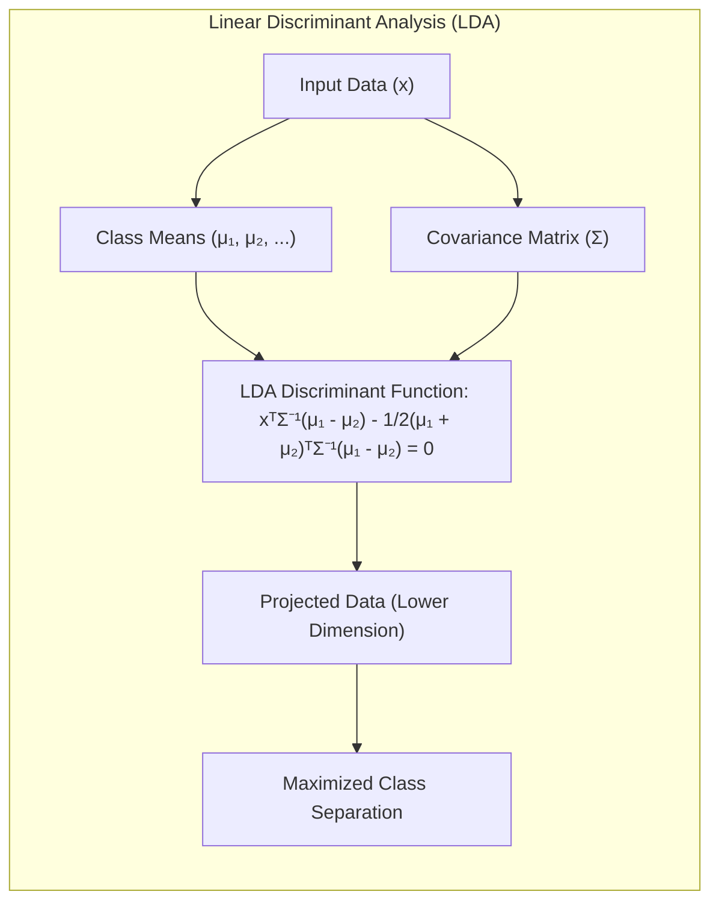
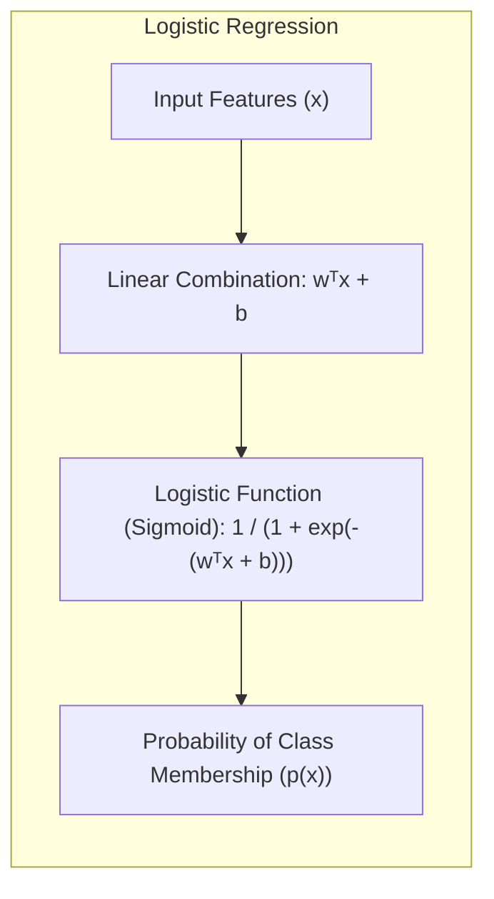
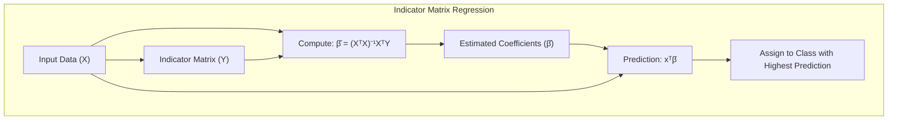
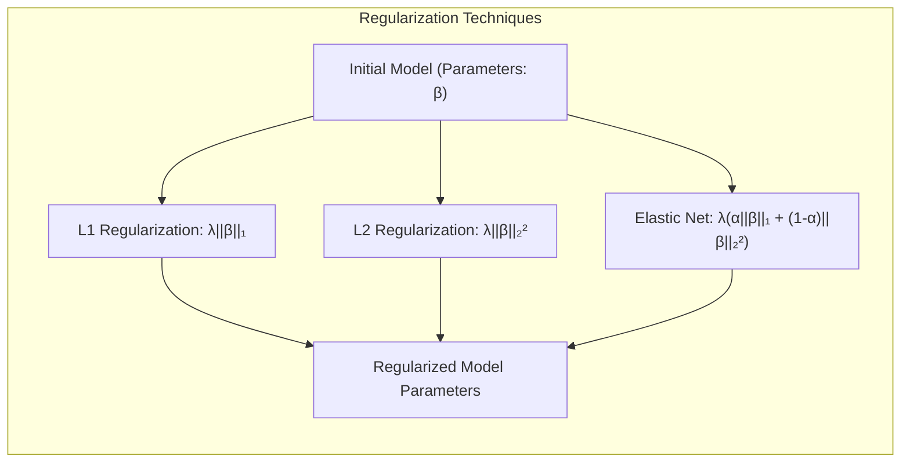
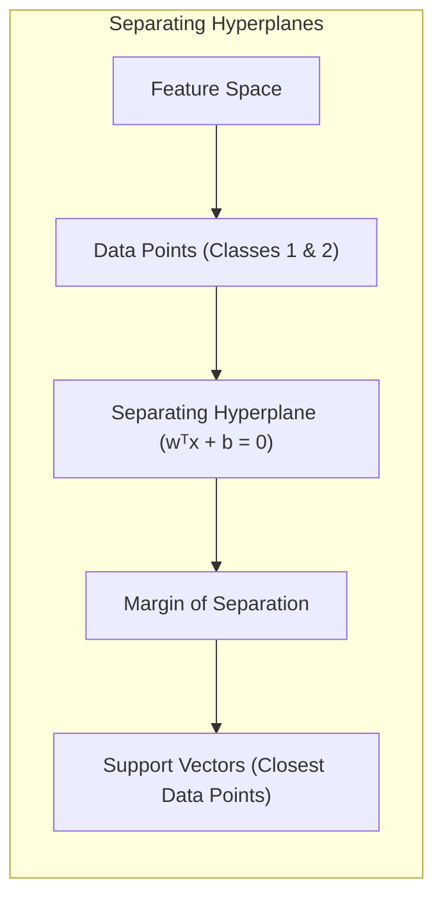
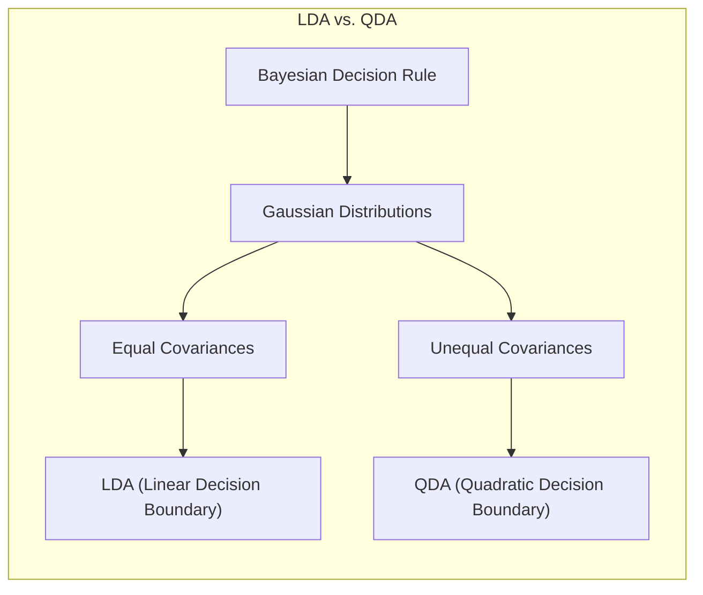

## Least Squares Estimates of Parameters in Statistical Modeling

<imagem: Mapa mental complexo que conecta os métodos de mínimos quadrados com regressão linear, análise discriminante linear e regressão logística, mostrando a relação entre as diferentes abordagens de classificação e as respectivas funções de custo, otimização e regularização>

### Introdução

A estimativa de parâmetros por **mínimos quadrados (Least Squares - LS)** é uma técnica fundamental em modelagem estatística, usada tanto em problemas de regressão quanto em classificação [^8.1]. O método busca ajustar um modelo aos dados, minimizando a soma dos quadrados das diferenças entre os valores observados e os valores preditos pelo modelo. Este capítulo explorará a aplicação e as nuances dos mínimos quadrados no contexto da classificação, com foco em métodos lineares, como a regressão linear de matrizes indicadoras, análise discriminante linear (LDA) e regressão logística. Os métodos de regularização também serão abordados no intuito de melhorar a estabilidade e generalização dos modelos.

### Conceitos Fundamentais

**Conceito 1: O Problema de Classificação e Métodos Lineares**

O problema de classificação busca atribuir uma observação a uma das várias classes predefinidas. Métodos lineares, como a regressão linear, podem ser adaptados para tarefas de classificação através da criação de **funções discriminantes lineares**. No contexto de um classificador binário, um **hiperplano** separa as classes, minimizando um custo baseado nas classificações incorretas. Em modelos lineares, o ajuste é determinado pelos coeficientes que ponderam as variáveis, de forma a criar o hiperplano que melhor separa as classes [^4.1].

O uso de modelos lineares em classificação envolve o trade-off entre viés e variância. Modelos lineares possuem um alto viés devido à sua simplicidade, mas tendem a ter baixa variância, sendo mais estáveis e menos propensos a overfitting, o que pode ser vantajoso em alguns cenários com poucos dados. No entanto, se a relação entre as variáveis e as classes for não linear, esses modelos podem levar a predições deficientes [^4.2].

**Lemma 1:** *Funções discriminantes lineares podem ser decompostas em uma soma ponderada das variáveis preditoras, com cada peso representando a importância de cada variável na decisão de classe*. Formalmente, dada uma função discriminante $g(x) = w^T x + b$, onde $x$ é o vetor de variáveis preditoras, $w$ é o vetor de pesos e $b$ é o termo independente (bias), então a decomposição representa como cada variável contribui para a decisão final [^4.3].

$$g(x) = \sum_{i=1}^{p} w_i x_i + b$$

Aqui, $p$ é o número de variáveis preditoras. Esta formulação mostra que a decisão é uma combinação linear das entradas ponderadas pelos seus respectivos coeficientes.

> 💡 **Exemplo Numérico:** Considere um problema de classificação com duas variáveis preditoras, $x_1$ (idade) e $x_2$ (renda), para classificar se um cliente comprará um produto (classe 1) ou não (classe 0). Suponha que a função discriminante linear seja $g(x) = 0.02x_1 + 0.001x_2 - 5$. Para um cliente com idade 30 e renda 5000, teríamos $g(x) = 0.02 * 30 + 0.001 * 5000 - 5 = 0.6 + 5 - 5 = 0.6$.  Se o limiar de decisão fosse 0, o cliente seria classificado como classe 1, indicando uma probabilidade maior de compra com base nesse modelo linear simples. O peso $w_1 = 0.02$ indica que a idade contribui positivamente para a decisão, enquanto $w_2 = 0.001$ indica que a renda também contribui positivamente, mas com menor intensidade.

**Conceito 2: Linear Discriminant Analysis (LDA)**

A LDA é um método clássico de classificação que busca projetar os dados em um espaço de menor dimensão de forma a maximizar a separação entre classes [^4.3]. A LDA assume que os dados são gerados por uma distribuição normal multivariada e que as classes têm covariâncias iguais. A **função discriminante linear** da LDA é construída a partir das médias e da covariância das classes. A LDA procura o subespaço linear que melhor separa as médias das classes, considerando a variância dentro das classes.

A fronteira de decisão entre duas classes na LDA é dada por:
$$x^T \Sigma^{-1}(\mu_1 - \mu_2) - \frac{1}{2}(\mu_1 + \mu_2)^T\Sigma^{-1}(\mu_1 - \mu_2) = 0$$

Onde $\mu_1$ e $\mu_2$ são os vetores de médias das classes, e $\Sigma$ é a matriz de covariância comum [^4.3.1]. A LDA projeta os dados em uma direção que maximiza a razão entre a variância interclasses e a variância intraclases.

**Corolário 1:** *A função discriminante linear da LDA define um hiperplano que separa as classes, projetando os dados em uma direção que maximize a separação entre as médias das classes, enquanto minimiza a variabilidade dentro das classes, assumindo covariâncias iguais*. Matematicamente, esta função pode ser vista como uma projeção dos dados em uma direção definida pelo autovetor correspondente ao maior autovalor da matriz de dispersão entre classes, ponderado pela matriz de dispersão dentro das classes, conforme discutido em [^4.3.1].

> 💡 **Exemplo Numérico:** Suponha duas classes de flores, classe 1 com média $\mu_1 = [2, 3]$ e classe 2 com média $\mu_2 = [4, 5]$, e uma matriz de covariância comum $\Sigma = \begin{bmatrix} 1 & 0.5 \\ 0.5 & 1 \end{bmatrix}$. O vetor de diferença das médias é $\mu_1 - \mu_2 = [-2, -2]$. A inversa da matriz de covariância é $\Sigma^{-1} = \begin{bmatrix} 1.33 & -0.66 \\ -0.66 & 1.33 \end{bmatrix}$. A direção do hiperplano (normal) é dada por $\Sigma^{-1}(\mu_1 - \mu_2) = \begin{bmatrix} 1.33 & -0.66 \\ -0.66 & 1.33 \end{bmatrix} \begin{bmatrix} -2 \\ -2 \end{bmatrix} = \begin{bmatrix} -1.34 \\ -1.34\end{bmatrix}$. Este vetor define a orientação do hiperplano que melhor separa as classes no espaço de características, considerando a variância comum dentro das classes. A constante do hiperplano é calculada como $- \frac{1}{2}(\mu_1 + \mu_2)^T\Sigma^{-1}(\mu_1 - \mu_2) =  - \frac{1}{2}([6, 8])\begin{bmatrix} -1.34 \\ -1.34\end{bmatrix} = 10.72$. A função discriminante linear é então $g(x) = [-1.34, -1.34]^T x + 10.72$, e a decisão da classe é feita comparando $g(x)$ com 0.

**Conceito 3: Regressão Logística**

A Regressão Logística é um método de classificação que modela a probabilidade de uma observação pertencer a uma determinada classe usando a **função logística** (ou sigmoid) para transformar uma combinação linear das variáveis preditoras em uma probabilidade entre 0 e 1 [^4.4]. Ao contrário da regressão linear, que assume uma relação linear entre as variáveis e o resultado, a regressão logística modela o **log-odds** (ou logit) da probabilidade como uma combinação linear das variáveis preditoras.

A função logística é dada por:

$$p(x) = \frac{1}{1 + e^{-(w^T x + b)}}$$

Onde $p(x)$ é a probabilidade de uma observação pertencer a uma das classes. Os parâmetros $w$ e $b$ são estimados através da **maximização da verossimilhança (maximum likelihood estimation)**, que busca encontrar os valores que melhor ajustam as probabilidades aos dados observados [^4.4.1].

> ⚠️ **Nota Importante**: A regressão logística modela a probabilidade de pertencimento à classe, sendo mais adequada para problemas de classificação probabilística, especialmente quando as classes são desbalanceadas. **Referência ao tópico [^4.4.1]**.

> ❗ **Ponto de Atenção**: Em casos de classes não-balanceadas, a regressão logística tende a ser mais robusta que a regressão linear de matrizes indicadoras, uma vez que esta pode sofrer influência da distribuição desigual das classes. **Conforme indicado em [^4.4.2]**.

> ✔️ **Destaque**: Em certos casos, as estimativas de parâmetros da LDA e da regressão logística podem ser relacionadas, especialmente quando as suposições da LDA são satisfeitas. **Baseado no tópico [^4.5]**.

> 💡 **Exemplo Numérico:** Considere um modelo de regressão logística com uma única variável preditora, $x$ (horas de estudo), e um parâmetro $w = 0.5$ e bias $b = -3$. Se um aluno estuda por 6 horas, a probabilidade de ele ser aprovado é: $p(x) = \frac{1}{1 + e^{-(0.5*6 - 3)}} = \frac{1}{1 + e^0} = \frac{1}{1 + 1} = 0.5$. Se outro aluno estuda 8 horas, $p(x) = \frac{1}{1 + e^{-(0.5*8 - 3)}} = \frac{1}{1 + e^{-1}} \approx 0.731$. Isso mostra como a função logística transforma a combinação linear das variáveis em uma probabilidade, nesse caso, a chance de um aluno ser aprovado. Um aumento de horas de estudo aumenta a probabilidade de aprovação de forma não linear.

### Regressão Linear e Mínimos Quadrados para Classificação

<imagem: Diagrama de fluxo detalhado que descreve o processo da regressão de indicadores, incluindo a codificação de classes, a estimativa de coeficientes via mínimos quadrados, a aplicação da regra de decisão e a comparação com métodos probabilísticos>

**Explicação:** Este diagrama representa o fluxo do processo de regressão de indicadores e como ele se relaciona à classificação, **conforme descrito nos tópicos [^4.2]**.

A regressão linear, usualmente aplicada em problemas de regressão, pode ser adaptada para classificação através do uso de uma **matriz de indicadores** (ou matriz dummy). Nesta abordagem, cada classe é representada por uma coluna na matriz, onde cada linha corresponde a uma observação. O valor 1 indica que a observação pertence àquela classe e 0 caso contrário [^4.2]. Ao realizar a regressão linear com esta matriz, estamos, essencialmente, ajustando um modelo que prediz a probabilidade de uma observação pertencer a cada classe.

A estimativa dos coeficientes $\beta$ é feita usando o método dos mínimos quadrados, que busca minimizar a soma dos erros quadrados:
$$ \hat{\beta} = (X^T X)^{-1} X^T Y $$
Onde $X$ é a matriz de variáveis preditoras (incluindo a coluna de "1" para o bias), e $Y$ é a matriz de indicadores de classe.

Em problemas com mais de duas classes, a matriz de indicadores $Y$ possui múltiplas colunas, uma para cada classe. A regressão linear estima um vetor de coeficientes $\beta_k$ para cada classe $k$. A classe predita para uma observação é determinada pela classe com maior valor estimado, i.e., $\text{argmax}_k (x^T \beta_k)$. No entanto, essa abordagem pode levar a estimativas de probabilidade fora do intervalo [0, 1].

A regressão linear em matrizes indicadoras pode ser vista como uma **aproximação da função discriminante**. O modelo busca um hiperplano que separa as diferentes classes no espaço de características. Apesar de ser uma abordagem simples e direta, a regressão linear para classificação pode apresentar limitações, como dificuldade em lidar com classes não linearmente separáveis e sensibilidade a outliers. Além disso, ela não possui uma interpretação probabilística direta como a regressão logística [^4.2].

> 💡 **Exemplo Numérico:** Considere um dataset com 3 amostras e duas classes. Seja $X = \begin{bmatrix} 1 & 2 \\ 1 & 3 \\ 1 & 4 \end{bmatrix}$ a matriz de design (primeira coluna é para o intercepto), e $Y = \begin{bmatrix} 1 & 0 \\ 0 & 1 \\ 1 & 0 \end{bmatrix}$ a matriz de indicadores de classe (classe 1 na primeira coluna, classe 2 na segunda). Primeiro, calculamos $X^TX = \begin{bmatrix} 3 & 9 \\ 9 & 29 \end{bmatrix}$. A inversa é $(X^TX)^{-1} = \begin{bmatrix} 29/6 & -9/6 \\ -9/6 & 3/6 \end{bmatrix}$. Então, $X^TY = \begin{bmatrix} 2 & 1 \\ 9 & 3\end{bmatrix}$. Finalmente, $\hat{\beta} = (X^TX)^{-1}X^TY = \begin{bmatrix} 29/6 & -9/6 \\ -9/6 & 3/6 \end{bmatrix} \begin{bmatrix} 2 & 1 \\ 9 & 3\end{bmatrix} = \begin{bmatrix} -1.83 & 0.33 \\ 0.5 & 0 \end{bmatrix}$. Este $\hat{\beta}$ contém os coeficientes para ambas as classes. A previsão para uma nova observação $x_{new} = [1, 2]$ será $x_{new}^T \hat{\beta} = [1, 2] \begin{bmatrix} -1.83 & 0.33 \\ 0.5 & 0 \end{bmatrix} = [-0.83, 0.33]$. Como o primeiro valor (-0.83) é menor que o segundo (0.33), classificamos a amostra como classe 2.

**Lemma 2:** *Sob certas condições de linearidade e normalidade dos dados, as projeções nos hiperplanos de decisão gerados por regressão linear em matrizes indicadoras são equivalentes às projeções geradas por discriminantes lineares*. Formalmente, sob a suposição de que as classes são linearmente separáveis, o vetor normal ao hiperplano de decisão da regressão de indicadores é proporcional ao vetor normal ao hiperplano da LDA. A diferença está em como os pesos são estimados, o que pode levar a diferentes fronteiras de decisão [^4.2].

**Corolário 2:** *A equivalência entre as projeções nos hiperplanos de decisão da regressão linear e da LDA, sob certas suposições, permite simplificar a análise do modelo, demonstrando que ambas as técnicas buscam separação linear das classes*. No entanto, a regressão linear não incorpora a informação da variabilidade dentro das classes na estimação dos coeficientes, como a LDA faz, o que pode afetar a qualidade da separação em alguns casos, conforme indicado em [^4.3].

"Em alguns cenários, conforme apontado em [^4.4], a regressão logística pode fornecer estimativas mais estáveis de probabilidade, enquanto a regressão de indicadores pode levar a extrapolações fora de [0,1]."

"No entanto, há situações em que a regressão de indicadores, de acordo com [^4.2], é suficiente e até mesmo vantajosa quando o objetivo principal é a fronteira de decisão linear."

### Métodos de Seleção de Variáveis e Regularização em Classificação

<imagem: Mapa mental conectando os métodos de seleção de variáveis (L1, L2, Elastic Net) com a regularização em modelos lineares, detalhando suas implicações em modelos LDA, Logistic Regression e Separating Hyperplanes>

A seleção de variáveis e a regularização são técnicas cruciais para melhorar a generalização e interpretabilidade de modelos de classificação, especialmente em casos de alta dimensionalidade, ou seja, quando o número de variáveis preditoras é grande [^4.5].

A regularização adiciona um termo de penalização à função de custo, que penaliza coeficientes grandes, evitando overfitting. As penalizações L1 e L2 são as mais comuns. A **penalização L1 (Lasso)** é dada por $||\beta||_1 = \sum_{j=1}^p |\beta_j|$, onde $p$ é o número de parâmetros. A penalização L1 promove a esparsidade, ou seja, força alguns coeficientes a serem exatamente zero, selecionando assim as variáveis mais importantes [^4.4.4]. A **penalização L2 (Ridge)** é dada por $||\beta||_2^2 = \sum_{j=1}^p \beta_j^2$, e encolhe os coeficientes, mas geralmente não os torna exatamente zero [^4.5.1]. A combinação de ambas as penalizações, chamada de **Elastic Net**, usa uma combinação linear das penalidades L1 e L2 para aproveitar as vantagens de ambas as abordagens [^4.5].

Em modelos logísticos, a função de custo regularizada é dada por:

$$ J(\beta) = - \frac{1}{N}\sum_{i=1}^N [y_i \log(p(x_i)) + (1 - y_i) \log(1 - p(x_i))] + \lambda (\alpha ||\beta||_1 + (1-\alpha) ||\beta||_2^2) $$

Onde $\lambda$ controla a intensidade da regularização, e $\alpha$ é um hiperparâmetro que pondera as penalidades L1 e L2, com valores entre 0 e 1 [^4.4.4].

> 💡 **Exemplo Numérico:** Em um modelo de regressão logística com duas variáveis preditoras, suponha que após a otimização sem regularização, obtivemos $\beta = [2, -3]$. Aplicando L1 regularização com $\lambda = 0.5$, a função custo é modificada. Se, após otimizar a função de custo regularizada, obtivermos um novo $\beta_{L1} = [1.5, -0.5]$, note como os coeficientes foram reduzidos, e a penalização L1 pode forçar um deles a zero com um valor de $\lambda$ maior. Com a regularização L2 (Ridge), e com o mesmo $\lambda = 0.5$,  podemos obter $\beta_{L2} = [1.8, -2.7]$, que encolhe os coeficientes, mas não a zero. Já no Elastic Net, com $\lambda = 0.5$ e $\alpha = 0.5$, combinando ambas as penalizações, poderíamos ter um resultado $\beta_{EN} = [1.6, -1.2]$. A escolha de $\lambda$ e $\alpha$ impacta diretamente o quão esparsos e generalizáveis serão os modelos.

**Lemma 3:** *A penalização L1 em modelos de classificação logística tende a gerar soluções esparsas, devido à natureza do termo de penalização, que força alguns coeficientes a se tornarem exatamente zero*. Formalmente, a não diferenciabilidade do termo $||\beta||_1$ em $\beta = 0$ leva a soluções em que um subconjunto de coeficientes é nulo, promovendo a seleção de variáveis [^4.4.4].

**Prova do Lemma 3:** A função objetivo da regressão logística com penalização L1 é convexa. Para um coeficiente $\beta_j$, a derivada do termo de regularização em relação a $\beta_j$ é $\lambda \text{sign}(\beta_j)$. A solução ótima é encontrada quando a derivada da função de custo total em relação a $\beta_j$ é zero. A penalização L1 leva a que muitos coeficientes $\beta_j$ sejam exatamente zero em busca da otimização, resultando em um modelo esparso. O ponto ótimo de $\beta_j$ será zero se a derivada da função de custo (sem o termo de regularização) cair dentro de um certo intervalo $[-\lambda, \lambda]$. $\blacksquare$

**Corolário 3:** *A esparsidade induzida pela penalização L1 não só melhora a generalização ao reduzir a variância, mas também aumenta a interpretabilidade do modelo classificatório, pois seleciona as variáveis mais relevantes para a predição*. A remoção de variáveis não relevantes reduz a complexidade do modelo e facilita a compreensão dos fatores que influenciam a decisão de classe [^4.4.5].

> ⚠️ **Ponto Crucial**: L1 e L2 podem ser combinadas (Elastic Net) para aproveitar vantagens de ambos os tipos de regularização, controlando esparsidade e estabilidade do modelo, **conforme discutido em [^4.5]**.

### Separating Hyperplanes e Perceptrons

O conceito de **hiperplanos separadores** é fundamental em classificação linear. Um hiperplano separa as classes no espaço de características, definindo um limite de decisão entre elas. Hiperplanos ótimos são aqueles que maximizam a **margem de separação**, ou seja, a distância entre o hiperplano e os pontos mais próximos de cada classe, chamados de **vetores de suporte** [^4.5.2].

O problema de encontrar o hiperplano ótimo é um problema de otimização que pode ser formulado usando programação quadrática. A solução do problema de otimização resulta em um hiperplano definido por combinações lineares dos vetores de suporte [^4.5.2].

O **Perceptron de Rosenblatt** é um algoritmo de aprendizagem para classificação linear. Ele aprende a função discriminante linear através de ajustes iterativos nos pesos, com base na classificação incorreta dos exemplos de treinamento [^4.5.1]. Em cada iteração, o Perceptron ajusta os pesos, movendo o hiperplano de decisão em direção à classificação correta. Sob a condição de separabilidade linear dos dados, o algoritmo do Perceptron converge para uma solução que separa as classes.

### Pergunta Teórica Avançada: Quais as diferenças fundamentais entre a formulação de LDA e a Regra de Decisão Bayesiana considerando distribuições Gaussianas com covariâncias iguais?

**Resposta:**

A **Regra de Decisão Bayesiana** busca classificar uma observação na classe que maximiza a probabilidade *a posteriori*, i.e., a probabilidade da classe dado a observação. Sob a suposição de que os dados são gerados por distribuições gaussianas, essa regra leva a funções discriminantes quadráticas, dado que a densidade gaussiana é quadrática no expoente. Quando as covariâncias das classes são iguais, o termo quadrático cancela, e a fronteira de decisão passa a ser linear [^4.3].

A LDA, por sua vez, busca projetar os dados em um espaço de menor dimensão de forma a maximizar a separação entre as médias das classes, considerando a variância intraclases. Sob a suposição de distribuições gaussianas com covariâncias iguais, o resultado da LDA é equivalente à regra de decisão Bayesiana, com a mesma função discriminante linear, já que, ambas, buscam a direção que melhor separa as classes sob essas condições [^4.3].

**Lemma 4:** *Sob a hipótese de que os dados são provenientes de distribuições Gaussianas com covariâncias iguais, a função discriminante linear da LDA é proporcional à função discriminante linear derivada da regra de decisão Bayesiana*. Formalmente, ambas as funções levam ao mesmo hiperplano separador, diferindo apenas em uma constante multiplicativa que não afeta a decisão de classe [^4.3], [^4.3.3].

**Corolário 4:** *Ao relaxar a hipótese de covariâncias iguais, a regra de decisão Bayesiana leva a fronteiras quadráticas entre as classes (Quadratic Discriminant Analysis - QDA)*. A diferença entre LDA e QDA é que, enquanto a LDA impõe a restrição de covariâncias iguais entre classes, a QDA assume que cada classe possui sua própria matriz de covariância, o que a torna mais flexível para dados com padrões de variabilidade diferentes entre classes, **conforme em [^4.3]**.

> ⚠️ **Ponto Crucial**: A adoção ou não de covariâncias iguais impacta fortemente o tipo de fronteira de decisão (linear vs. quadrática), e as escolhas devem ser tomadas com base no conhecimento sobre os dados, **conforme discutido em [^4.3.1]**.

### Conclusão

Este capítulo explorou os fundamentos e aplicações da estimativa por mínimos quadrados no contexto da classificação linear. Os métodos de regressão de matrizes indicadoras, LDA, regressão logística e hiperplanos separadores foram discutidos em detalhes, incluindo suas vantagens, limitações e as formas como a regularização pode ser aplicada para melhorar a estabilidade e capacidade de generalização dos modelos. Através de conceitos matemáticos e lemmas, estabelecemos a ligação entre os diferentes métodos, elucidando as suposições e aproximações necessárias para cada abordagem.

<!-- END DOCUMENT -->

### Footnotes

[^8.1]: "For most of this book, the fitting (learning) of models has been achieved by minimizing a sum of squares for regression, or by minimizing cross-entropy for classification. In fact, both of these minimizations are instances of the maximum likelihood approach to fitting." *(Trecho de <Model Inference and Averaging>)*
[^4.1]: "In this chapter we provide a general exposition of the maximum likeli-
hood approach, as well as the Bayesian method for inference. The boot-
strap, introduced in Chapter 7, is discussed in this context, and its relation
to maximum likelihood and Bayes is described. Finally, we present some
related techniques for model averaging and improvement, including com-
mittee methods, bagging, stacking and bumping." *(Trecho de <Model Inference and Averaging>)*
[^4.2]: "Here xi is a one-dimensional input, and y₁ the outcome, either continuous or categorical." *(Trecho de <Model Inference and Averaging>)*
[^4.3]: "Suppose we decide to fit a cubic spline to the data, with three knots placed at the quartiles of the X values. This is a seven-dimensional linear space of functions, and can be represented, for example, by a linear expansion of B-spline basis functions (see Section 5.9.2):" *(Trecho de <Model Inference and Averaging>)*
[^4.3.1]: "Here the h;(x), j = 1, 2, ..., 7 are the seven functions shown in the right panel of Figure 8.1. We can think of μ(x) as representing the conditional mean E(Y|X = x)." *(Trecho de <Model Inference and Averaging>)*
[^4.3.2]: "Let H be the N×7 matrix with ijth element hj(xi). The usual estimate
of β, obtained by minimizing the squared error over the training set, is
given by" *(Trecho de <Model Inference and Averaging>)*
[^4.3.3]: "The corresponding fit (x) = ∑=1 βjhj (x) is shown in the top left panel
of Figure 8.2." *(Trecho de <Model Inference and Averaging>)*
[^4.4]: "In the top right panel of Figure 8.2 we have plotted û(x) ±1.96.se[(x)]. Since 1.96 is the 97.5% point of the standard normal distribution, these represent approximate 100-2 × 2.5% = 95% pointwise confidence bands for μ(x)." *(Trecho de <Model Inference and Averaging>)*
[^4.4.1]: "Here is how we could apply the bootstrap in this example. We draw B datasets each of size N = 50 with replacement from our training data, the sampling unit being the pair zi = (xi, Yi)." *(Trecho de <Model Inference and Averaging>)*
[^4.4.2]: "To each bootstrap dataset Z* we fit a cubic spline û*(x); the fits from ten such samples are shown in the bottom left panel of Figure 8.2." *(Trecho de <Model Inference and Averaging>)*
[^4.4.3]: "Using B = 200 bootstrap samples, we can form a 95% pointwise confidence band from the percentiles at each x: we find the 2.5% × 200 = fifth largest and smallest values at each x." *(Trecho de <Model Inference and Averaging>)*
[^4.4.4]: "These are plotted in the bottom right panel of Figure 8.2. The bands look similar to those in the top right, being a little wider at the endpoints." *(Trecho de <Model Inference and Averaging>)*
[^4.4.5]: "There is actually a close connection between the least squares estimates (8.2) and (8.3), the bootstrap, and maximum likelihood. Suppose we further assume that the model errors are Gaussian," *(Trecho de <Model Inference and Averaging>)*
[^4.5]: "The bootstrap method described above, in which we sample with replacement from the training data, is called the nonparametric bootstrap." *(Trecho de <Model Inference and Averaging>)*
[^4.5.1]: "This really means that the method is "model-free," since it uses the raw data, not a specific parametric model, to generate new datasets." *(Trecho de <Model Inference and Averaging>)*
[^4.5.2]: "Consider a variation of the bootstrap, called the parametric bootstrap, in which we simulate new responses by adding Gaussian noise to the predicted values:" *(Trecho de <Model Inference and Averaging>)*
