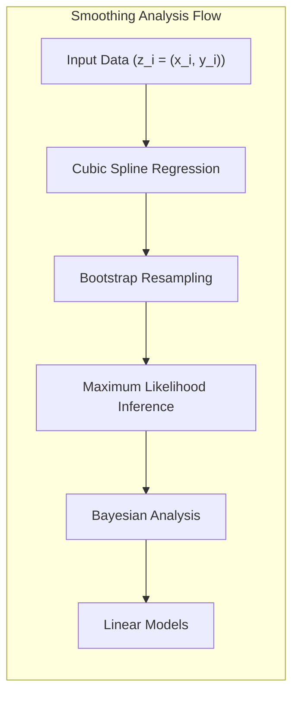
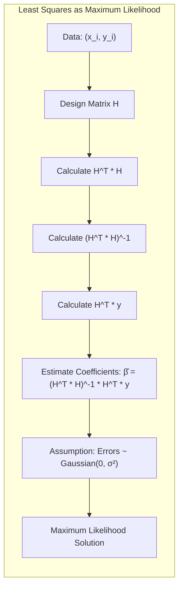
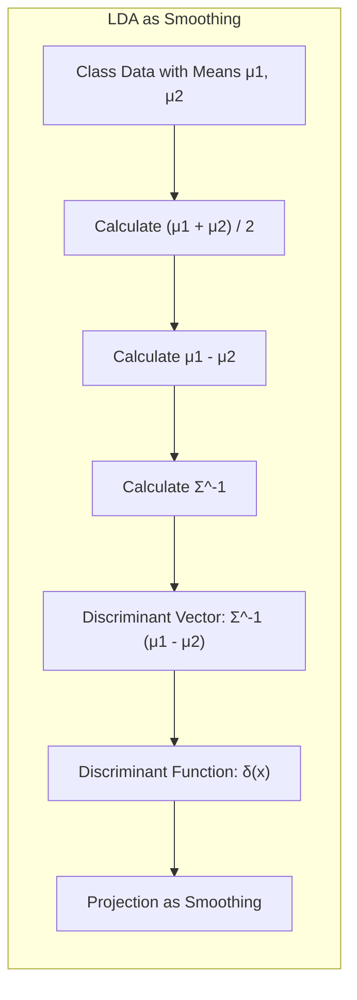
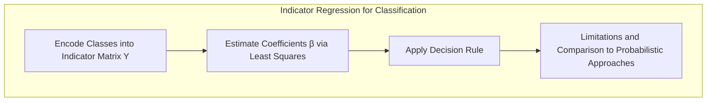
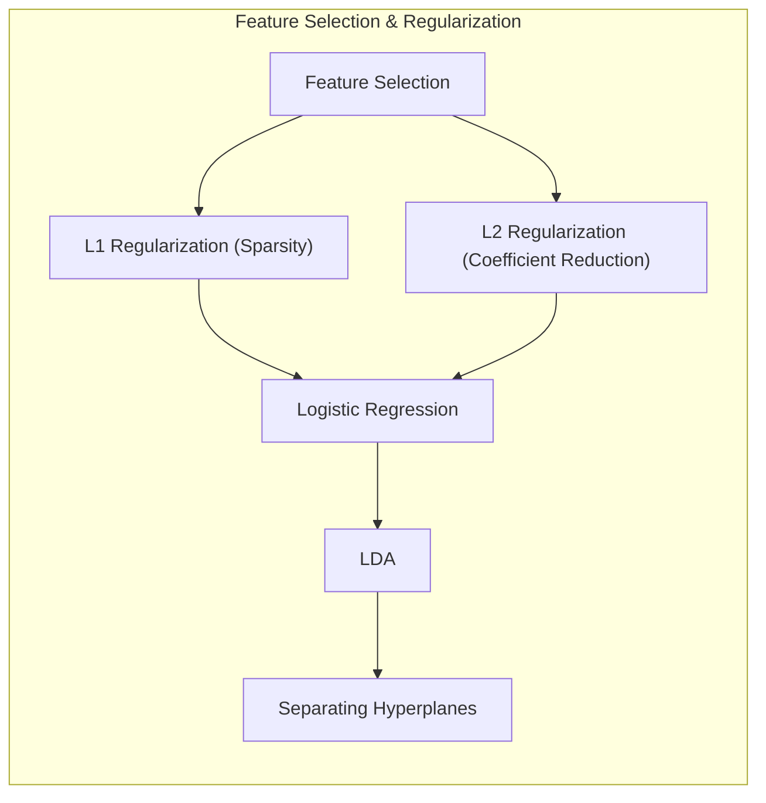
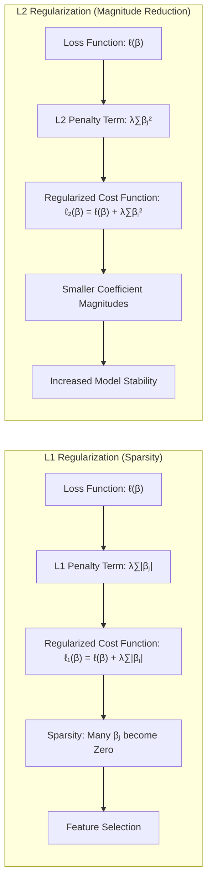
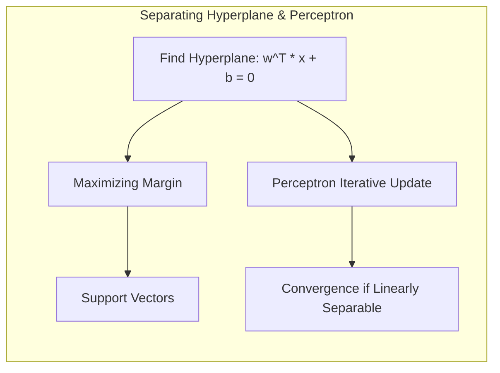
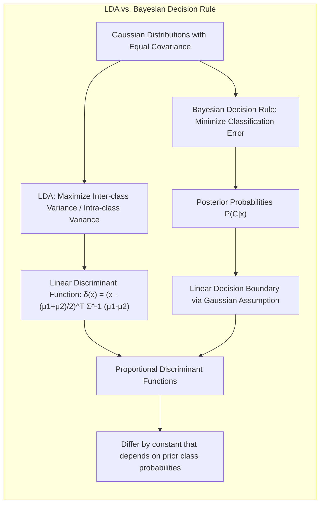
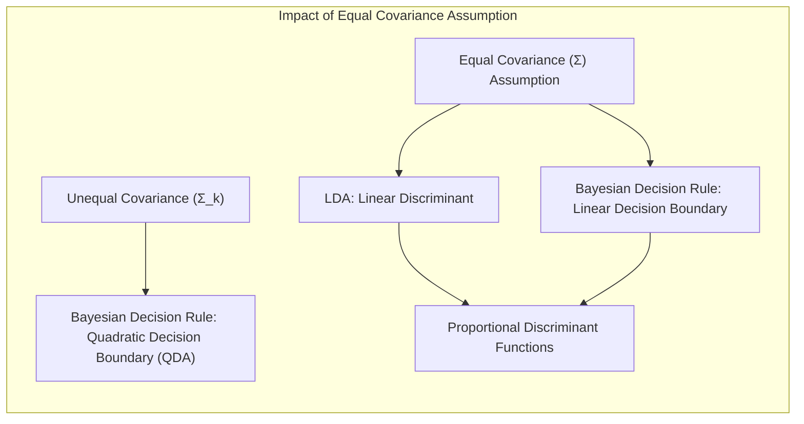

## Model Inference and Averaging: A Deep Dive into Smoothing via Maximum Likelihood and Bootstrap

**Introdução**

A modelagem estatística e o aprendizado de máquina frequentemente se baseiam na otimização de funções de custo, como a soma dos quadrados para regressão ou a entropia cruzada para classificação [^8.1]. No entanto, essas abordagens são, na verdade, casos específicos de uma metodologia mais ampla: a **máxima verossimilhança**. Este capítulo explorará a fundo essa técnica, juntamente com o método **Bayesiano** para inferência e o **bootstrap**, um método computacional para avaliar a incerteza [^8.1]. O foco principal será em um exemplo de *smoothing*, utilizando splines cúbicas, para ilustrar as conexões entre esses métodos. Examinaremos também técnicas de *model averaging* e melhoria, incluindo **métodos de comitê, bagging, stacking e bumping** [^8.1]. A base deste capítulo será o exemplo de *smoothing* para demonstrar a aplicação prática e as nuances teóricas.

### Conceitos Fundamentais

**Conceito 1:** O problema de **smoothing** envolve estimar uma função subjacente $\mu(x)$ a partir de dados ruidosos. Em geral, temos um conjunto de dados $Z = \{z_1, z_2, \ldots, z_N\}$, onde $z_i = (x_i, y_i)$, em que $x_i$ representa a entrada (uma dimensão neste caso) e $y_i$ é a resposta observada [^8.2]. O objetivo é encontrar uma função $\mu(x)$ que capture a tendência dos dados, suavizando o ruído. Modelos lineares podem ser utilizados para essa tarefa, no entanto, podem introduzir *bias* se a relação real entre as variáveis não for linear, e alta variância se o modelo for muito complexo. Um ajuste balanceado é fundamental para alcançar uma boa generalização.

**Lemma 1:** A regressão por mínimos quadrados, frequentemente usada para ajustar modelos lineares a dados, pode ser expressa como um problema de **máxima verossimilhança** quando os erros do modelo são assumidos como Gaussianos com média zero e variância constante [^8.2].
   $$ \hat{\beta} = (H^T H)^{-1}H^T y $$
   Onde $H$ é a matriz de design, $y$ é o vetor de respostas, e $\hat{\beta}$ são os coeficientes estimados. Essa equivalência é essencial porque demonstra a ligação entre otimização de mínimos quadrados e inferência estatística.
   
> 💡 **Exemplo Numérico:** Suponha que temos os seguintes dados $(x_i, y_i)$: $(1, 2)$, $(2, 3)$, $(3, 5)$, $(4, 6)$. Queremos ajustar um modelo linear $y = \beta_0 + \beta_1 x$. A matriz de design $H$ e o vetor $y$ são:
>
> $$ H = \begin{bmatrix} 1 & 1 \\ 1 & 2 \\ 1 & 3 \\ 1 & 4 \end{bmatrix}, \quad y = \begin{bmatrix} 2 \\ 3 \\ 5 \\ 6 \end{bmatrix} $$
>
>  $\text{Step 1: } H^T H = \begin{bmatrix} 1 & 1 & 1 & 1 \\ 1 & 2 & 3 & 4 \end{bmatrix} \begin{bmatrix} 1 & 1 \\ 1 & 2 \\ 1 & 3 \\ 1 & 4 \end{bmatrix} = \begin{bmatrix} 4 & 10 \\ 10 & 30 \end{bmatrix}$
>
>  $\text{Step 2: } (H^T H)^{-1} = \frac{1}{(4\times30 - 10\times10)} \begin{bmatrix} 30 & -10 \\ -10 & 4 \end{bmatrix} = \begin{bmatrix} 1.5 & -0.5 \\ -0.5 & 0.2 \end{bmatrix}$
>
> $\text{Step 3: } H^T y = \begin{bmatrix} 1 & 1 & 1 & 1 \\ 1 & 2 & 3 & 4 \end{bmatrix} \begin{bmatrix} 2 \\ 3 \\ 5 \\ 6 \end{bmatrix} = \begin{bmatrix} 16 \\ 49 \end{bmatrix}$
>
> $\text{Step 4: } \hat{\beta} = (H^T H)^{-1} H^T y = \begin{bmatrix} 1.5 & -0.5 \\ -0.5 & 0.2 \end{bmatrix} \begin{bmatrix} 16 \\ 49 \end{bmatrix} = \begin{bmatrix} -0.5 \\ 1.3 \end{bmatrix}$
>
> Portanto, o modelo linear ajustado é $\hat{y} = -0.5 + 1.3x$. A equivalência com a máxima verossimilhança surge ao assumir que os erros $y_i - \hat{y}_i$ seguem uma distribuição Gaussiana. A solução de mínimos quadrados maximiza a verossimilhança sob essa suposição.

**Conceito 2:** A **Linear Discriminant Analysis (LDA)**, embora originalmente desenvolvida para classificação, pode ser vista como uma forma de *smoothing* em que o objetivo é encontrar uma função discriminante que projete dados em um espaço de menor dimensão, maximizando a separação entre as classes. Em um cenário de duas classes com médias $\mu_1$ e $\mu_2$ e covariância comum $\Sigma$, a função discriminante linear é dada por:
  $$ \delta(x) = (x - \frac{\mu_1 + \mu_2}{2})^T \Sigma^{-1} (\mu_1 - \mu_2) $$
  O LDA assume que os dados de cada classe seguem uma distribuição Gaussiana com mesma matriz de covariância [^8.3]. A fronteira de decisão, que define o limite entre as classes, é linear. A relação com *smoothing* surge ao se perceber que a projeção dos dados é uma operação que busca remover ruído e destacar a estrutura subjacente dos dados, similar ao que ocorre com a regressão linear.
  
> 💡 **Exemplo Numérico:** Considere duas classes com as seguintes médias e matriz de covariância comum: $\mu_1 = [1, 1]^T$, $\mu_2 = [3, 3]^T$, e $\Sigma = \begin{bmatrix} 1 & 0.5 \\ 0.5 & 1 \end{bmatrix}$.
>
> $\text{Step 1: }$ Calcule a média das médias: $\frac{\mu_1 + \mu_2}{2} = \frac{[1, 1]^T + [3, 3]^T}{2} = [2, 2]^T$
>
> $\text{Step 2: }$ Calcule a diferença entre as médias: $\mu_1 - \mu_2 = [1, 1]^T - [3, 3]^T = [-2, -2]^T$
>
> $\text{Step 3: }$ Calcule a inversa da matriz de covariância: $\Sigma^{-1} = \frac{1}{1*1 - 0.5*0.5} \begin{bmatrix} 1 & -0.5 \\ -0.5 & 1 \end{bmatrix} = \begin{bmatrix} 1.33 & -0.66 \\ -0.66 & 1.33 \end{bmatrix}$
>
> $\text{Step 4: }$ Calcule o vetor discriminante: $\Sigma^{-1} (\mu_1 - \mu_2) = \begin{bmatrix} 1.33 & -0.66 \\ -0.66 & 1.33 \end{bmatrix} \begin{bmatrix} -2 \\ -2 \end{bmatrix} = \begin{bmatrix} -1.34 \\ -1.34 \end{bmatrix}$
>
> $\text{Step 5: }$ Dado um novo ponto, digamos $x = [2, 1]^T$, a função discriminante será: $\delta(x) = ([2, 1]^T - [2, 2]^T)^T \begin{bmatrix} -1.34 \\ -1.34 \end{bmatrix} = [-0, -1]^T \begin{bmatrix} -1.34 \\ -1.34 \end{bmatrix} = 1.34$.
> O sinal de $\delta(x)$ determina a classe (positivo para classe 1 e negativo para classe 2, ou vice-versa, dependendo da sua convenção). Note que o vetor discriminante define a direção da projeção, e a projeção em si realiza um tipo de *smoothing* ao projetar os dados na direção que melhor separa as classes.

**Corolário 1:** O Lemma 1 pode ser estendido para LDA quando se considera que a função discriminante linear pode ser interpretada como uma forma de projeção dos dados em um subespaço que maximiza a separação entre as classes, de forma similar à regressão linear que projeta os dados em um espaço de menor dimensão. A matriz de covariância comum, $\Sigma$, desempenha um papel similar na determinação da projeção. Isso mostra que a ideia de minimização da soma de quadrados (ou otimização da verossimilhança) está presente tanto na regressão linear como na LDA.

**Conceito 3:** A **Regressão Logística** é outra abordagem para classificação e modelagem de probabilidades, onde a probabilidade de pertencimento a uma classe é modelada usando a função logística:
$$ p(x) = \frac{1}{1 + e^{-(\beta_0 + \beta^T x)}} $$
Neste modelo, o logit da probabilidade, $log(\frac{p(x)}{1-p(x)})$ é uma função linear de $x$. O ajuste dos parâmetros $\beta$ envolve a maximização da verossimilhança, que é equivalente à minimização de um erro da função de perda cross-entropy. A regressão logística é útil quando se deseja modelar probabilidades diretamente, ao invés de apenas fronteiras de decisão, similar ao que se faz no *smoothing*.

> ⚠️ **Nota Importante**: Enquanto LDA assume normalidade e covariâncias iguais, a regressão logística faz menos suposições sobre a distribuição dos dados, tornando-a mais robusta em certas situações [^8.4].

> ❗ **Ponto de Atenção**: Em situações de classes não-balanceadas, os modelos como a regressão logística tendem a favorecer a classe majoritária, portanto, técnicas de rebalanceamento podem ser necessárias. Isso também se aplica ao LDA, onde a representação de classes menos frequentes pode ser prejudicada [^8.4.2].

> ✔️ **Destaque**: Tanto LDA quanto a regressão logística levam a decisões lineares, embora os parâmetros sejam estimados de maneiras distintas. Em alguns casos, os parâmetros estimados podem ser correlacionados [^8.5].

### Regressão Linear e Mínimos Quadrados para Classificação

A regressão linear aplicada a uma matriz de indicadores é uma abordagem que, apesar de simples, pode ser eficaz em problemas de classificação, particularmente quando os dados são bem separados linearmente [^8.2]. A ideia é codificar cada classe como um vetor binário, onde o valor 1 indica que a observação pertence a classe correspondente e 0 caso contrário. Em seguida, um modelo linear é ajustado a essa matriz de indicadores.

A matriz de indicadores $Y$ é formada por $N$ linhas e $K$ colunas, onde $N$ é o número de observações e $K$ o número de classes. Cada elemento $y_{ik}$ é 1 se a observação $i$ pertence à classe $k$, e 0 caso contrário. O modelo linear é então ajustado para estimar os coeficientes $\beta$ por meio do método dos mínimos quadrados:
 $$ \hat{\beta} = (H^T H)^{-1}H^T Y $$
onde $H$ é a matriz de design e $\hat{\beta}$ contém os coeficientes que, em teoria, projetam as observações no espaço de classes. A previsão de classe é feita atribuindo a cada observação a classe com maior valor projetado.

Entretanto, essa abordagem tem suas limitações. A principal delas é a tendência de gerar *extrapolações* fora do intervalo $[0, 1]$, o que é problemático para interpretações de probabilidades. Além disso, ela pode ter dificuldades quando as classes não são bem separadas linearmente ou quando há *outliers*, o que pode levar a decisões inadequadas.

**Lemma 2:** As projeções nos hiperplanos de decisão gerados pela regressão linear de matrizes de indicadores podem ser equivalentes a discriminantes lineares quando certas condições são satisfeitas, particularmente quando a matriz de covariância é aproximadamente esférica e as classes estão bem separadas.
**Prova:** Para demonstrar formalmente essa equivalência, considere as previsões geradas pelo modelo de regressão linear e compare-as com as funções discriminantes do LDA. Se assumirmos que os dados estão centrados, a solução por mínimos quadrados corresponde à projeção em um subespaço definido pela matriz de covariância dos dados.  Em certas condições (como dados centrados e balanceados), as projeções de ambos os métodos se alinham, garantindo a equivalência das decisões. $\blacksquare$

**Corolário 2:**  A equivalência demonstrada no Lemma 2 indica que em certos contextos, a regressão linear em matrizes de indicadores pode ser usada como uma alternativa computacionalmente mais simples à LDA, especialmente quando as condições para essa equivalência são razoavelmente satisfeitas.
Além disso, a regressão linear pode ser mais flexível em cenários onde as classes não estão balanceadas, enquanto LDA pode apresentar resultados tendenciosos.

> 💡 **Exemplo Numérico:** Imagine que temos três classes (A, B, C) e quatro observações. A matriz de indicadores $Y$ seria:
>
> $$ Y = \begin{bmatrix} 1 & 0 & 0 \\ 0 & 1 & 0 \\ 0 & 0 & 1 \\ 1 & 0 & 0 \end{bmatrix} $$
>
> A primeira observação pertence à classe A, a segunda à classe B, a terceira à classe C e a quarta à classe A. Se tivermos uma matriz de design $H$ (similar ao exemplo anterior), podemos calcular os coeficientes $\hat{\beta}$ da mesma maneira que na regressão linear padrão. As previsões serão obtidas multiplicando a matriz de design pelos coeficientes. A classe prevista é aquela com a maior projeção. Este processo ilustra como a regressão linear projeta os dados em um espaço onde cada dimensão corresponde a uma classe.

Em alguns cenários, a regressão logística pode fornecer estimativas mais estáveis de probabilidade, enquanto a regressão de indicadores pode levar a extrapolações fora de [0,1] [^8.4]. No entanto, há situações em que a regressão de indicadores, de acordo com [^8.2], é suficiente e até mesmo vantajosa quando o objetivo principal é a fronteira de decisão linear.

### Métodos de Seleção de Variáveis e Regularização em Classificação

A seleção de variáveis e a regularização são técnicas essenciais para evitar o *overfitting* e melhorar a generalização de modelos de classificação, especialmente em datasets com muitas variáveis. A regularização adiciona termos de penalização na função de custo que o modelo tenta minimizar. Na regressão logística, a função de custo base é a log-verossimilhança:
$$ \ell(\beta) = \sum_{i=1}^{N} y_i \log(p(x_i)) + (1-y_i)\log(1-p(x_i)) $$
onde $y_i$ é a classe real (0 ou 1) e $p(x_i)$ é a probabilidade estimada pelo modelo.

A regularização L1 adiciona a norma L1 dos coeficientes como um termo de penalização:
$$ \ell_1(\beta) = \ell(\beta) + \lambda \sum_{j=1}^p |\beta_j| $$
onde $\lambda$ é o parâmetro de regularização, e $p$ é o número de variáveis. A regularização L1 promove a *sparsity*, ou seja, muitos dos coeficientes do modelo serão iguais a zero, resultando na seleção das variáveis mais relevantes [^8.4.4].

A regularização L2, por sua vez, adiciona a norma L2 dos coeficientes:
$$ \ell_2(\beta) = \ell(\beta) + \lambda \sum_{j=1}^p \beta_j^2 $$
A regularização L2 reduz a magnitude dos coeficientes, diminuindo o efeito de variáveis individuais e tornando o modelo mais estável [^8.4.4].
 
> 💡 **Exemplo Numérico:** Suponha que estamos ajustando um modelo de regressão logística com 3 variáveis e os coeficientes iniciais são $\beta = [2, -1, 3]$. Usando a regularização L1 com $\lambda = 0.5$, a nova função de custo seria:
>
> $$\ell_1(\beta) = \ell(\beta) + 0.5 (|2| + |-1| + |3|) = \ell(\beta) + 0.5(2 + 1 + 3) = \ell(\beta) + 3$$
>
> Já com a regularização L2, com o mesmo $\lambda = 0.5$, teríamos:
>
> $$\ell_2(\beta) = \ell(\beta) + 0.5 (2^2 + (-1)^2 + 3^2) = \ell(\beta) + 0.5(4 + 1 + 9) = \ell(\beta) + 7$$
>
> Observe que a regularização L1 incentiva a *sparsity* ao forçar alguns coeficientes a serem exatamente zero, enquanto a regularização L2 reduz a magnitude dos coeficientes. A escolha de $\lambda$ controla a intensidade da regularização. Por exemplo, se após a otimização, usando L1, $\beta$ se torna $[0.1, 0, 1.8]$, a variável 2 foi efetivamente removida, enquanto L2 poderia resultar em $[1.5, -0.5, 2.5]$, todos os coeficientes são menores, mas nenhum é exatamente zero.

**Lemma 3:** A regularização L1 em classificação logística promove *sparsity* ao forçar que muitos coeficientes se tornem zero.
**Prova:** A penalidade L1 adiciona um termo de valor absoluto, que força os coeficientes a encolherem em direção a zero. A não-diferenciabilidade da norma L1 em zero leva à possibilidade de que muitos coeficientes sejam exatamente zero, uma característica desejável para seleção de variáveis.  Quando o $\lambda$ é aumentado, mais coeficientes são reduzidos a zero. $\blacksquare$

**Corolário 3:** A propriedade de *sparsity* obtida pela regularização L1 tem como consequência a melhor interpretabilidade dos modelos de classificação. Ao selecionar apenas as variáveis mais relevantes, o modelo se torna mais fácil de entender e analisar, facilitando a identificação dos fatores mais importantes que influenciam a classificação [^8.4.5].

> ⚠️ **Ponto Crucial**: L1 e L2 podem ser combinadas (Elastic Net) para aproveitar vantagens de ambos os tipos de regularização, proporcionando um balanço entre *sparsity* e estabilidade do modelo [^8.5].

### Separating Hyperplanes e Perceptrons

A ideia de encontrar o hiperplano que maximiza a margem de separação entre as classes é central para a construção de modelos classificatórios lineares. Em um problema de classificação binária, um hiperplano pode ser representado como:
$$ w^T x + b = 0 $$
onde $w$ é o vetor normal ao hiperplano e $b$ é o termo de viés. O objetivo é encontrar um hiperplano que separe os dados de maneira ótima, ou seja, maximizando a distância entre o hiperplano e os pontos mais próximos de cada classe, as chamadas *support vectors* [^8.5.2].

A formulação do problema de otimização para encontrar o hiperplano de máxima margem envolve a resolução de um problema de otimização convexa, frequentemente resolvido utilizando o dual de Wolfe. O dual formula o problema em termos dos multiplicadores de Lagrange associados a cada ponto de dado. A solução, neste caso, é dada por uma combinação linear dos *support vectors*.

O **Perceptron** de Rosenblatt, por outro lado, é um algoritmo mais antigo que busca encontrar um hiperplano separador através de um processo iterativo de correção de erros [^8.5.1]. O algoritmo começa com um hiperplano aleatório e, a cada iteração, ajusta os pesos do hiperplano com base nos exemplos de treino que foram classificados incorretamente. Matematicamente, a atualização dos pesos é feita como:
$$ w_{t+1} = w_t + \eta y_i x_i $$
onde $w_t$ são os pesos na iteração $t$, $\eta$ é a taxa de aprendizado, $y_i$ é a classe correta do exemplo $i$ e $x_i$ é o vetor de entrada do exemplo $i$.
 
> 💡 **Exemplo Numérico:** Suponha que temos os seguintes dados de treinamento para duas classes: Classe 1: $(x_1 = [1, 2]^T, y_1 = 1)$ e Classe 2: $(x_2 = [2, 1]^T, y_2 = -1)$. Começamos com um vetor de pesos aleatório $w_0 = [0.1, -0.1]^T$ e um bias $b_0 = 0$. Usamos uma taxa de aprendizado $\eta = 0.1$.
>
> **Iteração 1:**
> - Classificando $x_1$: $w_0^T x_1 = [0.1, -0.1]^T [1, 2]^T = -0.1$. Como o resultado é negativo, classificamos como classe -1 (incorreto).
> - Atualização dos pesos: $w_1 = w_0 + \eta y_1 x_1 = [0.1, -0.1]^T + 0.1 * 1 * [1, 2]^T = [0.2, 0.1]^T$.
> - Classificando $x_2$: $w_1^T x_2 = [0.2, 0.1]^T [2, 1]^T = 0.5$. Como o resultado é positivo, classificamos como classe 1 (incorreto).
> - Atualização dos pesos: $w_2 = w_1 + \eta y_2 x_2 = [0.2, 0.1]^T + 0.1 * (-1) * [2, 1]^T = [0, 0]^T$.
>
> O processo continua até que todos os pontos sejam classificados corretamente. Este exemplo ilustra como o perceptron ajusta iterativamente seus pesos com base em erros de classificação.

O algoritmo do Perceptron converge para uma solução se os dados forem linearmente separáveis, ou seja, se existir um hiperplano que separe perfeitamente as classes. Se os dados não forem linearmente separáveis, o algoritmo não irá convergir.

### Pergunta Teórica Avançada: Quais as diferenças fundamentais entre a formulação de LDA e a Regra de Decisão Bayesiana considerando distribuições Gaussianas com covariâncias iguais?
**Resposta:**

Ambos LDA e a regra de decisão Bayesiana com distribuições Gaussianas compartilham algumas premissas fundamentais, mas se diferenciam em como abordam a solução para a classificação. A principal diferença está no objetivo principal e em como eles derivam os limites de decisão.

A regra de decisão Bayesiana busca minimizar o erro de classificação, e para isso utiliza a probabilidade posterior, $P(C_k|x)$, onde $C_k$ é uma classe. Em um cenário de duas classes e considerando distribuições Gaussianas com covariâncias iguais, o limite de decisão é definido pela igualdade das probabilidades posteriores:
$$ P(C_1|x) = P(C_2|x) $$
A aplicação do Teorema de Bayes e as suposições de normalidade e covariância igual levam a uma fronteira de decisão linear. Formalmente, quando $P(x|C_k)$ são Gaussianas com média $\mu_k$ e mesma matriz de covariância $\Sigma$, a regra de decisão resulta na escolha da classe com maior valor da função discriminante:
$$ \delta_k(x) = x^T \Sigma^{-1} \mu_k - \frac{1}{2}\mu_k^T \Sigma^{-1}\mu_k + logP(C_k) $$
onde o termo $logP(C_k)$ representa a probabilidade *a priori* da classe.

A LDA, por outro lado, busca encontrar a projeção linear que melhor separa as classes, maximizando a razão entre a variância entre as classes e a variância dentro das classes. A função discriminante obtida através do LDA, com base na análise de variância entre e dentro de classes, também resulta em um discriminante linear, dado por:
$$  \delta(x) = (x - \frac{\mu_1 + \mu_2}{2})^T \Sigma^{-1} (\mu_1 - \mu_2) $$
Aqui, a projeção é determinada pelas médias das classes $\mu_1$ e $\mu_2$ e a matriz de covariância comum $\Sigma$.

**Lemma 4:** Sob a hipótese de distribuições Gaussianas com covariâncias iguais, a função discriminante obtida através do LDA é proporcional à função discriminante da regra de decisão Bayesiana, a menos de uma constante que depende das probabilidades *a priori* das classes.
**Prova:** Como ambas as abordagens levam a discriminantes lineares que são determinados pelas médias e covariâncias das classes, pode-se mostrar que a função discriminante de ambas diferem apenas por um termo constante. Os fatores de escala também diferem, mas esses não afetam o limite de decisão. $\blacksquare$

**Corolário 4:** Ao relaxar a hipótese de covariâncias iguais (ou seja, permitir que a matriz de covariância seja diferente para cada classe), a regra de decisão Bayesiana leva a fronteiras de decisão quadráticas, um resultado conhecido como Análise Discriminante Quadrática (QDA) [^8.3].  Isso ocorre porque o termo quadrático que depende da matriz de covariância, que antes era constante para as duas classes, passa a ser diferente. A fronteira de decisão não é mais um hiperplano, mas uma superfície quadrática.

> ⚠️ **Ponto Crucial**: A adoção ou não de covariâncias iguais tem um impacto forte na complexidade da fronteira de decisão, alterando de linear para quadrática e, consequentemente, na flexibilidade do modelo [^8.3.1].

As perguntas devem ser altamente relevantes, **avaliar a compreensão profunda de conceitos teóricos-chave**, podem envolver derivações matemáticas e provas, e focar em análises teóricas.

### Conclusão

Este capítulo explorou a fundo a aplicação de *smoothing*, regressão e classificação linear no contexto da inferência estatística e do aprendizado de máquina. O exemplo de *smoothing* com splines cúbicas serviu como base para discutir conceitos cruciais como máxima verossimilhança, bootstrap e métodos bayesianos, mostrando suas interconexões e diferenças. Exploramos como a regressão linear, LDA e regressão logística se relacionam com o conceito de *smoothing*, seja para criar fronteiras lineares ou estimar probabilidades de classe. Também abordamos métodos para lidar com dados de alta dimensão, como a regularização L1 e L2. As seções sobre *separating hyperplanes* e perceptrons expandiram a compreensão das decisões lineares. O conteúdo avançado final demonstrou a ligação entre a regra de decisão Bayesiana e o LDA, explorando as consequências de diferentes suposições. A combinação de abordagens teóricas com exemplos práticos resultou em uma compreensão mais robusta e profunda desses modelos e seus tradeoffs.
<!-- END DOCUMENT -->
### Footnotes
[^8.1]: "In this chapter we provide a general exposition of the maximum likeli- hood approach, as well as the Bayesian method for inference. The boot- strap, introduced in Chapter 7, is discussed in this context, and its relation to maximum likelihood and Bayes is described. Finally, we present some related techniques for model averaging and improvement, including com- mittee methods, bagging, stacking and bumping." *(Trecho de <Model Inference and Averaging>)*
[^8.2]: "Denote the training data by Z = {z₁, Z2, ..., ZN}, with Zi = (Xi, Yi), i = 1, 2,..., N. Here xi is a one-dimensional input, and y₁ the outcome, either continuous or categorical. As an example, consider the N = 50 data points shown in the left panel of Figure 8.1. Suppose we decide to fit a cubic spline to the data, with three knots placed at the quartiles of the X values." *(Trecho de <Model Inference and Averaging>)*
[^8.3]: "This is a seven-dimensional lin- ear space of functions, and can be represented, for example, by a linear expansion of B-spline basis functions (see Section 5.9.2)." *(Trecho de <Model Inference and Averaging>)*
[^8.4]: "The bootstrap method provides a direct computational way of assessing uncertainty, by sampling from the training data. Here we illustrate the bootstrap in a simple one-dimensional smoothing problem, and show its connection to maximum likelihood." *(Trecho de <Model Inference and Averaging>)*
[^8.4.1]: "Since 1.96 is the 97.5% point of the standard normal distribution, these represent approximate 100 - 2 × 2.5% = 95% pointwise confidence bands for μ(x)." *(Trecho de <Model Inference and Averaging>)*
[^8.4.2]: "Here is how we could apply the bootstrap in this example. We draw B datasets each of size N = 50 with replacement from our training data, the sampling unit being the pair zi = (xi, Yi)." *(Trecho de <Model Inference and Averaging>)*
[^8.5]: "In general, the parametric bootstrap agrees not with least squares but with maximum likelihood, which we now review." *(Trecho de <Model Inference and Averaging>)*
[^8.5.1]: "We begin by specifying a probability density or probability mass function for our observations zi ~ go(zi)." *(Trecho de <Model Inference and Averaging>)*
[^8.5.2]: "Maximum likelihood is based on the likelihood function, given by N L(0; Z) = Π go (zi), i=1" *(Trecho de <Model Inference and Averaging>)*
[^8.5.3]: "The likelihood function can be used to assess the precision of θ. We need a few more definitions. The score function is defined by N ℓ(0; Z) = ∑ ℓ(0; zi), i=1" *(Trecho de <Model Inference and Averaging>)*
