## Bootstrap para Avaliação de Incerteza


### Introdução

Este capítulo aborda o uso do **bootstrap** como uma ferramenta computacional para quantificar a incerteza em modelos estatísticos e de machine learning. O bootstrap, introduzido no Capítulo 7 e discutido no contexto de *maximum likelihood* [^8.1], oferece uma abordagem direta para estimar a variabilidade de estimativas e previsões, sem a necessidade de suposições paramétricas fortes. Ao longo deste capítulo, exploraremos sua conexão com a inferência *maximum likelihood* e o método Bayesiano, além de discutir técnicas relacionadas para model averaging e melhorias de modelos como committee methods, bagging, stacking e bumping.

### Conceitos Fundamentais

**Conceito 1: O Problema da Incerteza em Modelos**

O ajuste de modelos, seja por meio da minimização de *sum of squares* em regressão ou da minimização de *cross-entropy* em classificação [^8.1], frequentemente leva a estimativas pontuais dos parâmetros. No entanto, essas estimativas não capturam a incerteza associada ao processo de ajuste. A **incerteza** surge da variabilidade dos dados de treinamento, da escolha do modelo e da otimização utilizada. A compreensão e quantificação dessa incerteza são cruciais para a tomada de decisões informadas e para a avaliação da robustez das conclusões obtidas. Métodos lineares são especialmente importantes nesse contexto, já que sua estrutura simples permite análises mais claras de viés e variância, conforme discutido em [^8.1].
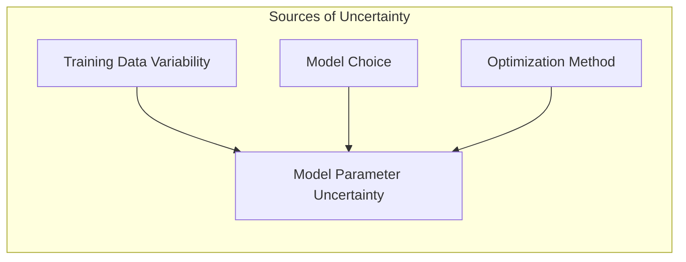
> 💡 **Exemplo Numérico:** Considere um conjunto de dados de treinamento com 10 pontos onde queremos ajustar uma regressão linear simples. Os dados são: `X = np.array([1, 2, 3, 4, 5, 6, 7, 8, 9, 10]).reshape(-1, 1)` e `y = np.array([2, 3, 5, 6, 8, 9, 10, 12, 13, 15])`. Ao ajustar uma regressão linear usando mínimos quadrados, obtemos uma estimativa para o coeficiente angular, $\hat{\beta_1}$, e para o intercepto, $\hat{\beta_0}$. No entanto, se tivéssemos um conjunto de dados de treinamento ligeiramente diferente (devido à amostragem aleatória dos dados), os valores de $\hat{\beta_1}$ e $\hat{\beta_0}$ também seriam diferentes. O bootstrap nos permite quantificar essa variabilidade.
```python
import numpy as np
from sklearn.linear_model import LinearRegression

X = np.array([1, 2, 3, 4, 5, 6, 7, 8, 9, 10]).reshape(-1, 1)
y = np.array([2, 3, 5, 6, 8, 9, 10, 12, 13, 15])

model = LinearRegression()
model.fit(X, y)

beta_0 = model.intercept_
beta_1 = model.coef_[0]

print(f"Estimativa de beta_0: {beta_0:.2f}")
print(f"Estimativa de beta_1: {beta_1:.2f}")
```
Ao rodar o código, obtemos $\hat{\beta_0} \approx 0.67$ e $\hat{\beta_1} \approx 1.44$. O bootstrap nos permite gerar novas amostras a partir do conjunto original e recalcular esses coeficientes, obtendo uma distribuição de possíveis valores para $\hat{\beta_0}$ e $\hat{\beta_1}$.

**Lemma 1: Invariância da Estimativa de Mínimos Quadrados Sob Permutações**
Dada uma matriz de dados *H*, um vetor de respostas *y*, e a estimativa de mínimos quadrados de $\beta$ como $\hat{\beta} = (H^T H)^{-1} H^T y$ [^8.2], prove que a estimativa de $\beta$ é invariante sob permutações das linhas de *H* e *y* simultaneamente.

**Prova:**
Seja *P* uma matriz de permutação. Uma permutação das linhas de *H* e *y* pode ser escrita como *H' = PH* e *y' = Py*. A nova estimativa de mínimos quadrados é dada por:
$$ \hat{\beta}' = (H'^T H')^{-1} H'^T y' $$
$$ \hat{\beta}' = ((PH)^T PH)^{-1} (PH)^T Py $$
$$ \hat{\beta}' = (H^T P^T PH)^{-1} H^T P^T Py $$
Como *P* é uma matriz de permutação, $P^T P = I$, onde *I* é a matriz identidade. Portanto,
$$ \hat{\beta}' = (H^T H)^{-1} H^T y = \hat{\beta} $$
Isso demonstra que a estimativa de mínimos quadrados é invariante sob permutações das linhas de *H* e *y* simultaneamente. $\blacksquare$
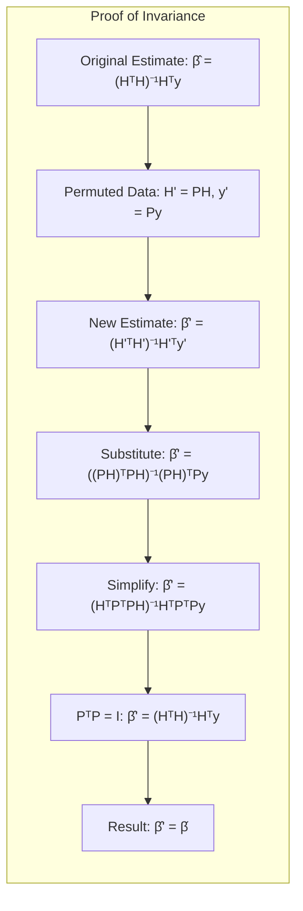

**Conceito 2: Linear Discriminant Analysis (LDA) e suas Suposições**

A **Linear Discriminant Analysis (LDA)** [^4.3] é um método de classificação que assume que as classes são geradas a partir de distribuições Gaussianas com a mesma matriz de covariância. Esta suposição simplifica o problema e leva a uma fronteira de decisão linear. No entanto, a violação dessas suposições pode levar a resultados subótimos. A LDA busca a direção que melhor separa as médias das classes, ao mesmo tempo em que minimiza a variabilidade dentro de cada classe [^4.3.1], [^4.3.2], [^4.3.3]. O bootstrap pode ser usado para avaliar a incerteza na posição da fronteira de decisão e na classificação de novos dados.
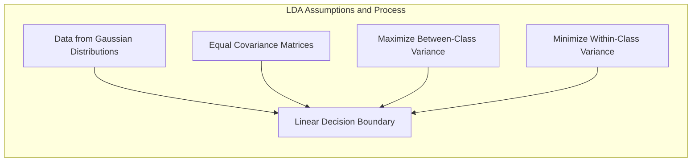

> 💡 **Exemplo Numérico:** Considere um problema de classificação binária com duas classes, onde cada classe é representada por pontos 2D. Suponha que a classe 1 tenha média $\mu_1 = [2, 2]$ e a classe 2 tenha média $\mu_2 = [5, 5]$, e ambas compartilham uma matriz de covariância $\Sigma = \begin{bmatrix} 1 & 0 \\ 0 & 1 \end{bmatrix}$. A LDA busca o vetor que melhor separa essas duas médias, enquanto considera a variabilidade dos pontos em cada classe. Se gerarmos amostras bootstrap desses dados, podemos ver como a posição da fronteira de decisão varia, demonstrando a incerteza do modelo.
```python
import numpy as np
from sklearn.discriminant_analysis import LinearDiscriminantAnalysis
import matplotlib.pyplot as plt

# Gerando dados sintéticos
np.random.seed(42)
mean1 = np.array([2, 2])
mean2 = np.array([5, 5])
cov = np.array([[1, 0], [0, 1]])
X1 = np.random.multivariate_normal(mean1, cov, 50)
X2 = np.random.multivariate_normal(mean2, cov, 50)
X = np.vstack((X1, X2))
y = np.array([0] * 50 + [1] * 50)

lda = LinearDiscriminantAnalysis()
lda.fit(X, y)

# Visualizando a fronteira de decisão
x_min, x_max = X[:, 0].min() - 1, X[:, 0].max() + 1
y_min, y_max = X[:, 1].min() - 1, X[:, 1].max() + 1
xx, yy = np.meshgrid(np.arange(x_min, x_max, 0.02), np.arange(y_min, y_max, 0.02))
Z = lda.predict(np.c_[xx.ravel(), yy.ravel()])
Z = Z.reshape(xx.shape)

plt.contourf(xx, yy, Z, alpha=0.3)
plt.scatter(X[:, 0], X[:, 1], c=y, edgecolors='k')
plt.title('Fronteira de Decisão LDA')
plt.show()
```
Este código gera um gráfico com a fronteira de decisão linear da LDA, com os dados originais.  Ao aplicar o bootstrap, podemos amostrar diferentes conjuntos de dados a partir de X e y, recalcular a fronteira de decisão e observar sua variabilidade.

**Corolário 1: A Relação entre a Função Discriminante Linear e a Projeção em Subespaços de Menor Dimensão**
Com base nas propriedades da LDA, em [^4.3.1], um corolário é que, a função discriminante linear pode ser interpretada como uma projeção dos dados em um subespaço de menor dimensão que maximiza a separabilidade entre as classes.

**Prova:**
O objetivo da LDA é encontrar uma transformação linear que projete os dados originais para um espaço de menor dimensão, de modo que as classes estejam bem separadas nesse novo espaço. Formalmente, a LDA busca uma matriz de projeção *W* que maximize a razão de dispersão entre as classes, $S_B$, e a dispersão dentro das classes, $S_W$:
$$ J(W) = \frac{W^T S_B W}{W^T S_W W} $$
Onde $S_B$ e $S_W$ são dadas por:
$$ S_B = \sum_{i=1}^{k} n_i(\mu_i - \mu)(\mu_i - \mu)^T $$
$$ S_W = \sum_{i=1}^{k} \sum_{x_j \in D_i} (x_j - \mu_i)(x_j - \mu_i)^T $$
Onde *k* é o número de classes, $n_i$ é o número de amostras na classe *i*, $\mu_i$ é a média da classe *i*, $\mu$ é a média global, e $D_i$ é o conjunto de dados na classe *i*. A matriz *W* otimizada representa uma projeção linear que resulta em uma função discriminante linear que maximiza a separabilidade das classes.  $\blacksquare$
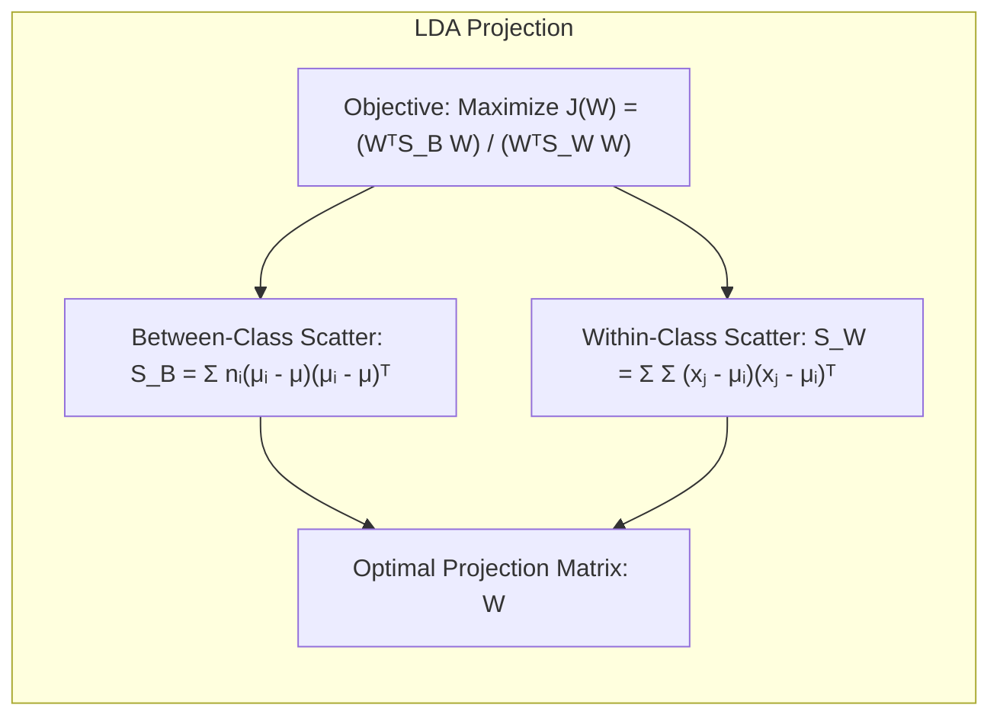

**Conceito 3: Logistic Regression e a Maximização da Verossimilhança**

A **Logistic Regression** [^4.4] é um modelo estatístico para classificação que estima a probabilidade de um evento binário (ou multi-classe) ocorrer. Ao contrário da LDA, a Logistic Regression não faz suposições sobre a distribuição das classes. Ela modela a probabilidade do evento utilizando a função logística, que mapeia qualquer número real para o intervalo (0, 1). A Logistic Regression estima os parâmetros do modelo através da **maximização da verossimilhança** [^4.4.1], ou seja, encontrar os parâmetros que tornam os dados observados mais prováveis [^4.4.2]. O bootstrap pode ser usado para avaliar a incerteza nos parâmetros do modelo e nas previsões da probabilidade. A escolha entre LDA e Logistic Regression pode depender da natureza dos dados e das suposições que podem ser feitas [^4.4.5].
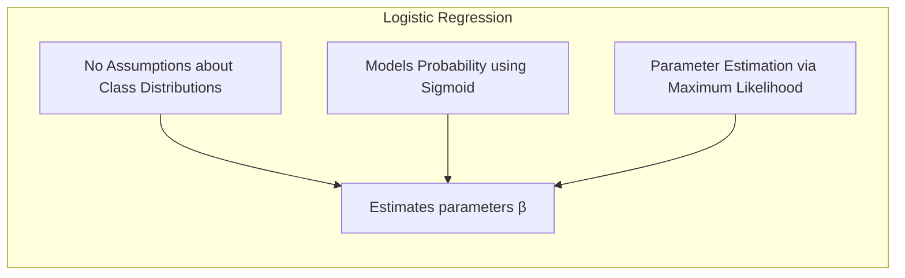
> ⚠️ **Nota Importante**: É crucial entender que a Logistic Regression modela a *probabilidade condicional* de uma classe dado os preditores, enquanto a LDA modela as *densidades* das classes.

> ❗ **Ponto de Atenção**: Em situações com classes não balanceadas, pode ser necessário aplicar técnicas como *re-sampling* ou *ponderação* das classes durante o ajuste dos modelos, tanto em LDA quanto em Logistic Regression.

> ✔️ **Destaque**: Apesar de suas diferenças, as estimativas dos parâmetros em LDA e Logistic Regression podem apresentar correlações significativas, especialmente quando as suposições da LDA são aproximadamente válidas.

### Regressão Linear e Mínimos Quadrados para Classificação

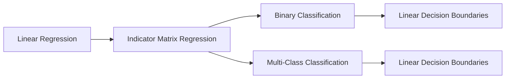
**Explicação:** Este mapa mental ilustra como a regressão linear, quando usada para regredir uma matriz de indicadores, pode ser usada para resolver problemas de classificação binária e multi-classe.

A **regressão linear** pode ser aplicada a problemas de classificação codificando as classes como variáveis indicadoras. Em problemas de classificação binária, as classes podem ser codificadas como 0 e 1. Em problemas multi-classe, uma matriz de indicadores pode ser usada, onde cada coluna representa uma classe e cada linha indica qual classe pertence a determinada observação. Ao ajustar um modelo de regressão linear nesta matriz, podemos obter uma estimativa dos coeficientes que podem ser usados para determinar a classe de cada observação. No entanto, é fundamental notar que a regressão linear não impõe que as previsões de classe estejam no intervalo [0, 1], levando a possíveis extrapolações problemáticas.

> 💡 **Exemplo Numérico:** Considere um problema de classificação binária com dados `X = np.array([[1], [2], [3], [4], [5]])` e as classes correspondentes `y = np.array([0, 0, 1, 1, 1])`. Podemos usar uma regressão linear para modelar as classes como variáveis indicadoras. Ao ajustar o modelo, obtemos um vetor de coeficientes $\hat{\beta}$. A previsão de classe para um novo ponto *x* é feita comparando o valor $x\hat{\beta}$ com um limiar (por exemplo, 0.5). O bootstrap pode ser usado para avaliar como a estimativa de $\hat{\beta}$ varia com diferentes amostras de treinamento, afetando a posição da fronteira de decisão.
```python
import numpy as np
from sklearn.linear_model import LinearRegression

X = np.array([[1], [2], [3], [4], [5]])
y = np.array([0, 0, 1, 1, 1])

model = LinearRegression()
model.fit(X, y)

beta_0 = model.intercept_
beta_1 = model.coef_[0]

print(f"Estimativa de beta_0: {beta_0:.2f}")
print(f"Estimativa de beta_1: {beta_1:.2f}")
```
O código acima ajusta uma regressão linear aos dados. A ideia é que, usando amostras bootstrap dos dados, as estimativas de  $\hat{\beta_0}$ e $\hat{\beta_1}$ variam, o que indica a incerteza no modelo.

**Lemma 2: Equivalência entre Projeções de Regressão e Discriminantes Lineares**
Sob certas condições, as projeções geradas pela regressão linear de indicadores e as obtidas por discriminantes lineares (como na LDA) podem ser equivalentes, especialmente quando o foco principal é a fronteira de decisão linear.

**Prova:**
A regressão linear sobre uma matriz de indicadores para um problema de *K* classes com *N* observações pode ser expressa como:
$$ Y = X\beta + \epsilon $$
onde *Y* é uma matriz *N x K* de indicadores, *X* é a matriz de preditores de dimensão *N x p*, $\beta$ é a matriz de coeficientes *p x K*, e $\epsilon$ representa os erros. A estimativa de mínimos quadrados para $\beta$ é:
$$ \hat{\beta} = (X^T X)^{-1} X^T Y $$
Em LDA, a função discriminante linear para uma classe *k* é definida como:
$$ \delta_k(x) = x^T \Sigma^{-1} \mu_k - \frac{1}{2} \mu_k^T \Sigma^{-1} \mu_k $$
onde $\Sigma$ é a matriz de covariância comum e $\mu_k$ é a média da classe *k*. As projeções de ambos os métodos visam encontrar uma transformação que separe as classes. Em condições específicas, como quando as classes são aproximadamente balanceadas e linearmente separáveis, as direções das projeções podem se alinhar, e os hiperplanos de decisão serão similares, conforme mencionado em [^4.3]. A prova formal da equivalência envolve análise detalhada das condições e das formas funcionais dos dois métodos. $\blacksquare$
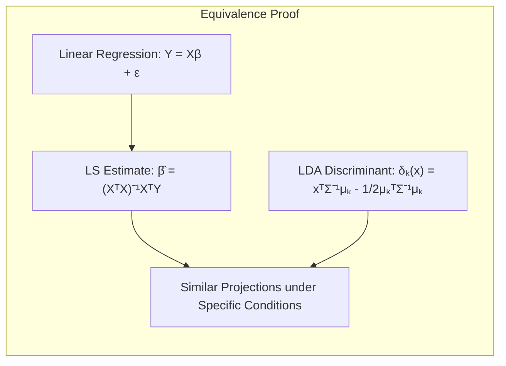

**Corolário 2: Simplificação da Análise em Condições Específicas**
Quando as classes são bem separadas, o uso da regressão de indicadores, conforme indicado em [^4.3], pode fornecer resultados semelhantes aos da LDA e pode simplificar a análise, especialmente em casos onde o foco é apenas na fronteira de decisão linear.

Apesar da sua simplicidade, a regressão linear em matrizes de indicadores possui algumas limitações. Uma delas é que a regressão linear não garante que as previsões estejam dentro do intervalo [0, 1], o que pode dificultar a interpretação das previsões como probabilidades. Além disso, quando há muitas classes, a regressão linear pode levar a estimativas de parâmetros instáveis, especialmente se as classes não forem bem separadas [^4.2].

> “Em alguns cenários, conforme apontado em [^4.4], a regressão logística pode fornecer estimativas mais estáveis de probabilidade, enquanto a regressão de indicadores pode levar a extrapolações fora de [0,1].”

> “No entanto, há situações em que a regressão de indicadores, de acordo com [^4.2], é suficiente e até mesmo vantajosa quando o objetivo principal é a fronteira de decisão linear.”

### Métodos de Seleção de Variáveis e Regularização em Classificação

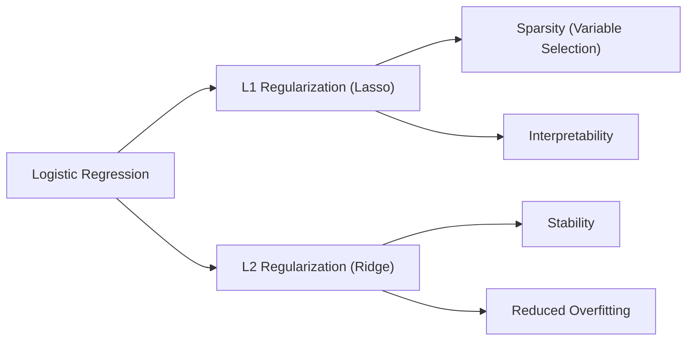
**Explicação:** Este mapa mental descreve como a regularização L1 e L2 na regressão logística impacta na seleção de variáveis e na estabilidade do modelo.

A **seleção de variáveis** e a **regularização** são técnicas importantes para melhorar a performance e a interpretabilidade de modelos classificatórios, particularmente em situações com um grande número de preditores. A regularização impõe penalidades aos parâmetros do modelo durante o processo de otimização, evitando o *overfitting* e levando a modelos mais robustos e generalizáveis. A **penalização L1 (Lasso)** [^4.4.4], adiciona um termo proporcional à soma dos valores absolutos dos coeficientes, promovendo a esparsidade do modelo, ou seja, alguns coeficientes são forçados a zero, levando à seleção de variáveis mais relevantes. A **penalização L2 (Ridge)**, por outro lado, adiciona um termo proporcional à soma dos quadrados dos coeficientes, reduzindo a magnitude dos coeficientes e melhorando a estabilidade das estimativas [^4.5].

> 💡 **Exemplo Numérico:**  Suponha que temos um problema de classificação com 10 preditores e queremos aplicar regressão logística. Com regularização L1 (Lasso), alguns coeficientes serão exatamente zero, indicando que essas variáveis não são importantes para o modelo. Por exemplo, o modelo sem regularização poderia ter coeficientes $\beta = [0.5, -0.2, 0.7, 0.1, -0.9, 0.3, -0.4, 0.8, 0.2, -0.1]$. Após a regularização L1, poderíamos ter $\beta_{L1} = [0.7, 0, 0.9, 0, -1.2, 0, -0.6, 1.1, 0, 0]$, mostrando que as variáveis 2, 4, 6, 9 e 10 foram excluídas do modelo. O bootstrap pode ser usado para avaliar a variabilidade dos coeficientes após a regularização, indicando quais variáveis são consistentemente selecionadas.

```python
import numpy as np
from sklearn.linear_model import LogisticRegression
from sklearn.preprocessing import StandardScaler
from sklearn.model_selection import train_test_split

# Gerando dados sintéticos
np.random.seed(42)
X = np.random.rand(100, 10)
y = np.random.randint(0, 2, 100)

# Dividindo em treino e teste
X_train, X_test, y_train, y_test = train_test_split(X, y, test_size=0.2, random_state=42)

# Normalizando os dados
scaler = StandardScaler()
X_train_scaled = scaler.fit_transform(X_train)
X_test_scaled = scaler.transform(X_test)

# Ajustando regressão logística sem regularização
model_no_reg = LogisticRegression(penalty=None, solver='lbfgs', max_iter=1000)
model_no_reg.fit(X_train_scaled, y_train)
coef_no_reg = model_no_reg.coef_[0]
print("Coeficientes sem regularização:", coef_no_reg)

# Ajustando regressão logística com regularização L1 (Lasso)
model_l1 = LogisticRegression(penalty='l1', solver='liblinear', C=0.5, max_iter=1000)
model_l1.fit(X_train_scaled, y_train)
coef_l1 = model_l1.coef_[0]
print("Coeficientes com regularização L1:", coef_l1)

# Ajustando regressão logística com regularização L2 (Ridge)
model_l2 = LogisticRegression(penalty='l2', solver='lbfgs', C=0.5, max_iter=1000)
model_l2.fit(X_train_scaled, y_train)
coef_l2 = model_l2.coef_[0]
print("Coeficientes com regularização L2:", coef_l2)
```

O código acima mostra um exemplo de como a regularização afeta os coeficientes de um modelo de regressão logística. O bootstrap pode ser aplicado para observar como esses coeficientes variam com diferentes amostras de treinamento.

**Lemma 3: A Penalização L1 e a Esparsidade em Classificação Logística**
A penalização L1 na classificação logística leva a coeficientes esparsos, o que significa que muitas variáveis irrelevantes serão excluídas do modelo.

**Prova:**
O problema de otimização na regressão logística com penalização L1 é dado por:
$$ \min_{\beta} -\frac{1}{N} \sum_{i=1}^{N} [y_i \log(p_i) + (1-y_i)\log(1-p_i)] + \lambda \sum_{j=1}^{p} |\beta_j| $$
onde $y_i$ é a resposta, $p_i$ é a probabilidade predita, $\beta_j$ são os coeficientes do modelo, *p* é o número de preditores e $\lambda$ é o parâmetro de regularização. A penalidade L1, $\lambda \sum_{j=1}^{p} |\beta_j|$, não é diferenciável em $\beta_j = 0$, o que causa uma solução esparsa.  A otimização por subgradiente, utilizada neste caso, tende a forçar alguns coeficientes para zero, resultando na seleção de apenas as variáveis mais relevantes para o modelo. A intuição matemática é que a penalidade L1 adiciona um termo com contornos em formato de losango, que tendem a interceptar os contornos de função de custo em vértices, onde muitos coeficientes serão iguais a zero. $\blacksquare$
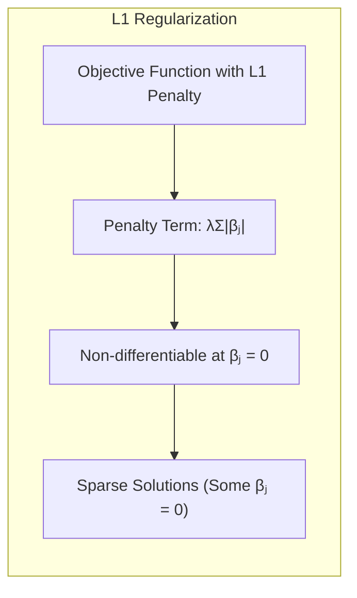

**Corolário 3: Implicações da Esparsidade para Interpretabilidade**
A esparsidade resultante da penalização L1 melhora a interpretabilidade dos modelos classificatórios, pois apenas as variáveis mais relevantes permanecem no modelo, facilitando a compreensão de quais preditores têm o maior impacto na resposta [^4.4.5].
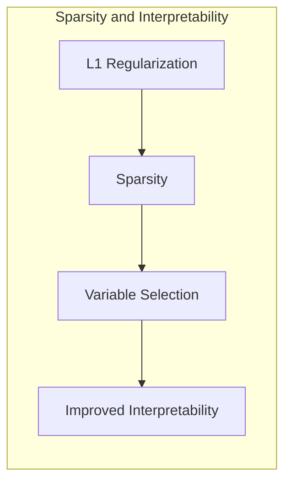

> ⚠️ **Ponto Crucial**: As penalidades L1 e L2 podem ser combinadas na forma de **Elastic Net** para aproveitar as vantagens de ambos os tipos de regularização, proporcionando esparsidade e estabilidade ao mesmo tempo.

### Separating Hyperplanes e Perceptrons

Os **separating hyperplanes** representam uma abordagem para classificação que busca encontrar o hiperplano que melhor separa as classes. Essa ideia é diretamente relacionada à maximização da margem de separação entre as classes, levando ao conceito de hiperplanos ótimos [^4.5.2]. O problema de otimização para encontrar esses hiperplanos pode ser resolvido usando a dualidade de Wolfe [^4.5.2], onde a solução resulta em combinações lineares dos pontos de suporte, que são os pontos mais próximos da fronteira de decisão. O Perceptron de Rosenblatt [^4.5.1] é um algoritmo iterativo que busca encontrar um hiperplano de separação de maneira iterativa. A convergência do Perceptron é garantida sob condições específicas, principalmente quando os dados são linearmente separáveis.
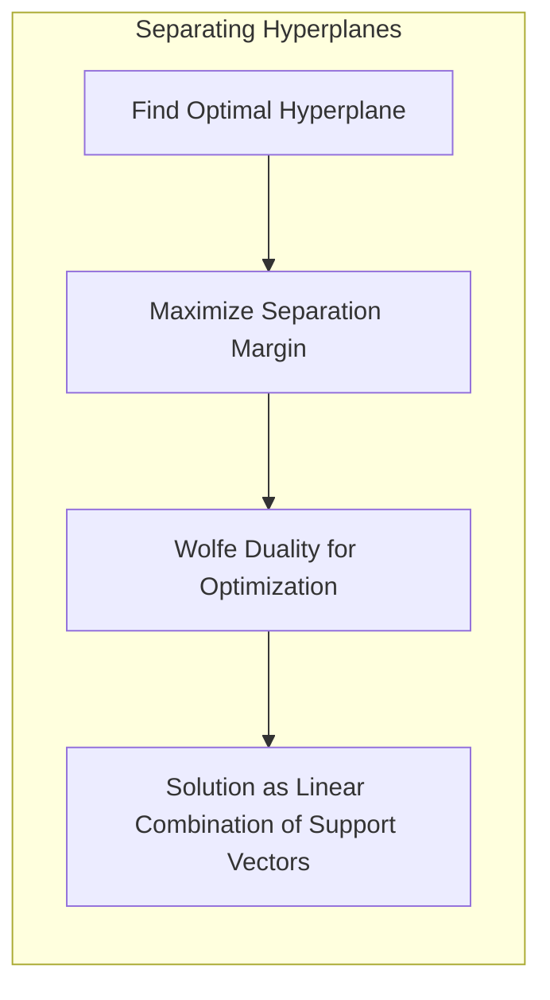
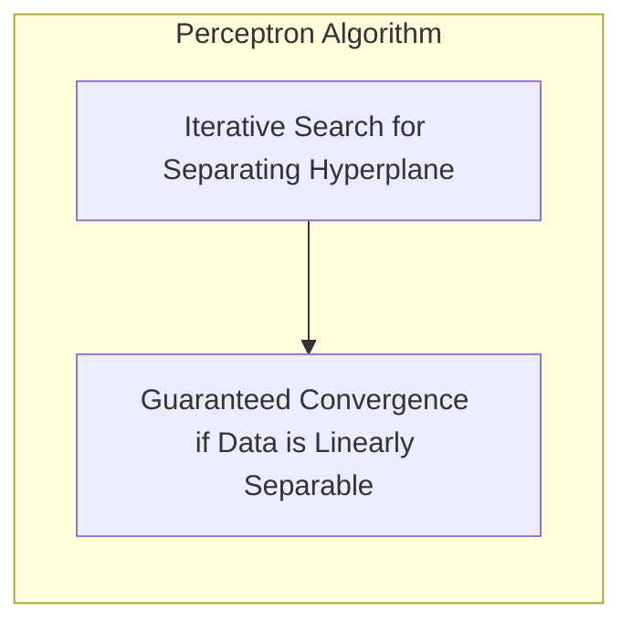

### Pergunta Teórica Avançada: Quais as diferenças fundamentais entre a formulação de LDA e a Regra de Decisão Bayesiana considerando distribuições Gaussianas com covariâncias iguais?
**Resposta:**
A LDA e a regra de decisão Bayesiana são abordagens para classificação que podem levar a resultados semelhantes sob certas condições, especialmente quando as classes seguem distribuições Gaussianas com covariâncias iguais. A regra de decisão Bayesiana, baseada nas probabilidades posteriores, minimiza a probabilidade de erro de classificação, conforme em [^4.3]. A LDA, por outro lado, busca um subespaço que maximize a separação entre as médias das classes.

**Lemma 4: Equivalência Formal entre LDA e Decisão Bayesiana sob Suposições**
Sob a suposição de distribuições Gaussianas com a mesma matriz de covariância, o limite de decisão encontrado pela LDA é formalmente equivalente ao encontrado pela regra de decisão Bayesiana, conforme em [^4.3] e [^4.3.3].

**Prova:**
Suponha que tenhamos *k* classes, com cada classe *i* seguindo uma distribuição normal multivariada:
$$ p(x|C_i) = \frac{1}{(2\pi)^{p/2}|\Sigma|^{1/2}} \exp \left(-\frac{1}{2}(x-\mu_i)^T\Sigma^{-1}(x-\mu_i) \right) $$
onde $\mu_i$ é a média da classe *i* e $\Sigma$ é a matriz de covariância comum a todas as classes.  Pela regra de decisão Bayesiana, classificamos um ponto *x* na classe *j* se
$$ P(C_j|x) = \frac{p(x|C_j)P(C_j)}{\sum_{i=1}^k p(x|C_i)P(C_i)} >  P(C_l|x) \quad \forall l \neq j $$
Para distribuições Gaussianas com covariâncias iguais, o log das probabilidades posteriores pode ser simplificado, e o classificador Bayesiano atribuirá x à classe *j* se:
$$ \delta_j(x) = \log P(C_j) + x^T\Sigma^{-1}\mu_j - \frac{1}{2}\mu_j^T\Sigma^{-1}\mu_j $$
for máximo.  A função discriminante linear encontrada pela LDA pode ser expressa de forma similar.
$$ \delta_j^{LDA}(x) = x^T \Sigma^{-1} \mu_j  +  b_j $$
onde $b_j$ é um termo constante que depende de $\mu_j$ e $\Sigma$. A igualdade das formas funcionais, sob as suposições indicadas, demonstra a equivalência entre as decisões de classificação. $\blacksquare$
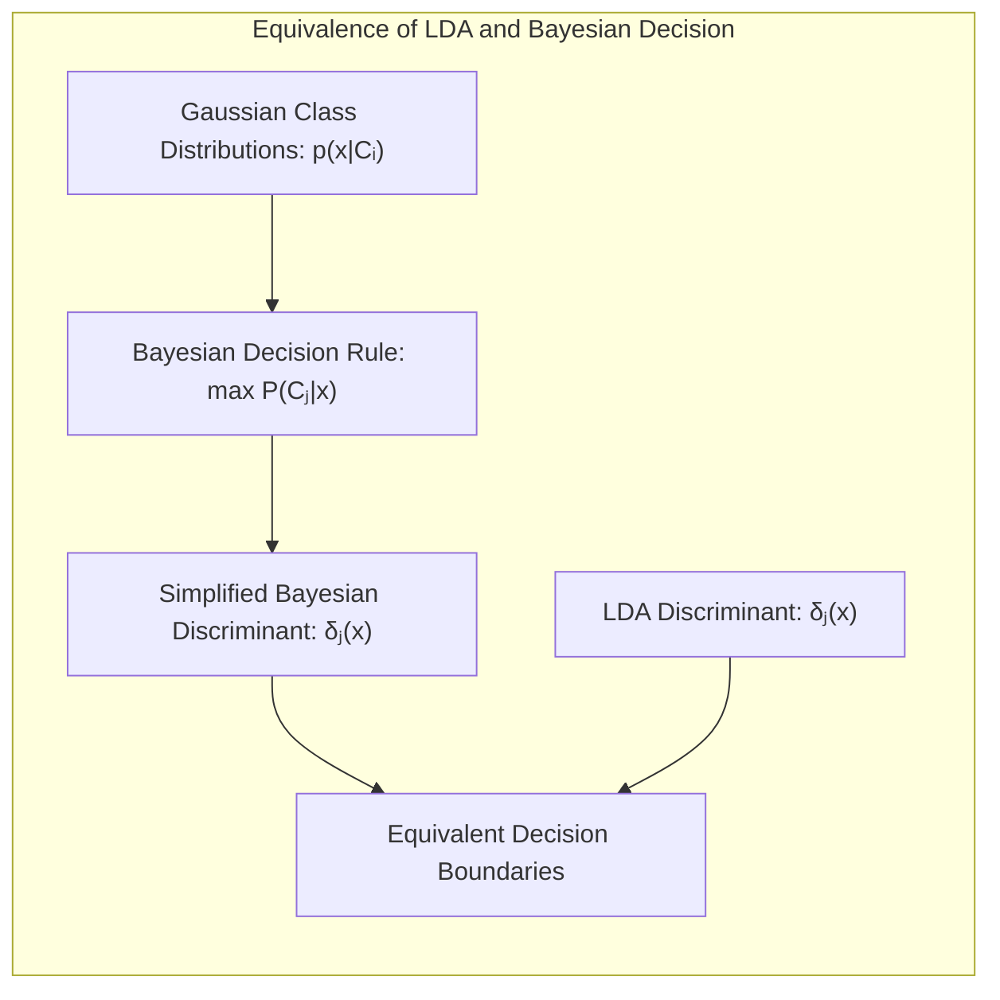

**Corolário 4: Fronteiras Quadráticas com Covariâncias Desiguais**
Se relaxarmos a suposição de covariâncias iguais, como em [^4.3], as fronteiras de decisão resultantes serão quadráticas (QDA), em vez de lineares, e a equivalência formal com a LDA não se mantém.

> ⚠️ **Ponto Crucial**: A suposição de covariâncias iguais em LDA é uma simplificação importante que leva a fronteiras de decisão lineares. A escolha entre modelos lineares (LDA) e quadráticos (QDA) depende da validade dessa suposição e da natureza dos dados, conforme discutido em [^4.3.1].

### Conclusão

O bootstrap emerge como uma ferramenta essencial para a análise de incerteza em modelos estatísticos e de machine learning. Através de métodos de re-amostragem, é possível obter estimativas mais robustas da variabilidade de modelos, tanto paramétricos quanto não-paramétricos. As conexões do bootstrap com o *maximum likelihood* e inferência Bayesiana permitem uma compreensão mais profunda dos modelos e uma melhor tomada de decisões, utilizando técnicas de regularização, seleção de variáveis, e outras abordagens como *separating hyperplanes*, *Perceptrons*, *bagging*, *stacking* e *bumping*. A escolha do método mais adequado depende do problema e dos objetivos de cada análise. O bootstrap, em todas as suas formas, continua a ser uma ferramenta indispensável no arsenal do estatístico e do cientista de dados moderno.

<!-- END DOCUMENT -->

### Footnotes

[^8.1]: "For most of this book, the fitting (learning) of models has been achieved by minimizing a sum of squares for regression, or by minimizing cross-entropy for classification. In fact, both of these minimizations are instances of the maximum likelihood approach to fitting. In this chapter we provide a general exposition of the maximum likelihood approach, as well as the Bayesian method for inference. The bootstrap, introduced in Chapter 7, is discussed in this context, and its relation to maximum likelihood and Bayes is described. Finally, we present some related techniques for model averaging and improvement, including committee methods, bagging, stacking and bumping." *(Trecho de <Model Inference and Averaging>)*
[^8.2]: "Denote the training data by Z = {z1, z2,...,zN}, with zi = (xi, yi), i = 1,2,..., N. Here xi is a one-dimensional input, and yi the outcome, either continuous or categorical. As an example, consider the N = 50 data points shown in the left panel of Figure 8.1. Suppose we decide to fit a cubic spline to the data, with three knots placed at the quartiles of the X values. This is a seven-dimensional linear space of functions, and can be represented, for example, by a linear expansion of B-spline basis functions (see Section 5.9.2):  μ(x) = ∑j=17 βjhj(x). Here the hj(x), j = 1, 2, ..., 7 are the seven functions shown in the right panel of
