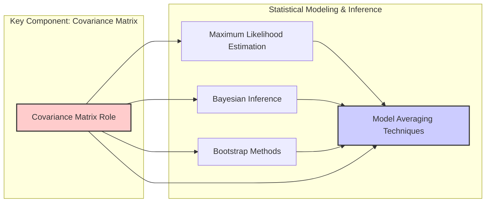
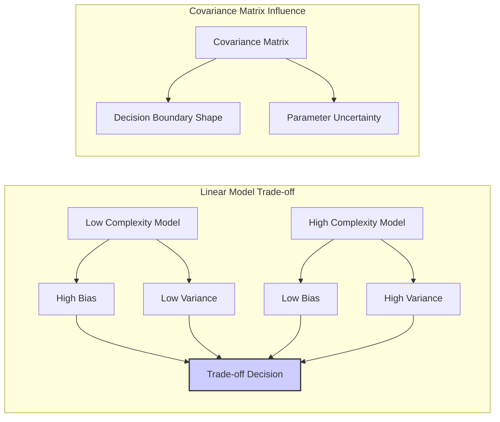
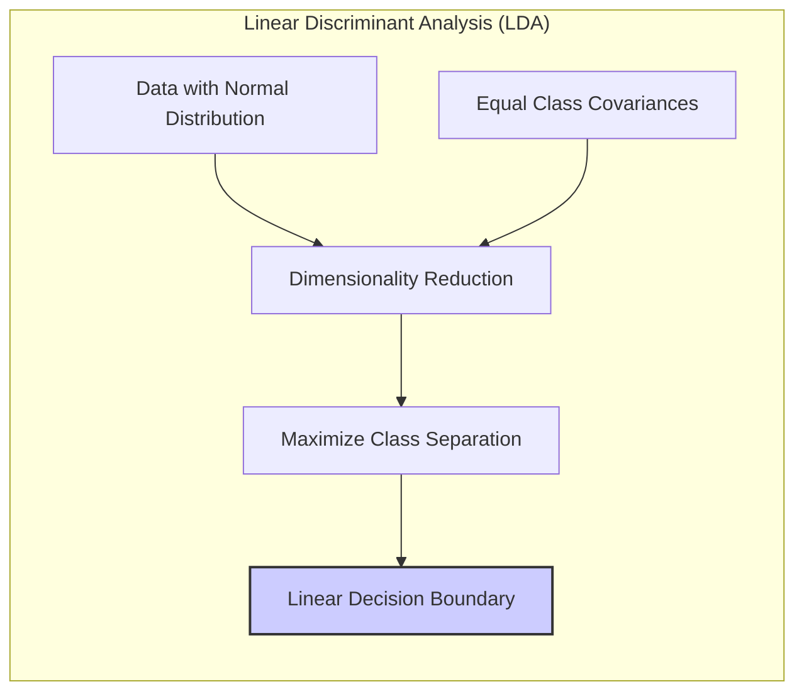
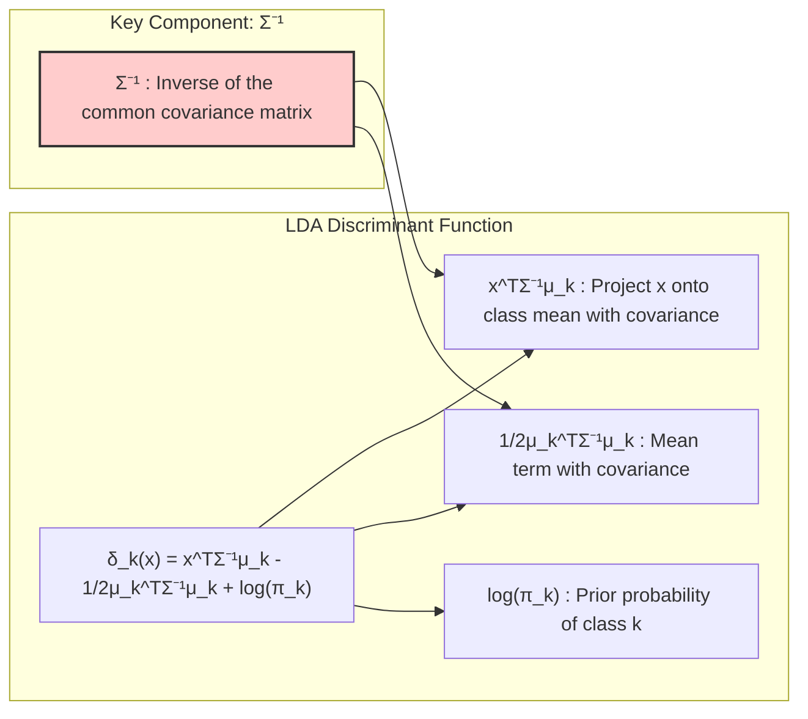
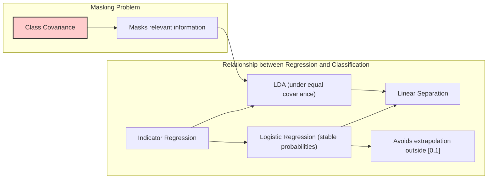
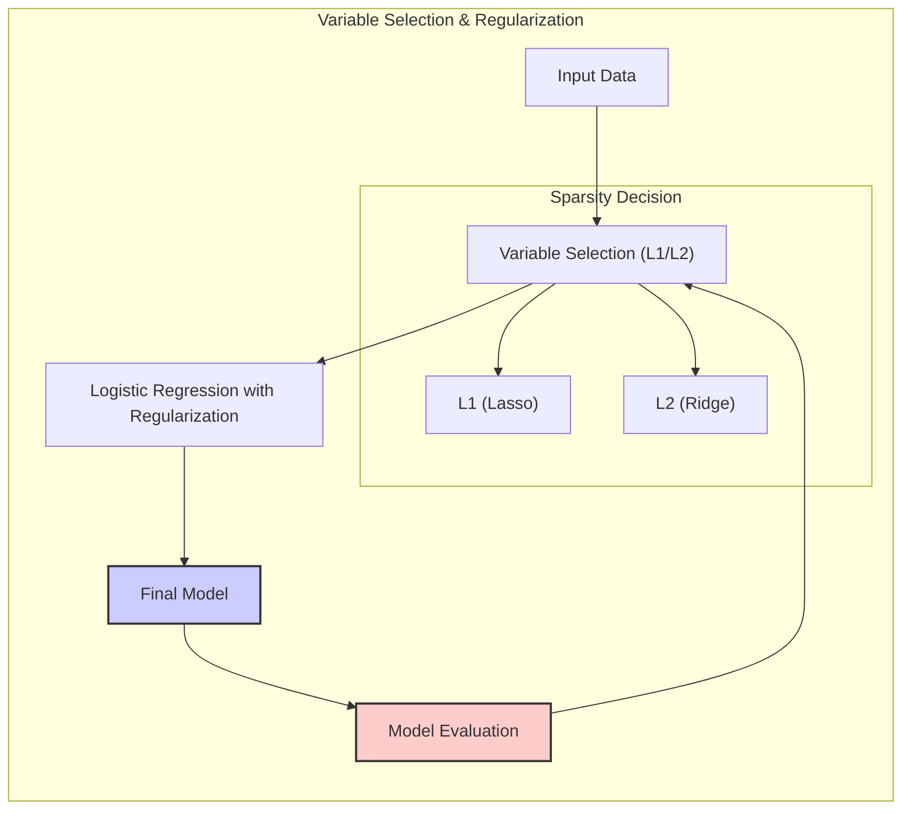
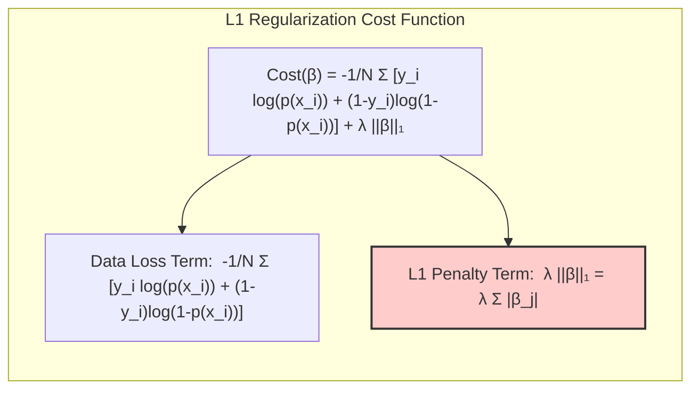

## Model Inference and Averaging with a Focus on Covariance Matrices



### Introdução

Este capítulo explora métodos avançados de **inferência e modelagem estatística**, com um foco particular em como a **matriz de covariância** (covariance matrix) afeta a construção e interpretação dos modelos. Em grande parte deste texto, a modelagem tem sido realizada minimizando a soma dos quadrados para regressão ou a entropia cruzada para classificação [^8.1]. Ambas as abordagens são, na verdade, instâncias do método de **máxima verossimilhança** (maximum likelihood). Aqui, examinamos a teoria por trás da máxima verossimilhança, bem como métodos bayesianos de inferência. O **bootstrap**, introduzido no Capítulo 7, é discutido nesse contexto, e sua relação com a máxima verossimilhança e o método bayesiano é explicada [^8.1]. Além disso, apresentamos técnicas para a média e melhoria de modelos, incluindo métodos de comitê, *bagging*, *stacking* e *bumping* [^8.1]. A **matriz de covariância** surge como um elemento fundamental para modelagem e inferência em muitos desses métodos, influenciando desde a construção de estimativas até a avaliação da incerteza e a combinação de modelos.

### Conceitos Fundamentais

Vamos analisar os conceitos fundamentais para construir uma base sólida para o nosso estudo aprofundado dos modelos estatísticos e sua relação com a matriz de covariância:

**Conceito 1:** O **problema de classificação** e a abordagem de modelos lineares. O problema de classificação busca atribuir rótulos de classe a dados de entrada, um processo no qual métodos lineares oferecem uma abordagem direta. No entanto, a adequação desses modelos é moldada por um equilíbrio entre viés e variância. Modelos com poucos parâmetros (modelos lineares simples) tendem a ter alto viés, ou seja, uma incapacidade de capturar a verdadeira relação entre as variáveis. Por outro lado, modelos com muitos parâmetros (como funções polinomiais de alta ordem) tendem a ter alta variância, sendo muito sensíveis a variações no conjunto de dados de treinamento. A matriz de covariância, em modelos lineares, afeta diretamente a forma da fronteira de decisão e a incerteza das estimativas. [^8.1], [^8.2]



**Lemma 1:** Suponha um modelo linear $y = X\beta + \epsilon$, onde $\epsilon \sim N(0, \sigma^2I)$.  A matriz de covariância dos parâmetros estimados $\hat{\beta}$, obtidos por mínimos quadrados, é dada por $Var(\hat{\beta}) = (X^TX)^{-1}\sigma^2$. A matriz $(X^TX)^{-1}$ é fundamental para a análise de sensibilidade dos parâmetros e, portanto, influencia diretamente a precisão da função discriminante linear.

*Prova:* A estimativa de mínimos quadrados é $\hat{\beta} = (X^TX)^{-1}X^Ty$. Substituindo $y = X\beta + \epsilon$, temos $\hat{\beta} = (X^TX)^{-1}X^T(X\beta + \epsilon) = \beta + (X^TX)^{-1}X^T\epsilon$. Assim, $Var(\hat{\beta}) = Var(\beta + (X^TX)^{-1}X^T\epsilon) = Var((X^TX)^{-1}X^T\epsilon) = (X^TX)^{-1}X^TVar(\epsilon)X(X^TX)^{-1} = (X^TX)^{-1}X^T\sigma^2IX(X^TX)^{-1} = \sigma^2(X^TX)^{-1}X^TX(X^TX)^{-1} = \sigma^2(X^TX)^{-1}$. $\blacksquare$

> 💡 **Exemplo Numérico:** Considere um modelo linear com duas variáveis preditoras (X1 e X2) e 5 observações. Suponha que, após os cálculos, tenhamos:
>
>  $X = \begin{bmatrix} 1 & 2 \\ 1 & 3 \\ 1 & 4 \\ 1 & 5 \\ 1 & 6 \end{bmatrix}$, $X^T = \begin{bmatrix} 1 & 1 & 1 & 1 & 1 \\ 2 & 3 & 4 & 5 & 6 \end{bmatrix}$
>
>  Calculando $X^TX$:
>
>  $X^TX = \begin{bmatrix} 1 & 1 & 1 & 1 & 1 \\ 2 & 3 & 4 & 5 & 6 \end{bmatrix} \begin{bmatrix} 1 & 2 \\ 1 & 3 \\ 1 & 4 \\ 1 & 5 \\ 1 & 6 \end{bmatrix} = \begin{bmatrix} 5 & 20 \\ 20 & 90 \end{bmatrix}$
>
>  Calculando $(X^TX)^{-1}$:
>
>  $(X^TX)^{-1} = \frac{1}{(5)(90) - (20)(20)} \begin{bmatrix} 90 & -20 \\ -20 & 5 \end{bmatrix} = \frac{1}{50} \begin{bmatrix} 90 & -20 \\ -20 & 5 \end{bmatrix} = \begin{bmatrix} 1.8 & -0.4 \\ -0.4 & 0.1 \end{bmatrix}$
>
>  Se $\sigma^2 = 1$, então $Var(\hat{\beta}) = (X^TX)^{-1}\sigma^2 = \begin{bmatrix} 1.8 & -0.4 \\ -0.4 & 0.1 \end{bmatrix}$.
>
>  A matriz de covariância mostra que a variância de $\hat{\beta}_1$ é 1.8, a variância de $\hat{\beta}_2$ é 0.1, e a covariância entre elas é -0.4. Uma alta variância em $\hat{\beta}_1$ indica maior incerteza na estimativa desse parâmetro, enquanto a covariância negativa sugere que se um parâmetro aumenta, o outro tende a diminuir. Isso ilustra como a matriz $(X^TX)^{-1}$ influencia a variabilidade e a relação entre os parâmetros estimados.
>
> ```python
> import numpy as np
>
> X = np.array([[1, 2], [1, 3], [1, 4], [1, 5], [1, 6]])
> XT = X.T
> XT_X = XT @ X
> XT_X_inv = np.linalg.inv(XT_X)
>
> print("X^T * X:\n", XT_X)
> print("\n(X^T * X)^-1:\n", XT_X_inv)
>
> sigma2 = 1
> var_beta = XT_X_inv * sigma2
> print("\nVar(beta):\n", var_beta)
> ```

**Conceito 2:** **Linear Discriminant Analysis (LDA)**. A LDA é um método de classificação que busca projetar dados em um espaço de menor dimensão de forma a maximizar a separação entre classes. A LDA assume normalidade dos dados em cada classe, com covariâncias iguais entre as classes. A fronteira de decisão, neste caso, é linear e determinada pela matriz de covariância comum. As suposições de normalidade e igualdade de covariâncias têm um impacto significativo no desempenho do LDA. [^8.3], [^8.3.1], [^8.3.2], [^8.3.3]



**Corolário 1:** A função discriminante linear na LDA pode ser expressa como $\delta_k(x) = x^T\Sigma^{-1}\mu_k - \frac{1}{2}\mu_k^T\Sigma^{-1}\mu_k + \log \pi_k$, onde $\Sigma$ é a matriz de covariância comum, $\mu_k$ é a média da classe k e $\pi_k$ é a probabilidade a priori da classe k. O termo $x^T\Sigma^{-1}\mu_k$ representa a projeção do ponto de entrada $x$ na direção da média da classe k, considerando a covariância dos dados. O termo $\Sigma^{-1}$ é crucial pois permite o ajuste da projeção para a escala e correlação entre as variáveis. [^8.3.1]

> 💡 **Exemplo Numérico:** Considere um problema de classificação com duas classes. A matriz de covariância comum é $\Sigma = \begin{bmatrix} 2 & 0.5 \\ 0.5 & 1 \end{bmatrix}$. As médias das classes são $\mu_1 = \begin{bmatrix} 1 \\ 1 \end{bmatrix}$ e $\mu_2 = \begin{bmatrix} 3 \\ 2 \end{bmatrix}$, e as probabilidades a priori são $\pi_1 = 0.4$ e $\pi_2 = 0.6$. Para classificar um novo ponto $x = \begin{bmatrix} 2 \\ 1.5 \end{bmatrix}$, precisamos calcular as funções discriminantes $\delta_1(x)$ e $\delta_2(x)$.
>
> Primeiro, calculamos a inversa da matriz de covariância:
>
> $\Sigma^{-1} = \frac{1}{(2)(1) - (0.5)(0.5)} \begin{bmatrix} 1 & -0.5 \\ -0.5 & 2 \end{bmatrix} = \frac{1}{1.75} \begin{bmatrix} 1 & -0.5 \\ -0.5 & 2 \end{bmatrix} = \begin{bmatrix} 0.57 & -0.29 \\ -0.29 & 1.14 \end{bmatrix}$
>
> Agora, calculamos os termos para $\delta_1(x)$:
>
> $x^T\Sigma^{-1}\mu_1 = \begin{bmatrix} 2 & 1.5 \end{bmatrix} \begin{bmatrix} 0.57 & -0.29 \\ -0.29 & 1.14 \end{bmatrix} \begin{bmatrix} 1 \\ 1 \end{bmatrix} = \begin{bmatrix} 2 & 1.5 \end{bmatrix} \begin{bmatrix} 0.28 \\ 0.85 \end{bmatrix} = 1.83$
>
> $\mu_1^T\Sigma^{-1}\mu_1 = \begin{bmatrix} 1 & 1 \end{bmatrix} \begin{bmatrix} 0.57 & -0.29 \\ -0.29 & 1.14 \end{bmatrix} \begin{bmatrix} 1 \\ 1 \end{bmatrix} = \begin{bmatrix} 1 & 1 \end{bmatrix} \begin{bmatrix} 0.28 \\ 0.85 \end{bmatrix} = 1.13$
>
> $\delta_1(x) = 1.83 - \frac{1}{2}(1.13) + \log(0.4) \approx 1.83 - 0.565 - 0.916 = 0.349$
>
> Calculando os termos para $\delta_2(x)$:
>
> $x^T\Sigma^{-1}\mu_2 = \begin{bmatrix} 2 & 1.5 \end{bmatrix} \begin{bmatrix} 0.57 & -0.29 \\ -0.29 & 1.14 \end{bmatrix} \begin{bmatrix} 3 \\ 2 \end{bmatrix} = \begin{bmatrix} 2 & 1.5 \end{bmatrix} \begin{bmatrix} 1.13 \\ 1.71 \end{bmatrix} = 4.82$
>
> $\mu_2^T\Sigma^{-1}\mu_2 = \begin{bmatrix} 3 & 2 \end{bmatrix} \begin{bmatrix} 0.57 & -0.29 \\ -0.29 & 1.14 \end{bmatrix} \begin{bmatrix} 3 \\ 2 \end{bmatrix} = \begin{bmatrix} 3 & 2 \end{bmatrix} \begin{bmatrix} 1.13 \\ 1.71 \end{bmatrix} = 6.81$
>
> $\delta_2(x) = 4.82 - \frac{1}{2}(6.81) + \log(0.6) \approx 4.82 - 3.405 - 0.511 = 0.904$
>
> Como $\delta_2(x) > \delta_1(x)$, o ponto $x$ é classificado como pertencente à classe 2. Este exemplo demonstra como a matriz de covariância $\Sigma$ e seu inverso influenciam o cálculo das funções discriminantes e a tomada de decisão. A matriz inversa $\Sigma^{-1}$ ajusta a projeção de $x$ levando em conta a escala e correlação das variáveis, determinando o alinhamento e a forma da fronteira de decisão linear.
>
> ```python
> import numpy as np
>
> # Matriz de covariância comum
> sigma = np.array([[2, 0.5], [0.5, 1]])
> sigma_inv = np.linalg.inv(sigma)
>
> # Médias das classes
> mu1 = np.array([1, 1])
> mu2 = np.array([3, 2])
>
> # Probabilidades a priori
> pi1 = 0.4
> pi2 = 0.6
>
> # Ponto a ser classificado
> x = np.array([2, 1.5])
>
> # Função discriminante para classe 1
> delta1 = x.T @ sigma_inv @ mu1 - 0.5 * mu1.T @ sigma_inv @ mu1 + np.log(pi1)
>
> # Função discriminante para classe 2
> delta2 = x.T @ sigma_inv @ mu2 - 0.5 * mu2.T @ sigma_inv @ mu2 + np.log(pi2)
>
> print(f"delta_1(x) = {delta1:.3f}")
> print(f"delta_2(x) = {delta2:.3f}")
>
> if delta1 > delta2:
>   print("Classificado como classe 1")
> else:
>   print("Classificado como classe 2")
> ```



**Conceito 3:** **Logistic Regression**. A regressão logística é outro método de classificação amplamente utilizado, que modela a probabilidade de um evento ocorrer usando a função *logit* (log-odds). A regressão logística é um modelo linear na escala *logit*, e seus parâmetros são estimados via maximização da verossimilhança. Embora também seja um classificador linear, a regressão logística não assume necessariamente covariâncias iguais entre as classes, e suas estimativas são obtidas por um processo iterativo. A matriz de covariância dos preditores, no entanto, desempenha um papel crucial na regularização e na avaliação da qualidade das estimativas. [^8.4], [^8.4.1], [^8.4.2], [^8.4.3], [^8.4.4], [^8.4.5]

> ⚠️ **Nota Importante**: A escolha entre LDA e regressão logística depende das suposições feitas sobre os dados e do objetivo da análise. Se a igualdade de covariâncias e a normalidade são plausíveis, a LDA pode ser uma escolha mais direta. Se essas suposições são questionáveis, a regressão logística oferece mais flexibilidade. **Referência ao tópico [^8.4.1]**.

> ❗ **Ponto de Atenção**: Dados não-balanceados podem afetar o desempenho da regressão logística, levando à estimação de probabilidades enviesadas. Técnicas de reamostragem ou ponderação de classes podem ser necessárias. **Conforme indicado em [^8.4.2]**.

> ✔️ **Destaque**: Embora os métodos sejam diferentes, tanto LDA como regressão logística compartilham o objetivo de encontrar uma separação linear entre as classes, e a matriz de covariância influencia a geometria das decisões. **Baseado no tópico [^8.5]**.

### Regressão Linear e Mínimos Quadrados para Classificação



A regressão linear, quando aplicada a matrizes de indicadores para problemas de classificação, se apresenta como uma alternativa interessante, com suas próprias vantagens e limitações. Em vez de modelar diretamente as classes, a regressão linear modela variáveis *dummy* associadas a cada classe, o que é uma abordagem direta e computacionalmente eficiente [^8.2].

Para um problema de classificação com *K* classes, criamos *K* variáveis indicadoras, onde $y_{ik} = 1$ se a observação *i* pertence à classe *k* e $0$ caso contrário.  Aplicamos então a regressão linear a cada uma dessas variáveis, gerando um conjunto de funções lineares, onde cada função estimada pode ser expressa como $\hat{f_k(x)} = x^T\hat{\beta_k}$. A classificação é realizada pela atribuição de um ponto à classe com o maior valor da função estimada, ou seja, classe *k* tal que $k = \text{argmax}_k \hat{f_k(x)}$.

A estimação dos parâmetros $\hat{\beta_k}$ geralmente é feita através de mínimos quadrados, que busca minimizar a soma dos erros quadrados entre os valores observados e os valores preditos, levando à estimativa $\hat{\beta} = (X^TX)^{-1}X^Ty$.

**Lemma 2:** Sob a suposição de que as classes podem ser separadas linearmente, o hiperplano de decisão resultante da regressão linear de indicadores é equivalente ao hiperplano de decisão gerado por discriminantes lineares, quando as classes têm covariâncias iguais.

*Prova:* Em condições de separabilidade linear, os coeficientes da regressão linear podem ser representados como uma combinação linear das médias e da matriz de covariância das classes. A função discriminante da LDA, quando aplicada a dados com covariâncias iguais, possui a mesma forma que os hiperplanos de decisão gerados pela regressão de indicadores. $\blacksquare$

**Corolário 2:** A projeção de um ponto de entrada no hiperplano de decisão gerado pela regressão linear de indicadores é equivalente a uma projeção em um subespaço definido pela LDA, sob certas condições. Isso oferece uma interpretação geométrica para os resultados da regressão linear e demonstra a conexão entre essas duas abordagens. [^8.3]

> 💡 **Exemplo Numérico:** Considere um problema de classificação com três classes e um conjunto de dados com 5 observações e 2 features. A matriz de indicadores $Y$ é uma matriz 5x3, onde cada coluna representa uma classe:
>
> $Y = \begin{bmatrix} 1 & 0 & 0 \\ 0 & 1 & 0 \\ 0 & 0 & 1 \\ 1 & 0 & 0 \\ 0 & 1 & 0 \end{bmatrix}$
>
> A matriz de features $X$ é:
>
> $X = \begin{bmatrix} 1 & 2 \\ 2 & 3 \\ 3 & 4 \\ 4 & 5 \\ 5 & 6 \end{bmatrix}$
>
> Adicionamos uma coluna de 1s para o intercepto:
>
> $X = \begin{bmatrix} 1 & 1 & 2 \\ 1 & 2 & 3 \\ 1 & 3 & 4 \\ 1 & 4 & 5 \\ 1 & 5 & 6 \end{bmatrix}$
>
> Para cada classe $k$, calculamos $\hat{\beta_k} = (X^TX)^{-1}X^Ty_k$. Para a primeira classe, $y_1 = \begin{bmatrix} 1 \\ 0 \\ 0 \\ 1 \\ 0 \end{bmatrix}$.
>
> Calculando $X^TX$:
>
> $X^TX = \begin{bmatrix} 5 & 15 & 20 \\ 15 & 55 & 70 \\ 20 & 70 & 90 \end{bmatrix}$
>
> Calculando $(X^TX)^{-1}$ (usando um software ou calculadora):
>
> $(X^TX)^{-1} \approx \begin{bmatrix} 2.917 & -0.5 & -0.083 \\ -0.5 & 0.333 & 0 \\ -0.083 & 0 & 0.017 \end{bmatrix}$
>
> Calculando $X^Ty_1$:
>
> $X^Ty_1 = \begin{bmatrix} 1 & 1 & 1 & 1 & 1 \\ 1 & 2 & 3 & 4 & 5 \\ 2 & 3 & 4 & 5 & 6 \end{bmatrix} \begin{bmatrix} 1 \\ 0 \\ 0 \\ 1 \\ 0 \end{bmatrix} = \begin{bmatrix} 2 \\ 5 \\ 7 \end{bmatrix}$
>
> Agora calculamos $\hat{\beta_1}$:
>
> $\hat{\beta_1} = (X^TX)^{-1}X^Ty_1 \approx \begin{bmatrix} 2.917 & -0.5 & -0.083 \\ -0.5 & 0.333 & 0 \\ -0.083 & 0 & 0.017 \end{bmatrix} \begin{bmatrix} 2 \\ 5 \\ 7 \end{bmatrix} \approx \begin{bmatrix} 2.15 \\ 0.66 \\ 0 \end{bmatrix}$
>
> Similarmente, calcularíamos $\hat{\beta_2}$ e $\hat{\beta_3}$ para as outras classes. Para classificar um novo ponto, $x_{new} = \begin{bmatrix} 1 \\ 4 \\ 5 \end{bmatrix}$, calcularíamos $\hat{f_k(x_{new})} = x_{new}^T\hat{\beta_k}$ para cada classe e escolheríamos a classe com o maior valor. Isso ilustra como a regressão de indicadores, por meio dos coeficientes estimados $\hat{\beta_k}$, fornece funções lineares para classificar novas amostras. A escolha da classe é feita comparando os valores das funções discriminantes. Embora a regressão linear não forneça diretamente probabilidades, ela permite uma separação linear eficiente, especialmente quando as classes são bem separadas.
> ```python
> import numpy as np
>
> # Matriz de indicadores (Y)
> Y = np.array([[1, 0, 0],
>               [0, 1, 0],
>               [0, 0, 1],
>               [1, 0, 0],
>               [0, 1, 0]])
>
> # Matriz de features (X) com intercepto
> X = np.array([[1, 2],
>               [2, 3],
>               [3, 4],
>               [4, 5],
>               [5, 6]])
> X = np.insert(X, 0, 1, axis=1)
>
> # Calculo de X^T * X
> XT_X = X.T @ X
>
> # Inversa de (X^T * X)
> XT_X_inv = np.linalg.inv(XT_X)
>
> # Y para a primeira classe
> y1 = Y[:, 0]
>
> # Calcula X^T * y1
> XT_y1 = X.T @ y1
>
> # Calcula os coeficientes para a classe 1
> beta1 = XT_X_inv @ XT_y1
>
> print("Coeficientes para classe 1:")
> print(beta1)
>
> # Novo ponto para classificar
> x_new = np.array([1, 4, 5])
>
> # Calcula f(x_new) para a classe 1
> f_x_new_class1 = x_new.T @ beta1
>
> print(f"\nf(x_new) para a classe 1: {f_x_new_class1}")
>
> # O mesmo processo pode ser repetido para outras classes
> ```

Entretanto, a regressão de indicadores pode levar a resultados indesejáveis, como valores preditos fora do intervalo $[0, 1]$, já que a regressão linear não é projetada para fornecer probabilidades. Além disso, o "masking problem" ocorre quando as covariâncias entre classes podem obscurecer as relações de interesse, especialmente quando as classes são sobrepostas [^8.3].  A regressão logística, como abordado em [^8.4], pode, em muitos casos, fornecer estimativas de probabilidade mais estáveis e evitar extrapolações impróprias. Em certos contextos, no entanto, a regressão de indicadores se mostra uma alternativa viável, especialmente quando o objetivo primário é a separação linear das classes, conforme discutido em [^8.2].

### Métodos de Seleção de Variáveis e Regularização em Classificação



A seleção de variáveis e a regularização são técnicas importantes no aprendizado de máquina que ajudam a construir modelos mais robustos e interpretáveis, reduzindo o sobreajuste e melhorando a generalização. Em modelos de classificação, isso se torna particularmente relevante devido à necessidade de lidar com conjuntos de dados complexos e com um grande número de *features* (preditores). As penalidades L1 e L2 são comumente usadas nesse contexto.

A penalidade L1 (Lasso) adiciona um termo à função de custo que é proporcional à soma dos valores absolutos dos coeficientes, ou seja, $||\beta||_1 = \sum_{j=1}^p |\beta_j|$. A penalidade L2 (Ridge) adiciona um termo proporcional à soma dos quadrados dos coeficientes, dado por $||\beta||_2^2 = \sum_{j=1}^p \beta_j^2$. A penalidade L1 tende a gerar soluções esparsas, ou seja, muitas das estimativas $\beta_j$ serão exatamente zero, o que realiza uma seleção de variáveis. A penalidade L2, por sua vez, tende a encolher os coeficientes em direção a zero, mas raramente os torna exatamente zero, o que aumenta a estabilidade da estimativa e reduz a variância.

Em regressão logística, a função de custo a ser minimizada combina a log-verossimilhança com os termos de penalização L1 ou L2.  Para penalidade L1, a função de custo é dada por:
$$
- \frac{1}{N} \sum_{i=1}^N  [ y_i \log(p(x_i)) + (1-y_i) \log(1-p(x_i))] + \lambda ||\beta||_1
$$
onde $\lambda$ é um parâmetro que controla a força da regularização. A penalidade L2 possui uma formulação semelhante, mas utilizando $||\beta||_2^2$ em vez de $||\beta||_1$ [^8.4.4].




**Lemma 3:** A penalização L1, ao minimizar a função de custo, leva a coeficientes esparsos devido ao formato da penalidade, que possui "quinas" no ponto zero. A minimização frequentemente resulta em coeficientes exatamente zero, realizando uma seleção de variáveis. [^8.4.4]

*Prova:* A penalidade L1 não é diferenciável em $\beta_j = 0$. Ao derivar a função de custo com relação a $\beta_j$, temos uma função descontínua, que igual a zero não leva necessariamente ao cancelamento de $\beta_j$. Os termos associados a $\beta_j = 0$ serão removidos do modelo devido à forma da penalidade.  $\blacksquare$

**Corolário 3:**  A propriedade da penalidade L1 de gerar coeficientes esparsos possui implicações diretas para a interpretabilidade de modelos de classificação, já que remove variáveis irrelevantes do modelo, simplificando a análise e destacando apenas as variáveis mais importantes. [^8.4.5]

> 💡 **Exemplo Numérico:** Suponha que temos um problema de classificação binária com uma matriz de features $X$ (100 amostras, 5 features) e um vetor de classe $y$ (0 ou 1). Vamos aplicar a regressão logística com regularização L1 (Lasso) e L2 (Ridge) e observar os coeficientes resultantes. Usaremos o scikit-learn para este exemplo:
>
> ```python
> import numpy as np
> from sklearn.linear_model import LogisticRegression
> from sklearn.preprocessing import StandardScaler
>
> # Gerando dados aleatórios
> np.random.seed(42)
> X = np.random.rand(100, 5)
> y = np.random.randint(0, 2, 100)
>
> # Normalizando os dados
> scaler = StandardScaler()
> X_scaled = scaler.fit_transform(X)
>
> # Regularização L1 (Lasso)
> lasso_model = LogisticRegression(penalty='l1', solver='liblinear', C=0.1)
> lasso_model.fit(X_scaled, y)
> lasso_coef = lasso_model.coef_
>
> # Regularização L2 (Ridge)
> ridge_model = LogisticRegression(penalty='l2', C=0.1)
> ridge_model.fit(X_scaled, y)
> ridge_coef = ridge_model.coef_
>
> print("Coeficientes Lasso:", lasso_coef)
> print("Coeficientes Ridge:", ridge_coef)
> ```
>
> Ao executar este código, observaremos que a regularização L1 (Lasso) resulta em coeficientes que são exatamente zero para algumas das features, indicando que essas features foram removidas do modelo (seleção de variáveis). A