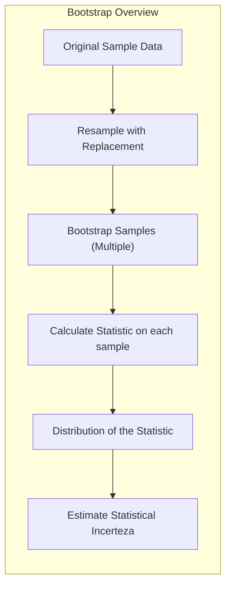
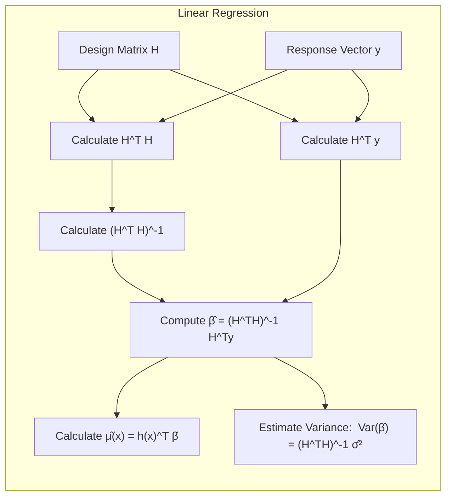
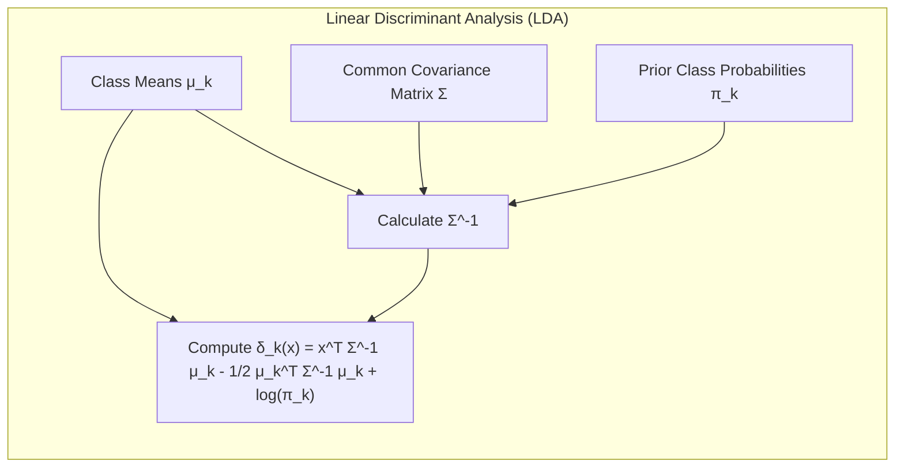
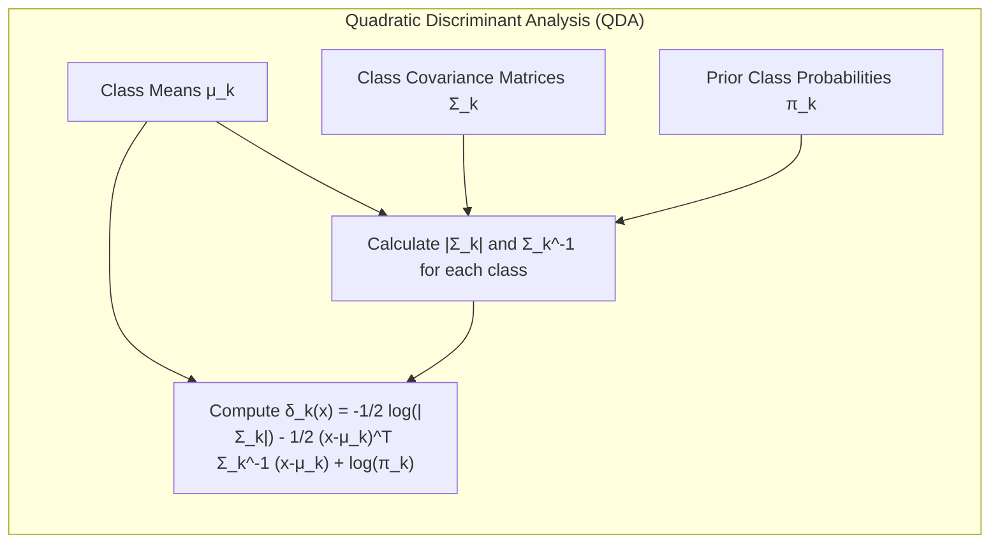
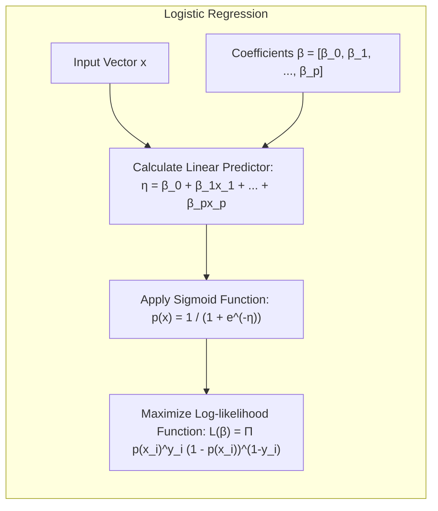
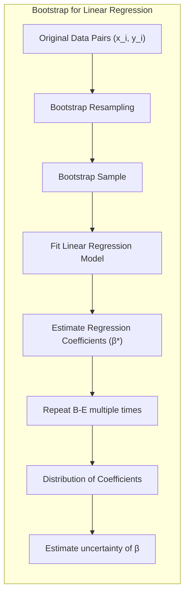
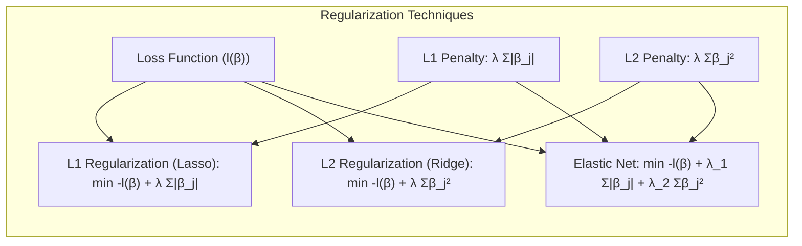
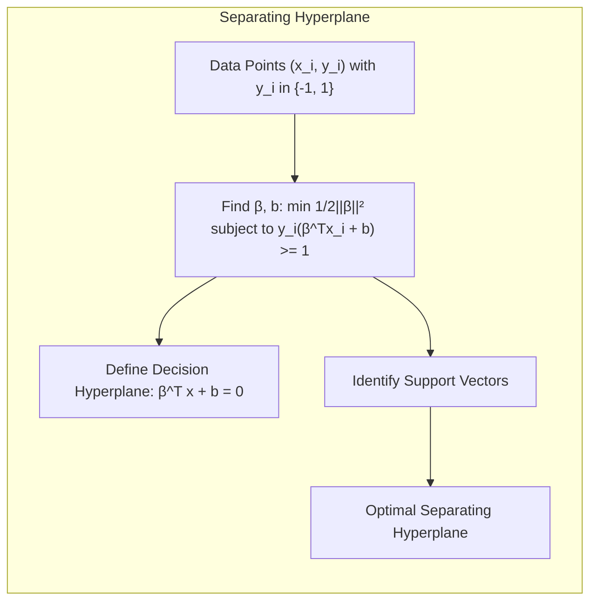
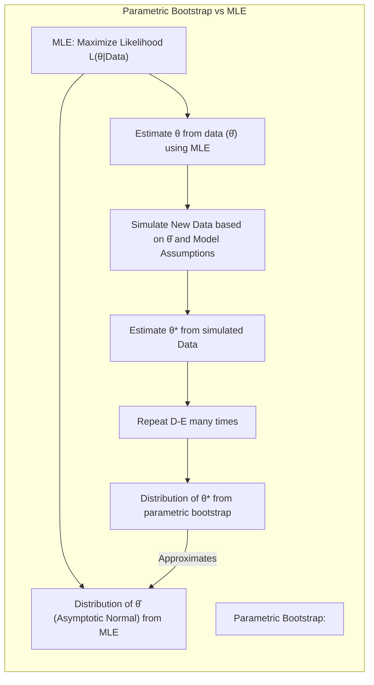

## Nonparametric Bootstrap: A Deep Dive into Resampling Techniques for Statistical Inference

### Introdução

O conceito de **nonparametric bootstrap** oferece uma abordagem poderosa e flexível para a inferência estatística, especialmente quando as suposições paramétricas são difíceis de verificar ou quando as distribuições subjacentes são desconhecidas [^8.2.1]. Este capítulo visa aprofundar a compreensão do método bootstrap não paramétrico, explorando suas bases teóricas, aplicações práticas e conexões com abordagens de inferência máxima verossimilhança e bayesiana. O bootstrap, em sua essência, é uma técnica de reamostragem que nos permite estimar a distribuição amostral de um estimador estatístico, utilizando apenas os dados observados [^8.1]. Ele simula múltiplas amostras "bootstrapped" a partir da amostra original, permitindo-nos quantificar a incerteza associada ao nosso estimador.

### Conceitos Fundamentais

**Conceito 1:** O **problema da inferência estatística** reside em generalizar conclusões sobre uma população com base em uma amostra finita observada [^8.1]. Frequentemente, precisamos estimar parâmetros populacionais (como a média, variância ou quantis) ou avaliar a incerteza de nossas estimativas. Métodos lineares tradicionais, como a regressão linear ou a análise discriminante, geralmente fazem suposições paramétricas sobre a distribuição dos dados, o que pode levar a resultados imprecisos se essas suposições forem violadas. O bootstrap, ao contrário, oferece uma abordagem *model-free* [^8.2.1], permitindo avaliar a incerteza das estimativas sem depender de premissas distribucionais rígidas.

> 💡 **Exemplo Numérico:** Suponha que temos uma amostra de 10 observações de tempos de reação (em segundos): `[1.2, 1.5, 1.8, 1.3, 1.6, 2.0, 1.1, 1.7, 1.9, 1.4]`. Queremos estimar a média da população e sua incerteza. Métodos paramétricos assumiriam uma distribuição normal, mas o bootstrap não faz essa suposição. Geraríamos várias amostras bootstrap (com reposição) dessa amostra original. Por exemplo, uma amostra bootstrap pode ser `[1.5, 1.1, 1.8, 1.4, 1.2, 1.9, 1.6, 1.5, 1.7, 1.3]`. Calcularíamos a média para cada amostra bootstrap e usaríamos a distribuição dessas médias para estimar a incerteza da média amostral original.

**Lemma 1:** A **relação entre regressão linear e mínimos quadrados** pode ser formulada como um problema de otimização, onde buscamos os coeficientes que minimizam a soma dos quadrados dos erros. Se definirmos $H$ como a matriz de desenho, com elementos $h_j(x_i)$, e $y$ como o vetor das respostas, o estimador de mínimos quadrados $\hat{\beta}$ é dado por
$$
\hat{\beta} = (H^TH)^{-1}H^Ty
$$
e as predições são dadas por $\hat{\mu}(x) = h(x)^T\hat{\beta}$, onde $h(x)$ é o vetor de funções base avaliadas em $x$. [^8.2]
A variância de $\hat{\beta}$ é dada por
$$
Var(\hat{\beta}) = (H^TH)^{-1}\hat{\sigma}^2
$$
onde $\hat{\sigma}^2$ é a variância do erro estimada pelos resíduos. [^8.2]
O bootstrap, por outro lado, não se baseia diretamente em suposições de normalidade para inferir essas incertezas, mas sim na reamostragem dos dados observados.

> 💡 **Exemplo Numérico:** Considere um modelo de regressão linear simples com uma variável preditora e uma resposta: $y_i = \beta_0 + \beta_1x_i + \epsilon_i$. Temos os seguintes dados:
>
> | $x_i$ | $y_i$ |
> |-------|-------|
> | 1     | 2.1   |
> | 2     | 3.9   |
> | 3     | 6.1   |
> | 4     | 8.2   |
> | 5     | 10.3  |
>
>  Podemos formar a matriz de desenho $H$ e o vetor de respostas $y$:
> $$
> H = \begin{bmatrix} 1 & 1 \\ 1 & 2 \\ 1 & 3 \\ 1 & 4 \\ 1 & 5 \end{bmatrix}, \quad y = \begin{bmatrix} 2.1 \\ 3.9 \\ 6.1 \\ 8.2 \\ 10.3 \end{bmatrix}
> $$
> Usando a fórmula de mínimos quadrados, calculamos:
>
> $\text{Step 1: } H^TH = \begin{bmatrix} 5 & 15 \\ 15 & 55 \end{bmatrix}$
>
> $\text{Step 2: } (H^TH)^{-1} = \begin{bmatrix} 1.1 & -0.3 \\ -0.3 & 0.1 \end{bmatrix}$
>
> $\text{Step 3: } H^Ty = \begin{bmatrix} 30.6 \\ 121.6 \end{bmatrix}$
>
> $\text{Step 4: } \hat{\beta} = (H^TH)^{-1}H^Ty = \begin{bmatrix} 0.14 \\ 2.00 \end{bmatrix}$
>
> Assim, $\hat{\beta}_0 = 0.14$ e $\hat{\beta}_1 = 2.00$. Para usar o bootstrap não paramétrico, reamostramos os pares $(x_i, y_i)$ com reposição várias vezes, recalculamos os coeficientes $\hat{\beta}$ para cada amostra e analisamos a distribuição dessas estimativas.

**Conceito 2:** A **Linear Discriminant Analysis (LDA)**, conforme descrito no contexto, envolve a busca por uma combinação linear das variáveis preditoras que melhor separem as diferentes classes [^8.1]. O método LDA assume que as classes têm distribuições Gaussianas com covariâncias iguais [^8.3]. A função discriminante linear é dada por
$$
\delta_k(x) = x^T\Sigma^{-1}\mu_k - \frac{1}{2}\mu_k^T\Sigma^{-1}\mu_k + \log\pi_k
$$
onde $\mu_k$ é a média da classe $k$, $\Sigma$ é a matriz de covariância comum e $\pi_k$ é a probabilidade a priori da classe $k$ [^8.3.1]. No entanto, quando as suposições de normalidade ou covariâncias iguais são violadas, o desempenho da LDA pode degradar-se. O bootstrap pode fornecer uma avaliação robusta da variabilidade do discriminante, sem depender dessas suposições.

> 💡 **Exemplo Numérico:** Vamos considerar duas classes, A e B, com os seguintes dados (duas variáveis preditoras):
>
> Classe A: `[[1, 2], [1.5, 1.8], [2, 2.2], [2.5, 2.1], [3, 2.5]]`
>
> Classe B: `[[3, 4], [3.5, 3.8], [4, 4.2], [4.5, 4.1], [5, 4.5]]`
>
> Para LDA, calculamos as médias de cada classe e a matriz de covariância conjunta. As médias são aproximadamente $\mu_A = [2.0, 2.12]$ e $\mu_B = [4.0, 4.12]$. A matriz de covariância conjunta é aproximadamente $\Sigma = \begin{bmatrix} 0.8 & 0.1 \\ 0.1 & 0.15 \end{bmatrix}$.
>
> A função discriminante é usada para classificar novos pontos.  Para avaliar a incerteza desta classificação sem assumir a normalidade, aplicaríamos o bootstrap. Reamostraríamos os dados com reposição dentro de cada classe, recalcularíamos a função discriminante com os dados reamostrados e avaliaríamos o quão as classificações variam.

**Corolário 1:** Em situações onde a suposição de covariâncias iguais da LDA é violada, a **Quadratic Discriminant Analysis (QDA)**, que permite covariâncias diferentes por classe, torna-se mais apropriada [^8.3]. A fronteira de decisão, nesse caso, é quadrática, e a função discriminante é dada por
$$
\delta_k(x) = -\frac{1}{2}\log|\Sigma_k| - \frac{1}{2}(x-\mu_k)^T\Sigma_k^{-1}(x-\mu_k) + \log\pi_k
$$
onde $\Sigma_k$ é a matriz de covariância da classe $k$ [^8.3.1]. A análise da estabilidade das estimativas da fronteira de decisão, especialmente em casos de poucas amostras, pode se beneficiar da reamostragem bootstrap.

> 💡 **Exemplo Numérico:** Retomando o exemplo anterior, vamos supor que as matrizes de covariância para as classes A e B sejam, respectivamente:
>
> $\Sigma_A = \begin{bmatrix} 0.2 & 0.05 \\ 0.05 & 0.03 \end{bmatrix}$
>
> $\Sigma_B = \begin{bmatrix} 0.3 & -0.02 \\ -0.02 & 0.1 \end{bmatrix}$
>
> Como as covariâncias são diferentes, usamos QDA. A função discriminante é calculada usando as médias e covariâncias de cada classe, o que leva a uma fronteira de decisão quadrática. Novamente, usaríamos o bootstrap para avaliar a incerteza dessa fronteira. Reamostraríamos os dados com reposição dentro de cada classe, recalcularíamos a função discriminante com os dados reamostrados e avaliaríamos a estabilidade da fronteira de decisão.

**Conceito 3:** A **Regressão Logística** modela a probabilidade de pertencimento a uma classe usando a função sigmóide (ou logística) [^8.4]. O modelo de regressão logística é dado por:
$$
p(x) = \frac{1}{1 + e^{-(\beta_0 + \beta_1x_1 + \ldots + \beta_px_p)}}
$$
onde $\beta$ são os coeficientes do modelo [^8.4.1]. Os parâmetros são estimados via máxima verossimilhança, maximizando a função
$$
L(\beta) = \prod_{i=1}^N p(x_i)^{y_i}(1-p(x_i))^{1-y_i}
$$
onde $y_i$ são os rótulos de classe (0 ou 1) [^8.4.2]. O bootstrap pode ser usado para estimar os erros padrão e intervalos de confiança dos parâmetros, sem fazer suposições fortes sobre a distribuição dos dados ou dos erros [^8.4.3]. O bootstrap também pode ser usado para avaliar a performance do modelo, e pode ser adaptado para lidar com o problema de classes não balanceadas [^8.4.4].

> 💡 **Exemplo Numérico:** Imagine que temos um conjunto de dados com uma variável preditora $x$ e uma variável de resposta binária $y$ (0 ou 1):
>
> | $x_i$ | $y_i$ |
> |-------|-------|
> | -2    | 0     |
> | -1    | 0     |
> | 0     | 0     |
> | 1     | 1     |
> | 2     | 1     |
>
> O modelo de regressão logística ajusta os coeficientes $\beta_0$ e $\beta_1$. O bootstrap é usado para inferir a incerteza desses coeficientes. Reamostraríamos os dados (pares $(x_i, y_i)$ com reposição), reajustaríamos o modelo de regressão logística a cada amostra e examinaríamos a distribuição das estimativas dos coeficientes. Digamos, após 1000 reamostragens, obtivemos uma distribuição de $\hat{\beta}_1$ com média 0.9 e desvio padrão 0.2. Isso nos permite construir um intervalo de confiança para $\beta_1$, como [0.5, 1.3], usando percentis da distribuição bootstrap.

> ⚠️ **Nota Importante**: O bootstrap não paramétrico é particularmente útil quando a distribuição dos dados não é conhecida ou quando métodos paramétricos não são adequados. **Referência ao tópico [^8.2.1]**.

> ❗ **Ponto de Atenção**: É crucial entender que o bootstrap não cria "novos dados", mas sim estima a variabilidade de um estimador, dada a amostra observada. **Conforme indicado em [^8.2.1]**.

> ✔️ **Destaque**: Uma das principais vantagens do bootstrap é sua capacidade de ser aplicado a uma vasta gama de estimadores e funções estatísticas, sem a necessidade de derivações teóricas complexas. **Baseado no tópico [^8.1]**.

### Regressão Linear e Mínimos Quadrados para Classificação

**Explicação:** Este diagrama detalha como o bootstrap é aplicado à regressão linear. Os dados originais são reamostrados, o modelo é ajustado, os parâmetros são estimados e a distribuição desses parâmetros é usada para quantificar a incerteza [^8.2.1].

A aplicação de regressão linear diretamente a uma matriz de indicadores para fins de classificação é uma abordagem simples, mas com limitações [^8.2]. O principal problema é que, ao codificarmos as classes como variáveis numéricas, estamos implicitamente assumindo uma relação de ordem entre as classes, o que geralmente não é o caso [^8.2]. Além disso, a regressão linear pode produzir valores fora do intervalo [0,1] para as probabilidades, que são inerentemente limitadas nesse intervalo. Outro problema é a sensibilidade da regressão linear à presença de outliers.

O **masking problem**, como mencionado no contexto, refere-se à dificuldade em identificar a influência de covariâncias entre classes quando se usa regressão linear em uma matriz de indicadores [^8.3]. Nesse cenário, o efeito discriminatório de uma variável preditora pode ser "mascarado" pela correlação entre variáveis, dificultando a identificação das variáveis mais relevantes para a classificação [^8.3].

O bootstrap pode ser usado para avaliar a estabilidade da matriz de indicadores, bem como a robustez da fronteira de decisão obtida via regressão linear. Ao gerar várias amostras bootstrap e ajustar a regressão linear em cada uma, podemos obter uma estimativa da distribuição amostral dos coeficientes e das predições, e assim inferir as incertezas associadas [^8.2.1].

**Lemma 2:** A reamostragem bootstrap pode ser vista como uma aproximação da distribuição amostral da estatística de interesse. Sob condições gerais, a distribuição empírica das estatísticas bootstrap converge para a verdadeira distribuição amostral quando o tamanho da amostra original tende ao infinito. No contexto da regressão linear, a distribuição das estimativas de coeficientes $\hat{\beta}^*$ obtidas em cada amostra bootstrap pode ser usada para obter intervalos de confiança [^8.2].

**Corolário 2:** A precisão das estimativas bootstrap aumenta com o número de amostras bootstrap geradas.  Em outras palavras, quando o número de amostras bootstrap tende a infinito, a distribuição das estatísticas bootstrap converge para a verdadeira distribuição amostral, dado o conjunto de dados [^8.2]. Este resultado é baseado na Lei dos Grandes Números.

É crucial reconhecer que o bootstrap não se destina a criar *novas* informações, mas a usar a informação contida nos dados observados para estimar a incerteza dos resultados [^8.2.1]. O bootstrap é particularmente útil quando as suposições paramétricas são difíceis de verificar ou quando as fórmulas analíticas para os erros padrão são desconhecidas ou muito complexas.

"Em alguns cenários, conforme apontado em [^8.4], a regressão logística pode fornecer estimativas mais estáveis de probabilidade, enquanto a regressão de indicadores pode levar a extrapolações fora de [0,1]."

"No entanto, há situações em que a regressão de indicadores, de acordo com [^8.2], é suficiente e até mesmo vantajosa quando o objetivo principal é a fronteira de decisão linear."

### Métodos de Seleção de Variáveis e Regularização em Classificação

A seleção de variáveis e a regularização desempenham um papel crucial na modelagem estatística, especialmente em contextos de alta dimensionalidade [^8.4.4]. A regularização, através da introdução de termos de penalidade na função de custo, visa reduzir o overfitting, e aumentar a estabilidade do modelo [^8.4.4].

**Lemma 3:** A penalização L1, também conhecida como **Lasso**, tem a propriedade de gerar soluções esparsas, ou seja, ela força alguns coeficientes do modelo a serem exatamente zero, realizando assim uma forma de seleção de variáveis [^8.4.4]. Essa propriedade é particularmente útil em conjuntos de dados com muitas variáveis preditoras. A formulação de regularização L1 é dada por:
$$
\text{minimize}_{\beta} \quad -l(\beta) + \lambda \sum_{j=1}^p |\beta_j|
$$
onde $l(\beta)$ é a função de log-verossimilhança, $\lambda$ é o parâmetro de regularização, e a segunda parcela é o termo de penalidade L1 [^8.4.4].

**Prova do Lemma 3:** A prova formal do efeito de esparsidade da penalização L1 envolve a análise das condições de otimalidade do problema de minimização. Para o caso da regressão logística, o problema se torna
$$
\text{minimize}_{\beta} \quad -\sum_{i=1}^N \left[y_i\log(p_i) + (1-y_i)\log(1-p_i)\right] + \lambda \sum_{j=1}^p |\beta_j|
$$
onde $p_i$ é a probabilidade de pertencimento à classe positiva para a observação $i$. As condições de otimalidade mostram que para determinados valores de $\lambda$, alguns coeficientes $\beta_j$ são exatamente zero, levando à esparsidade.  $\blacksquare$

**Corolário 3:** A esparsidade induzida pela penalização L1 não apenas simplifica o modelo, tornando-o mais fácil de interpretar, mas também ajuda a reduzir o overfitting. A interpretação do modelo com um subconjunto reduzido de variáveis torna-se mais direta e possibilita uma melhor compreensão do fenômeno estudado [^8.4.5].

> 💡 **Exemplo Numérico:** Considere um problema de regressão logística com 5 variáveis preditoras. Suponha que, após ajustar um modelo sem regularização, obtemos coeficientes $\beta = [0.5, -0.2, 1.3, -0.8, 0.1]$. Aplicando a regularização L1 (Lasso) com $\lambda=0.5$, alguns coeficientes são forçados a zero, por exemplo,  $\beta = [0.3, 0, 0.9, -0.5, 0]$. A penalização L1 efetivamente realizou seleção de variáveis, eliminando as variáveis 2 e 5, que tinham menor influência. O bootstrap pode ser usado para estimar a variabilidade dessas estimativas esparsas dos coeficientes.

A penalização L2, também conhecida como **Ridge**, por outro lado, encolhe os coeficientes, mas geralmente não os força a serem exatamente zero [^8.4.4]. A formulação da regularização L2 é dada por:
$$
\text{minimize}_{\beta} \quad -l(\beta) + \lambda \sum_{j=1}^p \beta_j^2
$$
O **Elastic Net** combina as penalidades L1 e L2, visando aproveitar as vantagens de ambas as abordagens [^8.5]. Ele é dado por:
$$
\text{minimize}_{\beta} \quad -l(\beta) + \lambda_1 \sum_{j=1}^p |\beta_j| + \lambda_2 \sum_{j=1}^p \beta_j^2
$$

> ⚠️ **Ponto Crucial**: A escolha entre L1, L2 ou Elastic Net depende do problema em questão e dos objetivos da modelagem, incluindo a necessidade de seleção de variáveis e a tolerância à complexidade do modelo. **Conforme discutido em [^8.5]**.

> 💡 **Exemplo Numérico:** Continuando o exemplo anterior, ao aplicar a regularização L2 (Ridge) com $\lambda = 0.5$ aos coeficientes originais $\beta = [0.5, -0.2, 1.3, -0.8, 0.1]$, os coeficientes encolhem, mas não chegam a zero, por exemplo $\beta = [0.4, -0.1, 1.1, -0.6, 0.05]$. Já o Elastic Net, com $\lambda_1 = 0.3$ e $\lambda_2 = 0.2$, poderia levar a $\beta = [0.35, 0, 0.8, -0.4, 0.01]$, combinando seleção de variáveis e encolhimento. O bootstrap é novamente usado para estimar a incerteza dos coeficientes em cada caso, o que ajuda a escolher o valor ótimo para os hiperparâmetros $\lambda$, $\lambda_1$ e $\lambda_2$.

### Separating Hyperplanes e Perceptrons

A ideia de **separating hyperplanes** surge no contexto de classificação linear, onde o objetivo é encontrar uma superfície linear que separe as diferentes classes no espaço de características [^8.5.2]. A margem de separação é definida como a distância entre o hiperplano de decisão e os pontos mais próximos de cada classe. O objetivo é encontrar o hiperplano que maximize esta margem.

O problema da otimização é formulado como:
$$
\text{minimize}_{\beta, b} \quad \frac{1}{2}||\beta||^2 \quad \text{sujeito a} \quad y_i(\beta^Tx_i + b) \geq 1, \quad i=1, \ldots, N
$$
onde $\beta$ e $b$ definem o hiperplano, e $y_i$ é o rótulo da classe (1 ou -1).

A solução para este problema é dada em termos de combinações lineares dos **pontos de suporte**, que são os pontos mais próximos do hiperplano de decisão. A formulação dual do problema de otimização permite encontrar a solução usando apenas os produtos escalares entre esses pontos de suporte, sem a necessidade de avaliar explicitamente todos os pontos no espaço de características [^8.5.2].

O **Perceptron** de Rosenblatt é um algoritmo de aprendizagem iterativo que busca encontrar um hiperplano separador, atualizando os pesos do modelo a cada erro de classificação [^8.5.1]. Embora o Perceptron seja um método simples, ele tem uma garantia de convergência se os dados forem linearmente separáveis [^8.5.1].

> 💡 **Exemplo Numérico:** Considere um conjunto de dados bidimensional com duas classes linearmente separáveis.  Após executar o algoritmo do Perceptron, obtemos um hiperplano definido por $\beta = [0.7, -0.3]$ e $b = 0.1$. O hiperplano de decisão é $0.7x_1 - 0.3x_2 + 0.1 = 0$.
> Para avaliar a estabilidade deste hiperplano, podemos usar o bootstrap.  Reamostramos os dados, executamos o algoritmo do Perceptron em cada amostra, e avaliamos a variabilidade de $\beta$ e $b$, bem como a variabilidade da posição do hiperplano gerado em cada amostra.

### Pergunta Teórica Avançada (Exemplo): Qual a relação entre o Bootstrap Paramétrico e a Inferência de Máxima Verossimilhança (MLE) em modelos com erros gaussianos aditivos?

**Resposta:**
O bootstrap paramétrico, quando aplicado em modelos com erros gaussianos aditivos (como a regressão linear com erros normais), tende a concordar com as estimativas de máxima verossimilhança, especialmente quando o número de amostras bootstrap tende ao infinito [^8.2.2]. Em ambos os casos, buscamos os parâmetros que melhor se ajustam aos dados, de acordo com o modelo. A inferência por MLE baseia-se na maximização da função de verossimilhança, que mede o quão plausíveis são os parâmetros do modelo dados os dados observados [^8.2.2]. Por outro lado, o bootstrap paramétrico gera novas amostras adicionando ruído Gaussiano às predições, conforme a estrutura do modelo, e recalcula os parâmetros para cada uma dessas amostras.

O bootstrap paramétrico assume que os dados originais seguem uma distribuição específica, como a normal, e que as observações são independentes. Quando aplicamos o bootstrap paramétrico, simulamos novas amostras usando a distribuição assumida, com os parâmetros estimados via MLE. A distribuição das estimativas de bootstrap representa uma aproximação da distribuição amostral do estimador de MLE [^8.2.2].

**Lemma 4:** Em modelos com erros gaussianos aditivos, sob certas condições de regularidade, a distribuição dos parâmetros estimados via MLE converge para uma distribuição normal, centrada no verdadeiro valor do parâmetro, com uma matriz de covariância que é o inverso da informação de Fisher. O bootstrap paramétrico, quando aplicado a esses modelos, também aproxima essa distribuição.

**Corolário 4:** Em modelos lineares com erros gaussianos, a aproximação da distribuição amostral dos parâmetros obtida pelo bootstrap paramétrico é consistente com a aproximação assintótica fornecida pela teoria de MLE, quando o número de amostras bootstrap tende a infinito. Assim, em modelos bem definidos com erros Gaussianos, a variação das estimativas obtidas pelo bootstrap paramétrico replica as estimativas de incerteza obtidas pela MLE [^8.2.2].

> 💡 **Exemplo Numérico:** Considere um modelo de regressão linear com erros gaussianos: $y_i = \beta_0 + \beta_1x_i + \epsilon_i$, onde $\epsilon_i \sim N(0, \sigma^2)$.  Após ajustar o modelo via MLE, obtemos $\hat{\beta_0}$ e $\hat{\beta_1}$, além de $\hat{\sigma}^2$.  No bootstrap paramétrico, geramos amostras sintéticas $y_i^* = \hat{\beta_0} + \hat{\beta_1}x_i + \epsilon_i^*$, onde $\epsilon_i^* \sim N(0, \hat{\sigma}^2)$.  Ajustamos o modelo MLE aos dados sintéticos $y_i^*$ para obter $\hat{\beta_0}^*$ e $\hat{\beta_1}^*$.  Repetimos esse processo várias vezes. A distribuição de $\hat{\beta_0}^*$ e $\hat{\beta_1}^*$ aproximará a distribuição amostral dos estimadores de MLE, que seria uma normal com média no valor verdadeiro do parâmetro e variância dada pela inversa da informação de Fisher.

> ⚠️ **Ponto Crucial**: A principal diferença entre bootstrap paramétrico e MLE reside na abordagem: o bootstrap paramétrico é uma simulação computacional, enquanto MLE é um método de otimização analítica. No entanto, em casos onde o modelo se alinha às premissas, ambos os métodos levam a conclusões semelhantes.

### Conclusão

O bootstrap não paramétrico é uma ferramenta indispensável no arsenal do profissional de estatística e aprendizado de máquina, dada a sua capacidade de fornecer inferência robusta e flexível sem as restrições de suposições paramétricas. Este capítulo detalhou os conceitos, as aplicações, e conexões teóricas do bootstrap, enfatizando a sua relevância em problemas de classificação e análise discriminante. Ao reamostrar dados observados, podemos obter valiosas informações sobre a incerteza associada aos nossos modelos, permitindo uma análise mais completa e confiável.

### Footnotes
[^8.1]: "For most of this book, the fitting (learning) of models has been achieved by minimizing a sum of squares for regression, or by minimizing cross-entropy for classification. In fact, both of these minimizations are instances of the maximum likelihood approach to fitting." *(Trecho de Model Inference and Averaging)*
[^8.2]: "Denote the training data by Z = {z1, z2,..., zN}, with zi = (xi, yi), i = 1,2,..., N. Here xi is a one-dimensional input, and yi the outcome, either continuous or categorical." *(Trecho de Model Inference and Averaging)*
[^8.3]: "Suppose we decide to fit a cubic spline to the data, with three knots placed at the quartiles of the X values. This is a seven-dimensional linear space of functions, and can be represented, for example, by a linear expansion of B-spline basis functions (see Section 5.9.2): $\mu(x) = \sum_{j=1}^7 \beta_j h_j(x)$." *(Trecho de Model Inference and Averaging)*
[^8.3.1]: "Here the $h_j(x)$, $j = 1, 2, \ldots, 7$ are the seven functions shown in the right panel of Figure 8.1. We can think of $\mu(x)$ as representing the conditional mean $E(Y|X = x)$." *(Trecho de Model Inference and Averaging)*
[^8.4]: "Let $H$ be the $N \times 7$ matrix with $ij$th element $h_j(x_i)$. The usual estimate of $\beta$, obtained by minimizing the squared error over the training set, is given by  $\beta = (