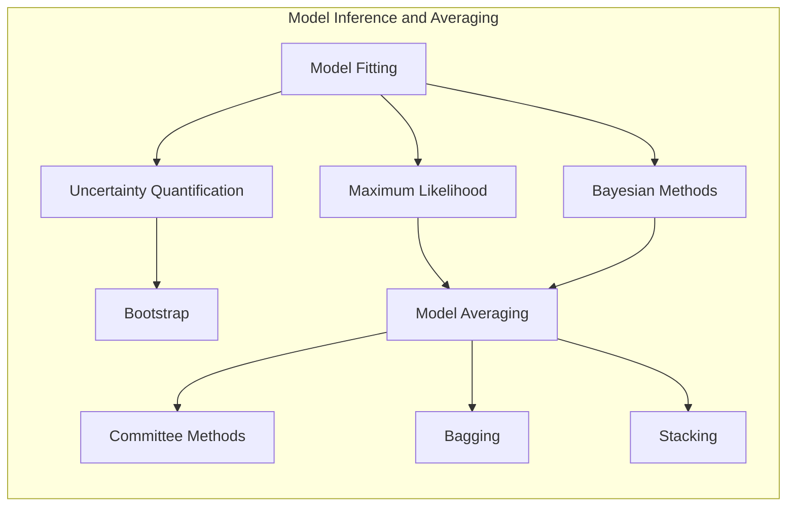
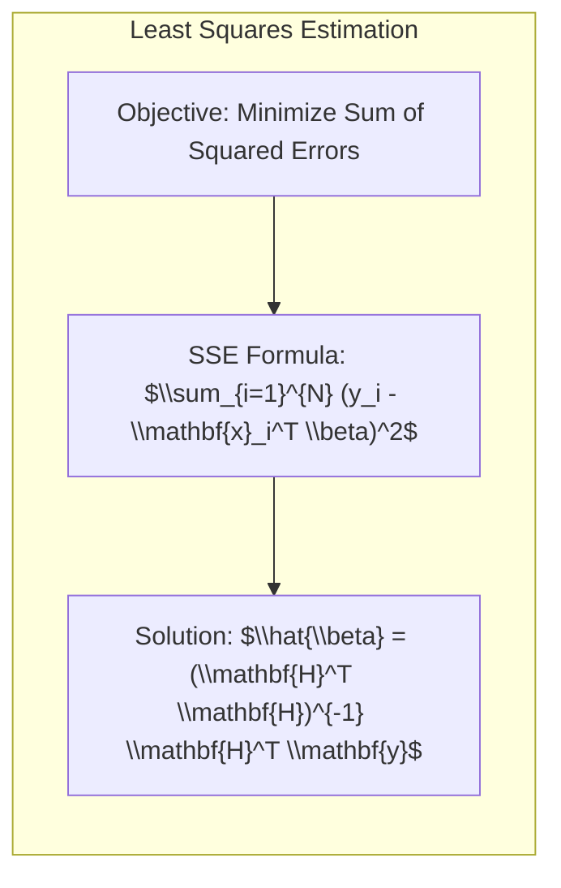
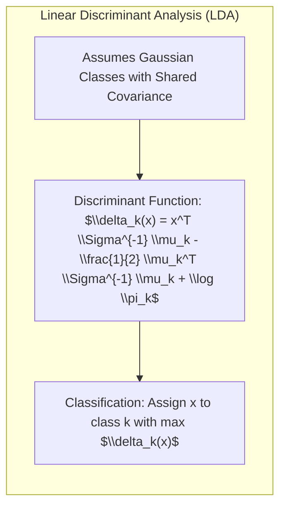
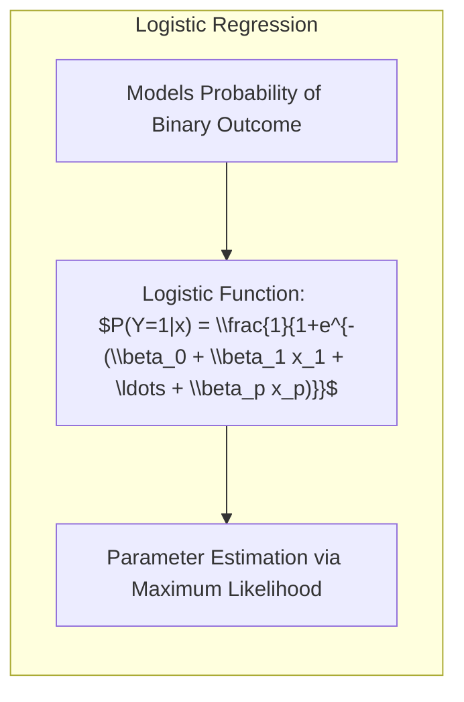
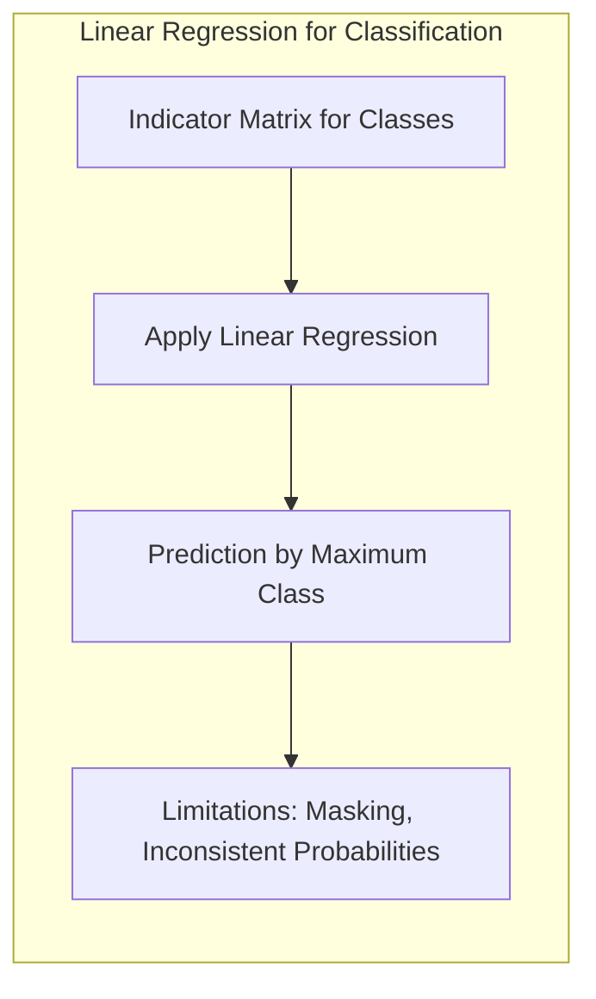
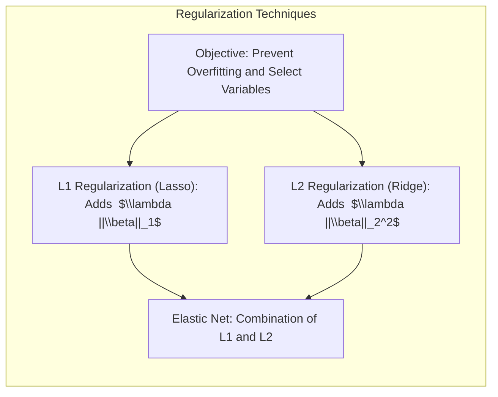
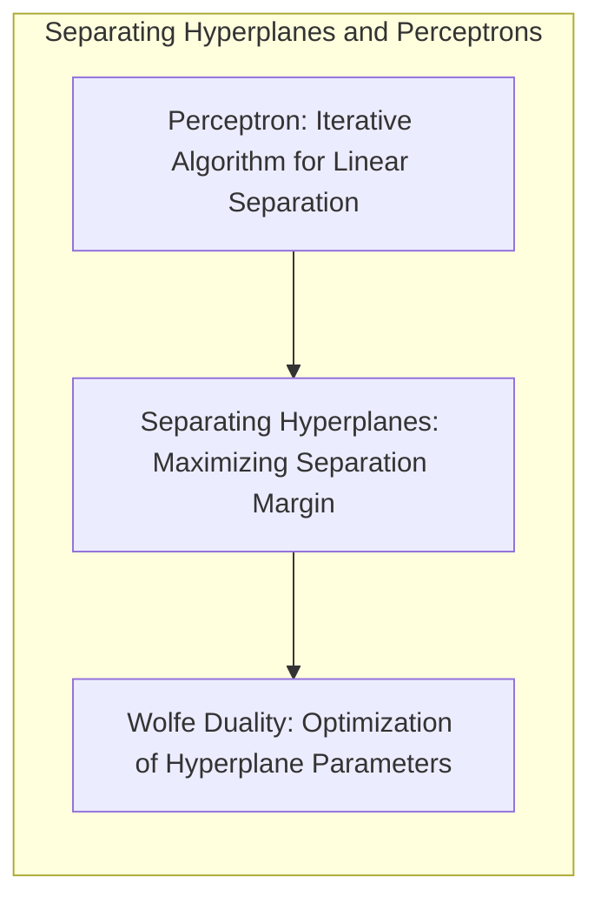
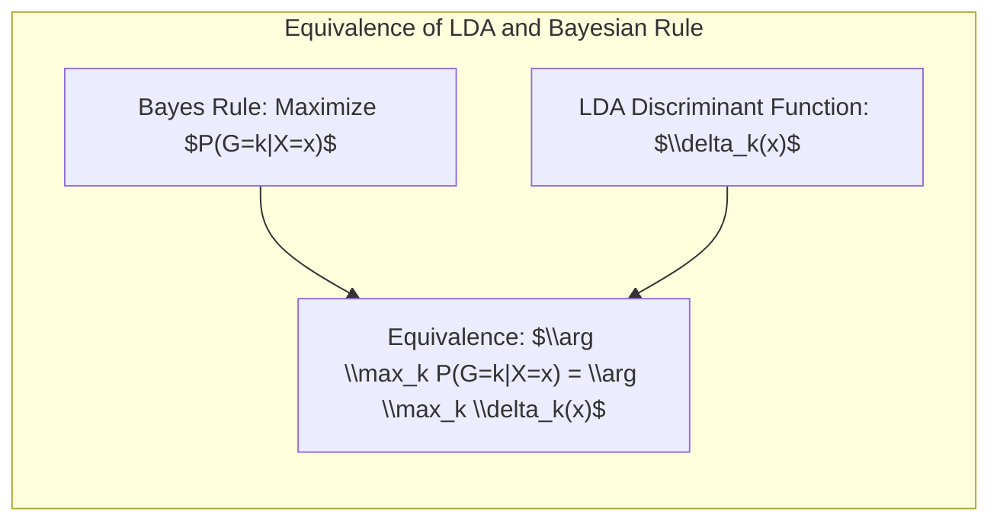

## Model Inference and Averaging: A Deep Dive into Standard Error Estimation and Model Improvement



### Introdução
A inferência e o averaging de modelos são cruciais no aprendizado estatístico, permitindo-nos não apenas ajustar modelos aos dados, mas também quantificar a incerteza associada a esses ajustes e melhorar a robustez das previsões [^8.1]. Tradicionalmente, o ajuste de modelos tem sido alcançado minimizando a soma dos quadrados para regressão ou a entropia cruzada para classificação. No entanto, essas minimizações são, na verdade, instâncias da abordagem de **maximum likelihood**. Este capítulo explora em profundidade a abordagem de maximum likelihood, o método Bayesiano para inferência, e o método **bootstrap** para avaliação da incerteza. Além disso, investigamos técnicas de model averaging e melhoria, como committee methods, bagging, stacking e bumping [^8.1].

### Conceitos Fundamentais

**Conceito 1: O Problema de Classificação e Regressão Linear**

O problema de classificação, como discutido em capítulos anteriores, envolve atribuir observações a categorias predefinidas. Em contraste, o problema de regressão busca modelar a relação entre variáveis de entrada e uma variável de saída contínua. Métodos lineares, como a regressão linear e a análise discriminante linear (LDA), fornecem soluções simples e computacionalmente eficientes para esses problemas. No entanto, a simplicidade desses modelos lineares pode introduzir viés (bias) se a verdadeira relação entre as variáveis for não-linear, e a variância das estimativas pode ser alta dependendo da natureza dos dados. Em [^8.1], é mencionado que a minimização de uma soma de quadrados para regressão e a minimização de entropia cruzada para classificação são instâncias da abordagem de maximum likelihood.

**Lemma 1: Estimativa de Coeficientes via Mínimos Quadrados**
Em um modelo de regressão linear, os coeficientes $\beta$ são geralmente estimados minimizando a soma dos erros quadráticos (least squares). Matematicamente, isso é expresso como:
$$ \hat{\beta} = \arg \min_{\beta} \sum_{i=1}^{N} (y_i - \mathbf{x}_i^T \beta)^2 $$
onde $y_i$ são os valores observados, $\mathbf{x}_i$ são os vetores de características correspondentes e $N$ é o número de observações. A solução para esse problema de minimização, utilizando a notação matricial, é dada por [^8.2]:
$$\hat{\beta} = (\mathbf{H}^T \mathbf{H})^{-1} \mathbf{H}^T \mathbf{y} $$
Onde $\mathbf{H}$ é a matriz design matrix onde cada linha corresponde a um vetor de caracteristicas $\mathbf{x}_i$ e $\mathbf{y}$ é o vetor de variáveis dependentes.
Este resultado é fundamental para a regressão linear e também tem implicações para outros métodos lineares como LDA.
$\blacksquare$



> 💡 **Exemplo Numérico:**
> Vamos considerar um conjunto de dados simples com 3 observações, onde temos uma variável preditora $x$ e uma variável de resposta $y$. Os dados são os seguintes:
>
> | $i$ | $x_i$ | $y_i$ |
> |-----|-------|-------|
> | 1   | 1     | 2     |
> | 2   | 2     | 4     |
> | 3   | 3     | 5     |
>
> Podemos construir a matriz design $\mathbf{H}$ adicionando uma coluna de 1s para o intercepto e o vetor $\mathbf{y}$:
>
> ```python
> import numpy as np
>
> H = np.array([[1, 1],
>               [1, 2],
>               [1, 3]])
>
> y = np.array([2, 4, 5])
> ```
>
> Agora podemos calcular $\hat{\beta}$ usando a fórmula de mínimos quadrados:
>
> $\text{Step 1: } \mathbf{H}^T \mathbf{H} = \begin{bmatrix} 1 & 1 & 1 \\ 1 & 2 & 3 \end{bmatrix} \begin{bmatrix} 1 & 1 \\ 1 & 2 \\ 1 & 3 \end{bmatrix} = \begin{bmatrix} 3 & 6 \\ 6 & 14 \end{bmatrix}$
>
> $\text{Step 2: } (\mathbf{H}^T \mathbf{H})^{-1} = \begin{bmatrix} 3 & 6 \\ 6 & 14 \end{bmatrix}^{-1} = \frac{1}{(3 \cdot 14 - 6 \cdot 6)} \begin{bmatrix} 14 & -6 \\ -6 & 3 \end{bmatrix} = \frac{1}{6} \begin{bmatrix} 14 & -6 \\ -6 & 3 \end{bmatrix} = \begin{bmatrix} 7/3 & -1 \\ -1 & 1/2 \end{bmatrix}$
>
> $\text{Step 3: } \mathbf{H}^T \mathbf{y} = \begin{bmatrix} 1 & 1 & 1 \\ 1 & 2 & 3 \end{bmatrix} \begin{bmatrix} 2 \\ 4 \\ 5 \end{bmatrix} = \begin{bmatrix} 11 \\ 25 \end{bmatrix}$
>
> $\text{Step 4: } \hat{\beta} = (\mathbf{H}^T \mathbf{H})^{-1} \mathbf{H}^T \mathbf{y} = \begin{bmatrix} 7/3 & -1 \\ -1 & 1/2 \end{bmatrix} \begin{bmatrix} 11 \\ 25 \end{bmatrix} = \begin{bmatrix} 77/3 - 25 \\ -11 + 25/2 \end{bmatrix} = \begin{bmatrix} 2/3 \\ 3.5 \end{bmatrix}$
>
> ```python
> import numpy as np
>
> H = np.array([[1, 1],
>               [1, 2],
>               [1, 3]])
>
> y = np.array([2, 4, 5])
>
> HT_H = np.dot(H.T, H)
> HT_H_inv = np.linalg.inv(HT_H)
> HT_y = np.dot(H.T, y)
> beta_hat = np.dot(HT_H_inv, HT_y)
>
> print(f"beta_hat: {beta_hat}")
> # Saída: beta_hat: [0.66666667 3.5       ]
> ```
>
> Portanto, a equação da reta ajustada é $\hat{y} = 2/3 + 3.5x$. O intercepto é aproximadamente 0.67 e a inclinação é 3.5. Esse exemplo ilustra como a fórmula de mínimos quadrados é aplicada para obter os coeficientes de um modelo de regressão linear.

**Conceito 2: Linear Discriminant Analysis (LDA)**

A Linear Discriminant Analysis (LDA) é um método de classificação que assume que as classes são normalmente distribuídas com médias e covariâncias diferentes. A LDA procura encontrar uma combinação linear de características que melhor separe as classes. No contexto de LDA, é frequentemente utilizada a notação de vetor $\mu$ para a média, $\Sigma$ para matriz de covariância. LDA assume que cada classe $k$ tem uma distribuição Gaussiana com uma média $\mu_k$ e uma matriz de covariância compartilhada $\Sigma$ [^8.3]. A função discriminante linear para um ponto $x$ é dada por:
$$ \delta_k(x) = x^T \Sigma^{-1} \mu_k - \frac{1}{2} \mu_k^T \Sigma^{-1} \mu_k + \log \pi_k $$
onde $\pi_k$ é a probabilidade *a priori* da classe $k$. A decisão de classificação é feita atribuindo $x$ à classe $k$ com o maior valor de $\delta_k(x)$. A suposição de normalidade e covariância compartilhada são importantes para entender as limitações da LDA em situações onde os dados violam essas suposições [^8.3.1, ^8.3.2, ^8.3.3].



> 💡 **Exemplo Numérico:**
> Suponha que temos duas classes, cada uma com distribuição normal e uma matriz de covariância compartilhada:
>
> Classe 1: $\mu_1 = \begin{bmatrix} 1 \\ 1 \end{bmatrix}$, Classe 2: $\mu_2 = \begin{bmatrix} 3 \\ 3 \end{bmatrix}$, $\Sigma = \begin{bmatrix} 1 & 0.5 \\ 0.5 & 1 \end{bmatrix}$, $\pi_1 = \pi_2 = 0.5$ (probabilidades a priori iguais)
>
> Queremos classificar um novo ponto $x = \begin{bmatrix} 2 \\ 2 \end{bmatrix}$.
>
> Primeiro, calculamos a inversa da matriz de covariância:
>
> $\text{Step 1: } \Sigma^{-1} = \frac{1}{(1*1 - 0.5*0.5)} \begin{bmatrix} 1 & -0.5 \\ -0.5 & 1 \end{bmatrix} = \frac{1}{0.75} \begin{bmatrix} 1 & -0.5 \\ -0.5 & 1 \end{bmatrix} = \begin{bmatrix} 4/3 & -2/3 \\ -2/3 & 4/3 \end{bmatrix}$
>
> Agora, calculamos as funções discriminantes para cada classe:
>
> $\text{Step 2: } \delta_1(x) = \begin{bmatrix} 2 & 2 \end{bmatrix} \begin{bmatrix} 4/3 & -2/3 \\ -2/3 & 4/3 \end{bmatrix} \begin{bmatrix} 1 \\ 1 \end{bmatrix} - \frac{1}{2} \begin{bmatrix} 1 & 1 \end{bmatrix} \begin{bmatrix} 4/3 & -2/3 \\ -2/3 & 4/3 \end{bmatrix} \begin{bmatrix} 1 \\ 1 \end{bmatrix} + \log(0.5)$
>
> $\delta_1(x) = \begin{bmatrix} 2 & 2 \end{bmatrix} \begin{bmatrix} 2/3 \\ 2/3 \end{bmatrix} - \frac{1}{2} \begin{bmatrix} 1 & 1 \end{bmatrix} \begin{bmatrix} 2/3 \\ 2/3 \end{bmatrix} + \log(0.5) = \frac{8}{3} - \frac{2}{3} + \log(0.5) = 2 + \log(0.5) \approx 2 - 0.693 = 1.307$
>
> $\text{Step 3: } \delta_2(x) = \begin{bmatrix} 2 & 2 \end{bmatrix} \begin{bmatrix} 4/3 & -2/3 \\ -2/3 & 4/3 \end{bmatrix} \begin{bmatrix} 3 \\ 3 \end{bmatrix} - \frac{1}{2} \begin{bmatrix} 3 & 3 \end{bmatrix} \begin{bmatrix} 4/3 & -2/3 \\ -2/3 & 4/3 \end{bmatrix} \begin{bmatrix} 3 \\ 3 \end{bmatrix} + \log(0.5)$
>
> $\delta_2(x) = \begin{bmatrix} 2 & 2 \end{bmatrix} \begin{bmatrix} 6 \\ 6 \end{bmatrix} - \frac{1}{2} \begin{bmatrix} 3 & 3 \end{bmatrix} \begin{bmatrix} 6 \\ 6 \end{bmatrix} + \log(0.5) = 24 - 18 + \log(0.5) = 6 + \log(0.5) \approx 6 - 0.693 = 5.307$
>
> Como $\delta_2(x) > \delta_1(x)$, o ponto $x$ seria classificado como pertencente à Classe 2.

**Corolário 1: Projeção em Subespaços**
A função discriminante linear da LDA pode ser vista como uma projeção dos dados em um subespaço de menor dimensão. Ao projetar os dados em um subespaço definido pela matriz de covariância inversa, a LDA maximiza a separabilidade das classes. Esta projeção resulta em uma simplificação computacional do problema e facilita a visualização dos dados em espaços de menor dimensão.
$\blacksquare$

**Conceito 3: Logistic Regression**

A **Logistic Regression** é um modelo de classificação que modela a probabilidade de um resultado binário (0 ou 1) através de uma função logística (sigmoid). Ao contrário da LDA, a Logistic Regression não assume normalidade nas variáveis preditoras. O modelo logístico usa a função logit para modelar a relação entre as variáveis preditoras e a probabilidade do resultado,  [^8.4, ^8.4.1, ^8.4.2, ^8.4.3]. A probabilidade de um resultado sendo 1 é dada por:
$$ P(Y=1|x) = \frac{1}{1+e^{-(\beta_0 + \beta_1 x_1 + \ldots + \beta_p x_p)}} $$
onde $\beta_0$ é o intercepto e $\beta_1, \ldots, \beta_p$ são os coeficientes correspondentes às variáveis preditoras. Os parâmetros são estimados utilizando o método de maximum likelihood, maximizando a log-verossimilhança dos dados observados [^8.4.4, ^8.4.5]. A relação com LDA reside no fato de que, em certas condições, ambas abordagens levam a fronteiras de decisão lineares. No entanto, a Logistic Regression oferece maior flexibilidade ao não exigir a suposição de normalidade dos dados [^8.5].



> 💡 **Exemplo Numérico:**
> Suponha que temos um modelo de regressão logística com um único preditor $x$:
> $P(Y=1|x) = \frac{1}{1+e^{-(1 + 2x)}}$.
>
> Queremos calcular a probabilidade de $Y=1$ quando $x=1$:
>
> $\text{Step 1: } P(Y=1|x=1) = \frac{1}{1+e^{-(1 + 2*1)}} = \frac{1}{1+e^{-3}}$
>
> $\text{Step 2: } P(Y=1|x=1) = \frac{1}{1 + 0.0498} = \frac{1}{1.0498} \approx 0.9525$
>
> Agora, para $x=-1$:
>
> $\text{Step 3: } P(Y=1|x=-1) = \frac{1}{1+e^{-(1 + 2*(-1))}} = \frac{1}{1+e^{1}}$
>
> $\text{Step 4: } P(Y=1|x=-1) = \frac{1}{1 + 2.718} = \frac{1}{3.718} \approx 0.2689$
>
> Este exemplo demonstra como a regressão logística modela a probabilidade de um evento (Y=1) em função de uma variável preditora (x), onde a probabilidade se aproxima de 1 para valores maiores de x e se aproxima de 0 para valores menores de x. Os coeficientes $\beta_0 = 1$ e $\beta_1 = 2$ influenciam a forma da curva logística.

> ⚠️ **Nota Importante:** A Logistic Regression é preferível à LDA quando as suposições de normalidade dos preditores não são atendidas, oferecendo estimativas de probabilidade mais estáveis [^8.4.1].
> ❗ **Ponto de Atenção:** Em conjuntos de dados desbalanceados, técnicas de regularização e ajuste de pesos são fundamentais para garantir um bom desempenho da Logistic Regression [^8.4.2].
> ✔️ **Destaque:** As estimativas dos parâmetros obtidas tanto por LDA quanto por regressão logística podem ser similares, especialmente quando as classes são bem separadas [^8.5].

### Regressão Linear e Mínimos Quadrados para Classificação


A regressão linear pode ser aplicada para classificação através da criação de uma matriz de indicadores para as classes [^8.2]. Cada coluna desta matriz representa uma classe, e cada linha um dado, com um "1" indicando a classe à qual o dado pertence. Após esta codificação, a regressão linear é realizada. As previsões são então obtidas pela regra da maior classe. No entanto, este método tem limitações em problemas de classificação com múltiplas classes, onde as previsões podem ser inconsistentes com as probabilidades teóricas.

A regressão de indicadores, embora simples, pode levar a problemas de mascaramento (*masking problem*) devido às correlações entre classes [^8.3]. Em certas situações, como problemas bem separados, a regressão de indicadores pode ser uma alternativa computacionalmente mais leve em comparação com métodos mais complexos como a LDA.

**Lemma 2: Equivalência sob Condições Específicas**
Em casos específicos, a regressão linear de indicadores, quando aplicada a problemas de classificação binária, gera uma fronteira de decisão similar à obtida com LDA, desde que as classes sejam bem separadas e as covariâncias sejam similares. Matematicamente, a fronteira de decisão da regressão linear pode ser expressa como:
$$x^T(\Sigma^{-1}(\mu_2-\mu_1)) = c$$
onde $c$ é uma constante. Este lemma ilustra uma equivalência entre regressão e discriminantes lineares, mas é importante notar que as suposições de LDA são muitas vezes violadas na prática.
$\blacksquare$

**Corolário 2: Limitações e Extrapolação**
Devido à natureza da regressão linear, as projeções podem extrapolar para valores fora do intervalo [0,1], resultando em previsões com pouca interpretabilidade como probabilidades. A regressão de indicadores é mais sensível a outliers e a dados ruidosos em comparação com modelos mais robustos, como a Logistic Regression [^8.4]. É crucial estar ciente dessas limitações ao aplicar regressão linear para tarefas de classificação.
$\blacksquare$

"Em alguns cenários, conforme apontado em [^8.4], a regressão logística pode fornecer estimativas mais estáveis de probabilidade, enquanto a regressão de indicadores pode levar a extrapolações fora de [0,1]."
"No entanto, há situações em que a regressão de indicadores, de acordo com [^8.2], é suficiente e até mesmo vantajosa quando o objetivo principal é a fronteira de decisão linear."

### Métodos de Seleção de Variáveis e Regularização em Classificação


Em problemas de classificação com muitas variáveis, é fundamental selecionar as variáveis mais relevantes para o modelo. A regularização, uma técnica para reduzir a complexidade do modelo e evitar o *overfitting*, é uma abordagem comum. A regularização L1 (Lasso) adiciona uma penalidade à soma dos valores absolutos dos coeficientes, tendendo a zerar os coeficientes de variáveis menos importantes, resultando em modelos esparsos [^8.4.4]. A regularização L2 (Ridge) penaliza a soma dos quadrados dos coeficientes, reduzindo o valor dos coeficientes sem necessariamente zerá-los, levando a modelos mais estáveis [^8.5].

A regularização é implementada adicionando um termo de penalização à função de custo. Para Logistic Regression, a função de custo regularizada pode ser expressa como:
$$ J(\beta) = - \frac{1}{N} \sum_{i=1}^{N} [y_i \log(p_i) + (1 - y_i) \log(1-p_i)] + \lambda ||\beta||_1 $$
para regularização L1, e
$$ J(\beta) = - \frac{1}{N} \sum_{i=1}^{N} [y_i \log(p_i) + (1 - y_i) \log(1-p_i)] + \lambda ||\beta||_2^2 $$
para regularização L2.

Onde $p_i$ é a probabilidade de cada observação $i$ ser classificada como positiva, e $\lambda$ é o parâmetro de regularização.

> 💡 **Exemplo Numérico:**
> Vamos considerar um problema de classificação binária com duas variáveis preditoras $x_1$ e $x_2$. Temos um modelo de regressão logística com a função de custo regularizada L1 (Lasso):
>
> $J(\beta) = - \frac{1}{N} \sum_{i=1}^{N} [y_i \log(p_i) + (1 - y_i) \log(1-p_i)] + \lambda (|\beta_1| + |\beta_2|)$
>
> Suponha que, sem regularização ($\lambda = 0$), obtivemos os coeficientes $\beta_0 = 0.5$, $\beta_1 = 2$, e $\beta_2 = -1.5$. Agora, aplicamos regularização L1 com $\lambda = 0.5$. A minimização de $J(\beta)$ com regularização L1 irá ajustar os coeficientes para reduzir a complexidade do modelo.
>
> Após a otimização com $\lambda=0.5$ (este processo é iterativo e envolve métodos numéricos), os coeficientes podem se tornar, por exemplo, $\beta_0 = 0.6$, $\beta_1 = 1.2$, e $\beta_2 = -0.2$. Note que o coeficiente $\beta_2$ se aproximou de zero.
>
> Se aumentarmos $\lambda$ para 1, a penalização será maior, e os coeficientes podem se tornar, por exemplo, $\beta_0 = 0.7$, $\beta_1 = 0.8$, e $\beta_2 = 0$. Com um $\lambda$ suficientemente grande, a regularização L1 pode zerar alguns coeficientes, como $\beta_2$ neste caso, o que leva a uma seleção de variáveis automática.
>
> Por outro lado, se usássemos regularização L2 (Ridge) com o mesmo $\lambda$, a penalidade seria $\lambda (\beta_1^2 + \beta_2^2)$. Com $\lambda = 0.5$, os coeficientes poderiam se tornar, por exemplo, $\beta_0 = 0.6$, $\beta_1 = 1.5$, e $\beta_2 = -1$. Os coeficientes reduzem seus valores absolutos, mas geralmente não são levados a zero.
>
> Esse exemplo ilustra como a regularização L1 tende a levar coeficientes a zero, resultando em esparsidade, enquanto a regularização L2 reduz a magnitude dos coeficientes sem necessariamente zerá-los.

**Lemma 3: Esparsidade com Penalização L1**
A penalização L1 força alguns coeficientes a zero, resultando em modelos esparsos. A natureza convexa da penalização L1 favorece soluções onde os parâmetros são agrupados em torno do valor zero, o que é essencial para seleção de variáveis [^8.4.4].
$\blacksquare$

**Prova do Lemma 3:**
A penalização L1 adiciona um termo proporcional à soma dos valores absolutos dos coeficientes. Quando o valor de um coeficiente atinge zero, ele permanece em zero durante a otimização, devido à presença do termo de valor absoluto. O problema é convexo e possui mínimo global. Este é um resultado da otimização convexa que é abordado em [^8.4.3]
$\blacksquare$

**Corolário 3: Interpretabilidade**
A esparsidade induzida pela regularização L1 melhora a interpretabilidade do modelo, já que apenas as variáveis mais relevantes são incluídas, simplificando a análise e compreensão dos resultados [^8.4.5].
$\blacksquare$

> ⚠️ **Ponto Crucial**: As regularizações L1 e L2 podem ser combinadas no *Elastic Net*, que combina as vantagens da esparsidade da L1 com a estabilidade da L2 [^8.5].

### Separating Hyperplanes e Perceptrons

O conceito de **separating hyperplanes** é fundamental na classificação linear. A ideia é encontrar um hiperplano que separe as classes de forma ótima, maximizando a margem de separação entre elas [^8.5.2]. Este problema pode ser formulado como um problema de otimização, onde o objetivo é encontrar os parâmetros do hiperplano que maximizam a distância entre as classes. Essa maximização da margem conduz à formulação dual de Wolfe, que oferece uma maneira eficiente de resolver o problema de otimização, utilizando combinações lineares dos pontos de suporte para definir a fronteira.

O **Perceptron**, um algoritmo simples de aprendizado linear, busca encontrar um hiperplano separador através de um processo iterativo. O Perceptron de Rosenblatt, embora tenha demonstrado sucesso em problemas de linearmente separáveis, tem suas limitações, especialmente quando os dados não são linearmente separáveis [^8.5.1]. A convergência do Perceptron sob condições específicas, como a separabilidade dos dados, pode ser provada matematicamente.



### Pergunta Teórica Avançada: Quais as diferenças fundamentais entre a formulação de LDA e a Regra de Decisão Bayesiana considerando distribuições Gaussianas com covariâncias iguais?

**Resposta:**
A LDA e a regra de decisão Bayesiana são abordagens relacionadas para classificação, especialmente quando lidamos com distribuições Gaussianas com covariâncias iguais. A regra de decisão Bayesiana, em sua forma mais geral, atribui uma observação $x$ à classe $k$ que maximiza a probabilidade *a posteriori* $P(G=k|X=x)$. Para distribuições Gaussianas com covariâncias iguais, essa probabilidade *a posteriori* é dada por:
$$P(G=k|X=x) = \frac{\pi_k \frac{1}{\sqrt{(2\pi)^p|\Sigma|}} \exp(-\frac{1}{2}(x-\mu_k)^T \Sigma^{-1} (x-\mu_k))}{\sum_{l=1}^K \pi_l \frac{1}{\sqrt{(2\pi)^p|\Sigma|}} \exp(-\frac{1}{2}(x-\mu_l)^T \Sigma^{-1} (x-\mu_l))}$$

onde $\pi_k$ é a probabilidade *a priori* da classe $k$, $\mu_k$ é o vetor de média da classe $k$, e $\Sigma$ é a matriz de covariância comum a todas as classes. Como o denominador é constante em relação a $k$, podemos obter a regra de decisão pela maximização do numerador, ou equivalentemente, maximizando o log do numerador. Esta maximização leva a função discriminante:
$$ \delta_k(x) = x^T \Sigma^{-1} \mu_k - \frac{1}{2} \mu_k^T \Sigma^{-1} \mu_k + \log \pi_k $$
Essa função discriminante é exatamente a mesma utilizada na LDA. Assim, sob a suposição de que as classes seguem distribuições Gaussianas com covariâncias iguais, a LDA e a regra de decisão Bayesiana levam ao mesmo procedimento de classificação [^8.3]. A diferença fundamental reside em como os parâmetros são estimados. A LDA estima os parâmetros por meio da máxima verossimilhança e a regra de decisão Bayesiana utiliza probabilidades *a priori* de cada classe e as distribuições de cada classe para atribuir probabilidades *a posteriori* a cada observação.

**Lemma 4: Equivalência Formal**
Formalmente, quando as classes seguem distribuições Gaussianas com covariâncias iguais, a função discriminante da LDA é equivalente à regra de decisão Bayesiana [^8.3, ^8.3.3, ^8.11]. Isso pode ser expresso matematicamente da seguinte forma:
$$ \arg \max_k P(G=k|X=x) = \arg \max_k \delta_k(x) $$
onde $P(G=k|X=x)$ é a probabilidade *a posteriori* da regra Bayesiana e $\delta_k(x)$ é a função discriminante da LDA.
$\blacksquare$



**Corolário 4: Fronteiras Quadráticas**
Ao relaxar a suposição de covariâncias iguais, a regra de decisão Bayesiana leva a fronteiras quadráticas entre as classes, resultando em **Quadratic Discriminant Analysis (QDA)** [^8.3]. A QDA permite maior flexibilidade na modelagem das classes, mas aumenta a complexidade do modelo e requer mais dados para estimar os parâmetros de cada classe.
$\blacksquare$

> ⚠️ **Ponto Crucial**: A escolha entre covariâncias iguais ou diferentes na LDA impacta diretamente o tipo de fronteira de decisão, com a covariância compartilhada levando a fronteiras lineares e covariâncias distintas resultando em fronteiras quadráticas [^8.3.1, ^8.12].

### Conclusão
Este capítulo abordou métodos estatísticos e de aprendizado de máquina para inferência de modelos, com ênfase em classificação e análise discriminante. Exploramos os conceitos de maximum likelihood, regressão linear de indicadores, LDA e Logistic Regression, além de métodos de regularização e seleção de variáveis. Aprofundamos o entendimento de separating hyperplanes e Perceptrons, e investigamos as conexões teóricas entre LDA e a regra de decisão Bayesiana. Ao final, apresentamos perguntas teóricas avançadas para consolidar o conhecimento e o entendimento da profundidade dos temas abordados.

<!-- END DOCUMENT -->

### Footnotes
[^8.1]: "For most of this book, the fitting (learning) of models has been achieved by minimizing a sum of squares for regression, or by minimizing cross-entropy for classification. In fact, both of these minimizations are instances of the maximum likelihood approach to fitting. In this chapter we provide a general exposition of the maximum likeli- hood approach, as well as the Bayesian method for inference. The boot- strap, introduced in Chapter 7, is discussed in this context, and its relation to maximum likelihood and Bayes is described. Finally, we present some related techniques for model averaging and improvement, including com- mittee methods, bagging, stacking and bumping." *(Trecho de Model Inference and Averaging)*
[^8.2]: "Denote the training data by Z = {z1,z2,...,zN}, with zi = (xi, yi), i = 1,2,..., N. Here xi is a one-dimensional input, and y₁ the outcome, either continuous or categorical. As an example, consider the N = 50 data points shown in the left panel of Figure 8.1. Suppose we decide to fit a cubic spline to the data, with three knots placed at the quartiles of the X values. This is a seven-dimensional lin- ear space of functions, and can be represented, for example, by a linear expansion of B-spline basis functions (see Section 5.9.2):...Let H be the N×7 matrix with ijth element hj(xi). The usual estimate of ß, obtained by minimizing the squared error over the training set, is given by β = (HTH)−1HTy." *(Trecho de Model Inference and Averaging)*
[^8.3]: "There is actually a close connection between the least squares estimates (8.2) and (8.3), the bootstrap, and maximum likelihood. Suppose we further assume that the model errors are Gaussian, Y = μ(X) + ε; ε~ N(0, σ²), μ(x) =∑j=17βjhj(x)." *(Trecho de Model Inference and Averaging)*
[^8.3.1]: "The corresponding fit (x) = ∑