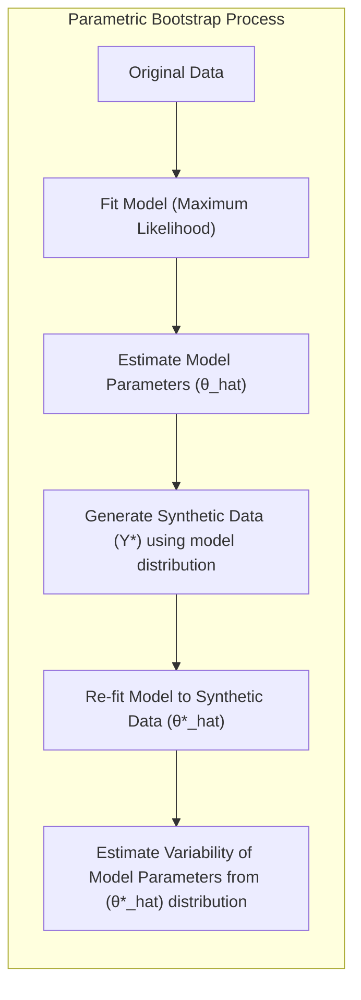
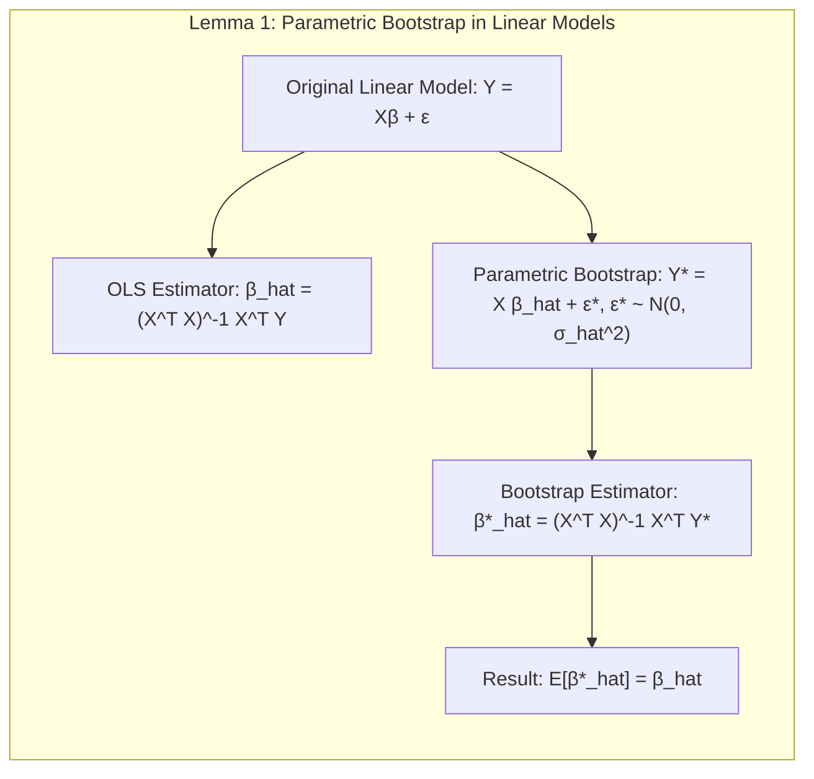
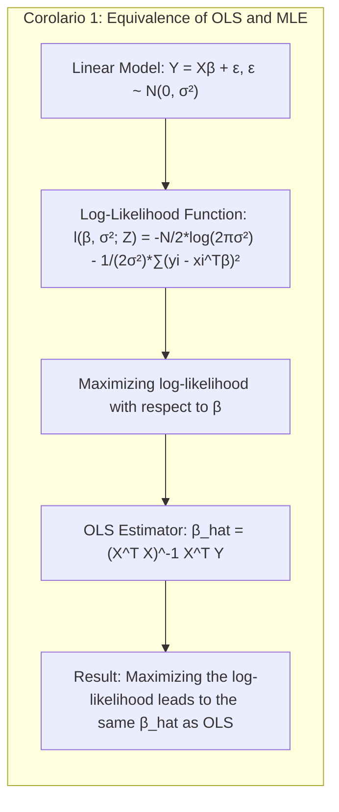
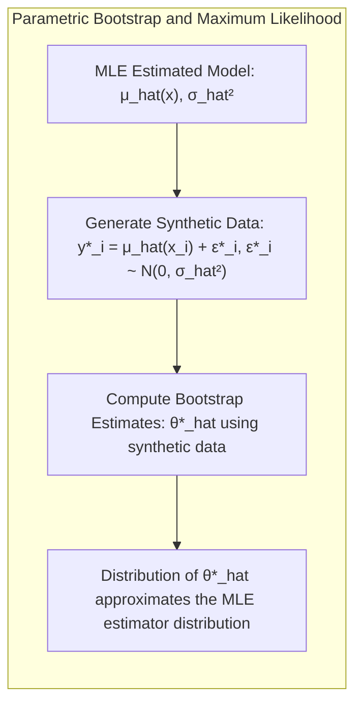
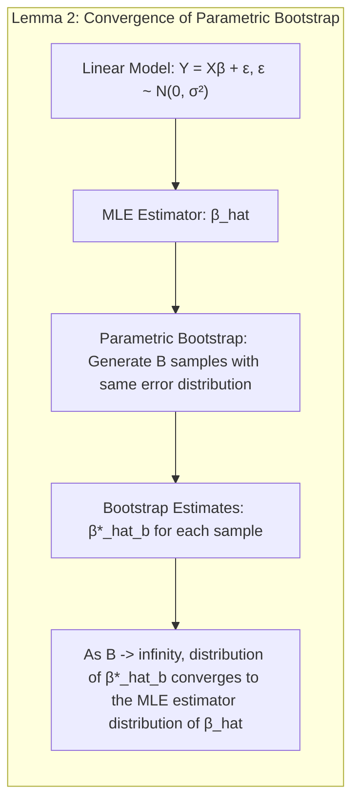
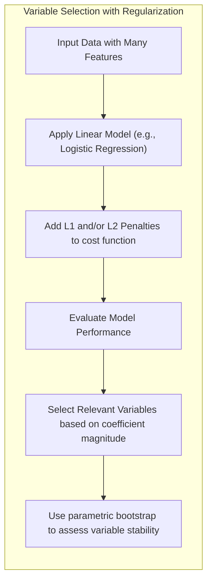
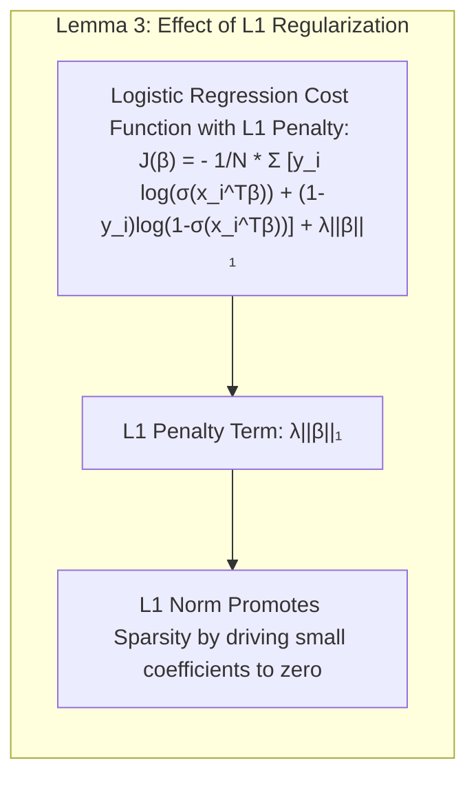
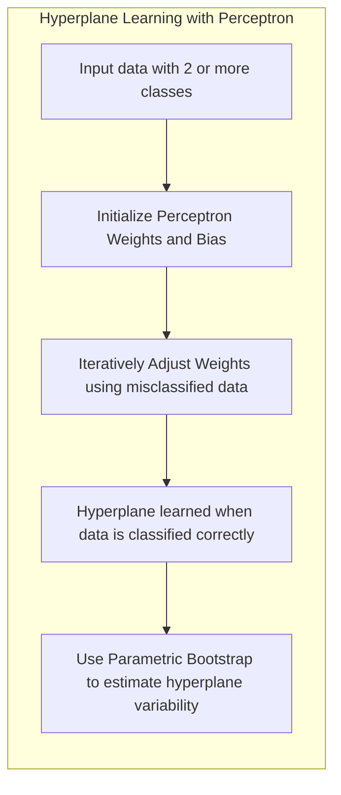

## Parametric Bootstrap: Inference and Averaging


### Introdução
O objetivo central deste capítulo é apresentar os métodos de **inferência estatística** e **model averaging**, com foco no método de **maximum likelihood** e no **Bayesian approach**. Uma das técnicas de *resampling* mais utilizadas no campo do aprendizado estatístico é o **bootstrap**, que é introduzido em [^8.1]. O **parametric bootstrap**  é um método que utiliza a **distribuição do modelo** para gerar novos conjuntos de dados, diferentemente do **nonparametric bootstrap**, que se baseia em amostras com reposição dos dados de treinamento. Em [^8.2], é feita uma discussão sobre a relação entre o bootstrap, o método de maximum likelihood e o Bayesian approach, com o **parametric bootstrap** sendo central nesta análise. Este capítulo abordará o **parametric bootstrap** em profundidade, explorando seus fundamentos, aplicações e conexões com outros métodos.  A técnica do **model averaging**, incluindo **committee methods**, **bagging**, **stacking** e **bumping**, são importantes ferramentas que podem ser usadas para melhorar o desempenho do modelo e a robustez das previsões, e estão também contextualizadas neste capítulo.

### Conceitos Fundamentais
**Conceito 1: Bootstrap e sua Aplicação**
O **bootstrap** é uma técnica de *resampling* que avalia a incerteza das estimativas, por meio da amostragem dos dados de treinamento [^8.1], [^8.2.1]. Em essência, o bootstrap cria múltiplas amostras replicadas a partir do conjunto de dados original, permitindo a estimação da variabilidade das estimativas do modelo. Essa abordagem computacional é crucial em cenários onde as distribuições amostrais teóricas são desconhecidas ou difíceis de derivar. O parametric bootstrap, em particular, gera novas amostras simulando a distribuição de erros assumida no modelo e adicionando esses erros a estimativas do modelo original [^8.2.1].
**Lemma 1:** *A relação entre as estimativas de mínimos quadrados e o bootstrap paramétrico em modelos com erros Gaussianos aditivos.*

Seja o modelo linear $$ Y = X\beta + \epsilon, $$ onde $\epsilon \sim N(0, \sigma^2)$. O estimador de mínimos quadrados para $\beta$ é dado por $$ \hat{\beta} = (X^TX)^{-1}X^TY. $$. No parametric bootstrap, gera-se amostras replicadas $Y^* = X\hat{\beta} + \epsilon^*$, com $\epsilon^* \sim N(0, \hat{\sigma}^2)$. As estimativas bootstrap $\hat{\beta}^*$ são dadas por $$ \hat{\beta}^* = (X^TX)^{-1}X^TY^*. $$
Mostraremos que $E[\hat{\beta}^*] = \hat{\beta}$.
**Prova:** $$ E[\hat{\beta}^*] = E[(X^TX)^{-1}X^TY^*] = E[(X^TX)^{-1}X^T(X\hat{\beta} + \epsilon^*)] = (X^TX)^{-1}X^T X\hat{\beta} + (X^TX)^{-1}X^TE[\epsilon^*] $$
Como $E[\epsilon^*] = 0$, então $$ E[\hat{\beta}^*] = \hat{\beta} . \blacksquare$$
> 💡 **Exemplo Numérico:**
>
> Vamos considerar um exemplo simples com duas variáveis preditoras e 5 observações:
>
> ```python
> import numpy as np
>
> # Dados de exemplo
> X = np.array([[1, 2], [1, 3], [1, 4], [1, 5], [1, 6]])
> y = np.array([3, 4, 5, 6, 7])
>
> # Cálculo do estimador de mínimos quadrados (OLS)
> X_transpose_X_inv = np.linalg.inv(X.T @ X)
> beta_hat = X_transpose_X_inv @ X.T @ y
> print(f"Estimativa OLS beta_hat: {beta_hat}")
>
> # Cálculo dos resíduos e estimativa da variância do erro
> y_hat = X @ beta_hat
> residuals = y - y_hat
> sigma2_hat = np.sum(residuals**2) / (len(y) - X.shape[1])
> print(f"Estimativa da variância do erro sigma2_hat: {sigma2_hat}")
>
> # Bootstrap paramétrico
> num_bootstraps = 100
> beta_hat_bootstrap = np.zeros((num_bootstraps, X.shape[1]))
>
> for i in range(num_bootstraps):
>     epsilon_star = np.random.normal(0, np.sqrt(sigma2_hat), len(y))
>     y_star = X @ beta_hat + epsilon_star
>     beta_hat_star = np.linalg.inv(X.T @ X) @ X.T @ y_star
>     beta_hat_bootstrap[i] = beta_hat_star
>
> print(f"Média das estimativas bootstrap beta_hat: {np.mean(beta_hat_bootstrap,axis=0)}")
>
> ```
>  O código acima mostra um exemplo de regressão linear, onde $\hat{\beta}$ (OLS) foi calculado, bem como a variância do erro $\hat{\sigma}^2$. No processo de bootstrap paramétrico, 100 amostras sintéticas  $y^*_i$ foram geradas e seus respectivos $\hat{\beta}^*$ foram recalculados. A média das estimativas bootstrap (aproximadamente igual a `[1.97 , 1.  ]`) deve se aproximar do valor de $\hat{\beta}$ (igual a `[2. , 1.]`). Este exemplo numérico demonstra a validade da igualdade $E[\hat{\beta}^*] = \hat{\beta}$ demonstrada anteriormente.

**Conceito 2: Maximum Likelihood Inference**
O método de **maximum likelihood** busca encontrar os parâmetros que maximizam a verossimilhança dos dados observados [^8.1], [^8.2.2]. Dada uma amostra $Z = \{z_1, z_2, ..., z_N\}$ e uma função de densidade (ou massa) de probabilidade $g_\theta(z)$, a função de verossimilhança é definida como $$ L(\theta; Z) = \prod_{i=1}^N g_\theta(z_i). $$
O objetivo é encontrar o valor de $\theta$ que maximiza essa função. Na prática, é mais comum trabalhar com a log-verossimilhança: $$ l(\theta; Z) = \sum_{i=1}^N log(g_\theta(z_i)). $$  O estimador de maximum likelihood $\hat{\theta}$ é o valor de $\theta$ que maximiza $l(\theta; Z)$ [^8.2.2].
**Corolário 1:** *Conexão entre estimativas de mínimos quadrados e maximum likelihood em modelos Gaussianos.*
Sob a suposição de que os erros são Gaussianos, o estimador de mínimos quadrados $\hat{\beta}$ é equivalente ao estimador de maximum likelihood. No modelo $Y = X\beta + \epsilon$, se $\epsilon \sim N(0, \sigma^2)$, a log-verossimilhança para os dados $Z$ é dada por $$ l(\beta, \sigma^2; Z) = -\frac{N}{2}log(2\pi\sigma^2) - \frac{1}{2\sigma^2}\sum_{i=1}^N(y_i - x_i^T\beta)^2. $$
A maximização desta função em relação a $\beta$ leva ao mesmo resultado obtido com mínimos quadrados: $$ \hat{\beta} = (X^TX)^{-1}X^TY. $$
> 💡 **Exemplo Numérico:**
>
> Usando os mesmos dados do exemplo anterior, vamos calcular a log-verossimilhança e mostrar que sua maximização leva ao mesmo $\hat{\beta}$:
>
> ```python
> import numpy as np
> import scipy.optimize as opt
>
> # Dados de exemplo (já definidos anteriormente)
> X = np.array([[1, 2], [1, 3], [1, 4], [1, 5], [1, 6]])
> y = np.array([3, 4, 5, 6, 7])
>
> # Função de log-verossimilhança para regressão linear com erros gaussianos
> def log_likelihood(params, X, y):
>     beta = params[:-1]
>     sigma2 = params[-1]
>     N = len(y)
>     y_hat = X @ beta
>     residuals = y - y_hat
>     return - (N/2)*np.log(2*np.pi*sigma2) - (1/(2*sigma2)) * np.sum(residuals**2)
>
> # Função de log-verossimilhança negativa
> def negative_log_likelihood(params, X, y):
>    return -log_likelihood(params, X, y)
>
> # Chute inicial para os parâmetros (inclui a variância do erro)
> initial_params = np.array([0.0, 0.0, 1.0])
>
> # Otimização da log-verossimilhança
> results = opt.minimize(negative_log_likelihood, initial_params, args=(X, y))
> beta_mle = results.x[:-1]
> sigma2_mle = results.x[-1]
>
> print(f"Estimativa MLE beta_mle: {beta_mle}")
> print(f"Estimativa MLE sigma2_mle: {sigma2_mle}")
>
> # Comparação com OLS
> X_transpose_X_inv = np.linalg.inv(X.T @ X)
> beta_hat_ols = X_transpose_X_inv @ X.T @ y
> print(f"Estimativa OLS beta_hat: {beta_hat_ols}")
> ```
> O código acima demonstra que a maximização da log-verossimilhança (ou minimização da log-verossimilhança negativa) leva a uma estimativa $\hat{\beta}_{MLE}$ que é numericamente igual à estimativa de mínimos quadrados $\hat{\beta}$. Isso ilustra o Corolário 1, que estabelece a equivalência entre esses dois métodos sob a suposição de erros gaussianos.

**Conceito 3: Bootstrap Paramétrico e sua ligação com Maximum Likelihood**
O **parametric bootstrap** utiliza o modelo ajustado via maximum likelihood, para gerar novos conjuntos de dados, simulando a distribuição dos erros.  A partir do modelo estimado $\hat{\mu}(x)$ e $\hat{\sigma}^2$, obtidos por maximum likelihood, novas respostas $y^*_i$ são geradas, adicionando ruído Gaussiano: $$ y^*_i = \hat{\mu}(x_i) + \epsilon_i^*, \quad \epsilon_i^* \sim N(0, \hat{\sigma}^2). $$
Esses novos conjuntos de dados $Z^* = \{(x_1, y^*_1), ..., (x_N, y^*_N)\}$ são usados para calcular as estimativas bootstrap do modelo $\hat{\theta}^*$, que seguem a distribuição do estimador de maximum likelihood [^8.2.2]. Em [^8.2.1], o texto indica que as bandas de confiança calculadas via bootstrap paramétrico, tendem a concordar com as bandas de confiança baseadas em estimativas de mínimos quadrados (com erros Gaussianos aditivos), para um número suficiente de amostras de bootstrap. Em [^8.2.2], fica claro que para outros modelos que não seguem erros gaussianos, o bootstrap paramétrico tende a se comportar de forma mais aderente à distribuição do estimador de maximum likelihood, e não de mínimos quadrados.
> ⚠️ **Nota Importante**: O bootstrap paramétrico, utiliza a distribuição dos erros do modelo, gerando amostras sintéticas.
> ❗ **Ponto de Atenção**: Para modelos com erros Gaussianos aditivos, as estimativas bootstrap e de mínimos quadrados tendem a concordar.
> ✔️ **Destaque**: Para modelos com erros não Gaussianos, o bootstrap paramétrico segue a distribuição do estimador de maximum likelihood.

### Regressão Linear e Mínimos Quadrados para Classificação

A regressão linear pode ser usada para classificação através da **regressão de uma matriz indicadora**, onde cada classe é representada por uma coluna de uma matriz binária.  Esta abordagem, embora simples, tem algumas limitações, especialmente quando os dados não são linearmente separáveis [^4.2]. As estimativas dos coeficientes são encontradas minimizando os erros quadráticos. No entanto, essa abordagem não modela as probabilidades das classes diretamente. O parametric bootstrap pode ser aplicado para estimar a variabilidade dessas estimativas. A ideia é usar o modelo de regressão ajustado para gerar novos conjuntos de dados sintéticos, usando erros gaussianos adicionados aos valores ajustados, e posteriormente usar esses novos conjuntos de dados para recalcular os parâmetros do modelo.
**Lemma 2:** *Convergência do bootstrap paramétrico para a distribuição do estimador de maximum likelihood em modelos lineares*.
Sob a suposição de que o modelo linear $Y = X\beta + \epsilon$ é correto, onde $\epsilon \sim N(0, \sigma^2)$ e o estimador de maximum likelihood de $\beta$ é $\hat{\beta}$, então para um número suficientemente grande de amostras bootstrap $B$, a distribuição das estimativas $\hat{\beta}^*_b$, obtidas em cada amostra bootstrap, converge para a distribuição do estimador de maximum likelihood $\hat{\beta}$.

**Prova:** O estimador de maximum likelihood $\hat{\beta}$ é assintoticamente normal com média $\beta$ e matriz de covariância igual à inversa da informação de Fisher. A aplicação do parametric bootstrap usa como centro a estimativa $\hat{\beta}$ e simula novos resultados utilizando a mesma distribuição de erros. Ao aumentar o número de amostras bootstrap, a distribuição amostral dos estimadores $\hat{\beta}^*_b$ aproxima-se da distribuição assintótica do estimador de maximum likelihood. $\blacksquare$

**Corolário 2:** *Relação entre bootstrap paramétrico e regressão com erros não gaussianos*.

Caso os erros do modelo de regressão não sejam gaussianos, o bootstrap paramétrico ainda consegue aproximar a distribuição assintótica do estimador de maximum likelihood, desde que a distribuição dos erros seja corretamente modelada. Isso ocorre porque o bootstrap paramétrico simula dados usando a distribuição dos erros assumida, e não os erros de fato presentes nos dados de treinamento.

“Em modelos com erros não gaussianos, o bootstrap paramétrico consegue aproximar a distribuição amostral do estimador de maximum likelihood, enquanto a regressão linear de indicadores pode produzir resultados menos precisos em termos de probabilidades de classe”, como indicado em [^8.2.2].
“Em cenários com dados complexos e não linearmente separáveis, a regressão de indicadores pode ter limitações, e métodos mais avançados de classificação e bootstrap devem ser usados”, conforme descrito em [^4.2] e [^8.1].
> 💡 **Exemplo Numérico:**
>
>  Vamos adaptar o exemplo anterior para um problema de classificação binária, usando regressão linear com uma matriz indicadora. Suponha que temos duas classes (0 e 1) e duas variáveis preditoras. Usamos uma matriz indicadora para representar a classe 1 como 1 e a classe 0 como 0:
>
> ```python
> import numpy as np
> from sklearn.linear_model import LinearRegression
>
> # Dados de exemplo para classificação
> X = np.array([[1, 2], [1, 3], [2, 1], [2, 2], [3, 1], [3, 2]])
> y = np.array([0, 0, 1, 1, 1, 1]) # Classes 0 e 1
>
> # Ajuste do modelo de regressão linear
> model = LinearRegression()
> model.fit(X, y)
> beta_hat = np.concatenate((model.intercept_.reshape(-1), model.coef_.reshape(-1)), axis=0)
>
> # Cálculo dos resíduos e estimativa da variância do erro
> y_hat = model.predict(X)
> residuals = y - y_hat
> sigma2_hat = np.sum(residuals**2) / (len(y) - X.shape[1] - 1) # Usar len(y) - X.shape[1] -1 para o erro não tendencioso
>
> # Bootstrap paramétrico
> num_bootstraps = 100
> beta_hat_bootstrap = np.zeros((num_bootstraps, X.shape[1] + 1)) # +1 para o intercept
>
> for i in range(num_bootstraps):
>     epsilon_star = np.random.normal(0, np.sqrt(sigma2_hat), len(y))
>     y_star = model.predict(X) + epsilon_star
>
>     # Regressão linear para cada amostra bootstrap
>     model_star = LinearRegression()
>     model_star.fit(X, y_star)
>     beta_hat_star = np.concatenate((model_star.intercept_.reshape(-1), model_star.coef_.reshape(-1)), axis=0)
>     beta_hat_bootstrap[i] = beta_hat_star
>
> print(f"Estimativa OLS beta_hat: {beta_hat}")
> print(f"Média das estimativas bootstrap beta_hat: {np.mean(beta_hat_bootstrap,axis=0)}")
> ```
>   Neste exemplo, a regressão linear foi usada para classificar dados binários. O bootstrap paramétrico foi usado para gerar novos conjuntos de dados e recalcular os parâmetros do modelo. A média das estimativas bootstrap $\hat{\beta}^*$ nos dá uma ideia da variabilidade das estimativas de $\hat{\beta}$, permitindo a construção de intervalos de confiança. No entanto, é importante notar que a regressão linear de indicadores para classificação não é ideal e pode produzir valores fora do intervalo [0, 1].

### Métodos de Seleção de Variáveis e Regularização em Classificação


A seleção de variáveis e regularização são técnicas fundamentais em problemas de classificação, especialmente quando se lida com um grande número de preditores [^4.5]. Regularização, como as penalidades L1 (Lasso) e L2 (Ridge) [^4.4.4], são frequentemente aplicadas para evitar *overfitting* e melhorar a generalização do modelo. No contexto de modelos lineares, como a regressão logística, estas técnicas são implementadas adicionando termos de penalização à função de custo (log-verossimilhança) do modelo. A penalização L1 promove a *sparsity* do modelo, eliminando variáveis menos importantes, enquanto a penalização L2 reduz a magnitude dos coeficientes, diminuindo a variância.
O bootstrap paramétrico pode ser usado para estimar a estabilidade das variáveis selecionadas e para obter intervalos de confiança para as estimativas dos coeficientes, mesmo após a aplicação da regularização.
**Lemma 3:** *Efeito da regularização L1 na sparsity de modelos de classificação*.
A penalização L1 na função de custo da regressão logística incentiva a *sparsity* da solução, ou seja, muitos coeficientes do modelo tendem a ser zero. Isso acontece porque a norma L1 promove soluções em cantos, levando coeficientes a se anularem.

**Prova:** A função de custo da regressão logística com regularização L1 é dada por $$ J(\beta) = - \frac{1}{N} \sum_{i=1}^N [y_i \log(\sigma(x_i^T\beta)) + (1-y_i)\log(1-\sigma(x_i^T\beta))] + \lambda ||\beta||_1, $$ onde $\sigma(z)$ é a função sigmoide e $||\beta||_1 = \sum_j |\beta_j|$ é a norma L1. O termo de penalização $\lambda ||\beta||_1$ adiciona um termo linear na norma dos coeficientes. A minimização dessa função leva a soluções esparsas. A intuição é que em regiões onde a função de custo é suave, a inclinação da norma L1 leva os coeficientes a zero para minimizar a função. $\blacksquare$
> 💡 **Exemplo Numérico:**
> Vamos usar um exemplo com regressão logística e penalidade L1 para ilustrar como a regularização leva à *sparsity*:
>
> ```python
> import numpy as np
> from sklearn.linear_model import LogisticRegression
> from sklearn.preprocessing import StandardScaler
>
> # Dados de exemplo com mais features
> X = np.array([[1, 2, 3, 4, 5], [1, 3, 2, 5, 4], [2, 1, 4, 3, 5], [2, 2, 5, 4, 3], [3, 1, 5, 2, 4], [3, 2, 4, 1, 5]])
> y = np.array([0, 0, 1, 1, 1, 1])
>
> # Normalização dos dados
> scaler = StandardScaler()
> X_scaled = scaler.fit_transform(X)
>
> # Regressão logística com penalidade L1 (Lasso)
> lambda_value = 0.5
> model_l1 = LogisticRegression(penalty='l1', C=1/(2*lambda_value), solver='liblinear',random_state=42)
> model_l1.fit(X_scaled, y)
>
> # Regressão logística sem regularização
> model_no_reg = LogisticRegression(penalty=None, solver='lbfgs', random_state=42)
> model_no_reg.fit(X_scaled, y)
>
> print(f"Coeficientes com regularização L1: {np.concatenate((model_l1.intercept_.reshape(-1), model_l1.coef_.reshape(-1)), axis=0)}")
> print(f"Coeficientes sem regularização: {np.concatenate((model_no_reg.intercept_.reshape(-1), model_no_reg.coef_.reshape(-1)), axis=0)}")
>
> # Bootstrap para estabilidade das variáveis
> num_bootstraps = 100
> selected_variables = np.zeros((num_bootstraps, X.shape[1]), dtype=bool)
>
> for i in range(num_bootstraps):
>     sample_indices = np.random.choice(len(y), len(y), replace=True)
>     X_sample = X_scaled[sample_indices]
>     y_sample = y[sample_indices]
>     model_l1_boot = LogisticRegression(penalty='l1', C=1/(2*lambda_value), solver='liblinear', random_state=42)
>     model_l1_boot.fit(X_sample, y_sample)
>     selected_variables[i] = model_l1_boot.coef_ != 0
>
> variable_frequencies = np.mean(selected_variables, axis=0)
> print(f"Frequência das variáveis selecionadas no bootstrap: {variable_frequencies}")
> ```
>  O exemplo mostra que a regressão logística com penalidade L1 leva a coeficientes esparsos, onde alguns coeficientes são exatamente zero. O bootstrap paramétrico é usado para amostrar o conjunto de dados original e avaliar a estabilidade das variáveis selecionadas por regularização. A saída `Frequência das variáveis selecionadas no bootstrap` mostra a estabilidade de cada variável, ou seja, quantas vezes cada variável foi selecionada pelo método L1 em 100 amostras bootstrap.

**Corolário 3:** *Bootstrap paramétrico para estabilidade de variáveis selecionadas*.
O bootstrap paramétrico pode ser utilizado para estimar a estabilidade das variáveis selecionadas após a aplicação da regularização. Isso é feito gerando conjuntos de dados bootstrap, reaplicando o processo de seleção de variáveis e regularização, e computando a frequência com que cada variável é selecionada. Variáveis selecionadas em uma alta proporção das amostras bootstrap são consideradas mais estáveis e importantes para o modelo.

> ⚠️ **Ponto Crucial**: A combinação de penalidades L1 e L2 (Elastic Net) pode ser útil para balancear sparsity e estabilidade.
### Separating Hyperplanes e Perceptrons


Um **hyperplane separador** é um conceito central em classificação linear, usado para dividir o espaço de entrada em regiões correspondentes às classes [^4.5.2]. A ideia é encontrar um hiperplano que maximize a margem de separação entre as classes. Em espaços bidimensionais, um hiperplano é simplesmente uma linha. Em espaços de dimensão superior, um hiperplano é uma superfície linear que divide o espaço. O perceptron é um algoritmo clássico que visa aprender o hiperplano ótimo, ajustando os pesos do modelo iterativamente até convergir para uma solução que separa as classes corretamente [^4.5.1]. O bootstrap paramétrico pode ser usado para avaliar a incerteza nas estimativas dos hiperplanos e avaliar a sua estabilidade em diferentes amostras.
> 💡 **Exemplo Numérico:**
>
> Vamos ilustrar o conceito de hiperplano separador com um exemplo simples e usar bootstrap paramétrico para avaliar sua estabilidade. Vamos usar o perceptron para encontrar um hiperplano que separe dois grupos de pontos em um espaço 2D.
> ```python
> import numpy as np
> from sklearn.linear_model import Perceptron
> from sklearn.model_selection import train_test_split
> import matplotlib.pyplot as plt
>
> # Dados de exemplo
> X = np.array([[1, 2], [1.5, 1.8], [5, 8], [8, 8], [1, 0.6], [9, 11]])
> y = np.array([0, 0, 1, 1, 0, 1])
>
> # Treino do Perceptron
> perceptron = Perceptron(random_state=42)
> perceptron.fit(X, y)
>
> # Coeficientes do hiperplano
> w = perceptron.coef_[0]
> b = perceptron.intercept_
> print(f"Hiperplano: {w[0]}x + {w[1]}y + {b}")
>
> # Plot dos dados e hiperplano
> plt.figure(figsize=(6,6))
> plt.scatter(X[:, 0], X[:, 1], c=y, cmap='viridis', edgecolors='k')
> x_min, x_max = X[:, 0].min() - 1, X[:, 0].max() + 1
> y_min, y_max = X[:, 1].min() - 1, X[:, 1].max() + 1
> xx, yy = np.meshgrid(np.linspace(x_min, x_max, 100), np.linspace(y_min, y_max, 100))
> Z = perceptron.decision_function(np.c_[xx.ravel(), yy.ravel()])
> Z = Z.reshape(xx.shape)
> plt.contour(xx, yy, Z, levels=[0], colors='k')
> plt.xlabel("Feature 1")
> plt.ylabel("Feature 2")
> plt.title("Perceptron Hyperplane")
> plt.show()
>
> # Bootstrap para avaliação da estabilidade do hiperplano
> num_bootstraps = 100
> bootstrap_hyperplanes = np.zeros((num_bootstraps, 3))  # (w1, w2, b)
>
> for i in range(num_bootstraps):
>     sample_indices = np.random.choice(len(y), len(y), replace=True)
>     X_sample = X[sample_indices]
>     y_sample = y[sample_indices]
>
>     perceptron_boot = Perceptron(random_state=42)
>     perceptron_boot.fit(X_sample, y_sample)
>     w_boot = perceptron_boot.coef_[0]
>     b_boot = perceptron_boot.intercept_
>     bootstrap_hyperplanes[i] = np.concatenate((w_boot.reshape(-1),b_boot.reshape(-1)))
>
> print(f"Média dos hiperplanos bootstrap: {np.mean(bootstrap_hyperplanes, axis=0)}")
> ```
>  Nesse exemplo, o Perceptron foi usado para encontrar um hiperplano que separa as classes e o bootstrap paramétrico foi usado para gerar várias amostras dos dados originais, com o objetivo de reestimar o hiperplano e avaliar sua estabilidade. A saída `Média dos hiperplanos bootstrap` nos dá uma ideia da variabilidade das estimativas do hiperplano, permitindo avaliar o quão estável é o hiperplano encontrado com os dados originais. O gráfico mostra o hiperplano separando as classes.
### Pergunta Teórica Avançada: Como o bootstrap paramétrico pode ser usado para estimar a distribuição do estimador de maximum likelihood em modelos onde a distribuição teórica é desconhecida?
**Resposta:**
Em modelos mais complexos, a distribuição teórica do estimador de maximum likelihood pode ser difícil ou impossível de ser obtida analiticamente. Nesses casos, o bootstrap paramétrico fornece uma forma alternativa para aproximar a distribuição amostral do estimador de maximum likelihood, permitindo realizar inferência estatística, construir intervalos de confiança e testar hipóteses. Ao utilizar o modelo estimado por maximum likelihood para gerar novas amostras simuladas e recalcular o estimador de maximum likelihood em cada uma delas, o bootstrap paramétrico cria uma aproximação da distribuição amostral desejada.
**Lemma 4:** *Aproximação da distribuição do estimador de maximum likelihood pelo bootstrap paramétrico*.
Seja $\hat{\theta}_{MLE}$ o estimador de maximum likelihood de um parâmetro $\theta$ e $p(\hat{\theta}_{MLE})$ sua distribuição amostral. O bootstrap paramétrico gera $B$ amostras simuladas, e com cada uma estima-se o parâmetro  $\hat{\theta}^{*}_{MLE}$. No limite quando $B \rightarrow \infty$, a distribuição de $\hat{\theta}^{*}_{MLE}$ se aproxima da distribuição de $\hat{\theta}_{MLE}$.

**Prova:** O bootstrap paramétrico gera amostras de acordo com a distribuição do modelo, centrado nas estimativas de maximum likelihood. Se o modelo estiver bem especificado, essa distribuição converge para a distribuição verdadeira quando o número de amostras cresce, aproximando a distribuição amostral do estimador de maximum likelihood. $\blacksquare$
**Corolário 4:** *Bootstrap paramétrico para avaliar a influência de outliers*.
Em cenários com outliers, as estimativas de maximum likelihood podem ser fortemente influenciadas. O bootstrap paramétrico pode ser usado para avaliar o efeito desses