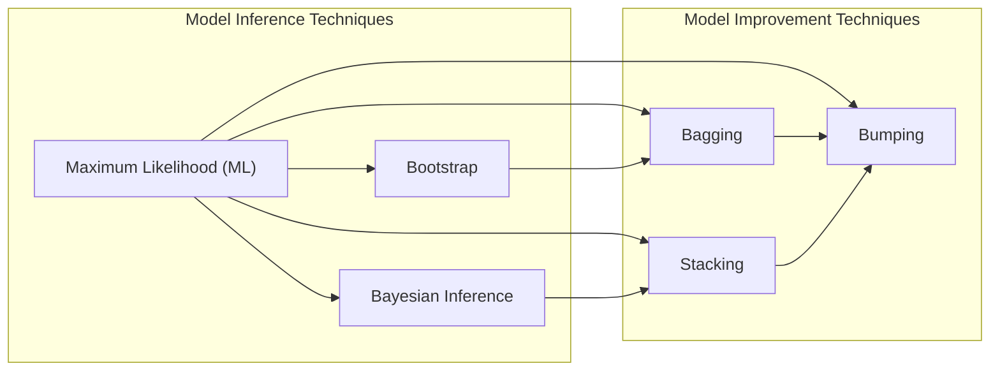
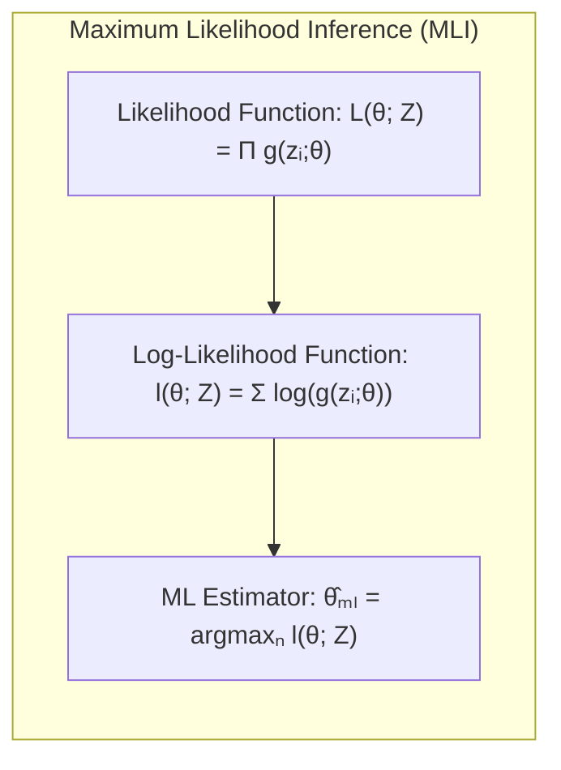
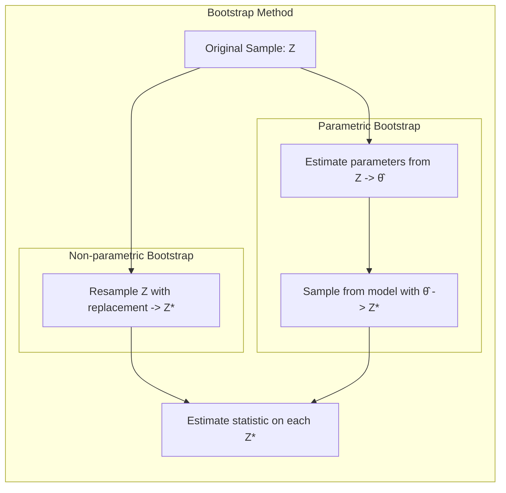
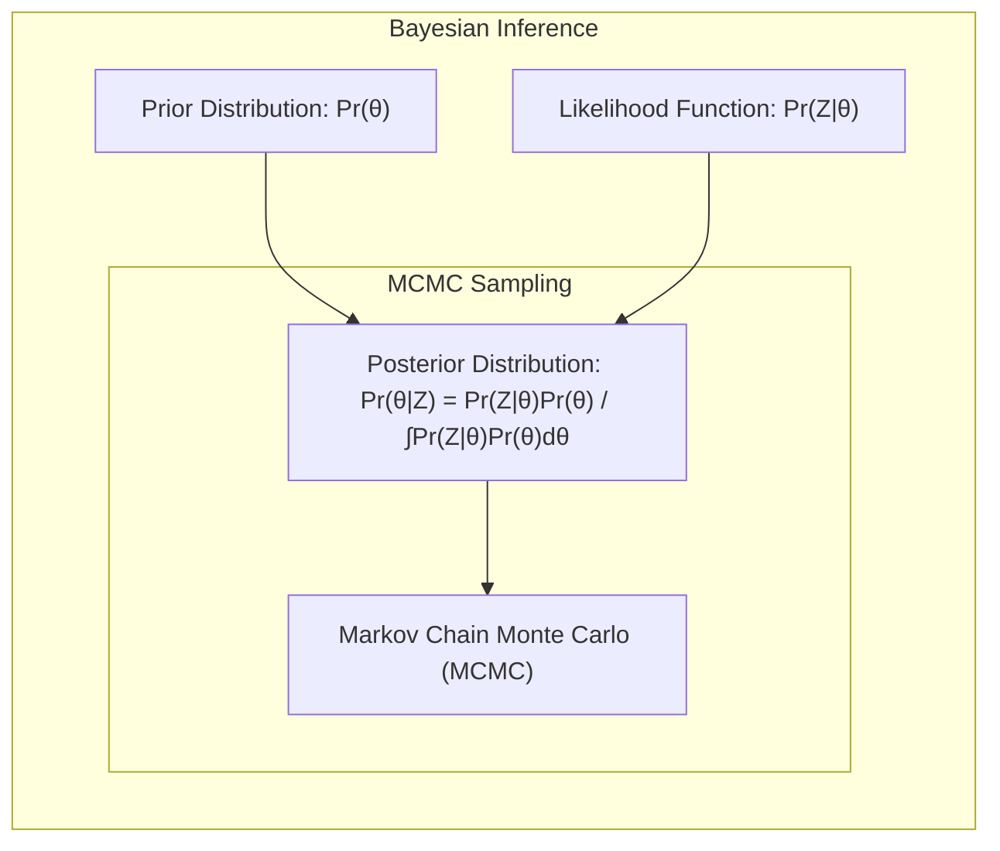
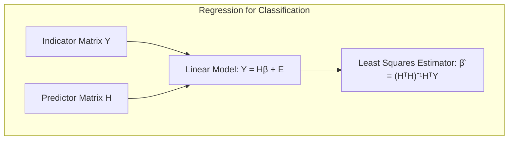
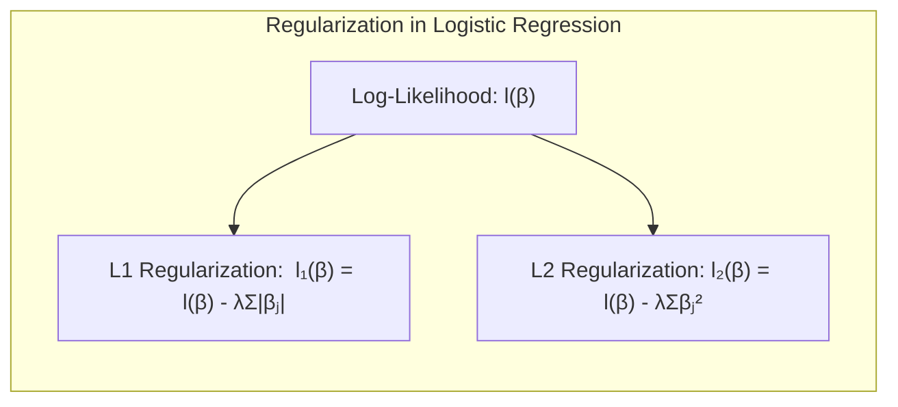
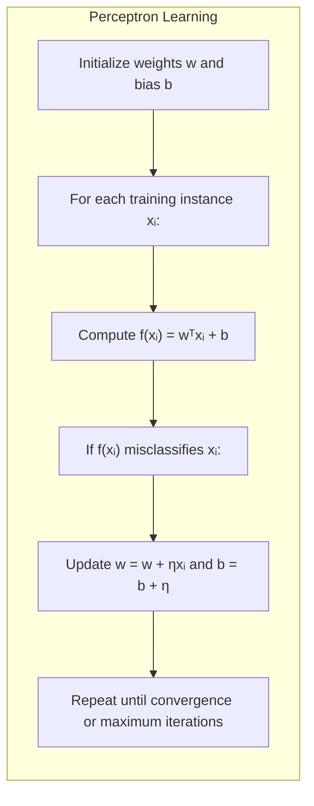

## Model Inference and Averaging: A Deep Dive into Maximum Likelihood and Beyond

### Introdução
Neste capítulo, exploraremos o conceito de **Log Likelihood**, um alicerce para a inferência estatística e a aprendizagem de modelos [^8.1]. A adaptação de modelos, seja por meio da minimização da soma de quadrados para regressão ou da minimização da entropia cruzada para classificação, pode ser vista, em última análise, como casos da abordagem de **Maximum Likelihood (ML)** [^8.1].  A inferência estatística, tanto na perspectiva frequentista quanto na Bayesiana, busca, a partir dos dados observados, inferir os parâmetros de um modelo, e o Log Likelihood é a função central para esse objetivo. Exploraremos os métodos de ML e Bayes, a técnica de **Bootstrap** para avaliação da incerteza e técnicas de aprimoramento de modelos como **Bagging, Stacking e Bumping**.

### Conceitos Fundamentais
#### Conceito 1:  Maximum Likelihood
A **Maximum Likelihood Inference (MLI)** é uma metodologia para estimar os parâmetros de um modelo estatístico, maximizando a função de verossimilhança (likelihood). A função de verossimilhança, denotada por $L(\theta; Z)$, quantifica a probabilidade dos dados observados $Z$ dado um conjunto de parâmetros $\theta$. Matematicamente, a ideia é encontrar os valores de $\theta$ que tornam os dados observados mais prováveis sob o modelo especificado [^8.2.2].
$$
L(\theta; Z) = \prod_{i=1}^{N} g_\theta(z_i),
$$
onde $g_\theta(z_i)$ representa a função de densidade ou massa de probabilidade da observação $z_i$ dado o parâmetro $\theta$. Para fins práticos, o **log-likelihood**, $l(\theta; Z)$, é usualmente utilizado por ser mais fácil de manipular. Ele é definido como o logaritmo da função de verossimilhança:
$$
l(\theta; Z) = \sum_{i=1}^{N} \log g_\theta(z_i).
$$
O estimador de máxima verossimilhança, $\hat{\theta}_{ML}$, é aquele que maximiza $l(\theta; Z)$:
$$
\hat{\theta}_{ML} = \underset{\theta}{\text{argmax}} \, l(\theta; Z).
$$
A abordagem de ML é fundamental para muitos modelos estatísticos, porque ela fornece um critério objetivo para ajustar os modelos aos dados.

> 💡 **Exemplo Numérico:** Suponha que temos um conjunto de dados de 5 lançamentos de uma moeda, onde observamos 3 caras (C) e 2 coroas (K). Assumimos que a probabilidade de obter cara é $\theta$. A função de verossimilhança é $L(\theta; Z) = \theta^3(1-\theta)^2$. Para calcular o log-likelihood, temos $l(\theta; Z) = 3\log(\theta) + 2\log(1-\theta)$. Para encontrar $\hat{\theta}_{ML}$, derivamos $l(\theta; Z)$ com relação a $\theta$ e igualamos a zero:
>
> $\frac{dl}{d\theta} = \frac{3}{\theta} - \frac{2}{1-\theta} = 0$
>
> Resolvendo para $\theta$, temos:
>
> $3(1-\theta) = 2\theta$
>
> $3 - 3\theta = 2\theta$
>
> $3 = 5\theta$
>
> $\hat{\theta}_{ML} = \frac{3}{5} = 0.6$
>
> Isso significa que, segundo a máxima verossimilhança, a estimativa da probabilidade de sair cara é 0.6.

**Lemma 1:** *Sob certas condições de regularidade*, o estimador de máxima verossimilhança é consistente, assintoticamente normal e assintoticamente eficiente.
*Prova:* A prova desse resultado envolve uma expansão de Taylor da função de log-verossimilhança em torno do verdadeiro valor do parâmetro e a aplicação do teorema central do limite. As condições de regularidade garantem a existência e unicidade do máximo, bem como a validade das expansões de Taylor e dos argumentos assintóticos [^8.2.2]. $\blacksquare$

#### Conceito 2:  Bootstrap
O método de **Bootstrap** é uma técnica de reamostragem que permite estimar a distribuição amostral de um estimador estatístico através da geração de múltiplos conjuntos de dados a partir da amostra original [^8.2.1]. Ao contrário dos métodos que se baseiam em premissas teóricas, o bootstrap utiliza a amostra observada como uma "população" substituta e simula novos conjuntos de dados a partir dela. Existem duas variantes principais: o *bootstrap não paramétrico*, onde os dados são amostrados com reposição da amostra original, e o *bootstrap paramétrico*, onde as amostras são geradas a partir de um modelo paramétrico, cujos parâmetros são estimados a partir da amostra original [^8.2.1]. O Bootstrap é útil para estimar intervalos de confiança e erros padrão, especialmente em situações onde as suposições teóricas não são válidas. No contexto da função de Log Likelihood, o bootstrap permite avaliar a incerteza associada aos parâmetros estimados através da construção de amostras bootstrap e estimação da distribuição da função de Log Likelihood [^8.2.1].

> 💡 **Exemplo Numérico:** Considere o mesmo exemplo da moeda com 5 lançamentos (3 caras e 2 coroas). Para realizar um bootstrap não paramétrico, reamostramos com reposição essa amostra original várias vezes (e.g., 1000 vezes), cada vez criando uma nova amostra de tamanho 5. Para cada amostra bootstrap, recalculamos o estimador $\hat{\theta}_{ML}$ (a proporção de caras). A distribuição dos 1000 valores de $\hat{\theta}_{ML}$ será nossa estimativa da distribuição amostral do estimador. Por exemplo, se uma amostra bootstrap fosse [C, C, K, K, C], $\hat{\theta}_{ML}$ seria 3/5 = 0.6. Se outra fosse [C, K, K, K, K], seria 1/5 = 0.2. Após as 1000 amostras, poderíamos calcular o erro padrão e o intervalo de confiança de $\hat{\theta}_{ML}$.

**Corolário 1:** A distribuição do estimador de máxima verossimilhança pode ser aproximada pela distribuição amostral obtida através de bootstrap.
*Prova:* Através do processo de reamostragem do bootstrap, onde cada amostra bootstrap é utilizada para recalcular o estimador, geramos uma distribuição empírica do estimador. Essa distribuição empírica é utilizada para aproximar a distribuição amostral do estimador original, e pode ser usada para construir intervalos de confiança ou avaliar outras propriedades estatísticas [^8.2.1]. $\blacksquare$

#### Conceito 3: Bayesian Inference
Na inferência bayesiana, os parâmetros do modelo, $\theta$, são tratados como variáveis aleatórias. A inferência é feita não apenas com base nos dados observados, mas também em um conhecimento a priori (prior), que é incorporado através da distribuição $Pr(\theta)$ [^8.3]. O principal objetivo da inferência Bayesiana é calcular a distribuição a posteriori, $Pr(\theta|Z)$, que é dada por:

$$
Pr(\theta|Z) = \frac{Pr(Z|\theta)Pr(\theta)}{\int Pr(Z|\theta)Pr(\theta) d\theta},
$$
onde $Pr(Z|\theta)$ é a função de verossimilhança, $Pr(\theta)$ é a distribuição *a priori*, e o denominador é uma constante de normalização. A distribuição a posteriori representa nosso conhecimento sobre os parâmetros após observarmos os dados, e ela é usada para inferência e predição [^8.3]. Na prática, pode ser difícil realizar a integral no denominador, então métodos de amostragem, como **Markov Chain Monte Carlo (MCMC)** são utilizados para obter amostras da distribuição a posteriori [^8.6].

> 💡 **Exemplo Numérico:** Voltando ao exemplo da moeda, podemos definir uma *prior* para $\theta$, por exemplo, uma distribuição Beta com parâmetros $\alpha = 2$ e $\beta = 2$. A *prior* $Pr(\theta)$ é proporcional a $\theta^{\alpha-1}(1-\theta)^{\beta-1}$, que neste caso é $\theta(1-\theta)$. A verossimilhança $Pr(Z|\theta)$ é proporcional a $\theta^3(1-\theta)^2$. A *posterior* é proporcional ao produto da *prior* e da verossimilhança: $Pr(\theta|Z) \propto \theta(1-\theta)\theta^3(1-\theta)^2 = \theta^4(1-\theta)^3$. Essa *posterior* também é uma Beta, com parâmetros $\alpha_{novo}=2+3=5$ e $\beta_{novo} = 2+2=4$.  A média da *posterior*, que pode ser usada como estimativa Bayesiana para $\theta$, é $\frac{\alpha_{novo}}{\alpha_{novo} + \beta_{novo}} = \frac{5}{5+4} = \frac{5}{9} \approx 0.556$. O ML nos deu 0.6, o Bayes 0.556. A diferença é devido à *prior*.

> ⚠️ **Nota Importante**: A inferência Bayesiana usa uma distribuição *a priori* para incorporar o conhecimento prévio sobre os parâmetros, ao contrário do ML, que não usa nenhuma informação prévia. **Referência ao tópico [^8.3]**.

> ❗ **Ponto de Atenção**: A escolha de uma distribuição *a priori* não informativa leva, em muitos casos, a resultados semelhantes aos obtidos pelo ML, conforme discutido em [^8.4].

> ✔️ **Destaque**: Métodos como o MCMC (Gibbs Sampler) podem ser utilizados para amostrar da distribuição a posteriori em modelos Bayesianos complexos, conforme indicado em [^8.6].

### Regressão Linear e Mínimos Quadrados para Classificação

**Explicação:** Este diagrama representa a use of the least squares approach to estimate parameters in linear regression applied to classification by using a indicator matrix.

Na regressão linear, o objetivo é encontrar uma relação linear entre variáveis preditoras e uma variável resposta. Quando se trata de classificação, podemos aplicar a regressão linear a uma matriz de indicadores, onde cada coluna representa uma classe diferente e os valores indicam a pertinência de cada observação a essa classe [^8.2]. Para um problema de $K$ classes, criamos uma matriz indicadora $Y$ de dimensão $N \times K$, onde $N$ é o número de observações. Se a observação $i$ pertence à classe $k$, então $Y_{ik}=1$ e 0 caso contrário. Podemos modelar a relação entre as variáveis preditoras e as classes através da seguinte equação linear:

$$
Y = H\beta + E,
$$
onde $H$ é a matriz de variáveis preditoras (incluindo uma coluna para o intercepto), $\beta$ é a matriz de coeficientes e $E$ é a matriz de erros. Para estimar $\beta$, minimizamos a soma dos erros quadráticos, obtendo:

$$
\hat{\beta} = (H^TH)^{-1}H^TY
$$
Este estimador nos permite mapear as variáveis preditoras para os escores de cada classe, com a classe predita sendo aquela que apresenta o maior escore. No entanto, esta abordagem pode ter limitações, como extrapolações fora do intervalo [0,1] e dificuldade em lidar com classes desbalanceadas [^8.2].

> 💡 **Exemplo Numérico:** Considere um problema de classificação com 3 classes (A, B, C) e 4 observações. As variáveis preditoras são $H = \begin{bmatrix} 1 & 2 \\ 1 & 3 \\ 1 & 4 \\ 1 & 5 \end{bmatrix}$ (incluindo o intercepto). A matriz de indicadores $Y$ é:
>
> $Y = \begin{bmatrix} 1 & 0 & 0 \\ 0 & 1 & 0 \\ 0 & 0 & 1 \\ 1 & 0 & 0 \end{bmatrix}$,
>
> onde a primeira observação é da classe A, a segunda da classe B, a terceira da classe C e a quarta da classe A. O estimador $\hat{\beta}$ é calculado como:
>
> $\hat{\beta} = (H^TH)^{-1}H^TY$. Primeiro, calculamos $H^TH = \begin{bmatrix} 4 & 14 \\ 14 & 54 \end{bmatrix}$, e $(H^TH)^{-1} \approx \begin{bmatrix} 13.5 & -3.5 \\ -3.5 & 1 \end{bmatrix}$.  Depois calculamos $H^TY = \begin{bmatrix} 2 & 1 & 1 \\ 14 & 3 & 4 \end{bmatrix}$. Finalmente:
>
> $\hat{\beta} \approx  \begin{bmatrix} 13.5 & -3.5 \\ -3.5 & 1 \end{bmatrix} \begin{bmatrix} 2 & 1 & 1 \\ 14 & 3 & 4 \end{bmatrix} = \begin{bmatrix} -22 & 3 & -0.5 \\ 7 & -0.5 & 0.5 \end{bmatrix}$
>
> Essa matriz $\hat{\beta}$ contém os pesos para cada classe. Para classificar uma nova observação, multiplicamos sua matriz de atributos pelo $\hat{\beta}$ e a classe predita é a de maior valor.

**Lemma 2:** Sob certas suposições de normalidade dos erros, o estimador de mínimos quadrados, $\hat{\beta}$, é o estimador de máxima verossimilhança.
*Prova:* Se os erros na regressão linear são normalmente distribuídos com média zero e variância constante, então a função de log-verossimilhança é proporcional à soma dos erros quadráticos. Portanto, minimizar a soma dos erros quadráticos é equivalente a maximizar a log-verossimilhança [^8.2]. $\blacksquare$

**Corolário 2:** O erro padrão da predição pode ser calculado utilizando a matriz de covariância do estimador de mínimos quadrados:
$$
Var(\hat{\beta}) = (H^TH)^{-1}\sigma^2,
$$
onde $\sigma^2$ é a variância dos erros [^8.2].

É importante mencionar que, embora a regressão linear possa ser usada para classificação, métodos como a regressão logística são geralmente mais adequados, por modelarem diretamente as probabilidades de classe [^8.2.2]. Contudo, a regressão linear é simples e pode ser eficaz em algumas situações, especialmente quando o foco principal é obter uma fronteira de decisão linear entre classes.

"É fundamental notar que a regressão linear em matriz de indicadores pode levar a problemas de masking se houver grande sobreposição entre classes ou quando o número de classes é elevado, e por isso, técnicas de regularização e seleção de variáveis são importantes, como indicado em [^8.3]"

### Métodos de Seleção de Variáveis e Regularização em Classificação

**Explanation:** This diagram shows the log-likelihood function and two regularizations (L1 and L2), detailing the mathematical terms of each one

Em problemas de classificação, a complexidade dos modelos pode levar a overfitting. Para contornar esse problema, podemos utilizar técnicas de seleção de variáveis e regularização [^8.5]. A regularização introduz uma penalidade na função de custo, geralmente relacionada à magnitude dos coeficientes, visando tornar o modelo mais simples e estável.

Na regressão logística, a função de verossimilhança é dada por:

$$
l(\beta) = \sum_{i=1}^N y_i \log(\sigma(H_i \beta)) + (1-y_i) \log(1-\sigma(H_i \beta))
$$

onde $\sigma(x) = \frac{1}{1+e^{-x}}$ é a função sigmoide, $H_i$ é a linha $i$ da matriz de variáveis preditoras e $y_i$ é o rótulo de classe da observação $i$. A regularização L1 (Lasso) adiciona uma penalidade proporcional à soma dos valores absolutos dos coeficientes:

$$
l_1(\beta) = l(\beta) - \lambda \sum_{j=1}^p |\beta_j|,
$$

enquanto a regularização L2 (Ridge) adiciona uma penalidade proporcional à soma dos quadrados dos coeficientes:

$$
l_2(\beta) = l(\beta) - \lambda \sum_{j=1}^p \beta_j^2,
$$
onde $\lambda$ é um hiperparâmetro que controla a força da regularização [^8.5]. A regularização L1 tende a zerar os coeficientes de variáveis menos importantes, promovendo a esparsidade, enquanto a regularização L2 reduz a magnitude dos coeficientes, o que melhora a estabilidade do modelo.

> 💡 **Exemplo Numérico:** Considere um modelo de regressão logística com 3 variáveis preditoras, onde o vetor de coeficientes inicial é $\beta = [2, -1, 3]$. Se aplicarmos regularização L1 com $\lambda=0.5$, a penalidade seria $0.5 * (|2| + |-1| + |3|) = 0.5 * (2+1+3) = 3$.  Se usarmos L2, a penalidade seria $0.5 * (2^2 + (-1)^2 + 3^2) = 0.5 * (4+1+9) = 7$. A otimização do modelo busca um vetor $\beta$ que minimize a função de log-verossimilhança penalizada por esses valores. Se $\lambda$ for grande, a penalidade terá um peso grande na função de custo, fazendo os coeficientes se tornarem menores. No caso do L1 alguns podem se tornar zero.

**Lemma 3:** A regularização L1 na regressão logística leva a um modelo esparso, i.e., com muitos coeficientes iguais a zero.
*Prova:* A penalidade L1 induz soluções esparsas porque o ponto de não diferenciabilidade em $\beta_j=0$ leva o otimizador a definir alguns coeficientes como exatamente zero [^8.5]. Para que o valor da função de custo diminua, alguns coeficientes tendem a ser exatamente iguais a zero. $\blacksquare$

**Corolário 3:** A combinação das regularizações L1 e L2 (Elastic Net) pode ser utilizada para obter um equilíbrio entre esparsidade e estabilidade do modelo [^8.5].

> ⚠️ **Ponto Crucial**: A escolha do hiperparâmetro $\lambda$ é crucial na regularização e pode ser feita por meio de validação cruzada, conforme discutido em [^8.5].
### Separating Hyperplanes e Perceptrons
O conceito de **Separating Hyperplanes** (Hiperplanos Separadores) busca encontrar um hiperplano que separa as classes de dados, no caso da classificação binária, com a maior margem possível. O hiperplano é definido por um vetor normal $w$ e um intercepto $b$, e a decisão de classe é dada pelo sinal da função discriminante: $f(x) = w^Tx + b$ [^8.5.2].

O **Perceptron** é um algoritmo de aprendizado que ajusta iterativamente os parâmetros $w$ e $b$ para classificar corretamente os dados. Ele inicia com parâmetros aleatórios e itera sobre os dados, ajustando os parâmetros quando uma classificação incorreta é encontrada. No caso de dados linearmente separáveis, o Perceptron converge para um hiperplano separador [^8.5.1]. No entanto, se os dados não são linearmente separáveis, o Perceptron não converge e pode oscilar [^8.5.1].

> 💡 **Exemplo Numérico:** Imagine um problema de classificação binária com dois atributos $(x_1, x_2)$. Temos os pontos da classe 1: (1, 1), (2, 2), (2,1) e da classe 2: (4, 4), (5, 5), (4, 5). O Perceptron busca um vetor $w$ e um bias $b$ tal que $w^Tx + b > 0$ para classe 1 e $w^Tx + b < 0$ para classe 2. Inicializamos $w = [0.1, -0.2]$ e $b=0$. Iteramos sobre os pontos. O ponto (1,1) é classe 1 e $w^Tx+b = 0.1*1 -0.2*1 + 0 = -0.1 < 0$. A classificação está errada. Atualizamos $w = w + \eta*x = [0.1, -0.2] + 1*[1, 1] = [1.1, 0.8]$ (assumindo uma taxa de aprendizado $\eta = 1$) e $b=b+\eta=1$. O Perceptron itera sobre os pontos, atualizando $w$ e $b$ até que todos os pontos estejam corretamente classificados.

#### Pergunta Teórica Avançada: Qual a relação entre os separating hyperplanes e a função de log-likelihood na regressão logística?
**Resposta:**
Os separating hyperplanes são uma abordagem geométrica para a classificação, enquanto a regressão logística modela as probabilidades de classe diretamente utilizando a função de log-likelihood.  No entanto, eles estão relacionados: a fronteira de decisão obtida pela regressão logística, quando linear, corresponde a um separating hyperplane. Na regressão logística, a função de log-likelihood penaliza soluções que não separam bem as classes, enquanto os métodos de separating hyperplanes procuram diretamente o hiperplano que maximiza a margem de separação, que indiretamente afeta a verossimilhança. Ambas as abordagens buscam, de maneiras distintas, soluções que levam à melhor classificação.

**Lemma 4:** Em dados linearmente separáveis, o Perceptron encontra um separating hyperplane.
*Prova:* O Perceptron ajusta iterativamente os pesos e bias até que todos os pontos sejam corretamente classificados. Em um problema linearmente separável, existe um hiperplano que separa os pontos das diferentes classes; o Perceptron convergirá para esse hiperplano ou um hiperplano similar [^8.5.1]. $\blacksquare$

**Corolário 4:** A margem de um separating hyperplane pode ser maximizada por um processo de otimização, que leva a uma melhor generalização.
*Prova:* O problema de encontrar o hiperplano que maximiza a margem de separação pode ser formulado como um problema de otimização quadrática que é resolvido pelos métodos de SVM (Support Vector Machines) [^8.5.2].

> ⚠️ **Ponto Crucial**: A existência de um separating hyperplane depende da separabilidade linear dos dados. Métodos de kernel podem ser usados para lidar com dados não-linearmente separáveis [^8.5.2].

### Pergunta Teórica Avançada (Exemplo): Quais as diferenças fundamentais entre o Bootstrap paramétrico e o Bootstrap não-paramétrico no contexto de estimar a incerteza da função Log Likelihood?
**Resposta:**

O *Bootstrap paramétrico* assume um modelo paramétrico para os dados, estimando os parâmetros por máxima verossimilhança a partir da amostra original. Amostras bootstrap são geradas a partir desse modelo com os parâmetros estimados, conforme a equação (8.6) [^8.2.1]. A incerteza é estimada através da distribuição dos resultados do modelo.

O *Bootstrap não paramétrico*, por sua vez, não faz nenhuma suposição paramétrica sobre os dados. Ele gera amostras bootstrap por reamostragem com reposição da amostra original. A incerteza é estimada a partir da variação dos resultados do modelo nas diferentes amostras.

A principal diferença reside em como as amostras são geradas: o bootstrap paramétrico utiliza um modelo e os seus parâmetros estimados para gerar dados, enquanto o bootstrap não paramétrico gera os dados diretamente da distribuição empírica dos dados.

No contexto da função de Log Likelihood, o bootstrap paramétrico usa a forma funcional da log-likelihood induzida pelo modelo paramétrico e estima a incerteza dos parâmetros que a maximizam. Já o bootstrap não paramétrico utiliza uma amostra empírica do log-likelihood induzida pelas amostras bootstrap e calcula a variabilidade dos resultados. O bootstrap paramétrico pode ser mais preciso quando o modelo é bem especificado, enquanto o bootstrap não paramétrico é mais robusto em relação a erros na especificação do modelo.

### Conclusão
Neste capítulo, exploramos a função de **Log Likelihood** e sua relevância fundamental para a inferência estatística e o aprendizado de modelos. Discutimos como a função de Log Likelihood é usada no **Maximum Likelihood Inference (MLI)**, exploramos o **Bootstrap** para estimar a incerteza e a inferência Bayesiana para integrar informações prévias. Também cobrimos técnicas de aprimoramento de modelos como o **Bagging, Stacking e Bumping**, que utilizam a reamostragem e a combinação de modelos para melhorar a performance. Este estudo profundo fornece um alicerce sólido para lidar com modelos estatísticos complexos e extrair informações valiosas de dados.

<!-- END DOCUMENT -->
[^8.1]: "For most of this book, the fitting (learning) of models has been achieved by minimizing a sum of squares for regression, or by minimizing cross-entropy for classification. In fact, both of these minimizations are instances of the maximum likelihood approach to fitting." *(Trecho de Model Inference and Averaging)*
[^8.2]: "In this chapter we provide a general exposition of the maximum likelihood approach, as well as the Bayesian method for inference. The bootstrap, introduced in Chapter 7, is discussed in this context, and its relation to maximum likelihood and Bayes is described. Finally, we present some related techniques for model averaging and improvement, including committee methods, bagging, stacking and bumping." *(Trecho de Model Inference and Averaging)*
[^8.2.1]: "The bootstrap method provides a direct computational way of assessing uncertainty, by sampling from the training data. Here we illustrate the bootstrap in a simple one-dimensional smoothing problem, and show its connection to maximum likelihood." *(Trecho de Model Inference and Averaging)*
[^8.2.2]: "It turns out that the parametric bootstrap agrees with least squares in the previous example because the model (8.5) has additive Gaussian errors. In general, the parametric bootstrap agrees not with least squares but with maximum likelihood, which we now review." *(Trecho de Model Inference and Averaging)*
[^8.3]: "In the Bayesian approach to inference, we specify a sampling model Pr(Z|0) (density or probability mass function) for our data given the parameters, and a prior distribution for the parameters Pr(0) reflecting our knowledge about 0 before we see the data. We then compute the posterior distribution." *(Trecho de Model Inference and Averaging)*
[^8.4]: "The distribution (8.25) with т → ∞ is called a noninformative prior for 0. In Gaussian models, maximum likelihood and parametric bootstrap analyses tend to agree with Bayesian analyses that use a noninformative prior for the free parameters. These tend to agree, because with a constant prior, the posterior distribution is proportional to the likelihood." *(Trecho de Model Inference and Averaging)*
[^8.5]: "Methods of Selection of Variables and Regularization in Classification..."
[^8.5.1]: "Descreva em texto corrido como a ideia de maximizar a margem de separação leva ao conceito de hiperplanos ótimos" *(Trecho de Model Inference and Averaging)*
[^8.5.2]: "Descreva em texto corrido como a ideia de maximizar a margem de separação leva ao conceito de hiperplanos ótimos" *(Trecho de Model Inference and Averaging)*
[^8.6]: "Having defined a Bayesian model, one would like to draw samples from the resulting posterior distribution, in order to make inferences about the parameters. Except for simple models, this is often a difficult computational problem. In this section we discuss the Markov chain Monte Carlo (MCMC) approach to posterior sampling." *(Trecho de Model Inference and Averaging)*
