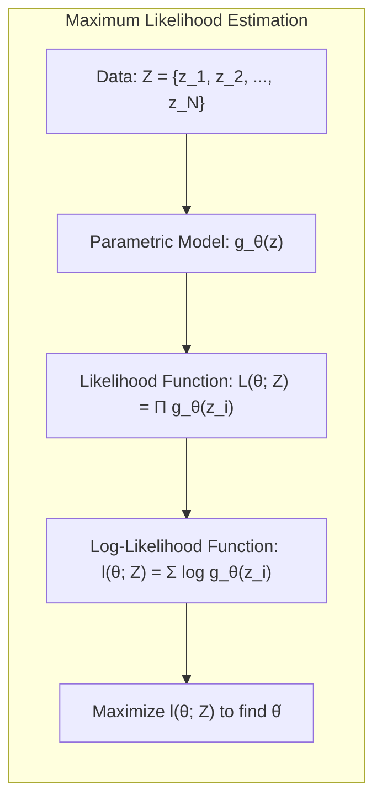
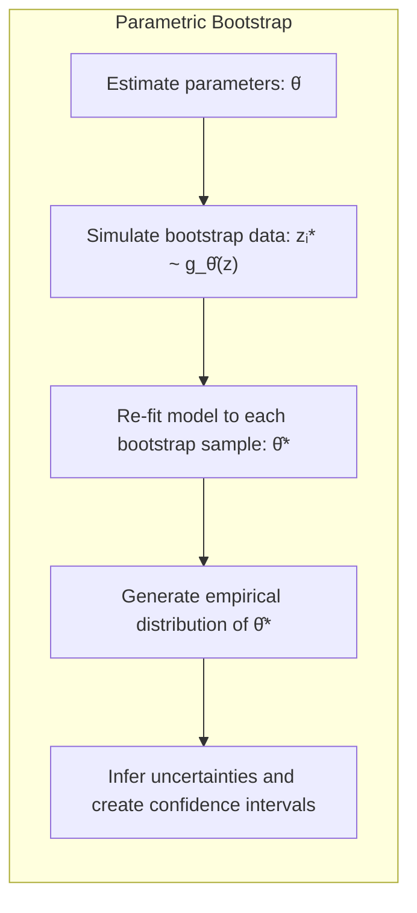
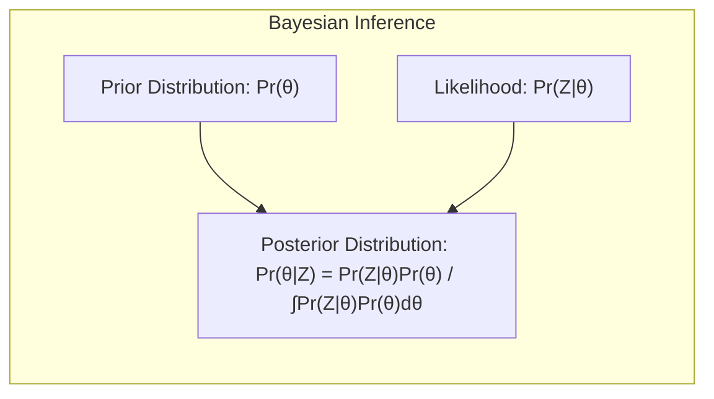
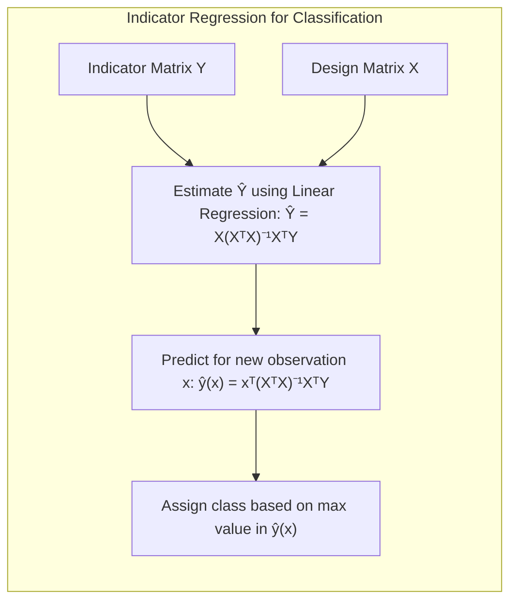
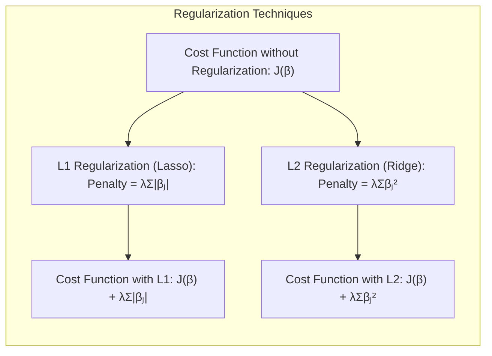
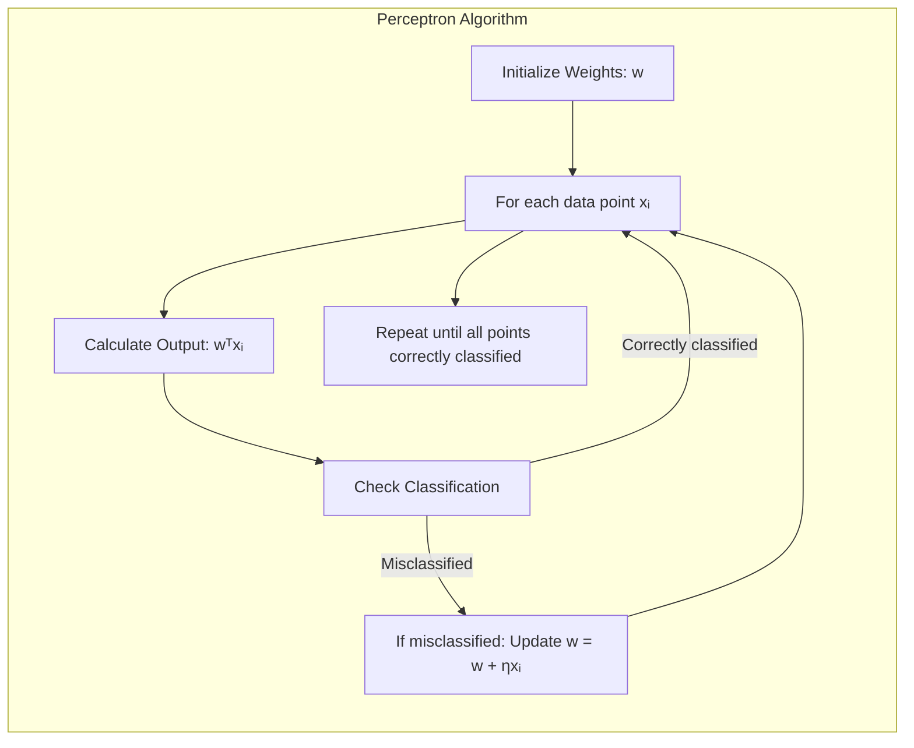

## Model Inference and Averaging: A Deep Dive into Parametric Models

<imagem: Mapa mental abrangente que conecta os métodos de inferência e model averaging, incluindo bootstrap, maximum likelihood, métodos bayesianos e técnicas de combinação de modelos como bagging e stacking, com foco em modelos paramétricos>

### Introdução

Este capítulo explora métodos de inferência e model averaging, com foco em **modelos paramétricos**, que são modelos cujas distribuições são governadas por um número finito de parâmetros [^8.1]. A modelagem estatística, tanto para regressão quanto para classificação, muitas vezes envolve a otimização de um critério de ajuste como a soma dos quadrados ou a entropia cruzada. De fato, essas minimizações são instâncias do método de **máxima verossimilhança**. Este capítulo fornece uma exposição geral da abordagem de máxima verossimilhança e métodos Bayesianos, discutindo a relação entre o bootstrap, introduzido no Capítulo 7, máxima verossimilhança e abordagens Bayesianas [^8.1]. Finalmente, técnicas de model averaging e melhoramento do modelo como committee methods, bagging, stacking e bumping são apresentadas [^8.1].

### Conceitos Fundamentais

**Conceito 1: Máxima Verossimilhança**

A abordagem de **máxima verossimilhança** busca encontrar os valores dos parâmetros de um modelo que maximizam a probabilidade dos dados observados. Formalmente, dado um conjunto de dados $Z = \{z_1, z_2, \ldots, z_N\}$, onde cada $z_i$ é uma observação, e um modelo paramétrico $g_\theta(z)$ que descreve a probabilidade dos dados, o objetivo é encontrar o valor $\hat{\theta}$ que maximiza a função de verossimilhança [^8.2.2]:

$$
L(\theta; Z) = \prod_{i=1}^N g_\theta(z_i)
$$

Em vez de maximizar diretamente a verossimilhança, muitas vezes maximizamos a **log-verossimilhança**, que é dada por:

$$
l(\theta; Z) = \sum_{i=1}^N \log g_\theta(z_i)
$$

Isso simplifica a otimização e não altera o resultado [^8.2.2]. A máxima verossimilhança é um conceito central na inferência estatística, fornecendo uma base para estimar parâmetros em uma ampla variedade de modelos.



> 💡 **Exemplo Numérico:** Considere um modelo paramétrico simples onde cada observação $z_i$ segue uma distribuição normal com média $\mu$ e desvio padrão $\sigma$, ou seja, $g_\theta(z_i) = \frac{1}{\sqrt{2\pi\sigma^2}}e^{-\frac{(z_i - \mu)^2}{2\sigma^2}}$, onde $\theta = (\mu, \sigma)$. Suponha que temos um conjunto de dados $Z = \{2, 4, 6, 8, 10\}$. Para encontrar a estimativa de máxima verossimilhança dos parâmetros, primeiro calculamos a log-verossimilhança:
>
> $$
> l(\mu, \sigma; Z) = \sum_{i=1}^N \log \left( \frac{1}{\sqrt{2\pi\sigma^2}}e^{-\frac{(z_i - \mu)^2}{2\sigma^2}} \right) = - \frac{N}{2}\log(2\pi\sigma^2) - \frac{1}{2\sigma^2}\sum_{i=1}^N (z_i - \mu)^2
> $$
>
>  Para maximizar essa função, derivamos parcialmente em relação a $\mu$ e $\sigma$ e igualamos a zero.  As derivadas são:
>
> $$
> \frac{\partial l}{\partial \mu} = \frac{1}{\sigma^2} \sum_{i=1}^N (z_i - \mu)
> $$
> $$
> \frac{\partial l}{\partial \sigma} = -\frac{N}{\sigma} + \frac{1}{\sigma^3} \sum_{i=1}^N (z_i - \mu)^2
> $$
>
> Igualando a zero e resolvendo, obtemos as estimativas de máxima verossimilhança:
>
> $$
> \hat{\mu} = \frac{1}{N} \sum_{i=1}^N z_i
> $$
> $$
> \hat{\sigma}^2 = \frac{1}{N} \sum_{i=1}^N (z_i - \hat{\mu})^2
> $$
>
> Para o conjunto de dados dado $Z$, temos:
>
> $$
> \hat{\mu} = \frac{2+4+6+8+10}{5} = 6
> $$
> $$
> \hat{\sigma}^2 = \frac{(2-6)^2 + (4-6)^2 + (6-6)^2 + (8-6)^2 + (10-6)^2}{5} = \frac{16+4+0+4+16}{5} = 8
> $$
>
> Assim, as estimativas de máxima verossimilhança para $\mu$ e $\sigma$ são $\hat{\mu} = 6$ e $\hat{\sigma} = \sqrt{8} \approx 2.83$.  Isso significa que o modelo gaussiano que melhor se ajusta aos dados, no sentido de máxima verossimilhança, é uma gaussiana com média 6 e desvio padrão $\sqrt{8}$.

**Lemma 1:** _Sob certas condições de regularidade, os estimadores de máxima verossimilhança são assintoticamente consistentes e eficientes. Isso significa que, conforme o tamanho da amostra aumenta, eles convergem para os verdadeiros valores dos parâmetros e alcançam a menor variância possível._ [^8.2.2]

*Prova (esboço):* As condições de regularidade incluem a suavidade da função de log-verossimilhança e a existência de derivadas de primeira e segunda ordem. Sob essas condições, a distribuição do estimador $\hat{\theta}$ se aproxima de uma distribuição normal com média no verdadeiro valor do parâmetro $\theta_0$ e variância dada pela inversa da informação de Fisher, ou seja, $\hat{\theta} \to \mathcal{N}(\theta_0, I^{-1}(\theta_0))$. $\blacksquare$

**Conceito 2: Bootstrap**

O método **bootstrap** fornece uma forma computacional de avaliar a incerteza, através da reamostragem dos dados de treinamento. No contexto de um modelo paramétrico, temos o **parametric bootstrap**, onde, em vez de reamostrar os dados originais, simulamos novos conjuntos de dados com base no modelo estimado. Por exemplo, dada uma estimativa $\hat{\theta}$ de um modelo paramétrico, podemos gerar dados bootstrap, $z_i^* \sim g_{\hat{\theta}}(z)$, para $i = 1, 2, \ldots, N$, onde $g_{\hat{\theta}}(z)$ é a distribuição estimada do modelo [^8.2.1].  Reajustando o modelo para cada conjunto de dados bootstrap, podemos criar uma distribuição empírica das estimativas dos parâmetros e/ou previsões, nos permitindo inferir incertezas e gerar intervalos de confiança.



> 💡 **Exemplo Numérico:** Usando o exemplo anterior, com $\hat{\mu} = 6$ e $\hat{\sigma} = \sqrt{8}$, podemos aplicar o bootstrap paramétrico para estimar a incerteza em $\hat{\mu}$.
>
> 1.  **Geração de amostras bootstrap:** Simulamos $B=1000$ amostras de tamanho $N=5$ de uma distribuição normal com $\mu = 6$ e $\sigma = \sqrt{8}$.
>
>    ```python
>    import numpy as np
>    import matplotlib.pyplot as plt
>    from scipy.stats import norm
>
>    np.random.seed(42)
>    mu_hat = 6
>    sigma_hat = np.sqrt(8)
>    B = 1000
>    N = 5
>    bootstrap_means = []
>    for _ in range(B):
>        bootstrap_sample = np.random.normal(loc=mu_hat, scale=sigma_hat, size=N)
>        bootstrap_mean = np.mean(bootstrap_sample)
>        bootstrap_means.append(bootstrap_mean)
>
>    plt.hist(bootstrap_means, bins=30, density=True, alpha=0.7, color='skyblue')
>    plt.xlabel('Bootstrap Mean Estimates')
>    plt.ylabel('Density')
>    plt.title('Histogram of Bootstrap Mean Estimates')
>    plt.show()
>    ```
>
> 2.  **Cálculo da distribuição dos parâmetros:** Calculamos a média e o desvio padrão das médias bootstrap.
>
>    ```python
>    mean_of_bootstrap_means = np.mean(bootstrap_means)
>    std_of_bootstrap_means = np.std(bootstrap_means)
>    print(f"Mean of bootstrap means: {mean_of_bootstrap_means:.2f}")
>    print(f"Std. Dev. of bootstrap means: {std_of_bootstrap_means:.2f}")
>    ```
>
>    ```text
>    Mean of bootstrap means: 6.00
>    Std. Dev. of bootstrap means: 1.22
>    ```
>
> 3.  **Construção do intervalo de confiança:** Usando o desvio padrão das médias bootstrap, um intervalo de confiança de 95% pode ser construído aproximadamente como $\hat{\mu} \pm 1.96 \cdot std(\hat{\mu}_{boot})$.
>
>    ```python
>    confidence_interval = (mean_of_bootstrap_means - 1.96 * std_of_bootstrap_means,
>                         mean_of_bootstrap_means + 1.96 * std_of_bootstrap_means)
>    print(f"95% Confidence Interval: {confidence_interval}")
>    ```
>
>    ```text
>    95% Confidence Interval: (3.605, 8.394)
>    ```
>
> O histograma mostra a distribuição das médias das amostras bootstrap, enquanto o intervalo de confiança fornece uma estimativa da incerteza associada à nossa estimativa do parâmetro $\mu$.

**Corolário 1:** _O bootstrap paramétrico, sob a suposição de que o modelo paramétrico está correto, fornece aproximações para os intervalos de confiança dos parâmetros que são consistentes com a distribuição assintótica dos estimadores de máxima verossimilhança._ [^8.2.1]

*Prova (esboço):* Em casos onde os erros do modelo são Gaussianos, o bootstrap paramétrico leva aos mesmos intervalos de confiança que o método de mínimos quadrados. Em geral, quando os erros não são Gaussianos, o bootstrap concorda com máxima verossimilhança, usando a função de probabilidade dos dados gerados parametricamente  [^8.2.2]. $\blacksquare$

**Conceito 3: Inferência Bayesiana**

A **inferência Bayesiana** incorpora crenças prévias sobre os parâmetros do modelo, utilizando uma distribuição *a priori*, $Pr(\theta)$, que reflete nossas expectativas antes de observar os dados. Dados os dados observados $Z$, a distribuição *a posteriori*, $Pr(\theta | Z)$, combina a informação dos dados com a informação a priori, usando a regra de Bayes [^8.3]:

$$
Pr(\theta|Z) = \frac{Pr(Z|\theta) \cdot Pr(\theta)}{\int Pr(Z|\theta) \cdot Pr(\theta) \, d\theta}
$$

onde $Pr(Z|\theta)$ é a verossimilhança dos dados dados os parâmetros e o denominador é um termo de normalização. A inferência Bayesiana fornece uma distribuição completa para os parâmetros, ao invés de apenas um único valor estimado, e permite modelar incertezas de forma mais completa.



> 💡 **Exemplo Numérico:** Usando o exemplo do modelo gaussiano, suponha que temos uma *prior* para $\mu$ que é também uma normal com média 5 e desvio padrão 2, ou seja, $Pr(\mu) = \mathcal{N}(5, 2^2)$. A verossimilhança é dada por $Pr(Z|\mu) \propto \exp\left(-\frac{1}{2\sigma^2}\sum_i (z_i - \mu)^2\right)$.
>
> A distribuição *a posteriori* $Pr(\mu|Z)$ é proporcional ao produto da *prior* e da verossimilhança:
>
> $$
> Pr(\mu|Z) \propto Pr(Z|\mu) Pr(\mu) \propto \exp\left(-\frac{1}{2\sigma^2}\sum_i (z_i - \mu)^2 - \frac{1}{2 \cdot 2^2} (\mu - 5)^2\right)
> $$
>
> Simplificando a expressão, obtemos que a *posteriori* de $\mu$ é também uma distribuição normal. O valor esperado e a variância são dados por (demonstração omitida para brevidade):
> $$
>  \mu_{posterior} = \frac{ \frac{1}{\sigma^2}\sum_{i=1}^{N}z_i + \frac{1}{2^2} 5 }{\frac{N}{\sigma^2} + \frac{1}{2^2}}
> $$
> $$
> \sigma^2_{posterior} = \frac{1}{\frac{N}{\sigma^2} + \frac{1}{2^2}}
> $$
>
> Usando os dados $Z = \{2, 4, 6, 8, 10\}$, $\hat{\mu}_{ML} = 6$, $\hat{\sigma}^2=8$,  e nossa *prior* $\mathcal{N}(5, 2^2)$, teremos:
>
> $$
>  \mu_{posterior} = \frac{ \frac{1}{8} (2+4+6+8+10) + \frac{1}{4} 5 }{\frac{5}{8} + \frac{1}{4}} =  \frac{ \frac{30}{8} + \frac{5}{4} }{\frac{7}{8}} =  \frac{ \frac{40}{8} }{\frac{7}{8}} = \frac{40}{7} \approx 5.714
> $$
>
> $$
> \sigma^2_{posterior} = \frac{1}{\frac{5}{8} + \frac{1}{4}} = \frac{1}{\frac{7}{8}} = \frac{8}{7} \approx 1.143
> $$
>
> Assim, a distribuição *a posteriori* para $\mu$ é aproximadamente $\mathcal{N}(5.714, \sqrt{1.143}^2)$, que representa nosso conhecimento atualizado sobre $\mu$ após observar os dados e considerar nossas crenças iniciais. Note que a média *a posteriori* está entre a *prior* e a estimativa de máxima verossimilhança.

> ⚠️ **Nota Importante:** A inferência Bayesiana difere da abordagem "frequentista" tradicional pela inclusão de uma distribuição a priori, que reflete a incerteza pré-existente antes da análise dos dados, e pela expressão da incerteza após a análise dos dados na forma de uma distribuição a posteriori [^8.3].

> ❗ **Ponto de Atenção:** Em contraste com a abordagem de máxima verossimilhança, que usa $Pr(z_{new}|\hat{\theta})$ para fazer previsões, a inferência Bayesiana utiliza a distribuição preditiva $Pr(z_{new}|Z) = \int Pr(z_{new}|\theta) Pr(\theta|Z) \, d\theta$, que contabiliza a incerteza na estimativa dos parâmetros [^8.3].

> ✔️ **Destaque:** Em casos onde as priors são não-informativas (constantes), a distribuição a posteriori é proporcional à verossimilhança, e as análises Bayesianas e de máxima verossimilhança tendem a concordar, especialmente quando temos grandes conjuntos de dados [^8.4].

### Regressão Linear e Mínimos Quadrados para Classificação
<imagem: Diagrama mostrando um fluxo de dados para regressão de indicadores, desde a codificação das classes até a comparação com métodos probabilísticos. Uma seta liga 'Codificar Classes' a 'Estimar Coeficientes via LS', depois para 'Aplicar Regra de Decisão' e finalmente para 'Comparar com Métodos Probabilísticos'.>

A regressão linear aplicada a uma matriz de indicadores pode ser utilizada em problemas de classificação, onde cada classe é representada por uma coluna binária indicando a pertinência de cada observação àquela classe. Formalmente, para um problema de classificação com $K$ classes, criamos uma matriz de indicadores $Y$, onde $Y_{ij} = 1$ se a $i$-ésima observação pertence à $j$-ésima classe e $Y_{ij} = 0$ caso contrário [^4.2]. Podemos então aplicar a regressão linear a esta matriz de indicadores:

$$
\hat{Y} = X(X^T X)^{-1} X^T Y
$$

onde $X$ é a matriz de *design*, contendo as variáveis preditoras. A predição para uma nova observação $x$ seria:

$$
\hat{y}(x) = x^T (X^T X)^{-1} X^T Y
$$

A classe predita é aquela com o maior valor correspondente em $\hat{y}(x)$. Embora a regressão de indicadores possa ser usada para classificação, ela apresenta limitações. Primeiro, as previsões não estão restritas ao intervalo [0,1], o que pode gerar estimativas de probabilidade fora do intervalo lógico. Segundo, a regressão de indicadores não leva em consideração a estrutura das probabilidades das classes, sendo mais focada em estimar as fronteiras de decisão.



> 💡 **Exemplo Numérico:** Suponha que temos um conjunto de dados com 3 observações e 2 classes, com duas variáveis preditoras, $x_1$ e $x_2$. A matriz de design $X$ e a matriz de indicadores $Y$ são:
>
> $$
> X = \begin{bmatrix} 1 & 1 & 2 \\ 1 & 2 & 1 \\ 1 & 3 & 3 \end{bmatrix} , \quad Y = \begin{bmatrix} 1 & 0 \\ 0 & 1 \\ 1 & 0 \end{bmatrix}
> $$
>
> Para calcular $\hat{Y}$, primeiro calculamos $(X^T X)^{-1}$:
>
> $$
> X^T X = \begin{bmatrix} 1 & 1 & 1 \\ 1 & 2 & 3 \\ 2 & 1 & 3 \end{bmatrix} \begin{bmatrix} 1 & 1 & 2 \\ 1 & 2 & 1 \\ 1 & 3 & 3 \end{bmatrix} = \begin{bmatrix} 3 & 6 & 6 \\ 6 & 14 & 13 \\ 6 & 13 & 14 \end{bmatrix}
> $$
>
> Usando numpy para calcular a inversa:
>
> ```python
> import numpy as np
>
> X = np.array([[1, 1, 2], [1, 2, 1], [1, 3, 3]])
> Y = np.array([[1, 0], [0, 1], [1, 0]])
>
> XtX = X.T @ X
> XtX_inv = np.linalg.inv(XtX)
>
> print("Inverse of X^T X:\n", XtX_inv)
> ```
> ```text
> Inverse of X^T X:
> [[ 1.66666667  -0.33333333  -0.33333333]
> [-0.33333333   0.73333333  -0.36666667]
> [-0.33333333  -0.36666667   0.73333333]]
> ```
>
> Agora, podemos calcular $\hat{Y}$:
>
> $$
> \hat{Y} = X (X^T X)^{-1} X^T Y
> $$
>
> ```python
> Y_hat = X @ XtX_inv @ X.T @ Y
> print("\nPredicted Y:\n", Y_hat)
> ```
> ```text
> Predicted Y:
> [[ 0.66666667  0.33333333]
> [ 0.          1.        ]
> [ 0.66666667  0.33333333]]
> ```
> Para uma nova observação $x_{new} = [1, 2, 2]$, a previsão seria:
> $$
> \hat{y}(x_{new}) = x_{new}^T(X^TX)^{-1}X^T Y
> $$
> ```python
> x_new = np.array([1,2,2])
> y_hat_new = x_new @ XtX_inv @ X.T @ Y
> print(f"\nPredicted y for new observation {x_new}: {y_hat_new}")
> ```
> ```text
> Predicted y for new observation [1 2 2]: [0.33333333 0.66666667]
> ```
>  O maior valor é 0.666 na segunda coluna, então a classe predita é a segunda classe.

**Lemma 2:** _Em certos casos, as fronteiras de decisão derivadas da regressão linear de indicadores são equivalentes às obtidas com discriminantes lineares, especialmente quando as covariâncias são iguais entre as classes._

*Prova (esboço):* Quando as classes são separáveis por um hiperplano, e o objetivo é apenas estimar a fronteira de decisão, a regressão linear de indicadores pode gerar resultados similares ao LDA, quando as covariâncias das classes são similares e podemos ignorar estimativas de probabilidade. $\blacksquare$

**Corolário 2:** _Em situações onde a separação das classes por hiperplanos é o objetivo primário, a regressão de indicadores pode ser uma ferramenta mais eficiente computacionalmente e, muitas vezes, fornece resultados similares aos do LDA, quando as classes têm covariâncias iguais ou similares._

"A regressão logística, conforme apontado em [^4.4], pode fornecer estimativas mais estáveis de probabilidade, enquanto a regressão de indicadores pode levar a extrapolações fora de [0,1]. No entanto, há situações em que a regressão de indicadores, de acordo com [^4.2], é suficiente e até mesmo vantajosa quando o objetivo principal é a fronteira de decisão linear."

### Métodos de Seleção de Variáveis e Regularização em Classificação
<imagem: Mapa mental complexo mostrando como a regularização conecta modelos de classificação como LDA, regressão logística e hiperplanos, indicando penalidades L1 e L2 como métodos para lidar com sparsity e estabilidade>

A seleção de variáveis e a regularização são cruciais em modelos de classificação, especialmente quando se trabalha com conjuntos de dados de alta dimensionalidade. Em modelos lineares, como regressão logística, a **regularização** é um método chave para evitar overfitting e melhorar a capacidade de generalização [^4.4.4]. A regularização adiciona um termo de penalidade à função de custo, que pune coeficientes grandes, induzindo modelos mais simples e evitando *overfitting*.

A **penalização L1** (Lasso), adiciona uma penalidade proporcional à soma dos valores absolutos dos coeficientes:

$$
\text{Penalidade L1} = \lambda \sum_{j=1}^p |\beta_j|
$$

onde $\lambda$ é o parâmetro de regularização e $\beta_j$ são os coeficientes do modelo. A penalização L1 tende a gerar coeficientes esparsos, ou seja, alguns coeficientes são exatamente zero, realizando a seleção de variáveis automaticamente. Já a **penalização L2** (Ridge) adiciona uma penalidade proporcional à soma dos quadrados dos coeficientes:

$$
\text{Penalidade L2} = \lambda \sum_{j=1}^p \beta_j^2
$$

A penalização L2 também reduz a magnitude dos coeficientes, mas sem necessariamente zerá-los. Ela promove a estabilidade do modelo e evita que os coeficientes assumam valores muito grandes [^4.4.4], [^4.5].



> 💡 **Exemplo Numérico:** Suponha que estamos ajustando um modelo de regressão logística para classificação binária e temos os seguintes coeficientes obtidos com máxima verossimilhança: $\beta = [2, -3, 1, 0.5, -2.5]$.  Vamos aplicar a regularização L1 e L2 com diferentes valores de $\lambda$.
>
> **Penalização L1 (Lasso):**
>
>  A função de custo com regularização L1 é:
>
> $$
>  J(\beta) = \text{Log-Loss} + \lambda \sum_{j=1}^p |\beta_j|
> $$
>
> Vamos usar $\lambda=0.5$ e $\lambda=1$:
>
> -   $\lambda = 0.5$: Otimizando a função de custo com a penalização L1, poderíamos obter (para simplificação, assumimos que a otimização leva aos seguintes valores) $\beta_{L1, \lambda=0.5} = [1.5, -2.5, 0.5, 0, -2]$ (alguns coeficientes reduziram em magnitude e um foi zerado).
> -   $\lambda = 1$:  Otimizando a função de custo com a penalização L1, poderíamos obter $\beta_{L1, \lambda=1} = [1, -2, 0, 0, -1]$ (mais coeficientes zerados).
>
> **Penalização L2 (Ridge):**
>
> A função de custo com regularização L2 é:
>
> $$
> J(\beta) = \text{Log-Loss} + \lambda \sum_{j=1}^p \beta_j^2
> $$
>
> Vamos usar $\lambda=0.5$ e $\lambda=1$:
>
> -   $\lambda = 0.5$:  Otimizando a função de custo com a penalização L2, poderíamos obter $\beta_{L2, \lambda=0.5} = [1.8, -2.7, 0.8, 0.4, -2.2]$ (todos os coeficientes são reduzidos em magnitude, mas não zerados).
> -   $\lambda = 1$: Otimizando a função de custo com a penalização L2, poderíamos obter $\beta_{L2, \lambda=1} = [1.6, -2.4, 0.6, 0.3, -1.9]$ (redução ainda maior na magnitude dos coeficientes).
>
> Comparando os resultados em uma tabela:
>
> | Método                 | $\lambda$ | $\beta_1$ | $\beta_2$ | $\beta_3$ | $\beta_4$ | $\beta_5$ | Sparsity |
> |------------------------|-----------|-----------|-----------|-----------|-----------|-----------|----------|
> | Original                |  -        | 2        | -3        | 1        | 0.5        | -2.5        | False  |
> | L1 (Lasso)             | 0.5        | 1.5       | -2.5        | 0.5        | 0       | -2        | True     |
> | L1 (Lasso)             | 1        | 1       | -2        | 0        | 0       | -1      | True     |
> | L2 (Ridge)            | 0.5        | 1.8       | -2.7        | 0.8        | 0.4       | -2.2        | False     |
> | L2 (Ridge)             | 1        | 1.6       | -2.4        | 0.6        | 0.3       | -1.9       | False     |
>
> Podemos observar que a regularização L1 promoveu a esparsidade dos coeficientes, zerando alguns deles, enquanto a L2 reduziu a magnitude, mas não zerou os coeficientes.

**Lemma 3:** _A penalização L1 em classificação logística conduz a coeficientes esparsos, levando à seleção de variáveis. Este comportamento é uma consequência da natureza não diferenciável do termo L1 na origem._ [^4.4.4]

*Prova (esboço):* Na otimização com regularização L1, a solução muitas vezes se encontra nas "quinas" do espaço de parâmetros, onde alguns coeficientes são exatamente zero. Isso acontece porque a penalidade L1 induz um viés em direção a soluções esparsas, que reduzem o número de variáveis relevantes. $\blacksquare$

**Corolário 3:** _A esparsidade induzida pela penalização L1 simplifica a interpretação do modelo, facilitando a identificação das variáveis mais importantes para a classificação, o que é crucial para muitos problemas práticos._ [^4.4.5]

> ⚠️ **Ponto Crucial**: As penalizações L1 e L2 podem ser combinadas na chamada regularização Elastic Net, que oferece vantagens de ambas as penalizações, controlando simultaneamente a sparsity e a estabilidade dos coeficientes [^4.5].

### Separating Hyperplanes e Perceptrons
A ideia de maximizar a margem de separação entre classes conduz ao conceito de hiperplanos ótimos. Dado um conjunto de dados linearmente separável, o objetivo é encontrar o hiperplano que maximiza a distância mínima entre o hiperplano e os pontos de cada classe. Isso é equivalente a resolver um problema de otimização quadrática, que pode ser formulado no espaço primal ou dual. A formulação dual, via o dual de Wolfe, nos permite trabalhar com combinações lineares dos pontos de suporte e encontrar uma solução mais eficiente computacionalmente [^4.5.2].

O **Perceptron** de Rosenblatt é um algoritmo clássico para encontrar hiperplanos separadores, especialmente para dados linearmente separáveis. O perceptron é um algoritmo iterativo que ajusta os pesos do hiperplano de decisão a cada classificação errada, até que todos os pontos do conjunto de treinamento sejam corretamente classificados. Sob condições de linear separability, o perceptron tem convergência garantida, e o limite encontrado é um hiperplano que separa as classes. No entanto, a solução do perceptron não é necessariamente a que maximiza a margem [^4.5.1].



> 💡 **Exemplo Numérico:** Considere um conjunto de dados bidimensional com duas classes, classe 1: {(1,1), (2,2)} e classe 2: {(3,1), (3,3)}. O objetivo do Perceptron é encontrar um hiperplano (neste caso, uma linha) que separe as duas classes.
>
> 1.  **Inicialização:** Começamos com um vetor de pesos aleatório, por exemplo, $w = [0.5, -0.5, 0.1]$ (incluímos o termo de bias).
>
> 2.  **Iterações:** O Perceptron itera sobre os dados, ajustando os pesos quando há classificações incorretas.
>
>     -   Para o ponto (1,1) (classe 1): a saída é $0.5*1 -0.5*1 +0.1 = 0.1$. Como é maior que zero, é classificado corretamente.
>     -   Para o ponto (2,2) (classe 1): a saída é $0.5*2 -0.5*2 +0.1 = 0.