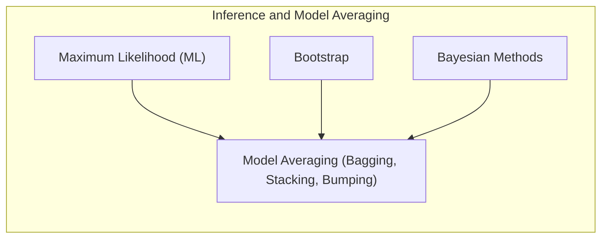
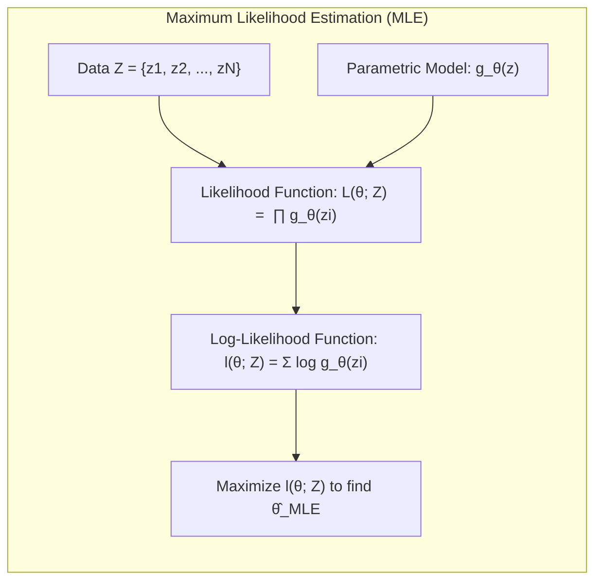
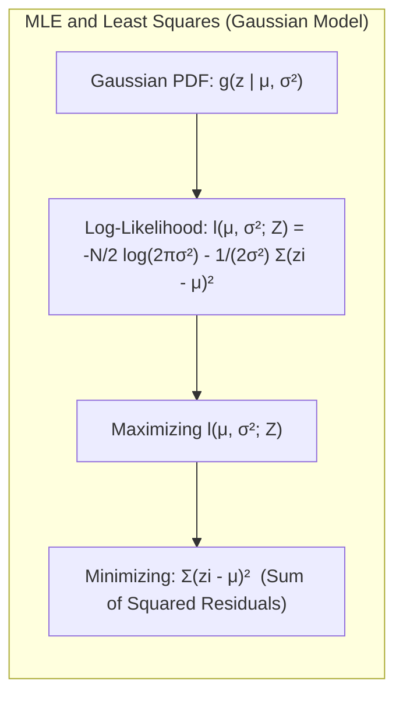
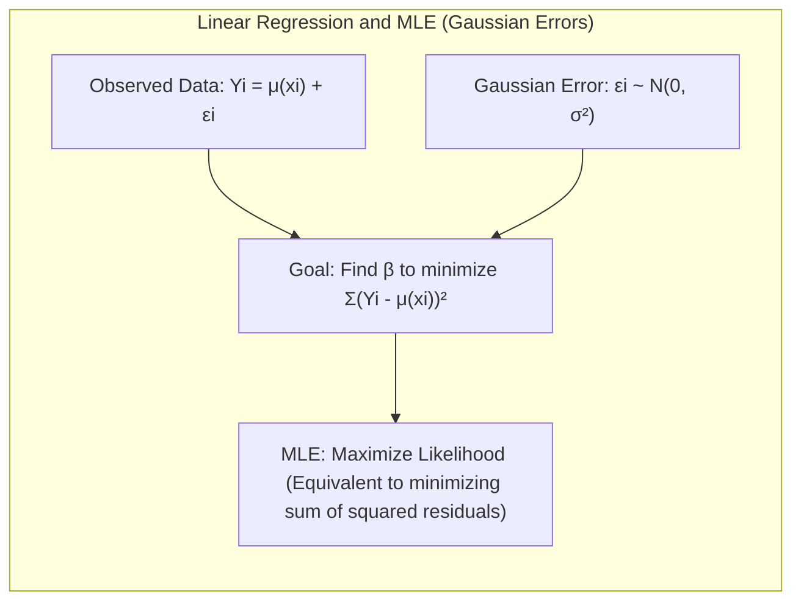
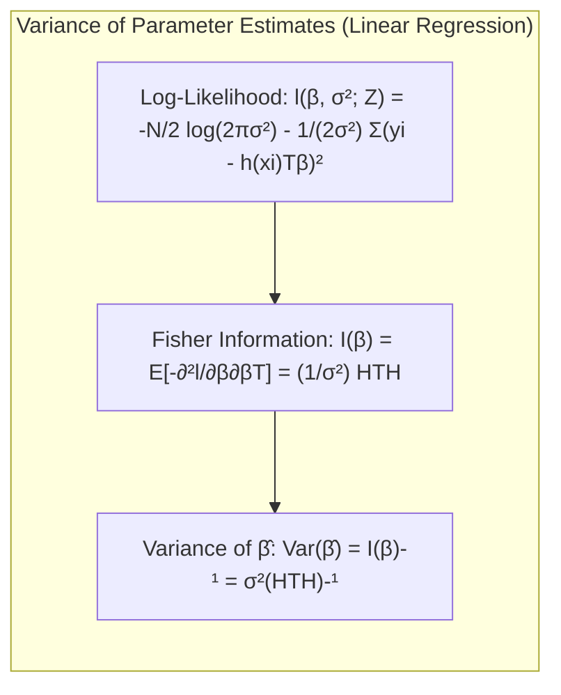
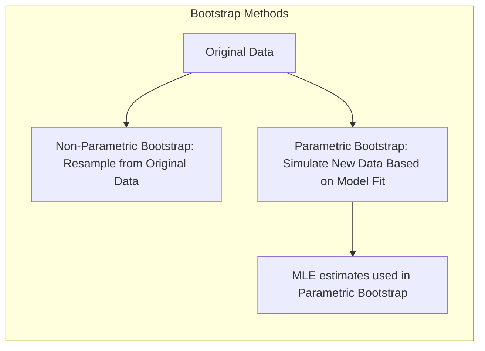
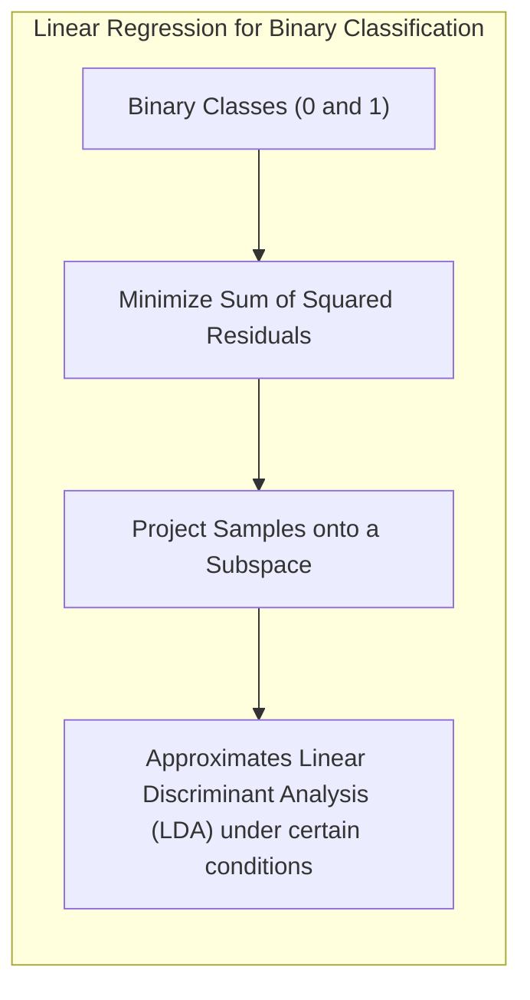
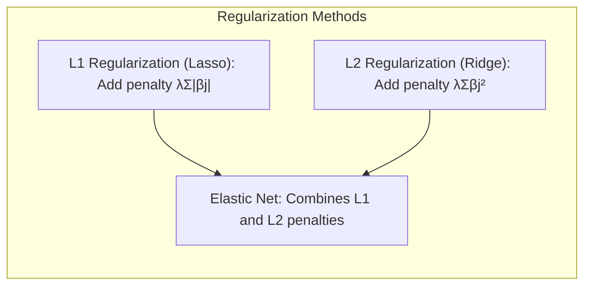
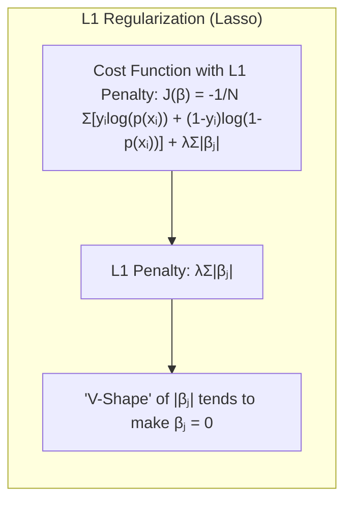

## Model Inference and Averaging: A Deep Dive into Likelihood

### Introdução
O presente capítulo se dedica à exploração aprofundada da inferência estatística e da combinação de modelos, com um foco especial na **Maximum Likelihood** e em abordagens relacionadas como o **Bootstrap** e métodos **Bayesianos** [^8.1]. Exploramos como esses métodos podem ser usados para construir modelos mais robustos e confiáveis, com um foco especial na derivação de intervalos de confiança e avaliação de incertezas em modelos estatísticos [^8.1]. Veremos também como a ideia de combinar modelos, através de técnicas como **bagging**, **stacking** e **bumping**, pode levar a previsões mais precisas e estáveis. Este estudo tem por objetivo fornecer um entendimento profundo e avançado de como os conceitos de verossimilhança, variância e viés se encaixam nas estratégias de modelagem.

### Conceitos Fundamentais

**Conceito 1: Maximum Likelihood**

O princípio da **Maximum Likelihood** (ML) é central na inferência estatística, visando encontrar os valores dos parâmetros de um modelo que maximizam a probabilidade de se observar os dados reais [^8.1]. Formalmente, dado um conjunto de dados $Z = \{z_1, z_2, \ldots, z_N\}$ e um modelo paramétrico definido por uma função de densidade de probabilidade (pdf) ou função de massa de probabilidade (pmf) $g_\theta(z)$, a função de verossimilhança é dada por:
$$L(\theta; Z) = \prod_{i=1}^{N} g_\theta(z_i)$$
A ideia é que, dentre todas as possíveis configurações de $\theta$, escolhemos aquela que torna os dados observados mais prováveis [^8.1]. O parâmetro $\theta$ que maximiza $L(\theta;Z)$ é chamado de estimativa de máxima verossimilhança. Em muitos casos, para facilitar a otimização, é usada a função de log-verossimilhança, $l(\theta; Z)$, que é o logaritmo da função de verossimilhança:
$$l(\theta; Z) = \sum_{i=1}^{N} \log g_\theta(z_i)$$
A motivação para esta abordagem é que em muitos casos, a função de log-verossimilhança é mais fácil de ser otimizada do que a verossimilhança original. A escolha do modelo $g_\theta(z)$ é crucial e define a estrutura do nosso problema de inferência.

> 💡 **Exemplo Numérico:**
>
> Suponha que temos um conjunto de dados $Z = \{2.1, 3.5, 1.8, 4.2, 2.9\}$ que acreditamos ser proveniente de uma distribuição normal com média $\mu$ e variância $\sigma^2$.  Nesse caso, $g_{\mu, \sigma^2}(z_i) = \frac{1}{\sqrt{2\pi\sigma^2}} e^{-\frac{(z_i-\mu)^2}{2\sigma^2}}$.
>
> **Passo 1: Definir a função de log-verossimilhança:**
>
> $l(\mu, \sigma^2; Z) = \sum_{i=1}^{5} \log \left( \frac{1}{\sqrt{2\pi\sigma^2}} e^{-\frac{(z_i - \mu)^2}{2\sigma^2}} \right)$
>
> $l(\mu, \sigma^2; Z) = -\frac{5}{2} \log(2\pi\sigma^2) - \frac{1}{2\sigma^2} \sum_{i=1}^5 (z_i - \mu)^2$
>
> **Passo 2: Estimar $\mu$ e $\sigma^2$ maximizando a log-verossimilhança.**
>
> Para este exemplo, vamos usar as estimativas de máxima verossimilhança que são conhecidas para uma distribuição normal,
>
> $\hat{\mu} = \frac{1}{5} \sum_{i=1}^5 z_i = \frac{2.1 + 3.5 + 1.8 + 4.2 + 2.9}{5} = 2.9$
>
> $\hat{\sigma}^2 = \frac{1}{5} \sum_{i=1}^5 (z_i - \hat{\mu})^2 = \frac{(2.1-2.9)^2 + (3.5-2.9)^2 + (1.8-2.9)^2 + (4.2-2.9)^2 + (2.9-2.9)^2}{5} = \frac{0.64 + 0.36 + 1.21 + 1.69 + 0}{5} = 0.78$
>
> Portanto, a estimativa de máxima verossimilhança para a média é $\hat{\mu} = 2.9$ e para a variância é $\hat{\sigma}^2 = 0.78$.  Esses parâmetros são os que tornam os dados observados mais prováveis, de acordo com o modelo gaussiano escolhido.

**Lemma 1:** A estimativa de máxima verossimilhança (MLE) de um parâmetro sob um modelo Gaussiano corresponde à minimização da soma dos quadrados dos resíduos.
*Prova:*
Considere um modelo Gaussiano com média $\mu$ e variância $\sigma^2$, onde a pdf é dada por $g_{\mu,\sigma^2}(z) = \frac{1}{\sqrt{2\pi\sigma^2}} e^{-\frac{(z-\mu)^2}{2\sigma^2}}$.  A função de log-verossimilhança para um conjunto de $N$ observações independentes é:

$$ l(\mu, \sigma^2; Z) = \sum_{i=1}^N \log \left( \frac{1}{\sqrt{2\pi\sigma^2}} e^{-\frac{(z_i - \mu)^2}{2\sigma^2}} \right) $$
$$ = -\frac{N}{2} \log(2\pi\sigma^2) - \frac{1}{2\sigma^2} \sum_{i=1}^N (z_i - \mu)^2 $$

Maximizar $l(\mu, \sigma^2; Z)$ em relação a $\mu$ é equivalente a minimizar $\sum_{i=1}^N (z_i - \mu)^2$, que é a soma dos quadrados dos resíduos.  Portanto, a MLE de $\mu$ é igual ao estimador de mínimos quadrados. $\blacksquare$

**Conceito 2: Linear Regression and Maximum Likelihood**
Na regressão linear, buscamos o melhor ajuste linear de uma variável dependente em relação a uma ou mais variáveis independentes. Em termos de verossimilhança, a regressão linear com erros Gaussianos assume que cada observação $Y_i$ é gerada por $Y_i = \mu(x_i) + \epsilon_i$, onde $\mu(x_i)$ é a resposta média linear modelada pelas variáveis preditoras $x_i$, e $\epsilon_i$ são os erros independentes e identicamente distribuídos com distribuição normal $N(0, \sigma^2)$ [^8.5]. O objetivo da regressão linear, tanto na abordagem de mínimos quadrados quanto na de máxima verossimilhança, é encontrar os parâmetros do modelo que minimizem a soma dos quadrados dos resíduos, o que equivale a maximizar a função de verossimilhança [^8.5]. Assim, os estimadores obtidos pelos dois métodos (minimização dos quadrados e maximização da verossimilhança) coincidem quando assumimos a distribuição Gaussiana.

> 💡 **Exemplo Numérico:**
>
> Vamos considerar um conjunto de dados com uma variável preditora $x$ e uma variável resposta $y$, onde queremos ajustar um modelo de regressão linear: $y_i = \beta_0 + \beta_1 x_i + \epsilon_i$. Suponha que temos os seguintes dados:
>
> | $x_i$ | $y_i$ |
> |-------|-------|
> | 1     | 3     |
> | 2     | 5     |
> | 3     | 7     |
> | 4     | 9     |
>
>  **Passo 1: Construir a matriz de design H e o vetor y:**
>  
>  $H = \begin{bmatrix} 1 & 1 \\ 1 & 2 \\ 1 & 3 \\ 1 & 4 \end{bmatrix}$  e $y = \begin{bmatrix} 3 \\ 5 \\ 7 \\ 9 \end{bmatrix}$
>  
> **Passo 2: Calcular $(H^T H)^{-1}$ :**
> $H^T H = \begin{bmatrix} 1 & 1 & 1 & 1 \\ 1 & 2 & 3 & 4 \end{bmatrix} \begin{bmatrix} 1 & 1 \\ 1 & 2 \\ 1 & 3 \\ 1 & 4 \end{bmatrix} = \begin{bmatrix} 4 & 10 \\ 10 & 30 \end{bmatrix}$
>  $(H^T H)^{-1} = \frac{1}{4 \cdot 30 - 10 \cdot 10}\begin{bmatrix} 30 & -10 \\ -10 & 4 \end{bmatrix} = \begin{bmatrix} 1.5 & -0.5 \\ -0.5 & 0.2 \end{bmatrix}$
>
>  **Passo 3: Calcular $H^T y$:**
> $H^T y = \begin{bmatrix} 1 & 1 & 1 & 1 \\ 1 & 2 & 3 & 4 \end{bmatrix} \begin{bmatrix} 3 \\ 5 \\ 7 \\ 9 \end{bmatrix} = \begin{bmatrix} 24 \\ 64 \end{bmatrix}$
>
>  **Passo 4: Calcular $\hat{\beta} = (H^T H)^{-1} H^T y$ :**
>  $\hat{\beta} = \begin{bmatrix} 1.5 & -0.5 \\ -0.5 & 0.2 \end{bmatrix} \begin{bmatrix} 24 \\ 64 \end{bmatrix} = \begin{bmatrix} 4 \\ 2 \end{bmatrix}$
>
>  Assim, a estimativa dos parâmetros é $\hat{\beta_0} = 1$ e $\hat{\beta_1} = 2$, obtidos tanto pela minimização dos quadrados quanto pela maximização da verossimilhança sob a suposição de erros gaussianos. O modelo de regressão ajustado é $\hat{y} = 1 + 2x$.
>
>   **Passo 5: Calcular os resíduos e o erro quadrático médio (MSE):**
>    Os valores preditos são: $\hat{y} = [3, 5, 7, 9]$.
>    Os resíduos são: $e = y - \hat{y} = [0, 0, 0, 0]$.
>   O MSE é calculado como: $MSE = \frac{1}{4} \sum_{i=1}^{4} (y_i - \hat{y}_i)^2 = 0$.  Neste exemplo perfeito, o modelo ajusta os dados exatamente, resultando em um MSE de 0.  Em situações reais, os resíduos geralmente serão não nulos.

**Corolário 1:** A variância estimada dos parâmetros na regressão linear, baseada na função de verossimilhança, é dada pela matriz de covariância da estimativa $\hat{\beta}$, que é proporcional à inversa da matriz $(H^T H)$, onde H é a matriz de design e $\sigma^2$ a variância do ruído.
*Prova*:
A função de log-verossimilhança para a regressão linear com erros Gaussianos é dada por:
$$l(\beta, \sigma^2; Z) = -\frac{N}{2} \log(2\pi\sigma^2) - \frac{1}{2\sigma^2} \sum_{i=1}^N (y_i - h(x_i)^T \beta)^2 $$
onde $h(x)$ são as variáveis preditoras e $\beta$ são os parâmetros.
A derivada de $l$ em relação a $\beta$ é:
$$\frac{\partial l}{\partial \beta} = \frac{1}{\sigma^2} \sum_{i=1}^N (y_i - h(x_i)^T \beta)h(x_i)$$
Igualando a zero e resolvendo para $\beta$, obtemos a MLE $\hat{\beta} = (H^T H)^{-1}H^T y$. A matriz de informação de Fisher, $I(\beta)$, é definida como a esperança do negativo da segunda derivada da log-verossimilhança em relação aos parâmetros [^8.22]:
$$I(\beta) = E\left[ -\frac{\partial^2 l}{\partial \beta \partial \beta^T} \right] = \frac{1}{\sigma^2} H^T H$$
A variância estimada dos parâmetros é a inversa da matriz de informação de Fisher:
$$Var(\hat{\beta}) = I(\beta)^{-1} = \sigma^2 (H^T H)^{-1}$$
O corolário segue, mostrando a relação entre a variância estimada dos parâmetros e a matriz de design e a variância do ruído [^8.22]. $\blacksquare$

> 💡 **Exemplo Numérico:**
>
> Usando o exemplo anterior, vamos calcular a variância estimada dos parâmetros.
>
> **Passo 1: Calcular a variância do ruído $\sigma^2$:**
>
> Como os resíduos foram todos iguais a zero no exemplo anterior, vamos assumir que o MSE de um ajuste anterior (com dados diferentes) foi de 0.2 e assumir que ele é uma boa estimativa da variância do erro $\sigma^2$.
>
> **Passo 2: Calcular a matriz de covariância de $\hat{\beta}$:**
>
> $Var(\hat{\beta}) = \sigma^2 (H^T H)^{-1} = 0.2 \begin{bmatrix} 1.5 & -0.5 \\ -0.5 & 0.2 \end{bmatrix} = \begin{bmatrix} 0.3 & -0.1 \\ -0.1 & 0.04 \end{bmatrix}$
>
> Portanto, a variância estimada do parâmetro $\beta_0$ (intercepto) é $0.3$, a variância estimada do parâmetro $\beta_1$ (coeficiente angular) é $0.04$, e a covariância entre os parâmetros é $-0.1$. Esses valores representam a incerteza em torno das estimativas dos parâmetros e podem ser usados para calcular intervalos de confiança para as estimativas.

**Conceito 3: Bootstrap e Maximum Likelihood**
O método **Bootstrap** fornece uma abordagem computacional para avaliar a incerteza, por meio de reamostragem do conjunto de dados original [^8.2.1]. Existem duas variações principais: o **Bootstrap não paramétrico**, que amostra os dados originais com reposição, e o **Bootstrap paramétrico**, que simula novos dados a partir de um modelo ajustado. O Bootstrap paramétrico, em particular, se alinha mais de perto com a ideia de máxima verossimilhança, pois usa as estimativas MLE como base para a geração de novos conjuntos de dados [^8.2.2]. No exemplo de suavização com splines B, as estimativas do bootstrap paramétrico convergem para as bandas de confiança da regressão linear, à medida que o número de amostras do bootstrap tende ao infinito [^8.2.2].

> ⚠️ **Nota Importante:** A correspondência entre bootstrap e maximum likelihood surge quando o modelo tem erros aditivos Gaussianos. **Referência ao tópico [^8.2.2]**.

> ❗ **Ponto de Atenção:** Em geral, o bootstrap paramétrico converge para a máxima verossimilhança, e não para mínimos quadrados, mas podem coincidir em modelos com erros Gaussianos. **Conforme indicado em [^8.2.2]**.

> ✔️ **Destaque:** A vantagem do bootstrap sobre as abordagens baseadas em fórmulas da máxima verossimilhança é que ele pode ser aplicado em situações onde não existem fórmulas analíticas disponíveis. **Baseado no tópico [^8.2.3]**.

> 💡 **Exemplo Numérico:**
>
> Vamos usar os dados do exemplo de regressão linear anterior.
>
>  **Passo 1: Realizar um bootstrap paramétrico:**
>
>   - Ajustamos o modelo linear aos dados originais, obtendo $\hat{\beta_0} = 1$ e $\hat{\beta_1} = 2$ (como calculado anteriormente) e  $\hat{\sigma}^2 = 0.2$
>   - Para cada reamostragem bootstrap (digamos, 1000 reamostragens), geramos novos conjuntos de dados $y^*_i$ para cada $x_i$ usando a fórmula:  $y^*_i = 1 + 2x_i + \epsilon_i$, onde $\epsilon_i$ é amostrado de uma distribuição normal com média 0 e variância $\hat{\sigma}^2 = 0.2$.
>   - Para cada conjunto de dados reamostrado, recalculamos as estimativas de regressão $\hat{\beta_0}^*$ e $\hat{\beta_1}^*$ .
>
>   **Passo 2: Calcular intervalos de confiança:**
>
>   - Após as 1000 reamostragens, temos uma distribuição de $\hat{\beta_0}^*$ e $\hat{\beta_1}^*$.  Usamos essa distribuição para calcular intervalos de confiança para os parâmetros originais. Por exemplo, podemos usar o 2.5º e o 97.5º percentil da distribuição bootstrap para um intervalo de confiança de 95%.
>
>  **Passo 3: Comparar com os resultados teóricos:**
>
>  - Em modelos com erros gaussianos, as estimativas do bootstrap paramétrico devem convergir para as estimativas da máxima verossimilhança, como discutido anteriormente. Se o número de reamostragens bootstrap for grande, os intervalos de confiança obtidos através do bootstrap devem estar próximos daqueles calculados usando a matriz de covariância dos parâmetros.
>
>   Este exemplo ilustra como o bootstrap paramétrico pode ser usado para aproximar a distribuição dos parâmetros e quantificar a incerteza associada a eles.

### Regressão Linear e Mínimos Quadrados para Classificação

**Explicação:** Este diagrama ilustra o processo de como a regressão linear pode ser usada para classificação, usando um esquema de codificação one-hot para as classes e a aplicação da regra de decisão baseada em maior probabilidade.

A regressão linear pode ser utilizada em problemas de classificação ao codificar as classes por meio de vetores indicadores (one-hot encoding). No entanto, essa abordagem apresenta limitações, especialmente quando as classes não são linearmente separáveis [^8.2]. Além disso, a regressão linear pode levar a valores de probabilidade fora do intervalo [0,1], o que é um problema quando se busca uma interpretação probabilística das previsões [^8.4]. Em contrapartida, métodos como a regressão logística são mais adequados para classificação, pois garantem que os resultados estejam dentro desse intervalo, por meio da função logística.

**Lemma 2:** Em um problema de classificação binária com codificação one-hot (0 e 1) para as classes, a minimização da soma dos quadrados dos resíduos na regressão linear é equivalente à projeção das amostras em um subespaço, que, em certas condições, é similar à abordagem da análise discriminante linear.
*Prova:*
Seja um problema de classificação binária com classes codificadas como 0 e 1. A regressão linear busca um vetor de parâmetros $\beta$ que minimize a soma dos quadrados dos resíduos. O ajuste de mínimos quadrados pode ser interpretado como a projeção dos valores de $y_i$ nos valores preditos $\hat{y_i}$. A projeção resulta em um hiperplano. Em casos específicos, onde a distribuição das classes é aproximadamente normal com covariâncias semelhantes, essa projeção pode ser aproximada à direção discriminante da LDA. A minimização dos resíduos na regressão linear é equivalente a essa projeção, o que justifica o uso da regressão linear para classificação em certos cenários. $\blacksquare$

**Corolário 2:** Apesar da similaridade com a análise discriminante linear em algumas condições, a regressão linear de indicadores não fornece uma interpretação probabilística direta para cada classe, pois as previsões podem extrapolar o intervalo [0,1].
*Prova:*
Na regressão linear, o modelo ajusta uma reta ou hiperplano aos dados, permitindo previsões em todo o espaço real. Ao usar indicadores para classificação, os valores ajustados podem ser negativos ou maiores que 1. Isso contrasta com métodos como a regressão logística, que usa a função sigmoide para garantir que as probabilidades fiquem dentro do intervalo [0,1], fornecendo uma interpretação probabilística direta. Portanto, a regressão linear de indicadores, embora útil para encontrar uma separação linear entre as classes, não fornece diretamente estimativas de probabilidade válidas. $\blacksquare$

> 💡 **Exemplo Numérico:**
>
> Imagine um problema de classificação com duas classes (A e B) e duas features ($x_1$ e $x_2$).  Temos o seguinte dataset:
>
> |$x_1$ | $x_2$ | Classe |
> |------|------|--------|
> | 1    | 2    | A      |
> | 1.5  | 1.8  | A      |
> | 3    | 4    | B      |
> | 3.2  | 3.8  | B      |
>
> **Passo 1: Codificar as Classes**
>
> Usamos codificação one-hot: A = 0, B = 1.
>
> **Passo 2: Ajustar um modelo de regressão linear:**
>
> Ajustamos um modelo da forma $\hat{y} = \beta_0 + \beta_1 x_1 + \beta_2 x_2$. Para simplificar, vamos assumir que os coeficientes resultantes são $\beta_0 = -1$, $\beta_1 = 1$, e $\beta_2 = 0.5$.
>
>  **Passo 3: Calcular as previsões:**
>
>  - Para o primeiro ponto (1, 2): $\hat{y} = -1 + 1*1 + 0.5*2 = 0$.
>  - Para o segundo ponto (1.5, 1.8): $\hat{y} = -1 + 1*1.5 + 0.5*1.8 = 0.4$.
>  - Para o terceiro ponto (3, 4): $\hat{y} = -1 + 1*3 + 0.5*4 = 4$.
>  - Para o quarto ponto (3.2, 3.8): $\hat{y} = -1 + 1*3.2 + 0.5*3.8 = 4.1$.
>
> **Passo 4: Aplicar a Regra de Decisão:**
>
>  - Classificamos como classe A se $\hat{y} < 0.5$ e como classe B se $\hat{y} \ge 0.5$.
>
>  Observamos que, neste caso, os dois primeiros pontos são classificados corretamente como classe A, e os dois últimos como classe B. No entanto, note que os valores de $\hat{y}$ para a classe B estão acima de 1, o que não corresponde a uma probabilidade válida.
>
> Este exemplo demonstra como a regressão linear pode ser usada para classificação com codificação one-hot, mas também as limitações em relação à interpretação probabilística, uma vez que os valores preditos podem estar fora do intervalo [0,1].

### Métodos de Seleção de Variáveis e Regularização em Classificação

A seleção de variáveis e a regularização são técnicas cruciais para melhorar a generalização e a interpretabilidade dos modelos de classificação [^8.2]. Métodos de regularização, como L1 (Lasso) e L2 (Ridge), adicionam termos de penalização à função de custo que evitam que os coeficientes do modelo se tornem excessivamente grandes. A regularização L1 tende a zerar alguns coeficientes, levando a modelos esparsos e, assim, realizando a seleção de variáveis [^8.1]. A regularização L2, por outro lado, reduz a magnitude dos coeficientes, melhorando a estabilidade do modelo. A combinação dessas duas formas de regularização é conhecida como Elastic Net, que equilibra as vantagens de ambas [^8.1]. Em modelos logísticos, esses métodos atuam penalizando os parâmetros na função de log-verossimilhança.
$$l(\beta) = \sum_{i=1}^N [y_i \log(p(x_i)) + (1-y_i) \log(1-p(x_i))] - \lambda_1 \sum_{j=1}^p |\beta_j| - \lambda_2 \sum_{j=1}^p \beta_j^2$$

**Lemma 3:** A penalização L1 na regressão logística leva a estimativas de parâmetros esparsas, devido à forma da função de penalização.
*Prova*:
Considere a função de custo regularizada com penalização L1:
$$J(\beta) = -\frac{1}{N} \sum_{i=1}^N [y_i \log(p(x_i)) + (1-y_i) \log(1-p(x_i))] + \lambda \sum_{j=1}^p |\beta_j|$$
onde $\lambda$ controla a força da regularização. A penalização L1 adiciona uma penalidade proporcional à soma dos valores absolutos dos coeficientes $\beta_j$. A geometria da função $|\beta_j|$ (em forma de V) faz com que o mínimo da função de custo tenda a ocorrer em valores de $\beta_j$ iguais a 0, desde que o parâmetro de regularização $\lambda$ seja suficientemente grande. Essa característica contrasta com a penalização L2 (Ridge), que penaliza os coeficientes através de seus quadrados, sem induzir esparsidade. $\blacksquare$

**Corolário 3:** A esparsidade induzida pela penalização L1 na regressão logística leva à seleção de variáveis mais relevantes para a classificação, o que melhora a interpretabilidade do modelo e reduz o risco de overfitting.
*Prova*:
A penalização L1, ao zerar alguns coeficientes, efetivamente remove as variáveis associadas a esses coeficientes do modelo, simplificando-o. Esta seleção de variáveis permite que o modelo se concentre nas características mais importantes para a classificação, melhorando sua capacidade de generalização em novos dados. Essa característica é particularmente útil em conjuntos de dados com um grande número de variáveis, onde a identificação das mais relevantes é crucial para a construção de modelos mais eficientes e interpretáveis. $\blacksquare$
> ⚠️ **Ponto Crucial**: A escolha entre L1, L2 ou Elastic Net depende do problema específico e da necessidade de esparsidade ou estabilidade nos parâmetros. **Conforme discutido em [^8.2]**.

> 💡 **Exemplo Numérico:**
>
> Suponha que temos um problema de classificação com 5 variáveis preditoras e desejamos aplicar regressão logística com regularização. Vamos considerar uma simplificação do problema, com um modelo logístico com dois parâmetros e uma função de log-verossimilhança já calculada como:
>
> $l(\beta) = -5 + 2\beta_1 + 3\beta_2$
>
> Vamos analisar o efeito das penalidades L1 e L2.
>
> **Caso 1: Sem Regularização ($\lambda_1 = 0$, $\lambda_2 = 0$):**
>
> Sem regularização, maximizamos diretamente a log-verossimilhança. Assumindo que o máximo ocorre em $\beta_1 = 1$ e $\beta_2 = 2$, teremos uma verossimilhança $l(\beta) = -5 + 2(1) + 3(2) = 3$.
>
> **Caso 2: Regularização L1 (Lasso) com $\lambda_1 = 0.5$ e $\lambda_2 = 0$:**
>
> A função a ser maximizada se torna:
>
> $J(\beta) = l(\beta) - \lambda_1 (|\beta_1| + |\beta_2|) = -5 + 2\beta_1 + 3\beta_2 - 0.5(|\beta_1| + |\beta_2|)$
>
> Para simplificar, vamos assumir que o máximo da função regularizada ocorre em $\beta_1 = 0.8$ e $\beta_2 = 1.5$. Então,
>
> $J(\beta) = -5 + 2(0.8) + 3(1.5) - 0.5(|0.8| + |1.5|) = -5 + 1.6 + 4.5 - 0.5(2.3) = -5 + 6.1 - 1.15 = -0.05$
>
> Note que a regularização L1 reduziu os valores dos parâmetros. Em casos mais complexos, a penalidade L1 pode levar alguns coeficientes a zero, efetivamente realizando a seleção de variáveis.
>
> **Caso 3: Regularização L2 (Ridge) com $\lambda_1 = 0$ e $\lambda_2 = 0.5$:**
>
> A função a ser maximizada se torna:
>
> $J(\beta) = l(\beta) - \lambda_2 (\beta_1^2 + \beta_2^2) = -5 + 2\beta_1 + 3\beta_2 - 0.5(\beta_1^2 + \beta_2^2)$
>
> Novamente, vamos supor que o máximo da função regularizada ocorre em $\beta_1 = 0.9$ e $\beta_2 = 1.8$, então:
>
> $J(\beta) = -5 + 2(0.9) + 3(1.8) - 0.5(0.9^2 + 1.8^2) = -5 + 1.8 + 5.4 - 0.5(0.81 + 3.24) = -5 + 7.2 - 2.025 = 0.1