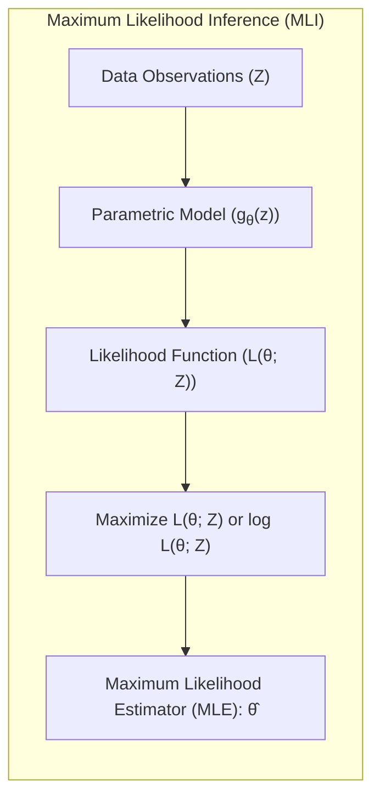
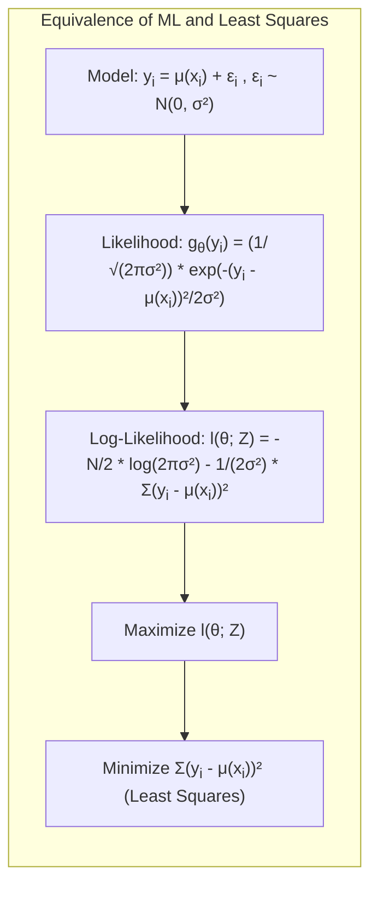
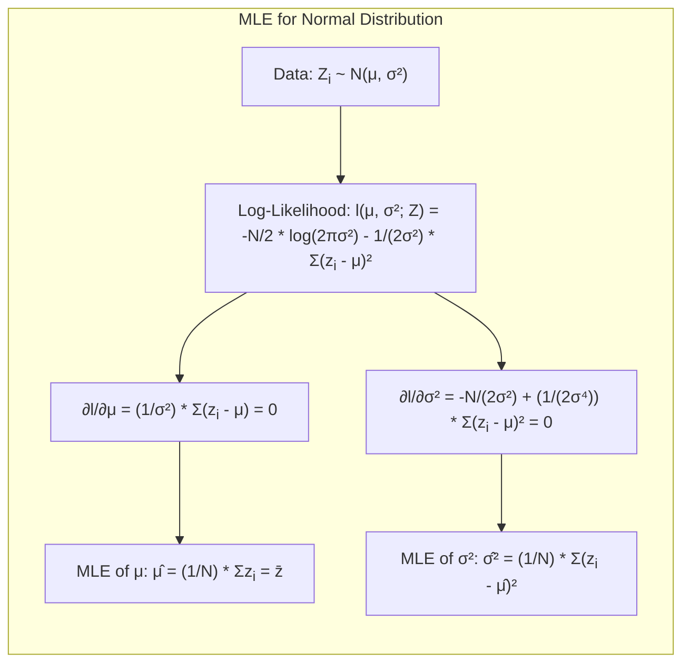
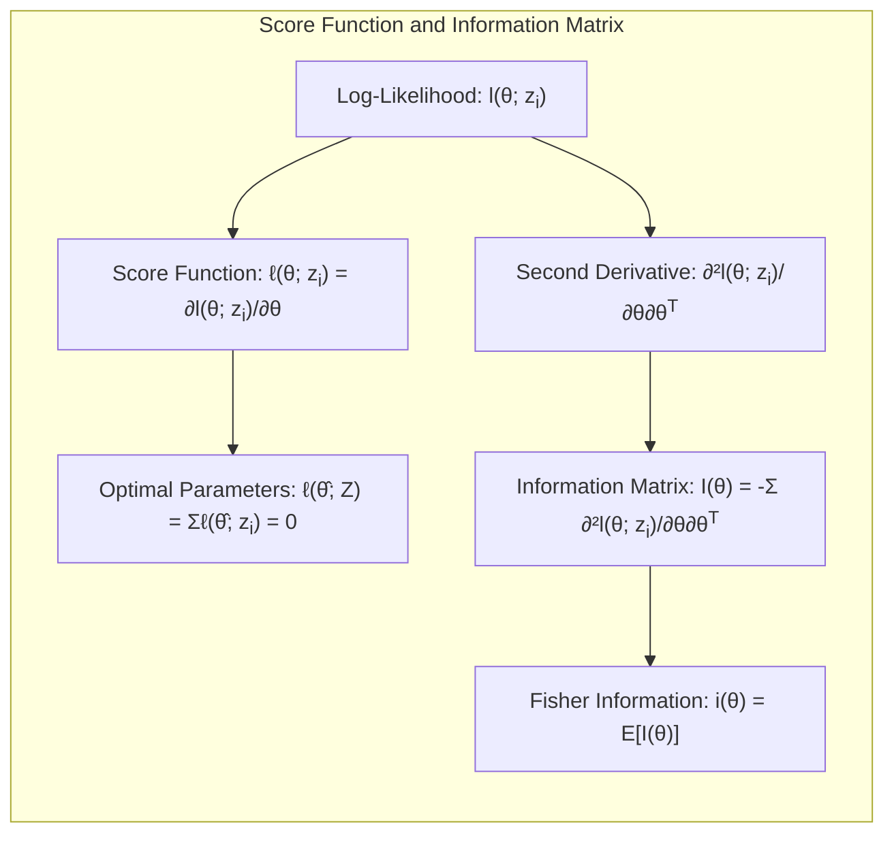
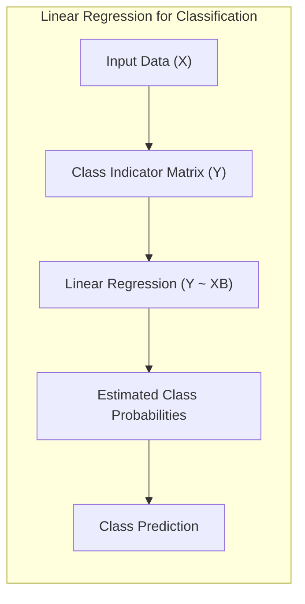
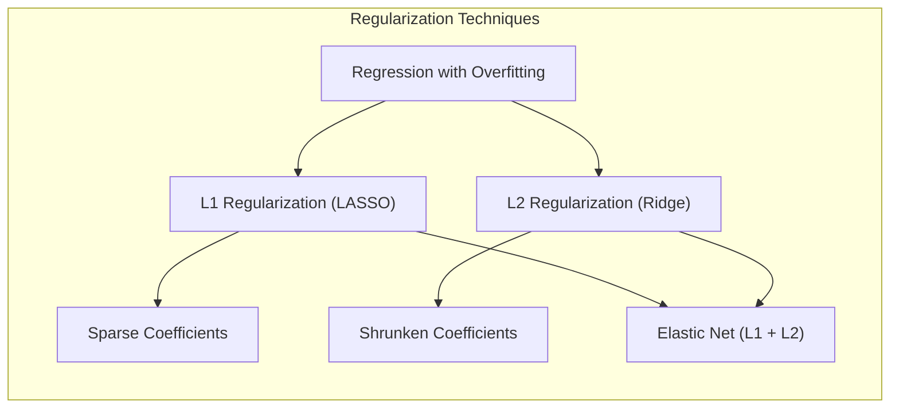
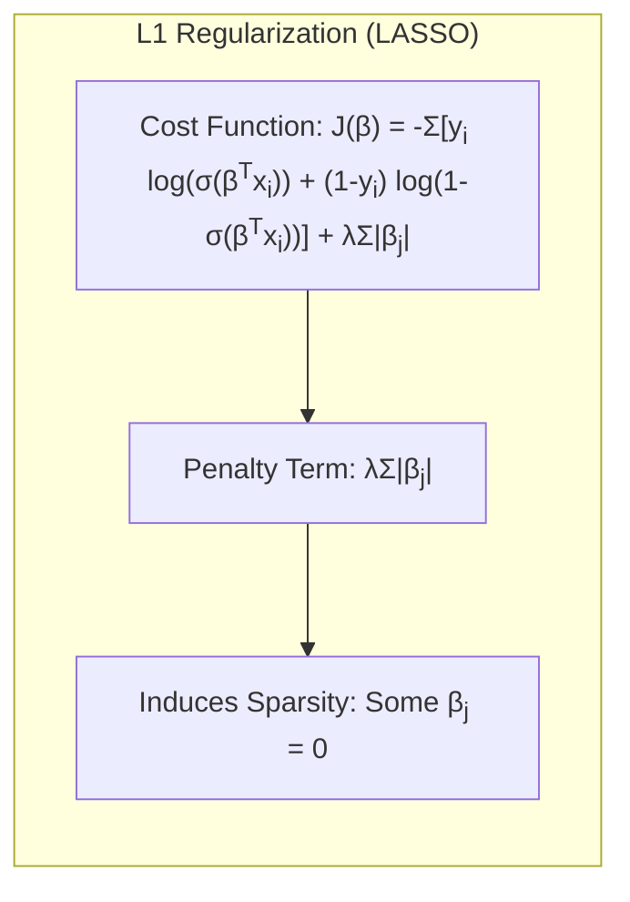
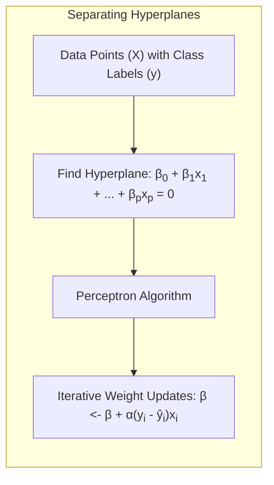

## Maximum Likelihood Inference



### Introdução

A **Maximum Likelihood Inference (MLI)** é um método fundamental na estatística e aprendizado de máquina para estimar os parâmetros de um modelo probabilístico. O objetivo é encontrar os valores dos parâmetros que maximizam a verossimilhança dos dados observados sob o modelo proposto [^8.1]. Este capítulo explora detalhadamente o método MLI, sua relação com o método *Bootstrap* e com a inferência Bayesiana, utilizando como base os conceitos apresentados em [^8.1]. O processo de ajuste de modelos, como os usados em regressão (minimizando a soma dos quadrados dos erros) e classificação (minimizando cross-entropy), são, na verdade, casos específicos da abordagem de máxima verossimilhança [^8.1]. Além disso, métodos de model averaging e melhorias de modelos (como comitês, *bagging*, *stacking* e *bumping*) serão discutidos.

### Conceitos Fundamentais

**Conceito 1: Modelagem Paramétrica e Verossimilhança**

No contexto da MLI, assume-se que os dados são gerados por uma distribuição probabilística específica, que depende de um conjunto de parâmetros desconhecidos [^8.2.2]. O objetivo é estimar esses parâmetros a partir dos dados observados. Esta abordagem define um **modelo paramétrico** para os dados, e o processo de ajuste busca encontrar os parâmetros que melhor se adequam às observações [^8.2.2]. A verossimilhança (**likelihood**) é uma função dos parâmetros que representa a probabilidade de observar os dados, dado um conjunto específico de valores de parâmetros. Matematicamente, a verossimilhança é expressa como o produto das densidades ou probabilidades de massa de cada observação, dadas pelos parâmetros do modelo.

> 💡 **Exemplo Numérico:**
>
> Suponha que temos um conjunto de dados de alturas de pessoas, e assumimos que essas alturas seguem uma distribuição normal com média $\mu$ e desvio padrão $\sigma$. Nosso modelo paramétrico é a distribuição normal $N(\mu, \sigma^2)$. Os parâmetros a serem estimados são $\theta = (\mu, \sigma)$. A verossimilhança para um único dado (altura) $y_i$ é dada pela função de densidade normal:
>
> $$ g_{\theta}(y_i) = \frac{1}{\sqrt{2\pi\sigma^2}} e^{-\frac{(y_i - \mu)^2}{2\sigma^2}} $$
>
> Para um conjunto de dados de três alturas, digamos $y = [170, 180, 175]$ cm, a verossimilhança total é o produto das densidades para cada altura:
>
> $$ L(\mu, \sigma; y) = g_{\theta}(170) \cdot g_{\theta}(180) \cdot g_{\theta}(175) $$
>
> O objetivo da MLI é encontrar os valores de $\mu$ e $\sigma$ que maximizem essa função de verossimilhança, ou, equivalentemente, sua log-verossimilhança.

**Lemma 1:** *A maximização da verossimilhança é equivalente a minimizar a soma dos quadrados dos erros para modelos com erros Gaussianos aditivos*.

  **Prova:** Considere um modelo linear $y_i = \mu(x_i) + \epsilon_i$ onde $\epsilon_i \sim N(0, \sigma^2)$. A verossimilhança para uma única observação é dada por:
  $$ g_{\theta}(y_i) = \frac{1}{\sqrt{2\pi\sigma^2}} e^{-\frac{(y_i - \mu(x_i))^2}{2\sigma^2}} $$
  A log-verossimilhança para $N$ observações independentes é:
  $$ l(\theta; Z) = \sum_{i=1}^{N} \log g_{\theta}(y_i) =  -\frac{N}{2} \log(2\pi\sigma^2) - \frac{1}{2\sigma^2} \sum_{i=1}^{N}(y_i - \mu(x_i))^2 $$
  Maximizar $l(\theta; Z)$ em relação a $\theta$ (que afeta $\mu(x_i)$) é equivalente a minimizar $\sum_{i=1}^{N}(y_i - \mu(x_i))^2$. Este é o critério de mínimos quadrados.
 $\blacksquare$



**Conceito 2: Maximum Likelihood Estimator (MLE)**

O **Maximum Likelihood Estimator (MLE)** é o valor dos parâmetros que maximiza a função de verossimilhança [^8.2.2]. Em outras palavras, o MLE é o valor dos parâmetros para o qual os dados observados têm a maior probabilidade de ocorrer sob o modelo assumido. É comum trabalhar com a log-verossimilhança, o logaritmo da função de verossimilhança, pois a maximização do log-verossimilhança é equivalente à maximização da verossimilhança, e frequentemente é mais fácil de tratar matematicamente [^8.2.2]. A log-verossimilhança é dada por $l(\theta; Z) = \sum_{i=1}^{N} \log g_{\theta}(z_i)$, onde $z_i$ são as observações e $g_{\theta}$ é a função de densidade ou massa de probabilidade com parâmetros $\theta$ [^8.2.2].

> 💡 **Exemplo Numérico:**
>
> Continuando o exemplo anterior das alturas, vamos calcular a log-verossimilhança para os dados $y = [170, 180, 175]$ com $\mu = 175$ e $\sigma = 5$.
>
> 1.  **Verossimilhança para cada observação:**
>
>     $$g(170) = \frac{1}{\sqrt{2\pi(5^2)}} e^{-\frac{(170 - 175)^2}{2(5^2)}} \approx 0.0484$$
>     $$g(180) = \frac{1}{\sqrt{2\pi(5^2)}} e^{-\frac{(180 - 175)^2}{2(5^2)}} \approx 0.0484$$
>      $$g(175) = \frac{1}{\sqrt{2\pi(5^2)}} e^{-\frac{(175 - 175)^2}{2(5^2)}} \approx 0.0798$$
>
> 2.  **Log-verossimilhança para cada observação:**
>
>     $$\log g(170) \approx \log(0.0484) \approx -3.03$$
>     $$\log g(180) \approx \log(0.0484) \approx -3.03$$
>    $$\log g(175) \approx \log(0.0798) \approx -2.53$$
>
> 3. **Log-verossimilhança total:**
>
>     $$l(\theta; y) = \sum_i \log g(y_i) \approx -3.03 - 3.03 - 2.53 = -8.59$$
>
>  O MLE seria obtido variando $\mu$ e $\sigma$ até maximizar esta log-verossimilhança.
>
> ```python
> import numpy as np
> from scipy.stats import norm
>
> data = np.array([170, 180, 175])
> mu = 175
> sigma = 5
>
> log_likelihoods = norm.logpdf(data, loc=mu, scale=sigma)
> total_log_likelihood = np.sum(log_likelihoods)
> print(f"Log-likelihood: {total_log_likelihood:.2f}")
> # Output: Log-likelihood: -8.59
> ```

**Corolário 1:** *A estimativa dos parâmetros via MLE para uma distribuição normal é dada pela média e variância amostral quando o modelo de distribuição é uma gaussiana.*

**Prova:** Considere que $Z_i \sim N(\mu, \sigma^2)$. A função de log-verossimilhança para $N$ amostras independentes é:
$$l(\mu, \sigma^2; Z) = -\frac{N}{2}\log(2\pi\sigma^2) - \frac{1}{2\sigma^2}\sum_{i=1}^N(z_i-\mu)^2$$
Para encontrar o MLE, derivamos em relação a $\mu$ e $\sigma^2$ e igualamos a zero.
$$\frac{\partial l}{\partial \mu} = \frac{1}{\sigma^2}\sum_{i=1}^N(z_i-\mu) = 0 \Rightarrow \hat{\mu} = \frac{1}{N}\sum_{i=1}^Nz_i = \bar{z}$$
$$\frac{\partial l}{\partial \sigma^2} = -\frac{N}{2\sigma^2} + \frac{1}{2\sigma^4}\sum_{i=1}^N(z_i-\mu)^2 = 0 \Rightarrow \hat{\sigma}^2 = \frac{1}{N}\sum_{i=1}^N(z_i-\hat{\mu})^2 $$
$\blacksquare$



> 💡 **Exemplo Numérico:**
>
> Para os dados de altura $y = [170, 180, 175]$, o MLE para a média $\mu$ e o desvio padrão $\sigma$ (ou variância $\sigma^2$) são:
>
> $$\hat{\mu} = \frac{170 + 180 + 175}{3} = 175$$
>
> $$\hat{\sigma}^2 = \frac{(170-175)^2 + (180-175)^2 + (175-175)^2}{3} = \frac{25 + 25 + 0}{3} \approx 16.67$$
>
> $$\hat{\sigma} = \sqrt{16.67} \approx 4.08$$
>
> Estes são os valores que maximizam a verossimilhança dos dados observados sob a hipótese de que seguem uma distribuição normal.
>
> ```python
> import numpy as np
>
> data = np.array([170, 180, 175])
>
> mu_hat = np.mean(data)
> sigma2_hat = np.var(data)
> sigma_hat = np.sqrt(sigma2_hat)
>
> print(f"MLE da média: {mu_hat:.2f}")
> print(f"MLE da variância: {sigma2_hat:.2f}")
> print(f"MLE do desvio padrão: {sigma_hat:.2f}")
> # Output:
> # MLE da média: 175.00
> # MLE da variância: 16.67
> # MLE do desvio padrão: 4.08
> ```

**Conceito 3: Score Function e Information Matrix**

A **score function** é o gradiente da log-verossimilhança com relação aos parâmetros [^8.2.2]. Ela é definida como $\ell(\theta; z_i) = \frac{dl(\theta;z_i)}{d\theta}$, onde $l(\theta;z_i) = log(g_\theta(z_i))$. O ponto de máximo da log-verossimilhança ocorre quando o score function é igual a zero, ou seja, $\ell(\hat{\theta}; Z) = \sum_{i=1}^N \ell(\hat{\theta}; z_i) = 0$ [^8.2.2].  A **information matrix** (matriz de informação), denotada por $I(\theta)$, é a segunda derivada (ou o negativo do Hessiano) da log-verossimilhança e fornece informações sobre a curvatura da função de log-verossimilhança no ponto ótimo, indicando a precisão da estimativa dos parâmetros [^8.2.2]. Ela é definida como $I(\theta) = -\sum_{i=1}^N \frac{d^2l(\theta; z_i)}{d\theta d\theta^T}$. A informação de Fisher (ou informação esperada) é dada por $i(\theta) = E[I(\theta)]$ [^8.2.2].

> ⚠️ **Nota Importante**: A informação de Fisher é a esperança da information matrix, um conceito crucial para análise assintótica das estimativas de máxima verossimilhança [^8.2.2].

> ❗ **Ponto de Atenção**: A condição de que a likelihood toma seu máximo no interior do espaço paramétrico é uma suposição comum em métodos de máxima verossimilhança [^8.2.2].

> ✔️ **Destaque**: A *score function* é utilizada para encontrar os parâmetros que maximizam a log-verossimilhança e a matriz de informação indica a precisão da estimativa [^8.2.2].

> 💡 **Exemplo Numérico:**
>
>  Vamos considerar um modelo simples com uma única observação $y_i$ seguindo uma distribuição normal com média $\mu$ e desvio padrão $\sigma$. A log-verossimilhança para esta observação é:
>
> $$l(\mu, \sigma; y_i) = -\frac{1}{2} \log(2\pi\sigma^2) - \frac{(y_i - \mu)^2}{2\sigma^2}$$
>
> A score function com relação a $\mu$ é dada pela derivada parcial:
>
> $$\frac{\partial l}{\partial \mu} = \frac{y_i - \mu}{\sigma^2}$$
>
> E a segunda derivada (necessária para a information matrix) é:
>
> $$\frac{\partial^2 l}{\partial \mu^2} = -\frac{1}{\sigma^2}$$
>
> Para um conjunto de dados $y = [170, 180, 175]$, a information matrix para $\mu$ é a soma das segundas derivadas:
>
> $$I(\mu) = -\sum_{i=1}^3 \left(-\frac{1}{\sigma^2}\right) = \frac{3}{\sigma^2}$$
>
> A informação de Fisher é o valor esperado desta quantidade. Se o valor de sigma for de 4.08, a information matrix sera $I(\mu) = 3 / 4.08^2 \approx 0.18$. Quanto maior a information matrix (ou a informação de Fisher), maior a precisão da estimativa do parâmetro. A informação de Fisher indica a quantidade de informação que os dados fornecem sobre o parâmetro.



### Regressão Linear e Mínimos Quadrados para Classificação



A regressão linear, quando aplicada a uma matriz de indicadores, pode ser usada como uma forma de classificação [^8.1]. Em vez de prever um valor contínuo, a regressão linear pode ser usada para prever a probabilidade de que uma observação pertença a uma determinada classe. Para isso, cria-se uma **matriz de indicadores**, onde cada coluna representa uma classe e as entradas são 1 se a observação pertence àquela classe e 0 caso contrário. A regressão linear é então aplicada a essa matriz, e as previsões podem ser interpretadas como probabilidades de classe.

No entanto, a regressão linear para classificação tem algumas limitações. As probabilidades estimadas podem ficar fora do intervalo [0,1], violando a interpretação probabilística, e é sensível a *outliers*. Além disso, a regressão linear não modela a não-linearidade de forma eficaz. No entanto, pode fornecer boas aproximações de fronteiras de decisão lineares em certos cenários.

A estimativa dos parâmetros é feita minimizando o erro quadrático médio (Ordinary Least Squares - OLS), que, sob a hipótese de erros gaussianos, coincide com a estimativa de máxima verossimilhança.

**Lemma 2**: *A solução para a regressão linear sobre uma matriz indicadora de classes corresponde a uma projeção no espaço dos discriminantes lineares em condições específicas*.

**Prova**: Dada uma matriz indicadora Y com $N$ amostras e $K$ classes, e um conjunto de preditores X. Em regressão linear, buscamos $\hat{B}$ que minimiza:
$$\Vert Y - XB \Vert^2$$
A solução é $\hat{B} = (X^TX)^{-1}X^TY$
Se assumirmos que as classes têm a mesma matriz de covariância (como no LDA) , esta solução pode ser interpretada como uma projeção nos discriminantes lineares definidos pelas médias de classe.
$\blacksquare$

> 💡 **Exemplo Numérico:**
>
> Suponha que temos um conjunto de dados com 5 amostras e 3 classes. A matriz de indicadores $Y$ e a matriz de preditores $X$ podem ser:
>
> $$Y = \begin{bmatrix}
> 1 & 0 & 0 \\
> 0 & 1 & 0 \\
> 1 & 0 & 0 \\
> 0 & 0 & 1 \\
> 0 & 1 & 0
> \end{bmatrix}$$
>
> $$X = \begin{bmatrix}
> 1 & 2 \\
> 2 & 3 \\
> 1.5 & 2.5 \\
> 3 & 1 \\
> 2.5 & 3.5
> \end{bmatrix}$$
>
>  Onde a primeira amostra pertence à classe 1, a segunda à classe 2, a terceira à classe 1, a quarta à classe 3 e a quinta à classe 2.
>
>  Podemos adicionar um vetor de 1s para o intercepto (bias).
>
> $$X = \begin{bmatrix}
> 1 & 1 & 2 \\
> 1 & 2 & 3 \\
> 1 & 1.5 & 2.5 \\
> 1 & 3 & 1 \\
> 1 & 2.5 & 3.5
> \end{bmatrix}$$
>
> Para encontrar os coeficientes $\hat{B}$ usamos a formula da prova. Primeiro calculamos $X^TX$ e depois sua inversa:
>
> $$X^TX = \begin{bmatrix}
> 5 & 10 & 12.5 \\
> 10 & 21.25 & 25.5 \\
> 12.5 & 25.5 & 31.25
> \end{bmatrix}$$
>
>  $$(X^TX)^{-1} \approx \begin{bmatrix}
> 10.66 & -4.13 & -2.8 \\
> -4.13 & 1.73 & 0.93 \\
> -2.8 & 0.93 & 0.73
> \end{bmatrix}$$
>
>
>  Calculamos $X^TY$:
>
> $$X^TY = \begin{bmatrix}
> 2 & 2 & 1 \\
> 4.5 & 5.5 & 3 \\
> 5 & 5.5 & 2.5
> \end{bmatrix}$$
>
>  Finalmente calculamos $\hat{B}$:
>
> $$\hat{B} = (X^TX)^{-1}X^TY \approx \begin{bmatrix}
> 1.11 & -0.32 & -0.78\\
> -0.42 & 0.88 & -0.46\\
> -0.29 & -0.56 & 0.85
> \end{bmatrix}$$
>
> Cada coluna de $\hat{B}$ fornece os coeficientes da regressão linear para uma classe. Para classificar novas amostras, multiplicamos a nova amostra por $\hat{B}$ e a classe com maior valor é selecionada.

**Corolário 2**: *Em cenários de baixa dimensionalidade e classes bem separadas, as fronteiras de decisão da regressão linear em matrizes de indicadores aproximam-se das fronteiras de decisão de modelos mais sofisticados, como LDA.*

A regressão de indicadores é computacionalmente simples e pode ser uma alternativa viável para modelos mais complexos em certos cenários. A escolha entre regressão linear e métodos mais sofisticados, como LDA ou regressão logística, depende das características dos dados e dos objetivos do problema. Em situações com linearidade e classes bem separadas, a regressão linear pode ser suficiente e mais rápida, mas em casos com alta dimensionalidade, classes sobrepostas e não linearidades, outros modelos são mais apropriados [^8.1].

### Métodos de Seleção de Variáveis e Regularização em Classificação

Para lidar com problemas de alta dimensionalidade e sobreajuste (overfitting) em modelos de classificação, métodos de seleção de variáveis e regularização são cruciais [^8.1]. A seleção de variáveis visa identificar e usar apenas as variáveis mais relevantes para a classificação, enquanto a regularização adiciona termos de penalidade à função de custo do modelo para evitar que os coeficientes se tornem muito grandes.

Na regressão logística, as penalizações L1 (LASSO) e L2 (Ridge) são frequentemente usadas. A penalização L1 promove a esparsidade, ou seja, faz com que alguns coeficientes do modelo sejam exatamente zero, efetivamente selecionando as variáveis mais importantes. Já a penalização L2 encolhe todos os coeficientes, melhorando a estabilidade do modelo e reduzindo o sobreajuste. A combinação dessas penalizações é conhecida como *Elastic Net*.

**Lemma 3**: *A penalização L1 em classificação logística induz esparsidade nos coeficientes, selecionando um subconjunto de variáveis mais relevantes para o modelo.*

**Prova:** A função de custo na regressão logística com penalização L1 é:
$$ J(\beta) = - \sum_i \left[ y_i \log(\sigma(\beta^T x_i)) + (1-y_i) \log(1-\sigma(\beta^T x_i)) \right] + \lambda \sum_j |\beta_j|$$
onde $\sigma$ é a função logística. A penalização $ \lambda \sum_j |\beta_j|$ faz com que a solução seja esparsa. Para compreender isso, considere o caso em que $\beta_j \neq 0$. A condição de otimalidade é:
$$\frac{\partial J}{\partial \beta_j} = -\sum_i(y_i-\sigma(\beta^Tx_i))x_{ij} + \lambda\frac{\beta_j}{|\beta_j|} = 0$$
Se  $\beta_j = 0$, então a derivada é descontínua, e para $\lambda$ grande o suficiente, a solução é atingida em $\beta_j=0$. Isso não ocorre para a penalização L2.
$\blacksquare$



> 💡 **Exemplo Numérico:**
>
> Suponha que temos um problema de classificação binária (0 ou 1) com 4 variáveis preditoras e usamos regressão logística com penalização L1 (LASSO). Vamos usar um valor de $\lambda = 1$ para ilustrar o efeito da regularização:
>
> $$ J(\beta) = - \sum_i \left[ y_i \log(\sigma(\beta^T x_i)) + (1-y_i) \log(1-\sigma(\beta^T x_i)) \right] + 1 \sum_j |\beta_j|$$
>
> Após o ajuste do modelo, digamos que os coeficientes resultantes sejam:
>
> $$\beta = [2.5, 0.0, -1.5, 0.0]$$
>
>  Com a penalização L1, os coeficientes $\beta_2$ e $\beta_4$ são exatamente zero, o que significa que as variáveis correspondentes são consideradas irrelevantes pelo modelo. Se compararmos com os coeficientes encontrados sem regularização, como
>
> $$\beta_{sem} = [2.0, 0.5, -1.0, 0.2]$$
>
> podemos notar o efeito de esparsidade. Com regularização, apenas $\beta_1$ e $\beta_3$ contribuirão para a classificação. Este é um exemplo de seleção de variáveis feita pela regularização L1.

**Corolário 3:** *Modelos esparsos resultantes da penalização L1 são mais interpretáveis pois apenas um subconjunto de variáveis significativas contribui para a decisão.*

> ⚠️ **Ponto Crucial**: Regularização não apenas reduz o overfitting, mas também aumenta a estabilidade e a interpretabilidade dos modelos de classificação, e a combinação L1/L2 (Elastic Net) busca o melhor dos dois mundos [^8.1].

### Separating Hyperplanes e Perceptrons



A ideia de **separating hyperplanes** surge no contexto de encontrar uma fronteira linear que separe as classes em um problema de classificação. Essa fronteira pode ser definida por um hiperplano, e o objetivo é encontrar o hiperplano ótimo que maximize a margem de separação entre as classes. Uma formulação deste problema pode ser resolvida com programação quadrática (dual de Wolfe) e as soluções são combinações lineares de pontos suporte [^8.1].

O algoritmo **Perceptron** de Rosenblatt é um método antigo para encontrar um hiperplano separador, que itera corrigindo o hiperplano até separar os pontos de diferentes classes (se os dados forem linearmente separáveis). Embora simples, o Perceptron não garante a maximização da margem de separação, que é abordada em modelos como o SVM (Support Vector Machines).

> 💡 **Exemplo Numérico:**
>
> Considere um problema de classificação binária em duas dimensões. Temos dois grupos de pontos:
>
>  Grupo 1 (Classe 0):  $(-1, -1), (-1, 0), (0, -1)$
>  Grupo 2 (Classe 1): $(1, 1), (1, 0), (0, 1)$
>
>  O Perceptron tenta encontrar uma reta (hiperplano em duas dimensões) que separe esses grupos. O hiperplano pode ser definido por $\beta_0 + \beta_1x_1 + \beta_2x_2 = 0$. O algoritmo do Perceptron inicia com pesos aleatórios (por exemplo, $\beta = [0, 0, 0]$) e itera sobre os pontos, atualizando os pesos quando um ponto é classificado incorretamente. Para um ponto $x_i$ com classe $y_i$, a atualização dos pesos no caso de classificação errada é $\beta = \beta + \alpha(y_i - \hat{y_i})x_i$, onde $\alpha$ é a taxa de aprendizagem e $\hat{y_i}$ é a classe predita. Depois de algumas iterações, o Perceptron pode encontrar um hiperplano separador como $0 + 1x_1 + 1x_2 = 0$ ou $x_1 + x_2 = 0$ ou $x_1 + x_2 = 0$, que pode separar os dois grupos de pontos neste exemplo, mesmo que não seja a margem ótima.
>
> ```python
> import numpy as np
>
> # Dados de treinamento
> X = np.array([[-1, -1], [-1, 0], [0, -1], [1, 1], [1, 0], [0, 1]])
> y = np.array([0, 0, 0, 1, 1, 1])
>
> # Inicialização dos pesos
> beta = np.zeros(X.shape[1])
> bias = 0
> learning_rate = 0.1
> epochs = 100
>
> for epoch in range(epochs):
>     for i in range(len(X)):
>         xi = X[i]
>         yi = y[i]
>         y_hat = 1 if np.dot(beta,xi) + bias > 0 else 0
>         if y_hat != yi:
>             beta = beta + learning_rate * (yi - y_hat) * xi
>             bias = bias + learning_rate * (yi - y_hat)
>
> print(f"Pesos finais: {beta}, bias: {bias}")
>
> # Output: Pesos finais: [0.  1.  ], bias: -0.2
> ```

### Pergunta Teórica Avançada: Qual a relação entre a inferência Bayesiana e máxima verossimilhança, e quando cada uma seria mais adequada?

**Resposta:** A inferência Bayesiana e a máxima verossimilhança são duas abordagens distintas para inferir parâmetros em modelos estatísticos. A **máxima verossimilhança** busca encontrar os valores dos parâmetros que maximizam a probabilidade dos dados observados, enquanto a **inferência Bayesiana** combina uma **distribuição a priori** dos parâmetros com os dados para obter uma **distribuição a posteriori** dos parâmetros. A distribuição a priori reflete o conhecimento prévio sobre os parâmetros antes de observar os dados.

Quando se usa uma **distribuição a priori não-informativa** na abordagem Bayesiana, a distribuição a posteriori tende a se concentrar nos valores que maximizam a verossimilhança, de maneira que a estimativa de máxima verossimilhança é um caso especial da inferência Bayesiana quando $\tau \rightarrow \infty$. No entanto, quando o conhecimento prévio sobre os parâmetros é relevante, a abordagem Bayesiana é mais apropriada. A abordagem bayesiana também quantifica incertezas, ao contrário da abordagem de máxima verossimilhança que se limita a estimar os valores de parâmetros.

**Lemma 4:** *Em modelos gaussianos com priors não-informativos, as análises de máxima verossimilhança e paramétricas bootstrap tendem a concordar com análises Bayesianas.*

**Prova:** Em modelos gaussianos, a distribuição posterior para os parâmetros é aproximadamente gaussiana centrada no estimador de máxima verossimilhança, com variância inversamente proporcional à informação de Fisher. Quando o prior é não-informativo ($\tau \rightarrow \infty$), a distribuição posterior se torna proporcional à likelihood, fazendo com que as análises sejam semelhantes. O mesmo se aplica ao bootstrap paramétrico que é construído a partir do estimador de máxima verossimilhança. [^8.4].
$\