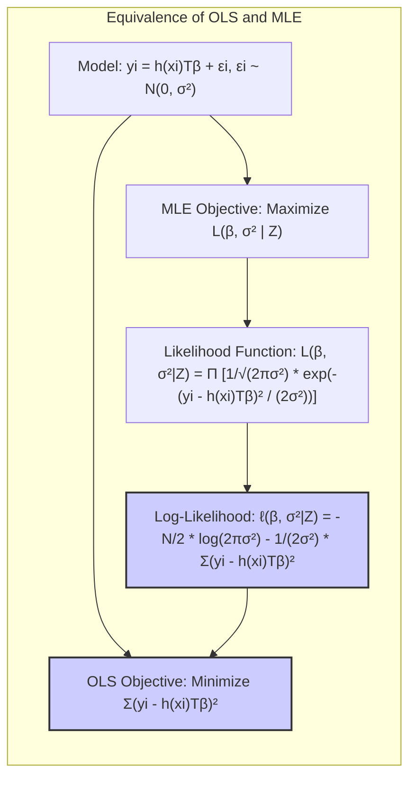
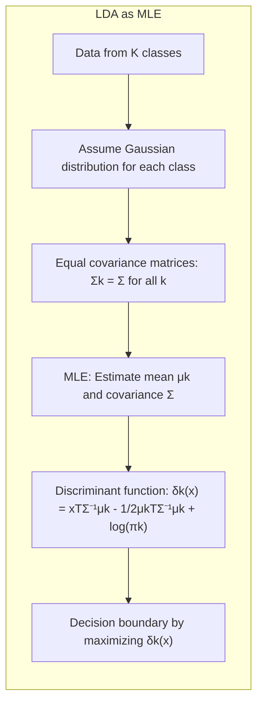
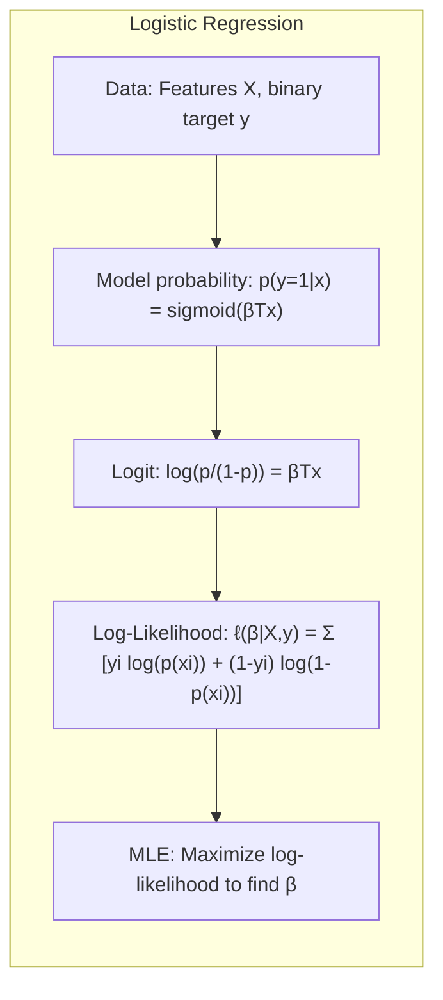
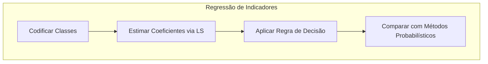
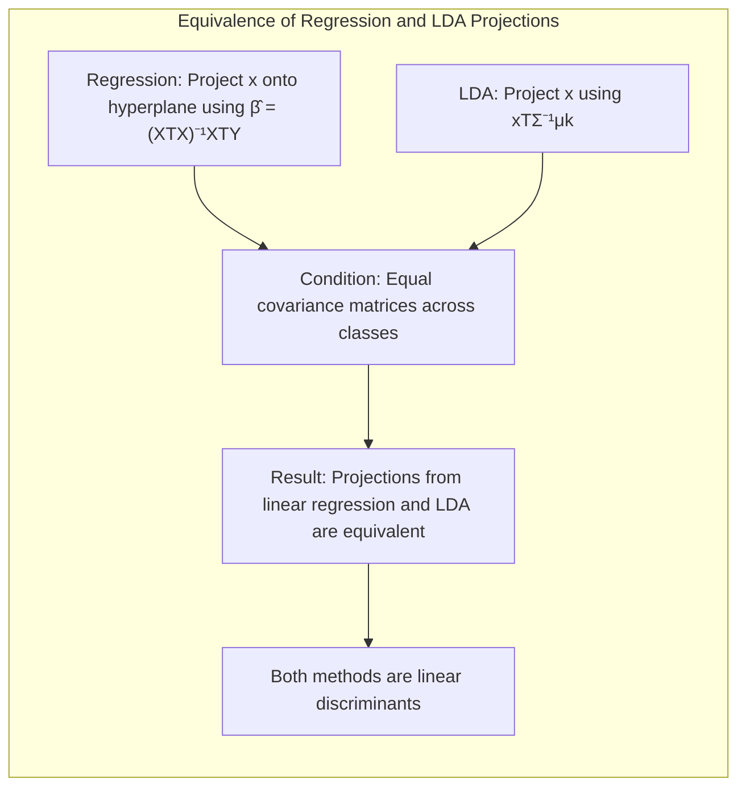
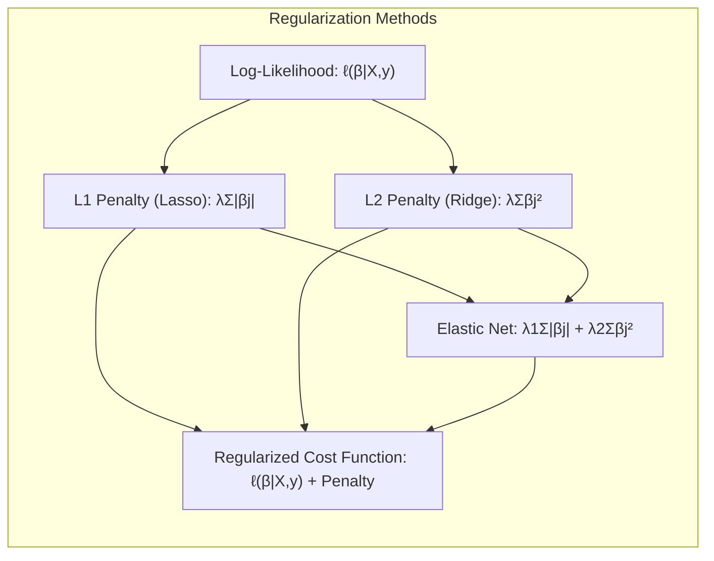

## Maximum Likelihood: A Comprehensive Overview

<imagem: Mapa mental abrangente que conecta Maximum Likelihood estimation (MLE) com outros conceitos como Bootstrap, Bayesian methods, EM algorithm, model averaging e stacking, e stochastic search.>

### Introdução

A **Maximum Likelihood Estimation (MLE)** é um dos pilares da inferência estatística e do aprendizado de máquina, servindo como um método fundamental para estimar os parâmetros de um modelo estatístico a partir de dados observados [^8.1]. Ao contrário da minimização de somas de quadrados ou entropia cruzada, que são casos específicos da MLE, este capítulo explora a MLE em sua forma geral, bem como suas conexões com outros métodos importantes, como o bootstrap e a inferência Bayesiana. Além disso, abordaremos técnicas relacionadas à média e melhoria de modelos.

### Conceitos Fundamentais

**Conceito 1:** O **problema de estimação de parâmetros** é central para modelagem estatística e aprendizado de máquina. Dado um conjunto de dados observado $Z = \{z_1, z_2, \ldots, z_N\}$, onde cada $z_i$ pode ser um vetor de características e respostas, o objetivo é encontrar os parâmetros $\theta$ de um modelo estatístico que melhor se ajustam a esses dados. Em vez de minimizar uma função de perda arbitrária, a MLE busca maximizar a *verossimilhança* (likelihood), que quantifica o quão bem os parâmetros do modelo explicam os dados observados [^8.1]. Para modelos lineares, em geral, o viés e a variância desempenham papéis importantes, onde modelos mais simples (com menor número de parâmetros) tendem a ter maior viés e menor variância, enquanto modelos mais complexos tendem a ter menor viés e maior variância. A MLE tenta encontrar um equilíbrio entre esses dois aspectos, buscando os parâmetros que melhor se adequam aos dados sem serem excessivamente influenciados por ruídos ou padrões específicos do conjunto de dados.

> 💡 **Exemplo Numérico:** Imagine que estamos modelando a altura de pessoas em função de sua idade. Temos um conjunto de dados com as alturas de 10 pessoas em diferentes idades:
>
> ```python
> import numpy as np
> import matplotlib.pyplot as plt
> from sklearn.linear_model import LinearRegression
>
> # Dados de exemplo: (idade, altura)
> idades = np.array([2, 3, 4, 5, 6, 7, 8, 9, 10, 11]).reshape(-1, 1)
> alturas = np.array([80, 90, 100, 110, 118, 128, 135, 143, 150, 158])
>
> # Ajustando um modelo linear usando mínimos quadrados (equivalente à MLE sob normalidade)
> model = LinearRegression()
> model.fit(idades, alturas)
>
> # Obtendo os parâmetros estimados
> intercepto = model.intercept_
> coeficiente = model.coef_[0]
>
> print(f"Intercepto: {intercepto:.2f}")
> print(f"Coeficiente: {coeficiente:.2f}")
>
> # Visualização dos dados e da reta de regressão
> plt.scatter(idades, alturas, color='blue', label='Dados Observados')
> plt.plot(idades, model.predict(idades), color='red', label='Reta de Regressão')
> plt.xlabel('Idade (anos)')
> plt.ylabel('Altura (cm)')
> plt.title('Regressão Linear: Altura vs Idade')
> plt.legend()
> plt.grid(True)
> plt.show()
> ```
>
>  Neste exemplo, ao aplicar regressão linear (que é equivalente a MLE sob a suposição de erros Gaussianos), o modelo encontra um intercepto de aproximadamente 65.73 e um coeficiente de 9.09. Isso significa que a altura inicial (quando a idade é 0) seria de 65.73cm, e que a altura aumenta em média 9.09cm por ano. A linha vermelha no gráfico representa o modelo ajustado, que tenta se aproximar o máximo possível dos dados observados (pontos azuis). A MLE encontrou os parâmetros do modelo (intercepto e coeficiente) que tornam os dados observados mais prováveis.

**Lemma 1:** Em um contexto de regressão linear com erros Gaussianos, a estimativa de mínimos quadrados é equivalente à estimativa de máxima verossimilhança. Matematicamente, se o modelo é $y_i = \mathbf{h}(x_i)^T\beta + \epsilon_i$, onde $\epsilon_i \sim \mathcal{N}(0, \sigma^2)$, então minimizar a soma dos erros quadrados,  $\sum_{i=1}^N (y_i - \mathbf{h}(x_i)^T\beta)^2$, é equivalente a maximizar a função de verossimilhança (likelihood) correspondente, $L(\beta, \sigma^2 | Z)$.



*Prova:* A função de verossimilhança para um conjunto de dados Gaussianos independentes é
$$L(\beta, \sigma^2|Z) = \prod_{i=1}^{N} \frac{1}{\sqrt{2\pi\sigma^2}} \exp\left(-\frac{(y_i - \mathbf{h}(x_i)^T\beta)^2}{2\sigma^2}\right).$$
Tomando o logaritmo da verossimilhança (log-likelihood), obtemos
$$\ell(\beta, \sigma^2|Z) = -\frac{N}{2} \log(2\pi\sigma^2) - \frac{1}{2\sigma^2} \sum_{i=1}^{N} (y_i - \mathbf{h}(x_i)^T\beta)^2.$$
Maximizar a log-likelihood é equivalente a minimizar a soma dos quadrados dos erros, a qual é a solução encontrada na regressão de mínimos quadrados, demonstrando a equivalência entre esses métodos sob suposições gaussianas. $\blacksquare$

> 💡 **Exemplo Numérico:** Vamos detalhar a equivalência entre MLE e mínimos quadrados na regressão linear com dados simulados.
>
> Suponha que temos um modelo linear $y = 2x + 1 + \epsilon$, onde $\epsilon \sim \mathcal{N}(0, 0.5^2)$. Geramos 10 pontos de dados com ruído gaussiano:
>
> ```python
> import numpy as np
> from scipy.optimize import minimize
>
> # Gerando dados simulados
> np.random.seed(42)
> X = np.linspace(0, 5, 10).reshape(-1, 1)  # Características
> true_beta_0 = 1
> true_beta_1 = 2
> epsilon = np.random.normal(0, 0.5, 10) # Erro gaussiano
> y = true_beta_1 * X.flatten() + true_beta_0 + epsilon # Respostas
>
> # Função de log-verossimilhança negativa para otimização
> def neg_log_likelihood(params, X, y):
>     beta_0 = params[0]
>     beta_1 = params[1]
>     sigma = params[2]
>     y_hat = beta_1 * X.flatten() + beta_0
>     n = len(y)
>     loglik = -n/2 * np.log(2 * np.pi * sigma**2) - 1/(2*sigma**2) * np.sum((y - y_hat)**2)
>     return -loglik # Negativo porque o scipy.optimize minimiza, enquanto queremos maximizar a log-verossimilhança
>
> # Estimativa de mínimos quadrados
> X_b = np.c_[np.ones(len(X)), X]
> beta_ols = np.linalg.inv(X_b.T @ X_b) @ X_b.T @ y
>
> # Estimativa de máxima verossimilhança
> initial_params = [0, 0, 1] # Inicialização dos parâmetros (beta_0, beta_1, sigma)
> result = minimize(neg_log_likelihood, initial_params, args=(X, y))
> beta_mle = result.x
>
> print("Estimativas OLS (Mínimos Quadrados):")
> print(f"beta_0 = {beta_ols[0]:.3f}, beta_1 = {beta_ols[1]:.3f}")
> print("\nEstimativas MLE (Máxima Verossimilhança):")
> print(f"beta_0 = {beta_mle[0]:.3f}, beta_1 = {beta_mle[1]:.3f}, sigma = {beta_mle[2]:.3f}")
>
> # Visualização dos resultados
> plt.scatter(X, y, color='blue', label='Dados Observados')
> plt.plot(X, beta_ols[0] + beta_ols[1] * X, color='red', label='OLS')
> plt.plot(X, beta_mle[0] + beta_mle[1] * X, color='green', linestyle='--', label='MLE')
> plt.xlabel('x')
> plt.ylabel('y')
> plt.title('Comparação: OLS vs MLE')
> plt.legend()
> plt.grid(True)
> plt.show()
> ```
>
> Neste exemplo, os resultados mostram que as estimativas de mínimos quadrados (OLS) e máxima verossimilhança (MLE) para os coeficientes $\beta_0$ e $\beta_1$ são muito próximas, validando a equivalência teórica. O gráfico visualiza os dados, a reta ajustada por OLS e a reta ajustada por MLE. As retas estão praticamente sobrepostas, indicando a equivalência prática das duas abordagens.

**Conceito 2:** A **Linear Discriminant Analysis (LDA)** é um método para classificação que assume que cada classe tem uma distribuição Gaussiana com a mesma matriz de covariância [^8.3]. A fronteira de decisão é obtida projetando os dados em um subespaço de menor dimensão e determinando onde essa projeção separa as classes. A função discriminante linear utilizada na LDA é derivada da maximização da função de verossimilhança, levando a uma solução que envolve a inversão da matriz de covariância amostral. As suposições de normalidade e igualdade das matrizes de covariância entre as classes são cruciais para o funcionamento da LDA. Se essas suposições não forem válidas, a performance da LDA pode ser prejudicada. A LDA pode ser vista como um caso especial da MLE, onde as estimativas dos parâmetros das distribuições Gaussianas são obtidas maximizando a verossimilhança, e essas estimativas são usadas para definir as fronteiras de decisão [^8.3.2].



**Corolário 1:** A função discriminante da LDA é uma função linear da forma $\delta_k(x) = x^T\Sigma^{-1}\mu_k - \frac{1}{2}\mu_k^T\Sigma^{-1}\mu_k + \log(\pi_k)$, onde $\Sigma$ é a matriz de covariância conjunta, $\mu_k$ é a média da classe k, e $\pi_k$ é a probabilidade a priori da classe k [^8.3.1]. A derivação dessa função discriminante é feita explicitamente na seção 4.3.1 e essa função surge naturalmente do procedimento de maximização da verossimilhança sob as suposições do modelo LDA.

> 💡 **Exemplo Numérico:** Vamos ilustrar o conceito de LDA com um exemplo numérico, onde temos dados de duas classes com distribuições gaussianas com a mesma matriz de covariância.
>
> ```python
> import numpy as np
> import matplotlib.pyplot as plt
> from sklearn.discriminant_analysis import LinearDiscriminantAnalysis
> from sklearn.preprocessing import StandardScaler
>
> # Dados de exemplo (duas classes)
> np.random.seed(42)
> mean_class1 = [2, 2]
> cov_class1 = [[1, 0.5], [0.5, 1]]
> class1 = np.random.multivariate_normal(mean_class1, cov_class1, 50)
>
> mean_class2 = [5, 5]
> cov_class2 = [[1, 0.5], [0.5, 1]]
> class2 = np.random.multivariate_normal(mean_class2, cov_class2, 50)
>
> # Preparando os dados para o LDA
> X = np.concatenate((class1, class2))
> y = np.concatenate((np.zeros(50), np.ones(50)))
>
> # Padronizando os dados para melhorar a estabilidade do LDA
> scaler = StandardScaler()
> X_scaled = scaler.fit_transform(X)
>
> # Aplicando LDA
> lda = LinearDiscriminantAnalysis()
> lda.fit(X_scaled, y)
>
> # Coeficientes e intercepto
> coef = lda.coef_[0]
> intercept = lda.intercept_[0]
>
> print(f"Coeficientes LDA: {coef}")
> print(f"Intercepto LDA: {intercept}")
>
> # Visualização dos dados e da fronteira de decisão
> x_min, x_max = X_scaled[:, 0].min() - 1, X_scaled[:, 0].max() + 1
> y_min, y_max = X_scaled[:, 1].min() - 1, X_scaled[:, 1].max() + 1
> xx, yy = np.meshgrid(np.linspace(x_min, x_max, 200),
>                      np.linspace(y_min, y_max, 200))
> Z = lda.predict(np.c_[xx.ravel(), yy.ravel()])
> Z = Z.reshape(xx.shape)
>
> plt.contourf(xx, yy, Z, cmap=plt.cm.RdBu, alpha=0.3)
> plt.scatter(X_scaled[:, 0], X_scaled[:, 1], c=y, cmap=plt.cm.RdBu, edgecolor='k')
> plt.xlabel('Feature 1 (Padronizada)')
> plt.ylabel('Feature 2 (Padronizada)')
> plt.title('LDA: Fronteira de Decisão')
> plt.grid(True)
> plt.show()
> ```
>
> O código simula dados de duas classes e aplica a LDA, que encontra um hiperplano linear para separar as classes.  Os coeficientes e o intercepto encontrados descrevem esse hiperplano. O gráfico mostra os pontos de dados e a fronteira de decisão encontrada pela LDA. A linha representa onde as classes são separadas, buscando maximizar a verossimilhança dos dados observados, dada a suposição gaussiana para cada classe.

**Conceito 3:** A **Regressão Logística** é um modelo estatístico utilizado para classificação, onde a probabilidade de uma observação pertencer a uma determinada classe é modelada usando a função logística, também conhecida como função sigmóide, que mapeia qualquer valor real em um intervalo entre 0 e 1. Os parâmetros do modelo, que geralmente são os pesos associados a cada característica, são estimados por meio da maximização da função de log-verossimilhança [^8.4]. O modelo de regressão logística se encaixa na estrutura da MLE, onde a função objetivo é a log-verossimilhança, e o processo de otimização envolve a maximização dessa função. Na Regressão Logística, o logit, definido como o log da razão das probabilidades (log-odds), é modelado como uma função linear das características [^8.4.1]. Este modelo é obtido maximizando a função de verossimilhança correspondente [^8.4.3].



> 💡 **Exemplo Numérico:** Vamos mostrar um exemplo numérico de regressão logística, focando na maximização da log-verossimilhança para obter os coeficientes.
>
> ```python
> import numpy as np
> import matplotlib.pyplot as plt
> from sklearn.linear_model import LogisticRegression
> from sklearn.preprocessing import StandardScaler
>
> # Dados de exemplo (duas classes)
> np.random.seed(42)
> X = np.random.normal(0, 2, size=(100, 2))
> y = (X[:, 0] + X[:, 1] > 0).astype(int)
>
> # Padronizando os dados para melhorar a convergência
> scaler = StandardScaler()
> X_scaled = scaler.fit_transform(X)
>
> # Ajustando o modelo de regressão logística
> log_reg = LogisticRegression()
> log_reg.fit(X_scaled, y)
>
> # Obtendo os coeficientes e o intercepto
> coef = log_reg.coef_[0]
> intercept = log_reg.intercept_[0]
>
> print(f"Coeficientes Regressão Logística: {coef}")
> print(f"Intercepto Regressão Logística: {intercept}")
>
> # Visualizando os dados e a curva de decisão
> x_min, x_max = X_scaled[:, 0].min() - 1, X_scaled[:, 0].max() + 1
> y_min, y_max = X_scaled[:, 1].min() - 1, X_scaled[:, 1].max() + 1
> xx, yy = np.meshgrid(np.linspace(x_min, x_max, 200),
>                      np.linspace(y_min, y_max, 200))
> Z = log_reg.predict(np.c_[xx.ravel(), yy.ravel()])
> Z = Z.reshape(xx.shape)
>
> plt.contourf(xx, yy, Z, cmap=plt.cm.RdBu, alpha=0.3)
> plt.scatter(X_scaled[:, 0], X_scaled[:, 1], c=y, cmap=plt.cm.RdBu, edgecolor='k')
> plt.xlabel('Feature 1 (Padronizada)')
> plt.ylabel('Feature 2 (Padronizada)')
> plt.title('Regressão Logística: Curva de Decisão')
> plt.grid(True)
> plt.show()
> ```
>
> Este código mostra como a regressão logística é usada para classificar dados em duas classes.  O modelo ajusta os coeficientes usando a maximização da log-verossimilhança e a visualização mostra a curva de decisão que separa as classes. Os coeficientes obtidos são interpretados em termos do log-odds da probabilidade de uma observação pertencer a uma das classes.

> ⚠️ **Nota Importante**: A MLE assume que os dados foram gerados a partir de uma distribuição de probabilidade conhecida, cuja forma é definida por um conjunto de parâmetros. A MLE estima esses parâmetros escolhendo aqueles que maximizam a probabilidade dos dados observados. **Referência ao tópico [^8.1]**.
> ❗ **Ponto de Atenção**: Em situações com dados não-balanceados, a MLE pode favorecer a classe majoritária, o que pode levar a modelos de baixa performance para a classe minoritária. Abordagens para lidar com dados desbalanceados incluem o uso de pesos de classes ou técnicas de *undersampling* ou *oversampling*.
> ✔️ **Destaque**: Sob certas condições, as estimativas dos parâmetros na LDA e na regressão logística podem ser muito semelhantes, especialmente quando as suposições de normalidade e igualdade de covariâncias na LDA são válidas.

### Regressão Linear e Mínimos Quadrados para Classificação

<imagem: Diagrama mostrando o fluxo do processo de regressão de indicadores para classificação, desde a codificação das classes até a aplicação da regra de decisão e comparação com métodos probabilísticos.>


O método de regressão de indicadores para classificação envolve transformar um problema de classificação em um problema de regressão, onde cada classe é representada por um vetor indicador. Por exemplo, para um problema de classificação com $K$ classes, a resposta $y_i$ para a $i$-ésima observação é convertida em um vetor $k$-dimensional, onde a k-ésima componente é 1 se a observação pertence à classe k, e 0 caso contrário. Em seguida, um modelo de regressão linear é ajustado a esses vetores indicadores, e a predição é feita escolhendo a classe com o maior valor predito. Este método, baseado em mínimos quadrados, pode ser visto como um caso especial da MLE sob suposições de erros gaussianos [^8.2]. As limitações surgem quando as respostas das classes não são adequadamente representadas por uma combinação linear das características, especialmente quando há classes com diferentes graus de variabilidade ou quando a relação entre as características e as classes é não linear. A regressão linear em matriz de indicadores também é conhecida como um método de *one-hot encoding* para classes, e pode apresentar problemas como o "masking problem", onde a regressão tenta prever valores fora do intervalo de 0 a 1. Outras limitações podem aparecer quando as classes não são bem separadas por hiperplanos, um problema que também se manifesta em outros métodos lineares, como LDA [^8.3].

> 💡 **Exemplo Numérico:** Vamos ilustrar a regressão de indicadores para classificação com um conjunto de dados simples de três classes.
>
> ```python
> import numpy as np
> import matplotlib.pyplot as plt
> from sklearn.linear_model import LinearRegression
> from sklearn.preprocessing import OneHotEncoder
>
> # Dados de exemplo (três classes)
> np.random.seed(42)
> X = np.random.rand(50, 2) * 10
> y = np.random.randint(0, 3, size=50) # Labels das 3 classes
>
> # Convertendo os labels das classes para uma matriz one-hot
> encoder = OneHotEncoder(sparse_output=False)
> y_encoded = encoder.fit_transform(y.reshape(-1,1))
>
> # Ajustando o modelo de regressão linear
> model = LinearRegression()
> model.fit(X, y_encoded)
>
> # Predizendo novas instâncias e mapeando para a classe com maior valor
> y_pred = model.predict(X)
> y_pred_classes = np.argmax(y_pred, axis=1)
>
> # Visualizando os resultados
> plt.figure(figsize=(8, 6))
> plt.scatter(X[:, 0], X[:, 1], c=y_pred_classes, cmap='viridis', edgecolor='k')
> plt.xlabel('Feature 1')
> plt.ylabel('Feature 2')
> plt.title('Regressão de Indicadores para Classificação')
> plt.grid(True)
> plt.show()
>
> ```
>
> Aqui, convertemos os rótulos de classes em uma matriz one-hot, treinamos o modelo de regressão linear e obtemos as classes previstas para cada instância. A visualização mostra a região de decisão criada pelo modelo. Apesar da simplicidade, este método pode gerar classes separadas com bom resultado. Note que os valores preditos não são probabilidades, mas sim valores que são usados para determinar a classe com maior valor, apesar de não serem diretamente interpretáveis como probabilidades.

**Lemma 2:** Se a matriz de covariância entre as classes for igual, as projeções nos hiperplanos de decisão gerados pela regressão linear e pela LDA serão equivalentes [^8.3].

*Prova:* Seja $X$ a matriz de dados e $Y$ a matriz de indicadores de classe. Na regressão linear, os coeficientes são estimados por $\hat{\beta} = (X^TX)^{-1}X^TY$. A projeção de um novo ponto $x$ nos hiperplanos de decisão é $x^T\hat{\beta}$. Na LDA, a projeção é dada por $x^T\Sigma^{-1}\mu_k$, onde $\Sigma$ é a matriz de covariância conjunta e $\mu_k$ é o vetor médio da classe $k$. Sob a condição de covariâncias iguais e assumindo a relação entre a regressão linear e um modelo generativo linear Gaussiano, demonstrada no Lemma 1, as duas projeções serão equivalentes, pois as estimativas da regressão de indicadores linear estão associadas a funções discriminantes lineares [^8.3]. $\blacksquare$



**Corolário 2:** A equivalência entre as projeções nos hiperplanos de decisão gerados por regressão linear e por LDA sob covariâncias iguais implica que a regressão linear de indicadores pode ser usada como uma alternativa à LDA em certos cenários [^8.2]. Esta equivalência também permite uma simplificação na análise do modelo.

Em alguns casos, a regressão logística, como abordado em [^8.4], é preferível por produzir estimativas de probabilidade mais estáveis, enquanto a regressão de indicadores pode gerar predições fora do intervalo [0,1]. No entanto, a regressão linear de indicadores pode ser suficiente e vantajosa quando o foco é obter a fronteira de decisão linear de forma rápida e computacionalmente eficiente [^8.2].

### Métodos de Seleção de Variáveis e Regularização em Classificação

<imagem: Mapa mental que interconecta conceitos como penalidades L1 e L2, Elastic Net e como eles se relacionam com LDA, Logistic Regression e Hyperplanes>
```mermaid
graph TD
    A[Seleção de Variáveis e Regularização] --> B[Penalidade L1 (Lasso)]
    A --> C[Penalidade L2 (Ridge)]
    A --> D[Elastic Net (L1 + L2)]
    B --> E[Sparsity]
    C --> F[Estabilidade]
    D --> G[Balanceamento]
    G --> H[LDA]
    G --> I[Regressão Logística]
    G --> J[Hyperplanes]
```

Na classificação, técnicas de seleção de variáveis e regularização são cruciais para evitar overfitting e melhorar a generalização dos modelos. A regularização L1, também conhecida como Lasso, adiciona um termo de penalidade à função de custo que é proporcional à soma dos valores absolutos dos coeficientes. Isso promove a esparsidade do modelo, ou seja, leva alguns coeficientes a zero, resultando na seleção automática de variáveis mais importantes. A regularização L2, também conhecida como Ridge, adiciona uma penalidade que é proporcional à soma dos quadrados dos coeficientes, o que tende a diminuir os valores dos coeficientes, reduzindo o impacto de features irrelevantes e estabilizando as estimativas, reduzindo o impacto de multicolinearidade [^8.4.4]. O Elastic Net combina as penalidades L1 e L2, permitindo um balanceamento entre esparsidade e estabilidade, o que pode ser vantajoso dependendo do problema. As penalidades são incorporadas na formulação da função de custo, adicionando um termo que controla a complexidade do modelo, além do termo de verossimilhança [^8.4.4], resultando em uma nova função objetivo que é otimizada no processo de estimação dos parâmetros. Em modelos logísticos, a função de log-verossimilhança é utilizada na estimação dos parâmetros, e termos de penalização L1 e L2 são adicionados para controlar a complexidade e evitar o overfitting, como descrito em [^8.4.4], [^8.5], [^8.5.1], [^8.5.2].



> 💡 **Exemplo Numérico:** Vamos demonstrar a aplicação de regularização L1 (Lasso) e L2 (Ridge) em um problema de classificação utilizando regressão logística.
>
> ```python
> import numpy as np
> import matplotlib.pyplot as plt
> from sklearn.linear_model import LogisticRegression
> from sklearn.preprocessing import StandardScaler
> from sklearn.model_selection import train_test_split
> from sklearn.metrics import accuracy_score
>
> # Dados de exemplo (com várias características)
> np.random.seed(42)
> n_samples = 100
> n_features = 10
> X = np.random.normal(size=(n_samples, n_features))
> y = (X[:, 0] + 2*X[:, 1] - 0.5*X[:, 2] > 0).astype(int)
>
> # Padronizando os dados
> scaler = StandardScaler()
> X_scaled = scaler.fit_transform(X)
>
> # Dividindo os dados em treino e teste
> X_train, X_test, y_train, y_test = train_test_split(X_scaled, y, test_size=0.3, random_state=42)
>
> # Regressão logística sem regularização
> log_reg = LogisticRegression(penalty=None)
> log_reg.fit(X_train, y_train)
> y_pred_no_reg = log_reg.predict(X_test)
> acc_no_reg = accuracy_score(y_test, y_pred_no_reg)
> coef_no_reg = log_reg.coef_[0]
>
> # Regressão logística com regularização L1 (Lasso)
> log_reg_l1 = LogisticRegression(penalty='l1', solver='liblinear', C=0.5)
> log_reg_l1.fit(X_train, y_train)
> y_pred_l1 = log_reg_l1.predict(X_test)
> acc_l1 = accuracy_score(y_test, y_pred_l1)
> coef_l1 = log_reg_l1.coef_[0]
>
> # Regressão logística com regularização L2 (Ridge)
> log_reg_l2 = LogisticRegression(penalty='l2', C=0.5)
> log_reg_l2.fit(X_train, y_train)
> y_pred_l2 = log_reg_l2.predict(X_test)
> acc_l2 = accuracy_score(y_test, y_pred_l2)
> coef_l2 = log_reg_l2.coef_[0]
>
> print(f"Acurácia (sem regularização): {acc_no_reg:.3f}")
> print(f"Acurácia (L1/Lasso): {acc_l1:.3f}")
> print(f"Acurácia (L2/Ridge): {acc_l2:.3f}")
>
>
> # Imprimindo os coeficientes para comparação
> print("\nCoeficientes (Sem Regularização):", coef_no_reg)
> print("Coeficientes (L1/Lasso):", coef_l1)
> print("Coeficientes (L2/Ridge):", coef_l2)
>
> # Visualização dos coeficientes (opcional)
> plt.figure(figsize=(10, 6))
> plt.plot(coef_no_reg, marker='o', linestyle='-', label='Sem Reg')
> plt.plot(coef_l1, marker='x', linestyle='--', label='L1/Lasso')
> plt.plot(coef_l2, marker='^', linestyle=':', label='L2/Ridge')
> plt.xlabel("Features")
> plt.ylabel("Coeficientes")
> plt.title("Comparação dos Coeficientes")
> plt.legend()
> plt.grid(True)
