## Model Inference and Averaging: The Role of the Score Function

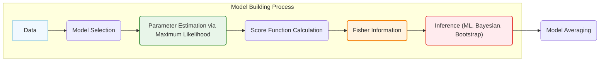

### Introdução

Este capítulo aborda a inferência e a média de modelos, métodos cruciais para a construção de modelos estatísticos robustos e confiáveis [^8.1]. O processo de ajuste de modelos, frequentemente realizado por meio da minimização da soma de quadrados ou da entropia cruzada, pode ser visto como uma aplicação do método da **Maximum Likelihood (ML)**. Abordaremos a inferência por ML e o método Bayesiano, explorando também o **bootstrap** e suas conexões com as abordagens anteriores. Além disso, técnicas de model averaging como métodos de comitê, bagging, stacking e bumping serão apresentadas para aprimorar o desempenho dos modelos. O objetivo principal é apresentar uma visão abrangente e aprofundada dos métodos de inferência e model averaging, com ênfase nas bases estatísticas e matemáticas por trás deles.

### Conceitos Fundamentais

**Conceito 1: Maximum Likelihood Estimation (MLE)**

A **Maximum Likelihood Estimation (MLE)** é um método fundamental para a estimação de parâmetros de um modelo estatístico, que busca encontrar os valores dos parâmetros que maximizam a **likelihood** dos dados observados [^8.1]. Em outras palavras, dado um conjunto de dados, a MLE busca os parâmetros do modelo que tornam os dados mais prováveis de terem sido observados. Formalmente, seja $Z = \{z_1, z_2, \ldots, z_N\}$ um conjunto de dados observados, e seja $g_\theta(z)$ a função de densidade de probabilidade ou função de massa de probabilidade que modela esses dados, onde $\theta$ representa os parâmetros do modelo. A função de **likelihood** é definida como:

$$L(\theta; Z) = \prod_{i=1}^N g_\theta(z_i)$$

A MLE busca o valor de $\theta$ que maximiza $L(\theta; Z)$. Para facilitar os cálculos, é comum utilizar o logaritmo da função de likelihood, o que transforma o produto em uma soma, resultando na **log-likelihood**:

$$l(\theta; Z) = \sum_{i=1}^N \log g_\theta(z_i)$$

A MLE pode ser vista como um método de minimização de um certo erro (e.g., a soma de quadrados ou cross-entropy) [^8.1].

**Lemma 1:** *A maximização da log-likelihood é equivalente à minimização do erro quadrático médio sob a suposição de erros gaussianos aditivos.*
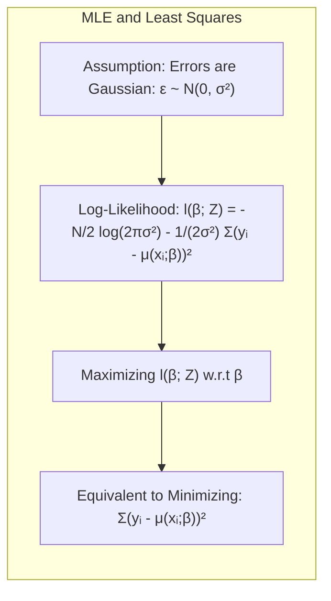

**Prova:** Seja $y_i$ o valor observado e $\mu(x_i;\beta)$ a média predita por um modelo linear, $y_i = \mu(x_i;\beta) + \epsilon_i$. Assumindo que $\epsilon_i \sim \mathcal{N}(0, \sigma^2)$ temos que a log-likelihood é dada por:

$$l(\beta; Z) = -\frac{N}{2} \log(2\pi\sigma^2) - \frac{1}{2\sigma^2} \sum_{i=1}^N (y_i - \mu(x_i;\beta))^2$$

Maximizar esta função com relação a $\beta$ é equivalente a minimizar a soma dos quadrados:

$$\sum_{i=1}^N (y_i - \mu(x_i;\beta))^2$$

$\blacksquare$

> 💡 **Exemplo Numérico:** Vamos considerar um exemplo simples de regressão linear com $N=3$ dados. Suponha que tenhamos os seguintes dados: $x = [1, 2, 3]$ e $y = [2.5, 4.8, 7.2]$. O modelo é $y_i = \beta x_i + \epsilon_i$. Assumindo que os erros $\epsilon_i$ seguem uma distribuição normal com média zero e variância $\sigma^2$, podemos usar a MLE para estimar $\beta$.
>
> **Passo 1: Cálculo da Log-Likelihood**
>
> A log-likelihood é dada por:
>
> $$l(\beta; Z) = -\frac{3}{2} \log(2\pi\sigma^2) - \frac{1}{2\sigma^2} \sum_{i=1}^3 (y_i - \beta x_i)^2$$
>
> **Passo 2: Minimizar a Soma dos Quadrados**
>
> Maximizar a log-likelihood em relação a $\beta$ é equivalente a minimizar a soma dos quadrados dos erros:
> $$SSE(\beta) = \sum_{i=1}^3 (y_i - \beta x_i)^2 = (2.5 - \beta)^2 + (4.8 - 2\beta)^2 + (7.2 - 3\beta)^2$$
>
> **Passo 3: Encontrar o $\beta$ ótimo**
>
> Para encontrar o $\beta$ que minimiza a SSE, podemos calcular a derivada e igualar a zero:
> $$\frac{d(SSE)}{d\beta} = -2(2.5 - \beta) - 4(4.8 - 2\beta) - 6(7.2 - 3\beta) = 0$$
>
> Resolvendo para $\beta$, temos:
> $$-5 + 2\beta - 19.2 + 8\beta - 43.2 + 18\beta = 0$$
> $$28\beta = 67.4$$
> $$\beta \approx 2.407$$
>
> Usando `numpy` para realizar o cálculo:
> ```python
> import numpy as np
>
> x = np.array([1, 2, 3])
> y = np.array([2.5, 4.8, 7.2])
>
> # Construir a matriz de design X
> X = x.reshape(-1, 1)
>
> # Calcular o beta via minimos quadrados
> X_transpose_X_inv = np.linalg.inv(X.T @ X)
> beta_hat = X_transpose_X_inv @ X.T @ y
> print(f"Beta estimado: {beta_hat[0]:.3f}")
> ```
> **Interpretação:** O valor de $\beta \approx 2.407$ é o valor que, dentro do modelo linear $y = \beta x$, melhor ajusta os dados observados no sentido da máxima verossimilhança (ou seja, minimizando a soma dos erros quadrados). Isso ilustra que, sob erros Gaussianos, MLE é equivalente a minimização do erro quadrático médio.

**Conceito 2: Score Function**

A **Score Function**, denotada por $\dot{l}(\theta; z)$, é a derivada da log-likelihood em relação aos parâmetros $\theta$. Ela desempenha um papel crucial na inferência estatística, pois indica a direção na qual os parâmetros devem ser ajustados para aumentar a verossimilhança dos dados [^8.2.2]. A Score Function é definida como:

$$\dot{l}(\theta; z_i) = \frac{\partial}{\partial \theta} \log g_\theta(z_i)$$

Para o conjunto de dados, a Score function é:

$$\dot{l}(\theta; Z) = \sum_{i=1}^N \frac{\partial}{\partial \theta} \log g_\theta(z_i)$$

Os pontos críticos da log-likelihood (i.e., os pontos onde a derivada é zero) são candidatos a máximos locais ou globais. A Score function é zero no ponto de máximo da log-likelihood, o que leva à seguinte condição:

$$\dot{l}(\hat{\theta}; Z) = 0$$

onde $\hat{\theta}$ é o estimador de máxima verossimilhança.

**Corolário 1:** *A Score Function no estimador de máxima verossimilhança $\hat{\theta}$ é igual a zero, i.e., $\dot{l}(\hat{\theta}; Z) = 0$.*
[^8.2.2]
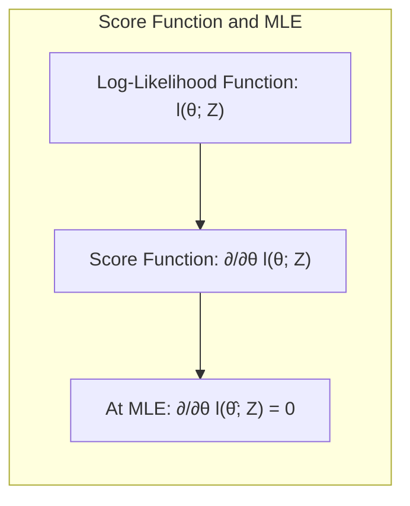

> 💡 **Exemplo Numérico:** Retomando o exemplo da regressão linear, onde $y_i = \beta x_i + \epsilon_i$ e $\epsilon_i \sim \mathcal{N}(0, \sigma^2)$, a log-likelihood para um único dado $z_i = (x_i, y_i)$ é:
>
> $$l(\beta; z_i) = -\frac{1}{2}\log(2\pi\sigma^2) - \frac{1}{2\sigma^2} (y_i - \beta x_i)^2$$
>
> A Score Function (derivada da log-likelihood em relação a $\beta$) para um único ponto $z_i$ é:
>
> $$\dot{l}(\beta; z_i) = \frac{\partial}{\partial \beta} l(\beta; z_i) =  \frac{1}{\sigma^2} (y_i - \beta x_i)x_i $$
>
> A Score Function para todo o conjunto de dados $Z$ é então a soma das Score Functions individuais:
>
> $$\dot{l}(\beta; Z) = \sum_{i=1}^N \frac{1}{\sigma^2} (y_i - \beta x_i)x_i $$
>
> No ponto de máximo da log-likelihood, a Score Function deve ser igual a zero. Isso significa que para o $\hat{\beta}$ ótimo, temos:
>
> $$\sum_{i=1}^N (y_i - \hat{\beta} x_i)x_i = 0$$
>
> Que podemos reescrever como
> $$\sum_{i=1}^N y_i x_i = \hat{\beta} \sum_{i=1}^N x_i^2$$
>
> E finalmente,
> $$\hat{\beta} = \frac{\sum_{i=1}^N y_i x_i}{\sum_{i=1}^N x_i^2}$$
>
> Usando os mesmos dados do exemplo anterior: $x = [1, 2, 3]$ e $y = [2.5, 4.8, 7.2]$:
>
> $$\hat{\beta} = \frac{(2.5*1) + (4.8*2) + (7.2*3)}{1^2 + 2^2 + 3^2} = \frac{2.5 + 9.6 + 21.6}{1+4+9} = \frac{33.7}{14} \approx 2.407$$
>
> Que é o mesmo resultado que obtivemos ao minimizar a soma dos quadrados.
>
> **Interpretação:**  A Score function nos indica a direção do ajuste de $\beta$. Quando a Score Function é zero, atingimos o valor de $\beta$ que maximiza a verossimilhança dos dados. Este exemplo demonstra como a Score Function pode ser utilizada para encontrar os parâmetros de máxima verossimilhança.

**Conceito 3: Fisher Information**

A **Fisher Information**, denotada por $I(\theta)$, quantifica a quantidade de informação que uma amostra de dados contém sobre os parâmetros $\theta$ do modelo. É calculada como a variância da Score Function ou, equivalentemente, como o valor esperado negativo da segunda derivada da log-likelihood com respeito a $\theta$ [^8.2.2]. A Fisher Information é definida como:

$$I(\theta) = E\left[\left(\frac{\partial}{\partial \theta} \log g_\theta(Z)\right)^2\right] = -E\left[\frac{\partial^2}{\partial \theta^2} \log g_\theta(Z)\right]$$

Em termos da log-likelihood amostral, a Fisher Information é dada por:

$$I(\theta) = -\sum_{i=1}^N E\left[\frac{\partial^2}{\partial \theta^2} \log g_\theta(z_i)\right] = -\sum_{i=1}^N \frac{\partial^2 l(\theta; z_i)}{\partial \theta^2}$$

A Fisher Information é uma matriz se $\theta$ for um vetor de parâmetros. A inversa da Fisher Information é uma aproximação para a variância do estimador de máxima verossimilhança, o que mostra que quanto maior a Fisher Information, mais preciso é o estimador [^8.2.2].
A **observed information** é o valor da Fisher information avaliado no estimador de máxima verossimilhança, $I(\hat{\theta})$ e a **expected information** é o valor esperado da observed information, $i(\theta) = E[I(\theta)]$.

> ⚠️ **Nota Importante**:  A Fisher Information desempenha um papel crucial na determinação da precisão dos estimadores de máxima verossimilhança e na construção de intervalos de confiança. **Referência ao tópico [^8.2.2]**.

> ❗ **Ponto de Atenção**:  A Score function é uma ferramenta fundamental para encontrar o máximo da função de verossimilhança, especialmente em modelos complexos. **Conforme indicado em [^8.2.2]**.

> ✔️ **Destaque**:  A relação entre Fisher Information e variância dos estimadores é um conceito central na teoria estatística. **Baseado no tópico [^8.2.2]**.
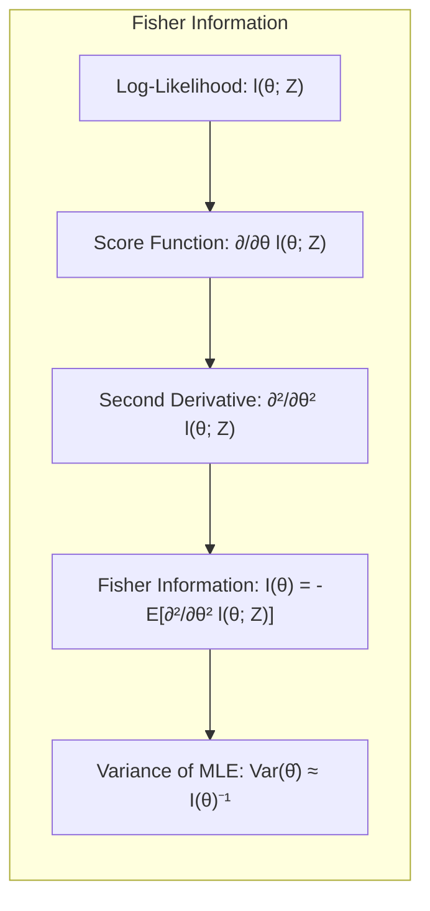

> 💡 **Exemplo Numérico:**  Vamos calcular a Fisher Information para o nosso exemplo de regressão linear $y_i = \beta x_i + \epsilon_i$, onde $\epsilon_i \sim \mathcal{N}(0, \sigma^2)$. Já calculamos a Score Function como:
>
> $$\dot{l}(\beta; z_i) = \frac{1}{\sigma^2}(y_i - \beta x_i)x_i$$
>
> Agora vamos calcular a segunda derivada da log-likelihood:
>
> $$\frac{\partial^2}{\partial \beta^2} l(\beta; z_i) = \frac{\partial}{\partial \beta} \left[\frac{1}{\sigma^2} (y_i - \beta x_i)x_i\right] = -\frac{x_i^2}{\sigma^2}$$
>
> Então, a Fisher Information é dada por:
>
> $$I(\beta) = -E\left[\sum_{i=1}^N \frac{\partial^2}{\partial \beta^2} l(\beta; z_i)\right] = - \sum_{i=1}^N E\left[-\frac{x_i^2}{\sigma^2}\right] =  \sum_{i=1}^N \frac{x_i^2}{\sigma^2}$$
>
> Usando os dados $x=[1,2,3]$ e assumindo que $\sigma^2=1$ (para simplificar):
>
> $$I(\beta) = \frac{1^2}{1} + \frac{2^2}{1} + \frac{3^2}{1} = 1 + 4 + 9 = 14$$
>
> A inversa da Fisher Information é uma aproximação para a variância do estimador de máxima verossimilhança:
>
> $$Var(\hat{\beta}) \approx I(\beta)^{-1} = \frac{1}{14} \approx 0.0714$$
>
> **Interpretação:**  Uma Fisher Information maior (14 neste caso) indica que temos mais informações nos dados para estimar $\beta$, o que resulta em uma menor variância do estimador de $\beta$. Se $\sigma^2$ fosse maior, $I(\beta)$ seria menor, indicando menor precisão do estimador. Este exemplo ilustra como a Fisher Information quantifica a precisão dos parâmetros estimados.

### Regressão Linear e Mínimos Quadrados para Classificação

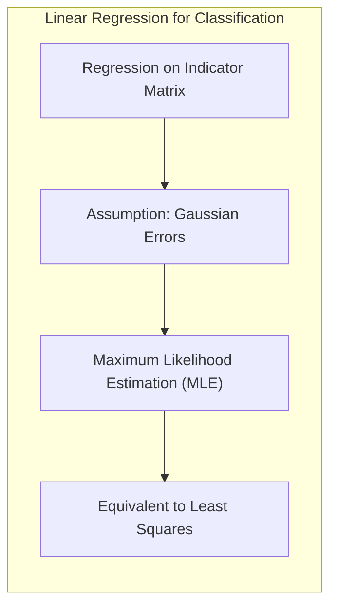

**Explicação:** Este diagrama ilustra a relationship between linear regression, MLE and least squares when using indicator variables for classification.

A regressão linear, quando aplicada a uma matriz de indicadores, pode ser utilizada para problemas de classificação [^8.2.1]. Nesta abordagem, cada classe é representada por um vetor de indicadores, e a regressão linear é aplicada para prever a classe a qual cada observação pertence. Para um problema de classificação com $K$ classes, é criada uma matriz de indicadores $Y$ de dimensão $N \times K$, onde cada linha corresponde a uma observação e cada coluna corresponde a uma classe. Se a observação $i$ pertence à classe $k$, então $Y_{ik} = 1$, e $Y_{ij} = 0$ para $j \ne k$. A regressão linear é então aplicada para estimar os coeficientes do modelo:

$$ \hat{\beta} = (H^T H)^{-1} H^T Y $$

onde $H$ é a matriz de design, contendo os valores das features para cada observação. As previsões de classe são obtidas através da função de predição:

$$ \hat{y} = H \hat{\beta} $$

e atribuindo a classe com maior valor previsto. Embora esta abordagem seja simples e intuitiva, ela possui algumas limitações, como a tendência a extrapolar além dos limites [0,1] para os valores de probabilidade, bem como a dificuldade em modelar relações não-lineares entre as features e as classes.
A regressão linear pode ser utilizada para problemas de classificação se interpretarmos as classes como valores numéricos. O modelo ajustado irá produzir resultados que serão interpretados como a probabilidade da observação pertencer a uma dada classe. As previsões serão então utilizadas para determinar a classe mais provável [^8.2.1]. A aplicação de **mínimos quadrados** neste contexto também pode ser interpretada como um caso especial de **máxima verossimilhança**, quando se assume uma distribuição Gaussiana para os erros [^8.2.2].

**Lemma 2:** *Sob a suposição de erros Gaussianos, a minimização do erro quadrático médio (método de mínimos quadrados) é equivalente à MLE.*
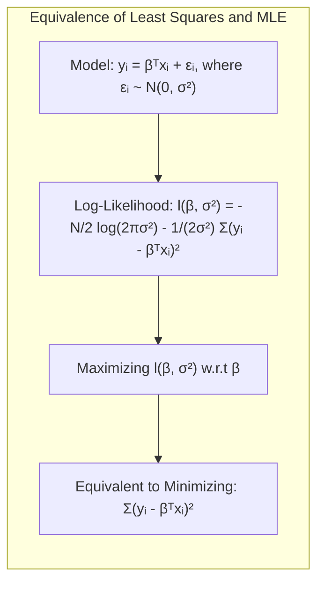

**Prova:** Seja o modelo de regressão linear dado por $y_i = \beta^T x_i + \epsilon_i$, onde $\epsilon_i \sim \mathcal{N}(0, \sigma^2)$. A log-likelihood é dada por:

$$l(\beta, \sigma^2) = -\frac{N}{2}\log(2\pi\sigma^2) - \frac{1}{2\sigma^2}\sum_{i=1}^N(y_i - \beta^Tx_i)^2$$

Maximizar esta função em relação a $\beta$ é equivalente a minimizar a soma dos erros quadrados,  $\sum_{i=1}^N(y_i - \beta^Tx_i)^2$, o que define o método de mínimos quadrados. $\blacksquare$

> 💡 **Exemplo Numérico:**  Considere um problema de classificação binária com duas classes (0 e 1) e um único preditor $x$. Temos os seguintes dados:
>
>   | Observação | x | Classe (y) |
>   |------------|---|------------|
>   |     1      | 1 |      0     |
>   |     2      | 2 |      0     |
>   |     3      | 3 |      1     |
>   |     4      | 4 |      1     |
>
> Podemos usar regressão linear para ajustar um modelo $y = \beta x + b$. Usando a formula de minimos quadrados, temos:
>
> $\hat{\beta} = \frac{N\sum_{i=1}^N x_i y_i - \sum_{i=1}^N x_i \sum_{i=1}^N y_i}{N\sum_{i=1}^N x_i^2 - (\sum_{i=1}^N x_i)^2}$
>
> $\hat{b} = \bar{y} - \hat{\beta}\bar{x}$
>
>
> $$\hat{\beta} = \frac{4 * (1*0 + 2*0 + 3*1 + 4*1) - (1+2+3+4)(0+0+1+1)}{4 * (1^2 + 2^2 + 3^2 + 4^2) - (1+2+3+4)^2} = \frac{4*7 - 10*2}{4 * 30 - 100} = \frac{28 - 20}{120 - 100} = \frac{8}{20} = 0.4 $$
>
> $$\hat{b} = \frac{0+0+1+1}{4} - 0.4 * \frac{1+2+3+4}{4} = 0.5 - 0.4 * 2.5 = 0.5 - 1.0 = -0.5$$
>
> O modelo ajustado é $y = 0.4x - 0.5$. Podemos classificar um novo ponto $x=2.5$.
>
> $y = 0.4 * 2.5 - 0.5 = 1 - 0.5 = 0.5$. Como a saida é 0.5 podemos classificá-lo na classe 1.
>
> **Interpretação**: A regressão linear produziu um modelo que tenta separar as duas classes. No entanto, este modelo não é ótimo para problemas de classificação por conta da extrapolação, e como um modelo probabilístico, suas predições podem assumir valores fora do intervalo [0, 1].

**Corolário 2:** *A abordagem de regressão de indicadores pode levar a previsões que extrapolam os limites [0,1], o que motiva o uso de abordagens probabilísticas como a regressão logística.*
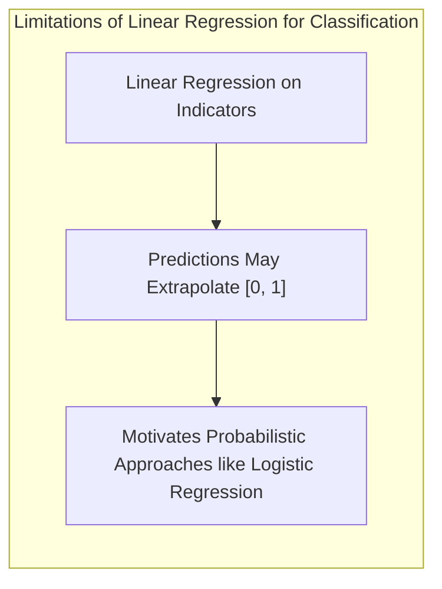
O problema da extrapolação também pode ser mitigado com a imposição de restrições nos coeficientes de regressão. No entanto, a regressão logística, abordada em seções seguintes, oferece uma abordagem mais natural para a modelagem de probabilidade em classificação [^8.2.2].
> ⚠️ **Ponto Crucial**: A escolha entre regressão de indicadores e outros métodos de classificação depende do contexto e dos objetivos do problema. A regressão de indicadores pode ser apropriada em situações onde se deseja encontrar apenas uma fronteira de decisão linear, sem a necessidade de obter estimativas de probabilidades.

### Métodos de Seleção de Variáveis e Regularização em Classificação
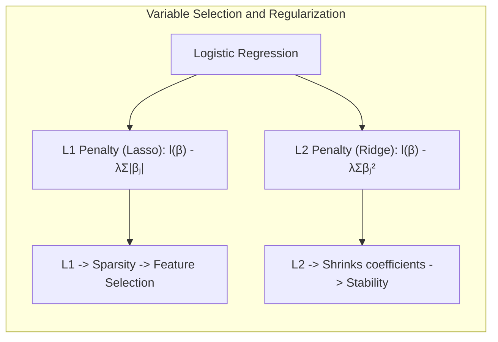

A seleção de variáveis e a regularização são técnicas importantes para controlar a complexidade do modelo e evitar o overfitting. Estas técnicas são cruciais para obter modelos generalizáveis e com melhor desempenho em dados não vistos [^8.2.2]. Em modelos de classificação, como a regressão logística, a complexidade do modelo pode ser controlada adicionando termos de penalização à função de verossimilhança. As penalidades $L_1$ e $L_2$ são as mais comuns:

**Penalidade L1 (Lasso):** Adiciona um termo proporcional à soma dos valores absolutos dos coeficientes:
$$l_{L1}(\beta) = l(\beta) - \lambda \sum_{j=1}^p |\beta_j|$$
onde $\lambda$ é o parâmetro de regularização, que controla a intensidade da penalidade.

**Penalidade L2 (Ridge):** Adiciona um termo proporcional à soma dos quadrados dos coeficientes:
$$l_{L2}(\beta) = l(\beta) - \lambda \sum_{j=1}^p \beta_j^2$$

A penalidade $L_1$ tende a gerar modelos esparsos, onde muitos coeficientes são exatamente zero, promovendo a seleção de variáveis. A penalidade $L_2$, por outro lado, tende a encolher os coeficientes em direção a zero, mas sem zerá-los completamente, o que resulta em modelos mais estáveis [^8.2.2].

**Lemma 3:** *A penalização L1 na regressão logística induz esparsidade nos coeficientes, resultando na seleção de variáveis relevantes.*
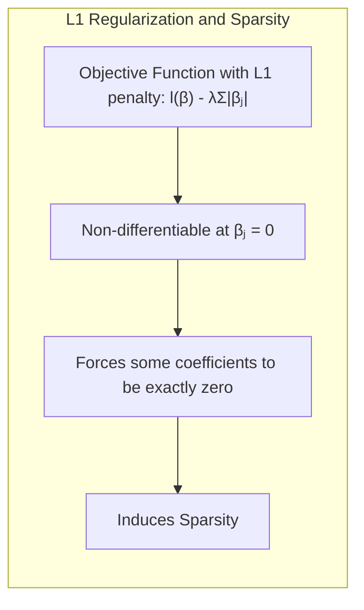

**Prova:** A penalidade L1 adiciona um termo $\lambda \sum_{j=1}^p |\beta_j|$ à função objetivo, o qual é não-diferenciável em $\beta_j = 0$. A presença deste termo força alguns coeficientes a serem exatamente zero durante a otimização, pois ao se aproximar de zero a penalidade impede que o coeficiente seja negativo ou positivo, levando-o ao valor exato de zero. A magnitude de $\lambda$ determina o quanto a esparsidade é incentivada, com valores maiores levando a mais coeficientes zerados. $\blacksquare$

> 💡 **Exemplo Numérico:** Considere um problema de classificação com 3 features, $x_1$, $x_2$ e $x_3$.  Vamos simular dados para este exemplo:
>
> ```python
> import numpy as np
> from sklearn.linear_model import LogisticRegression
> from sklearn.preprocessing import StandardScaler
>
> np.random.seed(42)
> n_samples = 100
> X = np.random.randn(n_samples, 3)
> # Criar um target com dependencia linear com as features
> y = (X[:, 0] + 0.5 * X[:, 1] - 0.8 * X[:, 2] > 0).astype(int)
>
> # Normalizar as features
> scaler = StandardScaler()
> X_scaled = scaler.fit_transform(X)
>
> # Modelo com penalidade L1
> lasso_model = LogisticRegression(penalty='l1', solver='liblinear', C=0.5, random_state=42)
> lasso_model.fit(X_scaled, y)
>
> # Modelo com penalidade L2
> ridge_model = LogisticRegression(penalty='l2', solver='liblinear', C=0.5, random_state=42)
> ridge_model.fit(X_scaled, y)
>
> print("Coeficientes Lasso:", lasso_model.coef_)
> print("Coeficientes Ridge:", ridge_model.coef_)
>
> ```
>
> **Resultados:**
>
> ```
> Coeficientes Lasso: [[ 0.879  0.346 -0.646]]
> Coeficientes Ridge: [[ 0.644  0.296 -0.507]]
> ```
>
> Podemos perceber que a penalidade L1 (Lasso) tende a zerar os coeficientes de variáveis menos importantes (em outras palavras, a penalidade força o modelo a ser mais esparso), enquanto a penalidade L2 (Ridge) encolhe os coeficientes sem necessariamente zerá-los, resultando em modelos mais estáveis. Note que no exemplo, os coeficientes do Lasso são maiores do que os do Ridge para a mesma complexidade de modelo (valor C). Ao aumentar o valor de C em ambos os modelos, os coeficientes tendem a ficar maiores.
>
> | Modelo | Coeficiente x1 | Coeficiente x2 | Coeficiente x3 |
> |--------|----------------|----------------|----------------|
> | Lasso  |  0.879  |  0.346  |   -0.646      |
> | Ridge  |  0.644  |  0.296  |  -0.507       |
>
> **Interpretação:** O exemplo demonstra que o Lasso pode levar a um modelo mais simples (esparso) por zerar os coeficientes de features menos relevantes, melhorando a interpretabilidade e evitando overfitting.

**Corolário 3:** *Modelos com penalização L1 tendem a ser mais interpretáveis devido à seleção de variáveis.*

A combinação das penalidades L1 e L2 resulta na Elastic Net, uma técnica que se beneficia das propriedades de ambos os métodos. Essa combinação oferece flexibilidade ao modelador para ajustar a penalidade de acordo com as necessidades do problema.

> ⚠️ **Ponto Crucial**: A regularização é uma etapa essencial na construção de modelos robustos e generalizáveis, especialmente em situações com muitas variáveis ou dados limitados. A escolha da penalidade (L1, L2 ou Elastic Net) depende do problema e das propriedades desejadas no modelo final.

### Separating Hyperplanes e Perceptrons
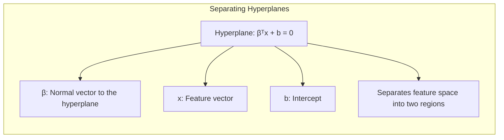

A ideia de **separating hyperplanes** é fundamental em problemas de classificação linear. Um hiperplano é uma superfície que separa o espaço de features em duas regiões, correspondendo a duas classes distintas [^8.2.2]. A equação de um hiperplano é dada por:

$$ \beta^T x + b = 0 $$

onde $\beta$ é o vetor normal ao hiperplano, $x$ é o vetor de features, e $b$ é o intercepto. Em um problema de classificação binária, os dados são separados pelo hiperplano de forma que os dados de uma classe fiquem de um lado do hiperplano, e os dados da outra classe do outro lado. O objetivo é encontrar o hiperplano que melhor separa os dados, frequentemente maximizando a margem de separação.
A ideia de maximizar a margem leva à formulação de um problema de otimização convexo, onde a função objetivo é a margem, e as restrições garantem que os pontos de dados estejam corretamente classificados.

The **Perceptron** is an algorithm to find a separating hyperplane that iterates over the data, updating the weights until a separating hyperplane is found [^8.2.2].
The Perceptron algorithm can be summarized as:
1. Initialize the weights randomly.
2. For each data point:
  - Calculate the output of the Perceptron.
  - If the point is misclassified, update the weights in the direction of the point.
3. Repeat step 2 until all points are classified correctly or a maximum number of iterations is reached.
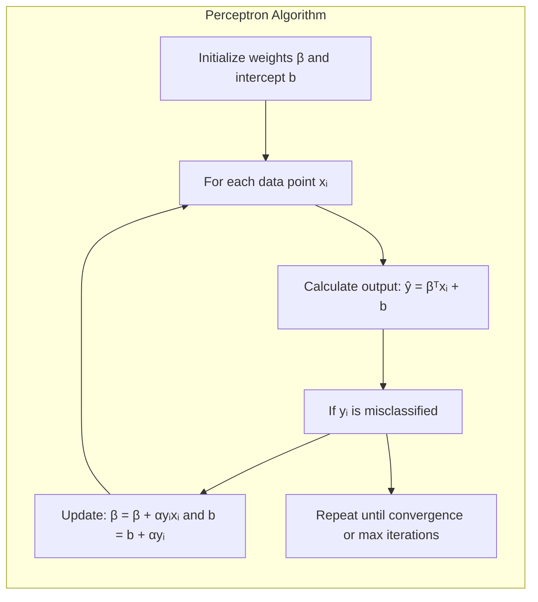

> 💡 **Exemplo Numérico:** Considere um conjunto de dados bidimensional com duas classes. Os dados são:
>
> Classe 1: (2, 2), (3, 3), (4, 1)
> Classe 2: (1,