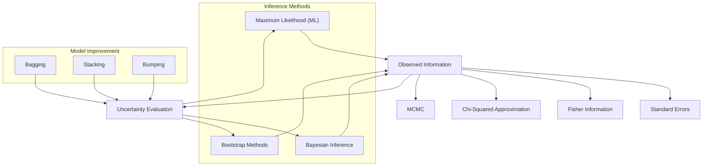
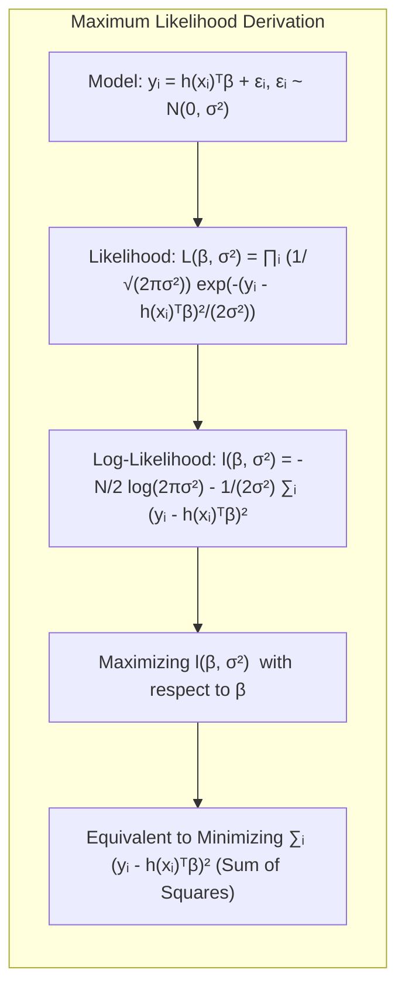
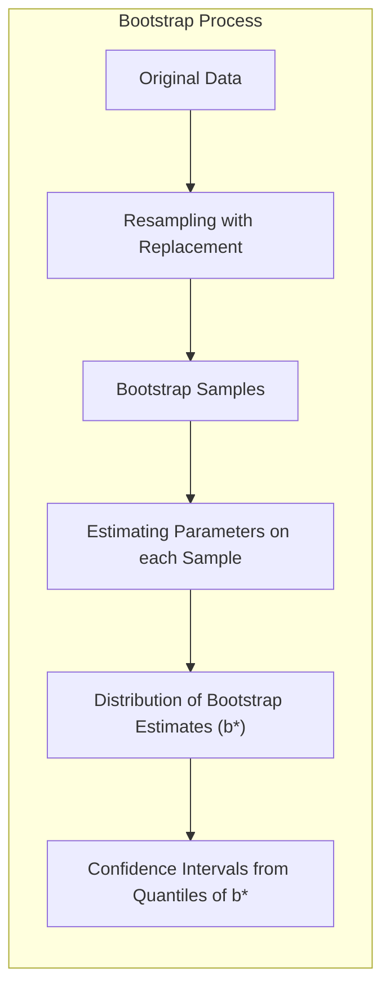
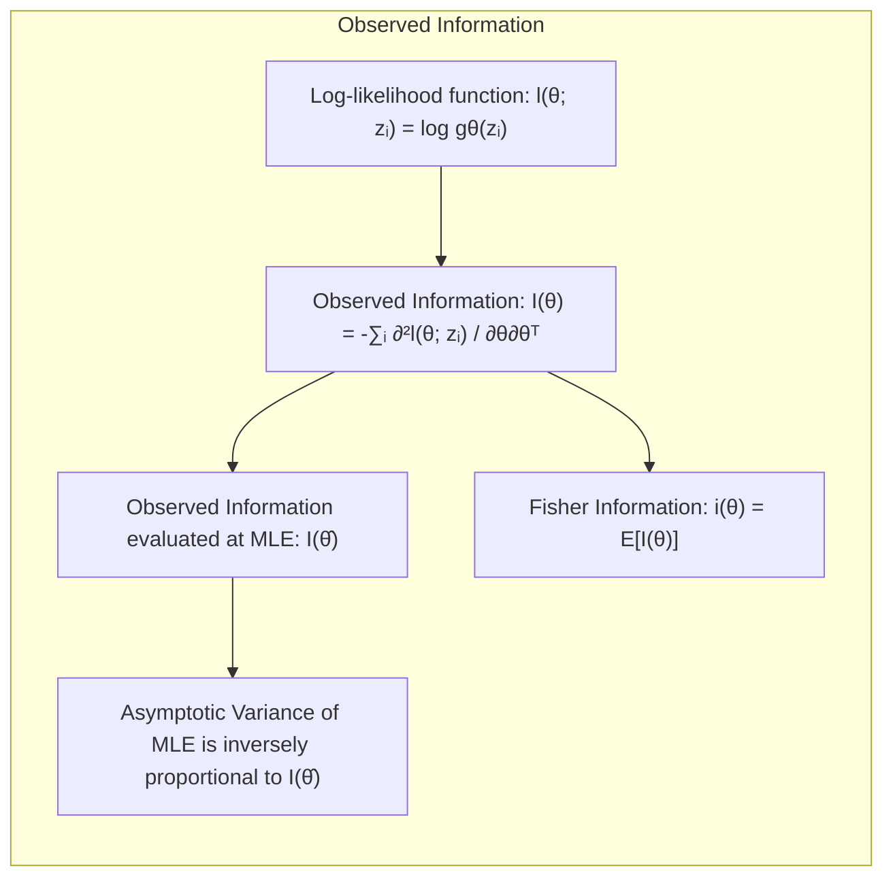
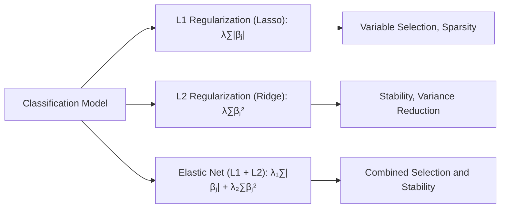
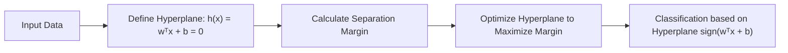
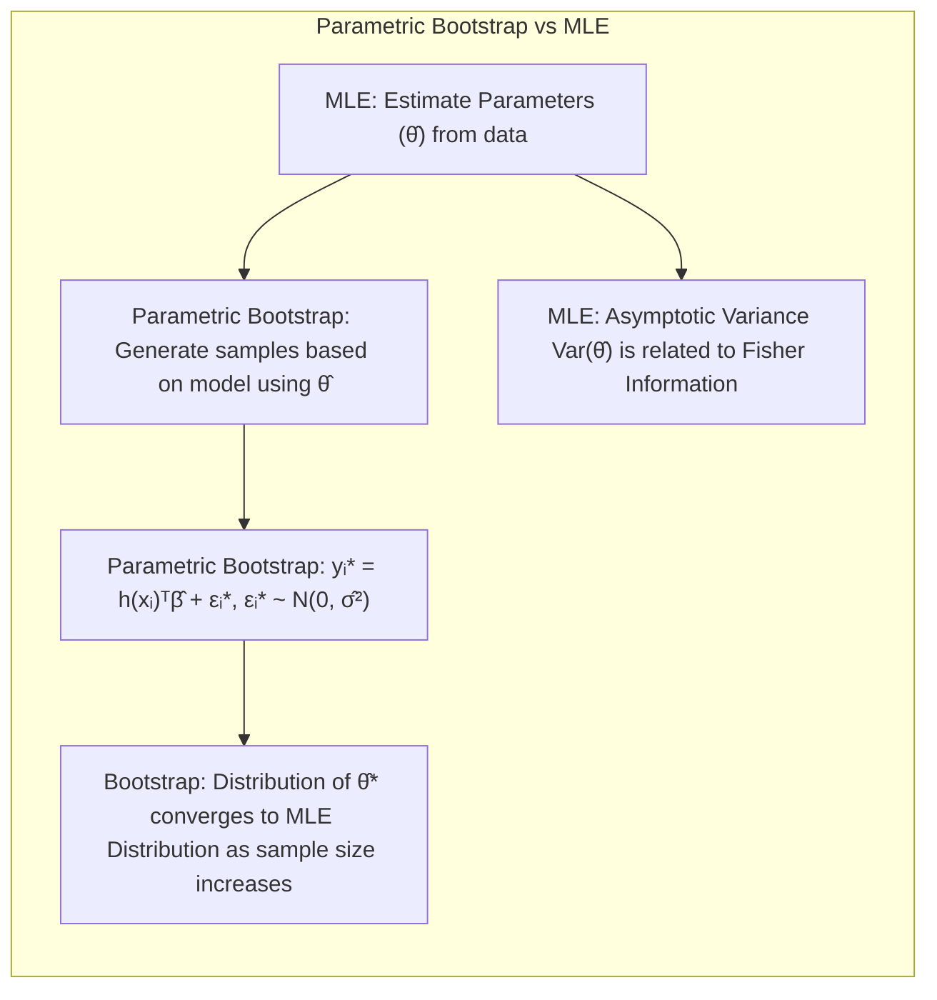

## Model Inference and Averaging: Focusing on Observed Information



### Introdução
Este capítulo aborda a inferência de modelos, um pilar essencial no aprendizado estatístico, explorando métodos para ajustar modelos aos dados e avaliar a incerteza das estimativas. A inferência envolve a otimização de modelos através da minimização de erros (como a soma dos quadrados ou a cross-entropia), que são instâncias da abordagem de **Maximum Likelihood**. Além disso, métodos bayesianos e técnicas de *bootstrap* serão explorados como formas de avaliar e aprimorar os modelos, destacando a importância de quantificar a incerteza associada às estimativas. Este capítulo irá se aprofundar em conceitos como **Observed Information** e sua relação com a precisão das estimativas.

### Conceitos Fundamentais
O entendimento dos conceitos fundamentais é crucial para o domínio da inferência estatística e aprendizado de máquina.

**Conceito 1: Maximum Likelihood (ML) e sua relação com a otimização**
A abordagem de **Maximum Likelihood** busca encontrar os parâmetros de um modelo que melhor se ajustam aos dados observados. A minimização de funções de erro como a soma dos quadrados (para regressão) ou a cross-entropia (para classificação) são, na verdade, maneiras de otimizar a função de verossimilhança (likelihood), ou seja, encontrar os parâmetros que maximizam a probabilidade dos dados observados dado o modelo. Em essência, o método ML busca ajustar um modelo aos dados de tal forma que esses dados se tornem "mais prováveis" sob o modelo proposto.

**Lemma 1:** *A minimização da soma dos quadrados para modelos lineares de regressão é equivalente à maximização da função de verossimilhança sob a suposição de erros Gaussianos com variância constante.*

**Prova:** Seja o modelo $y_i = h(x_i)^T \beta + \epsilon_i$, onde $\epsilon_i \sim N(0, \sigma^2)$. A verossimilhança para $N$ observações independentes é:
$$ L(\beta, \sigma^2) = \prod_{i=1}^N \frac{1}{\sqrt{2\pi\sigma^2}} \exp\left(-\frac{(y_i - h(x_i)^T \beta)^2}{2\sigma^2}\right) $$
O log-verossimilhança é dado por:
$$ l(\beta, \sigma^2) = -\frac{N}{2}\log(2\pi\sigma^2) - \frac{1}{2\sigma^2}\sum_{i=1}^N (y_i - h(x_i)^T \beta)^2 $$
Maximizar $l(\beta, \sigma^2)$ em relação a $\beta$ é equivalente a minimizar $\sum_{i=1}^N (y_i - h(x_i)^T \beta)^2$ que é a soma dos quadrados. $\blacksquare$



> 💡 **Exemplo Numérico:** Considere um modelo de regressão linear simples com uma única variável preditora, onde $h(x_i) = x_i$. Suponha que temos os seguintes dados: $X = [1, 2, 3, 4, 5]$ e $Y = [2, 4, 5, 4, 5]$.  O objetivo é encontrar os parâmetros $\beta = [\beta_0, \beta_1]$ que minimizem a soma dos quadrados dos erros. Usando a fórmula de mínimos quadrados $\hat{\beta} = (X^TX)^{-1}X^Ty$, onde $X$ agora inclui uma coluna de 1s para o intercepto, podemos calcular:

```python
import numpy as np
from sklearn.linear_model import LinearRegression

X = np.array([[1, 1], [1, 2], [1, 3], [1, 4], [1, 5]])
y = np.array([2, 4, 5, 4, 5])

# Usando scikit-learn para calcular os parâmetros
model = LinearRegression(fit_intercept=False)
model.fit(X, y)
beta_sklearn = model.coef_

print(f"Estimated coefficients (sklearn): {beta_sklearn}")

# Calculando manualmente para fins didáticos
XTX_inv = np.linalg.inv(X.T @ X)
beta_manual = XTX_inv @ X.T @ y
print(f"Estimated coefficients (manual): {beta_manual}")
```
>
> A saída deste código mostrará que $\beta_0$ (o intercepto) e $\beta_1$ (o coeficiente da variável preditora) que minimizam a soma dos quadrados dos erros, o que também corresponde à maximização da likelihood sob a suposição de erros gaussianos.  Os valores estimados, em torno de $\beta_0 = 2.2$ e $\beta_1 = 0.6$ indicam que, para cada unidade de aumento em $x$, esperamos um aumento de 0.6 em $y$, com um ponto de partida em $y = 2.2$ quando $x = 0$.

**Conceito 2: Bootstrap e sua conexão com a incerteza**
O **Bootstrap** é uma técnica computacional para avaliar a incerteza de uma estimativa. Em vez de assumir distribuições teóricas sobre os parâmetros, o bootstrap gera amostras replicadas dos dados originais, permitindo a avaliação da variabilidade e a construção de intervalos de confiança diretamente a partir dos dados. Existem duas formas principais do Bootstrap: *não-paramétrico* onde amostras são geradas por reamostragem com reposição dos dados originais e o *paramétrico* onde amostras são geradas a partir de um modelo assumido, utilizando os parâmetros estimados pelo modelo.

**Corolário 1:** *A distribuição das estimativas do bootstrap é uma aproximação da distribuição amostral dos estimadores, e seus quantis podem ser usados para construir intervalos de confiança.*

**Prova:** O bootstrap assume que a distribuição amostral observada é uma boa aproximação da distribuição populacional. Ao gerar amostras replicadas a partir da amostra original, podemos estimar a variabilidade das estimativas sem precisar de distribuições analíticas. Os quantis da distribuição das estimativas bootstrap ($b^*$) aproximam os quantis da distribuição real de um estimador ($b$), permitindo a construção de intervalos de confiança.  $\blacksquare$



> 💡 **Exemplo Numérico:**  Vamos usar o mesmo conjunto de dados $X = [1, 2, 3, 4, 5]$ e $Y = [2, 4, 5, 4, 5]$ do exemplo anterior. Para o bootstrap não paramétrico, vamos criar 100 amostras bootstrap por reamostragem com reposição e calcular a média e o desvio padrão dos coeficientes.

```python
import numpy as np
import pandas as pd
from sklearn.linear_model import LinearRegression

X = np.array([[1, 1], [1, 2], [1, 3], [1, 4], [1, 5]])
y = np.array([2, 4, 5, 4, 5])
n_bootstrap = 100
coefs_bootstrap = []

for _ in range(n_bootstrap):
    indices = np.random.choice(len(y), size=len(y), replace=True)
    X_sample = X[indices]
    y_sample = y[indices]
    model = LinearRegression(fit_intercept=False)
    model.fit(X_sample, y_sample)
    coefs_bootstrap.append(model.coef_)

coefs_bootstrap = np.array(coefs_bootstrap)

df_coefs = pd.DataFrame(coefs_bootstrap, columns=["beta_0", "beta_1"])

print("Bootstrap Mean Coefficients:\n", df_coefs.mean())
print("Bootstrap Standard Error Coefficients:\n", df_coefs.std())

```
> Este código gera 100 amostras de bootstrap e calcula os coeficientes para cada uma. As médias dos coeficientes bootstrap são estimativas dos coeficientes, e os desvios padrões são estimativas dos erros padrão. Estes erros podem ser usados para criar intervalos de confiança para os parâmetros.

**Conceito 3: Linearização da variância e o conceito de Observed Information**

A variância de uma estimativa pode ser aproximada usando a **Observed Information**. Em particular, o erro padrão de uma predição, em modelos lineares, pode ser calculado através de uma linearização da variância, como mostra a fórmula (8.4). Seja  $se[\mu(x)] = \sqrt{h(x)^T (H^TH)^{-1} h(x) \hat{\sigma}^2}$, temos um exemplo de como a **Observed Information** é utilizada para quantificar a incerteza em relação ao valor de $\mu(x)$, onde $H$ representa a matriz de design, $h(x)$ o vetor das funções de base para o ponto $x$ e $\hat{\sigma}^2$ a estimativa da variância do erro.

**Aprofundamento do Conceito 3: Observed Information**
A **Observed Information** $I(\theta)$  é uma matriz Hessiana negativa da função log-verossimilhança avaliada no estimador de máxima verossimilhança $\hat{\theta}$. Formalmente,
$$
I(\theta) = - \sum_{i=1}^{N} \frac{\partial^2 l(\theta; z_i)}{\partial \theta \partial \theta^T}
$$
onde $l(\theta; z_i) = \log g_{\theta}(z_i)$ é o log-verossimilhança para a observação $z_i$, $N$ é o número de observações e $g_{\theta}(z_i)$ é a função de densidade ou massa de probabilidade do modelo.  Esta matriz captura a curvatura da função de verossimilhança em torno do ponto de máximo e fornece uma medida da quantidade de informação que os dados carregam sobre os parâmetros.
Quando $I(\theta)$ é avaliada em $\theta = \hat{\theta}$, ela é denominada **Observed Information**. Além disso, a **Fisher Information** é definida como a esperança da **Observed Information**, ou seja, $i(\theta) = E[I(\theta)]$.

> ⚠️ **Nota Importante**: A Observed Information é crucial para derivar a variância assintótica dos estimadores de máxima verossimilhança, que é inversamente proporcional à quantidade de informação.

> ❗ **Ponto de Atenção**: A **Observed Information** é uma propriedade específica dos dados observados, enquanto a **Fisher Information** é uma expectativa sobre todos os possíveis conjuntos de dados.

> ✔️ **Destaque**: A matriz de **Observed Information** desempenha um papel crucial na avaliação da precisão das estimativas em vários contextos estatísticos, conforme demonstrado nas derivações do erro padrão em (8.4).



> 💡 **Exemplo Numérico:**  Vamos usar o modelo de regressão linear simples anterior, onde $X = [[1, 1], [1, 2], [1, 3], [1, 4], [1, 5]]$ e $y = [2, 4, 5, 4, 5]$.  A matriz de design é $H = X$.  Calculamos $\hat{\beta}$ como antes e o erro padrão de uma predição $y$ para um novo ponto $x = [1, 3.5]$ (com um intercepto) é calculado como  $se[\mu(x)] = \sqrt{h(x)^T (H^TH)^{-1} h(x) \hat{\sigma}^2}$.

```python
import numpy as np
from sklearn.linear_model import LinearRegression
from scipy import stats

X = np.array([[1, 1], [1, 2], [1, 3], [1, 4], [1, 5]])
y = np.array([2, 4, 5, 4, 5])

model = LinearRegression(fit_intercept=False)
model.fit(X, y)
beta_hat = model.coef_

y_hat = X @ beta_hat
residuals = y - y_hat

n = len(y)
p = X.shape[1]
sigma_hat_squared = (residuals @ residuals) / (n-p)

x_new = np.array([1, 3.5]) # Novo ponto x com um intercepto
H = X

var_mu_x = x_new.T @ np.linalg.inv(H.T @ H) @ x_new * sigma_hat_squared

se_mu_x = np.sqrt(var_mu_x)

print(f"Estimated coefficients: {beta_hat}")
print(f"Estimated Variance of the Error: {sigma_hat_squared}")
print(f"Standard error of prediction for x = {x_new}: {se_mu_x}")
```
> Aqui, o erro padrão da predição, que é derivado usando a observed information (via $(H^TH)^{-1}$), quantifica a incerteza associada à previsão em $x = 3.5$. Quanto menor o erro padrão, mais precisa a predição neste ponto.

### Regressão Linear e Mínimos Quadrados para Classificação
A regressão linear pode ser adaptada para problemas de classificação através da codificação das classes por meio de matrizes de indicadores. Essa abordagem, embora direta, possui algumas limitações em relação a outros métodos mais específicos, como LDA e Regressão Logística.
A regressão linear busca ajustar uma reta, ou um hiperplano, que minimize a soma dos quadrados das diferenças entre os valores observados e os valores preditos. No contexto de classificação, o valor predito pelo modelo linear é, então, associado a uma classe específica.


**Explicação:** Este diagrama representa os passos principais da regressão de indicadores para classificação.

A regressão de indicadores é um método simples para modelar classificações, onde cada classe é codificada usando um vetor indicador. Por exemplo, em um problema de classificação binária, uma classe pode ser codificada como 1 e a outra como 0. No entanto, a aplicação direta de mínimos quadrados neste contexto pode levar a problemas como extrapolações fora do intervalo [0,1] quando usado para estimar probabilidades, uma vez que os valores preditos da regressão linear não são necessariamente limitados a este intervalo.

**Lemma 2**: *Em certos casos, a projeção de um dado em um hiperplano de decisão por regressão linear pode ser equivalente à projeção obtida por Linear Discriminant Analysis (LDA), mas com diferentes interpretações sobre a projeção*.

**Prova:** Em condições ideais, onde as classes são bem separadas e suas covariâncias são aproximadamente iguais, a regressão linear pode gerar hiperplanos de decisão similares aos da LDA, pois ambas as abordagens usam uma combinação linear de features. No entanto, a interpretação dos pesos e o objetivo da projeção são diferentes. LDA tem por objetivo encontrar um subespaço que maximize a separação entre as classes, enquanto regressão linear minimiza a soma dos erros quadrados da projeção linear.   $\blacksquare$

**Corolário 2:** *Sob certas condições, as projeções obtidas via regressão linear para classes podem ser linearmente separáveis, simplificando a análise e a visualização da decisão de classificação*.

A regressão de indicadores possui algumas limitações, incluindo o “masking problem” onde variáveis relevantes podem ser ocultadas pela influência de outras variáveis. Além disso, o método não é otimizado para a tarefa de classificação, o que pode levar a resultados subótimos quando comparado a abordagens mais especializadas, como LDA e Regressão Logística.

> 💡 **Exemplo Numérico:** Para ilustrar a regressão linear para classificação, suponha que temos um conjunto de dados com duas classes (0 e 1) e uma variável preditora. Os dados são: $X = [1, 2, 3, 4, 5, 6, 7, 8]$ e $Y = [0, 0, 0, 1, 1, 1, 1, 1]$.  Vamos transformar esses dados em um problema de regressão linear, ajustando uma reta aos pontos.

```python
import numpy as np
from sklearn.linear_model import LinearRegression
import matplotlib.pyplot as plt

X = np.array([[1], [2], [3], [4], [5], [6], [7], [8]])
y = np.array([0, 0, 0, 1, 1, 1, 1, 1])

model = LinearRegression()
model.fit(X, y)
y_pred = model.predict(X)

plt.figure(figsize=(8, 6))
plt.scatter(X, y, color='blue', label='Dados Observados')
plt.plot(X, y_pred, color='red', label='Regressão Linear')

threshold = 0.5
y_class = (y_pred > threshold).astype(int) # Classificação com base no threshold
plt.scatter(X, y_class, color='green', label='Classes Preditas', marker='x')
plt.axhline(y=threshold, color='gray', linestyle='--', label='Limiar de Classificação (0.5)')
plt.xlabel('Variável Preditora (X)')
plt.ylabel('Classe (Y)')
plt.title('Regressão Linear para Classificação')
plt.legend()
plt.show()
print(f"Predicted Classes: {y_class}")
```
>  Este código mostra como a regressão linear ajusta uma linha aos dados e como podemos usar um limiar (threshold) para converter a previsão linear em classes.  Perceba que algumas predições podem estar fora do intervalo [0,1].  O gráfico e o output das classes mostram que a regressão linear pode ser usada para classificar, apesar de suas limitações.

### Métodos de Seleção de Variáveis e Regularização em Classificação
Em problemas de classificação, a seleção de variáveis e a regularização desempenham um papel fundamental para evitar overfitting, reduzir a complexidade do modelo e aumentar sua interpretabilidade. Esses métodos são especialmente importantes quando há um grande número de features, o que pode levar a modelos instáveis e com baixo poder de generalização. A regularização é uma técnica que adiciona um termo de penalidade à função de custo para reduzir a magnitude dos coeficientes. As penalidades L1 e L2 são as mais comuns.
> ⚠️ **Ponto Crucial**: A escolha entre L1 e L2, ou uma combinação de ambas (Elastic Net), depende da estrutura dos dados e do objetivo do modelo. L1 induz esparsidade (seleção de variáveis) enquanto L2 reduz a magnitude dos coeficientes.

A penalização L1, também conhecida como Lasso, adiciona um termo proporcional ao valor absoluto dos coeficientes à função de custo: $\lambda \sum_j |\beta_j|$. Essa penalização tem a propriedade de forçar alguns coeficientes a serem exatamente zero, promovendo a seleção de variáveis e resultando em modelos mais esparsos. Por outro lado, a penalização L2, ou Ridge, adiciona um termo proporcional ao quadrado dos coeficientes: $\lambda \sum_j \beta_j^2$. L2 reduz a magnitude dos coeficientes de forma uniforme, levando a modelos mais estáveis e com menor variância.


**Explicação:** O diagrama acima ilustra como as diferentes técnicas de regularização se encaixam em um modelo de classificação, com foco nos efeitos de cada uma nas características do modelo.

**Lemma 3:** *A penalização L1 em classificação logística leva a coeficientes esparsos*.
**Prova:** A função de custo para regressão logística com penalização L1 é dada por:
$$ J(\beta) = -\sum_{i=1}^N \left(y_i \log(p_i) + (1-y_i) \log(1-p_i)\right) + \lambda \sum_{j=1}^p |\beta_j| $$
onde $p_i = \frac{1}{1+e^{-h(x_i)^T\beta}}$. O termo de penalização L1  $\lambda \sum_j |\beta_j|$ adiciona uma penalidade que favorece soluções com coeficientes iguais a zero, o que induz esparsidade na solução. A otimização deste problema com técnicas como subgradient descent promove que muitos coeficientes $\beta_j$ tendam a ser iguais a zero, selecionando assim as variáveis mais relevantes. $\blacksquare$

**Corolário 3:** *Modelos classificatórios com regularização L1 são mais fáceis de interpretar pois as features com coeficientes iguais a zero são consideradas irrelevantes*.

A regularização, em conjunto com a seleção de variáveis, proporciona modelos mais robustos, interpretáveis e com melhor poder preditivo. A combinação de penalidades L1 e L2 (Elastic Net) permite aproveitar as vantagens de ambos os métodos, controlando tanto a esparsidade quanto a estabilidade do modelo.

> 💡 **Exemplo Numérico:**  Vamos gerar dados simulados com 10 variáveis, onde apenas 3 são realmente relevantes para classificar um problema binário. Vamos usar regressão logística com regularização L1 (Lasso) e L2 (Ridge) e comparar o resultado.

```python
import numpy as np
from sklearn.linear_model import LogisticRegression
from sklearn.model_selection import train_test_split
from sklearn.preprocessing import StandardScaler
from sklearn.metrics import accuracy_score
import pandas as pd

# Generate synthetic data
np.random.seed(42)
n_samples = 200
n_features = 10
X = np.random.randn(n_samples, n_features)
# Only features 1, 3 and 6 are informative
true_coef = np.array([0.8, 0, 1.2, 0, 0, -0.6, 0, 0, 0, 0])
y_prob = 1 / (1 + np.exp(-(X @ true_coef)))
y = np.random.binomial(1, y_prob)


X_train, X_test, y_train, y_test = train_test_split(X, y, test_size=0.3, random_state=42)

scaler = StandardScaler()
X_train_scaled = scaler.fit_transform(X_train)
X_test_scaled = scaler.transform(X_test)


# L1 Regularization (Lasso)
lasso_model = LogisticRegression(penalty='l1', solver='liblinear', C=0.5, random_state=42)
lasso_model.fit(X_train_scaled, y_train)
y_pred_lasso = lasso_model.predict(X_test_scaled)

# L2 Regularization (Ridge)
ridge_model = LogisticRegression(penalty='l2', C=0.5, random_state=42)
ridge_model.fit(X_train_scaled, y_train)
y_pred_ridge = ridge_model.predict(X_test_scaled)


# Resultados
accuracy_lasso = accuracy_score(y_test, y_pred_lasso)
accuracy_ridge = accuracy_score(y_test, y_pred_ridge)
coef_lasso = lasso_model.coef_.flatten()
coef_ridge = ridge_model.coef_.flatten()
results_df = pd.DataFrame({
    "Feature": range(1,n_features+1),
    "True Coefs": true_coef,
    "Lasso Coefs": coef_lasso,
    "Ridge Coefs": coef_ridge
})
print(results_df)
print(f"Lasso Accuracy: {accuracy_lasso:.4f}")
print(f"Ridge Accuracy: {accuracy_ridge:.4f}")
```
>  Este exemplo demonstra como a penalização L1 (Lasso) zera alguns coeficientes, efetuando a seleção de variáveis, enquanto a penalização L2 (Ridge) reduz a magnitude de todos os coeficientes. No exemplo, a acurácia é semelhante entre os dois modelos, mas os coeficientes mostram a diferença na abordagem de regularização. Observe que apenas os coeficientes 1, 3 e 6 são diferentes de zero no Lasso, o que reflete a estrutura dos dados, onde apenas essas variáveis são relevantes.

### Separating Hyperplanes e Perceptrons
A ideia de **Separating Hyperplanes** surge da necessidade de encontrar uma fronteira de decisão ótima que maximize a margem de separação entre as classes. Essa abordagem é fundamental em classificadores lineares e leva ao conceito de hiperplanos ótimos, que são definidos por combinações lineares das features de entrada. Os pontos mais próximos do hiperplano de decisão são conhecidos como *pontos de suporte*, e são essenciais para a definição do hiperplano. Formalmente, um hiperplano separador em um espaço $p$-dimensional pode ser definido como:
$$ h(x) = w^Tx + b = 0 $$
onde $w$ é o vetor de pesos e $b$ é o bias. A classificação de um ponto $x$ é dada por $sign(w^Tx + b)$. A otimização deste hiperplano de separação envolve a maximização da margem, que é a distância entre o hiperplano e os pontos de suporte mais próximos.


**Explicação:** Este diagrama representa o processo de definição de hiperplanos separadores para classificação, mostrando a relação entre os dados e a construção da fronteira de decisão.

O **Perceptron de Rosenblatt** é um algoritmo de aprendizado que ajusta iterativamente os pesos de um hiperplano de decisão. O perceptron é um classificador linear e seu processo de otimização baseia-se em atualizar os pesos sempre que um erro de classificação é encontrado. Embora o Perceptron não maximize a margem como em **Separating Hyperplanes** otimizados, ele é um algoritmo fundamental para entender a base dos classificadores lineares e pode convergir para uma solução (se os dados forem linearmente separáveis).

**Teorema 1**: *Se um conjunto de dados é linearmente separável, o algoritmo do perceptron irá convergir para uma solução que separa os dados corretamente*.
**Prova:** A prova desse teorema envolve demonstrar que, a cada iteração, o algoritmo reduz o número de erros de classificação ou mantém o mesmo número, mas o vetor de pesos se aproxima de um vetor ótimo. A convergência é garantida se os dados forem linearmente separáveis.  $\blacksquare$
A formulação do problema de **Separating Hyperplanes** frequentemente envolve a solução do *dual de Wolfe* que permite uma solução eficiente via combinação linear de pontos de suporte, o que é fundamental para algoritmos como Support Vector Machines (SVM).

> 💡 **Exemplo Numérico:** Vamos criar um exemplo simples com dados linearmente separáveis para demonstrar o funcionamento do Perceptron. Consideremos duas classes com dados bidimensionais.

```python
import numpy as np
import matplotlib.pyplot as plt

# Dados linearmente separáveis
X = np.array([[1, 2], [1.5, 1.8], [5, 8], [8, 8], [1, 0.6], [9, 1], [1, 1], [10, 10]])
y = np.array([0, 0, 1, 1, 0, 1, 0, 1]) # Classes: 0 e 1

def perceptron(X, y, learning_rate=0.01, n_iterations=100):
    n_samples, n_features = X.shape
    w = np.zeros(n_features)
    b = 0

    for _ in range(n_iterations):
        for i in range(n_samples):
            y_pred = np.sign(np.dot(X[i], w) + b)
            if y_pred != y[i]:
                w = w + learning_rate * (y[i] - y_pred) * X[i]
                b = b + learning_rate * (y[i] - y_pred)
    return w, b

w, b = perceptron(X, y)

# Plotagem
plt.figure(figsize=(8, 6))
plt.scatter(X[:, 0], X[:, 1], c=y, cmap='viridis', edgecolors='k')
x_min, x_max = X[:, 0].min() - 1, X[:, 0].max() + 1
y_min, y_max = X[:, 1].min() - 1, X[:, 1].max() + 1
xx, yy = np.meshgrid(np.arange(x_min, x_max, 0.1), np.arange(y_min, y_max, 0.1))

Z = np.sign(np.dot(np.c_[xx.ravel(), yy.ravel()], w) + b).reshape(xx.shape)
plt.contourf(xx, yy, Z, cmap='RdBu', alpha=0.5)

plt.xlabel('Feature 1')
plt.ylabel('Feature 2')
plt.title('Perceptron Decision Boundary')
plt.show()

print(f"Perceptron Weights: {w}")
print(f"Perceptron Bias: {b}")

```
> Este código demonstra como o Perceptron aprende os pesos do hiperplano (linha, neste caso 2D) que separa as duas classes. Os pesos e o bias, juntamente com a visualização do hiperplano, mostram como o Perceptron divide os dados linearmente separáveis.

### Pergunta Teórica Avançada: Quais as relações entre o *parametric bootstrap* e a inferência de máxima verossimilhança (Maximum Likelihood Inference)?
**Resposta:**
O *parametric bootstrap* é uma técnica para gerar amostras replicadas de dados, utilizando um modelo paramétrico, com parâmetros estimados via máxima verossimilhança.  Em geral, o *parametric bootstrap* converge para os resultados da inferência por máxima verossimilhança quando o tamanho da amostra se aproxima do infinito. A conexão entre os dois métodos pode ser ilustrada no contexto de modelos com erros gaussianos.
No *parametric bootstrap*, novos dados são gerados usando um modelo, por exemplo, $y_i^* = h(x_i)^T \hat{\beta} + \epsilon_i^* $, onde $\epsilon_i^* \sim N(0, \hat{\sigma}^2)$, sendo $\hat{\beta}$ e $\hat{\sigma}^2$ as estimativas de máxima verossimilhança dos parâmetros do modelo. Repetindo esse processo várias vezes, obtém-se um conjunto de estimativas bootstrap para os parâmetros $\beta$. Por sua vez, as estimativas obtidas pela inferência de máxima verossimilhança são dadas por $\hat{\beta} = (H^TH)^{-1}H^Ty$ e sua variância estimada por $Var(\hat{\beta}) = (H^TH)^{-1}\hat{\sigma}^2$. Como a distribuição amostral de $\hat{\beta}$ é assintoticamente normal (sob condições de regularidade) e o bootstrap paramétrico gera amostras com base na mesma distribuição e parâmetros estimados por máxima verossimilhança, ambos tendem a concordar conforme o tamanho da amostra cresce.



**Lemma 4**: *Sob certas condições, as variâncias dos estimadores por bootstrap paramétrico e por inferência de máxima verossimilhança se igualam quando o número de amostras bootstrap tende ao infinito*.

**Prova:** A distribuição de um estimador de máxima verossimilhança $\hat{\theta}$ é assintoticamente normal