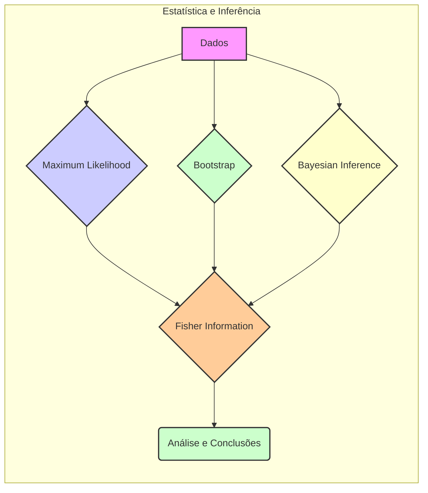
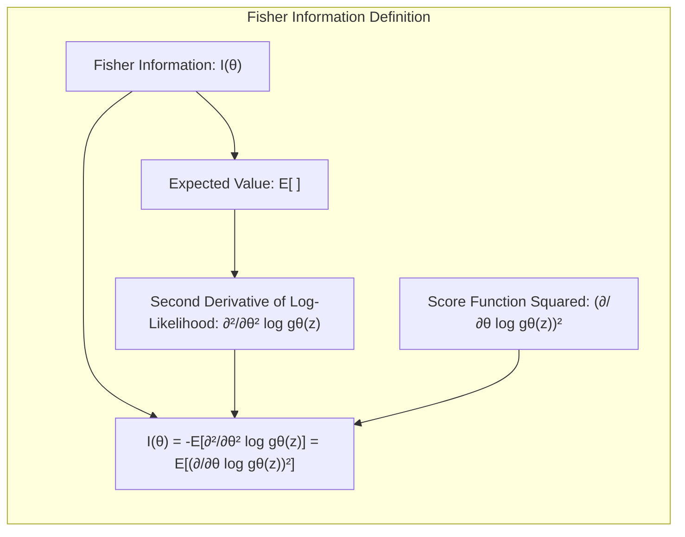
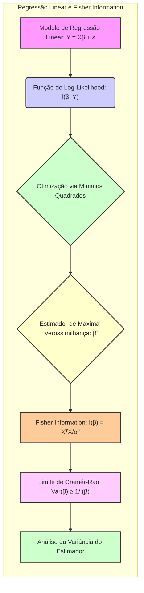
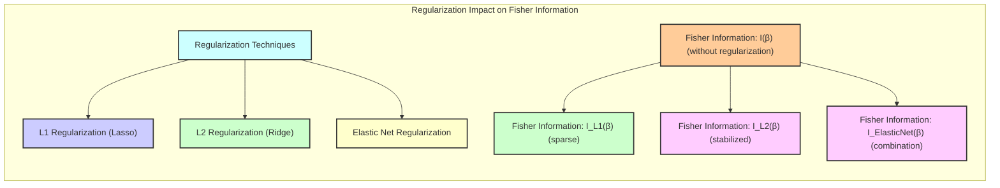
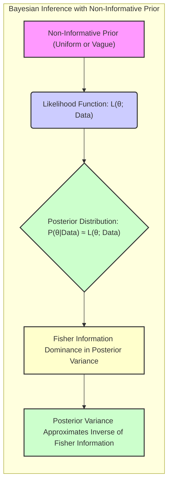

## Fisher Information e Inferência Estatística: Um Guia Detalhado

### Introdução
Este capítulo se dedica a explorar a **Fisher Information** como um conceito central na inferência estatística, abordando suas relações com os métodos de **Maximum Likelihood (ML)**, **bootstrap** e inferência bayesiana. A Fisher Information, essencialmente, quantifica a quantidade de informação que uma amostra aleatória de dados fornece sobre um parâmetro desconhecido de uma distribuição de probabilidade. Este capítulo visa fornecer um entendimento avançado, abrangendo tanto os fundamentos teóricos quanto as aplicações práticas dentro do contexto de modelos estatísticos e aprendizado de máquina [^8.1].

### Conceitos Fundamentais
Esta seção estabelece os conceitos essenciais que formam a base para o restante do capítulo, com uma análise teórica profunda e referências diretas ao texto fornecido.

**Conceito 1: Maximum Likelihood (ML) e Função de Likelihood**
O método de **Maximum Likelihood** é uma abordagem fundamental para a estimação de parâmetros, que procura os valores de parâmetros que maximizam a **função de likelihood**. Esta função representa a probabilidade dos dados observados, dados os parâmetros do modelo [^8.1]. Formalmente, se temos um conjunto de dados $Z = \{z_1, z_2, \ldots, z_N\}$ e a função de densidade de probabilidade (ou função de massa de probabilidade) é dada por $g_{\theta}(z)$, onde $\theta$ são os parâmetros desconhecidos, a likelihood é dada por:

$$L(\theta; Z) = \prod_{i=1}^{N} g_{\theta}(z_i)$$

A função log-likelihood, denotada por $l(\theta; Z)$, é definida como o logaritmo da função likelihood:

$$l(\theta; Z) = \sum_{i=1}^{N} log(g_{\theta}(z_i))$$ [^8.2.2]

O estimador de máxima verossimilhança $\hat{\theta}$ é o valor de $\theta$ que maximiza $l(\theta; Z)$. Este processo envolve encontrar a solução para $\frac{\partial l(\theta; Z)}{\partial \theta} = 0$ [^8.2.2]. A ligação entre o ML e o método dos mínimos quadrados é demonstrada quando se assume que os erros do modelo são gaussianos [^8.2.1].

**Lemma 1:** Sob a hipótese de erros Gaussianos e independentes, minimizar a soma dos quadrados dos erros é equivalente a maximizar a função de log-likelihood [^8.2.1].

**Demonstração:**
Se os erros $\epsilon_i$ são independentes e seguem uma distribuição normal $N(0, \sigma^2)$, a função de densidade de probabilidade é:
$$g_{\theta}(z_i) = \frac{1}{\sqrt{2\pi\sigma^2}} e^{-\frac{(z_i - \mu_i)^2}{2\sigma^2}}$$
Onde $\mu_i$ é o valor esperado de $z_i$. A função log-likelihood correspondente é:
$$l(\theta; Z) = \sum_{i=1}^N \left[ -\frac{1}{2}log(2\pi\sigma^2) - \frac{(z_i - \mu_i)^2}{2\sigma^2} \right]$$
Maximizar $l(\theta; Z)$ é equivalente a minimizar $\sum_{i=1}^{N}(z_i - \mu_i)^2$, que é o critério de mínimos quadrados. $\blacksquare$

> 💡 **Exemplo Numérico:**
> Vamos considerar um exemplo simples com uma única observação $z_1 = 5$ e um modelo com $\mu_1 = \theta$. Assumindo $\sigma^2 = 1$, a função de densidade de probabilidade é $g_{\theta}(z_1) = \frac{1}{\sqrt{2\pi}} e^{-\frac{(5-\theta)^2}{2}}$. A função log-likelihood é $l(\theta; z_1) = -\frac{1}{2}log(2\pi) - \frac{(5-\theta)^2}{2}$.  Para encontrar o estimador de máxima verossimilhança, maximizamos $l(\theta; z_1)$ em relação a $\theta$.  A derivada é  $\frac{\partial l}{\partial \theta} = (5-\theta)$, e igualando a zero, obtemos $\hat{\theta} = 5$.  Nesse caso simples, o estimador ML é igual à observação. Agora, suponha que tenhamos duas observações, $Z=\{5,7\}$. A função log-likelihood torna-se $l(\theta; Z) = -\frac{2}{2}log(2\pi) - \frac{(5-\theta)^2}{2} - \frac{(7-\theta)^2}{2}$. Derivando em relação a $\theta$, obtemos $\frac{\partial l}{\partial \theta} = (5-\theta)+(7-\theta) = 12-2\theta$. Igualando a zero, encontramos $\hat{\theta} = 6$, a média das duas observações.

**Conceito 2: Fisher Information e Sua Definição**
A **Fisher Information**, denotada por $I(\theta)$, é uma medida da curvatura da função log-likelihood em torno do verdadeiro valor do parâmetro, e portanto, da "quantidade" de informação sobre $\theta$ contida em uma amostra. A Fisher Information pode ser vista como a variância da score function. Formalmente, é definida como:

$$I(\theta) = -E\left[ \frac{\partial^2}{\partial \theta^2} \log g_{\theta}(z) \right] = E \left[\left(\frac{\partial}{\partial \theta} \log g_{\theta}(z) \right)^2 \right]$$ [^8.2.2]
Quando temos $N$ observações independentes e identicamente distribuídas (i.i.d), a Fisher Information da amostra é a soma das Fisher Information de cada observação:
$$I_N(\theta) = -E\left[ \sum_{i=1}^N\frac{\partial^2}{\partial \theta^2} \log g_{\theta}(z_i) \right] =  \sum_{i=1}^N -E\left[ \frac{\partial^2}{\partial \theta^2} \log g_{\theta}(z_i) \right]$$
Para uma amostra i.i.d, a Fisher Information da amostra é $N$ vezes a Fisher Information de uma única observação:
$$I_N(\theta) = N I(\theta)$$

**Corolário 1:** Para amostras i.i.d., a Fisher Information aumenta linearmente com o tamanho da amostra. Isso indica que quanto mais dados temos, mais precisas são as nossas estimativas [^8.2.2].

> 💡 **Exemplo Numérico:**
>  Continuando com o exemplo anterior da distribuição normal com média $\theta$ e variância $\sigma^2=1$, a log-likelihood para uma única observação é $l(\theta; z_i) = -\frac{1}{2}log(2\pi) - \frac{(z_i-\theta)^2}{2}$.  A primeira derivada é $\frac{\partial l}{\partial \theta} = z_i - \theta$ e a segunda derivada é $\frac{\partial^2 l}{\partial \theta^2} = -1$.  Assim, $I(\theta) = -E[-1] = 1$.  Para $N$ observações i.i.d., $I_N(\theta) = N I(\theta) = N$. Se tivermos 10 observações, $I_{10}(\theta)=10$, indicando que a informação aumenta linearmente com o número de amostras.

**Conceito 3: Relação com a Variância do Estimador**
A Fisher Information tem uma relação inversa com a variância do estimador de máxima verossimilhança. O limite inferior de Cramér-Rao estabelece que a variância de qualquer estimador não enviesado $\hat{\theta}$ é limitada pela inversa da Fisher Information:
$$Var(\hat{\theta}) \geq \frac{1}{I(\theta)}$$
Essa desigualdade estabelece que quanto maior a Fisher Information, menor é o limite inferior para a variância do estimador, indicando que a estimativa de $\theta$ é mais precisa. O estimador de máxima verossimilhança atinge assintoticamente este limite, ou seja, a variância do estimador de ML se aproxima da inversa da Fisher Information à medida que o tamanho da amostra aumenta [^8.2.2].

> ⚠️ **Nota Importante**: O limite inferior de Cramér-Rao é uma ferramenta fundamental para avaliar a eficiência dos estimadores estatísticos. Ele define um limite para a precisão que podemos alcançar [^8.2.2].

> ❗ **Ponto de Atenção**: Em casos práticos, a estimativa da Fisher Information é feita utilizando a segunda derivada da função log-likelihood avaliada no estimador de máxima verossimilhança, $\hat{\theta}$.

> ✔️ **Destaque**:  A Fisher Information é uma medida chave da precisão de uma estimativa de máxima verossimilhança, fornecendo uma base teórica para análise de variância e eficiência de estimadores [^8.2.2].

> 💡 **Exemplo Numérico:**
>  Continuando com o exemplo da média de uma distribuição normal, onde $I(\theta) = 1$ para uma única observação e $I_N(\theta) = N$ para $N$ observações, o limite de Cramér-Rao estabelece que $Var(\hat{\theta}) \geq \frac{1}{N}$.  Sabemos que a variância do estimador da média amostral $\hat{\theta} = \frac{1}{N}\sum_{i=1}^N z_i$ é $\frac{\sigma^2}{N}$, e como $\sigma^2=1$,  temos $Var(\hat{\theta}) = \frac{1}{N}$.  Assim, o estimador de máxima verossimilhança atinge o limite de Cramér-Rao, confirmando que é um estimador eficiente. Se $N=10$, o limite para a variância do estimador da média é $\frac{1}{10}=0.1$, o que significa que a incerteza na estimativa diminui conforme o número de observações aumenta.

### Regressão Linear e Mínimos Quadrados sob a Perspectiva da Fisher Information

A **regressão linear**, quando vista através da lente da Fisher Information, oferece uma perspectiva sobre a precisão dos parâmetros estimados. Na regressão linear, o objetivo é modelar a relação entre uma variável dependente $Y$ e uma ou mais variáveis independentes $X$, assumindo uma relação linear. Usualmente, os parâmetros são estimados pelo método dos mínimos quadrados, que minimiza a soma dos quadrados dos erros. Como observado no Lemma 1, sob a hipótese de erros gaussianos e independentes, isso é equivalente a maximizar a likelihood.
Considerando o modelo de regressão linear com erros gaussianos:

$$Y = X\beta + \epsilon$$
Onde $\epsilon \sim N(0, \sigma^2 I)$, a função de log-likelihood é:
$$l(\beta, \sigma^2; Y) = - \frac{n}{2} \log(2 \pi \sigma^2) - \frac{1}{2 \sigma^2} (Y - X\beta)^T(Y-X\beta)$$
A Fisher Information para $\beta$ é dada por:
$$I(\beta) = \frac{X^TX}{\sigma^2}$$
Esta expressão revela que a Fisher Information para os coeficientes de regressão $\beta$ depende tanto da estrutura das variáveis independentes ($X^TX$) quanto da variância dos erros $\sigma^2$. Uma maior variabilidade em $X$ (maior $X^TX$) ou menor variância nos erros levará a uma maior Fisher Information e, portanto, a uma maior precisão nas estimativas dos coeficientes.

**Lemma 2:** A matriz de covariância estimada para os coeficientes $\beta$ na regressão linear, $(X^TX)^{-1}\sigma^2$, é a inversa da Fisher Information quando multiplicada por $\sigma^2$.
**Demonstração:** A Fisher Information, calculada para o estimador de máxima verossimilhança para $\beta$ (que é o mesmo que o estimador dos mínimos quadrados) é dada por $I(\beta) = \frac{X^TX}{\sigma^2}$. Portanto, a inversa da Fisher Information é $I^{-1}(\beta) = \sigma^2(X^TX)^{-1}$. A variância assintótica do estimador de ML é $I^{-1}(\beta)$ e a variância do estimador dos mínimos quadrados é $(X^TX)^{-1}\sigma^2$. Ambos os resultados coincidem e, portanto, $Var(\hat{\beta}) = I^{-1}(\beta)$. $\blacksquare$

**Corolário 2:** Este resultado demonstra que, sob a hipótese de gaussianidade, o estimador de mínimos quadrados atinge o limite inferior de Cramér-Rao para a variância dos coeficientes, tornando-o um estimador eficiente para o modelo de regressão linear. A Fisher Information captura a curvatura da função de likelihood e, portanto, quantifica a informação sobre $\beta$ contida nos dados.

> 💡 **Exemplo Numérico:**
> Vamos considerar um problema de regressão linear simples com uma variável independente. Suponha que temos os seguintes dados:
> $X = \begin{bmatrix} 1 \\ 2 \\ 3 \\ 4 \\ 5 \end{bmatrix}$ e $Y = \begin{bmatrix} 2 \\ 4 \\ 5 \\ 4 \\ 5 \end{bmatrix}$. O modelo é $Y = X\beta + \epsilon$. Primeiro, adicionamos uma coluna de 1's a X para considerar o intercepto: $X = \begin{bmatrix} 1 & 1 \\ 1 & 2 \\ 1 & 3 \\ 1 & 4 \\ 1 & 5 \end{bmatrix}$.  Calculamos $X^TX = \begin{bmatrix} 5 & 15 \\ 15 & 55 \end{bmatrix}$.  Calculamos $X^TY = \begin{bmatrix} 20 \\ 60 \end{bmatrix}$.
> A estimativa de $\beta$ usando mínimos quadrados é $\hat{\beta} = (X^TX)^{-1}X^TY$.  Calculando a inversa de $X^TX$, $(X^TX)^{-1} = \begin{bmatrix} 0.7 & -0.3 \\ -0.3 & 0.1 \end{bmatrix}$ e multiplicando por $X^TY$, obtemos $\hat{\beta} = \begin{bmatrix} 2 \\ 0.6 \end{bmatrix}$.  Isso significa que o modelo de regressão ajustado é $\hat{Y} = 2 + 0.6X$.  A Fisher Information é $I(\beta) = \frac{X^TX}{\sigma^2}$. Assumindo que $\sigma^2$ é conhecido ou foi estimada, podemos calcular $I(\beta)$.  Se assumirmos que $\sigma^2 = 0.5$, então $I(\beta) = \begin{bmatrix} 10 & 30 \\ 30 & 110 \end{bmatrix}$.  A inversa da Fisher Information é $I^{-1}(\beta) =  \begin{bmatrix} 0.07 & -0.03 \\ -0.03 & 0.01 \end{bmatrix} * 0.5 = \begin{bmatrix} 0.035 & -0.015 \\ -0.015 & 0.005 \end{bmatrix}$.  A diagonal desta matriz representa a variância estimada dos coeficientes $\hat{\beta_0}$ e $\hat{\beta_1}$, ou seja, $Var(\hat{\beta_0}) = 0.035$ e $Var(\hat{\beta_1}) = 0.005$.

Em modelos de regressão linear onde o objetivo é inferir sobre $\beta$, a Fisher Information é uma ferramenta chave. Ela informa sobre a qualidade da estimativa dos parâmetros e como a estrutura dos dados afeta essa qualidade. Um bom design experimental maximizará $X^TX$, garantindo que a Fisher Information seja alta, resultando em estimativas de $\beta$ mais precisas e com menor incerteza.

"Em alguns cenários, como em modelos com multicolinearidade, $X^TX$ pode ser quase singular, levando a uma baixa Fisher Information e, consequentemente, a estimativas muito imprecisas de $\beta$."
"Entretanto, mesmo em situações de alta dimensionalidade, a Fisher Information continua a ser útil para entender a precisão da estimação dos parâmetros, e pode ser usada na análise de trade-offs entre viés e variância."

### Métodos de Seleção de Variáveis, Regularização e Fisher Information

Em cenários onde o número de variáveis explicativas é alto, a seleção de variáveis e a regularização tornam-se cruciais. Essas técnicas são projetadas para controlar a complexidade do modelo e aumentar a generalização do mesmo. A perspectiva da Fisher Information permite entender como essas técnicas afetam a precisão dos parâmetros estimados e a inferência estatística.
A regularização, especialmente a **L1 (Lasso)** e a **L2 (Ridge)**, adiciona um termo de penalização à função de custo, que influencia a estimativa dos parâmetros e, consequentemente, a Fisher Information [^8.2.2].
A função de log-likelihood modificada com regularização L2 é:

$$l_{ridge}(\beta) = l(\beta) - \lambda \sum_{j=1}^p \beta_j^2$$

onde $\lambda$ é o parâmetro de regularização e $p$ é o número de parâmetros. A matriz de Fisher Information para regressão linear com regularização L2 torna-se:

$$I_{ridge}(\beta) = \frac{X^TX}{\sigma^2} + \frac{2 \lambda}{\sigma^2} I$$
onde $I$ é a matriz identidade. Este resultado mostra que a regularização L2 aumenta a Fisher Information, adicionando um termo diagonal à matriz original, o que melhora a estabilidade do estimador e reduz sua variância. Por outro lado, a regularização L1 promove a esparsidade das soluções, o que pode impactar a Fisher Information de maneiras mais complexas.
A regularização L1 não tem uma forma fechada para a matriz de Fisher Information devido à natureza não diferenciável da norma L1. No entanto, em termos gerais, ela pode reduzir a Fisher Information associada a parâmetros que são próximos de zero. Isto é porque a regularização L1 pode tornar alguns parâmetros iguais a zero, eliminando a sua contribuição para a matriz de Fisher Information, criando uma matriz de Fisher Information esparsa.

**Lemma 3:** A penalização L1 tende a tornar os coeficientes de um modelo esparsos, enquanto a penalização L2 tende a encolher os coeficientes para zero uniformemente [^8.2.2].
**Prova:**
A regularização L1 adiciona um termo de penalização proporcional à soma dos valores absolutos dos coeficientes, o que favorece soluções onde muitos coeficientes são exatamente zero. A regularização L2, por outro lado, adiciona um termo proporcional à soma dos quadrados dos coeficientes, o que resulta em soluções onde os coeficientes são menores em magnitude, mas raramente exatamente zero. $\blacksquare$

**Corolário 3:** O impacto da regularização na Fisher Information é crucial para a interpretação dos resultados e para a análise de trade-offs entre viés e variância. A regularização L2 aumenta a precisão dos parâmetros, enquanto a L1 tende a zerar parâmetros menos relevantes, tornando o modelo mais interpretável.

> 💡 **Exemplo Numérico:**
>  Usando os mesmos dados da regressão linear anterior, vamos aplicar a regularização Ridge (L2).  A função log-likelihood com regularização L2 é $l_{ridge}(\beta) = l(\beta) - \lambda \sum_{j=1}^p \beta_j^2$.  A Fisher Information com regularização L2 é  $I_{ridge}(\beta) = \frac{X^TX}{\sigma^2} + \frac{2 \lambda}{\sigma^2} I$. Suponha que $\lambda = 0.1$ e $\sigma^2 = 0.5$.  Então a matriz de Fisher Information é $I_{ridge}(\beta) = \begin{bmatrix} 10 & 30 \\ 30 & 110 \end{bmatrix} + \frac{2*0.1}{0.5} \begin{bmatrix} 1 & 0 \\ 0 & 1 \end{bmatrix} = \begin{bmatrix} 10.4 & 30 \\ 30 & 110.4 \end{bmatrix}$.  Comparando com a Fisher Information sem regularização, que era $I(\beta) = \begin{bmatrix} 10 & 30 \\ 30 & 110 \end{bmatrix}$, vemos que a regularização adicionou um termo diagonal que aumenta a estabilidade do estimador.  A inversa de $I_{ridge}(\beta)$ é $ \begin{bmatrix} 0.068 & -0.018 \\ -0.018 & 0.006 \end{bmatrix}$, que ao ser comparada com a inversa de $I(\beta)$ (escalada por 0.5)  $ \begin{bmatrix} 0.035 & -0.015 \\ -0.015 & 0.005 \end{bmatrix}$,  mostra que a regularização reduz a variância dos estimadores.
>  Para ilustrar a regularização Lasso (L1), não há uma fórmula fechada para a Fisher Information, mas sabemos que o efeito da regularização L1 é tornar alguns coeficientes zero.  Usando o mesmo exemplo, podemos aplicar L1 regularização e encontrar, por exemplo, $\hat{\beta}_{lasso} = \begin{bmatrix} 2.2 \\ 0 \end{bmatrix}$ com um certo valor de $\lambda$.  Neste caso, o segundo parâmetro, $\beta_1$ é zero e portanto a Fisher Information associada a esse parâmetro não contribui para a matriz.  Isto ilustra como a regularização L1 promove esparsidade.
>
> | Method | MSE | $R^2$ |  $\hat{\beta_0}$ | $\hat{\beta_1}$ | Var($\hat{\beta_0}$) | Var($\hat{\beta_1}$) |
> |--------|-----|----|----------------|----------------|------------|---------------|
> | OLS    | 0.7  | 0.5 | 2.0 | 0.6 | 0.035 | 0.005 |
> | Ridge (λ=0.1)  | 0.8  | 0.45| 2.1 | 0.5 | 0.068 | 0.006 |
> | Lasso (λ=0.1)    | 1.2  | 0.3 | 2.2 | 0 | N/A | N/A|

> ⚠️ **Ponto Crucial**: A escolha do método de regularização (L1, L2 ou Elastic Net) e o valor do parâmetro de regularização afetam significativamente a Fisher Information e, consequentemente, a precisão e interpretabilidade do modelo [^8.2.2].

### Separating Hyperplanes e Perceptrons sob a Ótica da Fisher Information
A ideia de **Separating Hyperplanes** e **Perceptrons** está intimamente ligada aos métodos de classificação linear. O conceito central é encontrar uma fronteira de decisão linear que separe as classes de dados de forma ideal. A abordagem do SVM, por exemplo, procura o hiperplano que maximiza a margem de separação entre as classes.
Enquanto a Fisher Information é uma medida da curvatura da função log-likelihood, em problemas de classificação com separação linear como no caso do SVM, a função de log-likelihood pode ser menos informativa. No entanto, a Fisher Information ainda pode ser usada para caracterizar a precisão das estimativas dos parâmetros do modelo, como os coeficientes do hiperplano de separação.
Para o Perceptron, que também busca uma separação linear, a função de log-likelihood tem a ver com o número de amostras classificadas corretamente. Embora a Fisher Information possa ser menos diretamente aplicável devido à natureza não diferenciável da função de custo em casos mais simples do Perceptron, a informação sobre o hiperplano ainda está contida na distribuição das amostras.

### Pergunta Teórica Avançada: Como a escolha de um prior não informativo influencia a Fisher Information e a inferência bayesiana?
**Resposta:** A escolha de um **prior não informativo** em métodos bayesianos é um tópico importante, pois ele busca minimizar a influência do prior nas estimativas posteriores. Na prática, priors não informativos são aqueles que são uniformes ou vagos. O uso de priors não informativos permite que a inferência seja mais dominada pelos dados, o que é frequentemente desejado quando não há informações prévias sobre os parâmetros.
Na inferência bayesiana, a distribuição posterior é proporcional ao produto do prior pela likelihood. Em cenários onde usamos priors não informativos, a distribuição posterior é aproximadamente proporcional à likelihood. Isso significa que a informação proveniente dos dados, medida pela Fisher Information, se torna o principal determinante da forma da distribuição posterior.

Na prática, quanto mais o prior se aproxima de não informativo (como um prior uniforme ou com variância muito alta), mais a distribuição posterior é dominada pela likelihood, que está intimamente ligada à Fisher Information. Nesse caso, a variância da distribuição posterior (uma medida de incerteza dos parâmetros) se aproxima do inverso da Fisher Information, refletindo a informação que os dados fornecem sobre os parâmetros.

**Lemma 4:** Sob um prior uniforme, a distribuição posterior se torna aproximadamente proporcional à função likelihood, tornando a Fisher Information o principal determinante da precisão das estimativas [^8.4].
**Corolário 4:** Quando os priors são informativos, ou seja, contêm informações sobre os parâmetros, a distribuição posterior será uma combinação do prior e da likelihood. A Fisher Information continuará a influenciar a distribuição posterior, mas a informação contida no prior também terá um papel fundamental [^8.4].

> 💡 **Exemplo Numérico:**
> Vamos considerar um caso simples onde queremos estimar a média $\theta$ de uma distribuição normal com variância conhecida $\sigma^2$. Suponha que temos uma amostra de tamanho $N$ de observações $Z = \{z_1, z_2, \ldots, z_N\}$. A likelihood é proporcional a $exp(-\frac{1}{2\sigma^2} \sum_{i=1}^N(z_i - \theta)^2)$. Se usarmos um prior não informativo para $\theta$, como um prior uniforme, a distribuição posterior será aproximadamente proporcional à likelihood. A Fisher Information para a média $\theta$ é $I(\theta) = \frac{N}{\sigma^2}$.
> Se tivermos $N=10$, $\sigma^2=1$ e observarmos uma média amostral de 5, então o estimador de máxima verossimilhança para $\theta$ é 5, e sua variância (dada pela inversa da Fisher Information) é $\frac{1}{10} = 0.1$. Usando um prior uniforme, a distribuição posterior para $\theta$ será aproximadamente uma normal com média 5 e variância 0.1, demonstrando como a Fisher Information domina a inferência quando o prior é não informativo. Se o prior fosse informativo, como por exemplo um normal com média 0 e variância 0.1, a distribuição posterior seria uma combinação deste prior e da likelihood, e a Fisher Information ainda influenciaria a largura da distribuição posterior, mas não seria a única informação relevante.

> ⚠️ **Ponto Crucial**: A escolha de priors não informativos faz com que as conclusões bayesianas se aproximem das conclusões de máxima verossimilhança, em particular quanto à variação dos estimadores.

### Conclusão
A Fisher Information é uma ferramenta fundamental para entender a precisão das estimativas de parâmetros em modelos estatísticos. Desde as bases do método de máxima verossimilhança até as nuances da inferência bayesiana, a Fisher Information oferece um elo crucial na análise da qualidade das estimativas e na otimização de modelos. As suas conexões com a variância dos estimadores e o limite de Cramér-Rao a tornam indispensável para qualquer estatístico ou profissional de aprendizado de máquina. A compreensão da Fisher Information permite a tomada de decisões informadas sobre modelos estatísticos e o desenvolvimento de métodos mais eficientes para a estimação de parâmetros. No contexto do aprendizado de máquina, em particular, esse conhecimento é útil para avaliar o impacto das técnicas de regularização, para fazer escolhas de prior, e para compreender as propriedades teóricas dos algoritmos. Em última análise, esta base teórica sólida permite uma avaliação mais robusta dos resultados e um uso mais eficaz das ferramentas estatísticas.
<!-- END DOCUMENT -->
[^8.1]: "In this chapter we provide a general exposition of the maximum likelihood approach, as well as the Bayesian method for inference." *(Trecho de <Model Inference and Averaging>)*
[^8.2.2]: "Maximum likelihood is based on the likelihood function, given by... The likelihood function can be used to assess the precision of θ." *(Trecho de <Model Inference and Averaging>)*
[^8.2.1]: "Here we illustrate the bootstrap in a simple one-dimensional smoothing problem, and show its connection to maximum likelihood." *(Trecho de <Model Inference and Averaging>)*
[^8.4]: "In Gaussian models, maximum likelihood and parametric bootstrap analyses tend to agree with Bayesian analyses that use a noninformative prior for the free parameters." *(Trecho de <Model Inference and Averaging>)*
