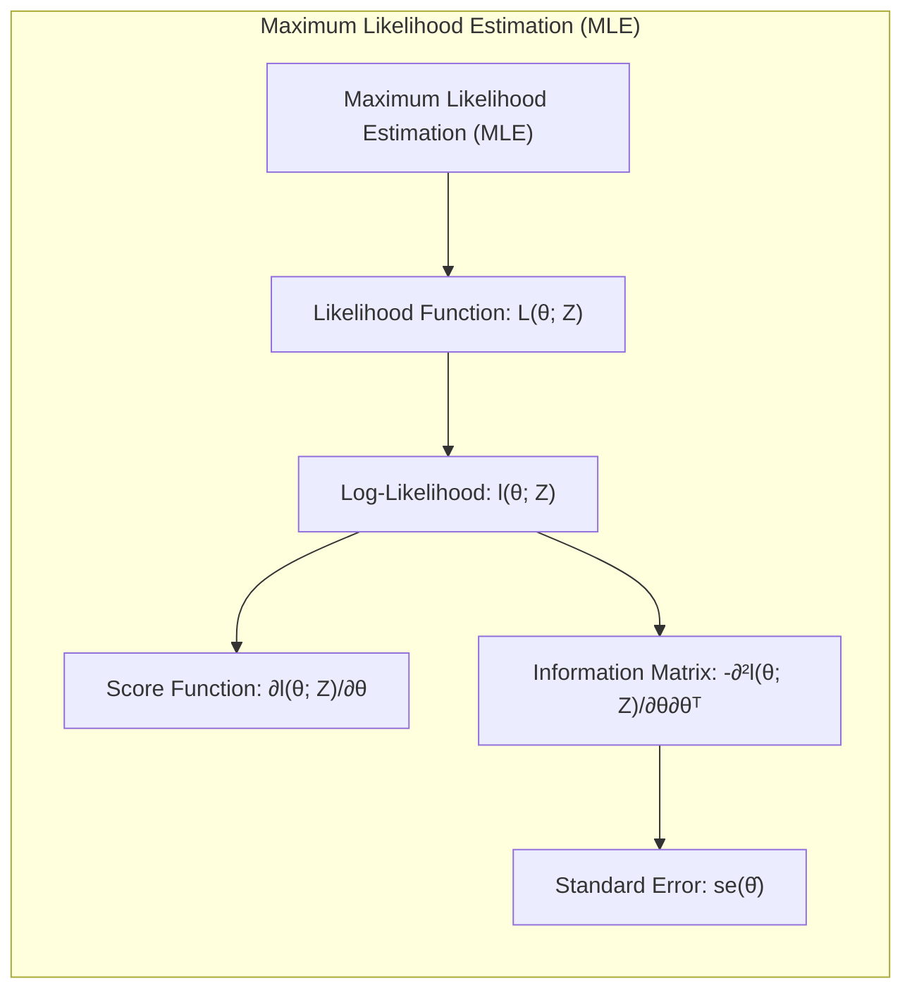
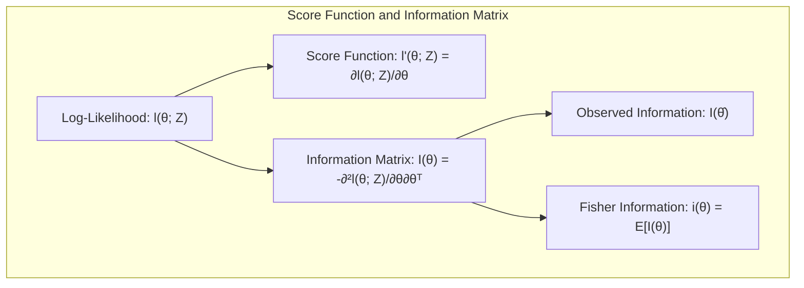
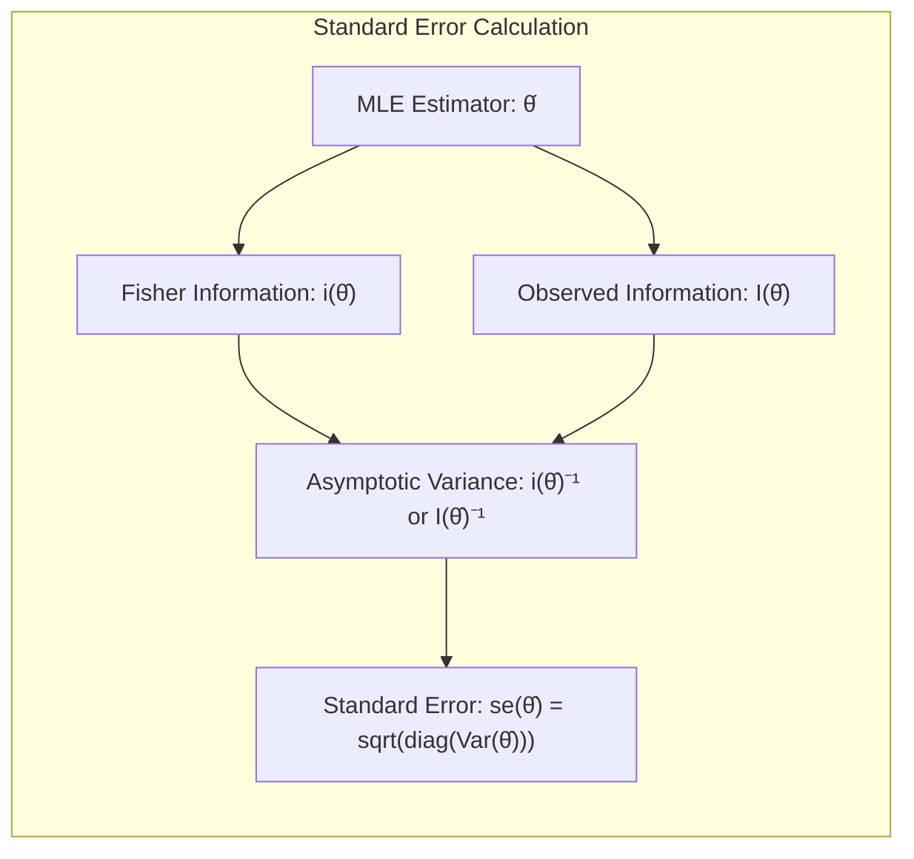
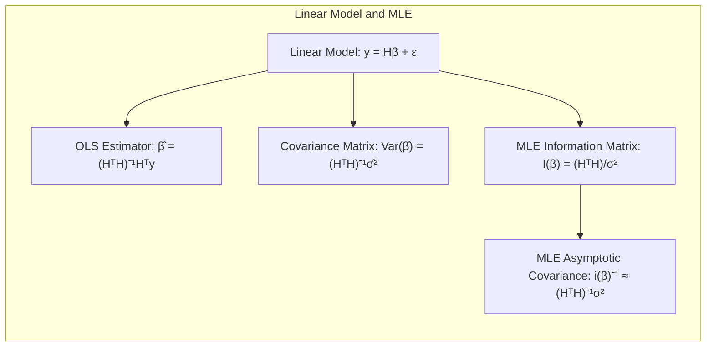
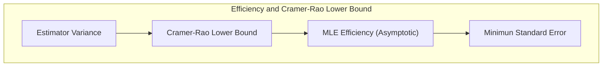

## Standard Error do Estimador de Máxima Verossimilhança

### Introdução

O conceito de **Standard Error** (Erro Padrão) de um estimador é fundamental na inferência estatística, fornecendo uma medida da precisão com que um parâmetro populacional é estimado a partir de uma amostra. No contexto do **Maximum Likelihood Estimation (MLE)**, o *standard error* nos ajuda a quantificar a incerteza associada às estimativas de parâmetros, e é crucial para a construção de intervalos de confiança e testes de hipóteses. O MLE, como discutido em [^8.1], [^8.2.2], busca os parâmetros que melhor se ajustam aos dados observados, maximizando a função de verossimilhança, um conceito central em inferência estatística. Este capítulo explora em detalhes o *standard error* do estimador de máxima verossimilhança.

### Conceitos Fundamentais

**Conceito 1: Maximum Likelihood Estimation (MLE)**

O **Maximum Likelihood Estimation** é um método para estimar os parâmetros de um modelo estatístico maximizando a **likelihood function** [^8.1], [^8.2.2]. A *likelihood function*, denotada por $L(\theta; Z)$, é a probabilidade dos dados observados, $Z = \{z_1, z_2, ..., z_N\}$, dado um conjunto de parâmetros desconhecidos $\theta$. Formalmente, a *likelihood function* é dada por:

$$L(\theta; Z) = \prod_{i=1}^{N} g_\theta(z_i)$$

onde $g_\theta(z_i)$ é a função de densidade de probabilidade (ou massa de probabilidade) para a i-ésima observação $z_i$, dado o parâmetro $\theta$ [^8.2.2]. A ideia central do MLE é encontrar o valor de $\theta$ que torna os dados observados o mais provável possível. Na prática, ao invés de maximizar $L(\theta; Z)$ diretamente, maximiza-se o seu logaritmo, a **log-likelihood** $l(\theta; Z)$, que é definido como [^8.2.2]:

$$l(\theta; Z) = \sum_{i=1}^{N} \log g_\theta(z_i)$$

O estimador de máxima verossimilhança $\hat{\theta}$ é então o valor de $\theta$ que maximiza $l(\theta; Z)$.

**Lemma 1:** A maximização da *likelihood function* é equivalente à maximização da *log-likelihood*.

**Prova:** Seja $L(\theta; Z)$ a *likelihood function* e $l(\theta; Z) = \log L(\theta; Z)$ a *log-likelihood*. Como a função logarítmica é estritamente crescente, os valores de $\theta$ que maximizam $L(\theta; Z)$ são os mesmos que maximizam $l(\theta; Z)$. Portanto, qualquer $\hat{\theta}$ tal que $\hat{\theta} = \text{argmax}_\theta L(\theta; Z)$ também satisfaz $\hat{\theta} = \text{argmax}_\theta l(\theta; Z)$. $\blacksquare$

> 💡 **Exemplo Numérico:**
> Suponha que temos um conjunto de dados $Z = \{2.1, 2.8, 3.5, 4.2, 4.9\}$ que acreditamos vir de uma distribuição normal com média $\mu$ e variância $\sigma^2 = 1$ (conhecida). Queremos estimar $\mu$ usando MLE. A função de densidade de probabilidade normal é dada por:
> $$g_\mu(z_i) = \frac{1}{\sqrt{2\pi}} e^{-\frac{(z_i-\mu)^2}{2}}$$
> A log-likelihood é:
> $$l(\mu; Z) = \sum_{i=1}^N \log \left( \frac{1}{\sqrt{2\pi}} e^{-\frac{(z_i-\mu)^2}{2}} \right) = - \frac{N}{2}\log(2\pi) - \frac{1}{2} \sum_{i=1}^N (z_i - \mu)^2$$
> Para maximizar $l(\mu; Z)$, precisamos minimizar $\sum_{i=1}^N (z_i - \mu)^2$, que é o mesmo que obter a média amostral. Assim, $\hat{\mu} = \frac{1}{5}(2.1 + 2.8 + 3.5 + 4.2 + 4.9) = 3.5$.
> O estimador de máxima verossimilhança para $\mu$ é a média amostral, como esperado.

**Conceito 2: Score Function e Information Matrix**

A **score function**, denotada por $l'(\theta; Z)$ ou $\ell(\theta; Z)$, é o gradiente da *log-likelihood* em relação aos parâmetros $\theta$ [^8.2.2]:

$$\ell(\theta; Z) = \frac{\partial l(\theta; Z)}{\partial \theta} = \sum_{i=1}^N \frac{\partial}{\partial \theta} \log g_\theta(z_i)$$

O estimador de máxima verossimilhança $\hat{\theta}$ é obtido resolvendo a equação de *score*:

$$\ell(\hat{\theta}; Z) = 0$$

A **Information Matrix**, $I(\theta)$, é uma matriz que mede a curvatura da *log-likelihood* ao redor do valor do parâmetro. É definida como a matriz Hessiana negativa da *log-likelihood*, ou seja, a matriz das derivadas parciais de segunda ordem [^8.2.2]:

$$I(\theta) = - \frac{\partial^2 l(\theta; Z)}{\partial \theta \partial \theta^T} = - \sum_{i=1}^N \frac{\partial^2}{\partial \theta \partial \theta^T} \log g_\theta(z_i)$$

Quando avaliada no estimador de máxima verossimilhança $\hat{\theta}$, $I(\hat{\theta})$ é chamada de **observed information** [^8.2.2]. A **Fisher Information** ou *expected information*, denotada por $i(\theta)$, é o valor esperado da *information matrix*:

$$i(\theta) = E[I(\theta)]$$

**Corolário 1:** A *information matrix* mede a quantidade de informação que uma amostra fornece sobre o parâmetro $\theta$.

> 💡 **Exemplo Numérico (continuação):**
> Para o exemplo anterior, a score function é dada por:
>  $$\ell(\mu; Z) = \frac{\partial l(\mu; Z)}{\partial \mu} = \sum_{i=1}^N (z_i - \mu)$$
> Igualando a zero, obtemos $\hat{\mu} = \frac{1}{N}\sum_{i=1}^N z_i = 3.5$.
> A *information matrix* (que, neste caso, é apenas um escalar) é:
> $$I(\mu) = - \frac{\partial^2 l(\mu; Z)}{\partial \mu^2} = - \frac{\partial}{\partial \mu} \sum_{i=1}^N (z_i - \mu) = N = 5$$
> A *Fisher information*, neste caso, também é igual a 5, pois a *information matrix* não depende dos dados.

**Conceito 3: Standard Error do Estimador de Máxima Verossimilhança**

O **standard error** do estimador de máxima verossimilhança, $\text{se}(\hat{\theta})$, é uma medida da variabilidade amostral do estimador. Intuitivamente, quanto menor o *standard error*, mais precisa a estimativa de $\theta$. O *standard error* é obtido a partir da *information matrix*. Um resultado fundamental da teoria assintótica do MLE afirma que, sob condições de regularidade, a distribuição amostral do estimador de máxima verossimilhança $\hat{\theta}$ se aproxima de uma distribuição normal, centrada no valor verdadeiro do parâmetro $\theta_0$, com uma matriz de covariância igual ao inverso da *Fisher information*:

$$\hat{\theta} \sim N(\theta_0, i(\theta_0)^{-1})$$

Portanto, a variância assintótica de $\hat{\theta}$ é dada por $i(\theta_0)^{-1}$ e o *standard error* é a raiz quadrada da diagonal dessa matriz. Como $\theta_0$ é desconhecido, o *standard error* é estimado usando a *observed information* ou a *Fisher information* avaliada em $\hat{\theta}$ [^8.2.2]:

$$\text{se}(\hat{\theta}) = \sqrt{i(\hat{\theta})^{-1}} \quad \text{ou} \quad \text{se}(\hat{\theta}) = \sqrt{I(\hat{\theta})^{-1}}$$

O *standard error* é essencial para a construção de intervalos de confiança e testes de hipóteses.

> ⚠️ **Nota Importante:** A distribuição normal assintótica do MLE só é válida quando o tamanho da amostra $N$ é suficientemente grande.
> ❗ **Ponto de Atenção:** As estimativas do *standard error* usando $I(\hat{\theta})$ e $i(\hat{\theta})$ podem diferir, especialmente em amostras pequenas.
> ✔️ **Destaque:** O conceito de *standard error* se baseia na ideia de que estimadores de máxima verossimilhança são assintoticamente normais [^8.2.2].

> 💡 **Exemplo Numérico (continuação):**
> Para o exemplo da distribuição normal com $\mu$ desconhecido, temos $I(\hat{\mu}) = i(\mu) = 5$.
> O *standard error* de $\hat{\mu}$ é dado por:
> $$\text{se}(\hat{\mu}) = \sqrt{I(\hat{\mu})^{-1}} = \sqrt{\frac{1}{5}} \approx 0.447$$
> Isso significa que a incerteza na nossa estimativa de $\mu$ é cerca de 0.447. Se tivéssemos uma amostra maior, o *standard error* seria menor, indicando uma estimativa mais precisa.

### Relação com a Matriz de Covariância

Em modelos lineares, o estimador de máxima verossimilhança para os coeficientes é o mesmo obtido pelo método de mínimos quadrados, e a matriz de covariância dos parâmetros é dada por [^8.2]:

$$\text{Var}(\hat{\beta}) = (H^TH)^{-1}\hat{\sigma}^2$$

onde $H$ é a matriz de *design* e $\hat{\sigma}^2$ é a estimativa da variância dos erros. Esta matriz de covariância é a base para calcular os *standard errors* dos coeficientes na regressão linear. No contexto do MLE, a *information matrix* $I(\beta)$ é o análogo ao inverso da matriz de covariância, quando multiplicada pela variância do ruído [^8.2.2], [^8.2.3], ou seja:

$$I(\beta) = (H^TH)/\sigma^2$$

E a estimativa do *standard error* de um coeficiente $\hat{\beta}_j$  é dada pela raiz quadrada do j-ésimo elemento diagonal de $(H^TH)^{-1}\hat{\sigma}^2$, conforme mencionado em [^8.2.3].

**Lemma 2:** A matriz de covariância do estimador de mínimos quadrados em modelos lineares é consistente com o inverso da matriz de *Fisher information* no contexto do MLE para modelos com erros Gaussianos [^8.2.2], [^8.2.3].

**Prova:** Em um modelo linear com erros Gaussianos, a maximização da *likelihood* leva aos mesmos estimadores de mínimos quadrados. A *Fisher Information* para os parâmetros de um modelo linear com ruído Gaussiano é dada por $I(\beta) = (H^TH)/\sigma^2$. O inverso da *Fisher information*, $I(\beta)^{-1}$, corresponde a $(H^TH)^{-1} \sigma^2$. Substituindo a estimativa da variância do erro, $\hat{\sigma}^2$, obtém-se uma matriz de covariância para o estimador de mínimos quadrados, dada por $(H^TH)^{-1} \hat{\sigma}^2$ . $\blacksquare$

**Corolário 2:** O *standard error* de um coeficiente em um modelo linear, quando derivado da *information matrix*, é equivalente ao *standard error* obtido pelo método de mínimos quadrados.

> 💡 **Exemplo Numérico (Regressão Linear):**
> Vamos considerar um modelo de regressão linear simples:
> $y_i = \beta_0 + \beta_1 x_i + \epsilon_i$, onde $\epsilon_i \sim N(0, \sigma^2)$.
> Suponha que temos os seguintes dados:
> | $x_i$ | $y_i$ |
> | ----- | ----- |
> | 1     | 3     |
> | 2     | 5     |
> | 3     | 7     |
> | 4     | 9     |
>
> A matriz de design $H$ e o vetor de respostas $y$ são:
> $$ H = \begin{bmatrix} 1 & 1 \\ 1 & 2 \\ 1 & 3 \\ 1 & 4 \end{bmatrix}, \quad y = \begin{bmatrix} 3 \\ 5 \\ 7 \\ 9 \end{bmatrix} $$
>
> Podemos calcular $(H^TH)^{-1}$:
>
> $$ H^TH = \begin{bmatrix} 4 & 10 \\ 10 & 30 \end{bmatrix}, \quad (H^TH)^{-1} = \begin{bmatrix} 1.5 & -0.5 \\ -0.5 & 0.2 \end{bmatrix} $$
>
> Os coeficientes de regressão são: $\hat{\beta} = (H^TH)^{-1} H^T y = \begin{bmatrix} 1 \\ 2 \end{bmatrix}$
> A variância do erro é estimada por $\hat{\sigma}^2 = \frac{\sum_{i=1}^4 (y_i - \hat{y}_i)^2}{4-2} = \frac{0}{2} = 0$, notamos que os dados foram gerados de maneira a não ter resíduos.
>  A matriz de covariância de $\hat{\beta}$ é:
> $$\text{Var}(\hat{\beta}) = (H^TH)^{-1}\hat{\sigma}^2 =  \begin{bmatrix} 1.5 & -0.5 \\ -0.5 & 0.2 \end{bmatrix} * 0 = \begin{bmatrix} 0 & 0 \\ 0 & 0 \end{bmatrix} $$
>
> Os *standard errors* dos coeficientes são as raízes quadradas da diagonal de  $\text{Var}(\hat{\beta})$:
> $$ \text{se}(\hat{\beta}_0) = \sqrt{0} = 0, \quad \text{se}(\hat{\beta}_1) = \sqrt{0} = 0 $$
> Note que, nesse exemplo em particular, por não haver resíduos, não há variabilidade amostral, logo, os erros padrão são nulos.

### Métodos de Cálculo e Inferência

O cálculo do *standard error* do estimador de máxima verossimilhança geralmente envolve as seguintes etapas:

1.  **Obter o estimador de máxima verossimilhança,** $\hat{\theta}$, maximizando a *log-likelihood* $l(\theta; Z)$.
2.  **Calcular a *observed information matrix*,** $I(\hat{\theta})$, ou a *Fisher information*, $i(\theta)$, avaliada em $\hat{\theta}$.
3.  **Inverter a *information matrix*** e obter a matriz de covariância do estimador $\text{Var}(\hat{\theta}) \approx i(\hat{\theta})^{-1}$ ou  $\text{Var}(\hat{\theta}) \approx I(\hat{\theta})^{-1}$.
4.  **Calcular o *standard error*** como a raiz quadrada dos elementos da diagonal de $\text{Var}(\hat{\theta})$.

O *standard error* é usado para construir intervalos de confiança e testar hipóteses. Um intervalo de confiança aproximado de 100(1-$\alpha$)% para o parâmetro $\theta_j$ é dado por [^8.2.2]:

$$\hat{\theta}_j \pm z_{1-\alpha/2} \cdot \text{se}(\hat{\theta}_j)$$

onde $z_{1-\alpha/2}$ é o quantil correspondente da distribuição normal padrão. Alternativamente, intervalos de confiança mais acurados podem ser obtidos usando o teste da razão de verossimilhanças (likelihood ratio test) [^8.2.2].

> 💡 **Exemplo Numérico (Intervalo de Confiança):**
> Retornando ao exemplo da estimativa de $\mu$ da distribuição normal, onde $\hat{\mu} = 3.5$ e $se(\hat{\mu}) \approx 0.447$. Para construir um intervalo de confiança de 95%, usamos $z_{0.975} \approx 1.96$.
> O intervalo de confiança de 95% para $\mu$ é:
> $$3.5 \pm 1.96 \times 0.447 = [2.62, 4.38]$$
> Isso significa que temos 95% de confiança de que o valor verdadeiro de $\mu$ está entre 2.62 e 4.38.

### Pergunta Teórica Avançada (Exemplo): Qual a relação entre o *standard error* do MLE e a eficiência de um estimador?

**Resposta:** A eficiência de um estimador está relacionada com a sua variância, e portanto com o seu *standard error*. Um estimador é considerado eficiente se ele alcança o limite inferior da variância para estimadores não-viesados, conhecido como **Cramer-Rao Lower Bound**. Sob certas condições de regularidade, o estimador de máxima verossimilhança é assintoticamente eficiente, o que significa que a sua variância assintótica atinge o limite de Cramer-Rao. Isso implica que o *standard error* do MLE, quando a amostra é grande, é o menor possível entre todos os estimadores não-viesados. [^8.2.2].

**Lemma 3:** O limite de Cramer-Rao estabelece um limite inferior para a variância de estimadores não-viesados.

**Corolário 3:** Sob condições de regularidade, o estimador de máxima verossimilhança atinge assintoticamente o limite de Cramer-Rao e, portanto, seu *standard error* é mínimo entre todos os estimadores não-viesados.

### Conclusão

O *standard error* do estimador de máxima verossimilhança é uma ferramenta essencial na inferência estatística, permitindo quantificar a precisão e a incerteza associadas às estimativas de parâmetros. O seu cálculo envolve a *information matrix* e é fundamental para a construção de intervalos de confiança e testes de hipóteses. Em modelos lineares, o *standard error* do MLE é consistente com o *standard error* obtido pelo método de mínimos quadrados. A relação entre o *standard error* e a eficiência de um estimador ressalta a importância do MLE como um método de estimativa estatisticamente robusto. O entendimento e a aplicação apropriada do *standard error* são cruciais para uma análise estatística rigorosa e precisa.

<!-- END DOCUMENT -->

### Footnotes
[^8.1]: "In this chapter we provide a general exposition of the maximum likelihood approach, as well as the Bayesian method for inference." *(Trecho de <Model Inference and Averaging>)*
[^8.2.2]: "Maximum likelihood is based on the likelihood function, given by  $L(\theta; Z) = \prod_{i=1}^{N} g_\theta(z_i)$... The method of maximum likelihood chooses the value $\theta = \hat{\theta}$ to maximize $l(\theta; Z)$... The likelihood function can be used to assess the precision of θ. The score function is defined by $\ell(\theta; Z) = \sum_{i=1}^N \ell(\theta; z_i)$... The information matrix is...$I(\theta) = -\sum_{i=1}^N \frac{\partial^2}{\partial \theta \partial \theta^T} \log g_\theta(z_i)$ When I(θ) is evaluated at $\theta = \hat{\theta}$, it is often called the observed information. The Fisher information (or expected information) is  $i(\theta) = E[I(\theta)]$...A standard result says that the sampling distribution of the maximum likelihood estimator has a limiting normal distribution $\hat{\theta} \sim N(\theta_0, i(\theta_0)^{-1})$..." *(Trecho de <Model Inference and Averaging>)*
[^8.2.3]: "The information matrix for $\theta = (\beta, \sigma^2)$ is block-diagonal, and the block corresponding to $\beta$ is $I(\beta) = (H^TH)/\sigma^2$, so that the estimated variance $(H^TH)^{-1}\hat{\sigma}^2$ agrees with the least squares estimate (8.3)." *(Trecho de <Model Inference and Averaging>)*
[^8.1]: "For most of this book, the fitting (learning) of models has been achieved by minimizing a sum of squares for regression, or by minimizing cross-entropy for classification. In fact, both of these minimizations are instances of the maximum likelihood approach to fitting." *(Trecho de <Model Inference and Averaging>)*
[^8.2]: "The corresponding fit $\mu(x) = \sum_{j=1}^7 \beta_j h_j(x)$ is shown in the top left panel of Figure 8.2. The estimated covariance matrix of $\beta$ is  $Var(\hat{\beta}) = (H^TH)^{-1}\hat{\sigma}^2$" *(Trecho de <Model Inference and Averaging>)*
