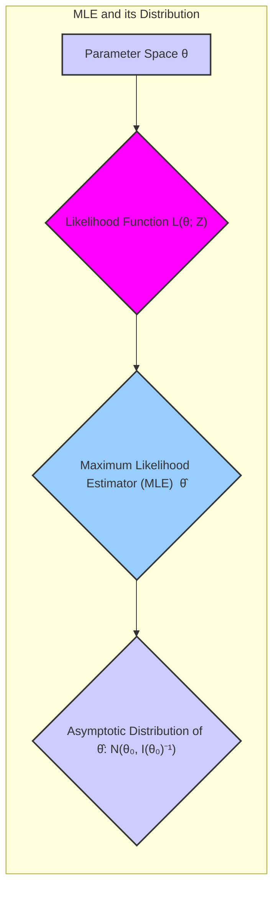
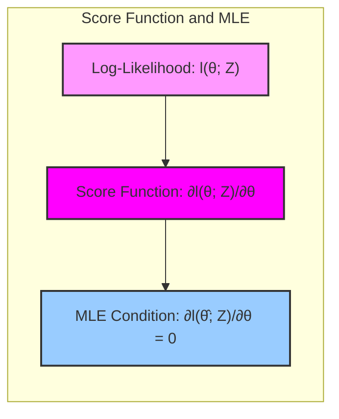
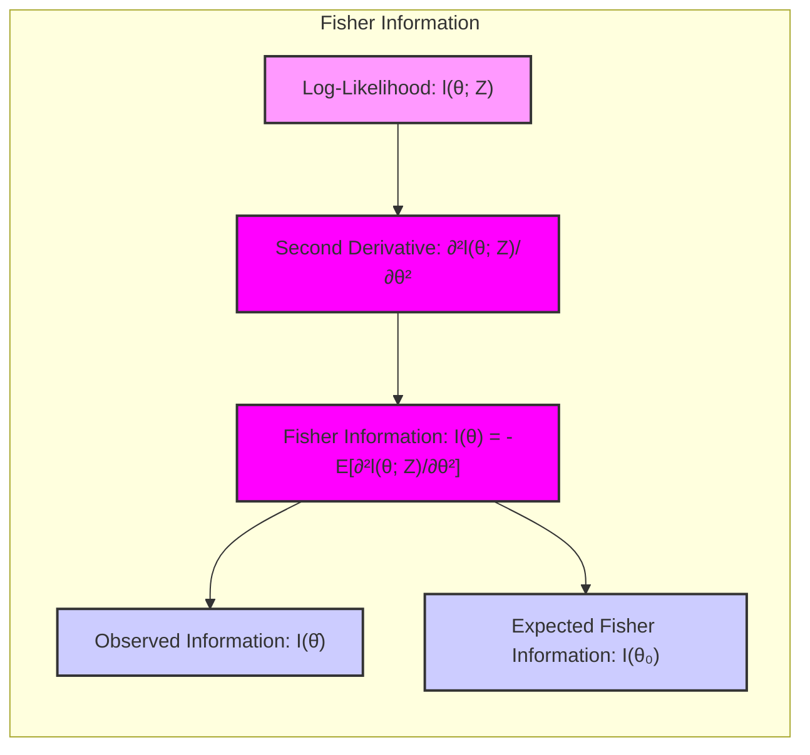
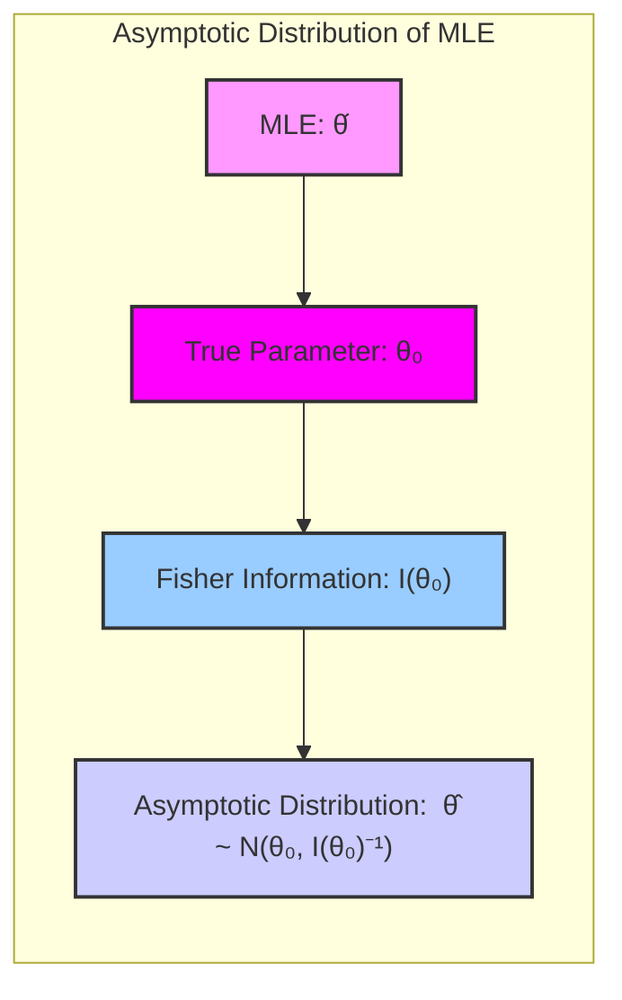
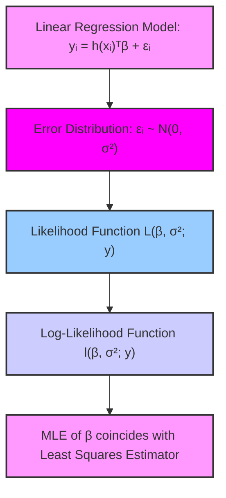
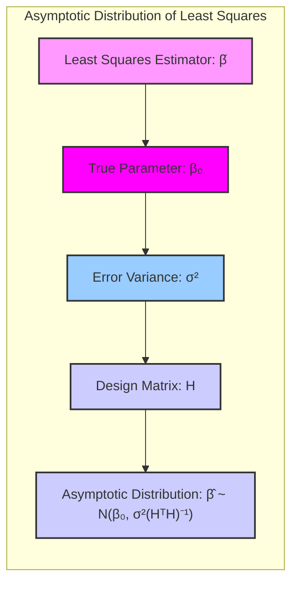
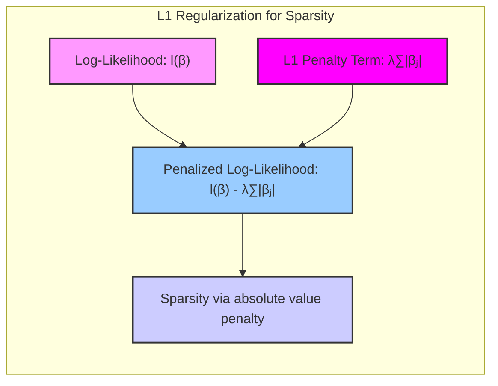
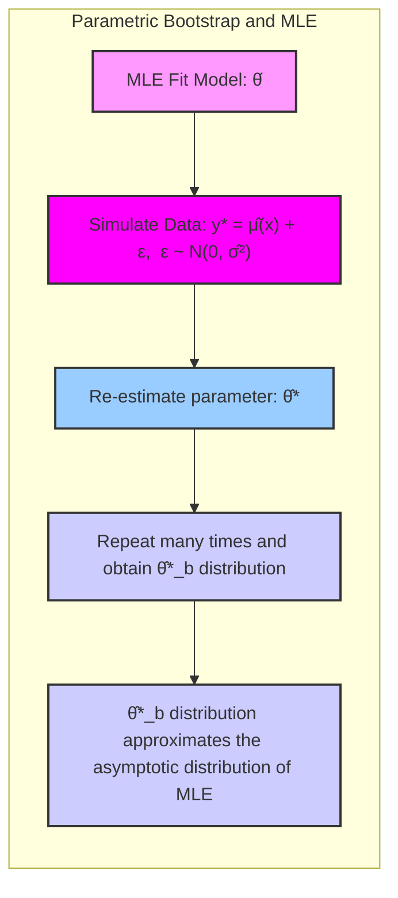

## Maximum Likelihood Estimator Distribution

### Introdução
Neste capítulo, exploramos a distribuição do estimador de máxima verossimilhança (MLE), um conceito fundamental na inferência estatística [^8.1]. A abordagem de máxima verossimilhança é uma metodologia para estimar os parâmetros de um modelo estatístico, maximizando a função de verossimilhança, que representa a probabilidade dos dados observados dados os parâmetros do modelo. Compreender a distribuição do MLE é crucial para avaliar a incerteza nas estimativas dos parâmetros e construir intervalos de confiança [^8.2].

### Conceitos Fundamentais
**Conceito 1: Função de Verossimilhança**
A função de verossimilhança, denotada como $L(\theta; Z)$, é a probabilidade dos dados observados $Z$ sob o modelo parametrizado por $\theta$ [^8.2.2]. Em outras palavras, se temos um modelo probabilístico $g_{\theta}(z)$ que descreve a distribuição de nossos dados, a verossimilhança é definida como
$$ L(\theta; Z) = \prod_{i=1}^{N} g_{\theta}(z_i), $$
onde $Z = \{z_1, z_2, \ldots, z_N\}$ representa as observações independentes. O objetivo do MLE é encontrar o valor de $\theta$ que maximiza $L(\theta; Z)$, denotado por $\hat{\theta}$. Frequentemente, é mais conveniente trabalhar com o logaritmo da verossimilhança, chamado de **log-verossimilhança**, $l(\theta; Z) = \log L(\theta; Z)$ [^8.2.2], que é dado por
$$ l(\theta; Z) = \sum_{i=1}^{N} \log g_{\theta}(z_i). $$
A maximização de $l(\theta; Z)$ é equivalente à maximização de $L(\theta; Z)$.

> 💡 **Exemplo Numérico:** Suponha que temos uma amostra de $N=3$ observações de uma distribuição normal com média $\mu$ e variância $\sigma^2=1$. As observações são $Z = \{2, 3, 4\}$. A função de densidade de probabilidade de uma distribuição normal é dada por $g_{\mu}(z) = \frac{1}{\sqrt{2\pi}} e^{-\frac{(z-\mu)^2}{2}}$. A log-verossimilhança para este caso é:
>
> $l(\mu; Z) = \sum_{i=1}^{3} \log \left( \frac{1}{\sqrt{2\pi}} e^{-\frac{(z_i - \mu)^2}{2}} \right) =  -\frac{3}{2} \log(2\pi) - \frac{1}{2} \sum_{i=1}^{3} (z_i - \mu)^2$
>
> Para encontrar o MLE, devemos maximizar $l(\mu; Z)$ em relação a $\mu$. Isso é equivalente a minimizar $\sum_{i=1}^{3} (z_i - \mu)^2$, o que nos leva ao estimador de média amostral: $\hat{\mu} = \frac{2 + 3 + 4}{3} = 3$.

**Lemma 1:** A **score function** é definida como a derivada da log-verossimilhança com respeito ao parâmetro $\theta$, ou seja,
$$ \ell(\theta; z_i) = \frac{\partial}{\partial \theta} \log g_{\theta}(z_i) . $$
Sob condições de regularidade, o MLE $\hat{\theta}$ satisfaz a equação $\ell(\hat{\theta}; Z) = 0$ [^8.2.2]. A prova disso decorre do fato de que, em um máximo local (ou global), a derivada deve ser zero.

> 💡 **Exemplo Numérico (continuação):** Usando o exemplo anterior, a score function para uma única observação $z_i$ é:
>
> $\ell(\mu; z_i) = \frac{\partial}{\partial \mu} \left( -\frac{1}{2} \log(2\pi) - \frac{(z_i - \mu)^2}{2} \right) = (z_i - \mu)$
>
> A score function para todo o conjunto de dados é: $\ell(\mu; Z) = \sum_{i=1}^3 (z_i - \mu) = (2-\mu) + (3-\mu) + (4-\mu) = 9 - 3\mu$.  Igualando a score function a zero, temos $9 - 3\hat{\mu} = 0$, logo $\hat{\mu} = 3$, o que coincide com o resultado obtido pela maximização da log-verossimilhança.

**Conceito 2: Informação de Fisher**
A **informação de Fisher**, $I(\theta)$, quantifica a quantidade de informação que os dados fornecem sobre o parâmetro $\theta$ [^8.2.2]. Ela é definida como a variância do score ou, equivalentemente, o negativo da esperança da segunda derivada da log-verossimilhança:
$$ I(\theta) = -E\left[ \frac{\partial^2}{\partial \theta^2} l(\theta; Z) \right] = E \left[ \left( \frac{\partial}{\partial \theta} l(\theta; Z) \right)^2 \right]. $$
Quando calculada no MLE, é referida como a **informação observada**, e quando calculada na verdade do parâmetro $\theta_0$, como **informação de Fisher esperada** [^8.2.2].
A importância da informação de Fisher reside no fato de que, para um grande número de observações, a distribuição do MLE é aproximadamente normal com uma variância inversamente proporcional à informação de Fisher.

> 💡 **Exemplo Numérico (continuação):** Para o exemplo da distribuição normal, a segunda derivada da log-verossimilhança para uma única observação $z_i$ é:
>
> $\frac{\partial^2}{\partial \mu^2} \left( -\frac{1}{2} \log(2\pi) - \frac{(z_i - \mu)^2}{2} \right) = \frac{\partial}{\partial \mu} (z_i - \mu) = -1$.
>
> A informação de Fisher para uma única observação é $I(\mu) = -E[-1] = 1$.  Para $N$ observações independentes, a informação de Fisher é $N$, já que a informação é aditiva para observações independentes. Portanto, $I(\mu; Z) = N = 3$ neste caso.

**Corolário 1:** A informação observada, $I(\hat{\theta})$, que é a matriz de informação avaliada no MLE, é dada por
$$ I(\hat{\theta}) = - \sum_{i=1}^{N} \frac{\partial^2}{\partial \theta^2} \log g_{\hat{\theta}}(z_i). $$
Essa matriz é usada para aproximar a variância do MLE.

> 💡 **Exemplo Numérico (continuação):** A informação observada para o exemplo da distribuição normal avaliada em $\hat{\mu} = 3$ é:
> $I(\hat{\mu}) = -\sum_{i=1}^{3} (-1) = 3$, o que coincide com a informação de Fisher esperada.

**Conceito 3: Distribuição Assintótica do MLE**
Um resultado fundamental na teoria estatística é que, sob condições de regularidade, a distribuição do MLE $\hat{\theta}$ converge assintoticamente para uma distribuição normal, com média no valor verdadeiro do parâmetro $\theta_0$ e matriz de covariância igual à inversa da informação de Fisher, ou seja [^8.2.2]:
$$ \hat{\theta} \xrightarrow{d} N(\theta_0, I(\theta_0)^{-1})  \text{ quando } N \rightarrow \infty.$$
Esta convergência em distribuição (indicada por $\xrightarrow{d}$) significa que, para grandes amostras, a distribuição de $\hat{\theta}$ pode ser aproximada por uma distribuição normal com a média e a variância especificadas. A distribuição assintótica nos diz que:
> ⚠️ **Nota Importante**: A variância do MLE diminui com o aumento do tamanho da amostra.

> 💡 **Exemplo Numérico (continuação):** No exemplo da distribuição normal, a distribuição assintótica de $\hat{\mu}$ é:
>
> $\hat{\mu} \xrightarrow{d} N(\mu, \frac{1}{N})$.
>
> Isso significa que, à medida que aumentamos o tamanho da amostra $N$, a variância de $\hat{\mu}$ diminui, indicando que a estimativa de $\mu$ torna-se mais precisa. Por exemplo, se tivéssemos $N=100$ observações, a variância do MLE seria $\frac{1}{100}$, uma ordem de magnitude menor do que para $N=100$.

Esta propriedade assintótica é crucial para realizar inferência estatística, pois nos permite construir intervalos de confiança e testes de hipótese para os parâmetros do modelo.

### Regressão Linear e Mínimos Quadrados para Classificação

Na classificação, um modelo de regressão linear pode ser adaptado para estimar a probabilidade de cada classe usando uma matriz de indicadores como resposta. A matriz de indicadores codifica a classe de cada observação com vetores binários, por exemplo, $(1, 0)$ para a primeira classe e $(0, 1)$ para a segunda classe. A regressão linear com mínimos quadrados é então aplicada para estimar os coeficientes do modelo. A conexão com o MLE surge quando assumimos que os erros do modelo são normalmente distribuídos. Nesse caso, o estimador de mínimos quadrados coincide com o estimador de máxima verossimilhança.

**Lemma 2:** Na regressão linear com erros gaussianos, o estimador de mínimos quadrados $\hat{\beta}$ é também o estimador de máxima verossimilhança (MLE) para os coeficientes $\beta$. A prova desse lemma é dada maximizando a log-verossimilhança, que corresponde à minimização da soma dos erros ao quadrado. [^8.2.2]

**Prova:**
Assumindo o modelo $y_i = h(x_i)^T\beta + \epsilon_i$ com $\epsilon_i \sim N(0,\sigma^2)$ a função de verossimilhança é dada por:

$$L(\beta, \sigma^2; y) = \prod_{i=1}^N \frac{1}{\sqrt{2\pi\sigma^2}} \exp\left(-\frac{(y_i - h(x_i)^T\beta)^2}{2\sigma^2}\right)$$
A log-verossimilhança é:
$$l(\beta, \sigma^2; y) = -\frac{N}{2}\log(2\pi\sigma^2) - \sum_{i=1}^N \frac{(y_i - h(x_i)^T\beta)^2}{2\sigma^2}$$
Maximizar esta expressão com respeito a $\beta$ é equivalente a minimizar a soma dos quadrados dos resíduos:
$$ \sum_{i=1}^N (y_i - h(x_i)^T\beta)^2$$
Esta minimização leva ao estimador de mínimos quadrados: $\hat{\beta} = (H^TH)^{-1}H^Ty$, onde $H$ é a matriz de desenho. $\blacksquare$

> 💡 **Exemplo Numérico:** Suponha que temos um problema de classificação binária com $N=4$ amostras e duas variáveis preditoras. Temos as seguintes observações e matriz de indicadores:
>
>  $X = \begin{bmatrix} 1 & 2 \\ 2 & 1 \\ 3 & 3 \\ 4 & 2 \end{bmatrix}$ ,   $Y = \begin{bmatrix} 1 & 0 \\ 1 & 0 \\ 0 & 1 \\ 0 & 1 \end{bmatrix}$
>
>  Adicionamos uma coluna de 1s para o intercepto: $H = \begin{bmatrix} 1 & 1 & 2 \\ 1 & 2 & 1 \\ 1 & 3 & 3 \\ 1 & 4 & 2 \end{bmatrix}$.
>  Podemos estimar os coeficientes $\hat{\beta}$ usando a fórmula de mínimos quadrados: $\hat{\beta} = (H^TH)^{-1}H^TY$.
>
> Primeiro, calculamos $H^TH$:
>  $H^TH = \begin{bmatrix} 4 & 10 & 8 \\ 10 & 30 & 23 \\ 8 & 23 & 19 \end{bmatrix}$
>
>  Calculamos a inversa de $(H^TH)$:
>  $(H^TH)^{-1} = \begin{bmatrix} 10.1667 & -3.8333 & -0.5 \\ -3.8333 & 1.5 & 0.1667 \\ -0.5 & 0.1667 & 0.25 \end{bmatrix}$
>
>  Calculamos $H^TY$:
>  $H^TY = \begin{bmatrix} 2 & 2 \\ 5 & 5 \\ 9 & 5 \end{bmatrix}$
>
>  Finalmente, calculamos $\hat{\beta}$:
> $\hat{\beta} = (H^TH)^{-1}H^TY = \begin{bmatrix} -0.1667 & 0.1667\\ 0.5 & -0.5 \\ 0.25 & -0.25 \end{bmatrix}$
>
> A matriz $\hat{\beta}$ nos dá os coeficientes do modelo linear para cada classe. A primeira coluna corresponde aos coeficientes para a classe 1 e a segunda coluna para a classe 2.

**Corolário 2:** A distribuição assintótica do estimador de mínimos quadrados, e consequentemente do MLE, é também aproximadamente normal, centrada no valor verdadeiro $\beta_0$ e com variância dada por $\sigma^2(H^TH)^{-1}$, onde $\sigma^2$ é a variância dos erros do modelo. A prova desse corolário decorre diretamente do teorema central do limite e das propriedades da informação de Fisher.

> 💡 **Exemplo Numérico (continuação):** Assumindo que a variância dos erros seja $\sigma^2=0.1$, a matriz de covariância do MLE $\hat{\beta}$ é:
>
> $Cov(\hat{\beta}) = \sigma^2(H^TH)^{-1} = 0.1 * \begin{bmatrix} 10.1667 & -3.8333 & -0.5 \\ -3.8333 & 1.5 & 0.1667 \\ -0.05 & 0.0167 & 0.025 \end{bmatrix} = \begin{bmatrix} 1.0167 & -0.3833 & -0.05 \\ -0.3833 & 0.15 & 0.0167 \\ -0.05 & 0.0167 & 0.025 \end{bmatrix}$
>
>  Esta matriz indica a variância e covariância dos parâmetros estimados. Por exemplo, a variância do primeiro coeficiente da primeira classe (intercepto) é 1.0167. A distribuição assintótica de $\hat{\beta}$ pode então ser escrita como $\hat{\beta} \xrightarrow{d} N(\beta_0,  \begin{bmatrix} 1.0167 & -0.3833 & -0.05 \\ -0.3833 & 0.15 & 0.0167 \\ -0.05 & 0.0167 & 0.025 \end{bmatrix})$.

É importante notar que, embora a regressão linear possa ser utilizada para classificação, suas limitações incluem a incapacidade de gerar probabilidades bem calibradas, como as geradas pela regressão logística. Além disso, a regressão linear pode sofrer com a extrapolação fora do intervalo [0,1] para as probabilidades.

### Métodos de Seleção de Variáveis e Regularização em Classificação
A seleção de variáveis e a regularização são técnicas importantes para melhorar o desempenho e a interpretabilidade dos modelos classificatórios. A regularização, como a penalização L1 ou L2, é frequentemente utilizada em modelos de regressão logística para evitar overfitting e obter coeficientes esparsos [^8.2]. A penalização L1, em particular, leva a modelos esparsos com alguns coeficientes exatamente iguais a zero, o que promove a seleção de variáveis.

**Lemma 3:** A penalização L1 em modelos de regressão logística resulta em um estimador com coeficientes esparsos. A prova utiliza a convexidade da função de perda e a natureza do operador de valor absoluto que promove soluções com alguns coeficientes iguais a zero.

**Prova:**
Considere a log-verossimilhança penalizada da regressão logística com penalização L1:

$$l(\beta) - \lambda \sum_{j=1}^p |\beta_j|$$

Onde $l(\beta)$ é a log-verossimilhança original e $\lambda$ é o parâmetro de regularização. A penalização L1 introduz um termo não diferenciável no problema de otimização. O ponto crucial é que o termo $\lambda \sum_{j=1}^p |\beta_j|$  impõe uma penalidade proporcional à soma dos valores absolutos dos coeficientes. A penalidade $|\beta_j|$ tem uma derivada indefinida em zero (é um "corner"). Este "corner" no zero resulta em valores de $\beta_j$ serem "puxados" para zero durante a otimização, promovendo a esparsidade. $\blacksquare$

> 💡 **Exemplo Numérico:** Considere um modelo de regressão logística com 3 preditores e a seguinte log-verossimilhança penalizada L1:
>  $l(\beta) - \lambda (|\beta_1| + |\beta_2| + |\beta_3|)$
>
>  Suponha que, sem regularização, os coeficientes estimados sejam $\beta = [1.5, -0.8, 0.2]$.
>
> Se usarmos uma regularização L1 com $\lambda = 0.5$, o processo de otimização buscará coeficientes que minimizem a perda e a penalidade L1. Isso resultaria em coeficientes esparsos. Por exemplo, os coeficientes poderiam mudar para $\beta = [1.0, 0, 0]$ após a regularização, indicando que as variáveis 2 e 3 não contribuem significativamente para o modelo com o parâmetro de regularização escolhido. O valor específico dos coeficientes após regularização dependerá do problema específico, mas o ponto fundamental é que a regularização L1 tende a "zerar" alguns dos coeficientes.

**Corolário 3:** Devido ao Lemma 3, a regularização L1 não apenas ajuda a evitar o overfitting, mas também a selecionar um subconjunto de variáveis relevantes. Isso leva a modelos mais interpretáveis, nos quais apenas as variáveis mais importantes são retidas.

> 💡 **Exemplo Numérico (continuação):** No exemplo anterior, ao zerar os coeficientes $\beta_2$ e $\beta_3$ através da regularização L1, o modelo se tornou mais simples, usando apenas o preditor associado a $\beta_1$. Isso simplifica a interpretação, destacando a importância do preditor 1 e removendo o ruído dos outros preditores.

> ❗ **Ponto de Atenção**: A escolha do parâmetro de regularização $\lambda$ é crucial. Valores muito grandes podem levar a underfitting, enquanto valores muito pequenos podem levar a overfitting.

### Separating Hyperplanes e Perceptrons
Os hiperplanos separadores, encontrados através de métodos como o Support Vector Machine (SVM) ou o Perceptron, são fronteiras lineares usadas para separar classes em um espaço de características. O Perceptron, em particular, é um algoritmo iterativo que busca um hiperplano capaz de classificar corretamente todos os exemplos de treinamento. O processo de treinamento envolve a atualização dos pesos do hiperplano quando exemplos são classificados incorretamente. O algoritmo do Perceptron converge para um hiperplano separador se os dados são linearmente separáveis.
É importante notar que o MLE, em muitos casos, possui relação com os hiperplanos separadores e a classificação linear.
> ✔️ **Destaque**: Para dados linearmente separáveis, a busca pelo hiperplano ótimo pode ser vista como uma forma de estimar um modelo que maximiza a verossimilhança (embora de forma indireta no caso do Perceptron original).

### Pergunta Teórica Avançada: Como o bootstrap paramétrico se relaciona com o MLE?
**Resposta:** O bootstrap paramétrico se baseia no modelo ajustado, obtido via MLE, para simular novos conjuntos de dados. No exemplo do splines no contexto original, as amostras bootstrap paramétricas são obtidas simulando novas respostas $y^*_i$ adicionando ruído gaussiano ao valor predito pelo modelo: $y^*_i = \hat{\mu}(x_i) + \epsilon_i$, onde $\epsilon_i \sim N(0,\hat{\sigma}^2)$. Se repetirmos este processo muitas vezes, podemos construir uma distribuição empírica para os parâmetros.
É importante notar que essa distribuição bootstrap paramétrica se aproxima da distribuição assintótica do MLE quando o número de amostras bootstrap tende ao infinito e se o modelo está correto [^8.2.2]. Em particular, a média dos parâmetros estimados pelas amostras bootstrap se aproxima do MLE e a variância se aproxima da inversa da informação de Fisher, similar ao resultado da distribuição assintótica.

**Lemma 4:**  O bootstrap paramétrico, sob as condições apropriadas, produz uma distribuição amostral que se aproxima da distribuição assintótica do estimador de máxima verossimilhança (MLE). Essa prova é baseada em resultados de teoria assintótica e na consistência do MLE e na sua distribuição assintótica. [^8.2.2]

**Prova:**
O bootstrap paramétrico baseia-se na distribuição ajustada pelo MLE ($\hat{\theta}$). Ao gerar amostras a partir dessa distribuição, estamos essencialmente amostrando do espaço de parâmetros, onde a função de verossimilhança é maximizada. A distribuição das estimativas dos parâmetros das amostras bootstrap converge, sob condições de regularidade, para a distribuição normal assintótica do MLE, centrada no valor do MLE. $\blacksquare$

> 💡 **Exemplo Numérico:** Voltando ao exemplo da regressão linear com a matriz $H$ e $Y$, após ajustar o modelo por mínimos quadrados (que é equivalente ao MLE com erros gaussianos), temos $\hat{\beta}$ e podemos estimar a variância dos erros $\hat{\sigma}^2$. Para obter amostras bootstrap, podemos:
>
>  1.  Calcular os valores ajustados $\hat{y}_i = h(x_i)^T\hat{\beta}$ para cada observação $i$.
>  2.  Gerar um ruído aleatório $\epsilon_i^* \sim N(0, \hat{\sigma}^2)$ para cada observação $i$.
>  3.  Criar uma nova resposta bootstrap $y^*_i = \hat{y}_i + \epsilon_i^*$.
>  4.  Repetir esses passos $B$ vezes (por exemplo, $B=1000$) para gerar $B$ conjuntos de respostas bootstrap $Y^*_b$.
>  5. Para cada conjunto $Y^*_b$, reajustar o modelo obtendo $\hat{\beta}^*_b$.
>  6. A distribuição das amostras de $\hat{\beta}^*_b$ se aproxima da distribuição assintótica do MLE.

**Corolário 4:** Tanto o bootstrap paramétrico como a distribuição assintótica do MLE nos fornecem uma forma de quantificar a incerteza nas estimativas dos parâmetros do modelo. Em casos onde a forma analítica da distribuição do MLE não é acessível, o bootstrap paramétrico pode ser uma ferramenta útil.
> ⚠️ **Ponto Crucial**: A relação entre bootstrap paramétrico e distribuição assintótica do MLE é mais forte sob a hipótese de que o modelo seja correto. Caso contrário, a distribuição bootstrap paramétrica ainda captura a variabilidade do estimador sob as suposições do modelo, mas pode não refletir a variabilidade do mundo real.

### Conclusão
Este capítulo explorou a distribuição do estimador de máxima verossimilhança (MLE) e suas propriedades, com foco na distribuição assintótica. Discutimos como o MLE está relacionado com outros métodos, como mínimos quadrados, modelos de regressão logística e hiperplanos separadores, no contexto de problemas de classificação. Vimos como a informação de Fisher e a distribuição assintótica do MLE são ferramentas importantes para inferência estatística. Além disso, exploramos a relação entre o bootstrap paramétrico e a distribuição assintótica do MLE, destacando como o bootstrap pode ser uma ferramenta computacional útil para aproximar a distribuição do MLE. Finalmente, discutimos a importância da regularização para melhorar a estimativa de máxima verossimilhança.

### Footnotes
[^8.1]: "For most of this book, the fitting (learning) of models has been achieved by minimizing a sum of squares for regression, or by minimizing cross-entropy for classification." *(Trecho de Model Inference and Averaging)*
[^8.2]: "In this chapter we provide a general exposition of the maximum likelihood approach, as well as the Bayesian method for inference." *(Trecho de Model Inference and Averaging)*
[^8.2.2]: "Maximum Likelihood Inference It turns out that the parametric bootstrap agrees with least squares in the previous example because the model (8.5) has additive Gaussian errors. In general, the parametric bootstrap agrees not with least squares but with maximum likelihood, which we now review." *(Trecho de Model Inference and Averaging)*
<!-- END DOCUMENT -->
