## Confidence Intervals: A Comprehensive Guide

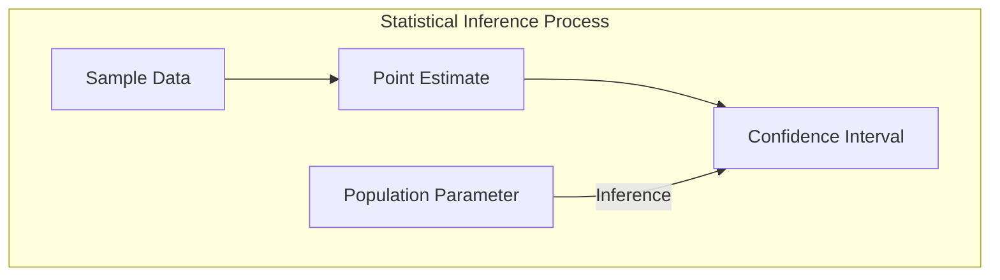

### Introdução
A inferência estatística, baseada em amostras, busca extrapolar conclusões sobre uma população maior. As **estimativas pontuais** fornecem um único valor para um parâmetro populacional, enquanto os **intervalos de confiança** oferecem uma gama de valores plausíveis, quantificando a incerteza associada a essa estimativa [^8.1]. Este capítulo explora a teoria e a prática da construção e interpretação de intervalos de confiança, um conceito fundamental em modelagem estatística e aprendizado de máquina. A compreensão da incerteza inerente às nossas estimativas é crucial para tomar decisões informadas e avaliar a confiabilidade de modelos. Vamos mergulhar nas nuances da inferência estatística e nas técnicas para quantificar essa incerteza, com um foco especial em métodos estatísticos e de aprendizado de máquina.

### Conceitos Fundamentais
**Conceito 1: Estimativas Pontuais e Incerteza**
Em modelagem estatística e aprendizado de máquina, frequentemente procuramos estimar parâmetros populacionais a partir de dados amostrais. As **estimativas pontuais** são valores únicos calculados a partir dos dados, como a média amostral para estimar a média populacional ou a proporção amostral para estimar a proporção populacional [^8.1]. No entanto, uma estimativa pontual, por si só, não reflete a incerteza inerente ao processo de amostragem. A **incerteza** surge porque diferentes amostras aleatórias da mesma população provavelmente resultarão em estimativas pontuais ligeiramente diferentes. É aqui que os intervalos de confiança se tornam essenciais [^8.2].
Um intervalo de confiança fornece uma **faixa de valores plausíveis** para o parâmetro populacional, juntamente com um nível de confiança que indica a frequência com que essa faixa capturará o verdadeiro valor do parâmetro em amostragens repetidas. Um intervalo de confiança de 95%, por exemplo, sugere que, se repetíssemos o processo de amostragem muitas vezes e construíssemos um intervalo de confiança para cada amostra, aproximadamente 95% desses intervalos conteriam o verdadeiro parâmetro populacional [^8.2]. É crucial notar que isso *não* significa que há uma probabilidade de 95% do parâmetro populacional estar dentro de um único intervalo de confiança calculado.

> 💡 **Exemplo Numérico:** Imagine que estamos interessados em estimar a altura média de mulheres adultas em uma cidade. Coletamos uma amostra aleatória de 100 mulheres e encontramos uma média amostral de 165 cm. Uma estimativa pontual da altura média da população seria, portanto, 165 cm. No entanto, sabemos que essa estimativa pontual tem incerteza. Suponha que, após o cálculo, um intervalo de confiança de 95% para a altura média seja encontrado como [162 cm, 168 cm]. Isso significa que, se coletássemos amostras repetidamente e construíssemos intervalos de confiança, 95% desses intervalos conteriam a verdadeira altura média da população. A interpretação *não* é que há uma chance de 95% da verdadeira média estar entre 162 cm e 168 cm.

**Lemma 1: Distribuição Amostral da Média**
Um lemma fundamental na construção de intervalos de confiança é o **Teorema do Limite Central** (TLC), que afirma que, para uma amostra grande o suficiente, a distribuição amostral da média amostral aproxima-se de uma distribuição normal, independentemente da distribuição da população original. Matematicamente, se temos uma amostra de tamanho $n$ de uma população com média $\mu$ e variância $\sigma^2$, então a média amostral $\bar{X}$ tem uma distribuição aproximadamente normal com média $\mu$ e variância $\sigma^2/n$ [^8.2]:
$$ \bar{X} \sim N\left(\mu, \frac{\sigma^2}{n}\right) $$
Este resultado é vital para a construção de intervalos de confiança para a média populacional, especialmente quando a distribuição populacional não é conhecida [^8.2].

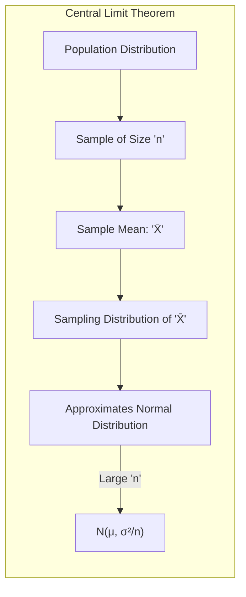

> 💡 **Exemplo Numérico:** Considere uma população com distribuição desconhecida, com média $\mu = 50$ e desvio padrão $\sigma = 10$. Se coletarmos amostras de tamanho $n = 100$, o Teorema do Limite Central nos diz que a distribuição das médias amostrais $\bar{X}$ será aproximadamente normal com média $\mu = 50$ e desvio padrão $\sigma/\sqrt{n} = 10/\sqrt{100} = 1$. Portanto, $\bar{X} \sim N(50, 1^2)$.  Se coletarmos amostras de tamanho $n = 400$, o desvio padrão das médias amostrais será $\sigma/\sqrt{n} = 10/\sqrt{400} = 0.5$. Portanto, $\bar{X} \sim N(50, 0.5^2)$.  Isso demonstra como aumentar o tamanho da amostra reduz a variabilidade da distribuição amostral das médias.

**Conceito 2: Linear Discriminant Analysis (LDA) e Intervalos de Confiança**
Em problemas de classificação, como os abordados por **Linear Discriminant Analysis (LDA)**, pode-se desejar construir intervalos de confiança para os coeficientes do modelo ou para a probabilidade de classificação de uma nova observação [^8.1].
A abordagem para obter intervalos de confiança nesses contextos geralmente se baseia na **distribuição assintótica** das estimativas dos parâmetros do modelo. No contexto de LDA, a normalidade assintótica das estimativas dos coeficientes pode ser utilizada para construir intervalos de confiança baseados em abordagens de *Maximum Likelihood Inference* [^8.2.2]. No entanto, esses intervalos podem ser menos precisos para amostras pequenas e, portanto, métodos *bootstrap* podem ser mais apropriados [^8.2.1].

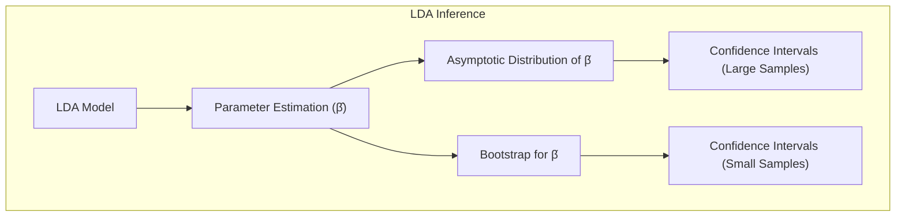

> 💡 **Exemplo Numérico:** Suponha que temos duas classes de dados e estamos aplicando LDA. Após o treinamento, o modelo LDA estima um vetor de coeficientes $\hat{\beta} = [0.5, -0.2, 0.8]$ para três variáveis preditoras. Usando a matriz de informação de Fisher, podemos obter os erros padrão associados a esses coeficientes, digamos $se(\hat{\beta}) = [0.1, 0.08, 0.15]$.  Um intervalo de confiança de 95% para o primeiro coeficiente, $\beta_1$, seria dado por: $0.5 \pm 1.96 \times 0.1 = [0.304, 0.696]$. Isto é baseado na aproximação normal da distribuição amostral dos coeficientes e seria adequado para amostras grandes.

**Corolário 1: Intervalos de Confiança via Bootstrap**
O *bootstrap* é um método de reamostragem que permite construir intervalos de confiança sem fazer suposições sobre a distribuição subjacente dos dados [^8.2.1]. Ele envolve a criação de múltiplas amostras *bootstrap* ao amostrar com reposição a partir da amostra original, e, a seguir, calcular a estimativa do parâmetro em cada amostra *bootstrap*. A distribuição dessas estimativas *bootstrap* pode ser utilizada para construir intervalos de confiança [^8.2.1]. O *parametric bootstrap*, que simula novas respostas adicionando ruído gaussiano aos valores preditos [^8.2.1], é uma das variações. No caso de LDA, o *bootstrap* poderia ser aplicado para obter uma distribuição das estimativas dos coeficientes, e assim calcular intervalos de confiança mais robustos [^8.2.1].

> 💡 **Exemplo Numérico:** Voltando ao exemplo do LDA, vamos usar *bootstrap* para construir um intervalo de confiança para o coeficiente $\beta_1$. Tomamos a amostra original de $n=100$ pontos, e amostramos com reposição, gerando uma nova amostra do mesmo tamanho. Calculamos o valor do estimador $\hat{\beta}_1$ nessa amostra *bootstrap*. Repetimos este processo $B=1000$ vezes. Obteremos então uma distribuição das estimativas  $\hat{\beta}_1^{(1)}, \ldots, \hat{\beta}_1^{(1000)}$. Ordenando essas estimativas, e tomando os quantis 2.5% e 97.5%, obtemos um intervalo de confiança *bootstrap* de 95%. Se, por exemplo, o intervalo de confiança *bootstrap* fosse [0.28, 0.72], isto seria ligeiramente diferente do intervalo obtido com a matriz de informação de Fisher, especialmente se a amostra original era pequena.

**Conceito 3: Regressão Logística e Inferência sobre Odds Ratios**
Na **regressão logística**, os intervalos de confiança são frequentemente usados para inferir sobre *odds ratios*. Os coeficientes da regressão logística, quando exponenciados, representam as *odds ratios* associadas a cada preditor. Os intervalos de confiança para esses *odds ratios* são cruciales para avaliar a significância e a magnitude do efeito de cada preditor na *odds* da resposta [^8.2.2].
O método *maximum likelihood* é utilizado para estimar os coeficientes, e, a partir da matriz de informação de Fisher, é possível obter as variâncias assintóticas dos coeficientes. Utilizando uma distribuição normal assintótica, é possível construir os intervalos de confiança para os coeficientes e para as *odds ratios* [^8.2.2].

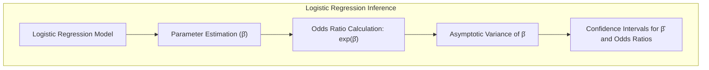

> 💡 **Exemplo Numérico:** Em um modelo de regressão logística, suponha que um preditor binário (presença de uma doença) tenha um coeficiente estimado $\hat{\beta} = 0.7$. O *odds ratio* associado seria $e^{0.7} \approx 2.01$. Se o erro padrão do coeficiente fosse $se(\hat{\beta}) = 0.2$, um intervalo de confiança de 95% para o coeficiente seria $0.7 \pm 1.96 \times 0.2 = [0.308, 1.092]$.  O intervalo de confiança para o *odds ratio* é então $e^{[0.308, 1.092]} \approx [1.36, 2.98]$. Isso significa que a presença da doença está associada a um aumento na *odds* de ter o evento em estudo, variando entre 1.36 e 2.98 vezes.

> ⚠️ **Nota Importante**: Em modelos como a regressão logística, onde a transformação logit é usada, a interpretação dos intervalos de confiança é feita na escala das *odds ratios*, e não na escala original da probabilidade. **Referência ao tópico [^8.2.2]**.
> ❗ **Ponto de Atenção**: A inferência em modelos logísticos pode ser afetada por *sparse data*, e por isso, pode ser preferível métodos *bootstrap* para obter intervalos de confiança mais robustos. **Conforme indicado em [^8.2.1]**.
> ✔️ **Destaque**: A relação entre os métodos de *maximum likelihood* e a abordagem *Bayesian* na obtenção de intervalos de confiança também é uma ferramenta importante em inferência estatística. **Baseado no tópico [^8.2.3]**.

### Regressão Linear e Intervalos de Confiança para os Coeficientes
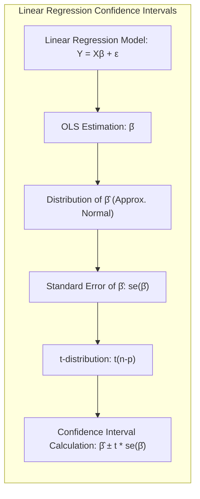

Em regressão linear, a construção de intervalos de confiança para os coeficientes é uma prática comum e essencial. O modelo de regressão linear assume uma relação linear entre a variável resposta (Y) e as variáveis preditoras (X), com erros normalmente distribuídos [^8.2.2].
O modelo é dado por:
$$ Y = X\beta + \epsilon $$
Onde $\beta$ é o vetor de coeficientes e $\epsilon$ o erro aleatório. O estimador de mínimos quadrados $\hat{\beta}$ é um estimador não enviesado de $\beta$. A distribuição amostral de $\hat{\beta}$ é aproximadamente normal para amostras grandes, o que permite a construção dos intervalos de confiança.
Se $\hat{\beta}_j$ é a estimativa do coeficiente para a j-ésima variável preditora e $se(\hat{\beta}_j)$ é seu erro padrão, um intervalo de confiança de 100(1-$\alpha$)% para $\beta_j$ é dado por:
$$ \hat{\beta}_j \pm t_{\alpha/2,n-p} \cdot se(\hat{\beta}_j) $$
Onde $t_{\alpha/2,n-p}$ é o valor crítico da distribuição t-Student com $n-p$ graus de liberdade, $n$ é o tamanho da amostra, e $p$ é o número de preditores no modelo.

> 💡 **Exemplo Numérico:** Suponha um modelo de regressão linear simples com um preditor, onde temos $n=50$ observações e obtemos $\hat{\beta}_0 = 10$ e $\hat{\beta}_1 = 2.5$.  Suponha que o erro padrão de $\hat{\beta}_1$ seja $se(\hat{\beta}_1) = 0.5$.  Como temos 50 observações e 2 parâmetros (intercepto e coeficiente), os graus de liberdade são $50-2=48$.  Para um intervalo de confiança de 95%, $t_{0.025, 48} \approx 2.01$. O intervalo de confiança de 95% para o coeficiente $\beta_1$ é, portanto, $2.5 \pm 2.01 \times 0.5 = [1.495, 3.505]$. Isso significa que para cada unidade de aumento na variável preditora, a variável resposta aumenta em algo entre 1.495 e 3.505 unidades, com 95% de confiança.

**Lemma 2: Erro Padrão das Estimativas de Mínimos Quadrados**
O erro padrão $se(\hat{\beta}_j)$ é um estimador da variabilidade da estimativa $\hat{\beta}_j$. Ele é obtido a partir da diagonal da matriz de covariância das estimativas dos parâmetros. Dada uma matriz de design $H$ e uma estimativa da variância do erro $\hat{\sigma}^2$, a matriz de covariância é dada por:
$$ Var(\hat{\beta}) = (H^TH)^{-1}\hat{\sigma}^2 $$
O erro padrão para a j-ésima componente de $\hat{\beta}$ é então dado por:
$$ se(\hat{\beta}_j) = \sqrt{[Var(\hat{\beta})]_{jj}} $$
Onde $[Var(\hat{\beta})]_{jj}$ é o j-ésimo elemento da diagonal da matriz de covariância. **Baseado em [^8.2.2]**. $\blacksquare$

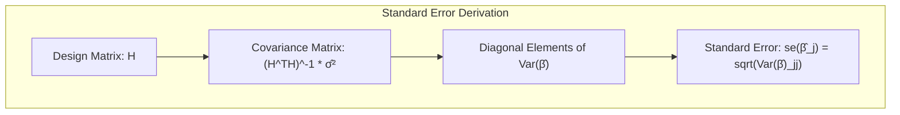

> 💡 **Exemplo Numérico:** Suponha que, em uma regressão linear, temos $H = \begin{bmatrix} 1 & 1 \\ 1 & 2 \\ 1 & 3 \\ 1 & 4 \end{bmatrix}$, e após os cálculos, obtemos $(H^TH)^{-1} = \begin{bmatrix} 1.3 & -0.5 \\ -0.5 & 0.2 \end{bmatrix}$ e $\hat{\sigma}^2 = 0.1$. Então, a matriz de covariância é $Var(\hat{\beta}) = \begin{bmatrix} 1.3 & -0.5 \\ -0.5 & 0.2 \end{bmatrix} \times 0.1 = \begin{bmatrix} 0.13 & -0.05 \\ -0.05 & 0.02 \end{bmatrix}$. O erro padrão do intercepto, $\hat{\beta}_0$, será $\sqrt{0.13} \approx 0.36$, e o erro padrão do coeficiente da variável preditora, $\hat{\beta}_1$, será $\sqrt{0.02} \approx 0.14$.

**Corolário 2: Impacto do Tamanho da Amostra no Intervalo de Confiança**
O tamanho da amostra $n$ influencia diretamente a precisão do intervalo de confiança. À medida que $n$ aumenta, o erro padrão $se(\hat{\beta}_j)$ diminui, levando a intervalos de confiança mais estreitos e a uma maior precisão na estimativa do parâmetro [^8.2.2].  Essa propriedade reflete a ideia de que amostras maiores fornecem mais informações sobre a população, reduzindo a incerteza associada às estimativas. Conforme indicado em [^8.2.2], a distribuição t-student se aproxima da normal quando o tamanho da amostra cresce, o que também contribui para a redução da largura dos intervalos.

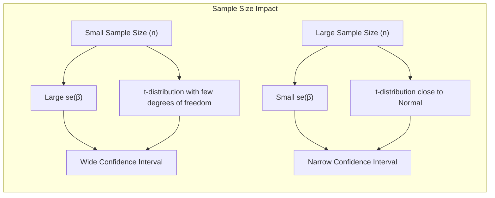

> 💡 **Exemplo Numérico:** Suponha que repetimos o exemplo anterior com $n=1000$ observações.  O erro padrão do coeficiente $\hat{\beta}_1$ agora é $se(\hat{\beta}_1) = 0.05$ (menor devido a amostra maior).  Para um intervalo de confiança de 95%, $t_{0.025, 998} \approx 1.96$. O intervalo de confiança para o coeficiente $\beta_1$ é agora $2.5 \pm 1.96 \times 0.05 = [2.402, 2.598]$, que é muito mais estreito do que o intervalo anterior.  Isso demonstra como um aumento do tamanho da amostra resulta em intervalos de confiança mais precisos.
> Em alguns cenários, conforme apontado em [^8.2.3], a abordagem bayesiana pode fornecer intervalos de confiança mais estáveis, especialmente para amostras menores, utilizando *priors* informativos para regularizar as estimativas de parâmetros.
> No entanto, há situações em que a regressão linear tradicional, com intervalos de confiança baseados em *maximum likelihood*, de acordo com [^8.2.2], é suficiente e até mesmo vantajosa quando o objetivo principal é a inferência sobre a magnitude do efeito.

### Métodos de Seleção de Variáveis e Regularização e seus Intervalos de Confiança
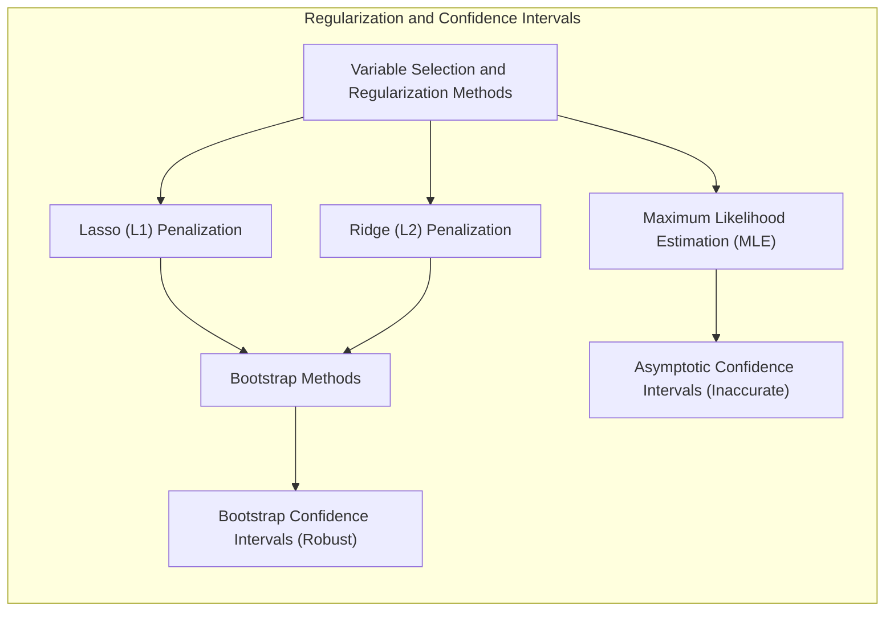

Em métodos de seleção de variáveis e regularização, como os discutidos em [^8.5.1], a construção de intervalos de confiança apresenta desafios adicionais. Métodos como o *Lasso* (penalização L1) e *Ridge* (penalização L2) introduzem *bias* nas estimativas dos coeficientes para reduzir a variância [^8.5.1]. No contexto da regularização, os intervalos de confiança baseados na teoria assintótica podem não ser confiáveis e por isso métodos *bootstrap* se tornam mais relevantes [^8.2.1]. Por exemplo, no *lasso*, diversos coeficientes são levados a zero, tornando a aplicação direta da teoria assintótica inadequada.
A regularização tem um impacto direto sobre a variabilidade dos estimadores. Por exemplo, a penalização $L_2$ (Ridge) reduz a variância das estimativas, levando a intervalos de confiança mais estreitos. No entanto, introduz *bias* na estimativa, o que pode afetar a interpretação dos intervalos. A penalização $L_1$ (Lasso), por outro lado, leva a soluções esparsas, onde alguns coeficientes são exatamente iguais a zero, resultando em descontinuidades na distribuição amostral, o que dificulta a utilização da teoria assintótica. Nestes casos, métodos *bootstrap* ou amostragens *MCMC* para obter intervalos de confiança podem ser mais apropriados [^8.6].

**Lemma 3: Impacto da Penalização L1 em Classificação Logística**
Em classificação logística com penalização $L_1$ (Lasso), o objetivo é minimizar uma função de custo que inclui um termo de verossimilhança e um termo de penalidade. Formalmente, a função de custo é dada por:
$$ L(\beta) = - \sum_{i=1}^{N} \left[ y_i \log(p_i) + (1-y_i) \log(1-p_i) \right] + \lambda \sum_{j=1}^{p} |\beta_j| $$
onde $p_i$ é a probabilidade predita, $y_i$ é a resposta observada e $\lambda$ é o parâmetro de regularização. A penalização $L_1$ induz esparsidade, ou seja, alguns coeficientes $\beta_j$ serão levados a exatamente zero, resultando em modelos mais interpretáveis. No entanto, a distribuição assintótica das estimativas não é mais normal, e por isso não podemos aplicar intervalos de confiança baseados em $t-student$ como visto em modelos lineares sem regularização.  **Com base em [^8.4], [^8.5.1]**.
**Prova do Lemma 3:** A não diferenciabilidade do termo de penalização $L_1$ em $\beta_j=0$ leva a soluções que não podem ser expressas como pontos fixos de um operador diferenciável. Isso implica que a distribuição assintótica da estimativa, $\hat\beta$, não pode ser aproximada por uma distribuição normal, invalidando o uso de intervalos de confiança padrão.  A derivada da função de penalização, $\lambda \sum_{j=1}^{p} |\beta_j|$, não existe em $\beta_j = 0$, o que implica que o mínimo não ocorre necessariamente onde a derivada é zero. Métodos *bootstrap* podem ser usados para construir intervalos de confiança nesses cenários não suaves. $\blacksquare$

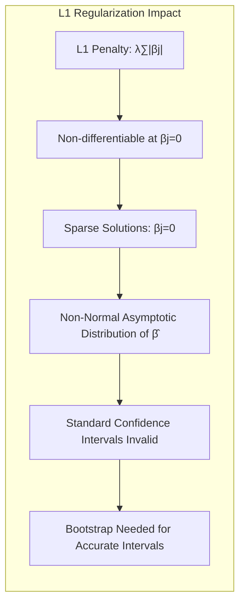

> 💡 **Exemplo Numérico:** Em uma regressão logística com penalização $L_1$, após o treinamento, obtivemos $\hat{\beta} = [1.2, 0, -0.5, 0]$. O fato dos coeficientes $\hat{\beta}_2$ e $\hat{\beta}_4$ serem exatamente zero dificulta a aplicação da teoria assintótica.  Se tentarmos construir intervalos de confiança usando a matriz de informação de Fisher, esses intervalos podem ser enganosos.  Em vez disso, usar *bootstrap* é mais apropriado. Geramos várias amostras *bootstrap* e calculamos a estimativa do parâmetro em cada uma delas.  A distribuição empírica dessas estimativas *bootstrap* nos fornece os intervalos de confiança.

**Corolário 3: Interpretabilidade de Modelos Classificatórios Regularizados**
A esparsidade induzida pela penalização $L_1$ não apenas simplifica o modelo, mas também aumenta a interpretabilidade, pois os coeficientes que foram levados a zero podem ser considerados irrelevantes para a previsão. No entanto, a construção de intervalos de confiança requer uma abordagem diferente, devido à não normalidade da distribuição das estimativas. Métodos *bootstrap* são recomendados para garantir que a incerteza associada à seleção de variáveis seja considerada [^8.2.1], [^8.5.1]. **Conforme indicado em [^8.2.1], [^8.4]**.

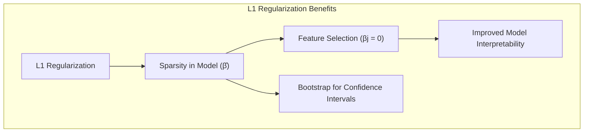

> 💡 **Exemplo Numérico:** Continuando o exemplo anterior, o intervalo de confiança *bootstrap* para $\beta_1$ pode ser [0.9, 1.5].  O intervalo de confiança *bootstrap* para $\beta_3$ pode ser [-0.8, -0.2], indicando que esta variável tem efeito negativo.  Os coeficientes $\beta_2$ e $\beta_4$ têm distribuições com grande massa no zero, e seus intervalos de confiança podem conter o valor zero.  O *bootstrap* permite-nos capturar a incerteza associada a esses coeficientes que foram levados a zero.
> ⚠️ **Ponto Crucial**: A escolha entre penalização $L_1$ e $L_2$ afeta a forma dos intervalos de confiança, com $L_1$ necessitando de abordagens *bootstrap* devido à esparsidade. **Conforme discutido em [^8.2.1], [^8.5.1]**.

### Separating Hyperplanes e Perceptrons e seus Intervalos de Confiança
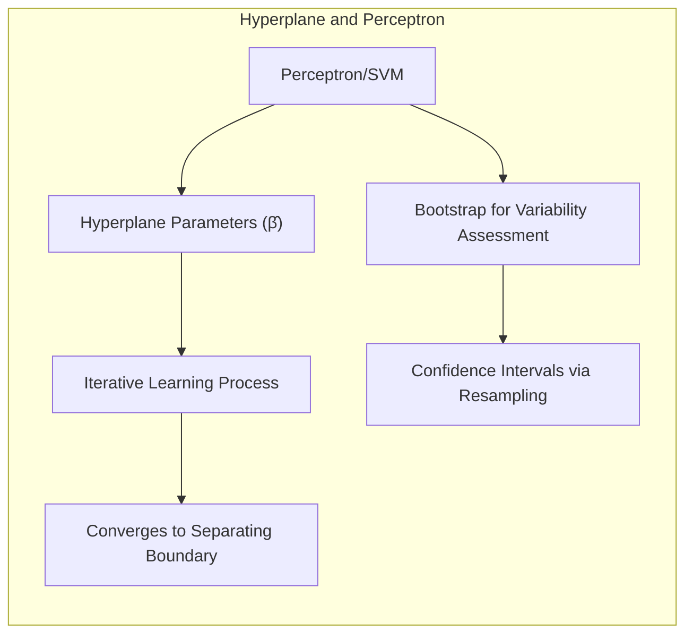
O conceito de hiperplanos separadores, especialmente em contextos como *Support Vector Machines (SVM)* e *Perceptrons*, levanta questões sobre a confiança nas fronteiras de decisão. A margem de separação é uma medida da "confiança" da decisão, mas os intervalos de confiança dos parâmetros do modelo também são relevantes.
Em um *Perceptron*, os parâmetros do modelo, que definem o hiperplano, são aprendidos iterativamente [^8.5.2]. A convergência do algoritmo sob certas condições garante uma fronteira separadora, mas não fornece diretamente intervalos de confiança. O *bootstrap* pode ser usado para avaliar a variabilidade da fronteira de decisão em *perceptrons* [^8.2.1].
A análise do *SVM*, por outro lado, é mais formal, e a formulação dual do problema de otimização leva a soluções que são combinações lineares de vetores de suporte. No entanto, mesmo em SVMs, obter intervalos de confiança diretos para os parâmetros do modelo pode ser desafiador. A abordagem *bootstrap* se torna mais uma vez uma solução prática e relevante para obter intervalos de confiança na posição e na orientação do hiperplano separador [^8.2.1].

> 💡 **Exemplo Numérico:** Em um Perceptron, após o treinamento, os pesos do hiperplano separador são  $\hat{\beta} = [0.8, -1.2]$. Para obter intervalos de confiança, podemos gerar amostras *bootstrap* do conjunto de treinamento e treinar o Perceptron novamente em cada amostra.  A distribuição dos pesos obtidos com as amostras *bootstrap* fornece um intervalo de confiança para os pesos do hiperplano.
> Em SVM, os intervalos de confiança obtidos com o *bootstrap* permitirão analisar a variabilidade da margem de separação e das posições dos vetores de suporte. A variabilidade das decisões na região próxima à fronteira de decisão será melhor quantificada com o *bootstrap*.

### Pergunta Teórica Avançada: Qual a Relação Entre Intervalos de Confiança Baseados na Matriz de Informação de Fisher e Intervalos de Confiança Bootstrap?
**Resposta:**
A matriz de informação de Fisher, $I(\theta)$, fornece a curvatura da função log-verossimilhança em torno da estimativa de máxima verossimilhança, $\hat{\theta}$. Essa matriz é utilizada para obter um erro padrão assintótico para $\hat{\theta}$ através da fórmula:
$$ SE(\hat{\theta}) = \sqrt{I(\hat{\theta})^{-1}} $$
Sob certas condições de regularidade, a distribuição assintótica de $\hat{\theta}$ se aproxima de uma distribuição normal, e os intervalos de confiança podem ser construídos utilizando esse resultado [^8.2.2]. No entanto, essa abordagem se baseia em aproximações assintóticas e pode não ser precisa para tamanhos de amostra finitos ou modelos complexos.

O método *bootstrap*, por outro lado, é baseado na reamostragem dos dados e não requer suposições sobre a distribuição amostral do estimador [^8.2.1]. No *parametric bootstrap*, amostramos dados usando o modelo, perturbando os parâmetros estimados. No *nonparametric bootstrap*, amostramos dados diretamente do conjunto de dados. O *bootstrap* estima diretamente a variabilidade de $\hat{\theta}$  através da distribuição das estimativas obtidas em amostras de *bootstrap*. No limite do tamanho da amostra *bootstrap* e para estimadores suaves, a distribuição *bootstrap* converge para a distribuição amostral de $\hat{\theta}$. [^8.2.1]
**Lemma 4: Relação Assintótica Entre Matriz de Informação de Fisher e Bootstrap**
Sob condições de regularidade, a variância estimada pela matriz de informação de Fisher, $I(\hat\theta)^{-1}$, converge para a variância amostral obtida pelo método *bootstrap* quando o tamanho da amostra tende ao infinito [^8.2.2]. Isso sugere que a matriz de informação de Fisher fornece uma aproximação da distribuição amostral de $\hat\theta$ que se torna mais precisa com o aumento do tamanho da amostra. A relação formal entre os dois métodos pode ser vista quando o *parametric bootstrap* é utilizado em um modelo com erros gaussianos, onde as distribuições dos estimadores *bootstrap* coincidem com as estimativas de *maximum likelihood* [^8.2.1].
**Corolário 4: Casos Onde a Abordagem Bootstrap é Necessária**
Em situações onde o modelo não é suave, como em métodos de seleção de variáveis ($L_1$ regularização), ou em modelos com distribuições não normais, o *bootstrap* é essencial, uma vez que a matriz de informação de Fisher não fornecerá intervalos de confiança precisos. Além disso, quando as suposições sobre normalidade da distribuição amostral não são válidas, a abordagem *bootstrap* é mais robusta [^8.2.1].

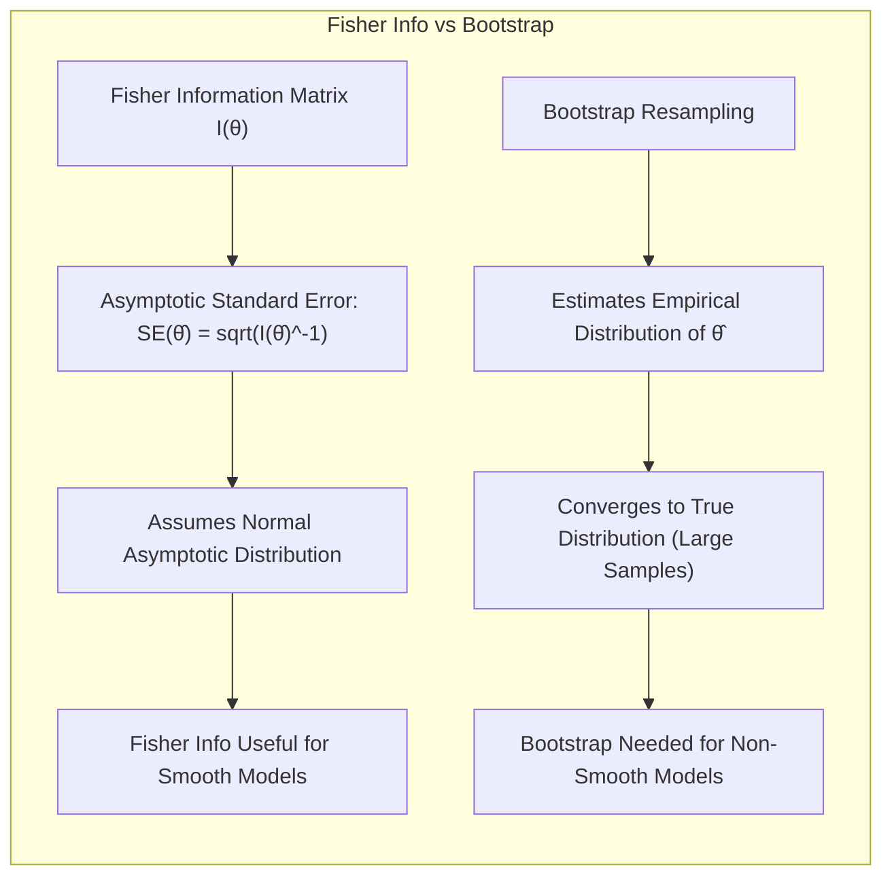

> ⚠️ **Ponto Crucial**: O uso apropriado da matriz de informação de Fisher e do *bootstrap* depende das suposições do modelo e do tamanho da amostra. Enquanto a primeira se baseia em aproximações assintóticas, o *bootstrap* se baseia na reamostragem dos dados, tornando-se mais robusto em cenários complexos [^8.2.1], [^8.2.2].
As perguntas devem ser altamente relevantes, **avaliar a compreensão profunda de conceitos teóricos-chave**, podem envolver derivações matemáticas e provas, e focar em análises teóricas.

### Conclusão
Os intervalos de confiança são ferramentas indispensáveis na inferência estatística, proporcionando uma maneira de quantificar a incerteza associada às estimativas de parâmetros. A escolha do método adequado para construir intervalos de confiança depende da natureza do modelo e das suposições sobre a distribuição dos dados [^8.2.1], [^8.2.2], [^8.2.3]. Compreender as limitações de cada abordagem, bem como a relação entre a teoria assintótica e métodos de reamostragem, é fundamental para interpretar corretamente os resultados e tomar decisões informadas. Métodos como *bootstrap* tornam-se indispensáveis em cenários onde a teoria assintótica não se aplica, garantindo intervalos de confiança confiáveis e robustos [^8.2.1].
<!-- END DOCUMENT -->

### Footnotes
[^