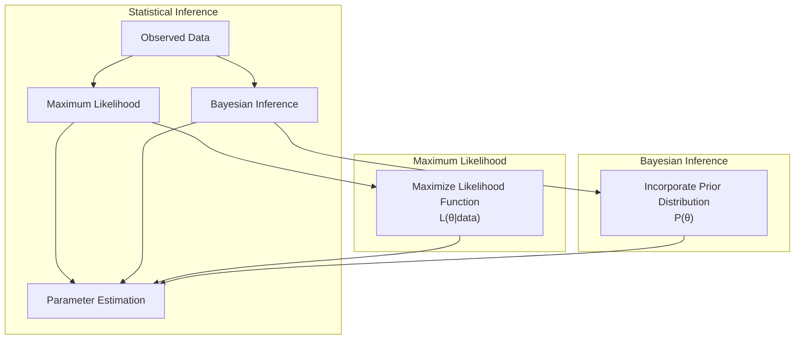
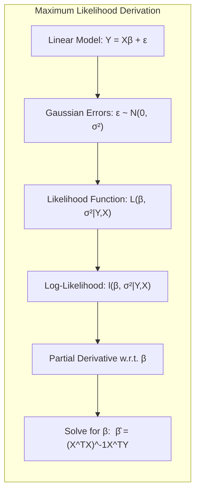
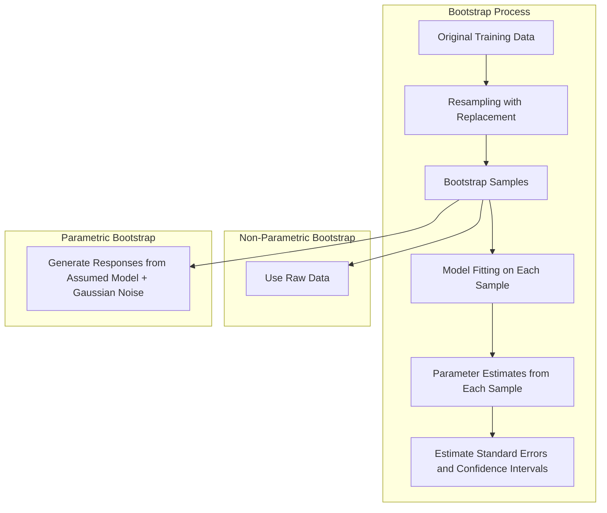
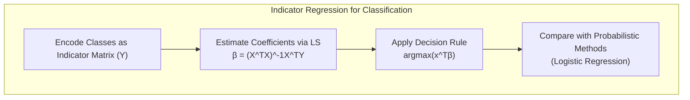
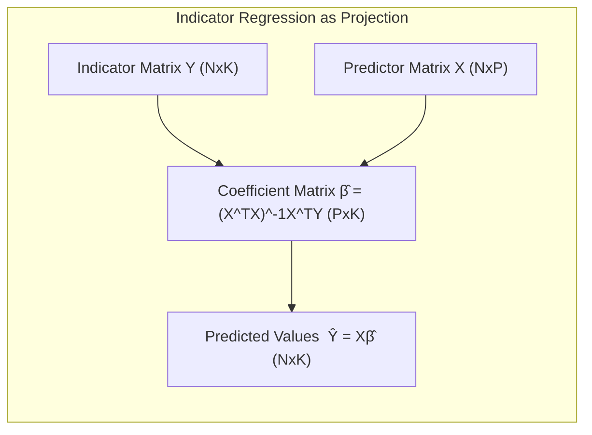
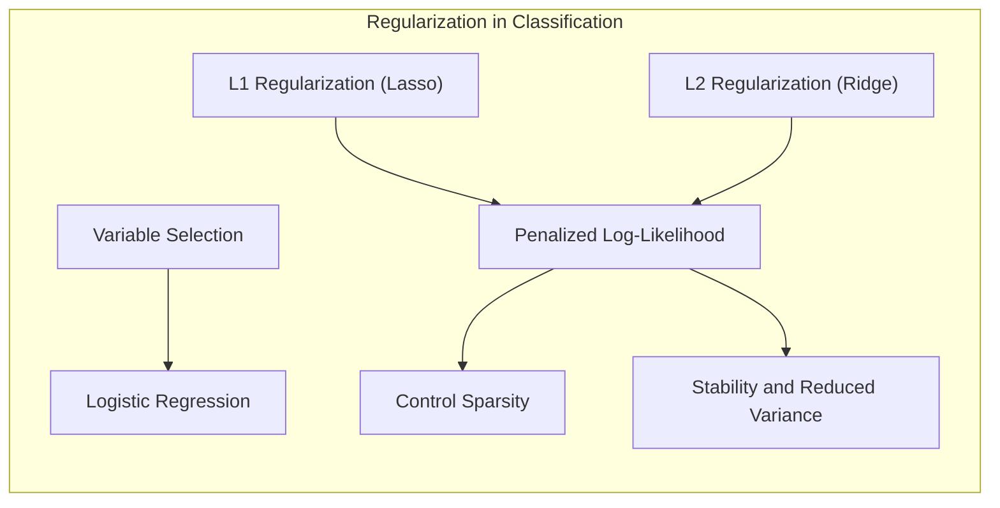
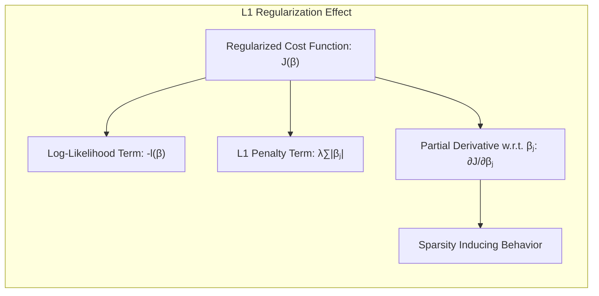
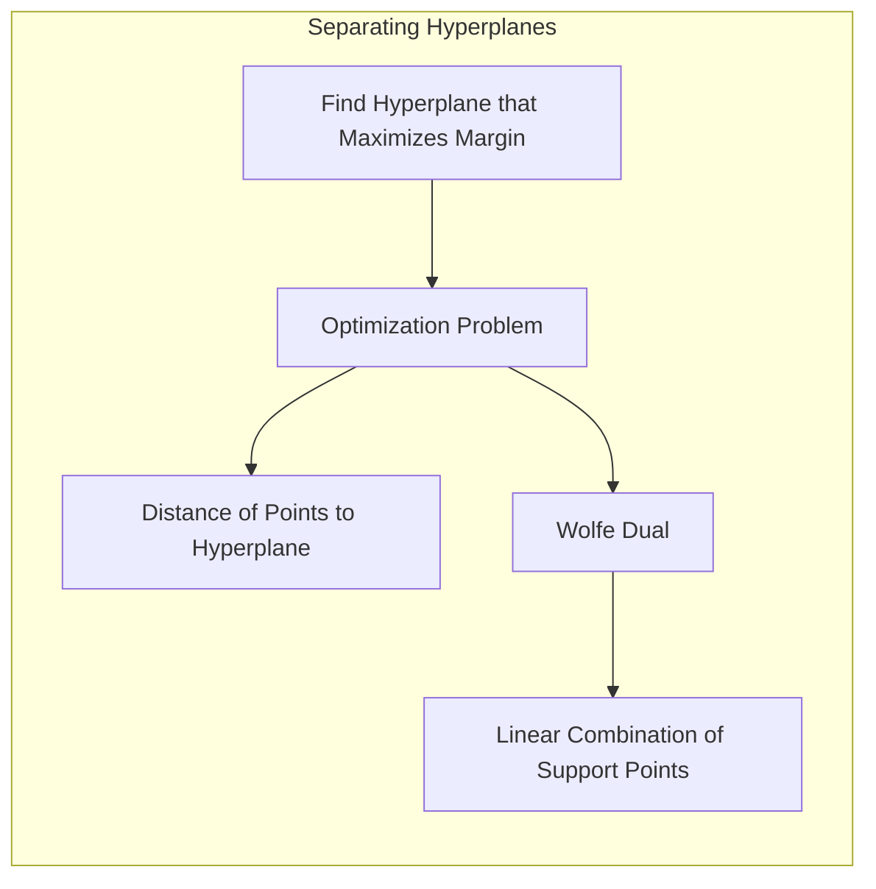
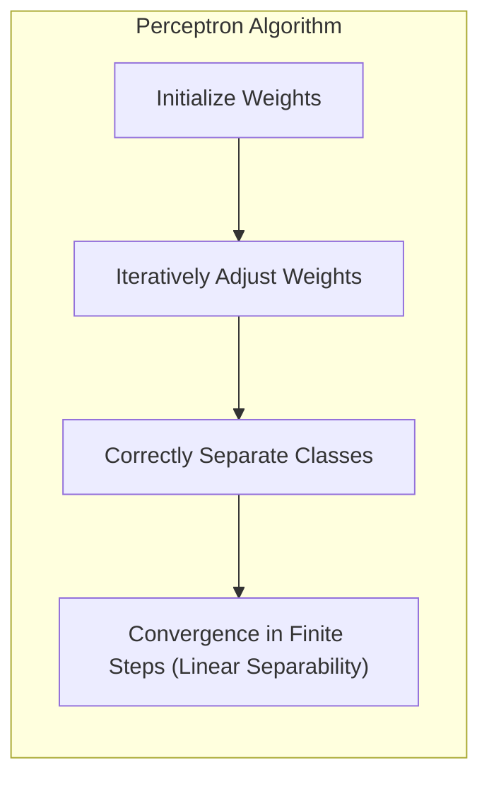
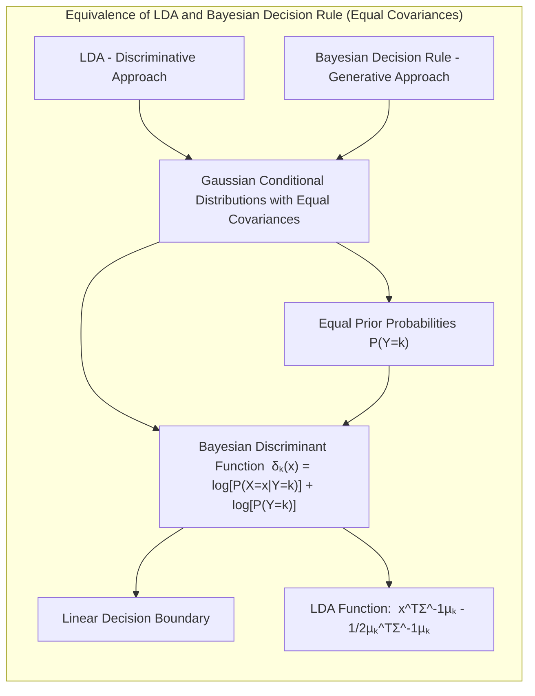

## Bootstrap Versus Maximum Likelihood: Uma Análise Detalhada

<imagem: Mapa mental abrangente que conecta os conceitos de Bootstrap, Maximum Likelihood, e suas relações com métodos de regressão e classificação, com destaque para suas diferenças e aplicações em cenários variados>

### Introdução

O processo de ajuste (ou aprendizado) de modelos, tem sido frequentemente abordado através da minimização de somas de quadrados para regressão ou da minimização de *cross-entropy* para classificação [^8.1]. Estas abordagens, em sua essência, representam instâncias da técnica de **Maximum Likelihood** para ajuste. Este capítulo tem como objetivo detalhar a abordagem de Maximum Likelihood, bem como o método Bayesiano para inferência. O **Bootstrap**, introduzido previamente, será analisado neste contexto, buscando elucidar suas relações com Maximum Likelihood e Bayes. Além disso, serão apresentadas técnicas para *model averaging* e aperfeiçoamento, tais como métodos de comitê, *bagging*, *stacking* e *bumping* [^8.1].

### Conceitos Fundamentais

Para começar a aprofundar o tema, é crucial definir alguns conceitos fundamentais que sustentam as técnicas de inferência e modelagem.

**Conceito 1:** A **inferência estatística**, tanto por métodos de **Maximum Likelihood** quanto por abordagens Bayesianas, busca estimar parâmetros de um modelo estatístico a partir de dados observados [^8.1]. O objetivo central é encontrar os valores de parâmetros que melhor explicam os dados. Essa busca, no contexto de Maximum Likelihood, envolve a maximização da *likelihood function*, que representa a probabilidade de observar os dados, dado um conjunto específico de parâmetros. Em contrapartida, a inferência Bayesiana incorpora uma *prior distribution* sobre os parâmetros, permitindo que o conhecimento prévio sobre eles influencie a estimativa final.



**Lemma 1:** Em problemas de regressão linear, o estimador de mínimos quadrados, que minimiza a soma dos erros quadrados, coincide com o estimador de máxima verossimilhança (MLE) quando assumimos que os erros seguem uma distribuição Gaussiana com média zero e variância constante.

*Prova*: Considere o modelo linear $Y = X\beta + \epsilon$, onde $\epsilon \sim N(0, \sigma^2)$. A *likelihood function* para $N$ observações é dada por:
$$L(\beta, \sigma^2|Y,X) = \prod_{i=1}^{N} \frac{1}{\sqrt{2\pi\sigma^2}} \exp\left(-\frac{(y_i - x_i^T\beta)^2}{2\sigma^2}\right)$$
O log da *likelihood function*, também conhecido como *log-likelihood*, é dado por:
$$l(\beta, \sigma^2|Y,X) = - \frac{N}{2} \log(2\pi\sigma^2) - \frac{1}{2\sigma^2}\sum_{i=1}^N (y_i - x_i^T\beta)^2$$
Para encontrar os parâmetros que maximizam $l$, calculamos suas derivadas parciais em relação a $\beta$ e as igualamos a zero:
$$\frac{\partial l}{\partial \beta} = \frac{1}{\sigma^2} \sum_{i=1}^N x_i (y_i - x_i^T\beta) = 0$$
Resolvendo para $\beta$, obtemos o estimador de mínimos quadrados:
$$\hat{\beta} = (X^TX)^{-1}X^TY$$
Este estimador maximiza a *likelihood* e coincide com o estimador de mínimos quadrados sob a hipótese Gaussiana. $\blacksquare$



> 💡 **Exemplo Numérico:** Vamos considerar um exemplo simples com 5 observações para ilustrar o Lemma 1. Suponha que temos um dataset com uma variável preditora $x$ e uma variável resposta $y$:

```python
import numpy as np

# Dataset
X = np.array([[1], [2], [3], [4], [5]])
y = np.array([2, 4, 5, 4, 5])

# Adicionando uma coluna de 1s para o intercepto
X = np.concatenate((np.ones((X.shape[0], 1)), X), axis=1)

# Cálculo do estimador de mínimos quadrados (OLS)
beta_hat = np.linalg.inv(X.T @ X) @ X.T @ y

print(f"Estimativa de beta (intercepto e coeficiente): {beta_hat}")
```

Neste caso, $\hat{\beta} = [2.2, 0.6]$, que representa o intercepto e o coeficiente angular da reta ajustada. A demonstração matemática mostra que este é o mesmo resultado que maximiza a *likelihood* sob a suposição de erros Gaussianos. Este exemplo prático demonstra como a fórmula teórica se traduz em um cálculo numérico concreto.

**Conceito 2:** O método **Bootstrap** oferece uma abordagem computacional para avaliar a incerteza, usando reamostragem com reposição dos dados de treinamento [^8.2.1]. Através da análise das distribuições amostrais geradas, é possível estimar erros padrão e construir intervalos de confiança. O Bootstrap pode ser aplicado de forma não-paramétrica, utilizando os dados brutos, ou paramétrica, gerando novas respostas a partir de um modelo assumido e adicionando ruído Gaussiano [^8.2.1].



> 💡 **Exemplo Numérico:** Para demonstrar o Bootstrap, vamos continuar com o exemplo anterior. Queremos estimar a incerteza do nosso $\hat{\beta}$ utilizando bootstrap não-paramétrico.

```python
import numpy as np

# Dataset
X = np.array([[1], [2], [3], [4], [5]])
y = np.array([2, 4, 5, 4, 5])
X = np.concatenate((np.ones((X.shape[0], 1)), X), axis=1)

n_boot = 1000
beta_boot = np.zeros((n_boot, 2)) # Matriz para armazenar os coeficientes bootstrap

for i in range(n_boot):
    # Reamostragem com reposição
    indices = np.random.choice(X.shape[0], X.shape[0], replace=True)
    X_boot = X[indices]
    y_boot = y[indices]
    
    # Estimativa de mínimos quadrados para cada amostra bootstrap
    beta_boot[i] = np.linalg.inv(X_boot.T @ X_boot) @ X_boot.T @ y_boot

# Calculando o erro padrão da estimativa do coeficiente (para a segunda entrada de beta)
std_error = np.std(beta_boot[:, 1])
print(f"Erro padrão da estimativa do coeficiente (Bootstrap): {std_error}")
```
Este código gera 1000 amostras bootstrap e recalcula o $\hat{\beta}$ para cada uma delas. Em seguida, calcula o desvio padrão da distribuição desses $\hat{\beta}$, que representa uma estimativa da incerteza dos nossos coeficientes.

**Corolário 1:** A utilização do Bootstrap paramétrico, em modelos lineares com erros Gaussianos, leva a resultados equivalentes aos obtidos através de mínimos quadrados [^8.2.2]. Este resultado surge devido ao fato de que o processo de simulação do Bootstrap paramétrico replica a distribuição de erro assumida no modelo, levando a distribuições amostrais que refletem a incerteza nos parâmetros estimada pelos métodos clássicos.

**Conceito 3:** A **Linear Regression**, conforme vista no contexto do Bootstrap e Maximum Likelihood, pode ser entendida como a base para a modelagem de dados com erros Gaussianos. A minimização da soma dos erros quadrados, que leva ao estimador de mínimos quadrados, é, neste contexto, uma consequência direta da maximização da *likelihood* sob a hipótese de erros Gaussianos [^8.2.2]. A aplicação do Bootstrap, por sua vez, fornece uma ferramenta flexível para estimar a incerteza associada a essas estimativas, em cenários onde não há uma solução analítica direta para o cálculo de erros padrão [^8.2.3].

> ⚠️ **Nota Importante**: Embora os métodos de regressão linear e mínimos quadrados possam ser suficientes em algumas situações para estimar fronteiras de decisão lineares, a regressão logística, detalhada mais adiante, oferece uma abordagem mais adequada quando o objetivo é estimar probabilidades de classe, especialmente em problemas de classificação [^4.4].

> ❗ **Ponto de Atenção**: A escolha entre Bootstrap paramétrico e não-paramétrico depende das suposições sobre a distribuição do erro. O Bootstrap não-paramétrico é útil quando não há um modelo claro, mas o paramétrico oferece um desempenho melhor quando o modelo é conhecido [^8.2.1].

> ✔️ **Destaque**: A relação entre o Bootstrap, a inferência de Maximum Likelihood, e os métodos Bayesianos, é essencial para entender as diferentes abordagens para inferência e como cada uma delas trata a incerteza [^8.1], [^8.2.2].

### Regressão Linear e Mínimos Quadrados para Classificação
<imagem: Diagrama de fluxo complexo que detalha o processo de regressão de indicadores para classificação, mostrando a codificação de classes, a estimativa de coeficientes via mínimos quadrados, a aplicação da regra de decisão e comparação com métodos probabilísticos, incluindo detalhes das fórmulas matemáticas e das matrizes envolvidas>



A regressão linear, quando aplicada a uma matriz indicadora para classificação, busca modelar a relação entre as variáveis preditoras e um conjunto de variáveis binárias, cada uma representando uma classe distinta [^4.2]. A ideia é, para cada observação, prever a classe associada com o maior valor previsto após a regressão.  Esta abordagem, embora direta, apresenta limitações importantes. Uma delas é que as previsões obtidas através de regressão linear podem extrapolar os limites [0, 1], dificultando a interpretação como probabilidades. Além disso, a aplicação de mínimos quadrados, neste contexto, não leva a estimativas tão robustas quanto outras abordagens como a regressão logística [^4.4].

**Lemma 2:** A solução de mínimos quadrados para a regressão de indicadores, na forma $\hat{\beta} = (X^TX)^{-1}X^TY$, projeta as variáveis preditoras no espaço das classes, de modo que as previsões $\hat{Y} = X\hat{\beta}$ são aproximações lineares das funções indicadoras de cada classe.

*Prova*: Seja $Y$ uma matriz indicadora de dimensões $N \times K$, onde $N$ é o número de observações e $K$ é o número de classes. Cada linha de $Y$ tem um único elemento igual a 1, correspondendo à classe da observação, e os demais elementos iguais a 0. A regressão linear busca encontrar os coeficientes $\hat{\beta}$ que minimizam a soma dos quadrados dos erros:

$$\min_{\beta} ||Y - X\beta||^2$$

A solução para este problema é dada por:

$$\hat{\beta} = (X^TX)^{-1}X^TY$$

A previsão, para uma nova observação $x$, é dada por:

$$\hat{y} = x^T\hat{\beta} = x^T(X^TX)^{-1}X^TY$$

Esta expressão representa uma combinação linear das colunas de $X$ projetadas no espaço das classes, com pesos determinados por $\hat{\beta}$. Portanto, a regressão de indicadores projeta os dados no espaço das classes, buscando aproximar a relação entre os preditores e as variáveis indicadoras. $\blacksquare$



> 💡 **Exemplo Numérico:** Considere um problema de classificação binária com duas classes, representadas por 0 e 1, onde temos duas features ($x_1$ e $x_2$) e 4 amostras:

```python
import numpy as np

# Dataset de exemplo
X = np.array([[1, 1], [2, 1], [1, 2], [2, 2]])
y = np.array([0, 0, 1, 1])

# Criar a matriz indicadora Y (no caso binário, Y=y)
Y = y.reshape(-1, 1)

# Adicionar coluna de 1 para o intercepto
X = np.concatenate((np.ones((X.shape[0], 1)), X), axis=1)

# Estimar coeficientes via mínimos quadrados
beta_hat = np.linalg.inv(X.T @ X) @ X.T @ Y

print(f"Estimativa de beta (incluindo intercepto): {beta_hat}")

# Prever para uma nova observação
x_new = np.array([1, 1.5])
x_new = np.insert(x_new, 0, 1)
y_pred = x_new @ beta_hat

print(f"Previsão para x_new: {y_pred}")
```

Nesse exemplo, calculamos $\hat{\beta}$ usando a formulação de mínimos quadrados para a matriz indicadora. A previsão para uma nova observação é feita usando o $\hat{\beta}$. Perceba que o valor previsto não é uma probabilidade, mas sim um valor contínuo. A classe prevista é geralmente aquela com o maior valor previsto, o que nesse caso seria obtido comparando as saidas do modelo para as duas classes.

**Corolário 2:** Em problemas de classificação com duas classes, a regressão linear na matriz indicadora define uma fronteira de decisão linear, semelhante à obtida pela Análise Discriminante Linear (LDA), embora as estimativas de probabilidade obtidas pela regressão linear possam ser menos estáveis, podendo extrapolar os limites [0,1]. A LDA, em contrapartida, busca explicitamente otimizar a separabilidade entre as classes, baseando-se em suposições de normalidade e covariância [^4.3].

É importante ressaltar que, em algumas circunstâncias, a regressão linear pode ser suficiente para criar uma fronteira de decisão linear entre classes, mesmo que não seja o método mais adequado para estimar probabilidades de classe [^4.2]. Em tais casos, a simplicidade da abordagem pode ser vantajosa, em especial quando o foco principal é a delimitação da fronteira de decisão e não a estimativa precisa de probabilidades [^4.2].

### Métodos de Seleção de Variáveis e Regularização em Classificação

<imagem: Mapa mental conectando seleção de variáveis, regularização L1 e L2, e suas aplicações em modelos de classificação, ilustrando as penalidades em regressão logística para controle de sparsity e estabilidade, além da relação com LDA e Hyperplanes>



Para melhorar a generalização e interpretabilidade dos modelos de classificação, é essencial incorporar técnicas de seleção de variáveis e regularização [^4.5]. Estas técnicas reduzem a complexidade dos modelos, evitando o sobreajuste e melhorando a performance em dados não vistos.

A **regularização** é um processo que adiciona termos de penalidade à função de custo a ser minimizada, de forma a restringir o espaço de busca de soluções e evitar overfitting [^4.4.4]. Na classificação logística, a regularização é aplicada através da adição de penalidades L1 ou L2 à função de *log-likelihood*. A penalidade L1, também conhecida como Lasso, promove *sparsity*, levando a soluções com coeficientes iguais a zero, o que pode ser útil para seleção de variáveis [^4.4.4]. A penalidade L2, também conhecida como *Ridge*, reduz a magnitude dos coeficientes, aumentando a estabilidade do modelo e reduzindo a variância das estimativas [^4.4.4].

**Lemma 3:** A penalização L1 na regressão logística leva a coeficientes esparsos devido à natureza do termo de penalidade, que adiciona a soma dos valores absolutos dos coeficientes à função de custo. A minimização desta função força os coeficientes menos relevantes a serem exatamente zero.

*Prova*: Considere a função de custo regularizada com L1 na regressão logística:

$$J(\beta) = -l(\beta) + \lambda \sum_{j=1}^p |\beta_j|$$

Onde $l(\beta)$ é a função de *log-likelihood*, $\lambda$ é o parâmetro de regularização e $p$ é o número de coeficientes. A derivada da função de custo em relação a um coeficiente $\beta_j$ é dada por:

$$\frac{\partial J}{\partial \beta_j} = -\frac{\partial l(\beta)}{\partial \beta_j} + \lambda \text{sign}(\beta_j)$$

Onde $\text{sign}(\beta_j)$ é o sinal de $\beta_j$. Observe que, para um coeficiente $\beta_j$, o termo de penalidade $\lambda|\beta_j|$ contribui com um termo constante de penalidade $\lambda \text{sign}(\beta_j)$ que se opõe à direção do gradiente de $l(\beta)$ em relação a $\beta_j$. Isso significa que coeficientes com magnitude pequena tendem a se tornar exatamente zero, gerando soluções esparsas. $\blacksquare$



> 💡 **Exemplo Numérico:** Para ilustrar a regularização L1 (Lasso), vamos usar o mesmo dataset do exemplo anterior e ajustar um modelo de regressão logística com penalidade L1:

```python
import numpy as np
from sklearn.linear_model import LogisticRegression

# Dataset de exemplo
X = np.array([[1, 1], [2, 1], [1, 2], [2, 2]])
y = np.array([0, 0, 1, 1])

# Ajustando um modelo de regressão logística com penalidade L1
model_lasso = LogisticRegression(penalty='l1', solver='liblinear', C=1)
model_lasso.fit(X, y)

print(f"Coeficientes com L1 (Lasso): {model_lasso.coef_}")

# Ajustando um modelo de regressão logística com penalidade L2
model_ridge = LogisticRegression(penalty='l2', C=1)
model_ridge.fit(X,y)

print(f"Coeficientes com L2 (Ridge): {model_ridge.coef_}")

# Ajustando um modelo de regressão logística sem regularização
model_none = LogisticRegression(penalty=None)
model_none.fit(X,y)

print(f"Coeficientes sem regularização: {model_none.coef_}")
```
Neste exemplo, o parâmetro `C` controla a intensidade da regularização. Um valor menor de `C` resulta em uma regularização mais forte. Ao comparar os coeficientes obtidos com a regularização L1 (Lasso), L2 (Ridge) e sem regularização, é possível observar como o Lasso pode levar a coeficientes nulos, promovendo a seleção de variáveis.

**Corolário 3:** A *sparsity* induzida pela penalidade L1 não apenas simplifica o modelo, mas também aumenta a sua interpretabilidade, identificando as variáveis mais relevantes para a classificação e eliminando as menos informativas [^4.4.5]. A combinação das penalidades L1 e L2, conhecida como *Elastic Net*, permite explorar vantagens de ambas, controlando tanto a *sparsity* quanto a estabilidade dos coeficientes [^4.5].

> ⚠️ **Ponto Crucial**: A escolha entre penalidades L1, L2, ou uma combinação delas (Elastic Net) depende das características do problema, como a quantidade de variáveis relevantes, e dos objetivos específicos, como a necessidade de *sparsity* ou estabilidade dos coeficientes [^4.5].

### Separating Hyperplanes e Perceptrons

O conceito de **separating hyperplanes** busca encontrar um hiperplano que maximize a margem de separação entre as classes [^4.5.2]. Este hiperplano pode ser obtido através da resolução de um problema de otimização, que envolve o cálculo da distância de cada ponto às bordas do hiperplano. O uso do dual de Wolfe é comum nesse contexto, permitindo que a solução seja expressa em termos de uma combinação linear dos pontos de suporte, que são os pontos mais próximos ao hiperplano de decisão [^4.5.2].



O **Perceptron de Rosenblatt** é um algoritmo de classificação linear que busca iterativamente ajustar os pesos do modelo para separar corretamente as classes [^4.5.1]. O algoritmo converge em um número finito de passos sob a condição de separabilidade linear, e representa um método fundamental para a compreensão de modelos lineares de classificação [^4.5.1].



### Pergunta Teórica Avançada: Quais as diferenças fundamentais entre a formulação de LDA e a Regra de Decisão Bayesiana considerando distribuições Gaussianas com covariâncias iguais?

**Resposta:**

A Análise Discriminante Linear (LDA) e a Regra de Decisão Bayesiana são abordagens para classificação que compartilham algumas semelhanças, mas também possuem diferenças fundamentais em suas formulações [^4.3]. Ambas assumem que os dados são gerados a partir de distribuições Gaussianas com covariâncias iguais, mas diferem na forma como utilizam essa informação.

A LDA assume que os dados de cada classe seguem uma distribuição normal multivariada com uma matriz de covariância comum a todas as classes, isto é, $\Sigma_1 = \Sigma_2 = \ldots = \Sigma_K = \Sigma$ [^4.3]. O objetivo da LDA é encontrar a projeção linear dos dados que maximize a separabilidade entre as classes, ou seja, a razão entre a variância interclasses e a variância intraclasses. A fronteira de decisão é linear e definida pela igualdade de valores de uma função discriminante linear, calculada a partir das médias das classes e da matriz de covariância comum [^4.3.2].

A Regra de Decisão Bayesiana, por sua vez, busca classificar uma observação $x$ para a classe $k$ que maximiza a probabilidade *a posteriori* $P(Y=k|X=x)$, dada por:
$$P(Y=k|X=x) = \frac{P(X=x|Y=k)P(Y=k)}{\sum_{l=1}^K P(X=x|Y=l)P(Y=l)}$$

Quando as distribuições condicionais $P(X=x|Y=k)$ são Gaussianas com covariâncias iguais e as probabilidades *a priori* $P(Y=k)$ são iguais, a Regra de Decisão Bayesiana leva a uma fronteira de decisão linear equivalente à da LDA [^4.3.3].

A diferença fundamental reside em que a LDA é uma abordagem discriminativa, que foca em encontrar a melhor projeção para separar as classes, enquanto a Regra de Decisão Bayesiana é uma abordagem gerativa, que modela explicitamente a distribuição de probabilidade dos dados, dada a classe. Sob a hipótese de normalidade com covariâncias iguais, ambas levam a fronteiras de decisão lineares equivalentes, mas a LDA pode apresentar vantagens computacionais em problemas com alta dimensionalidade, onde estimar a distribuição conjunta dos dados pode ser complexo. Além disso, quando relaxamos a suposição de covariâncias iguais, a Regra de Decisão Bayesiana leva a fronteiras quadráticas (QDA), enquanto a LDA continua mantendo fronteiras lineares [^4.3.1].

**Lemma 4:** Sob a hipótese de que as distribuições condicionais $P(X=x|Y=k)$ são Gaussianas com covariância comum $\Sigma$ e médias $\mu_k$, e assumindo probabilidades *a priori* iguais, $P(Y=k) = \frac{1}{K}$, a Regra de Decisão Bayesiana resulta em uma função discriminante linear equivalente à função discriminante da LDA.

*Prova*: A função discriminante Bayesiana é dada por:

$$\delta_k(x) = \log[P(X=x|Y=k)] + \log[P(Y=k)]$$
Sob as condições mencionadas, e considerando que $P(Y=k)$ é constante, temos que:
$$\delta_k(x) = \log\left(\frac{1}{(2\pi)^{p/2}|\Sigma|^{1/2}}\exp\left(-\frac{1}{2}(x-\mu_k)^T\Sigma^{-1}(x-\mu_k)\right)\right) + \log(P(Y=k))$$
Desconsiderando as constantes, temos:
$$\delta_k(x) = -\frac{1}{2}(x-\mu_k)^T\Sigma^{-1}(x-\mu_k)$$
Expansão da função discriminante e desconsiderando termos quadráticos em $x$, chegamos a:
$$\delta_k(x) = x^T \Sigma^{-1} \mu_k -\frac{1}{2} \mu_k^T \Sigma^{-1} \mu_k$$
Que é uma função linear em $x$, idêntica à função discriminante obtida pela LDA. $\blacksquare$



> 💡 **Exemplo Numérico:** Para ilustrar a relação entre LDA e Regra de Decisão Bayesiana com covariâncias iguais, vamos considerar um exemplo em 2D com duas classes, gerando dados Gaussianos com mesma covariância para as duas classes:

```python
import numpy as np
import matplotlib.pyplot as plt
from sklearn.discriminant_analysis import LinearDiscriminantAnalysis

# Parâmetros
mean1 = [1, 1]
mean2 = [3, 3]
cov = [[1, 0.5], [0.5, 1]]
num_samples = 100

# Gerando amostras para as classes 1 e 2
X1 = np.random.multivariate_normal(mean1, cov, num_samples)
X2 = np.random.multivariate_normal(mean2, cov, num_samples)
X = np.concatenate((X1, X2))
y = np.array([0]*num_samples + [1]*num_samples)

# Aplicar LDA
lda = LinearDiscriminantAnalysis()
lda.fit(X, y)

# Criar uma grade para plotar a fronteira de decisão
x_min, x_max = X[:, 0].min() - 1, X[:, 0].max() + 1
y_min, y_max = X[:, 1].min() - 1, X[:, 1].max() + 1
xx, yy = np.meshgrid(np.linspace(x_min, x_max, 100),
                     np.linspace(y_min, y_max, 100))

# Fazer previsões na grade
Z = lda.predict(np.c_[xx.ravel(), yy.ravel()])
Z = Z.reshape(xx.shape)

# Plotar os dados e a fronteira de decisão
plt.contourf(xx, yy, Z, cmap=plt.cm.RdBu, alpha=0.8)
plt.scatter(X[:, 0], X[:, 1], c=y, cmap=plt.cm.RdBu, edgecolors='k')
plt.title('LDA Boundary')
plt.show()
```

Este código gera dados simulados de duas classes Gaussianas com a mesma matriz de covariância e ajusta um modelo LDA. A fronteira de decisão linear obtida é equivalente à fronteira de decisão Bayesiana sob as mesmas premissas, ilustrando o Lemma 4.

**Corolário 4:** Ao relaxar a hipótese de covariâncias iguais, a Regra de Decisão Bayesiana leva ao método de Análise Discriminante Quadrática (QDA), onde as fronteiras de decisão são quadráticas e mais flexíveis que as fronteiras lineares da LDA [^4.3].

> ⚠️ **Ponto Crucial**: A escolha entre LDA e QDA, ou mesmo entre modelos lineares e quadráticos de classificação, depende fortemente das suposições que fazemos sobre a distribuição dos dados e sobre a necessidade de uma fronteira de decisão linear ou não-linear [^4.3.1].

### Conclusão

Neste capítulo, exploramos as conexões entre Bootstrap e Maximum Likelihood, detalhamos o processo de regressão linear em matrizes indicadoras e discutimos métodos de seleção de variáveis e regularização em classificação. Além disso, analisamos a base teórica de separating hyperplanes e perceptrons, e investigamos as diferenças entre LDA e Regra de Decisão Bayesiana. Estas análises comparativas oferecem um panorama completo dos principais métodos para classificação linear e suas interconexões, fornecendo um guia abrangente para a compreensão e aplicação de modelos lineares.

### Footnotes

[^8.1]: "For most of this book, the fitting (learning) of models has been achieved by minimizing a sum of squares for regression, or by minimizing cross-entropy for classification. In fact, both of these minimizations are instances of the maximum likelihood approach to fitting. In this chapter we provide a general exposition of the maximum likelihood approach, as well as the Bayesian method for inference. The bootstrap, introduced in Chapter 7, is discussed in this context, and its relation to maximum likelihood and Bayes is described. Finally, we present some related techniques for model averaging and improvement, including committee methods, bagging, stacking and bumping." *(Trecho de "Model Inference and Averaging")*
[^8.2.1]: "The bootstrap method provides a direct computational way of assessing uncertainty, by sampling from the training data. Here we illustrate the bootstrap in a simple one-dimensional smoothing problem, and show its connection to maximum likelihood." *(Trecho de "The Bootstrap and Maximum Likelihood Methods")*
[^8.2.2]: "It turns out that the parametric bootstrap agrees with least squares in the previous example because the model (8.5) has additive Gaussian errors. In general, the parametric bootstrap agrees not with least squares but with maximum likelihood, which we now review." *(Trecho de "Maximum Likelihood Inference")*
[^8.2.3]: "In essence the bootstrap is a computer implementation of nonparametric or parametric maximum likelihood. The advantage of the bootstrap over the maximum likelihood formula is that it allows us to compute maximum likelihood estimates of standard errors and other quantities in settings where no formulas are available." *(Trecho de "Bootstrap versus Maximum Likelihood")*
[^4.4]: "In logistic regression, we model the log-odds of class membership as a linear function of the inputs, and the parameters are estimated by maximizing the likelihood." *(Trecho de "Logistic Regression")*
[^4.2]: "We start with the simplest case of fitting a linear model to the indicator matrix of classes using the usual least squares approach." *(Trecho de "Linear Regression of an Indicator Matrix")*
[^4.3]: "Linear discriminant analysis (LDA) is a very common technique for classifying data, based on assumptions about the class-conditional distributions." *(Trecho de "Linear Discriminant Analysis (LDA)")*
[^4.3.1]: "When the population class densities are Gaussian with equal covariance matrices, the Bayes decision boundary is linear. In general, if the population