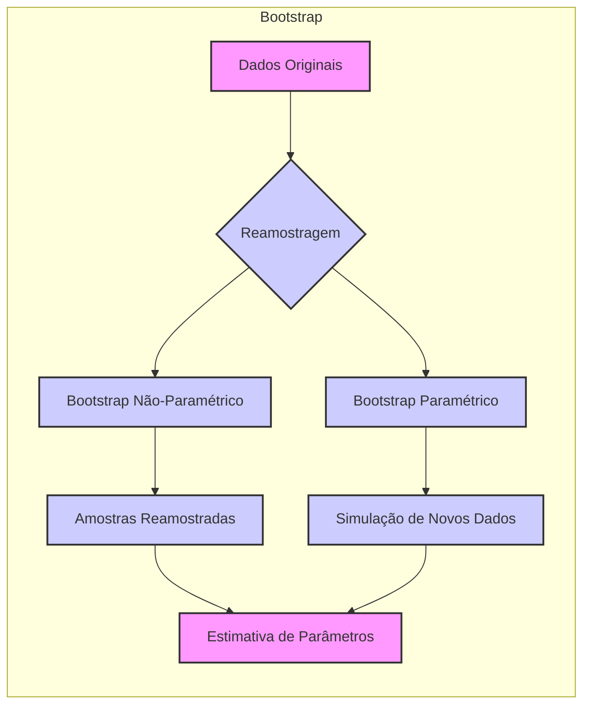
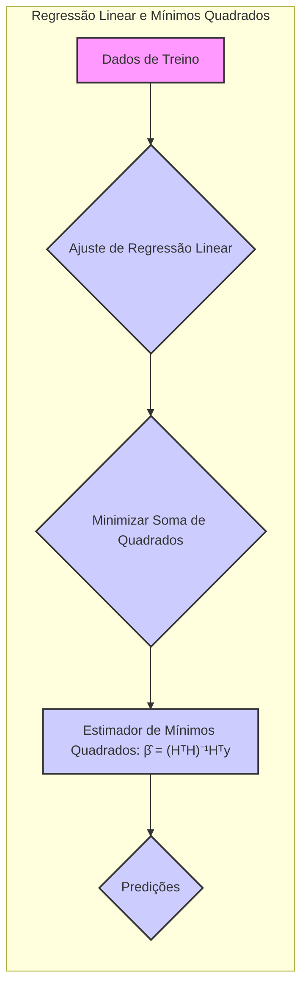
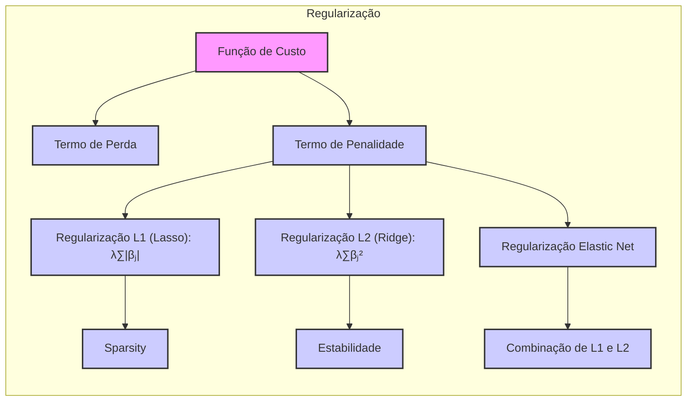
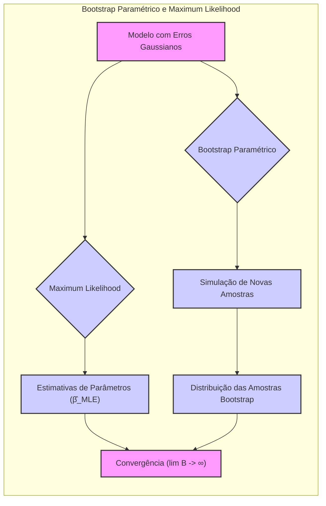

## Bootstrap como Implementação Computacional: Uma Análise Detalhada

### Introdução

O conceito de **bootstrap** como uma ferramenta computacional para inferência estatística é central no aprendizado de máquina e estatística moderna [^8.1]. Este capítulo explora em profundidade como o bootstrap atua como uma implementação computacional de métodos de **maximum likelihood** e da inferência Bayesiana, fornecendo um meio flexível e poderoso para estimar a incerteza e a variabilidade dos modelos. Ao invés de depender de suposições distribucionais ou derivações analíticas, o bootstrap utiliza reamostragem dos dados observados para aproximar a distribuição amostral de um estimador, oferecendo uma maneira robusta para avaliar a qualidade de estimativas e fazer inferências [^8.2].

### Conceitos Fundamentais

**Conceito 1: Reamostragem Bootstrap**

O **bootstrap** é uma técnica de reamostragem que simula a geração de novos conjuntos de dados a partir do conjunto de dados original, através de amostragem com reposição [^8.2.1]. Essa abordagem permite avaliar a variabilidade de um estimador sem a necessidade de recorrer a suposições sobre a distribuição dos dados. A ideia central é que a distribuição amostral obtida pelas amostras bootstrap aproxima a distribuição amostral real do estimador.

**Lemma 1:** Seja $Z = \{z_1, z_2, \ldots, z_N\}$ o conjunto de dados original, onde $z_i = (x_i, y_i)$. Uma amostra bootstrap $Z^*$ é obtida através de amostragem com reposição de $Z$, com o mesmo tamanho $N$. A distribuição das amostras bootstrap $Z^{*b}$, para $b = 1, 2, \ldots, B$, converge para a distribuição amostral real do estimador à medida que $B$ tende ao infinito [^8.2]. Formalmente, dado um estimador $\hat{\theta}$ calculado sobre $Z$ e estimadores bootstrap $\hat{\theta}^{*b}$ calculados sobre cada $Z^{*b}$, então

$$ \lim_{B \to \infty} P(\hat{\theta}^{*b} \leq t) \approx P(\hat{\theta} \leq t) $$

onde $t$ é um valor arbitrário e $P$ denota a probabilidade. $\blacksquare$

> 💡 **Exemplo Numérico:**
>
> Vamos considerar um conjunto de dados simples com 5 pontos: $Z = \{(1, 2), (2, 4), (3, 5), (4, 4), (5, 5)\}$. Queremos estimar a média de $y$. A média amostral é $\hat{\theta} = \frac{2+4+5+4+5}{5} = 4$. Para realizar o bootstrap não paramétrico, vamos gerar, por exemplo, 3 amostras bootstrap ($B=3$) de tamanho $N=5$:
>
> *   $Z^{*1} = \{(1, 2), (3, 5), (5, 5), (2, 4), (4, 4)\}$
> *   $Z^{*2} = \{(2, 4), (2, 4), (1, 2), (4, 4), (5, 5)\}$
> *   $Z^{*3} = \{(4, 4), (3, 5), (2, 4), (5, 5), (1, 2)\}$
>
> Calculamos a média de $y$ para cada amostra:
>
> *   $\hat{\theta}^{*1} = \frac{2+5+5+4+4}{5} = 4$
> *   $\hat{\theta}^{*2} = \frac{4+4+2+4+5}{5} = 3.8$
> *   $\hat{\theta}^{*3} = \frac{4+5+4+5+2}{5} = 4$
>
> Se repetirmos este processo um grande número de vezes (e.g., $B=1000$), a distribuição das médias bootstrap ($\hat{\theta}^{*b}$) aproximará a distribuição amostral da média real do conjunto de dados original. Podemos então usar esta distribuição para obter intervalos de confiança ou realizar outros tipos de inferências.

**Conceito 2: Bootstrap Não-Paramétrico e Paramétrico**

Existem duas abordagens principais para o **bootstrap**: a **não-paramétrica**, onde amostras bootstrap são formadas diretamente a partir do conjunto de dados original, e a **paramétrica**, onde novos dados são simulados usando um modelo paramétrico estimado a partir dos dados [^8.2.1], [^8.2.2]. O bootstrap não paramétrico é mais geral e faz menos suposições sobre a forma subjacente dos dados, enquanto o bootstrap paramétrico é útil quando há fortes razões para crer em um modelo paramétrico específico, como em [^8.2.2], usando erros Gaussianos aditivos.

**Corolário 1:** No bootstrap paramétrico, novas respostas $y_i^*$ são geradas adicionando ruído aleatório $\epsilon_i^* \sim N(0, \hat{\sigma}^2)$ às predições $\hat{\mu}(x_i)$ do modelo: $y_i^* = \hat{\mu}(x_i) + \epsilon_i^*$, [^8.2.2], onde $\hat{\sigma}^2$ é a variância estimada dos resíduos.

> 💡 **Exemplo Numérico:**
>
> Suponha que temos um modelo de regressão linear simples: $y_i = \beta_0 + \beta_1 x_i + \epsilon_i$ e que após o ajuste dos dados ($Z$) encontramos os seguintes valores: $\hat{\beta_0} = 1$, $\hat{\beta_1} = 0.8$, e que a variância estimada dos resíduos é $\hat{\sigma}^2 = 0.5$.
>
> Para gerar uma amostra bootstrap paramétrica, primeiro calculamos as predições $\hat{y_i} = \hat{\beta_0} + \hat{\beta_1} x_i$. Então, para cada $i$ simulamos um erro $\epsilon_i^* \sim N(0, 0.5)$ e somamos à predição $\hat{y_i}$ para obter uma nova resposta $y_i^* = \hat{y_i} + \epsilon_i^*$. Por exemplo, se $x_1 = 2$, $\hat{y_1} = 1 + 0.8 * 2 = 2.6$. Simulando $\epsilon_1^* = 0.3$ de $N(0, 0.5)$, teremos $y_1^* = 2.6 + 0.3 = 2.9$.
>
> Repetimos este processo para todos os $i$ em $Z$ para obter a amostra bootstrap paramétrica $Z^*$. Este processo é repetido $B$ vezes para obter $B$ amostras bootstrap, usadas para estimar a variabilidade dos parâmetros.

**Conceito 3: Conexão com Maximum Likelihood e Inferência Bayesiana**

O **bootstrap** pode ser visto como uma implementação computacional de inferência tanto de maximum likelihood quanto de inferência Bayesiana [^8.2.3]. No contexto de maximum likelihood, a distribuição dos estimadores bootstrap aproxima a distribuição amostral do estimador de máxima verossimilhança. Na inferência Bayesiana, em situações em que a informação prévia é não-informativa, a distribuição bootstrap pode aproximar a distribuição posterior dos parâmetros [^8.4].
> ⚠️ **Nota Importante**: O bootstrap paramétrico, em geral, não concorda com mínimos quadrados, mas com maximum likelihood, se a distribuição dos erros está especificada, como erros Gaussianos [^8.2.2].
> ❗ **Ponto de Atenção**: Em muitos casos, a escolha de um bootstrap paramétrico ou não-paramétrico vai depender do conhecimento das distribuições dos dados e da necessidade de fazer ou não suposições sobre eles.
> ✔️ **Destaque**: O bootstrap não-paramétrico é um método 'model-free', enquanto o paramétrico assume que os dados são gerados por um modelo específico, como em [^8.2.1].

### Regressão Linear e Mínimos Quadrados para Classificação

**Explicação:** Este mapa mental ilustra como a regressão linear, através do método de mínimos quadrados, pode ser aplicada em problemas de classificação, e como o bootstrap, o método de maximum likelihood e a inferência Bayesiana atuam nesse contexto, como discutido em [^8.1], [^8.2], [^8.4].

Na regressão linear, o estimador de mínimos quadrados, dado em [^8.2], minimiza a soma dos quadrados dos resíduos:

$$ \hat{\beta} = (H^T H)^{-1} H^T y $$

onde $H$ é a matriz de desenho com elementos $h_j(x_i)$. Aplicar regressão linear a um problema de classificação usando uma matriz de indicadores (dummy variables) para representar as classes pode levar a resultados razoáveis [^8.1], mas pode não refletir corretamente as probabilidades das classes, como abordado em [^8.2]. Em geral, este método minimiza a soma de quadrados dos resíduos para predição de classes, ao invés de estimar corretamente as probabilidades.

**Lemma 2:** Em situações onde os erros do modelo de regressão linear são Gaussianos e os dados de resposta (classes) são codificados como variáveis indicadoras, o estimador de mínimos quadrados $\hat{\beta}$ pode ser visto como um estimador de maximum likelihood sob a suposição de normalidade dos erros [^8.2].

**Prova do Lemma 2:** Se assumirmos que $y_i = h(x_i)^T \beta + \epsilon_i$, com $\epsilon_i \sim N(0,\sigma^2)$, a função de log-verossimilhança é dada por

$$ l(\beta, \sigma^2) = -\frac{N}{2}\log(2\pi\sigma^2) - \frac{1}{2\sigma^2} \sum_{i=1}^{N} (y_i - h(x_i)^T \beta)^2$$

A maximização desta função de log-verossimilhança em relação a $\beta$ leva ao estimador de mínimos quadrados. $\blacksquare$

> 💡 **Exemplo Numérico:**
>
> Vamos considerar um problema de classificação com duas classes (0 e 1) e uma única variável preditora. Temos os seguintes dados:
>
> | $x_i$ | $y_i$ |
> |-------|-------|
> | 1     | 0     |
> | 2     | 0     |
> | 3     | 1     |
> | 4     | 1     |
> | 5     | 1     |
>
> A matriz de desenho $H$ é:
>
> $H = \begin{bmatrix} 1 & 1 \\ 1 & 2 \\ 1 & 3 \\ 1 & 4 \\ 1 & 5 \end{bmatrix}$ e o vetor resposta $y = \begin{bmatrix} 0 \\ 0 \\ 1 \\ 1 \\ 1 \end{bmatrix}$.
>
> Usando a fórmula de mínimos quadrados, $\hat{\beta} = (H^T H)^{-1} H^T y$:
>
> $\text{Step 1: } H^T H = \begin{bmatrix} 5 & 15 \\ 15 & 55 \end{bmatrix}$
>
> $\text{Step 2: } (H^T H)^{-1} = \frac{1}{50}\begin{bmatrix} 55 & -15 \\ -15 & 5 \end{bmatrix}$
>
> $\text{Step 3: } H^T y = \begin{bmatrix} 3 \\ 13 \end{bmatrix}$
>
> $\text{Step 4: } \hat{\beta} = \frac{1}{50}\begin{bmatrix} 55 & -15 \\ -15 & 5 \end{bmatrix} \begin{bmatrix} 3 \\ 13 \end{bmatrix} = \frac{1}{50} \begin{bmatrix} 165-195 \\ -45 + 65 \end{bmatrix} = \begin{bmatrix} -0.6 \\ 0.4 \end{bmatrix}$
>
> Assim, $\hat{\beta_0} = -0.6$ e $\hat{\beta_1} = 0.4$. Isso significa que nossa predição para cada classe é $\hat{y_i} = -0.6 + 0.4 x_i$. Observe que usando este modelo para classificar os exemplos, não vamos obter probabilidades no intervalo $[0, 1]$. Este exemplo ilustra que a regressão linear não é a melhor ferramenta para classificação e como o bootstrap é importante para avaliar a incerteza.

**Corolário 2:**  A variância estimada dos parâmetros $\beta$ em regressão linear, dada por

$$ Var(\hat{\beta}) = (H^T H)^{-1} \hat{\sigma}^2$$

pode ser usada para construir intervalos de confiança para os coeficientes da regressão. No entanto, em problemas de classificação, essa abordagem pode não ser ideal, pois as probabilidades preditas podem estar fora do intervalo [0,1] e pode não refletir corretamente a incerteza [^8.2], [^8.4].

Em problemas de classificação, usar o bootstrap é uma maneira de corrigir as limitações da regressão linear, por exemplo, em situações de dados com classes não-balanceadas, pois a distribuição das amostras bootstrap aproxima a distribuição amostral real do estimador.

"Enquanto a regressão linear minimiza o erro quadrático médio, o bootstrap simula a variabilidade da estimativa".

### Métodos de Seleção de Variáveis e Regularização em Classificação

**Explicação:** Este diagrama destaca como a seleção de variáveis e a regularização, particularmente L1 e L2, impactam a classificação e a importância de técnicas como o Elastic Net [^8.2], [^8.4], [^8.5].

A **seleção de variáveis** e a **regularização** são técnicas cruciais para melhorar a generalização e a interpretabilidade de modelos de classificação. A regularização adiciona termos de penalidade à função de custo, restringindo a magnitude dos coeficientes do modelo, como discutido em [^8.5.1] e [^8.5.2].

A regularização L1 (Lasso) adiciona um termo proporcional à soma dos valores absolutos dos coeficientes, levando a soluções esparsas onde muitos coeficientes são exatamente zero. A regularização L2 (Ridge) adiciona um termo proporcional ao quadrado da norma dos coeficientes, encolhendo os coeficientes em direção a zero.

**Lemma 3:** Em um modelo de regressão logística, a penalidade L1 leva a estimativas esparsas para $\beta$, onde a esparsidade significa que muitos dos coeficientes são zero, [^8.4.4], [^8.5.1].
**Prova do Lemma 3:** A função de custo a ser minimizada na regressão logística com regularização L1 é:
$$ J(\beta) = -\sum_{i=1}^N \left[ y_i \log p(x_i; \beta) + (1-y_i) \log(1-p(x_i; \beta)) \right] + \lambda \sum_{j=1}^p |\beta_j|$$
onde $p(x_i; \beta)$ é a probabilidade predita e $\lambda$ é o parâmetro de regularização. A penalidade L1 introduz um termo não-diferenciável na função de custo, que força muitos coeficientes a serem exatamente zero, levando à seleção de variáveis. $\blacksquare$

> 💡 **Exemplo Numérico:**
>
> Suponha que temos um problema de classificação com 5 variáveis preditoras e aplicamos um modelo de regressão logística com regularização Lasso. Após o treinamento, obtivemos os seguintes coeficientes:
>
> | Coeficiente | Valor   |
> |------------|---------|
> | $\beta_0$  | 0.2     |
> | $\beta_1$  | 0.8     |
> | $\beta_2$  | 0       |
> | $\beta_3$  | -0.5   |
> | $\beta_4$  | 0       |
> | $\beta_5$  | 0.1    |
>
> Observe que os coeficientes $\beta_2$ e $\beta_4$ são exatamente zero, o que indica que as variáveis correspondentes foram consideradas irrelevantes pelo modelo Lasso e foram excluídas. Isso leva à esparsidade e a um modelo mais interpretável. Com regularização L2 (Ridge), os coeficientes seriam reduzidos, mas não necessariamente para zero.

**Corolário 3:** Modelos com regularização L1 são mais interpretáveis, pois um número menor de variáveis impacta a predição, [^8.4.5]. A regularização L2, por sua vez, reduz a variância e melhora a estabilidade das estimativas dos parâmetros.

> ⚠️ **Ponto Crucial**: A regularização Elastic Net combina as penalidades L1 e L2 para aproveitar os benefícios da esparsidade e estabilidade.
A escolha entre L1 e L2, ou mesmo uma combinação, depende das características dos dados e do objetivo do modelo.

### Separating Hyperplanes e Perceptrons

A ideia de **separating hyperplanes** é central para a classificação linear.  Um **hiperplano** é uma superfície linear que divide o espaço de características em duas regiões. O objetivo é encontrar um hiperplano que maximize a margem de separação entre as classes, que pode ser interpretado como uma forma de regularização [^8.5.2].
O **Perceptron** é um algoritmo iterativo que busca encontrar um hiperplano linear que separe corretamente os dados, atualizando os pesos a cada iteração.

### Pergunta Teórica Avançada: Qual a relação entre o bootstrap paramétrico e maximum likelihood em modelos com erros Gaussianos?

**Resposta:**

O **bootstrap paramétrico** simula novas amostras a partir de um modelo ajustado, enquanto o **maximum likelihood** busca o conjunto de parâmetros que maximiza a verossimilhança dos dados observados, dado um modelo. Em modelos com erros Gaussianos aditivos, o **bootstrap paramétrico** e o **maximum likelihood** são intimamente relacionados. Ao aplicar o bootstrap paramétrico, estamos essencialmente simulando dados com base no modelo de maximum likelihood, e o conjunto de resultados desse procedimento de simulação tem uma distribuição que se assemelha à distribuição amostral dos parâmetros do modelo.

**Lemma 4:** Em um modelo com erros Gaussianos, as estimativas de mínimos quadrados (que são também estimativas de maximum likelihood) dos parâmetros de regressão são equivalentes ao resultado do bootstrap paramétrico, no limite de um número infinito de amostras bootstrap [^8.2.2].

**Corolário 4:**  O bootstrap paramétrico, neste caso, produz intervalos de confiança que se aproximam dos intervalos de confiança obtidos via teoria assintótica de maximum likelihood.

> ⚠️ **Ponto Crucial**: A equivalência do bootstrap paramétrico com o maximum likelihood (em modelos gaussianos) depende da consistência do estimador de maximum likelihood. Se o estimador não for consistente, a distribuição bootstrap não irá convergir para a verdadeira distribuição dos parâmetros.

### Conclusão

O **bootstrap** oferece uma ferramenta computacional valiosa para avaliar a variabilidade de estimadores e realizar inferências em uma ampla variedade de modelos estatísticos e de aprendizado de máquina. Ao permitir a simulação da distribuição amostral de um estimador via reamostragem, o bootstrap evita a necessidade de derivações analíticas e suposições distribucionais rigorosas, proporcionando uma abordagem robusta e flexível. A compreensão de sua relação com métodos de **maximum likelihood** e inferência Bayesiana é essencial para a aplicação eficaz em cenários práticos complexos. A flexibilidade e a acessibilidade computacional do bootstrap fazem dele uma ferramenta indispensável para analistas de dados e pesquisadores.

<!-- END DOCUMENT -->
[^8.1]: "For most of this book, the fitting (learning) of models has been achieved by minimizing a sum of squares for regression, or by minimizing cross-entropy for classification. In fact, both of these minimizations are instances of the maximum likelihood approach to fitting." *(Trecho de Model Inference and Averaging)*
[^8.2]: "In this chapter we provide a general exposition of the maximum likelihood approach, as well as the Bayesian method for inference. The bootstrap, introduced in Chapter 7, is discussed in this context, and its relation to maximum likelihood and Bayes is described. Finally, we present some related techniques for model averaging and improvement, including committee methods, bagging, stacking and bumping." *(Trecho de Model Inference and Averaging)*
[^8.2.1]: "The bootstrap method provides a direct computational way of assessing uncertainty, by sampling from the training data. Here we illustrate the bootstrap in a simple one-dimensional smoothing problem, and show its connection to maximum likelihood." *(Trecho de Model Inference and Averaging)*
[^8.2.2]: "It turns out that the parametric bootstrap agrees with least squares in the previous example because the model (8.5) has additive Gaussian errors. In general, the parametric bootstrap agrees not with least squares but with maximum likelihood, which we now review." *(Trecho de Model Inference and Averaging)*
[^8.2.3]: "In essence the bootstrap is a computer implementation of nonparametric or parametric maximum likelihood. The advantage of the bootstrap over the maximum likelihood formula is that it allows us to compute maximum likelihood estimates of standard errors and other quantities in settings where no formulas are available." *(Trecho de Model Inference and Averaging)*
[^8.4]: "In the Bayesian approach to inference, we specify a sampling model Pr(Z|θ) (density or probability mass function) for our data given the parameters, and a prior distribution for the parameters Pr(θ) reflecting our knowledge about θ before we see the data. We then compute the posterior distribution" *(Trecho de Model Inference and Averaging)*
[^8.4.4]: "Finally, let θ0 denote the true value of θ. A standard result says that the sampling distribution of the maximum likelihood estimator has a limiting normal distribution" *(Trecho de Model Inference and Averaging)*
[^8.4.5]: "Confidence points for θj can be constructed from either approximation in (8.17). Such a confidence point has the form" *(Trecho de Model Inference and Averaging)*
[^8.5]: "In the Bayesian approach to inference, we specify a sampling model Pr(Z|θ) (density or probability mass function) for our data given the parameters, and a prior distribution for the parameters Pr(θ) reflecting our knowledge about θ before we see the data. We then compute the posterior distribution" *(Trecho de Model Inference and Averaging)*
[^8.5.1]: "Here we take a simpler route: by considering a finite B-spline basis for μ(x), we can instead provide a prior for the coefficients β, and this implicitly defines a prior for μ(x). We choose a Gaussian prior centered at zero" *(Trecho de Model Inference and Averaging)*
[^8.5.2]: "with the choices of the prior correlation matrix Σ and variance τ to be discussed below. The implicit process prior for μ(x) is hence Gaussian, with covariance kernel" *(Trecho de Model Inference and Averaging)*
