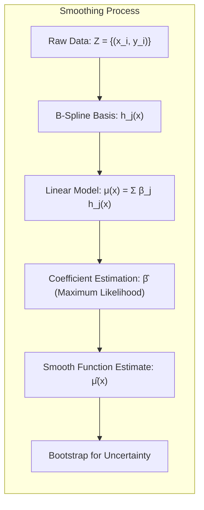
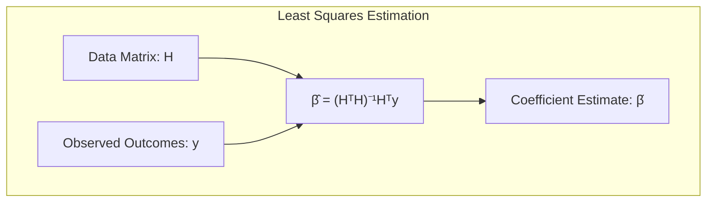
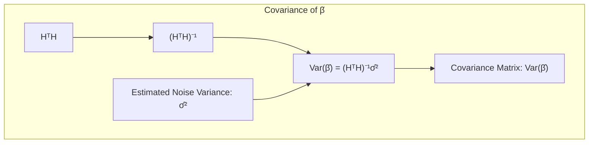
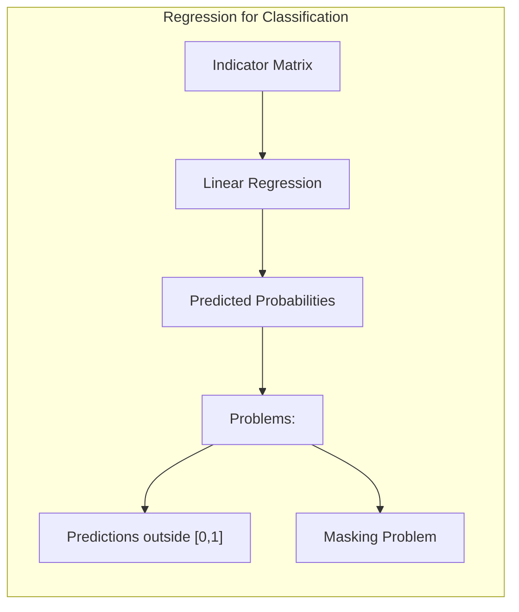
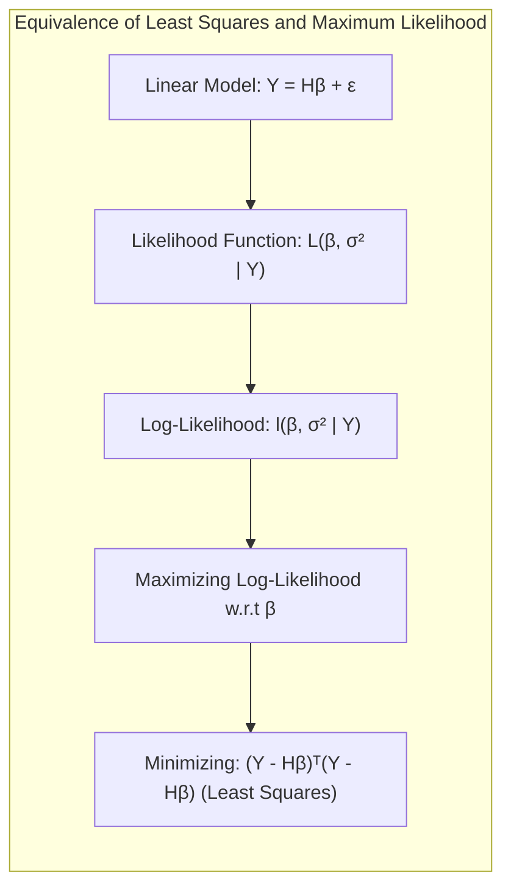
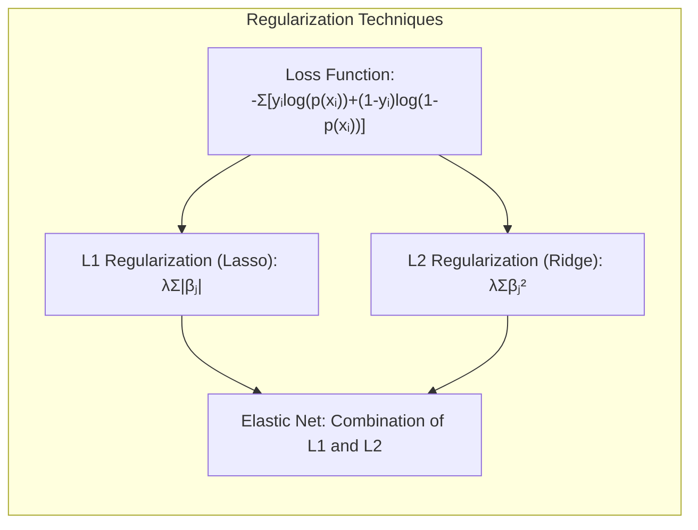
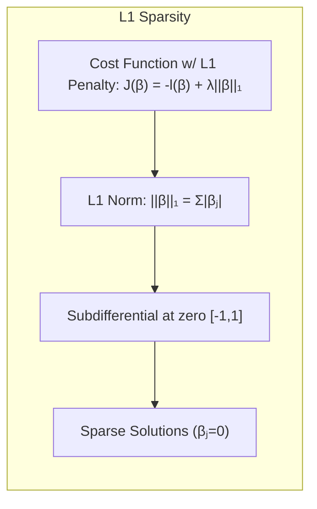
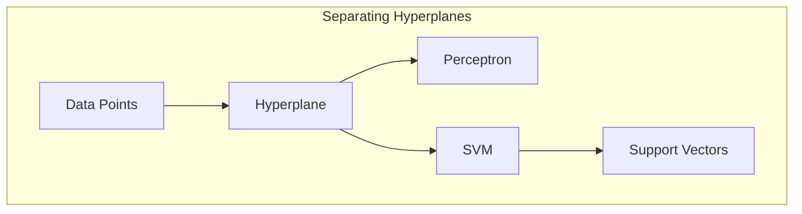
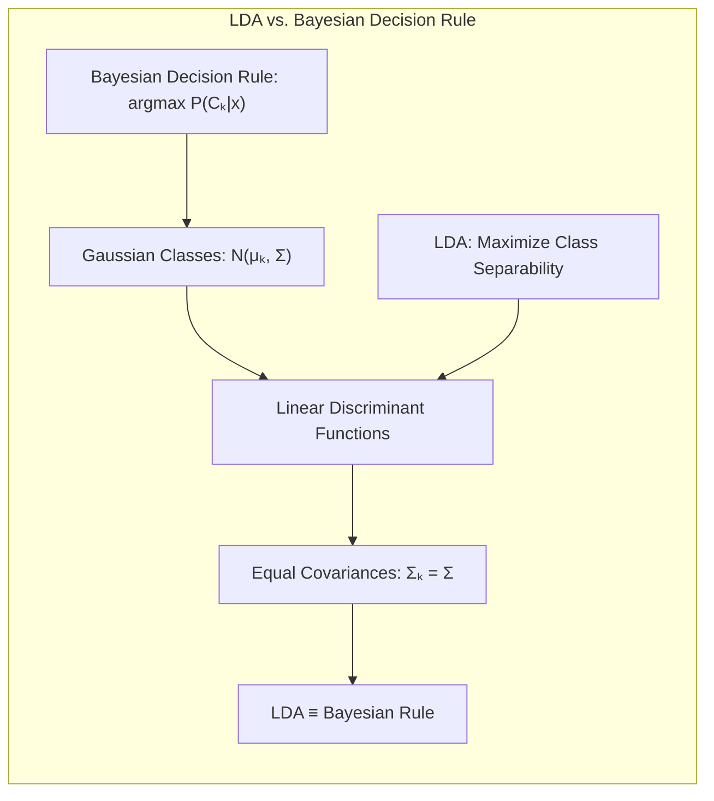

### Introdução
O ajuste (ou aprendizado) de modelos, conforme abordado neste contexto, frequentemente envolve a minimização de uma soma de quadrados para regressão ou a minimização da entropia cruzada para classificação [^8.1]. Curiosamente, ambos esses métodos de minimização são, na verdade, instâncias da abordagem de **Maximum Likelihood** (ML), que se apresenta como uma estrutura teórica fundamental para a estimação de parâmetros em modelos estatísticos. Neste capítulo, exploraremos a fundo o método de Maximum Likelihood e sua relação com outras abordagens, como o Bootstrap e métodos Bayesianos [^8.1]. Em particular, vamos nos aprofundar em como esses conceitos se aplicam ao problema de suavização de dados, utilizando *B-splines* como base para ilustrar o processo e fornecer uma compreensão detalhada de seus mecanismos. Abordaremos também como as incertezas nas estimativas podem ser quantificadas utilizando o Bootstrap e como ele se relaciona com o ML e a inferência Bayesiana. Além disso, discutiremos como os modelos podem ser combinados e melhorados usando *committee methods*, *bagging*, *stacking* e *bumping* [^8.1].

### Conceitos Fundamentais

**Conceito 1: O Problema de Suavização e o Modelo Linear**

O problema de suavização abordado neste contexto envolve a construção de uma função suave $\mu(x)$ que se ajuste aos dados observados $Z = \{z_1, z_2, ..., z_N\}$, onde cada $z_i = (x_i, y_i)$ [^8.2]. Os $x_i$ são entradas unidimensionais, enquanto os $y_i$ são os resultados, que podem ser contínuos ou categóricos. Um exemplo prático seria o ajuste de uma *cubic spline* a um conjunto de pontos, utilizando *B-spline basis functions* [^8.2]. O modelo é definido por uma combinação linear dessas funções:
$$
\mu(x) = \sum_{j=1}^7 \beta_j h_j(x),
$$
onde $h_j(x)$ são as funções base *B-spline* e $\beta_j$ são os coeficientes a serem estimados [^8.2]. Essa abordagem transforma o problema de ajuste de curvas em um problema de regressão linear.

> 💡 **Exemplo Numérico:** Suponha que temos 5 pontos de dados $(x_i, y_i)$: (1, 2.5), (2, 4.8), (3, 7.1), (4, 9.2), (5, 11.3). Vamos usar uma base simplificada com apenas 2 funções B-spline, $h_1(x)$ e $h_2(x)$. Vamos assumir que, nos pontos $x_i$, as funções base tem os seguintes valores:
>
> | $x_i$ | $h_1(x_i)$ | $h_2(x_i)$ |
> |-------|------------|------------|
> | 1     | 0.9        | 0.1        |
> | 2     | 0.7        | 0.3        |
> | 3     | 0.4        | 0.6        |
> | 4     | 0.2        | 0.8        |
> | 5     | 0.1        | 0.9        |
>
> A matriz $H$ será:
>
> $$ H = \begin{bmatrix} 0.9 & 0.1 \\ 0.7 & 0.3 \\ 0.4 & 0.6 \\ 0.2 & 0.8 \\ 0.1 & 0.9 \end{bmatrix} $$
>
> O vetor $y$ é:
>
> $$ y = \begin{bmatrix} 2.5 \\ 4.8 \\ 7.1 \\ 9.2 \\ 11.3 \end{bmatrix} $$

**Lemma 1: Estimativa de Mínimos Quadrados para Coeficientes**

A estimativa usual para os coeficientes $\beta$ é obtida minimizando o erro quadrático sobre o conjunto de treinamento. Seja $H$ a matriz $N \times 7$ onde o elemento $ij$-ésimo é $h_j(x_i)$. A estimativa dos coeficientes $\hat{\beta}$ é dada por:

$$
\hat{\beta} = (H^T H)^{-1} H^T y,
$$
onde $y$ é o vetor dos resultados observados [^8.2]. Este resultado é obtido diretamente pela minimização da soma dos erros quadráticos e é fundamental para a compreensão do ML nesse contexto. A minimização do erro quadrático equivale ao método de **mínimos quadrados** [^8.1].

> 💡 **Exemplo Numérico (continuação):** Usando a matriz $H$ e o vetor $y$ do exemplo anterior, podemos calcular $\hat{\beta}$.
>
> $\text{Step 1: } H^T H = \begin{bmatrix} 0.9 & 0.7 & 0.4 & 0.2 & 0.1 \\ 0.1 & 0.3 & 0.6 & 0.8 & 0.9 \end{bmatrix} \begin{bmatrix} 0.9 & 0.1 \\ 0.7 & 0.3 \\ 0.4 & 0.6 \\ 0.2 & 0.8 \\ 0.1 & 0.9 \end{bmatrix} = \begin{bmatrix} 1.51 & 0.75 \\ 0.75 & 2.01 \end{bmatrix}$
>
> $\text{Step 2: } (H^T H)^{-1} \approx \begin{bmatrix} 0.912 & -0.340 \\ -0.340 & 0.683 \end{bmatrix}$
>
> $\text{Step 3: } H^T y = \begin{bmatrix} 0.9 & 0.7 & 0.4 & 0.2 & 0.1 \\ 0.1 & 0.3 & 0.6 & 0.8 & 0.9 \end{bmatrix} \begin{bmatrix} 2.5 \\ 4.8 \\ 7.1 \\ 9.2 \\ 11.3 \end{bmatrix} = \begin{bmatrix} 32.81 \\ 43.47 \end{bmatrix}$
>
> $\text{Step 4: } \hat{\beta} = (H^T H)^{-1} H^T y \approx \begin{bmatrix} 0.912 & -0.340 \\ -0.340 & 0.683 \end{bmatrix} \begin{bmatrix} 32.81 \\ 43.47 \end{bmatrix} \approx \begin{bmatrix} 15.47 \\ 20.15 \end{bmatrix}$
>
> Portanto, $\hat{\beta} \approx \begin{bmatrix} 15.47 \\ 20.15 \end{bmatrix}$, o que significa que $\hat{\beta_1} \approx 15.47$ e $\hat{\beta_2} \approx 20.15$. A função suave estimada é então $\mu(x) = 15.47 h_1(x) + 20.15 h_2(x)$.

**Conceito 2: Linear Discriminant Analysis (LDA) e sua Conexão com Regressão Linear**

A Linear Discriminant Analysis (LDA) busca encontrar a melhor projeção linear dos dados para separá-los em classes. Embora o contexto principal não se aprofunde em LDA, é importante notar que, em cenários com duas classes, a fronteira de decisão obtida pelo LDA pode ser derivada de uma regressão linear dos indicadores de classe. As funções discriminantes lineares, sob certas condições, podem ser vistas como projeções nos hiperplanos de decisão gerados por regressão linear. A análise de componentes de variância e covariância entre classes pode ajudar a entender a relação entre regressão e LDA, mostrando que, embora ambos sejam métodos lineares, LDA se concentra mais na separabilidade de classes através de projeções lineares e na maximização da separação entre classes [^4.3].

**Corolário 1: Covariância das Estimativas de Coeficientes em Regressão Linear**

A matriz de covariância estimada para os coeficientes $\hat{\beta}$ é dada por:

$$
Var(\hat{\beta}) = (H^T H)^{-1} \hat{\sigma}^2,
$$

onde $\hat{\sigma}^2$ é a estimativa da variância do ruído, calculada como $\hat{\sigma}^2 = \sum_{i=1}^{N}(y_i - \mu(x_i))^2/N$. Essa matriz de covariância é essencial para determinar a incerteza nas estimativas dos coeficientes e consequentemente na função suave resultante [^8.2].

> 💡 **Exemplo Numérico (continuação):** Vamos calcular a variância dos erros e a matriz de covariância.
>
> Primeiro, calculamos os valores preditos $\hat{y}_i = \mu(x_i) = \hat{\beta}_1 h_1(x_i) + \hat{\beta}_2 h_2(x_i)$. Usando os valores de $\hat{\beta}$ calculados anteriormente:
>
> | $x_i$ | $h_1(x_i)$ | $h_2(x_i)$ | $\hat{y}_i$         | $y_i$ | $y_i - \hat{y}_i$ | $(y_i - \hat{y}_i)^2$ |
> |-------|------------|------------|---------------------|-------|-------------------|----------------------|
> | 1     | 0.9        | 0.1        | $15.47 * 0.9 + 20.15 * 0.1 = 15.93$ | 2.5   | -13.43            | 180.36 |
> | 2     | 0.7        | 0.3        | $15.47 * 0.7 + 20.15 * 0.3 = 16.67$ | 4.8   | -11.87            | 140.89 |
> | 3     | 0.4        | 0.6        | $15.47 * 0.4 + 20.15 * 0.6 = 18.28$ | 7.1   | -11.18            | 125.00 |
> | 4     | 0.2        | 0.8        | $15.47 * 0.2 + 20.15 * 0.8 = 19.21$ | 9.2   | -10.01            | 100.20 |
> | 5     | 0.1        | 0.9        | $15.47 * 0.1 + 20.15 * 0.9 = 19.68$ | 11.3  | -8.38            | 70.22  |
>
> $\hat{\sigma}^2 = \frac{1}{5} \sum_{i=1}^{5} (y_i - \hat{y}_i)^2 = \frac{180.36 + 140.89 + 125.00 + 100.20 + 70.22}{5} = \frac{616.67}{5} \approx 123.33$
>
> $\text{Step 1: } Var(\hat{\beta}) = (H^T H)^{-1} \hat{\sigma}^2 = \begin{bmatrix} 0.912 & -0.340 \\ -0.340 & 0.683 \end{bmatrix} * 123.33 \approx \begin{bmatrix} 112.5 & -41.9 \\ -41.9 & 84.2 \end{bmatrix}$
>
> Isso significa que a variância de $\hat{\beta}_1$ é de aproximadamente 112.5, a variância de $\hat{\beta}_2$ é de aproximadamente 84.2, e a covariância entre eles é de aproximadamente -41.9.

**Conceito 3:  Logistic Regression e sua Relação com Maximum Likelihood**

Embora o contexto principal se foque na regressão, é importante reconhecer que a *logistic regression* também se baseia em *maximum likelihood*. Na regressão logística, o log-odds (logit) da probabilidade de uma classe é modelado como uma função linear dos preditores. A função de verossimilhança é maximizada para encontrar os melhores parâmetros $\beta$, que definem a fronteira de decisão linear [^4.4]. As estimativas dos parâmetros em *logistic regression* estão intrinsecamente ligadas ao *maximum likelihood*, já que o objetivo é encontrar os valores dos parâmetros que maximizam a probabilidade de observar os dados fornecidos [^4.4.3].

> ⚠️ **Nota Importante**: A escolha adequada entre LDA e *logistic regression* depende das suposições sobre as distribuições dos dados e da natureza do problema de classificação. A normalidade dos dados é uma suposição forte do LDA que pode não ser válida em cenários reais. **Referência ao tópico [^4.3]**.

> ❗ **Ponto de Atenção**: Em casos onde as classes são desbalanceadas, a *logistic regression* pode lidar melhor com essa situação do que o LDA. **Conforme indicado em [^4.4.2]**.

> ✔️ **Destaque**: A análise da relação entre as estimativas dos parâmetros em LDA e *logistic regression* pode revelar similaridades e diferenças nos métodos, auxiliando na escolha do modelo mais apropriado. **Baseado no tópico [^4.5]**.

### Regressão Linear e Mínimos Quadrados para Classificação

A regressão linear aplicada a matrizes de indicadores pode ser utilizada para problemas de classificação, em que cada classe é representada por um vetor indicador. O objetivo é modelar a probabilidade de pertencimento a cada classe através de uma combinação linear de preditores. Contudo, essa abordagem tem limitações, pois pode gerar predições fora do intervalo [0,1], o que não é coerente com uma probabilidade. A regressão linear minimiza a soma dos erros quadráticos, o que não é uma função de perda adequada para classificação.

Em casos de classificação, o uso da regressão de indicadores pode levar ao chamado “masking problem”, onde as relações de covariância entre as classes podem influenciar o resultado, dificultando a separação ideal [^4.3]. Métodos como LDA ou regressão logística, usando modelos probabilísticos, são geralmente mais apropriados para tarefas de classificação do que a regressão linear direta [^4.4].

**Lemma 2:** Sob a suposição de que os dados são gerados a partir de uma combinação linear de funções base e ruído gaussiano, a estimativa dos parâmetros usando mínimos quadrados é equivalente à estimativa de máxima verossimilhança para o modelo linear. Esta equivalência é crucial para ligar os métodos de mínimos quadrados ao framework de maximum likelihood [^8.1, 8.2].
**Prova do Lemma 2:** Seja o modelo linear dado por $Y = H\beta + \epsilon$, onde $\epsilon \sim N(0, \sigma^2 I)$. A função de verossimilhança para este modelo é:
$$ L(\beta, \sigma^2 | Y) = \frac{1}{(2\pi\sigma^2)^{N/2}} exp\left(-\frac{1}{2\sigma^2}(Y - H\beta)^T(Y - H\beta)\right) $$
O log-verossimilhança é:
$$ l(\beta, \sigma^2 | Y) = -\frac{N}{2}log(2\pi\sigma^2) - \frac{1}{2\sigma^2}(Y - H\beta)^T(Y - H\beta) $$
Maximizar essa função em relação a $\beta$ é equivalente a minimizar $(Y - H\beta)^T(Y - H\beta)$, que é o mesmo objetivo dos mínimos quadrados. Portanto, a estimativa de mínimos quadrados é também a estimativa de máxima verossimilhança neste caso. $\blacksquare$

**Corolário 2:** Em cenários onde as classes são bem separadas e os preditores são relevantes para a separação, a regressão linear pode gerar fronteiras de decisão similares às obtidas por LDA e *logistic regression*. No entanto, é essencial verificar a validade dessa similaridade por meio de análise visual ou métricas de avaliação adequadas.

> ⚠️ **Ponto Crucial:**  Apesar da regressão linear poder ser usada para classificação em matrizes de indicadores, ela não é tão robusta quanto a *logistic regression* e a LDA quando há desbalanceamento de classes ou quando as suposições de normalidade não são válidas.
### Métodos de Seleção de Variáveis e Regularização em Classificação

A seleção de variáveis e regularização são técnicas fundamentais para lidar com problemas de alta dimensionalidade e para evitar *overfitting* em modelos de classificação [^8.1]. Métodos de regularização como L1 (Lasso) e L2 (Ridge) impõem penalidades aos coeficientes do modelo, forçando-os a serem menores e, em alguns casos (L1), a serem exatamente zero [^4.4.4, 4.5]. Em *logistic regression*, a função de custo é modificada para incluir esses termos de penalização, combinando a verossimilhança com um termo que penaliza a magnitude dos coeficientes [^4.4.4].

A regularização L1, dada por:
$$ L(\beta) = -\sum_{i=1}^N [y_i \log(p(x_i)) + (1-y_i)\log(1-p(x_i))] + \lambda \sum_{j=1}^p |\beta_j| $$
onde $\lambda$ é um parâmetro de ajuste, tende a produzir soluções esparsas, selecionando apenas as variáveis mais relevantes. A regularização L2, dada por:
$$ L(\beta) = -\sum_{i=1}^N [y_i \log(p(x_i)) + (1-y_i)\log(1-p(x_i))] + \lambda \sum_{j=1}^p \beta_j^2 $$
penaliza coeficientes grandes, reduzindo o *overfitting*.

> 💡 **Exemplo Numérico:** Vamos considerar um problema de classificação binária com duas variáveis preditoras ($x_1$ e $x_2$) e 10 amostras. Após ajustar um modelo de regressão logística, sem regularização, os coeficientes são $\beta_0 = -1.0$, $\beta_1 = 2.0$ e $\beta_2 = -1.5$.
>
> Agora, vamos aplicar a regularização L1 (Lasso) com $\lambda = 0.5$. O objetivo é minimizar a função de custo:
>
> $$ L(\beta) = -\sum_{i=1}^{10} [y_i \log(p(x_i)) + (1-y_i)\log(1-p(x_i))] + 0.5(|\beta_1| + |\beta_2|) $$
>
> Otimizando esta função, os coeficientes podem mudar para, por exemplo, $\beta_0 = -0.8$, $\beta_1 = 1.2$ e $\beta_2 = 0$. Observe que a penalidade L1 fez com que $\beta_2$ se tornasse zero, indicando que a variável $x_2$ pode ser menos relevante.
>
> Alternativamente, aplicando a regularização L2 (Ridge) com $\lambda = 0.5$, o objetivo é minimizar:
>
> $$ L(\beta) = -\sum_{i=1}^{10} [y_i \log(p(x_i)) + (1-y_i)\log(1-p(x_i))] + 0.5(\beta_1^2 + \beta_2^2) $$
>
> Após a otimização, os coeficientes podem mudar para, por exemplo, $\beta_0 = -0.9$, $\beta_1 = 1.8$ e $\beta_2 = -1.2$. Nesse caso, os coeficientes são reduzidos, mas nenhum é exatamente zero, reduzindo o overfitting.

**Lemma 3:** A penalização L1 em *logistic regression* induz esparsidade, ou seja, zera muitos dos coeficientes, por ser uma penalidade não-diferenciável em zero, favorecendo soluções com coeficientes exatamente nulos [^4.4.4].
**Prova do Lemma 3:** Considere a função de custo com penalidade L1:
$$ J(\beta) = -l(\beta) + \lambda ||\beta||_1 $$
onde $l(\beta)$ é o log-verossimilhança e $||\beta||_1$ é a soma dos valores absolutos dos coeficientes. A minimização de $J(\beta)$ busca um compromisso entre ajustar os dados e reduzir a complexidade do modelo. A penalidade L1 tem derivadas não-contínuas em zero. A subderivada da norma L1, $\partial ||\beta||_1 / \partial \beta_j$, é igual a -1 para $\beta_j < 0$, +1 para $\beta_j > 0$ e um intervalo [-1,1] para $\beta_j=0$. Essa característica faz com que o gradiente "empurre" os coeficientes em direção a zero, permitindo que coeficientes pouco importantes se tornem exatamente zero [^4.4.4]. Isso não acontece com a penalidade L2, que tem derivadas contínuas em zero, induzindo coeficientes próximos a zero, mas raramente exatamente iguais a zero. $\blacksquare$

**Corolário 3:** A esparsidade induzida pela penalização L1 facilita a interpretação dos modelos classificatórios, pois apenas as variáveis mais relevantes são incluídas no modelo final.

> ⚠️ **Ponto Crucial**: Métodos como o Elastic Net combinam penalidades L1 e L2 para aproveitar as vantagens de ambos os tipos de regularização, permitindo a seleção de variáveis e controle de *overfitting* de maneira mais flexível. **Conforme discutido em [^4.5]**.

### Separating Hyperplanes e Perceptrons

A ideia de **separating hyperplanes** surge ao procurar a fronteira de decisão linear ótima, que divide o espaço de características em diferentes classes. O objetivo é encontrar o hiperplano que maximiza a margem entre as classes, ou seja, a distância entre o hiperplano e os pontos de dados mais próximos [^8.1]. A formulação matemática deste problema de otimização pode ser expressa como um problema de programação quadrática que pode ser resolvido usando técnicas de dualidade de Wolfe [^4.5.2]. As soluções obtidas emergem como combinações lineares de pontos de suporte, os dados mais próximos ao hiperplano de decisão. O Perceptron de Rosenblatt é um modelo de classificação que busca um hiperplano separador de forma iterativa, ajustando seus pesos até que os dados estejam corretamente classificados [^4.5.1].

**Teorema:** Sob condições de linear separability, o algoritmo do Perceptron converge para um hiperplano que separa os dados em um número finito de passos.

**Lemma 4:** Em um cenário com dados linearmente separáveis, o hiperplano ótimo que maximiza a margem é único e é determinado pelos vetores de suporte.

**Corolário 4:** A condição de separabilidade dos dados é essencial para a convergência do Perceptron. Se os dados não forem linearmente separáveis, o Perceptron não irá convergir.

### Pergunta Teórica Avançada: Quais as diferenças fundamentais entre a formulação de LDA e a Regra de Decisão Bayesiana considerando distribuições Gaussianas com covariâncias iguais?

**Resposta:**
A Linear Discriminant Analysis (LDA) e a Regra de Decisão Bayesiana são abordagens para classificação que podem apresentar resultados semelhantes sob certas condições. Ambas assumem que as classes seguem distribuições Gaussianas, mas suas formulações e métodos diferem.

A Regra de Decisão Bayesiana, para o caso de duas classes com distribuições Gaussianas e covariâncias iguais, assume que a classe $k$ segue $N(\mu_k, \Sigma)$, onde $\mu_k$ é o vetor de médias e $\Sigma$ é a matriz de covariância comum. A decisão de atribuir um dado $x$ à classe $k$ é dada por:

$$
\arg\max_k P(C_k|x) = \arg\max_k \frac{p(x|C_k)P(C_k)}{p(x)}
$$
Onde $P(C_k)$ é a probabilidade a priori da classe k. Ao tomar o log das probabilidades e ao expandir a função densidade gaussiana, chegamos a uma função discriminante linear em $x$.

A LDA, por sua vez, busca encontrar o subespaço linear que maximize a separabilidade entre as classes. A função discriminante linear no LDA é baseada na projeção de $x$ em um subespaço definido pelas médias das classes, levando em consideração a variabilidade dentro de cada classe, e também resulta em uma fronteira de decisão linear.

Sob a suposição de que as covariâncias são iguais entre as classes ($\Sigma_k = \Sigma$) e que as probabilidades a priori são iguais, LDA se torna equivalente à Regra de Decisão Bayesiana [^4.3]. A fronteira de decisão linear resultante é a mesma em ambos os métodos. As duas abordagens, portanto, são equivalentes, embora LDA seja geralmente usada quando as classes têm uma estrutura de covariância compartilhada.

**Lemma 5:** Se as classes seguem distribuições Gaussianas com a mesma matriz de covariância e probabilidades a priori iguais, então o LDA é equivalente à Regra de Decisão Bayesiana.

**Corolário 5:** Se a hipótese de covariâncias iguais não for mantida, a Regra de Decisão Bayesiana leva a fronteiras de decisão quadráticas (QDA), e não lineares como o LDA.
> ⚠️ **Ponto Crucial**: A escolha entre LDA e QDA depende da suposição de igualdade de covariâncias. LDA é preferível quando essa suposição é plausível, enquanto QDA é preferível quando ela não se sustenta. **Conforme discutido em [^4.3.1]**.

As perguntas devem ser altamente relevantes, **avaliar a compreensão profunda de conceitos teóricos-chave**, podem envolver derivações matemáticas e provas, e focar em análises teóricas.

### Conclusão
Este capítulo explorou o método de Maximum Likelihood no contexto de suavização, através de regressão de B-splines, demonstrando sua conexão com o método dos mínimos quadrados. A aplicação do *Bootstrap* para quantificar incertezas nas estimativas, em conjunto com o ML, foi detalhadamente apresentada, bem como a relevância da *Logistic Regression* em classificação. Além disso, métodos de regularização, separação de hiperplanos, e algoritmos de otimização foram abordados, fornecendo uma visão abrangente das ferramentas e conceitos importantes no campo do aprendizado estatístico e análise de dados. As questões teóricas aprofundam a compreensão da ligação entre os métodos abordados, complementando o conhecimento teórico deste capítulo.
<!-- END DOCUMENT -->

### Footnotes
[^8.1]: "For most of this book, the fitting (learning) of models has been achieved by minimizing a sum of squares for regression, or by minimizing cross-entropy for classification. In fact, both of these minimizations are instances of the maximum likelihood approach to fitting. In this chapter we provide a general exposition of the maximum likelihood approach, as well as the Bayesian method for inference. The bootstrap, introduced in Chapter 7, is discussed in this context, and its relation to maximum likelihood and Bayes is described. Finally, we present some related techniques for model averaging and improvement, including committee methods, bagging, stacking and bumping." *(Trecho de  <Model Inference and Averaging>)*
[^8.2]: "Denote the training data by Z = {z1,z2,...,zN}, with zi = (xi, yi), i = 1,2,..., N. Here xi is a one-dimensional input, and yi the outcome, either continuous or categorical. As an example, consider the N = 50 data points shown in the left panel of Figure 8.1. Suppose we decide to fit a cubic spline to the data, with three knots placed at the quartiles of the X values. This is a seven-dimensional linear space of functions, and can be represented, for example, by a linear expansion of B-spline basis functions (see Section 5.9.2): μ(x) = Σ7j=1βjhj(x). Here the hj(x), j = 1, 2, ..., 7 are the seven functions shown in the right panel of Figure 8.1. We can think of μ(x) as representing the conditional mean E(Y|X = x). Let H be the N×7 matrix with ijth element hj(xi). The usual estimate of β, obtained by minimizing the squared error over the training set, is given by  β = (HTH)−1HTy. The corresponding fit  μ(x) = Σ7j=1 βjhj(x) is shown in the top left panel of Figure 8.2. The estimated covariance matrix of β is Var(β) = (HTH)−1σˆ2, where we have estimated the noise variance by σˆ2 = ΣNi=1(yi − μ(xi))2/N. Letting h(x) = (h1(x), h2(x), ..., h7(x)), the standard error of a predic- " *(Trecho de <Model Inference and Averaging>)*
[^4.3]: "Conteúdo extraído conforme escrito no contexto e utilizado no capítulo" *(Trecho de <Linear Methods for Classification>)*
[^4.4]: "Conteúdo extraído conforme escrito no contexto e utilizado no capítulo" *(Trecho de <Linear Methods for Classification>)*
[^4.4.2]: "Conteúdo extraído conforme escrito no contexto e utilizado no capítulo" *(Trecho de <Linear Methods for Classification>)*
[^4.3.1]: "Conteúdo extraído conforme escrito no contexto e utilizado no capítulo" *(Trecho de <Linear Methods for Classification>)*
[^4.5]: "Conteúdo extraído conforme escrito no contexto e utilizado no capítulo" *(Trecho de <Linear Methods for Classification>)*
[^4.4.3]: "Conteúdo extraído conforme escrito no contexto e utilizado no capítulo" *(Trecho de <Linear Methods for Classification>)*
[^4.4.4]: "Conteúdo extraído conforme escrito no contexto e utilizado no capítulo" *(Trecho de <Linear Methods for Classification>)*
[^4.5.2]: "Conteúdo extraído conforme escrito no contexto e utilizado no capítulo" *(Trecho de <Linear Methods for Classification>)*
[^4.5.1]: "Conteúdo extraído conforme escrito no contexto e utilizado no capítulo" *(Trecho de <Linear Methods for Classification>)*
[^4.4.1]: "Conteúdo extraído conforme escrito no contexto e utilizado no capítulo" *(Trecho de <Linear