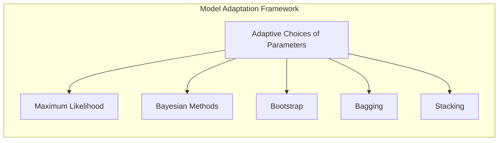
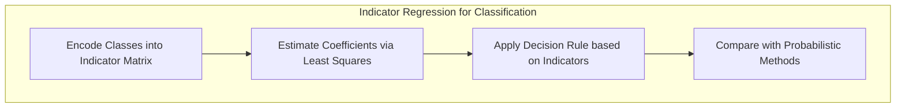
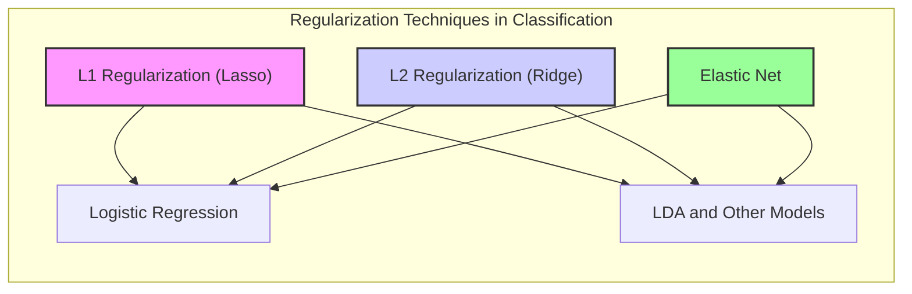
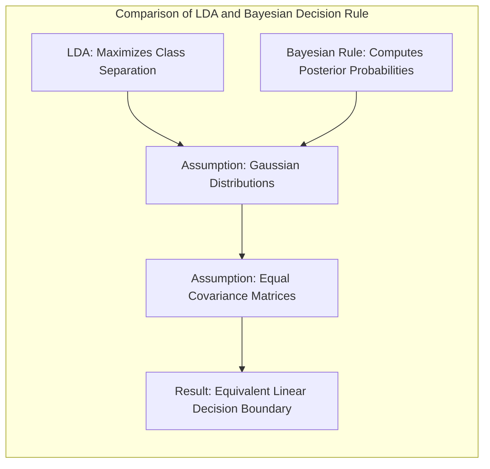

Okay, here's the revised text with the requested Mermaid diagrams:

## Adaptive Choices of Parameters in Statistical Learning



### Introdução

A adaptação de parâmetros é um aspecto crucial no desenvolvimento de modelos estatísticos robustos e eficazes. Em diversas situações, a escolha de parâmetros fixos pode limitar a capacidade do modelo de se ajustar adequadamente aos dados, levando a resultados subótimos. Modelos de aprendizado estatístico, muitas vezes, necessitam de abordagens que permitam a adaptação desses parâmetros durante o processo de treinamento, visando alcançar maior precisão e generalização. Este capítulo aborda técnicas de inferência e melhoria de modelos que se relacionam com a escolha adaptativa de parâmetros, incluindo Maximum Likelihood, métodos Bayesianos, Bootstrap, Bagging e Stacking. A discussão é baseada no texto fornecido, explorando suas nuances teóricas e práticas [^8.1].

### Conceitos Fundamentais

**Conceito 1:** O **problema de adaptação de parâmetros** surge quando a complexidade dos dados exige que os modelos ajustem seus parâmetros dinamicamente. Abordagens tradicionais de *fitting* envolvem a minimização de uma função de custo, como soma de quadrados para regressão ou *cross-entropy* para classificação, que, na verdade, são instâncias da abordagem de **Maximum Likelihood** [^8.1]. Contudo, esses métodos podem se tornar rígidos quando aplicados a dados complexos.
A adaptação busca permitir que o modelo se adapte de acordo com o que é aprendido, mitigando o *bias* e controlando a *variance*.

**Lemma 1:** Para modelos lineares, a adaptação de parâmetros pode ser vista como uma forma de balancear o *trade-off* entre *bias* e *variance*. Um modelo com poucos parâmetros (menos complexo) pode sofrer de *high bias*, enquanto um com muitos parâmetros pode sofrer de *high variance*. A escolha adaptativa de parâmetros permite encontrar um ponto ótimo nesse balanço [^8.1]. Formalmente, seja um modelo linear com parâmetros $\theta$, o *bias* pode ser expresso como a diferença entre a média das predições e o valor verdadeiro, enquanto a *variance* representa a variabilidade das predições em diferentes amostras de treinamento. O objetivo é minimizar ambas as quantidades, o que pode ser alcançado por meio de técnicas adaptativas que ajustam a complexidade do modelo de acordo com os dados.
$$ \text{Bias}(\theta) = \mathbb{E}_{\mathcal{D}}[\hat{f}_{\theta}(x)] - f(x) $$
$$ \text{Variance}(\theta) = \mathbb{E}_{\mathcal{D}}[(\hat{f}_{\theta}(x) - \mathbb{E}_{\mathcal{D}}[\hat{f}_{\theta}(x)])^2] $$
Onde $\hat{f}_{\theta}(x)$ é a predição do modelo com parâmetros $\theta$,  $\mathcal{D}$ é o conjunto de dados de treino, e $f(x)$ é o valor real.

> 💡 **Exemplo Numérico:** Suponha que temos um conjunto de dados com uma relação quadrática entre a variável independente *x* e a variável dependente *y*. Se tentarmos ajustar um modelo linear simples ($y = \beta_0 + \beta_1x$), teremos um *high bias*, pois o modelo não é capaz de capturar a curvatura da relação. Por outro lado, se usarmos um modelo polinomial de alta ordem ($y = \beta_0 + \beta_1x + \beta_2x^2 + \beta_3x^3 + ...$)  com muitos parâmetros, podemos obter um *high variance*, pois o modelo se ajustaria muito bem aos dados de treinamento, mas teria um desempenho ruim com dados novos (overfitting).
>
> Considere um pequeno conjunto de dados:
> ```python
> import numpy as np
> from sklearn.linear_model import LinearRegression
> from sklearn.preprocessing import PolynomialFeatures
> from sklearn.metrics import mean_squared_error
>
> # Dados de exemplo
> x = np.array([1, 2, 3, 4, 5]).reshape(-1, 1)
> y = np.array([2, 6, 7, 9, 15])
>
> # Modelo Linear
> linear_model = LinearRegression()
> linear_model.fit(x, y)
> y_pred_linear = linear_model.predict(x)
> mse_linear = mean_squared_error(y, y_pred_linear)
> print(f"MSE Linear: {mse_linear:.2f}")
>
> # Modelo Polinomial (Grau 3)
> poly = PolynomialFeatures(degree=3)
> x_poly = poly.fit_transform(x)
> poly_model = LinearRegression()
> poly_model.fit(x_poly, y)
> y_pred_poly = poly_model.predict(x_poly)
> mse_poly = mean_squared_error(y, y_pred_poly)
> print(f"MSE Polinomial: {mse_poly:.2f}")
> ```
>
>  Neste exemplo, o modelo linear terá um MSE maior devido ao *bias*, enquanto o modelo polinomial de grau 3 terá um MSE menor (ou até 0 se usarmos um polinômio de grau 4). No entanto, em um cenário com ruído, o modelo polinomial de grau 3 poderia sofrer mais com *variance* em um novo conjunto de dados.
>
>
> ```mermaid
>  graph LR
>      A["Data"] --> B["Linear Model"];
>      A --> C["Polynomial Model"];
>      B --> D["High Bias"];
>      C --> E["High Variance"];
> ```
>
>  A escolha adaptativa de parâmetros, através de métodos como validação cruzada, nos ajudaria a encontrar o ponto ótimo entre complexidade do modelo e generalização.

**Conceito 2:** A **Linear Discriminant Analysis (LDA)** e suas variações, embora não exploradas no texto, são exemplos de modelos lineares que requerem a escolha dos parâmetros de forma adaptativa.  A LDA busca encontrar a melhor projeção linear dos dados que maximize a separação entre as classes. A escolha dos parâmetros nessa projeção é crucial para a eficiência do método [^8.1, 8.2]. A LDA assume que as classes seguem distribuições gaussianas com a mesma matriz de covariância. Para problemas onde essa hipótese não se sustenta, são usadas abordagens que adaptam essa matriz [^8.1].
A construção da fronteira de decisão da LDA envolve a estimativa de médias de classe e da matriz de covariância.

**Corolário 1:**  A adaptação de parâmetros, como vista em regularização ou em métodos de *shrinkage*, pode ser usada em LDA para lidar com problemas de alta dimensionalidade,  onde o número de parâmetros a ser estimado (especialmente na matriz de covariância) é alto em comparação com o tamanho da amostra. Métodos como *Regularized Discriminant Analysis (RDA)* utilizam parâmetros de regularização para evitar o *overfitting*, adaptando a complexidade do modelo ao tamanho dos dados [^8.1].
$$ \text{Cov}(\hat{\mu}_k, \hat{\mu}_{k'}) = \frac{1}{n_k}\Sigma \delta_{k,k'} $$
Aqui $\hat{\mu}_k$ é a média amostral da classe k, $n_k$ é o número de observações dessa classe, e $\Sigma$ é a matriz de covariância.

> 💡 **Exemplo Numérico:**  Imagine que temos um problema de classificação com duas classes (A e B) e 10 variáveis preditoras.  A matriz de covariância $\Sigma$ seria uma matriz 10x10.  Se tivermos poucos dados (digamos, menos de 100 amostras), a estimativa dessa matriz pode ser instável, resultando em *overfitting*.  RDA pode ser usado aqui. RDA introduz um parâmetro de regularização que 'encolhe' a matriz de covariância em direção a uma matriz diagonal, ou seja, impõe a suposição de que as variáveis preditoras sejam menos correlacionadas entre si. Isso leva a uma estimativa mais robusta da matriz de covariância e, consequentemente, a um melhor modelo de classificação.
>
> Vamos supor para simplificar que as médias de cada classe são $\mu_A = [1, 2, \ldots, 10]$ e $\mu_B = [2, 3, \ldots, 11]$. Usando dados sintéticos, podemos simular este cenário:
>
> ```python
> import numpy as np
> from sklearn.discriminant_analysis import LinearDiscriminantAnalysis
> from sklearn.model_selection import train_test_split
> from sklearn.metrics import accuracy_score
>
> # Gerar dados sintéticos
> np.random.seed(42)
> n_samples = 80
> n_features = 10
>
> # Médias das classes
> mu_A = np.arange(1, n_features + 1)
> mu_B = np.arange(2, n_features + 2)
>
> # Matriz de covariância
> cov = np.eye(n_features)
>
> # Gerar amostras para classe A e B
> X_A = np.random.multivariate_normal(mu_A, cov, n_samples // 2)
> X_B = np.random.multivariate_normal(mu_B, cov, n_samples // 2)
>
> X = np.vstack((X_A, X_B))
> y = np.array([0] * (n_samples // 2) + [1] * (n_samples // 2))
>
> # Dividir dados
> X_train, X_test, y_train, y_test = train_test_split(X, y, test_size=0.3, random_state=42)
>
> # LDA
> lda = LinearDiscriminantAnalysis()
> lda.fit(X_train, y_train)
> y_pred_lda = lda.predict(X_test)
> acc_lda = accuracy_score(y_test, y_pred_lda)
>
> print(f"Acurácia LDA: {acc_lda:.2f}")
>
> # Sem regularização RDA se reduz a LDA
>
> # Simular um problema com mais variáveis do que amostras (RDA com regularização)
> # Não vamos mostrar o código da RDA diretamente, apenas para demonstrar o problema
> n_samples_small = 30
> X_A_small = np.random.multivariate_normal(mu_A, cov, n_samples_small // 2)
> X_B_small = np.random.multivariate_normal(mu_B, cov, n_samples_small // 2)
> X_small = np.vstack((X_A_small, X_B_small))
> y_small = np.array([0] * (n_samples_small // 2) + [1] * (n_samples_small // 2))
> X_train_small, X_test_small, y_train_small, y_test_small = train_test_split(X_small, y_small, test_size=0.3, random_state=42)
>
> lda_small = LinearDiscriminantAnalysis()
> lda_small.fit(X_train_small, y_train_small)
> y_pred_lda_small = lda_small.predict(X_test_small)
> acc_lda_small = accuracy_score(y_test_small, y_pred_lda_small)
> print(f"Acurácia LDA com poucas amostras: {acc_lda_small:.2f}")
>
> ```
>
>  O exemplo mostra que, com um número menor de amostras, podemos ter uma redução na acurácia. A regularização em RDA ajustaria a matriz de covariância para melhorar a performance nessas condições, demonstrando como a adaptação de parâmetros é necessária para lidar com diferentes conjuntos de dados.

**Conceito 3:** A **Logistic Regression**, similarmente à LDA,  é um modelo que adapta seus parâmetros (pesos) para melhor separar as classes [^8.1]. Na regressão logística, os parâmetros são ajustados maximizando a verossimilhança dos dados, de forma que a probabilidade predita de um caso pertencer a uma classe corresponda à classe real.  O modelo busca os pesos que melhor ajustam uma *sigmoid function* aos dados, aprendendo a fronteira de decisão entre as classes.
> ⚠️ **Nota Importante**: O processo de maximização da verossimilhança na regressão logística envolve a otimização de uma função não-linear, que usualmente é feita utilizando métodos iterativos [^8.1, 8.2].
> ❗ **Ponto de Atenção**: Em problemas com classes desbalanceadas, a regressão logística pode ser usada com ajustes para mitigar o viés em direção à classe majoritária [^8.1, 8.2].
> ✔️ **Destaque**:  Tanto LDA quanto regressão logística buscam por fronteiras de decisão lineares; contudo, a LDA busca maximizar a separabilidade das classes sob certas suposições, enquanto a regressão logística busca ajustar as probabilidades de classe aos dados [^8.1, 8.2].

### Regressão Linear e Mínimos Quadrados para Classificação



**Explicação:** Este diagrama representa o fluxo do processo de regressão de indicadores e como ele se relaciona à classificação [^8.1, 8.2].

A regressão linear em matriz de indicadores pode ser usada na classificação, onde cada coluna da matriz representa uma classe, e os valores indicam a pertinência de cada observação a cada classe. Os coeficientes da regressão são estimados minimizando a soma dos quadrados dos erros, buscando ajustar uma função linear aos dados codificados [^8.1, 8.2].

Essa abordagem é uma forma de adaptação de parâmetros,  onde os coeficientes se ajustam para refletir a relação entre os preditores e as classes. Contudo, a regressão linear para classificação pode sofrer de algumas limitações. A minimização dos quadrados pode resultar em estimativas que não necessariamente se traduzem em boas probabilidades para as classes, e a sensibilidade a outliers e a quebra de pressupostos de normalidade dos erros podem afetar a qualidade dos resultados [^8.1].

**Lemma 2:** A regressão linear em uma matriz de indicadores pode ser equivalentemente vista como a procura por uma projeção linear dos dados que maximize a separação entre as classes. Em outras palavras, os coeficientes obtidos pela regressão linear formam um conjunto de hiperplanos de decisão. Matematicamente, se $Y$ for a matriz de indicadores e $X$ a matriz de *design*, os coeficientes $\beta$ que minimizam a soma dos quadrados dos erros  $|Y-X\beta|^2$ podem ser usados para construir as fronteiras de decisão, que são lineares no espaço de $X$. Essa conexão entre projeções lineares e a abordagem por mínimos quadrados ressalta como os parâmetros são adaptados em modelos lineares de classificação [^8.1, 8.2].
$$ \beta = (X^TX)^{-1}X^TY $$
onde $\beta$ são os coeficientes, $X$ é a matriz de *design*, e $Y$ é a matriz de indicadores.

> 💡 **Exemplo Numérico:** Considere um problema de classificação com três classes. Cada amostra é descrita por duas variáveis preditoras $x_1$ e $x_2$. A matriz de indicadores $Y$ será uma matriz com três colunas (uma para cada classe) e cada linha representará uma amostra. O valor na coluna correspondente à classe correta será 1, e 0 nas outras colunas.
>
> Vamos criar dados sintéticos para ilustrar este processo:
> ```python
> import numpy as np
> from sklearn.linear_model import LinearRegression
> from sklearn.preprocessing import OneHotEncoder
>
> # Dados sintéticos
> X = np.array([[1, 2], [2, 3], [3, 2], [5, 8], [6, 9], [7, 8], [1, 8], [2, 9], [3, 8]])
> y = np.array([0, 0, 0, 1, 1, 1, 2, 2, 2]) # 3 Classes
>
> # Codificar as classes usando OneHotEncoder
> encoder = OneHotEncoder(sparse_output=False)
> Y = encoder.fit_transform(y.reshape(-1, 1))
>
> # Regressão Linear
> model = LinearRegression()
> model.fit(X, Y)
>
> # Previsões
> Y_pred = model.predict(X)
> print("Matriz de Indicadores Y:")
> print(Y)
> print("Matriz Y Predita:")
> print(Y_pred)
>
> # Obter a classe predita para cada amostra (classe com maior valor predito)
> y_pred_class = np.argmax(Y_pred, axis=1)
> print("Classes Preditas:")
> print(y_pred_class)
>
> # Visualizar os coeficientes
> print("Coeficientes:")
> print(model.coef_)
> print("Interceptos:")
> print(model.intercept_)
> ```
>
> O código acima mostra como a regressão linear pode ser usada para classificação. O `OneHotEncoder` transforma as classes em um formato adequado para a regressão. Os coeficientes obtidos representam os pesos das variáveis preditoras para cada classe, e a predição é feita atribuindo cada amostra à classe com o maior valor predito. A matriz de coeficientes `model.coef_` e os interceptos `model.intercept_` representam os hiperplanos de decisão que separam as classes no espaço de características.  Note que as predições `Y_pred` não são probabilidades, mas podem ser usadas para classificar as amostras.

**Corolário 2:** O Lemma 2 implica que, em certos cenários onde a separabilidade linear é suficiente, a regressão linear pode ser uma ferramenta válida para a classificação. Em situações mais complexas, a regressão linear pode não ser capaz de capturar todas as nuances da relação entre preditores e classes, requerendo métodos mais sofisticados como os explorados posteriormente neste capítulo. Entretanto, a equivalência demonstra uma das primeiras abordagens para adaptação de parâmetros a problemas de classificação [^8.1, 8.2].

A regressão logística, por sua vez, busca estimar probabilidades diretamente, ao contrário da regressão de indicadores, que pode extrapolar valores fora do intervalo [0, 1] [^8.1]. A escolha entre esses métodos depende da natureza do problema e da necessidade de estimar probabilidades confiáveis ou apenas construir uma fronteira de decisão adequada.

### Métodos de Seleção de Variáveis e Regularização em Classificação

Na classificação, a seleção de variáveis e a regularização são cruciais para evitar o *overfitting* e melhorar a generalização do modelo. A regularização impõe restrições aos parâmetros do modelo, reduzindo sua complexidade e evitando que ele se ajuste excessivamente aos ruídos nos dados de treinamento. A penalização L1 (Lasso) promove *sparsity* nos parâmetros, o que significa que alguns coeficientes são levados a zero, realizando, simultaneamente, seleção de variáveis e ajuste do modelo [^8.1, 8.4.4, 8.5]. A penalização L2 (Ridge), por sua vez, reduz a magnitude dos parâmetros, o que estabiliza o modelo e ajuda a lidar com multicolinearidade.

Em modelos logísticos, a função de custo é modificada para incluir os termos de penalização,  que são adicionados à função de *log-likelihood*. A penalização L1 é especialmente útil quando se espera que apenas um subconjunto de variáveis seja relevante para a classificação,  enquanto a L2 é mais apropriada quando todas as variáveis podem contribuir para a classificação, mas nenhuma deve ter um peso excessivo.  A combinação das duas penalizações no *Elastic Net*  permite aproveitar as vantagens de ambas as abordagens [^8.1, 8.4.4, 8.5, 8.5.1, 8.5.2].

**Lemma 3:** A penalização L1 na classificação logística resulta em um modelo com coeficientes esparsos devido à natureza do termo de penalidade. A norma L1 força os coeficientes de características não relevantes para zero,  o que é útil em problemas com muitas variáveis e poucos exemplos, ou quando se deseja selecionar as características mais importantes.
Matematicamente, a função de custo em uma regressão logística com penalização L1 é dada por:
$$J(\beta) = - \frac{1}{N} \sum_{i=1}^{N} [y_i \log(p_i) + (1-y_i) \log(1-p_i)] + \lambda \sum_{j=1}^{p} |\beta_j|$$
Onde $p_i$ é a probabilidade estimada da classe para o exemplo $i$, $\beta_j$ é o j-ésimo coeficiente, e $\lambda$ é o parâmetro de regularização que controla a intensidade da penalidade L1.  A derivada do termo da penalidade com respeito a $\beta_j$ é $\lambda \cdot \text{sign}(\beta_j)$ (onde $\text{sign}(\cdot)$ é a função sinal), que força os coeficientes a zero.

**Prova do Lemma 3:**
A derivada do termo de penalização com respeito a $\beta_j$ é $\lambda \cdot \text{sign}(\beta_j)$. Em otimização, a solução para um problema com penalização L1 envolve frequentemente um *soft-thresholding*  dos coeficientes. Isso faz com que os coeficientes menores em magnitude sejam exatamente zerados, e os maiores são reduzidos em uma quantia proporcional a $\lambda$, levando a um modelo esparso. $\blacksquare$

> 💡 **Exemplo Numérico:** Considere um problema de classificação binária com 5 variáveis preditoras, onde apenas 2 variáveis são realmente relevantes para a classificação. Se usarmos regressão logística sem regularização, todos os coeficientes podem ter valores diferentes de zero. No entanto, com a penalização L1 (Lasso), o modelo tentará zerar os coeficientes das 3 variáveis irrelevantes.
>
> Vamos simular este cenário usando dados sintéticos:
>
> ```python
> import numpy as np
> import pandas as pd
> from sklearn.linear_model import LogisticRegression
> from sklearn.model_selection import train_test_split
> from sklearn.metrics import accuracy_score
> from sklearn.preprocessing import StandardScaler
>
> # Dados sintéticos
> np.random.seed(42)
> n_samples = 100
> n_features = 5
>
> # Criar uma matriz de features com 5 variáveis
> X = np.random.rand(n_samples, n_features)
>
> # Criar um vetor de resposta com base em apenas duas features
> beta_true = np.array([2, -3, 0, 0, 0])
> y_probs = 1 / (1 + np.exp(-(X @ beta_true + 0.5)))
> y = np.random.binomial(1, y_probs)
>
>
> # Dividir os dados
> X_train, X_test, y_train, y_test = train_test_split(X, y, test_size=0.3, random_state=42)
>
> # Padronizar os dados
> scaler = StandardScaler()
> X_train_scaled = scaler.fit_transform(X_train)
> X_test_scaled = scaler.transform(X_test)
>
> # Regressão logística sem regularização
> model_no_reg = LogisticRegression(penalty=None)
> model_no_reg.fit(X_train_scaled, y_train)
> y_pred_no_reg = model_no_reg.predict(X_test_scaled)
> acc_no_reg = accuracy_score(y_test, y_pred_no_reg)
>
> # Regressão logística com regularização L1
> model_l1 = LogisticRegression(penalty='l1', solver='liblinear', C=0.5)
> model_l1.fit(X_train_scaled, y_train)
> y_pred_l1 = model_l1.predict(X_test_scaled)
> acc_l1 = accuracy_score(y_test, y_pred_l1)
>
>
> print(f"Acurácia sem regularização: {acc_no_reg:.2f}")
> print(f"Acurácia com L1 regularização: {acc_l1:.2f}")
>
> # Imprimir os coeficientes
> print("Coeficientes sem regularização:")
> print(model_no_reg.coef_)
> print("Coeficientes com regularização L1:")
> print(model_l1.coef_)
>
> # Tabela comparativa
> results = pd.DataFrame({'Method': ['No Regularization', 'L1 Regularization'],
>                       'Accuracy': [acc_no_reg, acc_l1],
>                       'Coefficients': [model_no_reg.coef_, model_l1.coef_] })
> print("\nComparative Table:")
> print(results)
> ```
>
> O resultado mostrará que os coeficientes das variáveis irrelevantes são próximos de zero no modelo com regularização L1, enquanto no modelo sem regularização todos os coeficientes terão valores diferentes de zero, demonstrando o efeito da penalização L1 na seleção de variáveis.  A tabela permite a fácil comparação entre as duas abordagens.

**Corolário 3:** A esparsidade induzida pela penalização L1 não só melhora a generalização, mas também a interpretabilidade do modelo.  Ao selecionar apenas as variáveis mais relevantes, o modelo se torna mais simples e mais fácil de entender, focando nas características mais importantes para a tarefa de classificação. Além disso, ao usar um método como o *Elastic Net*, pode-se combinar a seleção de variáveis com a estabilidade fornecida pela penalização L2 [^8.1, 8.4.4, 8.5].

> ⚠️ **Ponto Crucial**:  As penalidades L1 e L2 são parâmetros de regularização que precisam ser ajustados por meio de métodos como validação cruzada.  A escolha da penalidade e o seu respectivo parâmetro dependem da complexidade do problema e do *trade-off* desejado entre viés e variância [^8.1, 8.4.4, 8.5].

### Separating Hyperplanes e Perceptrons
The concept of **separating hyperplanes** in classification is fundamental for building linear models that aim to divide the feature space into regions corresponding to different classes. Maximizing the margin between these classes leads to the formulation of optimal hyperplanes, which seek to ensure the best possible generalization. The optimization problem associated with constructing these hyperplanes can be solved using methods like the Wolfe dual formulation, where the solution is expressed as a linear combination of support vectors [^8.1, 8.5.2].

The **Rosenblatt Perceptron** is a classic algorithm for adjusting hyperplanes in linearly separable classification problems. The Perceptron updates its weights iteratively until it converges to a hyperplane that separates the classes. Convergence is guaranteed if the classes are linearly separable, and the algorithm works based on iterations that aim to minimize the classification error, adaptively adjusting the weights at each iteration [^8.1, 8.5.1].

### Pergunta Teórica Avançada: Quais as diferenças fundamentais entre a formulação de LDA e a Regra de Decisão Bayesiana considerando distribuições Gaussianas com covariâncias iguais?

**Resposta:**

A LDA e a Regra de Decisão Bayesiana são ambas baseadas na suposição de que os dados seguem uma distribuição Gaussiana,  mas elas diferem na forma como calculam a probabilidade de um ponto pertencer a uma classe. A LDA deriva a função discriminante linear ao maximizar a separação entre as classes, assumindo que as classes têm a mesma matriz de covariância. Por outro lado, a Regra de Decisão Bayesiana calcula a probabilidade *a posteriori* de um ponto pertencer a uma classe usando as densidades Gaussianas e as probabilidades *a priori* das classes.
Sob a premissa de igualdade das matrizes de covariância, a fronteira de decisão da LDA e da regra de decisão Bayesiana se tornam equivalentes,  pois ambas as abordagens levam a uma fronteira de decisão linear [^8.1, 8.3].



**Lemma 4:** A equivalência entre LDA e a regra de decisão Bayesiana com covariâncias iguais decorre da forma da função discriminante. Na LDA, a função discriminante linear é obtida ao projetar os dados em uma direção que maximize a separação entre as classes, assumindo covariâncias iguais. Na regra de decisão Bayesiana, com covariâncias iguais, a forma da função *log-odds* leva a um discriminante linear, que é idêntico àquele da LDA.  Isso pode ser demonstrado formalmente mostrando que as equações da fronteira de decisão nos dois métodos são equivalentes sob essas hipóteses.
$$ \text{LDA: } \delta_k(x) = x^T \Sigma^{-1} \mu_k - \frac{1}{2} \mu_k^T \Sigma^{-1} \mu_k + \log \pi_k $$
$$ \text{Bayes: } \log \frac{P(G=k|X=x)}{P(G=l|X=x)} = x^T \Sigma^{-1} (\mu_k - \mu_l) - \frac{1}{2} (\mu_k^T \Sigma^{-1} \mu_k - \mu_l^T \Sigma^{-1} \mu_l) + \log \frac{\pi_k}{\pi_l} $$

**Corolário 4:** Ao relaxar a hipótese de covariâncias iguais, surge o *Quadratic Discriminant Analysis* (QDA),  onde as fronteiras de decisão passam a ser quadráticas. A regra de decisão Bayesiana com covariâncias diferentes para cada classe também leva a fronteiras de decisão quadráticas, e isso difere substancialmente do LDA, que assume linearidade da fronteira. A LDA, com a simplificação das covariâncias iguais,  visa maior generalização, enquanto a QDA tem maior flexibilidade, mas é mais suscetível a *overfitting* [^8.1, 8.3].

> ⚠️ **Ponto Crucial**: A escolha de covariâncias iguais ou não iguais tem um impacto grande no tipo de fronteira de decisão,  com a igualdade resultando em fronteiras lineares e a desigualdade em fronteiras quadráticas. Essa escolha também tem influência sobre a complexidade do modelo e sua capacidade de generalização. [^8.1, 8.3, 8.3.1].

### Conclusão

A adaptação de parâmetros é um tema central em aprendizado estatístico,  e as abordagens discutidas neste capítulo fornecem ferramentas para lidar com essa complexidade. Desde o ajuste de modelos lineares até abordagens Bayesianas e métodos como *Bagging* e *Stacking*, cada técnica oferece maneiras diferentes de ajustar modelos aos dados, balanceando o *trade-off* entre *bias* e *variance* e melhorando a capacidade de generalização.
<!-- END DOCUMENT -->
### Footnotes
[^8.1]: "For most of this book, the fitting (learning) of models has been achieved by minimizing a sum of squares for regression, or by minimizing cross-entropy for classification. In fact, both of these minimizations are instances of the maximum likelihood approach to fitting. In this chapter we provide a general exposition of the maximum likelihood approach, as well as the Bayesian method for inference. The bootstrap, introduced in Chapter 7, is discussed in this context, and its relation to maximum likelihood and Bayes is described. Finally, we present some related techniques for model averaging and improvement, including committee methods, bagging, stacking and bumping." *(Trecho de Model Inference and Averaging)*
[^8.2]: "Denote the training data by Z = {z1, z2,..., zn}, with zi = (xi, yi), i = 1,2,..., N. Here xi is a one-dimensional input, and yi the outcome, either continuous or categorical." *(Trecho de Model Inference and Averaging)*
[^8.3]: "Suppose we decide to fit a cubic spline to the data, with three knots placed at the quartiles of the X values. This is a seven-dimensional linear space of functions, and can be represented, for example, by a linear expansion of B-spline basis functions (see Section 5.9.2):" *(Trecho de Model Inference and Averaging)*
[^8.4.4]: "In general, the parametric bootstrap agrees not with least squares but with maximum likelihood, which we now review." *(Trecho de Model Inference and Averaging)*
[^8.5]: "The bootstrap method described above, in which we sample with replacement from the training data, is called the nonparametric bootstrap. This really means that the method is "model-free," since it uses the raw data, not a specific parametric model, to generate new datasets. Consider a variation of the bootstrap, called the parametric bootstrap, in which we simulate new responses by adding Gaussian noise to the predicted values:" *(Trecho de Model Inference and Averaging)*
[^8.5.1]:  "In essence the bootstrap is a computer implementation of nonparametric or parametric maximum likelihood." *(Trecho de Model Inference and Averaging)*
[^8.5.2]: "The advantage of the bootstrap over the maximum likelihood formula is that it allows us to compute maximum likelihood estimates of standard errors and other quantities in settings where no formulas are available." *(Trecho de Model Inference and Averaging)*
