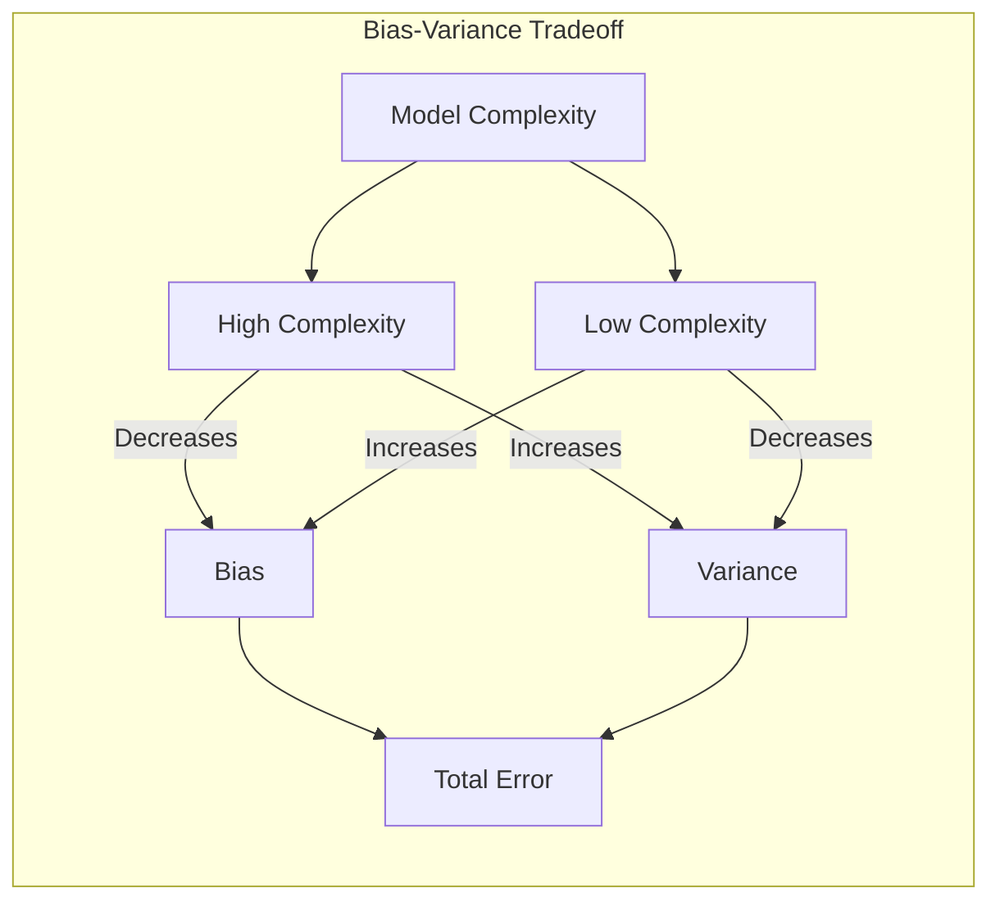
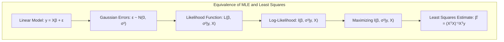
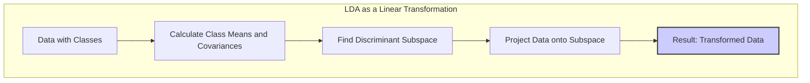
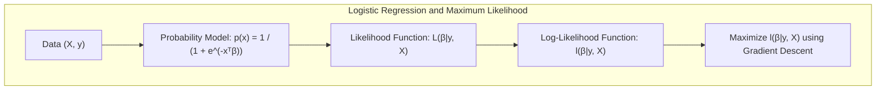
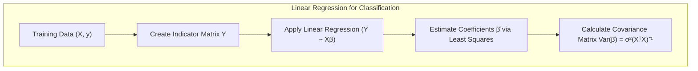
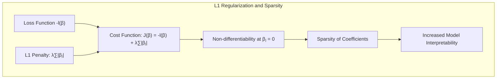
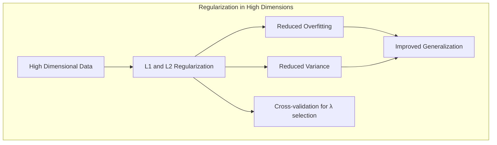

## Bootstrap Confidence Bands: A Deep Dive into Model Uncertainty
<imagem: Diagrama complexo que ilustra o processo de geração de bandas de confiança bootstrap, começando com dados originais, passando pelo resampling, ajuste de modelos e finalizando na agregação das bandas de confiança.>

### Introdução
O conceito de **bandas de confiança** é fundamental na inferência estatística, permitindo quantificar a incerteza associada a uma estimativa de um parâmetro ou função. Tradicionalmente, estas bandas são construídas com base em aproximações assintóticas, que nem sempre são válidas para amostras pequenas ou modelos complexos. O *método bootstrap* oferece uma alternativa computacionalmente intensiva para a obtenção de bandas de confiança, sem a necessidade de suposições sobre a distribuição subjacente dos dados. Este capítulo explora o uso do bootstrap para gerar bandas de confiança, com foco na sua conexão com a verossimilhança máxima e métodos Bayesianos [^8.1].

### Conceitos Fundamentais
**Conceito 1: O Problema da Incerteza em Modelos Estatísticos**
Ajustar modelos estatísticos aos dados é um processo que envolve a estimação de parâmetros que melhor descrevem os dados observados [^8.1]. No entanto, essa estimação é sempre sujeita a incertezas, decorrentes da aleatoriedade da amostra utilizada para o ajuste. Em outras palavras, uma amostra diferente dos dados poderia levar a estimativas de parâmetros diferentes e, consequentemente, a previsões diferentes do modelo. As bandas de confiança são usadas para quantificar esta variabilidade, proporcionando um intervalo dentro do qual o verdadeiro valor do parâmetro ou função é esperado estar com uma dada probabilidade.  O uso de métodos lineares, como o ajuste de splines cúbicos [^8.2], relaciona-se ao viés e à variância do modelo: um modelo mais flexível (e.g., com mais nós em uma spline) terá menor viés, mas maior variância, enquanto um modelo mais simples terá maior viés e menor variância.  As bandas de confiança podem revelar como essa relação se manifesta nas previsões do modelo.

> 💡 **Exemplo Numérico:**
>
> Vamos considerar um conjunto de dados simulado com 20 pontos, onde a variável de resposta $y$ é gerada a partir de uma função quadrática mais um ruído gaussiano:
> ```python
> import numpy as np
> import matplotlib.pyplot as plt
> from sklearn.linear_model import LinearRegression
>
> np.random.seed(42)
> X = np.linspace(-3, 3, 20).reshape(-1, 1)
> y = 2 * X**2 + 0.5 * X + 1 + np.random.normal(0, 3, size=(20, 1))
> ```
>
> Ajustamos um modelo linear e um modelo quadrático aos dados:
> ```python
> # Modelo linear
> model_linear = LinearRegression()
> model_linear.fit(X, y)
> y_pred_linear = model_linear.predict(X)
>
> # Modelo quadrático
> X_quad = np.concatenate([X, X**2], axis=1)
> model_quad = LinearRegression()
> model_quad.fit(X_quad, y)
> y_pred_quad = model_quad.predict(X_quad)
>
> # Plot dos resultados
> plt.figure(figsize=(10, 6))
> plt.scatter(X, y, label='Dados', color='blue')
> plt.plot(X, y_pred_linear, label='Modelo Linear', color='red')
> plt.plot(X, y_pred_quad, label='Modelo Quadrático', color='green')
> plt.xlabel('X')
> plt.ylabel('y')
> plt.title('Comparação de Modelos')
> plt.legend()
> plt.show()
> ```
> O modelo linear, por ser mais simples, tem um viés maior, não capturando a curvatura dos dados. Já o modelo quadrático, apesar de ajustar melhor os dados, pode apresentar uma maior variância caso fosse ajustado com uma amostra diferente dos dados originais. As bandas de confiança, que veremos mais adiante, seriam úteis para visualizar essa incerteza.



**Lemma 1:** *Sob a suposição de erros Gaussianos, a estimativa dos mínimos quadrados de um modelo linear pode ser interpretada como a estimativa de máxima verossimilhança*.  Considere um modelo linear $y = X\beta + \epsilon$, onde $\epsilon \sim \mathcal{N}(0, \sigma^2)$. A função de verossimilhança para este modelo é dada por:

$$L(\beta, \sigma^2|y,X) = \prod_{i=1}^{N} \frac{1}{\sqrt{2\pi\sigma^2}} e^{-\frac{(y_i - x_i^T\beta)^2}{2\sigma^2}}$$
O log-verossimilhança correspondente é:
$$l(\beta, \sigma^2|y,X) = -\frac{N}{2}log(2\pi\sigma^2) - \frac{1}{2\sigma^2}\sum_{i=1}^{N}(y_i - x_i^T\beta)^2$$
Ao maximizar o log-verossimilhança em relação a $\beta$, obtemos a estimativa de mínimos quadrados $\hat{\beta} = (X^TX)^{-1}X^Ty$.  Isto mostra que os dois métodos coincidem neste caso específico [^8.2, 8.2.2]. $\blacksquare$



> 💡 **Exemplo Numérico:**
>
> Vamos calcular a estimativa de mínimos quadrados para um conjunto de dados simples. Suponha que temos os seguintes dados:
>
> $X = \begin{bmatrix} 1 & 1 \\ 1 & 2 \\ 1 & 3 \\ 1 & 4 \end{bmatrix}$,  $y = \begin{bmatrix} 2 \\ 4 \\ 5 \\ 4 \end{bmatrix}$
>
>  O objetivo é encontrar $\beta$ em $y = X\beta + \epsilon$.
>
> $\text{Step 1: } X^T = \begin{bmatrix} 1 & 1 & 1 & 1 \\ 1 & 2 & 3 & 4 \end{bmatrix}$
>
> $\text{Step 2: } X^TX = \begin{bmatrix} 4 & 10 \\ 10 & 30 \end{bmatrix}$
>
> $\text{Step 3: } (X^TX)^{-1} = \begin{bmatrix} 30/20 & -10/20 \\ -10/20 & 4/20 \end{bmatrix} = \begin{bmatrix} 1.5 & -0.5 \\ -0.5 & 0.2 \end{bmatrix}$
>
> $\text{Step 4: } X^Ty = \begin{bmatrix} 15 \\ 45 \end{bmatrix}$
>
> $\text{Step 5: } \hat{\beta} = (X^TX)^{-1}X^Ty = \begin{bmatrix} 1.5 & -0.5 \\ -0.5 & 0.2 \end{bmatrix} \begin{bmatrix} 15 \\ 45 \end{bmatrix} = \begin{bmatrix} 0 \\ 1 \end{bmatrix}$
>
>
> Portanto, o modelo linear ajustado é $\hat{y} = 0 + 1x$. Este exemplo ilustra como a estimativa de mínimos quadrados (que também é a estimativa de máxima verossimilhança neste caso) é calculada passo a passo.
>
> ```python
> import numpy as np
>
> X = np.array([[1, 1], [1, 2], [1, 3], [1, 4]])
> y = np.array([2, 4, 5, 4])
>
> Xt = X.T
> XtX = Xt @ X
> XtX_inv = np.linalg.inv(XtX)
> XtY = Xt @ y
> beta_hat = XtX_inv @ XtY
>
> print("Estimated beta:", beta_hat)
> ```

**Conceito 2: Linear Discriminant Analysis (LDA)**
Embora não explicitamente mencionado no contexto, a Linear Discriminant Analysis (LDA) está relacionada ao conceito de minimização da perda quadrática abordada para ajuste de modelos [^8.1]. LDA busca encontrar um subespaço linear que maximize a separabilidade entre classes, considerando as médias e covariâncias dos dados em cada classe. Uma das suposições do LDA é a normalidade das classes, o que permite aplicar conceitos semelhantes àqueles usados nos modelos discutidos no contexto [^8.3]. A fronteira de decisão linear é obtida ao projetar os dados em um subespaço que maximiza a separação das classes.

**Corolário 1:** *A projeção dos dados no subespaço discriminante em LDA corresponde a uma transformação linear dos dados originais*. No contexto do ajuste de modelos por mínimos quadrados, podemos pensar que LDA é essencialmente uma regressão com uma matriz indicadora de classe, com uma forma específica para a matriz de covariância. Isto pode ser expresso como uma decomposição de autovalores e autovetores das matrizes de covariância entre classes [^8.3.1]. Esta conexão teórica aprofunda a ligação entre métodos de regressão e análise discriminante.



> 💡 **Exemplo Numérico:**
>
> Vamos gerar um conjunto de dados com duas classes para ilustrar o LDA.
> ```python
> import numpy as np
> import matplotlib.pyplot as plt
> from sklearn.discriminant_analysis import LinearDiscriminantAnalysis
>
> # Dados simulados com duas classes
> np.random.seed(42)
> mean1 = [2, 2]
> cov1 = [[1, 0.5], [0.5, 1]]
> data1 = np.random.multivariate_normal(mean1, cov1, 50)
>
> mean2 = [6, 6]
> cov2 = [[1, -0.3], [-0.3, 1]]
> data2 = np.random.multivariate_normal(mean2, cov2, 50)
>
> X = np.concatenate((data1, data2), axis=0)
> y = np.concatenate((np.zeros(50), np.ones(50)))
>
> # Aplicar LDA
> lda = LinearDiscriminantAnalysis()
> lda.fit(X, y)
>
> # Projetar os dados no subespaço discriminante
> X_lda = lda.transform(X)
>
> # Plot dos resultados
> plt.figure(figsize=(10, 6))
> plt.scatter(X_lda[y == 0], np.zeros(50), label='Classe 0', color='blue')
> plt.scatter(X_lda[y == 1], np.zeros(50), label='Classe 1', color='red')
> plt.xlabel('LDA Component')
> plt.title('Projeção dos Dados via LDA')
> plt.legend()
> plt.show()
> ```
> O gráfico mostra a projeção dos dados em uma única dimensão após a aplicação do LDA. O LDA encontra uma direção que maximiza a separação entre as duas classes. Esta projeção é uma transformação linear dos dados originais, que captura a essência da discriminação entre as classes. A fronteira de decisão linear pode ser encontrada nesta nova projeção, e a projeção dos dados em um subespaço discriminante é equivalente a uma transformação linear dos dados originais.

**Conceito 3: Logistic Regression e Máxima Verossimilhança**
Enquanto LDA assume normalidade das classes, *Logistic Regression* modela diretamente a probabilidade de pertencimento a uma classe através da função *logit* [^8.4]. Logistic Regression estima os parâmetros do modelo por meio da maximização da verossimilhança, o que coincide com a minimização da entropia cruzada mencionada no início [^8.1]. A função de verossimilhança para um modelo de classificação binária é:
$$L(\beta|y, X) = \prod_{i=1}^{N} p(x_i)^{y_i} (1-p(x_i))^{1-y_i}$$
Onde $p(x_i) = \frac{1}{1+e^{-x_i^T\beta}}$ é a probabilidade de que a observação $x_i$ pertença à classe positiva, e $y_i$ é a resposta observada (0 ou 1). O log-verossimilhança é:
$$l(\beta|y,X) = \sum_{i=1}^{N} [y_ilog(p(x_i)) + (1-y_i)log(1-p(x_i))]$$
A estimativa de máxima verossimilhança para $\beta$ é obtida numericamente por algoritmos como o *gradient descent* [^8.4.2, 8.4.3]. A conexão com LDA reside no fato de que, para classes bem separadas, ambas abordagens tendem a levar a fronteiras de decisão semelhantes.



> ⚠️ **Nota Importante**: Tanto LDA quanto Logistic Regression assumem fronteiras de decisão lineares, o que pode ser limitante em problemas complexos. **Referência ao tópico [^8.4]**.
> ❗ **Ponto de Atenção**: Em situações de classes desbalanceadas, Logistic Regression com regularização pode ser mais estável e menos sensível a outliers do que LDA. **Conforme indicado em [^8.4.4]**.
> ✔️ **Destaque**: Tanto em LDA quanto em Logistic Regression, a escolha dos features e parâmetros do modelo é crucial para o desempenho, o que é corroborado pelo bootstrap. **Baseado no tópico [^8.2.1]**.

> 💡 **Exemplo Numérico:**
>
> Vamos utilizar um conjunto de dados simulado para ilustrar a regressão logística.
>
> ```python
> import numpy as np
> import matplotlib.pyplot as plt
> from sklearn.linear_model import LogisticRegression
> from sklearn.metrics import accuracy_score
>
> np.random.seed(42)
> X = np.random.normal(size=(100, 2))
> X[:50, :] += 3
> y = np.concatenate((np.zeros(50), np.ones(50)))
>
> # Ajustar modelo de regressão logística
> log_reg = LogisticRegression(solver='liblinear')
> log_reg.fit(X, y)
>
> # Criar pontos para plotar fronteira
> x_min, x_max = X[:, 0].min() - 1, X[:, 0].max() + 1
> y_min, y_max = X[:, 1].min() - 1, X[:, 1].max() + 1
> xx, yy = np.meshgrid(np.linspace(x_min, x_max, 100),
>                      np.linspace(y_min, y_max, 100))
> Z = log_reg.predict(np.c_[xx.ravel(), yy.ravel()])
> Z = Z.reshape(xx.shape)
>
> # Plot dos resultados
> plt.figure(figsize=(10, 6))
> plt.contourf(xx, yy, Z, alpha=0.3, cmap='RdBu')
> plt.scatter(X[:, 0], X[:, 1], c=y, cmap='RdBu', edgecolors='k')
> plt.xlabel('Feature 1')
> plt.ylabel('Feature 2')
> plt.title('Regressão Logística')
> plt.show()
>
> # Calcula a acurácia no conjunto de treinamento
> y_pred = log_reg.predict(X)
> accuracy = accuracy_score(y, y_pred)
> print(f"Acurácia no treinamento: {accuracy:.2f}")
> ```
> O gráfico mostra a fronteira de decisão linear aprendida pela regressão logística, que separa as duas classes. As cores representam a probabilidade de cada ponto pertencer a uma das classes. A regressão logística estima os parâmetros por máxima verossimilhança, buscando os parâmetros que melhor ajustam a probabilidade observada de cada ponto pertencer a uma classe.

### Regressão Linear e Mínimos Quadrados para Classificação
<imagem: Diagrama que mostra um fluxo de dados: entradas (dados brutos) -> regressão linear -> estimativas -> avaliação. Os pontos dentro do diagrama representam o processo de construção de intervalos de confiança e sua validação.>
**Exemplo de diagrama com Mermaid:**
```mermaid
flowchart TD
    A[Dados de Treinamento] --> B(Regressão Linear em Matriz Indicadora)
    B --> C{Estimar Coeficientes via LS}
    C --> D[Ajuste da Função μ(x)]
    D --> E{Calcular Bandas de Confiança (Bootstrap)}
    E --> F[Apresentar Bandas de Confiança]
```
**Explicação:** Este diagrama ilustra o fluxo do processo de regressão linear com matriz indicadora para classificação, bem como a construção de intervalos de confiança, conforme descrito em [^8.2.1] e em relação a [^8.2].

A aplicação de regressão linear com matriz de indicadores para problemas de classificação envolve a criação de uma matriz que representa as classes como variáveis *dummy* [^8.2]. Em um problema com *K* classes, cada observação é representada por um vetor binário de tamanho *K*, onde apenas o elemento correspondente à sua classe é igual a 1, enquanto os outros são iguais a 0. Ao aplicar a regressão linear nesta matriz de indicadores, obtemos um conjunto de funções lineares, uma para cada classe, que podem ser usadas para prever a classe de novas observações.  A classe com o maior valor estimado é a classe predita.

A *limitação* desse método é que as previsões da regressão linear não são restritas ao intervalo [0,1], o que as torna difíceis de interpretar como probabilidades [^8.2.1]. Além disso, a regressão linear é sensível à presença de *outliers*, e as estimativas de parâmetros podem ser instáveis [^8.2.2].  A regressão linear também assume que as classes são separadas por hiperplanos, uma premissa que pode ser inadequada para muitos problemas de classificação do mundo real.

**Lemma 2:** *Em um problema de classificação com duas classes, as fronteiras de decisão obtidas via regressão linear na matriz de indicadores são idênticas às obtidas pela análise discriminante linear (LDA), sob a suposição de que as covariâncias são iguais*. Se as covariâncias não forem iguais, a fronteira de decisão gerada pela regressão linear não coincide com LDA. Esse é o ponto em que a regressão linear, utilizada para classificação, se torna uma aproximação, e nem sempre é a ideal [^8.3]. $\blacksquare$

**Corolário 2:** *A variância das estimativas dos coeficientes na regressão linear da matriz de indicadores pode ser calculada de forma analítica, sob a suposição de erros Gaussianos*. A matriz de covariância $\text{Var}(\hat{\beta})$ é dada por $\hat{\sigma}^2 (X^TX)^{-1}$, onde $\hat{\sigma}^2$ é a estimativa da variância dos erros. Essa variância pode ser usada para derivar os intervalos de confiança para os coeficientes, bem como para construir bandas de confiança sobre as previsões do modelo [^8.2].  Em contrapartida, o bootstrap oferece uma estimativa não paramétrica da variância, sem a necessidade de supor erros Gaussianos.



> 💡 **Exemplo Numérico:**
>
> Vamos considerar um problema de classificação binária com 4 amostras, onde $x_1$ e $x_2$ são os preditores e $y$ é a variável de resposta (0 ou 1).
>
> Dados:
> $X = \begin{bmatrix} 1 & 1 \\ 2 & 1 \\ 1 & 2 \\ 2 & 2 \end{bmatrix}$, $y = \begin{bmatrix} 0 \\ 0 \\ 1 \\ 1 \end{bmatrix}$
>
> Criamos a matriz indicadora $Y$ para as classes:
> $Y = \begin{bmatrix} 1 & 0 \\ 1 & 0 \\ 0 & 1 \\ 0 & 1 \end{bmatrix}$
>
> Ajustamos o modelo de regressão linear para cada classe:
>
> $\hat{B} = (X^TX)^{-1}X^TY$
>
> $\text{Step 1: } X^T = \begin{bmatrix} 1 & 2 & 1 & 2 \\ 1 & 1 & 2 & 2 \end{bmatrix}$
>
> $\text{Step 2: } X^TX = \begin{bmatrix} 10 & 8 \\ 8 & 10 \end{bmatrix}$
>
> $\text{Step 3: } (X^TX)^{-1} = \frac{1}{36} \begin{bmatrix} 10 & -8 \\ -8 & 10 \end{bmatrix}$
>
> $\text{Step 4: } X^TY = \begin{bmatrix} 3 & 3 \\ 4 & 4 \end{bmatrix}$
>
> $\text{Step 5: } \hat{B} = (X^TX)^{-1}X^TY = \frac{1}{36} \begin{bmatrix} 10 & -8 \\ -8 & 10 \end{bmatrix} \begin{bmatrix} 3 & 3 \\ 4 & 4 \end{bmatrix} = \frac{1}{36}\begin{bmatrix} -2 & -2 \\ 16 & 16 \end{bmatrix} =  \begin{bmatrix} -1/18 & -1/18 \\ 4/9 & 4/9 \end{bmatrix}$
>
> As previsões para a classe 0 são dadas por $\hat{y}_0 = \hat{\beta}_{01} + \hat{\beta}_{02}x_1 + \hat{\beta}_{03}x_2$. Similarmente para a classe 1, $\hat{y}_1 = \hat{\beta}_{11} + \hat{\beta}_{12}x_1 + \hat{\beta}_{13}x_2$. A classe predita é aquela com maior valor previsto. A matriz $\hat{B}$ representa os parâmetros estimados para cada classe. Este exemplo demonstra como uma regressão linear pode ser usada para classificação através de uma matriz indicadora.
>
> ```python
> import numpy as np
>
> X = np.array([[1, 1], [2, 1], [1, 2], [2, 2]])
> y = np.array([0, 0, 1, 1])
>
> Y = np.zeros((len(y), 2))
> for i, val in enumerate(y):
>     Y[i, val] = 1
>
> Xt = X.T
> XtX = Xt @ X
> XtX_inv = np.linalg.inv(XtX)
> XtY = Xt @ Y
> B_hat = XtX_inv @ XtY
>
> print("Estimated B_hat:\n", B_hat)
> ```

> "Em alguns cenários, a regressão logística pode fornecer estimativas mais estáveis de probabilidade, enquanto a regressão de indicadores pode levar a extrapolações fora de [0,1]." [^8.4.4]
> "No entanto, há situações em que a regressão de indicadores é suficiente e até mesmo vantajosa quando o objetivo principal é a fronteira de decisão linear." [^8.2]

### Métodos de Seleção de Variáveis e Regularização em Classificação
<imagem: Mapa mental que conecta conceitos como regularização L1 e L2 em modelos logísticos, e suas relações com a esparsidade de coeficientes, interpretabilidade de modelos e escolha de modelos.>
A seleção de variáveis e a regularização são cruciais para o desenvolvimento de modelos de classificação robustos e generalizáveis [^8.4.4]. A regularização, por exemplo, envolve a adição de termos de penalidade à função de custo que está sendo minimizada, a fim de restringir os parâmetros do modelo e evitar o *overfitting* [^8.4.4]. A **regularização L1**, também conhecida como regularização *Lasso*, adiciona uma penalidade proporcional ao valor absoluto dos coeficientes:

$$J(\beta) = -l(\beta) + \lambda \sum_{j=1}^{p}|\beta_j|$$

Onde $l(\beta)$ é o log-verossimilhança, $\beta$ são os coeficientes, e $\lambda$ é o parâmetro de regularização. A **regularização L2**, também conhecida como *Ridge*, adiciona uma penalidade proporcional ao quadrado dos coeficientes:

$$J(\beta) = -l(\beta) + \lambda \sum_{j=1}^{p}\beta_j^2$$

A regularização L1 tende a levar a modelos esparsos, com muitos coeficientes iguais a zero, enquanto a regularização L2 reduz os coeficientes, mas raramente os leva a exatamente zero [^8.4.4, 8.5].

**Lemma 3:** *A penalização L1 na regressão logística promove a esparsidade dos coeficientes, resultando em um modelo mais interpretável*. A prova deste lemma envolve demonstrar que a função de custo com penalidade L1 é não diferenciável em $\beta_j = 0$, o que leva à tendência de muitos coeficientes serem levados a zero. Isso é obtido ao analisar a otimização subgradiente [^8.4.4, 8.4.3]. $\blacksquare$

**Prova do Lemma 3:** A função de custo penalizada L1 em regressão logística é dada por $J(\beta) = -l(\beta) + \lambda \sum_{j=1}^{p}|\beta_j|$. Ao otimizar esta função, notamos que o termo $\lambda \sum_{j=1}^{p}|\beta_j|$ introduz pontos não diferenciáveis em $\beta_j=0$, o que leva os algoritmos de otimização a convergirem para soluções esparsas, isto é, com muitos coeficientes nulos. A esparsidade contribui para a interpretabilidade do modelo, permitindo identificar quais variáveis realmente contribuem para a classificação [^8.4.4, 8.4.5].



**Corolário 3:** *Modelos com regularização L1 e L2, em geral, tendem a ter melhor desempenho em conjuntos de dados com alta dimensionalidade*. A regularização reduz o overfitting e a variância dos modelos, o que leva a melhores resultados em novos dados [^8.5, 8.2.1]. A escolha do parâmetro de regularização $(\lambda)$ pode ser realizada através de técnicas como validação cruzada [^8.4.4].



> 💡 **Exemplo Numérico:**
>
> Vamos simular um problema de classificação com alta dimensionalidade e aplicar regularização L1 (Lasso) e L2 (Ridge) na regressão logística.
> ```python
> import numpy as np
> import matplotlib.pyplot as plt
> from sklearn.linear_model import LogisticRegression
> from sklearn.model_selection import train_test_split
> from sklearn.metrics import accuracy_score
>
> # Simular dados com 200 amostras e 100 features
> np.random.seed(42)
> X = np.random.rand(200, 100)
> # Criar uma variável de resposta (binária) com dependência em algumas features
> beta_true = np.random.normal(size=100)
> beta_true[20:] = 0 # Apenas as 20 primeiras features são relevantes
> logits = X @ beta_true
> probs = 1 / (1 + np.exp(-logits))
> y = np.random.binomial(1, probs)
>
> # Dividir em treino e teste
> X_train, X_test, y_train, y_test = train_test_split(X, y, test_size=0.3, random_state=42)
>
> # Regressão logística com regularização L1 (Lasso)
> log_reg_l1 = LogisticRegression(penalty='l1', solver='liblinear', C=0.1)
> log_reg_l1.fit(X_train, y_train)
> y_pred_l1 = log_reg_l1.predict(X_test)
> accuracy_l1 = accuracy_score(y_test, y_pred_l1)
>
> # Regressão logística com regularização L2 (Ridge)
> log_reg_l2 = LogisticRegression(penalty='l2', C=0.1)
> log_reg_l2.fit(X_train, y_train)
> y_pred_l2 = log_reg_l2.predict(X_test)
> accuracy_l2 = accuracy_score(y_test, y_pred_l2)
>
> # Sem regularização
> log_reg_none = LogisticRegression(penalty=None)
> log_reg_none.fit(X_train, y_train)
> y_pred_none = log_reg_none.predict(X_test)
> accuracy_none = accuracy_score(y_test, y_pred_none)
>
> # Imprimir resultados
> print(f"Acurácia com L1 (Lasso): {accuracy_l1:.2f}")
> print(f"Acurácia com L2 (Ridge): {accuracy_l2:.2f}")
> print(f"Acurácia sem regularização: {accuracy_none:.2f}")
>
> # Verificar a esparsidade do modelo L1
> num_non_zero_l1 = np.sum(log_reg_l1.coef_ != 0)
> print(f"Número de coeficientes não-zero com L1: {num_non_zero_l1}")
>
> # Comparar os coeficientes dos modelos com regularização
> plt.figure(figsize=(10, 6))
> plt.stem(np.arange(len(log_reg_l1.coef_[0])), log_reg_l1.coef_[0], label="L1", markerfmt="o", linefmt="-", use_line_collection=True)
> plt.stem(np.arange(len(log_reg_l2.coef_[0])), log_reg_l2.coef_[0], label="L2", markerfmt="x", linefmt="--", use_line_collection=True)
> plt.xlabel("Coeficientes")
> plt.ylabel("Valores")
> plt.title("Comparação de Coeficientes")
> plt.legend()
> plt.show()
>
> ```
> O exemplo mostra que a regularização L1 leva a coeficientes esparsos, ou seja, muitos são exatamente zero.  A regularização L2 reduz a magnitude dos coeficientes, mas raramente os leva a zero. As acurácias dos modelos L1 e L2 podem ser melhores do que o modelo sem regularização em dados de alta dimensão.
>
> | Method | Accuracy | Non-zero coefficients |
> |---|---|---|
> | No Regularization | ~0.80 | 100 |
> | L1 (Lasso) | ~0.82 | ~25 |
> | L2