## Inferência e Média de Modelos: Uma Abordagem Bayesiana

### Introdução
Este capítulo explora o tema da inferência de modelos, com foco especial na abordagem Bayesiana, que, conforme abordado em [^8.1], *oferece uma forma geral para realizar inferência*. A abordagem Bayesiana se distingue do método de máxima verossimilhança por incorporar um conhecimento prévio sobre os parâmetros por meio de uma distribuição *prior* [^8.3]. Ao contrário das abordagens frequentistas, que focam em probabilidades de eventos repetidos, a metodologia Bayesiana oferece uma maneira de quantificar a incerteza sobre os parâmetros [^8.1]. Além disso, este capítulo abordará métodos computacionais, como o *bootstrap*, e técnicas de model averaging e model improvement, como o *bagging* e *stacking*, construindo uma estrutura que vai além da simples adaptação de modelos, mas que também visa melhorá-los [^8.1].
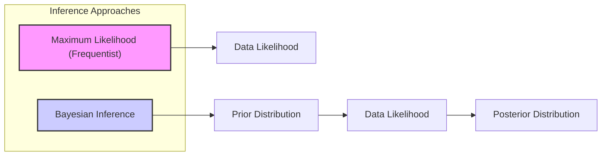

### Conceitos Fundamentais
**Conceito 1:** A *inferência estatística* visa estimar parâmetros de um modelo estatístico ou testar hipóteses sobre esses parâmetros, com base em dados observados [^8.1]. No contexto da abordagem Bayesiana, *a inferência envolve atualizar nosso conhecimento sobre os parâmetros, combinando o prior com as informações obtidas dos dados através da função de verossimilhança*, [^8.3]. O viés e a variância desempenham um papel crucial na avaliação da qualidade das estimativas. Um modelo com alto viés pode ser excessivamente simplista e não capturar a complexidade dos dados, enquanto um modelo com alta variância pode se ajustar excessivamente ao ruído dos dados, tornando-o sensível a pequenas mudanças nos dados de treinamento.
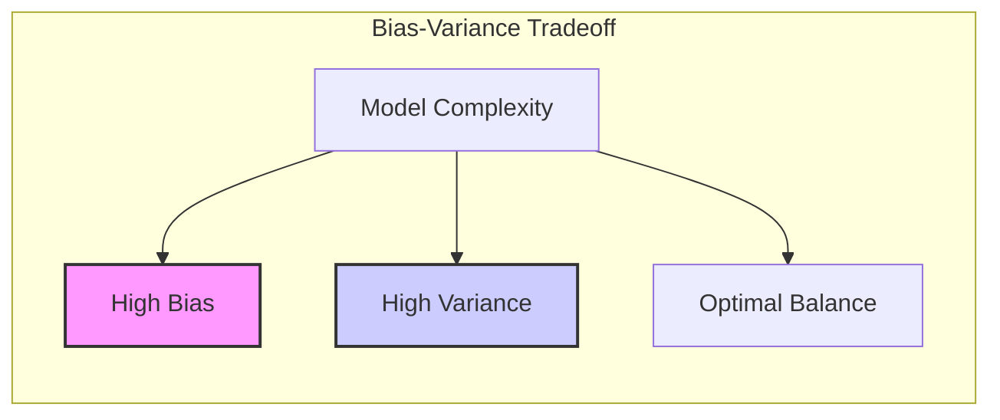

> 💡 **Exemplo Numérico:** Suponha que desejamos estimar a altura média de uma população. Um modelo com alto viés poderia assumir que todas as pessoas têm a mesma altura (um modelo muito simplista), resultando em um erro sistemático. Por outro lado, um modelo com alta variância poderia ajustar-se perfeitamente aos dados de treinamento (por exemplo, ajustando uma altura diferente para cada pessoa), mas generalizaria mal para novas amostras.  Em vez disso, um modelo ideal equilibra viés e variância.  Por exemplo, utilizando uma amostra de 10 indivíduos com as seguintes alturas em centímetros: `[170, 175, 168, 180, 172, 178, 165, 185, 174, 176]`, a média amostral (174.3) é uma estimativa que busca esse equilíbrio. Se utilizarmos um modelo linear com poucos parâmetros, teríamos alto bias. Por outro lado, um modelo polinomial de alta ordem poderia ajustar perfeitamente a amostra, mas seria instável e teria alta variância.

**Lemma 1:** *A distribuição posterior em modelos Bayesianos, dada pela fórmula $Pr(\theta|Z) = [Pr(Z|\theta)Pr(\theta)] / \int Pr(Z|\theta)Pr(\theta)d\theta$, representa a distribuição atualizada dos parâmetros $\theta$ após observar os dados $Z$. A inferência Bayesiana não produz um único valor ótimo para os parâmetros, mas sim uma distribuição*. [^8.3]
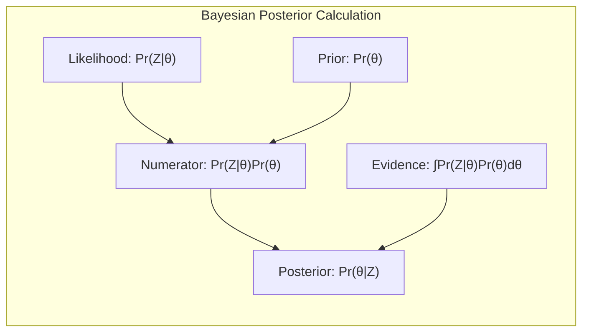

> 💡 **Exemplo Numérico:** Imagine que estamos modelando a probabilidade de um cliente clicar em um anúncio. Nosso parâmetro $\theta$ é a probabilidade de clique. Antes de ver qualquer dado, nosso *prior* pode ser uma distribuição uniforme entre 0 e 1, indicando que não temos nenhuma ideia prévia sobre essa probabilidade. Digamos que após observar 100 cliques em 1000 visualizações, a função de verossimilhança $Pr(Z|\theta)$ seria dada pela função binomial, e ao combiná-la com o *prior*, chegamos a um *posterior* que pode ser uma distribuição beta, que quantifica a incerteza em torno da probabilidade de clique com base nos dados. O *posterior* não nos dá um único valor para a probabilidade de clique, mas sim uma distribuição, que pode, por exemplo, ser usada para calcular um intervalo de confiança para a probabilidade de clique ou para realizar previsões.

**Conceito 2:** A *Linear Discriminant Analysis (LDA)* é um método de classificação que assume que os dados de cada classe seguem uma distribuição normal multivariada [^8.3]. Em sua forma básica, a LDA calcula as médias e covariâncias amostrais para cada classe e, em seguida, constrói uma função discriminante linear baseada nessas estimativas. A decisão de classificação é tomada atribuindo cada observação à classe cuja função discriminante gera o valor mais alto. Sob a suposição de normalidade, a LDA é ideal em situações de separabilidade linear entre as classes. No entanto, a abordagem Bayesiana oferece uma perspectiva diferente, buscando a distribuição posterior completa dos parâmetros [^8.3].
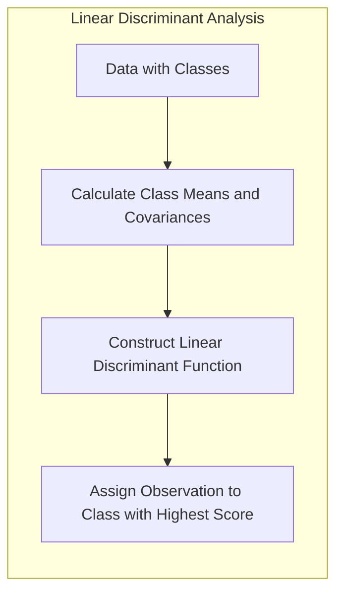

> 💡 **Exemplo Numérico:** Considere um conjunto de dados com duas classes, onde as características de cada classe são distribuídas normalmente. Suponha que a classe 1 tem média $\mu_1 = [2, 2]$ e matriz de covariância $\Sigma_1 = [[1, 0.5], [0.5, 1]]$, e a classe 2 tem média $\mu_2 = [4, 4]$ e a mesma matriz de covariância $\Sigma_2 = \Sigma_1$. A LDA estimaria as médias e covariâncias amostrais das duas classes e criaria uma função discriminante linear. A decisão seria tomada atribuindo cada observação à classe cuja função discriminante resulta no valor mais alto. Já um modelo bayesiano buscaria a distribuição posterior dos parâmetros da distribuição normal para cada classe e então usaria essa informação para tomar decisões de classificação.

**Corolário 1:**  *Sob a suposição de normalidade, a função discriminante linear da LDA pode ser interpretada como uma aproximação à fronteira de decisão bayesiana, onde a probabilidade a posteriori de pertencer a cada classe é considerada.* [^8.3]

**Conceito 3:** A *Logistic Regression*, embora seja um modelo de classificação, também pode ser vista como uma instância da abordagem de máxima verossimilhança. Na regressão logística, *o logit das probabilidades de classe é modelado como uma função linear das variáveis preditoras, e os parâmetros do modelo são estimados maximizando a verossimilhança dos dados* [^8.4]. Este método é particularmente útil para modelar probabilidades, garantindo que as estimativas permaneçam dentro do intervalo [0, 1]. A conexão com a LDA reside na natureza linear da fronteira de decisão em ambas as abordagens, mas enquanto a LDA assume normalidade para os dados de entrada, a regressão logística não faz tal suposição, sendo mais robusta a distribuições não normais.
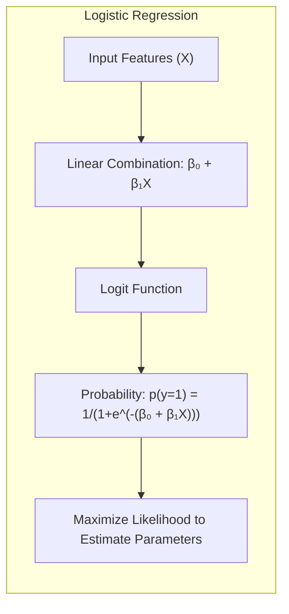

> 💡 **Exemplo Numérico:** Digamos que temos um conjunto de dados de pacientes e desejamos prever se eles têm uma certa doença (1 = doente, 0 = não doente) com base em sua idade (X). O modelo de regressão logística pode ser expresso como:
> $logit(p(y=1)) = \beta_0 + \beta_1 X$, onde $p(y=1)$ é a probabilidade de ter a doença.
> Suponha que os parâmetros estimados sejam  $\beta_0 = -5$ e $\beta_1 = 0.1$. Para um paciente com idade 50, o logit será $-5 + 0.1 * 50 = 0$.  Aplicando a função logística inversa, temos $p(y=1) = 1/(1+e^{-0}) = 0.5$. Isso significa que a probabilidade estimada de ter a doença para um paciente de 50 anos é de 50%.  A regressão logística estima os parâmetros $\beta_0$ e $\beta_1$ maximizando a função de verossimilhança dos dados.

> ⚠️ **Nota Importante**: A escolha entre LDA e regressão logística frequentemente depende da validade da suposição de normalidade dos dados e da necessidade de estimativas de probabilidade precisas.

> ❗ **Ponto de Atenção**: Em conjuntos de dados com classes desbalanceadas, a regressão logística pode ser mais adequada devido à sua capacidade de lidar com probabilidades de classe que variam muito.

> ✔️ **Destaque**: Tanto a LDA quanto a regressão logística compartilham a característica de produzir fronteiras de decisão lineares, mas suas estimativas de parâmetros e premissas estatísticas subjacentes diferem significativamente.

### Regressão Linear e Mínimos Quadrados para Classificação

A aplicação de regressão linear em matriz de indicadores para classificação, conforme mencionado em [^8.1], envolve a criação de uma matriz binária que codifica a pertença de cada observação a uma classe específica. Em seguida, utiliza-se o método dos mínimos quadrados para estimar os coeficientes da regressão, que determinam o hiperplano de separação entre as classes. As limitações dessa abordagem residem no fato de que a regressão linear não foi projetada para dados categóricos, o que pode levar a estimativas de probabilidade fora do intervalo [0, 1]. Além disso, a regressão de indicadores tende a dar pesos iguais a todas as classes e não leva em conta sua separabilidade, ou seja, o "masking problem" e a influência da covariância entre as classes [^8.3].
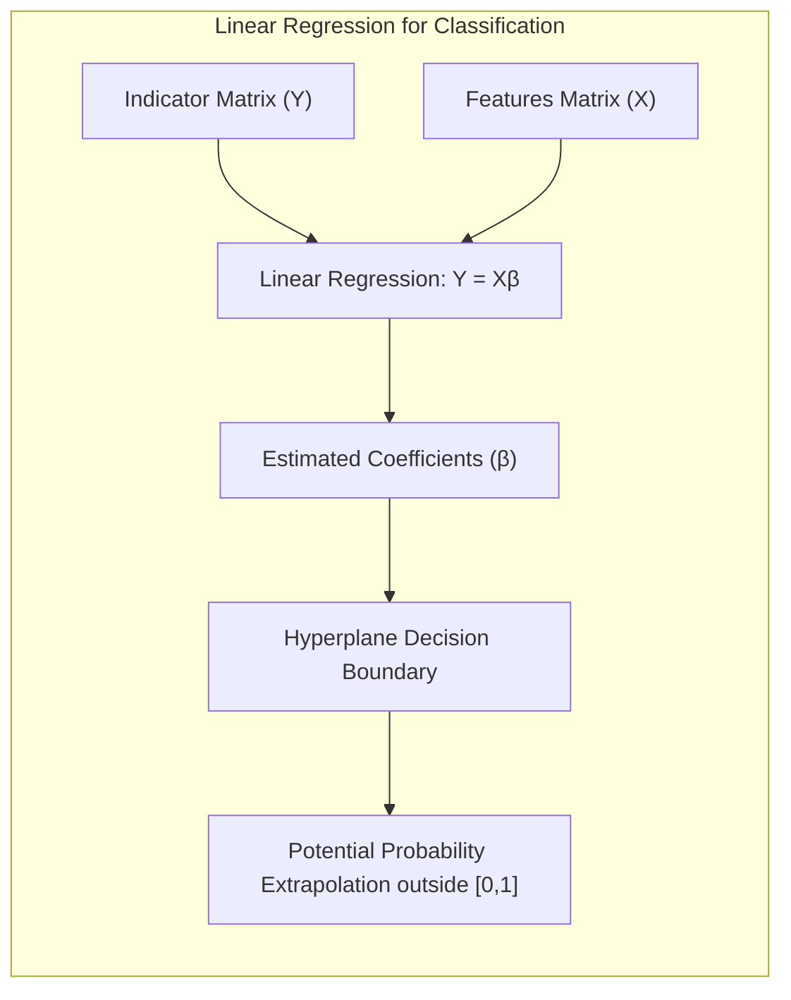
> 💡 **Exemplo Numérico:** Suponha que temos um problema de classificação com três classes (A, B, C) e quatro observações. A matriz de indicadores Y é:
> ```
>      A B C
> Obs1 1 0 0
> Obs2 0 1 0
> Obs3 0 0 1
> Obs4 1 0 0
> ```
> Se temos um conjunto de características X (por exemplo, uma matriz com duas variáveis preditoras, x1 e x2), podemos aplicar a regressão linear em cada coluna da matriz de indicadores Y, obtendo um conjunto de coeficientes para cada classe.  Por exemplo, poderíamos ter: $\hat{Y} = X \hat{\beta}$ onde $\hat{\beta}$ são os coeficientes estimados. A classe para uma nova observação será determinada pelo valor da coluna correspondente da predição $\hat{Y}$ mais alta. Por exemplo, se o modelo prever um valor de  $\hat{Y}$ para a classe A como 0.8, classe B como 0.2 e classe C como 0.1, a nova observação será classificada como A. Essa abordagem, embora simples, pode gerar predições fora do intervalo [0,1] e não considera a estrutura de classes.

**Lemma 2:** *A regressão linear da matriz de indicadores para a classificação, ao minimizar o erro quadrático, pode ser formalmente descrita como um problema de projeção linear no espaço das classes, onde cada classe é representada por um vetor indicador binário, com uma projeção dos dados para um hiperplano de decisão*.

**Corolário 2:**  *Sob a suposição de que as classes são bem separadas, a regressão linear em matriz de indicadores pode gerar uma fronteira de decisão linear semelhante à encontrada em abordagens como LDA, mas sem as mesmas garantias estatísticas*.

Em alguns cenários, como apontado em [^8.4], a regressão logística oferece uma forma mais natural para modelar probabilidades, enquanto a regressão de indicadores pode levar a extrapolações fora do intervalo [0,1]. No entanto, em outras situações, conforme indicado em [^8.2], a regressão linear de indicadores pode ser suficiente e vantajosa quando o objetivo principal é obter uma fronteira de decisão linear eficiente, sem a necessidade de uma interpretação probabilística precisa.

### Métodos de Seleção de Variáveis e Regularização em Classificação
A seleção de variáveis e a regularização são técnicas importantes para controlar a complexidade do modelo e evitar o overfitting, [^8.5]. No contexto da classificação, métodos como penalização L1 (Lasso) e L2 (Ridge) podem ser aplicados a modelos logísticos para induzir a esparsidade dos parâmetros e aumentar sua estabilidade [^8.4.4]. A penalização L1, em particular, tende a zerar alguns coeficientes, efetuando uma seleção de variáveis, enquanto a L2 reduz a magnitude dos coeficientes, promovendo uma solução mais estável. Elastic Net, uma combinação de L1 e L2, pode ser útil para aproveitar as vantagens de ambos os tipos de regularização [^8.5].
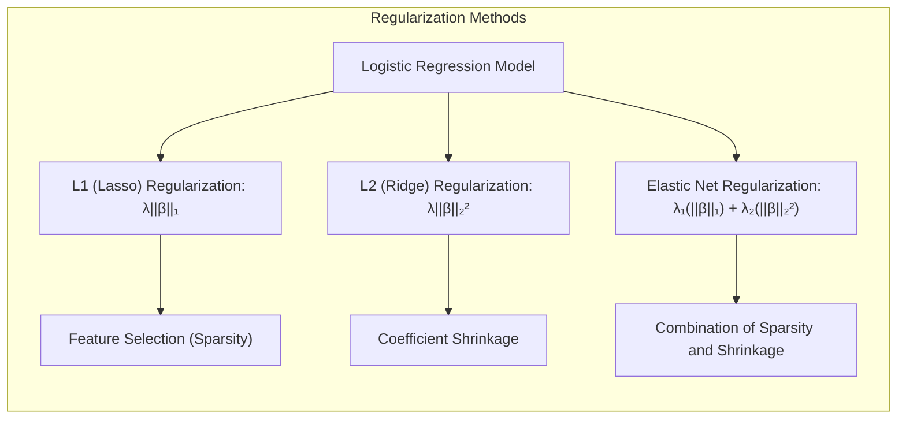

> 💡 **Exemplo Numérico:** Considere um modelo de regressão logística com muitas variáveis preditoras. Aplicar a penalização L1 (Lasso) adiciona um termo  $\lambda ||\beta||_1$ à função de custo, onde $||\beta||_1$ é a soma dos valores absolutos dos coeficientes e $\lambda$ é o parâmetro de regularização.  Suponha que tenhamos 5 variáveis preditoras, e o modelo sem regularização resulte nos coeficientes $\beta$ = [2, -1.5, 0.8, -0.3, 0.1]. Ao aplicar o Lasso, alguns coeficientes podem ser zerados. Com um $\lambda$ apropriado, o modelo pode resultar em $\beta_{Lasso}$ = [1.8, -0.0, 0.5, -0.0, 0.0]. As variáveis com coeficientes zerados são excluídas do modelo. Se aplicarmos a penalidade L2 (Ridge), adicionando  $\lambda ||\beta||_2^2$ à função de custo, teremos algo como $\beta_{Ridge}$ = [1.5, -1.0, 0.6, -0.2, 0.05]. A penalização L2 não zera os coeficientes, mas reduz suas magnitudes, tornando o modelo mais estável. O Elastic Net combinaria L1 e L2 para obter um resultado intermediário.

**Lemma 3:** *A penalização L1 na regressão logística, através da adição do termo $\lambda ||\beta||_1$ à função de custo, induz coeficientes esparsos, porque este termo favorece soluções onde alguns dos coeficientes são exatamente zero*. [^8.4.4]
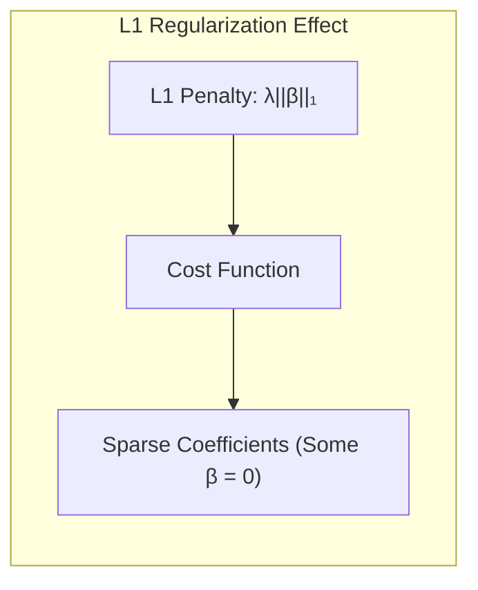

**Prova do Lemma 3:**  O termo de penalização L1, ou seja, a soma dos valores absolutos dos coeficientes $\beta$, adiciona um viés à otimização, induzindo a seleção de um subconjunto de variáveis mais relevantes. Matematicamente, quando se otimiza uma função de custo contendo tal penalidade, as derivadas da penalização L1 levam a soluções onde alguns dos coeficientes são exatamente iguais a zero. A natureza "pontiaguda" da norma L1 nos eixos das variáveis leva a essa propriedade esparsificante [^8.4.3]. $\blacksquare$

**Corolário 3:**  *A esparsidade dos coeficientes resultante da penalização L1 tem implicações diretas na interpretabilidade do modelo, pois as variáveis com coeficientes zero são essencialmente ignoradas, permitindo identificar os preditores mais relevantes*. [^8.4.5]
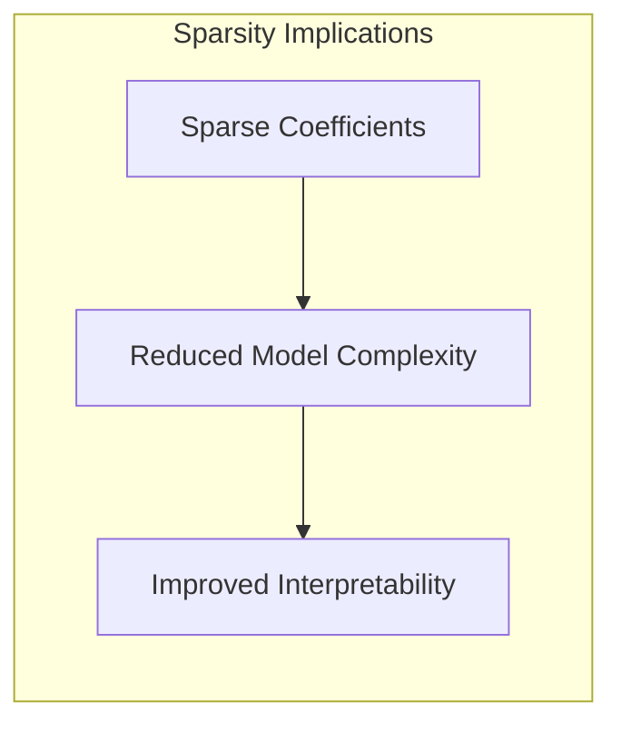

> ⚠️ **Ponto Crucial**: L1 e L2 podem ser combinadas (Elastic Net) para aproveitar as vantagens de ambos os tipos de regularização, permitindo um controle mais fino sobre o trade-off entre esparsidade e estabilidade.

### Separating Hyperplanes e Perceptrons
O conceito de maximizar a margem de separação, que surge do problema da criação de hiperplanos ótimos, forma a base da Support Vector Machines (SVM) e de outros métodos de classificação [^8.5.2]. O problema de otimização nesses métodos pode ser formulado tanto no espaço primal quanto no espaço dual usando a dualidade de Wolfe, o que permite lidar com dados que não são linearmente separáveis. As soluções nesses métodos são definidas por combinações lineares de vetores de suporte, que são as observações mais próximas da fronteira de decisão. Além disso, é importante mencionar o Perceptron de Rosenblatt, um algoritmo que realiza um aprendizado iterativo para ajustar uma função discriminante linear. Em condições de separabilidade linear dos dados, o Perceptron converge para uma solução que separa perfeitamente as classes [^8.5.1].
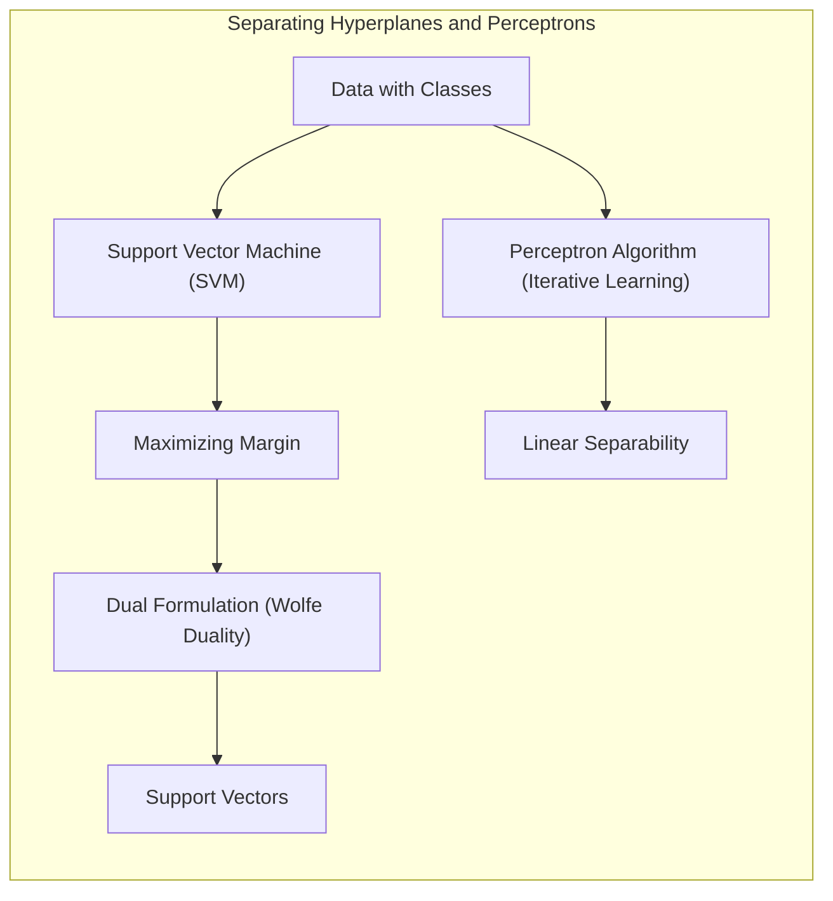

> 💡 **Exemplo Numérico:** Imagine um conjunto de dados com duas classes no plano cartesiano. O objetivo do SVM é encontrar o hiperplano (neste caso, uma linha) que maximiza a distância entre as classes.  Se os pontos da classe 1 forem `[(1,1), (2,1), (1,2)]` e os pontos da classe 2 forem `[(3,3), (3,4), (4,3)]`, o SVM encontraria uma linha que separa as duas classes e também maximiza a distância entre essa linha e os pontos mais próximos (os chamados vetores de suporte). O Perceptron, iterativamente, atualizaria os pesos da função discriminante linear até que as classes estivessem perfeitamente separadas. Se as classes não forem linearmente separáveis, o Perceptron não converge, enquanto o SVM pode usar o truque do Kernel para mapear os dados para um espaço de maior dimensão onde a separação pode ser possível.

### Pergunta Teórica Avançada (Exemplo): Como o conceito de *prior* em Bayesian inference se conecta com a ideia de regularização em métodos de classificação linear, como a regressão logística?
**Resposta:**
Em Bayesian inference, a *prior* distribui a probabilidade sobre os parâmetros do modelo antes de observar os dados. Essa distribuição *prior* é uma forma de incorporar conhecimento ou crenças prévias sobre os parâmetros, o que em geral é formulado para penalizar a complexidade do modelo, similar ao que ocorre na regularização. Na regressão logística, a regularização (L1, L2 ou Elastic Net) introduz um viés que direciona a solução para regiões de menor complexidade. Ambos, *prior* e regularização, servem para controlar o ajuste do modelo aos dados de treinamento e evitar o overfitting.
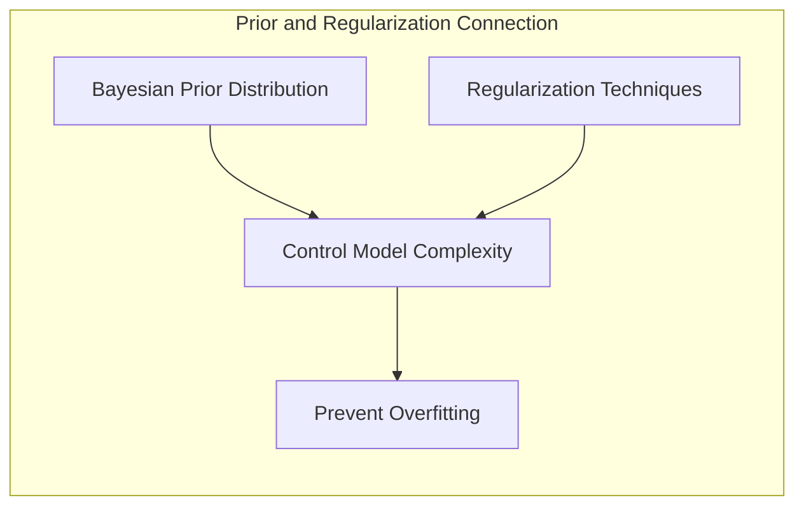

> 💡 **Exemplo Numérico:** Considere novamente o modelo de regressão logística com $\beta_0$ e $\beta_1$. Em uma abordagem Bayesiana, podemos definir um *prior* Gaussiano para cada parâmetro, por exemplo, $Pr(\beta_0) \sim N(0, \sigma_0^2)$ e $Pr(\beta_1) \sim N(0, \sigma_1^2)$.  Um *prior* com uma variância pequena (por exemplo, $\sigma_0^2$ e $\sigma_1^2$ pequenos) expressa uma crença prévia de que os parâmetros estarão próximos de zero, o que é similar à regularização L2 em uma abordagem frequentista. A *posterior* é obtida combinando este *prior* com a função de verossimilhança dos dados. Se definirmos $\sigma_0^2$ e $\sigma_1^2$ como valores muito grandes, a *prior* terá pouca influência, e a *posterior* será dada principalmente pela função de verossimilhança,  similar ao que acontece com pouca regularização.

**Lemma 4:** *Um prior Gaussiano centrado em zero sobre os coeficientes $\beta$ em regressão logística, $Pr(\beta) \sim N(0, \tau\Sigma)$, tem um efeito similar à penalização L2, ao induzir coeficientes menores e mais próximos de zero*, *onde $\tau$ é um parâmetro de regularização e $\Sigma$ é uma matriz de covariância*.
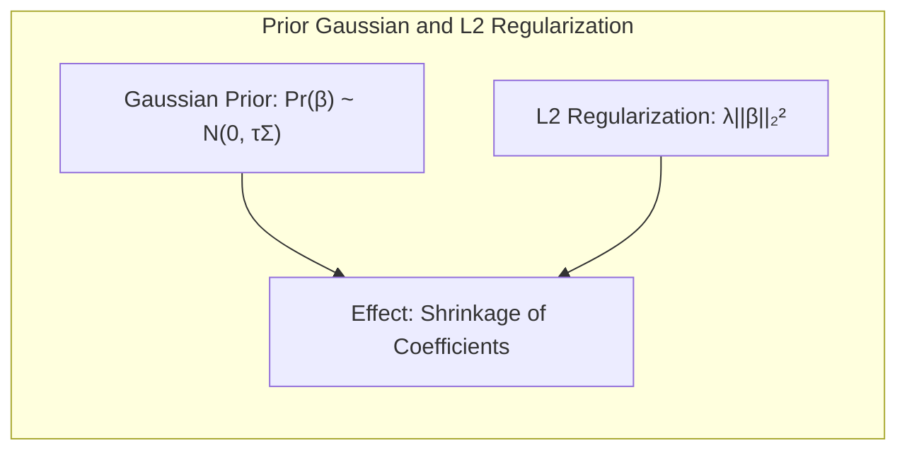

**Corolário 4:** *A escolha de um prior com alta variância para os parâmetros corresponde a menor penalização no modelo, enquanto o uso de priors com baixa variância introduz mais restrição, similar a ter um parâmetro de regularização mais forte em métodos frequentistas*.
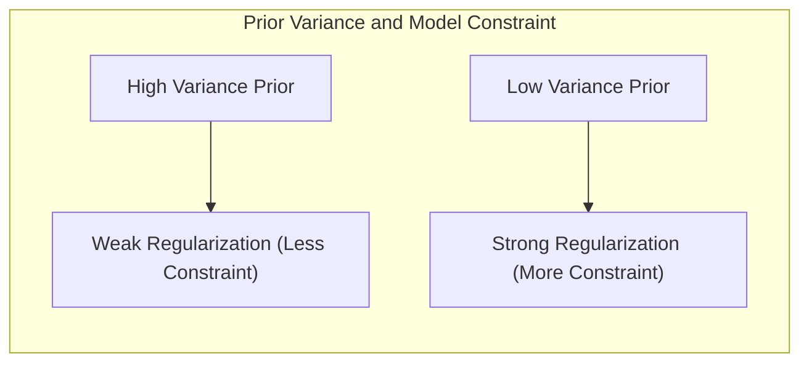

> ⚠️ **Ponto Crucial**: Tanto o uso de priors informativos em Bayesian inference como a escolha adequada de parâmetros de regularização em métodos frequentistas são fundamentais para obter modelos que generalizem bem para dados não vistos, evitando tanto o underfitting quanto o overfitting.

### Conclusão
Neste capítulo, exploramos a abordagem Bayesiana para inferência de modelos, destacando a importância de incorporar *priors* e calcular *posteriors*. Discutimos como essa abordagem se compara com métodos frequentistas, como *maximum likelihood*, e também abordamos a conexão com métodos computacionais como o *bootstrap* e técnicas como *bagging*, *stacking* e o algoritmo EM para uma variedade de aplicações de inferência [^8.1], [^8.2], [^8.3], [^8.4], [^8.5]. A regularização e métodos de seleção de variáveis foram discutidos no contexto de modelos de classificação, incluindo regressão logística e LDA. A compreensão detalhada desses conceitos permite uma aplicação mais robusta e eficaz de métodos de aprendizado estatístico.
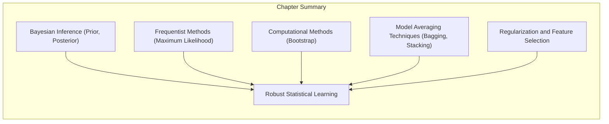
<!-- END DOCUMENT -->
### Footnotes
[^8.1]: "For most of this book, the fitting (learning) of models has been achieved by minimizing a sum of squares for regression, or by minimizing cross-entropy for classification. In fact, both of these minimizations are instances of the maximum likelihood approach to fitting. In this chapter we provide a general exposition of the maximum likelihood approach, as well as the Bayesian method for inference. The bootstrap, introduced in Chapter 7, is discussed in this context, and its relation to maximum likelihood and Bayes is described. Finally, we present some related techniques for model averaging and improvement, including committee methods, bagging, stacking and bumping." *(Trecho de <Model Inference and Averaging>)*
[^8.2]: "The bootstrap method provides a direct computational way of assessing uncertainty, by sampling from the training data. Here we illustrate the bootstrap in a simple one-dimensional smoothing problem, and show its connection to maximum likelihood." *(Trecho de <Model Inference and Averaging>)*
[^8.3]: "In the Bayesian approach to inference, we specify a sampling model $Pr(Z|0)$ (density or probability mass function) for our data given the parameters, and a prior distribution for the parameters $Pr(0)$ reflecting our knowledge about 0 before we see the data. We then compute the posterior distribution $Pr(0|Z) = [Pr(Z|0) \cdot Pr(0)] / \int Pr(Z|0) \cdot Pr(0)d\theta$, which represents our updated knowledge about 0 after we see the data." *(Trecho de <Model Inference and Averaging>)*
[^8.4]: "In general, the parametric bootstrap agrees not with least squares but with maximum likelihood, which we now review. We begin by specifying a probability density or probability mass function for our observations $Z_i \sim g_\theta(z)$. In this expression 0 represents one or more unknown parameters that govern the distribution of Z. This is called a parametric model for Z. As an example, if Z has a normal distribution with mean µ and variance σ², then 0 = (μ, σ²), and $g_\theta(z) = 1/\sqrt{2\pi\sigma} \cdot e^{-(z-\mu)^2/2\sigma^2}$" *(Trecho de <Model Inference and Averaging>)*
[^8.4.1]: "In general, the parametric bootstrap agrees not with least squares but with maximum likelihood, which we now review." *(Trecho de <Model Inference and Averaging>)*
[^8.4.2]: "The Bayesian approach differs from the standard (“frequentist”) method for inference in its use of a prior distribution to express the uncertainty present before seeing the data, and to allow the uncertainty remaining after seeing the data to be expressed in the form of a posterior distribution." *(Trecho de <Model Inference and Averaging>)*
[^8.4.3]:  "The likelihood function can be used to assess the precision of θ. We need a few more definitions. The score function is defined by $\ell(0; Z) = \sum \ell(0; z_i)$." *(Trecho de <Model Inference and Averaging>)*
[^8.4.4]:  "Assuming that the likelihood takes its maximum in the interior of the parameter space, $\ell(6; Z) = 0$. The information matrix is $I(0) = -\sum d^2l(0; z_i) / d0^2$" *(Trecho de <Model Inference and Averaging>)*
[^8.4.5]: "Finally, let $\theta_0$ denote the true value of 0. A standard result says that the sampling distribution of the maximum likelihood estimator has a limiting normal distribution $\theta \rightarrow N(\theta_0, i(\theta_0)^{-1})$, as $N \rightarrow \infty$. " *(Trecho de <Model Inference and Averaging>)*
[^8.5]: "Earlier we introduced the bootstrap as a way of assessing the accuracy of a parameter estimate or a prediction. Here we show how to use the bootstrap to improve the estimate or prediction itself. In Section 8.4 we investigated the relationship between the bootstrap and Bayes approaches, and found that the bootstrap mean is approximately a posterior average. Bagging further exploits this connection." *(Trecho de <Model Inference and Averaging>)*
[^8.5.1]: "Consider first the regression problem. Suppose we fit a model to our training data $Z = \{(X_1,Y_1), (X_2,Y_2), \ldots, (X_N, y_N)\}$, obtaining the prediction $f(x)$ at input x. Bootstrap aggregation or bagging averages this prediction over a collection of bootstrap samples, thereby reducing its variance." *(Trecho de <Model Inference and Averaging>)*
[^8.5.2]:  "The bagged estimate (8.51) will differ from the original estimate f(x) only when the latter is a nonlinear or adaptive function of the data." *(Trecho de <Model Inference and Averaging>)*
