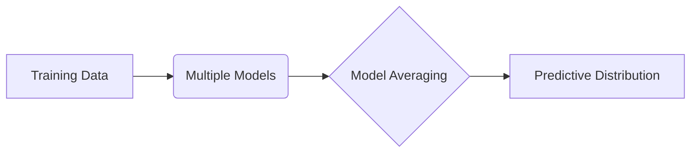
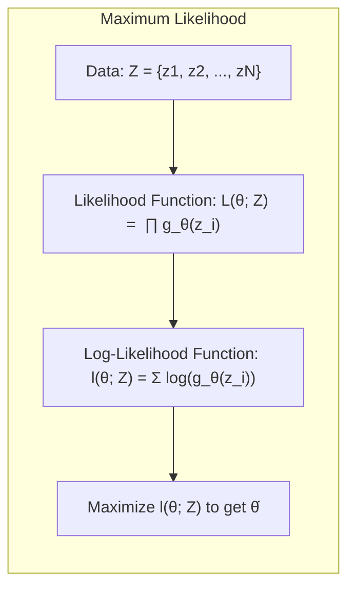
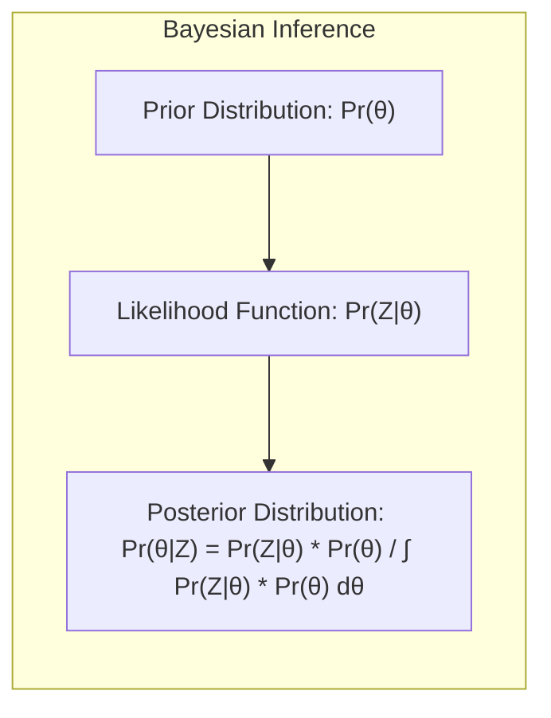
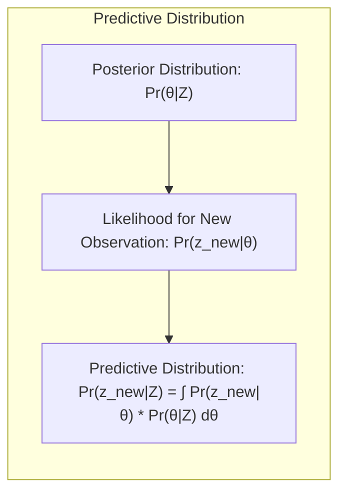
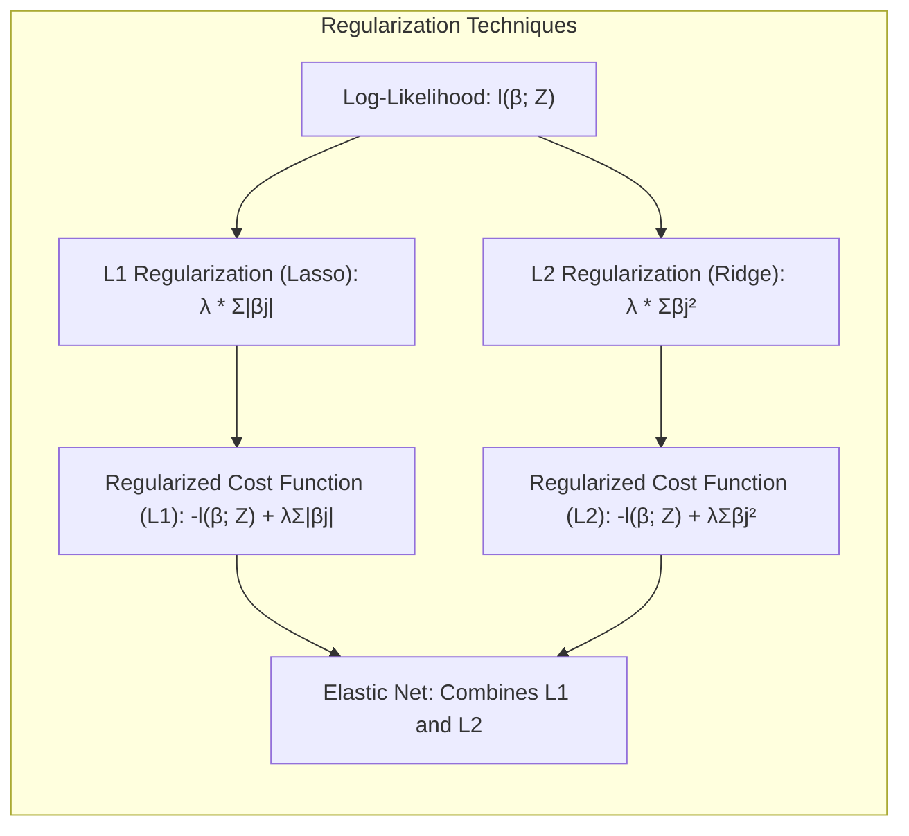
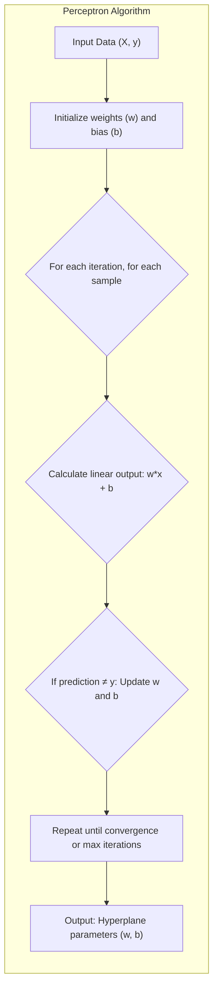
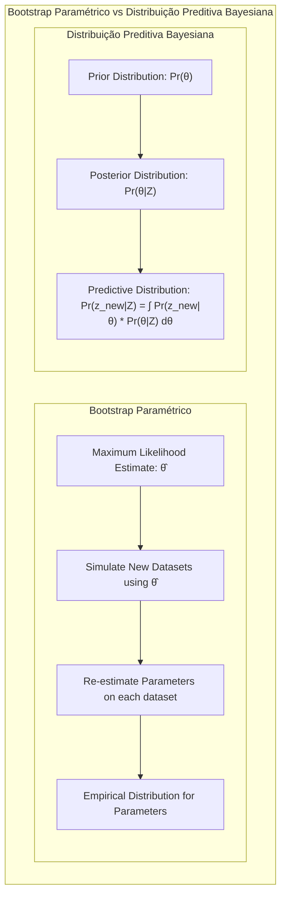

## Predictive Distribution: Model Averaging and Uncertainty Quantification



### Introdução

Este capítulo aborda a importância da **inferência e da combinação de modelos**, com foco particular na **distribuição preditiva** [^8.1]. A modelagem estatística, frequentemente, envolve a escolha e o ajuste de modelos a dados observados. No entanto, essa abordagem geralmente ignora as incertezas associadas à seleção do modelo e à estimativa de parâmetros. Este capítulo expande sobre os métodos de **maximum likelihood** [^8.1] e **Bayesian methods** [^8.1], introduzindo o conceito de **distribuições preditivas** que permitem quantificar a incerteza e melhorar as previsões. Discutiremos como técnicas como o **bootstrap**, **bagging**, e **stacking** são utilizadas para aprimorar modelos e suas previsões, e como a distribuição preditiva Bayesian fornece uma maneira natural para fazer inferências robustas, considerando todas as fontes de incerteza. O capítulo também explora o algoritmo **EM** para problemas de **maximum likelihood** [^8.5] e como o método **Markov Chain Monte Carlo (MCMC)** é usado para obter amostras de distribuições posteriores complexas [^8.6], incluindo as distribuições preditivas.

### Conceitos Fundamentais

**Conceito 1: Maximum Likelihood**

O método de **maximum likelihood (ML)** visa encontrar os parâmetros de um modelo que maximizem a verossimilhança dos dados observados [^8.1]. Em outras palavras, o objetivo é encontrar os parâmetros que tornam os dados observados o mais provável possível sob o modelo proposto. Formalmente, dado um conjunto de dados $Z = \{z_1, z_2, \ldots, z_N\}$, onde cada $z_i$ é uma observação, e um modelo paramétrico com parâmetros $\theta$, a função de verossimilhança é dada por:

$$L(\theta; Z) = \prod_{i=1}^{N} g_\theta(z_i)$$

onde $g_\theta(z_i)$ representa a densidade de probabilidade ou função de massa de probabilidade para a observação $z_i$ sob o modelo com parâmetros $\theta$ [^8.2.2]. O estimador de **maximum likelihood** é então o valor de $\theta$ que maximiza $L(\theta; Z)$. Frequentemente, para simplificar os cálculos, maximiza-se o logaritmo da verossimilhança, chamado **log-likelihood**, $l(\theta; Z) = \sum_{i=1}^{N} \log g_\theta(z_i)$ [^8.2.2]. Uma vez que o logaritmo é uma função monotônica, o valor de $\theta$ que maximiza $L(\theta; Z)$ também maximiza $l(\theta; Z)$. O método de **maximum likelihood** é amplamente utilizado por sua simplicidade e propriedades assintóticas [^8.2.2].

> 💡 **Exemplo Numérico:** Suponha que temos um conjunto de dados $Z$ de $N=5$ observações, com valores: $z = [2.1, 2.8, 3.5, 4.2, 4.9]$. Assumimos que os dados são gerados por uma distribuição normal com média $\mu$ e desvio padrão $\sigma=1$. Queremos estimar $\mu$ usando maximum likelihood. A função de verossimilhança para uma observação individual é: $g_\mu(z_i) = \frac{1}{\sqrt{2\pi}} e^{-\frac{(z_i-\mu)^2}{2}}$. A log-verossimilhança é: $l(\mu; Z) = \sum_{i=1}^N \log\left(\frac{1}{\sqrt{2\pi}} e^{-\frac{(z_i-\mu)^2}{2}}\right) = -\frac{N}{2}\log(2\pi) - \frac{1}{2}\sum_{i=1}^N(z_i-\mu)^2$. Para maximizar $l(\mu; Z)$, devemos minimizar $\sum_{i=1}^N(z_i-\mu)^2$. Calculando a derivada em relação a $\mu$ e igualando a zero, obtemos: $\hat{\mu} = \frac{1}{N}\sum_{i=1}^N z_i$. Neste exemplo, $\hat{\mu} = \frac{2.1 + 2.8 + 3.5 + 4.2 + 4.9}{5} = 3.5$. O estimador de maximum likelihood para a média é a média amostral.



**Lemma 1:** *Sob condições de regularidade*, o estimador de **maximum likelihood** é consistente, ou seja, converge para o verdadeiro valor do parâmetro à medida que o tamanho da amostra tende ao infinito. Ele também é assintoticamente normal, com variância dada pela inversa da informação de Fisher [^8.2.2].

**Conceito 2: Bayesian Methods**

Os **métodos Bayesianos** diferem dos **métodos de maximum likelihood** ao incorporar conhecimento prévio sobre os parâmetros do modelo, na forma de uma **distribuição a priori**, $Pr(\theta)$ [^8.3]. Após observar os dados, a distribuição a priori é atualizada usando a regra de Bayes, resultando na **distribuição a posteriori**, $Pr(\theta|Z)$ [^8.3]. A **distribuição a posteriori** representa a nossa crença sobre os parâmetros após ver os dados e é dada por:

$$Pr(\theta|Z) = \frac{Pr(Z|\theta) \cdot Pr(\theta)}{\int Pr(Z|\theta) \cdot Pr(\theta) \, d\theta}$$

onde $Pr(Z|\theta)$ é a função de verossimilhança [^8.3]. A **inferência Bayesiana** baseia-se nessa distribuição posterior para fazer previsões e quantificar a incerteza. Uma das vantagens do método Bayesian é que a incerteza nos parâmetros é explicitamente considerada [^8.3].

> 💡 **Exemplo Numérico:** Vamos considerar o exemplo anterior com os mesmos dados $Z = [2.1, 2.8, 3.5, 4.2, 4.9]$, mas agora usando uma abordagem bayesiana. Suponhamos que temos uma *a priori* para $\mu$ que é também uma distribuição normal com média $\mu_0 = 3$ e desvio padrão $\sigma_0 = 1$, ou seja $Pr(\mu) = \mathcal{N}(3, 1)$. A verossimilhança dos dados é $Pr(Z|\mu) = \prod_{i=1}^5 \frac{1}{\sqrt{2\pi}} e^{-\frac{(z_i-\mu)^2}{2}}$. A distribuição posterior $Pr(\mu|Z)$ é proporcional a $Pr(Z|\mu)Pr(\mu)$. Neste caso, a posterior também é uma normal com média $\mu_{posterior} = \frac{\frac{1}{\sigma_0^2}\mu_0 + \frac{N}{\sigma^2}\hat{\mu}}{\frac{1}{\sigma_0^2} + \frac{N}{\sigma^2}} = \frac{1\cdot 3 + 5\cdot 3.5}{1 + 5} = \frac{20.5}{6} \approx 3.42$ e variância $\sigma_{posterior}^2 = \frac{1}{\frac{1}{\sigma_0^2} + \frac{N}{\sigma^2}} = \frac{1}{1+5} = \frac{1}{6}$. O que significa que a nossa estimativa para $\mu$ com a informação de que a média populacional é aproximadamente 3, é 3.42 e a incerteza associada ao parâmetro é agora menor, com variância 1/6.



**Corolário 1:** A distribuição posterior $Pr(\theta|Z)$ condensa toda a informação sobre os parâmetros $\theta$ após a observação dos dados $Z$, e pode ser usada para inferência, predição e quantificação de incerteza.

**Conceito 3: Predictive Distribution**

A **distribuição preditiva**, $Pr(z_{new}|Z)$, é a distribuição de uma nova observação $z_{new}$, dado o conjunto de dados observados $Z$. No contexto Bayesiano, a **distribuição preditiva** é obtida integrando a verossimilhança de uma nova observação sobre a distribuição a posteriori dos parâmetros [^8.3]:

$$Pr(z_{new}|Z) = \int Pr(z_{new}|\theta) \cdot Pr(\theta|Z) \, d\theta$$

Essa abordagem leva em conta a incerteza tanto nos parâmetros quanto na própria observação. Ao contrário da abordagem de **maximum likelihood** que utiliza uma estimativa pontual dos parâmetros, a abordagem bayesiana propicia uma distribuição sobre os valores possíveis, o que é crucial para quantificar a incerteza e fazer previsões mais robustas [^8.3].

> 💡 **Exemplo Numérico:** Usando o exemplo anterior e assumindo uma nova observação $z_{new}$ também segue uma normal com média $\mu$ e desvio padrão $\sigma=1$, temos $Pr(z_{new}|\mu) = \mathcal{N}(\mu, 1)$. A distribuição preditiva é:
$Pr(z_{new}|Z) = \int Pr(z_{new}|\mu) Pr(\mu|Z) \, d\mu$.  Neste caso, como tanto a verossimilhança quanto a posterior são normais, a distribuição preditiva também é uma normal, com média igual à média da posterior, $\mu_{posterior} \approx 3.42$ e variância igual à soma da variância da posterior com a variância da nova observação, ou seja, $\frac{1}{6} + 1 = \frac{7}{6}$. Assim,  $Pr(z_{new}|Z) = \mathcal{N}(3.42, \sqrt{\frac{7}{6}})$. Isso nos permite ter uma ideia da distribuição provável para uma nova observação, levando em conta a incerteza na estimativa de $\mu$ e na nova observação.

> ⚠️ **Nota Importante**: A distribuição preditiva é uma ferramenta fundamental na inferência bayesiana pois fornece um quadro completo da incerteza associada a novas observações, utilizando toda informação presente nos dados e no conhecimento prévio. **Referência ao tópico [^8.3]**.

> ❗ **Ponto de Atenção**: Em contraste com abordagens frequentistas, que geralmente fornecem uma previsão pontual e uma medida de incerteza associada apenas ao estimador, a distribuição preditiva Bayesiana modela toda a incerteza, incluindo a incerteza do modelo e de seus parâmetros. **Conforme indicado em [^8.3]**.

> ✔️ **Destaque**: A distribuição preditiva é um conceito central para a inferência Bayesiana e pode ser aproximada por métodos de Monte Carlo via amostragens do posterior. **Baseado no tópico [^8.6]**.



### Regressão Linear e Mínimos Quadrados para Classificação

O ajuste de modelos lineares por mínimos quadrados é uma técnica fundamental em estatística, e pode ser relacionada com problemas de classificação, através da regressão de matrizes indicadoras [^8.2]. Dada uma amostra de dados $Z = \{(x_i, y_i)\}_{i=1}^N$, onde $x_i$ são os preditores e $y_i$ são as respostas, podemos aplicar a regressão linear para modelar a relação entre eles. No contexto de regressão linear, se usarmos uma matriz de indicadores para codificar as classes,  podemos aplicar a regressão linear para produzir estimativas de classificação. Por exemplo, em problemas de classificação com $K$ classes, pode-se criar $K$ variáveis indicadoras, onde a variável $k$ assume valor 1 se a observação pertence à classe $k$ e 0 caso contrário. Essa abordagem permite usar a regressão linear para estimar as probabilidades de cada classe para uma dada observação.

O estimador de mínimos quadrados para os coeficientes $\beta$ pode ser obtido através da minimização da soma dos quadrados dos erros:

$$ \hat{\beta} = \underset{\beta}{\text{argmin}} \sum_{i=1}^{N} (y_i - x_i^T\beta)^2 $$

Em forma matricial, essa solução pode ser expressa como:

$$ \hat{\beta} = (H^TH)^{-1}H^Ty$$

onde $H$ é a matriz de desenho e $y$ é o vetor de respostas [^8.2]. No entanto, o uso de mínimos quadrados para classificação apresenta limitações. Por exemplo, as estimativas de probabilidades obtidas pela regressão linear podem não estar necessariamente dentro do intervalo [0,1], tornando a interpretação probabilística menos direta. Além disso, essa abordagem pode ser sensível a *outliers* e não modelar adequadamente relacionamentos não-lineares [^8.2].

> 💡 **Exemplo Numérico:** Consideremos um problema de classificação com duas classes e duas variáveis preditoras. Temos os seguintes dados de treino:
>
> ```python
> import numpy as np
> from sklearn.linear_model import LinearRegression
>
> X = np.array([[1, 2], [1, 3], [2, 2], [3, 1], [3, 3]])
> y = np.array([0, 0, 1, 1, 1])
>
> # Adicionando coluna de 1's para o intercepto
> X = np.concatenate((np.ones((X.shape[0], 1)), X), axis=1)
> ```
>
> Aplicamos a regressão linear para estimar os coeficientes $\beta$:
> ```python
> # Calculando beta usando a fórmula (X^T X)^-1 X^T y
> XtX = np.dot(X.T, X)
> XtX_inv = np.linalg.inv(XtX)
> beta = np.dot(np.dot(XtX_inv, X.T), y)
> print(f"Beta: {beta}")
>
> # Usando o sklearn para comparar
> model = LinearRegression(fit_intercept=False)
> model.fit(X, y)
> print(f"Beta (sklearn): {model.coef_}")
>
> ```
>  O output nos dá o vetor $\beta$: `Beta: [-0.4  0.4  0.2]` que representa os coeficientes para intercepto, preditor 1 e preditor 2 respectivamente. Usando esse vetor, podemos estimar a probabilidade de uma nova amostra pertencer à classe 1. Por exemplo, para um novo dado $x_{new} = [2, 2]$, calculamos o score como: $-0.4 + 0.4*2 + 0.2*2 = 0.8$. Podemos usar um limiar (threshold) como 0.5 para classificar os dados.
> Note que usando esta metodologia, nada garante que as predições fiquem entre 0 e 1.
>
>
> ```mermaid
>  graph LR
>      A[Dados de Treino] --> B(Regressão Linear);
>      B --> C{Estimativa de Probabilidade};
>      C --> D[Classificação];
> ```

**Lemma 2:** Em um problema de classificação, a regressão linear sobre matrizes indicadoras pode ser vista como uma forma de encontrar um hiperplano separador entre as classes. Sob certas condições, o hiperplano obtido por regressão linear pode ser equivalente ao hiperplano obtido por outras abordagens lineares, como **Linear Discriminant Analysis (LDA)** [^8.3].

**Corolário 2:** As limitações da regressão linear para classificação motivam o uso de outros modelos como **regressão logística** e **Linear Discriminant Analysis (LDA)** que são projetados para esse tipo de problema e fornecem melhores estimativas de probabilidade de classe.

Em alguns cenários, a **regressão logística** pode fornecer estimativas mais estáveis de probabilidade, enquanto a regressão de indicadores pode levar a extrapolações fora do intervalo [0,1]. No entanto, há situações em que a regressão de indicadores, de acordo com [^8.2], é suficiente e até mesmo vantajosa quando o objetivo principal é a fronteira de decisão linear.

### Métodos de Seleção de Variáveis e Regularização em Classificação

A seleção de variáveis e a regularização são técnicas cruciais para melhorar a performance e a interpretabilidade de modelos de classificação [^8.5]. A seleção de variáveis envolve a escolha de um subconjunto de preditores relevantes, enquanto a regularização adiciona termos de penalização à função de custo para evitar *overfitting* e estabilizar as estimativas dos parâmetros [^8.4.4]. Em modelos de classificação como a **regressão logística**, a regularização L1 e L2 são comumente utilizadas.

A **regularização L1 (Lasso)** adiciona a soma dos valores absolutos dos coeficientes como termo de penalização, promovendo a esparsidade nos coeficientes e, assim, realizando a seleção de variáveis. A função de custo regularizada com L1 é dada por:

$$ \underset{\beta}{\text{min}} -l(\beta; Z) + \lambda \sum_{j=1}^{p} |\beta_j| $$

onde $l(\beta; Z)$ é o **log-likelihood** do modelo e $\lambda$ é um parâmetro de ajuste. Já a **regularização L2 (Ridge)** adiciona a soma dos quadrados dos coeficientes como termo de penalização, diminuindo a magnitude dos coeficientes e melhorando a estabilidade do modelo. A função de custo regularizada com L2 é dada por:

$$ \underset{\beta}{\text{min}} -l(\beta; Z) + \lambda \sum_{j=1}^{p} \beta_j^2 $$

A combinação das penalidades L1 e L2, chamada de **Elastic Net**, aproveita as vantagens de ambas as técnicas [^8.5]. Essa abordagem regularizada combina a capacidade do L1 de realizar seleção de variáveis com a estabilidade da L2, fornecendo um compromisso entre esparsidade e robustez.

> 💡 **Exemplo Numérico:** Vamos usar um exemplo com um problema de classificação usando regressão logística e comparar os efeitos da regularização L1 (Lasso) e L2 (Ridge) com diferentes valores de $\lambda$.

> ```python
> import numpy as np
> import pandas as pd
> from sklearn.model_selection import train_test_split
> from sklearn.linear_model import LogisticRegression
> from sklearn.preprocessing import StandardScaler
> from sklearn.metrics import accuracy_score
> import matplotlib.pyplot as plt
>
> # Criando dados sintéticos
> np.random.seed(42)
> n_samples = 200
> n_features = 10
> X = np.random.randn(n_samples, n_features)
> true_coef = np.array([3, -2, 0.5, 0, 0, 0, 0, 0, 0, 0]) # Apenas 3 features são relevantes
> y = np.random.binomial(1, 1 / (1 + np.exp(-np.dot(X, true_coef))))
>
> # Separando treino e teste
> X_train, X_test, y_train, y_test = train_test_split(X, y, test_size=0.3, random_state=42)
>
> # Padronizando as features
> scaler = StandardScaler()
> X_train_scaled = scaler.fit_transform(X_train)
> X_test_scaled = scaler.transform(X_test)
>
> # Definindo lambdas para regularização
> lambdas = [0.01, 0.1, 1, 10]
>
> results = []
>
> for penalty in ['l1', 'l2']:
>    for lmbda in lambdas:
>        model = LogisticRegression(penalty=penalty, C=1/lmbda, solver='liblinear', random_state=42)
>        model.fit(X_train_scaled, y_train)
>        y_pred = model.predict(X_test_scaled)
>        accuracy = accuracy_score(y_test, y_pred)
>        coefs = model.coef_[0]
>        results.append({'Method': f'{penalty} (lambda={lmbda})', 'Accuracy': accuracy, 'Coefficients': coefs})
>
> df_results = pd.DataFrame(results)
> print(df_results)
>
> # Comparando coeficientes para as diferentes penalidades e lambdas.
> for index, row in df_results.iterrows():
>        plt.figure(figsize=(10, 4))
>        plt.bar(range(n_features), row['Coefficients'])
>        plt.title(f"Coeficientes para {row['Method']}")
>        plt.xlabel("Feature")
>        plt.ylabel("Coefficient Value")
>        plt.show()
> ```
> A saída do código mostra as acurácias para diferentes valores de $\lambda$ e diferentes regularizações. Além disso, geramos gráficos para ver a magnitude dos coeficientes. Podemos ver como a regularização L1 leva a coeficientes nulos (esparsidade), o que faz a seleção de variáveis.
>
> ```mermaid
>  graph LR
>      A[Dados de Treino] --> B(Regressão Logística);
>      B --> C{Regularização L1/L2};
>      C --> D[Seleção de Variáveis/Estabilidade];
> ```



**Lemma 3:** A penalização L1 em modelos de classificação, como a regressão logística, leva a coeficientes esparsos, ou seja, muitos coeficientes são estimados como zero, indicando que algumas variáveis não são importantes para a classificação [^8.4.4].

**Prova do Lemma 3:** A penalização L1 adiciona a soma dos valores absolutos dos coeficientes na função de custo, ou seja, $\lambda\sum_{j=1}^p |\beta_j|$. Quando $\beta_j$ é pequeno, esta penalidade linear causa um "empurrão" para que a solução seja exatamente zero, em vez de apenas pequena. Isso leva à esparsidade dos coeficientes, pois os coeficientes irrelevantes são reduzidos a zero. $\blacksquare$

**Corolário 3:** A esparsidade induzida pela regularização L1 melhora a interpretabilidade do modelo, pois permite identificar quais variáveis são mais importantes para a classificação, além de reduzir o overfitting.

> ⚠️ **Ponto Crucial**: A escolha adequada do parâmetro de regularização $\lambda$ é fundamental, pois valores muito grandes resultam em modelos muito simples que podem sofrer de underfitting, enquanto valores muito pequenos levam ao overfitting, onde o modelo se ajusta muito bem ao conjunto de treinamento, mas tem um desempenho ruim em novos dados. **Conforme discutido em [^8.5]**.

### Separating Hyperplanes e Perceptrons

A ideia de encontrar **hiperplanos separadores** entre classes é um conceito fundamental em classificação [^8.5.2]. A busca por um hiperplano que maximize a margem entre as classes é a base para métodos como **Support Vector Machines (SVMs)**. A formulação do problema de otimização para encontrar o hiperplano de margem máxima envolve a minimização de uma função de custo sujeita a restrições que garantam a correta classificação das observações [^8.5.2]. A solução para esse problema geralmente envolve uma função de decisão que se baseia em combinações lineares de um subconjunto dos dados, chamados de vetores de suporte.

O **Perceptron de Rosenblatt** é um algoritmo simples de classificação que busca um hiperplano que separa as classes [^8.5.1]. O algoritmo Perceptron ajusta os pesos do hiperplano iterativamente, corrigindo os pesos quando uma observação é classificada incorretamente. Sob a condição de separabilidade linear dos dados, o Perceptron converge para uma solução em um número finito de passos, que separa corretamente as classes [^8.5.1]. No entanto, na presença de dados não linearmente separáveis, o Perceptron pode não convergir.

> 💡 **Exemplo Numérico:**  Vamos ilustrar o funcionamento do perceptron com um conjunto de dados simples bidimensional. Os dados consistem em pontos (x1, x2) e uma classe correspondente (0 ou 1).
>
> ```python
> import numpy as np
> import matplotlib.pyplot as plt
>
> class Perceptron:
>    def __init__(self, learning_rate=0.1, n_iterations=100):
>        self.learning_rate = learning_rate
>        self.n_iterations = n_iterations
>        self.weights = None
>        self.bias = None
>
>    def fit(self, X, y):
>        n_samples, n_features = X.shape
>        self.weights = np.zeros(n_features)
>        self.bias = 0
>
>        for _ in range(self.n_iterations):
>            for i in range(n_samples):
>                y_predicted = self.predict(X[i])
>                if y_predicted != y[i]:
>                    self.weights += self.learning_rate * (y[i] - y_predicted) * X[i]
>                    self.bias += self.learning_rate * (y[i] - y_predicted)
>
>    def predict(self, x):
>        linear_output = np.dot(x, self.weights) + self.bias
>        return 1 if linear_output >= 0 else 0
>
> # Dados de treinamento
> X = np.array([[1, 1], [2, 2], [2, 0], [0, 0], [1, 0], [0, 2]])
> y = np.array([1, 1, 1, 0, 0, 0])
>
> # Treinando o Perceptron
> perceptron = Perceptron(learning_rate=0.5, n_iterations=100)
> perceptron.fit(X,y)
>
> # Plotando o Hiperplano
> plt.figure(figsize=(8, 6))
> x1_min, x1_max = X[:, 0].min() - 1, X[:, 0].max() + 1
> x2_min, x2_max = X[:, 1].min() - 1, X[:, 1].max() + 1
> xx1, xx2 = np.meshgrid(np.arange(x1_min, x1_max, 0.1), np.arange(x2_min, x2_max, 0.1))
> Z = np.array([perceptron.predict(np.array([x1, x2])) for x1, x2 in np.c_[xx1.ravel(), xx2.ravel()]]).reshape(xx1.shape)
> plt.contourf(xx1, xx2, Z, cmap=plt.cm.RdBu, alpha=0.4)
> plt.scatter(X[:, 0], X[:, 1], c=y, cmap=plt.cm.RdBu, edgecolors='k')
> plt.xlabel("x1")
> plt.ylabel("x2")
> plt.title("Fronteira de Decisão do Perceptron")
> plt.show()
>
> #Testando com um novo dado
> new_x = np.array([1.5,1.5])
> new_class = perceptron.predict(new_x)
> print(f"A classe predita para {new_x} é {new_class}")
> ```
> O código mostra como o perceptron ajusta os pesos iterativamente até encontrar uma fronteira que separa as classes. O hiperplano é ilustrado com uma área sombreada de cores diferentes. Uma nova amostra também é classificada usando o perceptron treinado. O método Perceptron pode convergir se os dados forem linearmente separáveis.
>
> ```mermaid
>  graph LR
>      A[Dados de Treino] --> B(Perceptron);
>      B --> C{Ajuste dos Pesos};
>      C --> D[Hiperplano Separador];
> ```


### Pergunta Teórica Avançada: Quais as diferenças fundamentais entre a formulação do Bootstrap Paramétrico e a obtenção da distribuição preditiva bayesiana?

**Resposta:**
O **bootstrap paramétrico** e a **distribuição preditiva bayesiana** são abordagens distintas para lidar com a incerteza em modelagem estatística. O **bootstrap paramétrico**, conforme mencionado em [^8.2.2], parte de uma estimativa de **maximum likelihood** dos parâmetros, $\hat{\theta}$, e gera novos conjuntos de dados simulados a partir do modelo, usando $\hat{\theta}$. Cada novo conjunto de dados é usado para gerar uma nova estimativa dos parâmetros, obtendo assim uma distribuição para $\hat{\theta}$. A inferência é realizada usando essa distribuição empírica amostral.

A **distribuição preditiva Bayesiana**, por outro lado, parte de uma distribuição a priori para os parâmetros, $Pr(\theta)$ e a atualiza usando os dados observados para obter a distribuição a posteriori, $Pr(\theta|Z)$. A **distribuição preditiva** é então obtida integrando a verossimilhança de uma nova observação, condicional a cada valor possível de $\theta$, em relação à distribuição a posteriori [^8.3]. Em outras palavras:

$$Pr(z_{new}|Z) = \int Pr(z_{new}|\theta) \cdot Pr(\theta|Z) \, d\theta$$

A principal diferença reside na forma como a incerteza é modelada: o **bootstrap paramétrico** utiliza a variabilidade amostral ao redor da estimativa de **maximum likelihood** e a **distribuição preditiva bayesiana** integra a incerteza dos parâmetros na inferência usando a **distribuição a posteriori**.



**Lemma 4:** Sob condições de regularidade e quando se utiliza uma a priori não informativa, as distribuições amostrais obtidas pelo bootstrap paramétrico e as distribuições posteriores Bayesianas tendem a convergir.

**Prova do Lemma 4:** Sob uma a priori não informativa, a distribuição a posteriori é proporcional à verossimilhança. Por sua vez, a distribuição do bootstrap paramétrico também é construída com base na verossimilhança. Por isso, ambas as distribuições convergem quando as amostras são grandes [^8.4]. $\blacksquare$

**Corolário 4:** O método **MCMC** fornece uma forma de amostrar da distribuição a posteriori e assim aproximar a **distribuição preditiva Bayesiana** quando a integral da distribuição preditiva não possui forma fechada.

> ⚠️ **Ponto Crucial**: A escolha entre bootstrap paramétrico e inferência Bayesiana depende da disponibilidade de um conhecimento a priori sobre os parâmetros, e da necessidade ou não de se quantificar a incerteza dos parâmetros de forma direta. **Conforme discutido em [^8.4]**.

### Conclusão

Neste capítulo, exploramos métodos para inferência, combinação e aprimoramento de modelos estatísticos, focando no conceito crucial da **distribuição preditiva** [^8.1]. Vimos que tanto abordagens frequentistas como bayesianas podem ser usadas para esse fim, cada uma com suas próprias vantagens e limitações [^8.2]. Métodos como o bootstrap e o bagging utilizam reamostragem para obter estimativas mais robustas e quantificar a incerteza em modelos preditivos, enquanto a inferência Bayesiana fornece um framework natural para incorporar conhecimento a priori e quantificar a incerteza em modelos mais complexos [^8.3]. Ao usar uma **distribuição preditiva**, levamos em conta não apenas a melhor estimativa de um parâmetro, mas sim todo o espectro de valores possíveis dos parâmetros, além da incerteza associada a uma nova observação. Tais conceitos e ferramentas mostram-se indispensáveis para a análise de dados moderna e construção de modelos preditivos mais confiáveis e robustos [^8.8]. O capítulo também explorou como as técnicas de model averaging e stacking podem ser usadas para combinar modelos e melhorar as previsões, e como métodos de busca estocástica como o bumping podem encontrar soluções melhores no espaço de modelos [^8.9].

### Footnotes
[^8.1]: "In this chapter we provide a general exposition of the maximum likelihood approach, as well