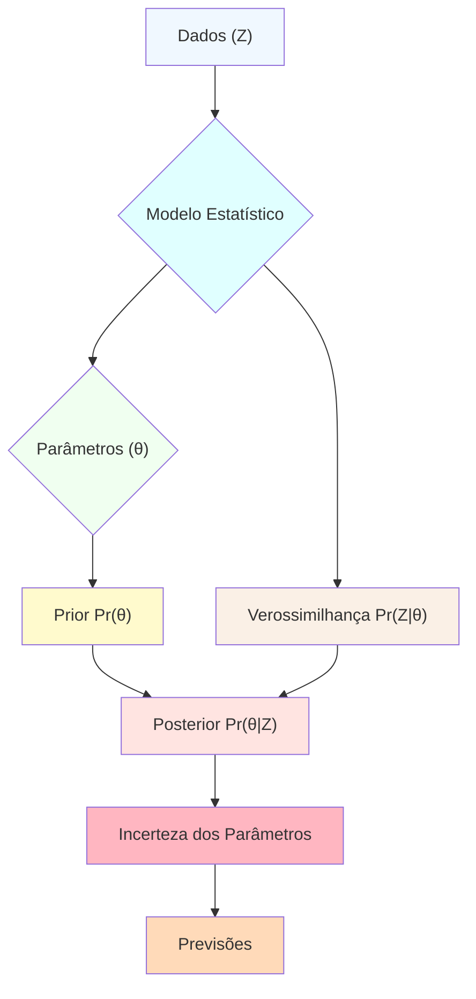
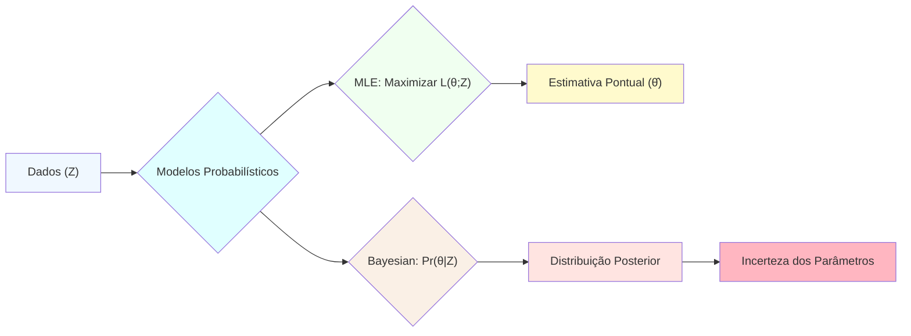
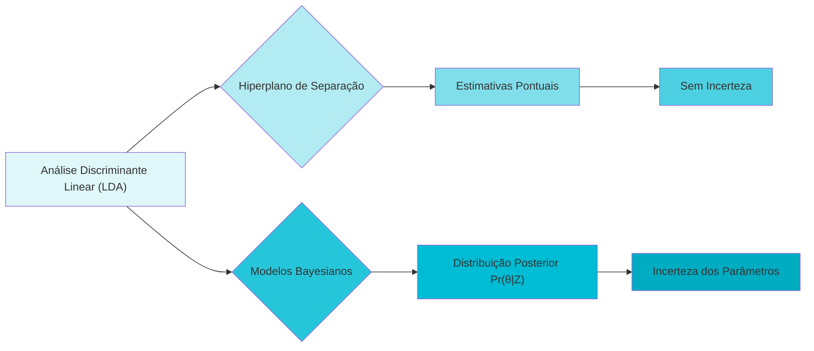
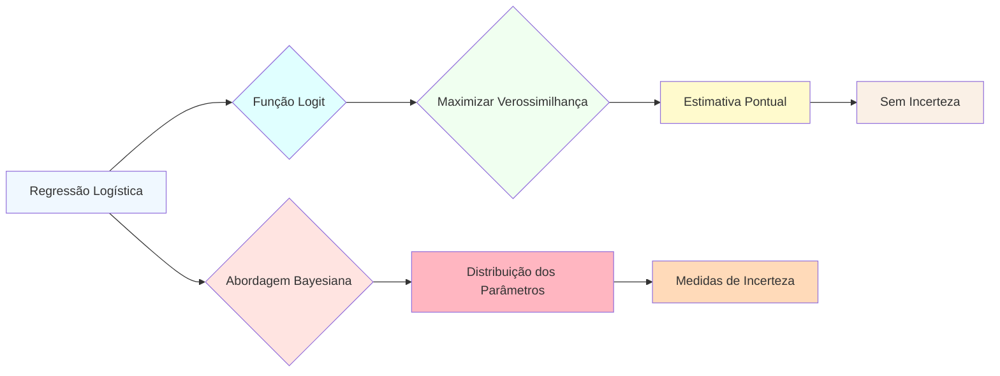
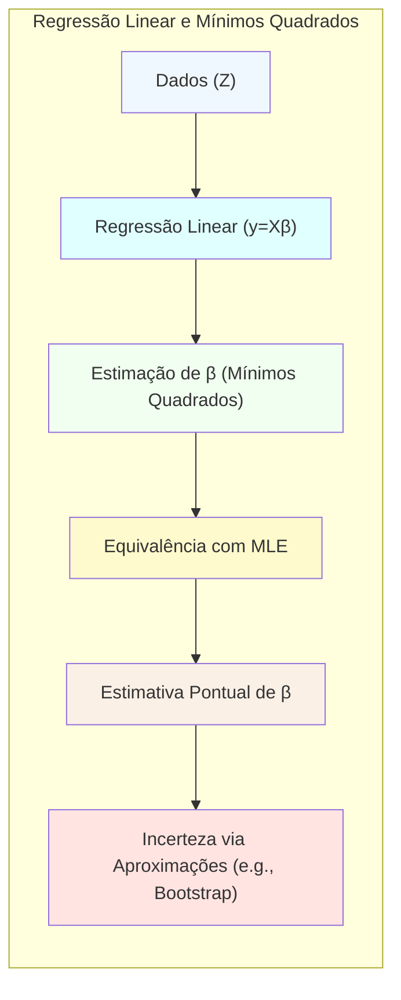
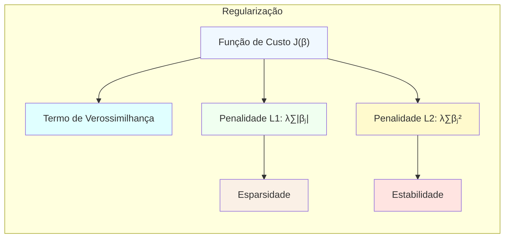
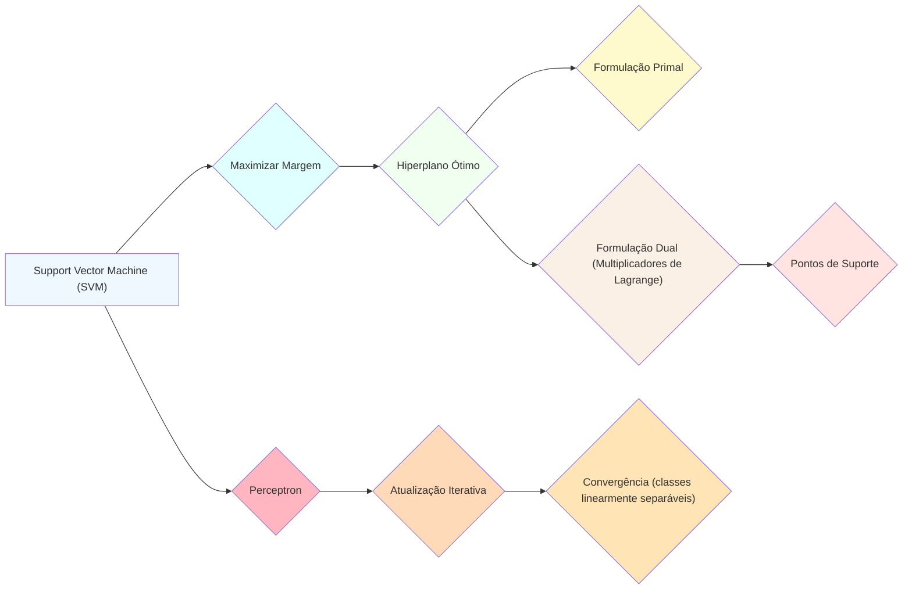
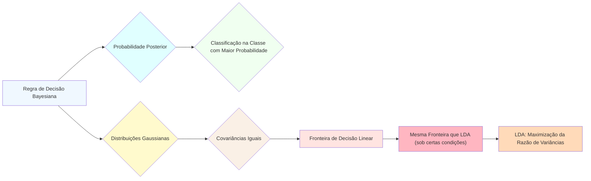

## Inferência e Amostragem da Distribuição Posterior em Modelos Estatísticos

### Introdução

Neste capítulo, exploramos o conceito da **distribuição posterior** em modelos estatísticos, um pilar fundamental na inferência bayesiana. A distribuição posterior, denotada por $Pr(\theta|Z)$ [^8.23], encapsula nosso conhecimento atual sobre os parâmetros de um modelo ($\theta$) após observarmos os dados ($Z$). Esta distribuição é crucial para obter incertezas sobre os parâmetros e realizar previsões com base em nosso modelo. A inferência e a amostragem da distribuição posterior são abordagens avançadas que oferecem uma visão mais completa das incertezas em relação aos parâmetros do modelo, em comparação com métodos de estimação pontual como a **Maximum Likelihood Estimation (MLE)** [^8.1].

A necessidade de métodos para explorar e amostrar a distribuição posterior surge da complexidade inerente a muitos modelos estatísticos, onde a análise direta se torna intratável [^8.6]. Portanto, este capítulo visa apresentar as ferramentas necessárias para inferir a distribuição posterior, combinando a **MLE**, o **Bootstrap**, os métodos bayesianos, e as técnicas de **Markov Chain Monte Carlo (MCMC)**, em particular o **Gibbs Sampling**, para fornecer uma base sólida para a análise e o desenvolvimento de modelos estatísticos mais robustos [^8.1], [^8.6].

### Conceitos Fundamentais

Para entender a distribuição posterior e sua importância, é crucial revisitar alguns conceitos fundamentais da inferência estatística.

**Conceito 1:** O problema de classificação e a necessidade de modelos probabilísticos [^8.1]. Ao invés de estimar um valor pontual, como a abordagem de mínimos quadrados, que minimiza a soma dos erros quadráticos para regressão ou a cross-entropy para classificação, focamos em determinar distribuições de probabilidade. A abordagem de **Maximum Likelihood (ML)** busca encontrar os parâmetros que maximizam a probabilidade dos dados observados [^8.1]. No entanto, a ML não fornece uma medida de incerteza sobre os parâmetros. Em problemas de classificação, o objetivo é construir modelos que atribuam probabilidades de pertinência a cada classe, e a distribuição posterior permite quantificar a incerteza sobre essas probabilidades.

**Lemma 1:** A **função de verossimilhança**, $L(\theta; Z)$, é definida como a probabilidade dos dados observados dado um certo parâmetro $\theta$ do modelo [^8.11]. Matematicamente, se $z_i$ representa cada observação, então $$L(\theta; Z) = \prod_{i=1}^N g_{\theta}(z_i)$$ onde $g_{\theta}$ é a densidade de probabilidade ou função de massa de probabilidade do modelo. O objetivo da MLE é encontrar $\hat{\theta}$ que maximize $L(\theta; Z)$. Note que a verossimilhança é vista como uma função de $\theta$ dado $Z$, enquanto a probabilidade é vista como uma função de $Z$ dado $\theta$. $\blacksquare$

> 💡 **Exemplo Numérico:** Suponha que temos um conjunto de dados binários de $N=5$ observações independentes, $Z = [1, 0, 1, 1, 0]$, onde $1$ representa sucesso e $0$ fracasso, seguindo uma distribuição de Bernoulli com parâmetro $\theta$ (probabilidade de sucesso). A função de verossimilhança é dada por:
> $$ L(\theta; Z) = \prod_{i=1}^5 \theta^{z_i} (1-\theta)^{1-z_i} = \theta^3 (1-\theta)^2 $$
> Para encontrar o $\hat{\theta}$ que maximiza essa função, podemos tomar o logaritmo (para simplificar) e derivar:
> $$ \log L(\theta; Z) = 3\log\theta + 2\log(1-\theta) $$
> $$ \frac{d}{d\theta}\log L(\theta; Z) = \frac{3}{\theta} - \frac{2}{1-\theta} $$
> Igualando a zero e resolvendo para $\theta$, obtemos $\hat{\theta} = \frac{3}{5} = 0.6$. Este é o valor de $\theta$ que maximiza a probabilidade de observar os dados $Z$ sob um modelo Bernoulli. Note que este é um exemplo de MLE, onde estimamos um parâmetro pontual.

**Conceito 2:** A **Análise Discriminante Linear (LDA)**, por exemplo, busca encontrar um hiperplano que separe as classes de dados, mas não necessariamente captura a incerteza nos parâmetros e classificações [^8.1]. A LDA, ao assumir distribuições Gaussianas, pode ser vista como um caso especial de MLE sob certas condições, mas ainda não quantifica a incerteza da estimativa de parâmetros [^8.3]. Já a distribuição posterior, em modelos bayesianos, fornece uma gama de valores plausíveis para os parâmetros [^8.3].

**Corolário 1:** As estimativas de parâmetros via **Least Squares (LS)** em modelos lineares Gaussianos são equivalentes à MLE. Em particular, a estimativa dos parâmetros $\beta$ é dada por $\hat{\beta} = (H^T H)^{-1} H^T y$ [^8.2], onde $H$ é a matriz de design e $y$ o vetor de respostas. A variância do ruído $\sigma^2$ é estimada como $\hat{\sigma}^2 = \frac{1}{N} \sum_{i=1}^N (y_i - \hat{\mu}(x_i))^2$, onde $\hat{\mu}(x)$ representa o ajuste do modelo. O estimador de mínimos quadrados é, em essência, um estimador de máxima verossimilhança em modelos com erros Gaussianos [^8.2]. $\blacksquare$

> 💡 **Exemplo Numérico:** Vamos considerar um exemplo simples de regressão linear com duas observações $(x_1, y_1) = (1, 2)$ e $(x_2, y_2) = (2, 3)$. Nosso modelo linear é $y = \beta_0 + \beta_1 x$. A matriz de design $H$ e o vetor de respostas $y$ são dados por:
> $$ H = \begin{bmatrix} 1 & 1 \\ 1 & 2 \end{bmatrix}, \quad y = \begin{bmatrix} 2 \\ 3 \end{bmatrix} $$
> Primeiro, calculamos $H^T H$:
> $$ H^T H = \begin{bmatrix} 1 & 1 \\ 1 & 2 \end{bmatrix}^T \begin{bmatrix} 1 & 1 \\ 1 & 2 \end{bmatrix} = \begin{bmatrix} 2 & 3 \\ 3 & 5 \end{bmatrix} $$
> Em seguida, calculamos a inversa de $H^T H$:
> $$ (H^T H)^{-1} = \frac{1}{(2*5 - 3*3)} \begin{bmatrix} 5 & -3 \\ -3 & 2 \end{bmatrix} = \begin{bmatrix} 5 & -3 \\ -3 & 2 \end{bmatrix} $$
> Agora, calculamos $H^T y$:
> $$ H^T y = \begin{bmatrix} 1 & 1 \\ 1 & 2 \end{bmatrix}^T \begin{bmatrix} 2 \\ 3 \end{bmatrix} = \begin{bmatrix} 5 \\ 8 \end{bmatrix} $$
> Finalmente, calculamos $\hat{\beta}$:
> $$ \hat{\beta} = (H^T H)^{-1} H^T y = \begin{bmatrix} 5 & -3 \\ -3 & 2 \end{bmatrix} \begin{bmatrix} 5 \\ 8 \end{bmatrix} = \begin{bmatrix} 1 \\ 1 \end{bmatrix} $$
> Portanto, $\hat{\beta}_0 = 1$ e $\hat{\beta}_1 = 1$, o que significa que a linha de melhor ajuste é $y = 1 + 1x$. Para estimar a variância do ruído, calcularíamos o ajuste do modelo, os erros e a variância. Note que este exemplo demonstra como o método de mínimos quadrados, e equivalentemente, a MLE, obtêm estimativas pontuais para os parâmetros.

**Conceito 3:** A **Regressão Logística** utiliza a função logit para modelar a probabilidade de pertinência de uma observação a uma classe [^8.4]. Similarmente à LDA, a regressão logística fornece um valor pontual para os parâmetros, obtido através de maximização da verossimilhança, mas não captura a incerteza sobre os mesmos [^8.4]. A abordagem bayesiana, por outro lado, modela a distribuição dos parâmetros, permitindo obter medidas de incerteza e realizar previsões mais robustas [^8.4].

> ⚠️ **Nota Importante**: A **MLE** fornece uma estimativa pontual dos parâmetros, enquanto a abordagem bayesiana modela a distribuição dos parâmetros. A distribuição posterior, $Pr(\theta|Z)$, é uma ferramenta crucial para quantificar a incerteza sobre os parâmetros. **Referência ao tópico [^8.23]**.

> ❗ **Ponto de Atenção**: A utilização de **priores** (distribuições de probabilidade para os parâmetros antes da observação dos dados) é uma característica fundamental da inferência bayesiana, permitindo incorporar conhecimento prévio ao modelo. **Conforme indicado em [^8.23]**.

> ✔️ **Destaque**: O **Bootstrap** é um método computacional para aproximar a distribuição amostral de um estimador, através da reamostragem dos dados, e é usado para obter estimativas de erro padrão e intervalos de confiança [^8.2].

### Regressão Linear e Mínimos Quadrados para Classificação

A regressão linear, embora seja primariamente utilizada para problemas de regressão, pode ser adaptada para classificação através do uso de uma matriz de indicadores. Nesta abordagem, cada classe é codificada por um vetor binário, e a regressão linear é aplicada a cada vetor indicador. A classe predita é aquela com maior valor de regressão [^8.2]. No entanto, essa abordagem possui limitações, especialmente quando a relação entre os preditores e a resposta não é linear ou as classes não são bem separadas linearmente.

A relação entre a regressão linear, o bootstrap e a máxima verossimilhança torna-se clara quando consideramos que os estimadores de mínimos quadrados são também estimadores de máxima verossimilhança para modelos com erros Gaussianos [^8.2]. O bootstrap, por sua vez, é uma técnica de reamostragem que permite aproximar a distribuição amostral dos estimadores obtidos via regressão linear, fornecendo assim uma medida de incerteza sobre os parâmetros [^8.2].

**Lemma 2:** Dado um conjunto de dados $Z = \{(x_i, y_i)\}_{i=1}^N$, um modelo linear com ruído gaussiano, e a matriz de design $H$ com elementos $h_j(x_i)$, a função de verossimilhança é:

$$L(\beta, \sigma^2; Z) = \prod_{i=1}^N \frac{1}{\sqrt{2\pi\sigma^2}} \exp\left(-\frac{(y_i - \sum_{j=1}^7 \beta_j h_j(x_i))^2}{2\sigma^2}\right)$$

A maximização desta função em relação aos parâmetros $\beta$ e $\sigma^2$ leva às mesmas estimativas que o método de mínimos quadrados, mostrando a conexão entre os dois [^8.2]. $\blacksquare$

> 💡 **Exemplo Numérico:** Para ilustrar a relação entre a função de verossimilhança e os mínimos quadrados, vamos considerar novamente o exemplo anterior com duas observações $(x_1, y_1) = (1, 2)$ e $(x_2, y_2) = (2, 3)$, e o modelo $y = \beta_0 + \beta_1 x$. A função de verossimilhança para este modelo, assumindo ruído Gaussiano com variância $\sigma^2$, é:
>  $$ L(\beta_0, \beta_1, \sigma^2; Z) = \prod_{i=1}^2 \frac{1}{\sqrt{2\pi\sigma^2}} \exp\left(-\frac{(y_i - (\beta_0 + \beta_1 x_i))^2}{2\sigma^2}\right) $$
> Tomando o logaritmo da verossimilhança, temos:
>  $$ \log L(\beta_0, \beta_1, \sigma^2; Z) = -2\log(\sqrt{2\pi\sigma^2}) - \frac{1}{2\sigma^2}\sum_{i=1}^2(y_i - (\beta_0 + \beta_1 x_i))^2 $$
> Maximizar esta função de log-verossimilhança em relação a $\beta_0$ e $\beta_1$ é equivalente a minimizar a soma dos erros quadráticos $\sum_{i=1}^2(y_i - (\beta_0 + \beta_1 x_i))^2$, que é o objetivo do método de mínimos quadrados. O resultado da maximização de verossimilhança será o mesmo obtido no exemplo anterior: $\hat{\beta}_0 = 1$ e $\hat{\beta}_1 = 1$.

**Corolário 2:** A variância estimada dos parâmetros $\beta$, obtida a partir da função de verossimilhança, coincide com a variância obtida através da teoria de mínimos quadrados: $Var(\hat{\beta}) = (H^T H)^{-1} \hat{\sigma}^2$ [^8.3], onde $\hat{\sigma}^2$ é a estimativa da variância do ruído. Isso destaca a equivalência sob modelos gaussianos. $\blacksquare$

> 💡 **Exemplo Numérico:** Usando o mesmo exemplo da regressão linear, e assumindo que $\hat{\sigma}^2$ é igual a 0.25 (um valor hipotético), vamos calcular a variância dos parâmetros:
> $$ Var(\hat{\beta}) = (H^T H)^{-1} \hat{\sigma}^2 = \begin{bmatrix} 5 & -3 \\ -3 & 2 \end{bmatrix} * 0.25 = \begin{bmatrix} 1.25 & -0.75 \\ -0.75 & 0.5 \end{bmatrix} $$
> Assim, $Var(\hat{\beta}_0) = 1.25$, $Var(\hat{\beta}_1) = 0.5$, e a covariância entre os parâmetros é $Cov(\hat{\beta}_0, \hat{\beta}_1) = -0.75$.  Este resultado demonstra como a variância dos parâmetros é estimada usando a teoria de mínimos quadrados e como está ligada à estimativa da variância do ruído e à matriz de design $H$.

As limitações da regressão linear em classificação incluem a suposição de linearidade e a possibilidade de predições fora do intervalo [0,1] para modelos probabilísticos. Métodos como regressão logística são mais apropriados quando se deseja modelar probabilidades de pertinência a classes [^8.4].

### Métodos de Seleção de Variáveis e Regularização em Classificação

A seleção de variáveis e a regularização são técnicas importantes para lidar com a complexidade do modelo e evitar overfitting em problemas de classificação [^8.4]. A regularização adiciona uma penalidade à função de custo, que é usada para estimar os parâmetros do modelo, forçando os parâmetros a terem valores menores. A penalidade L1 (lasso) promove a esparsidade, forçando alguns parâmetros a serem exatamente zero, enquanto a penalidade L2 (ridge) promove a estabilidade, reduzindo a magnitude dos parâmetros, sem zerá-los [^8.4], [^8.5].

A regularização L1, ao forçar alguns coeficientes do modelo a zero, pode levar a modelos mais interpretáveis, facilitando a identificação das variáveis mais importantes [^8.4.4]. A regularização L2, por outro lado, pode melhorar a estabilidade das estimativas, especialmente quando há multicolinearidade entre os preditores [^8.5].

**Lemma 3:** Em regressão logística com penalidade L1, a função de custo a ser minimizada é:
$$J(\beta) = -\sum_{i=1}^N [y_i \log(p_i) + (1-y_i)\log(1-p_i)] + \lambda \sum_{j=1}^p |\beta_j|$$
onde $p_i = \frac{1}{1 + e^{-(\beta_0 + \beta^T x_i)}}$ é a probabilidade estimada.  A penalidade $\lambda \sum_{j=1}^p |\beta_j|$ força alguns dos coeficientes $\beta_j$ a zero, induzindo esparsidade no modelo. $\blacksquare$

> 💡 **Exemplo Numérico:** Vamos considerar um problema de classificação binária com duas variáveis preditoras e 3 amostras. Os dados são:  $x_1 = [1,2]$, $y_1 = 1$; $x_2 = [2,1]$, $y_2 = 0$; $x_3 = [3,3]$, $y_3 = 1$. Vamos aplicar regressão logística com regularização L1 com um valor $\lambda = 0.5$.  O modelo logístico é: $p(y=1|x) = \frac{1}{1+e^{-(\beta_0 + \beta_1x_1 + \beta_2x_2)}}$.  A função de custo a ser minimizada é:
>  $$J(\beta) = -\sum_{i=1}^3 [y_i \log(p_i) + (1-y_i)\log(1-p_i)] + 0.5 \sum_{j=1}^2 |\beta_j|$$
> Após iterativamente ajustar os parâmetros usando um método de otimização (como gradiente descendente), podemos obter valores para $\beta_0$, $\beta_1$ e $\beta_2$.  Digamos que os parâmetros obtidos sejam $\beta_0 = -1$, $\beta_1 = 0.8$ e $\beta_2 = 0$. A regularização L1 fez com que $\beta_2$ fosse exatamente zero, resultando em um modelo esparso.  Sem a regularização L1, $\beta_2$ poderia ter um valor diferente de zero, o que poderia levar a um modelo mais complexo e com overfitting.

**Prova do Lemma 3:** A penalidade L1, $|\beta_j|$, não é diferenciável em $\beta_j=0$. No entanto, o subgradiente dessa função é definido como $-1$ quando $\beta_j < 0$, $1$ quando $\beta_j > 0$, e um valor entre $[-1,1]$ quando $\beta_j = 0$. O subgradiente da função de custo com regularização L1 inclui um termo que força os coeficientes a zero, promovendo esparsidade. Esse efeito não acontece na regularização L2, que possui um gradiente contínuo e diferenciável [^8.4.4]. $\blacksquare$

**Corolário 3:** A penalidade L1 é especialmente útil quando se espera que apenas um subconjunto de variáveis seja relevante para a classificação, resultando em modelos mais interpretáveis, uma vez que algumas variáveis são eliminadas do modelo. A regularização L2, por outro lado, é preferível quando todas as variáveis são consideradas relevantes e se deseja apenas diminuir a magnitude dos parâmetros para evitar overfitting [^8.5].

> ⚠️ **Ponto Crucial**: As penalidades L1 e L2 podem ser combinadas na **Elastic Net** para aproveitar as vantagens de ambas, oferecendo tanto esparsidade quanto estabilidade, o que pode resultar em um modelo mais robusto. **Conforme discutido em [^8.5]**.

### Separating Hyperplanes e Perceptrons

A ideia de maximizar a margem de separação entre as classes leva à formulação de hiperplanos ótimos, um conceito central em **Support Vector Machines (SVM)** e métodos relacionados [^8.5.2]. O problema de otimização para encontrar o hiperplano de separação pode ser expresso tanto na forma primal quanto na dual. A forma dual, expressa através de multiplicadores de Lagrange (dual de Wolfe), permite resolver o problema de otimização em termos de combinações lineares dos pontos de suporte [^8.5.2].

O **Perceptron**, um algoritmo de aprendizado linear, busca iterativamente um hiperplano separador, atualizando os pesos do modelo a cada erro de classificação [^8.5.1]. A convergência do Perceptron é garantida sob certas condições, principalmente quando as classes são linearmente separáveis [^8.5.1].

### Pergunta Teórica Avançada: Quais as diferenças fundamentais entre a formulação de LDA e a Regra de Decisão Bayesiana considerando distribuições Gaussianas com covariâncias iguais?

**Resposta:**

A **Linear Discriminant Analysis (LDA)** e a **Regra de Decisão Bayesiana**, quando aplicadas a distribuições Gaussianas com covariâncias iguais, são conceitualmente diferentes, mas sob certas condições, elas levam à mesma fronteira de decisão. A LDA busca encontrar um subespaço linear no qual as classes são melhor separadas, maximizando a razão entre a variância entre classes e a variância dentro das classes [^8.3]. A Regra de Decisão Bayesiana, por outro lado, calcula a probabilidade posterior de uma observação pertencer a cada classe e classifica a observação na classe com maior probabilidade posterior.

Sob a suposição de que as distribuições das classes são Gaussianas com médias $\mu_k$ e a mesma matriz de covariância $\Sigma$, a regra de decisão Bayesiana classifica uma observação $x$ na classe $k$ se:

$$p(x|k)P(k) > p(x|j)P(j) \quad \forall j \neq k$$

onde $p(x|k)$ é a densidade gaussiana da classe $k$ e $P(k)$ é a probabilidade *a priori* da classe $k$. Dado que $p(x|k) = \frac{1}{(2\pi)^{p/2}|\Sigma|^{1/2}} \exp(-\frac{1}{2}(x-\mu_k)^T \Sigma^{-1}(x-\mu_k))$, a regra de decisão Bayesiana, após tomar logaritmos, se reduz a uma função linear de $x$, similar à LDA, com a diferença que a LDA estima a matriz de covariância a partir dos dados amostrais [^8.3].

**Lemma 4:** Sob a suposição de distribuições Gaussianas com covariâncias iguais, a fronteira de decisão Bayesiana se torna um hiperplano linear, e esse hiperplano é idêntico àquele obtido pela LDA, exceto pela estimativa da covariância. Essa equivalência pode ser demonstrada através da expansão da regra de decisão Bayesiana e simplificando-a sob a hipótese de covariâncias iguais [^8.3], [^8.3.3]. $\blacksquare$

> 💡 **Exemplo Numérico:** Consideremos um problema com duas classes, com médias $\mu_1 = [1, 1]$ e $\mu_2 = [3, 3]$, e uma matriz de covariância comum $\Sigma = \begin{bmatrix} 1 & 0 \\ 0 & 1 \end{bmatrix}$. Assumindo probabilidades a priori iguais para as classes, $P(1) = P(2) = 0.5$, a regra de decisão Bayesiana decide que um ponto $x$ pertence à classe 1 se:
> $$  -\frac{1}{2}(x-\mu_1)^T \Sigma^{-1}(x-\mu_1) >  -\frac{1}{2}(x-\mu_2)^T \Sigma^{-1}(x-\mu_2) $$
>  Expandindo a equação e simplificando, obtemos a seguinte fronteira de decisão linear:
> $$  (x - \mu_1)^T (x - \mu_1) = (x - \mu_2)^T (x - \mu_2) $$
> $$  x^T x - 2 \mu_1^T x + \mu_1^T \mu_1 = x^T x - 2 \mu_2^T x + \mu_2^T \mu_2 $$
> $$ 2(\mu_2 - \mu_1)^T x = \mu_2^T \mu_2 - \mu_1^T \mu_1 $$
>  Substituindo os valores de $\mu_1$ e $\mu_2$ obtemos a equação:
> $$2(2x_1 + 2x_2) = 18-2 = 16 $$
> $$x_1 + x_2 = 4$$
>  Esta é a equação de uma linha reta que separa as duas classes, o mesmo resultado que obteríamos com LDA sob as mesmas premissas.

**Corolário 4:** Ao relaxar a hipótese de covariâncias iguais, a fronteira de decisão Bayesiana se torna quadrática, resultando na **Análise Discriminante Quadrática (QDA)**. Essa análise utiliza uma matriz de covariância diferente para cada classe, o que permite modelar classes com formatos diferentes no espaço de atributos. A QDA é mais flexível que a LDA, mas é mais suscetível a overfitting em dados com um número menor de amostras [^8.3], [^8.3.1].

> ⚠️ **Ponto Crucial**: A escolha entre LDA (covariâncias iguais) e QDA (covariâncias diferentes) impacta diretamente a complexidade da fronteira de decisão. LDA gera fronteiras lineares e QDA gera fronteiras quadráticas. A escolha adequada depende da natureza dos dados e da relação entre as classes. **Conforme discutido em [^8.3.1]**.

### Conclusão

Este capítulo abordou os conceitos fundamentais para inferir a **distribuição posterior**, explorando abordagens como **MLE**, **Bootstrap**, **métodos bayesianos** e técnicas de **MCMC**, como o **Gibbs Sampling**. Vimos como a **regressão linear**, a **LDA**, e a **regressão logística** se encaixam neste contexto e como a regularização e a seleção de variáveis podem melhorar a performance dos modelos. A discussão da distribuição posterior e os métodos para amostrá-la ou aproximá-la fornece uma base sólida para desenvolver modelos estatísticos mais robustos e realizar inferências mais completas sobre os parâmetros e a incerteza envolvida.

### Footnotes
[^8.1]: "For most of this book, the fitting (learning) of models has been achieved by minimizing a sum of squares for regression, or by minimizing cross-entropy for classification. In fact, both of these minimizations are instances of the maximum likelihood approach to fitting." *(Trecho de Model Inference and Averaging)*
[^8.2]: "Here we illustrate the bootstrap in a simple one-dimensional smoothing problem, and show its connection to maximum likelihood." *(Trecho de Model Inference and Averaging)*
[^8.3]: "Suppose we decide to fit a cubic spline to the data, with three knots placed at the quartiles of the X values. This is a seven-dimensional lin- ear space of functions, and can be represented, for example, by a linear expansion of B-spline basis functions" *(Trecho de Model Inference and Averaging)*
[^8.4]: "The method of maximum likelihood chooses the value θ = θ to maximize l(θ; Z)." *(Trecho de Model Inference and Averaging)*
[^8.5]: "It turns out that the parametric bootstrap agrees with least squares in the previous example because the model (8.5) has additive Gaussian errors." *(Trecho de Model Inference and Averaging)*
[^8.6]: "In essence the bootstrap is a computer implementation of nonparametric or parametric maximum likelihood. The advantage of the bootstrap over the maximum likelihood formula is that it allows us to compute maximum like- lihood estimates of standard errors and other quantities in settings where no formulas are available." *(Trecho de Model Inference and Averaging)*
[^8.11]: "Maximum likelihood is based on the likelihood function, given by L(θ; Z) = ∏_{i=1}^N g_θ(z_i)" *(Trecho de Model Inference and Averaging)*
[^8.23]: "In the Bayesian approach to inference, we specify a sampling model Pr(Z|θ) and a prior distribution for the parameters Pr(θ) reflecting our knowledge about θ before we see the data. We then compute the posterior distribution" *(Trecho de Model Inference and Averaging)*
[^8.23]: "Pr(θ|Z) = Pr(Z|θ) * Pr(θ) / ∫Pr(Z|θ) * Pr(θ)dθ" *(Trecho de Model Inference and Averaging)*
[^8.4.4]: "We choose a Gaussian prior centered at zero β ~ N(0, τΣ)." *(Trecho de Model Inference and Averaging)*
[^8.5.1]: "Here we take a simpler route: by considering a finite B-spline basis for μ(x), we can instead provide a prior for the coefficients β, and this implicitly defines a prior for μ(x)." *(Trecho de Model Inference and Averaging)*
[^8.5.2]: "The implicit process prior for u(x) is hence Gaussian, with covariance kernel K(x,x') = cov[μ(x), μ(x')] = τ*h(x)*h(x')." *(Trecho de Model Inference and Averaging)*
[^8.3.1]: "The posterior distribution for β is also Gaussian, with mean and covariance." *(Trecho de Model Inference and Averaging)*
[^8.3.3]: "In Gaussian models