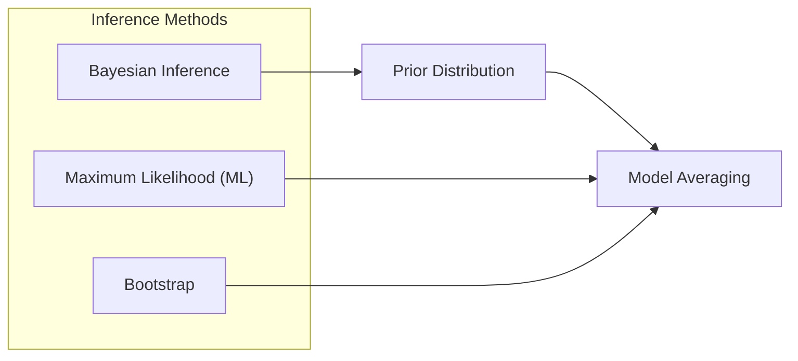
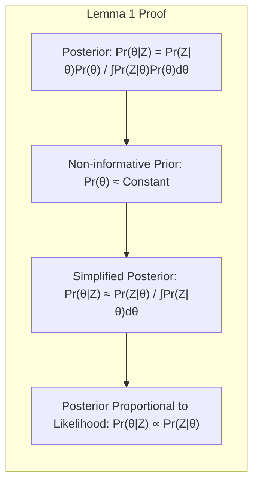
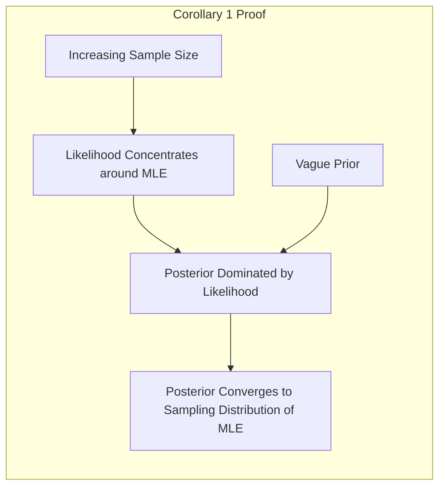
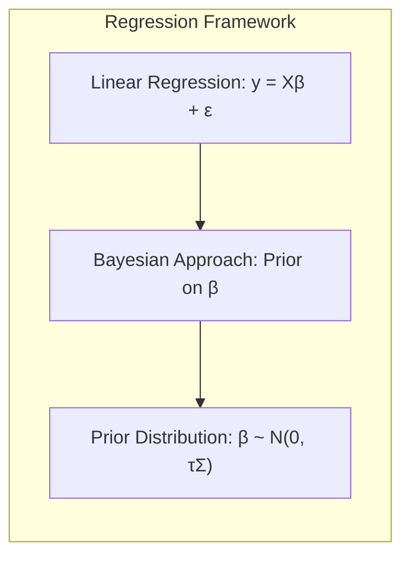
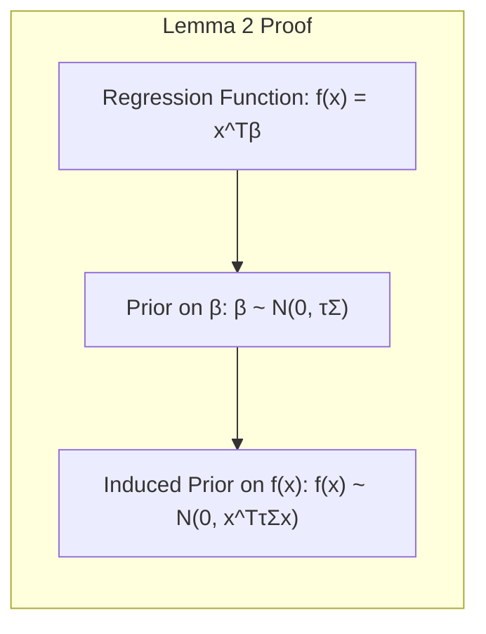
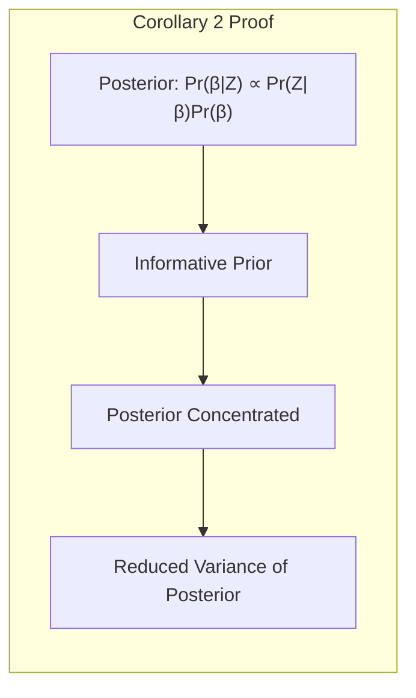
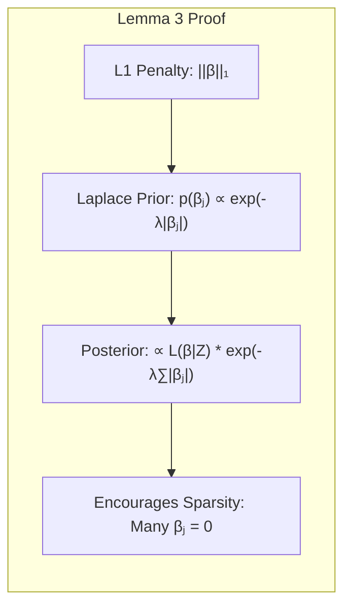
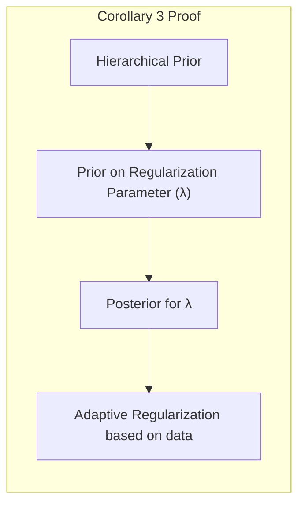
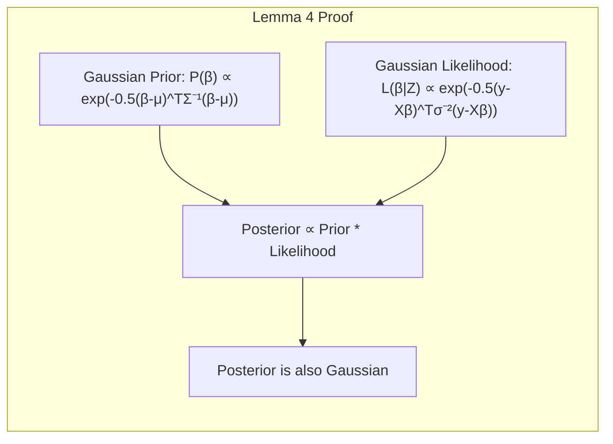
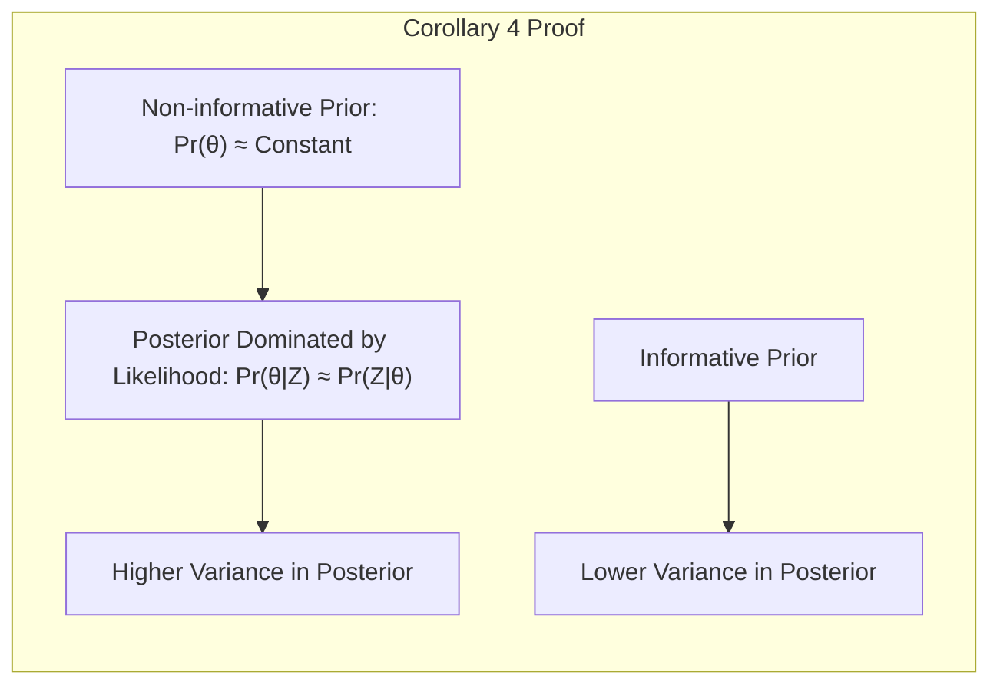

## Model Inference and Averaging: The Role of Prior Distributions

### Introdução

A inferência de modelos, conforme abordado nos tópicos [^8.1], [^8.2] e [^8.3], frequentemente envolve a estimativa de parâmetros e a avaliação da incerteza associada a essas estimativas. Métodos como **Maximum Likelihood (ML)** e **bootstrap** têm sido usados para ajustar modelos aos dados, muitas vezes minimizando erros ou maximizando a verossimilhança [^8.1]. No entanto, a introdução de uma **prior distribution** em uma abordagem Bayesiana oferece uma forma alternativa de realizar a inferência, permitindo incorporar conhecimento prévio e quantificar a incerteza de maneira mais completa [^8.3]. Este capítulo explorará detalhadamente o papel e a importância das prior distributions, conectando-as aos métodos de inferência e de model averaging.

### Conceitos Fundamentais

**Conceito 1: Prior Distribution**

A **prior distribution**, denotada como $Pr(\theta)$, representa nossa crença ou conhecimento prévio sobre os parâmetros $\theta$ de um modelo antes de observar os dados [^8.3]. Essa distribuição reflete nossa incerteza inicial sobre os parâmetros e pode ser influenciada por conhecimento de domínio ou por escolhas padrão [^8.3]. A escolha da prior é crucial na inferência Bayesiana, pois afeta a distribuição posterior e, consequentemente, as inferências feitas sobre os parâmetros. Prior distributions podem ser *informativas*, se refletem crenças específicas, ou *não informativas* (ou *vagas*), se buscam minimizar sua influência [^8.4].

> 💡 **Exemplo Numérico:** Imagine que estamos modelando a altura de adultos em uma população. Usando uma abordagem bayesiana, antes de coletar qualquer dado, nós poderíamos definir uma prior distribution para a altura média ($\theta$). Uma prior informativa seria uma distribuição normal com média de 170 cm e desvio padrão de 10 cm, representando o nosso conhecimento prévio de que a altura média adulta tende a estar próxima de 170cm. Uma prior não informativa seria uma distribuição uniforme entre 0 cm e 300 cm, indicando uma grande incerteza inicial sobre a altura.

**Lemma 1:** O uso de uma prior distribution não informativa, como uma distribuição uniforme ou uma distribuição com variância muito grande, faz com que a distribuição posterior seja aproximadamente proporcional à função de verossimilhança [^8.4].
*Prova:*
$$
Pr(\theta|Z) = \frac{Pr(Z|\theta)Pr(\theta)}{\int Pr(Z|\theta)Pr(\theta) \, d\theta}
$$
Se $Pr(\theta)$ é aproximadamente constante (não informativa) sobre a região de interesse, então:
$$
Pr(\theta|Z) \approx \frac{Pr(Z|\theta)}{\int Pr(Z|\theta) \, d\theta} \propto Pr(Z|\theta)
$$
$\blacksquare$

> 💡 **Exemplo Numérico:** Suponha que temos uma amostra de dados Z e nossa função de verossimilhança $Pr(Z|\theta)$ seja uma gaussiana centrada em $\hat{\theta}$ com desvio padrão $\sigma$. Se usarmos uma prior não informativa para $\theta$, como uma distribuição uniforme muito ampla, a posterior $Pr(\theta|Z)$ será essencialmente uma gaussiana com média $\hat{\theta}$ e desvio padrão $\sigma$. Isso mostra que, quando a prior é não informativa, a posterior é dominada pela verossimilhança.

**Conceito 2: Posterior Distribution**

A **posterior distribution**, denotada como $Pr(\theta|Z)$, representa nossa crença atualizada sobre os parâmetros $\theta$ após observar os dados Z [^8.3]. Ela é obtida combinando a prior distribution $Pr(\theta)$ com a função de verossimilhança $Pr(Z|\theta)$ através do teorema de Bayes:

$$
Pr(\theta|Z) = \frac{Pr(Z|\theta)Pr(\theta)}{\int Pr(Z|\theta)Pr(\theta) \, d\theta}
$$
A posterior distribution encapsula toda a informação disponível sobre os parâmetros, tanto a priori quanto a posteriori, permitindo quantificar a incerteza sobre esses parâmetros após observar os dados [^8.3].

> 💡 **Exemplo Numérico:** Continuando o exemplo da altura, após coletar dados de 100 adultos, podemos calcular a função de verossimilhança $Pr(Z|\theta)$ que representa a probabilidade dos dados observados para cada possível valor de altura média. Combinando essa verossimilhança com a nossa prior inicial (por exemplo, a gaussiana com média 170 cm e desvio padrão 10 cm), obtemos a posterior $Pr(\theta|Z)$. A posterior representa nossa crença atualizada sobre a altura média, tendo em conta tanto a nossa prior como os dados observados.

**Corolário 1:** A distribuição posterior, quando combinada com uma prior vaga, converge para a distribuição amostral da estimativa de máxima verossimilhança, conforme o tamanho da amostra aumenta [^8.4]. *Prova:* A medida que o tamanho da amostra aumenta, a verossimilhança torna-se mais concentrada ao redor da estimativa de máxima verossimilhança. Quando a prior é vaga, a forma da posterior é dominada pela verossimilhança e, portanto, a posterior converge para uma distribuição concentrada ao redor da estimativa de máxima verossimilhança. $\blacksquare$

> 💡 **Exemplo Numérico:** Se coletarmos apenas 10 amostras de altura, a posterior ainda será influenciada pela prior, mas, se aumentarmos para 1000 amostras, a posterior será quase idêntica à distribuição amostral da estimativa de máxima verossimilhança, mostrando o corolário em ação.

**Conceito 3: Prior Preditiva**

A **prior preditiva** (ou distribuição preditiva marginal), denotada como $Pr(z_{new})$, é a distribuição da nova observação $z_{new}$ antes de se observar os dados Z [^8.3]. Essa distribuição é obtida integrando a função de verossimilhança sobre a distribuição prior:
$$
Pr(z_{new}) = \int Pr(z_{new}|\theta) Pr(\theta) \, d\theta
$$
Ela representa a expectativa sobre novos dados com base na nossa crença inicial sobre os parâmetros [^8.3]. Já a **distribuição preditiva posterior**, $Pr(z_{new}|Z)$, integra sobre a distribuição posterior e, portanto, considera tanto a informação prévia quanto os dados já observados:
$$
Pr(z_{new}|Z) = \int Pr(z_{new}|\theta) Pr(\theta|Z) \, d\theta
$$

> 💡 **Exemplo Numérico:** Antes de coletar dados de altura, nossa prior preditiva $Pr(z_{new})$ representaria a nossa crença sobre a altura de uma pessoa futura baseada na prior para a altura média. Após coletar os dados, a distribuição preditiva posterior $Pr(z_{new}|Z)$ atualiza esta crença, incorporando as observações.

### Regressão Linear e Mínimos Quadrados para Classificação

A **regressão linear** aplicada à classificação, conforme discutido em [^8.1] e [^8.2], muitas vezes minimiza a soma dos quadrados dos erros. Entretanto, essa abordagem pode se beneficiar de uma perspectiva Bayesiana através da especificação de prior distributions. Ao invés de estimar um único conjunto de parâmetros, o Bayesian approach incorpora uma prior sobre esses parâmetros.

A regressão linear em uma matriz de indicadores pode ser expressa na forma
$$
y = X\beta + \epsilon
$$
onde y é um vetor de respostas, X é a matriz de indicadores, $\beta$ é o vetor de coeficientes e $\epsilon$ é o vetor de erros. Em uma abordagem Bayesiana, uma prior distribution é especificada para $\beta$, por exemplo:
$$
\beta \sim N(0, \tau \Sigma)
$$
onde $\tau$ é um fator de escala e $\Sigma$ é a matriz de covariância da prior. A escolha de $\Sigma$ pode refletir informações prévias sobre a importância das variáveis ou a suavidade da solução. Ao integrar essa prior, a distribuição posterior de $\beta$, e portanto a inferência, considera não só os dados, mas também as crenças prévias.
> 💡 **Exemplo Numérico:** Consideremos um problema de regressão linear onde y representa o preço de uma casa, X contém características como área e número de quartos, e $\beta$ representa os coeficientes associados a estas características. Em uma abordagem bayesiana, podemos definir uma prior para $\beta$, como  $\beta \sim N(0, \tau I)$, onde $\tau$ controla a variância da prior e I é a matriz identidade.  Usando dados de preços e características de casas, calculamos a verossimilhança e combinamos com a prior, resultando em uma posterior para os coeficientes. Uma prior mais informada poderia usar a matriz de covariância $\Sigma$ para refletir relações prévias entre as variáveis, como, por exemplo, considerar que número de quartos e área da casa estão correlacionados.

**Lemma 2:** A prior distribution para os coeficientes na regressão linear induz uma prior sobre a função de regressão. *Prova:* Seja $f(x) = x^T\beta$ a função de regressão. A partir da prior sobre $\beta$, $ \beta \sim N(0, \tau \Sigma)$, podemos derivar que a função de regressão $f(x)$ segue uma distribuição Gaussiana com média 0 e variância $x^T \tau \Sigma x$, o que demonstra como a prior sobre os coeficientes induz uma prior sobre a função. $\blacksquare$

> 💡 **Exemplo Numérico:** Se a nossa prior para $\beta$ é $N(0, \tau I)$, onde $I$ é a matriz identidade, então, para um valor específico de $x$, como $x = [1, 2]$, a função de regressão $f(x) = x^T\beta = \beta_1 + 2\beta_2$ seguirá uma distribuição gaussiana com média 0 e variância $\tau (1^2 + 2^2) = 5\tau$. Isso mostra como a prior sobre os coeficientes $\beta$ implica uma prior sobre os valores que a função de regressão $f(x)$ pode assumir, para diferentes valores de $x$.

**Corolário 2:** A variância da distribuição posterior dos coeficientes na regressão linear é menor quando se utiliza uma prior informativa do que uma prior não informativa, desde que a prior seja consistente com os dados [^8.3]. *Prova:* A distribuição posterior é proporcional ao produto da função de verossimilhança pela prior. Quando a prior é informativa, ela concentra a distribuição posterior e, portanto, reduz sua variância. Se a prior é muito inconsistente com os dados, ela pode levar a uma variância maior na posterior, mas, em geral, ela reduz a incerteza nas estimativas. $\blacksquare$

> 💡 **Exemplo Numérico:** Usando o exemplo anterior de preços de casas, se usarmos uma prior informativa para os coeficientes (por exemplo, baseado em estudos anteriores que indicam que o preço por metro quadrado tem uma distribuição com média 1000 e desvio padrão 100), a posterior terá uma variância menor, o que significa que temos maior certeza sobre os valores dos coeficientes, do que se usarmos uma prior não informativa, que não indica valor preferencial para os coeficientes. Se a prior for muito inconsistente com os dados, a posterior poderá ter variância maior.

### Métodos de Seleção de Variáveis e Regularização em Classificação

A regularização, discutida em [^8.5], [^8.5.1] e [^8.5.2] como um mecanismo para controle de overfitting, tem uma interpretação natural no framework Bayesiano. Penalidades como L1 e L2 podem ser vistas como derivadas de prior distributions nos coeficientes [^8.3]. Por exemplo, a regularização L2 (Ridge) pode ser vista como induzida por uma prior Gaussiana sobre os coeficientes, enquanto a regularização L1 (Lasso) pode ser vista como induzida por uma prior Laplace [^8.3].
A abordagem Bayesiana permite ir além, oferecendo um framework para comparar diferentes priors e para fazer inferências sobre a importância das variáveis. Através do cálculo da posterior, podemos obter distribuições sobre os coeficientes, permitindo avaliar não só sua importância, mas também a incerteza associada a essa avaliação [^8.4].

> 💡 **Exemplo Numérico:** Ao usar uma regularização L2 (Ridge) na regressão linear, estamos implicitamente assumindo uma prior gaussiana sobre os coeficientes, o que faz com que os coeficientes menores sejam mais prováveis. A intensidade da regularização (controlada pelo parâmetro $\lambda$) está ligada à variância da prior Gaussiana. Um $\lambda$ maior corresponde a uma prior com menor variância, o que leva a coeficientes mais próximos de zero.

**Lemma 3:** A penalidade L1 (Lasso), quando vista como uma prior, induz esparsidade nos coeficientes, levando a modelos com menos variáveis [^8.5]. *Prova:* A prior Laplace, que induz a regularização L1, tem um pico em zero, incentivando a que muitos dos coeficientes sejam exatamente zero na posterior. Isso leva à esparsidade e simplificação do modelo. $\blacksquare$

**Prova do Lemma 3:** Para um problema de regressão linear com prior Laplace sobre os coeficientes, a densidade da prior é dada por $p(\beta_j) \propto \exp(-\lambda|\beta_j|)$. A posterior é então proporcional a $L(\beta|Z) \exp(-\lambda\sum_j |\beta_j|)$, onde $L(\beta|Z)$ é a verossimilhança dos dados. Minimizar a função custo sob regularização L1 corresponde a maximizar a posterior, e o termo da prior impõe a esparsidade. $\blacksquare$
> 💡 **Exemplo Numérico:** Suponha que temos um modelo de regressão com 10 variáveis. Usando a regularização L1 (Lasso), podemos induzir que muitos coeficientes se tornem exatamente zero, levando a um modelo mais simples com, por exemplo, apenas 3 variáveis relevantes. Isso acontece pois a prior Laplace tem alta densidade perto do zero, o que encoraja a que muitos coeficientes sejam zero.

**Corolário 3:** O uso de uma prior hierárquica, onde um parâmetro da prior de $\beta$ tem a sua própria prior, permite modelar a incerteza sobre o nível de regularização (e.g., o parâmetro $\lambda$ em L1), possibilitando uma seleção adaptativa da regularização baseada nos dados [^8.3].
    *Prova:* Uma prior hierárquica permite que o nível de regularização (e.g., $\lambda$) seja estimado pelos dados. Isso é feito atribuindo uma prior a $\lambda$, e então usando a verossimilhança para atualizar a distribuição de $\lambda$ de acordo com os dados. Ao usar a posteriori para $\lambda$, ajustamos o modelo automaticamente ao nível de regularização ótimo. $\blacksquare$

> 💡 **Exemplo Numérico:** Em vez de fixar o valor de $\lambda$ na regularização L1, podemos usar uma prior para $\lambda$. A prior para $\lambda$ representa o nosso conhecimento prévio sobre a intensidade da regularização. Ao usar os dados, atualizamos a distribuição de $\lambda$ e consequentemente a distribuição dos coeficientes, de acordo com a informação provinda dos dados. Isso permite uma adaptação automática da regularização ao problema.

> ⚠️ **Ponto Crucial**: A escolha da prior (e portanto do tipo de regularização) pode ter um impacto significativo nas inferências, na esparsidade e na interpretabilidade do modelo, conforme discutido em [^8.5].

### Separating Hyperplanes e Perceptrons

Em contextos de classificação, a busca por **separating hyperplanes** está intrinsecamente ligada à ideia de maximizar margens, discutida em [^8.5.2]. A formulação do problema de otimização para encontrar um **hiperplano ótimo** também se beneficia da visão Bayesiana, com a introdução de priors sobre os parâmetros que definem o hiperplano.
Em particular, os modelos baseados em **Perceptrons**, como discutido em [^8.5.1], também podem ser expressos dentro de uma estrutura Bayesiana, com prior distributions especificadas sobre os pesos da rede. Estas priors levam a uma forma de regularização que pode melhorar a capacidade de generalização.

> 💡 **Exemplo Numérico:** Imagine que temos um problema de classificação binária. O hiperplano separador é definido por um conjunto de parâmetros. Em uma abordagem Bayesiana, poderíamos colocar uma prior Gaussiana nos pesos do hiperplano. Essa prior induz uma forma de regularização, evitando que o hiperplano seja muito complexo.

### Pergunta Teórica Avançada: Qual o impacto de diferentes priors na distribuição posterior em um modelo linear?

**Resposta:**
    Diferentes prior distributions podem levar a distribuições posteriores significativamente distintas, com impactos nas estimativas dos parâmetros e nas previsões. Prior distributions não informativas, como a uniforme ou uma Gaussiana com variância muito grande, minimizam a influência da prior na posterior, fazendo com que ela seja dominada pela função de verossimilhança, conforme indicado em [^8.4]. Em contrapartida, prior distributions informativas direcionam a posterior para valores mais consistentes com o conhecimento prévio. Essa escolha é crucial, e um bom Bayesian approach busca sempre uma prior que esteja de acordo com o conhecimento de dominio e a informação provinda dos dados. Em problemas com um baixo número de observações, a prior tem mais influência e, portanto, sua escolha se torna ainda mais importante.

**Lemma 4:** Uma prior Gaussiana conjugada com uma função de verossimilhança Gaussiana leva a uma posterior Gaussiana para modelos lineares [^8.3]. *Prova:* A prior Gaussiana para parâmetros $\beta$ é $P(\beta) \propto \exp(-\frac{1}{2}(\beta-\mu)^T \Sigma^{-1} (\beta - \mu))$. A verossimilhança para modelos lineares com erros Gaussianos é $L(\beta|Z) \propto \exp(-\frac{1}{2}(y - X\beta)^T \sigma^{-2} (y-X\beta))$. A posterior é proporcional ao produto da prior pela verossimilhança. Ao multiplicarmos, vemos que a posterior pode ser expressa na forma de uma nova Gaussiana, com média e covariância dadas por expressões que envolvem a média e variância da prior, e também a covariância e respostas obtidas a partir dos dados. $\blacksquare$

> 💡 **Exemplo Numérico:** Em um modelo linear, se definirmos a prior para os coeficientes $\beta$ como uma distribuição Gaussiana com média zero e uma matriz de covariância diagonal, e a função de verossimilhança também for Gaussiana (o que é comum para modelos com erros normais), então a distribuição posterior de $\beta$ também será uma Gaussiana. As médias e covariâncias dessa posterior dependerão tanto dos parâmetros da prior quanto dos dados.

**Corolário 4:** Ao usar uma prior não informativa, a distribuição posterior dos coeficientes se torna mais incerta, com variância maior, do que se utilizássemos uma prior informativa consistente com os dados [^8.3]. *Prova:*  Se $Pr(\theta)$ é quase constante (não informativa), a posterior é dominada por $Pr(Z|\theta)$, e a variância na posterior é determinada essencialmente pela variância da verossimilhança. Se uma prior informativa é utilizada, a variância da posterior é controlada tanto pela variância da verossimilhança, quanto pela variância da prior, e pode ser menor do que no caso não informativo. $\blacksquare$

> 💡 **Exemplo Numérico:** Utilizando o exemplo anterior da regressão linear, uma prior não informativa para os coeficientes (por exemplo, uma gaussiana com variância muito grande) leva a uma posterior com maior variância. Isso quer dizer que temos mais incerteza sobre os valores dos coeficientes, do que se tivéssemos utilizado uma prior informativa que direcionasse a posterior para um valor mais plausível.

> ⚠️ **Ponto Crucial**: A escolha da prior é um componente crítico do Bayesian approach e influencia diretamente a incerteza dos parâmetros, e portanto das previsões. O uso adequado da prior é fundamental para uma inferência precisa e confiável, especialmente quando o número de dados é baixo.

### Conclusão

Este capítulo explorou o papel das prior distributions na inferência Bayesiana. Vimos que a introdução de priors permite incorporar conhecimento prévio, controlar a complexidade do modelo, obter distribuições posteriores sobre parâmetros e fazer previsões mais robustas. A escolha adequada da prior é crucial para uma inferência bem-sucedida e precisa, e sua seleção deve ser guiada pelo conhecimento de domínio e pela natureza dos dados. Métodos de avaliação de priors também foram mencionados, como a comparação da influência de priors não informativas, informativas e hierárquicas, que podem ser usadas para guiar o processo de seleção.

<!-- END DOCUMENT -->

### Footnotes

[^8.1]: "For most of this book, the fitting (learning) of models has been achieved by minimizing a sum of squares for regression, or by minimizing cross-entropy for classification. In fact, both of these minimizations are instances of the maximum likelihood approach to fitting." *(Trecho de Model Inference and Averaging)*
[^8.2]: "Here we illustrate the bootstrap in a simple one-dimensional smoothing problem, and show its connection to maximum likelihood." *(Trecho de Model Inference and Averaging)*
[^8.3]: "In the Bayesian approach to inference, we specify a sampling model $Pr(Z|\theta)$ (density or probability mass function) for our data given the parameters, and a prior distribution for the parameters $Pr(\theta)$ reflecting our knowledge about $\theta$ before we see the data. We then compute the posterior distribution" *(Trecho de Model Inference and Averaging)*
[^8.4]: "Now the larger we take $\tau$, the more concentrated the posterior becomes around the maximum likelihood estimate $\theta = z$. In the limit as $\tau \rightarrow \infty$ we obtain a noninformative (constant) prior, and the posterior distribution is $\theta|z \sim N(z, 1)$." *(Trecho de Model Inference and Averaging)*
[^8.5]: "The bootstrap method described above, in which we sample with replacement from the training data, is called the nonparametric bootstrap." *(Trecho de Model Inference and Averaging)*
[^8.5.1]: "In the M step, the EM algorithm maximizes Q(θ', θ) over θ', rather than the actual objective function l(θ'; Z). Why does it succeed in maximizing l(θ'; Z)?" *(Trecho de Model Inference and Averaging)*
[^8.5.2]: "Finally, let θ0 denote the true value of θ." *(Trecho de Model Inference and Averaging)*
