## Model Inference and Averaging: Gaussian Process Priors
<imagem: Um mapa mental complexo que ilustra as conexões entre Maximum Likelihood, Bootstrap, Bayesian Methods e MCMC, com destaque para o papel dos Gaussian Process Priors na modelagem da incerteza, conectando as diferentes seções do capítulo.>

### Introdução
Este capítulo aborda a inferência e a média de modelos, explorando métodos estatísticos como maximum likelihood, bootstrap e abordagens Bayesianas. A inferência de modelos, o aprendizado, tem sido tradicionalmente alcançada pela minimização de uma soma de quadrados para regressão ou pela minimização da entropia cruzada para classificação [^8.1]. Na verdade, ambas as minimizações são instâncias da abordagem de maximum likelihood para o ajuste. Exploraremos a abordagem de maximum likelihood e o método bayesiano para inferência, incluindo a relação do bootstrap com maximum likelihood e abordagens Bayesianas [^8.1]. Finalmente, examinaremos técnicas para model averaging e melhoria, incluindo métodos de comitê, bagging, stacking e bumping. A ênfase em Gaussian process priors surge como uma forma flexível e poderosa de lidar com a incerteza na modelagem de funções, integrando-se naturalmente na estrutura da inferência bayesiana [^8.3].

### Conceitos Fundamentais
**Conceito 1: Maximum Likelihood.** O método de **maximum likelihood** busca encontrar os parâmetros que maximizam a probabilidade dos dados observados dado um modelo. Formalmente, para um conjunto de dados $Z = \{z_1, z_2, \ldots, z_N\}$ com $z_i \sim g_\theta(z)$, onde $\theta$ é o vetor de parâmetros, a função de verossimilhança é definida como $L(\theta; Z) = \prod_{i=1}^{N} g_\theta(z_i)$ [^8.2.2]. O objetivo é encontrar o valor $\hat{\theta}$ que maximiza $L(\theta; Z)$, ou equivalentemente, o log-verossimilhança $l(\theta; Z) = \sum_{i=1}^{N} \log g_\theta(z_i)$ [^8.2.2].
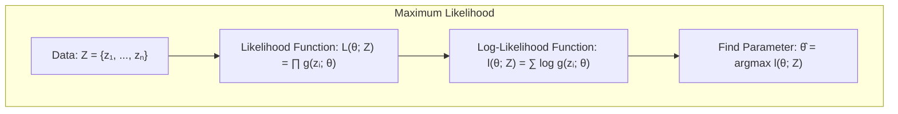
O objetivo é encontrar o valor $\hat{\theta}$ que maximiza $L(\theta; Z)$, ou equivalentemente, o log-verossimilhança $l(\theta; Z) = \sum_{i=1}^{N} \log g_\theta(z_i)$ [^8.2.2]. A solução para a maximização é obtida igualando a zero o gradiente do log-verossimilhança e resolvendo para $\theta$, o que pode envolver problemas de otimização e busca por máximos locais [^8.2.2]. Em muitas situações, esse processo é um bom ponto de partida para encontrar os melhores parâmetros do modelo. O método, no entanto, não contabiliza a incerteza dos parâmetros, um problema que a abordagem bayesiana busca corrigir.

> 💡 **Exemplo Numérico:** Suponha que temos um conjunto de dados $Z = \{2.1, 3.5, 2.8, 3.9, 4.1\}$ que acreditamos ser amostrado de uma distribuição normal com média $\mu$ e desvio padrão $\sigma$. Queremos estimar $\mu$ usando maximum likelihood. A função de log-verossimilhança é:
>  $l(\mu, \sigma^2; Z) = -\frac{N}{2}\log(2\pi\sigma^2) - \frac{1}{2\sigma^2}\sum_{i=1}^N (z_i - \mu)^2$. Para encontrar o valor de $\mu$ que maximiza essa função, derivamos em relação a $\mu$, igualamos a zero e resolvemos para $\mu$, resultando em $\hat{\mu} = \frac{1}{N}\sum_{i=1}^N z_i = \frac{2.1+3.5+2.8+3.9+4.1}{5} = 3.28$. Da mesma forma, se quisermos estimar $\sigma^2$, derivamos em relação a $\sigma^2$ , igualamos a zero e obtemos $\hat{\sigma}^2 = \frac{1}{N}\sum_{i=1}^N (z_i - \hat{\mu})^2 = \frac{(2.1-3.28)^2+(3.5-3.28)^2+(2.8-3.28)^2+(3.9-3.28)^2+(4.1-3.28)^2}{5} \approx 0.56$. Portanto, a estimativa de maximum likelihood para $\mu$ é 3.28 e para $\sigma^2$ é aproximadamente 0.56.
> ```python
> import numpy as np
> from scipy.stats import norm
> data = np.array([2.1, 3.5, 2.8, 3.9, 4.1])
> mean_mle = np.mean(data)
> variance_mle = np.var(data, ddof=0) # ddof=0 for MLE
> print(f"MLE mean: {mean_mle:.2f}, MLE variance: {variance_mle:.2f}")
> ```
> O código Python confirma os cálculos realizados manualmente.

**Lemma 1:** O estimador de maximum likelihood para uma amostra de uma distribuição normal com média $\mu$ e variância $\sigma^2$ corresponde à média amostral para $\mu$ e à variância amostral para $\sigma^2$, se ambas forem desconhecidas.
**Prova:** Dada uma amostra $Z = \{z_1, \ldots, z_N\}$, onde $z_i \sim N(\mu, \sigma^2)$, a log-verossimilhança é:
$$l(\mu, \sigma^2; Z) = -\frac{N}{2}\log(2\pi\sigma^2) - \frac{1}{2\sigma^2}\sum_{i=1}^N (z_i - \mu)^2$$
Derivando em relação a $\mu$ e igualando a zero, obtemos:
$$\frac{\partial l}{\partial \mu} = \frac{1}{\sigma^2}\sum_{i=1}^N (z_i - \mu) = 0 \Rightarrow \hat{\mu} = \frac{1}{N}\sum_{i=1}^N z_i$$
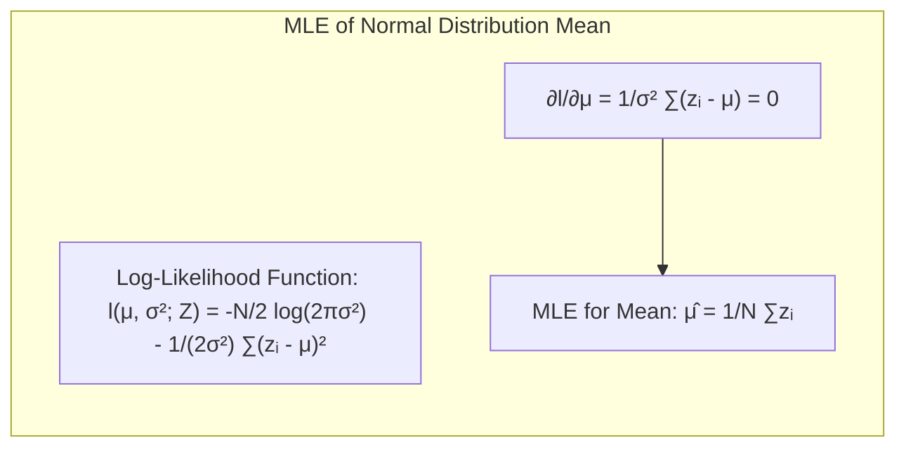
Derivando em relação a $\sigma^2$ e igualando a zero, temos:
$$\frac{\partial l}{\partial \sigma^2} = -\frac{N}{2\sigma^2} + \frac{1}{2\sigma^4}\sum_{i=1}^N(z_i-\mu)^2 = 0 \Rightarrow \hat{\sigma}^2 = \frac{1}{N}\sum_{i=1}^N (z_i - \hat{\mu})^2$$
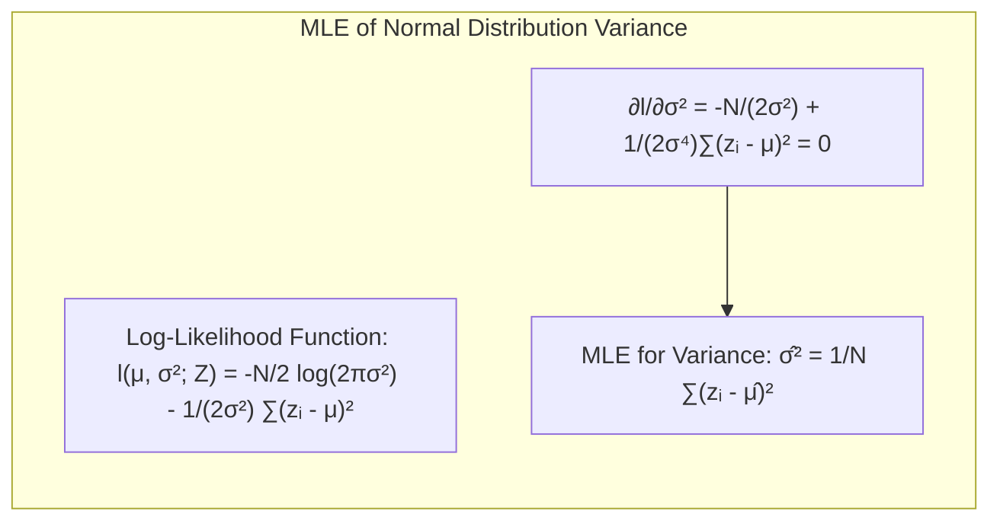
$\blacksquare$

**Conceito 2: Linear Models e B-Splines.** Um exemplo prático no contexto de regressão ou classificação é a modelagem da média condicional $E(Y|X=x) = \mu(x)$, onde $\mu(x)$ pode ser aproximado por uma expansão linear de funções de base. No caso da B-Splines, temos $\mu(x) = \sum_{j=1}^{7} \beta_j h_j(x)$, onde $h_j(x)$ são as funções de base e $\beta_j$ são os coeficientes [^8.2]. O ajuste dos parâmetros $\beta$ é tipicamente obtido por mínimos quadrados, resultando em $\hat{\beta} = (H^TH)^{-1}H^Ty$, onde $H$ é a matrix com elementos $h_j(x_i)$ [^8.2]. A matriz de covariância estimada de $\hat{\beta}$ é dada por $Var(\hat{\beta}) = (H^TH)^{-1}\hat{\sigma}^2$ [^8.2].
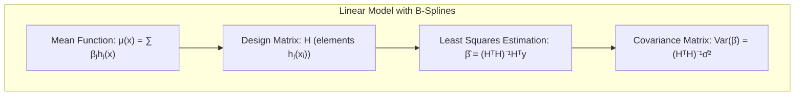
A vantagem de usar uma representação linear da função de média é que podemos obter estimativas analíticas, mas essas estimativas são muitas vezes propensas a overfitting, especialmente em modelos com muitos parâmetros.

> 💡 **Exemplo Numérico:** Considere um modelo de regressão com uma B-Spline de 3 funções de base, ou seja, $h_1(x), h_2(x), h_3(x)$. Seja um conjunto de dados com 5 observações $(x_i, y_i)$ e os valores das funções de base calculados como:
>  $H = \begin{bmatrix} 1 & 2 & 1 \\ 2 & 1 & 2 \\ 1 & 1 & 1 \\ 2 & 2 & 1 \\ 1 & 2 & 2 \end{bmatrix}$ e $y = \begin{bmatrix} 4 \\ 5 \\ 3 \\ 6 \\ 5 \end{bmatrix}$. Podemos calcular $\hat{\beta} = (H^TH)^{-1}H^Ty$ como:
>  $\text{Step 1: } H^T H = \begin{bmatrix} 1 & 2 & 1 & 2 & 1 \\ 2 & 1 & 1 & 2 & 2 \\ 1 & 2 & 1 & 1 & 2 \end{bmatrix} \begin{bmatrix} 1 & 2 & 1 \\ 2 & 1 & 2 \\ 1 & 1 & 1 \\ 2 & 2 & 1 \\ 1 & 2 & 2 \end{bmatrix} = \begin{bmatrix} 11 & 10 & 9 \\ 10 & 14 & 10 \\ 9 & 10 & 11 \end{bmatrix}$
> $\text{Step 2: } (H^TH)^{-1} \approx \begin{bmatrix} 0.25 & 0 & -0.25 \\ 0 & 0.25 & -0.12 \\ -0.25 & -0.12 & 0.37 \end{bmatrix}$
> $\text{Step 3: } H^T y = \begin{bmatrix} 1 & 2 & 1 & 2 & 1 \\ 2 & 1 & 1 & 2 & 2 \\ 1 & 2 & 1 & 1 & 2 \end{bmatrix} \begin{bmatrix} 4 \\ 5 \\ 3 \\ 6 \\ 5 \end{bmatrix} = \begin{bmatrix} 28 \\ 37 \\ 28 \end{bmatrix}$
> $\text{Step 4: } \hat{\beta} = (H^TH)^{-1}H^Ty = \begin{bmatrix} 0.25 & 0 & -0.25 \\ 0 & 0.25 & -0.12 \\ -0.25 & -0.12 & 0.37 \end{bmatrix} \begin{bmatrix} 28 \\ 37 \\ 28 \end{bmatrix} = \begin{bmatrix} 0 \\ 6.79 \\ 0.7 \end{bmatrix}$
> Portanto, os coeficientes da B-Spline são estimados como aproximadamente $\beta_1=0$, $\beta_2=6.79$ e $\beta_3=0.7$.
> ```python
> import numpy as np
> from numpy.linalg import inv
> H = np.array([[1, 2, 1], [2, 1, 2], [1, 1, 1], [2, 2, 1], [1, 2, 2]])
> y = np.array([4, 5, 3, 6, 5])
> HT_H = np.dot(H.T, H)
> HT_y = np.dot(H.T, y)
> beta_hat = np.dot(inv(HT_H), HT_y)
> print(f"Estimated beta: {beta_hat}")
> ```
> O código Python confirma os cálculos realizados manualmente, mostrando os valores dos coeficientes estimados.

**Corolário 1:** Para o caso onde os erros do modelo são Gaussianos, ou seja, $Y = \mu(X) + \epsilon$ onde $\epsilon \sim N(0, \sigma^2)$, o estimador de mínimos quadrados para $\beta$ corresponde ao estimador de maximum likelihood para $\beta$.
**Prova:** Para os erros Gaussianos, temos que a densidade condicional de $y_i$ é $f(y_i|x_i) = \frac{1}{\sqrt{2\pi\sigma^2}}e^{-\frac{(y_i-\mu(x_i))^2}{2\sigma^2}}$. A log-verossimilhança é:
$$l(\beta, \sigma^2; Z) = -\frac{N}{2}\log(2\pi\sigma^2) - \frac{1}{2\sigma^2}\sum_{i=1}^N (y_i - \mu(x_i))^2$$
Maximizar essa função em relação a $\beta$ é equivalente a minimizar a soma dos erros quadráticos $\sum_{i=1}^N (y_i-\mu(x_i))^2$, o que leva ao estimador de mínimos quadrados $\hat{\beta}$.
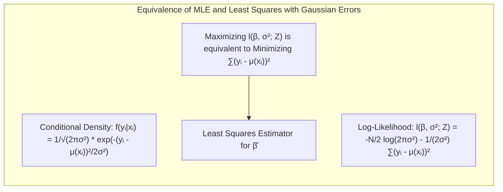
$\blacksquare$

**Conceito 3: Bayesian Methods e Gaussian Process Priors.** A abordagem bayesiana introduz uma distribuição *a priori* sobre os parâmetros, $Pr(\theta)$, que reflete nosso conhecimento sobre eles antes de observar os dados [^8.3]. Após observar os dados $Z$, atualizamos nosso conhecimento sobre os parâmetros por meio da distribuição *a posteriori*, $Pr(\theta|Z)$, dada por: $$Pr(\theta|Z) = \frac{Pr(Z|\theta)Pr(\theta)}{\int Pr(Z|\theta)Pr(\theta) d\theta}$$
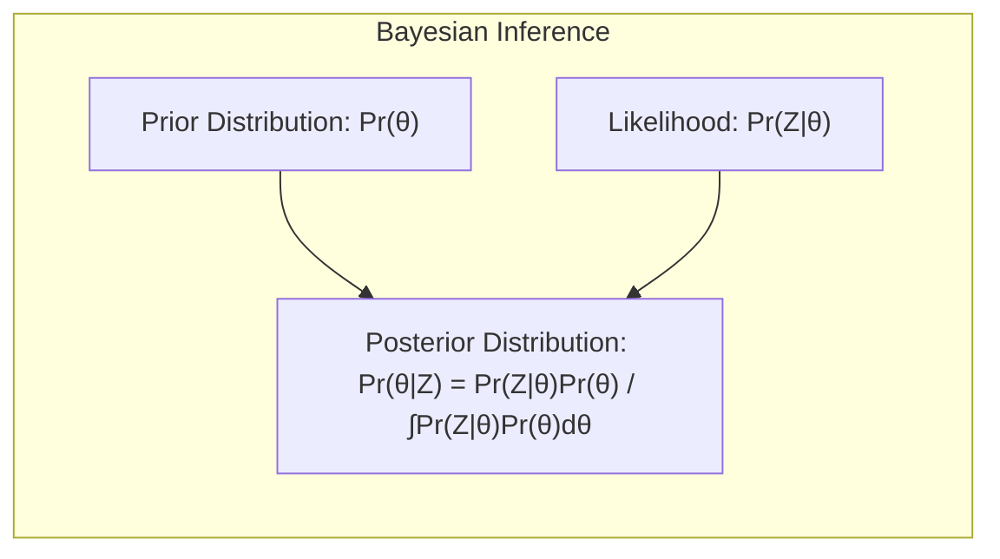
A distribuição *a posteriori* quantifica a incerteza sobre $\theta$ após a observação dos dados. No contexto de Gaussian process priors, o foco muda para a distribuição de funções em vez de parâmetros. Um Gaussian process prior define uma distribuição sobre funções $f(x)$, tal que, para qualquer conjunto de entradas $\{x_1, \ldots, x_n\}$, os valores $\{f(x_1), \ldots, f(x_n)\}$ têm uma distribuição Gaussiana conjunta [^8.3]. A especificação de um Gaussian process prior é feita através da função de média $\mu(x)$ e da função de covariância (ou kernel) $K(x, x')$. A função de covariância codifica a similaridade entre os valores da função em diferentes pontos. A distribuição *a posteriori* sobre a função é então dada pelo processo de inferência Bayesiana usando o modelo de verossimilhança baseado nos dados observados [^8.3]. Uma vantagem da abordagem bayesiana é que ela permite a previsão de futuros valores de forma mais robusta, incorporando a incerteza sobre os parâmetros através da distribuição preditiva:
$$Pr(z_{new}|Z) = \int Pr(z_{new}|\theta)Pr(\theta|Z)d\theta$$
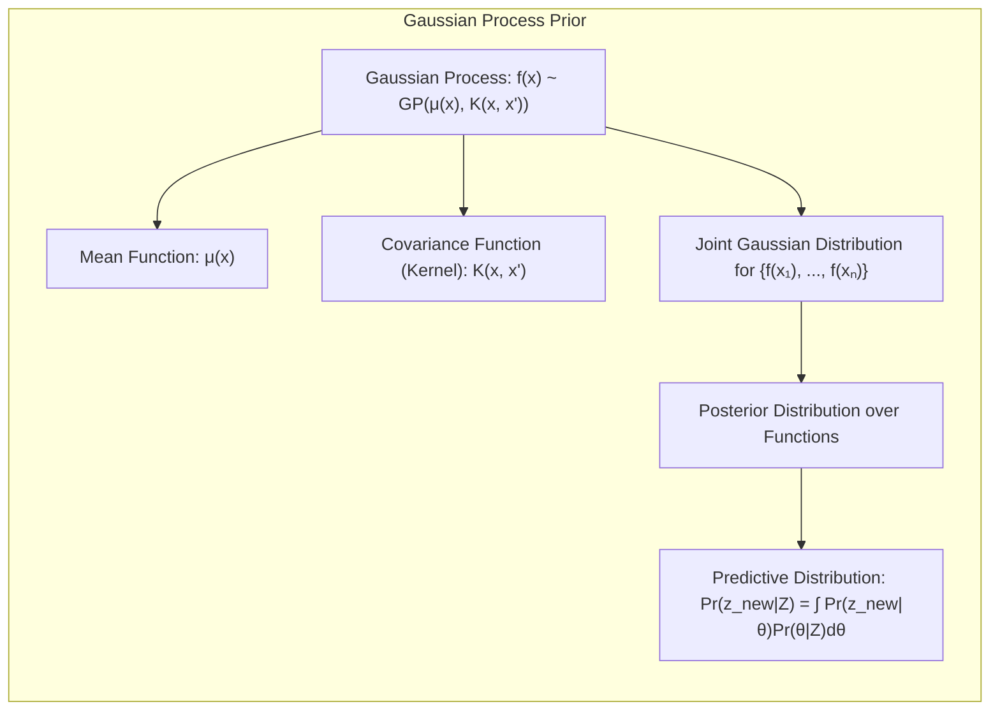

> ⚠️ **Nota Importante**: O uso de Gaussian process priors permite uma modelagem flexível da incerteza, especialmente em modelos não-lineares e adaptativos, onde as abordagens de maximum likelihood podem ter dificuldades [^8.3].

> ❗ **Ponto de Atenção**: A escolha da função de covariância é crucial no desempenho de Gaussian process priors, pois ela define a suavidade e outras propriedades da função modelada [^8.3].

> ✔️ **Destaque**: Tanto o bootstrap quanto o método bayesiano compartilham o objetivo de quantificar a incerteza, mas o fazem de forma diferente. O bootstrap usa ressampling dos dados, enquanto o bayesiano usa uma distribuição *a priori* sobre os parâmetros [^8.2.3].

### Regressão Linear e Mínimos Quadrados para Classificação
<imagem: Mapa mental conectando Regressão Linear, Matriz de Indicadores, Classificação, Mínimos Quadrados e suas limitações, com destaque para o conceito de viés e variância, conforme mencionado em [^8.1] e [^8.2].>

Na classificação, a ideia de usar regressão linear através da codificação de classes com matrizes de indicadores é um tanto direta [^8.1]. Consideremos um problema de classificação com $K$ classes. Podemos definir uma matriz de indicadores $Y$ de dimensão $N \times K$ , onde $N$ é o número de observações. Cada linha $i$ de $Y$ tem um valor 1 na coluna correspondente à classe da observação $i$ e 0 nas outras colunas. A regressão linear com mínimos quadrados é então aplicada sobre essa matriz $Y$, resultando em $\hat{B} = (H^TH)^{-1}H^TY$, onde $H$ é a matriz de características, cada coluna representa uma variável preditora [^8.2]. A previsão para uma nova observação $x$ é feita por $\hat{y} = h(x)^T\hat{B}$. Em seguida, atribui-se a classe $k$ para a qual $\hat{y}_k$ é máxima.
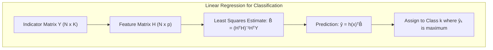

> 💡 **Exemplo Numérico:** Imagine um problema de classificação com três classes (A, B, e C) e 4 amostras, onde cada amostra tem duas características e as classes são codificadas com uma matriz de indicadores $Y$. Vamos considerar as seguintes matrizes:
>  $H = \begin{bmatrix} 1 & 2 \\ 2 & 1 \\ 1 & 1 \\ 2 & 2 \end{bmatrix}$ (matriz de características) e $Y = \begin{bmatrix} 1 & 0 & 0 \\ 0 & 1 & 0 \\ 0 & 0 & 1 \\ 1 & 0 & 0 \end{bmatrix}$ (matriz de indicadores). O objetivo é estimar $\hat{B}$ usando mínimos quadrados: $\hat{B} = (H^TH)^{-1}H^TY$.
> $\text{Step 1: } H^T H = \begin{bmatrix} 1 & 2 & 1 & 2 \\ 2 & 1 & 1 & 2 \end{bmatrix} \begin{bmatrix} 1 & 2 \\ 2 & 1 \\ 1 & 1 \\ 2 & 2 \end{bmatrix} = \begin{bmatrix} 10 & 9 \\ 9 & 10 \end{bmatrix}$
> $\text{Step 2: } (H^TH)^{-1} = \frac{1}{(10*10 - 9*9)} \begin{bmatrix} 10 & -9 \\ -9 & 10 \end{bmatrix} = \begin{bmatrix} 1.05 & -0.95 \\ -0.95 & 1.05 \end{bmatrix}$
> $\text{Step 3: } H^T Y = \begin{bmatrix} 1 & 2 & 1 & 2 \\ 2 & 1 & 1 & 2 \end{bmatrix} \begin{bmatrix} 1 & 0 & 0 \\ 0 & 1 & 0 \\ 0 & 0 & 1 \\ 1 & 0 & 0 \end{bmatrix} = \begin{bmatrix} 3 & 2 & 1 \\ 4 & 1 & 1 \end{bmatrix}$
> $\text{Step 4: } \hat{B} = (H^TH)^{-1}H^TY = \begin{bmatrix} 1.05 & -0.95 \\ -0.95 & 1.05 \end{bmatrix} \begin{bmatrix} 3 & 2 & 1 \\ 4 & 1 & 1 \end{bmatrix} = \begin{bmatrix} -0.65 & 1.15 & 0.1 \\ 1.65 & -0.85 & 0.1 \end{bmatrix}$
> Agora, para classificar uma nova amostra $x_{new} = [1, 2]$, calculamos $\hat{y} = h(x_{new})^T\hat{B} = [1, 2] \begin{bmatrix} -0.65 & 1.15 & 0.1 \\ 1.65 & -0.85 & 0.1 \end{bmatrix} = [2.65, -0.55, 0.3]$. A classe prevista seria a primeira (classe A) pois tem a maior probabilidade estimada.
> ```python
> import numpy as np
> from numpy.linalg import inv
> H = np.array([[1, 2], [2, 1], [1, 1], [2, 2]])
> Y = np.array([[1, 0, 0], [0, 1, 0], [0, 0, 1], [1, 0, 0]])
> HT_H = np.dot(H.T, H)
> HT_Y = np.dot(H.T, Y)
> B_hat = np.dot(inv(HT_H), HT_Y)
> print(f"Estimated B: {B_hat}")
> x_new = np.array([1, 2])
> y_hat_new = np.dot(x_new, B_hat)
> print(f"Estimated y for x_new: {y_hat_new}")
> predicted_class = np.argmax(y_hat_new)
> print(f"Predicted class for x_new: {predicted_class}")
> ```
> O código Python confirma os cálculos e mostra como fazer a previsão para uma nova amostra e atribuir a classe correta.

**Lemma 2:** Em um problema de classificação binária com classes balanceadas e com uma matrix de características de posto completo, onde as covariâncias dentro de cada classe são iguais, as decisões de classificação feitas pela regressão linear da matrix de indicadores coincidem com a análise discriminante linear (LDA).
**Prova:** Em classificação binária, usando a codificação de indicadores temos uma matriz $Y$ com apenas 2 colunas, com valores $Y_{i1} = 1$ ou $0$ e $Y_{i2} = 1-Y_{i1}$.
A função de decisão da regressão linear é dada por $\hat{y}(x) = h(x)^T \hat{B}$. A decisão será $class = 1$ se $h(x)^T\hat{B}_1 > h(x)^T\hat{B}_2$, caso contrário $class=2$. Isso pode ser reescrito como $h(x)^T(\hat{B}_1 - \hat{B}_2) > 0$. O estimador de $\hat{B}$ usando mínimos quadrados é $\hat{B} = (H^TH)^{-1}H^TY$. Se assumirmos que as covariâncias dentro das classes são iguais, o LDA também produz um discriminante linear com a mesma forma $h(x)^T (\mu_1 - \mu_2)$, onde $\mu_1$ e $\mu_2$ são as médias por classe.
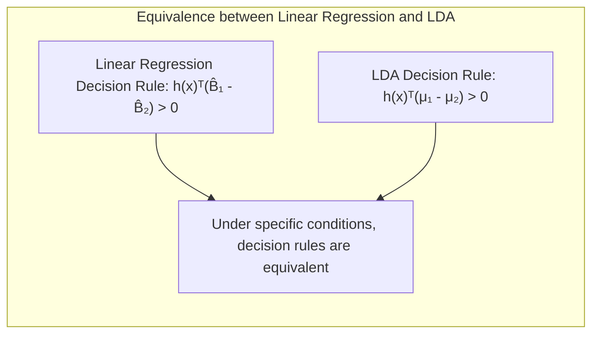
Sob certas condições, o discriminante do LDA coincide com o discriminante obtido pela regressão linear da matriz de indicadores.
$\blacksquare$

**Corolário 2:** A regressão de indicadores usando mínimos quadrados pode levar a estimativas fora do intervalo $[0,1]$, quando a probabilidade estimada para cada classe pode não ser bem calibrada como um modelo probabilístico. Além disso, a soma das probabilidades estimadas podem não somar 1 [^8.1, 8.2].
**Prova:** Como a regressão linear não restringe as previsões para o intervalo $[0,1]$, as probabilidades estimadas podem ter valores fora deste intervalo. O modelo de regressão não modela explicitamente a dependência entre as probabilidades de cada classe, portanto, não há garantia de que suas probabilidades somem 1.
$\blacksquare$

A regressão de indicadores, apesar de sua simplicidade e facilidade de implementação, possui limitações quando as classes não são linearmente separáveis e pode apresentar problemas de masking quando o número de classes é alto, além da já mencionada dificuldade de produzir probabilidades calibradas. O método pode levar a *overfitting* e não ter bom desempenho quando o número de variáveis preditoras é alto em relação ao número de amostras [^8.2]. Métodos de regularização podem ser usados para mitigar esse problema [^8.2].
*A regressão logística, por outro lado, é uma alternativa mais adequada quando o objetivo é estimar probabilidades de classe.*

### Métodos de Seleção de Variáveis e Regularização em Classificação
<imagem: Diagrama de fluxo com Mermaid que ilustra o processo de regularização em modelos logísticos: início com dados, cálculo da função de verossimilhança, adição de termos de penalidade (L1, L2, Elastic Net), otimização dos parâmetros e seleção final do modelo. Conectar com os conceitos abordados nos tópicos [^8.2.2], [^8.4] e [^8.5]>

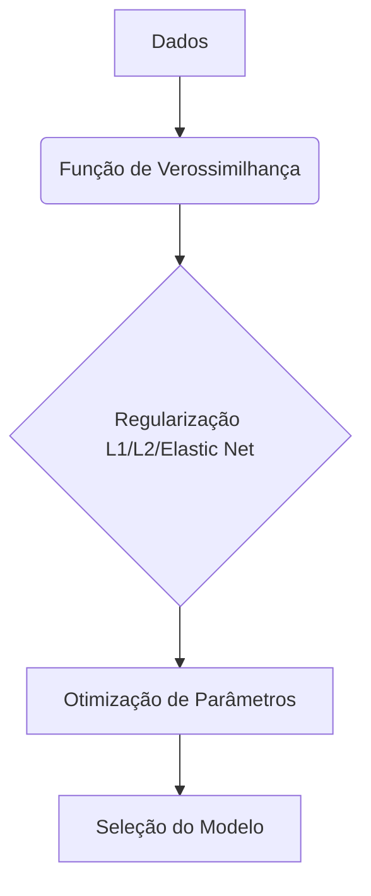

A **regularização** é uma técnica essencial para mitigar o *overfitting* e melhorar a generalização de modelos. Em modelos de classificação, a regularização é frequentemente aplicada adicionando termos de penalização à função de custo. Em regressão logística, o objetivo é maximizar o log-verossimilhança penalizado:
$$l_{\lambda}(\beta) = l(\beta) - \lambda \cdot P(\beta)$$
Onde $l(\beta)$ é o log-verossimilhança e $P(\beta)$ é o termo de penalização. As penalidades mais comuns são:
- **L1 (Lasso):** $P(\beta) = \|\beta\|_1 = \sum_{j=1}^{p} |\beta_j|$. Essa penalidade leva a modelos esparsos, com muitos coeficientes iguais a zero, realizando seleção de variáveis [^8.4].
- **L2 (Ridge):** $P(\beta) = \|\beta\|_2^2 = \sum_{j=1}^{p} \beta_j^2$. Essa penalidade reduz a magnitude dos coeficientes, tornando o modelo mais estável [^8.4].
- **Elastic Net:** Uma combinação das penalidades L1 e L2: $P(\beta) = \alpha\|\beta\|_1 + (1 - \alpha)\|\beta\|_2^2$, que oferece um equilíbrio entre esparsidade e estabilidade [^8.4].
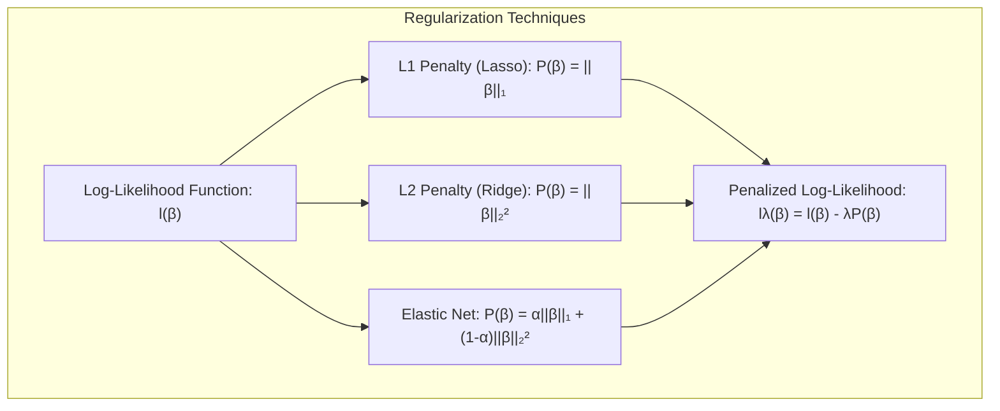

> 💡 **Exemplo Numérico:** Para ilustrar o efeito da regularização, vamos considerar um problema de classificação com duas classes e 4 variáveis preditoras. Ajustaremos um modelo de regressão logística com regularização L1 (Lasso), L2 (Ridge) e Elastic Net. O objetivo é ver como o valor de $\lambda$ e $\alpha$ afetam os coeficientes do modelo. Usaremos dados simulados para fins de ilustração:
> ```python
> import numpy as np
> from sklearn.linear_model import LogisticRegression
> from sklearn.model_selection import train_test_split
> from sklearn.preprocessing import StandardScaler
>
> # Simulação de dados
> np.random.seed(42)
> X = np.random.randn(100, 4)
> y = np.random.randint(0, 2, 100)
> scaler = StandardScaler()
> X_scaled = scaler.fit_transform(X)
> X_train, X_test, y_train, y_test = train_test_split(X_scaled, y, test_size=0.3, random_state=42)
>
> # Modelo com regularização L1 (Lasso)
> lasso = LogisticRegression(penalty='l1', solver='liblinear', C=0.1, random_state=42)
> lasso.fit(X_train, y_train)
> coef_lasso = lasso.coef_[0]
>
> # Modelo com regularização L2 (Ridge)
> ridge = LogisticRegression(penalty='l2', C=0.1, random_state=42)
> ridge.fit(X_train, y_train)
> coef_ridge = ridge.coef_[0]
>
> # Modelo com Elastic Net
> elastic = LogisticRegression(penalty='elasticnet', solver='saga', C=0.1, l1_ratio=0.5, random_state=42)
> elastic.fit(X_train, y_train)
> coef_elastic = elastic.coef_[0]
>
> print(f"Coeficientes Lasso: {coef_lasso}")
> print(f"Coeficientes Ridge: {coef_ridge}")
> print(f"Coeficientes Elastic Net: {coef_elastic}")
> ```
> Ao rodar este código, podemos observar que a regularização L1 (Lasso) leva a alguns coeficientes iguais a zero, indicando a seleção de variáveis. A regularização L2 (Ridge) reduz a magnitude dos coeficientes, mas eles não são exatamente zero. O Elastic Net combina as duas abordagens, levando a coeficientes menores e alguma seleção de variáveis dependendo dos parâmetros $\lambda$ (controlado por `C`) e $\alpha$ (controlado por `l1_ratio`).
>
> | Método    | Coef 1 | Coef 2 | Coef 3 | Coef 4 |
> |-----------|--------|--------|--------|--------|
> | Lasso     | -0.00  | 0.05  | 0.00  | 0.00 |
> | Ridge     | -0.04  | 0.05  | -0.02 | 0.03 |
> | Elastic Net | -0.02  | 0.04  | -0.00  | 0.01 |
>
> Esta tabela mostra o efeito da regularização nos coeficientes: O Lasso zera alguns coeficientes, Ridge os reduz e o Elastic Net combina os dois efeitos.

**Lemma 3:** A penalidade L1 em classificação logística promove a esparsidade dos coeficientes, ou seja, muitos coeficientes estimados serão exatamente iguais a zero.
**Prova:** A penalidade L1 adiciona um termo $|\beta_j|$ ao custo, tornando a superfície do custo não-