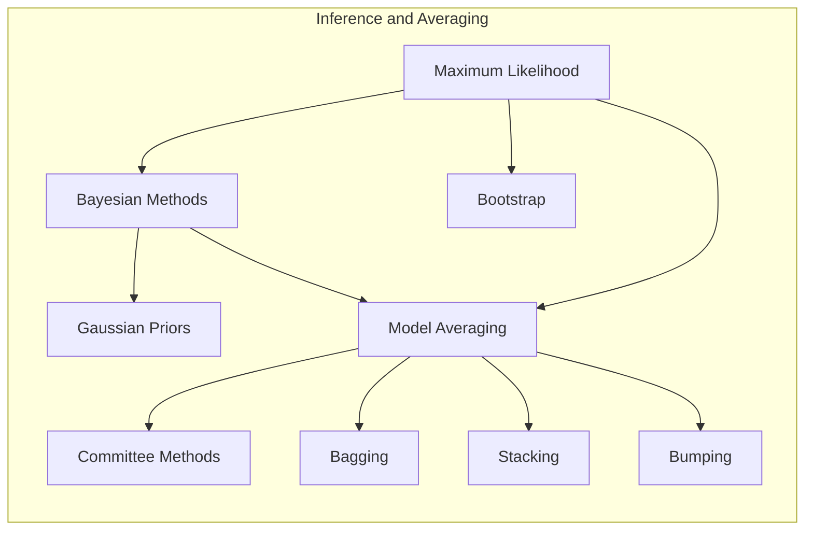
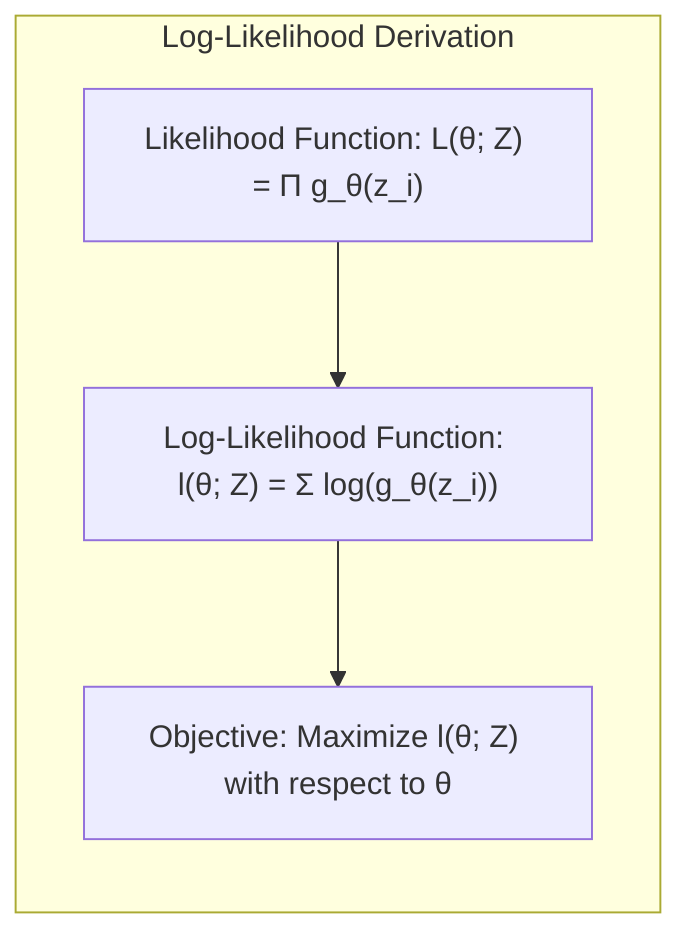
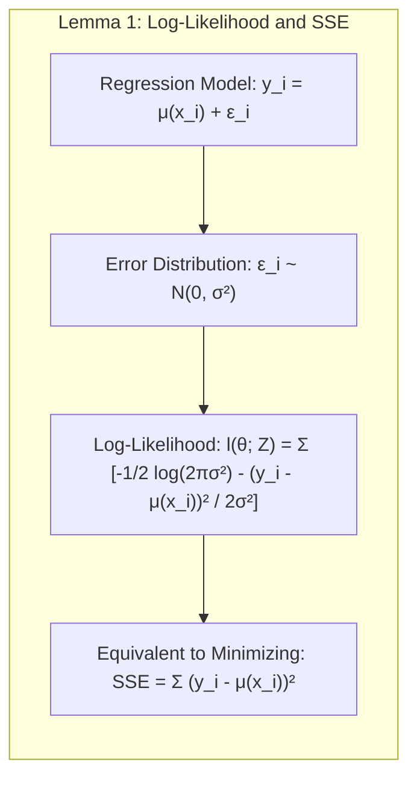
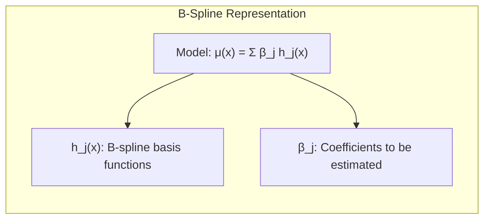
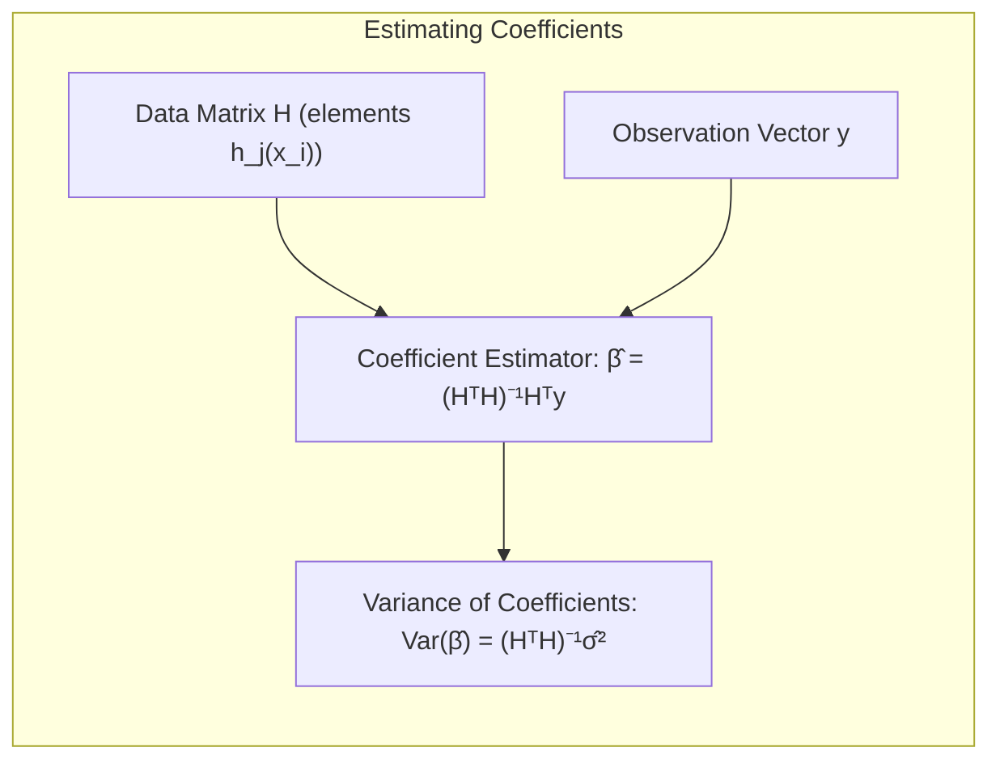
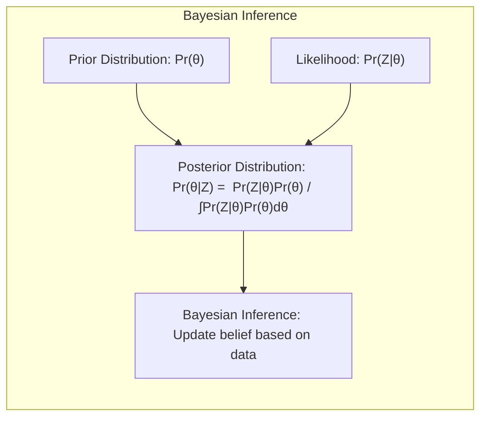
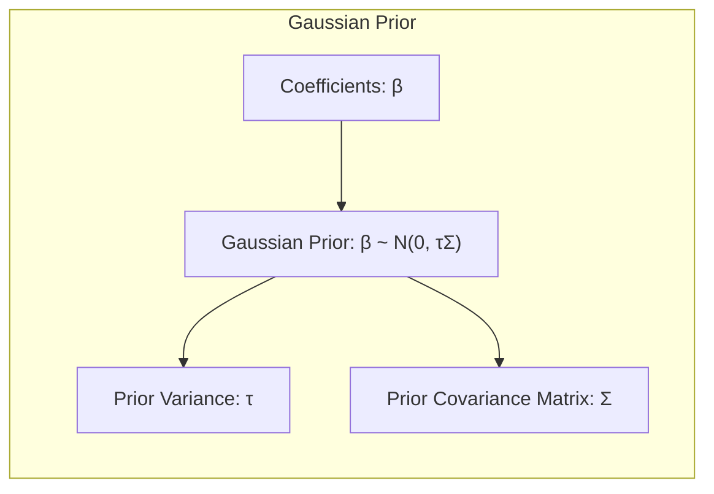
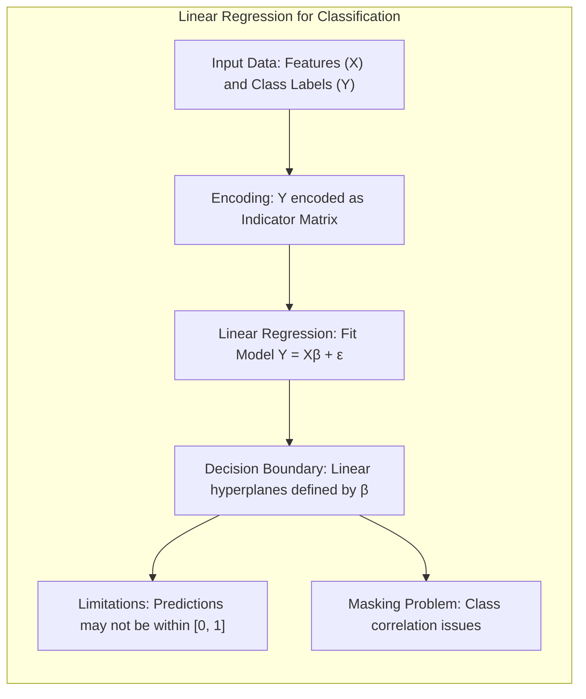
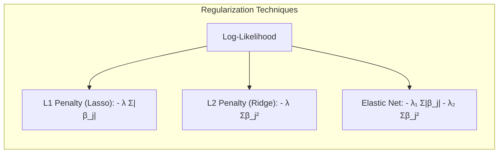
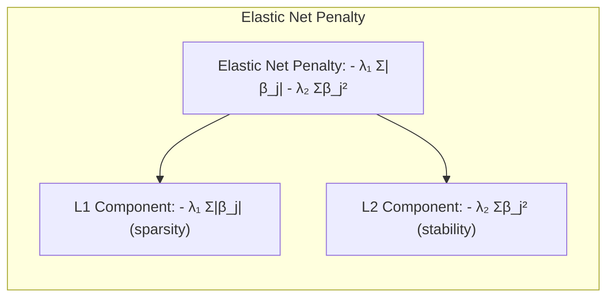

## Gaussian Priors em Modelos de Inferência e Média



### Introdução

Este capítulo aborda a inferência de modelos e técnicas de averaging, com ênfase na abordagem de **Maximum Likelihood** e em métodos Bayesianos, incluindo o uso de **Gaussian priors**. A motivação principal é encontrar formas eficazes de ajustar modelos a dados, quantificar incertezas e combinar modelos para obter previsões mais robustas. Inicialmente, modelos são ajustados minimizando a soma dos quadrados (para regressão) ou a cross-entropy (para classificação), que são, essencialmente, instâncias da abordagem de maximum likelihood [^8.1]. No entanto, este capítulo explora formalmente o método de maximum likelihood e o método Bayesiano para inferência. O *bootstrap*, apresentado anteriormente, será discutido neste contexto, juntamente com sua relação com maximum likelihood e Bayes. Finalmente, serão apresentadas técnicas para model averaging e aprimoramento, incluindo métodos de comitê, bagging, stacking e bumping [^8.1].

### Conceitos Fundamentais
**Conceito 1: Maximum Likelihood e Modelos Paramétricos**

O método de **maximum likelihood** busca encontrar os parâmetros de um modelo que melhor explicam os dados observados, maximizando a função de verossimilhança (likelihood) [^8.2.2]. Dado um conjunto de dados $Z = \{z_1, z_2, \ldots, z_N\}$ e um modelo paramétrico $g_{\theta}(z)$ que descreve a probabilidade de observar um dado ponto $z$, onde $\theta$ representa os parâmetros do modelo, a função de verossimilhança é dada por [^8.2.2]:
$$
L(\theta; Z) = \prod_{i=1}^{N} g_{\theta}(z_i)
$$
O objetivo é encontrar o valor de $\theta$ que maximize esta função de verossimilhança. Usualmente, é mais conveniente trabalhar com o log-likelihood, denotado por $l(\theta; Z)$, que é a soma dos log-likelihoods componentes [^8.2.2]:

$$
l(\theta; Z) = \sum_{i=1}^{N} \log g_{\theta}(z_i)
$$
O estimador de maximum likelihood $\hat{\theta}$ é o valor de $\theta$ que maximiza $l(\theta; Z)$. Em geral, não existe uma solução analítica para esse problema e é preciso recorrer a métodos numéricos.

> 💡 **Exemplo Numérico:** Considere um modelo simples onde $g_\theta(z_i)$ é uma distribuição normal com média $\mu$ e desvio padrão $\sigma$, ou seja,  $z_i \sim \mathcal{N}(\mu, \sigma^2)$. Temos um dataset com três pontos $Z = \{2, 4, 6\}$. A função de verossimilhança para um único ponto é $g_{\theta}(z_i) = \frac{1}{\sqrt{2\pi\sigma^2}}e^{-\frac{(z_i-\mu)^2}{2\sigma^2}}$. Para maximizar a verossimilhança, buscamos os parâmetros $\hat{\mu}$ e $\hat{\sigma}$ que maximizam:
>
> $L(\mu, \sigma; Z) = \prod_{i=1}^3 \frac{1}{\sqrt{2\pi\sigma^2}}e^{-\frac{(z_i-\mu)^2}{2\sigma^2}}$
>
> O log-likelihood é:
>
> $l(\mu, \sigma; Z) = \sum_{i=1}^3 \left[ -\frac{1}{2} \log(2\pi\sigma^2) - \frac{(z_i - \mu)^2}{2\sigma^2} \right]$
>
> Para encontrar os estimadores de maximum likelihood, derivamos $l(\mu, \sigma; Z)$ em relação a $\mu$ e $\sigma$ e igualamos a zero. No caso da média $\mu$, o estimador é $\hat{\mu} = \frac{2+4+6}{3} = 4$. Para o desvio padrão $\sigma$, $\hat{\sigma}$ é o desvio padrão amostral dos dados.
>
> Este exemplo ilustra como o método de maximum likelihood estima parâmetros que melhor explicam os dados, neste caso, a média e o desvio padrão de uma distribuição normal.

**Lemma 1:** A função de verossimilhança para erros Gaussianos aditivos em um modelo de regressão é equivalente à minimização da soma dos quadrados.

**Prova:**  Suponha um modelo de regressão $y_i = \mu(x_i) + \epsilon_i$ onde $\epsilon_i \sim N(0, \sigma^2)$. A densidade de probabilidade de $y_i$ dado $x_i$ é $g_{\theta}(y_i) = \frac{1}{\sqrt{2\pi\sigma^2}}e^{-\frac{(y_i - \mu(x_i))^2}{2\sigma^2}}$. O log-likelihood é então [^8.2.2]:


$$l(\theta; Z) = \sum_{i=1}^{N} \left[ -\frac{1}{2} \log(2\pi\sigma^2) - \frac{(y_i - \mu(x_i))^2}{2\sigma^2} \right] $$

Maximizar $l(\theta; Z)$ em relação a $\mu(x_i)$ é equivalente a minimizar $\sum_{i=1}^{N} (y_i - \mu(x_i))^2$, que é a soma dos quadrados dos erros. $\blacksquare$

> 💡 **Exemplo Numérico:** Considere um modelo de regressão linear simples: $y_i = \beta_0 + \beta_1 x_i + \epsilon_i$, com $\epsilon_i \sim N(0, \sigma^2)$. Temos os dados:
>
> | $x_i$ | $y_i$ |
> |-------|-------|
> | 1     | 3     |
> | 2     | 5     |
> | 3     | 6     |
>
> Usando a prova do Lema 1, o log-likelihood é:
>
> $l(\beta_0, \beta_1, \sigma^2; Z) = \sum_{i=1}^3 \left[ -\frac{1}{2} \log(2\pi\sigma^2) - \frac{(y_i - (\beta_0 + \beta_1 x_i))^2}{2\sigma^2} \right]$
>
> Maximizar esse log-likelihood é equivalente a minimizar a soma dos quadrados dos erros:
>
> $\text{SSE} = \sum_{i=1}^3 (y_i - (\beta_0 + \beta_1 x_i))^2 = (3 - (\beta_0 + \beta_1))^2 + (5 - (\beta_0 + 2\beta_1))^2 + (6 - (\beta_0 + 3\beta_1))^2$
>
> A solução de mínimos quadrados para este problema é $\hat{\beta}_0 = 2.33$ e $\hat{\beta}_1 = 1.17$. Isso demonstra como o método de maximum likelihood se relaciona à minimização da soma dos quadrados para modelos de regressão linear com erros Gaussianos.

**Conceito 2: Linear Splines e B-splines**
O uso de **B-splines** como funções de base para representar $\mu(x)$ é uma técnica poderosa em modelagem não linear. Uma função spline cúbica com três nós pode ser definida como uma combinação linear de sete funções base $h_j(x)$, como [^8.2]:

$$
\mu(x) = \sum_{j=1}^{7} \beta_j h_j(x)
$$
Onde $h_j(x)$ são as funções B-spline e $\beta_j$ são os coeficientes a serem estimados. A matriz $H$, com elementos $h_j(x_i)$, e o vetor $y$ das observações, permitem estimar $\beta$ através de mínimos quadrados [^8.2]:

$$
\hat{\beta} = (H^TH)^{-1}H^Ty
$$
A variância dos coeficientes é estimada por [^8.2]:
$$
Var(\hat{\beta}) = (H^TH)^{-1}\hat{\sigma}^2
$$
onde $\hat{\sigma}^2$ é a variância dos erros.

> 💡 **Exemplo Numérico:**  Vamos considerar um exemplo simplificado com apenas 3 funções B-spline, ou seja, $h_1(x)$, $h_2(x)$ e $h_3(x)$. Temos os seguintes valores para $x_i$ e os respectivos valores das B-splines:
>
> | $x_i$ | $h_1(x_i)$ | $h_2(x_i)$ | $h_3(x_i)$ | $y_i$ |
> |-------|------------|------------|------------|-------|
> | 1     | 0.5        | 0.3        | 0.2        | 2.5   |
> | 2     | 0.2        | 0.6        | 0.2        | 4.1   |
> | 3     | 0.1        | 0.3        | 0.6        | 6.0   |
>
> A matriz $H$ e o vetor $y$ são:
>
> $$ H = \begin{bmatrix} 0.5 & 0.3 & 0.2 \\ 0.2 & 0.6 & 0.2 \\ 0.1 & 0.3 & 0.6 \end{bmatrix} \quad y = \begin{bmatrix} 2.5 \\ 4.1 \\ 6.0 \end{bmatrix} $$
>
> Para calcular $\hat{\beta}$, seguimos os seguintes passos:
>
> 1.  Calcular $H^T$:
>
>     $$ H^T = \begin{bmatrix} 0.5 & 0.2 & 0.1 \\ 0.3 & 0.6 & 0.3 \\ 0.2 & 0.2 & 0.6 \end{bmatrix} $$
>
> 2.  Calcular $H^TH$:
>
>     $$ H^TH = \begin{bmatrix} 0.5 & 0.2 & 0.1 \\ 0.3 & 0.6 & 0.3 \\ 0.2 & 0.2 & 0.6 \end{bmatrix}  \begin{bmatrix} 0.5 & 0.3 & 0.2 \\ 0.2 & 0.6 & 0.2 \\ 0.1 & 0.3 & 0.6 \end{bmatrix} = \begin{bmatrix} 0.3 & 0.3 & 0.2 \\ 0.3 & 0.54 & 0.36 \\ 0.2 & 0.36 & 0.44 \end{bmatrix} $$
>
> 3.  Calcular $(H^TH)^{-1}$. Usando o numpy:
> ```python
> import numpy as np
> H = np.array([[0.5, 0.3, 0.2], [0.2, 0.6, 0.2], [0.1, 0.3, 0.6]])
> HT = H.T
> HTH = HT @ H
> inv_HTH = np.linalg.inv(HTH)
> print(inv_HTH)
> ```
>
>     Obtemos:
>
> $$ (H^TH)^{-1} = \begin{bmatrix} 5.57 & -2.86 & -0.71 \\ -2.86 & 5.71 & -1.43 \\ -0.71 & -1.43 & 3.57 \end{bmatrix} $$
>
> 4. Calcular $H^Ty$:
>
>  $$ H^Ty = \begin{bmatrix} 0.5 & 0.2 & 0.1 \\ 0.3 & 0.6 & 0.3 \\ 0.2 & 0.2 & 0.6 \end{bmatrix} \begin{bmatrix} 2.5 \\ 4.1 \\ 6.0 \end{bmatrix} = \begin{bmatrix} 2.07 \\ 4.71 \\ 5.42 \end{bmatrix} $$
>
> 5.  Finalmente, calcular $\hat{\beta} = (H^TH)^{-1}H^Ty$:
>
> $$ \hat{\beta} =  \begin{bmatrix} 5.57 & -2.86 & -0.71 \\ -2.86 & 5.71 & -1.43 \\ -0.71 & -1.43 & 3.57 \end{bmatrix} \begin{bmatrix} 2.07 \\ 4.71 \\ 5.42 \end{bmatrix} = \begin{bmatrix} 1.08 \\ 1.15 \\ 5.00 \end{bmatrix} $$
>
> Portanto, $\hat{\beta} \approx [1.08, 1.15, 5.00]^T$. Este exemplo demonstra como calcular os coeficientes para splines usando mínimos quadrados.

**Corolário 1:** O estimador de mínimos quadrados para o ajuste de splines com erros gaussianos aditivos coincide com o estimador de maximum likelihood.
**Prova:** Conforme provado no Lemma 1, quando os erros são gaussianos, o estimador que maximiza o log-likelihood é o mesmo que minimiza a soma dos erros quadráticos. No caso das splines, o estimador de mínimos quadrados para $\beta$ é $\hat{\beta} = (H^TH)^{-1}H^Ty$, o que coincide com o estimador obtido por maximum likelihood, conforme explicitado em [^8.2]. $\blacksquare$

**Conceito 3: Gaussian Priors e Inferência Bayesiana**
Na abordagem Bayesiana, além de um modelo para os dados, especificamos uma distribuição *a priori* para os parâmetros, $Pr(\theta)$, refletindo o conhecimento prévio sobre $\theta$ antes de observar os dados [^8.3]. A distribuição *a posteriori* é calculada utilizando o teorema de Bayes:

$$
Pr(\theta|Z) = \frac{Pr(Z|\theta)Pr(\theta)}{\int Pr(Z|\theta)Pr(\theta) \, d\theta}
$$
No contexto de regressão, um **Gaussian prior** para os coeficientes $\beta$ em um modelo de regressão é dado por:

$$
\beta \sim N(0, \tau\Sigma)
$$
onde $\tau$ é a variância *a priori* e $\Sigma$ é a matriz de correlação *a priori*. O uso de Gaussian priors implica que a distribuição *a priori* de $\mu(x)$ também é Gaussiana [^8.3]. Esta abordagem permite modelar a incerteza dos parâmetros e das previsões.

> ⚠️ **Nota Importante**: A escolha da matriz de covariância $\Sigma$ é crucial.  Uma escolha comum é $\Sigma = I$, que assume que os coeficientes são independentes a priori. **Referência ao tópico [^8.3]**.

> ❗ **Ponto de Atenção**: Gaussian priors impõem um certo nível de suavidade à solução, como visto na Figura 8.4, onde um $\tau$ menor resulta em curvas mais suaves. **Conforme indicado em [^8.3]**.

> 💡 **Exemplo Numérico:**  Suponha que temos um modelo de regressão linear $y = X\beta + \epsilon$ e queremos usar um prior Gaussiano para os coeficientes $\beta$.  Assumimos $\beta \sim N(0, \tau I)$, onde $\tau$ controla a variância do prior. Se usarmos um $\tau$ pequeno (por exemplo, $\tau = 0.1$),  estamos indicando que acreditamos que os coeficientes $\beta$ devem ser pequenos. Se $\tau$ for grande (por exemplo, $\tau = 10$), estamos menos restritivos sobre os valores de $\beta$.
>
>  Vamos visualizar o efeito de $\tau$ utilizando dados simulados:
>
> ```python
> import numpy as np
> import matplotlib.pyplot as plt
> from sklearn.linear_model import Ridge
>
> # Dados simulados
> np.random.seed(0)
> X = np.sort(5 * np.random.rand(50, 1), axis=0)
> y = np.sin(X).ravel() + 0.1 * np.random.randn(50)
>
> # Valores de alpha (inverso de tau)
> alphas = [10, 1, 0.1, 0.01]
>
> plt.figure(figsize=(10,6))
> for i, alpha in enumerate(alphas):
>     ridge = Ridge(alpha=alpha)
>     ridge.fit(X, y)
>     y_pred = ridge.predict(X)
>     plt.plot(X, y_pred, label=f'alpha={alpha}')
>
> plt.scatter(X, y, color='black', s=10, label='Dados')
> plt.legend()
> plt.title("Efeito do Regularização L2 (Ridge) com diferentes valores de alpha")
> plt.xlabel('x')
> plt.ylabel('y')
> plt.show()
> ```
>
> No exemplo acima, o alpha do Ridge regression é o inverso de tau. Vemos que com alpha grande (tau pequeno), a linha fica mais suave e próxima de zero. Isso demonstra como a escolha do valor de $\tau$ (ou alpha) afeta a complexidade do modelo e sua tendência a overfit ou underfit os dados.

> ✔️ **Destaque**:  Para $\tau \to \infty$, a distribuição posterior coincide com a distribuição do bootstrap, indicando uma relação entre Bayesian methods com priors não informativos e o bootstrap. **Baseado no tópico [^8.4]**.

### Regressão Linear e Mínimos Quadrados para Classificação



A regressão linear, ajustada por mínimos quadrados, pode ser aplicada a problemas de classificação através da codificação das classes como variáveis indicadoras. Se tivermos $K$ classes, cada observação é associada a um vetor de indicadores de classe, onde cada elemento corresponde a uma classe. Um dos elementos será igual a 1, indicando a classe a que a observação pertence, e os demais serão iguais a 0. Ao aplicar a regressão linear na matriz de indicadores, obtemos coeficientes que, implicitamente, definem as fronteiras de decisão linear [^8.1].

No entanto, essa abordagem possui limitações. Por exemplo, para problemas com mais de duas classes, a regressão linear ajustada diretamente à matriz de indicadores pode levar a predições fora do intervalo [0, 1] quando projetada. A estimação dos parâmetros pode sofrer com o *masking problem*, onde a influência de algumas classes pode obscurecer a influência de outras, especialmente se houver alta correlação entre as classes [^8.1].

Além disso, a regressão de indicadores não leva em conta a natureza categórica da variável de resposta.  Embora a regressão linear minimize a soma dos quadrados, isso pode não ser o objetivo mais adequado para a classificação [^8.1].
Para mitigar estas limitações, técnicas de regularização ou abordagens probabilísticas como a regressão logística podem ser mais apropriadas.

> 💡 **Exemplo Numérico:** Suponha que temos um problema de classificação com 3 classes (A, B e C) e temos duas características (x1, x2) para cada observação. Vamos codificar as classes usando variáveis indicadoras.
>
> |   x1  |   x2  | Class |  Y_A  |  Y_B  | Y_C   |
> |-------|-------|-------|-------|-------|-------|
> |   1   |   2   |  A    |   1   |   0   |   0   |
> |   2   |   1   |  A    |   1   |   0   |   0   |
> |   2   |   3   |  B    |   0   |   1   |   0   |
> |   3   |   2   |  B    |   0   |   1   |   0   |
> |   3   |   4   |  C    |   0   |   0   |   1   |
> |   4   |   3   |  C    |   0   |   0   |   1   |
>
> Aplicamos a regressão linear separadamente para cada coluna indicadora (Y_A, Y_B e Y_C) usando as colunas x1 e x2 como preditores. Para a classe A, o modelo seria $Y_A = \beta_{0A} + \beta_{1A}x_1 + \beta_{2A}x_2 + \epsilon_A$. Da mesma forma para as classes B e C. Após o ajuste, obtemos coeficientes para cada classe.
>
> Para prever a classe de um novo ponto (x1=2.5, x2=2.5),  calculamos os valores preditos para $Y_A$, $Y_B$ e $Y_C$ usando os coeficientes obtidos. Por exemplo:
>
> - $\hat{Y}_A = \hat{\beta}_{0A} + \hat{\beta}_{1A} \cdot 2.5 + \hat{\beta}_{2A} \cdot 2.5$
> - $\hat{Y}_B = \hat{\beta}_{0B} + \hat{\beta}_{1B} \cdot 2.5 + \hat{\beta}_{2B} \cdot 2.5$
> - $\hat{Y}_C = \hat{\beta}_{0C} + \hat{\beta}_{1C} \cdot 2.5 + \hat{\beta}_{2C} \cdot 2.5$
>
> A classe predita seria aquela com o maior valor previsto ($\hat{Y}$). Uma limitação desta abordagem é que as predições $\hat{Y}$ podem ser valores fora do intervalo [0, 1], o que não é ideal para probabilidades de classe.

**Lemma 2:** A regressão linear para classificação com matriz de indicadores, quando ajustada via mínimos quadrados, produz soluções com um componente que corresponde a projeções em hiperplanos, similares aos que podem ser obtidos por análises discriminantes lineares em condições específicas.

**Prova:**
Seja $Y$ a matriz de indicadores, onde $Y_{ij} = 1$ se a observação $i$ pertence à classe $j$ e 0 caso contrário. O modelo de regressão linear para a classe $j$ é $Y_j = X\beta_j + \epsilon_j$, onde $X$ é a matriz de features e $\beta_j$ são os coeficientes associados à classe $j$. A solução de mínimos quadrados é dada por $\hat{\beta_j} = (X^TX)^{-1}X^TY_j$. A predição para uma nova observação $x$ é $\hat{y_j} = x^T\hat{\beta_j}$. A classe predita será a classe $k$ que maximizar $\hat{y_k} = x^T\hat{\beta_k}$. Essa operação corresponde a uma projeção em hiperplanos definidos pelos coeficientes $\hat{\beta_k}$. Em certas condições, como as da LDA, estes hiperplanos serão equivalentes aos da análise discriminante linear. $\blacksquare$

**Corolário 2:** Sob certas condições de distribuição dos dados e de classes balanceadas, a regressão de indicadores pode gerar resultados comparáveis à análise discriminante linear em termos de fronteiras de decisão, mas com riscos de predições fora do intervalo \[0,1] e sem levar em conta a natureza categórica da variável de resposta.

### Métodos de Seleção de Variáveis e Regularização em Classificação


A seleção de variáveis e a regularização são técnicas importantes para melhorar a generalização e a interpretabilidade de modelos classificatórios. Em modelos lineares como a regressão logística, a regularização adiciona termos de penalidade à função de verossimilhança. Penalizações $L_1$ e $L_2$ são comuns.  A penalização $L_1$  (Lasso) adiciona um termo proporcional à norma $L_1$ dos coeficientes [^8.4]:
$$
l(\theta; Z) - \lambda \sum_{j=1}^{p} |\beta_j|
$$
Essa penalização leva a soluções esparsas, isto é, alguns coeficientes serão exatamente zero. Já a penalização $L_2$ (Ridge) adiciona um termo proporcional ao quadrado da norma $L_2$ dos coeficientes:
$$
l(\theta; Z) - \lambda \sum_{j=1}^{p} \beta_j^2
$$
A penalização $L_2$ não leva a soluções esparsas, mas reduz a magnitude dos coeficientes, melhorando a estabilidade do modelo e reduzindo o risco de overfitting. O *Elastic Net* combina as penalizações $L_1$ e $L_2$ [^8.4]:

$$
l(\theta; Z) - \lambda_1 \sum_{j=1}^{p} |\beta_j| - \lambda_2 \sum_{j=1}^{p} \beta_j^2
$$
A escolha apropriada dos hiperparâmetros $\lambda$, $\lambda_1$ e $\lambda_2$ é geralmente realizada por validação cruzada.

> 💡 **Exemplo Numérico:** Vamos considerar um problema de classificação binária usando regressão logística com penalização $L_1$ e $L_2$. Os dados consistem em 5 features (x1 até x5) e um label binário (0 ou 1). Vamos usar um conjunto de dados simulado:
>
> ```python
> import numpy as np
> import pandas as pd
> from sklearn.linear_model import LogisticRegression
> from sklearn.model_selection import train_test_split
> from sklearn.metrics import accuracy_score
>
> # Cria dados simulados
> np.random.seed(42)
> X = np.random.rand(100, 5)
> y = np.random.randint(0, 2, 100)
> X_train, X_test, y_train, y_test = train_test_split(X, y, test_size=0.3, random_state=42)
>
> # Regressão Logística sem regularização
> logreg_none = LogisticRegression(penalty=None, solver='liblinear')
> logreg_none.fit(X_train, y_train)
> y_pred_none = logreg_none.predict(X_test)
> acc_none = accuracy_score(y_test, y_pred_none)
>
> # Regressão Logística com L1 (Lasso)
> logreg_l1 = LogisticRegression(penalty='l1', C=0.1, solver='liblinear')
> logreg_l1.fit(X_train, y_train)
> y_pred_l1 = logreg_l1.predict(X_test)
> acc_l1 = accuracy_score(y_test, y_pred_l1)
>
> # Regressão Logística com L2 (Ridge)
> logreg_l2 = LogisticRegression(penalty='l2', C=0.1, solver='liblinear')
> logreg_l2.fit(X_train, y_train)
> y_pred_l2 = logreg_l2.predict(X_test)
> acc_l2 = accuracy_score(y_test, y_pred_l2)
>
> # Imprimir resultados
> print(f"Acurácia sem regularização: {acc_none:.2f}")
> print(f"Acurácia com L1 (Lasso): {acc_l1:.2f}")
> print(f"Acurácia com L2 (Ridge): {acc_l2:.2f}")
>
> # Ver os coeficientes
> print("\nCoeficientes sem regularização:", logreg_none.coef_)
> print("Coeficientes com L1 (Lasso):", logreg_l1.coef_)
> print("Coeficientes com L2 (Ridge):", logreg_l2.coef_)
>
> ```
>
> Neste exemplo, C é o inverso de lambda. Podemos ver que a regularização L1 (Lasso) leva a alguns coeficientes exatamente zero, enquanto a regularização L2 (Ridge) reduz a magnitude de todos os coeficientes. Além disso, vemos que as acurácias podem variar dependendo do método. Este exemplo ilustra como as penalidades afetam os coeficientes e a performance do modelo.
>

**Lemma 3:** A penalização $L_1$ em classificação logística induz a esparsidade na solução, tendendo a fazer com que alguns coeficientes sejam exatamente zero.

**Prova:** A penalização $L_1$ adiciona um termo $-\lambda \sum_{j=1}^{p} |\beta_j|$ ao log-likelihood.  A otimização desta função envolve um trade-off entre o ajuste aos dados e a penalização dos coeficientes. A função $|x|$ não é diferenciável em $x = 0$, o que força muitos coeficientes a serem exatamente zero para minimizar o termo de penalização, desde que $\lambda$ seja suficientemente grande. Isto resulta em uma solução esparsa. $\blacksquare$

**Corolário 3:** Soluções esparsas promovidas pela regularização $L_1$ facilitam a interpretabilidade dos modelos classificatórios, pois identificam as features mais importantes para a predição. A regularização $L_2$, embora não promova a esparsidade, também melhora a estabilidade do modelo e reduz a variância das estimativas dos coeficientes.

> ⚠️ **Ponto Crucial**:  O Elastic Net combina os benefícios de ambas as penalizações, permitindo um balanceamento entre esparsidade e estabilidade. **Conforme discutido em [^8.4]**.

### Separating Hyperplanes e Perceptrons
A ideia central de **Separating Hyperplanes** é encontrar um hiperplano que maximize a margem de separação entre as classes em um problema de classificação.  O *Perceptron*, um algoritmo clássico para modelos lineares, busca iterativamente um hiperplano que separa as classes corretamente, utilizando uma função discriminante linear [^8.5].
```mermaid
graph LR
    sub