## Posterior Distribution Computation

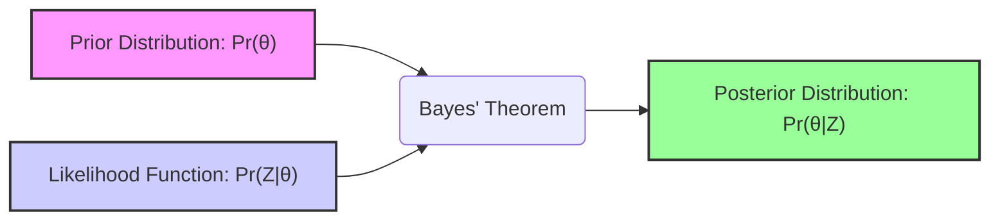

### Introdução

A inferência estatística tradicional, ou frequentista, foca na obtenção de estimativas pontuais de parâmetros e avaliação da incerteza dessas estimativas utilizando, por exemplo, intervalos de confiança. No entanto, essa abordagem não incorpora informações prévias sobre os parâmetros, limitando a capacidade de modelar a incerteza de forma mais completa. A inferência Bayesiana, por sua vez, introduz o conceito de **distribuição a priori** (**prior distribution**), que codifica nosso conhecimento prévio ou crenças sobre os parâmetros antes da observação dos dados [^8.1]. Após a observação dos dados, a **distribuição a posteriori** (**posterior distribution**), que combina o *prior* com a **função de verossimilhança** (**likelihood function**) dos dados, fornece uma descrição probabilística completa dos parâmetros, levando em conta tanto as informações prévias quanto as evidências empíricas. Este capítulo explora a fundo o conceito de **cálculo da distribuição posterior**, baseando-se em métodos analíticos, aproximações e simulações, como o *bootstrap* e o *Markov chain Monte Carlo* (MCMC).

### Conceitos Fundamentais

**Conceito 1: Inferência Bayesiana e o Teorema de Bayes**

Na essência da inferência Bayesiana está o **Teorema de Bayes** [^8.1], que formaliza como atualizar nossas crenças sobre um parâmetro $\theta$ ao observar dados $Z$. O teorema expressa a distribuição a posteriori $Pr(\theta|Z)$ em termos da distribuição a priori $Pr(\theta)$ e da função de verossimilhança $Pr(Z|\theta)$:

$$
Pr(\theta|Z) = \frac{Pr(Z|\theta) \cdot Pr(\theta)}{\int Pr(Z|\theta) \cdot Pr(\theta) \, d\theta}
$$

Aqui, $Pr(\theta)$ representa a *prior* sobre o parâmetro $\theta$, $Pr(Z|\theta)$ é a *likelihood* dos dados dado o parâmetro $\theta$, e $Pr(\theta|Z)$ é a *posterior*, refletindo nosso conhecimento atualizado sobre $\theta$ após observar os dados $Z$. O denominador, $\int Pr(Z|\theta) \cdot Pr(\theta) \, d\theta$, é uma constante que garante que a distribuição a posteriori seja uma distribuição de probabilidade válida. Este teorema é fundamental para a inferência Bayesiana pois fornece a estrutura para combinar nosso conhecimento prévio com a evidência fornecida pelos dados [^8.3].

> 💡 **Exemplo Numérico:** Vamos supor que queremos inferir a probabilidade de um paciente ter uma doença rara ($\theta$). Nossa crença inicial (o *prior*) é que a probabilidade é baixa, digamos $Pr(\theta) = 0.01$. Um teste diagnóstico para a doença tem uma taxa de verdadeiros positivos de $Pr(Z|\theta) = 0.9$ (a *likelihood*). Se o teste for negativo, a probabilidade de um resultado negativo dado que a doença está ausente é $Pr(Z|\neg\theta) = 0.95$. Se o teste for positivo, podemos calcular a probabilidade de ter a doença (o *posterior*) usando o Teorema de Bayes. Primeiro, calculamos o denominador: $P(Z) = Pr(Z|\theta)P(\theta) + Pr(Z|\neg\theta)P(\neg\theta) = 0.9 * 0.01 + 0.05 * 0.99 = 0.0585$. Logo, o *posterior* é: $Pr(\theta|Z) = (0.9 * 0.01) / 0.0585 \approx 0.1538$. Isso significa que, mesmo com um teste positivo, a probabilidade de ter a doença aumenta para aproximadamente 15.38%, dado o *prior* e o teste.

**Lemma 1:** Se a distribuição a priori para um parâmetro for uma distribuição não-informativa, ou seja, uma constante, então a distribuição a posteriori será proporcional à função de verossimilhança. Matematicamente, se $Pr(\theta) = c$, onde $c$ é uma constante, então:

$$
Pr(\theta|Z) \propto Pr(Z|\theta)
$$

*Prova:*
Substituindo $Pr(\theta) = c$ no Teorema de Bayes:
$$
Pr(\theta|Z) = \frac{Pr(Z|\theta) \cdot c}{\int Pr(Z|\theta) \cdot c \, d\theta}
$$

Como $c$ é uma constante, ela pode ser retirada da integral no denominador:
$$
Pr(\theta|Z) = \frac{c \cdot Pr(Z|\theta)}{c \cdot \int Pr(Z|\theta) \, d\theta}
$$
Os termos $c$ se cancelam e o denominador é uma constante em relação a $\theta$, portanto:
$$
Pr(\theta|Z) \propto Pr(Z|\theta)
$$
$\blacksquare$

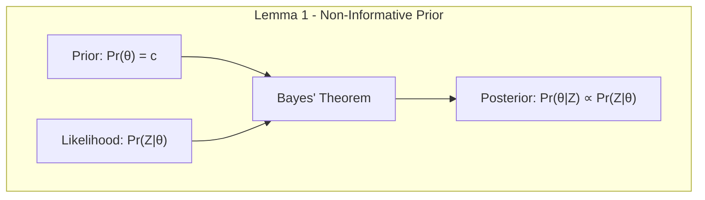

> 💡 **Exemplo Numérico:** Considere um problema onde queremos estimar a probabilidade de sucesso de um novo produto, representada por $\theta$. Se não temos nenhuma informação prévia, podemos usar um *prior* não informativo, $Pr(\theta) = c$, onde $c$ é uma constante. Suponha que após coletar dados $Z$, a *likelihood* é $Pr(Z|\theta) = \theta^3(1-\theta)^2$. Pelo Lemma 1, a *posterior* é proporcional à *likelihood*, então $Pr(\theta|Z) \propto \theta^3(1-\theta)^2$. Para obter a *posterior* real, precisaríamos normalizar a função, mas este exemplo ilustra como a *posterior* assume a forma da *likelihood* quando usamos um *prior* não informativo.

**Conceito 2: Função de Verossimilhança (Likelihood Function)**

A **função de verossimilhança** [^8.2.2], $L(\theta; Z) = Pr(Z|\theta)$, quantifica a plausibilidade dos dados observados $Z$ dado um conjunto de parâmetros $\theta$. Em essência, é a probabilidade dos dados, vista como uma função dos parâmetros. Esta função é crucial na inferência Bayesiana, pois ela que é utilizada para atualizar o *prior* e obter o *posterior*. A *likelihood* não é uma distribuição de probabilidade em relação a $\theta$, mas sim em relação a Z [^8.2.2]. Para dados independentes, a *likelihood* é calculada como o produto das densidades (ou probabilidades de massa) de cada observação individual. Para simplificar cálculos, é comum usar a *log-likelihood*, que é o logaritmo da *likelihood* [^8.2.2]:

$$
l(\theta; Z) = log(L(\theta; Z)) = \sum_{i=1}^{N} log(Pr(z_i|\theta))
$$

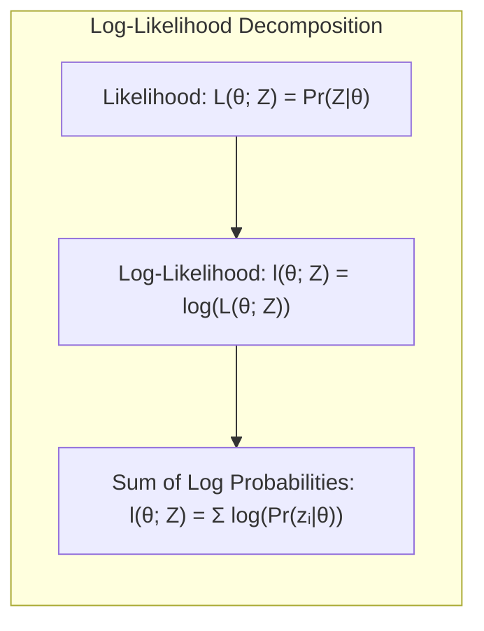

> 💡 **Exemplo Numérico:** Imagine que estamos analisando o número de clientes que chegam a uma loja em uma hora, seguindo uma distribuição de Poisson com taxa $\lambda$. Os dados observados em uma hora são $Z = \{3, 2, 5, 4, 1\}$. A *likelihood* para cada observação $z_i$ é $Pr(z_i|\lambda) = \frac{\lambda^{z_i} e^{-\lambda}}{z_i!}$. Assumindo independência, a *likelihood* é o produto das *likelihoods* individuais. A *log-likelihood* é então dada por $l(\lambda; Z) = \sum_{i=1}^{5} (z_i \log(\lambda) - \lambda - \log(z_i!))$. Calculando essa soma, obtemos:
>
> $l(\lambda; Z) = (3\log(\lambda) - \lambda - \log(3!)) + (2\log(\lambda) - \lambda - \log(2!)) + (5\log(\lambda) - \lambda - \log(5!)) + (4\log(\lambda) - \lambda - \log(4!)) + (1\log(\lambda) - \lambda - \log(1!)) = 15\log(\lambda) - 5\lambda - \text{constant}$, onde a constante é $\log(3!) + \log(2!) + \log(5!) + \log(4!) + \log(1!)$. Ao maximizar essa função em relação a $\lambda$, encontramos a estimativa de máxima verossimilhança.

**Corolário 1:** A *log-likelihood* é uma função convexa para distribuições da família exponencial, o que facilita a busca pelo máximo, um processo crucial na abordagem de *Maximum Likelihood*.

*Prova:* (A prova detalhada depende da forma específica da distribuição na família exponencial, mas em geral, ela é derivada mostrando que a segunda derivada da *log-likelihood* é negativa, indicando concavidade).

**Conceito 3: Distribuição a Priori (Prior Distribution)**

A **distribuição a priori** [^8.1], $Pr(\theta)$, reflete nossa crença ou conhecimento sobre o parâmetro $\theta$ antes de observar os dados. A escolha do *prior* pode ter um impacto significativo no *posterior*, especialmente quando os dados são escassos. *Priors* podem ser informativos, quando refletem conhecimento prévio, ou não informativos, quando tentam minimizar a influência da crença prévia. *Priors não-informativos* podem ser usados, como no *Lemma 1*, quando não temos informação prévia sobre o parâmetro. A escolha do *prior* é um aspecto fundamental na modelagem Bayesiana, e requer cuidado e conhecimento da aplicação em questão [^8.3].

> ⚠️ **Nota Importante**: A escolha de um *prior* impróprio (aquele que não integra a um valor finito) pode levar a um *posterior* impróprio, tornando a inferência não confiável.

> ❗ **Ponto de Atenção**: *Priors* conjugados são convenientes, pois levam a *posteriors* de mesma família, facilitando os cálculos.

> ✔️ **Destaque**: O *bootstrap*, sob certas condições, aproxima uma análise Bayesiana com *priors* não-informativos, como discutido em [^8.4].

> 💡 **Exemplo Numérico:** Suponha que estamos modelando a probabilidade de sucesso de um experimento com um parâmetro $\theta$ que varia entre 0 e 1. Se acreditamos que o sucesso é raro, podemos usar um *prior* Beta com parâmetros $\alpha = 1$ e $\beta = 10$. A densidade do prior é $Pr(\theta) \propto \theta^{\alpha -1}(1-\theta)^{\beta-1} = \theta^0(1-\theta)^9$. Esse *prior* tem maior probabilidade perto de 0. Se, por outro lado, não temos nenhuma informação prévia, podemos usar um *prior* não informativo Beta com $\alpha = 1$ e $\beta = 1$, que corresponde a uma distribuição uniforme entre 0 e 1. Este *prior* tem densidade $Pr(\theta) \propto \theta^0(1-\theta)^0 = 1$, ou seja, uma constante. A escolha do prior afeta o *posterior*, particularmente quando temos poucos dados.

### Regressão Linear Bayesiana e o Cálculo da Distribuição Posterior

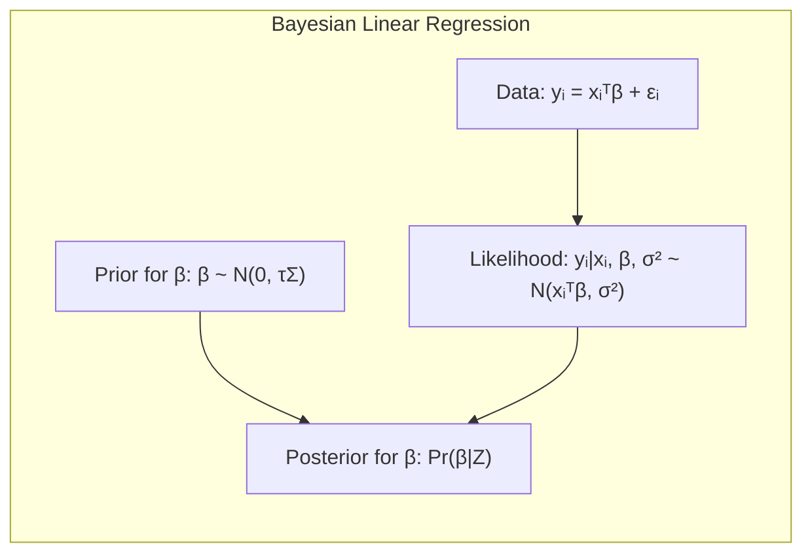

Considerando um problema de regressão linear, $y_i = \mathbf{x}_i^T\boldsymbol{\beta} + \epsilon_i$, onde os erros $\epsilon_i$ seguem uma distribuição normal com média zero e variância $\sigma^2$, e assumindo um *prior* Gaussiano para os coeficientes $\boldsymbol{\beta}$ centrado em zero e com matriz de covariância $\tau\Sigma$, ou seja, $\boldsymbol{\beta} \sim N(0, \tau\Sigma)$ [^8.3], podemos calcular a distribuição posterior de $\boldsymbol{\beta}$ através do Teorema de Bayes. Assumindo que $\sigma^2$ é conhecido, o *posterior* de $\boldsymbol{\beta}$ é também uma distribuição Gaussiana com média e variância calculadas analiticamente, como mostrado em [^8.3]:

$$
E(\boldsymbol{\beta}|Z) = (\mathbf{H}^T\mathbf{H} + \frac{\sigma^2}{\tau}\Sigma^{-1})^{-1}\mathbf{H}^T\mathbf{y}
$$
$$
Cov(\boldsymbol{\beta}|Z) = \sigma^2 (\mathbf{H}^T\mathbf{H} + \frac{\sigma^2}{\tau}\Sigma^{-1})^{-1}
$$
Onde $\mathbf{H}$ é a matriz design, com cada linha contendo os valores de $\mathbf{x}_i$. Este resultado mostra como a incerteza no *prior*, controlada por $\tau$, afeta o *posterior*. Se $\tau$ tende a infinito, o *prior* se torna não informativo e o *posterior* converge para o resultado da regressão linear por mínimos quadrados.

> 💡 **Exemplo Numérico:** Vamos considerar um modelo de regressão linear com um único preditor: $y_i = \beta_0 + \beta_1 x_i + \epsilon_i$. Suponha que temos os dados $X = [1, 2, 3, 4, 5]$ e $y = [2.1, 3.9, 6.1, 7.8, 9.9]$. A matriz de design $\mathbf{H}$ terá uma coluna de 1's e a coluna $X$. Para simplificar, vamos assumir $\sigma^2 = 1$. Para o *prior*, vamos usar uma matriz de covariância $\Sigma = \begin{bmatrix} 1 & 0 \\ 0 & 1 \end{bmatrix}$ e $\tau = 1$. Então, a média e covariância do *posterior* são:
>
> $\mathbf{H} = \begin{bmatrix} 1 & 1 \\ 1 & 2 \\ 1 & 3 \\ 1 & 4 \\ 1 & 5 \end{bmatrix}$, $\mathbf{H}^T\mathbf{H} = \begin{bmatrix} 5 & 15 \\ 15 & 55 \end{bmatrix}$, $\Sigma^{-1} = \begin{bmatrix} 1 & 0 \\ 0 & 1 \end{bmatrix}$, $(\mathbf{H}^T\mathbf{H} + \frac{\sigma^2}{\tau}\Sigma^{-1}) = \begin{bmatrix} 6 & 15 \\ 15 & 56 \end{bmatrix}$.
>
> $(\mathbf{H}^T\mathbf{H} + \frac{\sigma^2}{\tau}\Sigma^{-1})^{-1} \approx \begin{bmatrix} 0.325 & -0.087 \\ -0.087 & 0.035 \end{bmatrix}$.
>
> $\mathbf{H}^T\mathbf{y} = \begin{bmatrix} 29.8 \\ 103.9 \end{bmatrix}$.
>
> $E(\boldsymbol{\beta}|Z) = (\mathbf{H}^T\mathbf{H} + \frac{\sigma^2}{\tau}\Sigma^{-1})^{-1}\mathbf{H}^T\mathbf{y} \approx \begin{bmatrix} 0.325 & -0.087 \\ -0.087 & 0.035 \end{bmatrix}\begin{bmatrix} 29.8 \\ 103.9 \end{bmatrix} \approx \begin{bmatrix} 0.07 \\ 1.97 \end{bmatrix}$.
>
> $Cov(\boldsymbol{\beta}|Z) = \sigma^2 (\mathbf{H}^T\mathbf{H} + \frac{\sigma^2}{\tau}\Sigma^{-1})^{-1} \approx \begin{bmatrix} 0.325 & -0.087 \\ -0.087 & 0.035 \end{bmatrix}$.
>
> A média do *posterior* é $\beta_0 \approx 0.07$ e $\beta_1 \approx 1.97$. A covariância do *posterior* mostra a incerteza nas estimativas. Se aumentarmos $\tau$ para 100, a influência do *prior* diminuirá.

**Lemma 2**: Em modelos lineares Gaussianos, o *posterior* para os coeficientes $\boldsymbol{\beta}$ é também uma distribuição Gaussiana, quando um *prior* Gaussiano é utilizado para $\boldsymbol{\beta}$ e a variância $\sigma^2$ é conhecida.

*Prova:* (A prova envolve mostrar que o produto de uma *likelihood* Gaussiana com um *prior* Gaussiano também resulta em uma função Gaussiana, completando os quadrados no expoente e identificando a média e variância resultantes).

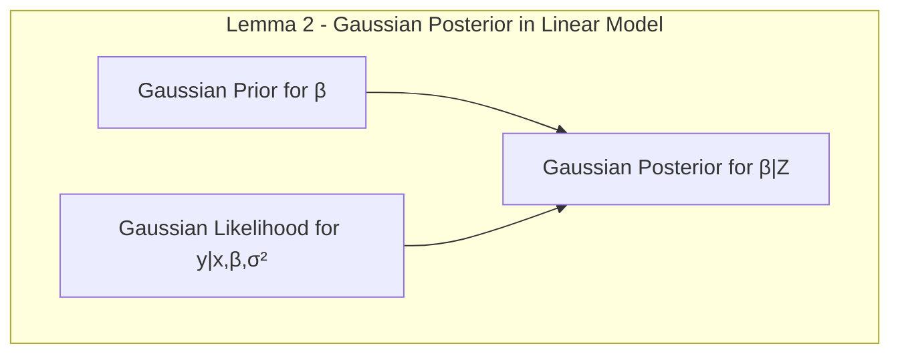

**Corolário 2:** No limite em que $\tau \rightarrow \infty$, o *posterior* em um modelo linear Bayesiano se aproxima do estimador de mínimos quadrados, refletindo um *prior* não-informativo sobre os coeficientes $\boldsymbol{\beta}$.

*Prova:* (A prova consiste em demonstrar que a média do *posterior* calculada acima, quando $\tau \rightarrow \infty$, converge para a solução de mínimos quadrados, ou seja, $(\mathbf{H}^T\mathbf{H})^{-1}\mathbf{H}^T\mathbf{y}$).

### Métodos de Aproximação para o Cálculo do Posterior

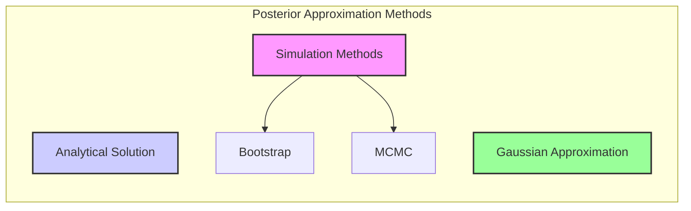

Em muitos casos práticos, a integral no denominador do Teorema de Bayes não possui uma solução analítica, dificultando o cálculo da distribuição *posterior* diretamente [^8.1]. Métodos de aproximação são então utilizados. Uma das formas mais utilizadas é através da aproximação Gaussiana, onde o *posterior* é aproximado por uma distribuição normal. Outra abordagem é utilizar métodos de simulação, como o *bootstrap* e MCMC.

#### Aproximação Gaussiana

Aproximação gaussiana para a distribuição *posterior* é feita através do cálculo da moda do *posterior* (que corresponde a máxima a posteriori - MAP) e da matriz de informação observada ou matriz Hessiana da *log-posterior*.
Em essência, aproximamos o *log-posterior* por uma quadrática ao redor de sua moda, o que equivale a aproximar o *posterior* por uma Gaussiana, como visto em [^8.2.2] e [^8.4]:
$$
log(Pr(\theta | Z)) \approx log(Pr(\theta_{MAP} | Z)) - \frac{1}{2}(\theta - \theta_{MAP})^T I(\theta_{MAP})(\theta - \theta_{MAP})
$$
Onde $I(\theta_{MAP})$ é a matriz de informação observada avaliada no estimador MAP.
Essa aproximação é exata apenas para distribuições gaussianas e pode ser uma aproximação ruim para distribuições mais complexas.

> 💡 **Exemplo Numérico:** Considere o exemplo de inferir a média $\mu$ de uma distribuição normal com variância $\sigma^2$ conhecida. Seja $Z = \{z_1, z_2, ..., z_n\}$ as observações. A *log-likelihood* é dada por $l(\mu; Z) = -\frac{n}{2}\log(2\pi\sigma^2) - \frac{1}{2\sigma^2}\sum_{i=1}^{n}(z_i - \mu)^2$. Se usarmos um *prior* Gaussiano para $\mu$, por exemplo, $\mu \sim N(\mu_0, \tau^2)$, o *log-prior* é $-\frac{1}{2\tau^2}(\mu - \mu_0)^2 + \text{constant}$. O *log-posterior* é a soma do *log-likelihood* e *log-prior*. Ao calcular a moda do *posterior* (MAP), obtemos $\mu_{MAP} = \frac{\frac{1}{\tau^2}\mu_0 + \frac{n}{\sigma^2}\bar{z}}{\frac{1}{\tau^2}+\frac{n}{\sigma^2}}$, onde $\bar{z}$ é a média amostral. A matriz de informação observada (a segunda derivada da log-posterior em relação a $\mu$ e tomada com o sinal negativo)  é $I(\mu_{MAP}) = \frac{1}{\tau^2} + \frac{n}{\sigma^2}$. A aproximação Gaussiana do *posterior* é então dada por $N(\mu_{MAP}, I(\mu_{MAP})^{-1})$. Assim, o *posterior* é aproximado por uma Gaussiana com média $\mu_{MAP}$ e variância $1/(\frac{1}{\tau^2} + \frac{n}{\sigma^2})$.

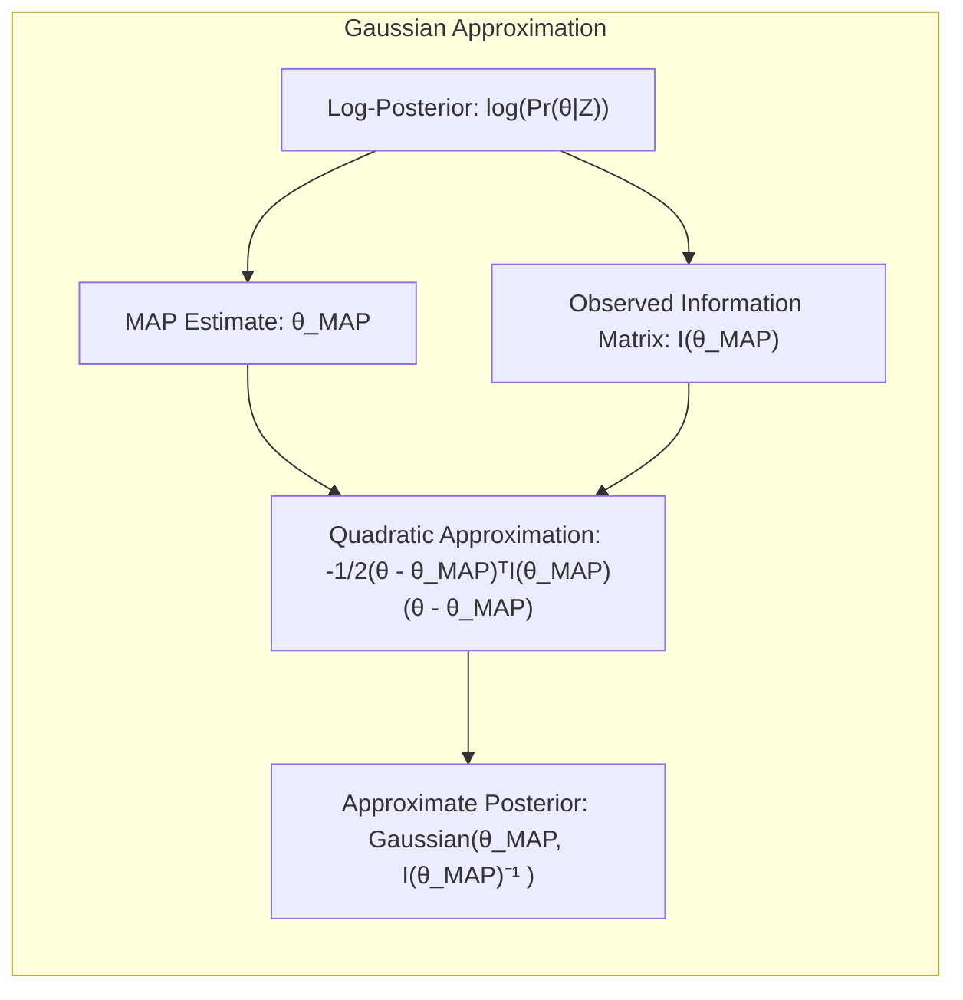

#### Bootstrap e Posterior

O método *bootstrap* oferece uma forma de simular a variabilidade dos dados ao realizar amostragens com reposição do conjunto original [^8.2.1]. Os valores do parâmetro de interesse são calculados em cada amostra *bootstrap*, e a distribuição empírica desses valores aproxima a distribuição *posterior* do parâmetro, sob certas condições, como visto em [^8.4]. O *bootstrap paramétrico*, discutido em [^8.2.2], simula novos dados através de modelos paramétricos ajustados aos dados originais, e também pode ser utilizado para aproximar o *posterior*.

> 💡 **Exemplo Numérico:** Suponha que temos dados de alturas de 10 pessoas (em cm): $Z = \{165, 170, 172, 175, 178, 180, 182, 185, 188, 190\}$. Queremos estimar a média $\mu$. O método *bootstrap* envolve:
>
> 1.  Reamostrar o conjunto $Z$ com reposição $B$ vezes (ex: $B=1000$) , gerando conjuntos $Z_1^*, Z_2^*, ..., Z_B^*$.
> 2.  Para cada amostra *bootstrap* $Z_i^*$, calcular a média $\mu_i^*$.
> 3.  A distribuição empírica de $\{\mu_1^*, \mu_2^*, ..., \mu_B^*\}$ aproxima a distribuição *posterior* da média $\mu$.
>
> Por exemplo, uma das amostras bootstrap pode ser  $Z_1^* = \{170, 175, 180, 182, 185, 170, 172, 190, 178, 180\}$  resultando numa média $\mu_1^* = 178.2$.  Repetimos este processo para $B$ amostras e construímos um histograma da distribuição de $\mu_i^*$ que será uma aproximação do *posterior*.

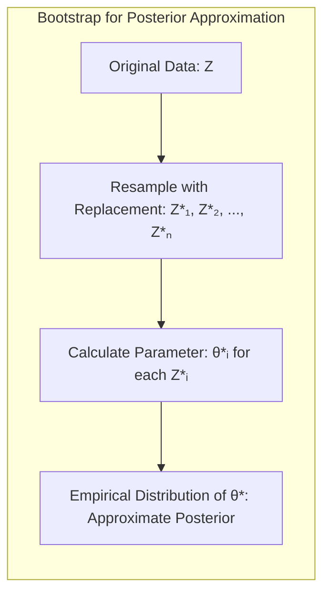

#### MCMC (Markov Chain Monte Carlo)

Métodos *Markov Chain Monte Carlo* (MCMC), como o *Gibbs Sampling* [^8.6] e o *Metropolis-Hastings* [^8.6], são técnicas poderosas para amostrar diretamente da distribuição *posterior*, mesmo quando ela não é conhecida analiticamente. O *Gibbs Sampling*, como visto em [^8.6], amostra cada parâmetro condicionalmente aos outros, criando uma cadeia de Markov cuja distribuição estacionária é a distribuição *posterior* de interesse [^8.6]. O *Metropolis-Hastings* utiliza um critério de aceitação para gerar amostras que, ao longo da cadeia, convergem para o *posterior*.

> ⚠️ **Ponto Crucial**: Métodos MCMC podem ser computacionalmente intensivos e exigem um período de "burn-in" para convergência à distribuição estacionária.

> 💡 **Exemplo Numérico:** Imagine um modelo com dois parâmetros, $\theta_1$ e $\theta_2$, e que a distribuição *posterior* $Pr(\theta_1, \theta_2 | Z)$ não seja conhecida.
>
> **Metropolis-Hastings:**
>
> 1.  Iniciamos com valores iniciais $\theta_1^{(0)}, \theta_2^{(0)}$.
> 2.  Em cada iteração $t$, geramos um valor candidato $\theta_1'$ a partir de uma distribuição de proposta $q(\theta_1' | \theta_1^{(t-1)})$.
> 3.  Calculamos a probabilidade de aceitação $\alpha = \min\left(1, \frac{Pr(\theta_1', \theta_2^{(t-1)} | Z)q(\theta_1^{(t-1)} | \theta_1')}{Pr(\theta_1^{(t-1)}, \theta_2^{(t-1)} | Z)q(\theta_1' | \theta_1^{(t-1)})}\right)$.
> 4.  Geramos $u \sim U(0,1)$. Se $u < \alpha$, $\theta_1^{(t)} = \theta_1'$; caso contrário, $\theta_1^{(t)} = \theta_1^{(t-1)}$.
> 5.  Repetimos o mesmo processo para $\theta_2$
> 6.  Repetimos os passos 2-5 por um grande número de iterações, descartando as primeiras (burn-in). A sequência resultante é uma amostra do *posterior*.
>
> **Gibbs Sampling:**
>
> 1. Iniciamos com valores iniciais $\theta_1^{(0)}, \theta_2^{(0)}$.
> 2. Amostramos $\theta_1^{(t)}$ da distribuição condicional  $Pr(\theta_1 | \theta_2^{(t-1)}, Z)$.
> 3. Amostramos $\theta_2^{(t)}$ da distribuição condicional  $Pr(\theta_2 | \theta_1^{(t)}, Z)$.
> 4. Repetimos os passos 2-3 por um grande número de iterações, descartando as primeiras (burn-in). A sequência resultante é uma amostra do *posterior*.
>
> Ambos os métodos geram amostras que, quando combinadas, representam o *posterior* $Pr(\theta_1, \theta_2 | Z)$.

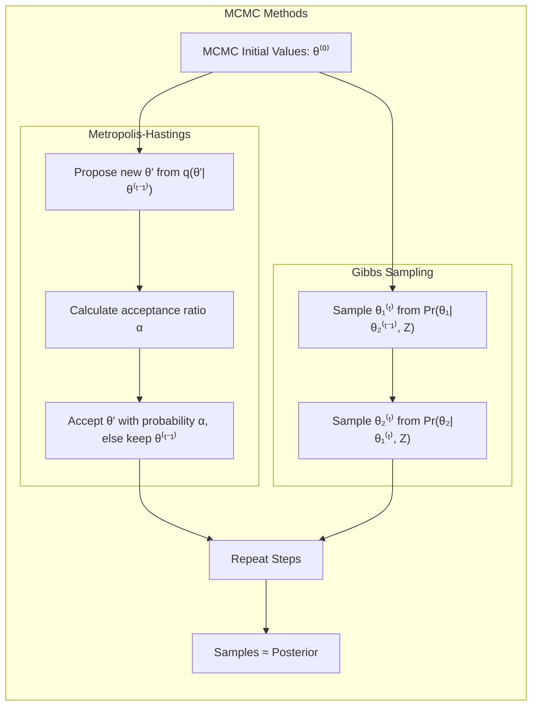

###  Perguntas Teóricas Avançadas

####  Pergunta 1: Qual a relação entre a distribuição *posterior* e o conceito de *credible interval* na inferência Bayesiana?

**Resposta:**
Um *credible interval* é um intervalo dentro do espaço paramétrico que contém uma certa probabilidade da distribuição *posterior*. Em outras palavras, é um intervalo de confiança Bayesiano que nos dá uma medida da incerteza da estimativa do parâmetro dada as informações do *prior* e dos dados. Por exemplo, um *credible interval* de 95% para um parâmetro $\theta$ significa que a probabilidade de $\theta$ estar dentro desse intervalo é de 95%, dada a distribuição *posterior* $Pr(\theta|Z)$. Ao contrário do intervalo de confiança frequentista, o *credible interval* tem uma interpretação mais intuitiva: o parâmetro tem uma probabilidade de estar dentro do intervalo. Para o cálculo do *credible interval*, podemos usar os quantis da distribuição posterior, sendo os de uso mais comum os percentis 2.5% e 97.5% para um *credible interval* de 95%. Em casos onde o *posterior* é Gaussiano ou podemos aproximá-lo por uma gaussiana, um *credible interval* pode ser construído a partir da média e desvio padrão do *posterior*, similar a como construímos um intervalo de confiança em modelos frequentistas.

> 💡 **Exemplo Numérico:** Suponha que, após calcular o *posterior* para um parâmetro $\theta$ usando um dos métodos abordados, obtivemos uma distribuição aproximadamente Gaussiana com média $\mu = 5$ e desvio padrão $\sigma = 1.5$.  Um *credible interval* de 95% pode ser obtido aproximadamente como $5 \pm 1.96 \times 1.5$, o que resulta no intervalo [2.06, 7.94]. Isso significa que, segundo nosso modelo bayesiano, há 95% de probabilidade do verdadeiro valor de $\theta$ estar entre 2.06 e 7.94.

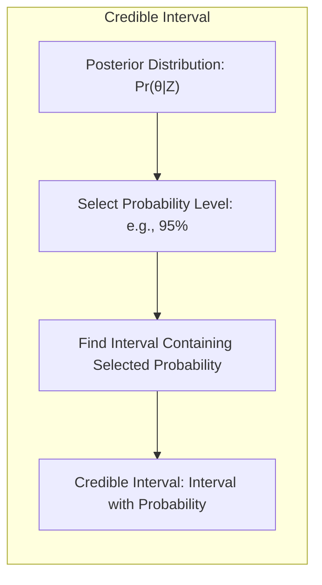

#### Pergunta 2: Como a escolha da distribuição *prior* influencia a forma da distribuição *posterior*, e quais são as implicações práticas dessa influência?

**Resposta:**
A escolha da distribuição *prior* tem um impacto crucial na forma da distribuição *posterior*. Um *prior* informativo, com grande concentração de probabilidade em um determinado intervalo do espaço paramétrico, pode levar a um *posterior* fortemente influenciado por esse *prior*. Por outro lado, um *prior* não-informativo, com distribuição mais uniforme no espaço paramétrico, permite que o *posterior* seja mais guiado pelos dados. Na prática, a escolha do *prior* deve levar em consideração o conhecimento prévio sobre o parâmetro e o nível de confiança nesse conhecimento. Se o *prior* é muito informativo e os dados fornecem evidências em contrário, o *posterior* pode refletir um compromisso entre o *prior* e os dados. Para amostras de tamanho grande, a *likelihood* tem um peso maior no *posterior*, reduzindo a influência do *prior*. A escolha de *priors conjugados*, em que o *prior* e o *posterior* pertencem a mesma família de distribuições, é muitas vezes adotada para simplificar os cálculos. A escolha de *priors não informativos* ou fracamente informativos é frequentemente feita quando não temos conhecimento prévio, ou queremos minimizar a influência do *prior*.

> 💡 **Exemplo Numérico:** Considere estimar a proporção $\theta$ de eleitores que votariam em um candidato. Se temos um *prior* informativo Beta(10, 2), acreditamos que a proporção seja alta, com média 10/(10+2) = 0.83.  Se tivermos poucos dados que indiquem o contrário, o *posterior* manterá a concentração em valores altos de $\theta$.  Se usamos um *prior* não informativo Beta(1,1), o *posterior* será guiado principalmente pelos dados, e a inferência sobre $\theta$ terá uma distribuição mais concentrada sobre a estimativa de máxima verossimilhança. A escolha do prior pode levar a inferências muito diferentes, dependendo da quantidade de dados.

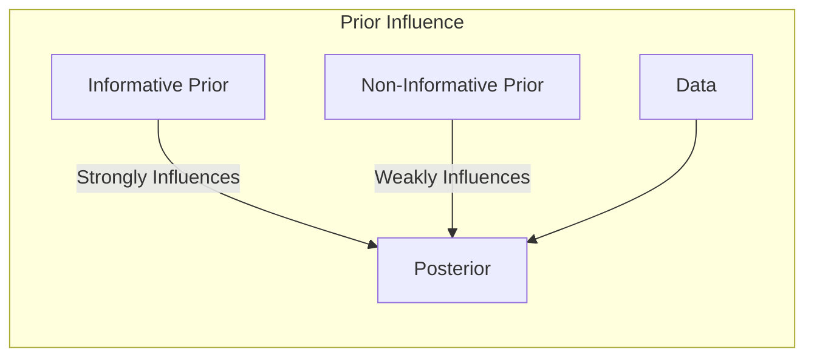

#### Pergunta 3: Quais são as limitações e desafios do uso de métodos de simulação como o MCMC para calcular a distribuição *posterior* em problemas de alta dimensão?

**Resposta:**
Em problemas de alta dimensão, onde o número de parâmetros é grande, os métodos de simulação como MCMC podem enfrentar limitações significativas. Primeiro, a amostragem do *posterior* em espaços de alta dimensão se torna computacionalmente custosa e exige amostras muito longas para explorar adequadamente o espaço paramétrico