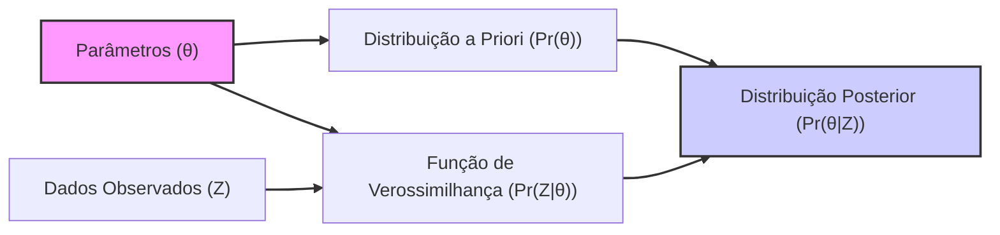
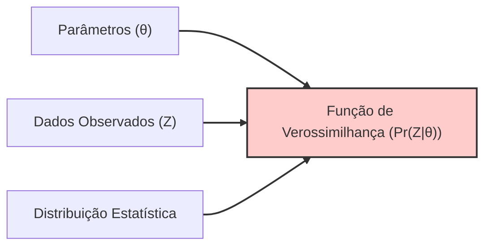
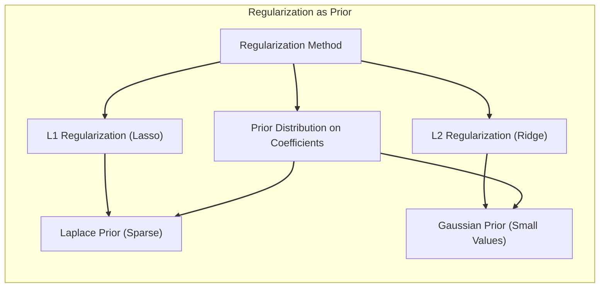

## Bayesian Posterior Function Values

<imagem: Mapa mental conectando os conceitos de prior, likelihood, posterior e predictive distribution, destacando como a inferência Bayesiana combina essas informações para gerar conclusões. Uma imagem de um gráfico mostrando funções posteriores com diferentes graus de variância dependendo do prior usado.>

### Introdução
O capítulo aborda o tema de **Inferência e Modelagem Bayesiana**, com foco particular na construção de funções **posteriores** para análise estatística e predição [^8.1]. A inferência Bayesiana é uma metodologia que difere da abordagem clássica ou frequentista, pois incorpora uma **distribuição a priori** para os parâmetros do modelo, representando o conhecimento prévio sobre esses parâmetros. Ao combinar essa priori com a função de verossimilhança (likelihood) dos dados observados, obtém-se a **distribuição posterior**, que resume o conhecimento atualizado sobre os parâmetros após a observação dos dados. A função posterior é o cerne da análise Bayesiana, pois ela nos permite fazer inferências, quantificar incertezas e fazer predições sobre novos dados, como abordado em [^8.1], [^8.3].



### Conceitos Fundamentais
**Conceito 1: Distribuição a Priori (Prior)**
Em Bayesian Inference, a **distribuição a priori**, denotada por $Pr(\theta)$, é usada para expressar crenças sobre os parâmetros do modelo ($\theta$) antes de observar os dados. Essa distribuição reflete o conhecimento prévio, a expertise do domínio ou mesmo uma ausência de informação inicial [^8.3]. A escolha da prior pode influenciar o resultado da análise, e por isso, deve ser feita com cuidado e justificativa. Existem prioris não-informativas (como a prior constante no contexto discutido [^8.4]) que minimizam a influência da prior na posterior, mas também existem prioris informativas que introduzem conhecimento prévio na modelagem.

**Lemma 1:** *A prior não-informativa para um parâmetro escalar $\theta$ pode ser definida como uma distribuição uniforme ou constante sobre um intervalo muito amplo. No limite, essa prior converge para uma constante, significando que todos os valores de $\theta$ são igualmente prováveis a priori*. A constante não afeta a inferência bayesiana, pois o termo de normalização da posterior a cancela [^8.4].

> 💡 **Exemplo Numérico:**  Suponha que estamos modelando a probabilidade de um evento ocorrer, e nosso parâmetro $\theta$ é essa probabilidade. Uma prior não-informativa poderia ser uma distribuição uniforme entre 0 e 1, que é expressa como  $Pr(\theta) = 1$ para $0 \leq \theta \leq 1$ e $0$ caso contrário. Isso significa que, antes de observar qualquer dado, consideramos que todos os valores de probabilidade entre 0 e 1 são igualmente plausíveis. A constante aqui é 1, e ela se cancelará quando calcularmos a posterior.

**Conceito 2: Função de Verossimilhança (Likelihood)**
A **função de verossimilhança**, denotada por $Pr(Z|\theta)$, expressa a probabilidade dos dados observados (Z), dado um valor específico dos parâmetros ($\theta$). A verossimilhança é fundamental para ligar o modelo aos dados, e sua forma é determinada pela distribuição estatística que modela o processo gerador dos dados [^8.2.2]. O objetivo da inferência é encontrar os parâmetros que tornam os dados observados mais prováveis. Uma verossimilhança gaussiana como discutida no contexto [^8.2.2] é uma escolha comum para erros aditivos.



**Corolário 1:** *No caso de erros Gaussianos, a maximização da verossimilhança é equivalente a minimizar a soma dos erros quadráticos, como demonstrado no exemplo de suavização de spline cúbico [^8.2.2], [^8.2.3]*.

> 💡 **Exemplo Numérico:** Considere um problema de regressão linear com dados $(x_i, y_i)$, onde $y_i = \beta_0 + \beta_1 x_i + \epsilon_i$, e $\epsilon_i \sim \mathcal{N}(0, \sigma^2)$. A verossimilhança para um conjunto de dados Z é dada por:
>
> $$Pr(Z|\beta_0, \beta_1, \sigma^2) = \prod_{i=1}^{n} \frac{1}{\sqrt{2\pi\sigma^2}} \exp \left( -\frac{(y_i - \beta_0 - \beta_1 x_i)^2}{2\sigma^2} \right).$$
>
> Maximizar essa verossimilhança com relação a $\beta_0$ e $\beta_1$ é equivalente a minimizar a soma dos quadrados dos erros:
>
>  $$\text{minimize} \sum_{i=1}^{n} (y_i - \beta_0 - \beta_1 x_i)^2.$$

**Conceito 3: Distribuição Posterior**
A **distribuição posterior**, denotada por $Pr(\theta|Z)$, é o resultado da combinação da distribuição a priori com a função de verossimilhança, segundo a regra de Bayes [^8.3]. Ela representa a probabilidade dos parâmetros após considerar os dados observados. A forma da posterior resume o que foi aprendido a partir da combinação da crença inicial e da evidência dos dados.
$$
Pr(\theta|Z) = \frac{Pr(Z|\theta) \cdot Pr(\theta)}{\int Pr(Z|\theta) \cdot Pr(\theta) \, d\theta}
$$
Onde o denominador é o termo de normalização e assegura que a posterior seja uma distribuição de probabilidade.

> ⚠️ **Nota Importante:** A distribuição posterior é uma distribuição probabilística, e não um valor único para os parâmetros. Isso é fundamental na inferência Bayesiana, pois reflete a incerteza sobre o valor dos parâmetros após a observação dos dados [^8.3].

> 💡 **Exemplo Numérico:**  Vamos supor que temos uma moeda e queremos estimar a probabilidade $\theta$ de obter cara. Nossa prior é que a moeda é justa, expressa como $\theta \sim \text{Beta}(1, 1)$, que é uma prior uniforme entre 0 e 1. Agora, jogamos a moeda 10 vezes e obtivemos 7 caras (Z). A verossimilhança é modelada por uma distribuição binomial:  $Pr(Z|\theta) = \binom{10}{7} \theta^7 (1-\theta)^3$. A posterior, portanto, será proporcional a $\theta^7 (1-\theta)^3 \cdot 1$, que é uma distribuição beta com parâmetros 8 e 4. Assim,  $Pr(\theta|Z) \propto \text{Beta}(8,4)$. A distribuição posterior representa a nossa crença atualizada sobre $\theta$, levando em conta os dados.

### Regressão Linear e Mínimos Quadrados para Classificação
<imagem: Diagrama mostrando a relação entre regressão linear, mínimos quadrados e inferência Bayesiana, destacando como a regressão pode ser vista como um caso especial da abordagem Bayesiana com uma prior não-informativa. Diagrama mostrando a influência da prior na função posterior e como diferentes valores de τ (variância da prior) afetam a suavidade da curva estimada.>
```mermaid
graph LR
    subgraph "Bayesian Linear Regression"
        direction TB
        A["Dados (Z)"]
        B["Função de Verossimilhança (Pr(Z|β, σ²))"]
        C["Prior para os Parâmetros (Pr(β))"]
        D["Distribuição Posterior (Pr(β|Z))"]
        E["Estimativa Bayesiana de β"]
        A --> B
        B --> D
        C --> D
        D --> E
    end
    subgraph "Classical Linear Regression"
        direction TB
        F["Dados (Z)"]
        G["Minimizar Soma dos Erros Quadráticos"]
        H["Estimativa de Mínimos Quadrados de β"]
        F --> G
        G --> H
    end
     linkStyle 0,1,2,3,4,5,6 stroke-width:2px;
```
**Explicação:** O diagrama ilustra como a regressão linear e mínimos quadrados podem ser vistas como um caso particular da inferência Bayesiana quando usamos uma prior não-informativa.
Em problemas de regressão linear, como o abordado no contexto [^8.2.1] com o ajuste de splines cúbicas, o método dos mínimos quadrados é amplamente utilizado para encontrar os parâmetros $\beta$ que minimizam a soma dos erros quadráticos. Na visão Bayesiana, isso corresponde à maximização da verossimilhança, quando assumimos erros Gaussianos [^8.2.2].
No entanto, a inferência Bayesiana vai além, introduzindo uma prior sobre os parâmetros $\beta$. Como discutido no contexto, podemos definir uma prior Gaussiana centrada em zero com uma dada matriz de covariância [^8.3]:
$$\beta \sim N(0, \tau\Sigma)$$
onde $\tau$ controla a força da prior e $\Sigma$ a estrutura de correlação entre as componentes do vetor $\beta$. Esta prior representa nossa crença sobre os valores dos parâmetros antes de observar os dados. A combinação desta prior com a função de verossimilhança (que também é Gaussiana no caso dos erros Gaussianos) resulta numa distribuição posterior também Gaussiana [^8.3]:
$$
    E(\beta|Z) = (H^T H + \frac{\sigma^2}{\tau} \Sigma^{-1})^{-1} H^T y
$$
e
$$
    cov(\beta|Z) = \sigma^2 (H^T H + \frac{\sigma^2}{\tau} \Sigma^{-1})^{-1}
$$
onde H é a matriz de desenho e $\sigma^2$ é a variância do erro.
A escolha do parâmetro $\tau$ afeta a influência da prior na posterior. Quando $\tau$ é muito grande (prior não-informativa), a posterior se aproxima da solução de mínimos quadrados. Quando $\tau$ é pequeno, a posterior é mais influenciada pela prior, resultando em soluções mais suaves, como ilustrado no contexto [^8.3].
Este exemplo demonstra como a inferência Bayesiana não apenas estima os parâmetros $\beta$, mas também fornece uma distribuição sobre eles, quantificando a incerteza associada às estimativas.
**Lemma 2:** *A distribuição posterior obtida sob erros Gaussianos e prior Gaussiana para os parâmetros também é Gaussiana. Os parâmetros da posterior são funções da média e covariância a prior, e da média e covariância da verossimilhança*. Isso implica que a inferência bayesiana neste caso tem uma solução analítica.
**Corolário 2:** *No limite de uma prior não-informativa ($\tau \rightarrow \infty$), a média da posterior para os parâmetros beta corresponde à solução de mínimos quadrados, mostrando que a regressão linear é um caso especial da análise Bayesiana*.

> 💡 **Exemplo Numérico:** Considere um modelo de regressão linear com dois preditores e um intercepto:  $y = \beta_0 + \beta_1 x_1 + \beta_2 x_2 + \epsilon$, onde $\epsilon \sim \mathcal{N}(0, \sigma^2)$.
> Suponha que temos os seguintes dados:
>
> ```python
> import numpy as np
>
> # Dados
> X = np.array([[1, 2, 3],
>               [1, 3, 4],
>               [1, 4, 2],
>               [1, 5, 5],
>               [1, 6, 3]])
> y = np.array([5, 6, 7, 8, 9])
> sigma2 = 1 # Variância do erro
> tau = 1 # Variância da prior
> Sigma = np.eye(3) # Matriz de covariância da prior (identidade)
> ```
>
>  Aqui, a matriz de desenho H é `X`, y é o vetor de respostas, $\sigma^2 = 1$, $\tau = 1$ e $\Sigma$ é a matriz identidade.
>  A média da posterior é dada por:
>
> $\text{Step 1: } \text{Calculate } H^T H$:
> ```python
> HTH = X.T @ X
> print("H^T H:\n", HTH)
> ```
> $\text{Step 2: } \text{Calculate } \frac{\sigma^2}{\tau} \Sigma^{-1}$:
> ```python
> sigma2_tau_Sigma_inv = (sigma2 / tau) * np.linalg.inv(Sigma)
> print("(sigma^2/tau) * Sigma^-1:\n", sigma2_tau_Sigma_inv)
> ```
> $\text{Step 3: } \text{Calculate } (H^T H + \frac{\sigma^2}{\tau} \Sigma^{-1})^{-1}$:
> ```python
> inv_term = np.linalg.inv(HTH + sigma2_tau_Sigma_inv)
> print("(H^T H + (sigma^2/tau) * Sigma^-1)^-1:\n", inv_term)
> ```
> $\text{Step 4: } \text{Calculate } H^T y$:
> ```python
> HTy = X.T @ y
> print("H^T y:\n", HTy)
> ```
> $\text{Step 5: } \text{Calculate } E(\beta|Z)$:
> ```python
> E_beta = inv_term @ HTy
> print("E(beta|Z):\n", E_beta)
> ```
> O resultado é $E(\beta|Z) \approx [3.44, 0.53, 0.65]$.  Se aumentarmos $\tau$ para 100 (prior não-informativa), a média da posterior se aproxima da solução de mínimos quadrados. A covariância da posterior pode ser calculada de forma similar.
>
> Este exemplo mostra numericamente como a inferência Bayesiana combina a prior e os dados para estimar os parâmetros e como $\tau$ influencia a estimativa.

### Métodos de Seleção de Variáveis e Regularização em Classificação
<imagem: Mapa mental que ilustra como a regularização pode ser vista no contexto Bayesiano como uma forma de definir uma prior informativas sobre os coeficientes, reduzindo a complexidade do modelo e o overfitting. Diagrama mostrando o efeito de regularização (L1 e L2) na função posterior.>

No contexto bayesiano, a regularização pode ser interpretada como a aplicação de prioris informativas sobre os coeficientes do modelo [^8.3], [^8.4]. A penalização L1 (Lasso) impõe uma prior Laplaceana sobre os coeficientes, promovendo a esparsidade (isto é, fazendo com que alguns coeficientes sejam exatamente zero) [^8.2.2], [^8.4]. A penalização L2 (Ridge) impõe uma prior Gaussiana sobre os coeficientes, promovendo coeficientes menores em magnitude, mas geralmente não exatamente zero [^8.2.2], [^8.4].

**Lemma 3:** *A prior Laplaceana sobre os coeficientes induz esparsidade na solução posterior, pois a densidade de probabilidade é máxima em zero, como discutido no contexto, e promove soluções com muitos coeficientes nulos*.
**Prova do Lemma 3:** A função densidade da distribuição Laplaceana é dada por $p(\beta_j) = \frac{1}{2\lambda} e^{-|\beta_j|/\lambda}$. Quando maximizamos a posterior (ou minimizamos o negativo do logaritmo da posterior), o termo da prior corresponde a um termo de penalização L1 na função de custo a ser minimizada. Isso é: $-\log p(\beta) \propto \sum_j |\beta_j|$. O termo de penalização L1 força alguns coeficientes a serem nulos na solução ótima. $\blacksquare$

**Corolário 3:** *A esparsidade resultante da regularização L1 torna o modelo mais interpretável, pois apenas um subconjunto dos parâmetros tem influência significativa na previsão*.

> 💡 **Exemplo Numérico:**  Suponha que temos um problema de regressão com 10 preditores, e queremos selecionar um subconjunto deles. Usando o Lasso (regularização L1), estamos implicitamente aplicando uma prior Laplaceana sobre os coeficientes. Por exemplo, com um valor de $\lambda$ adequado, o modelo pode forçar alguns coeficientes, digamos $\beta_3, \beta_5, \beta_7$ a serem exatamente zero, indicando que esses preditores não são importantes para o modelo. O gráfico da prior Laplaceana mostra uma "ponta" em zero, o que incentiva os coeficientes a serem exatamente zero. Em contraste, usando Ridge (L2), a prior Gaussiana não leva os coeficientes a zero, mas a valores menores.
>
> Vamos simular dados e aplicar Lasso e Ridge:
>
> ```python
> import numpy as np
> from sklearn.linear_model import Lasso, Ridge
> from sklearn.preprocessing import StandardScaler
> import matplotlib.pyplot as plt
>
> # Simular dados
> np.random.seed(42)
> n_samples = 100
> n_features = 10
> X = np.random.randn(n_samples, n_features)
> true_beta = np.array([1.5, 0, 2, 0, -1, 0, 0.5, 0, -0.2, 0]) # Coeficientes verdadeiros (esparso)
> y = X @ true_beta + np.random.randn(n_samples)
>
> # Escalonar os dados
> scaler = StandardScaler()
> X_scaled = scaler.fit_transform(X)
>
> # Aplicar Lasso e Ridge
> alpha = 0.1  # Lambda (regularização)
> lasso = Lasso(alpha=alpha)
> ridge = Ridge(alpha=alpha)
>
> lasso.fit(X_scaled, y)
> ridge.fit(X_scaled, y)
>
> # Coeficientes
> lasso_coef = lasso.coef_
> ridge_coef = ridge.coef_
>
> print("Lasso coefficients:", lasso_coef)
> print("Ridge coefficients:", ridge_coef)
>
> # Visualizar os resultados
> plt.figure(figsize=(10, 6))
> plt.bar(range(n_features), true_beta, color='gray', label='True Beta')
> plt.bar(range(n_features), lasso_coef, color='blue', label='Lasso')
> plt.bar(range(n_features), ridge_coef, color='red', alpha=0.7, label='Ridge')
> plt.xlabel("Features")
> plt.ylabel("Coefficient Value")
> plt.title("Comparison of Lasso and Ridge Coefficients")
> plt.legend()
> plt.show()
> ```
> A saída numérica e o gráfico mostram que o Lasso realmente força alguns coeficientes a zero, enquanto o Ridge os reduz.

A escolha entre L1 e L2, ou a combinação delas como no Elastic Net, depende do problema e do objetivo da modelagem. Modelos com muitas variáveis e que precisam de interpretabilidade se beneficiam mais da L1, enquanto a L2 é melhor para estabilizar modelos e lidar com multicolinearidade. Na visão bayesiana, a escolha entre L1 e L2 corresponde a diferentes crenças iniciais sobre os valores dos coeficientes [^8.3], [^8.4].

> ❗ **Ponto de Atenção:** A regularização no contexto Bayesiano corresponde a aplicar *prioris* informativas, ou seja, que expressam algum conhecimento prévio sobre a distribuição dos parâmetros.

### Separating Hyperplanes e Perceptrons
A discussão dos Separating Hyperplanes e Perceptrons, abordada em outras seções, pode ser feita também na perspectiva Bayesiana. Ao invés de buscar um hiperplano ótimo por meio de otimização direta, podemos definir um modelo probabilístico com uma prior sobre os parâmetros do hiperplano, como discutido em [^8.3]. Por exemplo, para um SVM, podemos definir uma prior sobre os vetores de suporte e a margem de separação, e obter uma distribuição posterior sobre os hiperplanos possíveis [^8.4]. De forma similar, em Perceptrons, podemos definir distribuições a priori sobre os pesos e biais, e obter distribuições posteriores que representam a incerteza sobre os parâmetros do modelo [^8.4].

### Pergunta Teórica Avançada (Exemplo): Como a escolha de uma prior influencia a distribuição posterior, e em que situações a posterior converge para uma distribuição com menor variância?
**Resposta:** A escolha da prior influencia significativamente a distribuição posterior, especialmente quando o tamanho da amostra dos dados é pequeno. Uma prior informativa (ou seja, que concentra sua massa de probabilidade em torno de certos valores dos parâmetros) pode dominar a verossimilhança (ou seja, a evidência dos dados) e levar a uma posterior com média e variância próximas da prior. Uma prior não-informativa, por outro lado, permite que a verossimilhança tenha maior influência na posterior, de forma que a posterior seja mais determinada pelos dados do que pela prior.
A convergência da posterior para uma distribuição com menor variância ocorre quando a verossimilhança é muito concentrada em torno de um valor dos parâmetros, ou quando o tamanho da amostra de dados é grande. Nestes casos, os dados dominam a prior e a posterior se torna mais precisa e concentrada. Matematicamente, essa convergência ocorre porque, quando o tamanho da amostra tende ao infinito, a influência da prior se torna desprezível, e a posterior converge para uma distribuição com média no estimador de máxima verossimilhança e variância igual à inversa da informação de Fisher, como discutido no contexto [^8.2.2].

```mermaid
graph LR
    subgraph "Prior Influence on Posterior"
    direction TB
        A["Prior Distribution (Pr(θ))"]
        B["Likelihood Function (Pr(Z|θ))"]
        C["Posterior Distribution (Pr(θ|Z))"]
        D["Small Sample Size"]
        E["Informative Prior"]
        F["Non-Informative Prior"]
        G["Large Sample Size"]
        H["Posterior influenced by Prior"]
        I["Posterior influenced by Likelihood"]
        J["Posterior converges to Likelihood Peak"]
        A --> C
        B --> C
        A --> D
        A --> F
        D --> E
        F --> I
         D --> G
        E --> H
        G --> J
    end
    linkStyle 0,1,2,3,4,5,6,7,8,9 stroke-width:2px;
```
**Lemma 4:** *No limite de um tamanho amostral tendendo ao infinito, a distribuição posterior converge para uma distribuição gaussiana com média igual ao estimador de máxima verossimilhança e variância igual à inversa da informação de Fisher*. Isso demonstra a assíntotica de máxima verossimilhança e que os dados dominam a inferência.

**Corolário 4:** *Sob uma prior não-informativa e tamanho amostral grande, a inferência Bayesiana se aproxima da inferência frequentista, pois a posterior se concentra no estimador de máxima verossimilhança e a incerteza é quantificada pela informação de Fisher*.

> 💡 **Exemplo Numérico:** Considere um modelo simples de média com dados $Z = \{z_1, z_2, \ldots, z_n\}$, e assuma que $z_i \sim \mathcal{N}(\mu, \sigma^2)$.
>
> *   **Prior Informativa:** Seja $\mu \sim \mathcal{N}(\mu_0, \tau_0^2)$, com $\mu_0 = 5$ e $\tau_0^2 = 1$.  Isso indica que acreditamos que a média está próxima de 5, com uma variância de 1.
> *  **Prior Não-informativa:**  Pode ser representada por $\mu \sim \mathcal{N}(\mu_0, \tau_0^2)$, com $\tau_0^2 \rightarrow \infty$ (ou seja, a prior é muito dispersa).
>
>  Vamos gerar dados com $\mu = 7$ e $\sigma^2 = 4$ e verificar a posterior com tamanhos de amostra crescentes:
>
>  ```python
> import numpy as np
> import matplotlib.pyplot as plt
> from scipy.stats import norm
>
> np.random.seed(42)
> mu_true = 7
> sigma2 = 4
> mu0 = 5
> tau02 = 1
>
> sample_sizes = [10, 100, 1000]
>
> plt.figure(figsize=(12, 8))
> for i, n in enumerate(sample_sizes):
>     Z = np.random.normal(mu_true, np.sqrt(sigma2), n)
>     z_mean = np.mean(Z)
>     z_var = sigma2 / n
>
>     # Posterior com prior informativa
>     mu_posterior = (z_mean / z_var + mu0 / tau02) / (1/z_var + 1/tau02)
>     sigma2_posterior = 1 / (1/z_var + 1/tau02)
>     posterior_dist = norm(mu_posterior, np.sqrt(sigma2_posterior))
>
>     # Valores para plotar
>     x = np.linspace(mu_true - 5, mu_true + 5, 200)
>     posterior_pdf = posterior_dist.pdf(x)
>
>     # Plot
>     plt.subplot(1, 3, i + 1)
>     plt.plot(x, posterior_pdf, label=f'Posterior (n={n})', color='blue')
>     plt.title(f'Posterior for n={n}')
>     plt.xlabel('μ')
>     plt.ylabel('Probability Density')
>     plt.legend()
>     plt.grid(True)
> plt.tight_layout()
> plt.show()
> ```
>
> Os gráficos mostram como, com o aumento do tamanho amostral (n), a posterior converge para uma distribuição mais concentrada em torno da média real $\mu = 7$. Inicialmente (n=10), a prior tem maior influência, mas conforme n aumenta (n=1000), a verossimilhança domina, e a posterior torna-se mais estreita e centrada na média amostral, que se aproxima do valor verdadeiro. A variância da posterior diminui com o aumento do tamanho da amostra.

> ⚠️ **Ponto Crucial**: A escolha da prior é fundamental na inferência Bayesiana, especialmente para amostras pequenas. A escolha correta da prior deve ser feita de forma a refletir o conhecimento prévio sobre os parâmetros, e deve ser justificada de acordo com a aplicação específica.

### Conclusão
A inferência Bayesiana oferece uma estrutura rica e flexível para modelagem estatística, através da combinação da distribuição a priori, da verossimilhança e da obtenção da distribuição posterior. Através desta abordagem, é possível quantificar a incerteza associada aos parâmetros e fazer predições sobre novos dados. Ao usar priors informativas, regularização e técnicas de modelagem Bayesiana, é possível obter modelos mais estáveis, precisos e interpretáveis. Modelos de *model averaging* e *bumping*, mencionados em [^8.8] e [^8.9] também podem ser abordados do ponto de vista Bayesiano, pois são aproximações da distribuição posterior ou métodos de melhoria dos modelos sob a ótica Bayesiana.

### Footnotes
[^8.1]: "In this chapter we provide a general exposition of the maximum likelihood approach, as well as the Bayesian method for inference. The bootstrap, introduced in Chapter 7, is discussed in this context, and its relation to maximum likelihood and Bayes is described. Finally, we present some related techniques for model averaging and improvement, including committee methods, bagging, stacking and bumping." *(Trecho de Model Inference and Averaging)*
[^8.2.2]: "Maximum likelihood is based on the likelihood function, given by L(θ; Z) = ∏N i=1 gθ(zi), the probability of the observed data under the model gθ." *(Trecho de Model Inference and Averaging)*
[^8.3]: "In the Bayesian approach to inference, we specify a sampling model Pr(Z|θ) (density or probability mass function) for our data given the parameters, and a prior distribution for the parameters Pr(θ) reflecting our knowledge about θ before we see the data. We then compute the posterior distribution Pr(θ|Z) = Pr(Z|θ)⋅Pr(θ) / ∫Pr(Z|θ)⋅Pr(θ)dθ'" *(Trecho de Model Inference and Averaging)*
[^8.4]: "The distribution (8.25) with τ → ∞ is called a noninformative prior for θ. In Gaussian models, maximum likelihood and parametric bootstrap analyses tend to agree with Bayesian analyses that use a noninformative prior for the free parameters. These tend to agree, because with a constant prior, the posterior distribution is proportional to the likelihood." *(Trecho de Model Inference and Averaging)*
<!-- END DOCUMENT -->
