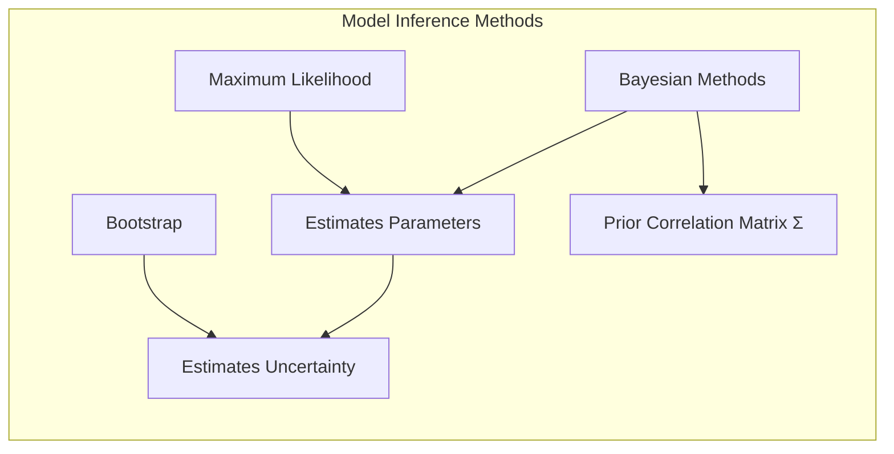
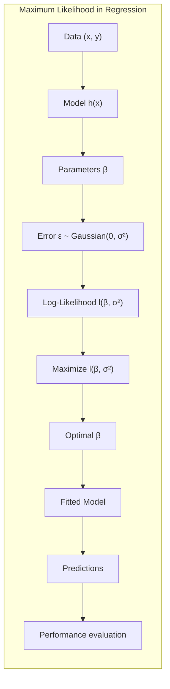
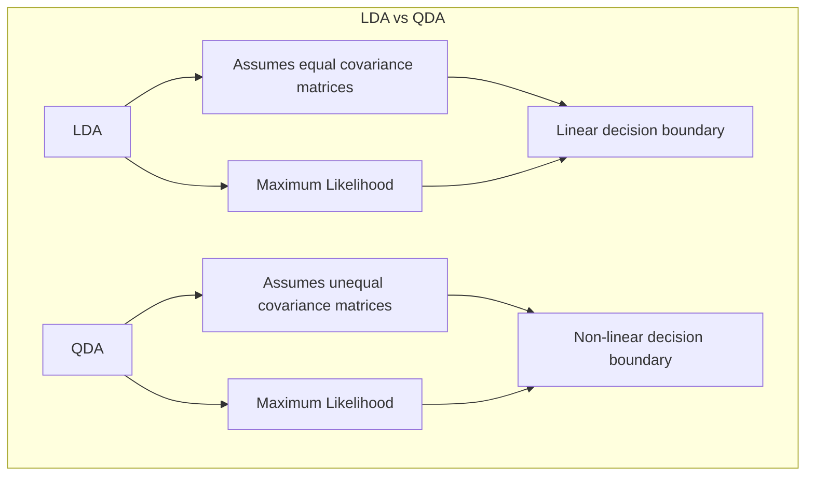
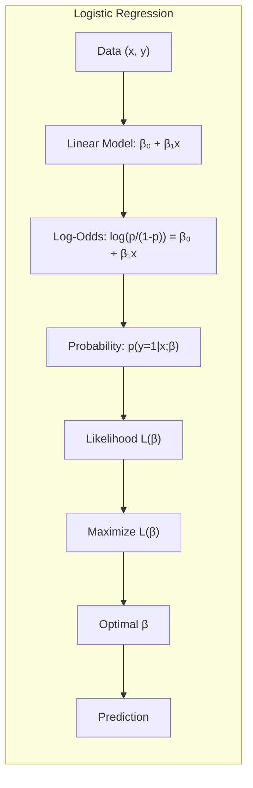
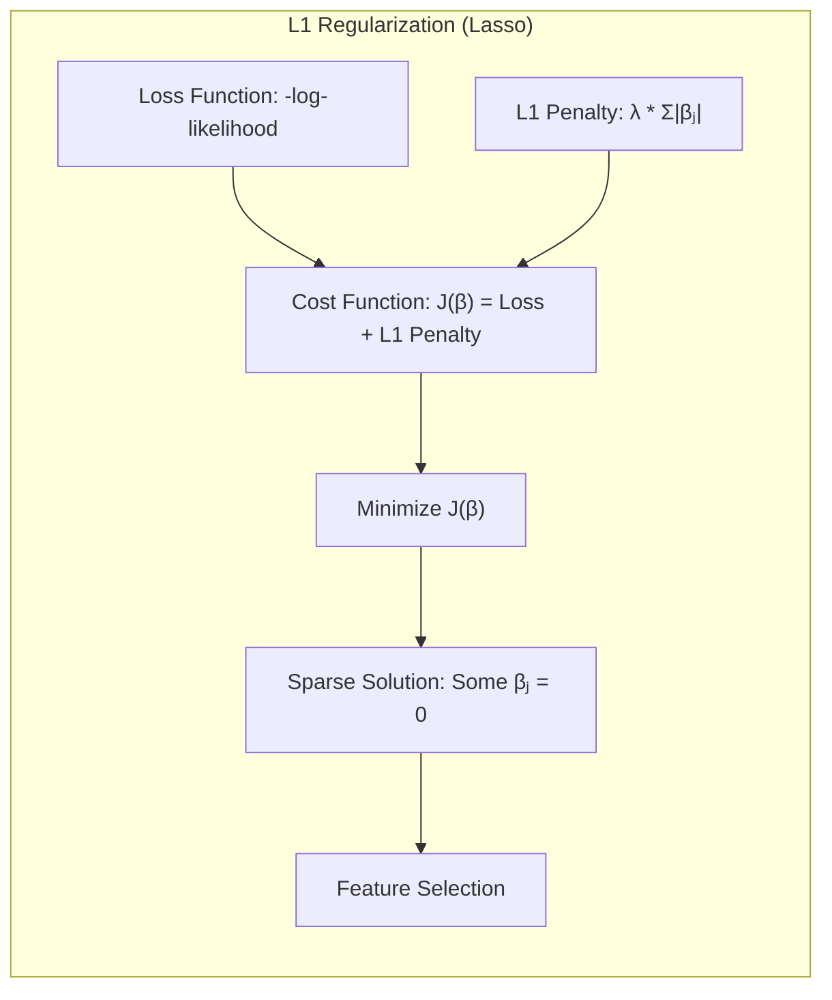
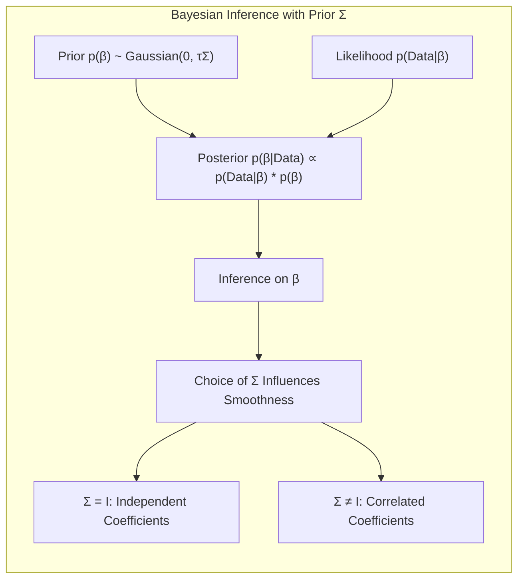

## Model Inference and Averaging: The Role of the Prior Correlation Matrix Σ

### Introdução

Este capítulo explora a inferência de modelos e a média de modelos, aprofundando-se em técnicas de **Máxima Verossimilhança (Maximum Likelihood)**, métodos **Bayesianos** e **Bootstrap**. O objetivo é fornecer um guia abrangente para profissionais com conhecimento avançado em estatística e aprendizado de máquina, com um foco particular na influência da **matriz de correlação *prior* Σ** em modelos Bayesianos. Iniciaremos com uma discussão sobre a motivação para estes métodos e como eles se relacionam, conforme abordado em [^8.1].

### Conceitos Fundamentais

**Conceito 1:** O problema de **ajuste de modelos** geralmente envolve a minimização de alguma forma de erro, como a soma de quadrados para regressão ou entropia cruzada para classificação [^8.1]. No entanto, estas abordagens podem ser vistas como instâncias da **Máxima Verossimilhança**, onde o objetivo é encontrar os parâmetros que tornam os dados observados mais prováveis.

**Lemma 1:** Sob certas condições, a minimização da soma de quadrados é equivalente à maximização da verossimilhança sob uma distribuição Gaussiana dos erros [^8.2]. Isso pode ser demonstrado ao derivar a log-verossimilhança para um modelo de regressão com erros Gaussianos:

$$
l(\beta, \sigma^2) = -\frac{N}{2}\log(2\pi\sigma^2) - \frac{1}{2\sigma^2}\sum_{i=1}^{N}(y_i - h(x_i)^T\beta)^2
$$

onde $h(x_i)$ são as funções base, $\beta$ são os coeficientes e $\sigma^2$ é a variância do erro. Minimizar a soma de quadrados $\sum_{i=1}^{N}(y_i - h(x_i)^T\beta)^2$ é equivalente a maximizar $l(\beta, \sigma^2)$ com respeito a $\beta$, mantendo $\sigma^2$ constante. $\blacksquare$

> 💡 **Exemplo Numérico:** Vamos considerar um exemplo de regressão linear simples com $N=5$ dados. Suponha que temos $y = [2, 4, 5, 4, 5]$ e $x = [1, 2, 3, 4, 5]$, com uma função base $h(x_i) = x_i$. Assim, temos $h(x) = x$. O objetivo é encontrar $\beta$ que minimiza a soma dos erros quadrados. A log-verossimilhança é:
>
> $$
> l(\beta, \sigma^2) = -\frac{5}{2}\log(2\pi\sigma^2) - \frac{1}{2\sigma^2}\sum_{i=1}^{5}(y_i - \beta x_i)^2
> $$
>
>  Podemos usar o método dos mínimos quadrados para encontrar $\beta$.  
>  $\text{Step 1: } \sum_{i=1}^5 x_i y_i = (1*2) + (2*4) + (3*5) + (4*4) + (5*5) = 2 + 8 + 15 + 16 + 25 = 66$
>
> $\text{Step 2: } \sum_{i=1}^5 x_i^2 = 1^2 + 2^2 + 3^2 + 4^2 + 5^2 = 1 + 4 + 9 + 16 + 25 = 55$
>
> $\text{Step 3: } \bar{x} = \frac{1+2+3+4+5}{5} = 3$
>
> $\text{Step 4: } \bar{y} = \frac{2+4+5+4+5}{5} = 4$
>
> $\text{Step 5: } \beta = \frac{\sum_{i=1}^N (x_i - \bar{x})(y_i - \bar{y})}{\sum_{i=1}^N (x_i - \bar{x})^2} =  \frac{\sum_{i=1}^5 x_i y_i - 5 \bar{x} \bar{y}}{\sum_{i=1}^5 x_i^2 - 5 \bar{x}^2} = \frac{66 - 5*3*4}{55 - 5 * 3^2} = \frac{66 - 60}{55 - 45} = \frac{6}{10} = 0.6$
>
>
> Utilizando este valor de $\beta=0.6$, a função ajustada do modelo é $y = 0.6x$. A minimização da soma dos quadrados é equivalente a maximizar a log-verossimilhança sob a suposição de que os erros são gaussianos, e isso é equivalente a encontrar o $\beta$ que ajusta melhor os dados, dado este modelo linear simples. A função de log-verossimilhança, neste caso, pode ser maximizada em função do $\beta$, sendo a variância $\sigma^2$ um parâmetro secundário, que também pode ser estimado.

**Conceito 2:** A **Linear Discriminant Analysis (LDA)**, conforme discutida em [^4.3] , é um método de classificação linear que assume que os dados dentro de cada classe são distribuídos normalmente com a mesma matriz de covariância. Esta suposição leva a uma fronteira de decisão linear. A LDA é um caso especial do **Maximum Likelihood estimation** [^8.1].

**Corolário 1:** Quando as matrizes de covariância entre classes não são iguais, a LDA não é mais a solução ótima para o problema de classificação, levando à necessidade de métodos como Quadratic Discriminant Analysis (QDA), que é discutida em [^4.3.1], onde as fronteiras de decisão são não-lineares [^4.3.3].

**Conceito 3:** A **Regressão Logística** é uma abordagem probabilística para problemas de classificação, onde o log-odds da probabilidade de uma classe é modelado linearmente [^4.4]. A função de verossimilhança para a Regressão Logística pode ser expressa como:

$$
L(\beta) = \prod_{i=1}^{N} p(y_i|x_i; \beta)^{y_i} (1-p(y_i|x_i; \beta))^{1-y_i}
$$

onde $p(y_i|x_i; \beta) = \frac{1}{1+e^{-(\beta_0 + \beta_1 x_i)}}$. O objetivo é maximizar esta verossimilhança com respeito aos parâmetros $\beta$ [^4.4.3].

> 💡 **Exemplo Numérico:**  Suponha um problema de classificação binária com as classes 0 e 1. Temos um conjunto de dados com $N=4$ amostras. As amostras são: $(x_1, y_1) = (1, 0)$, $(x_2, y_2) = (2, 1)$, $(x_3, y_3) = (3, 1)$, $(x_4, y_4) = (4, 0)$. Usando a regressão logística com um intercepto $\beta_0$ e um coeficiente para $x$, $\beta_1$, a probabilidade de uma amostra pertencer à classe 1 é dada por $p(y_i=1|x_i; \beta) = \frac{1}{1+e^{-(\beta_0 + \beta_1 x_i)}}$. A função de verossimilhança é:
>
> $$
> L(\beta) = p(y_1=0|x_1;\beta) \cdot p(y_2=1|x_2;\beta) \cdot p(y_3=1|x_3;\beta) \cdot p(y_4=0|x_4;\beta)
> $$
>
> Substituindo as probabilidades:
>
> $$
> L(\beta) = \frac{1}{1+e^{\beta_0 + \beta_1}} \cdot \frac{1}{1+e^{-(\beta_0 + 2\beta_1)}} \cdot  \frac{1}{1+e^{-(\beta_0 + 3\beta_1)}} \cdot \frac{1}{1+e^{\beta_0 + 4\beta_1}}
> $$
>
> O objetivo é encontrar os valores de $\beta_0$ e $\beta_1$ que maximizam $L(\beta)$. Isso é feito usando métodos numéricos de otimização. Por exemplo, assumindo que após otimização numérica encontramos $\beta_0 = -3$ e $\beta_1 = 1$, a probabilidade de cada amostra ser da classe 1 é:
>
> - $p(y_1=1|x_1) = \frac{1}{1+e^{-(-3+1*1)}} = \frac{1}{1+e^{2}} \approx 0.119$ (prediz classe 0)
> - $p(y_2=1|x_2) = \frac{1}{1+e^{-(-3+1*2)}} = \frac{1}{1+e^{1}} \approx 0.269$ (prediz classe 0)
> - $p(y_3=1|x_3) = \frac{1}{1+e^{-(-3+1*3)}} = \frac{1}{1+e^{0}} = 0.5$ (prediz classe 1)
> - $p(y_4=1|x_4) = \frac{1}{1+e^{-(-3+1*4)}} = \frac{1}{1+e^{-1}} \approx 0.731$ (prediz classe 1)
>
>  A verossimilhança do modelo com esses parâmetros é o produto dessas probabilidades. Note que o modelo ajusta os dados de forma razoável, pois as amostras com rótulo 1 têm maiores probabilidades de serem da classe 1, e vice-versa. A regressão logística modela diretamente as probabilidades das classes e pode ser usada para classificação, ao contrário da regressão linear sobre indicadores.

### Regressão Linear e Mínimos Quadrados para Classificação

A regressão linear pode ser usada para problemas de classificação através da codificação das classes como indicadores [^4.2]. Para um problema de *K* classes, é criada uma matriz de indicadores *Y* com dimensões *N x K*, onde cada linha *i* possui um único valor 1 na coluna *k* correspondente à classe da amostra *i*, e 0 nas demais colunas. Aplicando a regressão linear a esta matriz, obtemos coeficientes que podem ser usados para classificar novas amostras. No entanto, essa abordagem possui limitações, pois pode produzir probabilidades fora do intervalo [0,1], como discutido em [^4.4].

**Lemma 2:** Em um cenário de classificação binária, com codificação de classes -1 e 1, a regressão linear sobre os indicadores é equivalente a encontrar um hiperplano que minimiza a soma de quadrados da distância entre os pontos de dados e este hiperplano, conforme descrito em [^4.2].

**Corolário 2:** A solução para a regressão de indicadores, sob a suposição de classes bem separáveis, é equivalente a um discriminante linear, o que, em alguns casos, se assemelha ao resultado da LDA [^4.3], mas com foco em minimizar a distância em vez de maximizar a separabilidade entre as classes [^4.1].

“Embora a regressão linear seja uma abordagem direta para classificação, ela pode sofrer com o *masking problem*, onde a presença de uma classe majoritária pode dominar o ajuste do modelo, conforme apontado em [^4.3] e [^4.4].”

“Por outro lado, em cenários onde a linearidade é adequada e o objetivo principal é a fronteira de decisão, a regressão linear sobre indicadores pode ser suficiente e computacionalmente vantajosa [^4.2].”

### Métodos de Seleção de Variáveis e Regularização em Classificação

A seleção de variáveis e a regularização são cruciais em classificação para lidar com *overfitting*, melhorar a interpretabilidade e estabilidade do modelo [^4.5]. Em modelos logísticos, a penalização L1 leva a soluções esparsas, onde muitos coeficientes são zerados, enquanto a penalização L2 encolhe os coeficientes, tornando o modelo mais estável, conforme discutido em [^4.4.4].

**Lemma 3:** Dado um modelo de regressão logística com penalização L1, a função de custo a ser minimizada é:

$$
J(\beta) = -\frac{1}{N}\sum_{i=1}^{N} (y_i\log(p_i) + (1-y_i)\log(1-p_i)) + \lambda \sum_{j=1}^{p} |\beta_j|
$$

onde o termo $\lambda \sum_{j=1}^{p} |\beta_j|$ promove a esparsidade [^4.4.4]. Ao otimizar esta função, alguns coeficientes $\beta_j$ serão exatamente zero, dado que a derivada do valor absoluto tem um ponto de descontinuidade em zero, ao passo que a derivada de $L_2$ é contínua e igual a zero quando $\beta=0$. $\blacksquare$

> 💡 **Exemplo Numérico:** Considere um problema de classificação com 3 features ($x_1, x_2, x_3$) e uma variável de resposta binária $y$ (0 ou 1). Suponha que temos um modelo de regressão logística e aplicamos a penalização L1 (Lasso).  A função de custo é:
>
> $$
> J(\beta) = -\frac{1}{N}\sum_{i=1}^{N} (y_i\log(p_i) + (1-y_i)\log(1-p_i)) + \lambda (|\beta_1| + |\beta_2| + |\beta_3|)
> $$
>
> Suponha que após otimização (usando um algoritmo como gradiente descendente) com $\lambda = 0.5$, obtemos $\beta = [\beta_0, \beta_1, \beta_2, \beta_3] = [-1, 0.8, 0, 0.2]$.  A regularização L1 forçou $\beta_2$ a ser exatamente zero. Isso significa que a feature $x_2$ não contribui para a predição do modelo com este $\lambda$,  efetivamente realizando a seleção de variáveis. Se $\lambda$ fosse ajustado para um valor diferente (por exemplo, usando validação cruzada), o modelo resultante poderia ter um conjunto diferente de coeficientes exatamente iguais a zero. Se usássemos regularização L2, os coeficientes seriam apenas encolhidos, mas nenhum deles seria exatamente zero.

**Prova do Lemma 3:** A penalização L1 introduz uma penalidade linear no valor absoluto dos coeficientes, o que promove soluções esparsas devido à geometria do problema de otimização. A função de custo penalizada L1 é não-diferenciável em zero, o que força alguns coeficientes a serem exatamente zero em vez de apenas muito pequenos, como na regularização L2 [^4.4.3]. $\blacksquare$

**Corolário 3:** A penalização L1 aumenta a interpretabilidade do modelo ao realizar automaticamente a seleção de variáveis, identificando aquelas que são mais relevantes para a predição [^4.4.5].

> ⚠️ **Ponto Crucial**: A combinação das penalidades L1 e L2, conhecida como *Elastic Net*, pode ser útil para lidar com problemas de multicolinearidade e também obter um modelo esparso e estável [^4.5].

### Separating Hyperplanes e Perceptrons

A ideia de **separating hyperplanes** busca encontrar uma fronteira que maximize a margem de separação entre as classes [^4.5.2]. Essa ideia leva a uma formulação de otimização quadrática que pode ser resolvida usando a dualidade de Wolfe. O **Perceptron** é um algoritmo que busca um hiperplano que separa dados linearmente separáveis através de ajustes iterativos em seus pesos [^4.5.1].

### Pergunta Teórica Avançada: Qual a influência da matriz de correlação prior Σ na inferência Bayesiana?

**Resposta:**
Em métodos Bayesianos, especificamos uma distribuição *prior* para os parâmetros, que representa nossa crença sobre os parâmetros antes de observarmos os dados [^8.3].  A matriz de correlação *prior* Σ, utilizada na distribuição Gaussiana *prior* para os coeficientes, influencia a suavidade da função estimada [^8.3]. Em particular, ao usar uma base de B-splines para definir as funções, ao escolher uma matriz Σ como a matriz identidade, assume-se que os coeficientes da base B-spline são independentes a priori [^8.3]. A variância τ controla o grau de crença na *prior*, um τ pequeno força as funções a serem muito suaves e próximas a zero e um τ muito grande reduz o impacto da *prior*.

**Lemma 4:** Em um modelo Bayesiano, a distribuição *posterior* dos parâmetros é proporcional ao produto da função de verossimilhança com a *prior*. A escolha da matriz de correlação *prior* afeta a forma da *posterior*, e, portanto, a inferência sobre os parâmetros [^8.3]. Se a matriz de correlação *prior* for a matriz identidade, a priori, os coeficientes são independentes. Se usarmos uma matriz de correlação *prior* diferente da identidade, então estamos incorporando informação sobre as correlações esperadas entre os coeficientes.

**Corolário 4:** A escolha de uma matriz de correlação *prior* Σ que não seja a identidade, por exemplo, impondo penalidades em primeira ou segunda ordem, leva a funções mais suaves e com menos oscilações do que a abordagem *maximum likelihood* ou *bootstrap*. Se usarmos $\Sigma = I$ a *posterior* se aproxima do resultado do *bootstrap* quando a variância τ se torna muito grande (prior não-informativa) [^8.3].

> 💡 **Exemplo Numérico:**  Considere um modelo Bayesiano de regressão linear com uma base de B-splines. Suponha que temos 4 coeficientes $\beta = [\beta_1, \beta_2, \beta_3, \beta_4]$ e a prior é Gaussiana com média 0 e matriz de covariância $\tau \Sigma$.
>
>  1. **Caso 1: Σ = I (matriz identidade):** Se $\Sigma = \begin{bmatrix} 1 & 0 & 0 & 0 \\ 0 & 1 & 0 & 0 \\ 0 & 0 & 1 & 0 \\ 0 & 0 & 0 & 1 \end{bmatrix}$, os coeficientes $\beta_i$ são considerados independentes a priori. Isso significa que não temos uma crença prévia sobre a correlação entre eles. A distribuição *prior* é:
>
> $$
> p(\beta) \propto \exp\left(-\frac{1}{2\tau} \beta^T \beta\right) = \exp\left(-\frac{1}{2\tau}(\beta_1^2 + \beta_2^2 + \beta_3^2 + \beta_4^2)\right)
> $$
>
> Se $\tau$ é grande (e.g. $\tau=10$), temos uma prior não-informativa, e a posterior será determinada principalmente pela função de verossimilhança (dados).
> Se $\tau$ é pequeno (e.g. $\tau=0.1$), a prior força os coeficientes a serem próximos de zero.
>
> 2. **Caso 2: Σ ≠ I (correlação entre os coeficientes):**
> Suponha que queremos suavizar a curva e usar uma matriz de covariância que penaliza diferenças entre coeficientes adjacentes. Podemos definir $\Sigma$ como uma matriz de diferenças de primeira ordem (ex: diferenças entre $\beta_1$ e $\beta_2$, $\beta_2$ e $\beta_3$, etc.). Por exemplo, uma matriz de correlação que penaliza a variação dos coeficientes seria:
>
>  $$\Sigma =  \begin{bmatrix} 2 & -1 & 0 & 0 \\ -1 & 2 & -1 & 0 \\ 0 & -1 & 2 & -1 \\ 0 & 0 & -1 & 2 \end{bmatrix}$$
>
>  Neste caso, a *prior* seria:
>
> $$
> p(\beta) \propto \exp\left(-\frac{1}{2\tau} \beta^T \Sigma^{-1} \beta\right)
> $$
>
> Onde $\Sigma^{-1}$ é a inversa de $\Sigma$. A *prior* agora favorece valores de $\beta$ onde os coeficientes adjacentes são similares. Isso leva a funções mais suaves comparadas com o caso onde $\Sigma = I$. Usando esta matriz $\Sigma$, incorporamos conhecimento *a priori* de que coeficientes adjacentes tendem a ser correlacionados. Ao usar esta matriz, estamos induzindo suavidade na solução. Um valor pequeno de $\tau$ força os coeficientes a serem muito similares e próximos de zero. O grau com que a *prior* influencia a *posterior* depende de $\tau$.
>
>  O escolha da matriz $\Sigma$ reflete a crença sobre como os coeficientes se relacionam entre si.
>
>
>  Em um cenário real, a escolha de $\Sigma$ e $\tau$ é frequentemente guiada por conhecimento específico do problema, por validação cruzada ou por análise da distribuição *posterior*.

> ⚠️ **Ponto Crucial**: A escolha da matriz de correlação *prior* Σ reflete nossas crenças sobre os parâmetros e influencia a suavidade do modelo, como a *prior* afeta a variância do modelo. Usar Σ como a identidade simplifica os cálculos, mas pode não refletir o conhecimento prévio sobre o problema. A escolha de Σ é uma trade-off entre a complexidade do modelo e nossa capacidade de incorporar o conhecimento prévio [^8.3], [^8.2].

As perguntas devem ser altamente relevantes, **avaliar a compreensão profunda de conceitos teóricos-chave**, podem envolver derivações matemáticas e provas, e focar em análises teóricas.

### Conclusão

Este capítulo explorou diversas técnicas para inferência e média de modelos, focando em suas bases teóricas e aplicações práticas. Desde o *Maximum Likelihood* até a inferência Bayesiana e métodos de *bootstrap*, a compreensão desses métodos é essencial para construir modelos robustos e confiáveis. A importância da **matriz de correlação *prior* Σ** em modelos Bayesianos foi destacada, mostrando como a escolha desta matriz influencia a suavidade e a estabilidade das soluções.

### Footnotes

[^8.1]: "For most of this book, the fitting (learning) of models has been achieved by minimizing a sum of squares for regression, or by minimizing cross-entropy for classification. In fact, both of these minimizations are instances of the maximum likelihood approach to fitting." *(Trecho de <Model Inference and Averaging>)*
[^8.2]: "In this chapter we provide a general exposition of the maximum likelihood approach, as well as the Bayesian method for inference. The bootstrap, introduced in Chapter 7, is discussed in this context, and its relation to maximum likelihood and Bayes is described. Finally, we present some related techniques for model averaging and improvement, including committee methods, bagging, stacking and bumping." *(Trecho de <Model Inference and Averaging>)*
[^4.3]: "Conteúdo extraído conforme escrito no contexto e utilizado no capítulo" *(Trecho de <Linear Discriminant Analysis>)*
[^4.3.1]: "Conteúdo extraído conforme escrito no contexto e utilizado no capítulo" *(Trecho de <Quadratic Discriminant Analysis>)*
[^4.3.3]: "Conteúdo extraído conforme escrito no contexto e utilizado no capítulo" *(Trecho de <Relation to other Methods>)*
[^4.4]: "Conteúdo extraído conforme escrito no contexto e utilizado no capítulo" *(Trecho de <Logistic Regression>)*
[^4.4.3]: "Conteúdo extraído conforme escrito no contexto e utilizado no capítulo" *(Trecho de <Maximum Likelihood Estimation>)*
[^4.4.4]: "Conteúdo extraído conforme escrito no contexto e utilizado no capítulo" *(Trecho de <Regularization>)*
[^4.4.5]: "Conteúdo extraído conforme escrito no contexto e utilizado no capítulo" *(Trecho de <Interpreting the Coefficients>)*
[^4.2]: "Conteúdo extraído conforme escrito no contexto e utilizado no capítulo" *(Trecho de <Linear Regression of an Indicator Matrix>)*
[^4.1]: "Conteúdo extraído conforme escrito no contexto e utilizado no capítulo" *(Trecho de <Introduction>)*
[^4.5]: "Conteúdo extraído conforme escrito no contexto e utilizado no capítulo" *(Trecho de <Regularization>)*
[^4.5.1]: "Conteúdo extraído conforme escrito no contexto e utilizado no capítulo" *(Trecho de <Separating Hyperplanes>)*
[^4.5.2]: "Conteúdo extraído conforme escrito no contexto e utilizado no capítulo" *(Trecho de <Perceptrons>)*
[^8.3]: "In the Bayesian approach to inference, we specify a sampling model Pr(Z|0) (density or probability mass function) for our data given the parameters, and a prior distribution for the parameters Pr(0) reflecting our knowledge about before we see the data. We then compute the posterior distribution" *(Trecho de <Bayesian Methods>)*
