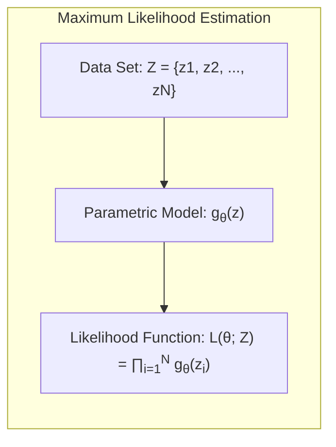
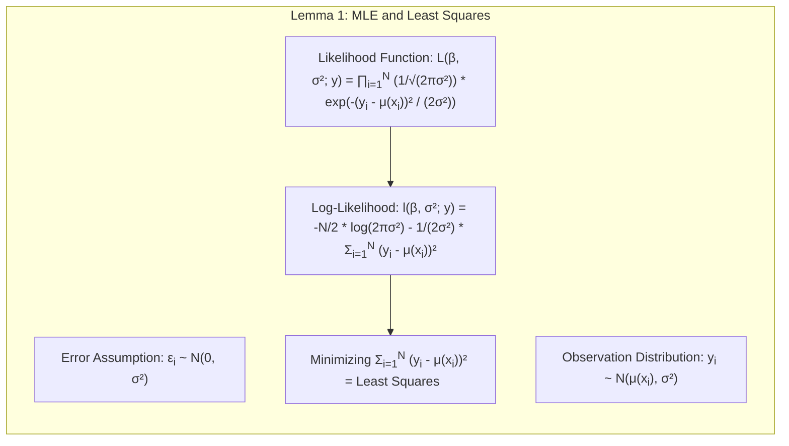
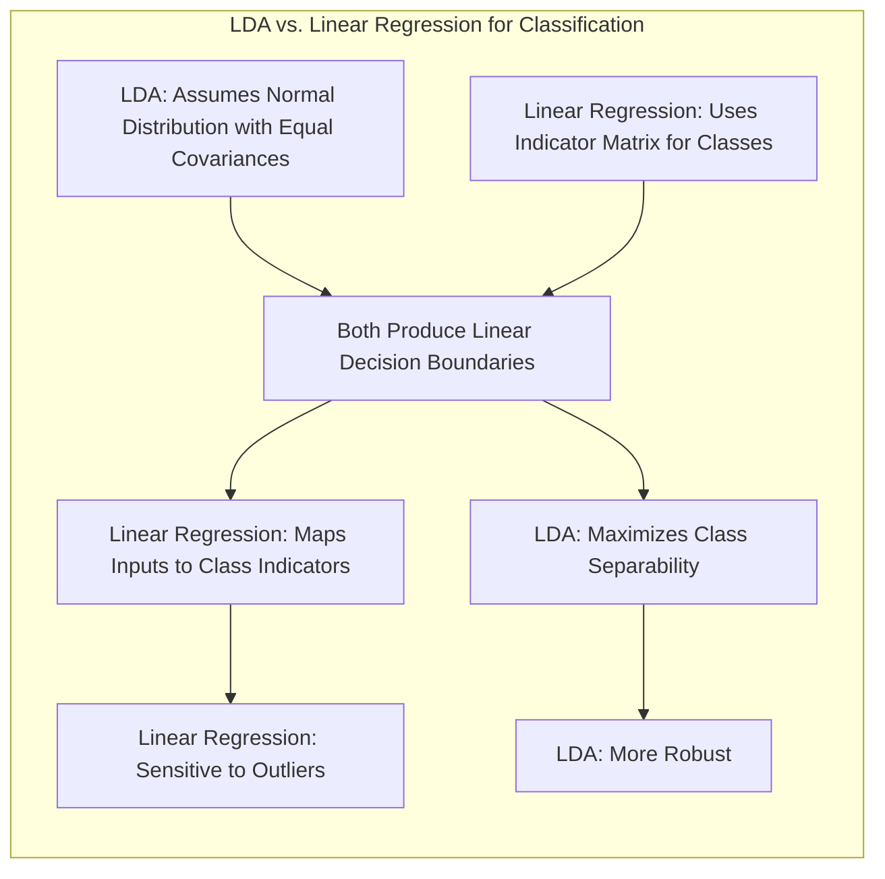
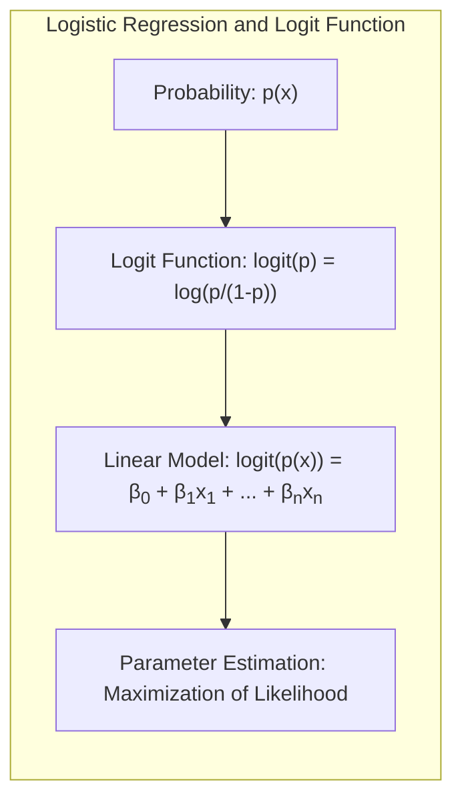
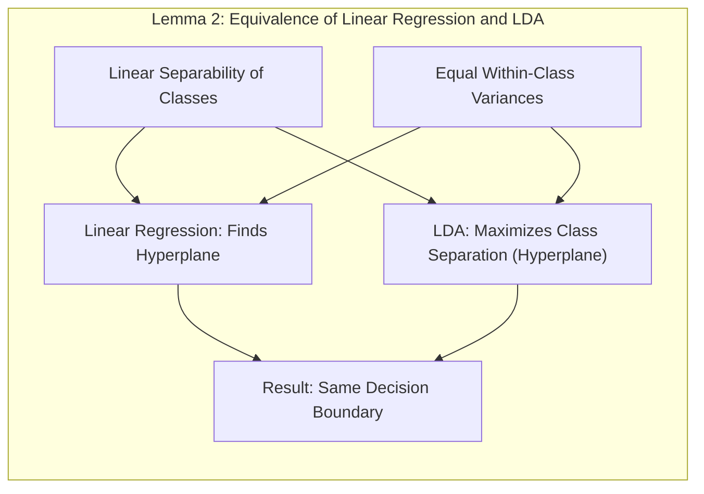
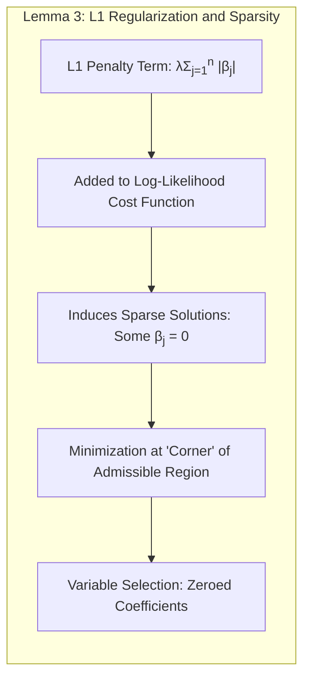
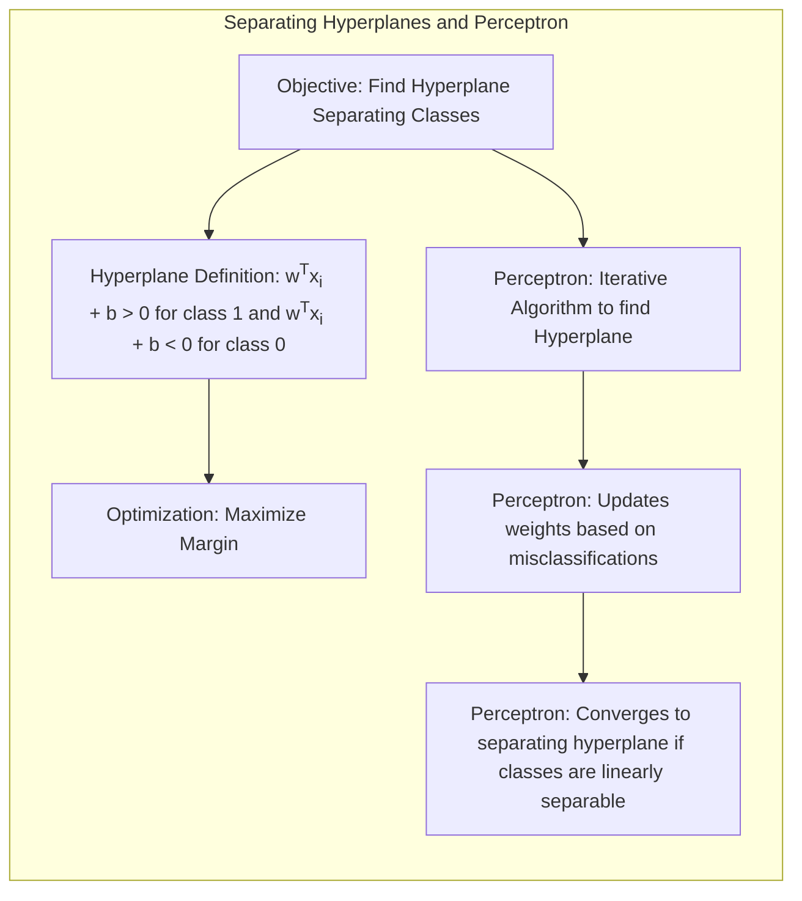

## Model Inference and Averaging: A Deep Dive into Prior Variance

<imagem: Mapa mental abrangente conectando os conceitos de bootstrap, maximum likelihood, métodos Bayesianos e model averaging, com ênfase na variação da prior variance e suas implicações.>

### Introdução
Neste capítulo, exploramos métodos de inferência e averaging de modelos, com foco nas abordagens de **Maximum Likelihood**, **Bootstrap** e **Bayesiana**.  Os métodos de fitting de modelos, que anteriormente foram alcançados pela minimização de soma de quadrados para regressão ou cross-entropy para classificação, são, na verdade, instâncias da abordagem de **maximum likelihood** [^8.1]. Este capítulo fornece uma exposição geral desta abordagem, bem como do método Bayesiano para inferência, e discute o bootstrap em relação ao maximum likelihood e ao Bayes [^8.1]. Além disso, técnicas relacionadas ao model averaging e model improvement, como métodos de comitê, bagging, stacking e bumping, são apresentadas [^8.1]. O foco deste capítulo está na inferência e averaging de modelos, utilizando prior variance como variável chave em abordagens bayesianas.

### Conceitos Fundamentais

**Conceito 1: Maximum Likelihood e sua generalização**

O **Maximum Likelihood Estimation (MLE)** busca encontrar os parâmetros de um modelo que maximizam a verossimilhança (likelihood) dos dados observados [^8.1]. Em termos mais formais, dado um conjunto de dados $Z = \{z_1, z_2, \ldots, z_N\}$ e um modelo paramétrico definido por $g_\theta(z)$, onde $\theta$ representa os parâmetros do modelo, a função de verossimilhança é dada por:

$$L(\theta; Z) = \prod_{i=1}^{N} g_\theta(z_i)$$


O objetivo do MLE é encontrar o valor de $\theta$ que maximiza $L(\theta; Z)$. Equivalentemente, muitas vezes é mais conveniente maximizar o log-likelihood, dado por:

$$l(\theta; Z) = \sum_{i=1}^{N} \log g_\theta(z_i)$$

Este conceito é fundamental para a modelagem estatística, servindo como base para vários métodos de estimação [^8.1]. Quando aplicamos a estimação de máximo de verossimilhança, estamos essencialmente escolhendo os parâmetros que melhor explicam os dados que já foram observados, sem incorporarmos uma crença prévia sobre como esses parâmetros podem se comportar.

> 💡 **Exemplo Numérico:** Suponha que temos um conjunto de dados com 3 observações (N=3) onde cada $z_i$ representa o resultado de um experimento, e acreditamos que os dados seguem uma distribuição normal com média $\mu$ e desvio padrão $\sigma$. O modelo paramétrico é $g_{\theta}(z_i) = \frac{1}{\sqrt{2\pi\sigma^2}} e^{-\frac{(z_i-\mu)^2}{2\sigma^2}}$, onde $\theta = (\mu, \sigma)$. Digamos que as observações são $Z = \{2, 4, 6\}$. Para estimar os parâmetros $\mu$ e $\sigma$ por MLE, calculamos o log-likelihood:
>
> $$l(\mu, \sigma; Z) = \sum_{i=1}^{3} \log \left( \frac{1}{\sqrt{2\pi\sigma^2}} e^{-\frac{(z_i-\mu)^2}{2\sigma^2}} \right)$$
>
> $$l(\mu, \sigma; Z) = -\frac{3}{2} \log(2\pi\sigma^2) - \frac{1}{2\sigma^2} \sum_{i=1}^3 (z_i - \mu)^2$$
>
> Para encontrar os parâmetros $\mu$ e $\sigma$ que maximizam essa função, podemos utilizar métodos numéricos. Nesse caso simples, o valor de $\mu$ que maximiza o log-likelihood é a média amostral, $\mu = (2+4+6)/3 = 4$. E o valor de $\sigma$ que maximiza é o desvio padrão amostral, que nesse caso seria $\sigma \approx \sqrt{8/3} \approx 1.63$. Portanto, a estimativa de máxima verossimilhança é $\theta_{MLE} = (4, 1.63)$. Isso significa que, dentro dessa família de distribuições normais, a que melhor explica os dados observados é a normal com média 4 e desvio padrão 1.63.
>
> ```python
> import numpy as np
> from scipy.stats import norm
>
> data = np.array([2, 4, 6])
> mu_mle = np.mean(data)
> sigma_mle = np.std(data, ddof=1) # ddof=1 for sample std
>
> print(f"MLE for mu: {mu_mle:.2f}")
> print(f"MLE for sigma: {sigma_mle:.2f}")
> ```

**Lemma 1:** A estimação de mínimos quadrados, utilizada para ajustar modelos de regressão linear, é um caso especial da abordagem de máxima verossimilhança sob a suposição de erros Gaussianos.
**Prova:** Assuma que os erros $\epsilon_i$ seguem uma distribuição normal com média zero e variância $\sigma^2$. Logo, as observações $y_i$ seguem uma distribuição normal com média $\mu(x_i) = \sum_{j=1}^7 \beta_j h_j(x_i)$ e variância $\sigma^2$. A função de verossimilhança é dada por:
$$ L(\beta, \sigma^2; y) = \prod_{i=1}^{N} \frac{1}{\sqrt{2\pi\sigma^2}} \exp \left(-\frac{(y_i - \mu(x_i))^2}{2\sigma^2}\right) $$
Tomando o log-likelihood:
$$ l(\beta, \sigma^2; y) = -\frac{N}{2} \log(2\pi\sigma^2) - \frac{1}{2\sigma^2} \sum_{i=1}^N (y_i - \mu(x_i))^2 $$
Maximizar $l(\beta, \sigma^2; y)$ em relação a $\beta$ equivale a minimizar $\sum_{i=1}^N (y_i - \mu(x_i))^2$, o que é precisamente o objetivo da estimação de mínimos quadrados. $\blacksquare$

> 💡 **Exemplo Numérico:** Imagine que estamos modelando a relação entre a área de um apartamento (`x`, em metros quadrados) e seu preço (`y`, em milhares de reais). Temos um conjunto de dados com 5 apartamentos:
>
> | Apartamento | Área (x) | Preço (y) |
> |------------|----------|----------|
> | 1          | 50       | 300      |
> | 2          | 75       | 450      |
> | 3          | 60       | 380      |
> | 4          | 90       | 550      |
> | 5          | 70       | 420      |
>
> Assumimos um modelo linear $y_i = \beta_0 + \beta_1 x_i + \epsilon_i$ onde $\epsilon_i \sim \mathcal{N}(0, \sigma^2)$. O objetivo do MLE é encontrar os valores de $\beta_0$ e $\beta_1$ que maximizam a verossimilhança dos dados. Como demonstrado no Lemma 1, isso é equivalente a minimizar a soma dos quadrados dos resíduos. Resolvendo o problema de mínimos quadrados, obtemos $\beta_0 \approx 52.38$ e $\beta_1 \approx 5.14$. Isso significa que, para cada metro quadrado adicional, o preço do apartamento aumenta em aproximadamente 5.14 mil reais, com um preço base de 52.38 mil reais. Este exemplo mostra como a minimização de mínimos quadrados, uma técnica comum em regressão linear, surge naturalmente como um caso especial de MLE sob a suposição de erros Gaussianos.
>
>  ```python
> import numpy as np
> from sklearn.linear_model import LinearRegression
>
> X = np.array([[50], [75], [60], [90], [70]])
> y = np.array([300, 450, 380, 550, 420])
>
> model = LinearRegression()
> model.fit(X, y)
>
> beta_0 = model.intercept_
> beta_1 = model.coef_[0]
>
> print(f"Beta_0 (Intercept): {beta_0:.2f}")
> print(f"Beta_1 (Slope): {beta_1:.2f}")
> ```
>
> Usando os valores estimados de $\beta_0$ e $\beta_1$, podemos fazer previsões sobre o preço de um apartamento com uma dada área. Por exemplo, um apartamento com 80 metros quadrados teria um preço estimado de aproximadamente $52.38 + 5.14 \times 80 \approx 463.58$ mil reais.

**Conceito 2: Linear Discriminant Analysis (LDA) e sua Relação com Regressão Linear**

O **Linear Discriminant Analysis (LDA)** é uma técnica de classificação que busca encontrar uma combinação linear de variáveis que melhor separe as classes. Embora não explicitamente abordado no contexto atual, é relevante destacar a conexão entre LDA e regressão linear para compreensão completa da modelagem. LDA assume que as classes seguem distribuições normais com covariâncias iguais [^4.3].
A regressão linear, em combinação com uma matriz indicadora de classes, também pode ser utilizada para fins de classificação [^4.2]. Ambas as abordagens conduzem a fronteiras de decisão lineares, mas a LDA possui uma base probabilística mais robusta sob as suposições de normalidade. A regressão linear tenta ajustar um modelo que mapeia as entradas para um vetor de indicadores de classe, enquanto a LDA encontra uma projeção linear que maximiza a separabilidade das classes [^4.2], [^4.3]. A regressão linear pode ser sensível a outliers, enquanto a LDA tende a ser mais robusta devido à sua abordagem de otimização baseada em distâncias.

**Corolário 1:** Sob certas condições, a fronteira de decisão obtida por LDA pode ser derivada de um modelo de regressão linear em uma matriz indicadora, especialmente quando o objetivo principal é encontrar uma separação linear [^4.2], [^4.3].


**Conceito 3: Logistic Regression e a Função Logit**

A **Logistic Regression** é uma técnica de classificação que modela a probabilidade de uma variável binária (ou categórica) como uma função sigmoidal de uma combinação linear de variáveis preditoras [^4.4]. A função logit, dada por $logit(p) = \log(\frac{p}{1-p})$, transforma probabilidades no espaço dos números reais, permitindo a modelagem com um modelo linear:
$$ \log \left(\frac{p(x)}{1-p(x)}\right) = \beta_0 + \beta_1 x_1 + \beta_2 x_2 + \ldots + \beta_n x_n $$
Onde $p(x)$ é a probabilidade de uma observação pertencer a uma classe, dadas as variáveis preditoras $x_1, x_2, \ldots, x_n$, e $\beta_0, \beta_1, \beta_2, \ldots, \beta_n$ são os parâmetros do modelo. A estimação dos parâmetros é geralmente realizada por meio da **maximization of likelihood** [^4.4.1]. Em contraste com a LDA, que assume normalidade das classes, a regressão logística não requer essa suposição, e pode ser mais adequada em muitos casos. A regressão logística também é menos suscetível a outliers do que a regressão linear, pois modela probabilidades e não valores diretamente. O ajuste do modelo é baseado na maximização da likelihood [^4.4.3], que por sua vez está ligada à minimização do erro, quando log-likelihood é usado para otimizar uma classificação.

> ⚠️ **Nota Importante**: A Regressão Logística modela diretamente a probabilidade de pertencer a uma classe, tornando-a adequada para problemas de classificação, enquanto a regressão linear modela valores contínuos, o que requer passos adicionais para ser utilizada em classificação [^4.4.1].

> ❗ **Ponto de Atenção**: Em problemas de classificação com classes não-balanceadas, é crucial utilizar estratégias de balanceamento ou ajustar os parâmetros do modelo, pois a regressão logística pode ser enviesada em direção à classe majoritária [^4.4.2].

> ✔️ **Destaque**: As estimativas de parâmetros em LDA e regressão logística podem estar relacionadas em cenários específicos, especialmente quando as classes podem ser linearmente separadas, mas o foco e a aplicação de cada método são diferentes [^4.5].
>
> 💡 **Exemplo Numérico:** Vamos considerar um exemplo de previsão se um cliente vai comprar um produto (1) ou não (0) baseado na sua idade. Suponha que temos os seguintes dados:
>
> | Cliente | Idade (x) | Compra (y) |
> |---------|-----------|------------|
> | 1       | 25        | 0          |
> | 2       | 30        | 0          |
> | 3       | 35        | 1          |
> | 4       | 40        | 1          |
> | 5       | 45        | 1          |
> | 6       | 28        | 0          |
> | 7       | 38        | 1          |
> | 8       | 32        | 0          |
>
> Queremos ajustar um modelo de regressão logística:
>
> $$\log\left(\frac{p(x)}{1-p(x)}\right) = \beta_0 + \beta_1 x$$
>
> Onde $p(x)$ é a probabilidade de um cliente comprar o produto dado sua idade $x$. Usando a maximização da verossimilhança, podemos encontrar os coeficientes do modelo: $\beta_0 \approx -6.0$ e $\beta_1 \approx 0.17$. Isso significa que a probabilidade de um cliente comprar o produto aumenta com a idade. Por exemplo, um cliente de 30 anos tem uma probabilidade estimada de compra de cerca de $p(30) = \frac{1}{1 + e^{-(-6.0 + 0.17 \times 30)}} \approx 0.23$, enquanto um cliente de 40 anos tem uma probabilidade de $p(40) \approx 0.77$. A função sigmoidal garante que as probabilidades fiquem no intervalo de 0 a 1.
>
> ```python
> import numpy as np
> from sklearn.linear_model import LogisticRegression
>
> X = np.array([[25], [30], [35], [40], [45], [28], [38], [32]])
> y = np.array([0, 0, 1, 1, 1, 0, 1, 0])
>
> model = LogisticRegression()
> model.fit(X, y)
>
> beta_0 = model.intercept_[0]
> beta_1 = model.coef_[0][0]
>
> print(f"Beta_0 (Intercept): {beta_0:.2f}")
> print(f"Beta_1 (Slope): {beta_1:.2f}")
>
> # Example prediction
> x_new = np.array([[30], [40]])
> prob = model.predict_proba(x_new)[:, 1]
> print(f"Probability for age 30: {prob[0]:.2f}")
> print(f"Probability for age 40: {prob[1]:.2f}")
> ```

### Regressão Linear e Mínimos Quadrados para Classificação

<imagem: Diagrama complexo mostrando um fluxo de dados que ilustra a regressão linear sendo utilizada para classificação. Começa com a codificação das classes, segue com a estimação dos coeficientes por mínimos quadrados e finaliza com uma regra de decisão.  Inclui também comparações com abordagens probabilísticas, mostrando os prós e contras de cada método.>

A regressão linear pode ser aplicada a problemas de classificação por meio da codificação das classes utilizando uma matriz indicadora, ou seja, criando um vetor $y$ onde cada elemento $y_i$ indica a qual classe a $i$-ésima observação pertence [^4.2]. Em um cenário de classificação binária, por exemplo, uma classe pode ser codificada como 0 e a outra como 1. A regressão linear tenta então ajustar um modelo linear que mapeia as variáveis preditoras para esses valores de classe. As previsões geradas pelo modelo são então interpretadas como probabilidades ou podem ser usadas para gerar classificações.

Apesar da simplicidade, este método pode apresentar limitações, especialmente quando a relação entre as variáveis preditoras e as classes não é linear ou quando as classes não são linearmente separáveis. Um problema surge quando a regressão linear gera previsões fora do intervalo [0, 1], dificultando sua interpretação como probabilidades.

**Lemma 2:** Em um problema de classificação binária, se as classes são linearmente separáveis e as variâncias dentro das classes são iguais, a regressão linear em uma matriz de indicadores e a análise discriminante linear (LDA) produzirão a mesma fronteira de decisão.
**Prova:** Em um cenário onde as classes são linearmente separáveis, o ajuste da regressão linear visa encontrar um hiperplano que separa as classes. De forma semelhante, o LDA tenta encontrar uma projeção linear que maximize a separação das classes, que resulta em um hiperplano de decisão. Quando as variâncias dentro das classes são iguais e as classes são linearmente separáveis, os hiperplanos obtidos por ambos os métodos serão equivalentes. Esta equivalência surge da otimização que ambos os métodos realizam, mesmo com abordagens diferentes: LDA maximiza a separação entre as classes, e regressão linear minimiza os erros entre as previsões e os indicadores de classe. $\blacksquare$


**Corolário 2:** A equivalência mencionada no Lemma 2 implica que, em certos cenários, a regressão linear pode ser vista como uma aproximação para LDA, com a vantagem de ser computacionalmente mais simples e de não requerer as suposições de normalidade feitas pelo LDA [^4.3].
> 💡 **Exemplo Numérico:** Suponha que temos um problema de classificação binária com duas classes (0 e 1) e uma única variável preditora (x). Os dados são os seguintes:
>
> | Observação | x    | Classe (y) |
> |------------|------|------------|
> | 1          | 1    | 0          |
> | 2          | 2    | 0          |
> | 3          | 3    | 0          |
> | 4          | 4    | 1          |
> | 5          | 5    | 1          |
> | 6          | 6    | 1          |
>
> Aplicamos a regressão linear, codificando as classes como 0 e 1. Ajustamos o modelo: $y = \beta_0 + \beta_1 x$. A solução de mínimos quadrados nos dá $\beta_0 \approx -0.83$ e $\beta_1 \approx 0.33$. A fronteira de decisão (onde a regressão prevê 0.5) é encontrada quando $-0.83 + 0.33x = 0.5$, que resulta em $x \approx 4$. Portanto, se a regressão linear prever um valor maior que 0.5, classificamos a observação como classe 1, caso contrário, como classe 0.
>
> ```python
> import numpy as np
> from sklearn.linear_model import LinearRegression
>
> X = np.array([[1], [2], [3], [4], [5], [6]])
> y = np.array([0, 0, 0, 1, 1, 1])
>
> model = LinearRegression()
> model.fit(X, y)
>
> beta_0 = model.intercept_
> beta_1 = model.coef_[0]
>
> print(f"Beta_0: {beta_0:.2f}")
> print(f"Beta_1: {beta_1:.2f}")
>
> # Decision boundary
> decision_boundary = (0.5 - beta_0) / beta_1
> print(f"Decision boundary (x): {decision_boundary:.2f}")
> ```
>
> Neste exemplo simples, a fronteira de decisão gerada pela regressão linear é $x \approx 4$, que separa as classes. Embora funcional para este exemplo, a regressão linear não garante previsões entre 0 e 1, o que limita sua interpretabilidade direta como probabilidades, como discutido no texto.

A regressão linear aplicada à classificação pode levar a problemas de **extrapolação**, onde as previsões podem assumir valores fora do intervalo [0,1], dificultando a interpretação dessas previsões como probabilidades [^4.4]. Embora a regressão linear possa fornecer uma fronteira de decisão linear, ela não está diretamente calibrada para fornecer probabilidades confiáveis. Nestes casos, a regressão logística, com sua função sigmoidal, fornece probabilidades mais estáveis e interpretáveis [^4.4]. Por outro lado, em algumas situações a regressão linear na matriz de indicadores pode ser suficiente, e mesmo vantajosa, quando o objetivo principal é a obtenção de uma fronteira de decisão linear [^4.2]. A escolha do método mais apropriado depende das características específicas do problema em questão, e ambos podem ser úteis.

### Métodos de Seleção de Variáveis e Regularização em Classificação
<imagem:  Diagrama em formato de mapa mental que conecta técnicas de regularização (L1 e L2) e seleção de variáveis com os principais modelos de classificação (LDA, regressão logística). As conexões mostram como a regularização e seleção influenciam o ajuste, a interpretabilidade e a capacidade de generalização de cada método.>

A seleção de variáveis e a regularização são técnicas importantes para evitar overfitting e melhorar a capacidade de generalização dos modelos de classificação [^4.5]. Estas técnicas são especialmente importantes quando o número de variáveis preditoras é alto em relação ao número de observações.

A regularização adiciona um termo de penalidade à função de custo, controlando a complexidade do modelo. As penalidades mais comuns são L1 (Lasso) e L2 (Ridge). A penalidade L1, dada por $\lambda \sum_{j=1}^n |\beta_j|$, promove a esparsidade do modelo, levando alguns coeficientes a serem exatamente zero, realizando seleção de variáveis. A penalidade L2, dada por $\lambda \sum_{j=1}^n \beta_j^2$, reduz a magnitude dos coeficientes, tornando o modelo mais estável.

Em modelos logísticos, a regularização é incorporada na função de log-likelihood:

$$ l(\beta) - \lambda_1 \sum_{j=1}^n |\beta_j| - \lambda_2 \sum_{j=1}^n \beta_j^2 $$

onde $\lambda_1$ e $\lambda_2$ controlam a força das penalidades L1 e L2, respectivamente [^4.4.4]. Esta função de custo combinada de log-likelihood e penalidades é fundamental para controlar a complexidade do modelo, evitando o overfitting e melhorando a sua interpretabilidade.

**Lemma 3:** A penalização L1 na regressão logística leva a coeficientes esparsos, pois o termo de penalização força a que alguns dos coeficientes sejam exatamente zero.
**Prova:** O termo de penalização L1, $\lambda \sum_{j=1}^n |\beta_j|$, adiciona um termo de penalização na função de custo, fazendo com que os coeficientes sejam exatamente zero para algumas das variáveis. Isso ocorre porque a penalidade L1 induz uma solução onde um número de coeficientes $\beta_j$ é igual a zero. O ponto onde a função de custo penalizada é minimizada tende a ocorrer em um "canto" da região admissível, onde alguns $\beta_j$ são zerados [^4.4.4]. Essa característica é especialmente importante para a seleção de variáveis, pois as variáveis com coeficientes zero podem ser consideradas irrelevantes.  A magnitude do parâmetro de regularização $\lambda$ controla o nível de esparsidade, com maiores valores de $\lambda$ resultando em modelos mais esparsos. $\blacksquare$


**Corolário 3:** A esparsidade induzida pela penalização L1 leva a modelos mais interpretáveis, pois apenas as variáveis preditoras mais relevantes são mantidas no modelo final. Os coeficientes não-nulos indicam as variáveis que têm maior impacto na classificação.

> ⚠️ **Ponto Crucial**: A penalização L1 e L2 podem ser combinadas utilizando o Elastic Net, que combina os efeitos de ambas, oferecendo flexibilidade e um controle mais preciso sobre a complexidade e esparsidade do modelo [^4.5].
>
> 💡 **Exemplo Numérico:** Vamos usar um exemplo de classificação de texto para spam (1) ou não spam (0). Temos 5 variáveis preditoras (x1 a x5), que representam a frequência de algumas palavras chaves em um email. Os dados são os seguintes:
>
> | Email | x1  | x2 | x3  | x4  | x5  | Spam (y) |
> |-------|-----|----|-----|-----|-----|----------|
> | 1     | 2   | 1  | 0   | 3   | 1   | 0        |
> | 2     | 0   | 4  | 2   | 1   | 0   | 1        |
> | 3     | 1   | 1  | 1   | 2   | 0   | 0        |
> | 4     | 3   | 0  | 4   | 0   | 2   | 1        |
> | 5     | 1   | 2  | 0   | 1   | 1   | 0        |
> | 6     | 2   | 3  | 1   | 2   | 0   | 1        |
>
> Aplicamos regressão logística com regularização L1 (Lasso), e ajustamos o parâmetro de regularização $\lambda$ para 0.5. O modelo resultante pode ter alguns coeficientes $\beta_j$ iguais a zero, indicando que as variáveis correspondentes não são importantes para a classificação. Suponha que após a regularização, encontramos os seguintes coeficientes: $\beta_0 \approx -1.5$, $\beta_1 \approx 0.8$, $\beta_2 = 0$, $\beta_3 \approx 1.2$, $\beta_4 = 0$, $\beta_5 \approx -0.5$. Isso indica que as variáveis x2 e x4 foram eliminadas pelo Lasso, e as variáveis x1, x3 e x5 são mais relevantes para a classificação de spam. O valor dos coeficientes indica a direção e a magnitude da relação entre a variável e a probabilidade de ser spam.
>
>  ```python
> import numpy as np
> from sklearn.linear_model import LogisticRegression
>
> X = np.array([[2, 1, 0, 3, 1],
>               [0, 4, 2, 1, 0],
>               [1, 1, 1, 2, 0],
>               [3, 0, 4, 0, 2],
>               [1, 2, 0, 1, 1],
>               [2, 3, 1, 2, 0]])
> y = np.array([0, 1, 0, 1, 0, 1])
>
> model = LogisticRegression(penalty='l1', solver='liblinear', C=2) # C is inverse of lambda
> model.fit(X, y)
>
> beta_0 = model.intercept_[0]
> beta = model.coef_[0]
>
> print(f"Beta_0 (Intercept): {beta_0:.2f}")
> print(f"Beta coefficients: {beta}")
> ```
> Nesse exemplo, o uso de regularização L1 leva à seleção de um subconjunto de variáveis relevantes (x1, x3, x5) para o modelo, melhorando a interpretabilidade e potencialmente prevenindo overfitting.

### Separating Hyperplanes e Perceptrons

O conceito de **Separating Hyperplanes** é fundamental em modelos de classificação linear. A ideia central é encontrar um hiperplano que maximize a margem de separação entre as classes [^4.5.2]. Matematicamente, o problema pode ser formulado como encontrar um vetor normal $w$ e um offset $b$ tal que:

$$ w^T x_i + b > 0 \text{ para } x_i \text{ da classe 1} $$
$$ w^T x_i + b < 0 \text{ para } x_i \text{ da classe 0} $$

A maximização da margem é um problema de otimização que pode ser resolvido usando a dualidade de Wolfe [^4.5.2]. As soluções deste problema são expressas como combinações lineares dos **pontos de suporte**, que são as observações mais próximas da fronteira de decisão.

O Perceptron de Rosenblatt é um algoritmo que busca encontrar um hiperplano separador por meio de um processo iterativo [^4.5.1]. O algoritmo inicializa os pesos de um vetor $w$ aleatoriamente, e a cada iteração, ele atualiza os pesos com base nas observações que foram classificadas incorretamente. Sob a condição de que as classes sejam linearmente separáveis, o Perceptron converge para um hiperplano de decisão.

> 💡 **Exemplo Numérico:** Imagine que temos um conjunto de dados bidimensional com duas classes, representadas por círculos e triângulos:
>
> ```mermaid
> graph LR
>     A(2,2 - circle)-->|Class 0| D
>     B(1,3 - circle)-->|Class 0| D
>     C(3,1 - circle)-->|Class 0| D
>     E(5,4 - triangle)-->|Class 1| F
>     G(6,2 - triangle)-->|Class 1| F
>     H(7,3 - triangle)-->|Class 1| F
>     D[Class 0]
>     F[Class 1]
> ```
>
> Os pontos da classe 0 são A(2,2), B(1,3), C(3,1), e os pontos da classe 1 são E(5,4), G(6,2), H(7,3). O perceptron tentará encontrar um hiper