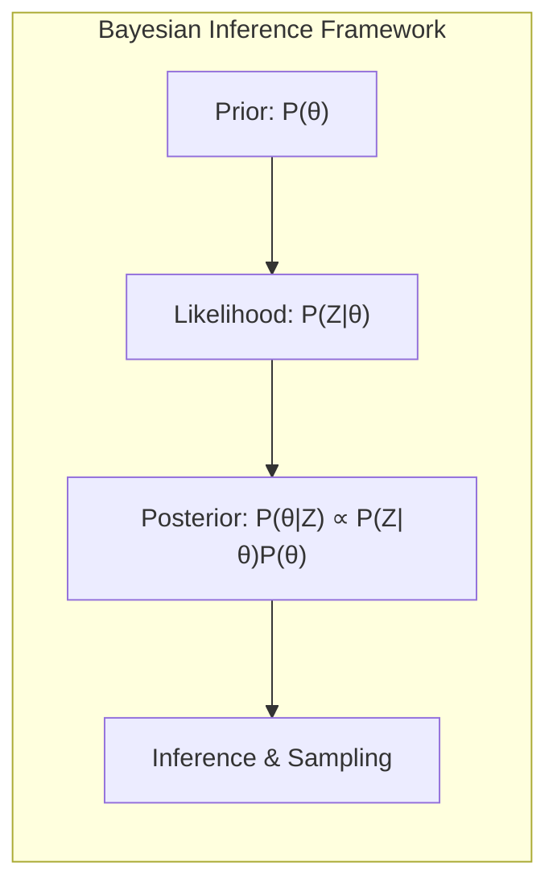
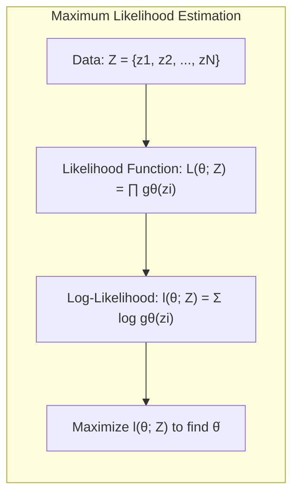
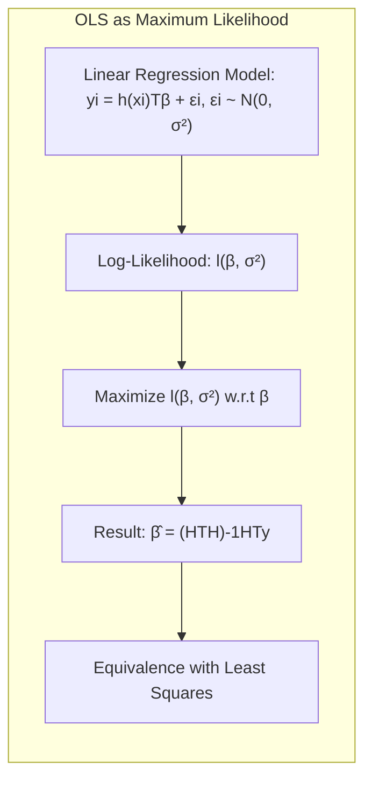
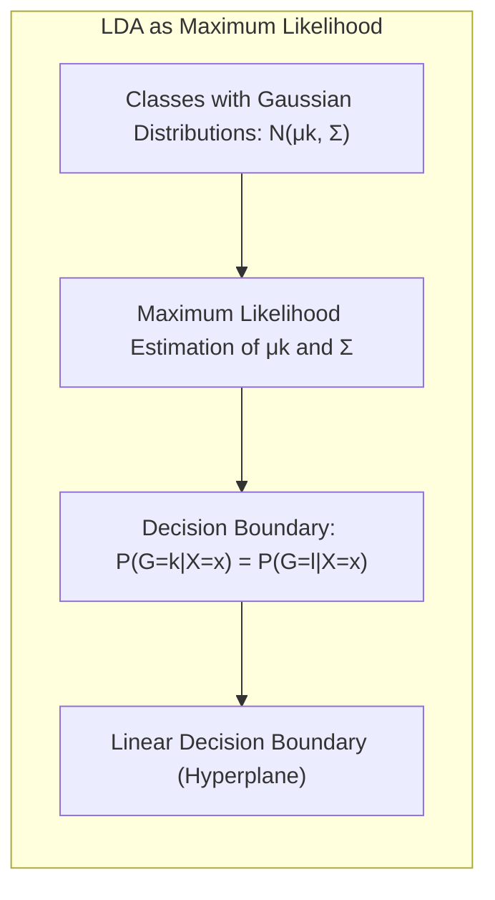
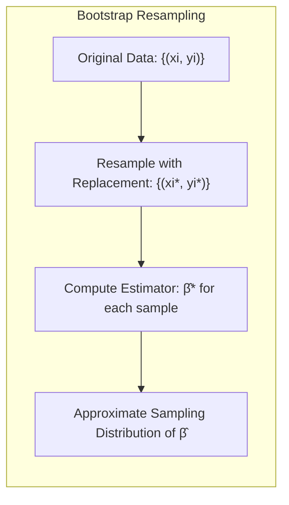
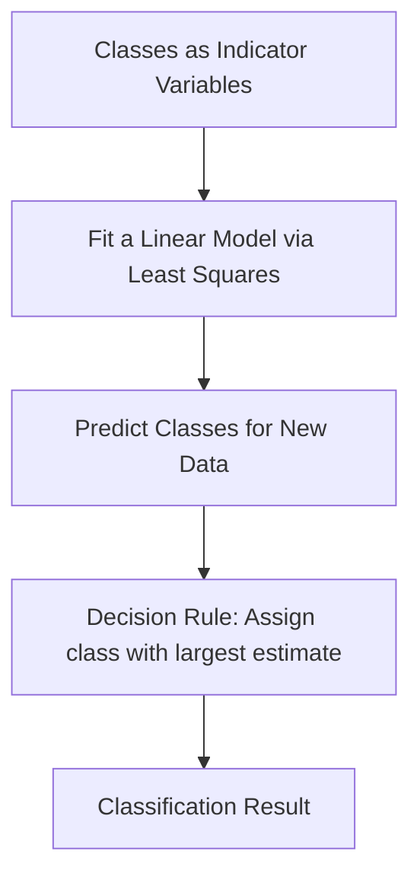
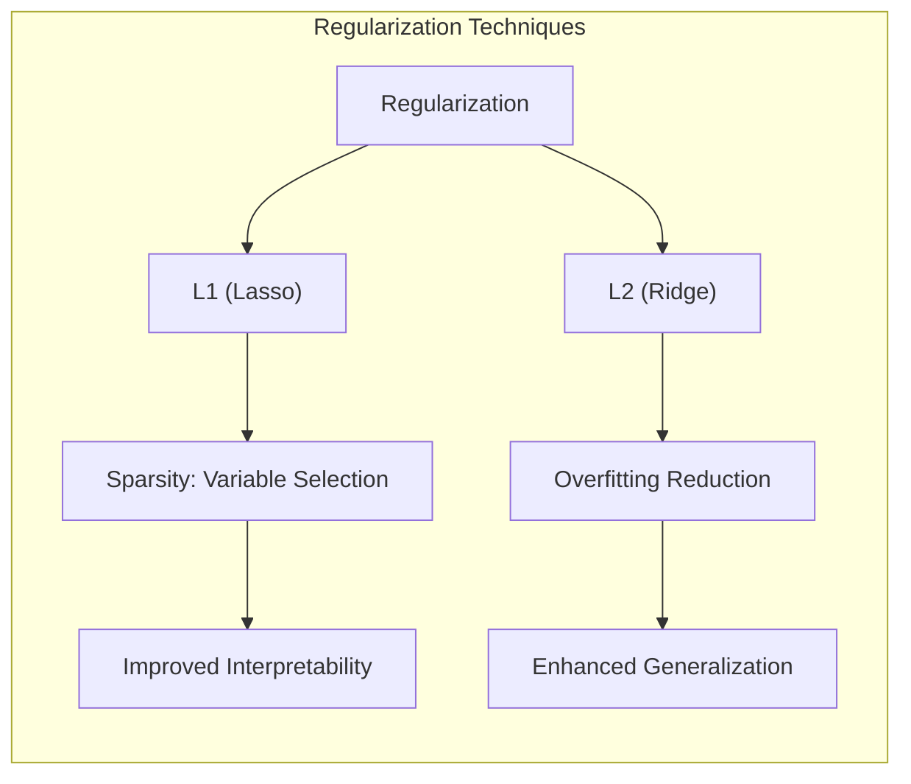
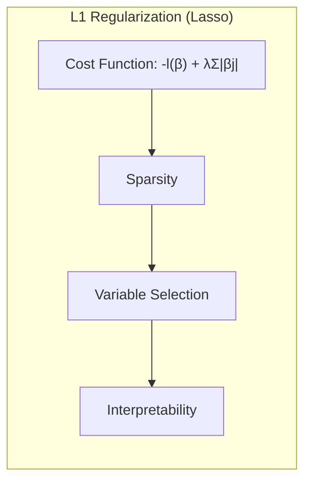
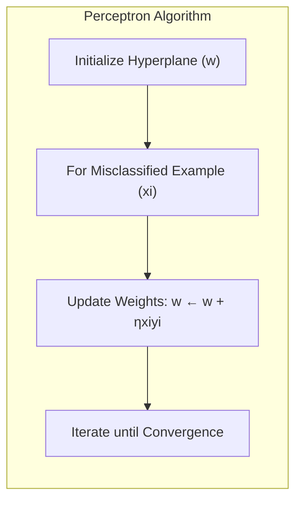
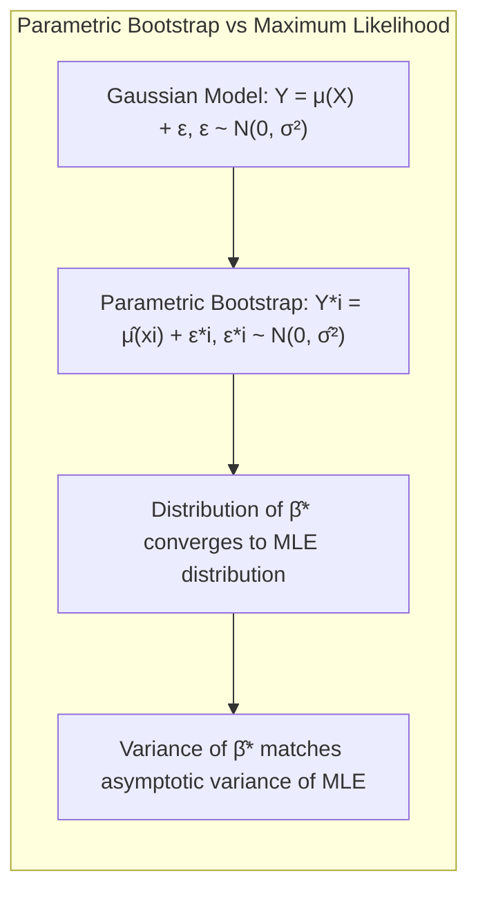

## Inferência e Amostragem da Distribuição Conjunta Posterior

### Introdução

Neste capítulo, exploramos técnicas para a **inferência e amostragem da distribuição conjunta posterior**, um conceito central na inferência Bayesiana. A inferência Bayesiana difere da abordagem frequentista por incorporar um *prior* que reflete o conhecimento prévio sobre os parâmetros, permitindo atualizar este conhecimento após observar os dados [^8.1]. A distribuição posterior, por sua vez, expressa a incerteza remanescente após a observação dos dados, através de uma distribuição de probabilidade. Este capítulo aprofunda as técnicas de **maximum likelihood**, **bootstrap**, **métodos Bayesianos**, e os métodos de *model averaging* e *stacking* [^8.1]. Apresentamos uma discussão avançada sobre o uso de métodos *Markov chain Monte Carlo* (MCMC), incluindo *Gibbs Sampling*, e suas conexões com o algoritmo *Expectation-Maximization* (EM). As técnicas abordadas são essenciais para problemas de inferência e análise de dados, onde a incerteza nos parâmetros é uma consideração crucial.

### Conceitos Fundamentais

**Conceito 1: Maximum Likelihood**

O método de **Maximum Likelihood** busca encontrar os valores dos parâmetros que maximizam a probabilidade dos dados observados, dada uma determinada distribuição [^8.1]. Matematicamente, dado um conjunto de dados $Z = \{z_1, z_2, \ldots, z_N\}$, e uma distribuição de probabilidade com parâmetros $\theta$, a função de verossimilhança é dada por:

$$
L(\theta; Z) = \prod_{i=1}^N g_\theta(z_i),
$$

onde $g_\theta(z_i)$ é a densidade de probabilidade ou massa de probabilidade para a observação $z_i$ sob o modelo com parâmetros $\theta$. Para facilitar a otimização, frequentemente maximizamos o logaritmo da verossimilhança, que é dado por:

$$
l(\theta; Z) = \sum_{i=1}^N \log g_\theta(z_i).
$$

O estimador de maximum likelihood, $\hat{\theta}$, é o valor de $\theta$ que maximiza $l(\theta; Z)$. Este método, embora amplamente utilizado, não considera nenhum *prior* sobre os parâmetros e é, portanto, puramente baseado nos dados [^8.1].

> 💡 **Exemplo Numérico:** Suponha que temos um conjunto de dados de 5 lançamentos de uma moeda, onde observamos 3 caras (1) e 2 coroas (0). O modelo para a probabilidade de cara é um modelo de Bernoulli com parâmetro $\theta$, então $g_\theta(z_i) = \theta^{z_i}(1-\theta)^{1-z_i}$. A função de verossimilhança é $L(\theta; Z) = \theta^3(1-\theta)^2$. O log-likelihood é $l(\theta; Z) = 3\log(\theta) + 2\log(1-\theta)$. Para encontrar o estimador de máxima verossimilhança, derivamos $l(\theta; Z)$ em relação a $\theta$ e igualamos a zero: $\frac{3}{\theta} - \frac{2}{1-\theta} = 0$. Resolvendo para $\theta$, obtemos $\hat{\theta} = 3/5 = 0.6$. Este é o valor de $\theta$ que maximiza a probabilidade de observar os dados que temos.

**Lemma 1:** O estimador de mínimos quadrados para regressão linear é um caso especial do estimador de máxima verossimilhança quando os erros são gaussianos.

*Prova:* Para um modelo de regressão linear com erros gaussianos, $y_i = h(x_i)^T\beta + \epsilon_i$, onde $\epsilon_i \sim N(0, \sigma^2)$, a função de log-verossimilhança é dada por:

$$
l(\beta, \sigma^2) = -\frac{N}{2} \log(2\pi\sigma^2) - \frac{1}{2\sigma^2} \sum_{i=1}^N (y_i - h(x_i)^T\beta)^2
$$

Maximizando essa função em relação a $\beta$, obtemos o estimador de mínimos quadrados $\hat{\beta} = (H^TH)^{-1}H^Ty$, que coincide com o estimador de máxima verossimilhança. $\blacksquare$

> 💡 **Exemplo Numérico:** Considere um modelo de regressão linear simples $y_i = \beta_0 + \beta_1 x_i + \epsilon_i$ com $\epsilon_i \sim N(0, \sigma^2)$. Suponha que temos os seguintes dados: $X = [1, 2, 3, 4, 5]$ e $Y = [2, 4, 5, 4, 5]$. Podemos construir a matriz $H$ com uma coluna de 1's e a coluna de $X$, tal que
>
> $H = \begin{bmatrix} 1 & 1 \\ 1 & 2 \\ 1 & 3 \\ 1 & 4 \\ 1 & 5 \end{bmatrix}$
>
> Usando a fórmula do estimador de mínimos quadrados, $\hat{\beta} = (H^TH)^{-1}H^Ty$, podemos calcular:
>
> $H^TH = \begin{bmatrix} 5 & 15 \\ 15 & 55 \end{bmatrix}$
>
> $(H^TH)^{-1} = \begin{bmatrix} 0.55 & -0.15 \\ -0.15 & 0.05 \end{bmatrix}$
>
> $H^Ty = \begin{bmatrix} 20 \\ 74 \end{bmatrix}$
>
> $\hat{\beta} = \begin{bmatrix} 0.9 \\ 0.7 \end{bmatrix}$.
>
> Este resultado coincide com a solução de máxima verossimilhança para este problema quando os erros são gaussianos, como demonstrado no Lemma 1.

**Conceito 2: Linear Discriminant Analysis (LDA) e sua relação com Maximum Likelihood.**

O Linear Discriminant Analysis (LDA) pode ser visto como uma aplicação de Maximum Likelihood para problemas de classificação. No LDA, assumimos que as classes têm distribuições gaussianas com a mesma matriz de covariância, mas médias diferentes. O objetivo é encontrar uma transformação linear que maximize a separação entre as classes e minimize a variância dentro de cada classe [^8.1]. Formalmente,  dado que $g_k(x) = N(\mu_k, \Sigma)$ representa a densidade Gaussiana da classe $k$, o LDA estima as médias de classe  $\mu_k$ e a matriz de covariância comum $\Sigma$ por maximum likelihood. A fronteira de decisão linear é definida com base nas estimativas de maximum likelihood e é uma aproximação da fronteira de decisão Bayesiana ideal sob as suposições de normalidade e covariâncias iguais.

**Corolário 1:** A fronteira de decisão do LDA é linear e é definida pelos pontos onde a probabilidade posterior das classes são iguais.

*Prova:* A fronteira de decisão entre duas classes k e l é dada por $P(G=k|X=x)=P(G=l|X=x)$. Utilizando o teorema de Bayes, $P(G=k|X=x) = \frac{P(X=x|G=k)P(G=k)}{P(X=x)}$. Assumindo prior de classes iguais $P(G=k) = P(G=l)$  e as densidades gaussianas $P(X=x|G=k) = N(x;\mu_k, \Sigma)$, a fronteira de decisão torna-se $N(x;\mu_k, \Sigma)=N(x;\mu_l, \Sigma)$, que leva a uma equação linear em $x$ sob as mesmas covariâncias, determinando um hiperplano. $\blacksquare$

> 💡 **Exemplo Numérico:** Considere duas classes, uma com média $\mu_1 = [1, 1]$ e outra com média $\mu_2 = [3, 3]$, ambas com matriz de covariância $\Sigma = \begin{bmatrix} 1 & 0 \\ 0 & 1 \end{bmatrix}$. O LDA, ao assumir essas distribuições gaussianas, estima as médias e a covariância por máxima verossimilhança. A fronteira de decisão será um hiperplano, neste caso uma linha, que separa as duas classes. A fronteira de decisão, $x$, satisfaz:
>
> $(x - \mu_1)^T\Sigma^{-1}(x-\mu_1) = (x - \mu_2)^T\Sigma^{-1}(x-\mu_2)$.
>
> Resolvendo, chegamos a $2x_1 + 2x_2 = 16$, que é uma linha. A fronteira é uma reta com inclinação -1 e intercepto 8, localizada no meio do caminho entre as médias das duas classes, como esperado.

**Conceito 3: Bootstrap**

O **Bootstrap** é uma técnica de reamostragem que permite estimar a incerteza de um estimador sem fazer suposições paramétricas sobre a distribuição dos dados [^8.2.1]. A ideia é gerar múltiplas amostras a partir da amostra original, com reposição, e calcular o estimador para cada uma dessas amostras. A distribuição dos estimadores assim obtidos é usada para aproximar a distribuição do estimador original. No contexto de regressão, por exemplo, dado um conjunto de dados $\{(x_i, y_i)\}_{i=1}^N$, geramos $B$ conjuntos de dados bootstrap $\{(x_i^*, y_i^*)\}_{i=1}^N$, onde cada par $(x_i^*, y_i^*)$ é sorteado com reposição a partir dos pares originais. Então, calculamos o estimador de interesse para cada conjunto de dados bootstrap, por exemplo, $\hat{\beta}^{*b}$ para $b = 1, \ldots, B$ e estimamos a incerteza a partir da variância desses estimadores bootstrap. O método Bootstrap pode ser aplicado tanto para estimadores de parâmetros como para predições do modelo.

> ⚠️ **Nota Importante**: O bootstrap pode ser paramétrico ou não paramétrico. O bootstrap não paramétrico reamostra os dados diretamente, enquanto o bootstrap paramétrico simula novos dados a partir de um modelo ajustado aos dados originais, [^8.2.1].

> ❗ **Ponto de Atenção**: O bootstrap é útil quando não temos fórmulas analíticas para a incerteza de um estimador, mas pode ser computacionalmente intensivo [^8.2.1].

> ✔️ **Destaque**: A distribuição empírica dos estimadores bootstrap aproxima a distribuição amostral do estimador original [^8.2.1].

> 💡 **Exemplo Numérico:**  Considere o mesmo conjunto de dados de regressão linear do exemplo anterior: $X = [1, 2, 3, 4, 5]$ e $Y = [2, 4, 5, 4, 5]$. Para aplicar o bootstrap, geramos, por exemplo, 5 amostras bootstrap com reposição. Uma possível reamostragem poderia ser: $X^* = [2, 1, 4, 4, 3]$ e $Y^* = [4, 2, 4, 4, 5]$. Calculamos o estimador de mínimos quadrados $\hat{\beta}^*$ para cada amostra bootstrap, resultando em $\hat{\beta}^{*1}$, $\hat{\beta}^{*2}$, ..., $\hat{\beta}^{*5}$. A partir da distribuição desses $\hat{\beta}^*$, podemos estimar a incerteza dos parâmetros do modelo original.

### Regressão Linear e Mínimos Quadrados para Classificação

A **regressão linear** pode ser aplicada para problemas de classificação através da codificação das classes como variáveis indicadoras [^8.2]. Em um problema de $K$ classes, criamos $K$ variáveis indicadoras, onde a $k$-ésima variável é 1 se a observação pertence à classe $k$ e 0 caso contrário. O modelo linear é então ajustado para prever cada uma dessas variáveis indicadoras. Para classificar uma nova observação, atribuímos a ela a classe cuja variável indicadora tenha a maior previsão.

O uso de regressão linear para classificação, apesar de sua simplicidade, apresenta algumas limitações:
*  A regressão linear não restringe as previsões a estarem entre 0 e 1, o que pode levar a resultados sem interpretação probabilística.
* A regressão linear assume que a relação entre as variáveis preditoras e as variáveis indicadoras é linear, o que pode não ser válido em muitos casos práticos.
* A regressão linear não garante que as previsões das variáveis indicadoras somem 1 para uma determinada observação, o que é esperado em um problema de classificação probabilística.
* **Lemma 2:** O estimador de mínimos quadrados em regressão linear para classificação pode ser derivado diretamente da matriz de indicadores.

*Prova:* Seja $Y$ a matriz de indicadores de tamanho $N \times K$ onde cada coluna representa uma classe e $X$ a matriz de preditoras $N \times p$. A solução de mínimos quadrados para prever $Y$ a partir de $X$ é dada por $\hat{B} = (X^TX)^{-1}X^TY$. Este $\hat{B}$ fornece os coeficientes lineares para cada classe. Para classificar uma nova amostra $x^*$, multiplicamos o vetor $x^*$ por $\hat{B}$ e alocamos a classe com o maior valor. $\blacksquare$

*   **Corolário 2:** A regressão linear com variáveis indicadoras produz um classificador linear, que define fronteiras de decisão lineares.

*Prova:* As funções discriminantes obtidas pela regressão linear são lineares na entrada $x$ devido ao modelo ser linear nos parâmetros. As fronteiras de decisão são dadas pelas igualdades entre as funções discriminantes. Consequentemente, $x^T \hat{\beta}_k = x^T \hat{\beta}_l$ define uma relação linear em $x$, representando uma fronteira de decisão linear. $\blacksquare$

> 💡 **Exemplo Numérico:** Para um problema de classificação com duas classes (0 e 1) e uma única variável preditora $x$, suponha que temos os seguintes dados:
>
>  $X = [1, 2, 3, 4, 5]$ e $Y = [0, 0, 1, 1, 1]$. Criamos a matriz indicadora $Y$ que, neste caso, é igual ao próprio vetor $Y$ (a classe 0 é representada por 0 e a classe 1 por 1). Usando a regressão linear, ajustamos um modelo $\hat{y_i} = \hat{\beta}_0 + \hat{\beta}_1 x_i$. Aplicando a fórmula de mínimos quadrados, podemos encontrar os coeficientes $\hat{\beta}_0$ e $\hat{\beta}_1$. A fronteira de decisão será um ponto onde $\hat{y} = 0.5$, separando as duas classes. Para este exemplo em particular, $\hat{\beta_0} \approx -0.7$ e $\hat{\beta_1} \approx 0.3$.  A fronteira de decisão é definida por $-0.7 + 0.3x = 0.5$, que resulta em $x = 4$. Para classificar um novo ponto, dizemos que se $x < 4$ a classe é 0, senão é 1.
>

Em alguns casos, a regressão linear para classificação pode gerar boas aproximações para a fronteira de decisão, especialmente quando as classes são bem separáveis linearmente, como apresentado no capítulo, quando discute as ligações entre o método e o LDA [^8.1]. No entanto,  a regressão linear de uma matriz indicadora pode levar a extrapolações fora do intervalo [0, 1]. A **regressão logística** corrige esses problemas ao modelar diretamente as probabilidades das classes usando a função logística, que por sua vez se enquadra em um modelo de maximum likelihood com distribuição Bernoulli [^8.1], como apresentado na discussão de **Maximum Likelihood** no capítulo.

### Métodos de Seleção de Variáveis e Regularização em Classificação

A **seleção de variáveis** e a **regularização** são técnicas cruciais para lidar com modelos de classificação complexos, especialmente quando temos um número elevado de variáveis preditoras [^8.1]. A regularização adiciona uma penalidade à função de custo do modelo, com o objetivo de evitar *overfitting* e melhorar a capacidade de generalização. As penalizações L1 e L2 são as mais comuns:
*  A penalização L1 (Lasso) adiciona ao custo a soma dos valores absolutos dos coeficientes. Esta penalização tende a gerar modelos *esparsos*, ou seja, com muitos coeficientes iguais a zero, o que efetivamente realiza a seleção de variáveis, identificando as mais importantes [^8.1]. A função de custo com penalização L1 é dada por:

$$
\text{Custo} = -l(\beta) + \lambda \sum_{j=1}^p |\beta_j|
$$
Onde $l(\beta)$ é a log-verossimilhança e $\lambda$ é o parâmetro de regularização.

*   A penalização L2 (Ridge) adiciona ao custo a soma dos quadrados dos coeficientes. Esta penalização tende a reduzir a magnitude dos coeficientes, o que também evita o *overfitting* e estabiliza o modelo [^8.1]. A função de custo com penalização L2 é dada por:
$$
\text{Custo} = -l(\beta) + \lambda \sum_{j=1}^p \beta_j^2
$$
Onde $l(\beta)$ é a log-verossimilhança e $\lambda$ é o parâmetro de regularização.

*   A combinação das penalizações L1 e L2 é conhecida como Elastic Net, e visa combinar os benefícios de ambos os métodos [^8.1].
    O Elastic Net oferece um controle mais flexível sobre a esparsidade e a estabilidade dos modelos.

**Lemma 3:** A penalização L1 em regressão logística promove a esparsidade dos coeficientes.

*Prova:* A penalização L1, ao adicionar o termo $\lambda \sum_{j=1}^p |\beta_j|$ na função de custo, introduz uma solução não diferenciável para os coeficientes quando o valor de um deles é igual a zero. Essa não diferenciabilidade leva a uma "quebra" na trajetória de otimização, empurrando os coeficientes para zero, a medida que o $\lambda$ aumenta, especialmente para aqueles menos importantes. Isso é conhecido como a propriedade de *sparsity* da norma L1. A otimização, nesse caso,  requer algoritmos específicos que lidam com essa característica [^8.4.4]. $\blacksquare$

* **Corolário 3:** Modelos com penalização L1 são mais interpretáveis do que os modelos sem penalização ou com L2, devido ao menor número de variáveis relevantes no modelo.

*Prova:* A esparsidade dos coeficientes em modelos com penalização L1 reduz a complexidade do modelo, facilitando a identificação das variáveis mais importantes para a predição. Isso torna o modelo mais fácil de interpretar e entender, uma vez que as variáveis preditoras com peso nulo são explicitamente ignoradas no modelo [^8.4.5].$\blacksquare$

> 💡 **Exemplo Numérico:** Considere um problema de regressão logística com duas variáveis preditoras ($x_1$ e $x_2$) e as seguintes estimativas dos coeficientes por maximum likelihood: $\hat{\beta_0} = 0.1$, $\hat{\beta_1} = 0.8$ e $\hat{\beta_2} = -0.3$. Aplicando a regularização L1, o custo a ser minimizado é $-l(\beta) + \lambda(|\beta_1| + |\beta_2|)$. Se usarmos $\lambda = 0.5$, a regularização L1 pode forçar $\beta_2$ para zero, resultando em um modelo mais esparso e, portanto, mais interpretável. Por exemplo, podemos obter novas estimativas $\hat{\beta_1}=0.6$ e $\hat{\beta_2}=0$. Isso sugere que apenas a variável $x_1$ é relevante para o modelo. A regularização L2, por sua vez,  iria reduzir a magnitude de ambos os coeficientes mas não os forçaria a zero.

### Separating Hyperplanes e Perceptrons

A ideia de **separating hyperplanes** (hiperplanos separadores) surge no contexto de problemas de classificação linear, onde o objetivo é encontrar uma superfície linear que separe as diferentes classes de forma ótima.  A busca pelo hiperplano ótimo leva ao conceito de **máxima margem**, que é a distância máxima entre o hiperplano e os pontos mais próximos de cada classe [^8.5.2]. O problema de encontrar o hiperplano com máxima margem é formulado como um problema de otimização convexa, que pode ser resolvido usando o método do **dual de Wolfe**. A solução do problema dual envolve apenas os produtos internos dos vetores de dados, e a solução final é escrita como uma combinação linear dos pontos de suporte (os pontos de dados mais próximos do hiperplano) [^8.5.2].

O **Perceptron de Rosenblatt** é um algoritmo para encontrar um hiperplano separador, que é ajustado iterativamente com base nos erros de classificação [^8.5.1]. O Perceptron inicializa com um hiperplano aleatório e, em cada iteração, ajusta os pesos do hiperplano na direção de classificar corretamente um exemplo mal classificado. O Perceptron tem uma garantia de convergência para dados linearmente separáveis, o que significa que, em um número finito de iterações, o algoritmo encontra um hiperplano que separa perfeitamente as classes. No entanto, o Perceptron não tem garantia de convergência quando os dados não são linearmente separáveis, [^8.5.1].

> 💡 **Exemplo Numérico:** Considere um problema de classificação binária com dois pontos da classe 1: $x_1 = [1, 2]$ e $x_2 = [2, 3]$ e dois pontos da classe -1: $x_3 = [3, 1]$ e $x_4 = [4, 2]$. O perceptron começa com um hiperplano aleatório, que corresponde a uma linha $w_0 + w_1x_1 + w_2x_2 = 0$. Se inicializarmos os pesos com $w = [0, 0, 0]$, e tomarmos um exemplo errado, como $x_1$, atualizamos o peso com $w \leftarrow w + \eta x_1 y_1$, onde $\eta$ é a taxa de aprendizado e $y_1=1$. Se escolhermos $\eta=0.1$, a próxima iteração, com $w = [0, 0.1, 0.2]$, deve levar o algoritmo a convergir para um hiperplano que separa as duas classes linearmente após algumas iterações.

### Pergunta Teórica Avançada: Qual a relação entre o bootstrap paramétrico e o estimador de máxima verossimilhança em modelos gaussianos?

**Resposta:**
Em modelos gaussianos com erros aditivos, o bootstrap paramétrico concorda com a solução de mínimos quadrados, que coincide com a solução de máxima verossimilhança. No bootstrap paramétrico, novas respostas são simuladas adicionando ruído gaussiano aos valores preditos, usando a variância estimada a partir dos dados originais. A distribuição dos parâmetros obtida por esse processo coincide, no limite de um grande número de amostras bootstrap, com a distribuição normal assintótica dos estimadores de máxima verossimilhança [^8.2.2].

*   **Lemma 4:** Em modelos gaussianos com erros aditivos, o bootstrap paramétrico converge para o estimador de máxima verossimilhança à medida que o número de amostras bootstrap tende ao infinito.

*Prova:* Considere o modelo gaussiano $Y = \mu(X) + \epsilon$, onde $\epsilon \sim N(0, \sigma^2)$. No bootstrap paramétrico, simulamos novas respostas $Y^*_i = \hat{\mu}(x_i) + \epsilon^*_i$, com $\epsilon^*_i \sim N(0,\hat{\sigma}^2)$. As estimativas dos parâmetros $\beta^*$ obtidas por essa reamostragem terá a mesma variância assintótica dos estimadores de máxima verossimilhança $\hat{\beta}$ obtidos diretamente, devido a propriedade de consistência de ambos os estimadores, o que leva a distribuição assintótica coincidir no limite de amostras [^8.2.2]. $\blacksquare$

* **Corolário 4:** A variância das estimativas dos parâmetros obtidas por bootstrap paramétrico em modelos gaussianos é igual à variância assintótica dos estimadores de máxima verossimilhança.

*Prova:* Como as médias das distribuições convergem para o mesmo valor (estimador de máxima verossimilhança), as variâncias também convergem para a variância assintótica do estimador de máxima verossimilhança, dado que a distribuição é normal no limite [^8.2.2]. $\blacksquare$

> ⚠️ **Ponto Crucial**: O bootstrap paramétrico não só estima a incerteza associada aos parâmetros (como o bootstrap não paramétrico), mas também replica o comportamento do modelo ajustado com o método de maximum likelihood, mostrando a conexão entre os dois métodos para o caso Gaussiano [^8.2.2].

> 💡 **Exemplo Numérico:**  Considerando novamente o exemplo de regressão linear com $X = [1, 2, 3, 4, 5]$ e $Y = [2, 4, 5, 4, 5]$, obtemos os estimadores por mínimos quadrados $\hat{\beta}_0 \approx 0.9$ e $\hat{\beta}_1 \approx 0.7$ e  $\hat{\sigma}^2 \approx 0.3$. O bootstrap paramétrico geraria amostras de $Y^*$ usando o modelo $\hat{y_i} = 0.9 + 0.7x_i + \epsilon_i$, onde $\epsilon_i \sim N(0, 0.3)$. Para cada nova amostra $Y^*$, calculamos novos coeficientes $\hat{\beta_0}^*$ e $\hat{\beta_1}^*$. A variância dessas estimativas converge, no limite de um número grande de amostras, para a variância assintótica do estimador de máxima verossimilhança, ilustrando a conexão entre o bootstrap paramétrico e o estimador de máxima verossimilhança no caso gaussiano.

### Conclusão

Neste capítulo, exploramos uma variedade de técnicas para a **inferência e amostragem da distribuição conjunta posterior**, incluindo *maximum likelihood*, *bootstrap*, métodos Bayesianos, modelos de *model averaging* e *stacking*, e métodos MCMC com foco em *Gibbs Sampling*. Demonstramos como esses métodos podem ser aplicados para problemas de classificação e regressão, enfatizando a importância da modelagem da incerteza e o papel do *prior* na inferência Bayesiana. Cada método apresentou nuances e aplicações específicas, que foram discutidas com o devido rigor.

<!-- END DOCUMENT -->
### Footnotes
[^8.1]: "In this chapter we provide a general exposition of the maximum likelihood approach, as well as the Bayesian method for inference. The bootstrap, introduced in Chapter 7, is discussed in this context, and its relation to maximum likelihood and Bayes is described. Finally, we present some related techniques for model averaging and improvement, including committee methods, bagging, stacking and bumping."
[^8.2.1]: "The bootstrap method provides a direct computational way of assessing uncertainty, by sampling from the training data. Here we illustrate the bootstrap in a simple one-dimensional smoothing problem, and show its connection to maximum likelihood."
[^8.2.2]: "It turns out that the parametric bootstrap agrees with least squares in the previous example because the model (8.5) has additive Gaussian errors. In general, the parametric bootstrap agrees not with least squares but with maximum likelihood, which we now review."
[^8.4.4]: "The dependence of the log-likelihood l(θ; Z) on the data Z only through the maximum likelihood estimate θ. Hence we can write the log-likelihood as l(θ; ˆθ)."
[^8.4.5]: "Properties (2) and (3) essentially only hold for the Gaussian distribution. However, they also hold approximately for the multinomial distribution, leading to a correspondence between the nonparametric bootstrap and Bayes inference, which we outline next."
[^8.5.1]: "The algorithm also makes it clear that a full maximization in the M step is not necessary: we need only to find a value θ(i+1) so that Q(θ', θ(i)) increases as a function of the first argument, that is, Q(θ(i+1),θ(i)) > Q(θ(i),θ(i))."
[^8.5.2]: "Finally, since F(θ', P) and the observed data log-likelihood agree when P(Zm) = Pr(Zm|Z, θ'), maximization of the former accomplishes maxi- mization of the latter. Figure 8.7 shows a schematic view of this process."
