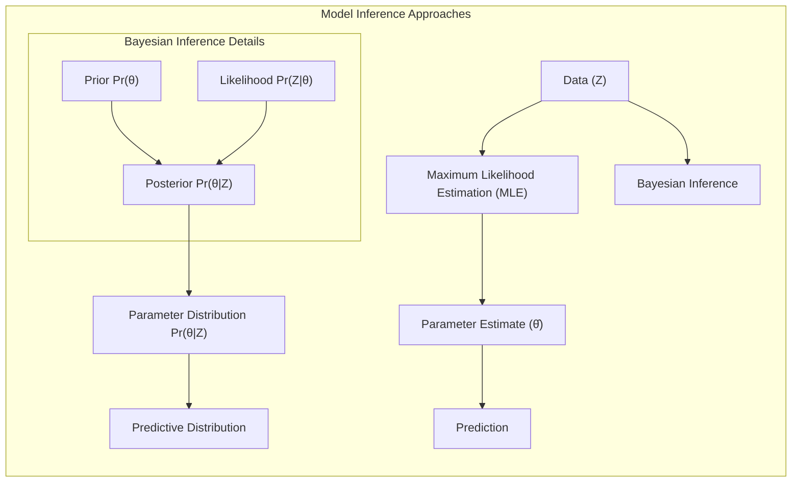
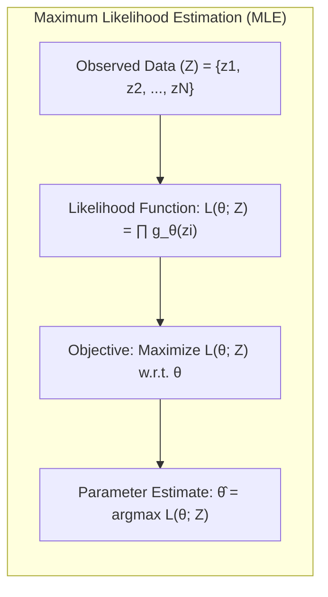
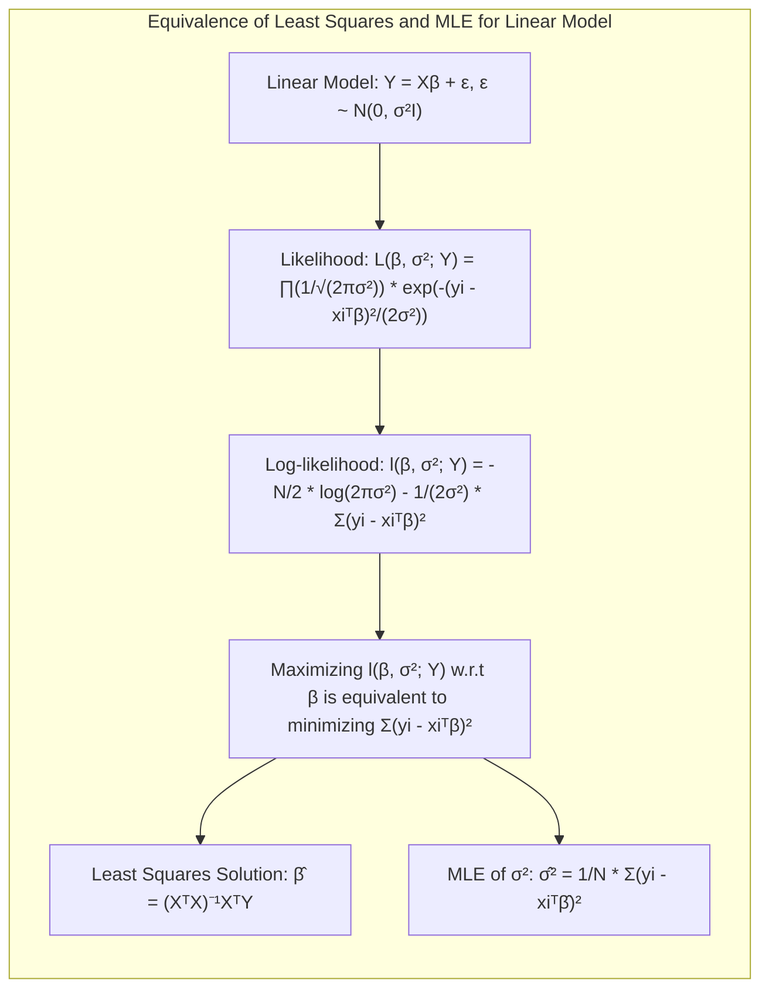
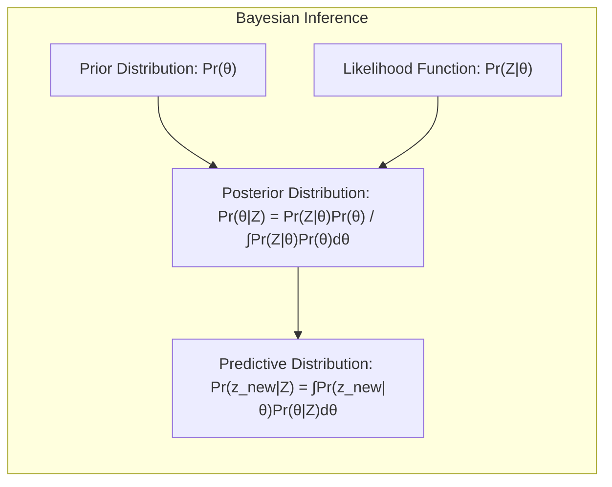
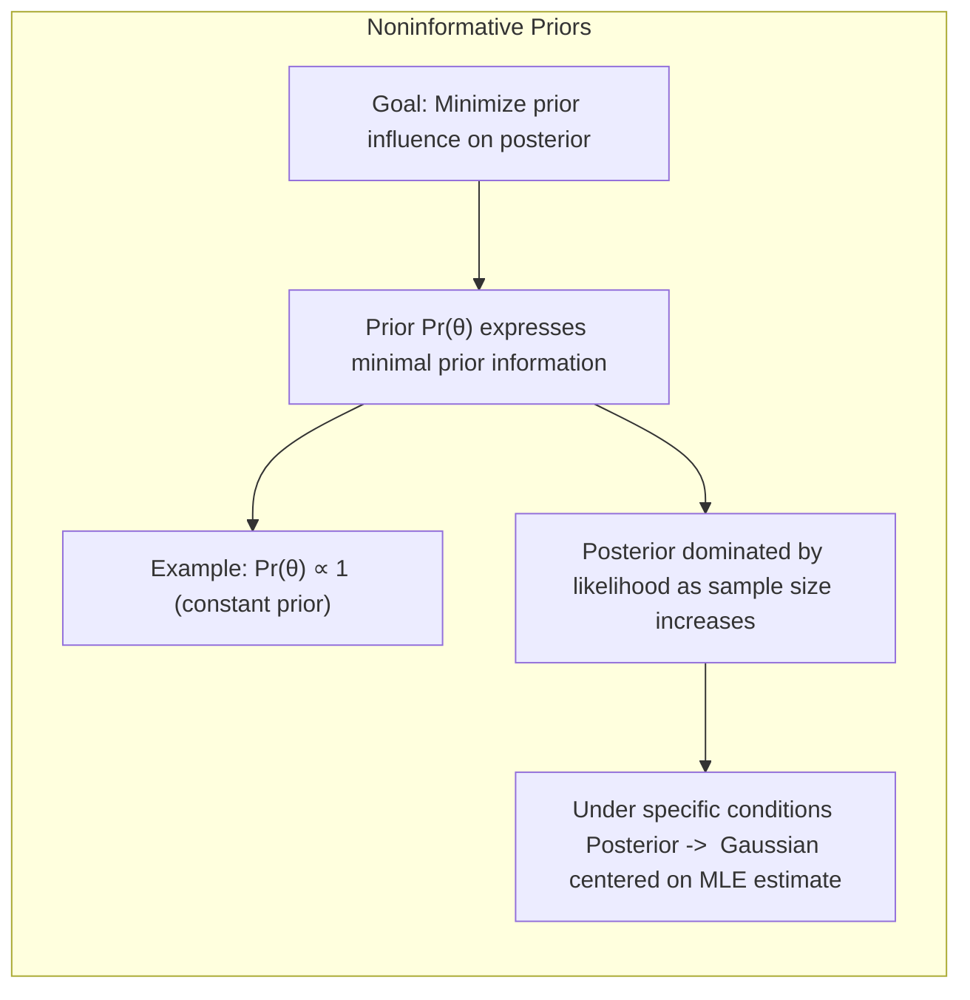
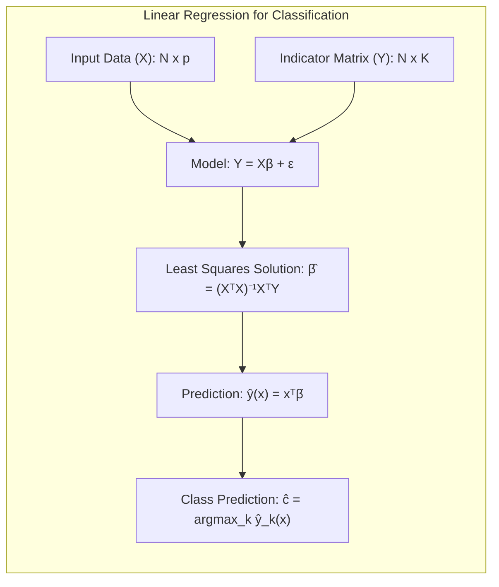
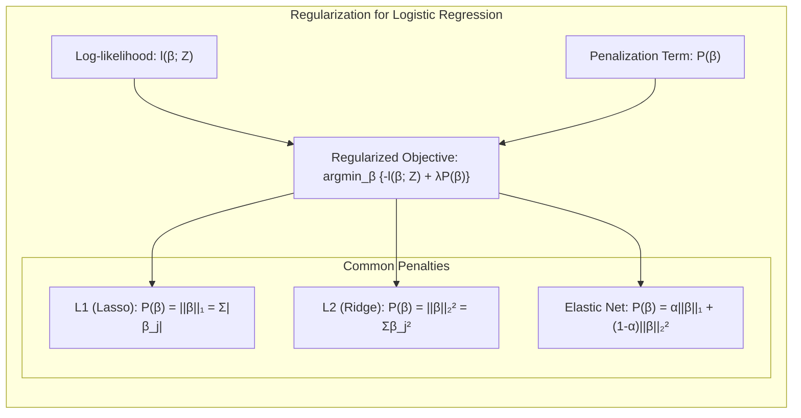
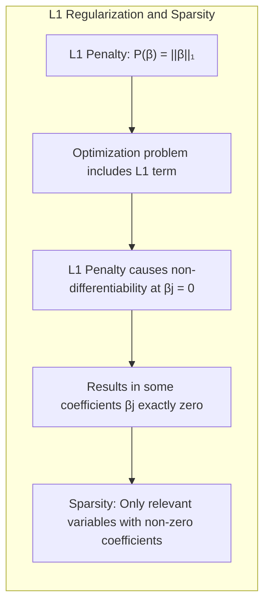
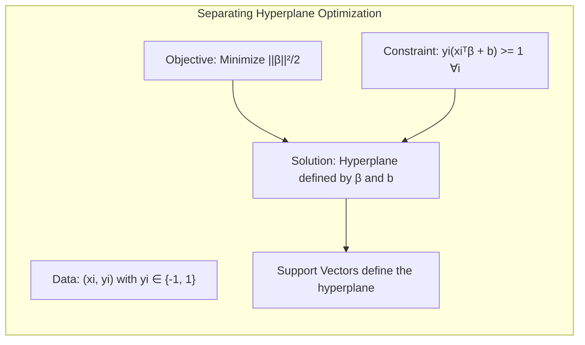
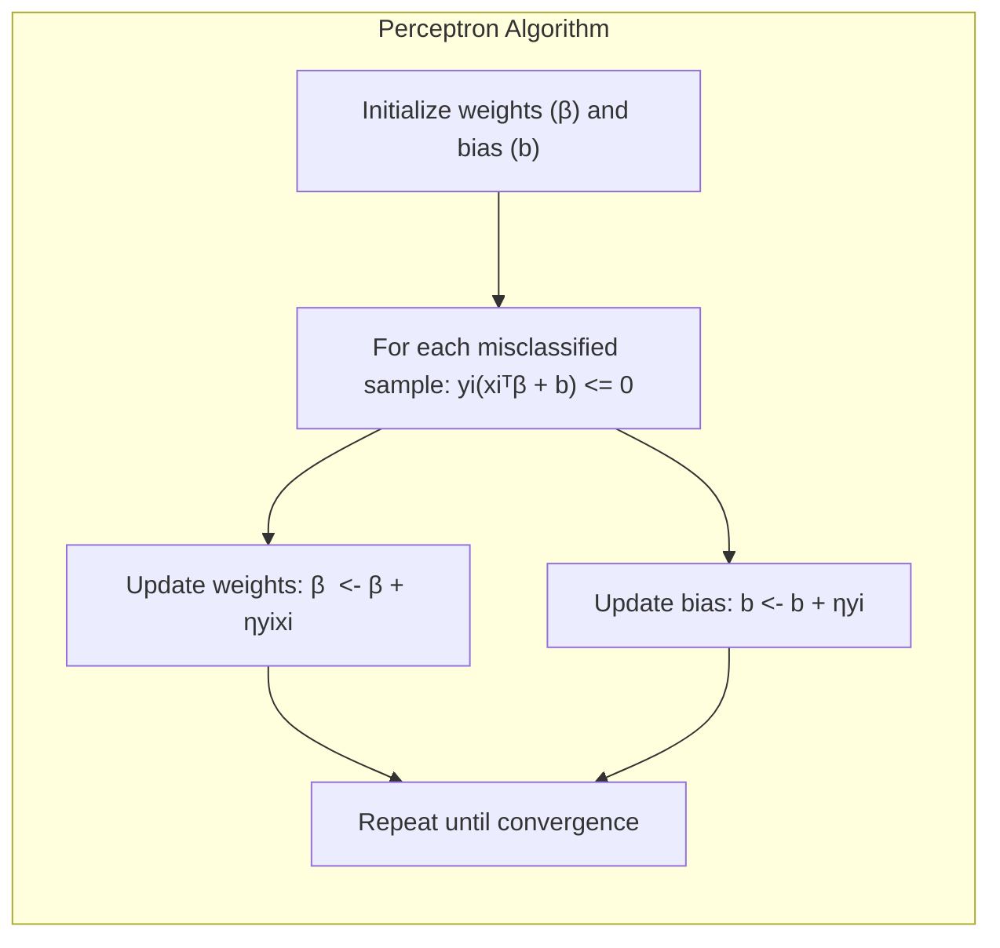

## Model Inference and Averaging: A Deep Dive into Noninformative Priors

### Introdução
O ajuste ou "aprendizado" de modelos é uma tarefa central em estatística e aprendizado de máquina. Frequentemente, este processo envolve a minimização de uma função de custo, como a soma de quadrados para regressão ou a entropia cruzada para classificação [^8.1]. Tais abordagens são, na verdade, casos específicos da **Maximum Likelihood Estimation (MLE)**, um método que busca os parâmetros do modelo que melhor explicam os dados observados. Entretanto, existem outras formas de inferência que podem ser mais vantajosas em determinadas situações, como a inferência Bayesiana, onde incorpora-se um *prior* sobre os parâmetros do modelo. Neste capítulo, exploraremos esses métodos, com um foco especial no conceito de **noninformative priors**, suas relações com o bootstrap e as implicações para modelagem estatística avançada.

### Conceitos Fundamentais
Para compreender o impacto dos *priors*, vamos estabelecer os conceitos fundamentais, sempre com referências aos tópicos do texto-base, para fornecer uma visão unificada e aprofundada.

**Conceito 1: Maximum Likelihood Estimation (MLE) e sua motivação para a modelagem**
A Maximum Likelihood Estimation (MLE) é um método para estimar os parâmetros de um modelo estatístico, maximizando a função de verossimilhança (likelihood) [^8.1]. A função de verossimilhança, $L(\theta; Z)$, quantifica a probabilidade dos dados observados ($Z$) sob diferentes valores dos parâmetros ($\theta$). Formalmente, para um conjunto de observações independentes $z_1, z_2, ..., z_N$, temos:
$$L(\theta; Z) = \prod_{i=1}^{N} g_\theta(z_i)$$
onde $g_\theta(z_i)$ representa a densidade de probabilidade ou função de massa de probabilidade da observação $z_i$ dado o parâmetro $\theta$. O objetivo é encontrar $\hat{\theta}$ tal que $L(\hat{\theta}; Z) \geq L(\theta; Z)$ para todo $\theta$. Intuitivamente, a MLE escolhe os parâmetros que tornam os dados observados "mais prováveis". Em regressão, minimizamos a soma de quadrados, e em classificação, minimizamos a entropia cruzada; ambos casos são instâncias da MLE [^8.1]. No contexto da spline cúbica, como descrito em [^8.2], a MLE leva à solução de mínimos quadrados dada por $\hat{\beta} = (H^TH)^{-1}H^Ty$ e $\hat{\sigma}^2 = \frac{1}{N}\sum_{i=1}^N (y_i - \hat{\mu}(x_i))^2$.

> 💡 **Exemplo Numérico:** Suponha que temos 3 observações $z_1 = 2, z_2 = 3, z_3 = 4$ e que o modelo é uma distribuição normal com média $\theta$ e variância 1, ou seja, $g_\theta(z_i) = \frac{1}{\sqrt{2\pi}} e^{-\frac{(z_i - \theta)^2}{2}}$. A função de verossimilhança é $L(\theta; Z) = \prod_{i=1}^{3} \frac{1}{\sqrt{2\pi}} e^{-\frac{(z_i - \theta)^2}{2}}$. O objetivo da MLE é encontrar o valor de $\theta$ que maximiza essa verossimilhança. O log-verossimilhança é dado por $l(\theta; Z) = -\frac{3}{2}\log(2\pi) - \frac{1}{2} \sum_{i=1}^3 (z_i - \theta)^2$.  Maximizar $l(\theta; Z)$ é equivalente a minimizar $\sum_{i=1}^3 (z_i - \theta)^2$. A solução é $\hat{\theta} = \frac{2+3+4}{3} = 3$. Este é o valor que torna os dados mais prováveis sob o modelo normal.
>
> ```python
> import numpy as np
> from scipy.optimize import minimize
>
> data = np.array([2, 3, 4])
>
> def neg_log_likelihood(theta, data):
>     return 0.5 * np.sum((data - theta)**2) #minimize sum of squares is same as maximizing log-likelihood for Gaussian with fixed variance
>
> initial_guess = 0
> result = minimize(neg_log_likelihood, initial_guess, args=(data,))
> mle_estimate = result.x[0]
> print(f"MLE estimate of theta: {mle_estimate}") # Output: MLE estimate of theta: 3.0
> ```

**Lemma 1:** A solução de mínimos quadrados para o modelo linear $Y = X\beta + \epsilon$, onde $\epsilon \sim N(0, \sigma^2I)$, é equivalente à solução de máxima verossimilhança sob a suposição de erros gaussianos [^8.2].

**Prova:** A função de verossimilhança para este modelo, sob a hipótese gaussiana, é dada por:
$$L(\beta, \sigma^2; Y) = \prod_{i=1}^N \frac{1}{\sqrt{2\pi\sigma^2}} e^{-\frac{(y_i - x_i^T\beta)^2}{2\sigma^2}}$$
Tomando o log da verossimilhança (log-likelihood) temos:
$$l(\beta, \sigma^2; Y) = -\frac{N}{2}\log(2\pi\sigma^2) - \frac{1}{2\sigma^2}\sum_{i=1}^N(y_i - x_i^T\beta)^2$$
Para maximizar esta função em relação a $\beta$, podemos minimizar a soma de quadrados $\sum_{i=1}^N(y_i - x_i^T\beta)^2$, o que leva à solução $\hat{\beta} = (X^TX)^{-1}X^TY$. Para obter $\hat{\sigma}^2$, derivamos a log-likelihood em relação a $\sigma^2$ e igualamos a zero. Isso nos dá $\hat{\sigma}^2 = \frac{1}{N}\sum_{i=1}^N(y_i - x_i^T\hat{\beta})^2$. Portanto, a solução de mínimos quadrados é um caso especial da MLE sob a suposição de erros gaussianos. $\blacksquare$

> 💡 **Exemplo Numérico:** Considere um modelo linear com duas variáveis preditoras e 4 observações:
>
> ```python
> import numpy as np
>
> X = np.array([[1, 2], [1, 3], [1, 4], [1, 5]])
> y = np.array([5, 6, 7, 8])
>
> # Calculate beta using the formula (X^T X)^-1 X^T y
> XtX = X.T @ X
> XtX_inv = np.linalg.inv(XtX)
> XtY = X.T @ y
> beta = XtX_inv @ XtY
> print(f"Estimated beta: {beta}") # Output: Estimated beta: [4.  1.]
>
> # Calculate predicted values
> y_hat = X @ beta
> print(f"Predicted y: {y_hat}")
>
> # Calculate residuals
> residuals = y - y_hat
> print(f"Residuals: {residuals}")
>
> # Estimate sigma^2
> N = len(y)
> sigma2_hat = (1/N) * np.sum(residuals**2)
> print(f"Estimated sigma^2: {sigma2_hat}")
> ```
>
> Aqui, $\hat{\beta} = [4, 1]$ são os coeficientes estimados. Isso significa que para cada aumento de 1 unidade na segunda variável preditora, o valor predito de $y$ aumenta em 1 unidade, e quando a segunda variável é zero, o valor predito de $y$ é 4 (quando $x_1=1$). O valor de $\hat{\sigma}^2$ representa a variância dos erros, indicando a dispersão dos pontos em torno da reta de regressão.

**Conceito 2: Inferência Bayesiana e o Papel dos *Priors***
A inferência Bayesiana, em contraste com a MLE, incorpora um *prior* sobre os parâmetros $\theta$, denotado por $Pr(\theta)$ [^8.3]. O *prior* reflete o conhecimento ou crenças sobre os parâmetros antes da observação dos dados. A inferência Bayesiana calcula a distribuição *posterior*, $Pr(\theta|Z)$, que combina o *prior* com a função de verossimilhança:
$$Pr(\theta|Z) = \frac{Pr(Z|\theta)Pr(\theta)}{\int Pr(Z|\theta)Pr(\theta)d\theta}$$
A distribuição posterior representa a crença sobre os parâmetros $\theta$ após considerar os dados observados $Z$. A inferência Bayesiana permite expressar incertezas sobre os parâmetros e usar essas incertezas para realizar predições. A predição, no caso Bayesiano, leva em consideração a incerteza nos parâmetros através da distribuição preditiva:
$$Pr(z_{new}|Z) = \int Pr(z_{new}|\theta)Pr(\theta|Z)d\theta$$
Este conceito difere da MLE, que utiliza a estimativa de máxima verossimilhança para predições.

**Corolário 1:** A distribuição preditiva Bayesiana, através da integração, leva em consideração a incerteza na estimação dos parâmetros, enquanto a abordagem da MLE ignora essa incerteza ao usar um único valor estimado para os parâmetros [^8.3].

> 💡 **Exemplo Numérico:** Vamos considerar um exemplo simplificado onde queremos estimar a média de uma distribuição normal com variância conhecida. Suponha que temos uma observação $z = 5$ e sabemos que $z \sim N(\theta, 1)$. Na MLE, estimaríamos $\hat{\theta} = 5$. Em Bayes, assumimos um *prior* para $\theta$, por exemplo, $\theta \sim N(0, 4)$. A distribuição *posterior* é dada por $Pr(\theta|z) \propto Pr(z|\theta)Pr(\theta)$. Calculando, a *posterior* será uma normal com média e variância dadas por: $\mu_{posterior} = \frac{\frac{1}{1}5 + \frac{1}{4}0}{\frac{1}{1}+\frac{1}{4}} = \frac{5}{1.25} = 4$ e $\sigma_{posterior}^2 = \frac{1}{\frac{1}{1}+\frac{1}{4}} = \frac{1}{1.25} = 0.8$.
>
> A *posterior* nos dá uma distribuição sobre os valores plausíveis de $\theta$, com média 4, diferentemente da MLE que dá um único valor $\hat{\theta} = 5$. A predição de novos valores usando a distribuição preditiva também será afetada pela incerteza sobre $\theta$.

**Conceito 3: Noninformative Priors e sua Relação com a MLE**
Um *noninformative prior*, ou *prior* não informativo, é um *prior* que visa minimizar a influência do *prior* no *posterior*, permitindo que os dados dominem a inferência [^8.4]. Idealmente, um *noninformative prior* expressa pouca informação a priori sobre os parâmetros. Um exemplo comum é o *prior* constante $Pr(\theta) \propto 1$. No entanto, a existência de *noninformative priors* é um assunto complexo e depende da parametrização do modelo. Usualmente, *priors* não informativos levam a inferências semelhantes às da MLE quando o tamanho da amostra é grande [^8.4]. Por exemplo, quando usamos um prior não informativo em um modelo gaussiano, o posterior se aproxima de uma gaussiana centrada na estimativa de máxima verossimilhança com variância dada pela matriz de informação.

> ⚠️ **Nota Importante**: *Priors* não informativos, embora úteis, devem ser manuseados com cautela, pois podem levar a resultados impróprios em modelos com poucos dados ou mal definidos. **Referência ao tópico [^8.4]**.

> ❗ **Ponto de Atenção**: Em alguns casos, *priors* aparentemente não informativos podem ter consequências inesperadas nas distribuições posteriores. **Conforme indicado em [^8.4]**.

> ✔️ **Destaque**: A adoção de *priors* não informativos leva, em geral, a resultados similares aos obtidos via MLE, principalmente quando a quantidade de dados aumenta. **Baseado no tópico [^8.4]**.

> 💡 **Exemplo Numérico:** Retomando o exemplo anterior da média de uma normal, se usarmos um prior não informativo, $Pr(\theta) \propto 1$, a distribuição *posterior* será proporcional a verossimilhança, $Pr(\theta|z) \propto Pr(z|\theta)$. No caso da normal, $Pr(z|\theta)$ é uma distribuição normal com média $\theta$ e variância 1. Portanto, a *posterior* será uma normal com média $\hat{\theta} = z = 5$ e variância 1. Note que para um prior não informativo, a média da posterior coincide com a estimativa de máxima verossimilhança, e sua variância é a mesma do estimador MLE.

### Regressão Linear e Mínimos Quadrados para Classificação

A aplicação de regressão linear diretamente em uma matriz de indicadores para classificação é uma abordagem que, apesar de simples, oferece insights importantes sobre a relação entre regressão e classificação. Na regressão de indicadores, cada classe é representada por um vetor de zeros, exceto um único elemento igual a um, que indica a classe a qual a observação pertence [^8.1]. Dada uma matriz de indicadores $Y$ de dimensão $N \times K$ para $N$ amostras e $K$ classes, e uma matriz de preditores $X$ de dimensão $N \times p$, ajustamos o modelo $Y = X\beta + \epsilon$ através de mínimos quadrados. O vetor de predição para uma nova amostra é dado por $\hat{y}(x) = x^T\hat{\beta}$, onde $\hat{\beta} = (X^TX)^{-1}X^TY$. A predição de classe para a nova amostra, $\hat{c}$,  é então obtida através de $\hat{c} = \text{argmax}_k \hat{y}_k(x)$.

**Lemma 2:** Sob a condição de que as classes são linearmente separáveis, a decisão de classe obtida através de regressão em matriz de indicadores com mínimos quadrados é equivalente à decisão de uma análise discriminante linear (LDA) com covariâncias iguais para todas as classes, no caso de apenas duas classes [^8.1], [^8.2], [^8.3].

**Prova:**  Se assumirmos que as classes são linearmente separáveis, e que a matriz de covariâncias das classes são iguais, as fronteiras de decisão de ambas abordagens são lineares. A regressão em matriz de indicadores busca o melhor ajuste linear no espaço das classes, enquanto a LDA busca a projeção que maximiza a separabilidade entre as classes. Quando temos apenas duas classes, essas abordagens são equivalentes no que se refere à obtenção da fronteira de decisão, pois ambas resolvem para o mesmo hiperplano. A diferença reside na interpretação dos resultados. $\blacksquare$

**Corolário 2:** A regressão em matriz de indicadores é um método simples e direto, mas pode sofrer com problemas de extrapolação, especialmente se as classes não forem bem separadas. Em contraste, abordagens probabilísticas como LDA e regressão logística, ao modelarem as probabilidades de classe, tendem a ser mais robustas [^8.3].

> 💡 **Exemplo Numérico:** Considere um problema de classificação com duas classes (0 e 1) e uma variável preditora. Temos os seguintes dados:
>
> | Sample | Predictor (X) | Class (Y) |
> | ------ | ------------- | --------- |
> | 1      | 1             | 0         |
> | 2      | 2             | 0         |
> | 3      | 3             | 1         |
> | 4      | 4             | 1         |
>
> A matriz de indicadores Y é formada pelas classes, e o modelo linear é ajustado usando mínimos quadrados.
> ```python
> import numpy as np
> from sklearn.linear_model import LinearRegression
>
> X = np.array([[1], [2], [3], [4]])
> Y = np.array([[1, 0], [1, 0], [0, 1], [0, 1]])  # Indicator matrix for two classes
>
> model = LinearRegression()
> model.fit(X, Y)
> beta = model.coef_
> intercept = model.intercept_
>
> print(f"Estimated coefficients beta: {beta}")
> print(f"Estimated intercept: {intercept}")
>
> # Prediction for a new sample x=2.5
> new_x = np.array([[2.5]])
> predicted_y = model.predict(new_x)
> print(f"Predicted y for x=2.5: {predicted_y}")
>
> # Prediction of class for x=2.5
> predicted_class = np.argmax(predicted_y)
> print(f"Predicted class for x=2.5: {predicted_class}")
> ```
>
> Aqui, o resultado de $\hat{y}$ para $x = 2.5$ pode ser interpretado como uma pontuação. A classe predita para $x=2.5$ será a classe 0, pois a pontuação para a classe 0 é maior. A limitação é que os valores de $\hat{y}$ podem extrapolar fora de [0,1] e não podem ser interpretados como probabilidades.

Embora a regressão em matriz de indicadores possa ser útil como um método de classificação inicial, sua maior limitação está na falta de uma interpretação probabilística direta para as predições [^8.2], [^8.3]. As predições $\hat{y}(x)$ podem, e com frequência o fazem, extrapolar valores fora do intervalo $[0,1]$, o que dificulta a interpretação como probabilidades de classe. Esta limitação motiva a adoção de abordagens que modelam explicitamente as probabilidades de classe, como a regressão logística e métodos de discriminação linear (LDA) [^8.3], [^8.4].

### Métodos de Seleção de Variáveis e Regularização em Classificação

A seleção de variáveis e a regularização são componentes cruciais em modelagem, especialmente quando lidamos com um número grande de preditores e modelos complexos. Essas técnicas visam reduzir a complexidade do modelo, prevenir overfitting e melhorar a generalização para novos dados. No contexto de classificação, tais métodos são aplicados para refinar o modelo, selecionando os preditores mais relevantes e estabilizando as estimativas dos parâmetros.

Em particular, para o modelo de regressão logística, a regularização se torna ainda mais relevante, uma vez que temos um modelo com parâmetros $\beta$ (os coeficientes da regressão) e desejamos evitar *overfitting*, e promover interpretabilidade. No contexto da regressão logística [^8.4.4], a função de log-verossimilhança pode ser regularizada, resultando em problemas de otimização da forma:
$$\hat{\beta} = \text{argmin}_\beta \left\{ -l(\beta; Z) + \lambda P(\beta) \right\}$$
onde $l(\beta; Z)$ é a log-verossimilhança da regressão logística, $P(\beta)$ é o termo de penalidade, e $\lambda$ é o parâmetro de regularização que controla a força da penalidade. As penalidades mais comuns são:

*   **Penalidade L1 (Lasso):** $P(\beta) = ||\beta||_1 = \sum_{j=1}^p |\beta_j|$, que promove a *sparsity* das estimativas (isto é, alguns coeficientes tendem a ser exatamente zero). [^8.4.4]
*   **Penalidade L2 (Ridge):** $P(\beta) = ||\beta||_2^2 = \sum_{j=1}^p \beta_j^2$, que reduz a magnitude dos coeficientes, promovendo estabilidade nas estimativas e reduzindo o impacto da multicolinearidade. [^8.5], [^8.5.1], [^8.5.2]
*   **Elastic Net:** Uma combinação de L1 e L2, $P(\beta) = \alpha||\beta||_1 + (1 - \alpha)||\beta||_2^2$, que combina *sparsity* com estabilidade. [^8.5]

**Lemma 3:** Em um modelo de regressão logística, a penalização L1 (Lasso) leva a coeficientes esparsos, selecionando apenas as variáveis mais relevantes para a classificação [^8.4.4].

**Prova do Lemma 3:**  A penalidade L1 força alguns dos coeficientes $\beta_j$ a serem exatamente zero. Isso ocorre porque o termo de penalidade L1 adiciona um termo de valor absoluto à função de custo, e esse termo introduz não diferenciabilidade na origem, que faz com que, em muitas situações, a solução da otimização ocorra em $\beta_j=0$. Geometricamente, as curvas de nível da penalidade L1 formam "diamantes" e, quando adicionadas à função de custo original, frequentemente fazem com que a solução ótima ocorra em vértices desses "diamantes" onde os coeficientes são nulos. Isso induz a *sparsity*, selecionando apenas as variáveis mais importantes [^8.4.4], [^8.4.5]. $\blacksquare$

**Corolário 3:** A esparsidade induzida pela penalização L1 facilita a interpretação do modelo, pois apenas as variáveis mais relevantes são mantidas na solução final, simplificando a análise e a compreensão do modelo [^8.4.5].

> 💡 **Exemplo Numérico:** Vamos aplicar a regularização L1 (Lasso) e L2 (Ridge) em um problema de regressão logística. Suponha que temos duas classes e três variáveis preditoras:
> ```python
> import numpy as np
> from sklearn.linear_model import LogisticRegression
> from sklearn.preprocessing import StandardScaler
>
> # Example data
> X = np.array([[1, 2, 3], [1, 3, 4], [2, 4, 5], [3, 5, 6], [4, 6, 7], [5, 7, 8], [2, 3, 1], [2, 5, 2]])
> y = np.array([0, 0, 0, 1, 1, 1, 0, 1])
>
> scaler = StandardScaler()
> X_scaled = scaler.fit_transform(X)
>
> # Lasso Regression
> lasso_model = LogisticRegression(penalty='l1', solver='liblinear', C=0.1) # C is inverse of lambda
> lasso_model.fit(X_scaled, y)
> lasso_coef = lasso_model.coef_
> print(f"Lasso coefficients: {lasso_coef}")
>
> # Ridge Regression
> ridge_model = LogisticRegression(penalty='l2', C=0.1) #Default solver is ok for l2
> ridge_model.fit(X_scaled, y)
> ridge_coef = ridge_model.coef_
> print(f"Ridge coefficients: {ridge_coef}")
>
> ```
> O resultado mostra que o Lasso (L1) frequentemente zera um dos coeficientes (ou aproxima a zero), enquanto o Ridge (L2) reduz todos os coeficientes, mas não os força a zero. A escolha do parâmetro de regularização (C, que é o inverso de lambda) e do tipo de regularização é crucial para obter um modelo com bom desempenho preditivo.

> ⚠️ **Ponto Crucial**: A escolha do tipo de regularização (L1, L2 ou Elastic Net) e o valor do parâmetro $\lambda$ são cruciais e dependem do problema específico. A escolha de $\lambda$ pode ser feita por validação cruzada [^8.5].

### Separating Hyperplanes e Perceptrons

<imagem: Diagrama que ilustra a ideia de margem máxima em hiperplanos separadores, com exemplos de hiperplanos ótimos, pontos de suporte e como o Perceptron de Rosenblatt ajusta os pesos.>

Um hiperplano separador linear é um conceito fundamental em classificação, especialmente em métodos como o **Support Vector Machines (SVM)**. A ideia central é encontrar um hiperplano que divide o espaço de características em duas regiões, de modo que os pontos de cada classe caiam em um lado diferente do hiperplano [^8.5.2]. O problema de otimização para encontrar este hiperplano pode ser formulado de diversas maneiras, sendo comum buscar a margem de separação máxima. Este conceito leva à ideia de *separating hyperplanes* ótimos [^8.5.2].

A formulação do problema de otimização do *separating hyperplane* pode ser expressa como:
$$\text{minimize}_{\beta, b} \frac{1}{2}||\beta||^2$$
sujeito a
$$y_i(x_i^T\beta + b) \geq 1, \forall i$$
onde $x_i$ são os vetores de entrada, $y_i \in \{-1, 1\}$ são as classes correspondentes e $\beta$ e $b$ definem o hiperplano separador. Este problema pode ser resolvido utilizando programação quadrática ou através de sua formulação dual, que envolve os multiplicadores de Lagrange e permite a utilização do *kernel trick* para trabalhar em espaços de dimensões maiores. Os pontos de suporte são os pontos de treinamento que estão mais próximos do hiperplano ótimo e são os pontos que definem o hiperplano.

O **Perceptron**, um algoritmo de aprendizado linear, também busca encontrar um hiperplano separador [^8.5.1]. No entanto, o Perceptron é um método mais simples, que ajusta os pesos iterativamente através de correções quando encontra classificações erradas. O Perceptron de Rosenblatt tem uma regra de atualização dos pesos $\beta$ e um viés $b$ dado por:
$$\beta \leftarrow \beta + \eta y_i x_i$$
$$b \leftarrow b + \eta y_i$$
se $y_i(x_i^T\beta + b) \le 0$ e $\eta$ é a taxa de aprendizagem. Sob a hipótese de dados linearmente separáveis, o Perceptron garante a convergência para uma solução que classifica corretamente todos os pontos de treinamento [^8.5.1].

> 💡 **Exemplo Numérico:** Vamos simular o aprendizado de um Perceptron em dados linearmente separáveis.
>
> ```python
> import numpy as np
> import matplotlib.pyplot as plt
>
> # Generate some linearly separable data
> np.random.seed(42)
> X = np.random.rand(20, 2) * 10
> y = np.array([1 if x[0] - x[1] > 1 else -1 for x in X])
>
> # Perceptron algorithm
> def perceptron(X, y, learning_rate=0.1, epochs=100):
>     weights = np.zeros(X.shape[1])
>     bias = 0
>     for _ in range(epochs):
>        for i, x in enumerate(X):
>            if y[i] * (np.dot(x, weights) + bias) <= 0:
>                weights = weights + learning_rate * y[i] * x
>                bias = bias + learning_rate * y[i]
>     return weights, bias
>
>
> weights, bias = perceptron(X, y)
> print(f"Perceptron weights: {weights}")
> print(f"Perceptron bias: {bias}")
>
> # Create plot
> plt.scatter(X[:, 0], X[:, 1], c=y, cmap='coolwarm', edgecolors='k')
>
> x1_min, x1_max = X[:, 0].min() - 1, X[:, 0].max() + 1
> x2_min, x2_max = X[:, 1].min() - 1, X[:, 1].max() + 1
>
> xx1, xx2 = np.meshgrid(np.linspace(x1_min, x1_max, 500),
>                        np.linspace(x2_min, x2_max, 500))
>
> Z = np.dot(np.c_[xx1.ravel(), xx2.ravel()], weights) + bias
> Z = Z.reshape(xx1.shape)
> plt.contour(xx1, xx2, Z, levels=[0], colors='black', linewidths=2)
>