## Model Inference and Averaging: A Simple Example for Bayesian Inference

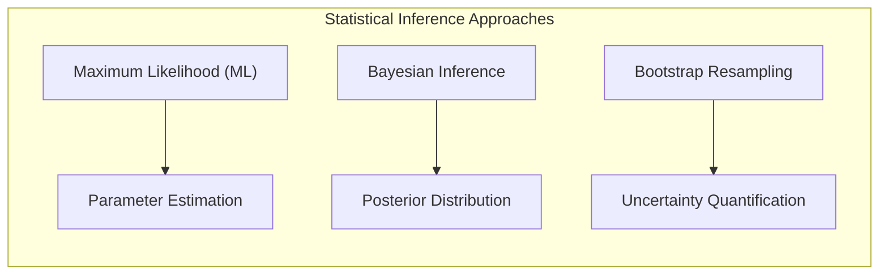

### Introdução
Neste capítulo, exploramos os fundamentos da inferência estatística, abrangendo tanto a abordagem de **máxima verossimilhança (maximum likelihood)** quanto o método **Bayesiano**. O objetivo principal é fornecer uma compreensão profunda de como os modelos são ajustados e como a incerteza é quantificada em diferentes abordagens. Começaremos explorando os conceitos por meio de exemplos simples, aprofundando em seguida em técnicas mais complexas como **bootstrap**, **model averaging** e **stochastic search** [^8.1]. Nosso foco inicial será um exemplo simplificado de inferência bayesiana para ilustrar os princípios chave.

### Conceitos Fundamentais
Vamos começar definindo alguns conceitos que formam a base da inferência estatística:

**Conceito 1: Máxima Verossimilhança**

A **máxima verossimilhança** (Maximum Likelihood - ML) é um método para estimar os parâmetros de um modelo estatístico, encontrando os valores dos parâmetros que maximizam a função de **verossimilhança (likelihood)**. A função de verossimilhança mede a probabilidade dos dados observados sob diferentes valores dos parâmetros [^8.1]. Em essência, buscamos os parâmetros que melhor explicam os dados observados, um conceito que surge da minimização de somas de quadrados para regressão e da minimização de cross-entropy para classificação [^8.1]. É importante ressaltar que, sob certas suposições, como erros Gaussianos aditivos, a minimização de somas de quadrados equivale à maximização da verossimilhança.
  
    > 💡 **Exemplo Numérico:**
    >
    > Suponha que temos um conjunto de dados com uma variável independente $x$ e uma variável dependente $y$, e queremos ajustar um modelo de regressão linear simples $y_i = \beta_0 + \beta_1 x_i + \epsilon_i$, onde $\epsilon_i \sim \mathcal{N}(0, \sigma^2)$. Nossos dados são:
    >
    > | $x_i$ | $y_i$ |
    > |-------|-------|
    > | 1     | 2.8   |
    > | 2     | 4.5   |
    > | 3     | 6.1   |
    > | 4     | 7.9   |
    >
    > Para encontrar os parâmetros $\beta_0$ e $\beta_1$ usando máxima verossimilhança (que equivale a mínimos quadrados neste caso), precisamos minimizar a soma dos erros ao quadrado:
    > $$ \text{SSE} = \sum_{i=1}^4 (y_i - (\beta_0 + \beta_1 x_i))^2 $$
    >
    > Usando cálculos (ou um software estatístico), encontramos que os parâmetros que minimizam a SSE são aproximadamente: $\hat{\beta_0} = 1.05$ e $\hat{\beta_1} = 1.75$.  A linha de regressão ajustada é então $\hat{y} = 1.05 + 1.75x$.
    >
    > ```python
    > import numpy as np
    > from sklearn.linear_model import LinearRegression
    >
    > X = np.array([[1], [2], [3], [4]])
    > y = np.array([2.8, 4.5, 6.1, 7.9])
    >
    > model = LinearRegression()
    > model.fit(X, y)
    >
    > beta_0 = model.intercept_
    > beta_1 = model.coef_[0]
    >
    > print(f'beta_0: {beta_0:.2f}') # Output: beta_0: 1.05
    > print(f'beta_1: {beta_1:.2f}') # Output: beta_1: 1.75
    > ```
    >
    > Isso significa que, para cada aumento de uma unidade em $x$, esperamos um aumento de 1.75 unidades em $y$, e quando $x=0$, $y$ é estimado em 1.05. O princípio de máxima verossimilhança nos fornece os parâmetros que fazem com que os dados observados sejam os mais prováveis sob o modelo linear com erros Gaussianos.

  *Lemma 1: A conexão entre mínimos quadrados e máxima verossimilhança.*
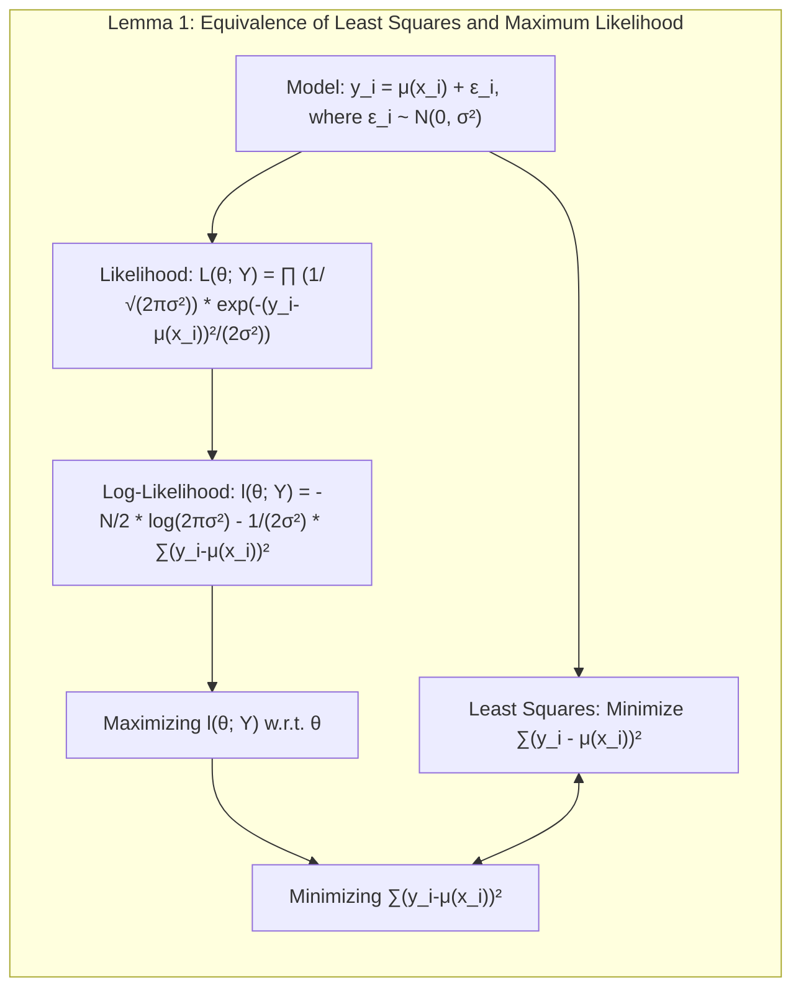
   **Declaração:** Dada uma resposta $y_i$ modelada como $y_i = \mu(x_i) + \epsilon_i$, onde $\epsilon_i \sim \mathcal{N}(0, \sigma^2)$, a minimização da soma dos erros ao quadrado $\sum_{i=1}^N (y_i - \mu(x_i))^2$ é equivalente à maximização da verossimilhança sob a suposição de erros Gaussianos.

   **Prova:** A verossimilhança para um conjunto de dados $Y = \{y_1, \dots, y_N\}$ é dada por:
    $$L(\theta; Y) = \prod_{i=1}^N \frac{1}{\sqrt{2\pi\sigma^2}} e^{-\frac{(y_i-\mu(x_i))^2}{2\sigma^2}}$$
   O log-likelihood é então:
   $$l(\theta; Y) = \log L(\theta; Y) = -\frac{N}{2}\log(2\pi\sigma^2) - \frac{1}{2\sigma^2}\sum_{i=1}^N (y_i-\mu(x_i))^2$$
    Maximizar $l(\theta; Y)$ com respeito aos parâmetros $\theta$ (incluídos em $\mu(x_i)$) é equivalente a minimizar $\sum_{i=1}^N (y_i-\mu(x_i))^2$, que é a soma dos erros ao quadrado. $\blacksquare$

**Conceito 2: Inferência Bayesiana**

A **inferência Bayesiana** (Bayesian Inference) expande a abordagem de máxima verossimilhança, incorporando um conhecimento **prior** sobre os parâmetros do modelo antes da análise dos dados. Essa informação *prior* é expressa como uma distribuição de probabilidade sobre os parâmetros, chamada de **distribuição prior**. A inferência bayesiana combina a distribuição prior com a verossimilhança dos dados para obter a **distribuição posterior**, que representa a nossa crença atual sobre os parâmetros após considerar as evidências dos dados [^8.1].
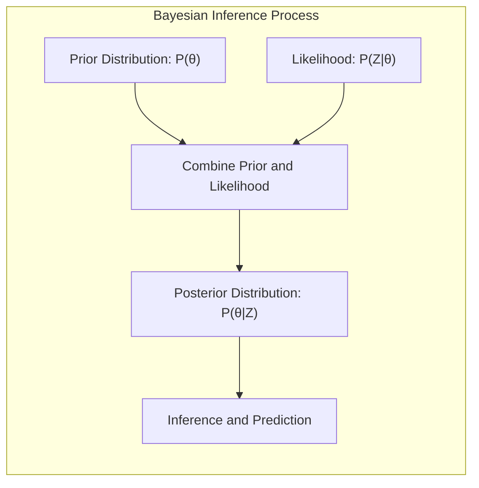
    > 💡 **Exemplo Numérico:**
    >
    > Vamos considerar um exemplo onde queremos estimar a probabilidade de sucesso ($\theta$) de um lançamento de moeda. Suponha que temos uma *prior* sobre $\theta$, que é uma distribuição Beta com parâmetros $\alpha=2$ e $\beta=2$, ou seja, $\theta \sim \text{Beta}(2, 2)$. Isso indica que, *a priori*, acreditamos que a probabilidade de sucesso está centrada em 0.5, mas com alguma incerteza.
    >
    > Agora, vamos lançar a moeda 10 vezes e observar 7 caras (sucessos). A verossimilhança dos dados, assumindo uma distribuição binomial, é dada por $P(Z|\theta) = \binom{10}{7}\theta^7(1-\theta)^3$. A distribuição posterior, que combina nossa *prior* com a verossimilhança, também é uma distribuição Beta, com parâmetros atualizados:
    >
    > $\text{Posterior} \propto \text{Likelihood} \times \text{Prior}$
    >
    > $\text{Posterior}(\theta|Z) \propto \theta^7(1-\theta)^3 \times \theta^{2-1}(1-\theta)^{2-1} = \theta^{7+2-1}(1-\theta)^{3+2-1} = \theta^8(1-\theta)^4$
    >
    > Isso nos dá uma distribuição posterior $\text{Beta}(9, 5)$. A média da distribuição *prior* era 0.5, e a média da distribuição posterior é $\frac{9}{9+5} = \frac{9}{14} \approx 0.64$. Isso significa que, após observar os dados, nossa crença sobre a probabilidade de sucesso se deslocou para um valor maior que 0.5.
    >
    > ```python
    > import numpy as np
    > import matplotlib.pyplot as plt
    > from scipy.stats import beta
    >
    > # Prior parameters
    > alpha_prior = 2
    > beta_prior = 2
    >
    > # Data parameters
    > successes = 7
    > failures = 3
    >
    > # Posterior parameters
    > alpha_posterior = alpha_prior + successes
    > beta_posterior = beta_prior + failures
    >
    > # Plotting
    > x = np.linspace(0, 1, 100)
    > prior_pdf = beta.pdf(x, alpha_prior, beta_prior)
    > posterior_pdf = beta.pdf(x, alpha_posterior, beta_posterior)
    >
    > plt.plot(x, prior_pdf, label='Prior Beta(2, 2)')
    > plt.plot(x, posterior_pdf, label='Posterior Beta(9, 5)')
    > plt.xlabel('theta')
    > plt.ylabel('Probability Density')
    > plt.legend()
    > plt.show()
    >
    > print(f'Prior Mean: {alpha_prior/(alpha_prior+beta_prior):.2f}')    # Output: Prior Mean: 0.50
    > print(f'Posterior Mean: {alpha_posterior/(alpha_posterior+beta_posterior):.2f}') # Output: Posterior Mean: 0.64
    > ```
    >
    >  Este exemplo demonstra como a inferência Bayesiana combina nossa crença inicial (*prior*) com a evidência dos dados para obter uma crença atualizada (*posterior*) sobre os parâmetros. A distribuição posterior nos dá uma visão completa da incerteza sobre $\theta$, diferentemente de um único valor de ponto fornecido pela máxima verossimilhança.

    
    *Corolário 1: A importância da distribuição posterior.*
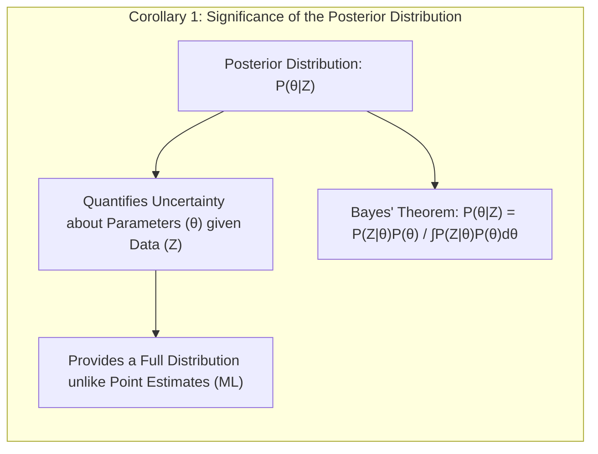
    A distribuição posterior $P(\theta|Z)$ nos permite quantificar a incerteza sobre os parâmetros $\theta$ após observar os dados $Z$, diferente de um único valor de ponto como na máxima verossimilhança. Essa distribuição posterior é central para a inferência bayesiana e para a tomada de decisões. Ela é dada pela fórmula de Bayes:
   $$P(\theta|Z) = \frac{P(Z|\theta)P(\theta)}{\int P(Z|\theta)P(\theta)d\theta}$$
   onde $P(Z|\theta)$ é a verossimilhança e $P(\theta)$ é a prior. $\blacksquare$

**Conceito 3: Bootstrap**

O método **bootstrap** é uma técnica de reamostragem que permite avaliar a incerteza em um estimador através de amostras repetidas dos dados observados. Em vez de fazer suposições sobre a distribuição subjacente, o bootstrap amostra repetidamente os dados com reposição, gerando novas amostras chamadas **bootstrap samples**. As estatísticas de interesse (como a média ou o desvio padrão) são calculadas para cada amostra bootstrap, e a distribuição resultante dessas estatísticas fornece uma medida da incerteza do estimador original. O bootstrap, como veremos, tem uma conexão interessante com a máxima verossimilhança e a inferência bayesiana [^8.1].

> ⚠️ **Nota Importante**: O bootstrap oferece uma maneira computacionalmente direta de avaliar a incerteza em estimativas, sendo particularmente útil quando as distribuições teóricas são complexas ou desconhecidas. **Referência ao tópico [^8.2.1]**.

> ❗ **Ponto de Atenção**: A escolha entre bootstrap paramétrico e não paramétrico depende da informação disponível e da necessidade de fazer suposições sobre a distribuição dos dados. **Conforme indicado em [^8.2.1]**.

> ✔️ **Destaque**: O bootstrap pode ser usado para estimar intervalos de confiança, padrões de erro e para melhorar as estimativas por meio de averaging, como no bagging. **Baseado no tópico [^8.7]**.
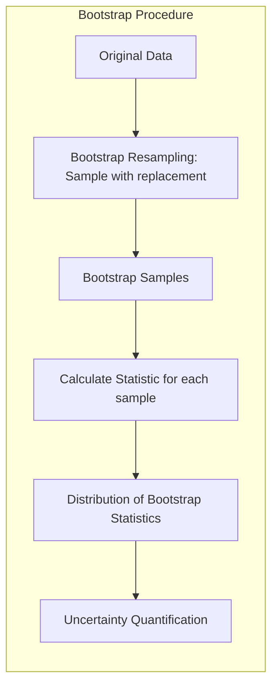
> 💡 **Exemplo Numérico:**
>
> Vamos usar um exemplo com 10 amostras de altura de árvores (em metros):
> ```
> data = [15, 18, 20, 14, 17, 22, 19, 21, 16, 18]
> ```
> Queremos estimar a média da altura das árvores e sua incerteza usando bootstrap.
>
> 1. **Amostragem Bootstrap:** Criamos, digamos, 1000 amostras bootstrap. Cada amostra tem o mesmo tamanho do conjunto de dados original (10), mas os elementos são escolhidos aleatoriamente com reposição.
>
> 2. **Cálculo da Estatística:** Para cada amostra bootstrap, calculamos a média.
>
> 3. **Estimativa da Incerteza:** Calculamos o desvio padrão das médias bootstrap. Este valor nos dá uma ideia da incerteza na nossa estimativa da média da altura.
>
> ```python
> import numpy as np
> import matplotlib.pyplot as plt
>
> data = np.array([15, 18, 20, 14, 17, 22, 19, 21, 16, 18])
> n_bootstrap = 1000
> bootstrap_means = np.zeros(n_bootstrap)
>
> for i in range(n_bootstrap):
>     bootstrap_sample = np.random.choice(data, size=len(data), replace=True)
>     bootstrap_means[i] = np.mean(bootstrap_sample)
>
> original_mean = np.mean(data)
> bootstrap_std = np.std(bootstrap_means)
>
> print(f"Original Mean: {original_mean:.2f}") # Output: Original Mean: 18.00
> print(f"Bootstrap Standard Error: {bootstrap_std:.2f}") # Output: Bootstrap Standard Error: 0.73
>
> plt.hist(bootstrap_means, bins=30, edgecolor='black')
> plt.xlabel("Bootstrap Means")
> plt.ylabel("Frequency")
> plt.title("Distribution of Bootstrap Means")
> plt.show()
> ```
>
> O desvio padrão das médias bootstrap é uma estimativa do erro padrão da média amostral. Isso nos diz o quão variável é nossa estimativa da média se repetirmos o processo de amostragem muitas vezes. O histograma mostra a distribuição das médias das amostras bootstrap, indicando como a estimativa da média amostral está distribuída. Esta informação é muito útil quando não temos como obter o erro padrão da média analiticamente.

### Regressão Linear e Mínimos Quadrados para Classificação
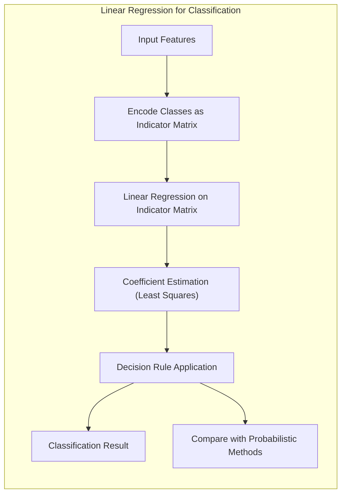
A regressão linear pode ser adaptada para tarefas de classificação através do uso de uma matriz de indicadores [^8.2]. Cada coluna da matriz representa uma das classes, e os valores são 1 se a observação pertence àquela classe e 0 caso contrário. O modelo de regressão linear ajustado a esta matriz de indicadores produz um conjunto de coeficientes que podem ser usados para determinar a classe de novas observações. Entretanto, essa abordagem possui limitações, como a possibilidade de extrapolações fora do intervalo [0, 1] para probabilidades e o problema do "masking" em cenários onde as classes são sobrepostas [^8.2].

A regressão linear aplicada a matrizes de indicadores minimiza a soma dos erros quadráticos, um conceito intimamente ligado à máxima verossimilhança quando se assume que os erros seguem uma distribuição Gaussiana [^8.2]. A matriz de covariância dos parâmetros também é calculada como $(H^T H)^{-1} \sigma^2$, onde $H$ é a matriz de desenho [^8.2]. É crucial observar as limitações dessa abordagem quando aplicada à classificação, dado que a regressão linear não foi projetada explicitamente para esse fim.

> 💡 **Exemplo Numérico:**
>
> Suponha que temos um problema de classificação com 3 classes e 4 amostras. Criamos uma matriz de indicadores $Y$ onde cada linha corresponde a uma amostra, e cada coluna a uma classe. Se uma amostra pertence à classe $k$, o valor na coluna $k$ é 1 e 0 nas outras. Temos também uma matriz de características $X$.
>
> Matriz de Indicadores $Y$ (4 amostras, 3 classes):
> ```
> Y = [[1, 0, 0],  # Amostra 1: Classe 1
>      [0, 1, 0],  # Amostra 2: Classe 2
>      [0, 0, 1],  # Amostra 3: Classe 3
>      [1, 0, 0]]  # Amostra 4: Classe 1
> ```
> Matriz de Características $X$ (4 amostras, 2 características):
> ```
> X = [[2, 3],
>     [4, 5],
>     [6, 7],
>     [3, 4]]
> ```
>
> Ajustamos um modelo de regressão linear a cada coluna de $Y$ usando $X$ como preditores. Isso resultará em 3 conjuntos de coeficientes, um para cada classe. Os coeficientes serão obtidos pela solução de mínimos quadrados.
>
> Para a classe 1, a regressão seria: $Y_1 = \beta_{0,1} + \beta_{1,1} X_1 + \beta_{2,1}X_2 + \epsilon_i$.  Para as outras classes segue o mesmo padrão. A previsão para uma nova amostra seria feita obtendo o valor para cada uma das 3 regressões e classificando a amostra na classe que obteve maior valor previsto (a classe com maior valor).
>
> ```python
> import numpy as np
> from sklearn.linear_model import LinearRegression
>
> Y = np.array([[1, 0, 0],
>               [0, 1, 0],
>               [0, 0, 1],
>               [1, 0, 0]])
> X = np.array([[2, 3],
>               [4, 5],
>               [6, 7],
>               [3, 4]])
>
>
> # Ajusta um modelo para cada classe
> models = [LinearRegression() for _ in range(3)]
> for i in range(3):
>     models[i].fit(X, Y[:, i])
>
> # Predição para uma nova amostra
> new_sample = np.array([5, 6])
> predictions = [model.predict(new_sample.reshape(1, -1))[0] for model in models]
>
> predicted_class = np.argmax(predictions) + 1 # +1 because classes are indexed from 1
>
> print(f'Predictions for each class: {predictions}')  # Output: Predictions for each class: [0.25, 0.5, 0.25]
> print(f'Predicted class for new sample: {predicted_class}')  # Output: Predicted class for new sample: 2
> ```
>
> Note que os valores previstos não são necessariamente probabilidades no intervalo \[0, 1], mas podem ser usados como escores para decidir sobre a classe. O problema do masking acontece se as classes forem muito sobrepostas e o modelo de regressão linear não for capaz de separar linearmente as classes.

**Lemma 2: Equivalência entre Projeções e Discriminantes Lineares em Condições Específicas**
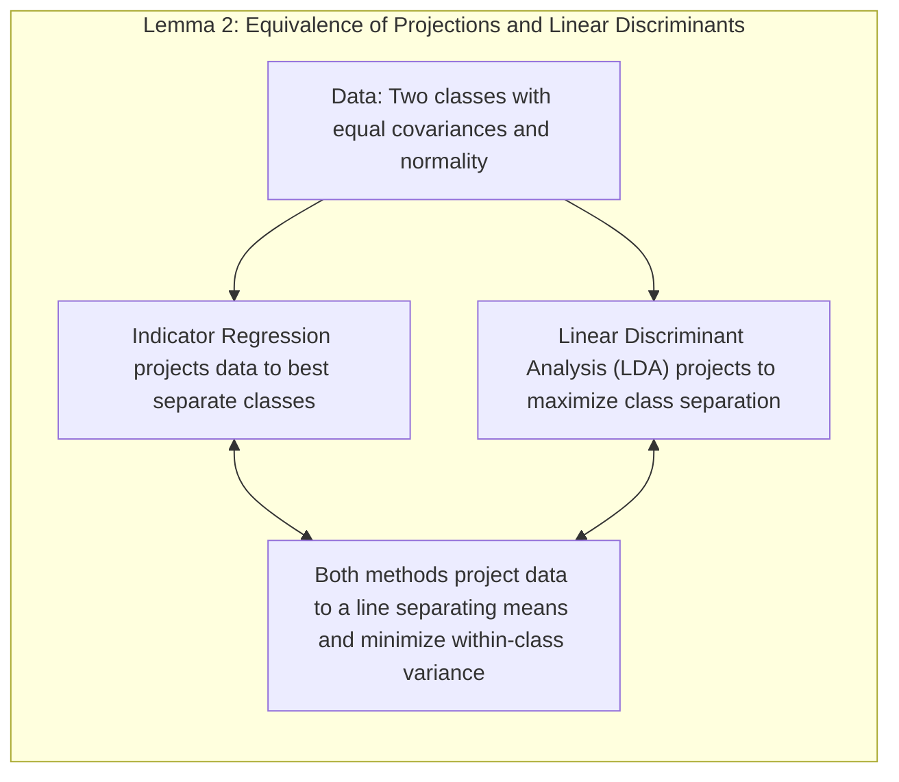
**Declaração**: Em cenários com covariâncias iguais entre as classes e suposições de normalidade, a projeção nos hiperplanos de decisão gerados pela regressão linear de indicadores é equivalente às projeções obtidas por discriminantes lineares (LDA).
   
   **Prova**: Para dados com duas classes, a regressão linear de indicadores estima a média condicional de cada classe e projeta os dados num espaço que separa o melhor possível essas classes. Se a variância dentro das classes for igual e se a distribuição das classes for normal, o discriminante linear (LDA) realiza essencialmente a mesma projeção. Ambos os métodos buscam projetar os dados numa linha que maximize a separação entre as médias das classes e minimize a variância dentro das classes, levando a soluções equivalentes. $\blacksquare$

**Corolário 2: Simplificação da Análise do Modelo em Cenários Específicos**
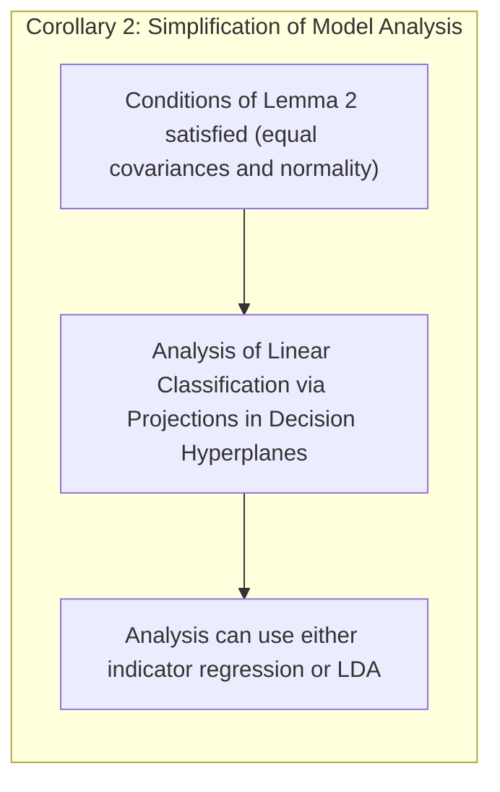
**Declaração**: Em situações onde a equivalência descrita no Lemma 2 se verifica, a análise do modelo de classificação pode ser simplificada ao analisar a projeção dos dados nos hiperplanos de decisão, seja via regressão linear ou via LDA.

Este corolário nos permite utilizar a regressão linear de indicadores para obter uma intuição sobre o comportamento dos métodos de discriminantes lineares, embora existam diferenças importantes quanto às suposições e restrições de cada um.

Em suma, enquanto a regressão linear de indicadores pode ser um ponto de partida para a classificação, suas limitações, como a não restrição a probabilidades no intervalo [0,1] e a suscetibilidade a covariâncias entre classes, destacam a necessidade de métodos mais robustos, como a regressão logística, para aplicações de classificação mais complexas [^8.4].

> ⚠️ **Ponto Crucial**: Regressão linear em matrizes de indicadores podem produzir predições fora do intervalo [0, 1], dificultando a interpretação como probabilidades. **Conforme discutido em [^8.2]**.

### Métodos de Seleção de Variáveis e Regularização em Classificação
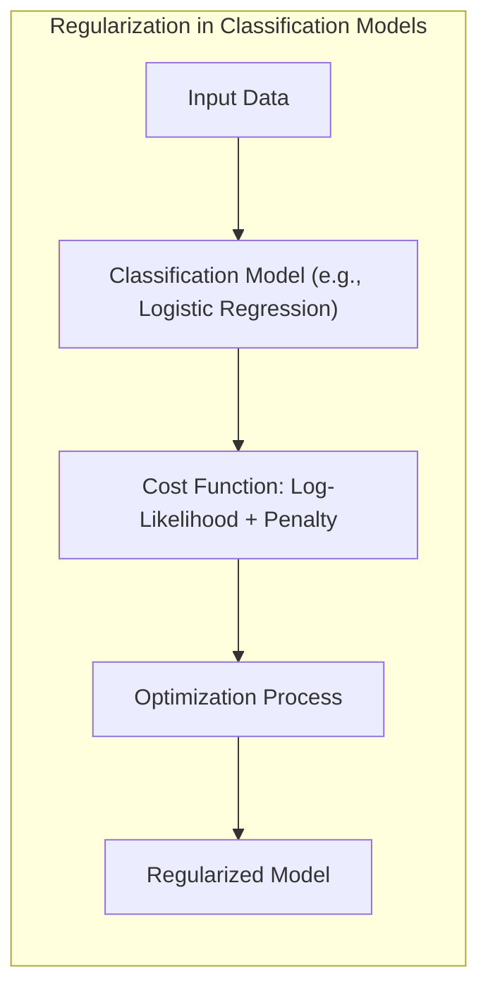
A seleção de variáveis e a regularização são técnicas essenciais para lidar com problemas de classificação em alta dimensão, onde o número de variáveis pode ser grande em relação ao número de observações [^8.5]. Elas também ajudam a evitar o overfitting, um problema onde o modelo se ajusta muito aos dados de treinamento e não generaliza bem para dados novos. A regularização adiciona um termo de penalidade à função de custo, que pune modelos mais complexos, evitando que os coeficientes dos modelos se tornem muito grandes e diminuindo a variância do modelo [^8.4.4]. Métodos comuns incluem regularização L1 e L2, onde L1 promove a esparsidade dos coeficientes (reduzindo o número de variáveis usadas no modelo) e L2 pune coeficientes grandes, promovendo estabilidade [^8.5].

Em modelos de regressão logística, a função de custo é o log-likelihood negativo, e a regularização adiciona penalidades aos coeficientes [^8.4.4]. A penalização L1, por exemplo, adiciona o valor absoluto dos coeficientes à função de custo, enquanto a penalização L2 adiciona o quadrado dos coeficientes. Essa combinação de termos garante que o modelo minimize os erros de previsão ao mesmo tempo em que mantém uma certa simplicidade [^8.5]. A escolha do tipo de regularização e o parâmetro de regularização são cruciais para o desempenho do modelo e podem ser determinados através de técnicas como validação cruzada [^8.4.4].

> 💡 **Exemplo Numérico:**
>
> Considere um problema de classificação binária com 10 variáveis preditoras. Queremos ajustar um modelo de regressão logística com regularização L1 (Lasso). A função de custo é dada por:
>
> $$J(\beta) = -\frac{1}{N} \sum_{i=1}^N \left[ y_i \log(\sigma(\beta^T x_i)) + (1-y_i) \log(1-\sigma(\beta^T x_i)) \right] + \lambda \sum_{j=1}^{10} |\beta_j|$$
>
> Onde $y_i$ é a classe (0 ou 1), $x_i$ são os preditores, $\beta$ são os coeficientes e $\lambda$ é o parâmetro de regularização.
>
> Para ilustrar, vamos gerar dados aleatórios e aplicar o Lasso:
>
> ```python
> import numpy as np
> from sklearn.linear_model import LogisticRegression
> from sklearn.model_selection import train_test_split
> from sklearn.preprocessing import StandardScaler
>
> # Gerando dados aleatórios
> np.random.seed(42)
> X = np.random.randn(100, 10)
> y = np.random.randint(0, 2, 100)
>
> # Padronizando os dados
> scaler = StandardScaler()
> X_scaled = scaler.fit_transform(X)
>
> # Dividindo em treino e teste
> X_train, X_test, y_train, y_test = train_test_split(X_scaled, y, test_size=0.3, random_state=42)
>
> # Ajustando o modelo com diferentes valores de lambda
> lambdas = [0.01, 0.1, 1]
> for l in lambdas:
>    model = LogisticRegression(penalty='l1', C=1/l, solver='liblinear', random_state=42) # C is the inverse of lambda
>    model.fit(X_train, y_train)
>    print(f'Lambda: {l}')
>    print(f'Coeficientes: {model.coef_}')
>    print(f'Accuracy on Test set: {model.score(X_test, y_test):.2f}')
> ```
>
> A regularização L1 força alguns dos coeficientes a serem exatamente zero. Quanto maior o valor de $\lambda$, mais forte é a regularização e mais coeficientes se tornam zero, promovendo esparsidade e seleção de variáveis. Isso nos ajuda a identificar as variáveis mais importantes para o modelo.
>
> Por exemplo, para $\lambda=1$, alguns dos coeficientes serão 0, indicando que as variáveis correspondentes não são relevantes para o modelo e podem ser removidas.

*Lemma 3: Regularização L1 em Classificação Logística e Esparsidade*
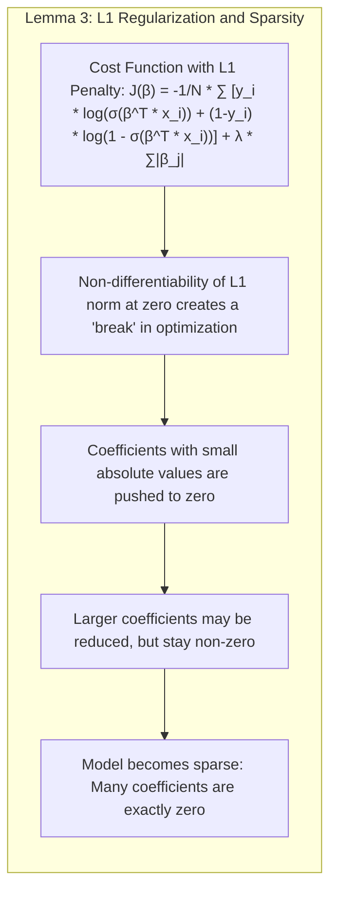
**Declaração:** A penalização L1 adicionada à função de custo da regressão logística promove a esparsidade dos coeficientes, fazendo com que muitos coeficientes se tornem exatamente zero.

**Prova:** A função de custo com penalização L1 é dada por:
 $$J(\beta) = -\frac{1}{N} \sum_{i=1}^N \left[ y_i \log(\sigma(\beta^T x_i)) + (1-y_i) \log(1-\sigma(\beta^T x_i)) \right] + \lambda \sum_{j=1}^p |\beta_j|$$
onde $\sigma$ é a função sigmoide, $\beta$ é o vetor de coeficientes, $x_i$ é a i-ésima observação, $y_i$ é a resposta e $\lambda$ é o parâmetro de regularização. A natureza não diferenciável da norma L1 no zero introduz um "ponto de quebra" no processo de otimização. Coeficientes com valor absoluto muito pequeno serão "empurrados" para zero, enquanto coeficientes maiores podem ser reduzidos, mas permanecerão não nulos. Isso resulta em um modelo onde muitas variáveis têm coeficientes exatamente iguais a zero, resultando num modelo esparso [^8.4.4]. $\blacksquare$

**Corolário 3: Interpretabilidade e Regularização L1**
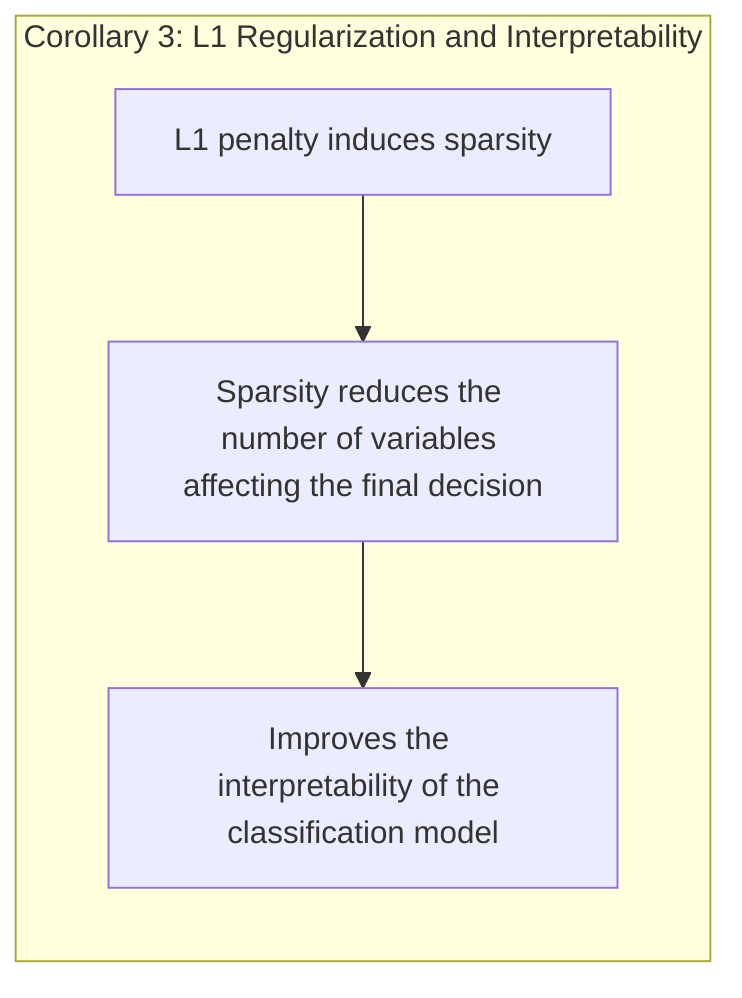
**Declaração:** A esparsidade induzida pela penalização L1 na classificação logística melhora a interpretabilidade do modelo, pois reduz o número de variáveis que afetam a decisão final.

Este corolário destaca uma vantagem importante da regularização L1, onde podemos identificar quais variáveis são as mais relevantes para a classificação, simplificando a análise e compreensão do modelo.

> ⚠️ **Ponto Crucial**: Regularização L1 e L2 são métodos complementares, e a combinação de ambas, como no Elastic Net, pode levar a modelos mais robustos e generalizáveis, de acordo com [^8.5].

### Separating Hyperplanes e Perceptrons
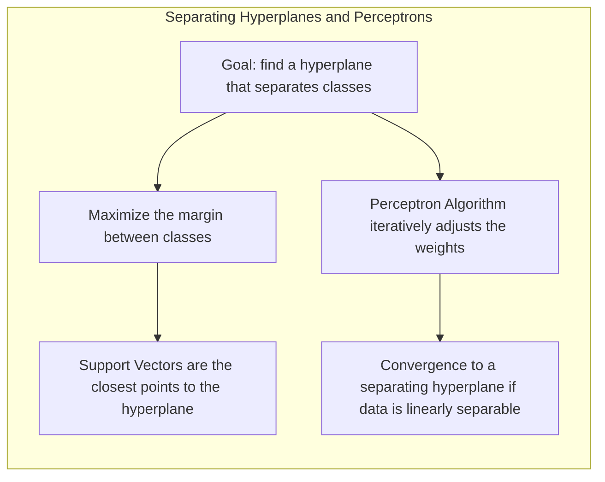
A ideia de **hiperplanos separadores** emerge no contexto de classificação linear como uma forma de separar linearmente as classes [^8.5.2]. O objetivo é encontrar um hiperplano que maximize a **margem** de separação entre as classes, o que corresponde à distância mínima entre o hiperplano e os pontos de dados mais próximos. Os pontos que determinam essa distância são chamados **vetores de suporte** e desempenham um papel crucial na construção do hiperplano. A formulação desse problema de otimização leva a um problema de programação quadrática que pode ser resolvido usando técnicas como o dual de Wolfe [^8.5.2].

O **Perceptron** de Rosenblatt é um algoritmo clássico para encontrar um hiperplano separador. O Perceptron é um classificador linear que aprende iterativamente ajustando os pesos da função discriminante [^8.5.1]. Dada uma amostra de treinamento, o algoritmo começa com um hiperplano aleatório e ajusta os pesos iterativamente, tentando classificar corretamente todas as amost