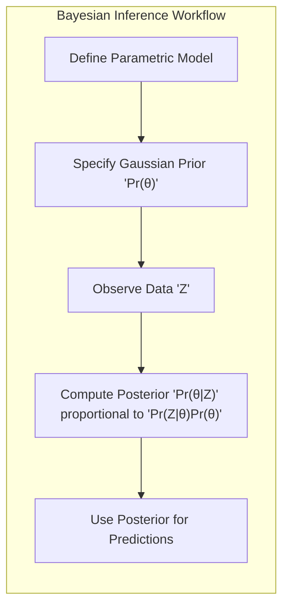
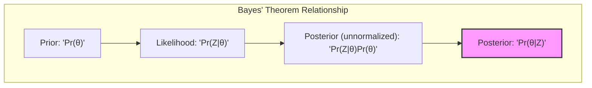
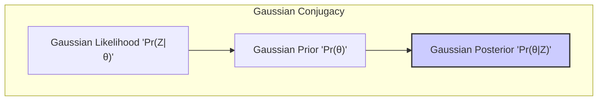
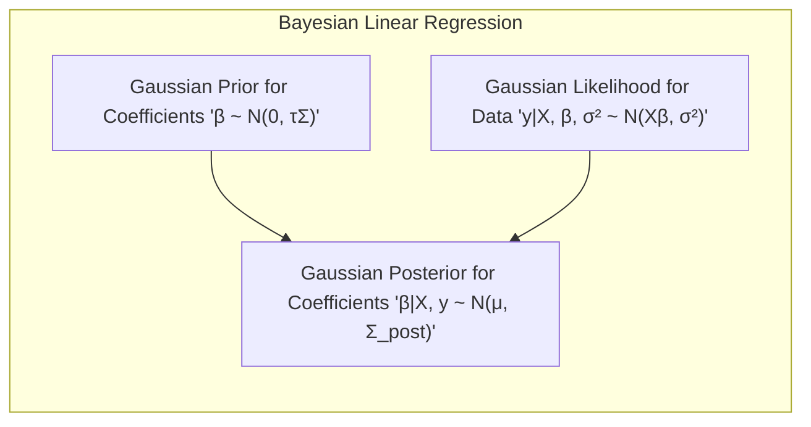
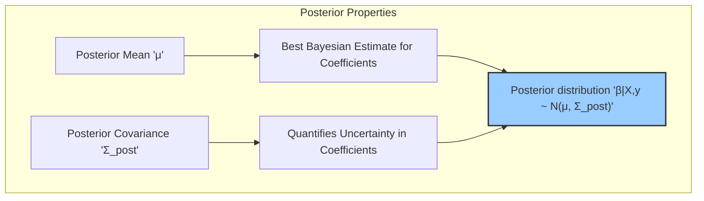
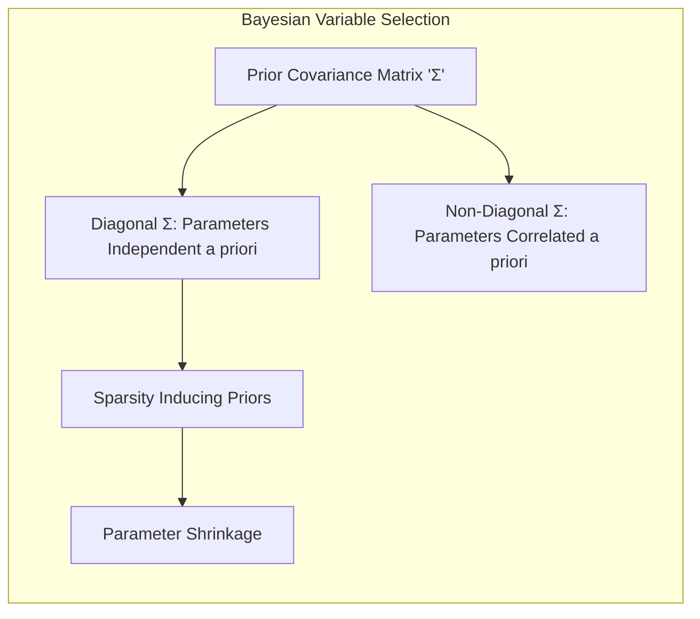
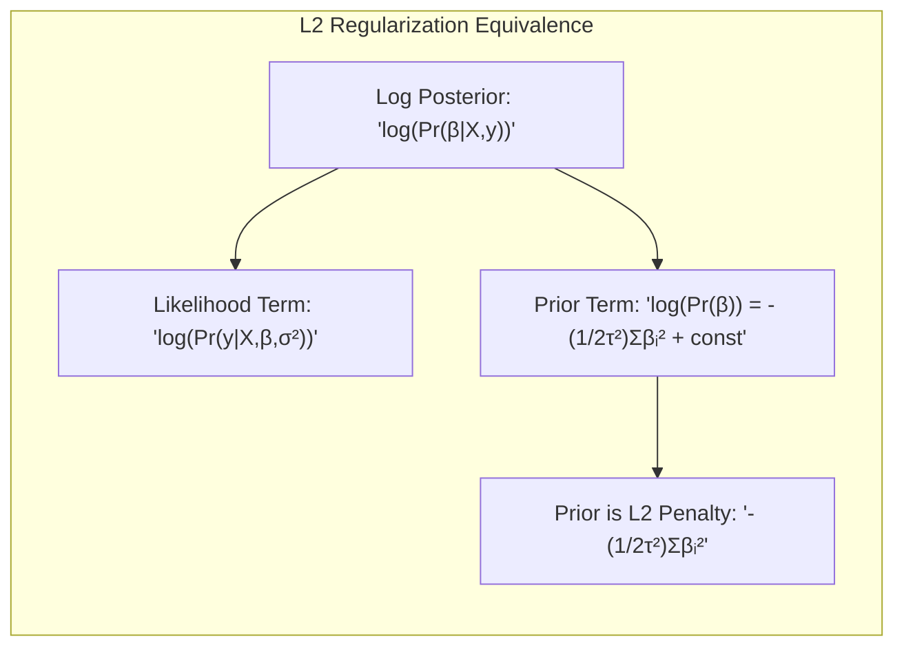
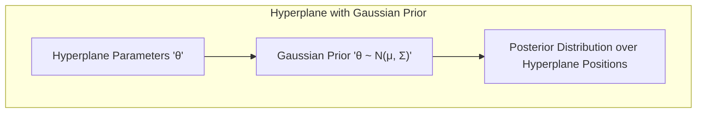

Okay, here's the enhanced version of the text with Mermaid diagrams, focusing on the mathematical and statistical concepts as requested:

## Inferência Bayesiana com Priores Gaussianos



### Introdução

Neste capítulo, exploramos a inferência Bayesiana, uma abordagem para modelagem estatística que incorpora conhecimento prévio na análise de dados [^8.1]. Ao contrário da inferência de máxima verossimilhança, que busca os parâmetros que melhor se ajustam aos dados, a inferência Bayesiana modela a incerteza sobre os parâmetros por meio de uma *distribuição a priori*. Essa abordagem permite quantificar a incerteza e atualizar nossas crenças à medida que observamos novos dados. Um componente crucial da inferência Bayesiana é a especificação de um **prior** adequado, e exploramos o caso em que usamos um **prior Gaussiano** para os parâmetros [^8.3]. Discutimos a fundo como, quando usado em conjunto com dados Gaussianos, um prior Gaussiano resulta em um posterior também Gaussiano, facilitando a análise e a obtenção de previsões.

### Conceitos Fundamentais

**Conceito 1: Inferência Bayesiana e Priores**
Na inferência Bayesiana, especificamos uma distribuição de probabilidade sobre os parâmetros do modelo, antes mesmo de observarmos os dados [^8.3]. Essa distribuição, chamada de **prior**, reflete nosso conhecimento prévio ou crenças sobre os valores dos parâmetros. A inferência Bayesiana combina o *prior* com a verossimilhança dos dados para gerar uma distribuição **posterior**, que representa nosso conhecimento atualizado sobre os parâmetros após a observação dos dados [^8.3]. Em essência, a inferência bayesiana atualiza nossas crenças sobre os parâmetros à luz dos dados observados.

**Lemma 1:** A distribuição posterior é proporcional ao produto do *prior* e da função de verossimilhança, ou seja,
$$Pr(\theta|Z) \propto Pr(Z|\theta)Pr(\theta)$$,
onde $\theta$ representa os parâmetros, $Z$ os dados, $Pr(Z|\theta)$ a verossimilhança e $Pr(\theta)$ o *prior* [^8.3]. Esta relação fundamental forma a base da inferência Bayesiana.



**Conceito 2: Prior Gaussiano**
Um **prior Gaussiano** é um tipo particular de *prior* onde assumimos que os parâmetros são distribuídos de acordo com uma distribuição normal ou gaussiana.  Este tipo de *prior* é amplamente usado devido às suas propriedades de conjugação com a distribuição normal da verossimilhança. O uso do *prior* Gaussiano leva, na maioria dos casos, a um *posterior* Gaussiano, facilitando os cálculos e análises [^8.3]. O *prior* Gaussiano é definido por sua média e sua matriz de covariância [^8.3].  Por exemplo, no contexto de modelos lineares, um *prior* Gaussiano sobre os coeficientes do modelo pode expressar a crença de que eles são, em geral, pequenos e próximos de zero.
   $$ \beta \sim N(0, \tau \Sigma) $$
onde $\beta$ são os coeficientes, $\tau$ é a variância do *prior* e $\Sigma$ é a matriz de correlação *prior* [^8.3].

> 💡 **Exemplo Numérico:** Vamos considerar um modelo de regressão linear simples onde temos um único preditor $x$ e uma variável de resposta $y$. Suponha que temos um *prior* Gaussiano para o coeficiente $\beta$ com média 0 e variância $\tau = 4$, ou seja, $\beta \sim N(0, 4)$. Isso significa que *a priori* acreditamos que o valor de $\beta$ está provavelmente próximo de 0, mas com alguma incerteza (variância de 4).
>
> Se $\Sigma$ for uma matriz identidade, então os parâmetros são independentes *a priori*. Se $\Sigma$ tiver elementos fora da diagonal, então os parâmetros são correlacionados *a priori*.

**Corolário 1:** Quando a verossimilhança é uma função gaussiana e o *prior* é gaussiano, o *posterior* é também uma distribuição gaussiana. A média e a variância do posterior são atualizadas de forma a refletir tanto as informações dos dados quanto as crenças *a priori*. Esta propriedade de conjugação simplifica enormemente a análise Bayesiana, permitindo o cálculo analítico do *posterior* [^8.3].



**Conceito 3: Inferência com Posteriores Gaussianos**
Com um posterior Gaussiano, podemos realizar previsões e análises com relativa facilidade. A média do posterior fornece a estimativa Bayesiana dos parâmetros, enquanto a variância quantifica a incerteza sobre esses parâmetros [^8.3]. Além disso, podemos construir intervalos de credibilidade para os parâmetros, que representam a faixa de valores onde os parâmetros estão localizados com alta probabilidade, de acordo com o nosso *posterior* [^8.3]. Também podemos usar o *posterior* para calcular a *distribuição preditiva*, o que permite quantificar a incerteza das nossas previsões em novos dados [^8.3].

> ⚠️ **Nota Importante**:  A escolha de um *prior* gaussiano, em muitos casos, tem um grande impacto sobre a inferência final, especialmente se temos poucos dados. Um *prior* com uma grande variância indica que temos pouca certeza sobre os parâmetros e permite que os dados influenciem mais fortemente o posterior. Em contraste, um *prior* com uma pequena variância indica uma grande certeza prévia e resulta em um *posterior* menos afetado pelos dados [^8.3].

> ❗ **Ponto de Atenção**:  Em certos casos, a escolha de um *prior* Gaussiano, particularmente em modelos não-lineares, pode levar a complicações em termos da computação do *posterior*. Métodos de aproximação, tais como MCMC, podem ser necessários para amostrar do posterior nessas situações.

> ✔️ **Destaque**: O conceito de *conjugação* entre *prior* gaussiano e verossimilhança gaussiana simplifica enormemente a análise bayesiana.  A análise de modelos lineares com erros gaussianos e *priores* Gaussianos é uma aplicação fundamental desse conceito [^8.3].

### Regressão Linear Bayesiana com Prior Gaussiano



Na regressão linear, assumimos que a variável de resposta *y* é uma combinação linear das variáveis preditoras *x*, mais um erro aleatório.  Em uma abordagem Bayesiana, especificamos um *prior* Gaussiano sobre os coeficientes de regressão $\beta$, e usamos a verossimilhança gaussiana dos dados para obter o *posterior* [^8.3].

A fórmula do modelo de regressão linear pode ser expressa como:

$$y_i = \sum_{j=1}^p x_{ij}\beta_j + \epsilon_i, $$

onde $\epsilon_i \sim N(0, \sigma^2)$. Assumindo que $\beta \sim N(0,\tau\Sigma)$, onde $\tau$ é a variância do prior e $\Sigma$ é a matriz de covariância, obtemos um *posterior* gaussiano para $\beta$.

A atualização do *posterior* pode ser derivada da seguinte forma. Primeiramente, definimos a verossimilhança dos dados como:

$$Pr(y|X, \beta, \sigma^2) = \prod_{i=1}^n \frac{1}{\sqrt{2\pi\sigma^2}} exp\left(-\frac{(y_i-x_i^T\beta)^2}{2\sigma^2}\right)$$

E a priori para os coeficientes é:

$$Pr(\beta) =  \frac{1}{(2\pi)^{p/2}|\tau\Sigma|^{1/2}} exp\left(-\frac{1}{2}\beta^T(\tau\Sigma)^{-1}\beta\right)$$

A *posterior* é proporcional ao produto da verossimilhança e do *prior*:

$$Pr(\beta|X,y) \propto Pr(y|X,\beta,\sigma^2)Pr(\beta)$$

Ao expandir esta equação e juntar os termos, e utilizando o fato que o produto de Gaussianas também é uma Gaussiana, obtemos:

$$Pr(\beta|X,y) \propto  exp\left(-\frac{1}{2}(\beta - \mu)^T\Sigma_{post}^{-1}(\beta - \mu)\right)$$

Onde:

$$ \Sigma_{post} = (\frac{1}{\sigma^2}X^TX + (\tau\Sigma)^{-1})^{-1}$$
$$\mu = \Sigma_{post}(\frac{1}{\sigma^2}X^Ty)$$

Essa é a formulação do *posterior* para a regressão linear Bayesiana, mostrando que a distribuição *posterior* para $\beta$ é uma Gaussiana com média $\mu$ e matriz de covariância $\Sigma_{post}$ [^8.3].

> 💡 **Exemplo Numérico:** Vamos considerar um conjunto de dados com $n=5$ amostras, uma variável preditora $x$ e uma variável de resposta $y$:
>
>   $X = \begin{bmatrix} 1 \\ 2 \\ 3 \\ 4 \\ 5 \end{bmatrix}$, $y = \begin{bmatrix} 2 \\ 3 \\ 5 \\ 6 \\ 8 \end{bmatrix}$
>
>   Vamos assumir $\sigma^2 = 1$, $\tau = 2$, e $\Sigma = [1]$.
>   Então, $X^TX = 1+4+9+16+25 = 55$, $X^Ty = 2+6+15+24+40 = 87$.
>
>   Calculando $\Sigma_{post}$:
>   $\Sigma_{post} = (\frac{1}{1}X^TX + (2[1])^{-1})^{-1} = (55 + 0.5)^{-1} = 1/55.5 \approx 0.018$
>   Calculando $\mu$:
>   $\mu = 0.018 * (\frac{1}{1}X^Ty) =  0.018 * 87 \approx 1.566$
>
>   O *posterior* para $\beta$ é então $\beta \sim N(1.566, 0.018)$. A média *posterior* é 1.566 e a variância *posterior* é 0.018.
>
>   A média do *posterior* ($\mu \approx 1.566$) é a estimativa Bayesiana do coeficiente. A pequena variância ($0.018$) indica que temos maior confiança no valor estimado do que teríamos *a priori*.
>
> ```python
> import numpy as np
>
> # Dados
> X = np.array([[1], [2], [3], [4], [5]])
> y = np.array([2, 3, 5, 6, 8])
>
> # Parâmetros
> sigma2 = 1
> tau = 2
> Sigma = np.array([[1]])
>
> # Cálculos
> XtX = X.T @ X
> XtY = X.T @ y
>
> Sigma_post = np.linalg.inv((1/sigma2) * XtX + np.linalg.inv(tau*Sigma))
> mu = Sigma_post @ ((1/sigma2) * XtY)
>
> print(f"Posterior mean (mu): {mu[0]:.3f}")
> print(f"Posterior variance (Sigma_post): {Sigma_post[0][0]:.3f}")
> ```

**Lemma 2:** A média do *posterior* $\mu$ representa o melhor palpite Bayesiano para os coeficientes de regressão, e a matriz de covariância $\Sigma_{post}$ quantifica a incerteza sobre esses coeficientes.



**Corolário 2:** Quando $\tau \rightarrow \infty$, o *prior* fica não-informativo, e a média do *posterior* $\mu$ se aproxima das estimativas de mínimos quadrados.

> Em alguns cenários, como apontado em [^8.3], a regressão linear Bayesiana com *prior* Gaussiano pode lidar melhor com o problema de *overfitting*, em comparação com uma regressão linear sem *prior*. Isso é porque o *prior* atua como um regularizador que penaliza valores muito grandes para os parâmetros.

> No entanto, há situações em que a regressão linear sem *prior* Gaussiano, de acordo com [^8.1], é suficiente e até mesmo vantajosa quando o objetivo principal é apenas ajustar os dados e não inferir sobre a distribuição dos coeficientes.

### Seleção de Variáveis e Regularização Bayesiana com Prior Gaussiano



O uso de *priores* Gaussianos também pode auxiliar na seleção de variáveis em modelos de regressão [^8.3]. Se a matriz de covariância $\Sigma$ for diagonal, assumimos que os parâmetros são independentes um do outro *a priori*. No entanto, podemos usar *priores* mais complexos para induzir *sparsity*, ou seja, para fazer com que alguns coeficientes sejam exatamente zero [^8.3].

A regularização Bayesiana com priors Gaussianos é uma maneira de controlar a complexidade de modelos, penalizando os parâmetros que assumem valores extremos [^8.3]. Priores gaussianos centrados em zero, por exemplo, levam a um *posterior* que inclina os parâmetros para valores mais próximos a zero, o que é uma forma de regularização [^8.3].

**Lemma 3:** Um *prior* Gaussiano com uma matriz de covariância diagonal e uma variância pequena induz um comportamento similar à regularização L2,  penalizando os parâmetros que assumem valores muito grandes [^8.3].

**Prova do Lemma 3:**
A função de log *posterior*  é dada por:

$$ log(Pr(\beta|X,y)) = log(Pr(y|X,\beta,\sigma^2)) + log(Pr(\beta))$$

O *prior* gaussiano centrado em zero é dado por:

$$Pr(\beta) = \frac{1}{(2\pi)^{p/2}(\tau^2)^{p/2}}exp\left(-\frac{1}{2\tau^2} \sum_{i=1}^p \beta_i^2 \right)$$

$$log(Pr(\beta)) = -\frac{1}{2\tau^2} \sum_{i=1}^p \beta_i^2 + constant $$

O posterior é proporcional a:

$$ Pr(\beta|X,y) \propto exp\left(-\frac{1}{2\sigma^2} \sum_{i=1}^n (y_i-\sum_{j=1}^p x_{ij}\beta_j)^2\right)  exp\left(-\frac{1}{2\tau^2} \sum_{i=1}^p \beta_i^2 \right)$$

Maximizar o posterior equivale a maximizar o seu log, que equivale a minimizar:

$$\frac{1}{2\sigma^2} \sum_{i=1}^n (y_i-\sum_{j=1}^p x_{ij}\beta_j)^2 + \frac{1}{2\tau^2} \sum_{i=1}^p \beta_i^2 $$

A expressão acima mostra que a inclusão de um prior gaussiano com média zero introduz um termo de penalização que tem a mesma forma do termo de regularização L2. Quando a variância $\tau$ do prior gaussiano é pequena, a penalização tem um efeito maior. $\blacksquare$



> 💡 **Exemplo Numérico:** Suponha que temos dois preditores $x_1$ e $x_2$ e desejamos usar um prior gaussiano para regularizar os coeficientes $\beta_1$ e $\beta_2$. Vamos usar um prior Gaussiano com $\tau = 0.5$ para ambos os coeficientes. Isso significa que *a priori* assumimos que os coeficientes estão próximos de zero. A penalidade imposta pelo prior é proporcional a $\sum_{i=1}^2 \beta_i^2$. Se o modelo tender a atribuir um grande valor a $\beta_1$, o termo de penalização aumentará, e o posterior tenderá a reduzir esse valor.
>
> Se tivéssemos um $\tau$ maior, digamos $\tau=100$, o efeito da penalização do prior seria menor, e os dados teriam mais influencia no posterior.

**Corolário 3:** Uma penalidade L1 pode ser induzida usando priors Laplaceanos que levam a posterior com coeficientes esparsos.

> ⚠️ **Ponto Crucial**:  A escolha da variância do *prior* Gaussiano ($\tau$ ) influencia diretamente a força da regularização. Um $\tau$ pequeno resulta em uma regularização mais forte, e um $\tau$ grande resulta em uma regularização mais fraca. A escolha de $\tau$ pode ser feita por métodos como validação cruzada.

### Separação de Hiperplanos e Priores Gaussianos


A ideia de *separating hyperplanes* pode ser enquadrada em um contexto Bayesiano, definindo *priores* sobre os parâmetros que definem os hiperplanos [^8.3]. Em um modelo de *separating hyperplanes*, a fronteira de decisão é definida como um hiperplano que separa as classes de dados, e podemos modelar a incerteza sobre a localização desse hiperplano usando um *prior* Gaussiano [^8.3].

Em um contexto de classificação, o *prior* Gaussiano para os parâmetros do hiperplano pode ser interpretado como uma forma de *regularização*, penalizando hiperplanos que são muito complexos ou que se ajustam muito aos dados de treino [^8.3].

#### Pergunta Teórica Avançada: Como a escolha de um prior Gaussiano para os parâmetros do hiperplano em um modelo de *separating hyperplanes* pode impactar na capacidade de generalização do modelo?

**Resposta:** A escolha de um *prior* Gaussiano, especialmente sua variância, influencia a flexibilidade do modelo de *separating hyperplanes* e, consequentemente, sua capacidade de generalização. Um *prior* com uma variância muito grande permite que o hiperplano adote formas muito diversas, o que pode levar a um *overfitting* aos dados de treino. Isso resultaria em um modelo que se ajusta muito bem aos dados de treino mas tem uma capacidade de generalização pobre a novos dados. Por outro lado, um *prior* com uma variância muito pequena pode levar a um *underfitting* aos dados, resultando em um modelo com pouca flexibilidade e também com uma baixa capacidade de generalização. Um *prior* adequado é, portanto, essencial para equilibrar a complexidade do modelo com a sua capacidade de generalização. A seleção da variância do *prior* pode ser feita por métodos como validação cruzada, de maneira a evitar o *overfitting* e o *underfitting*, e maximizar a generalização do modelo.

**Lemma 4:** A utilização de um *prior* Gaussiano com uma variância apropriada para os parâmetros do hiperplano auxilia na obtenção de um modelo mais robusto e com melhor capacidade de generalização, comparado com modelos sem *prior* que podem sofrer de *overfitting*.

> 💡 **Exemplo Numérico:** Imagine que estamos treinando um classificador linear para separar duas classes de dados em um espaço bidimensional. O hiperplano neste caso é uma linha. Se usarmos um prior Gaussiano com uma grande variância para os parâmetros da linha, o posterior permitirá uma grande variedade de linhas, algumas das quais podem se ajustar perfeitamente aos dados de treino, mas com uma generalização ruim. Se usarmos uma variância pequena, forçaremos o modelo a considerar apenas linhas mais "simples", que podem não se ajustar perfeitamente aos dados de treino mas generalizar melhor.
>
> Este exemplo demonstra que o prior gaussiano atua como um regularizador no contexto de separação de hiperplanos, controlando a complexidade do modelo.

**Corolário 4:** A combinação de um *prior* Gaussiano com o conceito de *separating hyperplanes* leva a uma abordagem Bayesiana para classificação, onde a incerteza sobre a posição do hiperplano é quantificada através da distribuição *posterior*.

### Conclusão
Neste capítulo, exploramos a inferência Bayesiana com *priores* gaussianos. Vimos como um *prior* Gaussiano pode ser utilizado para modelar a incerteza sobre os parâmetros, especialmente no contexto de modelos lineares com erros gaussianos. A capacidade de conjugar *priores* Gaussianos com a verossimilhança gaussiana simplifica a análise e permite que a inferência Bayesiana seja computacionalmente eficiente. A discussão sobre os benefícios da regularização e seleção de variáveis, além do conceito de *separating hyperplanes* demonstraram a versatilidade desta abordagem. Concluímos que a escolha adequada dos *priores* gaussianos, e da sua variância, é um passo fundamental para o sucesso da modelagem Bayesiana.

### Footnotes
[^8.1]: "In this chapter we provide a general exposition of the maximum likelihood approach, as well as the Bayesian method for inference." *(Trecho de Model Inference and Averaging)*
[^8.3]: "In the Bayesian approach to inference, we specify a sampling model Pr(Z|θ) (density or probability mass function) for our data given the parameters, and a prior distribution for the parameters Pr(θ) reflecting our knowledge about θ before we see the data." *(Trecho de Model Inference and Averaging)*
