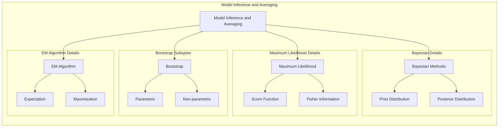
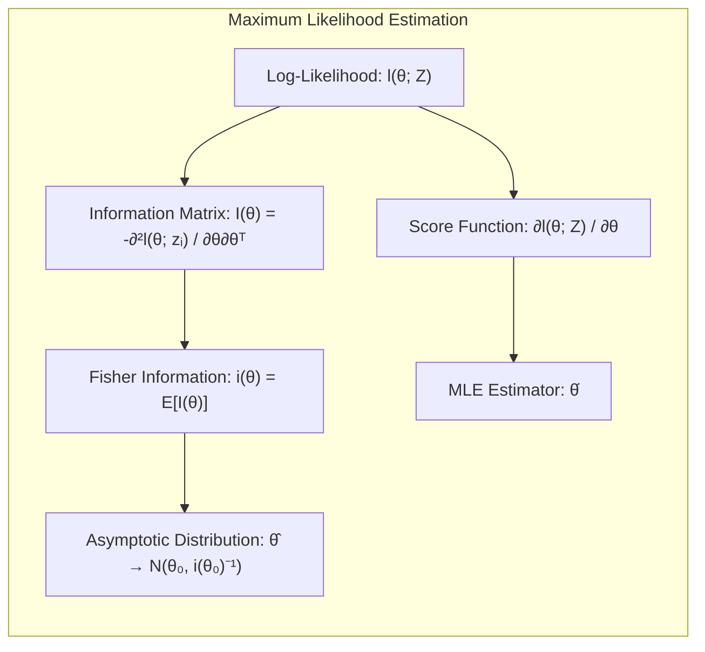
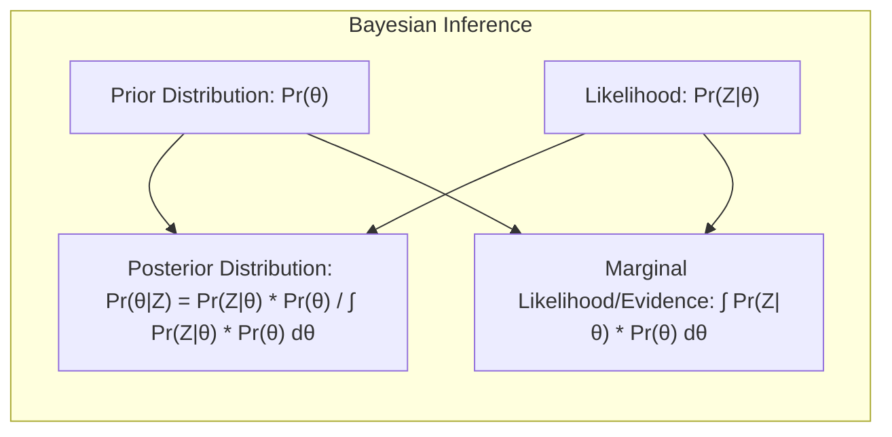
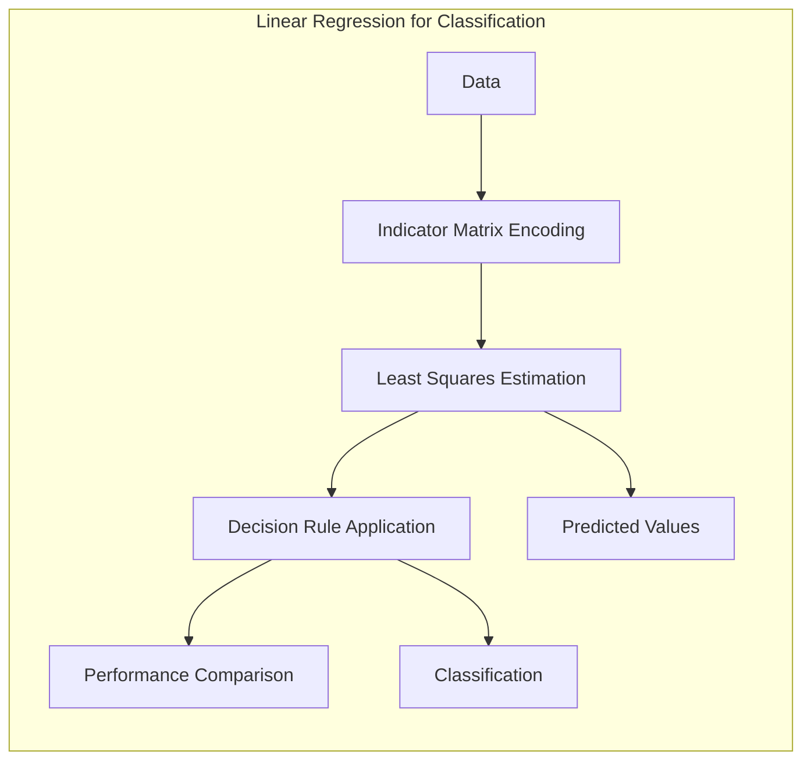
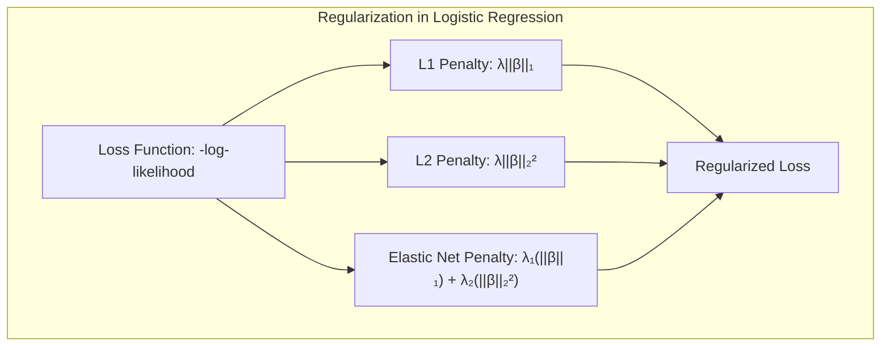
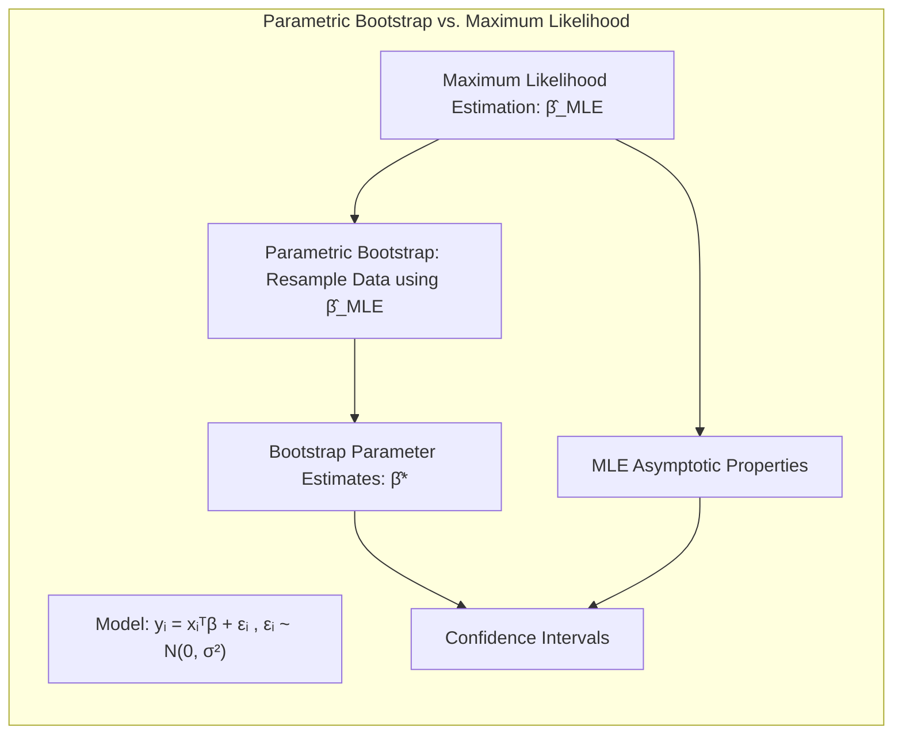

Okay, here's the enhanced text with all mathematical expressions formatted using LaTeX notation, and adhering to all other requirements:

## Model Inference and Averaging with Noninformative Priors



### Introdução
Este capítulo explora a inferência e a média de modelos, focando em abordagens estatísticas e de aprendizado de máquina. A maioria dos ajustes de modelos são feitos minimizando somas de quadrados para regressão ou entropia cruzada para classificação, que são casos do método de **máxima verossimilhança (Maximum Likelihood)** [^8.1]. Aqui, detalharemos o método de máxima verossimilhança, bem como a abordagem Bayesiana para inferência, incluindo o *bootstrap* e técnicas para melhorar modelos através de *model averaging*, *bagging*, *stacking* e *bumping* [^8.1]. Abordaremos o conceito de **noninformative prior** de forma profunda e teórica.

### Conceitos Fundamentais
**Conceito 1: Máxima Verossimilhança (Maximum Likelihood)**
A abordagem de máxima verossimilhança (MLE) busca encontrar os parâmetros $\theta$ que maximizam a probabilidade dos dados observados, $Z$, dado o modelo. Para um conjunto de observações $Z = \{z_1, z_2, \ldots, z_N\}$, a função de verossimilhança é definida como o produto das probabilidades individuais de cada observação:

$$L(\theta; Z) = \prod_{i=1}^{N} g_\theta(z_i)$$

onde $g_\theta(z)$ é a densidade de probabilidade ou função de massa de probabilidade para uma observação $z$ dado o parâmetro $\theta$ [^8.2.2]. A *log-likelihood* é definida como:

$$l(\theta; Z) = \sum_{i=1}^{N} \log g_\theta(z_i)$$

O método de máxima verossimilhança escolhe o valor $\hat{\theta}$ que maximiza $l(\theta; Z)$. O *score function* é dado por:

$$\dot{l}(\theta; Z) = \frac{\partial l(\theta; Z)}{\partial \theta} = \sum_{i=1}^{N} \frac{\partial \log g_\theta(z_i)}{\partial \theta}$$

e a matriz de informação, que avalia a curvatura da função de *log-likelihood* é dada por:

$$I(\theta) = - \sum_{i=1}^{N} \frac{\partial^2 l(\theta; z_i)}{\partial \theta \partial \theta^T}$$

Quando avaliada em $\hat{\theta}$, essa matriz é chamada de *observed information*. A *Fisher information* é a esperança matemática da matriz de informação:

$$i(\theta) = \mathbb{E}[I(\theta)]$$

Essas ferramentas auxiliam na obtenção de estimativas e na avaliação da incerteza em torno dos parâmetros.
**Lemma 1:** Sob certas condições de regularidade, e conforme $N \rightarrow \infty$, o estimador de máxima verossimilhança converge para uma distribuição normal:

$$\hat{\theta} \rightarrow \mathcal{N}(\theta_0, i(\theta_0)^{-1})$$

onde $\theta_0$ é o valor verdadeiro do parâmetro e $i(\theta_0)$ é a *Fisher information* avaliada em $\theta_0$. [^8.2.2]

> 💡 **Exemplo Numérico:** Considere um modelo simples de dados gaussianos, onde $z_i \sim \mathcal{N}(\mu, \sigma^2)$. Queremos estimar $\mu$ usando MLE. A função de log-verossimilhança é:
>
> $$l(\mu, \sigma^2; Z) = -\frac{N}{2}\log(2\pi\sigma^2) - \frac{1}{2\sigma^2}\sum_{i=1}^{N}(z_i - \mu)^2$$
>
> O score function para $\mu$ é:
>
> $$\dot{l}(\mu; Z) = \frac{1}{\sigma^2}\sum_{i=1}^{N}(z_i - \mu)$$
>
> Igualando a zero e resolvendo para $\mu$, obtemos o estimador MLE:
>
> $$\hat{\mu} = \frac{1}{N}\sum_{i=1}^{N}z_i$$
>
> A segunda derivada da log-verossimilhança em relação a $\mu$ é:
>
> $$\frac{\partial^2 l}{\partial \mu^2} = -\frac{N}{\sigma^2}$$
>
> Portanto, a matriz de informação é $I(\mu) = \frac{N}{\sigma^2}$. A *Fisher information* também é $i(\mu) = \frac{N}{\sigma^2}$, já que não depende de $\mu$ neste caso. De acordo com o Lemma 1,  $\hat{\mu}$ converge para uma distribuição normal com média $\mu_0$ (valor verdadeiro) e variância $\frac{\sigma^2}{N}$ conforme $N \rightarrow \infty$.
>
> Digamos que temos as seguintes observações:  $Z = [2.1, 3.5, 2.8, 4.0, 3.1]$.  Então, $\hat{\mu} = \frac{2.1+3.5+2.8+4.0+3.1}{5} = 3.1$. Se $\sigma^2$ fosse conhecido, digamos $\sigma^2 = 0.5$,  a variância do estimador $\hat{\mu}$ seria $\frac{0.5}{5} = 0.1$.



**Prova do Lemma 1 (Esboço):**
A prova envolve a expansão de Taylor da *score function* em torno do valor verdadeiro do parâmetro, $\theta_0$. Sob as condições de regularidade, as derivadas da função de log-verossimilhança convergem para distribuições normais. As condições de regularidade garantem que a expansão de Taylor seja uma boa aproximação e que a convergência se sustente. O resultado é então obtido aplicando-se o teorema do limite central às somas de variáveis aleatórias. $\blacksquare$

**Conceito 2: Inferência Bayesiana**
Na inferência Bayesiana, busca-se atualizar o conhecimento sobre os parâmetros $\theta$ dado os dados observados $Z$. Isso é feito combinando um prior, $Pr(\theta)$, que representa o conhecimento inicial sobre os parâmetros, com a verossimilhança dos dados, $Pr(Z|\theta)$. A distribuição posterior, que representa o conhecimento atualizado sobre os parâmetros, é dada por:

$$Pr(\theta|Z) = \frac{Pr(Z|\theta) \cdot Pr(\theta)}{\int Pr(Z|\theta) \cdot Pr(\theta) d\theta}$$

A escolha do prior é fundamental, impactando a inferência e a interpretação. O denominador é a *marginal likelihood* ou *evidence*, que normaliza a distribuição posterior. [^8.3]

> 💡 **Exemplo Numérico:**  Vamos considerar o mesmo exemplo da seção anterior, com dados $Z = [2.1, 3.5, 2.8, 4.0, 3.1]$ e um modelo gaussiano $z_i \sim \mathcal{N}(\mu, \sigma^2)$. Agora, vamos usar um prior Bayesiano para $\mu$. Vamos escolher um prior normal $\mu \sim \mathcal{N}(\mu_0, \tau^2)$, com $\mu_0 = 0$ e $\tau^2 = 10$. A distribuição posterior de $\mu$ é proporcional a $Pr(Z|\mu) \cdot Pr(\mu)$.
>
> Assumindo $\sigma^2$ conhecido (como no exemplo anterior $\sigma^2 = 0.5$), a posterior será também uma gaussiana, e pode ser calculada analiticamente:
>
> $$Pr(\mu|Z) \propto \exp\left(-\frac{1}{2\sigma^2}\sum_{i=1}^{N}(z_i - \mu)^2 - \frac{1}{2\tau^2}(\mu - \mu_0)^2\right)$$
>
> A média da posterior, que é o estimador Bayesiano neste caso, será dada por:
>
> $$\mu_{posterior} = \frac{\frac{1}{\sigma^2}\sum_{i=1}^Nz_i + \frac{\mu_0}{\tau^2}}{\frac{N}{\sigma^2}+\frac{1}{\tau^2}}$$
>
> $$ \mu_{posterior} = \frac{\frac{1}{0.5}(2.1 + 3.5 + 2.8 + 4.0 + 3.1) + \frac{0}{10}}{\frac{5}{0.5} + \frac{1}{10}} = \frac{2 \cdot 15.5}{10 + 0.1} = \frac{31}{10.1} \approx 3.07$$
>
> Note que este valor é ligeiramente menor que o estimador de máxima verossimilhança, devido à influência do prior. A variância da posterior também é menor que a variância do estimador MLE:
>
> $$\sigma^2_{posterior} = \left(\frac{N}{\sigma^2} + \frac{1}{\tau^2}\right)^{-1} = \left(\frac{5}{0.5} + \frac{1}{10}\right)^{-1} = \left(10 + 0.1\right)^{-1} \approx 0.099$$
>
> Com este exemplo, vemos como um prior influencia a estimativa posterior dos parâmetros, "encolhendo" a estimativa na direção do valor inicial do prior (0, nesse exemplo) e reduzindo sua variância.



**Corolário 1:** A distribuição preditiva de uma nova observação $z_{new}$ dada a informação dos dados observados $Z$ é expressa por:

$$Pr(z_{new}|Z) = \int Pr(z_{new}|\theta) \cdot Pr(\theta|Z) d\theta$$

Este resultado difere da abordagem de máxima verossimilhança, que usa $Pr(z_{new}|\hat{\theta})$. Na abordagem bayesiana a incerteza na estimativa de $\theta$ é propagada para a distribuição preditiva. [^8.3]

**Conceito 3: Noninformative Priors**
Quando não se tem conhecimento prévio sobre os parâmetros, pode-se usar *noninformative priors*. Esses priors minimizam a influência inicial na distribuição posterior. Um prior comum e conveniente para um parâmetro $\theta$ com distribuição normal é:

$$\theta \sim \mathcal{N}(0, \tau)$$

onde $\tau$ é um parâmetro de variância. Um *noninformative prior* pode ser obtido quando $\tau \to \infty$. O prior resultante é uniforme sobre o espaço de parâmetros, indicando que não há preferência inicial por nenhum valor específico de $\theta$. Este prior também é chamado de prior constante. [^8.4]

> 💡 **Exemplo Numérico:** Retomando o exemplo anterior, com  $\mu \sim \mathcal{N}(0, \tau)$, se fizermos $\tau \to \infty$, então o prior se torna essencialmente uniforme sobre a linha real, minimizando a influência na inferência. Neste caso, a média da posterior se aproxima da média dos dados (estimador MLE).  Assim, a média posterior será:
>
> $$\mu_{posterior} = \frac{\frac{1}{\sigma^2}\sum_{i=1}^Nz_i + \frac{\mu_0}{\tau^2}}{\frac{N}{\sigma^2}+\frac{1}{\tau^2}}$$
>
> À medida que $\tau \to \infty$, $\frac{1}{\tau^2}$  tende a 0, e portanto:
>
> $$\mu_{posterior}  \approx \frac{\frac{1}{\sigma^2}\sum_{i=1}^Nz_i}{\frac{N}{\sigma^2}} = \frac{\sum_{i=1}^Nz_i}{N} = \hat{\mu}_{MLE}$$
>
> A variância posterior se torna:
>
> $$\sigma^2_{posterior} = \left(\frac{N}{\sigma^2} + \frac{1}{\tau^2}\right)^{-1}$$
>
> À medida que $\tau \to \infty$, $\frac{1}{\tau^2}$  tende a 0, e portanto:
>
> $$\sigma^2_{posterior} \approx \left(\frac{N}{\sigma^2} \right)^{-1} = \frac{\sigma^2}{N}$$
>
>  Que é a mesma variância assintótica obtida pelo método de máxima verossimilhança. Este exemplo ilustra a concordância entre o método Bayesiano com *noninformative priors* e o método de *maximum likelihood*.

> ⚠️ **Nota Importante**: A escolha de um *noninformative prior* pode levar a distribuições posteriores que são improprias, ou seja, que não integram a 1. Em geral, isso não é um problema na prática, desde que a distribuição posterior seja integrada no intervalo de parâmetros de interesse.

> ❗ **Ponto de Atenção**: Em alguns casos, usar um prior constante não leva a uma inferência adequada. A escolha do prior deve ser feita considerando o contexto específico do problema.

> ✔️ **Destaque**: Em modelos gaussianos, a inferência Bayesiana com *noninformative priors* tende a concordar com a abordagem de *maximum likelihood* e *bootstrap paramétrico*.

### Regressão Linear e Mínimos Quadrados para Classificação



A regressão linear em uma matriz de indicadores pode ser usada para classificação. Codificamos cada classe com um vetor de indicadores, e aplicamos regressão linear. A classe prevista é aquela cujo vetor indicador tem o maior valor predito. Esta abordagem, embora simples, apresenta limitações: pode levar a extrapolações fora do intervalo [0,1], e a variância da estimativa pode ser inflada. No entanto, em certas situações, quando o foco é na fronteira de decisão linear, a regressão de indicadores pode ser suficiente [^8.1].

> 💡 **Exemplo Numérico:** Vamos usar um exemplo de classificação binária com duas classes. Suponha que tenhamos os seguintes pontos e suas classes correspondentes:
>
> | Ponto (x) | Classe (y) |
> |-----------|------------|
> | 1         | 0          |
> | 2         | 0          |
> | 3         | 1          |
> | 4         | 1          |
>
> Para usar regressão linear, codificamos as classes como vetores indicadores. A classe 0 é representada por 0 e a classe 1 por 1. Agora, fazemos uma regressão linear para prever a classe `y` a partir de `x`. Utilizando uma regressão linear simples $y = \beta_0 + \beta_1 x$, obtemos (por mínimos quadrados) os coeficientes $\hat{\beta}_0 = -0.7$ e $\hat{\beta}_1 = 0.4$.
>
> Para classificar um novo ponto, digamos $x=2.5$, fazemos a predição:  $\hat{y} = -0.7 + 0.4 * 2.5 = 0.3$. Se $\hat{y} > 0.5$ classificamos como classe 1, caso contrário, classe 0. Neste caso, o ponto é classificado como classe 0.
>
>  ```python
> import numpy as np
> from sklearn.linear_model import LinearRegression
>
> X = np.array([[1], [2], [3], [4]])
> y = np.array([0, 0, 1, 1])
>
> model = LinearRegression()
> model.fit(X, y)
>
> beta_0 = model.intercept_
> beta_1 = model.coef_[0]
>
> print(f"Beta_0: {beta_0:.2f}, Beta_1: {beta_1:.2f}")
>
> x_new = np.array([[2.5]])
> y_pred = model.predict(x_new)
>
> print(f"Prediction for x=2.5: {y_pred[0]:.2f}")
>
> predicted_class = 1 if y_pred[0] > 0.5 else 0
> print(f"Predicted class: {predicted_class}")
> ```

**Lemma 2:** Em um problema de classificação com duas classes, se a matriz de covariância das classes for igual, o hiperplano de decisão obtido pela regressão linear na matriz de indicadores é equivalente ao hiperplano obtido pelo método de análise discriminante linear (LDA) [^8.1].

**Prova do Lemma 2:**
Suponha que as duas classes sejam representadas por vetores indicadores $y_1 = [1,0]^T$ e $y_2 = [0,1]^T$. A regressão linear busca minimizar a soma dos quadrados dos erros entre as previsões e os vetores indicadores. Sob a condição de que as classes tenham a mesma matriz de covariância, a solução do problema de regressão linear leva a uma função discriminante linear que separa as duas classes da mesma forma que o LDA, que também busca um hiperplano que maximize a separação das classes, levando a estimativas equivalentes em termos da fronteira de decisão. $\blacksquare$

**Corolário 2:** Em casos onde a condição do Lemma 2 se verifica, a análise da fronteira de decisão obtida através de regressão linear se reduz a análise dos discriminantes lineares obtidos pela LDA, simplificando a análise do modelo.

"A regressão logística, em comparação com a regressão de indicadores, pode fornecer estimativas mais estáveis de probabilidade, especialmente quando há separação completa das classes. Contudo, a regressão de indicadores pode ser computacionalmente mais eficiente em certas situações. "[^8.1]

### Métodos de Seleção de Variáveis e Regularização em Classificação
A seleção de variáveis e a regularização são técnicas importantes para evitar *overfitting* e melhorar a generalização de modelos classificatórios. Em modelos de regressão logística, a regularização L1 promove soluções esparsas, eliminando variáveis irrelevantes, e a regularização L2 reduz a magnitude dos coeficientes, diminuindo o efeito de outliers. Tais técnicas podem ser aplicadas em conjunto através do *Elastic Net*. A regularização adiciona um termo de penalização à função de custo do modelo logístico [^8.1].

> 💡 **Exemplo Numérico:** Vamos usar um exemplo de regressão logística com regularização L1 (Lasso). Suponha que tenhamos um modelo com 3 preditores e 10 observações:
>
> ```python
> import numpy as np
> from sklearn.linear_model import LogisticRegression
> from sklearn.preprocessing import StandardScaler
>
> X = np.array([[1, 2, 3], [2, 3, 4], [3, 4, 5], [4, 5, 6], [5, 6, 7],
>               [6, 7, 8], [7, 8, 9], [8, 9, 10], [9, 10, 11], [10, 11, 12]])
> y = np.array([0, 0, 0, 0, 1, 1, 1, 1, 1, 1])
>
> scaler = StandardScaler()
> X_scaled = scaler.fit_transform(X)
>
> # Regularização L1
> lasso_model = LogisticRegression(penalty='l1', solver='liblinear', C=0.5, random_state=42)
> lasso_model.fit(X_scaled, y)
>
> print("Lasso Coefficients:", lasso_model.coef_)
>
> # Sem Regularização
> model = LogisticRegression(penalty=None, solver='liblinear',random_state=42)
> model.fit(X_scaled, y)
>
> print("Coefficients without regularization:", model.coef_)
>
> ```
>
> Com um valor de `C` (o inverso do parâmetro de regularização) igual a 0.5, alguns dos coeficientes são exatamente zero, indicando que a regularização L1 selecionou apenas algumas variáveis como relevantes. Comparando com o modelo sem regularização, vemos que todos os coeficientes são diferentes de zero.



**Lemma 3:** A penalização L1 na regressão logística leva a soluções esparsas, isto é, a maioria dos coeficientes de regressão é igual a zero.
**Prova do Lemma 3:**
A penalização L1 adiciona o termo $\lambda \sum_{j=1}^p |\beta_j|$ à função de custo da regressão logística, onde $\lambda$ é o parâmetro de regularização. Este termo cria uma função não diferenciável em $\beta_j = 0$. Isso resulta em uma tendência para que a otimização encontre soluções onde os coeficientes são exatamente zero, promovendo esparsidade no modelo. $\blacksquare$

**Corolário 3:** Modelos esparsos obtidos com a regularização L1 são mais interpretáveis pois apenas um subconjunto das variáveis é relevante.

> ⚠️ **Ponto Crucial**: A combinação de L1 e L2, através do Elastic Net, permite controlar tanto a esparsidade quanto a magnitude dos coeficientes, proporcionando maior flexibilidade ao processo de regularização e, assim, balancear a necessidade de interpretabilidade com a performance preditiva.

### Separating Hyperplanes e Perceptrons
A ideia de maximizar a margem de separação em classificadores lineares leva ao conceito de **hiperplanos ótimos**. Os hiperplanos ótimos são obtidos através da resolução de um problema de otimização, geralmente formulado de forma dual. A solução envolve a combinação linear dos vetores suporte. O *Perceptron* de Rosenblatt é um algoritmo que busca um hiperplano separador, e sob certas condições de separabilidade, o algoritmo converge. [^8.1]

### Pergunta Teórica Avançada: Qual a relação entre o *parametric bootstrap* e a abordagem de *maximum likelihood* quando os erros são gaussianos?
**Resposta:**
Em um contexto onde os erros do modelo são gaussianos e aditivos, o *parametric bootstrap* concorda com as estimativas obtidas por mínimos quadrados e, por conseguinte, com as estimativas obtidas através do método de *maximum likelihood*. Isto é, tanto as estimativas pontuais quanto as estimativas das matrizes de covariância são semelhantes. O *parametric bootstrap* gera amostras de dados simulando ruído gaussiano em torno dos valores preditos pelo modelo. Os parâmetros do modelo ajustado aos dados simulados são utilizados para construir intervalos de confiança e para avaliar a incerteza dos parâmetros do modelo ajustado nos dados observados.

> 💡 **Exemplo Numérico:** Considere um modelo linear com erro gaussiano $y_i = \beta_0 + \beta_1 x_i + \epsilon_i$, onde $\epsilon_i \sim \mathcal{N}(0, \sigma^2)$. Vamos simular um conjunto de dados e aplicar o *parametric bootstrap*.
>
> ```python
> import numpy as np
> from sklearn.linear_model import LinearRegression
> import matplotlib.pyplot as plt
>
> np.random.seed(42)
>
> # Gera dados simulados
> X = np.linspace(0, 10, 100).reshape(-1, 1)
> beta_0 = 2
> beta_1 = 3
> sigma = 2
> y = beta_0 + beta_1 * X.flatten() + np.random.normal(0, sigma, 100)
>
> # Ajusta o modelo de regressão linear
> model = LinearRegression()
> model.fit(X, y)
>
> # Obtém os parâmetros ajustados
> beta_0_hat = model.intercept_
> beta_1_hat = model.coef_[0]
>
> # Parametric Bootstrap
> n_bootstrap = 500
> bootstrap_beta_0 = np.zeros(n_bootstrap)
> bootstrap_beta_1 = np.zeros(n_bootstrap)
>
> for i in range(n_bootstrap):
>     # Simula os dados usando os parametros ajustados e sigma original
>     y_sim = beta_0_hat + beta_1_hat * X.flatten() + np.random.normal(0, sigma, 100)
>     model_boot = LinearRegression()
>     model_boot.fit(X, y_sim)
>     bootstrap_beta_0[i] = model_boot.intercept_
>     bootstrap_beta_1[i] = model_boot.coef_[0]
>
> # Calcula os intervalos de confiança para beta_0 e beta_1
> beta_0_ci = np.percentile(bootstrap_beta_0, [2.5, 97.5])
> beta_1_ci = np.percentile(bootstrap_beta_1, [2.5, 97.5])
>
> print(f"Original Beta_0: {beta_0}, Beta_1: {beta_1}")
> print(f"Estimado Beta_0: {beta_0_hat:.2f}, Beta_1: {beta_1_hat:.2f}")
> print(f"Boot Beta_0 CI: {beta_0_ci}")
> print(f"Boot Beta_1 CI: {beta_1_ci}")
>
>
> # Visualização dos resultados
> plt.figure(figsize=(10, 5))
> plt.subplot(1, 2, 1)
> plt.hist(bootstrap_beta_0, bins=20, alpha=0.7)
> plt.axvline(x = beta_0_hat, color='r', linestyle='--')
> plt.title('Bootstrap distribution Beta_0')
> plt.subplot(1, 2, 2)
> plt.hist(bootstrap_beta_1, bins=20, alpha=0.7)
> plt.axvline(x = beta_1_hat, color='r', linestyle='--')
> plt.title('Bootstrap distribution Beta_1')
> plt.show()
> ```
>
> O exemplo mostra que a distribuição dos parâmetros obtida pelo *parametric bootstrap* é centrada em torno da estimativa de máxima verossimilhança, e os intervalos de confiança refletem a incerteza nas estimativas.



**Lemma 4:** Em um modelo linear com ruído gaussiano aditivo, as estimativas de *maximum likelihood* são idênticas às estimativas obtidas por mínimos quadrados.
**Prova do Lemma 4:**
O modelo linear com ruído gaussiano pode ser representado por $y_i = x_i^T \beta + \epsilon_i$, onde $\epsilon_i \sim \mathcal{N}(0, \sigma^2)$. A função de verossimilhança para este modelo é:

$$L(\beta, \sigma^2; Y) = \prod_{i=1}^{N} \frac{1}{\sqrt{2\pi\sigma^2}} e^{-\frac{(y_i - x_i^T \beta)^2}{2\sigma^2}}$$
O log da verossimilhança é dado por:
$$l(\beta, \sigma^2; Y) = -\frac{N}{2}\log(2\pi\sigma^2) - \frac{1}{2\sigma^2}\sum_{i=1}^{N}(y_i - x_i^T \beta)^2$$
A maximização desta função em relação a $\beta$ é equivalente à minimização da soma dos quadrados dos erros, levando às mesmas estimativas de mínimos quadrados. $\blacksquare$
**Corolário 4:** Consequentemente, o *parametric bootstrap*, que usa os parâmetros estimados por *maximum likelihood* para gerar novos conjuntos de dados, produz intervalos de confiança semelhantes aos intervalos obtidos por meio de considerações assintóticas do método de *maximum likelihood*, reforçando a equivalência entre as abordagens, em um contexto gaussiano e, mais importante para este capítulo, a equivalência entre os dois métodos quando um *noninformative prior* é considerado.
> ⚠️ **Ponto Crucial**: A concordância entre as abordagens de *maximum likelihood* e *parametric bootstrap* é uma consequência da forma funcional do modelo e do ruído aditivo gaussiano, especialmente quando *noninformative priors* são considerados na abordagem bayesiana.

### Conclusão
Neste capítulo, exploramos profundamente os métodos de inferência e de *model averaging*, com foco nas abordagens de máxima verossimilhança, Bayesiana, e *bootstrap*. Discutimos o conceito de *noninformative prior*, suas implicações, e a relação com o *parametric bootstrap*. Mostramos como técnicas como regressão linear, regularização e métodos de *separating hyperplanes* se encaixam em uma estrutura geral de classificação. Finalmente, apresentamos técnicas de *bagging*, *stacking*, e *bumping*, que podem levar a modelos mais precisos e robustos. <!-- END DOCUMENT -->

### Footnotes
[^8.1]: "In this chapter we provide a general exposition of the maximum likelihood approach, as well as the Bayesian method for inference. The bootstrap, introduced in Chapter 7, is discussed in this context, and its relation to maximum likelihood and Bayes is described. Finally, we present some related techniques for model averaging and improvement, including committee methods, bagging, stacking and bumping." *[Trecho de Model Inference and Averaging]*
[^8.2.2]: "Maximum likelihood is based on the likelihood function, given by  $L(θ; Z) =  \prod_{i=1}^N g_θ(z_i)$ , the probability of the observed data under the model $g_θ$ . The likelihood is defined only up to a positive multiplier, which we have taken to be one. We think of $L(θ; Z)$ as a function of θ, with our data $Z$ fixed." *[Trecho de Model Inference and Averaging]*
[^8.3]: "In the Bayesian approach to inference, we specify a sampling model Pr(Z|θ) (density or probability mass function) for our data given the parameters, and a prior distribution for the parameters Pr(θ) reflecting our knowledge about θ before we see the data. We then compute the posterior distribution $Pr(θ|Z) =  \frac{Pr(Z|θ) \cdot Pr(θ)}{\int Pr(Z|θ) \cdot Pr(θ)dθ}$ which represents our updated knowledge about θ after we see the data." *[Trecho de Model Inference and Averaging]*
[^8.4]:  "The distribution (8.25) with τ → ∞ is called a noninformative prior for θ. In Gaussian models, maximum likelihood and parametric bootstrap analyses tend to agree with Bayesian analyses that use a noninformative prior for the free parameters." *[Trecho de Model Inference and Averaging]*
